# 2021年度 モニタリングサイト 1000 サンゴ礁調査 報告書

令和 4(2022)年3月 環境省自然環境局 生物多様性センター

#### 【主なサンゴ礁域】

- 主なサンゴ礁域では、新規加入や生残群体の成長によって、昨年度から平均サン ゴ被度が増加したのは5サイト(沖縄島・東岸、慶良間諸島、石垣島・西岸、石 西礁湖・中央部、西表島と周辺離島)であった。平均サンゴ被度が昨年度より減 少したサイトはなかった。
- 沖縄島・東岸(サイト 4)ではサンゴ被度の増加や少ないながらも小型群体の加入 が進み、平均サンゴ被度が 10 ポイント増加して 40%になっていた。
- 慶良間諸島(サイト 7)では目立ったかく乱がなく順調にサンゴが回復したため、 平均サンゴ被度が 10 ポイント増加して 40%となっていた。
- 石垣島・西岸(サイト 12)では昨年度に引き続き平均サンゴ被度が 10 ポイント増 加して 40%となり、2016 年の白化現象による被害から回復してきていた。
- 石西礁湖・中央部及び西表島と周辺離島(サイト 15 及び 17)では、平均サンゴ被 度が 10 ポイント増加してそれぞれ 30、50%となり、2016 年の白化現象による被 害から回復しつつあった。

#### 【高緯度サンゴ群集域】

- 高被度サンゴ群集域では、昨年度から平均サンゴ被度が増加したのは 2 サイト(鹿 児島南部沿岸、天草周辺)、減少したのは 1 サイト(四国南西岸)、昨年度と同じ 被度が 3 サイト(館山、串本周辺、屋久島・種子島周辺)であった。
- 四国南西岸(サイト 22)ではオニヒトデによる食害を受け、平均サンゴ被度は昨 年度から 10 ポイント減少して 20%となっていた。
- 鹿児島県南部沿岸(サイト 23)では台風やオニヒトデの食害などの大きなかく乱 はなく、昨年度の台風の被害から回復したことで、平均サンゴ被度が 10 ポイント 増加して 20%となっていた。
- 館山(サイト 19)、串本周辺(サイト 20)、屋久島・種子島周辺(サイト 1)の 3 サイトでは目立ったかく乱はなく、平均サンゴ被度の変化は見られず、サンゴの 状態は良好に維持されていた。
- 天草周辺(サイト 24)では、平均サンゴ被度が 10 ポイント増加していたが、観察 範囲のズレによるもので、サンゴの状態は昨年から大きな変化はないと考えられ た。

# SUMMARY

# [Coral Reef Area]

- All five Coral Reef Area sites (East Coast of Okinawa Island, Kerama Islands, West Coast of Ishigaki Island, Central Sekisei Lagoon, and Iriomote Island) showed coral cover increase because of new recruitment and growth of existing coral communities. No site showed decrease of coral cover.
- Average coral cover of East Coast of Okinawa Island was 40% in FY 2021, an increase of 10% from the previous year because of the growth of individual colonies and new recruitment of juveniles.
- Average coral cover of Kerama Islands was 40% in FY 2021, showing an increase of 10% from the previous year. No significant disturbances prevented this recovery.
- Average coral cover of West Coast of Ishigaki Island was 40%, an increase of 10% from the previous year. It indicated coral recovery from the bleaching damage in 2016.
- Average coral cover at Central Sekisei Lagoon and Iriomote Islands were 30% and 50% respectively, an increase of 10% from the previous year. This may indicate recovery from bleaching damage in 2016.

### [High Latitude Coral Community Area]

- Two sites (Kagoshima Southern Coast and Amakusa) showed increase, 1 site (Shikoku Southern West Coast) showed decrease and 3 sites (Tateyama, Kushimoto, Yaku and Tanegashima Islands) showed similar coral cover to the previous year in the High Latitude Coral Community Area.
- Average coral cover of Shikoku Southern West Coast was 20%, a decrease of 10% from the previous year because of predation by *Acanthaster planci*.
- Average coral cover at Kagoshima Southern Coast was 20%, an increase of 10% from the previous year because of recovery from typhoon damage and no further major disturbances from typhoon and *Acanthaster*.
- No *Acanthaster* and *Drupella* outbreaks were recorded at Tateyama, which is generally characterized by a healthy coral community with low coral cover, similar to the previous year.
- Average coral cover of Tateyama, Kushimoto, Yaku and Tanegashima Islands were like the previous year

without any major disturbances, and may indicate the healthy condition of the coral communities.

 Average coral cover of Amakusa showed an increase of 10% from the previous year. However, this may be attributed to biased sampling by new observers. Coral cover could be similar to the previous year.

# 2021 年度モニタリングサイト 1000 サンゴ礁調査報告書

#### 目 次

#### 要約

#### SUMMARY

| I          | 調査の実施・・・・・・・・・・・・・・・・・・・・・・・・・・・・・・・・・・1           |
|------------|----------------------------------------------------|
|            | 1. 各サイトでの実施状況と調査結果概要 ・・・・・・・・・・・・・・・・・・・・・ 1 |
| (1) サイト | 1:大隅諸島/屋久島・種子島周辺 ・・・・・・・・・・・・・・・・・・7            |
| (2) サイト | 3:奄美群島/奄美大島周辺 ・・・・・・・・・・・・・・・・・・・・ 13        |
| (3) サイト | 4:沖縄島東岸/東村~奥・・・・・・・・・・・・・・・・・・・・・・19               |
| サイト        | 5:沖縄島西岸/恩納村~残波岬                                    |
| サイト        | 6:沖縄島周辺離島/水納島・伊是名島・伊平屋島                            |
| (4) サイト | 7:慶良間諸島/慶良間諸島中心海域(阿嘉島、座間味、渡嘉敷周辺)・・32               |
| (5) サイト | 9:宮古島周辺・・・・・・・・・・・・・・・・・・・・・・・・・・ 38            |
| サイト        | 10:宮古島離礁/八重干瀬                                      |
| (6) サイト | 11:石垣島東岸/平久保崎~宮良湾・・・・・・・・・・・・・・・・・46               |
| サイト        | 12:石垣島西岸/川平~大崎                                     |
| (7) サイト | 13:石西礁湖・北部/小浜島周辺・・・・・・・・・・・・・・・・・・54               |
| サイト        | 14:石西礁湖・東部/カタグァー周辺                                 |
| サイト        | 15:石西礁湖・中央部/シモビシ~仲間崎沖                              |
| サイト        | 16:石西礁湖・南部/黒島~新城島                                  |
| サイト        | 17:西表島と周辺離島/崎山湾(西表島西部)周辺                           |
| (8) サイト | 18:小笠原諸島/父島周辺・・・・・・・・・・・・・・・・・・・・・67               |
| (9) サイト | 19:館山(房総)・・・・・・・・・・・・・・・・・・・・・・・・・・73              |
| (10)サイト    | 21:串本周辺・・・・・・・・・・・・・・・・・・・・・・・・・・・78               |
| (11)サイト    | 22:四国南西岸(宇和海~足摺岬)・・・・・・・・・・・・・・・・・・84              |
| (12)サイト    | 23:鹿児島県南部沿岸・・・・・・・・・・・・・・・・・・・・・・・93               |
| (13)サイト    | 24:天草周辺 ・・・・・・・・・・・・・・・・・・・・・・・・・・99            |
|            |                                                    |
| 2.総括:2021  | 年度のサンゴの状況 ・・・・・・・・・・・・・・・・・・・・・・・105            |
| (1)主なサンゴ礁域 | ・・・・・・・・・・・・・・・・・・・・・・・・・・・・・ 107               |

| (2)高緯度サンゴ群集域 |        |                                     |  |  |             |  |  |  |  |  |  |  |  |  |  |  | ・・・・・・・・・・・・・・・・・・・・・・・・・・・ |  |  |  |  | 110                                      |
|--------------|--------|-------------------------------------|--|--|-------------|--|--|--|--|--|--|--|--|--|--|--|-----------------------------|--|--|--|--|------------------------------------------|
|              |        |                                     |  |  |             |  |  |  |  |  |  |  |  |  |  |  |                             |  |  |  |  |                                          |
|              |        |                                     |  |  |             |  |  |  |  |  |  |  |  |  |  |  |                             |  |  |  |  |                                          |
|              |        |                                     |  |  |             |  |  |  |  |  |  |  |  |  |  |  |                             |  |  |  |  |                                          |
| II           | 資料     | ・・・・・・・・・・・・・・・・・・・・・・・・・・・・・・・・・・・ |  |  |             |  |  |  |  |  |  |  |  |  |  |  |                             |  |  |  |  | 113                                      |
|              |        |                                     |  |  |             |  |  |  |  |  |  |  |  |  |  |  |                             |  |  |  |  |                                          |
| 資料           | 1:2021 |                                     |  |  | 年度モニタリングサイト |  |  |  |  |  |  |  |  |  |  |  | 1000(サンゴ礁)調査地点一覧・・・         |  |  |  |  | ・・・・113                                  |
| 資料           |        |                                     |  |  |             |  |  |  |  |  |  |  |  |  |  |  |                             |  |  |  |  | 2:スポットチェック法によるサンゴ礁調査マニュアル・・・・・・・・・・・・129 |

#### I 調査の実施

# 1.各サイトでの実施状況と調査結果概要

モニタリングサイト 1000 サンゴ礁調査では、日本の沿岸域をサンゴの分布状況から、ト カラ列島以南の奄美群島や沖縄島等のサンゴ礁地形が見られる「主なサンゴ礁域」と、屋 久島・種子島以北の「高緯度サンゴ群集域」の 2 つの海域に分けている。また、その中を さらに島の連なりや海流等を考慮して、大ブロック、中ブロックに区分した上で、サンゴ 群集の分布状況や調査を実施する研究者及び研究機関の有無等も考慮しながら、全国に 25 の調査サイトを設けている(各サイトの調査代表者を表 I-1-1 に、サイト及びサイト内に設 けた調査地点(モニタリングスポット)の位置を図 I-1-1~3 に示す)。なお、小宝島周辺(サ イト 2)、大東諸島(サイト 8)及び多良間島周辺(サイト 25)は、おおむね 5 年に一度調 査を行う遠隔地サイトである。

表 I-1-1 モニタリングサイト 1000 サンゴ礁調査モニタリングサイトと調査代表者

|           |                  |            |             |     | モニタリングサイト                      |             | 調査地点数 |                              |         |
|-----------|------------------|------------|-------------|-----|--------------------------------|-------------|-------|------------------------------|---------|
| 海域        | 大ブロック            |            | 中ブロック       | No. | 地域                             | 都道府県        | 調査代表者 | 所属                           | (スポット数) |
| 主なサンゴ礁域   | ①大隅諸島・トカラ列島      | トカラ列島      |             |     | 2 小宝島周辺                        | 鹿児島県        | 木 村 匡 | 一般財団法人自然環境研究センター             | 24      |
|           | ②奄美群島            | 奄美群島       |             |     | 3 奄美大島                         | 鹿児島県        | 興 克 樹 | ティダ企画有限会社                    | 15      |
|           | ③沖縄島と その周辺離島 沖縄島 |            | 東岸          |     | 4 東村~奥                         | 沖縄県         | 長田 智史 | 一般財団法人沖縄県環境科学センター            | 32      |
|           |                  |            | 西岸          |     | 5 恩納村~残波岬                      |             |       |                              | 35      |
|           |                  | 沖縄島周辺離島    |             |     | 6 水納島・伊是名島・伊平屋島                |             |       |                              | 6       |
|           |                  | 慶良間諸島      |             |     | 7 慶良間諸島中心海域 (阿嘉島、座間味、渡嘉敷周辺) | 沖縄県         | 岩尾 研二 | 一般財団法人熱帯海洋生態研究振興財団           | 10      |
|           | ④大東諸島            | 大東諸島       |             |     | 8 大東諸島                         | 沖縄県         | 木 村 匡 | 一般財団法人自然環境研究センター             | 15      |
|           | ⑤宮古島群島           | 宮古島周辺      |             |     | 9 宮古島周辺                        | 沖縄県         | 梶原 健次 | 宮古島市教育委員会                    | 10      |
|           |                  | 宮古島離礁      |             |     | 10 八重干瀬                        | 沖縄県         |       |                              | 4       |
|           |                  | 多良間島周辺     |             |     | 25 多良間島周辺                      | 沖縄県         |       |                              | 7       |
|           | ⑥八重山諸島           | 石垣島        | 東岸          |     | 11 平久保崎~宮良湾                    | 沖縄県         | 吉 田 稔 | 有限会社海游                       | 33      |
|           |                  |            | 西岸          |     | 12 川平~大崎                       | 沖縄県         |       |                              | 44      |
|           |                  | 石西礁湖       | 北部          |     | 13 小浜島周辺                       | 沖縄県         | 木 村 匡 | 一般財団法人自然環境研究センター             | 28      |
|           |                  |            | 東部          |     | 14 カタグァー周辺                     |             |       |                              | 20      |
|           |                  |            | 中央部         |     | 15 シモビシ~仲間崎沖                   |             |       |                              | 24      |
|           |                  |            | 南部          |     | 16 黒島~新城島                      |             |       |                              | 30      |
|           |                  | 西表島と周辺離島   |             |     | 17 崎山湾(西表島西部)周辺                | 沖縄県         |       |                              | 23      |
|           | ⑦小笠原諸島           | 小笠原諸島      |             |     | 18 父島周辺                        | 東京都         | 佐々木哲朗 | NPO法人小笠原自然文化研究所              | 12      |
| 高緯度サンゴ群集域 | ⑧房総・伊豆・伊豆諸島      |            |             |     | 19 館山(房総)                      | 千葉県         | 清本 正人 | お茶の水女子大学                     |         |
|           | (黒潮影響域)          |            |             |     |                                |             | 須之部友基 | 湾岸生物教育研究センター 東京海洋大学       | 6       |
|           |                  |            |             |     |                                |             |       | 水圏科学フィールド教育研究センター            |         |
|           | ⑨日本海(対馬暖流影響域)    |            |             |     | 20 壱岐周辺                        | 長崎県         | 木 村 匡 | 館山ステーション 一般財団法人自然環境研究センター |         |
|           | ⑩紀伊半島(黒潮影響域)     |            |             |     | 21 串本周辺                        | 和歌山県        | 平 林 勲 | 株式会社串本海中公園センター               | 15      |
|           |                  |            |             |     |                                |             |       |                              | 17      |
|           | ⑪四国(黒潮影響域)       |            |             |     | 22 四国南西岸(宇和海~足摺岬)              | 徳島県 高知県  | 目崎 拓真 | 公益財団法人黒潮生物研究所                | 30      |
|           | ⑫九州              | 南東部(黒潮影響域) |             |     | 23 鹿児島県南部沿岸                    | 愛媛県 鹿児島県 | 出羽 慎一 | ダイビングサービス海案内                 | 18      |
|           |                  |            | 西部(対馬暖流影響域) |     | 24 天草周辺                        | 熊本県         | 新垣 誠司 | 九州大学天草臨海実験所                  | 15      |
|           | ①大隅諸島・トカラ列島      | 大隅諸島       |             |     | 1 屋久島・種子島周辺                    | 鹿児島県        | 松 本 毅 | 屋久島海洋生物研究会                   | 19      |
|           |                  |            |             |     | 合計:25サイト                       |             |       |                              | 492     |

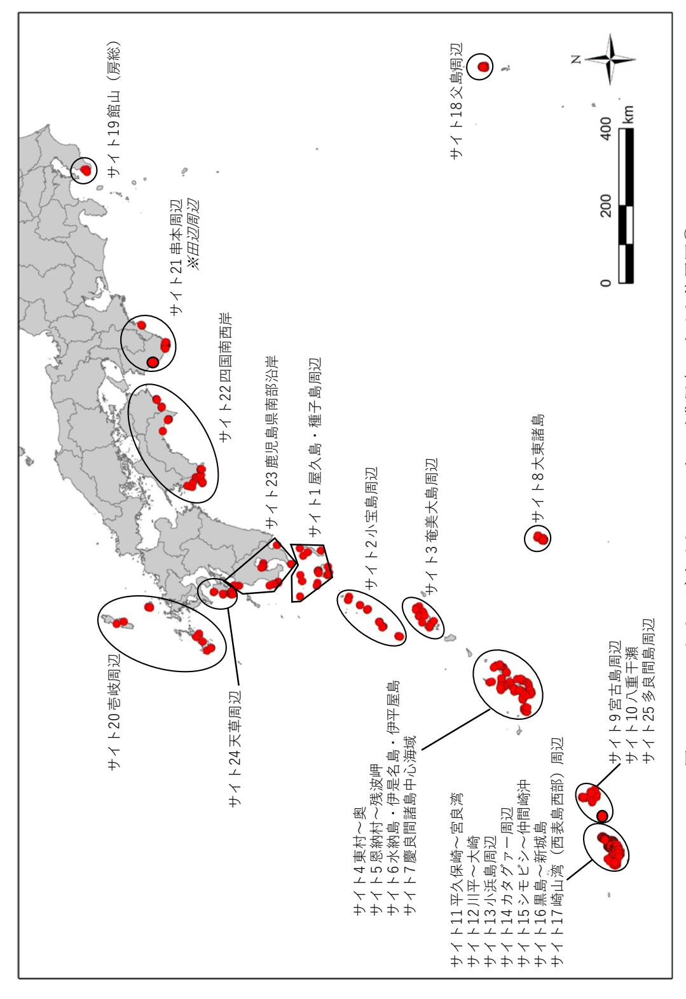

図 I-1-1 モニタリングサイト 1000 サンゴ礁調査 サイト位置図①

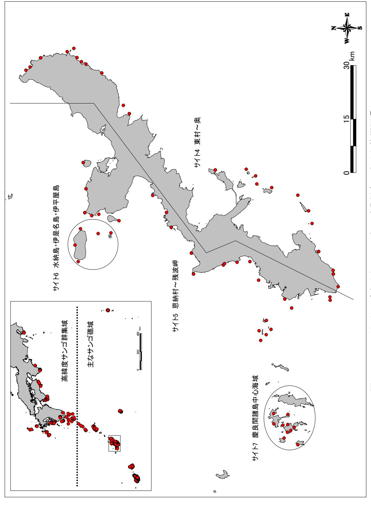

図 I-1-2 モニタリングサイト 1000 サンゴ礁調査 サイト位置図②

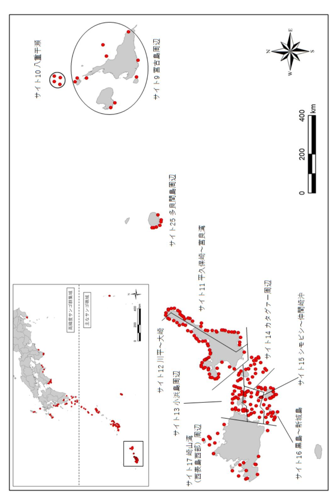

図 I-1-3 モニタリングサイト 1000 サンゴ礁調査 サイト位置図③

2021 年度はこれら 25 サイトのうち、サイト 2(小宝島周辺)、8(大東諸島)、25(多良 間島周辺)の遠隔地サイト及びサイト 20(壱岐周辺)を除く 21 サイトにおいて調査を実施 した。本来であれば 5 年に 1 度調査を実施する遠隔地サイトのいずれかを調査すべき時期 ではあるが、これらのサイトは医療体制が脆弱な離島地域を多く含むため、新型コロナウ イルス(COVID-19)感染拡大防止を考慮し調査を見送った。また、これらに加えて、地元 のダイビングショップを中心にしたモニタリング体制構築のため、和歌山県田辺周辺にお いての調査を実施した。

調査は、「スポットチェック法によるサンゴ礁調査マニュアル」(巻末の資料 2 を参照) に従って実施した。

以下に実施状況と調査結果の概要をサイトごとに示す。

サンゴ被度によるサンゴ礁の状態の評価は、スポットチェック法によるサンゴ被度の見 積り精度が 10%程度であることを考慮し、被度の表記方法を検討した結果、被度が極めて 小さいものを 1%未満または 5%未満、それ以上のものを 10%刻みで表記することとして、 2012 年度より表 I-1-2 の評価に基づき記述している。従って、ここでは被度が 1%単位で報 告された場合もその値を四捨五入することで 10%刻みにして評価している。

また、サイトにおけるサンゴ被度の平均値を「平均サンゴ被度」としており、平均サン ゴ被度についても 1%単位を四捨五入することで 10%刻みにして評価している。

| サンゴ被度の範囲     | 評価    |  |  |  |  |  |  |  |
|--------------|-------|--|--|--|--|--|--|--|
| 80%≦         | 優良    |  |  |  |  |  |  |  |
| 50%≦ <80% | 良     |  |  |  |  |  |  |  |
| 30%≦ <50% | やや不良  |  |  |  |  |  |  |  |
| 10%≦ <30% | 不良    |  |  |  |  |  |  |  |
| <10%         | 極めて不良 |  |  |  |  |  |  |  |

表 I-1-2 サンゴ被度によるサンゴ礁の評価

なお、参考までに 2011 年度までのサンゴ被度による評価区分を表 I-1-3 に示す。

表 I-1-3 〈参考〉2011 年度までのサンゴ被度によるサンゴ礁の評価

| サンゴ被度の範囲     | 評価    |
|--------------|-------|
| 75%≦         | 優良    |
| 50%≦ <75% | 良     |
| 25%≦ <50% | やや不良  |
| 10%≦ <25% | 不良    |
| <10%         | 極めて不良 |

昨年度からのサンゴ被度の変化(=今年度調査におけるサンゴ被度-昨年度調査におけ るサンゴ被度)は「ポイント」で示した。また、昨年度からのサンゴ被度の変化の評価区 分については、従来から 10 ポイント単位で区切られているため、これまでと同じものを用 いた(表 I-1-4)。

表 I-1-4 昨年度からのサンゴ被度の変化の評価

| 昨年からのサンゴ被度の変化 | 評価     |
|---------------|--------|
| (ポイント)        |        |
| +30≦          | 大きく増加  |
| +10≦ <+30  | 増加     |
| -10< <+10  | ほぼ変化なし |
| -30< ≦-10  | 減少     |
| ≦-30          | 大きく減少  |

なお、高緯度サンゴ群集域については、元来、サンゴ被度が低く、分布が局所的である ことが多いため、被度の評価目安は地域によって異なることを考慮する必要がある。

#### (1) サイト 1:大隅諸島/屋久島・種子島周辺

1)実施状況

屋久島海洋生物研究会の松本毅氏が代表となり、同研究会メンバーとともに実施した。

2)調査地点:20 地点(屋久島・口永良部島・馬毛島・種子島・竹島・硫黄島・黒島)

このサイトでは、大隅諸島の屋久島、口永良部島、馬毛島、種子島、竹島、硫黄島、黒 島に 20 の調査地点(モニタリングスポット)を選定しており、2021 年度はこれら 20 地点 のうち、2005 年より立入制限のために中止している地点 15(大瀬)及び本年度海上ボーリ ング調査が行われていた地点 14(馬毛島)を除く 18 地点で調査を実施した(図 I-2-1)。

サイト 1:大隅諸島/屋久島・種子島周辺における調査地点(モニタリングスポット:20 地点)

屋久島 地点 1:志戸子 (未調査:2 地点)

地点 2:元浦

地点 3:管理棟下

地点 4:お宮下

地点 5:タンク下

地点 6:センロク

地点 7:塚崎

地点 8:七瀬

地点 9:中間

地点 10:湯泊

地点 11:麦生

口永良部島 地点 12:寝待

地点 13:岩屋泊

馬毛島 地点 14:馬毛島(海上ボーリング調査実施中のため調査中止)

種子島 地点 15:大瀬(立入制限により 2005 年より調査を中止)

地点 16:住吉

地点 20:浦田ビーチ

竹島 地点 17:コモリ港 硫黄島 地点 18:永良部崎

黒島 地点 19:夫婦瀬

3)調査期間: 2021 年 10 月 7 日~11 月 19 日

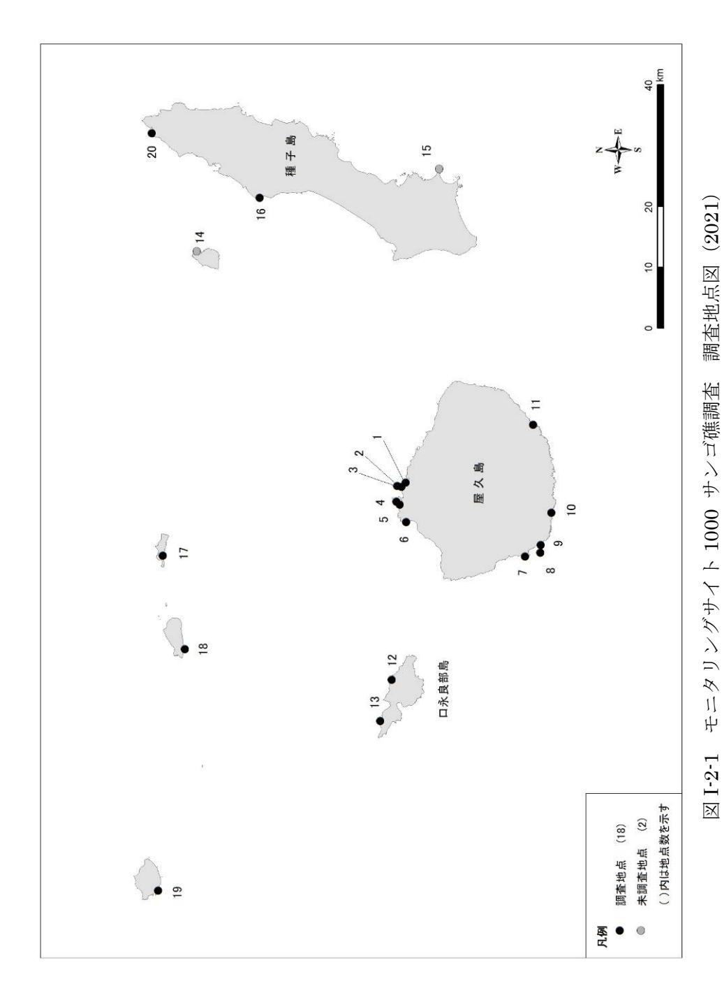

サイト(1)屋久島・種子島周辺

●は今年度調査を実施した地点。●は未調査地点を示す。

4)調査結果: 調査地点ごとのサンゴ被度の状況を図 I-2-2 に示す。

# ① 今年度のサンゴの状況

<平均サンゴ被度>

40%「やや不良」(サンゴ被度 30%以上 50%未満)

<地点毎のサンゴ被度>

「良」(50%以上 80%未満)

- ・ 8 地点(地点 1、5、6、8、10、11、12、13)
- ・ 最もサンゴ被度が高かった地点は、屋久島の地点 11(麦生)の 70%、次いで 同じ屋久島の地点 6(センロク)及び口永良部島の地点 12(寝待)と地点 13 (岩屋泊)の 60%であった。

「やや不良」(30%以上 50%未満)

・ 6 地点(地点 3、4、7、9、17、20)

「不良」(10%以上 30%未満)

- ・ 4 地点(地点 2、16、18、19)
- ・ 最もサンゴ被度が低かった地点は、種子島の地点 16(住吉)と地点 19(黒島 夫婦瀬)の 10%であり、この地点は昨年度も最も低い被度であった。

# ② 昨年度のサンゴの状況との比較

<平均サンゴ被度>

・ 昨年度と同じ 40%

<地点毎のサンゴ被度>

- 10 ポイント以上 30 ポイント未満で「増加」した地点
  - ・ 屋久島の地点 8(七瀬)でサンゴ被度が 20 ポイント増加し、屋久島の地点 9 (中間)、地点 10(湯泊)と口永良部島の地点 13(岩屋泊)でサンゴ被度が 10 ポイント増加した。
- 10 ポイント以上 30 ポイント未満「減少」した地点
  - ・ 屋久島の地点 3(管理棟下)ではサンゴ被度が 10 ポイント減少したが、特に 大きなかく乱はなく、調査員による測定誤差の範囲と思われる。
    - ※昨年度の地点 3 の被度は 70%となっているが、昨年度時点の入力ミスで実際は 被度 50%であった。

昨年度からサンゴ被度に変化のなかった地点

・ 13 地点(昨年度は 13 地点)

#### ③ 今年度のかく乱の状況

今年度は、オニヒトデ、サンゴ食巻貝、病気などの大きなかく乱は確認されず、全体的

に生育状況は良好であった。

# ④ その他

特になし。

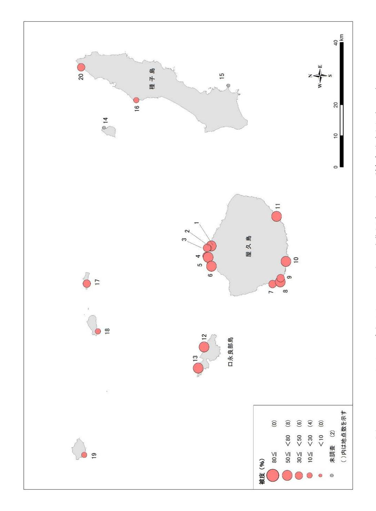

図 I-2-2 モニタリングサイト 1000 サンゴ礁調査 サンゴ被度分布図(2021) サイト(1)屋久島・種子島周辺

# ⑤ 主な調査地点の景観

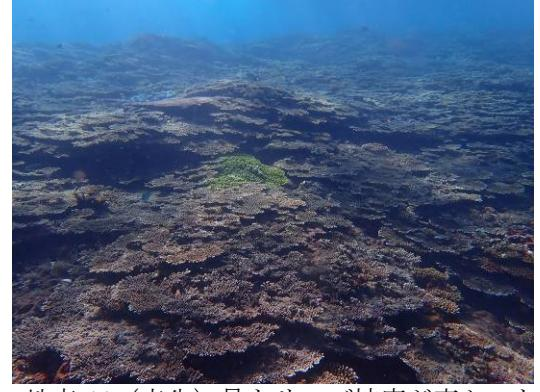

地点 11(麦生)最もサンゴ被度が高かった 地点 6(センロク)2 番目にサンゴ被度が 地点の景観(サンゴ被度 70%) 高かった地点の景観(サンゴ被度 60%)

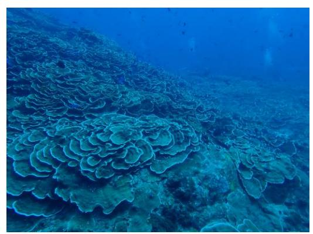

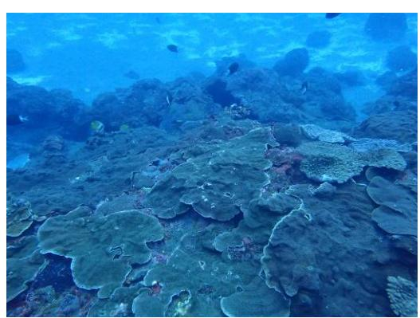

地点 12(寝待)2 番目にサンゴ被度が高 地点 13(岩屋泊)2 番目にサンゴ被度が高

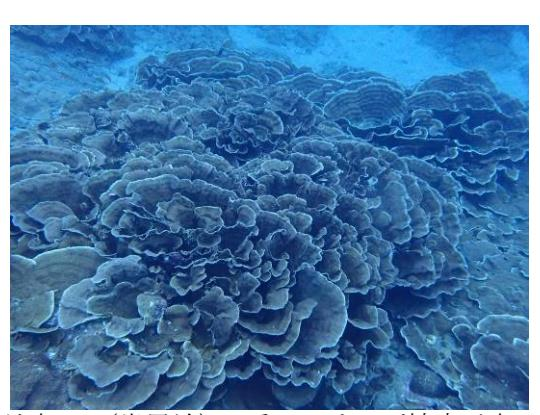

かった地点の景観(サンゴ被度 60%) かった地点の景観(サンゴ被度 60%)

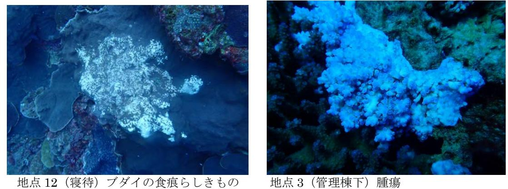

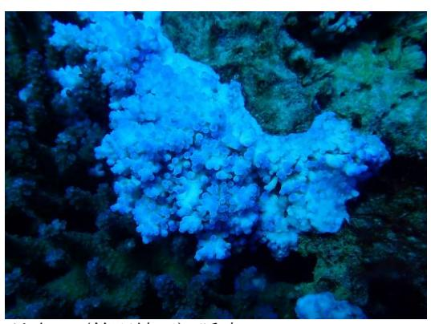

# (2) サイト 3:奄美群島/奄美大島周辺

#### 1)実施状況

ティダ企画有限会社の興克樹氏が代表となり、ダイビングサービススタジオーネの奥村 暢男氏と共に実施した。

2)調査地点:15 地点(奄美大島周辺)(図 I-3-1)

サイト 3:奄美群島/奄美大島周辺における調査地点(モニタリングスポット:15 地点) 奄美大島・北部

地点 1:赤木名立神

地点 2:節田

地点 3:神の子

地点 4:久場

地点 5:安木屋場

奄美大島・中部

地点 6:崎原東

地点 7:崎原南

地点 8:摺子崎

地点 9:大浜

地点 10:徳浜

地点 11:和瀬

奄美大島・南部(大島海峡)

地点 12:実久

地点 13:デリキョンマ崎

地点 14:手安 地点 15:安脚場

3)調査期間: 2021 年 9 月 9 日~2022 年 1 月 12 日

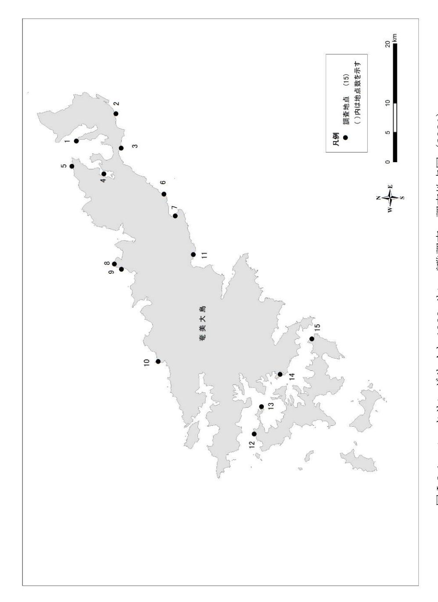

図 I-3-1 モニタリングサイト 1000 サンゴ礁調査 調査地点図(2021) サイト(3)奄美大島周辺

●は今年度調査を実施した地点。

4)調査結果: 調査地点ごとのサンゴ被度の状況を図 I-3-2 に示す。

# ① 今年度のサンゴの状況

<平均サンゴ被度>

・ 40%「やや不良」(サンゴ被度 30%以上 50%未満)

<地点毎のサンゴ被度>

「優良」(80%以上)

・ 3 地点(地点 3、6、12)

「良」(50%以上 80%未満)

・ 4 地点(地点 1、10、14、15)

「やや不良」(30%以上 50%未満)

・ 3 地点(地点 2、7、9)

「不良」(10%以上 30%未満)

・ 2 地点(地点 11、13)

「極めて不良」(10%未満)

- ・ 3 地点(地点 4、5、8)
- ・ いずれの地点も、サンゴ被度は 5%未満

# ② 昨年度のサンゴの状況との比較

<平均サンゴ被度>

・ 昨年度と同じ 40%

<地点毎のサンゴ被度>

10 ポイント以上 30 ポイント未満で「増加」した地点

- ・ 5 地点(昨年度は 1 地点)
  - 地点 1(赤木名立神)はミドリイシ群体が成長している(40%→50%)。
  - 地点 2(節田)は樹枝状ミドリイシ群体の成長による増加(30%→40%)
  - 地点 3(神の子)はコモンサンゴ属の成長による増加(70%→80%)
  - 地点 10(徳浜)はミドリイシ属群体が成長している(30%→50%)
  - 地点 12(実久)はミドリイシ属群体が成長している(70%→80%)

昨年度からサンゴ被度に変化のなかった地点

- ・ 10 地点(昨年度は 13 地点)
- ・ 低被度で変化なし(13 地点のうち、4 地点)
  - 地点 4(久場)は 2010 年の豪雨災害による泥土・泥水による被害からの 回復が見られず、サンゴ被度 5%未満
  - 地点 5(安木屋場)は 2008 年のコモンサンゴ類の壊滅からの回復が見ら れず、サンゴ被度 5%未満

- 地点 8(摺子崎)と 11(和瀬)は新規加入のサンゴが少なく、サンゴ被 度に変化なし(地点 8:サンゴ被度 5%未満、地点 11:サンゴ被度 20%)
- ・ 高被度で変化なし(13 地点のうち、3 地点)
  - 地点 6(崎原東)は卓状ミドリイシ類優占のサンゴ被度 80%群集
  - 地点 14(手安)は枝状ミドリイシ類優占のサンゴ被度 70%群集
  - 地点 15(安脚場)は藪状ミドリイシ類優占のサンゴ被度 60%群集
- ・ 低被度で変化なしだが、回復のきざし有り(13 地点のうち、3 地点)
  - 地点 7(崎原南)はサンゴ被度 30%で昨年度と変化なしだが、2010 年の 奄美豪雨災害からの回復が見られつつある
  - 地点 9(大浜)はミドリイシ群体が成長している(サンゴ被度 30%)
  - 地点 13(デリキョンマ崎)はサンゴ被度 20%であるものの、ホワイトシ ンドロームを発症する群体が減少した

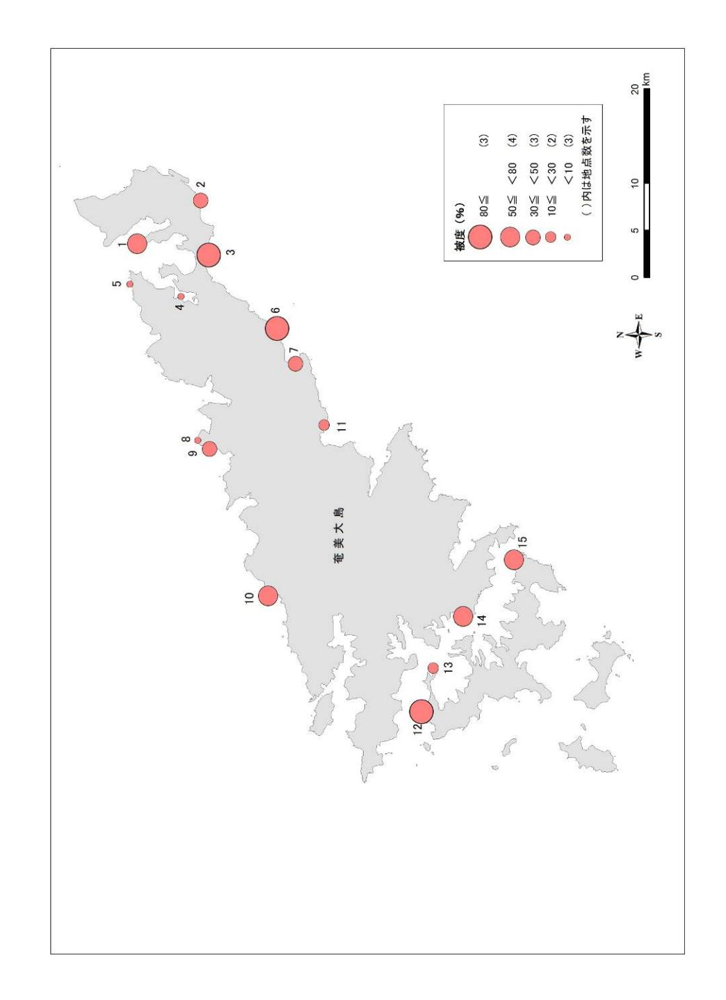

図 I-3-2 モニタリングサイト 1000 サンゴ礁調査 サンゴ被度分布図(2021) サイト(3)奄美大島周辺奄美大島

# ③ 今年度のかく乱の状況

白化の発生や台風の直撃もなく、サンゴのかく乱は見られなかった。2021 年 10 月中旬 から福徳沖ノ場の海底噴火による軽石の漂着が見られたが、サンゴおよび海洋生物への影 響は見られなかった。

#### ④ その他

本調査地点以外の海域においても、全体的に奄美大島周辺海域のサンゴは回復傾向であ るが、大島海峡では局所的にオニヒトデが少数見られた。

# ⑤ 主な調査地点の景観

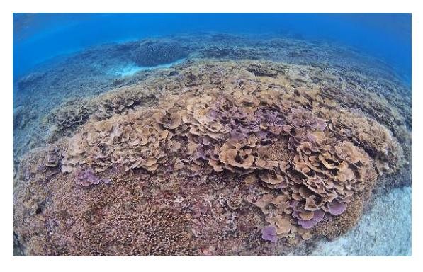

(サンゴ被度 80%) (サンゴ被度 80%)

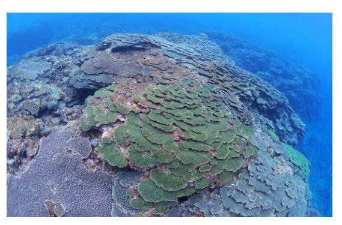

地点 3(神の子)最もサンゴ被度が高い 地点 6(崎原東)最もサンゴ被度が高い

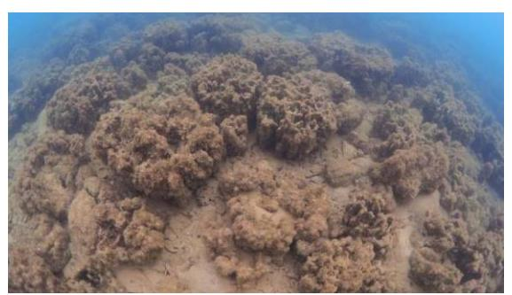

地点 4(久場)2010 年の豪雨災害による泥土 地点 5(安木屋場)2008 年にコモンサンゴ

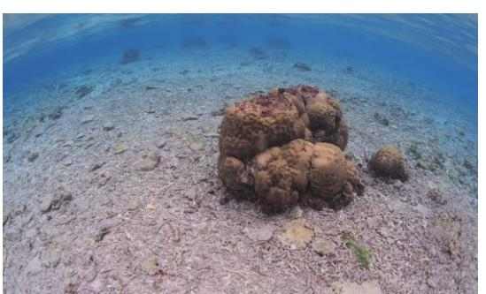

泥水被害から未回復(サンゴ被度 5%未満) 群集が壊滅後未回復(サンゴ被度 5%未満)

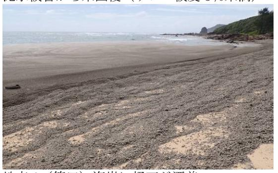

地点 2(節田)海岸に軽石が漂着

(3) サイト 4:沖縄島東岸/東村~奥

サイト 5:沖縄島西岸/恩納村~残波岬

サイト 6:沖縄島周辺離島/水納島・伊是名島・伊平屋島

サイト 4 から 6 は、ひとまとまりの海域であり、同じ調査実施者が調査を行っているた め、ここでは 3 つのサイトをまとめて記述する。

#### 1)実施状況

一般財団法人沖縄県環境科学センターの長田智史研究員が代表となり、同センターの金 井恵研究員とともに実施した。

2)調査地点: 108 地点(サイト 4:45 地点+サイト 5:52 地点+サイト 6:11 地点) 沖縄島周辺の海域は、2016 年度に調査地点を整理し、モニタリングサイト 1000 調査と して毎年調査を実施する調査定点と、調査実施者の所属先が自主的に行う自主調査による 調査地点に区分した。ここで言うモニタリングスポットは、調査定点と自主調査地点を合 わせた地点である。

今年度の各サイトの調査実施地点は、サイト 4 で 31 地点(調査定点 28 地点と自主調査 3 地点)、サイト 5 で 35 地点(調査定点 28 地点と自主調査 7 地点)、サイト 6 は 9 地点(調 査定点 5 地点と自主調査 4 地点)の合計 75 地点(調査定点 61 地点と自主調査 14 地点)で あった(図 I-4-1)。

サイト 4:沖縄島東岸/東村~奥における調査地点(モニタリングスポット:45 地点)

調査定点:28 地点・自主調査地点:17 地点(未調査:14 地点)

調査定点:28 地点

地点 1:荒崎西礁池

地点 2:大度海岸礁池

地点 3:大度海岸礁斜面

地点 4:摩文仁南礁地

地点 5:奥武島南礁池

地点 6:奥武島南礁斜面

地点 7:クマカ島南

地点 8:久高島エラブ岩東

地点 9:ウガン岩南

地点 10:津堅島アギハマ東

地点 11:ギノギ岩北東

地点 12:南浮原島南東

地点 13:浮原島北東ヨコビシ

地点 40:浮原島北東ヨコビシ東

地点 15:伊計島東礁斜面

地点 16:慶佐次ウッパマ東

地点 28:慶佐次ウッパマ東礁斜面

地点 17:東村宮城ウンシ南

地点 18:揚水発電所南東

地点 19:安波南

地点 20:カツセノ崎南

地点 21:イシキナ崎南西

地点 22:安田ヶ島南

地点 27:安田ヶ島北

地点 23:国頭村赤崎北礁池

地点 24:国頭村赤崎北礁斜面

地点 25:奥漁港北

地点 39:宇佐浜東礁斜面

自主調査地点:17 地点

地点 14:伊計島東礁池(未調査)

地点 26:宇佐浜世皮崎西(未調査)

地点 29:泡瀬ヒメマツミドリイシ礁池(未調査)

地点 30:泡瀬ヒメマツミドリイシ礁斜面(未調査)

地点 31:大浦ハマサンゴ(未調査)

地点 32:具志川城跡南(未調査)

地点 33:米須

地点 34:波名城礁池(未調査)

地点 35:波名城礁斜面(未調査)

地点 36:具志頭(未調査)

地点 37:大浦チリビシ(未調査)

地点 38:大度海岸西礁池(未調査)

地点 41:大泊橋北東浜(未調査)

地点 42:中城湾北東浜(未調査)

地点 43:東村伊是名北(未調査)

地点 44:南浮原南礁斜面

地点 45:慶佐次北礁斜面

サイト 5:沖縄島西岸/恩納村~残波岬における調査地点(モニタリングスポット:52 地点)

調査定点:28 地点・自主調査地点:24 地点(未調査:17 地点)

調査定点:28 地点

地点 1:喜屋武漁港西

地点 31:大嶺崎大瀬

地点 4:チービシクエフ南

地点 5:チービシ神山南

地点 6:チービシナガンヌ南

地点 7:チービシナガンヌ西

地点 8:チービシナガンヌ北

地点 9:空寿崎西(座礁船)

地点 10:伊佐西

地点 12:渡具知西

地点 44:砂辺

地点 33:水釜礁斜面

地点 13:残波岬西礁池

地点 14:残波岬西礁斜面

地点 43:真栄田岬西大礁池

地点 16:真栄田岬西礁斜面

地点 17:恩名村赤崎西礁池

地点 18:恩名村赤崎西礁斜面

地点 19:安富祖北礁池

地点 20:部瀬名岬西

地点 21:瀬底島南

地点 23:水族館西

地点 24:備瀬崎東礁池

地点 25:備瀬崎東礁斜面

地点 26:今帰仁村長浜北礁池

地点 27:今帰仁村長浜北礁斜面

地点 28:古宇利島北礁池

地点 29:古宇利島北礁斜面

自主調査地点:24 地点

地点 2:那覇空港北儀間の瀬礁池(未調査)

地点 3:那覇空港北儀間の瀬礁斜面(未調査)

地点 11:北谷町宮城海岸(未調査)

地点 15:真栄田岬西小礁池

地点 22:港原海洋センター西(未調査)

地点 30:喜屋武漁港西トコマサリ礁(未調査)

地点 32:水釜

地点 34:西洲礁池(未調査)

地点 35:西洲礁斜面(未調査)

地点 36:泊大橋南(未調査)

地点 37:瀬底大橋北(未調査)

地点 38:干ノ瀬(未調査)

地点 39:浅ノ瀬防波堤(未調査)

地点 40:ジャナセ

地点 41:喜屋武岬西礁池(未調査)

地点 42:喜屋武岬西礁斜面(未調査)

地点 45:チービシ神山北

地点 46:久良波(未調査)

地点 47:ウカハ岩西(未調査)

地点 48:糸満港クラントガイ北

地点 49:崎山(未調査)

地点 50:ヒキイシ南(未調査)

地点 51:恩納村恩納礁斜面

地点 52:塩川港南礁斜面

サイト 6:沖縄島周辺離島/水納島・伊是名島・伊平屋島における調査地点

(モニタリングスポット:11 地点)

調査定点:5 地点・自主調査地点:6 地点(未調査:2 地点)

調査定点:5 地点

地点 1:水納島東

地点 2:ナカンシ東

地点 3:伊江島西

地点 4:伊江島イシャラ原東

地点 5:伊江島湧出北

自主調査地点:6 地点

地点 6:水納島北(未調査)

地点 7:伊是名島内花橋北

地点 8:伊是名島アギギタラ

地点 9:水納島西(未調査)

地点 10:伊江島フナズ原南

地点 11:伊是名島第一号立標

3)調査期間: 2021 年 9 月 7 日~2021 年 12 月 21 日(サイト 4) 年 9 月 25 日~2021 年 12 月 12 日(サイト 5) 年 9 月 18 日~2021 年 12 月 12 日(サイト 6)

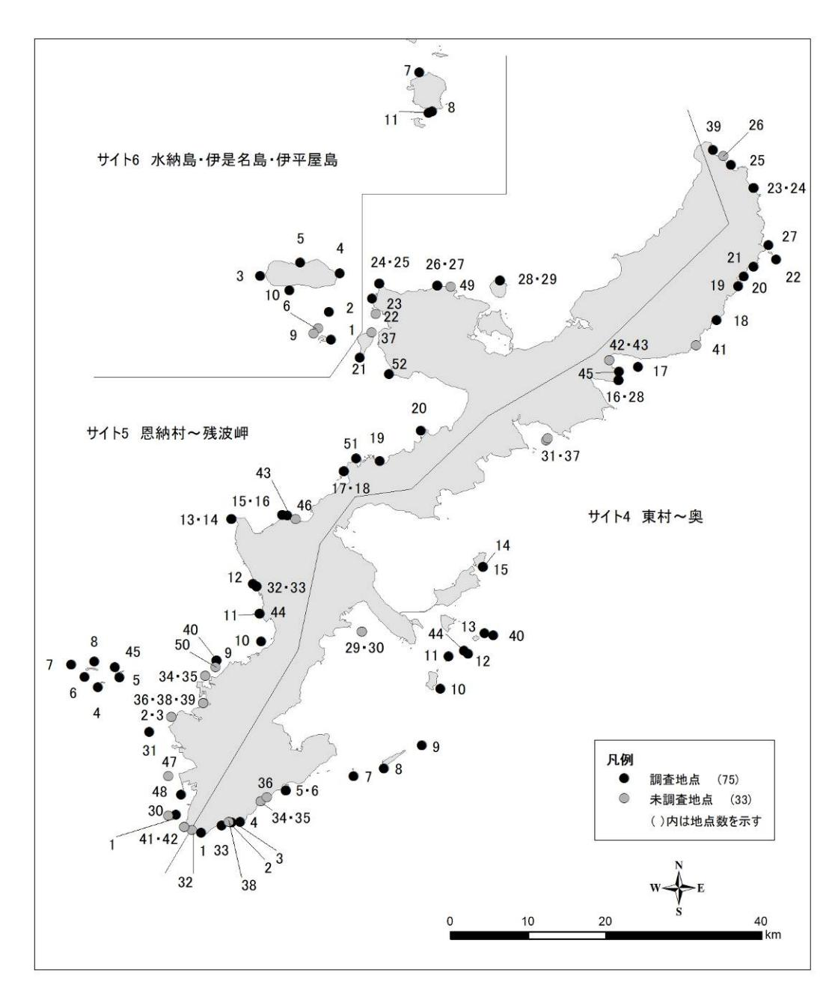

図 I-4-1 モニタリングサイト 1000 サンゴ礁調査 調査地点図(2021) サイト(4)~(6)沖縄島東岸・西岸・周辺離島 ●は今年度調査を実施した地点。●は未調査地点を示す。

4)調査結果: 調査地点ごとのサンゴ被度の状況を図 I-4-2 に示す。

#### ① 今年度のサンゴの状況

サイト 4:沖縄島東岸

<平均サンゴ被度>

・ 40%「やや不良」(サンゴ被度 30%以上 50%未満)

<地点毎のサンゴ被度>

「良」(50%以上 80%未満)

・ 13 地点(地点 3、18、21、22、24、25、27、28、33、39、40、44、45) 「やや不良」(30%以上 50%未満)

・ 11 地点(地点 1、2、4、6、7、10、13、15、17、19、20)

「不良」(10%以上 30%未満)

・ 7 地点(地点 5、8、9、11、12、16、23)

#### <サンゴの加入数>

「5 群体/ ㎡未満」

・ 3 地点(地点 2、5、13)

「10 群体/㎡以上」

- ・ 27 地点(地点 1、3、4、6、7、8、9、10、11、12、15、17、18、19、20、 21、22、23、24、25、27、28、33、39、40、44、45)
- ・ このうち 12 地点で 30 群体/㎡以上を記録し、地点 24(国頭村赤崎北礁斜面) では最大の 45 群体/㎡を記録した。

#### <卓状ミドリイシ類の最大長径>

・ 60cm 以上: 全て礁斜面の 8 地点

最大:昨年度同様、地点 33(米須)110.0cm

2 番目:地点 25(奥漁港北)92.0cm

3 番目:地点 24(国頭村赤崎北礁斜面)91.0cm

#### サイト 5:沖縄島西岸

<平均サンゴ被度>

・ 50%「良」(サンゴ被度 50%以上 80%未満)

<地点毎のサンゴ被度>

「優良」(80%以上)

・ 2 地点(地点 18、29)

「良」(50%以上 80%未満)

・ 21 地点(地点 1、4、5、7、9、10、16、17、19、20、21、23、25、26、27、 28、40、45、48、51、52)

「やや不良」(30%以上 50%未満)

・ 9 地点(地点 6、8、12、14、24、31、32、33、44)

「不良」(10%以上 30%未満)

・ 3 地点(地点 13、15、43)

# <サンゴの加入数>

#### 「5 群体/㎡未満」

・ 7 地点(地点 12、17、24、26、28、32、48)

# 「10 群体/㎡以上」

- ・ 21 地点(1、4、5、6、7、8、9、14、16、18、20、21、23、25、27、29、 31、40、45、51、52)
  - 地点 8(チービシナガンヌ北)、40(ジャナセ)及び 52(塩川港南礁斜面) では 30 群体/ ㎡以上

#### <卓状ミドリイシ類の最大長径>

- ・ 60cm 以上:南部と北部の礁斜面など 19 地点
  - 最大:地点 52(塩川港南礁斜面)128.0cm、
  - 2 番目:地点 48(糸満港クラントガイ北)119.0cm、
  - 3 番目:地点 20(部瀬名岬西)117.0cm

# サイト 6:沖縄島周辺離島

#### <平均サンゴ被度>

・ 60%「良」(サンゴ被度 50%以上 80%未満)

#### <地点毎のサンゴ被度>

「優良」(80%以上)

・ 2 地点(地点 1、10)

「良」(50%以上 80%未満)

・ 6 地点(地点 2、3、4、5、8、11)

「やや不良」(30%以上 50%未満)

・ 1 地点(地点 7)

#### <サンゴの加入数>

- ・ 地点 7 を除き全て 20 群体/㎡以上
- ・ 最大:地点 10(伊江島フナズ原南)45.3 群体/㎡

#### <卓状ミドリイシ類の最大長径>

- ・ 全地点で 50cm 以上
- ・ 最大:地点 1(水納島東)150.0cm
- ・ 2 番目:地点 10(伊江島フナズ原南)124.0cm
- ・ 3 番目:地 3(伊江島西)121.0cm

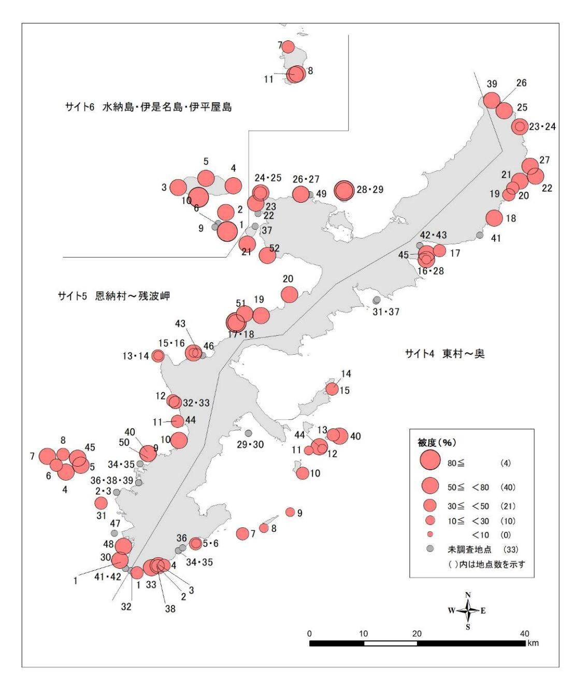

図 I-4-2 モニタリングサイト 1000 サンゴ礁調査 サンゴ被度分布図(2021) サイト(4)~(6)沖縄島東岸・西岸・周辺離島

# ② 昨年度のサンゴの状況との比較

サイト 4:沖縄島東岸

<平均サンゴ被度>

- ・ 昨年度(30%)から 10 ポイント増加して 40%
- <地点毎のサンゴ被度>
  - 30 ポイント以上「大きく増加」した地点
    - ・ 1 地点(昨年度は 0 地点)
  - 10 ポイント以上 30 ポイント未満で「増加」した地点
    - ・ 10 地点(昨年度は 11 地点)
  - 10 ポイント以上 30 ポイント未満「減少」した地点
    - ・ 3 地点(昨年度は 7 地点)
  - 30 ポイント以上「大きく減少」した地点
    - ・ 1 地点(昨年度は 0 地点)

サイト 5:沖縄島西岸

<平均サンゴ被度>

・ 昨年度と同じ 50%

<地点毎のサンゴ被度>

- 30 ポイント以上「大きく増加」した地点
  - ・ 0 地点(昨年度は 1 地点)
- 10 ポイント以上 30 ポイント未満で「増加」した地点
  - ・ 15 地点(昨年度は 12 地点)
- 10 ポイント以上 30 ポイント未満「減少」した地点
  - ・ 5 地点(昨年度は 4 地点)
- 30 ポイント以上「大きく減少」した地点
  - ・ 0 地点(昨年度は 0 地点)

サイト 6:沖縄島周辺離島

<平均サンゴ被度>

・ 昨年度と同じ 60%

<地点毎のサンゴ被度>

- 30 ポイント以上「大きく増加」した地点
  - ・ 0 地点(昨年度は 0 地点)
- 10 ポイント以上 30 ポイント未満で「増加」した地点
  - ・ 1 地点(昨年度は 2 地点)
- 10 ポイント以上 30 ポイント未満で「減少」した地点

・ 1 地点(昨年度は1地点)

30 ポイント以上「大きく減少」した地点

・ 0 地点(昨年度は 0 地点)

# ③ 今年度のかく乱の状況

サイト 4:沖縄島東岸

<白化>

夏季高水温が原因と考えられる白化現象は確認されなかった。

# <オニヒトデ>

オニヒトデは地点 22(安田ヶ島南)で、食痕及び 1 個体が記録されたのみで、全体 的に影響は確認されなかった。

### <サンゴ食巻貝類>

サンゴ食巻貝類は地点 39(宇佐浜東礁斜面)などの 4 地点で記録されたが、小さな 食痕や食害部のある群体が散見されるのみで、顕著な被害は確認されなかった。

#### <感染症>

地点 2(大度海岸礁池)、地点 10(津堅島アギハマ東)、地点 28(慶佐次ウッパマ東 礁斜面)において、テルピオスや病気(黒帯病、ホワイトシンドローム)の影響が比 較的大きいと考えられた。

#### <その他>

目視による SPSS 階級が比較的高い地点(階級 4 以上)は、地点 1(荒崎西礁池)、 地点 3(大度海岸礁斜面)などの 6 地点で、昨年度の 2 地点から増えており、今後の動 向に注意が必要である。

軽石の漂流(一部海底に堆積)は北部と南部の 7 地点で確認されたが、サンゴ群集 への目立った影響は見られなかった。

# サイト 5:沖縄島西岸

#### <白化>

夏季高水温が原因と考えられる白化現象は確認されなかった。

#### <台風>

台風の接近による波浪が原因と考えられる破損が、地点 14(残波岬西礁斜面)で確 認された。

#### <オニヒトデ>

オニヒトデが地点 7(チービシナガンヌ西)、地点 9(空寿崎西座礁船)、地点 10(伊 佐西)、地点 18(恩納村赤崎西礁斜面)、地点 20(部瀬名岬西)及び地点 40(ジャナ セ)の 6 地点で記録されたが、個体数密度はいずれも 0.5~1.0 個体/15 分と通常分布 密度であった。

#### <サンゴ食巻貝類>

サンゴ食巻貝類は 13 地点で記録されたが、小さな食痕や食害部のある群体が散見さ れる程度であり顕著な被害は確認されなかった。

#### <感染症>

過年度に引き続き、テルピオスの著しい影響が地点 26(今帰仁村長浜北礁池)の枝 状コモンサンゴ類で確認された。

#### <その他>

目視による SPSS 階級が比較的高い地点(階級 4 以上)は、7 地点と多かった。 軽石の漂流は主に南部の 7 地点で確認されたが、サンゴ群集への目立った影響は見ら れなかった。

# サイト 6:沖縄島周辺離島

台風の接近や暴風による波浪、オニヒトデ、サンゴ食巻貝類の影響は全地点で確認さ れなかった。ただし地点 10(伊江島フナズ原南)でサンゴ食巻貝の小さな食痕のある群 体が観察された。

#### <その他>

目視による SPSS 階級は全地点で階級 3 以下であり、影響は軽微であると考えられ た。

軽石の漂流は伊江島周辺の全地点で確認されたが、サンゴ群集への目立った影響は 見られなかった。

#### ④ その他

#### サイト 4:沖縄島東岸

地点 14(伊計島東礁池)は、調査対象としていたユビエダハマサンゴ及びチヂミウス コモンサンゴの消滅から未だ回復の兆しが確認できないことから、今年度は引き続き調査 を見送った。

# サイト 5:沖縄島西岸

これまで地点 2(那覇空港北儀間の瀬礁池)と 3(那覇空港北儀間の瀬礁斜面)は、那 覇空港建設工事を考慮して調査を見送ってきたが、工事終了に伴い次年度以降は調査の実 施を検討する。

#### サイト 6:沖縄島周辺離島

サイトに隣接する伊是名島・伊平屋島及び粟国島・渡名喜島などは、2011 年以降まと まった調査がされていないため、2016~2017 年の世界的な夏季高水温の影響等の現状を 把握する必要がある。

# ⑤ 主な調査地点の景観

<サイト 4:沖縄島東岸>

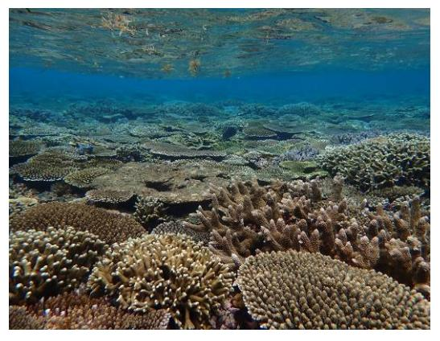

地点 28(慶佐次ウッパマ東礁斜面) 地点 39(宇佐浜東礁斜面) 高いサンゴ被度が維持されている(60%) 軽石のわずかな堆積が確認された

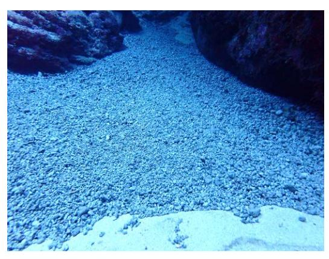

<サイト 5:沖縄島西岸>

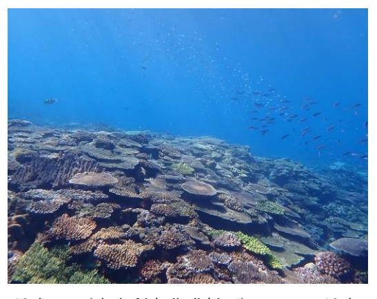

地点 29(古宇利島北礁斜面) 地点 18(恩納村赤崎西礁斜面) ミドリイシ類が優占する高被度群落(80%) オニヒトデが記録されたが影響は少ない

<サイト 6:沖縄島周辺離島>

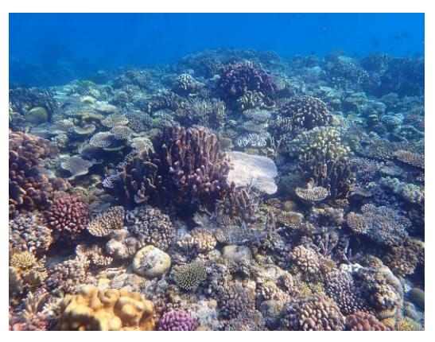

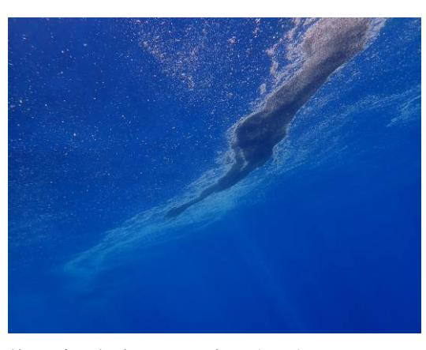

地点 1(水納島東)高被度(70%) 地点 3(伊江島西)軽石の漂流が確認された

(4)サイト 7:慶良間諸島/慶良間諸島中心海域(阿嘉島、座間味、渡嘉敷周辺)

#### 1)実施状況

岩尾研二氏が代表となり、あか・げるまダイビング協会の豊島正彦氏及び豊島倫子氏が 実施した。

2)調査地点: 12 地点(座間味村:10 地点+渡嘉敷村:2 地点) 座間味島及び阿嘉島周辺 10 地点を設置しているが、渡嘉敷で行われているボランティア による協力地点(地点 11、12)のモニタリングデータの提供を受けている(図 I-5-1)。

サイト 7:慶良間諸島/慶良間諸島中心海域(阿嘉島、座間味、渡嘉敷周辺)における 調査地点(モニタリングスポット:10 地点及びボランティアによる協力地点 2 地点)

地点 1:安室南

地点 2:座間味アゴノウラ

地点 3:座間味ニタ

地点 4:嘉比南

地点 5:阿嘉ニシハマ

地点 6:阿嘉クシバル

地点 7:阿嘉アグ

地点 8:阿嘉マエノハマ

地点 9:屋嘉比東

地点 10:久場北西

地点 11:渡嘉敷アリガー(協力地点) 地点 12:渡嘉敷アハレン(協力地点)

3)調査時期: 2021 年 10 月 29 日~11 月 5 日

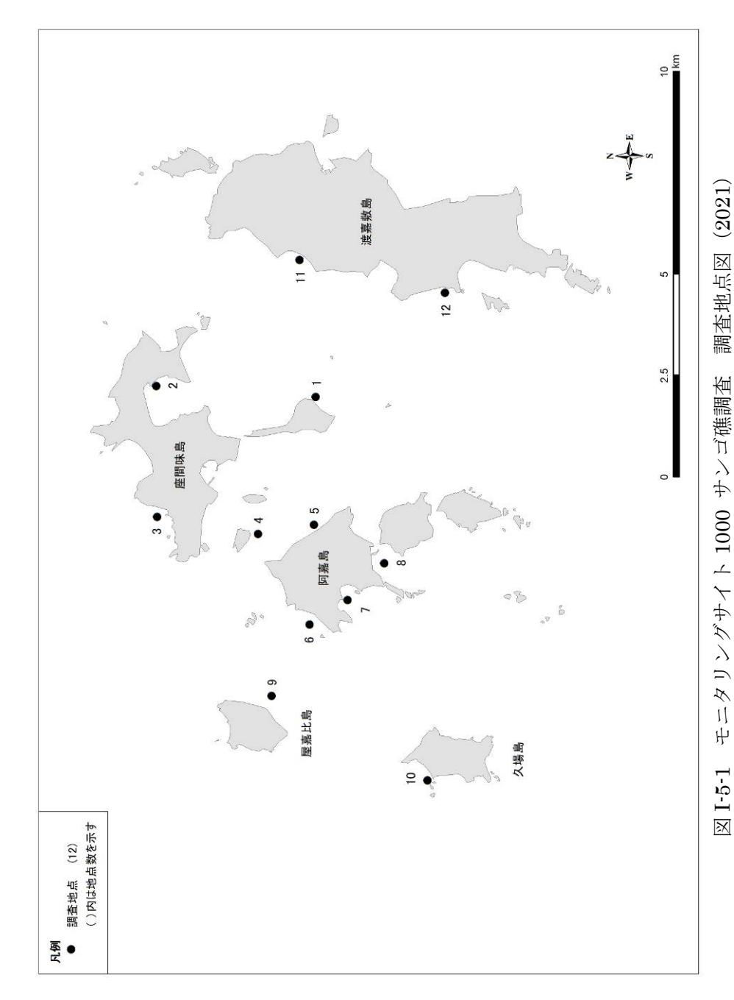

サイト(7)慶良間諸島

●は今年度調査を実施した地点。

4)調査結果: 調査地点ごとのサンゴ被度の状況を図 I-5-2 に示す。

# ① 今年度のサンゴの状況

<平均サンゴ被度>

・ 40%「やや不良」(サンゴ被度 30%以上 50%未満)

<地点毎のサンゴ被度>

「良」(50%以上 80%未満)

- ・ 3 地点(地点 6、11、12)
- ・ 最も高いサンゴ被度を示したのは地点 6(阿嘉クシバル)で、この地点では順 調に被度が増加し、昨年度の 50%から 60%に増加した。海域全体として被度 の上昇とサンゴの生息状況の回復が見られた。

「やや不良」(30%以上 50%未満)

・ 7 地点(地点 1、3、4、5、7、9、10)

「不良」(10%以上 30%未満)

・ 2 地点(地点 2、8)

<卓状ミドリイシ類の最大長径>

- ・ 全地点の平均は 81.9cm で、昨年度(81.6cm)からほぼ横ばいであった。
- ・ 多くの地点で値は増加したが、減少した3地点(地点 1:安室南、地点 3:座 間味ニタ、地点 9:屋嘉比東)での減少幅が大きく、増加分と相殺される形に なった。これら3地点でも、サンゴの生息状況は悪くなく、今後の回復が期待 される。

#### <サンゴの加入数>

・ 協力地点を含む全 12 地点の平均値は 4.0 群体/㎡(前年と同じ)であり、本海 域の加入の少なさを示している。最大値の平均値は前年の 5.7 群体/㎡から 5.0 群体/㎡に減少しており、今後の回復の鈍化が懸念される。

# ② 昨年度のサンゴの状況との比較

被度の増加した地点が 8 地点であったのに対して減少した地点は 1 地点のみで、平均サ ンゴ被度も 10 ポイント増加したことから、海域全体としてサンゴの生息状況の回復が見 られた。卓状ミドリイシのサイズも増加した地点が多く、減少した地点でもサンゴの生息 状況は悪くなかった。一方で、ミドリイシの平均加入数は少ない値で変化がなく、今後の 回復の鈍化が懸念される。

<平均サンゴ被度>

・ 昨年度(30%)から 10 ポイント増加して 40%

#### <地点毎のサンゴ被度>

10 ポイント以上 30 ポイント未満で「増加」した地点

- ・ 8 地点(昨年度は 3 地点)
- ・ 特に、地点 6(阿嘉クシバル)、地点 12(渡嘉敷アハレン)はいずれも卓状・ 指状ミドリイシの生息が良好で、地点 1(安室南)では被覆状コモンサンゴの 生息が良好であり、その成長が被度増加の原因と考えられる。

10 ポイント以上 30 ポイント未満「減少」した地点

- ・ 1 地点(昨年度は 4 地点)
- ・ サンゴ被度が「減少」した地点は、地点 7(阿嘉アグ)でのみであった。サン ゴの生息環境としては良好な地点であるが、調査中にロープや漁網がサンゴ群 体に絡まっているのが散見されており、それらによる破損が要因となっている 可能性がある。

昨年度からサンゴ被度に変化のなかった地点

・ 3 地点(昨年度は 5 地点)

# ③ 今年度のかく乱の状況

<オニヒトデ>

本サイトでは、2015年以来7年間にわたりオニヒトデは1個体も確認されておらず、 その食痕も認められていない。

#### <白化>

本年の調査では 1 地点で原因不明の白化群体が見られたのみで、大きな被害はなか った。

#### <サンゴ食巻貝>

昨年 7 地点でしか確認できなかったものが、本年は地点 10(久場北西)を除く 11 地点で認められた。小さな食痕や食害部のある群体が散見されるのみで、被食率も 5% 未満と被害は軽微だが、海域全体で蔓延していることになり、今後注意を要する。

# ④ その他

慶良間海域でも 10 月末頃から大量の軽石が港内に滞留したり、海岸に打ち上げられたり しているのが確認されており、回収作業が行われている。サンゴやサンゴ礁生物への影響 についてはまだ不明だが、潮がひどく引いた時には群体表面を擦って傷つける等の被害が 懸念される。

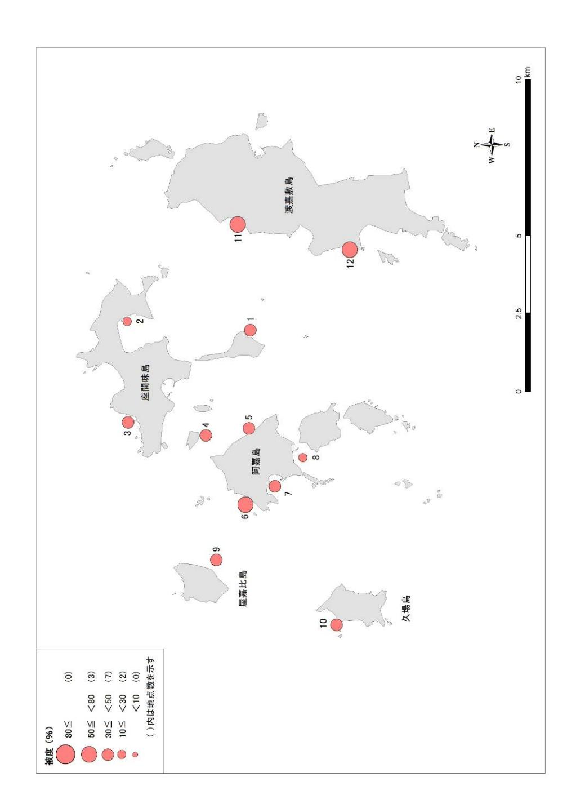

図 I-5-2 モニタリングサイト 1000 サンゴ礁調査 サンゴ被度分布図(2021) サイト(7)慶良間諸島

# ⑤ 主な調査地点の景観

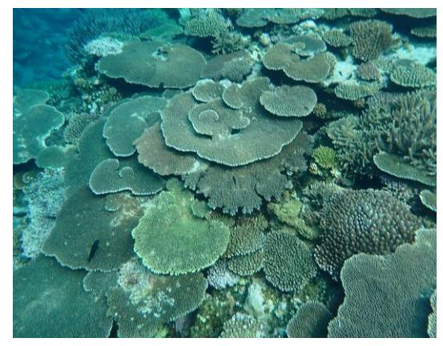

卓状ミドリイシ類が成長し、高被度を維持。 卓状・枝状ミドリイシ類が成長していた。

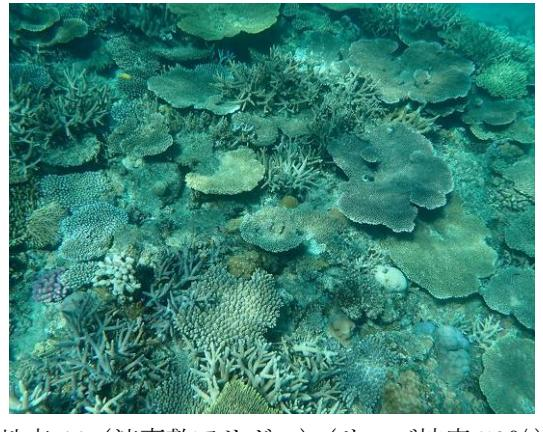

地点 6(阿嘉クシバル)(サンゴ被度 60%) 地点 11(渡嘉敷アリガー)(サンゴ被度 50%)

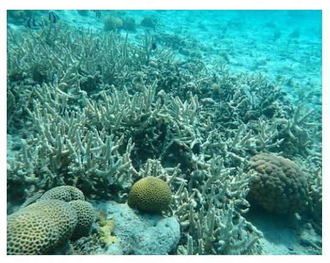

地点 2(座間味アゴノウラ):本年はミドリ 地点 10(久場北西):大型群体は少ないが イシ類の増加が見られた。 多くの種の小型群体が生息していた。

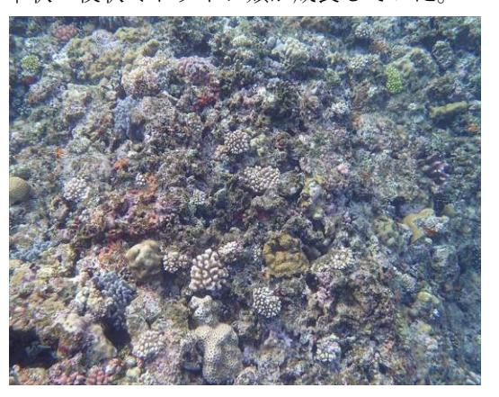

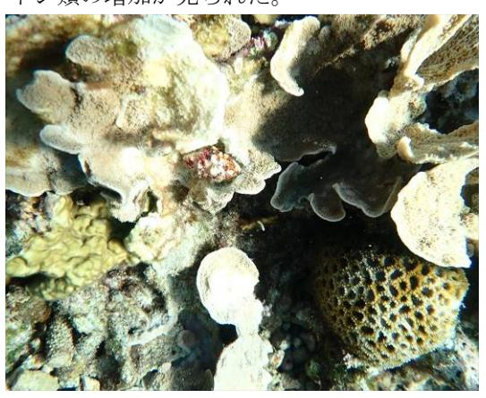

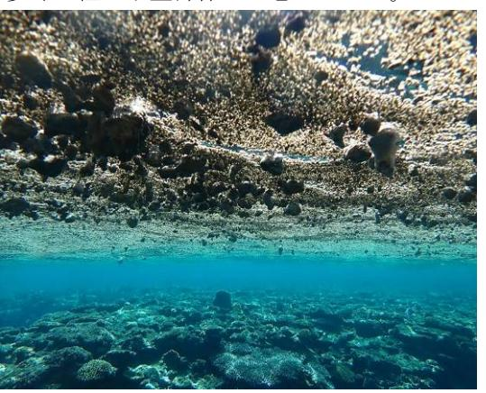

地点 12(渡嘉敷アハレン):サンゴ食巻き貝 地点 3(座間味ニタ):軽石の漂流・漂着が 確認された。

# (5)サイト 9:宮古島周辺

サイト 10:宮古島離礁/八重干瀬

サイト 9 及び 10 をひとまとまりの海域とし、調査実施者が同じであるため、まとめて記 述する。

#### 1)実施状況

宮古島市教育委員会の梶原健次氏が代表となり、宮古島市水産課の島田剛氏及び宮古島 市立砂川小学校・松本尚氏とで実施した。

2)調査地点:14 地点(サイト 9:10 地点+サイト 10:4 地点)(図 I-6-1)

サイト 9:宮古島周辺における調査地点

(モニタリングスポット:10 地点(未調査:2 地点))

地点 1:池間島北・カギンミ

地点 2:池間島東・チュラビジ

地点 3:平良・狩俣西

地点 4:伊良部・下地島・カヤッファ

地点 5:伊良部・下地島・渡口沖離礁

地点 6:来間島東・ヨコターラ

地点 7:上野・博愛漁港沖・友利大ビセ

地点 8:城辺・吉野海岸

地点 9:城辺・ツフツワ干瀬北(未調査)

地点 10:平良・高野漁港沖・二段干瀬(未調査)

サイト 10:宮古島離礁/八重干瀬における調査地点(モニタリングスポット:4 地点)

地点 1:八重干瀬・ウル西

地点 2:八重干瀬・カナマラ中央南

地点 3:八重干瀬・クンカディ・ガマ(旧名:スムトゥビジ南)

地点 4:八重干瀬・イフ南

3)調査期間: 2021 年 11 月 6 日~2022 年 1 月 15 日(サイト 9)

2021 年 10 月 16 日(サイト 10)

図 I-6-1 モニタリングサイト 1000 サンゴ礁調査 調査地点図(2021) サイト(9)~(10)宮古島周辺、八重干瀬

●は今年度調査を実施した地点。●は未調査地点を示す。

4)調査結果: 地点ごとのサンゴ被度の状況を図 I-6-2 に示す。

# ① 今年度のサンゴの状況

サイト 9:宮古島周辺

<平均サンゴ被度>

・ 30%「やや不良」(サンゴ被度 30%以上 50%未満)

<地点毎のサンゴ被度>

「良」(50%以上 80%未満)

- ・ 3 地点(地点 1、2、4)
- ・ 最も高いサンゴ被度を示したのは地点 2(池間島東・チュラビジ)の 60%であ った。

「やや不良」(30%以上 50%未満)

・ 1 地点(地点 8)

「不良」(10%以上 30%未満)

- ・ 4 地点(地点 3、5、6、7)
- ・ 最も被度が低かったのは地点 5(伊良部下地島渡口沖離礁)の 10%であった。

<サンゴの加入>

- ・ サイト平均は 3 群体/㎡
- ・ 最大値は地点 5(伊良部下地島渡口沖離礁)の 13 群体/㎡で、その他は 0~4 群体/㎡と低密度だった。

サイト 10:八重干瀬

<平均サンゴ被度>

・ 20%「不良」(サンゴ被度 10%以上 30%未満)

<地点毎のサンゴ被度>

「やや不良」(30%以上 50%未満)

- ・ 1 地点(地点 2)
- ・ 最も高いサンゴ被度を示したのは地点 2(八重干瀬・カナマラ中央南)の 40% であり、卓状ミドリイシ優占型であった。

「不良」(10%以上 30%未満)

- ・ 3 地点(地点 1、3、4)
- ・ 地点 1(八重干瀬ウル西)と地点 3(八重干瀬クンカディ・ガマ)はそれぞれ サンゴ被度 10%、20%の多種混成型であり、地点 4(八重干瀬イフ南)はサン ゴ被度 20%の卓状ミドリイシ優占型であった。

#### <サンゴの加入数>

- ・ 加入数は 1~6 群体/㎡であった。
- ・ 最大値は地点 2(八重干瀬カナマラ中央南)で 6 群体/㎡であった。

# ② 昨年度のサンゴの状況との比較

サイト 9:宮古島周辺

<平均サンゴ被度>

・ 昨年度と同じ 30%

<地点毎のサンゴ被度>

30 ポイント以上「大きく増加」した地点

・ 0 地点(昨年度は 0 地点)

10 ポイント以上 30 ポイント未満で「増加」した地点

- ・ 5 地点(昨年度は 5 地点)
- ・ 地点 2(池間島東チュラビジ)は被度が 20 ポイント増加して 60%に達し、卓 状ミドリイシが互いに重なり合うような場所もあったほか、群体直径が 100cm に達するものも複数確認されるなど、景観が大きく変化した。
- ・ 地点 1(池間北カギンミ)及び地点 3(平良狩俣西)はミドリイシの成長のた め、地点 4(伊良部下地島カヤッファ)及び地点 8(城辺吉野海岸)は枝状コ モンサンゴの成長(破片分散によると思われる分布面積の拡大)が主要因でサ ンゴ被度が 10 ポイント増加した。

10 ポイント以上 30 ポイント未満「減少」した地点

・ 0 地点(昨年度は 0 地点)

昨年度からサンゴ被度に変化のなかった地点

- ・ 3 地点(昨年度は 5 地点)
- ・ 地点 5(伊良部下地島渡口沖離礁)、地点 6(来間東ヨコターラ)、地点 7(上 野博愛沖友利大ビセ)の 3 地点でいずれの地点もミドリイシやコモンサンゴな どの成長が早いサンゴの被度が低いという点で共通していた。地点 5 と地点 6 ではミドリイシの小群体が多く、今後 2~3 年以内にサンゴ被度が増加する可 能性がある。

サイト 10:八重干瀬

<平均サンゴ被度>

・ 昨年度と同じ 20%。

<地点毎のサンゴ被度>

10 ポイント以上 30 ポイント未満で「増加」した地点

・ 2 地点(昨年度は 2 地点)

・ ミドリイシ類が優占する地点 2(八重干瀬カナマラ中央南)及び地点4(八重 干瀬イフ南)で被度が 10 ポイント増加した。

昨年度からサンゴ被度に変化のなかった地点

- ・ 2 地点(昨年度は 2 地点)
- ・ 地点 3(八重干瀬クンカディ・ガマ)では、サンゴ被度の変化は検出されなか ったが、ミドリイシ類の増加や大型化が認められた。

# ③ 今年度のかく乱の状況

サイト 9:宮古島周辺

#### <白化>

・ 白化現象は確認されなかった。

## <オニヒトデ>

- ・ 地点 1(池間島北カギンミ)でのみ 1 個体が確認された。枝状ミドリイシ群集に、 オニヒトデの食痕と疑われる痕跡が多数あったため、実際の生息数はさらに多い と懸念される。
- ・ 地点 2(池間島東チュラビジ)の調査範囲付近で無数のオニヒトデの食痕らしきも のを確認したほか、地点のすぐ北側にオニヒトデが多数いたとの情報がダイビン グ事業者から寄せられた。オニヒトデ大発生の兆候である可能性があり、今後注 意を要する。

# <サンゴ食巻貝>

- ・ これまで地点 4(伊良部下地島カヤッファ)や地点 8(城辺吉野海岸)などで常態 的に確認されてきたが、個体数が減少しほとんど目立たなくなっていた。
- ・ 地点 3(平良狩俣西)ではミドリイシ類にサンゴ食巻貝が散見された。現在のとこ ろ食害の影響は軽微だが、サンゴ被度が低いため今後は注意を要する。

#### <感染症>

・ 地点 4(伊良部下地島カヤッファ)では葉状コモンサンゴに腫瘍やテルピオスによ る斃死が常態的に確認されているが、明らかなサンゴ被度の低下は認められなか った。

#### <その他>

- ・ 昨年度に地点 7(上野博愛沖友利大ビセ)で広範囲に繁茂してイシサンゴ類を被覆 しかけていた赤褐色の糸状藻類(シアノバクテリア)は激減し、わずかしか残っ ておらず、サンゴ被度を低下させるようなかく乱には至らなかった。
- ・ 調査時に微細な軽石を確認した地点があるが、サンゴ被度に影響するようなかく 乱とはならなかった。

サイト 10:八重干瀬

#### <白化>

・ 白化現象は確認されなかった。

#### <オニヒトデ>

- ・ 地点 3(八重干瀬クンカディ・ガマ)でのみ 3 個体が確認された(全て駆除済み)。
- ・ ダイビング事業者からの情報によると、八重干瀬南側で、2021 年夏頃より小型オ ニヒトデが低密度ながら確認されている(適宜駆除を実施)。八重干瀬を含めた宮 古周辺では 2016 年にオニヒトデの大発生が終息したと見られているが、再度の大 発生に注意が必要である。

### ④ その他

サイト 9:宮古島周辺

- ・ 水温を観測している 5 地点中、30℃を超える水温が最も多く観測されたのは地点 6(来 間島東ヨコターラ)で、瞬間最低水温も 18.4℃と全地点で最も低かったが、これらの 継続時間は短く、高・低水温に起因する白化現象は確認されなかった。
- ・ 水温を観測している 5 地点の内、地点 3(平良狩俣西)の水温計は流出しており、地 点 9(城辺ツフツワ干瀬北)は海況不良により未調査のため、水温計を回収すること ができなかった。

#### サイト 10:八重干瀬

・ 水温を計測している 2 地点共に、一時的に水温が 30℃を超えることはあったものの、 その期間は短く、また冬季の水温は 20℃を下回ることはなかったため、高・低水温 に起因する白化現象は確認されなかった。

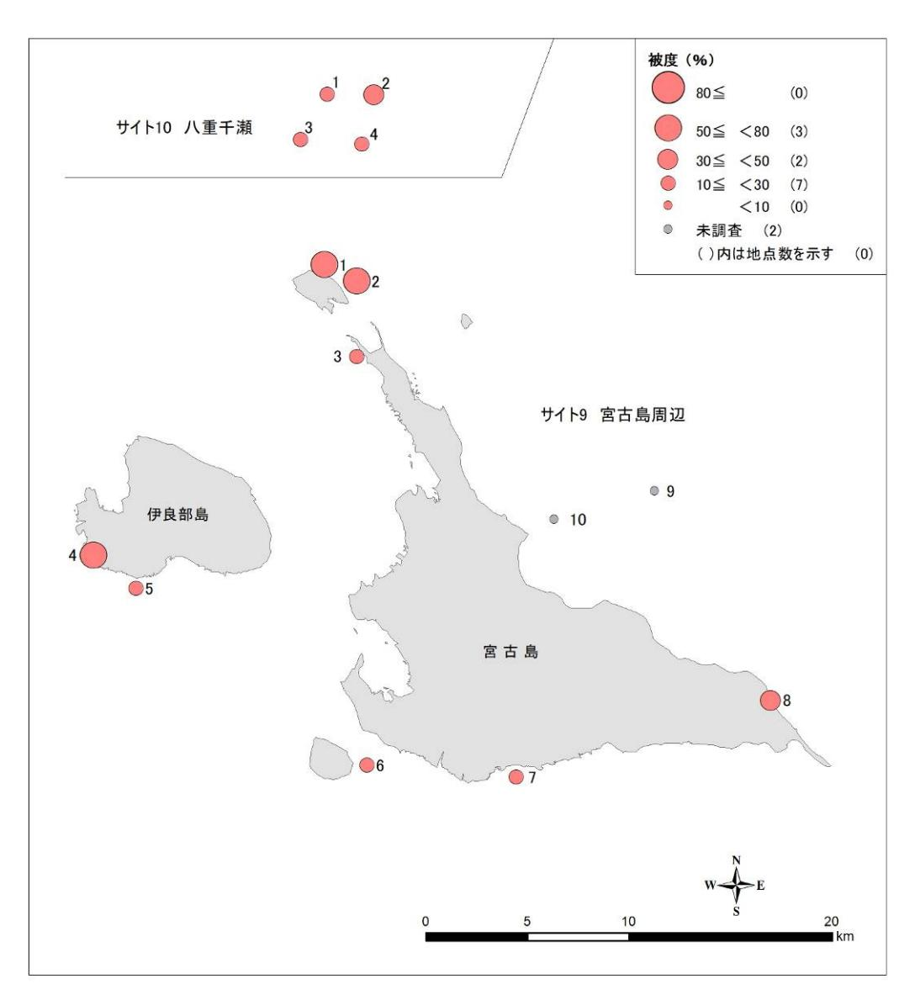

図 I-6-2 モニタリングサイト 1000 サンゴ礁調査 サンゴ被度分布図(2021) サイト(9)~(10)宮古島周辺、八重干瀬

#### ⑤ 主な調査地点景観

#### <宮古島周辺サイト> <八重干瀬サイト>

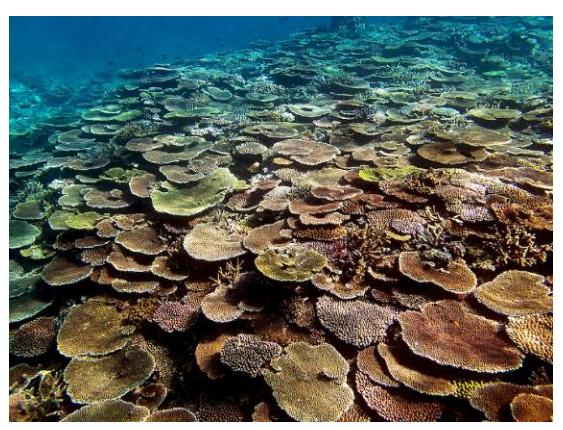

地点 2(池間島東チュラビジ)卓状ミドリ 地点 2(八重干瀬・カナマラ中央南) イシ類を主とする高密度群落。 ミドリイシ類が高密度に見られた。

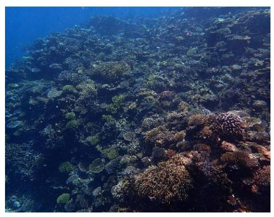

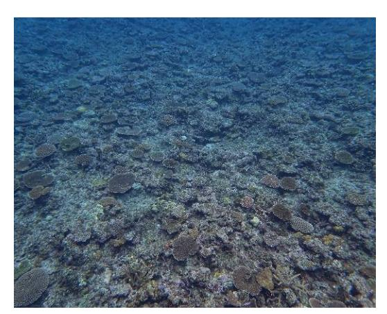

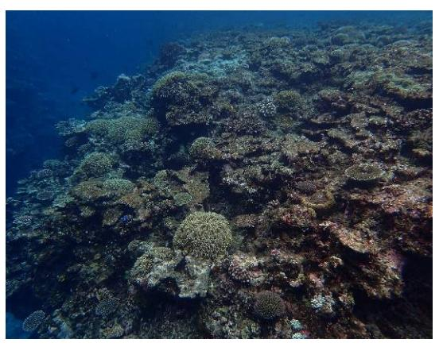

地点 10(平良高野漁港沖二段干瀬) 地点 3(八重干瀬クンディ・ガマ) 被度回復傾向にある。 様々な種が点在する多種混成型サンゴ群集。

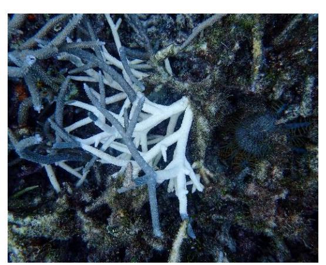

地点 1(池間島北カギンミ)食痕と近くに 地点 3(八重干瀬クンディ・ガマ) 潜むオニヒトデ。 食痕付近に潜むオニヒトデ。

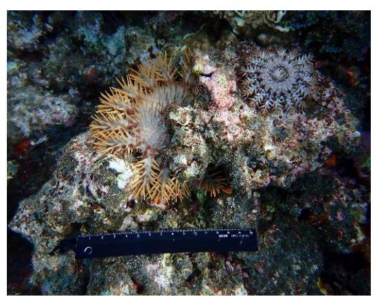

(6)サイト 11:石垣島東岸/平久保崎~宮良湾

サイト 12:石垣島西岸/川平~大崎

サイト 11 及び 12 をひとまとまりの海域とし、調査実施者が同じであるため、まとめて 記述する。

#### 1)実施状況

有限会社海游の吉田稔氏が代表となり、同社の本宮信夫氏、大石健太氏とともに実施し た。

2)調査地点:77 地点(サイト 11:33 地点+サイト 12:44 地点)(図 I-7-1)

サイト 11:石垣島東岸/平久保崎~宮良湾における調査地点(モニタリングスポット: 33 地点)

地点 1:大浜小前

地点 2:宮良川河口

地点 3:宮良集落前

地点 4:白保集落前

地点 5:白保アオサンゴ

地点 6:白保第1ポール

地点 7:白保~轟川

地点 8:轟川河口

地点 9:モリヤマグチ

地点 10:スムジグチ

地点 11:採石場前

地点 12:通路川南

地点 13:通路川水路北

地点 14:野原崎

地点 15:伊野田漁港前

地点 16:大野牧場前

地点 17:玉取崎南

地点 18:玉取崎東

地点 19:伊原間牧場前

地点 20:トムル崎南

地点 21:トムル崎

地点 22:パラワールド前

地点 23:明石~安良崎

地点 24:安良崎南

地点 25:安良崎

地点 26:安良グチ北

地点 27:岩崎南

地点 28:岩崎

地点 29:岩崎~浦崎

地点 30:浦崎沖

地点 31:浦崎前

地点 32:平野集落前

地点 33:平久保灯台北

# サイト 12:石垣島西岸/川平~大崎における調査地点(モニタリングスポット:44 地点)

地点 1:平久保灯台西

地点 2:平久保川北

地点 3:平久保集落南

地点 4:嘉良川前

地点 5:ダテフ崎北

地点 6:ダテフ崎南

地点 7:野底石崎

地点 8:栄集落前

地点 9:野底集落前

地点 10:野底崎

地点 11:伊土名北

地点 12:伊土名南

地点 13:浦底湾口北

地点 14:浦底湾口西

地点 15:富野集落前

地点 16:米原キャンプ場

地点 17:ヤマバレー前

地点 18:ヤマバレー西

地点 19:川平小島東

地点 20:川平小島北

地点 21:川平水路東

地点 22:川平水路

地点 23:川平水路北西

地点 24:川平~石崎

地点 25:クラブメッド前

地点 26:川平石崎北

地点 27:川平石崎南

地点 28:底地ビーチ沖

地点 29:崎枝湾内

地点 30:崎枝湾口

地点 31:崎枝~御神

地点 32:御神崎

地点 33:御神~屋良部

地点 34:屋良部崎北

地点 35:屋良部崎南

地点 36:屋良部~大崎

地点 37:名蔵保護水面

地点 38:富崎小島前

地点 39:観音崎

地点 40:真栄里海岸前

地点 41:赤崎

地点 42:名蔵川河口

地点 43:明石西

地点 44:伊原間湾口

3)調査期間: 2021 年 9 月 1 日~2021 年 11 月 6 日

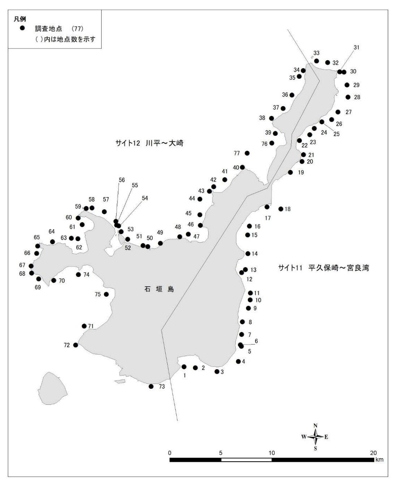

図 I-7-1 モニタリングサイト 1000 サンゴ礁調査 調査地点図(2021) サイト(11)~(12)石垣島東岸・西岸 ●は今年度調査を実施した地点。

4)調査結果: 地点ごとのサンゴ被度の状況を図 I-7-2 に示す。

#### ① 今年度のサンゴの状況

<平均サンゴ被度>

全調査地点:30%「やや不良」(サンゴ被度 30%以上 50%未満)

- ・ 石垣島東岸(サイト 11):30%「やや不良」
- ・ 石垣島西岸(サイト 12):40%「やや不良」
- ・ 石垣島周辺海域では 2016 年に大規模な白化現象が発生し、被度が減少したが、 2018 年度調査からサンゴ被度が回復傾向に転じ、本年度もその傾向が継続し ていた。

# <地点毎のサンゴ被度>

「優良」(80%以上)

- ・ 石垣島東岸で 1 地点(地点 27)
- ・ 石垣島西岸で 3 地点(地点 5、12、15)

「良」(50%以上 80%未満)

- ・ 石垣島東岸で 8 地点(地点 5、6、17、19、24、28、29、31)
- ・ 石垣島西岸で 14 地点(地点 8、13、14、16、17、18、24、27、28、29、31、 33、40、44)

「やや不良」(30%以上 50%未満)

- ・ 石垣島東岸で 8 地点(地点 2、7、8、12、13、30、32、33)
- ・ 石垣島西岸で 8 地点(地点 10、11、19、20、25、30、32、36)

「不良」(10%以上 30%未満)

- ・ 石垣島東岸で 11 地点(地点 1、9、10、14、16、18、20、21、23、25、26)
- ・ 石垣島西岸で 14 地点(地点 2、3、6、9、21、22、34、35、37、38、39、41、 42、43)

「極めて不良」(10%未満)

- ・ 石垣島東岸で 5 地点(地点 3、4、11、15、22)
- ・ 石垣島西岸で 5 地点(地点 1、4、7、23、26)

#### <サンゴの加入数>

- ・ 石垣島東岸の平均値 1.0 群体/㎡(昨年度 0.8 群体/㎡)
- ・ 石垣島西岸の平均値 1.6 群体/㎡(昨年度 1.5 群体/㎡)
- ・ 昨年と同じく西岸の方が多かった。新規加入数 5 群体/㎡以上は 4 地点あった が、これらの地点は 1 地点を除きサンゴ被度が増加しており、新規群体の加入 する空き地が減っている可能性がある。

# ② 昨年度のサンゴの状況との比較

<平均サンゴ被度>

全調査地点:昨年度と同じ 30%

- ・ 石垣島東岸:昨年度と同じ 30%
- ・ 石垣島西岸:昨年度(30%)から 10 ポイント増加して 40%
- ・ 石垣島西岸でサンゴ被度が増加した地点が多く、全体の被度も増加傾向となっ た。

#### <地点毎のサンゴ被度>

30 ポイント以上「大きく増加」した地点

- ・ 石垣島東岸:0 地点(昨年度は 0 地点)
- ・ 石垣島西岸:0 地点(昨年度は 6 地点)
- 10 ポイント以上 30 ポイント未満で「増加」した地点
  - ・ 石垣島東岸:10 地点(昨年度は 5 地点)
  - ・ 石垣島西岸:15 地点(昨年度は 17 地点)
- 30 ポイント以上「大きく減少」した地点
  - ・ 石垣島東岸:0 地点(昨年度は 0 地点)
  - ・ 石垣島西岸:1 地点(昨年度は 0 地点)
- 10 ポイント以上 30 ポイント未満で「減少」した地点
  - ・ 石垣島東岸:0 地点(昨年度は 1 地点)
  - ・ 石垣島西岸:1 地点(昨年度は 0 地点)

#### ③ 今年度のかく乱の状況

<オニヒトデ>

全地点で確認されなかった。屋良部崎周辺にて食痕が見つかったため、局所的に個 体数が増加していることが懸念される。

<白化>

夏季の高水温が原因と考えられる白化現象は観察されなかった。

<その他>

サンゴ食巻貝類の食害や海藻類の繁茂、サンゴの病気、テルピオスの分布などは、 いずれも例年と同水準であった。

# ④ その他

被度の回復傾向が続いているが、まだ 2016 年の大規模白化前のような高被度の状態に は至っていない。

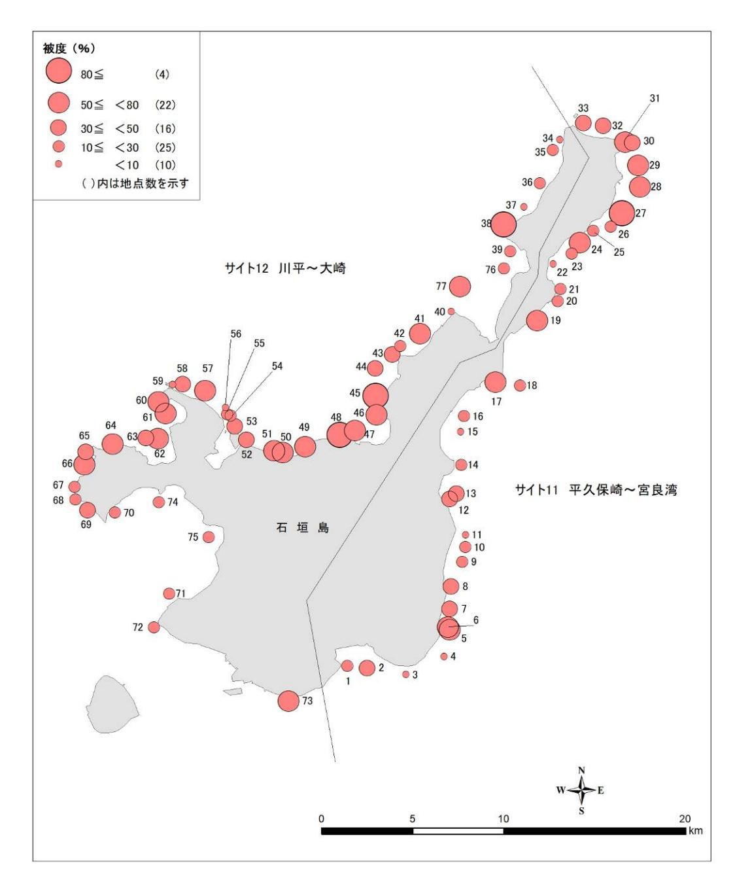

図 I-7-2 モニタリングサイト 1000 サンゴ礁調査 サンゴ被度分布図(2021) サイト(11)~(12)石垣島東岸・西岸

# ⑤ 主な調査地点の景観

<石垣島・東岸> <石垣島・西岸>

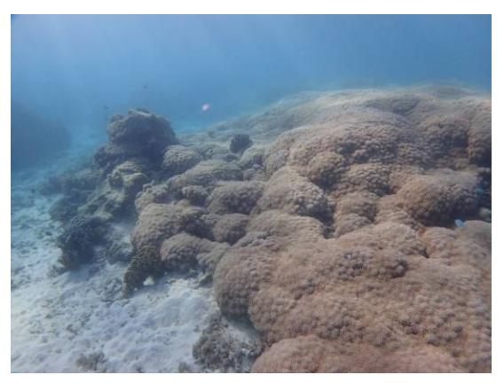

地点 19(伊原間牧場前):サンゴ被度 70% 地点 5(ダテフ崎北):卓状ミドリイシ群集 のエダハナガササンゴの大群集 (サンゴ被度 80%)

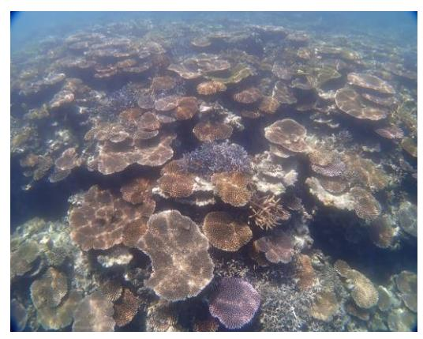

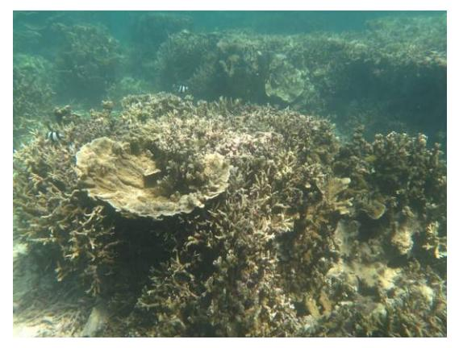

コモンサンゴ類の群集 集(サンゴ被度 80%)

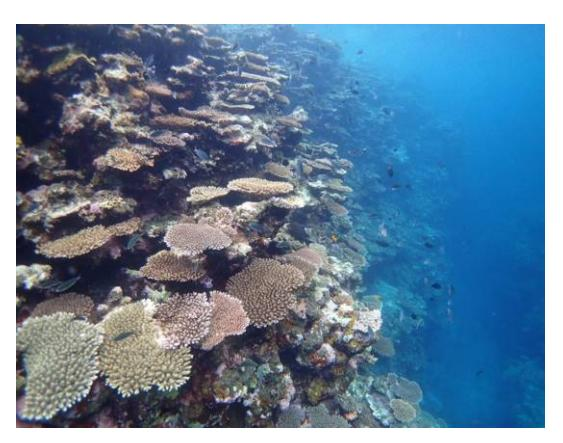

地点 27(岩崎南):サンゴ被度 80%の 地点 15(富野集落前):卓状ミドリイシ類群

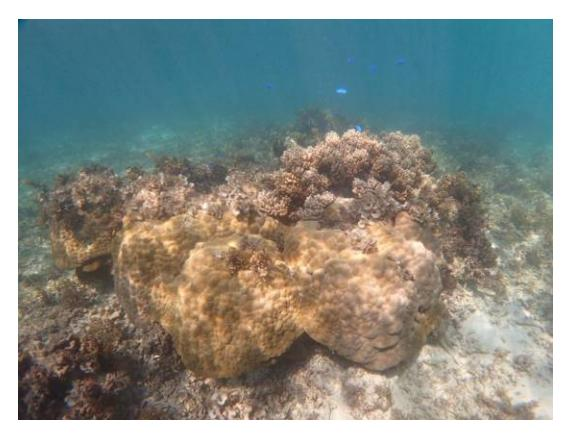

地点 15(伊野田漁港前):ハマサンゴ類など 地点 33(御神~屋良部):ミドリイシ類に がわずかに見られる程度(サンゴ被度<1%) 見られたホワイトシンドローム

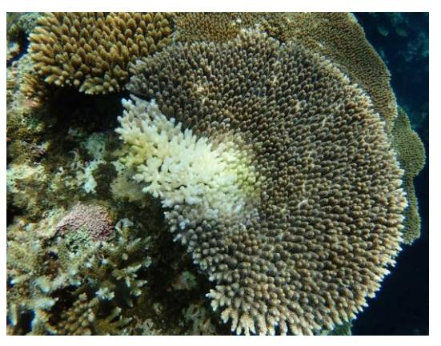

(7) サイト 13:石西礁湖・北部/小浜島周辺

サイト 14:石西礁湖・東部/カタグァー周辺

サイト 15:石西礁湖・中央部/シモビシ~仲間崎沖

サイト 16:石西礁湖・南部/黒島~新城島

サイト 17:西表島と周辺離島/崎山湾(西表島西部)周辺

サイト 13~17 をひとまとまりの海域とし、調査実施者が同じであるため、まとめて記述 する。

# 1)実施状況

一般財団法人自然環境研究センターの木村匡研究員を代表者とし、石西礁湖サンゴ礁調 査の上野光弘氏と八重山漁業協同組合の砂川政彦氏、川﨑豊氏が実施した。

2)調査地点:125 地点(サイト 13:28 地点+サイト 14:20 地点+サイト 15:24 地点 +サイト 16:30 地点+サイト 17:23 地点)(図 I-8-1~2)

サイト 13:石西礁湖・北部/小浜島周辺における調査地点(モニタリングスポット:28 地点)

地点 27:小浜島東沖

地点 28:嘉弥真島南岸礁縁

地点 31:嘉弥真島南西岸礁池内

地点 32:小浜島北東岸礁縁

地点 35:ヨナラ水道南礁縁

地点 36:ヨナラ水道南①

地点 42:小浜島東沖礁湖内①

地点 43:小浜島東沖礁湖内②

地点 44:嘉弥真島東沖礁湖内

地点 49:竹富島西沖離礁礁縁

地点 50:竹富島西沖離礁外縁

地点 51:竹富島北岸礁外縁

地点 52:竹富島北東岸礁外縁

地点 53:竹富島北東沖礁縁

地点 62:ヨナラ水道南②

地点 63:ヨナラ水道南部

地点 64:ヨナラ水道中央部①

地点 65:ヨナラ水道北部

地点 67:小浜島東沖離礁①

地点 68:嘉弥真島東沖礁内縁

地点 71:嘉弥真島東沖礁外縁

地点 72:嘉弥真島北岸礁外縁①

地点 73:嘉弥真島北岸礁外縁②

地点 74:小浜島北岸礁外縁

地点 75:ヨナラ水道中央部②

地点 110:小浜島東沖離礁②

地点 112:タキドングチ海中公園地区

地点 116:鵜離島前離礁

サイト 14:石西礁湖・東部/カタグァー周辺における調査地点(モニタリングスポット: 20 地点)

地点 46:シモビシ海中公園地区

地点 47:竹富島南西岸礁縁

地点 54:竹富島東沖離礁

地点 76:アーサーピー外縁

地点 77:ウマノハピー礁内①

地点 78:ウマノハピー礁内②

地点 79:ウマノハピー礁内③

地点 80:ウマノハピー内縁①

地点 81:ウマノハピー内縁②

地点 82:ウマノハピー内縁③

地点 83:ウマノハピー内縁④

地点 84:ウマノハピー外縁①

地点 87:アーサーピー内縁①

地点 88:アーサーピー内縁②

地点 89:アーサーピー内縁③

地点 90:アーサーピー内縁④

地点 93:ウマノハピー外縁②

地点 109:竹富島南沖離礁①

地点 114:竹富島南沖離礁②

地点 115:ウマノハピー礁内④

サイト 15:石西礁湖・中央部/シモビシ~仲間崎沖における調査地点(モニタリングス ポット:24 地点)

地点 4:黒島北沖離礁①

地点 5:黒島北沖離礁②

地点 19:黒島北沖離礁③

地点 20:黒島北沖離礁④

地点 22:黒島-小浜島間離礁①

地点 23:小浜島南東岸礁縁

地点 24:小浜島南東沖礁縁①

地点 25:小浜島南東沖礁縁②

地点 37:黒島-西表島間離礁①

地点 38:黒島-西表島間離礁②

地点 39:黒島-小浜島間離礁②

地点 40:小浜島南東沖離礁①

地点 41:小浜島南東沖離礁②

地点 58:西表島東沖離礁①

地点 59:西表島東沖離礁②

地点 60:西表島東沖離礁③

地点 61:西表島東岸礁池内

地点 66:小浜島南礁縁

地点 104:新城島-西表島間離礁②

地点 106:黒島北西沖離礁

地点 107:小浜島南沖離礁

地点 108:ヨナラ水道南沖離礁

地点 111:小浜島南東沖離礁③

地点 113:西表島仲間崎沖離礁

サイト 16:石西礁湖・南部/黒島~新城島における調査地点(モニタリングスポット:

30 地点)

地点 1:ウラビシ南礁縁

地点 2:ウラビシ東礁縁

地点 3:ウラビシ北東礁縁

地点 6:黒島北西岸礁縁

地点 7:黒島西岸礁池内

地点 8:黒島南西岸礁池内①

地点 9:黒島南岸礁池内

地点 10:黒島南東岸礁池内①

地点 11:黒島北東岸礁池内

地点 12:新城島上地北岸離礁

地点 13:マイビシ海中公園地区

地点 14:新城島上地西岸

地点 15:新城島間水路部

地点 16:新城島下地西岸礁池内①

地点 17:新城島下地西岸礁池内②

地点 45:ウラビシ北離礁

地点 69:黒島南東岸礁池内②

地点 70:黒島南西岸礁池内②

地点 85:新城島水路部礁池内

地点 94:黒島南西岸礁外縁

地点 95:黒島南岸礁外縁

地点 96:キャングチ海中公園地区

地点 97:黒島東岸礁外縁

地点 98:新城島上地東岸礁外縁

地点 99:新城島下地南東岸礁外縁

地点 100:新城島下地西岸礁外縁

地点 101:新城島北西沖離礁

地点 102:新城島-西表島間離礁①

地点 103:南風見崎沖離礁外縁東

地点 105:黒島-新城島間大型離礁

サイト 17:西表島と周辺離島/崎山湾(西表島西部)周辺における調査地点(モニタ リングスポット:23 地点)

地点 120:ユツン湾口礁縁

地点 121:船浦沖離礁

地点 122:バラス島西

地点 123:鳩間島南東礁池①

地点 124:鳩間島南東礁池②

地点 125:鳩間島南西沖離礁

地点 126:星砂浜前礁縁

地点 126':星砂浜前礁池内

地点 127:タコ崎礁縁

地点 127':タコ崎礁浅部

地点 129:網取湾奥

地点 130:ヨナソネ

地点 131:崎山礁縁

地点 132:崎山礁池

地点 133:波照間石

地点 134:鹿川湾中ノ瀬①

地点 135:鹿川湾中ノ瀬②

地点 136:サザレ浜礁縁

地点 137:豊原沖礁縁

地点 138:船浮崎前

地点 139:外パナリ南礁縁

地点 141:鳩間島・東礁縁

地点 142:鳩間島・北礁縁

3)調査期間: 2021 年 10 月 21 日~11 月 16 日

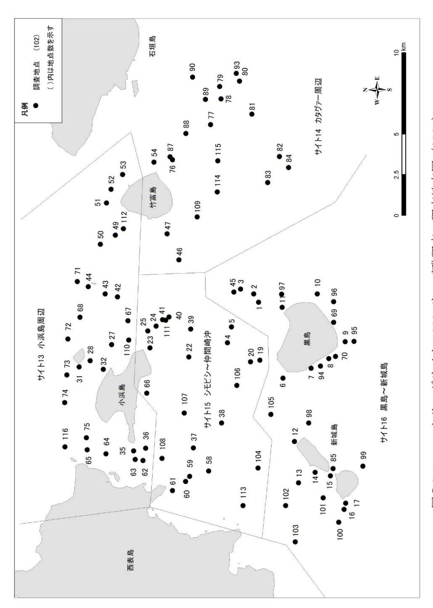

図 I-8-1 モニタリングサイト 1000 サンゴ礁調査 調査地点図(2021) サイト(13)~(16)石西礁湖・北部・東部・中央部・南部

●は今年度調査を実施した地点。

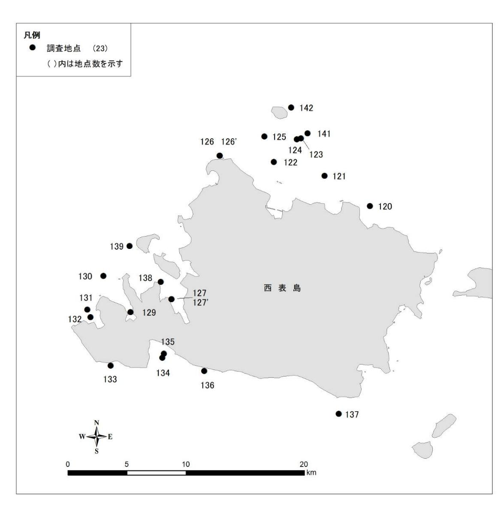

図 I-8-2 モニタリングサイト 1000 サンゴ礁調査 調査地点図(2021) サイト(17)西表島と周辺離島 ●は今年度調査を実施した地点。

4)調査結果: 調査地点ごとのサンゴ被度の状況を図 I-8-3~4 に示す。

## ① 今年度のサンゴの状況

<平均サンゴ被度>

全調査地点:30%「やや不良」(サンゴ被度 30%以上 50%未満)

- ・ 石西礁湖・北部(サイト 13):40%「やや不良」
- ・ 石西礁湖・東部(サイト 14):10%「不良」(10%以上 30%未満)
- ・ 石西礁湖・中央部(サイト 15):30%「やや不良」
- ・ 石西礁湖・南部(サイト 16):20%「不良」
- ・ 西表島と周辺離島(サイト 17):50%「良」(50%以上 80%未満)

# <地点毎のサンゴ被度>

「優良」(80%以上)

・ 西表島と周辺離島:1 地点(地点 129 のアザミサンゴの大群集)

「良」(50%以上 80%未満)

全調査地点:33 地点

- ・ 石西礁湖・北部:11 地点(地点 28、31、35、36、62、63、64、65、71,72, 116)
- ・ 石西礁湖・東部:0 地点
- ・ 石西礁湖・中央部:6 地点(地点 37、58、59、60、107、108)
- ・ 石西礁湖・南部:4 地点(地点 9、69、85、95)
- ・ 西表島と周辺離島:12 地点(地点 120、121、122、124、125、126、126'、 130、133、135、141、142)

「やや不良」(30%以上 50%未満)

全調査地点:17 地点

- ・ 石西礁湖・北部:7 地点(地点 42、50、67、73、74、75、112)
- ・ 石西礁湖・東部:1 地点(地点 84)
- ・ 石西礁湖・中央部:2 地点(地点 40、111)
- ・ 石西礁湖・南部:2 地点(地点 2、10)
- ・ 西表島と周辺離島:5 地点(地点 127、127'、134、136、138)

「不良」(10%以上 30%未満)

全調査地点:61 地点

- ・ 石西礁湖・北部:9 地点(地点 27、43、44、49、51、52、53、68、110)
- ・ 石西礁湖・東部:13 地点(地点 46、47、54、76、77、80、82、87、88、90、 109、114、115)
- ・ 石西礁湖・中央部:15 地点(地点 4、5、19,20,22、24、25、38、39、41、 61、66、104、106、113)

- ・ 石西礁湖・南部:20 地点(地点 3、6、7、8、12、13、15、16、17、45、70、 94、96、98、99、100、101、102、103、105)
- ・ 西表島と周辺離島:4 地点(地点 131、132、137、139)

「極めて不良」(10%未満)

全調査地点:13 地点

- ・ 石西礁湖・北部:1 地点(地点 32)
- ・ 石西礁湖・東部:6 地点(地点 78、79、81、83、89、93)
- ・ 石西礁湖・中央部:1 地点(地点 23)
- ・ 石西礁湖・南部:4 地点(地点 1、11、14、97)
- ・ 西表島と周辺離島:1 地点(地点 123)

#### ② 昨年度のサンゴの状況との比較

昨年度に引き続き、2016 年の大規模白化現象によるサンゴ被度減少からの回復過程で あると考えられる。

<平均サンゴ被度>

全調査地点:昨年度と同じ 30%

- ・ 石西礁湖・北部:昨年度と同じ 40%
- ・ 石西礁湖・東部:昨年度と同じ 10%
- ・ 石西礁湖・中央部:昨年度(20%)から 10 ポイント増加して 30%
- ・ 石西礁湖・南部:昨年度と同じ 20%
- ・ 西表島と周辺離島:昨年度から 10 ポイント増加して 50%

#### <地点毎のサンゴ被度>

30 ポイント以上「大きく増加」した地点

全調査地点:2 地点(昨年度は 2 地点)

- ・ 西表島と周辺離島:2 地点(地点 125、142)
- ・ 石西礁湖全体のサンゴ被度の回復傾向に貢献した。
- 10 ポイント以上 30 ポイント未満で「増加」した地点

全調査地点:27 地点(昨年度は 36 地点)

- ・ 石西礁湖・北部:7 地点(地点 36、42、51、62、65、67、116)
- ・ 石西礁湖・東部:2 地点(地点 84、87)
- ・ 石西礁湖・中央部:6 地点(地点 19、22、37、40、58、108)
- ・ 石西礁湖・南部:2 地点(地点 45、69)
- ・ 西表島と周辺離島:10 地点(地点 120、121、124、126'、133、134、135、 136、138、141)
- ・ 石西礁湖全体のサンゴ被度の回復傾向に貢献した。

10 ポイント以上 30 ポイント未満「減少」した地点

全調査地点:12 地点(昨年度は 10 地点)

- ・ 石西礁湖・北部:4 地点(地点 31、50、68、75)
- ・ 石西礁湖・東部:0 地点
- ・ 石西礁湖・中央部:2 地点(地点 59、66)
- ・ 石西礁湖・南部:5 地点(地点 7、8、10、70、103)
- ・ 西表島と周辺離島:1 地点(地点 137)

# ③ 今年度のかく乱の状況

#### <白化>

・ 本年度も大規模な白化現象が発生し、全地点の平均白化率は57.5%(昨年度52.2%) であったが、死亡率は 1.4%(昨年度 2.4%)と低く、影響は軽微であった。

#### <オニヒトデ>

- ・ 125 調査地点中 34 地点(約 27%)で観察され、昨年度の 23 地点から増加した。
- ・ 総観察数は昨年度の 33 個体から増加し、56 個体であった。
- ・ 要注意レベル(1 人当たりの 15 分間観察数:2 以上 5 未満)の地点が石西礁湖北 部に 1 地点(地点 52:合計観察数 4、一人当たり観察数は 2)あり、準大発生レ ベル(同:5 以上 10 未満)の地点が西表島周辺に 1 地点(地点 122:合計観察数 11、一人当たり観察数 5.5)存在した。準大発生レベルの出現は 2014 年以来であ る。

#### <感染症>

・ 腫瘍が 43 地点(昨年度は 38 地点)、黒帯病が 36 地点(昨年度は 34 地点)、ホワ イトシンドロームは全調査地点の 90%以上にあたる 120 地点(昨年度は 119 地点) で増加傾向が継続していた。

#### <その他>

・ 赤土流出量の目安となる SPSS 階級では、サンゴに影響を与えるランク 5b 以上の 地点数が SPSS の測定を実施した 82 地点中 46 地点(昨年度 42 地点)と過半数を 超え、堆積物の状況は昨年度よりさらに悪化した状況になっていた。

# ④ その他

特になし。

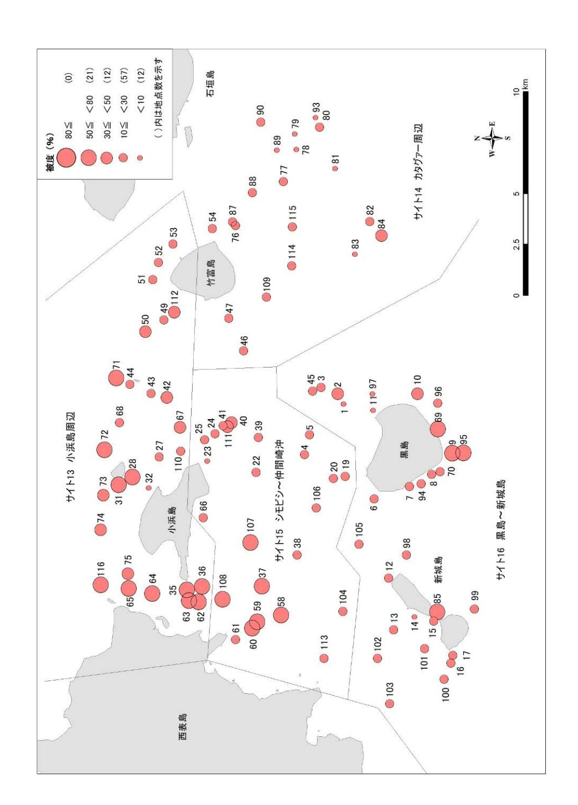

図 I-8-3 モニタリングサイト 1000 サンゴ礁調査 サンゴ被度分布図(2021) サイト(13)~(16)石西礁湖・北部・東部・中央部・南部

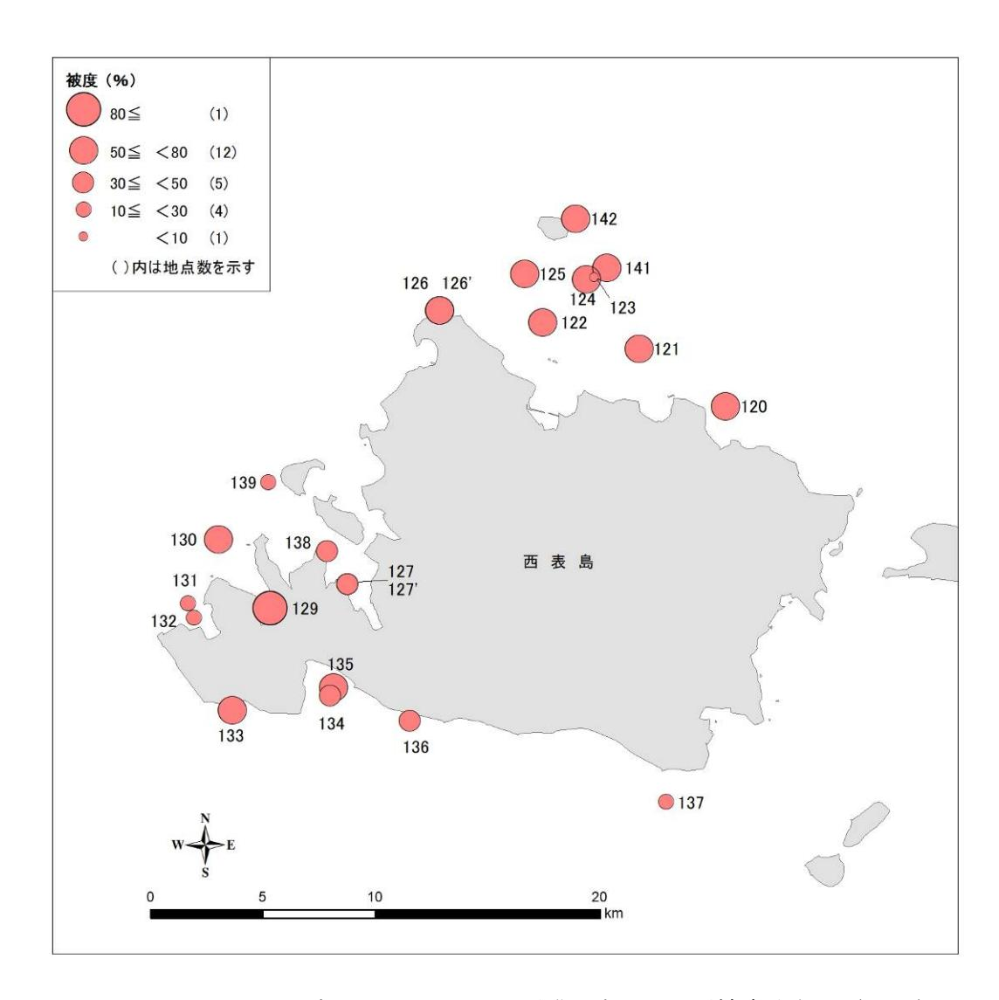

図 I-8-4 モニタリングサイト 1000 サンゴ礁調査 サンゴ被度分布図(2021) サイト(17)崎山湾(西表島西部)周辺

# ⑤ 主な調査地点の景観

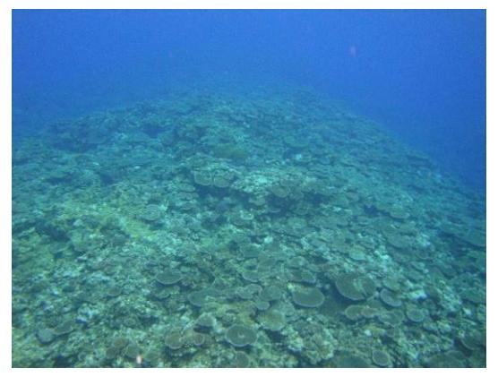

サイト 13(石西礁湖・北部) サイト 17(西表島周辺) 地点 116(鵜離島前離礁) 地点 142(鳩間島北礁縁)

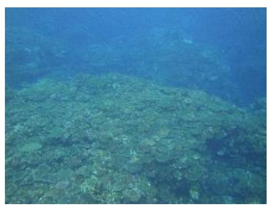

サンゴ被度が昨年の 40%から 60%に増加。 サンゴ被度が昨年の 40%から 70%に増加。

サイト 17(西表島周辺) サイト 16(石西礁湖・南部) 地点 122(バラス島西) 地点 12(新城島上地北岸離礁) 準大発生レベルのオニヒトデが観察された。 サンゴの病気(黒帯病)。

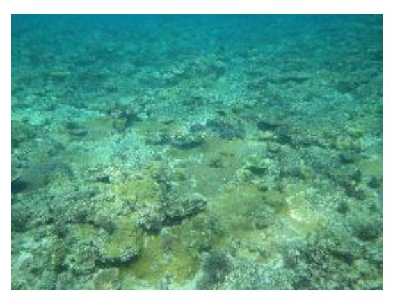

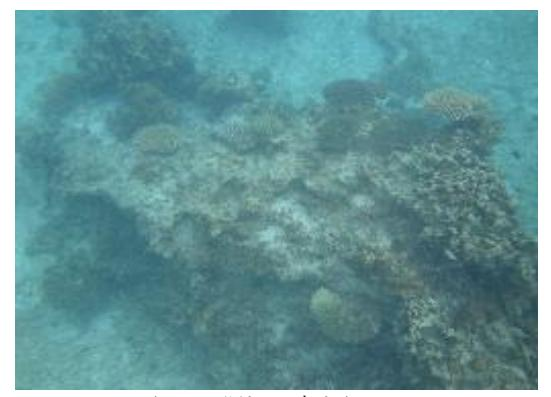

サイト 16(石西礁湖・南部) サイト 16(石西礁湖・南部) 地点 8(黒島南西岸礁池内①) 地点 8(黒島南西岸礁池内①) サンゴの病気(ホワイトシンドローム)。 夏季高水温によると思われる白化現象。

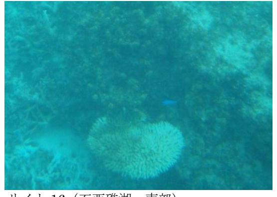

#### (8) サイト 18:小笠原諸島/父島周辺

#### 1)実施状況

NPO 法人小笠原自然文化研究所の佐々木哲朗研究員が代表となり、同研究所の飴田洋祐 研究員とダイビングサービス KAIZIN の山田鉄也氏と塙千明氏と共に実施した。

2)調査地点: 12 地点(父島周辺:9 地点+兄島周辺:3 地点)(図 I-9-1)

サイト 18:小笠原諸島/父島周辺における調査地点(モニタリングスポット:12 地点)

兄島 地点 1:兄島・滝之浦

地点 2:兄島・キャベツビーチ

地点 3:兄島・水玉湾西側

父島 地点 4:父島・宮之浜

地点 5:父島・釣浜

地点 6:父島・初寝浦

地点 7:父島・巽東海岸

地点 8:父島・巽中海岸

地点 9:父島(属)・南島サンゴ池

地点 10:父島・コペペ海岸

地点 11:父島・野羊山内側

地点 12:父島・二見湾奥

3)調査期間: 2022 年 1 月 17 日~1 月 19 日

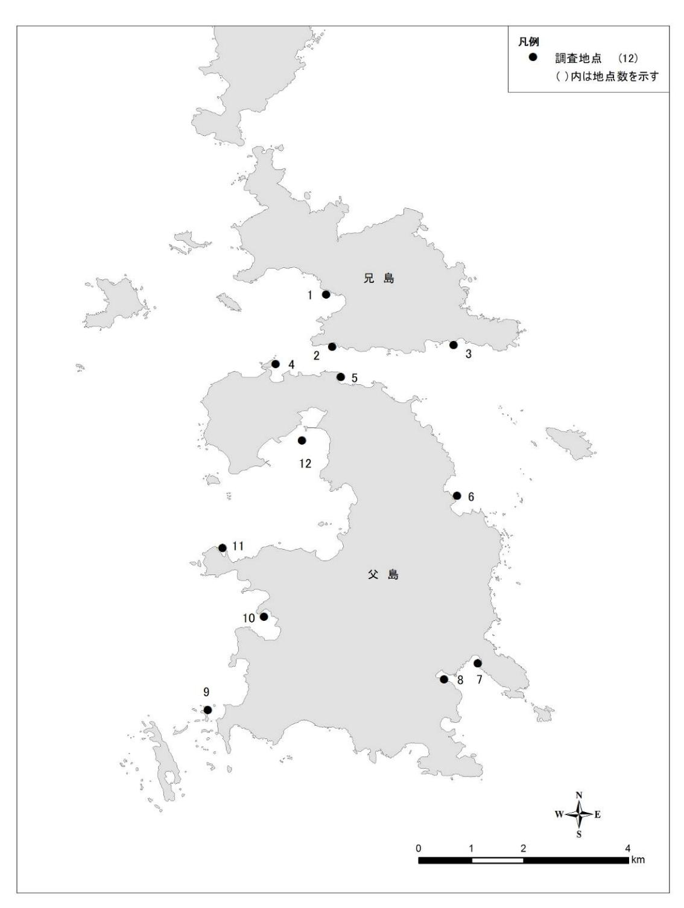

図 I-9-1 モニタリングサイト 1000 サンゴ礁調査 調査地点図(2021) サイト(18)父島周辺 ●は今年度調査を実施した地点。

4)調査結果: 調査地点ごとのサンゴ被度の状況を図 I-9-2 に示す。

# ① 今年度のサンゴの状況

<平均サンゴ被度>

・ 50%「良」(サンゴ被度 50%以上 80%未満)

<地点毎のサンゴ被度>

「良」(50%以上 80%未満)

- ・ 7 地点(地点 1、2、3、4、5、8、12)
- ・ サンゴ被度は多種混成型の地点 3(兄島・水玉湾西側)、地点 4(父島・宮之浜) とスギノキミドリイシ優占型の地点 12(父島・二見湾奥)が 70%と最も高か った。

「やや不良」(30%以上 50%未満)

・ 4 地点(地点 6、7、9、10)

「不良」(10%以上 30%未満)

- ・ 1 地点(地点 11)
- ・ サンゴ被度が最も低かったのは、多種混成型の地点 11(父島・野羊山内側) の 20%であった。

#### ② 昨年度のサンゴの状況との比較

<平均サンゴ被度>

・ 昨年度と同じ 50%

<地点毎のサンゴ被度>

- 10 ポイント以上 30 ポイント未満で「増加」した地点
  - ・ 4 地点(昨年度は 6 地点)
- 10 ポイント以上 30 ポイント未満「減少」した地点
  - ・ 2 地点(昨年度は 2 地点)

# ③ 今年度のかく乱の状況

<白化>

・2021 年 9 月に過去最高水温付近まで上昇したものの、その後水温は低下したため、 白化による被度低下は生じていなかった(昨年度は高水温による白化現象が生じ、 地点 12(父島・二見湾奥)では斃死によって被度が低下した)。

#### <感染症>

- ・12 地点において何らかの病気と思われる症状が確認された(昨年度は 8 地点)。
- ・枝状および卓状ミドリイシが不規則な退色後に斃死する症状のものが代表的で、被 度低下につながる場合がある。
- ・症状はミドリイシ類の骨格異常(腫瘍)が各地で散見されるが、大量死は生じてい

なかった。

・ホワイトシンドロームと思われる症状も少数見られた。

#### <台風>

- ・波浪によると思われる転倒は数群体で確認されたが、大きな被害は生じなかった。 <オニヒトデ>
  - ・地点 12(父島・二見湾奥)では近年オニヒトデが高い密度(要注意~準大発生レベ ル)で生息しており、環境省事業による試験駆除が実施されてきた。昨年度末に実 施した駆除作業では、明らかな減少傾向が見られ、駆除の効果が確認された。
  - ・今年度調査では計 3 個体が確認されており、引き続き動向をモニタリングする必要 がある。

#### <軽石の漂着>

・ 福徳岡ノ場の海底噴火で生じた軽石が日本各地に漂着しているが、小笠原群島では 今のところ漂着被害は生じていない。

#### ④ その他

特になし。

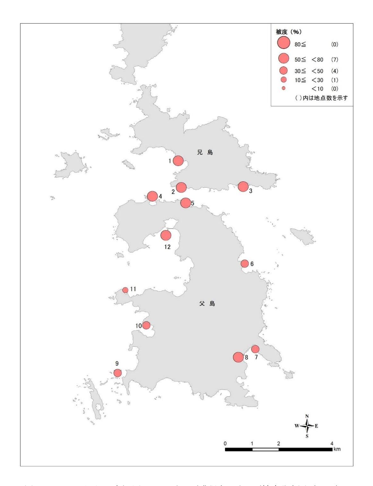

図 I-9-2 モニタリングサイト 1000 サンゴ礁調査 サンゴ被度分布図(2021) サイト(18)父島周辺

#### ⑤ 主な調査地点の景観

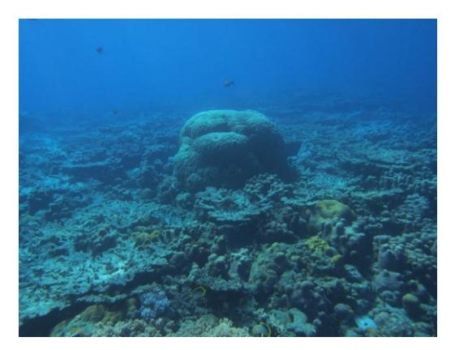

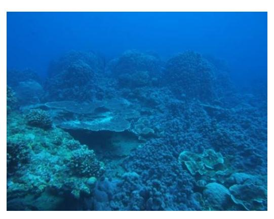

地点 2(兄島キャベツビーチ) 地点 3(兄島・水玉湾西側) 被度 60%の多種混成型群集 被度 70%の多種混成型群集。オガサワラ アザミサンゴが顕著

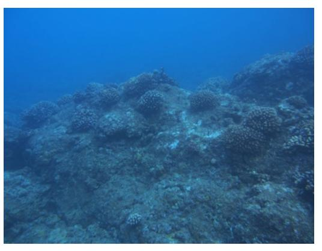

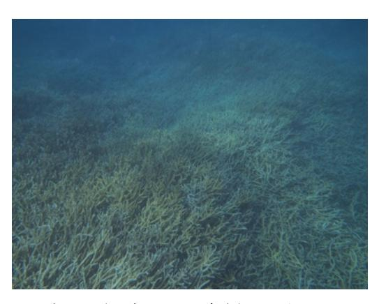

地点 11(父島・野羊山内側) 地点 12(父島・二見湾奥)スギノキミドリ 被度 20%の多種混成型群集。 イシ優占型。今年度は白化は少なかった。 (白化率 5%未満)

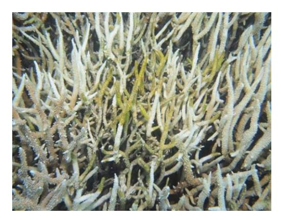

地点 12(父島・二見湾奥)スギノキミドリ 地点 12(父島・二見湾奥)水深 1.5m 付近

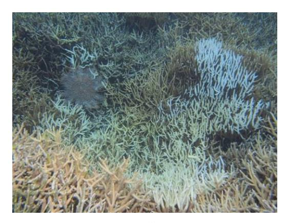

イシの感染症と思われる退色と斃死 のスギノキミドリイシ群落の窪みで確認さ れたオニヒトデ

(9) サイト 19:館山(房総)

#### 1)実施状況

館山湾にあるお茶の水女子大学湾岸生物教育研究センターの清本正人准教授が代表とな り、同じ館山湾内に位置する東京海洋大学水圏科学フィールド教育研究センターの須之部 友基准教授とともに調査を実施した。地点 1(沖ノ島①)、地点 2(沖ノ島②)及び地点 5 (雀島)の調査を清本准教授が、地点 3(坂田①)、地点 4(坂田②)及び地点 6(坂田③) の調査を須之部准教授が実施した。

なお、このサイトは主なサンゴ礁域に比べて透明度が低いため、従来のスポットチェッ ク法で行うスノーケリングではなく、スキューバダイビングにより調査を実施した。

2)調査地点: 館山湾内 6 地点(沖ノ島周辺:2 地点+雀島:1 地点+坂田周辺:3 地点) 2021 年度はこれらすべての地点で調査を実施した(図 I-10-1)。

サイト 19:館山(房総)における調査地点(モニタリングスポット:6 地点)

地点 1:沖ノ島①

地点 2:沖ノ島②

地点 3:坂田①

地点 4:坂田②

地点 5:雀島

地点 6:坂田③

3)調査期間: 2021 年 10 月 28 日~11 月 30 日

図 I-10-1 モニタリングサイト 1000 サンゴ礁調査 調査地点図(2021) サイト(19)館山(房総)

●は今年度調査を実施した地点。

4)調査結果: 調査地点ごとのサンゴ被度の状況を図 I-10-2 に示す。

# ① 今年度のサンゴの状況

<平均サンゴ被度>

- ・ 5%未満「極めて不良」(サンゴ被度 10%未満)
- ・ サンゴ被度の区分では「不良」及び「極めて不良」の評価に該当するが、これまで と同様、低被度ながら群集を健全に維持していた。

# <地点毎のサンゴ被度>

「不良」(10%以上 30%未満)

- ・ 1 地点(地点 6)
- ・ アワサンゴ群集が優占する地点 6 のサンゴ被度が 10%であった。新たに卓状ミドリ イシの小群体が見つかった。

「極めて不良」(10%未満)

- ・ 5 地点(地点 1、2、3、4、5)
- ・ 地点 2(沖ノ島②)では卓状ミドリイシ類の小群体が成長していた。しかし、5cm 以下の群体はほとんど見られず、新たな加入は生じていないと思われる。
- ・ 地点 5(雀島)でも卓状ミドリイシ類はまだ少なく、サイズも 5~15cm 程度であ った。

#### ② 昨年度のサンゴの状況との比較

<平均サンゴ被度>

- ・ 昨年度と同じ 5%未満。
- ・ 低被度であるが、全体的には昨年度から同様の状態が維持されている。

#### <地点毎のサンゴ被度>

- ・ 全地点、昨年と同じ被度で変化なし。
- ・ 昨年度、地点 2(沖ノ島②)で散見された 10~20cm のミドリイシ類の小型群体は 20~30cm に成長した。
- ・ 地点 4(坂田②)のアワサンゴ群体が増加していた。地点 3(坂田①)と地点 6(坂 田③)のアワサンゴ群集は現状維持であった。
- ・ 地点 6(坂田③)で新たに卓状ミドリイシの小群体が見つかった。

# ③ 今年度のかく乱の状況

- ・ 今年度は台風等のかく乱はなく、全体としては例年通りの状況であった。
- ・ 2007 年度まで見られたイセカセンの食害は 2008 年以降少なく、今年度は地点 1(沖 ノ島①)のキクメイシ 1 群体で確認されたのみであった。

# ④ その他

- ・ 地点 1(沖ノ島①)、2(沖ノ島②)及び 5(雀島)ではアラメ類が見られなかった。
- ・ 昨年度散見された大型のシラヒゲウニは確認されなかった。
- ・ 地点 2 ではソフトコーラルが 50cm ほどになり、目立つようになってきた。

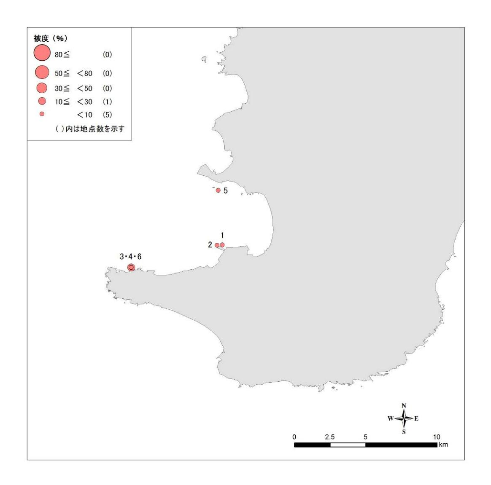

図 I-10-2 モニタリングサイト 1000 サンゴ礁調査 サンゴ被度分布図(2021) サイト(19)館山(房総)

# ⑤ 主な調査地点の景観

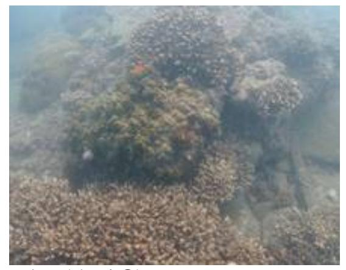

地点 1(沖ノ島①) 地点 2(沖の島②)

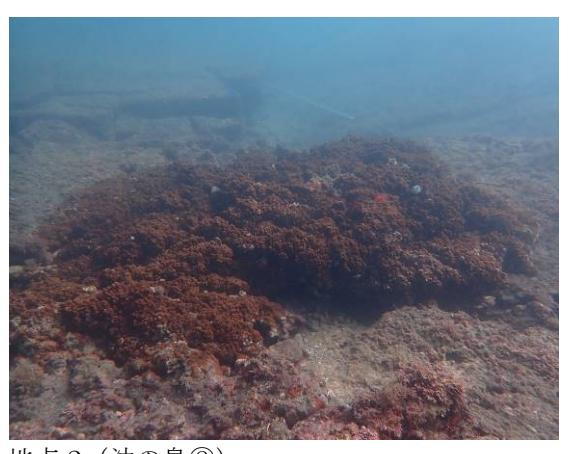

エダミドリイシの群集(被度 5%未満) 被覆状コモンサンゴ類(被度 5%未満)

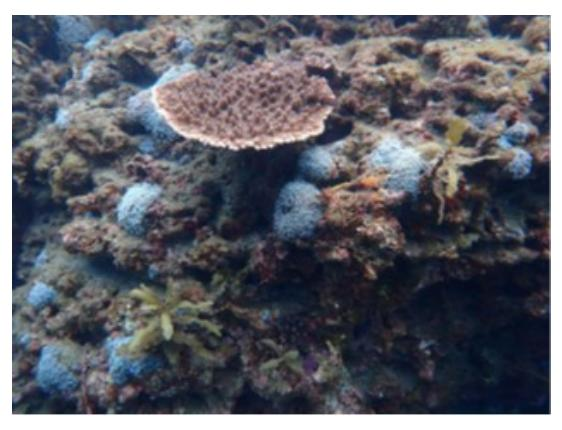

つかった。

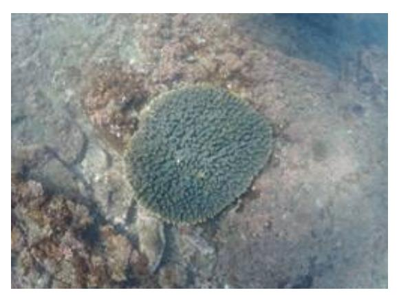

地点 6(坂田③)アワサンゴは安定した群落 地点 2(沖ノ島②)2014 年から観察している がみられ、新たに卓状ミドリイシの群体が見 卓状ミドリイシ類が 50cm 以上に成長していた。

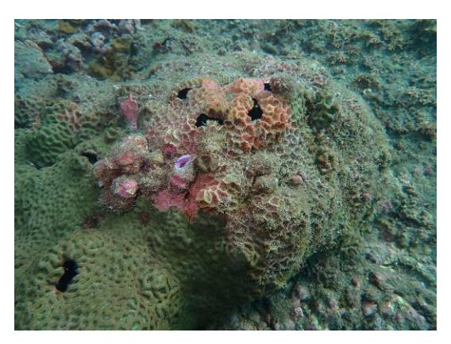

たキクメイシ類 が増えていた。

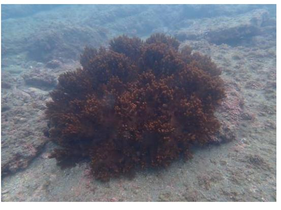

地点 1(沖ノ島①)イセカセンの食害を受け 地点 2(沖ノ島②)地点周辺にソフトコーラル

#### (10)サイト 21:串本周辺

#### 1)実施状況

株式会社串本海中公園センターの平林勲研究員を調査代表者とし、同センターの吉田徹 研究員とともに調査を実施した。

2)調査地点: 串本周辺 18 地点(15 地点+自主調査地点 3 地点)

地点 10 は、地元漁業協同組合串本支所の海域立ち入り拒否により、地点 17 は海況不良 により調査できなかったため、今年度の調査地点は 16 地点である(図 I-11-1)。

サイト 21:串本周辺における調査地点(モニタリングスポット:15 地点及び調査実施者 の自主事業で行っている 3 地点)

地点 1:通夜島

地点 2:住崎

地点 3:グラスワールド①

地点 4:グラスワールド②

地点 5:砥崎

地点 6:高富湾奥

地点 7:串本海域公園・1 号地

地点 8:串本海域公園・2 号地

地点 9:串本海域公園・3 号地

地点 10:串本海域公園・4 号地(未調査)

地点 11:展望塔前

地点 12:有田湾奥(自主調査の調査結果を参照している地点)

地点 13:双島①

地点 14:双島②(自主調査の調査結果を参照している地点)

地点 15:下浅地(自主調査の調査結果を参照している地点)

地点 16:二木島海域公園・1 号地区(笹野島)

地点 17:二木島海域公園・2 号地区(望月島)(未調査)

地点 18:紀伊大島・ゾウバナ

3)調査期間: 2021 年 12 月 5 日~2022 年 1 月 9 日 なお、地点 14 の結果は 2021 年 7 月に実施した自主事業調査時のデータを用いた。

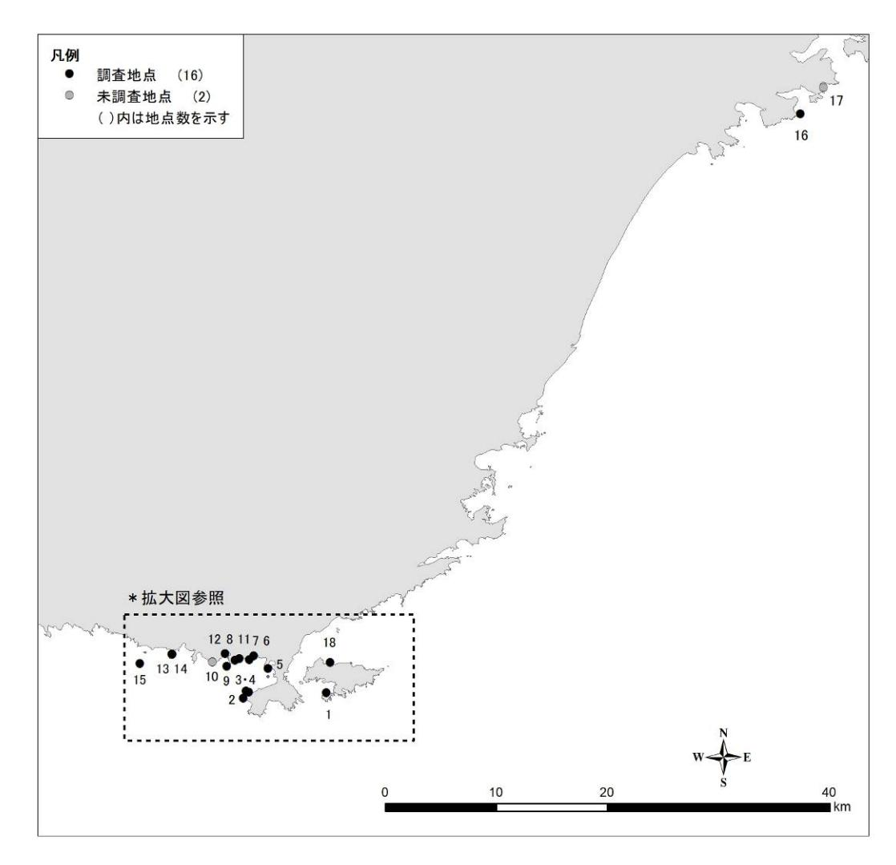

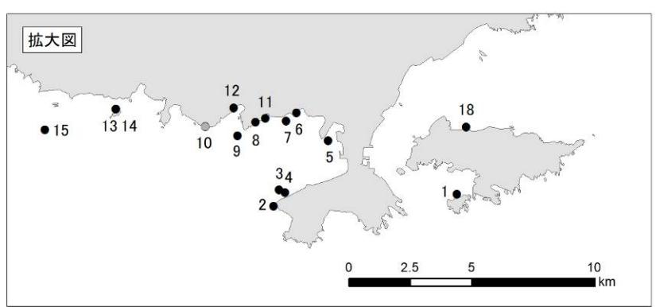

図 I-11-1 モニタリングサイト 1000 サンゴ礁調査 調査地点図(2021) サイト(21)串本周辺

●は今年度調査を実施した地点。●は未調査地点を示す。

4)調査結果: 調査地点ごとのサンゴ被度の状況を図 I-11-2 に示す。

## ① 今年度のサンゴの状況

<平均サンゴ被度>

・ 30%「やや不良」(サンゴ被度 30%以上 50%未満)

<地点毎のサンゴ被度>

「良」(50%以上 80%未満)

・ 6 地点(地点 2、5、8、13、15、18)

「やや不良」(30%以上 50%未満)

・ 1 地点(地点 9)

「不良」(10%以上 30%未満)

- ・ 8 地点(地点 3、4、6、7、11、12、14、16)
- ・ 地点 16 では新規加入が顕著であり、昨年度初確認のクシハダミドリイシの加 入群体を引き続き確認した。

「極めて不良」(10%未満)

・ 1 地点(地点 1)

# ② 昨年度のサンゴの状況との比較

<平均サンゴ被度>

- ・ 昨年度と同じ 30%
- ・ 各地点におけるサンゴ被度は増加した地点の方が多く、サンゴ群集は回復過程 にあると思われた。

<地点毎のサンゴ被度>

- 10 ポイント以上 30 ポイント未満で「増加」した地点
  - ・ 6 地点(昨年度は 4 地点)
- 10 ポイント以上 30 ポイント未満「減少」した地点
  - ・ 1 地点(昨年度は 1 地点)

#### ③ 今年度のかく乱の状況

<感染症(パッチ症及びホワイトシンドローム)>

・ 地点 16(笹野島(二木島海中公園 1 号地区))で 1 群体のみであるが、感染症に罹 患し、群体がほぼ斃死したとみられるエンタクミドリイシが確認された。

<サンゴ食巻貝>

- ・ 地点 16(笹野島(二木島海中公園 1 号地区))でのみ確認された。
- ・ 10 地点で小さな食痕や食害部のある群体が散見されたが、被食率は全て 5%未 満であった。

#### <白化>

・ 全地点で白化現象は確認されなかった。

#### <台風>

・ 今年度は大型台風による顕著なかく乱はほとんど確認されなかった

#### <オニヒトデ>

・ 全地点でオニヒトデは確認されなかった。

# ④ その他

- ・ 地点 16(笹野島(二木島海中公園 1 号地区))では深場を中心に大型のヤギやウミト サカ類が減少しつつある。
- ・ 海藻類の減少が顕著であり、ここ数年の黒潮の大蛇行による水温上昇で状況はさら に悪化していると思われる。

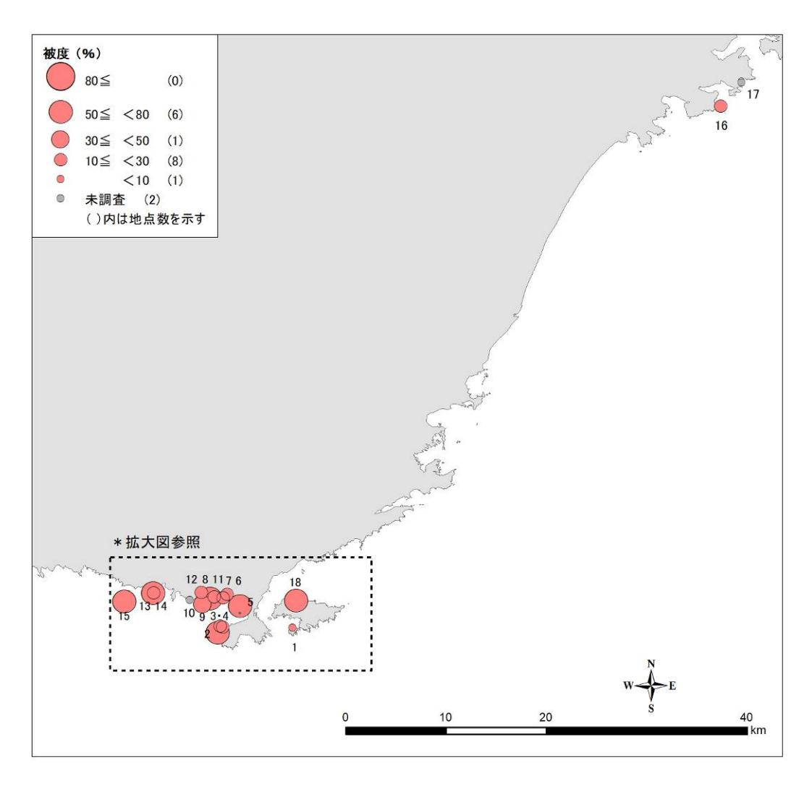

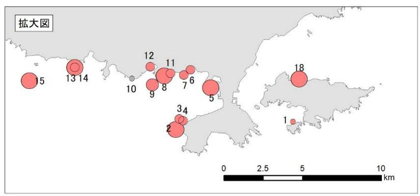

図 I-11-2 モニタリングサイト 1000 サンゴ礁調査 サンゴ被度分布図(2021) サイト(21)串本周辺

・

# ⑤ 主な調査地点の景観

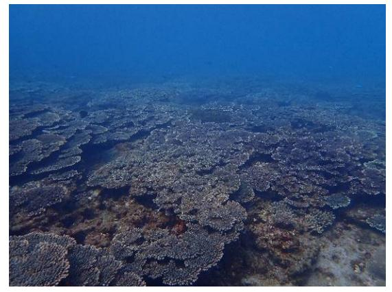

地点 5(砥崎):健全なクシハダミドリイシ 地点 8(海中公園 2 号地):順調な回復をみせ 群落(被度 70%) るクシハダミドリイシ群集

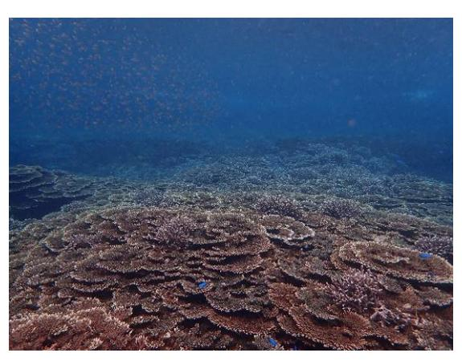

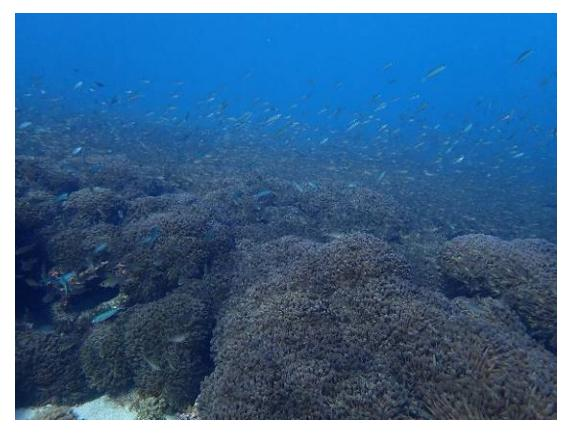

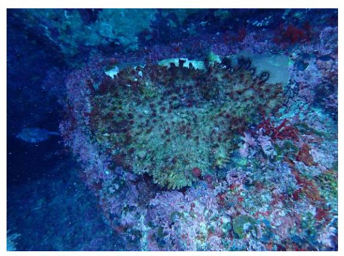

地点 13(双島①):オオハナガササンゴ群落 地点 16(笹野島(二木島海中公園 1 号地区)): (被度 60%) 感染症により斃死したとみられるエンタクミド

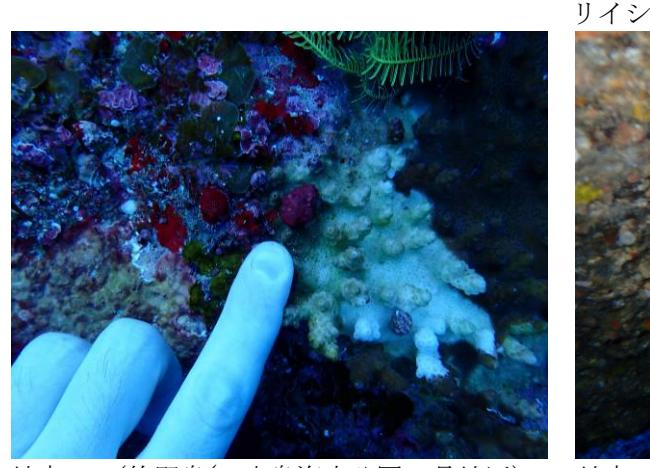

サンゴ食巻貝によるエンタクミドリイシの 深場に分布するアオノエダサンゴ。 食害

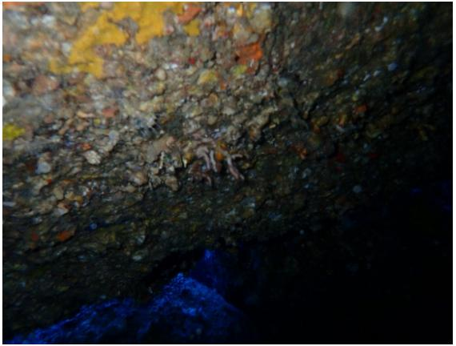

地点 16(笹野島(二木島海中公園 1 号地区): 地点 16(笹野島(二木島海中公園 1 号地区):

#### (11) サイト 22:四国南西岸(宇和海~足摺岬)

#### 1)実施状況

調査代表者を公益財団法人黒潮生物研所の目崎拓真研究員とし、黒潮生物研究所、竜串 ダイビングセンター、天然資源活用委員会、YASU 海の駅クラブ、マリンジャム、オラン クダイバーズの協力によって調査を実施した。

2)調査地点: 38 地点(正規地点 16 地点+協力地点 18 地点+新規協力地点 4 地点) 協力地点におけるモニタリングは、上記研究所が技術指導を行いながら本調査と同じ手 法を用いて実施しており、調査精度も同レベルで維持されている。

今年度は、2012 年度から中止している地点 31 と、牟岐大島の協力地点のうち調査でき なかった 5 地点(地点 26、27、28、29、30)を除き、合計 32 地点で調査を行った(図 I-12-1 ~2)。

サイト 22:四国西岸(宇和海~足摺岬)における調査地点(モニタリングスポット)

正規モニタリング定点:16 地点

宇和海海域(3 地点)

地点 1:須ノ川

地点 2:鹿島

地点 3:天嶬鼻

宿毛・大月海域(8 地点)

地点 4:白浜

地点 5:黒崎

地点 6:網代

地点 7:柏島

地点 8:沖ノ島・トリノクビ

地点 9:沖ノ島・三ツ碆

地点 10:尻貝

地点 11:西泊

土佐清水海域(5 地点)

地点 12:爪白

地点 13:海域公園 2 号地・竜串1

地点 14:海域公園 2 号地・竜串2

地点 15:海域公園 3 号地・大碆

地点 16:大村碆

# ボランティアモニタリングによる協力地点:18 地点

#### 奈半利海域(4 地点)

地点 17:奈半利 10 号堤・内側

地点 18:奈半利 7 号堤・外側

地点 19:奈半利 5 号堤・内側

地点 20:田野 2 号堤・内側

#### 宍喰海域(5 地点)

地点 21:金目

地点 22:海域公園 1 号地・沖側

地点 23:海域公園 1 号地・水路側

地点 24:海域公園 2 号地・竹ヶ島

地点 25:海域公園 2 号地・二子島

# 牟岐大島海域(5 地点)

地点 26:大島・海中公園 1 号地(未調査)

地点 27:大島・海中公園 2 号地(未調査)

地点 28:大島・ビシャゴ(未調査)

地点 29:大島・内湾(未調査)

地点 30:大島・チエバの下(未調査)

(地点 31:モニタリング基盤 WB:2012 年より中止)

#### 夜須町(3 地点)

地点 32:大手の浜・灯台下

地点 33:大手の浜・海風荘下

地点 34:大手の浜・塩屋海岸

新規協力地点:東洋町甲浦(4 地点)

地点 35:中崎

地点 36:中磯

地点 37:葛島

地点 38:葛島東

3)調査期間: 正規地点:2021 年 5 月 16 日~2022 年 1 月 22 日

協力地点:2021 年 8 月 3 日~11 月 21 日

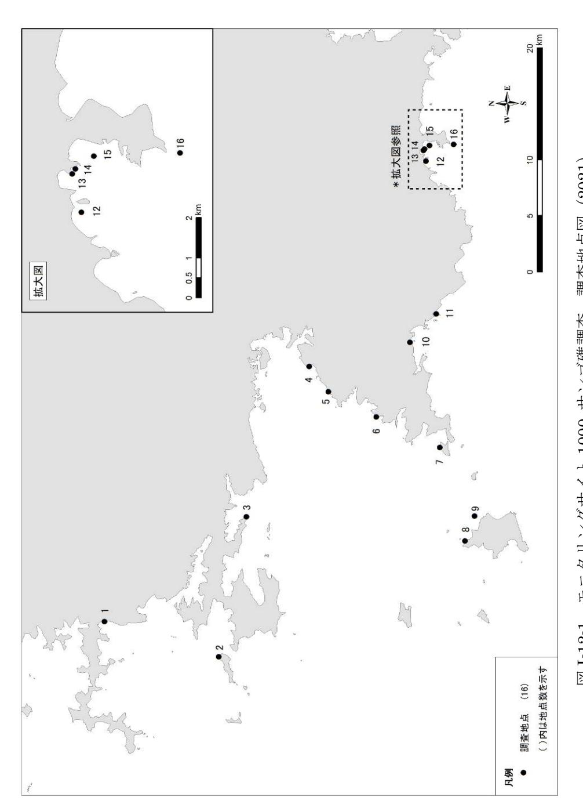

図 I-12-1 モニタリングサイト 1000 サンゴ礁調査 調査地点図(2021) サイト(22)四国南西岸① ●は今年度調査を実施した地点。

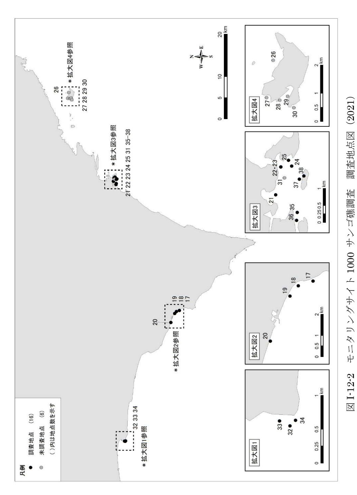

サイト(22)四国南西岸②

●は今年度調査を実施した地点。●は未調査地点を示す。

4)調査結果:: 地点ごとのサンゴ被度の状況を図 I-12-3~4 に示す。

# ① 今年度のサンゴの状況

<平均サンゴ被度>

全調査地点 :20%「不良」(サンゴ被度 10%以上 30%未満)

- ・ 正規調査地点:20%「不良」(10%以上 30%未満)
- ・ 協力調査地点:20%「不良」(10%以上 30%未満)

<地点毎のサンゴ被度>

「良」(50%以上 80%未満)

- ・ 3 地点(地点 7、21、35)
- ・ 地点 21(金目)がサンゴ被度 50%となり、昨年度の 2 地点から 1 地点増加し た。

「やや不良」(30%以上 50%未満)

・ 11 地点(地点 1、4、6、10、12、13、15、18、22、23、37)

「不良」(10%以上 30%未満)

・ 13 地点(地点 3、5、8、11、14、17、19、24、25、33、34、36、38)

「極めて不良」(10%未満)

・ 5 地点(地点 2、9、16、20、32)

<サンゴの加入数>

- ・ 10 群体/m2以上:0 地点
- ・ 5 群体/m2以上:1 地点(地点 2(宇和海 7 号地・鹿島)の 8 群体/m2)

<卓状ミドリイシ類の最大長径>

- ・ 卓状ミドリイシ類の最大長径が 100.0cm を超える地点は 9 地点(昨年度 4 地点) あり、最大値は地点 7(柏島)の 178.0 cm であった。
- ・ 卓状ミドリイシ群体が 5 群体以上確認できなかった地点は、12 地点(昨年度 10 地点)。

# ② 昨年度のサンゴの状況との比較

<平均サンゴ被度>

全調査地点:昨年度から 10 ポイント減少して 20%

・ 正規調査地点ではオニヒトデの影響で被度が低下していたほか、協力地点では 夏季の白化が見られた、全体での被度の減少には至っていない。

正規調査地点:昨年度から 10 ポイント減少して 20%

・ 被度が 15%以上変化した地点はなかったが、10%減の地点が 8 地点あったた め平均被度が低下した。

協力調査地点:昨年度と同じ 20%

・ 昨年度から大きな変化はなかった。

#### <地点毎のサンゴ被度>

- 10 ポイント以上 30 ポイント未満で「増加」した地点
  - ・ 1 地点(昨年度は 5 地点)
- 10 ポイント以上 30 ポイント未満「減少」した地点
  - ・ 9 地点(昨年度は 0 地点)
  - ・ 高知県南西部ではオニヒトデによる被害が継続しているが、駆除地点・発生地 点と調査地点のズレにより、サンゴ被度の大きな低下には至っていない。

### ③ 今年度のかく乱の状況

#### <白化>

- ・ 白化が確認されたのは、全 32 地点中 6 地点(昨年度 19 地点)であった。
- ・ 白化率は全ての地点で 5%未満であった

#### <オニヒトデ>

- ・ 正規調査地点で 7 地点(昨年度 7 地点)、協力調査地点で 0 地点(昨年度 1 地点) の合計 7 地点でオニヒトデが確認された。
- ・ 地点 5(黒崎)では、15 分間観察数が 17 個体となり「大発生」状態となったもの の、被度が大きく低下するほどの被害は認められなかった。
- ・ 四国西南部では地元団体によるオニヒトデの駆除が行われており、昨年度の被度 から大きく減少した地点はないものの、長期的には地点 8(沖ノ島・トリノクビ)、 地点 15(竜串 3 号地・大碆)でサンゴ被度の減少傾向が見られる。

#### <感染症>

- ・ 正規調査地点では 2 地点(昨年度 2 地点)、協力調査地点では 5 地点(昨年度 3 地 点)で確認され、罹患率は 5%未満であった。
- ・ 地点 18(奈半利 7 号堤・外側)では、羅患率は 5%未満だったが、卓状ミドリイ シ類で部分的に斃死している群体が目立った。
- ・ 卓状ミドリイシ類で白い斑紋が多数見られる群体が確認されたが、原因は不明だ った。

### <サンゴ食巻貝>

- ・ 発生階級Ⅱ以上の地点は全 32 地点中 10 地点(昨年度 15 地点)。
- ・ 100~1,000 個体の大集団が確認された地点 6(網代)も含めて、食害率は全ての 地点において 5%未満と軽微であった。
- ・ ほとんどの地点では、一つの貝集団を構成するのは 10 個体未満と少なかった。

#### <台風>

・ サンゴ被度が低下するほどのサンゴの剥離や破損は認められなかった。

図 I-12-3 モニタリングサイト 1000 サンゴ礁調査 サンゴ被度分布図(2021) サイト(22)四国南西岸①

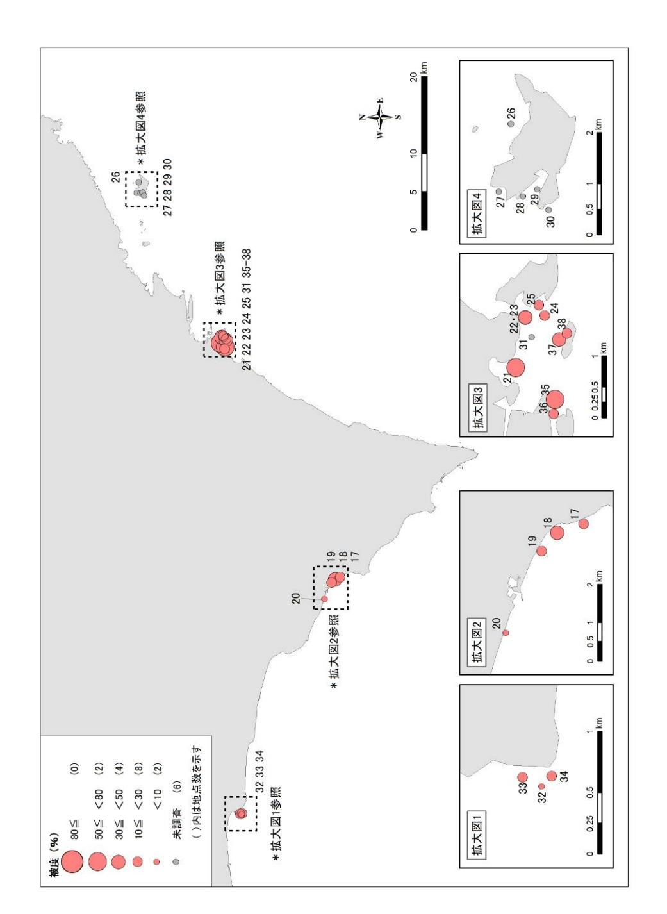

図 I-12-4 モニタリングサイト 1000 サンゴ礁調査 サンゴ被度分布図(2021) サイト(22)四国南西岸②

# ④ その他

- ・ 地点 1(須ノ川)(四国西岸でサンゴの大規模な群集が見られる最北端)と 11(樫西 1 号地・ 西泊)(四国南西端大月町の南岸)で、水温ロガーを回収・設置した。
- ・ 地点 6(網代)(四国南西端大月町の西岸)の水温ロガーは機材破損のためデータが取 り出せなかった。

# ⑤ 主な調査地点の景観

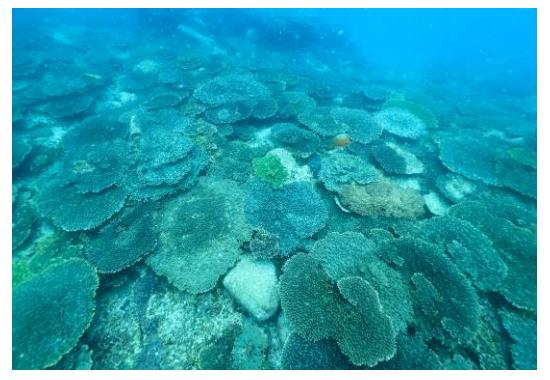

地点 7(柏島)卓状ミドリイシ優占のサン 地点 21(金目)枝状ミドリイシ優占型の ゴ群集(サンゴ被度 50%) 群集(サンゴ被度 50%)

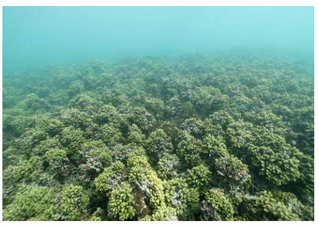

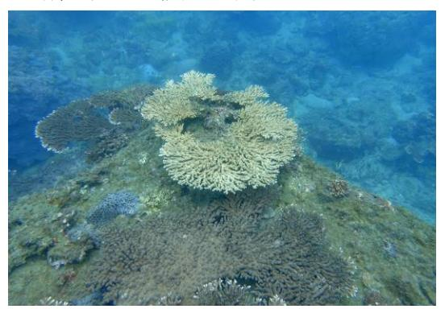

クシハダミドリイシ /15 分)

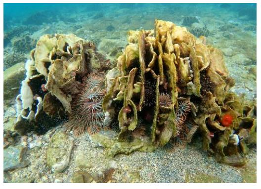

地点 13(竜串 2 号地・竜串西)白化した 地点 5(黒崎)オニヒトデ大発生(17 個体

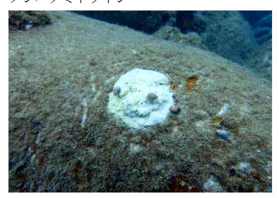

痕 状の斃死

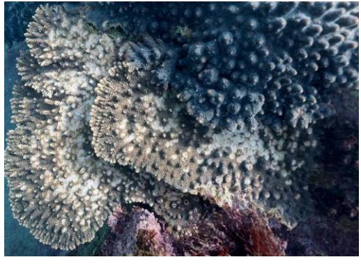

地点 16(大村碆)サンゴ食巻き貝とその食 地点 19(奈半利 5 号堤 内側)白い斑点

# (12) サイト 23:鹿児島県南部沿岸

#### 1)実施状況

ダイビングサービス海案内の出羽慎一氏を調査代表者とし、公益財団法人鹿児島市水族 館公社の出羽尚子氏と鹿児島大学水産学部の出羽優凪氏で調査を実施した。

2)調査地点:18 地点(錦江湾周辺:5 地点+大隅半島:2 地点+薩摩半島の指宿から坊津、 笠沙町に至る海岸線周辺:8 地点+鹿児島県北部の北薩地域周辺:3 地点) 今年度は 2009 年度より定置網設置のため調査を中止している地点 8 と海況不良により調

査を実施できなかった地点 3 を除く全 16 地点で調査を実施した(図 I-13-1)。

サイト 23:鹿児島県南部沿岸における調査地点(モニタリングスポット:18 地点)

錦江湾周辺:5 地点

地点 1:身代湾入口

地点 2:観音崎東

地点 3:沖小島(立神)(未調査)

地点 4:神瀬

地点 5:袴越海中公園

大隅半島:2 地点

地点 6:佐多岬海中公園・岬側

地点 7:佐多岬海中公園・ビロウ島

薩摩半島(指宿~坊津・笠沙町):8 地点

(地点 8:内之浦湾・白木:2009 年より中止)

地点 9:赤水大龍権現

地点 10:坊津・塩ヶ浦

地点 11:坊津・馬込浜その 1

地点 12:坊津・馬込浜その 2

地点 13:坊津・平崎集会所下

地点 14:坊津・田平

地点 15:笠沙町・大当

北薩地域(鹿児島県北部周辺):3 地点

地点 16:阿久根・桑島

地点 17:長島・多々羅島

地点 18:東町・加世堂湾

3)調査期間: 2021 年 10 月 24 日~2022 年 1 月 9 日

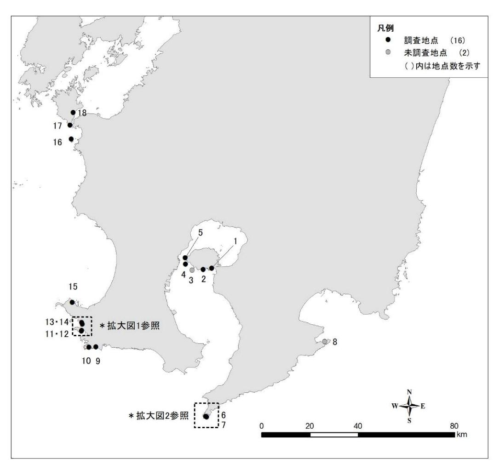

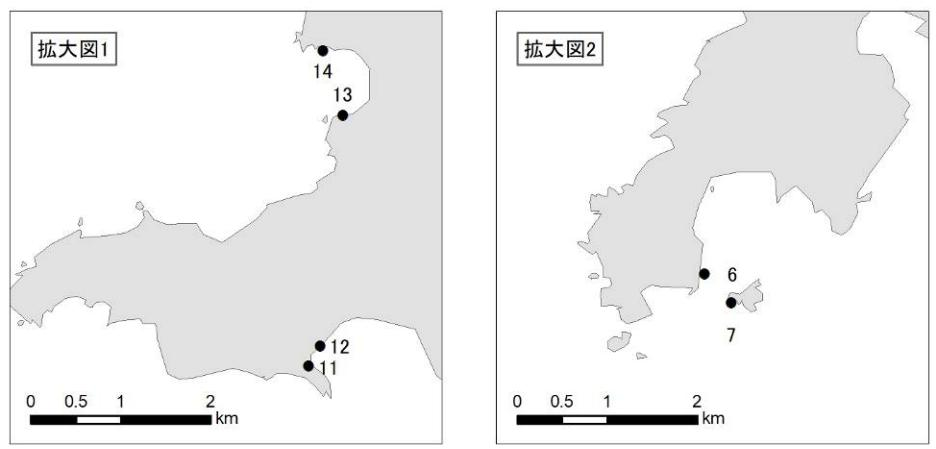

図 I-13-1 モニタリングサイト 1000 サンゴ礁調査 調査地点図(2021) サイト(23)鹿児島県南部沿岸

●は今年度調査を実施した地点。●は未調査地点を示す。

4)調査結果: 調査地点ごとのサンゴ被度の状況を図 I-13-2 に示す。

# ① 今年度のサンゴの状況

- <平均サンゴ被度>
  - ・ 20%「不良」(10%以上 30%未満)

<地点毎のサンゴ被度>

「良」(50%以上 80%未満)

- ・ 3 地点(地点 6、15、16)
- ・ 地点 6(佐多岬海中公園・岬側)と 15(笠利町・大当)はサンゴ被度 60%と最も 高く、被度の回復が見られた。

「やや不良」(30%以上 50%未満)

- ・ 2 地点(地点 7、17)
- ・ サンゴの状態は良く、地点 17(長島・多々羅島)では被度の回復が見られた。

「不良」(10%以上 30%未満)

- ・ 2 地点(地点 1、5)
- ・ 鹿児島湾内の地点 1(身代湾入口)ではシコロサンゴが順調に回復し、被度が増加 していた。

「極めて不良」(10%未満)

- ・ 9 地点(地点 2、4、9、10、11、12、13、14、18)
- ・ 南薩の地点(地点 10~14)は、オニヒトデの影響が大きい地点 13(坊津・平崎集 会場下)を除き、サンゴの状態も良く成長も見られるため、今後の被度回復が期 待される。

# ② 昨年度のサンゴの状況との比較

<平均サンゴ被度>

・ 昨年度から 10 ポイント増加して 20%

<地点毎のサンゴ被度>

- 10 ポイント以上 30 ポイント未満で「増加」した地点
  - ・ 4 地点(昨年度は 0 地点)
  - ・ 大隅半島南部の地点 6(佐多岬海中公園・岬側)、薩摩半島の地点 15(笠沙町・大 当)、北薩の地点 16(阿久根・桑島)と地点 17(長島・多々羅島)で、昨年度か らの回復が見られた。

10 ポイント以上 30 ポイント未満で「減少」した地点

- ・ 0 地点(昨年度は 6 地点)
- ・ 全体的に新規加入サンゴの増加や成長が見られ、被度の減少が見られた地点はな かった。

30 ポイント以上「大きく減少」した地点

・ 0 地点(昨年度は 1 地点)

#### ③ 今年度のかく乱の状況

#### <白化>

- ・ 調査時には色の薄い群体が残る程度で、ほとんど影響はなかったと思われる。
- ・ 鹿児島湾内において、白化が残るサンゴイソギンチャク見られるものの、おおむ ね回復していた。

#### <台風>

・ 大型の台風が接近し、被害が見られたものの、被度に影響を与えるような大きな 被害はなかった。

### <オニヒトデ>

- ・ 特に地点 13(坊津・平崎集会場下)及び 14(坊津・田平)では個体数が増加し、 15 分間観察数が 5~6 個体と準大発生レベルになった。これら 2 地点と地点 2(観 音崎東)では被食率が 20~60%と高い。
- ・ オニヒトデが確認されていない地点でもオニヒトデのものと思われる食痕が多く 見られた。
- ・ 大隅半島南部で漁業者が例年行っている駆除では、2 日間で 2 個体が駆除された。 <サンゴ食巻貝>
  - ・ 特に南薩ではサンゴ食巻貝の被害が続いているため、要注意。

#### <感染症>

・ 2016 年から確認されている 16(阿久根・桑島)及び地点 17(長島・多々羅島) のコブハマサンゴの病気のほか、地点 6(佐多岬海中公園・岬側)、7(佐多岬海中 公園・ビロウ島)、17 で卓状ミドリイシ類の腫瘍が見られた。

#### <その他>

ブダイの観察数が多く、食害も目立っている。

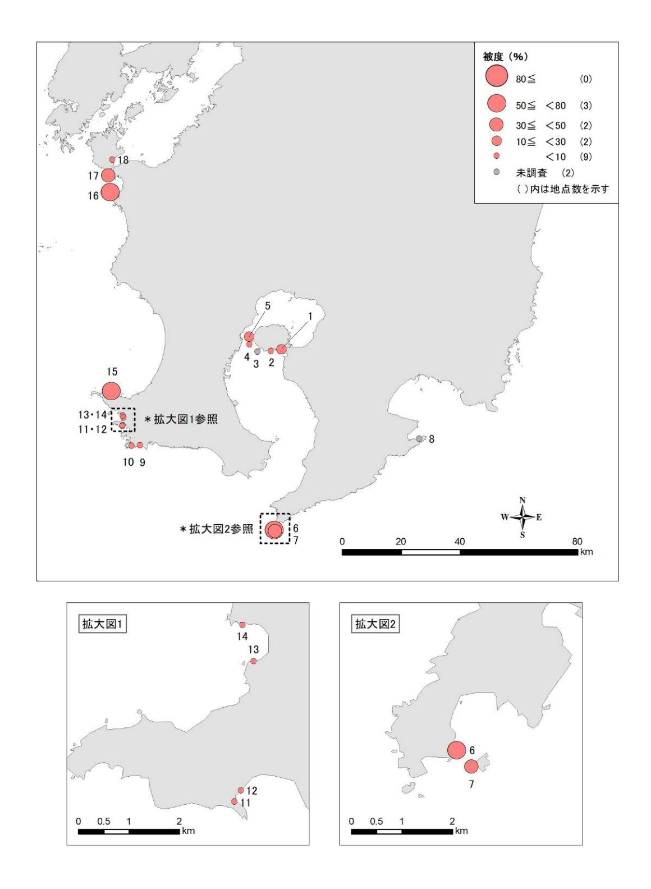

図 I-13-2 モニタリングサイト 1000 サンゴ礁調査 サンゴ被度分布図(2021) サイト(23)鹿児島県南部沿岸

# ④ その他

- ・ 今年度海況不良で未調査だった地点 3(沖小島(立神))は昨年度台風による大きな 被害を受けており、新規加入と回復状況の確認が必要である。
- ・ 北部では台風で破壊された卓状ミドリイシ類のすき間や残骸に新規加入群体が多く 観察され、また冬期の水温が高い状態も続いており、今後も被度が増加する可能性 がある。

# ⑤ 主な調査地点の景観

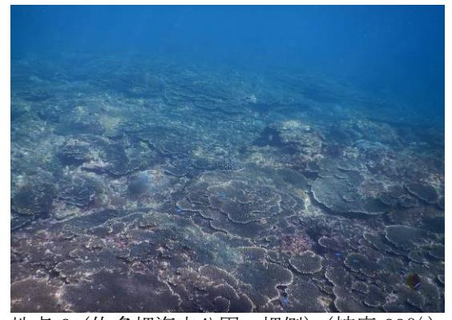

地点 6(佐多岬海中公園・岬側)(被度 60%) 地点 7(佐多岬海中公園ビロウ島)(被度 30%) 昨年度のサンゴ被度 40%から回復した。

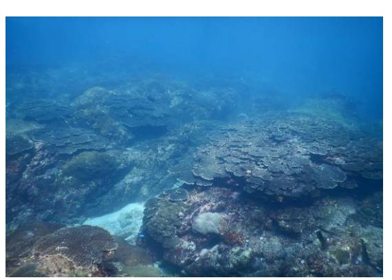

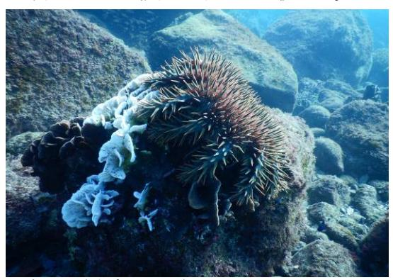

地点 14(坊津・田平) 地点 15(笠沙町・大当)

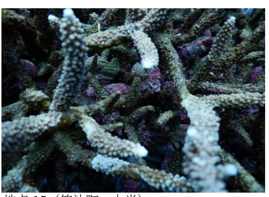

オニヒトデによる食害(被食率 20%) サンゴ食巻貝による食害(被食率 40%)

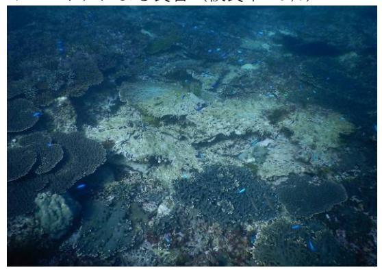

台風によるサンゴ群体の倒壊被害 気とブダイの食害

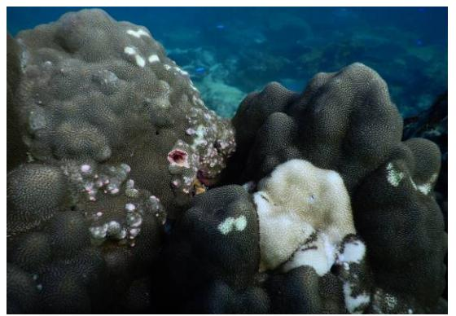

地点 16(阿久根・桑島) 地点 17(長島・多々羅島)ハマサンゴの病

# (13) サイト 24:天草周辺

#### 1)実施状況

九州大学理学部附属天草臨海実験所の新垣誠司准教授をサイト代表者とし、天草市役所 の深川南帆氏と共に調査を実施した。

なお、天草海域では主なサンゴ礁海域に比べて透明度が低いため、従来のスポットチェ ック法で行うスノーケリングではなく、スキューバダイビングにより調査を実施した。

2)調査地点:15 地点(天草半島周辺) 調査は 15 地点で実施した(図 I-14-1)。

サイト 24:天草周辺における調査地点(モニタリングスポット:15 地点)

地点 1:富岡海域公園 1 号・つつま瀬

地点 2:富岡海域公園 2 号・白岩崎

地点 3:大ガ瀬

地点 4:天草海域公園・大ガ瀬対岸

地点 5:桑島

地点 6:茂串(白浜)(海水浴場沖)

地点 7:大島北

地点 8:牛深海域公園 1 号・鶴崎

地点 9:大島港西

地点 10:片島

地点 11:春這

地点 12:平瀬

地点 13:牛深海域公園 3 号・築ノ島

地点 14:牛深海域公園 4 号・法ヶ島南側

地点 15:片島南

3)調査期間: 2021 年 10 月 8 日~10 月 27 日

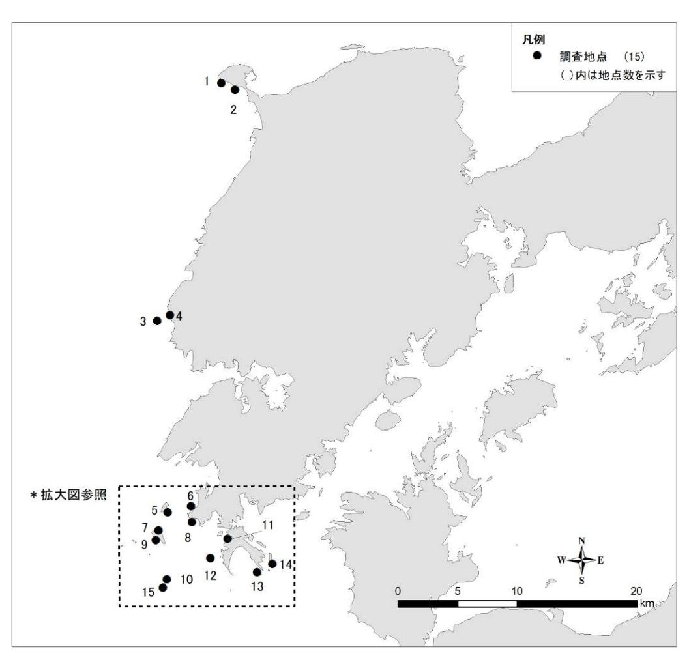

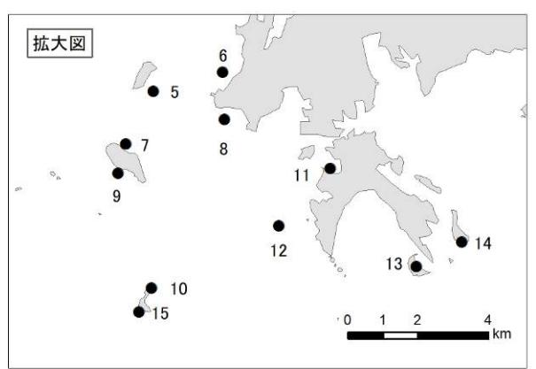

図 I-14-1 モニタリングサイト 1000 サンゴ礁調査 調査地点図(2021) サイト(24)天草周辺 ●は今年度調査を実施した地点。

4)調査結果: 調査地点ごとのサンゴ被度の状況を図 I-14-2 に示す。

# ① 今年度のサンゴの状況

- <平均サンゴ被度>
  - ・ 30%「不良」(サンゴ被度 10%以上 30%未満)

<地点毎のサンゴ被度>

「優良」(80%以上)

- ・ 1 地点(地点 11)
- ・ 最も高かったのは地点 11(春這)の 80%であった。

「良」(50%以上 80%未満)

・ 2 地点(地点 10、12)

「やや不良」(30%以上 50%未満)

・ 4 地点(地点 3、7、8、13)

「不良」(10%以上 30%未満)

・ 8 地点(地点 1、2、4、5、6、9、14、15)

# ② 昨年度のサンゴの状況との比較

<平均サンゴ被度>

・ 昨年度から 10 ポイント増加して 30%

<地点毎のサンゴ被度>

30 ポイント以上「大きく増加」した地点

- ・ 1 地点(昨年度は 0 地点)
- ・ 地点 12(平瀬)では、昨年度からサンゴ被度が 30 ポイント増加しているが、観察 範囲のズレによるものと思われる。
- 10 ポイント以上 30 ポイント未満で「増加」した地点
- ・ 6地点(昨年度は 2 地点)
- ・ 地点 13(牛深海中公園 3 号、築ノ島)では、サンゴ群集が発達したことにより、 昨年度からサンゴ被度が 10 ポイント増加した。
- ・ 他の地点については観察範囲のズレによるものと思われる。
- 10 ポイント以上 30 ポイント未満「減少」した地点
- ・ 1 地点(昨年度は 7 地点)
- ・ 地点 2(富岡海中公園 2 号、白岩崎)では、昨年度からサンゴ被度が 20 ポイント 減少しているが、観察範囲のズレによるものと思われる。

#### ③ 今年度のかく乱の状況

オニヒトデやサンゴ食巻貝による食害は観察されなかった。白化現象は僅かに確認され

たが、全体としてみるとサンゴへの影響は軽微であった。

<オニヒトデ>

・ 調査ではオニヒトデは確認されなかったが、天草市によるオニヒトデ駆除作業が 10 月 中旬におこなわれており、大島(地点 7、9)、片島(地点 10、15)、築ノ島(地点 13) で合計 40 個体程度が駆除されている。調査時期が駆除後の地点もあるため、引き続き 注意が必要である。

#### <台風>

・ 台風の直撃はなく、物理的なかく乱の影響はほとんど見られなかった。

#### <その他>

- ・ 大型のアオブダイが見られるエリアでは、特定の群体に集中して食痕が見られた。
- ・ 死んで藻に覆われた群体が散見された。藻に覆われてない部分もあったため、比較的 新しいかく乱があったことが考えられた。2021 年 8 月にあった長雨の影響で、塩分や 透明度が低下した可能性がある。

#### ④ その他

・ 片島周辺の 2 地点(地点 10、15)では、水深 3 メートルより浅い場所で微小藻類に覆 われた岩盤が非常に目立っていた。

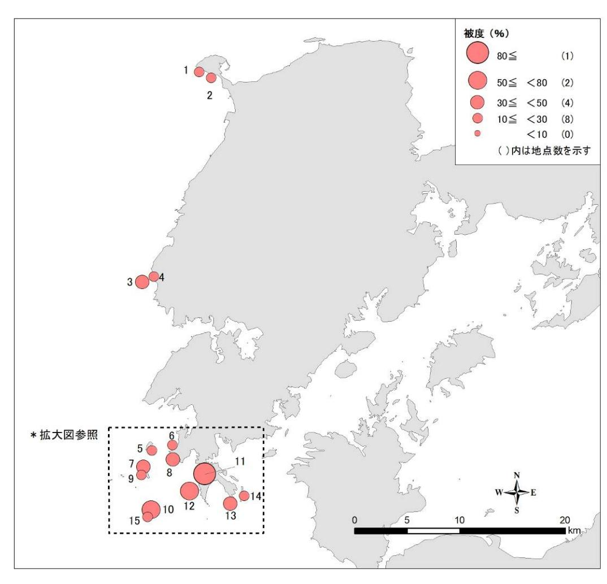

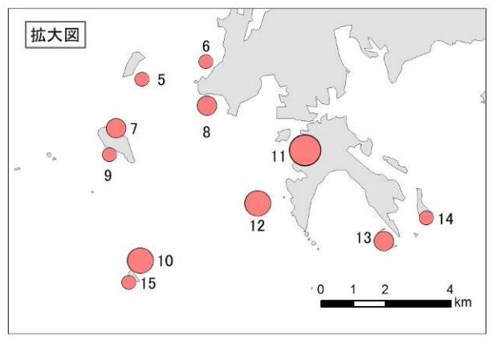

図 I-14-2 モニタリングサイト 1000 サンゴ礁調査 サンゴ被度分布図(2021) サイト(24)天草周辺

# ⑤ 主な調査地点の景観

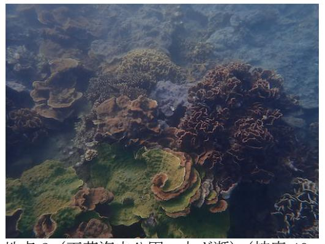

地点 3(天草海中公園、大ガ瀬)(被度 40 地点 11(春這)(被度 80%)多種混成型 %)卓状ミドリイシ優占型の群集 の群集

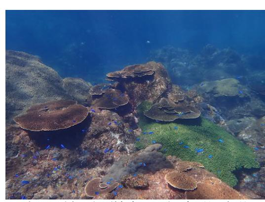

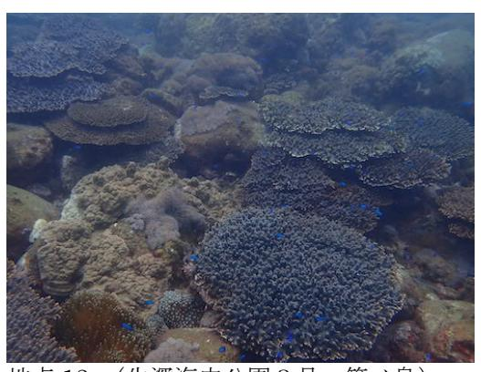

 地点 13(牛深海中公園3号、築ノ島) 地点 5(天草海中公園、桑島)段階的に死 (被度 30%)卓状ミドリイシ優占型の群集 亡した群体

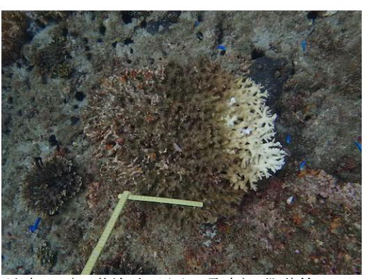

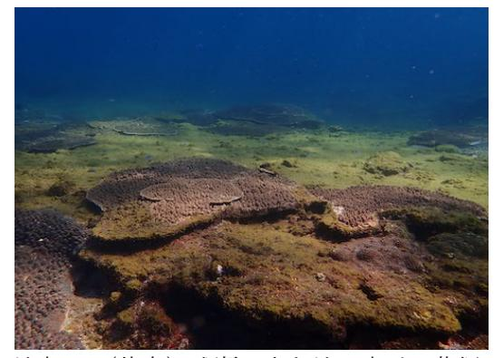

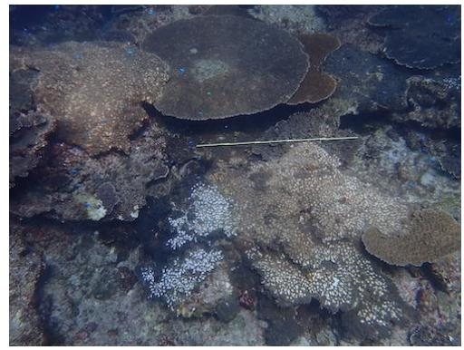

地点 10(片島)浅瀬の空き地に広がる藻類 地点 10(片島)アオブダイと思われる食 痕

# 2.総括: 2021 年度のサンゴの状況

これまで調査を実施したサイトのうち、トカラ列島(サイト 2:小宝島周辺)以南のサイ トを「主なサンゴ礁域」、大隅諸島(サイト 1:屋久島・種子島周辺)以北のサイトを「高 緯度サンゴ群集域」として、それぞれにおける平均サンゴ被度の経年変化及び今年度の状 況を以下に記す。

2004 年度以降の各サイトにおける平均サンゴ被度の経年変化を表Ⅱ-1 に示した。

表Ⅱ-1 各サイトにおける平均サンゴ被度の推移

| ¥           |             | t m . | 444                             |           |           |    |           |        |           |           |        |           |           |          |           | 平均力                                          | 平均サンゴ被度(%) | (%)       |      |           |           |       |           |           |        |           |        |             |           |        |           |
|-------------|-------------|------------------|---------------------------------|-----------|-----------|----|-----------|--------|-----------|-----------|--------|-----------|-----------|----------|-----------|----------------------------------------------|------------|-----------|------|-----------|-----------|-------|-----------|-----------|--------|-----------|--------|-------------|-----------|--------|-----------|
| ŧ           |             | 150              | 地域                              | 2004(H16) | 2005(H17) |    | 2006(H18) |        | 2007(H19) | 2008(H20) |        | 2009(H21) | 2010(H22) |          | 2011(H23) | 2012(H24)                                    |            | 2013(H25) |      | 2014(H26) | 2015(H27) |       | 2016(H28) | 2017(H29) |        | 2018(H30) | -      | 2019(H31) 2 | 2020(R02) |        | 2021(R03) |
|             | トカラ列島       |                  | 2. 小宝島周辺                        |           |           | 20 |           |        |           |           |        |           |           | 30       |           |                                              |            |           |      |           | ,         | 40    |           |           |        |           |        |             |           |        |           |
|             | 奄美群島        |                  | 3. 瀬戸内周辺(奄美大島)                  | 40        |           | 40 | 8         | 30     | 30        |           | 30     | 20        |           | 20       | 20        |                                              | 20         | 20        | _    | 30        |           | 30    | 30        |           | 40     | 30        |        | 40          |           | 40     | 40        |
|             | 10 15    | 東                | 4. 東村~奥                         | 01        |           | 10 | Η.        | 20 02  | 20        | 3         | 20     | 20        | *         | 30       | 20        | 3                                            | 8          | 30        | 3    | 20        | *         | 30    | 30        | 3         | 30     | 30        |        | 30          | 3         | 30     | 40        |
|             | <b>帽</b>    | 出                | 5. 恩納村~残波岬                      | 2         | ·         | 10 |           | 50     | 20        |           |        | 30        | K         | 8        | 20        | <u>.                                    </u> | 8          | 20        |      | 20        |           |       | 30        | <u>.</u>  | 64     | 40        | ·      | 40          |           | 20     | 20        |
|             | 周辺離島        |                  | 6. 水納島 伊是名島 伊平屋島                | 10 10     | 9         | 10 | 20 10     | 10 20  | 20        | 50        | 30     | 04 40     | 30        | 40       | 30 40     | 30                                           | 20         | 30 40     | 20   | 30        | 900       | 40 30 | 09        | 30        | 50     | 40 50     | 04     | 09          | 40        | 60 50  | 9         |
|             | 慶良間諸島       |                  | 7. 慶良間諸島中心海域 (阿嘉島、座間味、渡嘉敷周辺) | 30        |           | 20 | -         | 10     | 20        |           | 20     | 10        |           | 10       | 10        |                                              | 10         | 10        |      | 20        |           | 20    | 20        |           | 20     | 30        |        | 30          |           | 30     | 40        |
|             | 大東島諸島       |                  | 8. 大東島                          |           |           |    |           |        | 20        |           |        |           |           |          | 20        |                                              |            |           |      |           |           |       | 20        |           |        |           |        |             |           |        |           |
| <b>\$</b> ; | 宮古島周辺       |                  | 9. 宮古島周辺                        | 40        |           | 20 | 4         | 40     | 40        |           | 40     | 40        |           | 40       | 30        |                                              | 20         | 30        | _    | 30        |           | 30    | 20        |           | 20     | 20        |        | 20          |           | 30     | 30        |
| ) п ‡       | 宮古島離礁       |                  | 10. 八重干瀬                        | 09        |           | 20 | 4         | 40     | 40        |           | 30     | 20        |           | 30       | 20        |                                              | 20         | 30        | _    | 30        |           | 40    | 10        |           | 10     | 10        |        | 10          |           | 20     | 20        |
| 経 強         |             | 東岸               | 11. 平久保崎~宮良湾                    | %5 30     | ×2        | 30 | %5 31  | 30 %2  | 20        | *2        | 20 **2 | 20        | **        | 20 %2    | 20        | *2                                           | 30         | %5 30     | 3 %2 | 30        | %5 3   | 30 %2 | 30        | *2        | 20 **2 | 32 20     | 2 ‰2   | 30          | % %    | 30 %2  | 30        |
|             | <b>克里里</b>  | 田                | 12. 川平~大崎                       | 40 40     | 40        | 40 | 40 50     | 50 30  | 30        | 30        | 30 30  | 0 40      | 30        | 30 2     | 20 20     | 20                                           | 20         | 20 10     | 20   | 10        | 20        | 10 20 | 01 0      | 20        | 10     | 20 20     | 0 20   | 20          | 30        | 30 30  | 4         |
|             |             | 北部               | 13. 小浜島周辺                       | 40        |           | 40 | 2         | 20     | 40        | -         | 40     | 20        |           | 20       | 20        |                                              | 40         | 40        | -    | 40        |           | 40    | 20        |           | 20     | 30        |        | 30          |           | 40     | 40        |
|             | 第 書 用 | 東部               | 14. カタグァー周辺                     | %3 60  | % %    | 20 | *3        | 40 **3 | 30        | £         | 20 **3 | 20        | £ **   | 20 **3   | 3 20      | ee **                                     | 8          | 30        | *3   | 30        | e **      | 30 %  | 10        | ee **  | 9      | %3 10  | £ % | 10          | %         | 10 **3 | 01        |
|             | で選び         | 中央部              | 15. ツモビツ~ 年間 路 沖                | 20        | -         | 20 | ιά        | 20     | 20        |           | 10     | 20        |           | 20       | 20        |                                              | 20         | 30        | -    | 30        |           | 30    | 20        |           | 20     | 20        |        | 20          |           | 20     | 30        |
|             |             | 南部               | 16. 黒島~新城島                      | 50 50     | 20        | 40 | 50 4      | 40 30  | 20        | 30        | 20 30  | 0 20      | 30        | 20 3     | 30 20     | 30                                           | 30         | 40 30     | 40   | 30        | 04        | 30 20 | 02 0      | 20        | 10     | 20 10     | 02     | 20          | 30        | 20 30  | 20        |
|             | 西表島と周辺離島    | 留業               | 17. 崎山湾(西表島西部)周辺                | 09        |           | 09 | 9         | 09     | 20        |           | 20     | 20        |           | 20       | 20        |                                              | 20         | 20        | -    | 20        |           | 20    | 30        |           | 30     | 30        | _      | 40          |           | 40     | 20        |
|             | 小笠原諸島       |                  | 18. 父島周辺                        | 20        | -         | 20 | 5         | 20     | 20        |           | 20     | 50        |           | 20       | 40        |                                              | 40         | 40        | -    | 20        |           | 20    | 40        |           | 20     | 50        |        | 40          |           | 20     | 20        |
|             |             |                  | 19. 館山(房総)                      | ~         | <5        | <5 | Ť         | <5     | <5        |           | <5     | <5        |           | <b>\</b> | <5        |                                              | <5         | ~         | <5   | <5        |           | <5    | <5        |           | <5     | ~         | <5     | <5          |           | <5     | \ 5    |
| 恒銀          |             |                  | 20. 壱岐周辺                        | 09        |           | 20 | 2         | 20     | 40        | •         | 40     | 40        |           | 40       | 40        |                                              | 30         | 30        | -    | 40        |           | 20    | 40        |           | 30     | 40        |        | 40          |           |        |           |
| 性 #         |             |                  | 21. 串本周辺                        | 40        |           | 30 | 3         | 30     | 30        |           | 40     | 40        |           | 40       | 40        |                                              | 30         | 30        |      | 40        |           | 30    | 30        |           | 30     | 20        |        | 30          |           | 30     | 30        |
| ょりょ         |             |                  | 22. 四国南西岸(宇和海~足摺岬)              | 20        |           | 30 | 3         | 30     | 30        |           | 30     | 30        |           | 30       | 20        |                                              | 20         | 30        | -    | 20        |           | 30    | 30        |           | 20     | 20        |        | 20          |           | 30     | 20        |
| 1 群 #       | 南東部(黒潮影響域)  |                  | 23. 鹿児島県南部沿岸                    | 30        | -         | 40 | 4         | 40     | 40        | ,         | 40     | 40        | L         | 40       | 30        |                                              | 20         | 30        | -    | 20        |           | 20    | 20        |           | 20     | 20        | -      | 20          |           | 10     | 20        |
| 米政          | 因部(対馬暖流影響域) |                  | 24. 天草周辺                        | 30        | -         | 30 | 3         | 30     | 30        |           | 30     | 30        |           | 30       | 30        |                                              | 30         | 30        | -    | 30        |           | 30    | 30        |           | 30     | 40        | -      | 30          |           | 20     | 30        |
|             | 大隈諸島        |                  | 1. 屋久島・種子島周辺                    | 20        |           | 20 | 8         | 30     | 30        |           | 30     | 30        |           | 40       | 40        |                                              | 40         | 40        |      | 40        |           | 30    | 40        |           | 30     | 40        |        | 40          |           | 40     | 40        |
|             |             |                  |                                 |           |           |    |           |        |           |           |        |           |           |          |           |                                              |            |           |      |           |           |       |           |           |        |           |        |             |           |        |           |

※1. 沖縄島全体(サイト4~6の全調査区の平均値)

※2. 石垣島全体(サイト11~12の全調査区の平均値)

※3. 石西礁湖および西表島全体(サイト13~17の全調査区の平均値)

※4. 空欄は調査を行っていない

※5.「<1」や「<5」などはその中央値(0.5や2.5)として計算した。

#### (1)主なサンゴ礁域

#### 各サイトにおける平均サンゴ被度の経年変化

#### サイト 3(奄美大島周辺)

調査が開始された 2004 年度に 40%であった平均サンゴ被度は、オニヒトデ大発生 による食害のため減少傾向を示し、2009 年度には 20%まで減少した。その後、2013 年までは平均サンゴ被度に変化はなかったが、オニヒトデ大発生の収束に伴い、2014 年度から増加傾向に転じ、2017 年度に 40%まで回復した。2017 年度には礁池内で夏 季高水温による白化現象が起こり、2018 年度に平均サンゴ被度は 30%に減少したが、 その後、大きなかく乱は無く、今年度まで平均サンゴ被度 40%が維持されている。

#### サイト 4~6(沖縄島東岸、沖縄島西岸、周辺離島)

2004年度の調査開始から2005年度までは3サイトの平均サンゴ被度が10%であり、 高緯度サンゴ群集域の館山(低被度で健全な群集を維持している)サイトを除く全サ イト中で最もサンゴ被度が低いサイトであった。その後 2008 年度までは 20%程度の 低被度が続いたが、サイト 6(周辺離島)の平均サンゴ被度が 2009 年度に 40%、2012 年度に 50%、2016 年度には 60%に達した。続いてサイト 5(沖縄島西岸)の平均サ ンゴ被度も 2017 年度には 40%、2020 年度には 50%にまで増加した。サイト 4(沖縄 島東岸)はサイト 5 よりもやや遅れながらも徐々にサンゴ被度が増加し、2021 年度に は 40%まで増加した。これに伴って 3 サイトの全地点における平均サンゴ被度も 50% にまで増加した。宮古島、石垣島、石西礁湖及び西表島周辺で夏季高水温の影響によ る大規模白化現象が発生した 2016 年度以降においても、サイト 4~6 は比較的高被度 を維持している。特にサイト 6(周辺離島)は、2019 年度以降今年度まで、全サイト 中で最も平均サンゴ被度が高い状態を維持している。

#### サイト 7(慶良間諸島)

1990 年代には高被度のサンゴ群集を誇っていたが、1998 年の大規模白化現象や 2000 年代のオニヒトデによる食害の影響を受け、2004 年度の調査開始時には平均サン ゴ被度が 30%であった。その後もオニヒトデの大発生は続き、平均サンゴ被度は 2013 年度まで 10~20%の低い値で推移していた。しかし、2014 年度以降は、オニヒトデ大 発生の収束とともに平均サンゴ被度が徐々に増加傾向を示し、2018 年度にようやく 30%まで回復した。2021 年度も順調な回復が見られ、平均サンゴ被度が 40%まで増加 した。

#### サイト 9~10(宮古島周辺及び宮古島離礁(八重干瀬))

2004 年度には平均サンゴ被度が 40~60%の比較的高被度のサイトであったが、その

後オニヒトデの食害を受け徐々に被度が低下し、2012 年度には平均サンゴ被度が両サ イトとも 20%となった。その後わずかながらサンゴ被度が増加したものの、2016 年度 に大規模白化現象が起こったため、2017 年度にはサンゴ被度が 10~20%にまで減少し た。しかし、2017~2018 年度には新規加入群体が目立つなどの回復の兆しが見られ、 白化現象から 4 年後にあたる 2020 年度にようやく平均サンゴ被度が増加し始め、2021 年度も平均被度の増加までは至っていないものの、被度の増加した地点が多くあり、 順調な回復傾向が見られる。

#### サイト 11~12(石垣島東岸・西岸)

2004~2006 年度まで平均サンゴ被度は 40%を維持していた。しかし、2007 年には 高水温による白化現象の被害を受けて 30%に減少し、その後はオニヒトデ大発生によ る食害も受けたため、2011 年度には 20%にまで減少した。平均サンゴ被度はその後も 回復せず、2016 年度には大規模な白化現象の影響も受け、2019 年度まで 20%であっ た。ただし、2018 年度にはサイト 12(石垣島西岸)の平均サンゴ被度に増加傾向が見 られ、2019 年度にはサイト 11(石垣島東岸)の平均サンゴ被度も増加した。2020 年 度にはサイト 11~12(2 サイト)における平均サンゴ被度が 30%に増加し、2021 年 度にはサイト 12(石垣島西岸)の平均被度が 40%まで増加した。2019~2021 年度に かけての 3 年間は、2016 年度の大規模白化現象によるサンゴ被度減少からの回復傾向 が見られる。

#### サイト 13~17(石西礁湖及び西表と周辺離島)

2004 年度の調査開始時はサイト 13~17(5 サイト)における平均サンゴ被度は 50% と高被度であったが、2007年度に八重山海域における局所的な白化現象が起こり、30% に減少した。その後はオニヒトデの大発生や台風による破壊、病気などのかく乱によ りサンゴ被度は回復せず、2012 年度まで平均サンゴ被度は 30%であった。2013 年度 には、オニヒトデ大発生の収束とともに平均サンゴ被度が 40%に回復し、2015 年度ま で維持された。しかし、2016 年度には夏季高水温による大規模白化現象の影響を受け、 5 サイトの平均サンゴ被度はそれまでで最低レベルの 20%にまで減少した。その後、 2018 年度にはまずサイト 13(石西礁湖北部)で被度が増加し始め、2019 年度にはサ イト 17(西表島と周辺離島)でも被度が増加した。大規模白化現象から 4 年後の 2020 年度には、5 サイトの平均被度にも明確な増加傾向が現れ、このサイト全体が回復過程 にあることが分かった。2021 年度もこの傾向は続いており、特にサイト 15(石西礁湖 中央部)とサイト 17(西表島と周辺離島)においては、平均サンゴ被度が 2020 年度 より増加した。

#### サイト 18(父島周辺)

サンゴ礁域でも琉球列島から遠く隔離されている小笠原諸島の父島周辺では、2004 年 度の調査開始当初から比較的高いサンゴ被度 50%を示しており、2008 年度までは健全に 維持されていた。ところが、2009 年度に大規模な白化現象が起き、2011 年度には平均サ ンゴ被度が 40%にまで減少した。2013 年度まで平均サンゴ被度は 40%のままであった が、2014 年度にようやく 50%に回復した。その後は 2016 年度のサンゴの病気やオニヒ トデの食害、2019 年度の高水温による白化現象などのかく乱を受け、平均サンゴ被度は 40%から 50%の間で推移していた。2021 年度は大きなかく乱はなく、平均サンゴ被度 50%であった。

### 主なサンゴ礁域の経年変化及び 2021 年度の状況

主なサンゴ礁域では、平均サンゴ被度が昨年度より増加したサイトが多く、平均サンゴ 被度が減少したサイトはなかった。特に、2016 年度の夏季高水温による大規模な白化現象 が起こった宮古島周辺から八重干瀬、石垣島、石西礁湖及び西表島を含む先島海域(サイ ト 9~17)では、白化現象以降に加入してきたミドリイシ類の小群体が成長したため、白化 から 4 年を経た昨年度にサンゴ被度の回復につながったが、今年度もその状態が維持され ている。また、モニタリングを開始した 2004 年度時点でサンゴ被度が低かった沖縄島及び 周辺離島(サイト 4~6)では、2009 年度頃から徐々に被度が増加し、2016 年度に先島海 域のサイトが高水温の被害を受けた際には、主なサンゴ礁域の中でも高いサンゴ被度を保 つサイトに転じており、今年度も引き続き高被度のサンゴ群集を代表するサイトとして、 沖縄島東岸(サイト 4)で被度を増加させている。

一方、これら琉球列島のサンゴ群集とは遠く離れ、2004 年度の調査開始当初から比較的 高被度である小笠原諸島の父島周辺(サイト 18)は、2009 度年頃から目立ち始めた高水温 による白化現象やオニヒトデのかく乱を受けながらも高被度を保ち続けている。今年度も 高水温による白化現象が起こったもののその影響は軽微であり、オニヒトデ駆除の効果も 出始めたため、高被度の状態が維持されている。

また、奄美大島(サイト 3)や慶良間諸島(サイト 7)では、オニヒトデ大発生や白化現 象が収まり、ゆるやかに回復する過程にある。特に慶良間諸島では今年度は回復傾向が被 度の増加に表れており、昨年度と同じ被度を維持している奄美大島と合わせて、サンゴ礁 域全体の被度増加傾向を後押ししている。

このように、今年度の主なサンゴ礁域全体の状況としては、過去にオニヒトデの食害や 大規模白化現象によるかく乱によってサンゴ被度が減少したものの、新規加入や生残群体 の成長によってサンゴ被度は増加しており、引き続き順調な回復過程にあると言える。

#### (2)高緯度サンゴ群集域

#### 各サイトの経年変化

# サイト 19(館山)

太平洋岸でのサンゴ群集の分布の北限域にあたり、各地点のサンゴ被度は 10%未満 で、サンゴ被度による健全度の評価では「極めて悪い」と区分される。しかし、2004 年の調査開始以降、大きなかく乱は無く、低被度のサンゴ群集が毎年同様に維持され ており、全サイトの中で最も安定したサイトである。各調査地点で小型の卓状ミドリ イシ類が順調に成長しており、2021 年度もこれまで同様に低い被度のサンゴ群集が維 持されていた。

#### ■サイト 20(壱岐周辺)

2004~2006 年度までは 50~60%の比較的高被度を維持していたが、台風のかく乱 や白化現象及びガンガゼによる食害により、以降は平均サンゴ被度が 30~40%で推移 している。2017 年度の調査ではガンガゼの数がかなり減少していることが確認された が、ガンガゼの食害以外にもホワイトシンドローム等の病気もかく乱要因となってお り、平均サンゴ被度は 30%であった。その後、平均サンゴ被度は 2018 年度に 40%ま で回復し、2019 年度も同じ被度が維持されていた。なお、2020~2021 年度は新型コ ロナウィルス感染拡大防止に配慮し、離島であるこのサイトの調査を中止した。

#### サイト 21(串本周辺)

2004 年度に 40%であった平均サンゴ被度は、オニヒトデの食害や感染症及び台風被 害などのかく乱により、その後 2016 年までは 30~40%の間で増減を繰り返した。ま た、2017 年度には低水温による白化現象が起こり、局所的なサンゴの斃死を招いたた め(死亡率が 40%に達した地点もあった)、翌 2018 年度にはサイト平均サンゴ被度が これまでで最低の 20%となった。その後はオニヒトデや感染症のかく乱を受けている 地点もあるが、回復する地点も現れており、2019 年度に 30%まで回復し、2021 年度 もミドリイシ類の成長や加入が顕著な地点が見られたことで回復傾向が維持されてい た。

#### サイト 22(四国南西岸)

2004 年度に 20%であった平均サンゴ被度が、2005 年度には 30%に増加したものの、 串本周辺サイトと同様にオニヒトデや病気、台風、低水温による白化現象などの影響 により、その後は 20~30%の間で増減を繰り返している。2019 年度から 2020 年度に かけて平均サンゴ被度が 20%から 30%に増加したが、2021 年度はオニヒトデやサン ゴ食巻貝類の確認が続いており、特にオニヒトデの影響で被度が減少した地点があっ

たことなどにより平均サンゴ被度が 20%に減少した。

# サイト 23(鹿児島県南部沿岸)

2004 年度に 30%であった平均サンゴ被度は 2005 年度に 40%まで増加したが、2009 年度以降オニヒトデの局所的な集団や台風等のかく乱を受けたためにそれ以上増加せ ず、2012 年度には 20%にまで減少した。その後、2013 年度にいったん 30%まで回復 するものの、2014 年度から 2019 年度までは引き続きオニヒトデや台風等のかく乱に よって増加が抑えられ、20%が続いた。2020 年度には、台風の影響により多くのサン ゴ群体が破壊され、平均サンゴ被度が 10%にまで減少し、それまでで最も被度が低く なった。2021 年度は台風や白化現象の影響は軽微で、サンゴの成長が見られ、平均被 度が 20%に回復した。

#### サイト 24(天草周辺)

2004 年度の調査開始当初に 30%であった平均サンゴ被度は、オニヒトデの高密度集 団による食害によって 2009~2017 年度まで大きな増加はなく、30%を維持していた。 オニヒトデによる食害は 2017 年度にはほぼ収束し、2018 年度には平均サンゴ被度が 40%まで増加した。しかし、2020 年度には原因不明の被度減少があり、サイトの平均 サンゴ被度も 20%にまで減少した。この被度減少は調査者交代による調査範囲のズレ が原因と考えられ、それが解消したことにより 2021 年度は平均サンゴ被度が 30%に 増加した。

#### サイト 1(屋久島・種子島周辺)

2004 年度に 20%であった平均サンゴ被度が徐々に増加し、2010 年度には 40%に達 した。その後平均サンゴ被度は、2015 年度と 2017 年度に 30%に減少するものの、大 きなかく乱はなく、2016 年度からはほぼ 40%が維持されており、2021 年度も大きな かく乱はなく健全な状態が続いていると考えられた。

# 高緯度サンゴ群集域の 2021 年度の状況

高被度サンゴ群集域では、昨年度から平均サンゴ被度が増加したのは鹿児島県南部沿岸 (サイト 23)及び天草周辺(サイト 24)の 2 サイトであり、被度が減少したのは四国南西 岸(サイト 22)の1サイトであった。また、昨年度と同じサンゴ被度であったのが館山(サ イト 19)、串本周辺(サイト 21)及び屋久島・種子島周辺(サイト 1)の 3 サイトであっ た。

平均サンゴ被度が増加した 2 サイトのうち、鹿児島県南部沿岸(サイト 23)では、昨年 度台風の被害を受けて被度が減じたサンゴが回復したため、サイト全体の被度も増加した。 天草周辺(サイト 24)は観察範囲のズレが解消したことによるもので、全体として大きな

被度の増減はないと思われる。一方で、四国南西岸(サイト 22)はオニヒトデによるかく 乱を受けて被度が減少していた。この他のサイトでは、今年度特に目立ったかく乱はなく、 サンゴ群集は健全に維持されていると思われる。

各サイトの経年変化を比較しても、千葉県(サイト 19:館山)から鹿児島県(サイト 1: 屋久島・種子島周辺)までの広い範囲に広がる高緯度サンゴ群集域では、年によって域内 のいずれかのサイトに何らかのかく乱が起こり、今年度も四国南西岸(サイト 22)でオニ ヒトデのかく乱による被度の減少が確認された。一方で、その他のサイトでは目立ったか く乱は起きておらず、多くのサイトでは被度の増加という形に表れてはいないもののサン ゴの状態は良いサイトが多く、今後のサンゴ被度の回復が期待される。

# II 資料

資料1: 2021 年度モニタリングサイト 1000(サンゴ礁)調査地点一覧

資料1.令和3(2021)年度 モニタリングサイト1000(サンゴ礁)調査地点一覧

| 中ブロック | サイト No. | サイト名      | 県名   | 調査地 (spot) No. | 地名         | 北緯 (度) | 北緯 (分) | 北緯 (秒) | 東経 (度) | 東経 (分) | 東経 (秒) | 地形          | 底質               | 観察 範囲 (m) | 水深 範囲 (m) |
|-------|------------|-----------|------|----------------------|------------|-----------|-----------|-----------|-----------|-----------|-----------|-------------|------------------|-----------------|-----------------|
| 大隅諸島  | 1          | 屋久島・種子島周辺 | 鹿児島県 | 1                    | 屋久島 志戸子    | 30        | 26        | 55.23     | 130       | 31        | 18.67     | 外洋          |                  | 堆積岩 25×100      | 1~6             |
| 大隅諸島  | 1          | 屋久島・種子島周辺 | 鹿児島県 | 2                    | 屋久島 元浦     | 30        | 27        | 18.84     | 130       | 30        | 55.82     | 内湾          |                  | 堆積岩 50×50       | 4~6             |
| 大隅諸島  | 1          | 屋久島・種子島周辺 | 鹿児島県 | 3                    | 屋久島管理棟下    | 30        | 27        | 41.51     | 130       | 30        | 59.84     | 外洋          |                  | 堆積岩 50×50       | 13~18           |
| 大隅諸島  | 1          | 屋久島・種子島周辺 | 鹿児島県 | 4                    | 屋久島 お宮下    | 30        | 27        | 46.12     | 130       | 29        | 36.34     | 外洋          |                  | 堆積岩 50×50       | 6~14            |
| 大隅諸島  | 1          | 屋久島・種子島周辺 | 鹿児島県 | 5                    | 屋久島タンク下    | 30        | 27        | 27.57     | 130       | 29        | 19.86     | 内湾          |                  | 堆積岩 50×50       | 6~7             |
| 大隅諸島  | 1          | 屋久島・種子島周辺 | 鹿児島県 | 6                    | 屋久島センロク    | 30        | 26        | 53.83     | 130       | 27        | 48.21     | 外洋          |                  | 堆積岩 50×50       | 13~26           |
| 大隅諸島  | 1          | 屋久島・種子島周辺 | 鹿児島県 | 7                    | 屋久島 塚崎     | 30        | 16        | 20.7      | 130       | 24        | 44.7      | 外洋          |                  | 堆積岩 50×50       | 5~10            |
| 大隅諸島  | 1          | 屋久島・種子島周辺 | 鹿児島県 | 8                    | 屋久島 七瀬     | 30        | 14        | 59.1      | 130       | 25        | 4.73      | 外洋          |                  | 堆積岩 50×50       | 4~6             |
| 大隅諸島  | 1          | 屋久島・種子島周辺 | 鹿児島県 | 9                    | 屋久島 中間     | 30        | 14        | 55.86     | 130       | 25        | 44.98     | 外洋          |                  | 堆積岩 50×50       | 5~13            |
| 大隅諸島  | 1          | 屋久島・種子島周辺 | 鹿児島県 | 10                   | 屋久島 湯泊     | 30        | 14        | 0.46      | 130       | 28        | 37.47     | 港湾          |                  | 堆積岩 50×50       | 1~6             |
| 大隅諸島  | 1          | 屋久島・種子島周辺 | 鹿児島県 | 11                   | 屋久島 麦生     | 30        | 15        | 38.15     | 130       | 36        | 24.85     | 外洋          |                  | 堆積岩 50×50       | 1~5             |
|       |            |           |      |                      |            |           |           |           |           |           |           | やや内         |                  |                 |                 |
| 大隅諸島  | 1          | 屋久島・種子島周辺 | 鹿児島県 | 12                   | 口永良部 寝待    | 30        | 28        | 10.83     | 130       | 13        | 47.45     | 湾           |                  | 玄武岩 50×50       | 5~21            |
| 大隅諸島  | 1          | 屋久島・種子島周辺 | 鹿児島県 | 13                   | 口永良部岩屋泊    | 30        | 29        | 11.85     | 130       | 10        | 8.38      | 内湾          |                  | 玄武岩 50×50       | 7~18            |
| 大隅諸島  | 1          | 屋久島・種子島周辺 | 鹿児島県 | 14                   | 馬毛島        | 30        | 45        | 29.13     | 130       | 51        | 48.27     | 外洋          |                  | 堆積岩 50×50       | 4~6             |
| 大隅諸島  | 1          | 屋久島・種子島周辺 | 鹿児島県 | 15                   | 種子島 大瀬     | 30        | 23        | 56.94     | 130       | 59        | 7.8       | 外洋          |                  | 堆積岩 50×50       | 6~8             |
| 大隅諸島  | 1          | 屋久島・種子島周辺 | 鹿児島県 | 16                   | 種子島 住吉     | 30        | 39        | 54.6      | 130       | 56        | 34.97     | 外洋          | サンゴ 礁         | 50×50           | 1~5             |
| 大隅諸島  | 1          | 屋久島・種子島周辺 | 鹿児島県 | 17                   | 竹島 コモリ港    | 30        | 48        | 30.27     | 130       | 24        | 49.19     | 外洋          |                  | 玄武岩 50×50       | 5~16            |
| 大隅諸島  | 1          | 屋久島・種子島周辺 | 鹿児島県 | 18                   | 硫黄島永良部崎    | 30        | 46        | 32.24     | 130       | 16        | 31.12     | 外洋          |                  | 玄武岩 50×50       | 13~16           |
| 大隅諸島  | 1          | 屋久島・種子島周辺 | 鹿児島県 | 19                   | 黒島 夫婦瀬     | 30        | 48        | 55.27     | 129       | 55        | 4.85      | 外洋          |                  | 玄武岩 50×50       | 10~23           |
| 大隅諸島  | 1          | 屋久島・種子島周辺 | 鹿児島県 | 20                   | 種子島 浦田ビーチ  | 30        | 49        | 28.48     | 131       | 2         | 16.95     | 内湾          |                  | 堆積岩 25x100      | 3~5             |
| トカラ列島 | 2          | 小宝島周辺     | 鹿児島県 | 1                    | 宝島前篭港東     | 29        | 9         | 36.2      | 129       | 12        | 35.2      | 礁斜面         | 岩盤               | 50×30           | 1~5             |
| トカラ列島 | 2          | 小宝島周辺     | 鹿児島県 | 2                    | 宝島海水浴場沖    | 29        | 9         | 33.1      | 129       | 12        | 57.8      | 礁縁          | 岩盤               | 50×30           | 1~5             |
| トカラ列島 | 2          | 小宝島周辺     | 鹿児島県 | 3                    | 宝島ヘリポート沖①  | 29        | 9         | 14.2      | 129       | 13        | 26.9      | 礁縁・離 礁   | 岩盤               | 50×50           | 3~10            |
| トカラ列島 | 2          | 小宝島周辺     | 鹿児島県 | 4                    | 宝島ヘリポート沖②  | 29        | 9         | 12.4      | 129       | 13        | 25.4      | 礁縁          | 岩盤               | 50×30           | 1~8             |
| トカラ列島 | 2          | 小宝島周辺     | 鹿児島県 | 5                    | 宝島洗石港南     | 29        | 8         | 38.4      | 129       | 13        | 11.7      | 礁斜面         | 岩盤               | 50×30           | 2~10            |
| トカラ列島 | 2          | 小宝島周辺     | 鹿児島県 | 6                    | 宝島ヘリポート沖③  | 29        | 9         | 5         | 129       | 13        | 28.5      | 礁斜面         | 岩盤               | 50×50           | 2~6             |
| トカラ列島 | 2          | 小宝島周辺     | 鹿児島県 | 7                    | 宝島ヘリポート沖④  | 29        | 9         | 4.6       | 129       | 13        | 34.3      | 礁斜面         | 岩盤               | 50×50           | 8~10            |
|       |            |           |      |                      |            |           |           |           |           |           |           |             |                  |                 |                 |
| トカラ列島 | 2          | 小宝島周辺     | 鹿児島県 | 8                    | 小宝島港西      | 29        | 13        | 11.5      | 129       | 19        | 48.8      | 礁斜面 岩礁・巨 | 岩礁               | 50×50           | 2~8             |
| トカラ列島 | 2          | 小宝島周辺     | 鹿児島県 | 9                    | 悪石島北東岸畝神   | 29        | 28        | 21.6      | 129       | 36        | 30.5      | 大転石 岩礁・巨 | 岩盤               | 50×50           | 3~7             |
| トカラ列島 | 2          | 小宝島周辺     | 鹿児島県 | 10                   | 悪石島東岸女神山岬下 | 29        | 27        | 9.4       | 129       | 37        | 15.4      | 大転石         | 岩盤               | 50×50           | 4~7             |
| トカラ列島 | 2          | 小宝島周辺     | 鹿児島県 | 11                   | 諏訪之瀬島南東岸   | 29        | 37        | 5         | 129       | 43        | 9         | 沿岸          | 巨大転 石・火山 灰 | 50×50           | 3~5             |
| トカラ列島 | 2          | 小宝島周辺     | 鹿児島県 | 12                   | 諏訪之瀬島港桟橋南  | 29        | 36        | 33        | 129       | 42        | 48        | 礁斜面         | 岩礁               | 50×50           | 2~5             |
| トカラ列島 | 2          | 小宝島周辺     | 鹿児島県 | 13                   | 中之島ジンニョム岳下 | 29        | 50        | 0         | 129       | 54        | 37.2      | 岩礁          | 岩盤               | 50×50           | 2~7             |
| トカラ列島 | 2          | 小宝島周辺     | 鹿児島県 | 14                   | 小宝島赤立神東    | 29        | 13        | 11.5      | 129       | 19        | 48.8      | 礁斜面・ 転石  | 岩盤               | 50×50           | 2~8             |
| トカラ列島 | 2          | 小宝島周辺     | 鹿児島県 | 15                   | 宝島前籠港西     | 29        | 9         | 36.3      | 129       | 12        | 5.3       | 礁斜面         | 岩盤               | 50×50           | 1~5             |
| トカラ列島 | 2          | 小宝島周辺     | 鹿児島県 | 16                   | 小宝島港南      | 29        | 13        | 3.9       | 129       | 19        | 31.6      | 礁斜面         | 岩盤               | 50×50           | 2~8             |
| トカラ列島 | 2          | 小宝島周辺     | 鹿児島県 | 17                   | 小宝島横瀬海岸東   | 29        | 13        | 42.7      | 129       | 19        | 26.9      | 礁斜面         | 岩盤               | 50×50           | 1~5             |
| トカラ列島 | 2          | 小宝島周辺     | 鹿児島県 | 18                   | 小宝島横瀬海岸西   | 29        | 13        | 33.9      | 129       | 19        | 9         | 礁斜面         | 岩盤               | 50×50           | 1~5             |
|       |            |           |      |                      |            |           |           |           |           |           |           |             |                  |                 |                 |
| トカラ列島 | 2          | 小宝島周辺     | 鹿児島県 | 19                   | 悪石島東浜      | 29        | 27        | 34.4      | 129       | 36        | 58.6      | 岩礁 小規模で  | 岩盤               | 50×50           | 3~8             |
| トカラ列島 | 2          | 小宝島周辺     | 鹿児島県 | 20                   | 中之島荷積      | 29        | 51        | 29.2      | 129       | 50        | 8.8       | 浅い湾         |                  | 岩盤・礫 50×50      | 2~7             |
| トカラ列島 | 2          | 小宝島周辺     | 鹿児島県 | 21                   | 中之島相原      | 29        | 51        | 8.2       | 129       | 50        | 15        | 岩礁          | 岩盤               | 50×50           | 1~7             |
| トカラ列島 | 2          | 小宝島周辺     | 鹿児島県 | 22                   | 上ノ根島北      | 28        | 50        | 13.9      | 129       | 0         | 3.4       | 岩礁          | 岩盤               | 50×50           | 7~10            |
| トカラ列島 | 2          | 小宝島周辺     | 鹿児島県 | 23                   | 横当島北入り江    | 28        | 47        | 55.7      | 128       | 59        | 4.5       | 転石          | 岩盤               | 50×50           | 3~8             |
| トカラ列島 | 2          | 小宝島周辺     | 鹿児島県 | 24                   | 大間泊港前航路口   | 29        | 8         | 33.1      | 129       | 11        | 45.3      |             | 岩盤               | 50×50           | 2~3             |
| トカラ列島 | 2          | 小宝島周辺     | 鹿児島県 | 25                   | 悪石島風下      | 29        | 26        | 41.3      | 129       | 36        | 27.8      | 岩礁          | 岩盤               | 50×50           |                 |

資料1.令和3(2021)年度 モニタリングサイト1000(サンゴ礁)調査地点一覧

| 中ブロック | サイト No. | サイト名      | 県名   | 調査地 (spot) No. | 地名          | 北緯 (度) | 北緯 (分) | 北緯 (秒) | 東経 (度) | 東経 (分) | 東経 (秒) | 地形         | 底質        | 観察 範囲 (m) | 水深 範囲 (m) |
|-------|------------|-----------|------|----------------------|-------------|-----------|-----------|-----------|-----------|-----------|-----------|------------|-----------|-----------------|-----------------|
| 奄美群島  | 3          | 瀬戸内周辺(大島) | 鹿児島県 | 1                    | 赤木名立神       | 28        | 28        | 15.9      | 129       | 38        | 53.3      | 礁原         | サンゴ 岩  | 50×50           | 1~3             |
| 奄美群島  | 3          | 瀬戸内周辺(大島) | 鹿児島県 | 2                    | 節田          | 28        | 24        | 38.7      | 129       | 41        | 24.1      | 礁池         | 砂/礫 50×50 |                 | 1~3             |
| 奄美群島  | 3          | 瀬戸内周辺(大島) | 鹿児島県 | 3                    | 神の子         | 28        | 24        | 9.3       | 129       | 38        | 15        | 礁池         | 砂/礫 50×50 |                 | 1~2             |
| 奄美群島  | 3          | 瀬戸内周辺(大島) | 鹿児島県 | 4                    | 久場          | 28        | 25        | 45.1      | 129       | 35        | 53.8      | 内湾         | 泥         | 50×50           | 1~5             |
| 奄美群島  | 3          | 瀬戸内周辺(大島) | 鹿児島県 | 5                    | 安木屋場        | 28        | 28        | 39.6      | 129       | 36        | 35.3      | 礁池         | 砂/礫 50×50 |                 | 1~2             |
| 奄美群島  | 3          | 瀬戸内周辺(大島) | 鹿児島県 | 6                    | 崎原東         | 28        | 20        | 15.2      | 129       | 34        | 2.9       | 離礁         | サンゴ 岩  | 50×50           | 1~5             |
| 奄美群島  | 3          | 瀬戸内周辺(大島) | 鹿児島県 | 7                    | 崎原南         | 28        | 19        | 12.7      | 129       | 32        | 3.5       | やや内 湾   | 砂/礫 50×50 |                 | 1~5             |
| 奄美群島  | 3          | 瀬戸内周辺(大島) | 鹿児島県 | 8                    | 摺子崎         | 28        | 24        | 46.2      | 129       | 27        | 40.5      | 礁池         | 砂/礫 50×50 |                 | 1~2             |
| 奄美群島  | 3          | 瀬戸内周辺(大島) | 鹿児島県 | 9                    | 大浜          | 28        | 24        | 8.1       | 129       | 27        | 10.9      | 礁原         | サンゴ 岩  | 50×50           | 1~3             |
| 奄美群島  | 3          | 瀬戸内周辺(大島) | 鹿児島県 | 10                   | 徳浜          | 28        | 20        | 46        | 129       | 18        | 45.5      | 礁原         | サンゴ 岩  | 50×50           | 1~3             |
| 奄美群島  | 3          | 瀬戸内周辺(大島) | 鹿児島県 | 11                   | 和瀬          | 28        | 17        | 33.4      | 129       | 28        | 31.6      | 礁原         | サンゴ       | 50×50           | 1~2             |
| 奄美群島  | 3          | 瀬戸内周辺(大島) | 鹿児島県 | 12                   | 実久          | 28        | 11        | 59.3      | 129       | 12        | 8         | 礁原         | 岩 サンゴ  | 50×50           | 1~2             |
|       |            |           |      |                      |             |           |           |           |           |           |           |            | 岩 サンゴ  |                 |                 |
| 奄美群島  | 3          | 瀬戸内周辺(大島) | 鹿児島県 | 13                   | デリキョンマ崎     | 28        | 11        | 19.6      | 129       | 14        | 37.8      | 礁原         | 岩         | 50×50           | 1~3             |
| 奄美群島  | 3          | 瀬戸内周辺(大島) | 鹿児島県 | 14                   | 手安          | 28        | 9         | 37.2      | 129       | 17        | 35.1      | 内湾         | 砂 サンゴ  | 50×50           | 2~5             |
| 奄美群島  | 3          | 瀬戸内周辺(大島) | 鹿児島県 | 15                   | 安脚場         | 28        | 6         | 42.2      | 129       | 20        | 49.4      | 礁原         | 岩         | 50×50           | 5~8             |
| 沖縄島東岸 | 4          | 東村~奥      | 沖縄県  | 1                    | 荒崎西礁池**     | 26        | 4         | 32.9      | 127       | 40        | 28.3      | 礁斜面 岩      |           | 200×100 1~17    |                 |
| 沖縄島東岸 | 4          | 東村~奥      | 沖縄県  | 2                    | 大度海岸礁池**    | 26        | 5         | 25.7      | 127       | 42        | 32.5      | 礁池         | 砂・岩・ 礫 | 200×100 0~2     |                 |
| 沖縄島東岸 | 4          | 東村~奥      | 沖縄県  | 3                    | 大度海岸礁斜面**   | 26        | 5         | 25.7      | 127       | 42        | 32.5      | 礁斜面 岩・礫・   | 砂         | 200×100 1~7     |                 |
| 沖縄島東岸 | 4          | 東村~奥      | 沖縄県  | 4                    | 摩文仁南礁池**    | 26        | 5         | 22.8      | 127       | 43        | 8.9       | 礁斜面 岩・砂    |           | 200×100 1~7     |                 |
| 沖縄島東岸 | 4          | 東村~奥      | 沖縄県  | 5                    | 奥武島南礁池**    | 26        | 7         | 39.8      | 127       | 46        | 17.3      | 礁池         | 岩         | 200×100 0~2     |                 |
| 沖縄島東岸 | 4          | 東村~奥      | 沖縄県  | 6                    | 奥武島南礁斜面**   | 26        | 7         | 39.8      | 127       | 46        | 17.3      | 礁斜面 岩      |           | 200×100 1~7     |                 |
| 沖縄島東岸 | 4          | 東村~奥      | 沖縄県  | 7                    | クマカ島南*      | 26        | 8         | 31.1      | 127       | 51        | 10        | 礁斜面 岩・礫・   |           | 200×100 1~9     |                 |
| 沖縄島東岸 | 4          | 東村~奥      | 沖縄県  | 8                    | 久高島エラブ岩東    | 26        | 9         | 1.7       | 127       | 53        | 16.3      | 礁斜面 岩・礫・   | 砂         | 200×100 1~7     |                 |
|       |            |           |      |                      |             |           |           |           |           |           |           | 礁斜面 岩・礫・   | 砂         |                 |                 |
| 沖縄島東岸 | 4          | 東村~奥      | 沖縄県  | 9                    | ウガン岩南       | 26        | 10        | 36.6      | 127       | 55        | 49        |            | 砂         | 200×100 1~7     |                 |
| 沖縄島東岸 | 4          | 東村~奥      | 沖縄県  | 10                   | 津堅島アギハマ東    | 26        | 14        | 44.1      | 127       | 57        | 19.5      | 礁斜面 岩・礫・   | 砂         | 200×100 1~13    |                 |
| 沖縄島東岸 | 4          | 東村~奥      | 沖縄県  | 11                   | ギノギ岩北東      | 26        | 16        | 46.4      | 127       | 57        | 40.2      | 礁斜面 岩      |           | 200×100 1~13    |                 |
| 沖縄島東岸 | 4          | 東村~奥      | 沖縄県  | 12                   | 南浮原島南東      | 26        | 17        | 2.2       | 127       | 59        | 17.2      | 礁斜面 岩・礫・   | 砂         | 200×100 1~13    |                 |
| 沖縄島東岸 | 4          | 東村~奥      | 沖縄県  | 13                   | 浮原島北東ヨコビシ   | 26        | 18        | 22.7      | 127       | 0         | 9.1       | 礁斜面 砂      |           | 200×100 1~9     |                 |
| 沖縄島東岸 | 4          | 東村~奥      | 沖縄県  | 14                   | 伊計島東礁池      | 26        | 23        | 1.5       | 127       | 59        | 53.2      | 礁斜面/ 礁池 | 岩・砂・ 礫 | 200×100 0~2     |                 |
| 沖縄島東岸 | 4          | 東村~奥      | 沖縄県  | 15                   | 伊計島東礁斜面     | 26        | 23        | 1.5       | 127       | 59        | 53.2      | 礁斜面 岩・礫・   | 砂         | 200×100 1~11    |                 |
| 沖縄島東岸 | 4          | 東村~奥      | 沖縄県  | 16                   | 慶佐次ウッパマ東    | 26        | 35        | 55.9      | 128       | 9         | 24.5      | 礁斜面 岩・礫    |           | 200×100 0~2     |                 |
| 沖縄島東岸 | 4          | 東村~奥      | 沖縄県  | 17                   | 東村宮城ウンシ南    | 26        | 36        | 53.2      | 128       | 10        | 50.1      | 礁斜面 岩・礫    |           | 200×100 1~13    |                 |
|       |            |           |      |                      |             |           |           |           |           |           |           |            |           |                 |                 |
| 沖縄島東岸 | 4          | 東村~奥      | 沖縄県  | 18                   | 揚水発電所南東     | 26        | 40        | 7.1       | 128       | 16        | 19        | 礁斜面 岩・砂    |           | 200×100 1~7     |                 |
| 沖縄島東岸 | 4          | 東村~奥      | 沖縄県  | 19                   | 安波南         | 26        | 42        | 26.3      | 128       | 17        | 38.7      | 礁斜面 岩・砂・   | 礫         | 200×100 1~7     |                 |
| 沖縄島東岸 | 4          | 東村~奥      | 沖縄県  | 20                   | カツセノ崎南      | 26        | 43        | 10.7      | 128       | 18        | 11.6      | 礁斜面 岩・礫    |           | 200×100 1~13    |                 |
| 沖縄島東岸 | 4          | 東村~奥      | 沖縄県  | 21                   | イシキナ崎南      | 26        | 43        | 40.9      | 128       | 18        | 40.4      | 礁斜面 岩      |           | 200×100 1~13    |                 |
| 沖縄島東岸 | 4          | 東村~奥      | 沖縄県  | 22                   | 安田ヶ島南       | 26        | 44        | 18.3      | 128       | 20        | 18.2      | 礁斜面 岩      |           | 200×100 1~9     |                 |
| 沖縄島東岸 | 4          | 東村~奥      | 沖縄県  | 23                   | 国頭村赤崎北礁池**  | 26        | 49        | 14.7      | 128       | 18        | 49        | 礁斜面/ 礁池 | 岩・礫・ 砂 | 200×100 0~2     |                 |
| 沖縄島東岸 | 4          | 東村~奥      | 沖縄県  | 24                   | 国頭村赤崎北礁斜面** | 26        | 49        | 14.7      | 128       | 18        | 49        | 礁斜面 岩・礫    |           | 200×100 1~11    |                 |
|       |            |           |      |                      |             |           |           |           |           |           |           | 礁斜面 岩・礫・   |           |                 |                 |
| 沖縄島東岸 | 4          | 東村~奥      | 沖縄県  | 25                   | 奥漁港北**      | 26        | 50        | 46.2      | 128       | 17        | 9.3       |            | 砂         | 200×100 1~11    |                 |

資料1.令和3(2021)年度 モニタリングサイト1000(サンゴ礁)調査地点一覧

| 中ブロック | サイト No. | サイト名    | 県名  | 調査地 (spot) No. | 地名                | 北緯 (度) | 北緯 (分) | 北緯 (秒) | 東経 (度) | 東経 (分) | 東経 (秒) | 地形         | 底質  | 観察 範囲 (m) | 水深 範囲 (m) |
|-------|------------|---------|-----|----------------------|-------------------|-----------|-----------|-----------|-----------|-----------|-----------|------------|-----|-----------------|-----------------|
| 沖縄島東岸 | 4          | 東村~奥    | 沖縄県 | 26                   | 宇佐浜世皮崎西*          | 26        | 51        | 28.8      | 128       | 16        | 43.2      | 礁斜面 岩      |     | 200×100 1~11    |                 |
| 沖縄島東岸 | 4          | 東村~奥    | 沖縄県 | 27                   | 安田ヶ島北*            | 26        | 45        | 18.2      | 128       | 19        | 51.5      | 礁斜面 岩      |     | 200×100 1~9     |                 |
| 沖縄島東岸 | 4          | 東村~奥    | 沖縄県 | 28                   | 慶佐次ウッパマ東礁斜面       | 26        | 35        | 55.9      | 128       | 9         | 24.5      | 礁斜面 岩・礫    |     | 200×100 1~13    |                 |
| 沖縄島東岸 | 4          | 東村~奥    | 沖縄県 | 29                   | 泡瀬ヒメマツミドリイシ礁池     | 26        | 18        | 30.3      | 127       | 51        | 38.9      | 礁池         | 砂・礫 | 200×100         | 0~2             |
| 沖縄島東岸 | 4          | 東村~奥    | 沖縄県 | 30                   | 泡瀬ヒメマツミドリイシ礁斜面    |           |           |           |           |           |           | 礁斜面        |     |                 |                 |
| 沖縄島東岸 | 4          | 東村~奥    | 沖縄県 | 31                   | 大浦ハマサンゴ           | 26        | 31        | 45.72     | 128       | 4         | 25.26     | 礁斜面 岩      |     | 200x100         | 1~11            |
| 沖縄島東岸 | 4          | 東村~奥    | 沖縄県 | 32                   | 具志川城跡南            | 26        | 4         | 43.4      | 127       | 39        | 50.6      | 礁斜面 岩      |     | 200x100         | 1~17            |
| 沖縄島東岸 | 4          | 東村~奥    | 沖縄県 | 33                   | 米須                | 26        | 5         | 4.34      | 127       | 41        | 53.43     | 礁斜面 岩      |     | 200x100         | 1~17            |
| 沖縄島東岸 | 4          | 東村~奥    | 沖縄県 | 34                   | 波名城礁池             | 26        | 6         | 44.2      | 127       | 44        | 36.2      | 礁池         | 岩/砂 | 200x100         | 0~2             |
| 沖縄島東岸 | 4          | 東村~奥    | 沖縄県 | 35                   | 波名城礁斜面            | 26        | 6         | 37.3      | 127       | 44        | 42.4      | 礁斜面        |     |                 |                 |
| 沖縄島東岸 | 4          | 東村~奥    | 沖縄県 | 36                   | 具志頭               | 26        | 7         | 1.11      | 127       | 45        | 2.51      | 礁斜面 岩      |     | 200x100         | 1~17            |
| 沖縄島東岸 | 4          | 東村~奥    | 沖縄県 | 37                   | 大浦チリビシ            | 26        | 31        | 55.09     | 128       | 4         | 31.8      | 礁斜面 岩      |     | 200x100         | 1~11            |
|       |            |         |     |                      |                   |           |           |           |           |           |           |            |     |                 |                 |
| 沖縄島東岸 | 4          | 東村~奥    | 沖縄県 | 38                   | 大度海岸西礁池           | 26        | 5         | 18.88     | 127       | 42        | 24.65     | 礁池         | 砂・礫 | 200x100         | 0~2             |
| 沖縄島東岸 | 4          | 東村~奥    | 沖縄県 | 39                   | 宇佐浜東礁斜面           | 26        | 51        | 53.5      | 128       | 16        | 1.5       | 礁斜面 岩      |     | 200x100         | 1~11            |
| 沖縄島東岸 | 4          | 東村~奥    | 沖縄県 | 40                   | 浮原北東ヨコビシ東         | 26        | 18        | 15.05     | 128       | 0         | 44.86     | 礁斜面        |     |                 |                 |
| 沖縄島東岸 | 4          | 東村~奥    | 沖縄県 | 41                   | 大泊橋北東浜            | 26        | 38        | 21.1      | 128       | 14        | 51.2      | 礁斜面 岩      |     | 200x100         | 1~13            |
| 沖縄島東岸 | 4          | 東村~奥    | 沖縄県 | 42                   | 中城湾チグニガ           | 26        | 37        | 19.0      | 128       | 8         | 50.0      | 離礁/礁 斜面 | 岩   | 200x100         | 2~17            |
| 沖縄島東岸 | 4          | 東村~奥    | 沖縄県 | 43                   | 東村伊是名北            | 26        | 37        | 19.0      | 128       | 8         | 50.0      | 礁池         | 砂・礫 | 200x100         | 0~2             |
| 沖縄島東岸 | 4          | 東村~奥    | 沖縄県 | 44                   | 南浮原南礁斜面           | 26        | 17        | 10.9      | 127       | 58        | 44.0      | 礁斜面 岩      |     | 200x100         | 1~13            |
| 沖縄島東岸 | 4          | 東村~奥    | 沖縄県 | 45                   | 慶佐次北礁斜面           | 26        | 36        | 33.3      | 128       | 9         | 29.0      | 礁斜面 岩      |     | 200x100         | 1~13            |
|       |            |         |     |                      |                   |           |           |           |           |           |           |            |     |                 |                 |
| 沖縄島西岸 | 5          | 恩納村~残波岬 | 沖縄県 | 1                    | 喜屋武漁港西            | 26        | 5         | 54.6      | 127       | 38        | 44        | 礁斜面 岩      |     | 200×100 1~5     |                 |
| 沖縄島西岸 | 5          | 恩納村~残波岬 | 沖縄県 | 2                    | 那覇空港北儀間の瀬礁池       | 26        | 12        | 35.1      | 127       | 38        | 23.8      | 礁池         | 礫・岩 | 200×100 1~3     |                 |
| 沖縄島西岸 | 5          | 恩納村~残波岬 | 沖縄県 | 3                    | 那覇空港北儀間の瀬北礁斜 面 | 26        | 14        | 51.8      | 127       | 38        | 35.7      | 礁斜面 岩      |     | 200×100 1~5     |                 |
| 沖縄島西岸 | 5          | 恩納村~残波岬 | 沖縄県 | 4                    | チービシクエフ南*         | 26        | 14        | 40.9      | 127       | 33        | 39.2      | 礁斜面 岩      |     | 200×100 1~5     |                 |
| 沖縄島西岸 | 5          | 恩納村~残波岬 | 沖縄県 | 5                    | チービシ神山南           | 26        | 15        | 21.4      | 127       | 34        | 48.5      | 礁斜面 岩      |     | 200×100 1~5     |                 |
| 沖縄島西岸 | 5          | 恩納村~残波岬 | 沖縄県 | 6                    | チービシナガンヌ南         | 26        | 15        | 25        | 127       | 32        | 23.4      | 礁斜面 岩      |     | 200×100 1~5     |                 |
| 沖縄島西岸 | 5          | 恩納村~残波岬 | 沖縄県 | 7                    | チービシナガンヌ西         | 26        | 16        | 12.9      | 127       | 31        | 26.8      | 礁斜面 岩      |     | 200×100 1~5     |                 |
| 沖縄島西岸 | 5          | 恩納村~残波岬 | 沖縄県 | 8                    | チービシナガンヌ北         | 26        | 16        | 27.6      | 127       | 33        | 5.7       | 礁斜面 岩      |     | 200×100 1~5     |                 |
| 沖縄島西岸 | 5          | 恩納村~残波岬 | 沖縄県 | 9                    | 空寿崎西座礁船           | 26        | 16        | 35.4      | 127       | 41        | 42.5      | 礁斜面 岩      |     | 200×100 1~5     |                 |
| 沖縄島西岸 | 5          | 恩納村~残波岬 | 沖縄県 | 10                   | 伊佐西               | 26        | 17        | 31        | 127       | 44        | 42.1      | 礁斜面 岩      |     | 200×100 1~3     |                 |
| 沖縄島西岸 | 5          | 恩納村~残波岬 | 沖縄県 | 11                   | 北谷町宮城海岸           | 26        | 19        | 28.2      | 127       | 44        | 39.4      | 礁斜面 岩      |     | 200×100 1~9     |                 |
|       |            |         |     |                      |                   |           |           |           |           |           |           |            |     |                 |                 |
| 沖縄島西岸 | 5          | 恩納村~残波岬 | 沖縄県 | 12                   | 渡具知西              | 26        | 21        | 48        | 127       | 43        | 58.4      | 礁斜面 岩      |     | 200×100 1~11    |                 |
| 沖縄島西岸 | 5          | 恩納村~残波岬 | 沖縄県 | 13                   | 残波岬西礁池            | 26        | 26        | 20.3      | 127       | 42        | 31.4      | 礁池         | 砂・礫 | 200×100 0~3     |                 |
| 沖縄島西岸 | 5          | 恩納村~残波岬 | 沖縄県 | 14                   | 残波岬西礁斜面           | 26        | 26        | 20.3      | 127       | 42        | 31.4      | 礁斜面 岩      |     | 200×100 1~11    |                 |
| 沖縄島西岸 | 5          | 恩納村~残波岬 | 沖縄県 | 15                   | 真栄田岬西礁池           | 26        | 26        | 45.2      | 127       | 46        | 7.4       | 礁池         | 岩   | 200×100 0~2     |                 |
| 沖縄島西岸 | 5          | 恩納村~残波岬 | 沖縄県 | 16                   | 真栄田岬西礁斜面          | 26        | 26        | 45.2      | 127       | 46        | 7.4       | 礁斜面 岩      |     | 200×100 1~11    |                 |
| 沖縄島西岸 | 5          | 恩納村~残波岬 | 沖縄県 | 17                   | 恩納村赤崎西礁池          | 26        | 29        | 48.6      | 127       | 50        | 15.4      | 礁池         | 岩   | 200×100 0~1     |                 |
| 沖縄島西岸 | 5          | 恩納村~残波岬 | 沖縄県 | 18                   | 恩納村赤崎西礁斜面         | 26        | 29        | 48.6      | 127       | 50        | 15.4      | 礁斜面 岩      |     | 200×100 1~11    |                 |
| 沖縄島西岸 | 5          | 恩納村~残波岬 | 沖縄県 | 19                   | 安富祖北礁池            | 26        | 30        | 21.2      | 127       | 52        | 53.2      | 礁池         | 岩   | 200×100 1~9     |                 |
| 沖縄島西岸 | 5          | 恩納村~残波岬 | 沖縄県 | 20                   | 部瀬名岬西             | 26        | 32        | 23.8      | 127       | 55        | 44.9      | 礁斜面 岩      |     | 200×100 1~9     |                 |
| 沖縄島西岸 | 5          | 恩納村~残波岬 | 沖縄県 | 21                   | 瀬底島南              | 26        | 37        | 24.9      | 127       | 51        | 34.7      | 礁斜面 岩      |     | 200×100 1~7     |                 |
| 沖縄島西岸 | 5          | 恩納村~残波岬 | 沖縄県 | 22                   | 港原海洋センター西         | 26        | 40        | 33.0      | 127       | 52        | 34.8      | 離礁/礁 斜面 | 岩   | 200×100 2~7     |                 |
|       |            |         |     |                      |                   |           |           |           |           |           |           |            |     |                 |                 |

資料1.令和3(2021)年度 モニタリングサイト1000(サンゴ礁)調査地点一覧

| 中ブロック   | サイト No. | サイト名                             | 県名  | 調査地 (spot) No. | 地名               | 北緯 (度) | 北緯 (分) | 北緯 (秒) | 東経 (度) | 東経 (分) | 東経 (秒) | 地形         | 底質                     | 観察 範囲 (m) | 水深 範囲 (m) |
|---------|------------|----------------------------------|-----|----------------------|------------------|-----------|-----------|-----------|-----------|-----------|-----------|------------|------------------------|-----------------|-----------------|
| 沖縄島西岸   | 5          | 恩納村~残波岬                          | 沖縄県 | 24                   | 備瀬崎東礁池           | 26        | 42        | 39.9      | 127       | 53        | 14.7      | 礁池         | 岩                      | 200×100 0~2     |                 |
| 沖縄島西岸   | 5          | 恩納村~残波岬                          | 沖縄県 | 25                   | 備瀬崎東礁斜面          | 26        | 42        | 39.9      | 127       | 53        | 14.7      | 礁斜面 岩      |                        | 200×100 1~7     |                 |
| 沖縄島西岸   | 5          | 恩納村~残波岬                          | 沖縄県 | 26                   | 今帰仁村長浜北礁池*       | 26        | 42        | 22        | 127       | 56        | 53.5      | 礁池         | 礫・岩                    | 200×100 0~2     |                 |
| 沖縄島西岸   | 5          | 恩納村~残波岬                          | 沖縄県 | 27                   | 今帰仁村長浜北礁斜面*      | 26        | 42        | 22        | 127       | 56        | 53.5      | 礁斜面 岩      |                        | 200×100 1~11    |                 |
| 沖縄島西岸   | 5          | 恩納村~残波岬                          | 沖縄県 | 28                   | 古宇利島北礁池**        | 26        | 42        | 47.7      | 128       | 1         | 8         | 礁池         | 岩                      | 200×100 0~2     |                 |
| 沖縄島西岸   | 5          | 恩納村~残波岬                          | 沖縄県 | 29                   | 古宇利島北礁斜面**       | 26        | 42        | 47.7      | 128       | 1         | 8         | 礁斜面 岩      |                        | 200×100 1~11    |                 |
| 沖縄島西岸   | 5          | 恩納村~残波岬                          | 沖縄県 | 30                   | 喜屋武漁港西トコマサリ礁* 26 |           | 5         | 44.7      | 127       | 38        | 12.3      | 離礁/礁 斜面 | 岩                      | 200×100 1~5     |                 |
| 沖縄島西岸   | 5          | 恩納村~残波岬                          | 沖縄県 | 31                   | 大嶺崎大瀬            | 26        | 11        | 32.7      | 127       | 36        | 52.5      | 礁斜面 岩      |                        | 200×100 1~5     |                 |
| 沖縄島西岸   | 5          | 恩納村~残波岬                          | 沖縄県 | 32                   | 水釜*              | 26        | 21        | 38.3      | 127       | 44        | 19.3      | 礁池         | 岩                      | 200×100 1~11    |                 |
| 沖縄島西岸   | 5          | 恩納村~残波岬                          | 沖縄県 | 33                   | 水釜礁斜面*           | 26        | 21        | 38.3      | 127       | 44        | 19.3      | 礁斜面 岩      |                        | 200×100 1~11    |                 |
| 沖縄島西岸   | 5          | 恩納村~残波岬                          | 沖縄県 | 34                   | 西洲礁池             | 26        | 15        | 27        | 127       | 40        | 45        | 礁池         | 砂・岩                    | 200×100 0~2     |                 |
| 沖縄島西岸   | 5          | 恩納村~残波岬                          | 沖縄県 | 35                   | 西洲礁斜面            |           |           |           |           |           |           | 礁斜面 岩      |                        | 200×100 1~7     |                 |
| 沖縄島西岸   | 5          | 恩納村~残波岬                          | 沖縄県 | 36                   | 泊大橋南             | 26        | 13        | 32.4      | 127       | 40        | 37.9      | 礁斜面 岩      |                        | 200x100         | 1~7             |
| 沖縄島西岸   | 5          | 恩納村~残波岬                          | 沖縄県 | 37                   | 瀬底大橋北            | 26        | 39        | 14.2      | 127       | 52        | 19.2      | 礁斜面 岩・砂    |                        |                 | 1~11            |
| 沖縄島西岸   | 5          | 恩納村~残波岬                          | 沖縄県 | 38                   | 干ノ瀬              | 26        | 13        | 32.4      | 127       | 40        | 37.9      | 礁斜面 岩      |                        | 200×100 1~7     |                 |
| 沖縄島西岸   | 5          | 恩納村~残波岬                          | 沖縄県 | 39                   | 浅ノ瀬防波堤           | 26        | 13        | 32.4      | 127       | 40        | 37.9      | 礁斜面 岩      |                        | 200×100 1~7     |                 |
| 沖縄島西岸   | 5          | 恩納村~残波岬                          | 沖縄県 | 40                   | ジャナセ             | 26        | 16        | 30.9      | 127       | 41        | 33.3      | 礁斜面 岩      |                        | 200×100 1~5     |                 |
| 沖縄島西岸   | 5          | 恩納村~残波岬                          | 沖縄県 | 41                   | 喜屋武岬西礁地          | 26        | 4         | 57        | 127       | 39        | 18.3      | 礁地         | 岩・礫                    | 200x100         | 0~2             |
| 沖縄島西岸   | 5          | 恩納村~残波岬                          | 沖縄県 | 42                   | 喜屋武岬西礁斜面         |           |           |           |           |           |           | 礁斜面        |                        |                 |                 |
|         |            |                                  |     |                      |                  |           |           |           |           |           |           |            |                        |                 |                 |
| 沖縄島西岸   | 5          | 恩納村~残波岬                          | 沖縄県 | 43                   | 真栄田岬西大礁池         | 26        | 26        | 33.8      | 127       | 46        | 2.8       | 礁池         | 岩                      | 200x100         | 0~2             |
| 沖縄島西岸   | 5          | 恩納村~残波岬                          | 沖縄県 | 44                   | 砂辺*              | 26        | 19        | 45.2      | 127       | 44        | 31.6      | 礁斜面 岩      |                        | 200x100         | 1~9             |
| 沖縄島西岸   | 5          | 恩納村~残波岬                          | 沖縄県 | 45                   | チービシ神山北          | 26        | 16        | 2.8       | 127       | 34        | 29.8      | 礁斜面 岩      |                        | 200x100         | 1~5             |
| 沖縄島西岸   | 5          | 恩納村~残波岬                          | 沖縄県 | 46                   | 久良波*             | 26        | 26        | 18.9      | 127       | 47        | 2.4       | 礁斜面 岩      |                        | 200x100         | 1~11            |
| 沖縄島西岸   | 5          | 恩納村~残波岬                          | 沖縄県 | 47                   | ウカハ岩西            | 26        | 8         | 29.8      | 127       | 38        | 11.9      | 礁斜面 岩      |                        | 200x100         | 1~5             |
| 沖縄島西岸   | 5          | 恩納村~残波岬                          | 沖縄県 | 48                   | 糸満港クラントガイ北       | 26        | 7         | 11.4      | 127       | 39        | 5.4       | 礁池         | 岩・礫                    | 200x100         | 0~8             |
| 沖縄島西岸   | 5          | 恩納村~残波岬                          | 沖縄県 | 49                   | 崎山               | 26        | 42        | 25.7      | 127       | 57        | 48.2      | 礁斜面 岩・礫    |                        | 200x100         | 0~13            |
| 沖縄島西岸   | 5          | 恩納村~残波岬                          | 沖縄県 | 50                   | ヒキイシ南            | 26        | 16        | 3.0       | 127       | 41        | 27.7      | 礁斜面 岩      |                        | 200x100         | 1~8             |
| 沖縄島西岸   | 5          | 恩納村~残波岬                          | 沖縄県 | 51                   | 恩納村恩納礁斜面         | 26        | 30        | 32.0      | 127       | 51        | 14.7      | 礁斜面 岩      |                        | 200x100         | 1~11            |
| 沖縄島西岸   | 5          | 恩納村~残波岬                          | 沖縄県 | 52                   | 塩川港南礁斜面          | 26        | 36        | 22.5      | 127       | 53        | 30.7      | 礁斜面 岩      |                        | 200x100         | 1~11            |
| 沖縄島周辺離島 | 6          | 水納島・伊是名島・伊 平屋島                | 沖縄県 | 1                    | 水納島東             | 26        | 38        | 44.9      | 127       | 49        | 30        | 礁斜面 岩      |                        | 200x100         | 1~7             |
| 沖縄島周辺離島 | 6          | 水納島・伊是名島・伊 平屋島                | 沖縄県 | 2                    | ナカンシ東            | 26        | 40        | 39.9      | 127       | 49        | 21        | 礁斜面 岩      |                        | 200×100 1~7     |                 |
| 沖縄島周辺離島 | 6          | 水納島・伊是名島・伊 平屋島                | 沖縄県 | 3                    | 伊江島西             | 26        | 43        | 9.6       | 127       | 44        | 34.1      | 礁斜面 岩      |                        | 200×100 1~11    |                 |
| 沖縄島周辺離島 | 6          | 水納島・伊是名島・伊 平屋島                | 沖縄県 | 4                    | 伊江島イシャラ原東        | 26        | 43        | 20.3      | 127       | 50        | 6.7       | 礁斜面 岩      |                        | 200×100 1~9     |                 |
| 沖縄島周辺離島 | 6          | 水納島・伊是名島・伊 平屋島                | 沖縄県 | 5                    | 伊江島湧出北           | 26        | 44        | 5         | 127       | 47        | 21.5      | 礁斜面 岩      |                        | 200×100 1~9     |                 |
| 沖縄島周辺離島 | 6          | 水納島・伊是名島・伊 平屋島                | 沖縄県 | 6                    | 水納島北             | 26        | 39        | 31.4      | 127       | 48        | 36.4      | 礁斜面 岩      |                        | 200×100 1~9     |                 |
| 沖縄島周辺離島 | 6          | 水納島・伊是名島・伊                       | 沖縄県 | 7                    | 伊是名島内花橋北         | 26        | 57        | 18        | 127       | 55        | 37.2      | 礁斜面 岩      |                        | 200x100         | 1-9             |
| 沖縄島周辺離島 | 6          | 平屋島 水納島・伊是名島・伊                | 沖縄県 | 8                    | 伊是名島アギギタラ        | 26        | 54        | 36        | 127       | 56        | 31.2      | 礁斜面 岩      |                        | 200x100         | 1-11            |
| 沖縄島周辺離島 | 6          | 平屋島 水納島・伊是名島・伊                | 沖縄県 | 9                    | 水納島西             | 26        | 39        | 10.3      | 127       | 48        | 17        | 礁斜面 岩      |                        | 200x100         | 1~13            |
| 沖縄島周辺離島 | 6          | 平屋島 水納島・伊是名島・伊                | 沖縄県 | 10                   | 伊江島フナズ原南         | 26        | 42        | 11.4      | 127       | 46        | 37.1      | 礁斜面 岩      |                        | 200x100         | 0~8             |
| 沖縄島周辺離島 | 6          | 平屋島 水納島・伊是名島・伊                | 沖縄県 | 11                   | 伊是名島第一号立標        | 26        | 54        | 28.5      | 127       | 56        | 17.1      | 礁斜面 岩      |                        | 200x100         | 1~11            |
|         |            | 平屋島 慶良間諸島中心海域                 |     |                      |                  |           |           |           |           |           |           |            |                        |                 |                 |
| 慶良間諸島   | 7          | (阿嘉島、座間味、渡嘉 敷周辺) 慶良間諸島中心海域 | 沖縄県 | 1                    | 安室南              | 26        | 12        | 6.3       | 127       | 19        | 3.6       | 礁原         | サンゴ岩                   | 100×100 1.0~6.0 |                 |
| 慶良間諸島   | 7          | (阿嘉島、座間味、渡嘉 敷周辺)              | 沖縄県 | 2                    | 座間味阿護の浦          | 26        | 14        | 14.2      | 127       | 19        | 12.2      | 内湾 (離礁) | 砂:礫・岩(サ ンゴ) =7:3 | 100×100 1.0~2.0 |                 |
| 慶良間諸島   | 7          | 慶良間諸島中心海域 (阿嘉島、座間味、渡嘉 敷周辺) | 沖縄県 | 3                    | 座間味ニタ            | 26        | 14        | 13.5      | 127       | 17        | 27.8      | 礁原         | サンゴ岩                   | 100×100 1.0~7.0 |                 |
| 慶良間諸島   | 7          | 慶良間諸島中心海域 (阿嘉島、座間味、渡嘉         | 沖縄県 | 4                    | 嘉比南              | 26        | 12        | 52.6      | 127       | 17        | 14        | 礁原         | サンゴ岩                   | 100×100 1.5~6.0 |                 |

資料1.令和3(2021)年度 モニタリングサイト1000(サンゴ礁)調査地点一覧

| 中ブロック | サイト No. | サイト名                                     | 県名  | 調査地 (spot) No. | 地名            | 北緯 (度) | 北緯 (分) | 北緯 (秒) | 東経 (度) | 東経 (分) | 東経 (秒) | 地形              | 底質                   | 観察 範囲 (m) | 水深 範囲 (m) |
|-------|------------|------------------------------------------|-----|----------------------|---------------|-----------|-----------|-----------|-----------|-----------|-----------|-----------------|----------------------|-----------------|-----------------|
| 慶良間諸島 | 7          | 慶良間諸島中心海域 (阿嘉島、座間味、渡嘉 敷周辺)         | 沖縄県 | 5                    | 阿嘉ニシハマ        | 26        | 12        | 7.9       | 127       | 17        | 21.5      | 礁原~ 礁斜面      | サンゴ岩と 礫:砂 =8:2 | 100×100 1.0~5.0 |                 |
| 慶良間諸島 | 7          | 慶良間諸島中心海域 (阿嘉島、座間味、渡嘉 敷周辺)         | 沖縄県 | 6                    | 阿嘉クシバル        | 26        | 12        | 11.3      | 127       | 16        | 1.8       | 礁原~ 礁斜面 サンゴ岩 |                      | 100×100 1.5~6.0 |                 |
| 慶良間諸島 | 7          | 慶良間諸島中心海域 (阿嘉島、座間味、渡嘉 敷周辺)         | 沖縄県 | 7                    | 阿嘉アグ          | 26        | 11        | 40.8      | 127       | 16        | 21.4      | 礁原              | サンゴ岩                 | 100×100 1.0~7.0 |                 |
| 慶良間諸島 | 7          | 慶良間諸島中心海域 (阿嘉島、座間味、渡嘉 敷周辺)         | 沖縄県 | 8                    | 阿嘉マエノハマ       | 26        | 11        | 11.4      | 127       | 16        | 50.5      | 礁原              | 岩:礫 =7:3          | 100×100 1.0~4.0 |                 |
| 慶良間諸島 | 7          | 慶良間諸島中心海域 (阿嘉島、座間味、渡嘉                 | 沖縄県 | 9                    | 屋嘉比東          | 26        | 12        | 41.8      | 127       | 15        | 4.7       | 礁原~ 礁斜面 サンゴ岩 |                      | 100×100 1.5~5.0 |                 |
| 慶良間諸島 | 7          | 敷周辺) 慶良間諸島中心海域 (阿嘉島、座間味、渡嘉         | 沖縄県 | 10                   | 久場北西          | 26        | 10        | 36.9      | 127       | 13        | 57.4      | 礁斜面 岩           |                      | 100×100 1.5~6.0 |                 |
| 慶良間諸島 | 7          | 敷周辺) 慶良間諸島中心海域 (阿嘉島、座間味、渡嘉         | 沖縄県 | 11                   | 渡嘉敷アリガー       | 26        | 12        | 19.2      | 127       | 20        | 53.1      | 礁斜面 サンゴ岩        |                      | 100×100 2.0~8.0 |                 |
| 慶良間諸島 | 7          | 敷周辺) 慶良間諸島中心海域 (阿嘉島、座間味、渡嘉 敷周辺) | 沖縄県 | 12                   | 渡嘉敷アハレン       | 26        | 10        | 22.8      | 127       | 20        | 26.7      | 礁斜面 サンゴ岩        |                      | 100×100 1.0~5.0 |                 |
| 大東諸島  | 8          | 大東諸島                                     | 沖縄県 | 1                    | 本場階段前         | 25        | 52        | 25.56     | 131       | 14        | 58.6799   |                 |                      |                 |                 |
| 大東諸島  | 8          | 大東諸島                                     | 沖縄県 | 2                    | ヤギ道(岸壁)前      | 25        | 51        | 40.14     | 131       | 13        | 11.5201   |                 |                      |                 |                 |
| 大東諸島  | 8          | 大東諸島                                     | 沖縄県 | 3                    | 塩屋プール前        | 25        | 49        | 40.74     | 131       | 12        | 53.46     |                 |                      |                 |                 |
| 大東諸島  | 8          | 大東諸島                                     | 沖縄県 | 4                    | 塩屋のハナ         | 25        | 49        | 23.82     | 131       | 12        | 43.6799   |                 |                      |                 |                 |
| 大東諸島  | 8          | 大東諸島                                     | 沖縄県 | 5                    | アカバマ(銅浜)      | 25        | 48        | 50.52     | 131       | 14        | 52.9199   |                 |                      |                 |                 |
|       |            |                                          |     |                      |               |           |           |           |           |           |           |                 |                      |                 |                 |
| 大東諸島  | 8          | 大東諸島                                     | 沖縄県 | 6                    | 亀池港前          | 25        | 48        | 45.96     | 131       | 13        | 41.0401   |                 |                      |                 |                 |
| 大東諸島  | 8          | 大東諸島                                     | 沖縄県 | 7                    | 海軍棒前          | 25        | 49        | 58.38     | 131       | 16        | 7.97988   |                 |                      |                 |                 |
| 大東諸島  | 8          | 大東諸島                                     | 沖縄県 | 8                    | 海軍棒プール        | 25        | 49        | 57.12     | 131       | 15        | 58.0799   |                 |                      |                 |                 |
| 大東諸島  | 8          | 大東諸島                                     | 沖縄県 | 9                    | アカツキポイント      | 25        | 50        | 22.32     | 131       | 16        | 9.72012   |                 |                      |                 |                 |
| 大東諸島  | 8          | 大東諸島                                     | 沖縄県 | 10                   | アカツキポイント(20m) | 25        | 50        | 22.32     | 131       | 16        | 27.7201   |                 |                      |                 |                 |
| 大東諸島  | 8          | 大東諸島                                     | 沖縄県 | 11                   | 北のハナ・東        | 25        | 57        | 42.90     | 131       | 17        | 10.9799   |                 |                      |                 |                 |
| 大東諸島  | 8          | 大東諸島                                     | 沖縄県 | 12                   | 北のハナ・南        | 25        | 57        | 38.22     | 131       | 17        | 2.22      |                 |                      |                 |                 |
| 大東諸島  | 8          | 大東諸島                                     | 沖縄県 | 13                   | 北大東南端         | 25        | 55        | 39.12     | 131       | 18        | 33.1801   |                 |                      |                 |                 |
| 大東諸島  | 8          | 大東諸島                                     | 沖縄県 | 14                   | ニイケイガマ(二階釜)   | 25        | 56        | 5.10      | 131       | 19        | 29.5201   |                 |                      |                 |                 |
| 大東諸島  | 8          | 大東諸島                                     | 沖縄県 | 15                   | 真黒崎           | 25        | 57        | 4.56      | 131       | 19        | 58.7399   |                 |                      |                 |                 |
| 大東諸島  | 8          | 大東諸島                                     | 沖縄県 | 16                   | 海軍棒前・深場       | 25        | 49        | 57.70     | 131       | 16        | 7.3       |                 |                      |                 |                 |
| 大東諸島  | 8          | 大東諸島                                     | 沖縄県 | 17                   | 塩屋プール         | 25        | 49        | 34.90     | 131       | 13        | 12.2      |                 |                      |                 |                 |
| 大東諸島  | 8          | 大東諸島                                     | 沖縄県 | 18                   | ながやの下南側・浅瀬    | 25        | 50        | 13.30     | 131       | 13        | 0.6       |                 |                      |                 |                 |
| 宮古島周辺 | 9          | 宮古島周辺                                    | 沖縄県 | 1                    | 池間島北カギンミ      | 24        | 56        | 29.5      | 125       | 14        | 43.1      | 礁池              | 岩・砂                  | 50×50           | 1~6             |
| 宮古島周辺 | 9          | 宮古島周辺                                    | 沖縄県 | 2                    | 池間島東チュラビジ     | 24        | 56        | 3.1       | 125       | 15        | 34.7      | 礁縁              | 岩                    | 50×50           | 1~5             |
| 宮古島周辺 | 9          | 宮古島周辺                                    | 沖縄県 | 3                    | 平良狩俣西         | 24        | 54        | 1.8       | 125       | 15        | 34.7      | 礁縁              | 岩                    | 50×50           | 2~10            |
| 宮古島周辺 | 9          | 宮古島周辺                                    | 沖縄県 | 4                    | 伊良部下地島カヤッファ   | 24        | 48        | 45.3      | 125       | 8         | 35        | 礁池              | 岩・砂                  | 50×50           | 1~5             |
| 宮古島周辺 | 9          | 宮古島周辺                                    | 沖縄県 | 5                    | 伊良部下地島渡口沖離礁   | 24        | 47        | 52.1      | 125       | 9         | 42.9      | 離礁              | 岩・砂                  | 50×50           | 2~10            |
| 宮古島周辺 | 9          | 宮古島周辺                                    | 沖縄県 | 6                    | 来間島東ヨコターラ     | 24        | 43        | 10        | 125       | 15        | 51.4      | 礁縁              | 岩                    | 50×50           | 2~12            |
| 宮古島周辺 | 9          | 宮古島周辺                                    | 沖縄県 | 7                    | 上野博愛沖友利大ビセ    | 24        | 42        | 50.5      | 125       | 19        | 49        | 礁池              | 岩・砂                  | 50×50           | 1~6             |
| 宮古島周辺 | 9          | 宮古島周辺                                    | 沖縄県 | 8                    | 城辺吉野海岸        | 24        | 44        | 54        | 125       | 26        | 35.2      | 礁池              | 岩・砂                  | 50×50           | 0+~1.5          |
| 宮古島周辺 | 9          | 宮古島周辺                                    | 沖縄県 | 9                    | 城辺ツフツワ干瀬北     | 24        | 50        | 27.9      | 125       | 23        | 29.9      | 離礁・礁 縁       | 岩                    | 50×50           | 2~3             |
| 宮古島周辺 | 9          | 宮古島周辺                                    | 沖縄県 | 10                   | 平良高野漁港沖二段干瀬   | 24        | 49        | 42.3      | 125       | 20        | 49.9      | 礁縁              | 岩                    | 50×50           | 2~5             |
| 宮古島離礁 | 10         | 八重干瀬                                     | 沖縄県 | 1                    | 八重干瀬ウル西       | 25        | 1         | 1.4       | 125       | 14        | 47.6      | 離礁・礁 縁       | 岩・砂                  | 50×50           | 1~8             |
| 宮古島離礁 | 10         | 八重干瀬                                     | 沖縄県 | 2                    | 八重干瀬カナマラ中央南   | 25        | 1         | 0.9       | 125       | 16        | 2.7       | 離礁・礁 縁       | 岩                    | 50×50           | 1~10            |

資料1.令和3(2021)年度 モニタリングサイト1000(サンゴ礁)調査地点一覧

| 中ブロック | サイト No. | サイト名     | 県名  | 調査地 (spot) No. | 地名           | 北緯 (度) | 北緯 (分) | 北緯 (秒) | 東経 (度) | 東経 (分) | 東経 (秒) | 地形              | 底質             | 観察 範囲 (m) | 水深 範囲 (m) |
|-------|------------|----------|-----|----------------------|--------------|-----------|-----------|-----------|-----------|-----------|-----------|-----------------|----------------|-----------------|-----------------|
| 宮古島離礁 | 10         | 八重干瀬     | 沖縄県 | 3                    | 八重干瀬クンカディ・ガマ | 24        | 59        | 49        | 125       | 14        | 5.2       | 離礁・礁 縁       | 岩              | 50×50           | 1~6             |
| 宮古島離礁 | 10         | 八重干瀬     | 沖縄県 | 4                    | 八重干瀬イフ南      | 24        | 59        | 41.8      | 125       | 15        | 43.2      | 離礁・礁 縁       | 岩・砂            | 50×50           | 1~10            |
| 石垣島東岸 | 11         | 平久保崎~宮良湾 | 沖縄県 | 1                    | 大浜小前         | 24        | 20        | 42.7      | 124       | 12        | 17.5      | 礁池              |                | 岩・枝礫 50×50      | 1.5~2.5         |
| 石垣島東岸 | 11         | 平久保崎~宮良湾 | 沖縄県 | 2                    | 宮良川河口        | 24        | 20        | 39.4      | 124       | 12        | 53.4      | 礁原・礁 斜面      | 岩              | 50×50           | 1.5~8           |
| 石垣島東岸 | 11         | 平久保崎~宮良湾 | 沖縄県 | 3                    | 宮良集落前        | 24        | 20        | 27.1      | 124       | 14        | 1.7       | 礁池              | 砂・岩            | 50×50           | 1~1.5           |
| 石垣島東岸 | 11         | 平久保崎~宮良湾 | 沖縄県 | 4                    | 白保集落前        | 24        | 20        | 59.6      | 124       | 15        | 9.6       | 礁池・礁 原       |                | 岩・枝礫 50×50      | 1~2             |
| 石垣島東岸 | 11         | 平久保崎~宮良湾 | 沖縄県 | 5                    | 白保アオサンゴ      | 24        | 21        | 47.4      | 124       | 15        | 19.6      | 礁池・礁 原       | 岩・砂            | 50×50           | 1~3             |
| 石垣島東岸 | 11         | 平久保崎~宮良湾 | 沖縄県 | 6                    | 白保第1ポール      | 24        | 21        | 51.7      | 124       | 15        | 16.4      | 礁池              |                | 岩・枝礫 50×50      | 1~2.5           |
| 石垣島東岸 | 11         | 平久保崎~宮良湾 | 沖縄県 | 7                    | 白保~轟川        | 24        | 22        | 24.4      | 124       | 15        | 20.5      | 礁池              |                | 岩・枝礫 50×50      | 1.5~2.5         |
| 石垣島東岸 | 11         | 平久保崎~宮良湾 | 沖縄県 | 8                    | 轟川河口         | 24        | 23        | 4.2       | 124       | 15        | 22.7      | 礁池              | 岩・砂            | 50×50           | 1.5~2.5         |
| 石垣島東岸 | 11         | 平久保崎~宮良湾 | 沖縄県 | 9                    | モリヤマグチ       | 24        | 23        | 48        | 124       | 15        | 41.7      | 礁原・水            | 路斜面 岩・枝礫 50×50 |                 | 1~5             |
| 石垣島東岸 | 11         | 平久保崎~宮良湾 | 沖縄県 | 10                   | スムジグチ        | 24        | 24        | 13.7      | 124       | 15        | 47.1      | 礁池              |                | 岩・枝礫 50×50      | 1~4             |
| 石垣島東岸 | 11         | 平久保崎~宮良湾 | 沖縄県 | 11                   | 採石場前         | 24        | 24        | 35.6      | 124       | 15        | 47.9      | 礁池・礁 原       |                | 岩・枝礫 50×50      | 1~3             |
| 石垣島東岸 | 11         | 平久保崎~宮良湾 | 沖縄県 | 12                   | 通路川南         | 24        | 25        | 40        | 124       | 15        | 20.5      | 礁池              |                | 岩・枝礫 50×50      | 0.5~4           |
| 石垣島東岸 | 11         | 平久保崎~宮良湾 | 沖縄県 | 13                   | 通路川水路北       | 24        | 25        | 49.4      | 124       | 15        | 32.6      | 礁原・水            | 路斜面 岩・枝礫 50×50 |                 | 0.5~5           |
| 石垣島東岸 | 11         | 平久保崎~宮良湾 | 沖縄県 | 14                   | 野原崎          | 24        | 26        | 40.3      | 124       | 15        | 40.2      | 礁池              |                | 枝礫・砂 50×50      | 2~4             |
| 石垣島東岸 | 11         | 平久保崎~宮良湾 | 沖縄県 | 15                   | 伊野田漁港前       | 24        | 27        | 39.2      | 124       | 15        | 39.7      | 礁池              |                | 枝礫・岩 50×50      | 1~2             |
| 石垣島東岸 | 11         | 平久保崎~宮良湾 | 沖縄県 | 16                   | 大野牧場前        | 24        | 28        | 6.9       | 124       | 15        | 45.2      | 礁原・水            | 路斜面 岩・枝礫 50×50 |                 | 1~5             |
| 石垣島東岸 | 11         | 平久保崎~宮良湾 | 沖縄県 | 17                   | 玉取崎南         | 24        | 29        | 7.6       | 124       | 16        | 40.7      | 礁池              |                | 岩・枝礫 50×50      | 1~3             |
| 石垣島東岸 | 11         | 平久保崎~宮良湾 | 沖縄県 | 18                   | 玉取崎東         | 24        | 29        | 1.7       | 124       | 17        | 25.2      | 礁池              |                | 岩・枝礫 50×50      | 1~2             |
| 石垣島東岸 | 11         | 平久保崎~宮良湾 | 沖縄県 | 19                   | 伊原間牧場前       | 24        | 30        | 57.3      | 124       | 17        | 55        | 礁池              |                | 枝礫・岩 50×50      | 2~5             |
| 石垣島東岸 | 11         | 平久保崎~宮良湾 | 沖縄県 | 20                   | トムル崎南        | 24        | 31        | 31.6      | 124       | 18        | 32.2      | 礁池・礁 原       |                | 岩・枝礫 50×50      | 1~3             |
| 石垣島東岸 | 11         | 平久保崎~宮良湾 | 沖縄県 | 21                   | トムル崎         | 24        | 31        | 52.6      | 124       | 18        | 36.7      | 礁原              |                | 枝礫・岩 50×50      | 1~2             |
| 石垣島東岸 | 11         | 平久保崎~宮良湾 | 沖縄県 | 22                   | パラワールド前      | 24        | 32        | 37.5      | 124       | 18        | 23.9      | 礁池              | 枝礫             | 50×50           | 1.5~2.5         |
| 石垣島東岸 | 11         | 平久保崎~宮良湾 | 沖縄県 | 23                   | 明石~安良崎       | 24        | 32        | 56.3      | 124       | 18        | 56.7      | 礁原・水 路斜面 岩・礫 |                | 50×50           | 1~5             |
| 石垣島東岸 | 11         | 平久保崎~宮良湾 | 沖縄県 | 24                   | 安良崎南         | 24        | 33        | 15.6      | 124       | 19        | 11.2      | 礁池              |                | 岩・枝礫 50×50      | 1~2.5           |
| 石垣島東岸 | 11         | 平久保崎~宮良湾 | 沖縄県 | 25                   | 安良崎          | 24        | 33        | 36.8      | 124       | 19        | 34.9      | 礁池              |                | 岩・枝礫 50×50      | 1~4             |
| 石垣島東岸 | 11         | 平久保崎~宮良湾 | 沖縄県 | 26                   | 安良グチ北        | 24        | 33        | 44.3      | 124       | 20        | 6.4       | 礁原・水 路斜面 岩・礫 |                | 50×50           | 1~5             |
| 石垣島東岸 | 11         | 平久保崎~宮良湾 | 沖縄県 | 27                   | 岩崎南          | 24        | 34        | 8.2       | 124       | 20        | 26.3      | 礁池              |                | 岩・枝礫 50×50      | 1~3             |
| 石垣島東岸 | 11         | 平久保崎~宮良湾 | 沖縄県 | 28                   | 岩崎           | 24        | 34        | 55        | 124       | 20        | 57.9      | 礁池              |                | 岩・枝礫 50×50      | 1~5             |
| 石垣島東岸 | 11         | 平久保崎~宮良湾 | 沖縄県 | 29                   | 岩崎~浦崎        | 24        | 35        | 33.6      | 124       | 20        | 55.1      | 礁池              |                | 岩・枝礫 50×50      | 0.5~2.5         |
| 石垣島東岸 | 11         | 平久保崎~宮良湾 | 沖縄県 | 30                   | 浦崎沖          | 24        | 36        | 14.2      | 124       | 20        | 45        | 礁池・礁 原       |                | 岩・枝礫 50×50      | 1~2             |
| 石垣島東岸 | 11         | 平久保崎~宮良湾 | 沖縄県 | 31                   | 浦崎前          | 24        | 36        | 14.8      | 124       | 20        | 31.7      | 礁池              |                | 枝礫・岩 50×50      | 1~2             |
| 石垣島東岸 | 11         | 平久保崎~宮良湾 | 沖縄県 | 32                   | 平野集落前        | 24        | 36        | 44.2      | 124       | 19        | 53.4      | 礁池              |                | 岩・枝礫 50×50      | 1.5~3           |
| 石垣島東岸 | 11         | 平久保崎~宮良湾 | 沖縄県 | 33                   | 平久保灯台北       | 24        | 36        | 48.8      | 124       | 19        | 17.9      | 礁原・水            | 路斜面 岩・枝礫 50×50 |                 | 1~7             |
| 石垣島西岸 | 12         | 川平~大崎    | 沖縄県 | 1                    | 平久保灯台西       | 24        | 36        | 19.1      | 124       | 18        | 35.6      | 礁池・礁            |                | 枝礫・岩 50×50      | 1~2             |
| 石垣島西岸 | 12         | 川平~大崎    | 沖縄県 | 2                    | 平久保川北        | 24        | 36        | 0.1       | 124       | 18        | 23.2      | 原 礁池         |                | 枝礫・岩 50×50      | 1.5~5           |
| 石垣島西岸 | 12         | 川平~大崎    | 沖縄県 | 3                    | 平久保集落南       | 24        | 35        | 1.4       | 124       | 18        | 0.1       | 礁池              |                | 枝礫・岩 50×50      | 1.5~5           |
| 石垣島西岸 | 12         | 川平~大崎    | 沖縄県 | 4                    | 嘉良川前         | 24        | 34        | 19.1      | 124       | 17        | 31.8      | 礁池              |                | 枝礫・岩 50×50      | 2~5             |
| 石垣島西岸 | 12         | 川平~大崎    | 沖縄県 | 5                    | ダテフ崎北        | 24        | 33        | 48        | 124       | 16        | 55.5      |                 | 礁斜面 岩・枝礫 50×50 |                 | 1.5~6           |
| 石垣島西岸 | 12         | 川平~大崎    | 沖縄県 | 6                    | ダテフ崎南        | 24        | 33        | 0.4       | 124       | 17        | 7         | 礁池              |                | 枝礫・砂 50×50      | 2~5             |
| 石垣島西岸 | 12         | 川平~大崎    | 沖縄県 | 7                    | 野底石崎         | 24        | 31        | 13        | 124       | 15        | 22.9      | 礁池              |                | 枝礫・岩 50×50      | 2~6             |
| 石垣島西岸 | 12         | 川平~大崎    | 沖縄県 | 8                    | 栄集落前         | 24        | 30        | 34.3      | 124       | 14        | 26.9      | 礁池              |                | 枝礫・岩 50×50      | 2~6             |
|       |            |          |     |                      |              |           |           |           |           |           |           |                 |                |                 |                 |
| 石垣島西岸 | 12         | 川平~大崎    | 沖縄県 | 9                    | 野底集落前        | 24        | 30        | 11.5      | 124       | 13        | 51.8      | 礁池              |                | 枝礫・岩 50×50      | 2~8             |
| 石垣島西岸 | 12         | 川平~大崎    | 沖縄県 | 10                   | 野底崎          | 24        | 29        | 57.6      | 124       | 13        | 38.2      | 礁池              |                | 岩・枝礫 50×50      | 2~5             |

資料1.令和3(2021)年度 モニタリングサイト1000(サンゴ礁)調査地点一覧

| 中ブロック  | サイト No. | サイト名  | 県名  | 調査地 (spot) No. | 地名         | 北緯 (度) | 北緯 (分) | 北緯 (秒) | 東経 (度) | 東経 (分) | 東経 (秒) | 地形             | 底質             | 観察 範囲 (m) | 水深 範囲 (m) |
|--------|------------|-------|-----|----------------------|------------|-----------|-----------|-----------|-----------|-----------|-----------|----------------|----------------|-----------------|-----------------|
| 石垣島西岸  | 12         | 川平~大崎 | 沖縄県 | 11                   | 伊土名北       | 24        | 29        | 32.1      | 124       | 13        | 7.7       | 礁池・礁 原      | 枝礫             | 50×50           | 1.5~2.5         |
| 石垣島西岸  | 12         | 川平~大崎 | 沖縄県 | 12                   | 伊土名南       | 24        | 28        | 43.3      | 124       | 13        | 8.2       | 礁原・礁 斜面     | 岩・枝礫 50×50     |                 | 1.5~6           |
| 石垣島西岸  | 12         | 川平~大崎 | 沖縄県 | 13                   | 浦底湾口北      | 24        | 28        | 9.4       | 124       | 13        | 9.1       | 礁原・礁 斜面     | 岩・枝礫 50×50     |                 | 1.5~5           |
| 石垣島西岸  | 12         | 川平~大崎 | 沖縄県 | 14                   | 浦底湾口西      | 24        | 27        | 41.7      | 124       | 12        | 31        | 礁原・礁 斜面     | 枝礫・岩 50×50     |                 | 2~8             |
| 石垣島西岸  | 12         | 川平~大崎 | 沖縄県 | 15                   | 富野集落前      | 24        | 27        | 33.7      | 124       | 12        | 3.7       | 礁原・礁 斜面     | 岩              | 50×50           | 1~8             |
| 石垣島西岸  | 12         | 川平~大崎 | 沖縄県 | 16                   | 米原キャンプ場    | 24        | 27        | 12.8      | 124       | 11        | 2.7       | 礁池             | 枝礫・岩 50×50     |                 | 1~2             |
| 石垣島西岸  | 12         | 川平~大崎 | 沖縄県 | 17                   | ヤマバレー前     | 24        | 27        | 2.6       | 124       | 10        | 22.9      | 礁原・礁 斜面     | 岩・枝礫 50×50     |                 | 1~8             |
| 石垣島西岸  | 12         | 川平~大崎 | 沖縄県 | 18                   | ヤマバレー西     | 24        | 27        | 5.4       | 124       | 10        | 7.1       | 礁池             | 岩・枝礫 50×50     |                 | 1~2             |
| 石垣島西岸  | 12         | 川平~大崎 | 沖縄県 | 19                   | 川平小島東      | 24        | 27        | 25.6      | 124       | 9         | 18.9      | 礁池             | 岩・枝礫 50×50     |                 | 1~2.5           |
| 石垣島西岸  | 12         | 川平~大崎 | 沖縄県 | 20                   | 川平小島北      | 24        | 27        | 49.8      | 124       | 8         | 58        | 礁池             | 岩・枝礫 50×50     |                 | 1~2.5           |
| 石垣島西岸  | 12         | 川平~大崎 | 沖縄県 | 21                   | 川平水路東      | 24        | 28        | 7.6       | 124       | 8         | 50.2      | 礁原・水           | 路斜面 岩・枝礫 50×50 |                 | 1~8             |
| 石垣島西岸  | 12         | 川平~大崎 | 沖縄県 | 22                   | 川平水路       | 24        | 28        | 10.5      | 124       | 8         | 43.9      | 礁原・水           | 路斜面 枝礫・岩 50×50 |                 | 1~8             |
| 石垣島西岸  | 12         | 川平~大崎 | 沖縄県 | 23                   | 川平水路北西     | 24        | 28        | 21.9      | 124       | 8         | 40.8      | 礁池・礁 原      | 岩・枝礫 50×50     |                 | 1~2.5           |
| 石垣島西岸  | 12         | 川平~大崎 | 沖縄県 | 24                   | 川平~石崎      | 24        | 28        | 52.2      | 124       | 8         | 4.5       | 礁池             | 岩・枝礫 50×50     |                 | 1~2.5           |
| 石垣島西岸  | 12         | 川平~大崎 | 沖縄県 | 25                   | クラブメッド前    | 24        | 29        | 4.2       | 124       | 7         | 25.6      | 礁原・礁 斜面     | 岩・枝礫 50×50     |                 | 1~8             |
| 石垣島西岸  | 12         | 川平~大崎 | 沖縄県 | 26                   | 川平石崎北      | 24        | 29        | 3.1       | 124       | 7         | 6.8       | 礁池・礁 原      | 枝礫・岩 50×50     |                 | 1~1.5           |
| 石垣島西岸  | 12         | 川平~大崎 | 沖縄県 | 27                   | 川平石崎南      | 24        | 28        | 32.3      | 124       | 6         | 41.6      | 礁池・礁 原      | 岩・枝礫 50×50     |                 | 1.5~3           |
| 石垣島西岸  | 12         | 川平~大崎 | 沖縄県 | 28                   | 底地ビーチ沖     | 24        | 28        | 11.6      | 124       | 6         | 54.3      | 礁池             | 枝礫・岩 50×50     |                 | 1~7             |
| 石垣島西岸  | 12         | 川平~大崎 | 沖縄県 | 29                   | 崎枝湾内       | 24        | 27        | 27.2      | 124       | 6         | 40.7      | 礁池             | 枝礫・岩 50×50     |                 | 2~3             |
| 石垣島西岸  | 12         | 川平~大崎 | 沖縄県 | 30                   | 崎枝湾口       | 24        | 27        | 28.9      | 124       | 6         | 20.1      | 礁原・礁 斜面     | 岩              | 50×50           | 1~8             |
| 石垣島西岸  | 12         | 川平~大崎 | 沖縄県 | 31                   | 崎枝~御神      | 24        | 27        | 17.2      | 124       | 5         | 19.7      | 礁原・礁 斜面     | 岩              | 50×50           | 1~8             |
| 石垣島西岸  | 12         | 川平~大崎 | 沖縄県 | 32                   | 御神崎        | 24        | 27        | 4.1       | 124       | 4         | 33.3      | 礁原・礁 斜面     | 岩              | 50×50           | 1~8             |
| 石垣島西岸  | 12         | 川平~大崎 | 沖縄県 | 33                   | 御神~屋良部     | 24        | 26        | 41        | 124       | 4         | 30.1      | 礁原・礁 斜面     | 岩・枝礫 50×50     |                 | 1~8             |
| 石垣島西岸  | 12         | 川平~大崎 | 沖縄県 | 34                   | 屋良部崎北      | 24        | 26        | 1         | 124       | 4         | 11.8      | 礁原・礁 斜面     | 岩              | 50×50           | 1~8             |
| 石垣島西岸  | 12         | 川平~大崎 | 沖縄県 | 35                   | 屋良部崎南      | 24        | 25        | 38.9      | 124       | 4         | 13.6      | 礁原・礁 斜面     | 岩              | 50×50           | 1~8             |
| 石垣島西岸  | 12         | 川平~大崎 | 沖縄県 | 36                   | 屋良部~大崎     | 24        | 25        | 20.5      | 124       | 4         | 36.1      | 礁池・礁 原      | 枝礫・岩 50×50     |                 | 2~8             |
| 石垣島西岸  | 12         | 川平~大崎 | 沖縄県 | 37                   | 名蔵保護水面     | 24        | 25        | 15.1      | 124       | 5         | 23.7      | 礁池             | 枝礫・砂 50×50     |                 | 5~5             |
| 石垣島西岸  | 12         | 川平~大崎 | 沖縄県 | 38                   | 富崎小島前      | 24        | 22        | 51        | 124       | 7         | 0.9       | 礁原・礁 斜面     | 枝礫・岩 50×50     |                 | 1~4             |
| 石垣島西岸  | 12         | 川平~大崎 | 沖縄県 | 39                   | 観音崎        | 24        | 21        | 51.4      | 124       | 6         | 33.4      | 礁原・礁 斜面     | 岩・礫            | 50×50           | 2~8             |
| 石垣島西岸  | 12         | 川平~大崎 | 沖縄県 | 40                   | 真栄里海岸前     | 24        | 19        | 40.4      | 124       | 10        | 33.1      | 礁池             | 岩・砂礫 50×50     |                 | 1~4             |
| 石垣島西岸  | 12         | 川平~大崎 | 沖縄県 | 41                   | 赤崎         | 24        | 25        | 33.9      | 124       | 6         | 41.9      | 礁原・礁 斜面     | 枝礫・岩 50×50     |                 | 2~4             |
| 石垣島西岸  | 12         | 川平~大崎 | 沖縄県 | 42                   | 名蔵川河口      | 24        | 24        | 31.8      | 124       | 8         | 11.1      | 礁池             | 砂泥・岩 50×50     |                 | 1~3             |
| 石垣島西岸  | 12         | 川平~大崎 | 沖縄県 | 43                   | 明石西        | 24        | 32        | 29.3      | 124       | 16        | 56.2      | 礁池             | 枝礫             | 50×50           | 1~4             |
| 石垣島西岸  | 12         | 川平~大崎 | 沖縄県 | 44                   | 伊原間湾口      | 24        | 31        | 58        | 124       | 15        | 37.7      | 礁斜面 岩          |                | 50×50           | 1~7             |
| 石西礁湖北部 | 13         | 小浜島周辺 | 沖縄県 | 27                   | 小浜島東沖      | 24        | 20        | 43.472    | 124       | 0         | 23.554    | 離礁             | 枝礫             | 50×50           | 1~2             |
| 石西礁湖北部 | 13         | 小浜島周辺 | 沖縄県 | 28                   | 嘉弥真島南岸礁縁   | 24        | 21        | 26.484    | 123       | 59        | 51.702    |                | 礁斜面 枝礫・砂 50×50 |                 | 1~3             |
| 石西礁湖北部 | 13         | 小浜島周辺 | 沖縄県 | 31                   | 嘉弥真島南西岸礁池内 | 24        | 21        | 48.305    | 123       | 59        | 39.163    | 礁池             | 岩・枝礫 50×50     |                 | 1~3             |
| 石西礁湖北部 | 13         | 小浜島周辺 | 沖縄県 | 32                   | 小浜島北東岸礁縁   | 24        | 20        | 59.987    | 123       | 59        | 34.505    |                | 礁斜面 枝礫・砂 50×50 |                 | 1~2             |
| 石西礁湖北部 | 13         | 小浜島周辺 | 沖縄県 | 35                   | ヨナラ水道南礁縁   | 24        | 19        | 59.717    | 123       | 56        | 51.875    |                | 礁斜面 岩・枝礫 50×50 |                 | 1~5             |
| 石西礁湖北部 | 13         | 小浜島周辺 | 沖縄県 | 36                   | ヨナラ水道南①    | 24        | 19        | 35.72     | 123       | 56        | 57.574    | 離礁             | 枝礫・砂 50×50     |                 | 5               |
| 石西礁湖北部 | 13         | 小浜島周辺 | 沖縄県 | 42                   | 小浜島東沖礁湖内①  | 24        | 20        | 31.673    | 124       | 1         | 58.746    | 離礁             | 岩・砂            | 50×50           | 2~3             |
| 石西礁湖北部 | 13         | 小浜島周辺 | 沖縄県 | 43                   | 小浜島東沖礁湖内②  | 24        | 20        | 56.271    | 124       | 2         | 4.745     | 離礁             | 岩・砂            | 50×50           | 4               |
| 石西礁湖北部 | 13         | 小浜島周辺 | 沖縄県 | 44                   | 嘉弥真島東沖礁湖内  | 24        | 21        | 29.768    | 124       | 2         | 19.243    | 礁池             | 岩・砂            | 50×50           | 1~2             |
| 石西礁湖北部 | 13         | 小浜島周辺 | 沖縄県 | 49                   | 竹富島西沖離礁礁縁  | 24        | 20        | 35.885    | 124       | 4         | 2.149     | 離礁             | 岩・枝礫 50×50     |                 | 1~3             |
| 石西礁湖北部 | 13         | 小浜島周辺 | 沖縄県 | 50                   | 竹富島西沖離礁外縁  | 24        | 21        | 5.889     | 124       | 3         | 43.844    | 離礁             | 岩・礫            | 50×50           | 1~6             |
| 石西礁湖北部 | 13         | 小浜島周辺 | 沖縄県 | 51                   | 竹富島北岸礁外縁   | 24        | 20        | 53.882    | 124       | 5         | 6.144     | 礁斜面 岩・枝礫 50×50 |                |                 | 1~5             |

資料1.令和3(2021)年度 モニタリングサイト1000(サンゴ礁)調査地点一覧

| 中ブロック   | サイト No. | サイト名      | 県名  | 調査地 (spot) No. | 地名           | 北緯 (度) | 北緯 (分) | 北緯 (秒) | 東経 (度) | 東経 (分) | 東経 (秒) | 地形      | 底質             | 観察 範囲 (m) | 水深 範囲 (m) |
|---------|------------|-----------|-----|----------------------|--------------|-----------|-----------|-----------|-----------|-----------|-----------|---------|----------------|-----------------|-----------------|
| 石西礁湖北部  | 13         | 小浜島周辺     | 沖縄県 | 52                   | 竹富島北東岸礁外縁    | 24        | 20        | 44.582    | 124       | 5         | 33.442    |         | 礁斜面 岩・枝礫 50×50 |                 | 1~5             |
| 石西礁湖北部  | 13         | 小浜島周辺     | 沖縄県 | 53                   | 竹富島北東沖礁縁     | 24        | 20        | 21.284    | 124       | 6         | 2.84      |         | 礁斜面 岩・枝礫 50×50 |                 | 1.5~4           |
| 石西礁湖北部  | 13         | 小浜島周辺     | 沖縄県 | 62                   | ヨナラ水道南②      | 24        | 19        | 41.02     | 123       | 56        | 32.876    | 礁斜面 枝礫  |                | 50×50           | 1~3             |
| 石西礁湖北部  | 13         | 小浜島周辺     | 沖縄県 | 63                   | ヨナラ水道南部      | 24        | 19        | 56.418    | 123       | 56        | 34.877    |         | 礁斜面 岩・枝礫 50×50 |                 | 1~4             |
| 石西礁湖北部  | 13         | 小浜島周辺     | 沖縄県 | 64                   | ヨナラ水道中央部①    | 24        | 20        | 54.512    | 123       | 56        | 46.277    |         | 礁斜面 岩・枝礫 50×50 |                 | 1~7             |
| 石西礁湖北部  | 13         | 小浜島周辺     | 沖縄県 | 65                   | ヨナラ水道北部      | 24        | 21        | 32.108    | 123       | 56        | 54.177    |         | 礁斜面 岩・枝礫 50×50 |                 | 1~8             |
| 石西礁湖北部  | 13         | 小浜島周辺     | 沖縄県 | 67                   | 小浜島東沖離礁①     | 24        | 20        | 10.775    | 124       | 1         | 11.549    | 離礁      | 枝礫・砂 50×50     |                 | 3~5             |
| 石西礁湖北部  | 13         | 小浜島周辺     | 沖縄県 | 68                   | 嘉弥真島東沖礁内縁    | 24        | 21        | 46.566    | 124       | 1         | 18.449    | 礁池      | 岩・枝礫 50×50     |                 | 1~2             |
| 石西礁湖北部  | 13         | 小浜島周辺     | 沖縄県 | 71                   | 嘉弥真島東沖礁外縁    | 24        | 21        | 52.166    | 124       | 2         | 29.642    | 礁斜面 岩・礫 |                | 50×50           | 1~8             |
| 石西礁湖北部  | 13         | 小浜島周辺     | 沖縄県 | 72                   | 嘉弥真島北岸礁外縁①   | 24        | 22        | 10.768    | 124       | 0         | 34.765    | 礁斜面 岩・礫 |                | 50×50           | 2~7             |
| 石西礁湖北部  | 13         | 小浜島周辺     | 沖縄県 | 73                   | 嘉弥真島北岸礁外縁②   | 24        | 22        | 12.903    | 123       | 59        | 23.365    | 礁斜面 岩・礫 |                | 50×50           | 1~6             |
| 石西礁湖北部  | 13         | 小浜島周辺     | 沖縄県 | 74                   | 小浜島北岸礁外縁     | 24        | 22        | 16.902    | 123       | 58        | 28.07     | 礁斜面 岩・礫 |                | 50×50           | 2~8             |
| 石西礁湖北部  | 13         | 小浜島周辺     | 沖縄県 | 75                   | ヨナラ水道中央部②    | 24        | 21        | 33.508    | 123       | 57        | 18.375    | 礁斜面 岩   |                | 50×50           | 1~6             |
| 石西礁湖北部  | 13         | 小浜島周辺     | 沖縄県 | 110                  | 小浜島東沖離礁②     | 24        | 20        | 9.475     | 124       | 0         | 32.853    | 離礁      | 枝礫・砂 50×50     |                 | 1~2             |
| 石西礁湖北部  | 13         | 小浜島周辺     | 沖縄県 | 112                  | タキドングチ海中公園地区 | 24        | 20        | 19.686    | 124       | 4         | 14.748    |         | 礁斜面 枝礫・砂 50×50 |                 | 1~5             |
| 石西礁湖北部  | 13         | 小浜島周辺     | 沖縄県 | 116                  | 鵜離島前離礁       | 24        | 22        | 16.804    | 123       | 56        | 59.778    | 礁斜面 岩・礫 |                | 50×50           | 2~8             |
| 石西礁湖東部  | 14         | カタグァー周辺   | 沖縄県 | 46                   | シモビシ海中公園地区   | 24        | 18        | 28.993    | 124       | 3         | 12.955    | 離礁      | 岩・枝礫 50×50     |                 | 2~7             |
| 石西礁湖東部  | 14         | カタグァー周辺   | 沖縄県 | 47                   | 竹富島南西岸礁縁     | 24        | 18        | 52.592    | 124       | 4         | 4.75      |         | 礁斜面 岩・枝礫 50×50 |                 | 2~4             |
| 石西礁湖東部  | 14         | カタグァー周辺   | 沖縄県 | 54                   | 竹富島東沖離礁      | 24        | 19        | 19.187    | 124       | 6         | 27.538    | 離礁      | 岩・枝礫 50×50     |                 | 1~2             |
| 石西礁湖東部  | 14         | カタグァー周辺   | 沖縄県 | 76                   | アーサーピー外縁     | 24        | 18        | 42.19     | 124       | 6         | 32.438    | 離礁      | 枝礫・砂 50×50     |                 | 1~2             |
| 石西礁湖東部  | 14         | カタグァー周辺   | 沖縄県 | 77                   | ウマノハピー礁内①    | 24        | 17        | 25.899    | 124       | 7         | 42.134    | 礁池      |                | 岩・枝礫 50×50      | 1~2             |
| 石西礁湖東部  | 14         | カタグァー周辺   | 沖縄県 | 78                   | ウマノハピー礁内②    | 24        | 17        | 5.301     | 124       | 8         | 33.629    | 礁池      |                | 岩・枝礫 50×50      | 1~3             |
| 石西礁湖東部  | 14         | カタグァー周辺   | 沖縄県 | 79                   | ウマノハピー礁内③    | 24        | 17        | 7.701     | 124       | 8         | 58.327    | 礁斜面 岩   |                | 50×50           | 2~10            |
| 石西礁湖東部  | 14         | カタグァー周辺   | 沖縄県 | 80                   | ウマノハピー内縁①    | 24        | 16        | 28.404    | 124       | 9         | 9.128     | 礁池      | 岩・礫            | 50×50           | 1~2             |
| 石西礁湖東部  | 14         | カタグァー周辺   | 沖縄県 | 81                   | ウマノハピー内縁②    | 24        | 16        | 3.808     | 124       | 8         | 2.933     | 礁池      |                | 岩・枝礫 50×50      | 1~3             |
| 石西礁湖東部  | 14         | カタグァー周辺   | 沖縄県 | 82                   | ウマノハピー内縁③    | 24        | 15        | 8.613     | 124       | 6         | 38.452    | 礁池      |                | 岩・枝礫 50×50      | 1~5             |
| 石西礁湖東部  | 14         | カタグァー周辺   | 沖縄県 | 83                   | ウマノハピー内縁④    | 24        | 15        | 32.31     | 124       | 5         | 46.93     | 礁池      | 岩・礫            | 50×50           | 1~5             |
| 石西礁湖東部  | 14         | カタグァー周辺   | 沖縄県 | 84                   | ウマノハピー外縁①    | 24        | 14        | 50.416    | 124       | 6         | 16.597    | 礁斜面 岩   |                | 50×50           | 3~8             |
| 石西礁湖東部  | 14         | カタグァー周辺   | 沖縄県 | 87                   | アーサーピー内縁①    | 24        | 18        | 46.789    | 124       | 6         | 38.238    | 離礁      | 岩・枝礫 50×50     |                 | 1~3             |
| 石西礁湖東部  | 14         | カタグァー周辺   | 沖縄県 | 88                   | アーサーピー内縁②    | 24        | 18        | 15.493    | 124       | 7         | 24.435    | 離礁      | 岩・枝礫 50×50     |                 | 1~3             |
| 石西礁湖東部  | 14         | カタグァー周辺   | 沖縄県 | 89                   | アーサーピー内縁③    | 24        | 17        | 36.295    | 124       | 8         | 32.43     | 離礁      | 枝礫・砂 50×50     |                 | 2~3             |
| 石西礁湖東部  | 14         | カタグァー周辺   | 沖縄県 | 90                   | アーサーピー内縁④    | 24        | 18        | 2.185     | 124       | 9         | 17.13     | 離礁      | 岩・枝礫 50×50     |                 | 1~5             |
| 石西礁湖東部  | 14         | カタグァー周辺   | 沖縄県 | 93                   | ウマノハピー外縁②    | 24        | 16        | 34.6      | 124       | 9         | 24.728    | 礁斜面 岩   |                | 50×50           | 2~8             |
| 石西礁湖東部  | 14         | カタグァー周辺   | 沖縄県 | 109                  | 竹富島南沖離礁①     | 24        | 17        | 53.097    | 124       | 4         | 38.548    | 離礁      | 岩・枝礫 50×50     |                 | 1~7             |
| 石西礁湖東部  | 14         | カタグァー周辺   | 沖縄県 | 114                  | 竹富島南沖離礁②     | 24        | 17        | 12.9      | 124       | 5         | 27.945    | 離礁      | 岩・礫            | 50×50           | 1~8             |
| 石西礁湖東部  | 14         | カタグァー周辺   | 沖縄県 | 115                  | ウマノハピー礁内④    | 24        | 17        | 11.8      | 124       | 6         | 30.04     | 離礁      |                | 岩・枝礫 50×50      | 2~8             |
| 石西礁湖中央部 | 15         | シモビシ~仲間崎沖 | 沖縄県 | 4                    | 黒島北沖離礁①      | 24        | 16        | 52.4      | 124       | 0         | 27.635    | 離礁      | 岩・枝礫 50×50     |                 | 1~3             |
| 石西礁湖中央部 | 15         | シモビシ~仲間崎沖 | 沖縄県 | 5                    | 黒島北沖離礁②      | 24        | 16        | 44.301    | 124       | 0         | 58.93     | 離礁      | 岩・枝礫 50×50     |                 | 1~4             |
| 石西礁湖中央部 | 15         | シモビシ~仲間崎沖 | 沖縄県 | 19                   | 黒島北沖離礁③      | 24        | 15        | 47.506    | 123       | 59        | 52.636    | 離礁      | 岩・砂            | 50×50           | 1~4             |
| 石西礁湖中央部 | 15         | シモビシ~仲間崎沖 | 沖縄県 | 20                   | 黒島北沖離礁④      | 24        | 16        | 6.304     | 123       | 59        | 49.337    | 離礁      | 岩・枝礫 50×50     |                 | 1~4             |
| 石西礁湖中央部 | 15         | シモビシ~仲間崎沖 | 沖縄県 | 22                   | 黒島ー小浜島間離礁①   | 24        | 18        | 9.392     | 123       | 59        | 59.144    | 離礁      | 枝礫             | 50×50           | 1~4             |
| 石西礁湖中央部 | 15         | シモビシ~仲間崎沖 | 沖縄県 | 23                   | 小浜島南東岸礁縁     | 24        | 19        | 26.982    | 124       | 0         | 17.246    |         | 礁斜面 枝礫・砂 50×50 |                 | 1~2             |
| 石西礁湖中央部 | 15         | シモビシ~仲間崎沖 | 沖縄県 | 24                   | 小浜島南東沖礁縁①    | 24        | 19        | 14.585    | 124       | 1         | 0.537     | 礁斜面 枝礫  |                | 50×50           | 1~2             |
| 石西礁湖中央部 | 15         | シモビシ~仲間崎沖 | 沖縄県 | 25                   | 小浜島南東沖礁縁②    | 24        | 19        | 31.081    | 124       | 0         | 51.045    |         | 礁斜面 枝礫・砂 50×50 |                 | 4               |
| 石西礁湖中央部 | 15         | シモビシ~仲間崎沖 | 沖縄県 | 37                   | 黒島ー西表島間離礁①   | 24        | 18        | 0.133     | 123       | 56        | 57.873    | 離礁      | 枝礫             | 50×50           | 2~7             |
| 石西礁湖中央部 | 15         | シモビシ~仲間崎沖 | 沖縄県 | 38                   | 黒島ー西表島間離礁②   | 24        | 17        | 4.325     | 123       | 57        | 47.526    | 離礁      | 枝礫・砂 50×50     |                 |                 |

資料 1. 令和3(2021)年度 モニタリングサイト1000(サンゴ礁)調査地点一覧

| 中ブロック    | サイト No. | サイト名             | 県名  | 調査地 (spot) No. | 地名          | 北韓 (度) | 北韓 (分) | 北韓 (秒) | 東経 (度) | 東 <b>経</b> (分) | 東経 (秒) | 地形         | 底質   | 観察 範囲 (m) | 水深 範囲 (m) |
|----------|------------|------------------|-----|----------------------|-------------|-----------|-----------|-----------|-----------|-------------------|-----------|------------|------|-----------------|-----------------|
| 石西礁湖中央部  | 15         | シモビシ〜仲間崎沖        | 沖縄県 | 39                   | 黒島一小浜島間離礁②  | 24        | 18        | 5.593     | 124       | 0                 | 54.938    | 離礁         | 岩·枝礫 | 50 × 50         | 3~7             |
| 石西礁湖中央部  | 15         | シモビシ~仲間崎沖        | 沖縄県 | 40                   | 小浜島南東沖離礁①   | 24        | 18        | 49.188    | 124       | 1                 | 19.036    | 離礁         | 枝礫   | 50 × 50         | 2~5             |
| 石西礁湖中央部  | 15         | シモビシ〜仲間崎沖        | 沖縄県 | 41                   | 小浜島南東沖離礁②   | 24        | 19        | 1.987     | 124       | 1                 | 13.436    | 離礁         | 枝礫   | 50 × 50         | 1~3             |
| 石西礁湖中央部  | 15         | シモビシ~仲間崎沖        | 沖縄県 | 58                   | 西表島東沖離礁①    | 24        | 17        | 30.137    | 123       | 56                | 12.075    | 離礁         | 枝礫   | 50 × 50         | 1~7             |
| 石西礁湖中央部  | 15         | シモビシ~仲間崎沖        | 沖縄県 | 59                   | 西表島東沖離礁②    | 24        | 18        | 7.632     | 123       | 56                | 1.177     | 離礁         | 枝礫・砂 | 50 × 50         | 1~5             |
| 石西礁湖中央部  | 15         | シモビシ~仲間崎沖        | 沖縄県 | 60                   | 西表島東沖離礁③    | 24        | 18        | 15.632    | 123       | 55                | 51.277    | 離礁         | 枝礫・砂 | 50 × 50         | 2~5             |
| 石西礁湖中央部  | 15         | シモビシ~仲間崎沖        | 沖縄県 | 61                   | 西表島東岸礁池内    | 24        | 18        | 42.328    | 123       | 55                | 32.879    | 礁池         | 泥    | 50 × 50         | 2               |
| 石西礁湖中央部  | 15         | シモビシ~仲間崎沖        | 沖縄県 | 66                   | 小浜島南礁緑      | 24        | 19        | 33.305    | 123       | 58                | 47.021    | 礁斜面        | 岩·砂  | 50 × 50         | 1~3             |
| 石西礁湖中央部  | 15         | シモビシ〜仲間崎沖        | 沖縄県 | 104                  | 新城島一西表島間離礁② | 24        | 15        | 51.611    | 123       | 56                | 17.953    | 離礁         | 岩·枝礫 | 50 × 50         | 1~3             |
| 石西礁湖中央部  | 15         | シモビシ~仲間崎沖        | 沖縄県 | 106                  | 黒島北西沖離礁     | 24        | 16        | 33.502    | 123       | 59                | 2.64      | 離礁         | 岩·枝礫 | 50 × 50         | 1~5             |
| 石西礁湖中央部  | 15         | シモビシ~仲間崎沖        | 沖縄県 | 107                  | 小浜島南沖離礁     | 24        | 18        | 18.606    | 123       | 58                | 7.198     | 離礁         | 枝礫・砂 | 50 × 50         | 2~5             |
| 石西礁湖中央部  | i .        | シモビシ~仲間崎沖        | 沖縄県 | 108                  | ヨナラ水道南沖離礁   | 24        | 19        | 2.725     | 123       | 56                | 37.274    | 離礁         | 枝礫・泥 | 1               | 1~2             |
| 石西礁湖中央部  | 15         | シモビシ~仲間崎沖        | 沖縄県 | 111                  | 小浜島南東沖離礁③   | 24        | 18        | 55.188    | 124       | 1                 | 12.236    | 離礁         | 枝礫·砂 | 50 × 50         | 2~4             |
| 石西礁湖中央部  | 15         | シモビシ~仲間崎沖        | 沖縄県 | 113                  | 西表島仲間崎沖離礁   | 24        | 16        | 21.611    | 123       | 55                | 3.061     | 離礁         | 岩·砂  | 50 × 50         | 2~3             |
| 石西礁湖南部   | 16         | 黒島~新城島           | 沖縄県 | 1                    | ウラビシ南礁縁     | 24        | 15        | 50.407    | 124       | 1                 | 48.026    | 離礁         | 岩·枝礫 | 50 × 50         | 0.5~2           |
| 石西礁湖南部   | 16         | 黒島~新城島           | 沖縄県 | 2                    | ウラビシ東礁縁     | 24        | 16        | 0.006     | 124       | 2                 | 5.025     | 離礁         | 岩・礫  | 50 × 50         | 1~7             |
| 石西礁湖南部   | 16         | 黒島~新城島           | 沖縄県 | 3                    | ウラビシ北東礁縁    | 24        | 16        | 26.204    | 124       | 2                 | 14.724    | 離礁         | 岩·礫  | 50 × 50         | 3~10            |
| 石西礁湖南部   | 16         | 黒島~新城島           | 沖縄県 | 6                    | 黒島北西岸礁縁     | 24        | 15        | 1.811     | 123       | 59                | 16.839    | 離礁         | 岩·礫  | 50 × 50         | 1~7             |
| 石西礁湖南部   | 16         | 黒島~新城島           | 沖縄県 | 7                    | 黒島西岸礁池内     | 24        | 14        | 5.817     | 123       | 59                | 36.736    | 礁池         | 岩·砂  | 50 × 50         | 1~3             |
| 石西礁湖南部   | 16         | :                | 沖縄県 | 8                    | 黒島南西岸礁池内①   | 24        | 13        | 30.122    | 123       | 59                | 56.133    | 礁池         | 岩·枝礫 | 50 × 50         | 1~3             |
| 石西礁湖南部   | 16         | 黒島~新城島           | 沖縄県 | 9                    | 黒島南岸礁池内     | 24        | 12        | 57.926    | 124       | 0                 | 29.831    | 礁池         | 岩·砂  | 50 × 50         | 1~4             |
| 石西礁湖南部   | 16         | 黒島~新城島           | 沖縄県 | 10                   | 黒島南東岸礁池内①   | 24        | 13        | 53.319    | 124       | 2                 | 4.724     | 礁池         | 岩·枝礫 | 50 × 50         | 1~4             |
| 石西礁湖南部   | 16         | 黒島~新城島           | 沖縄県 | 11                   | 黒島北東岸礁池内    | 24        | 15        | 3.412     | 124       | 1                 | 38.228    | 礁池         | 岩・礫  | 50 × 50         | 1~5             |
| 石西礁湖南部   | 16         | 黒島~新城島           | 沖縄県 | 12                   | 新城島上地北岸離礁   | 24        | 14        | 38.517    | 123       | 57                | 10.749    | 離礁         | 岩·砂  | 50 × 50         | 1~4             |
| 石西礁湖南部   | 16         | 黒島~新城島           | 沖縄県 | 13                   | マイビシ海中公園地区  | 24        | 14        | 30.518    | 123       | 55                | 48.555    | 離礁         | 岩·砂  | 50 × 50         | 1~4             |
| 石西礁湖南部   | 16         | 黒島~新城島           | 沖縄県 | 14                   | 新城島上地西岸     | 24        | 13        | 57.723    | 123       | 56                | 8.953     | 離礁         | 枝礫・砂 | 50 × 50         | 1~3             |
| 石西礁湖南部   | 16         | 黒島~新城島           | 沖縄県 | 15                   | 新城島間水路部     | 24        | 13        | 27.026    | 123       | 56                | 2.352     | 離礁         | 岩·枝礫 | 50 × 50         | 1~5             |
| 石西礁湖南部   | 16         | 黒島~新城島           | 沖縄県 | 16                   | 新城島下地西岸礁池内① | 24        | 12        | 59.931    | 123       | 54                | 55.357    | 礁池         | 岩・礫  | 50 × 50         | 1~5             |
| 石西礁湖南部   | 16         | 黒島~新城島           | 沖縄県 | 17                   | 新城島下地西岸礁池内② | 24        | 12        | 56.431    | 123       | 55                | 7.456     | 礁池         | 岩·枝礫 | 50 × 50         | 1~4             |
| 石西礁湖南部   | 1          | 黒島~新城島           | 沖縄県 | 45                   | ウラビシ北離礁     | 24        | 16        | 39.402    | 124       | 2                 | 8.824     | 離礁         | 岩・礫  | 50 × 50         | 2~8             |
| 石西礁湖南部   | 16         | 黒島~新城島           | 沖縄県 | 69                   | 黒島南東岸礁池内②   | 24        | 13        | 20.423    | 124       | 1                 | 8.228     | 礁池         | 1    | 50 × 50         | 1~4             |
| 石西礁湖南部   | 16         | 黒島~新城島           | 沖縄県 | 70                   | 黒島南西岸礁池内②   | 24        | 13        | 17.123    | 124       | 0                 | 0.333     | 礁池         | 岩·枝礫 | 50 × 50         | 1~3             |
| 石西礁湖南部   | 16         | 黒島~新城島           | 沖縄県 | 85                   | 新城島水路部礁池内   | 24        | 13        | 21.627    | 123       | 56                | 16.751    | 礁池         | 岩    | 50 × 50         | 1~3             |
| 石西礁湖南部   | 16         | 黒島~新城島           | 沖縄県 | 94                   | 黒島南西岸礁外縁    | 24        | 13        | 47.12     | 123       | 59                | 40.735    | 礁斜面        | 岩·礫  | 50 × 50         | 1~5             |
| 石西礁湖南部   | 16         | 黒島~新城島           | 沖縄県 | 95                   | 黒島南岸礁外縁     | 24        | 12        | 40.228    | 124       | 0                 | 30.23     | 礁斜面        | 岩・礫  | 50 × 50         | 2~8             |
| 石西礁湖南部   | 16         | 黒島~新城島           | 沖縄県 | 96                   | キャングチ海中公園地区 | 24        | 13        | 20.523    | 124       | 1                 | 49.524    | 礁斜面        | ŧ .  | 50 × 50         | 1~8             |
| 石西礁湖南部   | 16         | 黒島~新城島           | 沖縄県 | 97                   | 黒島東岸礁外縁     | 24        | 15        | 4.612     | 124       | 2                 | 4.525     | 礁斜面        | 岩・礫  | 50 × 50         | 1~6             |
| 石西礁湖南部   | 16         | 黒島~新城島           | 沖縄県 | 98                   | 新城島上地東岸礁外縁  | 24        | 14        | 10.419    | 123       | 57                | 47.845    |            | 岩・礫  | =               | 2~8             |
| 石西礁湖南部   | 16         | 1                | 沖縄県 | 99                   | 新城島下地南東岸礁外縁 | 24        | 12        | 22.234    | 123       | 56                | 21.35     |            | 岩・礫  | Ē               | 1~7             |
| 石西礁湖南部   | 16         | 黒島~新城島           | 沖縄県 | 100                  | 新城島下地西岸礁外縁  | 24        | 13        | 10.33     | 123       | 54                | 29.859    | 礁斜面        | 岩・礫  | 50 × 50         | 1~7             |
| 石西礁湖南部   | 16         | 黒島~新城島           | 沖縄県 | 101                  | 新城島北西沖離礁    | 24        | 13        | 41.625    | 123       | 55                | 18.457    | 離礁         | 岩·砂  | 50 × 50         | 1~8             |
| 石西礁湖南部   | 16         | 黒島~新城島           | 沖縄県 | 102                  | 新城島一西表島間離礁① | 24        | 14        | 56.516    | 123       | 55                | 2.66      | 離礁         | 1    | 50 × 50         | 2~8             |
| 石西礁湖南部   | 16         | 黒島~新城島           | 沖縄県 | 103                  | 南風見崎沖離礁外縁東  | 24        | 14        | 37.25     | 123       | 53                | 50.454    |            | 岩·礫  | •               | 1~8             |
| 石西礁湖南部   | 16         | 黒島~新城島           | 沖縄県 | 105                  | 黒島一新城島間大型離礁 | 24        | 15        | 25.81     | 123       | 58                | 4.945     |            | 岩・礫  | 50 × 50         | 1~5             |
| 西表島と周辺離島 | 17         | 崎山湾(西表島西部) 周辺 | 沖縄県 | 120                  | ユツン湾口礁縁     | 24        | 24        | 4.299     | 123       | 53                | 21.199    | 礁原~ 礁斜面 | 岩·枝礫 | 50 × 50         | 1~7             |
| 西表島と周辺離島 | 17         | 崎山湾(西表島西部)       | 沖縄県 | 121                  | 船浦沖離礁       | 24        | 25        | 27.293    | 123       | 51                | 16.511    | 礁斜面        | 岩・礫  | 50×50           | 1~4             |

資料 1. 令和3(2021)年度 モニタリングサイト1000(サンゴ礁)調査地点一覧

| 中ブロック                 | サイト No. | サイト名                   | 県名  | 調査地 (spot) No. | 地名              | 北韓(度) | 北韓 (分) | 北韓 (秒) | 東経 (度) | 東経 (分) | 東経 (秒) | 地形         | 底質                     | 観察 範囲 (m) | 水深範囲       |
|-----------------------|------------|------------------------|-----|----------------------|-----------------|-------|-----------|-----------|-----------|-----------|-----------|------------|------------------------|-----------------|------------|
| 西表島と周辺離島              | 17         | 崎山湾(西表島西部)             | 沖縄県 | No. 122           | バラス島西           | 24    | 26        | 5.494     | 123       | 48        | 57.524    | 離礁         | 枝礫                     | (m) 50×50    | (m) 1~6 |
| 西表島と周辺離島              | 17         | 周辺 崎山湾(西表島西部) 周辺 | 沖縄県 | 123                  | 鳩間島南東礁池①        | 24    | 27        | 10.285    | 123       | 50        | 12.322    | 礁原         | 岩·枝礫                   | 50 × 50         | 1~2        |
| 西表島と周辺離島              | 17         | 周辺 崎山湾(西表島西部) 周辺 | 沖縄県 | 124                  | 鳩間島南東礁池②        | 24    | 27        | 7.485     | 123       | 50        | 0.623     | 離礁         | 岩·枝礫                   | 50 × 50         | 1~3        |
| 西表島と周辺離島              | 17         | 崎山湾(西表島西部) 周辺       | 沖縄県 | 125                  | 鳩間島南西沖離礁        | 24    | 27        | 14.986    | 123       | 48        | 31.53     | 離礁         | 岩·礫                    | 50 × 50         | 1~8        |
| 西表島と周辺離島              | 17         | 崎山湾(西表島西部) 周辺       | 沖縄県 | 126                  | 星砂浜前礁縁          | 24    | 26        | 22.594    | 123       | 46        | 28.836    | 礁斜面        | 岩·礫                    | 50 × 50         | 2~5        |
| 西表島と周辺離島              | 17         |  崎山湾(西表島西部) 周辺   | 沖縄県 | 127                  | タコ崎礁縁           | 24    | 19        | 48.841    | 123       | 44        | 16.635    | 内湾         | 岩·枝礫                   | 50 × 50         | 3~7        |
| 西表島と周辺離島              | 17         | 崎山湾(西表島西部) 周辺       | 沖縄県 | 129                  | 網取湾奥            | 24    | 19        | 12.848    | 123       | 42        | 24.942    | 内湾         | 枝礫                     | 50 × 50         | 4~8        |
| 西表島と周辺離島              | 17         | 崎山湾(西表島西部) 周辺       | 沖縄県 | 130                  | ヨナソネ            | 24    | 20        | 52.138    | 123       | 41        | 10.051    | 礁斜面        | 岩·礫                    | 50 × 50         | 5~8        |
| 西表島と周辺離島              | 17         | 崎山湾(西表島西部) 周辺       | 沖縄県 | 131                  | 崎山礁縁            | 24    | 19        | 20.249    | 123       | 40        | 26.551    | 礁斜面        | 岩                      | 50 × 50         | 11~13      |
| 西表島と周辺離島              | 17         | 崎山湾(西表島西部) 周辺       | 沖縄県 | 132                  | 崎山礁池            | 24    | 18        | 58.751    | 123       | 40        | 34.45     | 礁池         | 枝礫                     | 50 × 50         | 1~3        |
| 西表島と周辺離島              | 17         | 崎山湾(西表島西部) 周辺       | 沖縄県 | 133                  | 波照間石            | 24    | 16        | 45.743    | 123       | 41        | 30.186    | 礁斜面        | 岩                      | 50 × 50         | 2~8        |
| 西表島と周辺離島              | 17         | 崎山湾(西表島西部) 周辺       | 沖縄県 | 134                  | 鹿川湾中ノ瀬①         | 24    | 17        | 7.559     | 123       | 43        | 52.031    | 礁斜面        | 岩                      | 50 × 50         | 13~16      |
| 西表島と周辺離島              | 17         | 崎山湾(西表島西部) 周辺       | 沖縄県 | 135                  | 鹿川湾中ノ瀬②         | 24    | 17        | 18.557    | 123       | 43        | 56.231    | 礁斜面        | 岩·枝礫                   | 50 × 50         | 2~8        |
| 西表島と周辺離島              | 17         | 崎山湾(西表島西部) 周辺       | 沖縄県 | 136                  | サザレ浜礁縁          | 24    | 16        | 31.659    | 123       | 45        | 46.621    | 礁斜面        | 岩                      | 50 × 50         | 2~8        |
| 西表島と周辺離島              | 17         | 崎山湾(西表島西部) 周辺       | 沖縄県 | 137                  | 豊原沖礁縁           | 24    | 14        | 33.561    | 123       | 51        | 55.59     | 礁斜面        | 岩·礫                    | 50 × 50         | 1~7        |
| 西表島と周辺離島              | 17         | 崎山湾(西表島西部) 周辺       | 沖縄県 | 138                  | 船浮崎前            | 24    | 20        | 35.937    | 123       | 43        | 47.139    | 礁原         | 岩·枝礫                   | 50 × 50         | 1~2        |
| 西表島と周辺離島              | 17         | 崎山湾(西表島西部) 周辺       | 沖縄県 | 139                  | 外パナリ南礁縁         | 24    | 22        | 14.427    | 123       | 42        | 21.649    | 礁原~ 礁斜面 | 岩·礫                    | 50 × 50         | 2~7        |
| 西表島と周辺離島              | 17         | 崎山湾(西表島西部) 周辺       | 沖縄県 | 141                  | 鳩間島東礁縁          | 24    | 27        | 23.77     | 123       | 50        | 30.08     |            | 岩·礫                    | 50 × 50         | 1~5        |
| 西表島と周辺離島              | 17         | 崎山湾(西表島西部) 周辺       | 沖縄県 | 142                  | 鳩間島北礁縁          | 24    | 28        | 34.53     | 123       | 49        | 45.02     |            | 岩·礫                    | 50 × 50         | 1~5        |
| 西表島と周辺離島              | 17         | 崎山湾(西表島西部) 周辺       | 沖縄県 | 126'                 | 星砂浜前礁池内         | 24    | 26        | 22.594    | 123       | 46        | 28.836    | 礁池         | 岩·枝礫                   | 50 × 50         | 1~2        |
| 西表島と周辺離島              | 17         | 崎山湾(西表島西部) 周辺       | 沖縄県 | 127'                 | タコ崎礁浅部          | 24    | 19        | 48.841    | 123       | 44        | 16.635    | 内湾         | 枝礫・砂                   | 50 × 50         | 1          |
| 小笠原諸島                 | 18         | 父島周辺                   | 東京都 | 1                    | 兄島 滝之浦          | 27    | 7         | 7.38      | 142       | 12        | 10.85     | 内湾         | サンゴ 岩盤              | 50 × 50         | 11.0~18.0  |
| 小笠原諸島                 | 18         | 父島周辺                   | 東京都 | 2                    | 兄島 キャベツビーチ      | 27    | 6         | 35        | 142       | 12        | 14.5      | 内湾(海 峡) | 石盤、                    | 40×60           | 1.0~6.0    |
| 小笠原諸島                 | 18         | 父島周辺                   | 東京都 | 3                    | 兄島 水玉湾西側        | 27    | 6         | 36.01     | 142       | 13        | 29.67     | 内湾         | 砂泥 岩盤               | 80 × 20         | 5.0~15.0   |
| 小笠原諸島                 | 18         | 父島周辺                   | 東京都 | 4                    | 父島 宮之浜          | 27    | 6         | 24.3      | 142       | 11        | 39.45     | 内湾         | サンゴ                    | 30×60           | 3.0~5.0    |
|                       |            |                        |     |                      |                 |       |           |           |           |           |           |            | 岩盤サンゴ                  |                 |            |
| 小笠原諸島                 | 18         | 父島周辺                   | 東京都 | 5                    | 父島 釣浜           | 27    | 6         | 16.27     | 142       | 12        | 19.94     | 内湾         | 岩盤、 砂               | 20×80           | 1.5~6.0    |
| 小笠原諸島                 | 18         | 父島周辺                   | 東京都 | 6                    | 父島 初寝浦          | 27    | 5         | 2.7       | 142       | 13        | 31.96     | 外海         | サンゴ 岩盤、 砂        | 50×50           | 2.0~5.0    |
| 小笠原諸島                 | 18         | 父島周辺                   | 東京都 | 7                    | 父島 巽東海岸         | 27    | 3         | 18.98     | 142       | 13        | 44.58     | 内湾         | サンゴ 岩盤、 砂、巨 礫 | 50 × 40         | 0.5~10.0   |
| 小笠原諸島                 | 18         | 父島周辺                   | 東京都 | 8                    | 父島 巽中海岸         | 27    | 3         | 9.14      | 142       | 13        | 23.83     | 内湾         | サンゴ 岩盤、 砂、転 石 | 50×50           | 0.5~8.0    |
| 小笠原諸島                 | 18         | 父島周辺                   | 東京都 | 9                    | 父島(属)南島 サンゴ池 | 27    | 2         | 50.16     | 142       | 10        | 57.64     | 離礁(内湾)     | サンゴ                    | 40 × 40         | 4.0~6.0    |
| 小笠原諸島                 | 18         | 父島周辺                   | 東京都 | 10                   | 父島 コペペ海岸        | 27    | 3         | 48.01     | 142       | 11        | 32.45     | 内湾         | サ岩                     | 50×50           | 1.0~3.0    |
| 小笠原諸島                 | 18         | 父島周辺                   | 東京都 | 11                   | 父島 野羊山内側        | 27    | 4         | 30.46     | 142       | 11        | 6.54      | 内湾         | 岩盤、 巨礫、 砂泥       | 50 × 40         | 5.0~13.0   |
| 小笠原諸島                 | 18         | 父島周辺                   | 東京都 | 12                   | 父島 二見湾奥         | 27    | 5         | 37.04     | 142       | 11        | 55.98     | 内湾         | サンゴ 礫、砂 泥        | 75 × 75         | 1.0~6.0    |
| 房総・伊豆・伊豆諸 島(黒潮影響域) |            | 館山(房総)                 | 千葉  | 1                    | 沖ノ島①            |       | 59        | 非公開       | 139       | 49        | 非公開       | /号         | 岩                      | 50 × 20         | 4~6        |
| 房総・伊豆・伊豆諸 島(黒潮影響域) | 19         | 館山(房総)                 | 千葉  |                      | 沖ノ島②            |       | 59        | 非公開       | 139       | 49        | 非公開       | やや内 湾   | 岩                      | 50 × 20         | 4~6        |
| 房総·伊豆·伊豆諸 島(黒潮影響域) | 19         | 館山(房総)                 | 千葉  | 3                    | 坂田①             | 34    | 58        | 非公開       | 139       | 46        | 非公開       | やや外 洋   | 岩/砂                    | 30 × 20         | 9~10       |
| 房総·伊豆·伊豆諸 島(黒潮影響域) | 10         | 館山(房総)                 | 千葉  | 4                    | 坂田②             | 34    | 58        | 非公開       | 139       | 46        | 非公開       | やや外 洋   | 1                      | 20×5            | 8~10       |
| 房総·伊豆·伊豆諸 島(黒潮影響域) | פו         | 館山(房総)                 | 千葉  | 5                    | 雀島              | 35    | 1         | 非公開       | 139       | 49        | 非公開       | やや内 湾   |                        | 50×20           | 7~9        |
| 房総·伊豆·伊豆諸 島(黒潮影響域) | 19         | 館山(房総)                 | 千葉  | 6                    | 坂田③             | 34    | 58        | 非公開       | 139       | 46        | 非公開       | やや外 洋   | 岩                      | 5×2             | 3~4        |

資料 1. 令和3(2021)年度 モニタリングサイト1000(サンゴ礁)調査地点一覧

| 中ブロック            | サイト No. | サイト名               | 県名   | 調査地 (spot) No. | 地名                      | 北韓(度) | 北韓 (分) | 北韓 (秒) | 東経(度) | 東 <b>経</b> (分) | 東経 (秒) | 地形                            | 底質            | 観察 範囲 (m) | 水深 範囲 (m) |
|------------------|------------|--------------------|------|----------------------|-------------------------|-------|-----------|-----------|-------|-------------------|-----------|-------------------------------|---------------|-----------------|-----------------|
| 日本海(対馬暖流 影響域) | 20         | 壱岐周辺               | 長崎   | 1                    | 福江 布浦(1)                | 32    | 39        | 非公開       | 128   | 39                | 非公開       | やや内 湾                      | 基盤岩 十礫底    | 20 × 10         | 1~3             |
| 日本海(対馬暖流 影響域) | 20         | 壱岐周辺               | 長崎   | 2                    | 福江 布浦(2)                | 32    | 39        | 非公開       | 128   | 39                | 非公開       | やや内 湾                      | 基盤岩 十礫底    | 10×10           | 2~4             |
| 日本海(対馬暖流 影響域) | 20         | 壱岐周辺               | 長崎   | 3                    | 福江 津多羅島(1)              | 32    | 34        | 非公開       | 128   | 43                | 非公開       | 外洋の 島影                     | 基盤岩           | 50 × 50         | 2~5             |
| 日本海(対馬暖流 影響域) | 20         | 壱岐周辺               | 長崎   | 4                    | 福江 津多羅島(2)              | 32    | 34        | 非公開       | 128   | 43                | 非公開       | 外洋の 島影                     | 基盤岩           | 50 × 50         | 2~5             |
| 日本海(対馬暖流 影響域) | 20         | 壱岐周辺               | 長崎   | 5                    | 福江 津多羅島(3)              | 32    | 34        | 非公開       | 128   | 43                | 非公開       | 外洋の 島影                     | 基盤岩           | 20 × 20         | 2~3             |
| 日本海(対馬暖流 影響域) | 20         | 壱岐周辺               | 長崎   | 6                    | 壱岐 黒崎                   | 33    | 48        | 非公開       | 129   | 40                | 非公開       | 内湾                            | 砂礫底           | 20×20           | 2~4             |
| 日本海(対馬暖流 影響域) | 20         | 壱岐周辺               | 長崎   | 7                    | 壱岐 板浦                   | 33    | 45        | 非公開       | 129   | 39                | 非公開       | 内湾                            | 基盤岩 十砂底    | 20 × 10         | 2~4             |
| 日本海(対馬暖流 影響域) | 20         | 壱岐周辺               | 長崎   | 8                    | 壱岐 神瀬                   | 33    | 46        | 非公開       | 129   | 39                | 非公開       | 内湾                            | 砂礫底           | 5×5             | 2~4             |
| 日本海(対馬暖流 影響域) | 20         | 壱岐周辺               | 長崎   | 9                    | 対馬 瀬ノ浦                  | 34    | 24        | 非公開       | 129   | 16                | 非公開       | 内湾                            | 砂礫底           | 10×10           | 2~4             |
| 日本海(対馬暖流 影響域) | 20         | 壱岐周辺               | 長崎   | 10                   | 対馬 太田浦                  | 34    | 16        | 非公開       | 129   | 19                | 非公開       | やや内 湾                      | 基盤岩 十礫底    | 30×30           | 5~7             |
| 日本海(対馬暖流 影響域) | 20         | 壱岐周辺               | 長崎   | 11                   | 中通島 三ツ瀬(1)              | 32    | 48        | 非公開       | 129   | 3                 | 非公開       | 外洋の 島影                     | 基盤岩           | 20 × 20         | 5~7             |
| 日本海(対馬暖流 影響域) | 20         | 壱岐周辺               | 長崎   | 12                   | 中通島 三ツ瀬(2)              | 32    | 49        | 非公開       | 129   | 2                 | 非公開       | 外洋の 島影                     | 基盤岩           | 10×10           | 3~7             |
| 日本海(対馬暖流 影響域) | 20         | 壱岐周辺               | 長崎   | 13                   | 中通島 三ツ瀬(3)              | 32    | 48        | 非公開       | 129   | 3                 | 非公開       | 外洋の 島影                     | 基盤岩           | 10×10           | 7               |
| 日本海(対馬暖流 影響域) | 20         | 壱岐周辺               | 長崎   | 14                   | 若松島 滝ケ原                 | 32    | 52        | 非公開       | 128   | 58                | 非公開       | 湾                             | 基盤岩 十礫底    | 50 × 20         | 1~3             |
| 日本海(対馬暖流 影響域) | 20         | 壱岐周辺               | 長崎   | 15                   | 福江 多々良島                 | 32    | 44        | 非公開       | 128   | 52                | 非公開       | やや内 湾                      |               | 50 × 50         | 2~5             |
| 日本海(対馬暖流 影響域) | 20         | 壱岐周辺               | 長崎   | 16                   | 対馬 太田浦沖                 | 34    | 16        | 非公開       | 129   | 19                | 非公開       | やや内 湾                      | 基盤岩 十礫底    | 30×30           | 5~6             |
| 紀伊半島(黒潮影響域)      | 21         | 串本周辺               | 和歌山県 | 1                    | 通夜島                     | 33    | 27        | 24.4      | 135   | 45                | 29.2      | やや内湾                          | 岩/砂礫          | 100 × 20        | 7 <b>~</b> 15   |
| 紀伊半島(黒潮影 響域)  | 21         | 串本周辺               | 和歌山県 | 2                    | 住崎                      | 33    | 28        | 52        | 135   | 44                | 55.4      | やや外 洋 (入り 江)         | 岩             | 50×30           | 1~5             |
| 紀伊半島(黒潮影響域)      | 21         | 串本周辺               | 和歌山県 | 3                    | ク゚ラスワールト * ① | 33    | 27        | 14.2      | 135   | 45                | 10.1      | 外洋                            | 砂礫            | 50 × 20         | 15~17           |
| 紀伊半島(黒潮影 響域)  | 21         | 串本周辺               | 和歌山県 | 4                    | グラスワールド②                | 33    | 27        | 8         | 135   | 45                | 10.5      | 外洋                            | · uu v        | 50×30           | 5~7             |
| 紀伊半島(黒潮影 響域)  | 21         | 串本周辺               | 和歌山県 | 5                    | 砥崎                      | 33    | 28        | 31        | 135   | 44                | 53.6      | やや外洋 (湾口、くじ の川河口近 接) | 岩/転石          |                 | 1~3             |
| 紀伊半島(黒潮影響域)      | 21         | 串本周辺               | 和歌山県 | 6                    | 高富湾奥                    | 33    | 29        | 10.1      | 135   | 46                | 14.3      | 湾奥(高富 川河口近 接)           | 砂礫            | 50×30           | 1~3             |
| 紀伊半島(黒潮影 響域)  | 21         | 串本周辺               | 和歌山県 | 7                    | 公園1号地                   | 33    | 28        | 46.7      | 135   | 45                | 14.1      | 外洋                            | 礫砂            | 100 × 25        | 2~5             |
| 紀伊半島(黒潮影響域)      | 21         | 串本周辺               | 和歌山県 | 8                    | 公園2号地                   | 33    | 28        | 44.7      | 135   | 44                | 36.6      | 外洋                            | 岩/礫砂          | 50×50           | 1~4             |
| 紀伊半島(黒潮影 響域)  | 21         | 串本周辺               | 和歌山県 | 9                    | 公園3号地                   | 33    | 28        | 27.4      | 135   | 44                | 9.7       | 沖瀬                            | 岩             | 30×30           | 2~8             |
| 紀伊半島(黒潮影響域)      | 21         | 串本周辺               | 和歌山県 | 10                   | 公園4号地                   | 33    | 28        | 39.6      | 135   | 43                | 27.5      | 入り江                           | 砂礫/岩          | 50 × 50         | 1~7             |
| 紀伊半島(黒潮影 響域)  | 21         | 串本周辺               | 和歌山県 | 11                   | 展望塔前                    | 33    | 28        | 50        | 135   | 44                | 46.5      | やや外 洋                      | 砂礫            | 100×30          | 2~4             |
| 紀伊半島(黒潮影 響域)  | 21         | 串本周辺               | 和歌山県 | 12                   | 有田湾奥                    | 33    | 29        | 3.7       | 135   | 44                | 4.6       | 湾奧                            | 泥/砂礫          | 50×30           | 2~5             |
| 紀伊半島(黒潮影 響域)  | 21         | 串本周辺               | 和歌山県 | 13                   | 双島①                     | 33    | 29        | 52.3      | 135   | 41                | 38.1      | やや外 洋                      | 岩             | 20×20           | 5~8             |
| 紀伊半島(黒潮影響域)      | 21         | 串本周辺               | 和歌山県 | 14                   | 双島②                     | 33    | 29        | 52.3      | 135   | 41                | 38.1      | やや外 洋                      | 岩             | 100×30          | 1~6             |
| 紀伊半島(黒潮影響域)      | 21         | 串本周辺               | 和歌山県 | 15                   | 下浅地                     | 33    | 28        | 35.3      | 135   | 39                | 55.8      | 沖瀬                            | 岩             | 50×50           | 17~25           |
| 紀伊半島(黒潮影響域)      | 21         | 串本周辺               | 三重県  | 16                   | 二木島海中公園 1号地区         | 33    | 55        | 17.8      | 136   | 12                | 2.3       | 外洋                            | 岩             | 20×100          | 2~25            |
| 紀伊半島(黒潮影 響域)  | 21         | 串本周辺               | 三重県  | 17                   | 二木島海中公園 2号地区         | 33    | 56        | 15.8      | 136   | 11                | 52.2      | 外洋                            | 岩             | 50×50           | 1~15            |
| 紀伊半島(黒潮影響域)      | 21         | 串本周辺               | 和歌山県 | 18                   | 紀伊大島 ゾウバナ            | 33    | 28        | 38.4      | 135   | 49                | 11.3      | 弱い内 湾傾向                    | 砂礫/岩          | 50×50           | 10~20           |
| 四国(黒潮影響域)        | 22         | 四国南西岸(宇和海~ 足摺岬) | 愛媛県  | 1                    | 須ノ川                     | 33    | 2         | 37.1      | 132   | 29                | 4.8       |                               | 砂,転石, 岩,砂礫 | 50×50           | 1~9             |
| 四国(黒潮影響域)        | 22         | 四国南西岸(宇和海~足摺岬)     | 愛媛県  | 2                    | 鹿島                      | 32    | 57        | 5.4       | 132   | 27                | 23.2      | 外海                            |               | 50 × 50         | 1~9.5           |

資料 1. 令和3(2021)年度 モニタリングサイト1000(サンゴ礁)調査地点一覧

| 中ブロック                  | サイト No. | サイト名                     | 県名         | 調査地 (spot) No. | 地名                          | 北韓(度) | 北韓 (分) | 北韓 (秒) | 東経(度) | 東 <b>経</b> (分) | 東軽 (秒) | 地形        | 底質                 | 観察 範囲 (m)    | 水深 範囲 (m) |
|------------------------|------------|--------------------------|------------|----------------------|-----------------------------|-------|-----------|-----------|-------|-------------------|-----------|-----------|--------------------|--------------------|-----------------|
| 四国(黒潮影響域)              | 22         | 四国南西岸(宇和海~ 足摺岬)       | 愛媛県        | 3                    | 天嶬鼻                         | 32    | 55        | 45.4      | 132   | 34                | 8.2       | 外海        | 砂.礫.転 石,岩       | 50 × 50            | 1~3.5           |
| 四国(黒潮影響域)              | 22         | 四国南西岸(宇和海~ 足摺岬)       | 高知県        | 4                    | 白浜                          | 32    | 52        | 43.5      | 132   | 41                | 23.2      | 内湾        | 砂.転石. 岩         | 50 × 50            | 1~4             |
| 四国(黒潮影響域)              | 22         | 四国南西岸(宇和海~ 足摺岬)       | 高知県        | 5                    | 黒崎                          | 32    | 51        | 47.6      | 132   | 40                | 10.2      | 開放的 湾内 | 砂,転石, 岩         | 50 × 50            | 1~6             |
| 四国(黒潮影響域)              | 22         | 四国南西岸(宇和海~ 足摺岬)       | 高知県        | 6                    | 網代                          | 32    | 49        | 28.6      | 132   | 38                | 57.3      | 開放的 湾内 | 砂,礫,転 石,岩       | 50 × 50            | 3~8             |
| 四国(黒潮影響域)              | 22         | 四国南西岸(宇和海~ 足摺岬)       | 高知県        | 7                    | 柏島                          | 32    | 46        | 25        | 132   | 37                | 29.4      | 外海        | 砂,礫,転 石,岩       | 50 × 50            | 1~9             |
| 四国(黒潮影響域)              |            | 四国南西岸(宇和海~ 足摺岬)       | 高知県        | 8                    | 沖ノ島・トリノクビ                   | 32    | 45        | 11.4      | 132   | 32                | 58.9      | 外海        | 砂,礫,転 石,岩       | 50 × 50            | 1~6.3           |
| 四国(黒潮影響域)              | 22         | 四国南西岸(宇和海~ 足摺岬)       | 高知県        | 9                    | 沖ノ島・三ツ碆                     | 32    | 44        | 43.8      | 132   | 34                | 10.8      | 外海•沖 瀬 |                    | 50 × 50            |                 |
| 四国(黒潮影響域)              | 22         | 四国南西岸(宇和海~ 足摺岬)       | 高知県        | 10                   | 尻貝                          | 32    | 47        | 51.5      | 132   | 42                | 33.8      | 内湾        | 砂.礫.転 石.岩       | 50×50              | 1~8.4           |
| 四国(黒潮影響域)              | 22         | 四国南西岸(宇和海~ 足摺岬)       | 高知県        | 11                   | 西泊                          | 32    | 46        | 35.5      | 132   | 43                | 55.5      | 湾口        | 砂,礫,転 石,岩       | 50×50              | 1~6             |
| 四国(黒潮影響域)              | 22         | 四国南西岸(宇和海~ 足摺岬)       | 高知県        | 12                   | 爪白                          | 32    | 47        | 4.8       | 132   | 51                | 18        |           | 砂.礫.転 石.岩       | 50×50              | 1~6.5           |
| 四国(黒潮影響域)              | 22         | 四国南西岸(宇和海~ 足摺岬)       | 高知県        | 13                   | 海中公園2号地·竜串1                 | 32    | 47        | 12.2      | 132   | 51                | 48.9      | 湾内        | 砂.礫.転 石.岩       | 50×50              | 1~8.3           |
| 四国(黒潮影響域)              | 22         | 四国南西岸(宇和海~ 足摺岬)       | 高知県        | 14                   | 海中公園2号地·竜串2                 | 32    | 47        | 9.6       | 132   | 51                | 53        |           | 砂.礫.転 石.岩       | 50×50              | 1~7.2           |
| 四国(黒潮影響域)              | 22         | 四国南西岸(宇和海~ 足摺岬)       | 高知県        | 15                   | 海中公園3号地·大碆                  | 32    | 46        | 54.6      | 132   | 52                | 3.3       | 開放的 湾内 | 砂.礫.転 石.岩       | 50×50              | 1~7             |
| 四国(黒潮影響域)              | 22         | 四国南西岸(宇和海~ 足摺岬)       | 高知県        | 16                   | 大村碆                         | 32    | 45        | 44.9      | 132   | 52                | 5.9       | 外海·沖 瀬 | 岩,転石, 砂礫        | 50 × 50            | 1~6.9           |
| 四国(黒潮影響域)              | 22         | 四国南西岸(宇和海~ 足摺岬)       | 高知県        | 17                   | 奈半利10号堤 内側                  | 33    | 24        | 17.7      | 134   | 1                 | 54.8      | 離岸堤 内側 | コンク リートブ ロック | 50 × 50            | 1~4             |
| 四国(黒潮影響域)              | 22         | 四国南西岸(宇和海~ 足摺岬)       | 高知県        | 18                   | 奈半利7号堤 外側                   | 33    | 24        | 40.4      | 134   | 1                 | 47.5      | 離岸堤外側     | コンク リートブ        | 50×50              | 1~6             |
| 四国(黒潮影響域)              | 22         | 四国南西岸(宇和海~ 足摺岬)       | 高知県        | 19                   | 奈半利5号堤 内側                   | 33    | 24        | 53.3      | 134   | 1                 | 31.8      | 離岸堤内側     | ロック コンク リートブ | 50 × 50            | 1~3             |
| 四国(黒潮影響域)              |            | 四国南西岸(宇和海~               | 高知県        | 20                   | 田野2号堤 内側                    | 33    | 25        | 23.5      | 134   | 0                 | 22.7      | 離岸堤       | ロック コンク リートブ | 50 × 50            | 1~3             |
| 四国(黒潮影響域)              | 22         | 足摺岬) 四国南西岸(宇和海~       | 徳島県        | 21                   | 金目                          | 33    | 32        | 46.3      | 134   | 18                | 25.7      | 内側        | ロック                | 50×50              | 2~5             |
| 四国(黒潮影響域)              |            | 足摺岬) 四国南西岸(宇和海~       | 徳島県        | 21                   | 並日 海中公園1号地・沖側            | 33    | 32        | 40.3      | 134   | 18                | 52.3      | 内湾        | 岩・砂                | 50 × 50            | 1~4             |
| 四国(黒潮影響域)              | 22         | 足摺岬) 四国南西岸(宇和海~       | 信島県 徳島県 | 22                   | 海中公園1号地·水路側                 | 33    | 32        | 41.2      | 134   | 18                | 52.3      | 内湾        | 岩・砂                | 50 × 50 50 × 50 | 1~4 4~7      |
| 四国(黒潮影響域)              | 22         | 足摺岬) 四国南西岸(宇和海~       | 徳島県        | 23 24             | 海中公園1号地・竹ヶ島                 | 33    | 32        | 33.8      | 134   | 18                | 58.8      | 内湾        | 岩・砂                | 50 × 50            | 4~7 1~7      |
| 四国(黒潮影響域) 四国(黒潮影響域) | 22         | 足摺岬) 四国南西岸(宇和海~       | 徳島県        | 24 25             | 海中公園2号地·二子島                 | 33    | 32        | 30.7      | 134   | 18                | 53.1      | 湾口        | 岩・砂                | 50 × 50            | 1~6             |
| 四国(黒潮影響域)              | 22         | 足摺岬) 四国南西岸(宇和海~       | 徳島県        | 25 26             | #中公園2号地・二十局 大島・海中公園1号地   | 33    | 38        | 30.7      | 134   | 29                | 46.4      | 外海        | 岩・礫                | 50 × 50 50 × 50 | 1~6 8~17     |
| 四国(黒潮影響域)              | 22         | 足摺岬) 四国南西岸(宇和海~       | 徳島県        | 20 27             | 大島·海中公園2号地                  | 33    | 38        | 37.7      | 134   | 29                | 3.4       | 外海        | 岩                  | 1                  | 8~17            |
| 四国(黒潮影響域)              | 22         | 足摺岬) 四国南西岸(宇和海~       | 徳島県        | 28                   | 大島・ビシャゴ                     | 33    | 38        | 22.5      | 134   | 29                | 0.5       | 湾口        | ļ                  | 50 × 50            | 5~19            |
| 四国(黒潮影響域)              | 22         | 足摺岬) 四国南西岸(宇和海~       | 徳島県        | 28 29             | 大島・内湾                       | 33    | 38        | 13.2      | 134   | 29                | 5         | 湾口湾内      | 岩・砂                | 50 × 50 50 × 50 | 5~19 6~20    |
| 四国(黒潮影響域)              |            | 足摺岬) 四国南西岸(宇和海~       | 徳島県        | Ē                    | 大島・チェバの下                    | 33    | 38        | 6.2       | 134   | 29                | 51.8      | 外海        | 岩・転石               |                    | 0~20 7~15    |
| 四国(黒潮影響域)              |            | 足摺岬) 四国南西岸(宇和海~       | 徳島県        | 31                   | たニタリング基盤WB                  | 33    | 32        | 37.8      | 134   | 18                | 41.8      | 湾内        | ļ                  | 50 × 50            | 4~7             |
| 四国(黒潮影響域)              | 22         | 足摺岬) 土佐湾内(協力地点)       | 高知県        | 31                   | 大手の浜・灯台下                    | 33    | 32        | 15.7      | 133   | 45                | 11.3      | 内湾        | ļ                  | 50 × 50            | 1~4             |
| 四国(黒潮影響域)              |            | 土佐湾内(協力地点)               | 高知県        | 32                   | 大手の浜・海風荘下                   |       | 31        | 20.7      | 133   | 2                 | 13.7      | 内湾        | 岩物地岩               | 50 × 50            | 1~4             |
| 四国(黒潮影響域)              | 22         | 土佐湾内(協力地点)               | 高知県        | 33 34             | 人手の洪・海風壮 N 塩屋海岸          | 33    | 31        | 13        | 133   | 45 45          | 13.7      | 内湾        |                    | 50 × 50 50 × 50 | 1~5             |
| 四国(黒潮影響域)              |            | 工任為内(協力地点) 四国東岸(協力地点) | 高知県        | E                    | 中崎                          |       | 31        | 25.34     | 133   | 45 18          | 8.78      | 湾口        | 岩                  | 50 × 50 50 × 50 | 1~4 6~18     |
| 四国(黒潮影響域)              |            | 四国東岸(協力地点)               | 高知県        | 35 36             | 中磯                          | 33    | 32        | 25.34     | 134   | 18                | 1.09      | 湾口        | 岩                  | 50 × 50 50 × 50 | 6~18 2~5     |
| 四国(黒潮影響域)四国(黒潮影響域)     |            |                          | 高知県        | 36 37             | 葛島                          | 33    | 32 32  | 26.1      |       | <u> </u>          |           | 湾口 内湾     |                    | 50 × 50 50 × 50 |                 |
|                        |            | 四国東岸(協力地点)               | å          |                      |                             |       | ·         |           | 134   | 18                | 40.61     |           | 岩・砂・               |                    | 2~5             |
| 四国(黒潮影響域) 九州南東部(黒潮  |            | 四国東岸(協力地点)               | 高知県        | 38                   | 葛島東                         | 33    | 32        | 19.14     | 134   | 18                | 43.7      | 内湾 小湾入 | ブロック 角礫         | 50 × 50            | 1~3             |
| 影響域) 九州南東部(黒潮       |            | 鹿児島県南部沿岸                 | 鹿児島県       | 1                    | 身代湾入口 知 产 体 声 | 31    | 33        | 3.3       | 130   | 41                | 26.0      | 岩礁入       | į                  |                    | 6.4~9.9         |
| 影響域) 九州南東部(黒潮       |            | 鹿児島県南部沿岸                 | 鹿児島県       | 2                    | 観音崎東                        | 31    | 32        | 48.0      | 130   | 39                | 29.5      | 江         | 角礫                 |                    | 3.4~9.6         |
| 影響域) 九州南東部(黒潮       |            | 鹿児島県南部沿岸                 | 鹿児島県       | 3                    | 沖小島(立神)                     | 31    | 32        | 39.8      | 130   | 37                | 1.5       | 島入江       | ļ                  |                    | 3.0~4.5         |
| 影響域) 九州南東部(黒潮       |            | 鹿児島県南部沿岸                 | 鹿児島県       | 4                    | 神瀬                          | 31    | 33        | 59.0      | 130   | 35                | 32.9      | 干出瀬岩礁入    | į                  |                    | 2.6~4.6         |
| 影響域) 九州南東部(黒潮       |            | 鹿児島県南部沿岸                 | 鹿児島県       | 5                    | 榜越海中公園                   | 31    | 35        | 23.4      | 130   | 35                | 28.2      | 江温        | 礫                  |                    | 3~7.6 -      |
| 影響域) 九州南東部(黒潮       |            | 鹿児島県南部沿岸                 | 鹿児島県       | 6                    | 佐田岬海中公園・岬側                  | 30    | 59        | 57.0      | 130   | 40                | 5.0       | 江         | 砂岩礁、               | ļ                  | 5               |
| 影響域) 九州南東部(黒潮       |            | 鹿児島県南部沿岸                 | 鹿児島県       | 7                    | 佐多岬海中公園・ビロウ島                | 30    | 59        | 46.6      | 130   | 40                | 14.8      | 四石脈       | 礫                  |                    | 6               |
| 影響域)                   |            | 鹿児島県南部沿岸                 | 鹿児島県       | 8                    | 白木                          | 31    | 16        | 41.7      | 131   | 06                | 43.0      | 江         | 巨大礫                | <u> </u>           | 3~6             |
| 九州南東部(黒潮 影響域)       | 23         | 鹿児島県南部沿岸                 | 鹿児島県       | 9                    | 赤水大龍 権現                     | 31    | 15        | 28.1      | 130   | 15                | 31.0      | 岩礁入 江  | 岩礁、礫               | <u> </u>           | 3~6             |

資料 1. 令和3(2021)年度 モニタリングサイト1000(サンゴ礁)調査地点一覧

| 中ブロック             | サイト No. | サイト名     | 県名   | 調査地 (spot) No. | 地名                 | 北韓(度) | 北韓 (分) | 北韓 (秒) | 東経 (度) | 東経 (分) | 東経 (秒) | 地形              | 底質         | 観察 範囲 (m) | 水深 範囲 (m) |
|-------------------|------------|----------|------|----------------------|--------------------|-------|-----------|-----------|-----------|-----------|-----------|-----------------|------------|-----------------|-----------------|
| 九州南東部(黒潮 影響域)  | 23         | 鹿児島県南部沿岸 | 鹿児島県 | 10                   | 坊津・塩ケ浦             | 31    | 15        | 23.5      | 130       | 13        | 56.6      | 岩礁入 江        | 岩礁、 礫   |                 | 3~6             |
| 九州南東部(黒潮 影響域)  | 23         | 鹿児島県南部沿岸 | 鹿児島県 | 11                   | 坊津・馬込浜その1          | 31    | 19        | 2.8       | 130       | 12        | 13.8      | 岩礁入 江        | 岩礁、 礫   |                 | 2~6             |
| 九州南東部(黒潮 影響域)  | 23         | 鹿児島県南部沿岸 | 鹿児島県 | 12                   | 坊津・馬込浜その2          | 31    | 19        | 9.9       | 130       | 12        | 17.9      | 砂浜沖 沈瀬       | 岩礁、 礫   |                 | 3~10            |
| 九州南東部(黒潮 影響域)  | 23         | 鹿児島県南部沿岸 | 鹿児島県 | 13                   | 坊津・平崎集会場下          | 31    | 20        | 32.7      | 130       | 12        | 26.1      | 岩礁入 江        | 礫          |                 | 2               |
| 九州南東部(黒潮 影響域)  | 23         | 鹿児島県南部沿岸 | 鹿児島県 | 14                   | 坊津・田平              | 31    | 20        | 56.0      | 130       | 12        | 19.0      | 岩礁入 江        | 岩礁、 礫   |                 | 2~6             |
| 九州南東部(黒潮 影響域)  | 23         | 鹿児島県南部沿岸 | 鹿児島県 | 15                   | 笠沙町·大当             | 31    | 25        | 25.0      | 130       | 10        | 12.4      | 開放海 岸        | 礫、砂        |                 | 2~6             |
| 九州南東部(黒潮 影響域)  | 23         | 鹿児島県南部沿岸 | 鹿児島県 | 16                   | 阿久根・桑島             | 32    | 1         | 57.6      | 130       | 9         | 59.4      | 桑島西 岸の浅 瀬 | 岩礁・礫       | 50 × 50         | 3~6             |
| 九州南東部(黒潮 影響域)  | 23         | 鹿児島県南部沿岸 | 鹿児島県 | 17                   | 長島・多々羅島            | 32    | 5         | 2.4       | 130       | 9         | 41.4      | 多々羅 島西岸      | 岩礁・礫       | 50 × 50         | 4~9             |
| 九州南東部(黒潮 影響域)  | 23         | 鹿児島県南部沿岸 | 鹿児島県 | 18                   | 東町・加世堂湾            | 32    | 7         | 16.8      | 130       | 9         | 41.4      | 湾内              | 岩礁・礫       | 50 × 50         | 3~6             |
| 九州西部(対馬暖 流影響域) | 24         | 天草周辺     | 熊本県  | 1                    | 富岡海中公園1号、つつま 瀬  | 32    | 31        | 24.5      | 130       | 00        | 58.2      | 沈瀬              | 岩礁、 間に砂 | 50×50           | 2~10            |
| 九州西部(対馬暖 流影響域) | 24         | 天草周辺     | 熊本県  | 2                    | 富岡海中公園2号、白岩崎       | 32    | 31        | 07.1      | 130       | 01        | 34.5      | 岩礁開 放海岸      | 岩礁一 部円礫 | 50 × 50         | 2~6             |
| 九州西部(対馬暖 流影響域) | 24         | 天草周辺     | 熊本県  | 3                    | 天草海中公園、大ガ瀬         | 32    | 20        | 40.9      | 129       | 58        | 3.7       | 岩礁              | 岩礁         | 50 × 50         | 2~10            |
| 九州西部(対馬暖 流影響域) | 24         | 天草周辺     | 熊本県  | 4                    | 天草海中公園、大ガ瀬対岸       | 32    | 20        | 55.8      | 129       | 58        | 37.7      |                 | 岩礁、 礫   | 50 × 50         | 3~6             |
| 九州西部(対馬暖 流影響域) | 24         | 天草周辺     | 熊本県  | 5                    | 海中公園、桑島            | 32    | 12        | 01.3      | 129       | 58        | 32.1      | 島入江             | 岩礁、 礫   | 50 × 50         | 4~9             |
| 九州西部(対馬暖 流影響域) | 24         | 天草周辺     | 熊本県  | 6                    | 茂串(白浜)             | 32    | 12        | 18.8      | 129       | 59        | 35.9      | 砂浜入 江        | 岩礁、 砂   | 50 × 50         | 3~6             |
| 九州西部(対馬暖 流影響域) | 24         | 天草周辺     | 熊本県  | 7                    | 大島北                | 32    | 11        | 12.4      | 129       | 58        | 6.7       | 島入江             | 岩礁、 礫   | 50 × 50         | 2~10            |
| 九州西部(対馬暖 流影響域) | 24         | 天草周辺     | 熊本県  | 8                    | 牛深海中公園1号、鶴崎        | 32    | 11        | 35.2      | 129       | 59        | 37.7      | 岩礁入 江        | 岩礁、 礫   | 50 × 50         | 3~8             |
| 九州西部(対馬暖 流影響域) | 24         | 天草周辺     | 熊本県  | 9                    | 大島港西               | 32    | 10        | 45.9      | 129       | 57        | 59.8      | 岩礁入 江        | 岩礁、 礫、砂 | 50 × 50         | 3~10            |
| 九州西部(対馬暖 流影響域) | 24         | 天草周辺     | 熊本県  | 10                   | 片島                 | 32    | 08        | 59.7      | 129       | 58        | 30.4      | 沈瀬              | 岩礁、 礫、砂 | 50 × 50         | 1~6             |
| 九州西部(対馬暖 流影響域) | 24         | 天草周辺     | 熊本県  | 11                   | 春這                 | 32    | 10        | 50.2      | 130       | 01        | 15.1      | 島入江             | 岩礁、 礫、砂 | 50 × 50         | 1~7             |
| 九州西部(対馬暖 流影響域) | 24         | 天草周辺     | 熊本県  | 12                   | 平瀬                 | 32    | 09        | 57.0      | 130       | 00        | 28.0      | 沈瀬              | 岩礁、 礫   | 50 × 50         | 2~6             |
| 九州西部(対馬暖 流影響域) | 24         | 天草周辺     | 熊本県  | 13                   | 牛深海中公園3号、築ノ島       | 32    | 09        | 19.7      | 130       | 02        | 34.7      | 島入江             | 礫          | 50 × 50         | 3~15            |
| 九州西部(対馬暖 流影響域) | 24         | 天草周辺     | 熊本県  | 14                   | 牛深海中公園4号、法ヶ島 南側 | 32    | 09        | 42.0      | 130       | 03        | 16.6      |                 | 岩礁、 礫   | 50 × 50         | 5~10            |
| 九州西部(対馬暖 流影響域) | 24         | 天草周辺     | 熊本県  | 15                   | 片島南                | 32    | 08        | 37.5      | 129       | 58        | 19.0      |                 | 岩礁、 礫   | 50 × 50         | 3~10            |
| 九州西部(対馬暖 流影響域) | 24         | 天草周辺     | 熊本県  | 16                   | 砂月                 |       |           | I         | H17年度(    | のみ茂串(     | (No.6)の代  |                 |            |                 |                 |
| 多良間島周辺            | 25         | 多良間島周辺   | 沖縄県  | 1                    | ウエダマーリ゜礁縁          | 24    | 37        | 47.79     | 124       | 42        | 32.74     | 裾礁·礁 縁       | 石 砂煤       | 50 × 50         | 1~6             |
| 多良間島周辺            | 25         | 多良間島周辺   | 沖縄県  | 2                    | ウエダマーリ゜礁池          | 24    | 38        | 18        | 124       | 43        | 4         | 裾礁・礁 池       | 白"沙珠       | 50 × 50         | 1~6             |
| 多良間島周辺            | 25         | 多良間島周辺   | 沖縄県  | 3                    | タカアナ礁縁             | 24    | 37        | 51.19     | 124       | 41        | 27.08     | 裾礁・礁 縁       | 石 砂味       |                 | 1~6             |
| 多良間島周辺            | 25         | 多良間島周辺   | 沖縄県  | 4                    | マガリ゜礁縁             | 24    | 38        | 12.42     | 124       | 40        | 30.14     | 裾礁·礁 縁       | 岩・砂礫       | 50 × 50         | 1~6             |
| 多良間島周辺            | 25         | 多良間島周辺   | 沖縄県  | 5                    | ナカシャラ礁池            | 24    | 38        | 13.28     | 124       | 40        | 58.09     | 裾礁・礁 池       | 岩・砂礫       | 50 × 50         | 1~6             |
| 多良間島周辺            | 25         | 多良間島周辺   | 沖縄県  | 6                    | アカダン礁縁             | 24    | 38        | 49.37     | 124       | 40        | 14.09     | 縁               | 岩·砂礫       | 50 × 50         | 1~6             |
| 多良間島周辺            | 25         | 多良間島周辺   | 沖縄県  | 7                    | タカシバマ礁縁            | 24    | 39        | 30.33     | 124       | 40        | 3.36      | 縁               | 岩·砂礫       | 50 × 50         | 1~6             |
| 多良間島周辺            | 25         | 多良間島周辺   | 沖縄県  | 8                    | アウル礁縁              | 24    | 40        | 21.09     | 124       | 40        | 31.3      | 裾礁・礁 縁       | 岩・砂礫       | 50 × 50         | 1~6             |
| 多良間島周辺            | 25         | 多良間島周辺   | 沖縄県  | 9                    | ナガシャキィ゜礁縁          | 24    | 40        | 43.86     | 124       | 41        | 2.46      | 裾礁・礁 縁       | 岩·砂礫       | 50 × 50         | 1~6             |

注3: は今年度新規設置地点

注1: 沖縄島の地点名 \* はGPS値を地図より推定した 注2: 沖縄島の地点名 \* \*はGPS値を海岸より測定した

資料 2:スポットチェック法によるサンゴ礁調査マニュアル

# モニタリングサイト1000(サンゴ礁調査)

# スポットチェック法によるサンゴ礁調査マニュアル

第5版

平成25(2013)年7月

#### 1.はじめに

サンゴ礁において最も重要な生物群は造礁性サン ゴ類(以下単にサンゴとする)であり、サンゴの生 息量を表す被度(海底面に占める生きたサンゴの割 合)がサンゴ礁評価の基本的な指標となる。

スポットチェック法は、15分間のスノーケリング によって海底面の状況を目視把握するサンゴ礁調査 手法である。本手法の長所として、小人数体制(3 名)、小労力(1地点の観察時間は15分、調査後の 被度等の集計は簡単)、特殊能力の不要(スキュー バ技術やサンゴの専門知識を必要としない)、幅広 い観察域(1地点のカバー範囲はおよそ50m四方)、 幅広い情報収集力(サンゴのみならず、様々なサン ゴ礁の情報を幅広く収集できる)が挙げられる。逆 に短所は、情報の認識が目視観察という主観的な方 法によるため、他の客観的手法に比べるとデータの 精度はやや粗い。したがって、本手法には長短ある ものの、簡便性や幅広い情報収集性から広域なサン ゴ礁モニタリングには最適であると考えられている。 なお、スポットチェック法は浅海サンゴ礁域を対 象に考案されたものであるが、本マニュアルではサ ンゴ礁が分布しない本土海域へも対応性を持たせて ある。

# 2.調査手順

スポットチェック法は、広範な海域に複数の固定 調査地点(spot)を設定し、スノーケリングを用い た目視観察(check)によって各地点のサンゴ礁の状 態を調べ、それにより広域を把握する調査手法であ る。手順としては、毎年1回、GPSを用いて設定地点 に船で赴き、予め決められた調査範囲を、調査員2 名がスノーケリングを用いた15分間の目視観察によ りデータ収集を行う。また、観察と併せて景観記録 のための写真撮影も行う。各調査員の記録データは 平均化もしくは総合し、表計算ソフトを用いて表に 取りまとめる。

# 3.調査必要人員・資材(基本)

- ・調査人員:調査者2名(要スノーケリング熟練者)、 操船者1名の3名が基本体制。操船者は作業中の調 査者の安全を監視する。調査者が操船者を兼ねても かまわないが(2人体制)、その場合は、調査中の 安全を互いに確認する。
- ・調査船:浅瀬を航行することが多々あるので、小 型のものが便利。
- ・地図もしくは海図
- ・スノーケリングセット
- ・GPS:ポケットタイプのものでよい
- ・野帳:A4版プラスチック製クリップボード、耐 水紙(ユポ紙など)、鉛筆(ロケットペンシルが 便利、端をひもで板にくくっておくと流さないで 済む)
- ・水中カメラ:デジタル画像をやりとりすることが 多いため、防水ハウジングが用意されているデジ タルカメラの使用を勧める。画像の大きさの基本 は数百(200~300)KBであるので、安価機種でも 十分対応できる。
- ・SPSS測定セット(必要者のみ):5ml計量スプー ン1個、250ml蓋付き容器2個、500mlプラスチック 容器地点数分、約4mm目のふるい、2mlと5mlの 計量スプーン各1個、500mlペットボトル1個、ろ うと、30cm透視度計

#### 4.調査項目

スポットチェック法での調査可能項目を表1に示 した。これらの項目の全てが行えなくてもかまわな いが、①1・3・6、②1~5は必須である。また、 ①4と②6、7は手間や場合によりスキューバを用 いるので、調査者の必要に応じて採択されたい。な お、②1~5は範囲変更がなければ初回調査時のみ でかまわない。以下に項目別に解説する。

#### 表1 調査項目

#### ①生物状況

- 1. サンゴ被度
- 2. サンゴ白化率
- 3. サンゴ生育型
- 4. サンゴ加入度
- 5. 大型卓状ミドリイシのサイズ
- 6. オニヒトデ個体数
- 7. オニヒトデ優占サイズ
- 8. オニヒトデサイズ範囲
- 9. オニヒトデの食害率
- 10. サンゴ食巻貝の発生状況
- 11. サンゴ食巻貝の食害率
  - 12. 大型定着性魚類

#### ②物理環境

- 1. 位置(GPSでの緯度経度)
- 2. 地形
- 3. 底質
- 4. 観察範囲
  - 5. 水深範囲
- 6. SPSS(底質中懸濁物質含有量)
- 7. 連続水温

#### ③特記事項

- 1. 他のサンゴ攪乱要因
- 2. 特異な現象や生物

## ①生物状況

①-1. サンゴ被度:海底面に占める生存サンゴの上 方からの投影面の被覆率とし、具体的な%値を目視 で算出して記録する。基本的にサンゴが着生可能な 岩盤などの底質を対象とし、泥地や砂地などは観察 域から除外するが、泥地・砂地・砂礫地などに特異 的に分布する群集を対象とする場合は、砂地等を含 めた被度を算出する。スポットチェック法で割り出 せる被度は10%単位であるが、生きたサンゴが特に 少ない場合は10%未満、5%未満の単位も用いる。

サンゴ被度(%)=(サンゴ被覆面積)/(サンゴが着生 可能な岩盤などの底質の面積)×100

被度の算出は、場面・場面の被度を目視で割り出 し、平均化していくので、最初は難しさを覚えるか もしれない。1視野内の被度の算出は図1を参考に されたい。生きたサンゴの合計面積が海底面の1割 を占めれば被度は10%、半分なら50%となる。最初 は多く見積もる傾向があるので、熟練者との若干の 初期トレーニングが必要となる。また、図1のよう な様々な分布パターンが描かれたパネルを用いて、 陸上で被度を割り出す練習を行うと、被度を目測す る目が養われる。サンゴ礁域では、被度により客観 性を持たせるため、15分の観察時間を5分ずつに区 切って記録し、その平均値を求めることを推奨する。 必要に応じてより細かく区切って記録しても構わな い。可能な場合は、平均値のみだけでなく、5分ご とのデータも記録する。高緯度サンゴ群集域など、 サンゴ群集が不均一に分布し、5分ずつに区切って 記録することが適当でない場合には、柔軟に対応す る。

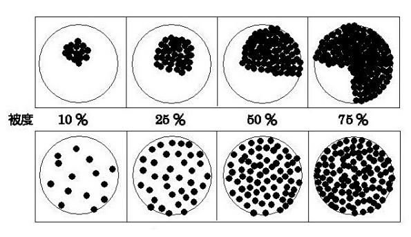

図1 被度算出の目安

本文で扱うサンゴとは、造礁性サンゴ類(堅い骨 格と褐虫藻を有する刺胞動物の種の総称)である。 すなわち、これには、ヒドロ虫綱アナサンゴモドキ 類、花虫綱八放サンゴ亜綱クダサンゴならびにアオ サンゴ、花虫綱六放サンゴ亜綱の中で褐虫藻を持つ イシサンゴ類全種が該当する。ソフトコーラルはサ ンゴに含まないが、本類が多産する場合には本類の 被度も別途算出しておくとよい。なお、白化してい ても生きているサンゴは、サンゴ被度に入れ、白化 後に死亡しているサンゴは含めない。

また、可能な範囲で、写真撮影を行う。詳細は、

5.補足事項⑤景観画像を参照されたい。

被度はサンゴ礁の状態を評価するための重要な指

標である。サンゴ礁域では、海底面がサンゴで被い 尽くされるのが健全な姿であり、そうでない場合は サンゴ群集を攪乱する何らかの要因が存在すると考 えられる。表2に被度から見たサンゴ礁状態の評価 目安を示す。本表から自分の海の現況を認識された い。ただし、高緯度サンゴ群集域ではサンゴ被度が 低く局所的である場合が多く、被度の評価目安は地 域によって異なる。

表2 被度によるサンゴ礁状態の評価目安

| 被度区分                                                                              | 対応する 被度(%) (10%刻み)                     | 評価                       |
|-----------------------------------------------------------------------------------|----------------------------------------------|--------------------------|
| 0% 以上 10% 10% 以上 25% 未満 25% 以上 50% 未満 50% 以上 75% | 未満 0,<5,<10 10,20 30,40 未満 50,60,70 | 極めて不良 不良 やや不良 良 |
| 75% 以上                                                                         | 80,90,100                                    | 優良                       |

①-2. サンゴ白化率:白化前まで生存していたと思 われるサンゴ全体に占める、白化したサンゴ及び白 化により死亡したサンゴの割合で、白化現象が確認 された場合に記入する(全体白化率)。死亡したサ ンゴの割合(全体死亡率)も合わせて記録する。ま た、サンゴ全体とは別に、白化の影響を受けやすい ミドリイシについても同様に白化率(ミドリイシ白 化率)及び死亡したサンゴの割合(ミドリイシ死亡 率)を記録する。白化率及び死亡率は次式で算出す る。

白化率(%)={(白化により死亡したサンゴ)+ (白化したサンゴ)}/{(白化により死亡したサン ゴ)+(白化したサンゴ)+(生サンゴ)}×100

死亡率(%)=(白化により死亡したサンゴ)/{(白 化により死亡したサンゴ)+(白化したサンゴ)+ (生サンゴ)}×100

※ ミドリイシのみの白化率及び死亡率の場合は、

上記の式のうち、「サンゴ」を「ミドリイシ」 に置き換えて計算する。

※ ①-1.サンゴ被度では、白化したサンゴ及び生サ ンゴを被度の対象とし、白化により死亡したサ ンゴは被度の対象としない。

また、任意の調査として、白化したサンゴを2つの 階級に分けられる場合は、その内訳の割合を記録す る。

- a) 軽度の白化(群体の色が薄くなっている)
- b) 白化(群体色が純白もしくはそれに近い薄い 色)

| 白化の階級      | サンゴの状態      |
|------------|-------------|
| 生サンゴ       | 群体色は変わらず、サン |
|            | ゴは正常に生きている  |
| 白化したサンゴ    | 触手等の軟組織が見え  |
|            | るなどポリプの生存が  |
|            | 確認できるサンゴ    |
| 軽度の白化      | 群体色が薄い      |
| 白化         | 群体色は純白もしくは  |
|            | それに近い薄い色    |
| 白化により死亡したサ | ポリプが死亡して骨格  |
| ンゴ         | だけが残る。触手などの |
|            | 軟組織が見えない、群体 |
|            | 表面に藻類が付着して  |
|            | いることなどから確認  |
|            | できる         |

①-3. 生育型:ソフトコーラルも含めた優占するサ ンゴの生育型で、以下の6つに分類する。

- Ⅰ.枝状ミドリイシ優占型:サンゴに占める枝状ミ ドリイシ類の割合が60%以上。
- Ⅱ.卓状ミドリイシ優占型:指状ミドリイシも含め る。サンゴに占める卓状ミドリイシ類の割合が60 %以上。
- Ⅲ.枝状・卓状ミドリイシ混成型:サンゴに占める 枝状、卓状ミドリイシ類の合計の割合が60%以上 (枝状、卓状ミドリイシ類各々の割合は60%未 満)。
- Ⅳ.特定類優占型:サンゴに占める上記以外の種も しくは類の割合が60%以上。優占する具体的な類 名もしくは種名を記入する。

- Ⅴ.多種混成型:多くの種が混在し、サンゴに占め る割合が60%以上の特定の優占種もしくは類が ない。
- Ⅵ.ソフトコーラル優占型:サンゴ及びソフトコー ラルの合計被度に占めるソフトコーラルの割合 が60%以上ある状態を指し、ソフトコーラル優占 型では原則としてサンゴ被度は40%を越えない。 ソフトコーラルとは、八放サンゴ亜綱根生目(ク ダサンゴを除く)及びウミトサカ目に属する全種 と定義する。本類の属以下の同定は難しいので、 優占類の特定は不要であるが、正確に把握できる 場合はそれを記入する。なお、ソフトコーラル優 占型の場合も、①-1.で求めるサンゴ被度は、サ ンゴを対象とし、ソフトコーラルは含めない。

記入時には枝ミド、卓ミド、枝卓、枝ハマ(例)、 多種、ソフトの略語を使用する。

また、海藻が大幅に繁茂することがあれば、特記事 項として記載する。

①-4. サンゴ加入度:調査範囲内の礁原もしくはパ ッチリーフ上部などの浅所において、加入が多そう な基質上で3ヵ所を選び、直径0~5cmのミドリイ シ属群体の1㎡当たりの加入数を記録する。ただし、 10個以上の場合は、10~20、20~30のように概数で 構わない。

5cm以下のミドリイシ属群体は、過去4年以内に 加入したものとみなすことができる。ミドリイシ属 の加入量の多寡は、サンゴ群集回復の早遅に密接に 関連するため、加入度により群集回復の予測が可能 となる。10個体/㎡以上の加入があれば、回復傾向に あることが多い。ただし、加入量が多くても回復し ない場合もあり、注意を要する。残念なことではあ るが、1998年の白化以降、日本のサンゴ礁域ではミ ドリイシ属の加入量が減少傾向にあることが確認さ れている。なお、高緯度サンゴ群集域では、ミドリ イシ以外のサンゴの加入も重要なので、必要に応じ てその他のサンゴの加入も記録されたい。

①-5. 大型卓状ミドリイシのサイズ:卓状ミドリイ シ長径上位5群体の大まかな大きさを記入し、最後 にそれらの平均値を求める。大型卓状ミドリイシの サイズは、サンゴ群集の回復経過のおおよその目安 となる。表3に大型卓状ミドリイシサイズから見た 回復期及びおおよその年齢を示す。なお、本表は、 数メートルもの大型群体を形成するクシハダミドリ イシ、ハナバチミドリイシ、ならびにエンタクミド リイシなどに適用される。

表3 大型卓状ミドリイシ属群体の サイズから見た回復期及び年齢

| 卓ミドサイズ             | 回復期 | おおよその年齢 |
|--------------------|-----|---------|
| 25cm未満             | 初期  | 0-5     |
| 25cm以上 100cm未満  | 前期  | 5-10    |
| 100cm以上 200cm未満 | 中期  | 10-15   |
| 200cm以上            | 後期  | 15以上    |
|                    |     |         |

①-6. オニヒトデ個体数:15分間の自由遊泳で観察 されたオニヒトデの個体数を記録する。ヒトデの観 察時間は、ヒトデが大きな集団をなす時は短縮する など、状況に応じて変更してもかまわないが、変更 した場合は15分間、1人当たりの個体数に換算した 値を使用する。15分換算値は次式で算出する。

#### 15分換算値=観察数×(15/観察時間)

原則的に水面からの観察とし、潜水してサンゴの 間隙や裏側などは探索しないが、食痕が観察された 場合はヒトデの存在確認のため潜水探索を行っても よい。特に高緯度サンゴ群集域のオニヒトデが分布 していなかった地域では、0から1に増加が見られた 際にも今後の大発生に対する注意が必要であるため、 特記事項に記載する。表4に15分間観察数に基づく ヒトデの発生状態を知る目安を示す。

表4 ヒトデ発生状況の目安

| 15分観察数 | 発生状態    |  |
|--------|---------|--|
| 0-1    | 通常分布    |  |
| 2-4    | 多い(要注意) |  |

 5-9 準大発生 10以上 大発生

①-7. オニヒトデ優占サイズ:出現したヒトデのサ イズ(直径:腕の端から反対側の腕の端まで)を野 帳板(A4サイズならおよそ30×20cm)を用いて 20cm未満、20cm以上30cm未満、30cm以上の3階級に 分類し、優占(最も多い)サイズ階級を求める。観 察されたオニヒトデが様々な大きさの場合は、最初 の10個体ほどのサイズ別個体数を記入し、その中で 最も多い階級が優占サイズとなる(たとえば、20cm 以下が2個体、20-30cmが3個体、30cm以上が6個体 なら、30cm以上が優占サイズ)。

オニヒトデのサイズ分けは年齢を推定する上で役 立つ。ヒトデは餌や水温条件にもよるが、一般的に 満2年で20cmを越えて成熟が始まり、3年で30cm以 上に達して摂食量、繁殖量が最も高まる。大発生が 顕在化するのは20-30cmと30cm以上のどちらかのク ラスである。なお、近年、稚ヒトデの分布状態で大 発生を予知する取り組みが始まっている。もし、数 センチ以下の個体を多数観察した場合には、特記事 項欄に記入されたい。

①-8. オニヒトデサイズ範囲:観察した全オニヒト デのサイズ範囲である。

# ①-9. オニヒトデの食害率

サンゴ全体に対する、明らかに最近オニヒトデに 食害されたと分かる、骨格が白く見えるサンゴ群体 の被覆面積の割合の概数。

#### ①-10. サンゴ食巻貝の発生状況

ミドリイシ類に被害を及ぼす、シロレイシガイダ マシ類(アクキガイ科シロレイシガイダマシ属の小 型巻貝類)等の発生状況を、以下の階級で記入する。

Ⅰ:食痕(新しいもの)は目立たない。

Ⅱ:小さな食痕や食害部のある群体が散見。

Ⅲ:食痕は大きく、食害部のある群体が目立つが、

 数百個体以上からなる密集した貝集団は見ら れない。

Ⅳ:斃死群体が目立ち、数百個体以上からなる密 集した貝集団が散見される。

食痕と病気との区別が難しい場合があるが、い くつか観察してみて、貝が見られたらその他の多く も食痕とみなす。サンゴ食巻貝はサンゴの枝の根元 から食害する傾向があるので、そうした食痕の特徴 によっても見分けることができる。なお、シロレイ シガイダマシ類以外の貝による食害が見られた場合 は、特記事項に記入する。

シロレイシガイダマシ類のシロレイシガイダマシ、 ヒメシロレイシガイダマシならびにクチベニレイシ ガイダマシは、大発生してオニヒトデに類似したサ ンゴ被害を及ぼすことがあり、特に本土の亜熱帯海 域(宮崎日南、宇和海、足摺、串本)では顕著であ る。本類はサンゴが分布する海域にはどこにでも生 息するが、上記3種は個体群密度が上昇すると集団 性と移動性を持つようになり、時に数千個体もの大 集団を形成する。大集団が形成され始めると、サン ゴの被度低下は急速に進む。

# ①-11. サンゴ食巻貝の食害率

サンゴ全体に対する、明らかに最近サンゴ食巻貝 に食害されたと分かる、骨格が白く見えるサンゴ群 体の被覆面積の割合の概数。

#### ①-12. 大型定着性魚類

全長30cm以上の魚類が目撃された場合に、種名と 個体数を記入する。調査者間で個体数が異なる場合 は、多い人の値を記入する。なお、対象となるのは ハタ類、ベラ類、ブダイ類の大型定着性魚類であり、 偶発的出現性の高い回遊性魚類は除く。大型定着性 魚類は乱獲が進み、減少の一途をたどっている。

#### ②物理環境

②-1. 位置:調査地点の中心付近の緯度経度をGPS で計測して記入する。船で地点に到達できない場合 は、可能ならば、GPSを防水パックに入れ、地点中心 まで水面上を泳いで行き計測する。なお、緯度経度 は世界測地系(WGS-84系)を使用する。GPSがこの測 地系に対応していない場合は、後で換算できるよう に使用した測地系名を記録しておく。表示形式は60 進法(dd°mm′ss″)よりも10進法(dd.ddddd°、 小数点以下5桁)を推奨する。表計算ソフト上やGIS (地理情報システム)などで数値の取り扱いが簡便 なためである。

②-2. 地形:調査地点の地形的環境を、礁池、離礁、 礁原、礁斜面に分類する(図2参照)。高緯度サン ゴ群集域においては、内湾、外海、沖瀬の区分程度 でよい。

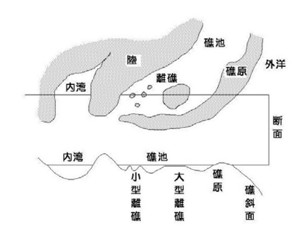

図2 模式的に見たサンゴ礁地形

②-3. 底質:海底面の状態を表し、岩(サンゴ岩)、 礫(サンゴ礫)、砂、泥などに分類する。複数の底 質が混在している場合は、1つに絞らなくてよい。 底質に大きな変化がみられた場合には、特記事項と して記入する。

②-4. 観察範囲:観察範囲は地形やサンゴ群集の広 がり方などによって異なる。観察した範囲のおおよ そのサイズをメートル単位で50×50のように記入 する。

②-5. 水深範囲:観察域の水深範囲をメートル単位 で1.5~8のように記入する。水深は目測でよい。

②-6. SPSS観測:SPSSは(Content of Suspended

Particles in Sea Sediment)の略語で、底質中懸濁 物質含有量を意味し、沖縄県衛生環境研究所赤土研 究室が赤土汚染の程度を推定する目的で考案した手 法「SPSS簡易測定法」を用いて測定する。本土にお いては、沖縄のような深刻な赤土汚染は少ないが、 河川や陸域から流入した土砂汚染や養殖場などから の有機物汚染の把握に適用可能である。ただし、閾 値が異なる可能性があり、測定値とサンゴの生育へ の影響については、注意が必要である。また、サン ゴ礁域、高緯度サンゴ群集域にかかわらず、SPSSに は赤土起源でない懸濁物質も含まれることから、必 要に応じて目視による状況を記載することも推奨さ れる。

SPSS簡易測定法の基本的な測定手順を以下に示 す。

- 1:調査地点を代表すると思われる底砂堆積域を任意 で選択し、250mlの蓋付きの容器一杯に表層底砂 を入れて船に戻り、船上で調査員2名の採取物を 1つのプラスチック容器にまとめて持ち帰る。
- 2:底砂を静置して静かに上澄みを切り、4mm目のふ るいでこし、こし採ったものを受け皿内で撹拌し て測定試料とする。
- 3:試料5mlを計量スプーン(泥が多い場合は2mlの スプーンを用いる)で量り取り、500mlペットボ トル(市販の飲料ボトル)に水で流し入れ、さら に水道水で500mlにメスアップし、蓋をして激し く振る。
- 4:1分間静置し、その後の水層を検水とする。
- 5:検水を30cm透視度計に入れて透視度を計測する (透視度が30cm以上、もしくは5cm未満の場合は 調整が必要)。
- 6:次式を用いてSPSSを算出する。

#### SPSS=(1718/透視度-17.8)×検水希釈倍率/試料量

測定に要する時間は1試料に付き約10分で、慣れ れば5分程度である。透視度計での計測では試料量 や検水の希釈量に調整が必要な場合が多く、必ず『底 質中懸濁物質含量簡易測定法(SPSS測定法)』を参 照いただきたい(沖縄県衛生環境研究所ホームペー ジ<http://www.eikanken-okinawa.jp/index.htm>より、 「掲載情報」の「水環境」ページから「赤土汚染の 話」ページへ移動し、「海に堆積した赤土等の調査 方法」ページの中に記述)。

表5にSPSS値、それに対応した底質状態の階級を 示す。階級6以上なら明らかに人為的要因による赤 土汚染状態と見なされる。なお、SPSSの値は雨期に 多く、底砂がよく撹拌される台風期や冬の季節風期 に少ないという季節性があり、年1回の調査では実 態解明は難しい。また、素潜りでの底砂採集は深所 (5m以深)では難しいため、深所ではスキューバ が必要とされる。従って、スポットチェック法を用 いた年1回の調査では、赤土汚染の把握が困難であ るが、調査時の底質環境の指標としては重要な情報 となる。そこで、本項目もサンゴ加入度と同様に、 調査者の必要(土砂汚染や有機物汚染の懸念がある) に応じて実施されたい。

表5 SPSS計測値のランクとその目視状況

| SPSS 階級 | SPSS測定値 (kg/m3) | 目視状況          |
|------------|--------------------|---------------|
|            | 以上 - 未満            |               |
| 1          | 0 - 0.4            | きわめてきれい       |
| 2          | 0.4 - 1            | 砂をかき混ぜてもシルトの  |
|            |                    | 舞い上がりは確認しづらい  |
| 3          | 1 - 5           | 砂をかき混ぜるとシルトの  |
|            |                    | 舞い上がりは確認できる   |
| 4          | 5 - 10             | 見た目では分からないが、砂 |
|            |                    | をかき混ぜるとシルトで水が |
|            |                    | 濁る            |
| 5a         | 10 - 30            | 注意して見ると、表層にシル |
|            |                    | トの堆積が確認できる。生き |
|            |                    | 生きとしたサンゴ礁生態系の |
|            |                    | 上限ランク         |
| 5b         | 30 - 50            | 底質表層にホコリ状の懸濁物 |
|            |                    | 質がかぶさる。透明度が悪く |
|            |                    | なりサンゴ被度に悪影響が出 |
|            |                    | 始める           |
| 6          | 50 - 200           | 一見してシルトの堆積を確認 |
| 7          | 200-400            | シルトが堆積するが、まだ砂 |
|            |                    | も確認することができる   |
| 8          | 400<               | 底質の見た目は泥そのもの  |
|            |                    |               |

※ 目視で測定する場合、5a及び5bは区別せず、 5とする。

②-7. 連続水温観測:連続的な水温観測は、小型水 温データロガーを海中もしくは海底に固定して行う。 データロガーの設置や回収にはスキューバが必要と なる。

#### ・標準仕様

計測範囲 0~50℃ 、精度 ±0.2℃、分解能 常温 で.02℃、ドリフト 0.1℃/年以内、応答速度 水中で 10分以内、時間精度 約±1分/月、バッテリー寿命 6年(1時間インターバルでの計測)、記録データ数 40000点以上、耐圧水深 50m以深、インターバル 1 時間で設定可能。

#### ・ロガー例

本体:HOBO Water Temp Prov2 U22-001(12×3cm) のシリンダー型水温データロガー、電池寿命6年、耐 圧水深120m)

ウォタープルーフシャトル:U-DTW-1(赤外線デー タ読み取り装置で、本体からデータを読み取ってパ ソコンに転送する)

 専用ソフト:HOBOware Pro (本ソフトを用いて データを処理する。エクセルへの出力も可能。ウイ ンドウズ版、マック版がある)

#### ・標準観測設定とデータ回収

記録は1時間間隔。1年ごとに本体を回収してデー タの読み取りと時計誤差を修正する。データ回収後 のロガーを再設置するか、予備のロガーを設置し、 水温記録を開始する。

#### ・設置場所

設置はサイト内の調査地点の代表となる地点と、 白化の影響を受けやすい水温変化の激しいところ の2ヵ所とする。

サンゴ礁生物の特に大きな物理的攪乱要因として、 シルトの堆積と異常水温の2つが挙げられる。後者 はサンゴの白化現象を誘発して死に至らしめる場合 が多い。特に近年、夏季異常高水温による白化現象 が多発傾向にあり、サンゴ群集に大きなインパクト を与え続けている。水温上昇は地球温暖化との関連

からも注視されており、国内のサンゴ礁域では水温 環境の観測網が整備されつつある。

#### ③特記事項

③-1. 他のサンゴ攪乱要因:サンゴ群集攪乱が観察 された場合に、要因や被害量を自由に記入する。白 化現象、オニヒトデ、サンゴ食巻貝、シルト堆積な どの補足状況、ナガウニやガンガゼなど、その他の 生物による被害、排水やアンカーなどの人為被害、 台風被害などがこれに該当する。

③-2. 特異な現象、生物:特記すべき生物や現象が 観察された場合に記録する。生物の産卵、希少種の 目撃など、個人メモとしても利用可能。

③-3.病気:別紙の資料を参考に、各調査地点内で 「腫瘍」や「黒帯病」及び「ホワイトシンドローム」 等サンゴの病気様の症状を持つ群体を観察した場 合は、その種類と調査地点における羅病の程度(サ ンゴ群集全体に対する割合等)を特記事項に記録す る。

#### 5.補足事項

# ①調査地点の選出

以下の基準を参考にされたい。A)既存資料や観察 情報に基づき、高密度なサンゴ群集や貴重な群落(群 体)がある場所、B)もしくはそれがかつてあった場 所、C)他のサンゴ礁調査地点として用いられ、公表 された、もしくは利用可能な既存資料がある場所、D) 上述したような情報が得られていなくとも、長期継 続が必要な根拠がある場所。なお、モニタリングは 地域のサンゴ自慢ではなく、長期継続的なサンゴ礁 の監視であることを念頭において、地点を設定され たい。また、継続観測することが重要なので、毎年 必ず行えるように無理のない場所、地点数が望まし い。1日に実施できる範囲と地点数の目安は、およ そ5km四方に10地点以内である。

#### ②調査対象域

GPS設定地点を中心とした15分間の遊泳可能範囲 内が調査対象域である。正方形に取るとおよそ50m 四方となるが、対象域の範囲形状は地形によって異 なるので、正方形にこだわらなくてよい。また、調 査対象を特定範囲(広さは任意)の群体、群落、も しくは群集に設定してもよい(例えば、砂地上にあ る特定の離礁や砂礫上に生育する特定範囲の枝ミド 群落など)。ただし、その場合は、おおよその広が りや周囲の状況を毎年記録する。いずれにしても、 経年変化を把握する上で信頼性の高いデータを得る ためには、調査域内ができるだけ一様な環境である ことと、毎年必ず同一範囲を観察することが重要と なる。

#### ③調査時期

近年、特に問題視されているサンゴの白化現象を とらえるために、秋季(9-10月)に行うことを推奨 する。目的に応じてこれ以外の時季に設定してかま わないが、経年変化を把握することが重要であるの で、時期は必ず固定して行う必要がある。

特に高緯度サンゴ群集域では、冬の低水温による 白化の被害が大きい。冬に白化が観察された場合は、 その情報を次年度調査の備考欄に記入する。

# ④観察時間

サンゴ群集の観察時間は、観察範囲や作業速度に よって異なってくるので、15分以上であっても、ま た、それ以下であってもかまわない。ただし、オニ ヒトデ探索時間は15分が原則となるので、ヒトデ探 索時間を短縮したり延長した場合は、必ず15分換算 値を算出して記入する。

#### ⑤景観画像

画像は概況を認識する上で重要なデータであり、 固定点(同一場所、同一方向)を設けて撮影してお くとさらに有用性が高まるので、可能な範囲で対応 されたい。固定点は特徴的な地形、群落などから1 点を選出できればよいが、初回撮影画像をパウチ加 工したものを持参すると、撮影が行いやすい。また、 任意でよい景観の写真や被害を受けた群落の撮影を 行う。画像は、撮影者と撮影日時、調査地点名・ID が分かるようにファイル名又はホルダ名を付け、調 査データや著作物の使用範囲チェックシートととも に事務局に送付する。

#### ⑥スキューバの使用

スポットチェック法はスノーケリングで行うこと を原則としているが、水深10mを越える深所や、透 視度が悪い海域ではスノーケリングで十分に観察で きない場合がある。その時はスキューバを使用して 調査を行ってもかまわない。ただし、スキューバに よる観察の場合、鉛直面のサンゴも観察されるので、 サンゴ被度は基質の表面積に対する被覆率となる。 そのため、野帳にはどの手段を用いたかが分かるよ う記入欄を設けてある。また、スキューバを使用す る場合は、潜水士の資格が必要である。

#### ⑦スポットチェック法で算出した被度の信頼性

スポットチェック法での被度の算出は、目視とい う主観的な認識に頼るため、客観的手法(コドラー ト法やライントランゼクト法など)に比べると、デ ータの精度はやや劣り、また、人によって値が最大 で±20%の差を生じることがある。ただし、この差 はトレーニングを積むことによって、また、複数の 調査者の値を平均化することによって、偏差の幅を 抑えることができる。

石西礁湖内の複数地点において、同一日に実施し たスポットチェック法調査と、精度の高い客観的手 法であるライントランゼクト法調査における被度の 相違を比較したところ、互いの調査範囲が完全に重 複した6地点においては、両調査間の被度差は0.3 ~10.6%、平均6.5%で、両調査結果から求めた一次 回帰式には高い相関関係が認められた(r=0.96, p<0.01)。従って、スポットチェック法は、客観的 手法に比べて信頼性が特に劣ることはなく、有効な サンゴ群集の定量手法であると評価される。

サンゴ群集の分布は一様ではなく、場所によって 群集量には疎密があり、観察範囲が異なれば、当然 ながら被度結果にも差は生じる。そのため、被度の 経年変化を比較する場合には、手法の精度よりもむ しろ調査範囲の統一性が、データの信頼の上で重要 であると考えられる。

# 6.あとがき

本マニュアルは、野村恵一氏(串本海中公園セン ター)が作成したものを、平成15年(2003)年度か ら開始された「重要生態系監視地域モニタリング推 進事業(サンゴ礁調査)」(モニタリングサイト 1000)に適用させるため、修正したものである。

# 更新履歴

平成16(2004)年7月 第1版 平成19(2007)年7月 第2版

- ②-7.連続水温観測の修正
- ③-1. 他のサンゴ攪乱要因の修正
- ③-3.病気の追記

平成20(2008)年2月 第3版

①-4.サンゴ加入度の修正

平成21(2009)年8月 第4版

- ①-1.サンゴ被度の計算式の追記
- ①-2.サンゴ白化率計算式の追記
- ①-3. 生育型の修正
- ①-4. サンゴ加入度の修正
- ①-6. オニヒトデ個体数の修正
- ①-10. サンゴ食巻貝の発生状況の修正
- ②-1. 位置の修正
- ②-3. 底質の修正
- ②-4. 観察範囲の修正
- ②-5. 水深範囲の修正
- ②-6. SPSS観測の修正
- ②-7. 連続水温観測の仕様の追記
- 5.補足事項 ⑤景観画像の追記
- 5.補足事項 ⑥スキューバの使用の潜水資格追記 その他、文言等の修正。

#### 平成25(2013)年7月 第5版

①-1.被度によるサンゴ礁状態の評価目安(表2) における対応する被度(%)(10%区切り)の 追記

改訂前

表2 被度によるサンゴ礁状態の評価目安

| 被度(%)                                                                                                            | 評価                             |
|------------------------------------------------------------------------------------------------------------------|--------------------------------|
| 0% 以上 10% 未満 10% 以上 25% 未満 25% 以上 50% 未満 50% 以上 75% 未満 75% 以上 | 極めて不良 不良 やや不良 良 優良 |

#### 改訂後

表2 被度によるサンゴ礁状態の評価目安

| 被度(%)                                                                  | 評価                             |
|------------------------------------------------------------------------|--------------------------------|
| 0%、5%未満、10% 未満 10%、20% 30%、40% 50%、60%、70% 80%、90%、100% | 極めて不良 不良 やや不良 良 優良 |

# ③-3.病気の程度についての記録の追加 改訂前

③-3.病気:別紙の資料を参考に、各調査地点 内で「腫瘍」や「黒帯病」及び「ホワイト シンドローム」様の症状を持つ群体の有無 を記録する。また、この他病気様のサンゴ 群体を観察した場合も、その特徴を特記事 項に記す。

#### 改訂後

③-3.病気:別紙の資料を参考に、各調査地点 内で「腫瘍」や「黒帯病」及び「ホワイト シンドローム」等サンゴの病気様の症状を 持つ群体を観察した場合は、その種類と調 査地点における羅病の程度(サンゴ群集全 体に対する割合等)を特記事項に記録する。

モニタリングサイト1000 (サンゴ礁調査) スポットチェック法によるサンゴ礁調査マニュアル 第4版

発行日 2009年8月

#### 編集・発行

環境省自然環境局生物多様性センター 〒 403− 0005 山梨県富士吉田市上吉田剣丸尾 5597− 1

Tel:0555− 72− 6033 FAX:0555− 72− 6035

URL: https://www.biodic.go.jp/

#### お問い合わせ先(2009年8月現在)

財団法人自然環境研究センター

担当:木村 匡

〒130-8606 東京都墨田区江東橋3-3-7 Tel: 03-6659-6332 Fax: 03-6332-5633

#### 監修

モニタリングサイト1000サンゴ礁調査検討会(岩尾 研二:財団法人熱帯海洋生態研究振興財団、岩瀬文 人:財団法人黒潮生物研究財団、梶原健次:宮古島 市役所、佐々木哲郎:特定非営利法人小笠原自然文 化研究所、野島哲:九州大学、野村恵一:株式会社 串本海中公園センター、横地洋之:東海大学)

# 2021 年度 モニタリングサイト 1000 サンゴ礁調査報告書

――――――――――――――――――――――――――――――――――――

令和 4(2022)年 3 月

環境省自然環境局 生物多様性センター 〒403-0005 山梨県富士吉田市上吉田剣丸尾 5597-1 電話:0555-72-6033

――――――――――――――――――――――――――――――――――――

――――――――――――――――――――――――――――――――――――

業務名 令和 3 年度重要生態系監視地域モニタリング推進事業 (サンゴ礁調査)

請負者 一般財団法人 自然環境研究センター 〒130-8606 東京都墨田区江東橋3丁目3番7号

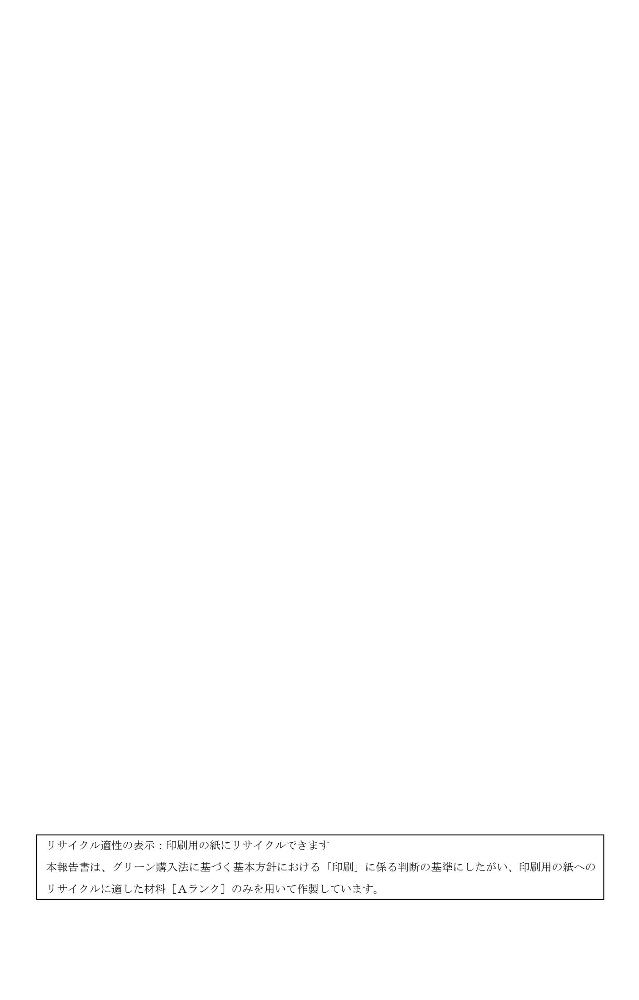