# 2024 年度

# 西表石垣国立公園石西礁湖及びその近隣海域 におけるサンゴ礁モニタリング調査報告書

令和 7(2025)年 3 月 環境省自然環境局 生物多様性センター

## はじめに

石西礁湖及び周辺の海域は、1970~80年代のオニヒトデの大発生によって、ほとんど のサンゴ群集が死滅した。その後、サンゴ礁生態系は徐々に回復したが、1998年には海 水温の上昇によるサンゴの白化現象が起き、再び大きな被害を受けた。また、開発に伴う 陸地からの赤土流出や生活排水などの人為的かく乱が、サンゴ礁生態系を更に危機的な状 況へと追い込んだ上に、2001年以降はオニヒトデが再び急増し、大きな食害をもたらし た。近年、ようやくオニヒトデの大発生がほぼ収束したが、2016年、2017年および2022 年には琉球列島を中心に夏季高水温による白化現象が発生し、同海域のサンゴ群集に大き な被害をもたらした。被害を受けたサンゴ群集はその後回復の兆しが見られていたが、今 年度も日本の各地で夏季高水温による白化現象が発生し、石西礁湖及び周辺の海域のサン ゴ群集に再び大きな被害がもたらされている。

環境省では、石垣島周辺海域、石西礁湖及び西表島周辺海域において、広域的なサンゴ の生息状況を把握するための調査を行っている。石西礁湖については1983年度から調査が 継続されており、今年度で42回目を数える(1983~1997年度は竹富町と財団法人海中公 園センター八重山海中公園研究所との共同調査、1998~2001年度は環境省と財団法人海中 公園センター八重山海中公園研究所との共同調査、2002年度以降は環境省事業として実 施)。また、石垣島周辺海域については、白化直後の1998年度に調査を開始し、今年度で 27回目の調査となった。

なお、2003年度から本調査は環境省の重要生態系監視地域モニタリング推進事業(モニ タリングサイト1000)の一環として進められている。

## 【石垣島周辺海域】

- 全 77 調査地点の平均サンゴ被度は 20%であり、昨年度と変化はなかった。サンゴ被 度の最高値は 80%で、昨年度と同様であった。
- サンゴ被度が昨年度より 30 ポイント以上「大きく増加」した地点は 1 地点で、昨年 度より増加した。10 ポイント以上 30 ポイント未満で「増加」した地点は昨年度から 10 地点増加して 24 地点であった。10 ポイント以上 30 ポイント未満で「減少」した 地点は 8 地点、30 ポイント以上「大きく減少」した地点は 0 地点と、サンゴ被度の 増加傾向が見られた。
- 全調査地点中、オニヒトデが確認されたのは 2 地点で、被食率は 1%未満であった。
- 夏季高水温による白化現象が 33 地点で確認されたが、サンゴ被度が大幅に減少した ような地点はなく、今年度の白化現象によるサンゴの減少は限定的であった。
- SPSS 測定値の平均値は 13.1 kg/m3で昨年度(10.7 kg/m3)より増加した。また、サ ンゴ群集に影響を与える SPSS 階級 5b 以上を示した地点は、昨年度より 1 地点増加 して 6 地点であった。

## 【石西礁湖及び西表島周辺海域】

- 全 124 調査地点での平均サンゴ被度は 20%であり、昨年度と変化はなかった。サン ゴ被度の最高値は、石西礁湖北部の地点 31 の 70%であった。
- サンゴ被度が昨年度より 30 ポイント以上「大きく増加」した地点はなく、10 ポイン ト以上 30 ポイント未満で「増加」した地点は、昨年度から 18 地点減少して 14 地点

であった。10 ポイント以上 30 ポイント未満でサンゴ被度が「減少」した地点は 38 地点、30 ポイント以上「大きく減少」した地点は 3 地点で、サンゴ被度の減少傾向が 見られた。

- オニヒトデの観察地点数は 2 地点で、昨年度の 17 地点から減少した。オニヒトデの 総観察個体数も昨年度の 23 個体から 3 個体に減少した。
- 今年度も夏季高水温が原因と考えられる白化現象が確認され、全地点の平均白化率 は 89.0%(昨年度は 42.1%)、平均死亡率は 30.9%(昨年度は 0.2%)であり、全調 査地点(125 地点)で白化率が 50%以上であった。
- 36 地点(全調査地点の約 29%)で台風の波浪によるサンゴの破損が確認された。
- 腫瘍が確認された地点は 33 地点(昨年度 42 地点)、黒帯病が確認された地点は 35 地点(昨年度 31 地点)、ホワイトシンドロームが確認された地点は 115 地点(昨年 度 117 地点)であった。
- SPSS 測定値の平均値は昨年度の 42.5 kg/m3から 60.0 kg/m3に増加し、サンゴ群集 に影響を与える SPSS 階級 5b 以上の地点は、昨年度の 27 地点から 26 地点に減少 した。

## SUMMARY

## 【**Ishigaki Island**】

- The average coral cover of all 77 monitoring stations was 20%, unchanged from last year. The highest coral cover value was 80%, consistent with last year.
- There was one station where coral cover increased by more than 30 percentage points compared to last year. The number of stations with a coral cover increase of 10 percentage points or more, but less than 30 percentage points, rose from 14 to 24 since last year. There were 8 stations with a coral cover decrease of 10 percentage points or more, but less than 30 percentage points, and no stations with a decrease of more than 30 percentage points, indicating an overall increasing trend in coral cover.
- Acanthaster were observed at two stations, and the predation damage rate was less than 1%.
- Coral bleaching due to high water temperatures in summer was observed at 33 stations, but coral cover did not decrease severely at any station, therefore the decrease in coral cover due to coral bleaching was not significant.
- The average value of SPSS (Suspended Particle in Sea Sediment) measurements was 13.1 kg/m3, a increase from last year (10.7 kg/m3). Furthermore, the number of stations showing SPSS stress level 5b or higher, which affects coral communities, increased by 1 station from last year to 6 stations.

## 【**Sekisei Lagoon and Iriomote Island**】

 The average coral cover at all 124 monitoring stations was 20%, unchanged from last year. The highest coral cover was 70% at station 31 in the northern area of Sekisei Lagoon.

- There were no stations where coral cover increased by more than 30 percentage points compared to last year, but the number of stations where coral cover increased by 10 percentage points or more but less than 30 percentage points decreased by 18 stations from last year to 14 stations. There were 38 stations where coral cover decreased by 10 percentage points or more but less than 30 percentage points, and three stations where coral cover decreased by more than 30 percentage points, indicating an overall decreasing trend in coral cover.
- The number of observation stations for Acanthaster was 2, a decrease from 17 stations last year. The total number of Acanthaster observed also decreased from 23 last year to 3.
- Coral bleaching, believed to be caused by high summer temperatures, was observed this year as well. The average bleaching rate for all stations was 89.0% (compared to 42.1% last year), and the average mortality rate was 30.9% (compared to 0.2% last year). The bleaching rate was 50% or higher at all monitoring stations (124 stations).
- Typhoon-related coral damage was confirmed at 36 stations (approximately 29% of all monitoring stations).
- Coral tumors were confirmed at 33 stations (42 stations last year), black band disease at 35 stations (31 stations last year), and white syndrome at 115 stations (117 stations last year).
- The average value of SPSS (Suspended Particle in Sea Sediment) measurements increased from 42.5 kg/m3 last year to 60.0 kg/m3, and the number of stations showing SPSS stress level 5b or higher, which affects coral communities, decreased from 27 stations last year to 26 stations.

## 目 次

はじめに

要約

## SUMMARY

| I | 調査方法                                              |
|---|---------------------------------------------------|
|   | 1. 調査範囲及び地点                                       |
|   | 2. 調査期間                                           |
|   | 3. 調査方法及び調査項目                                     |
|   | (1)調査方法                                           |
|   | (2)調査項目9                                          |
|   | 1) サンゴの生育状況9                                      |
|   | ①サンゴの被度及び生育型 9                                    |
|   | ②卓状ミドリイシ類の最大長径(平均値)10                             |
|   | ③ミドリイシ類の新規加入量(群体密度)11                             |
|   | 2) サンゴのかく乱要因11                                    |
|   | ①オニヒトデ11                                          |
|   | ②サンゴ食巻貝11                                         |
|   | ③白化現象12                                           |
|   | ④病気の発生状況12                                        |
|   | 3)物理環境12                                          |
|   | ①位置                                               |
|   | ②地形12                                             |
|   | ③底質                                               |
|   | ④観察範囲 ····································        |
|   | ⑤水深範囲                                             |
|   | ⑥シルトの堆積 (SPSS) ·································· |
|   | 4) 大型定着性魚類 ····································   |
|   |                                                   |
|   | 5)特記事項                                            |
|   | 4. 調査実施者14                                        |

| П | 調査結果と考察15                  |
|---|----------------------------|
|   | 1. 石垣島周辺海域                 |
|   | (1) サンゴの生育状況15             |
|   | 1) サンゴの被度及び生育型15           |
|   | 2) 卓状ミドリイシ類の最大長径 (平均値)21   |
|   | 3) ミドリイシ類の新規加入量(群体密度)24    |
|   | (2)サンゴのかく乱要因の状況26          |
|   | 1) オニヒトデ26                 |
|   | 2) サンゴ食巻貝29                |
|   | 3) 白化現象31                  |
|   | 4) その他の自然のかく乱33            |
|   | ①台風33                      |
|   | ②サンゴの病気33                  |
|   | ③テルピオス35                   |
|   | ④シルトの堆積状況 (SPSS) ·······35 |
|   | (3)大型定着性魚類37               |
|   |                            |
|   | 2. 石西礁湖及び西表島周辺海域38         |
|   | (1) サンゴの生育状況38             |
|   | 1) サンゴの被度及び生育型38           |
|   | 2) 卓状ミドリイシ類の最大長径(平均値)46    |
|   | 3) ミドリイシ類の新規加入量(群体密度)50    |
|   | (2) サンゴのかく乱要因の状況           |
|   | 1) オニヒトデ                   |
|   | 2) サンゴ食巻貝                  |
|   | 3) 白化現象61                  |
|   | 4) その他の自然のかく乱64            |
|   | ①台風                        |
|   | ②サンゴの病気64                  |
|   | ③テルピオス67                   |
|   | ④シルトの堆積状況 (SPSS) ·······68 |
|   | (3) 大型定着性魚類71              |
|   | (4) 貨物船座礁事故の発生71           |

| Ш  | 参考文南 | ₹ · · · · · · · · 72           |
|----|------|--------------------------------|
| IV | 付録 … | ······73                       |
|    | 付表   | 調査結果一覧75                       |
|    | 付図1. | 各調査地点の景観及び概況(石垣島周辺海域)83        |
|    | 付図2. | 各調査地点の景観及び概況(石西礁湖及び西表島周辺海域)105 |

## Ⅰ 調査方法

## 1.調査範囲及び地点

本調査は、調査範囲を「石垣島周辺海域」及び「石西礁湖及び西表島周辺海域」の 2 海域 に分けて実施している。調査地点は、石垣島周辺海域に 77 地点(図 1)、石西礁湖に 102 地 点(図 2)、西表島周辺海域に 23 地点(図 3)の合計 202 地点を設置している。表 1 に基礎 データとして、各調査地点の位置(緯度経度)や地形等を示した。なお、調査地点の位置(緯 度経度)は WGS-84 測地系による GPS で記録した。

なお、座礁船撤去作業にもとづく立ち入り制限区域内に入っているため、石西礁湖に設置 した地点 71(嘉弥真島東沖礁外縁)では今年度は調査を実施しなかった。

## 2.調査期間

調査期間及び調査実施日数は、下記に示すとおり。

- ・石垣島周辺海域:2024 年 10 月 17 日から 2025 年 1 月 18 日の期間中に 10 日間
- ・石西礁湖及び西表島周辺海域:2024 年 10 月 15 日から 11 月 23 日の期間中に 21 日間

## 3.調査方法及び調査項目

## (1)調査方法

GPS を用いて調査地点に船で赴き、調査員 2 名がそれぞれ任意に 15 分間のスノーケリ ングをしながら、後述の調査項目について目視観察を行う「スポットチェック法」を用いた。 また、底質に砂又は泥の堆積が確認された場所では、それら底質を採取して実験室に持ち帰 り、SPSS 測定法を用いて底質中の赤土含有量を計測した。さらに、各地点では代表的な場 所を選び、景観の特徴を記録するための写真撮影を行った。各調査項目及び具体的な調査手 順を下記に示す。

なお、本報告では、「サンゴ」及び「ソフトコーラル」を、刺胞動物門における下記の種 を総称するものとして扱った。

## 「サンゴ」:

- ・ヒドロ虫綱アナサンゴモドキ目全種
- ・花虫綱八放サンゴ亜綱ウミトサカ目のうちのクダサンゴ
- ・花虫綱八放サンゴ亜綱アオサンゴ目(本邦産アオサンゴのみ)
- ・花虫綱六放サンゴ亜綱イシサンゴ目全種

## 「ソフトコーラル」:

・花虫綱八放サンゴ亜綱ウミトサカ目のうち骨格や骨軸を持たないもの

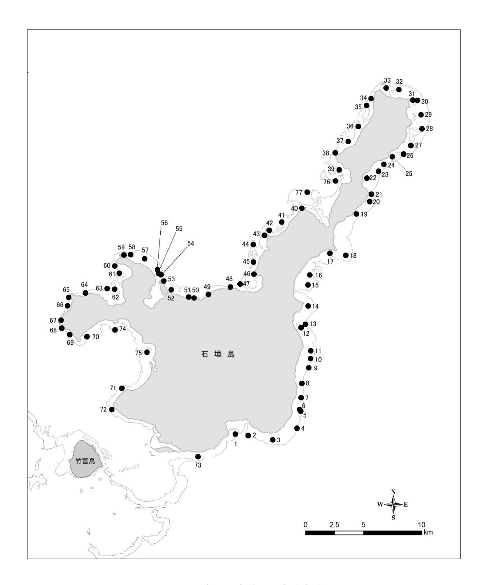

図1 石垣島周辺海域の調査地点位置図

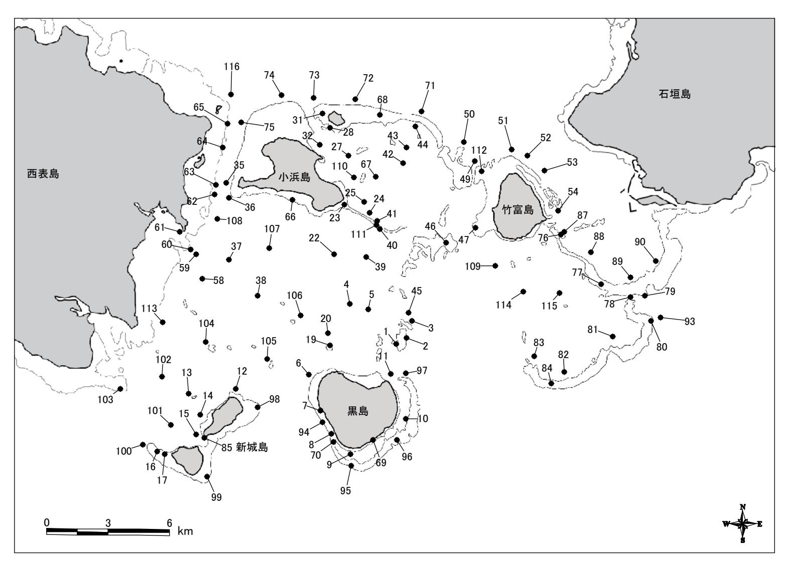

図2 石西礁湖周辺海域の調査地点位置図

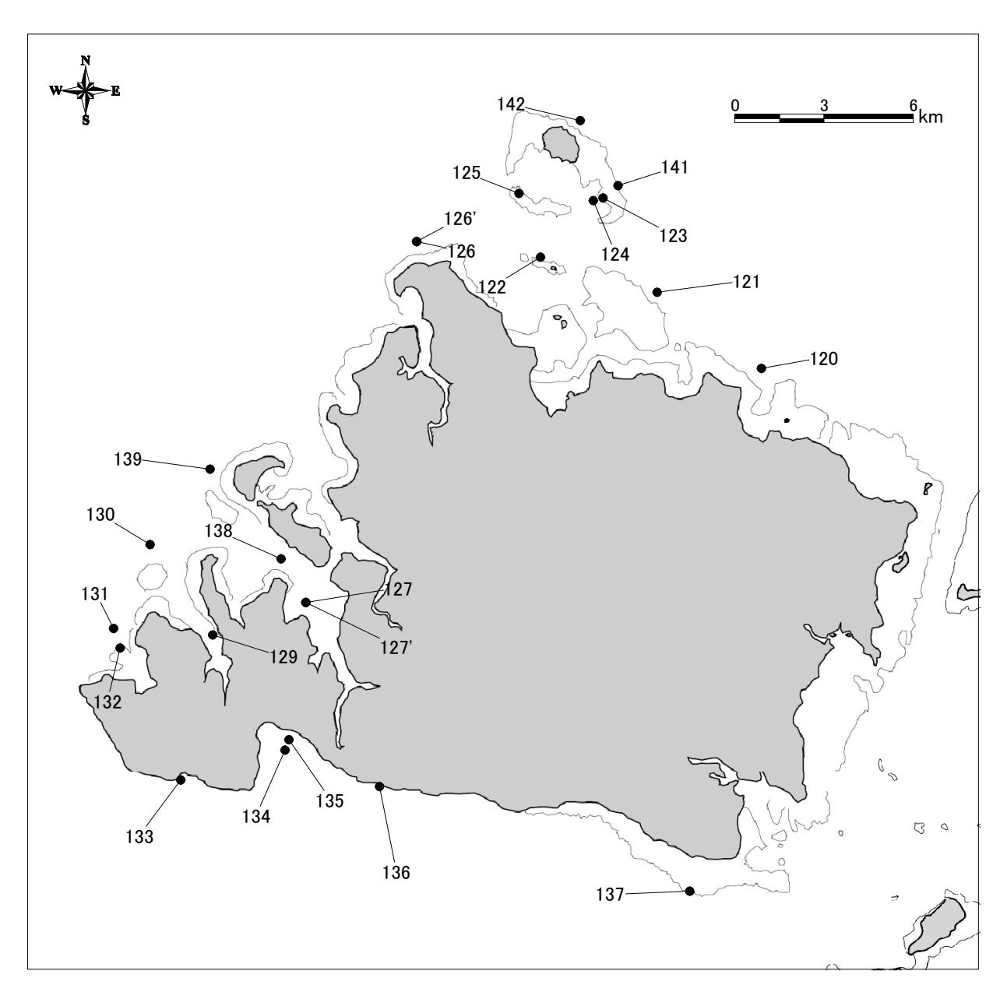

図3 西表島周辺海域の調査地点位置図

表1 各調査地点の基礎データ

|      | 【石垣島周辺海域】 |             |              |         |      | 観察範囲  | 水深範囲    |
|------|-----------|-------------|--------------|---------|------|-------|---------|
| 地点番号 | 地名        | 北緯          | 東経           | 地形      | 底質   | (m)   | (m)     |
| 1    | 大浜小前      | 24°20′42.7″ | 124°12′17.5″ | 礁池      | 岩・枝礫 | 50×50 | 1.5~2.5 |
| 2    | 宮良川河口     | 24°20′39.4″ | 124°12′53.4″ | 礁原・礁斜面  | 岩    | 50×50 | 1.5~8   |
| 3    | 宮良集落前     | 24°20′27.1″ | 124°14′01.7″ | 礁池      | 砂・岩  | 50×50 | 1~1.5   |
| 4    | 白保集落前     | 24°20′59.6″ | 124°15′09.6″ | 礁池・礁原   | 岩・枝礫 | 50×50 | 1~2     |
| 5    | 白保アオサンゴ   | 24°21′47.4″ | 124°15′19.6″ | 礁池・礁原   | 岩・砂  | 50×50 | 1~3     |
| 6    | 白保第1ポール   | 24°21′51.7″ | 124°15′16.4″ | 礁池      | 岩・枝礫 | 50×50 | 1~2.5   |
| 7    | 白保~轟川     | 24°22′24.4″ | 124°15′20.5″ | 礁池      | 岩・枝礫 | 50×50 | 1.5~2.5 |
| 8    | 轟川河口      | 24°23′04.2″ | 124°15′22.7″ | 礁池      | 岩・砂  | 50×50 | 1.5~2.5 |
| 9    | モリヤマグチ    | 24°23′48.0″ | 124°15′41.7″ | 礁原・水路斜面 | 岩・枝礫 | 50×50 | 1~5     |
| 10   | スムジグチ     | 24°24′13.7″ | 124°15′47.1″ | 礁池      | 岩・枝礫 | 50×50 | 1~4     |
| 11   | 採石場前      | 24°24′35.6″ | 124°15′47.9″ | 礁池・礁原   | 岩・枝礫 | 50×50 | 1~3     |
| 12   | 通路川南      | 24°25′40.0″ | 124°15′20.5″ | 礁池      | 岩・枝礫 | 50×50 | 0.5~4   |
| 13   | 通路川水路北    | 24°25′49.4″ | 124°15′32.6″ | 礁原・水路斜面 | 岩・枝礫 | 50×50 | 0.5~5   |
| 14   | 野原崎       | 24°26′40.3″ | 124°15′40.2″ | 礁池      | 枝礫・砂 | 50×50 | 2~4     |
| 15   | 伊野田漁港前    | 24°27′39.2″ | 124°15′39.7″ | 礁池      | 枝礫・岩 | 50×50 | 1~2     |
| 16   | 大野牧場前     | 24°28′06.9″ | 124°15′45.2″ | 礁原・水路斜面 | 岩・枝礫 | 50×50 | 1~5     |
| 17   | 玉取崎南      | 24°29′07.6″ | 124°16′40.7″ | 礁池      | 岩・枝礫 | 50×50 | 1~3     |
| 18   | 玉取崎東      | 24°29′01.7″ | 124°17′25.2″ | 礁池      | 岩・枝礫 | 50×50 | 1~2     |
| 19   | 伊原間牧場前    | 24°30′57.3″ | 124°17′55.0″ | 礁池      | 枝礫・岩 | 50×50 | 2~5     |
| 20   | トムル崎南     | 24°31′31.6″ | 124°18′32.2″ | 礁池・礁原   | 岩・枝礫 | 50×50 | 1~3     |
| 21   | トムル崎      | 24°31′52.6″ | 124°18′36.7″ | 礁原      | 枝礫・岩 | 50×50 | 1~2     |
| 22   | パラワールド前   | 24°32′37.5″ | 124°18′23.9″ | 礁池      | 枝礫   | 50×50 | 1.5~2.5 |
| 23   | 明石~安良崎    | 24°32′56.3″ | 124°18′56.7″ | 礁原・水路斜面 | 岩・礫  | 50×50 | 1~5     |
| 24   | 安良崎南      | 24°33′15.6″ | 124°19′11.2″ | 礁池      | 岩・枝礫 | 50×50 | 1~2.5   |
| 25   | 安良崎       | 24°33′36.8″ | 124°19′34.9″ | 礁池      | 岩・枝礫 | 50×50 | 1~4     |
| 26   | 安良グチ北     | 24°33′44.3″ | 124°20′06.4″ | 礁原・水路斜面 | 岩・礫  | 50×50 | 1~5     |
| 27   | 岩崎南       | 24°34′08.2″ | 124°20′26.3″ | 礁池      | 岩・枝礫 | 50×50 | 1~3     |
| 28   | 岩崎        | 24°34′55.0″ | 124°20′57.9″ | 礁池      | 岩・枝礫 | 50×50 | 1~5     |
| 29   | 岩崎~浦崎     | 24°35′33.6″ | 124°20′55.1″ | 礁池      | 岩・枝礫 | 50×50 | 0.5~2.5 |
| 30   | 浦崎沖       | 24°36′14.2″ | 124°20′45.0″ | 礁池・礁原   | 岩・枝礫 | 50×50 | 1~2     |
|      |           |             |              |         |      |       |         |
| 31   | 浦崎前       | 24°36′14.8″ | 124°20′31.7″ | 礁池      | 枝礫・岩 | 50×50 | 1~2     |
| 32   | 平野集落前     | 24°36′44.2″ | 124°19′53.4″ | 礁池      | 岩・枝礫 | 50×50 | 1.5~3   |
| 33   | 平久保灯台北    | 24°36′48.8″ | 124°19′17.9″ | 礁原・水路斜面 | 岩・枝礫 | 50×50 | 1~7     |
| 34   | 平久保灯台西    | 24°36′19.1″ | 124°18′35.6″ | 礁池・礁原   | 枝礫・岩 | 50×50 | 1~2     |
| 35   | 平久保川北     | 24°36′00.1″ | 124°18′23.2″ | 礁池      | 枝礫・岩 | 50×50 | 1.5~5   |
| 36   | 平久保集落南    | 24°35′01.4″ | 124°18′00.1″ | 礁池      | 枝礫・岩 | 50×50 | 1.5~5   |
| 37   | 嘉良川前      | 24°34′19.1″ | 124°17′31.8″ | 礁池      | 枝礫・岩 | 50×50 | 2~5     |
| 38   | ダテフ崎北     | 24°33′48.0″ | 124°16′55.5″ | 礁斜面     | 岩・枝礫 | 50×50 | 1.5~6   |
| 39   | ダテフ崎南     | 24°33′00.4″ | 124°17′07.0″ | 礁池      | 枝礫・砂 | 50×50 | 2~5     |
| 40   | 野底石崎      | 24°31′13.0″ | 124°15′22.9″ | 礁池      | 枝礫・岩 | 50×50 | 2~6     |
| 41   | 栄集落前      | 24°30′34.3″ | 124°14′26.9″ | 礁池      | 枝礫・岩 | 50×50 | 2~6     |
| 42   | 野底集落前     | 24°30′11.5″ | 124°13′51.8″ | 礁池      | 枝礫・岩 | 50×50 | 2~8     |
| 43   | 野底崎       | 24°29′57.6″ | 124°13′38.2″ | 礁池      | 岩・枝礫 | 50×50 | 2~5     |
| 44   | 伊土名北      | 24°29′32.1″ | 124°13′07.7″ | 礁池・礁原   | 枝礫   | 50×50 | 1.5~2.5 |
| 45   | 伊土名南      | 24°28′43.3″ | 124°13′08.2″ | 礁原・礁斜面  | 岩・枝礫 | 50×50 | 1.5~6   |
| 46   | 浦底湾口北     | 24°28′09.4″ | 124°13′09.1″ | 礁原・礁斜面  | 岩・枝礫 | 50×50 | 1.5~5   |
| 47   | 浦底湾口西     | 24°27′41.7″ | 124°12′31.0″ | 礁原・礁斜面  | 枝礫・岩 | 50×50 | 2~8     |
| 48   | 富野集落前     | 24°27′33.7″ | 124°12′03.7″ | 礁原・礁斜面  | 岩    | 50×50 | 1~8     |
| 49   | 米原キャンプ場   | 24°27′12.8″ | 124°11′02.7″ | 礁池      | 枝礫・岩 | 50×50 | 1~2     |
| 50   | ヤマバレー前    | 24°27′02.6″ | 124°10′22.9″ | 礁原・礁斜面  | 岩・枝礫 | 50×50 | 1~8     |
| 51   | ヤマバレー西    | 24°27′05.4″ | 124°10′07.1″ | 礁池      | 岩・枝礫 | 50×50 | 1~2     |
| 52   | 川平小島東     | 24°27′25.6″ | 124°09′18.9″ | 礁池      | 岩・枝礫 | 50×50 | 1~2.5   |
| 53   | 川平小島北     | 24°27′49.8″ | 124°08′58.0″ | 礁池      | 岩・枝礫 | 50×50 | 1~2.5   |
| 54   | 川平水路東     | 24°28′07.6″ | 124°08′50.2″ | 礁原・水路斜面 | 岩・枝礫 | 50×50 | 1~8     |
| 55   | 川平水路      | 24°28′10.5″ |              |         |      |       |         |

| 地点番号     | 地名                       | 北緯                             | 東経                               | 地形       | 底質       | 観察範囲 (m)    | 水深範囲 (m) |
|----------|--------------------------|--------------------------------|----------------------------------|----------|----------|----------------|-------------|
| 56       | 川平水路北西                   | 24°28′21.9″                    | 124°08′40.8″                     | 礁池・礁原    | 岩・枝礫     | 50×50          | 1~2.5       |
| 57       | 川平~石崎                    | 24°28′52.2″                    | 124°08′04.5″                     | 礁池       | 岩・枝礫     | 50×50          | 1~2.5       |
| 58       | クラブメッド前                  | 24°29′04.2″                    | 124°07′25.6″                     | 礁原・礁斜面   | 岩・枝礫     | 50×50          | 1~8         |
| 59       | 川平石崎北                    | 24°29′03.1″                    | 124°07′06.8″                     | 礁池・礁原    | 枝礫・岩     | 50×50          | 1~1.5       |
| 60       | 川平石崎南                    | 24°28′32.3″                    | 124°06′41.6″                     | 礁池・礁原    | 岩・枝礫     | 50×50          | 1.5~3       |
| 61       | 底地ビーチ沖                   | 24°28′11.6″                    | 124°06′54.3″                     | 礁池       | 枝礫・岩     | 50×50          | 1~7         |
| 62       | 崎枝湾内                     | 24°27′27.2″                    | 124°06′40.7″                     | 礁池       | 枝礫・岩     | 50×50          | 2~3         |
| 63       | 崎枝湾口                     | 24°27′28.9″                    | 124°06′20.1″                     | 礁原・礁斜面   | 岩        | 50×50          | 1~8         |
| 64       | 崎枝~御神                    | 24°27′17.2″                    | 124°05′19.7″                     | 礁原・礁斜面   | 岩        | 50×50          | 1~8         |
| 65       | 御神崎                      | 24°27′04.1″                    | 124°04′33.3″                     | 礁原・礁斜面   | 岩        | 50×50          | 1~8         |
| 66       | 御神~屋良部                   | 24°26′41.0″                    | 124°04′30.1″                     | 礁原・礁斜面   | 岩・枝礫     | 50×50          | 1~8         |
| 67       | 屋良部崎北                    | 24°26′01.0″                    | 124°04′11.8″                     | 礁原・礁斜面   | 岩        | 50×50          | 1~8         |
| 68       | 屋良部崎南                    | 24°25′38.9″                    | 124°04′13.6″                     | 礁原・礁斜面   | 岩        | 50×50          | 1~8         |
| 69       | 屋良部~大崎                   | 24°25′20.5″                    | 124°04′36.1″                     | 礁池・礁原    | 枝礫・岩     | 50×50          | 2~8         |
|          |                          |                                |                                  |          |          |                |             |
| 70       | 名蔵保護水面                   | 24°25′15.1″                    | 124°05′23.7″                     | 礁池       | 枝礫・砂     | 50×50          | 5~5         |
| 71       | 富崎小島前                    | 24°22′51.0″                    | 124°07′00.9″                     | 礁原・礁斜面   | 枝礫・岩     | 50×50          | 1~4         |
| 72       | 観音崎                      | 24°21′51.4″                    | 124°06′33.4″                     | 礁原・礁斜面   | 岩・礫      | 50×50          | 2~8         |
| 73       | 真栄里海岸前                   | 24°19′40.4″                    | 124°10′33.1″                     | 礁池       | 岩・砂礫     | 50×50          | 1~4         |
| 74       | 赤崎                       | 24°25′33.9″                    | 124°06′41.9″                     | 礁原・礁斜面   | 枝礫・岩     | 50×50          | 2~4         |
| 75       | 名蔵川河口                    | 24°24′31.8″                    | 124°08′11.1″                     | 礁池       | 砂泥・岩     | 50×50          | 1~3         |
| 76       | 明石西                      | 24°32′29.3″                    | 124°16′56.2″                     | 礁池       | 枝礫       | 50×50          | 1-4         |
| 77       | 伊原間湾口                    | 24°31′58.0″                    | 124°15′37.7″                     | 礁斜面      | 岩        | 50×50          | 1-7         |
|          | 【石西礁湖周辺海域】               |                                |                                  |          |          |                |             |
| 地点番号     | 地名                       | 北緯                             | 東経                               | 地形       | 底質       | 観察範囲 (m)    | 水深範囲 (m) |
| 1        | ウラビシ南礁縁                  | 24゚ 15' 46.9"                  | 124゚ 01' 50.1"                   | 離礁       | 岩、礫      | 50×50          | 0.5~2       |
| 2        | ウラビシ東礁縁                  | 24゚ 16' 00.4"                  | 124゚ 02' 02.6"                   | 離礁       | 岩、礫      | 50×50          | 1~7         |
| 3        | ウラビシ北東礁縁                 | 24゚ 16' 27.3"                  | 124゚ 02' 12.7"                   | 離礁       | 岩、礫      | 50×50          | 3~10        |
|          |                          |                                |                                  |          |          |                |             |
| 4        | 黒島北沖離礁①                  | 24゚ 16' 52.6"                  | 124゚ 00' 26.9"                   | 離礁       | 岩、礫      | 50×50          | 1~3         |
| 5        | 黒島北沖離礁②                  | 24゚ 16' 39.6"                  | 124゚ 01' 05.0"                   | 離礁       | 岩、礫      | 50×50          | 1~4         |
| 6        | 黒島北西岸礁縁                  | 24゚ 15' 02.6"                  | 123゚ 59' 14.8"                   | 離礁       | 岩、礫      | 50×50          | 1~7         |
| 7        | 黒島西岸礁池内                  | 24゚ 14' 05.5"                  | 123゚ 59' 36.5"                   |          |          |                |             |
|          |                          |                                |                                  | 礁池       | 岩、砂      | 50×50          | 1~3         |
| 8        | 黒島南西岸礁池内①                | 24゚ 13' 29.7"                  | 123゚ 59' 55.9"                   | 礁池       | 岩、礫      | 50×50          | 1~3         |
| 9        | 黒島南岸礁池内                  | 24゚ 12' 57.3"                  | 124゚ 00' 28.9"                   | 礁池       | 岩、砂      | 50×50          | 1~4         |
| 10       | 黒島南東岸礁池内①                | 24゚ 13' 52.8"                  | 124゚ 02' 01.0"                   | 礁池       | 岩、礫      | 50×50          | 1~4         |
| 11       | 黒島北東岸礁池内                 | 24゚ 15' 04.1"                  | 124゚ 01' 37.8"                   | 礁池       | 岩、礫      | 50×50          | 1~5         |
| 12       | 新城島上地北岸離礁                | 24゚ 14' 38.6"                  | 123゚ 57' 10.9"                   | 離礁       | 岩、砂      | 50×50          | 1~4         |
| 13       | マイビシ海中公園地区               | 24゚ 14' 28.4"                  | 123゚ 55' 49.8"                   | 離礁       | 岩、砂      | 50×50          | 1~4         |
|          |                          |                                |                                  |          |          |                |             |
| 14       | 新城島上地西岸                  | 24゚ 13' 57.1"                  | 123゚ 56' 01.7"                   | 離礁       | 礫、砂      | 50×50          | 1~3         |
| 15       | 新城島間水路部                  | 24゚ 13' 27.5"                  | 123゚ 56' 03.1"                   | 離礁       | 岩、礫      | 50×50          | 1~5         |
| 16       | 新城島下地西岸礁池内①              | 24゚ 12' 58.5"                  | 123゚ 54' 54.7"                   | 礁池       | 岩、礫      | 50×50          | 1~5         |
| 17       | 新城島下地西岸礁池内②              | 24゚ 12' 56.2"                  | 123゚ 55' 06.2"                   | 礁池       | 岩、礫      | 50×50          | 1~4         |
| 19       | 黒島北沖離礁③                  | 24゚ 15' 45.1"                  | 123゚ 59' 50.9"                   | 離礁       | 岩、砂      | 50×50          | 1~4         |
| 20       | 黒島北沖離礁④                  | 24゚ 16' 05.5"                  | 123゚ 59' 46.4"                   | 離礁       | 岩、礫      | 50×50          | 1~4         |
| 22       | 黒島ー小浜島間離礁①               | 24゚ 18' 04.3"                  | 123゚ 59' 58.6"                   | 離礁       | 礫        | 50×50          | 1~4         |
| 23       | 小浜島南東岸礁縁                 | 24゚ 19' 26.6"                  | 124゚ 00' 16.9"                   | 礁斜面      | 礫、砂      | 50×50          | 1~2         |
| 24       | 小浜島南東沖礁縁①                | 24゚ 19' 16.3"                  | 124゚ 01' 00.4"                   | 礁斜面      | 礫        | 50×50          | 1~2         |
| 25       | 小浜島南東沖礁縁②                | 24゚ 19' 31.3"                  | 124゚ 00' 51.1"                   | 礁斜面      | 礫、砂      | 50×50          | 4           |
| 27       | 小浜島東沖                    | 24゚ 20' 42.6"                  | 124゚ 00' 23.8"                   | 離礁       | 礫        | 50×50          | 1~2         |
| 28       | 嘉弥真島南岸礁縁                 | 24゚ 21' 25.7"                  | 123゚ 59' 50.5"                   | 礁斜面      | 礫、砂      | 50×50          | 1~3         |
|          |                          |                                |                                  |          |          |                |             |
| 31       | 嘉弥真島南西岸礁池内               | 24゚ 21' 48.2"                  | 123゚ 59' 38.6"                   | 礁池       | 岩、礫      | 50×50          | 1~3         |
| 32       | 小浜島北東岸礁縁                 | 24゚ 21' 00.5"                  | 123゚ 59' 33.8"                   | 礁斜面      | 礫、砂      | 50×50          | 1~2         |
| 35       | ヨナラ水道南礁縁                 | 24゚ 19' 59.4"                  | 123゚ 56' 51.4"                   | 礁斜面      | 岩、礫      | 50×50          | 1~5         |
| 36       | ヨナラ水道南①                  | 24゚ 19' 35.8"                  | 123゚ 56' 58.1"                   | 離礁       | 礫、砂      | 50×50          | 5           |
| 37 38 | 黒島ー西表島間離礁① 黒島ー西表島間離礁② | 24゚ 18' 00.4" 24゚ 17' 04.6" | 123゚ 56' 59.4" 123゚ 57' 48.8" | 離礁 離礁 | 礫 礫、砂 | 50×50 50×50 | 2~7 2~3  |

| 地点番号 | 地名          | 北緯            | 東経             | 地形  | 底質  | 観察範囲 (m) | 水深範囲 (m) |
|------|-------------|---------------|----------------|-----|-----|-------------|-------------|
| 39   | 黒島ー小浜島間離礁②  | 24゚ 18' 04.1" | 124゚ 00' 54.1" | 離礁  | 岩、礫 | 50×50       | 3~7         |
| 40   | 小浜島南東沖離礁①   | 24゚ 18' 49.1" | 124゚ 01' 17.7" | 離礁  | 礫   | 50×50       | 2~5         |
| 41   | 小浜島南東沖離礁②   | 24゚ 19' 05.8" | 124゚ 01' 13.6" | 離礁  | 礫   | 50×50       | 1~3         |
| 42   | 小浜島東沖礁湖内①   | 24゚ 20' 32.2" | 124゚ 01' 58.4" | 離礁  | 岩、砂 | 50×50       | 2~3         |
| 43   | 小浜島東沖礁湖内②   | 24゚ 20' 56.3" | 124゚ 02' 05.3" | 離礁  | 岩、砂 | 50×50       | 4           |
| 44   | 嘉弥真島東沖礁湖内   | 24゚ 21' 28.4" | 124゚ 02' 15.5" | 礁池  | 岩、砂 | 50×50       | 1~2         |
| 45   | ウラビシ北離礁     | 24゚ 16' 37.9" | 124゚ 02' 06.5" | 離礁  | 岩、礫 | 50×50       | 2~8         |
| 46   | シモビシ海中公園地区  | 24゚ 18' 27.0" | 124゚ 03' 16.5" | 離礁  | 岩、礫 | 50×50       | 2~7         |
| 47   | 竹富島南西岸礁縁    | 24゚ 18' 49.4" | 124゚ 04' 05.3" | 礁斜面 | 岩、礫 | 50×50       | 2~4         |
| 49   | 竹富島西沖離礁礁縁   | 24゚ 20' 36.0" | 124゚ 04' 03.0" | 離礁  | 岩、礫 | 50×50       | 1~3         |
| 50   | 竹富島西沖離礁外縁   | 24゚ 21' 03.9" | 124゚ 03' 39.4" | 離礁  | 岩、礫 | 50×50       | 1~6         |
| 51   | 竹富島北岸礁外縁    | 24゚ 20' 51.6" | 124゚ 05' 07.1" | 礁斜面 | 岩、礫 | 50×50       | 1~5         |
| 52   | 竹富島北東岸礁外縁   | 24゚ 20' 41.8" | 124゚ 05' 25.1" | 礁斜面 | 岩、礫 | 50×50       | 1~5         |
| 53   | 竹富島北東沖礁縁    | 24゚ 20' 15.8" | 124゚ 05' 58.7" | 礁斜面 | 岩、礫 | 50×50       | 1.5~4       |
| 54   | 竹富島東沖離礁     | 24゚ 19' 15.1" | 124゚ 06' 19.0" | 離礁  | 岩、礫 | 50×50       | 1~2         |
| 58   | 西表島東沖離礁①    | 24゚ 17' 28.3" | 123゚ 56' 12.1" | 離礁  | 礫   | 50×50       | 1~7         |
| 59   | 西表島東沖離礁②    | 24゚ 18' 07.2" | 123゚ 56' 01.4" | 離礁  | 礫、砂 | 50×50       | 1~5         |
| 60   | 西表島東沖離礁③    | 24゚ 18' 15.6" | 123゚ 55' 51.0" | 離礁  | 礫、砂 | 50×50       | 2~5         |
| 61   | 西表島東岸礁池内    | 24゚ 18' 42.1" | 123゚ 55' 33.7" | 礁池  | 泥   | 50×50       | 2           |
| 62   | ヨナラ水道南②     | 24゚ 19' 41.9" | 123゚ 56' 33.0" | 礁斜面 | 礫   | 50×50       | 1~3         |
| 63   | ヨナラ水道南部     | 24゚ 19' 57.2" | 123゚ 56' 34.9" | 礁斜面 | 岩、礫 | 50×50       | 1~4         |
|      |             |               |                |     |     |             |             |
| 64   | ヨナラ水道中央部①   | 24゚ 20' 53.8" | 123゚ 56' 45.4" | 礁斜面 | 岩、礫 | 50×50       | 1~7         |
| 65   | ヨナラ水道北部     | 24゚ 21' 30.7" | 123゚ 56' 54.0" | 礁斜面 | 岩、礫 | 50×50       | 1~8         |
| 66   | 小浜島南礁縁      | 24゚ 19' 32.8" | 123゚ 58' 48.4" | 礁斜面 | 岩、砂 | 50×50       | 1~3         |
| 67   | 小浜島東沖離礁①    | 24゚ 20' 10.3" | 124゚ 01' 12.4" | 離礁  | 礫、砂 | 50×50       | 3~5         |
| 68   | 嘉弥真島東沖礁内縁   | 24゚ 21' 46.7" | 124゚ 01' 17.6" | 礁池  | 岩、礫 | 50×50       | 1~2         |
| 69   | 黒島南東岸礁池内②   | 24゚ 13' 19.1" | 124゚ 01' 07.3" | 礁池  | 礫、砂 | 50×50       | 1~4         |
| 70   | 黒島南西岸礁池内②   | 24゚ 13' 18.5" | 124゚ 00' 01.1" | 礁池  | 岩、礫 | 50×50       | 1~3         |
| 71   | 嘉弥真島東沖礁外縁   | 24゚ 21' 53.0" | 124゚ 02' 29.5" | 礁斜面 | 岩、礫 | 50×50       | 1~8         |
| 72   | 嘉弥真島北岸礁外縁①  | 24゚ 22' 11.3" | 124゚ 00' 34.3" | 礁斜面 | 岩、礫 | 50×50       | 2~7         |
| 73   | 嘉弥真島北岸礁外縁②  | 24゚ 22' 14.3" | 123゚ 59' 23.3" | 礁斜面 | 岩、礫 | 50×50       | 1~6         |
| 74   | 小浜島北岸礁外縁    | 24゚ 22' 17.5" | 123゚ 58' 27.0" | 礁斜面 | 岩、礫 | 50×50       | 2~8         |
| 75   | ヨナラ水道中央部②   | 24゚ 21' 32.4" | 123゚ 57' 16.6" | 礁斜面 | 岩   | 50×50       | 1~6         |
| 76   | アーサーピー外縁    | 24゚ 18' 27.8" | 124゚ 06' 29.9" | 離礁  | 礫、砂 | 50×50       | 1~2         |
| 77   | ウマノハピー礁内①   | 24゚ 17' 29.1" | 124゚ 07' 41.3" | 礁池  | 岩、礫 | 50×50       | 1~2         |
| 78   | ウマノハピー礁内②   | 24゚ 17' 04.4" | 124゚ 08' 30.1" | 礁池  | 岩、礫 | 50×50       | 1~3         |
| 79   | ウマノハピー礁内③   | 24゚ 17' 05.6" | 124゚ 08' 50.8" | 礁斜面 | 岩   | 50×50       | 2~10        |
| 80   | ウマノハピー内縁①   | 24゚ 16' 26.6" | 124゚ 09' 04.0" | 礁池  | 岩、礫 | 50×50       | 1~2         |
| 81   | ウマノハピー内縁②   | 24゚ 16' 00.9" | 124゚ 07' 56.8" | 礁池  | 岩、礫 | 50×50       | 1~3         |
| 82   | ウマノハピー内縁③   | 24゚ 15' 07.7" | 124゚ 06' 39.6" | 礁池  | 岩、礫 | 50×50       | 1~5         |
| 83   | ウマノハピー内縁④   | 24゚ 15' 30.3" | 124゚ 05' 44.2" | 礁池  | 岩、礫 | 50×50       | 1~5         |
| 84   | ウマノハピー外縁①   | 24゚ 14' 48.7" | 124゚ 06' 16.3" | 礁斜面 | 岩   | 50×50       | 3~8         |
| 85   | 新城島水路部礁池内   | 24゚ 13' 21.5" | 123゚ 56' 16.3" | 礁池  | 岩   | 50×50       | 1~3         |
| 87   | アーサーピー内縁①   | 24゚ 18' 43.3" | 124゚ 06' 40.7" | 離礁  | 岩、礫 | 50×50       | 1~3         |
| 88   | アーサーピー内縁②   | 24゚ 18' 06.6" | 124゚ 07' 25.5" | 離礁  | 岩、礫 | 50×50       | 1~3         |
| 89   | アーサーピー内縁③   | 24゚ 17' 35.8" | 124゚ 08' 32.3" | 離礁  | 礫、砂 | 50×50       | 2~3         |
| 90   | アーサーピー内縁④   | 24゚ 18' 02.3" | 124゚ 09' 17.6" | 離礁  | 岩、礫 | 50×50       | 1~5         |
| 93   | ウマノハピー外縁②   | 24゚ 16' 32.9" | 124゚ 09' 19.0" | 礁斜面 | 岩   | 50×50       | 2~8         |
| 94   | 黒島南西岸礁外縁    | 24゚ 13' 46.9" | 123゚ 59' 40.6" | 礁斜面 | 岩、礫 | 50×50       | 1~5         |
| 95   | 黒島南岸礁外縁     | 24゚ 12' 40.0" | 124゚ 00' 29.9" | 礁斜面 | 岩、礫 | 50×50       | 2~8         |
| 96   | キャングチ海中公園地区 | 24゚ 13' 20.7" | 124゚ 01' 48.5" | 礁斜面 | 岩   | 50×50       | 1~8         |
|      |             |               |                |     |     |             |             |
| 97   | 黒島東岸礁外縁     | 24゚ 15' 05.7" | 124゚ 02' 04.0" | 礁斜面 | 岩、礫 | 50×50       | 1~6         |
| 98   | 新城島上地東岸礁外縁  | 24゚ 14' 10.4" | 123゚ 57' 48.4" | 礁斜面 | 岩、礫 | 50×50       | 2~8         |
| 99   | 新城島下地南東岸礁外縁 | 24゚ 12' 24.7" | 123゚ 56' 23.1" | 礁斜面 | 岩、礫 | 50×50       | 1~7         |
| 100  | 新城島下地西岸礁外縁  | 24゚ 13' 11.2" | 123゚ 54' 27.8" | 礁斜面 | 岩、礫 | 50×50       | 1~7         |

| 地点番号      | 地名           | 北緯            | 東経             | 地形     | 底質  | 観察範囲 (m) | 水深範囲 (m) |
|-----------|--------------|---------------|----------------|--------|-----|-------------|-------------|
| 101       | 新城島北西沖離礁     | 24゚ 13' 41.0" | 123゚ 55' 18.1" | 離礁     | 岩、砂 | 50×50       | 1~8         |
| 102       | 新城島ー西表島間離礁①  | 24゚ 14' 56.3" | 123゚ 55' 03.6" | 離礁     | 岩、砂 | 50×50       | 2~8         |
| 103       | 南風見崎沖離礁外縁東   | 24゚ 14' 36.7" | 123゚ 53' 51.1" | 礁斜面    | 岩、礫 | 50×50       | 1~8         |
| 104       | 新城島ー西表島間離礁②  | 24゚ 15' 49.9" | 123゚ 56' 17.6" | 離礁     | 岩、礫 | 50×50       | 1~3         |
| 105       | 黒島ー新城島間大型離礁  | 24゚ 15' 27.4" | 123゚ 58' 03.4" | 離礁     | 岩、礫 | 50×50       | 1~5         |
| 106       | 黒島北西沖離礁      | 24゚ 16' 33.0" | 123゚ 59' 02.3" | 離礁     | 岩、礫 | 50×50       | 1~5         |
| 107       | 小浜島南沖離礁      | 24゚ 18' 18.2" | 123゚ 58' 08.1" | 離礁     | 礫、砂 | 50×50       | 2~5         |
| 108       | ヨナラ水道南沖離礁    | 24゚ 19' 02.5" | 123゚ 56' 39.3" | 離礁     | 礫、泥 | 50×50       | 1~2         |
| 109       | 竹富島南沖離礁①     | 24゚ 17' 50.0" | 124゚ 04' 33.6" | 離礁     | 岩、礫 | 50×50       | 1~7         |
| 110       | 小浜島東沖離礁②     | 24゚ 20' 10.0" | 124゚ 00' 31.7" | 離礁     | 礫、砂 | 50×50       | 1~2         |
| 111       | 小浜島南東沖離礁③    | 24゚ 18' 54.7" | 124゚ 01' 11.9" | 離礁     | 礫、砂 | 50×50       | 2~4         |
| 112       | タキドングチ海中公園地区 | 24゚ 20' 12.5" | 124゚ 04' 12.3" | 礁斜面    | 礫、砂 | 50×50       | 1~5         |
| 113       | 西表島仲間崎沖離礁    | 24゚ 16' 16.1" | 123゚ 55' 05.5" | 離礁     | 岩、砂 | 50×50       | 2~3         |
| 114       | 竹富島南沖離礁②     | 24゚ 17' 09.0" | 124゚ 05' 27.1" | 離礁     | 岩、礫 | 50×50       | 1~8         |
| 115       | ウマノハピー礁内④    | 24゚ 17' 05.0" | 124゚ 06' 23.4" | 離礁     | 岩、礫 | 50×50       | 2~8         |
| 116       | ウ離島前離礁       | 24゚ 22' 17.9" | 123゚ 56' 58.6" | 礁斜面    | 岩、礫 | 50×50       | 2~8         |
| 【西表島周辺海域】 |              |               |                |        |     |             |             |
| 地点番号      | 地名           | 北緯            | 東経             | 地形     | 底質  | 観察範囲 (m) | 水深範囲 (m) |
| 120       | ユツン湾口礁縁      | 24゚ 24' 07.7" | 123゚ 53' 19.4" | 礁原~礁斜面 | 岩、礫 | 50×50       | 1~7         |
| 121       | 船浦沖離礁        | 24゚ 25' 28.4" | 123゚ 51' 15.7" | 礁斜面    | 岩、礫 | 50×50       | 1~4         |
| 122       | バラス島西        | 24゚ 26' 05.3" | 123゚ 48' 56.0" | 離礁     | 礫   | 50×50       | 1~6         |
| 123       | 鳩間島南東礁池①     | 24゚ 27' 10.3" | 123゚ 50' 07.9" | 礁原     | 岩、礫 | 50×50       | 1~2         |
| 124       | 鳩間島南東礁池②     | 24゚ 27' 07.2" | 123゚ 49' 58.4" | 離礁     | 岩、礫 | 50×50       | 1~3         |
| 125       | 鳩間島南西沖離礁     | 24゚ 27' 15.0" | 123゚ 48' 29.3" | 離礁     | 岩、礫 | 50×50       | 1~8         |
| 126       | 星砂浜前礁縁       | 24゚ 26' 23.2" | 123゚ 46' 28.3" | 礁斜面    | 岩、礫 | 50×50       | 2~5         |
| 126'      | 星砂浜前礁池内      | 24゚ 26' 15.2" | 123゚ 46' 32.8" | 礁池     | 岩、礫 | 50×50       | 1~2         |
| 127       | タコ崎礁縁        | 24゚ 19' 49.8" | 123゚ 44' 17.6" | 内湾     | 岩、礫 | 50×50       | 3~7         |
| 127'      | タコ崎礁浅部       | 24゚ 19' 48.6" | 123゚ 44' 14.7" | 内湾     | 礫、砂 | 50×50       | 1           |
| 129       | 網取湾奥         | 24゚ 19' 11.9" | 123゚ 42' 25.5" | 内湾     | 礫   | 50×50       | 4~8         |
| 130       | ヨナソネ         | 24゚ 20' 51.9" | 123゚ 41' 07.6" | 礁斜面    | 岩、礫 | 50×50       | 5~8         |
| 131       | 崎山礁縁         | 24゚ 19' 23.0" | 123゚ 40' 24.8" | 礁斜面    | 岩   | 50×50       | 11~13       |
| 132       | 崎山礁池         | 24゚ 18' 58.1" | 123゚ 40' 32.4" | 礁池     | 礫   | 50×50       | 1~3         |
| 133       | 波照間石         | 24゚ 16' 46.6" | 123゚ 41' 30.8" | 礁斜面    | 岩   | 50×50       | 2~8         |
| 134       | 鹿川湾中ノ瀬①      | 24゚ 17' 06.2" | 123゚ 43' 53.0" | 礁斜面    | 岩   | 50×50       | 13~16       |
|           |              |               |                |        |     |             |             |
| 135       | 鹿川湾中ノ瀬②      | 24゚ 17' 17.9" | 123゚ 43' 55.3" | 礁斜面    | 岩、礫 | 50×50       | 2~8         |
| 136       | サザレ浜礁縁       | 24゚ 16' 31.7" | 123゚ 45' 45.9" | 礁斜面    | 岩   | 50×50       | 2~8         |
| 137       | 豊原沖礁縁        | 24゚ 14' 30.7" | 123゚ 51' 56.3" | 礁斜面    | 岩、礫 | 50×50       | 1~7         |
| 138       | 船浮崎前         | 24゚ 20' 38.4" | 123゚ 43' 46.6" | 礁原     | 岩、礫 | 50×50       | 1~2         |
| 139       | 外パナリ南礁縁      | 24゚ 22' 15.1" | 123゚ 42' 19.1" | 礁原~礁斜面 | 岩、礫 | 50×50       | 2~7         |
| 141       | 鳩間島東礁縁       | 24゚ 27' 23.5" | 123゚ 50' 32.4" | 礁斜面    | 岩、礫 | 50×50       | 1~5         |
| 142       | 鳩間島北礁縁       | 24゚ 28' 35.9" | 123゚ 49' 46.3" | 礁斜面    | 岩、礫 | 50×50       | 1~5         |

## (2)調査項目

## 1)サンゴの生育状況

## ① サンゴ被度及び生育型

サンゴ被度とは、調査地点の底質のうち、サンゴの着生基質となりうるものに対して生き ているサンゴが占める割合をいう(ソフトコーラルは含まない)。砂や泥等のサンゴの着生 基質とならない底質部分は対象外とする。被度はパーセントで記録した。

調査員 2 名は、各々15 分の調査時間を 5 分ごとの調査単位に分け、それぞれの調査単位 において目視で見積もったサンゴ被度を記録した。その上で、調査員 2 名の合計 6 調査単 位の単純平均をその地点のサンゴ被度とした。ただし、西表島南西部にある特定のサンゴ種 の単一群体・群落を調査対象とした 3 地点(地点 129、131、134)では、各調査員は 1 調 査単位のみ記録し、これら 2 調査単位のデータを平均することで、調査地点のサンゴ被度 を求めた。

サンゴ被度によるサンゴ礁の状態の評価は、スポットチェック法によるサンゴ被度の見 積り精度が 10%程度であることを考慮し、サンゴ被度の表記方法を検討した結果、被度が 極めて小さいものを 1%未満または 5%未満、それ以上のものを 10%刻みで表記すること として、平成 24(2012)年度より以下の表のとおり記述している。したがって、ここでは サンゴ被度が 1%単位で報告された場合もその値を四捨五入することで 10%刻みに直して 評価している。

サンゴ被度によるサンゴ礁の状態の評価

| サンゴ被度の範囲     | 評価    |  |  |
|--------------|-------|--|--|
| 80%≦         | 優良    |  |  |
| 50%≦ <80% | 良     |  |  |
| 30%≦ <50% | やや不良  |  |  |
| 10%≦ <30% | 不良    |  |  |
| <10%         | 極めて不良 |  |  |

参考までに、平成 23(2011)年度までのサンゴ被度による評価区分を以下に示す。

〈参考〉平成 23(2011)年度までのサンゴ被度によるサンゴ礁の状態の評価

| サンゴ被度の範囲     | 評価    |
|--------------|-------|
| 75%≦         | 優良    |
| 50%≦ <75% | 良     |
| 25%≦ <50% | やや不良  |
| 10%≦ <25% | 不良    |
| <10%         | 極めて不良 |

昨年度からのサンゴ被度の変化(増減)による評価区分は、過年度調査と変わらず以下の とおりとした。

| 昨年度からのサンゴ被度の変化(増減) (ポイント) | 評価区分   |
|------------------------------|--------|
| +30≦                         | 大きく増加  |
| +10≦ <+30                 | 増加     |
| -10< <+10                 | ほぼ変化なし |
| -30< ≦-10                 | 減少     |
| ≦-30                         | 大きく減少  |

調査地点におけるサンゴ群集の生育型は以下の 6 型に分類した。

| 生育型 | サンゴ群集の状況                        |
|-----|---------------------------------|
| Ⅰ   | 枝状ミドリイシ優占型(枝状ミドリイシ類の割合が 60%以上)  |
| Ⅱ   | 卓状ミドリイシ優占型(卓状ミドリイシ類の割合が 60%以上)  |
| Ⅲ   | 枝状・卓状ミドリイシ混成型                   |
| Ⅳ   | 特定類優占型(ミドリイシ類以外の特定のイシサンゴ類が優占する) |
| Ⅴ   | 多種混成型(多種のサンゴが混在し、特定の種が優占しない)    |
| Ⅵ   | ソフトコーラル優占型(ソフトコーラルが最も優占する)      |

各調査員は 15 分の調査時間を 5 分ごとの調査単位に分け、それぞれについてサンゴ群集 の生育型を記録した。調査員 2 名の合計 6 調査単位で、原則として最も出現頻度が高かっ た生育型をその地点の代表的な生育型とした。異なる生育型が同程度の頻度で出現する場 合は、その都度検討を行い、地点の生育型を決定した(例えば、Ⅰ型とⅡ型が同程度の頻度 である場合はⅢ型とした)。なお、ソフトコーラル優占型の場合、サンゴ被度にはソフトコ ーラルの被度は含めていない。

## ② 卓状ミドリイシ類の最大長径(平均値)

調査地点で観察された卓状ミドリイシ類の長径を記録した。これは、当該地点のサンゴの 成長状況・回復経過の目安となる。

調査員はそれぞれ、5 群体の卓状ミドリイシ類の長径を大きい順に測定した。調査員 2 名 の合計値を平均し、当該地点の卓状ミドリイシ類の最大長径(平均値)とした。

以下に、卓状ミドリイシ群体の最大長径(平均値)からみた回復期及びおおよその年齢の 目安を示す。

| 階級:最大長径(平均値)        | 回復期 | おおよその年齢(年) |
|---------------------|-----|------------|
| 1:25cm 未満           | 初期  | 0~5        |
| 2:25cm 以上 100cm 未満  | 前期  | 5~10       |
| 3:100cm 以上 200cm 未満 | 中期  | 10~15      |
| 4:200cm 以上          | 後期  | 15 以上      |

## ③ ミドリイシ類の新規加入量(群体密度)

サンゴ被度が低下した海域のミドリイシ類の回復の程度の指標として、直径 5 cm 以下の ミドリイシの小群体を加入群体として記録した。

調査員が、15 分間の調査時間中に、大型のサンゴ群体が少なく、岩盤の露出面が多い場 所において目測で仮想の方形枠(1 m×1 m)を設定し、その中の加入群体数を記録した。 これを 3 か所で行い、3 か所分の値を平均して当該地点のミドリイシ類の新規加入量(群体 密度)とした。

## 2)サンゴのかく乱要因

## ① オニヒトデ

15 分間の調査時間中に観察されたオニヒトデの個体数を記録し、調査員 2 名の平均値を 当該地点の 15 分換算観察個体数※、合計を総観察個体数とした。実際の調査では、卓状ミ ドリイシ類の下や穴に隠れていることが多いため、食痕を見つけた場合は素潜りで潜水し、 オニヒトデの存在を確認した(※オニヒトデが大きな集団をなす時は、状況に応じて調査時 間を短縮するなどしており、その際は、15 分あたりの観察個体数に換算した)。

また、出現したオニヒトデの直径(腕の端から反対側の腕の端まで)を 20 cm 未満、 20 cm 以上 30 cm 未満、30 cm 以上の 3 階級に分類し、優占(最も多い)サイズ階級を求 めた。

さらに、サンゴ全体に対する、明らかに最近オニヒトデに食害されたと分かる(骨格が白 く見える)サンゴの割合の概数を食害率として記録した。

以下に、15 分換算観察個体数に基づくオニヒトデの発生状態の目安を示す。

| 15 分換算観察個体数    | 発生状態    |
|----------------|---------|
| 2 個体未満         | 通常分布    |
| 2 個体以上 5 個体未満  | 多い(要注意) |
| 5 個体以上 10 個体未満 | 準大発生    |
| 10 個体以上        | 大発生     |

## ② サンゴ食巻貝

サンゴを捕食することでサンゴに被害を及ぼすシロレイシガイダマシ類(アクキガイ科 シロレイシガイダマシ属 *Drupella* の小型巻貝類)等の発生状況を、以下の階級で記録した。

| 階級 | 発 生 状 況                                 |  |
|----|--------------------------------------------------|--|
| Ⅰ  | 食痕(新しいもの)は目立たない                                  |  |
| Ⅱ  | 小さな食痕や食害部のある群体が散見                                |  |
| Ⅲ  | 食痕は大きく、食害部のある群体が目立つが、数百個体以上からなる密集し た貝集団は見られない |  |
| Ⅳ  | へい死群体が目立ち、密集した貝集団が散見される                          |  |

調査員 2 名によって得られたデータのうち、階級が高い方をその調査地点の代表値とし た。

また、サンゴ全体に対する、明らかに最近サンゴ食巻貝に食害されたと分かる(骨格が白 く見える)サンゴの割合の概数を食害率として記録した。

## ③ 白化現象

白化前まで生存していたと思われるサンゴ全体に占める白化したサンゴもしくは白化後 に死滅したサンゴの割合を記録し、調査員 2 名の平均値を白化率及び死亡率とした。また、 サンゴ全体とは別に、白化の影響を受けやすいミドリイシ類についても同様に記録した。

(白化後死滅したサンゴ)+(白化したサンゴ) (白化後死滅したサンゴ)+(白化したサンゴ)+(白化していない生サンゴ) (白化後死滅したサンゴ) (白化後死滅したサンゴ)+(白化したサンゴ)+(白化していない生サンゴ) 白化率(%)= ×100 死亡率(%)= ×100

## ④ 病気の発生状況

サンゴに発生する病気のうち腫瘍、黒帯病及びホワイトシンドロームの 3 種について、 その有無を記録した。

| 病気の種類          | 主な症状                                                                                     |  |
|----------------|------------------------------------------------------------------------------------------|--|
| 腫 瘍         | 群体表面に、瘤状の骨格異常が形成される                                                                      |  |
| 黒帯病            | 軟組織にシアノバクテリアが侵入・繁殖し、黒い帯状となって組織の壊 死が起こる                                                |  |
| ホワイト シンドローム | 卓状ミドリイシ類でよく見られ、ケーキを切り分けていくような形で 徐々に死亡していく 死亡した部分は海藻が覆い、生きている部分との境に白い帯状の部分が 見られる |  |

## 3)物理環境

## ① 位置

調査地点の中心付近の緯度経度を GPS で計測して記入した。なお、緯度経度は世界測地 系(WGS-84 測地系)を使用した。

## ② 地形

調査地点の地形的環境を、礁池、離礁、礁原、礁斜面に分類して記録した。

## ③ 底質

海底面の状態を、岩(サンゴ岩)、礫(サンゴ礫)、砂/礫、砂、泥に分類し、占める範囲の 多いもの(上位 2 つ)を記録した。

## ④ 観察範囲

観察範囲は地形やサンゴ群集の広がり方等によって異なるが、観察した範囲のおおよそ の面積(m2)を記録した。

## ⑤ 水深範囲

15 分間の遊泳範囲では起伏の変化が大きいため、観察域の水深(m)範囲を目測で記録 した。

## ⑥ シルトの堆積(SPSS)

SPSS は「content of Suspended Particles in Sea Sediment」の略語であり、底質中懸濁 物質含有量を意味する。本調査では、沖縄県衛生環境研究所赤土研究室が赤土汚染の程度を 推定する目的で考案した手法(SPSS 簡易測定法)を用いて測定した。調査地点の底質を採 集して実験室に持ち帰り、試料を希釈した際の透視度を測定して懸濁物質含量を算出した。 算出結果は以下の 9 つの階級に分類して記録した。

| 階級 | SPSS(kg/m3 ) | 階級 | SPSS(kg/m3 ) |
|----|-----------------|----|-----------------|
| 1  | <0.4            | 5b | 30≦ <50      |
| 2  | 0.4≦ <1      | 6  | 50≦ <200     |
| 3  | 1≦ <5        | 7  | 200≦ <400    |
| 4  | 5≦ <10       | 8  | 400≦            |
| 5a | 10≦ <30      |    |                 |

| 階級 | SPSS(kg/m3 ) | 階級 | SPSS(kg/m3 ) |
|----|-----------------|----|-----------------|
| 1  | <0.4            | 5b | 30≦ <50      |
| 2  | 0.4≦ <1      | 6  | 50≦ <200     |
| 3  | 1≦ <5        | 7  | 200≦ <400    |
| 4  | 5≦ <10       | 8  | 400≦            |

沖縄県衛生環境研究所では、階級 6 以上(SPSS が 50kg/m3以上)は、明らかに人為的な 赤土等の流出による汚染、階級 5b(SPSS が 30~50kg/m3)で透明度が悪くなり、サンゴ 被度に悪影響が出始めるとみなしている。

透視度から微粒子の含有量を算出する計算式は、次のとおりである。

C={(1718÷T)-17.8}×D÷S

 C:底質中の微粒子の含有量(kg/m3 )

T:透視度(cm)

S:測定に用いた試料量(ml)

D:希釈倍=500/分取量

本調査では、十分な量の堆積物が存在しない場合や、十分な量の堆積物が存在していても 調査範囲の水深から大きく外れていた場合は、この調査法を実施しなかった。

## 4)大型定着性魚類

水産資源量の目安として、大型定着性魚類のうち全長 30cm 以上のハタ類、ベラ類、ブダ イ類の個体数及び分かる範囲で種名を記録した。なお、各魚類の観察個体数は、調査員 2 名 のうち多い値を採用した。

## 5)特記事項

調査中に気が付いたこと、特異なことを記録した。

## 4.調査実施者

## 石垣島周辺海域

有限会社 海游 吉田 稔 有限会社 海游 本宮 信夫 有限会社 海游 中村 文彦

## 石西礁湖及び西表島周辺海域

石西礁湖サンゴ礁調査 上野 光弘 八重山漁業協同組合 砂川 政彦 八重山漁業協同組合 名嘉 貴也 八重山漁業協同組合 砂川 優海

## Ⅱ 調査結果と考察

以下に、「石垣島周辺海域」及び「石西礁湖及び西表島周辺海域」における調査結果と考 察について述べる。なお、全調査地点における調査結果の詳細値は付表に示した。

## 1.石垣島周辺海域

## (1)サンゴの生育状況

## 1)サンゴ被度及び生育型

サンゴ被度によるサンゴ礁の状態の評価別地点数を表 2 に、各調査地点におけるサンゴ 被度を図 4 に、生育型を図 5 に示す。

全地点平均のサンゴ類被度は 24.0%であり、昨年度の 20.8%よりわずかに増加した。し かし 10%刻みではどちらも 20%となり、被度によるサンゴ礁の状態は昨年度と同様に「不 良」と評価される。

サンゴ被度の最高値は昨年度と変わらず 80%で、昨年度同様 1 地点(地点 27)で見られ た。

サンゴ礁の状態が「優良」と評価される地点は、昨年度と同じく 1 地点のみであり、「良」 とされる地点は昨年度より 3 地点減少して 10 地点であった。

表2 サンゴ被度によるサンゴ礁の評価別地点数(全 77 地点中)

| サンゴ被度によるサンゴ礁の状態の評価             | 地点数(昨年度) |
|--------------------------------|----------|
| 優良:80%以上(80%≦)                 | 1( 1)    |
| 良:50%以上 80%未満(50%≦ <80%)    | 10( 7)   |
| やや不良:30%以上 50%未満(30%≦ <50%) | 21(16)   |
| 不良:10%以上 30%未満(10%≦ <30%)   | 22(26)   |
| 極めて不良:10%未満(<10%)              | 23(27)   |

※( )内の数字は昨年度の値を示す

一方、「やや不良」と評価される地点は昨年度から 5 地点増加して 21 地点、「不良」と評 価される地点は昨年度から 4 地点減少して 22 地点、「極めて不良」と評価される地点は昨 年度から 4 地点減少して 23 地点であった。評価が悪化した地点が 6 地点であった一方で、 向上した地点は 22 地点であり、このことから全体的には昨年度より被度がやや増加傾向を 示し、回復の兆しが表れていると考えられる。

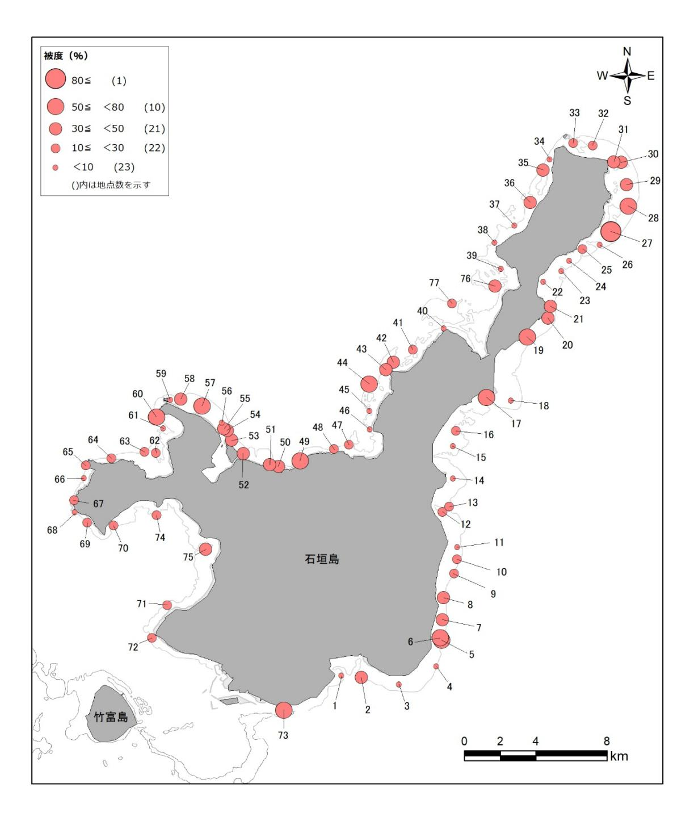

図4 石垣島周辺海域におけるサンゴ被度

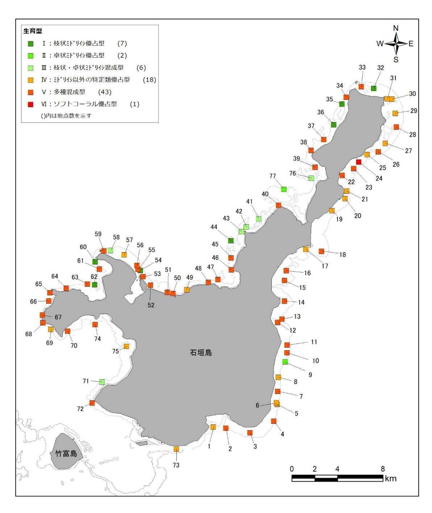

図5 石垣島周辺海域におけるサンゴの生育型

サンゴの生育型を見ると、今年度はミドリイシ類優占型(生育型ⅠⅡⅢ)の地点は、石垣 空港前の 1 地点(地点 9)、平野集落前から崎枝湾にかけての 9 地点(地点 32、35、36、 41、42、43、44、54、58、60、62、76、77)、名蔵湾の 1 地点(地点 71)の合計 15 地点 であった(昨年度比 5 地点増加、全体の 19%)。

ミドリイシ類優占型以外は、特定種優占型(生育型Ⅳ)が 18 地点(昨年度比 3 地点増加、 全体の 23%)、多種混生型(生育型Ⅴ)が 43 地点(昨年度比 7 地点減少、全体の 56%)、 ソフトコーラル型(生育型Ⅵ)が 2 地点(昨年度比 1 地点減少、全体の 1%)であった。

次に昨年度からのサンゴ被度の増減による評価区分毎の地点数を表 3 に、各地点におけ る昨年度からのサンゴ被度の増減を図 6 に示す。

サンゴ被度の変化(増減) 地点数(昨年度) 「大きく増加」:30 ポイント以上(30≦) 1( 0) 「増加」:10 ポイント以上 30 ポイント未満(10≦ <30) 24(14) 「ほぼ変化なし」:-10 ポイントより大きく 10 ポイント未満(±10) 44(58) 「減少」:-30 ポイントより大きく-10 ポイント以下(-30< ≦-10) 8( 4) 「大きく減少」:-30 ポイント以下(≦-30) 0( 1)

表3 昨年度からのサンゴ被度の変化(増減)(全 77 地点中)

※( )内の数字は昨年度の値を示す

昨年度からサンゴ被度が「大きく増加」(30 ポイント以上)した地点は昨年度から 1 地点 増加して 1 地点であった。「増加」(10 ポイント以上 30 ポイント未満)した地点は昨年度か ら 10 地点増加して 24 地点であった。「減少」(10 ポイント以上 30 ポイント未満)した地 点は昨年度より 4 地点増加して 8 地点であり、「大きく減少」(30 ポイント以上)した地点 が昨年度よりも 1 地点減少して 0 地点であった。「ほぼ変化なし」(10 ポイント未満の増減) の地点は、昨年度から 14 地点減少して 44 地点であった。

今年度サンゴ被度が増加した地点が 25 地点であるのに対し、減少または大きく減少した 地点は 8 地点あったことから、本調査地域全域において、サンゴ礁景観の回復の兆しが表 れていると考えられる。

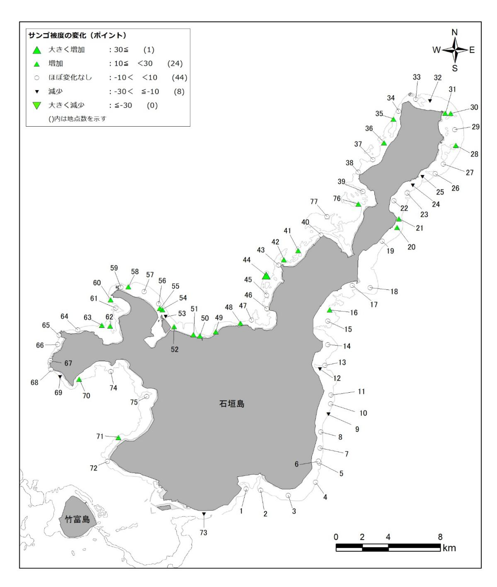

図6 石垣島周辺海域における昨年度からのサンゴ被度の変化

平均サンゴ被度の推移を見ると(図7)、調査を開始した 1998 年の白化前が最も高く、 それ以降は増減を繰り返しながら推移している。ある程度まで回復が進んだころに大規模 なかく乱が発生して、被度が低下するというサイクルを繰り返している。

主な被度減少期のかく乱要因は、2007 年の白化現象、2010~2013 年のオニヒトデの大 発生、2016 年の白化現象、2022 年の白化現象である。

本年度は石西礁湖などで大規模な白化現象が見られたが、石垣島周辺では全体的に見て 大きな影響はなかった。

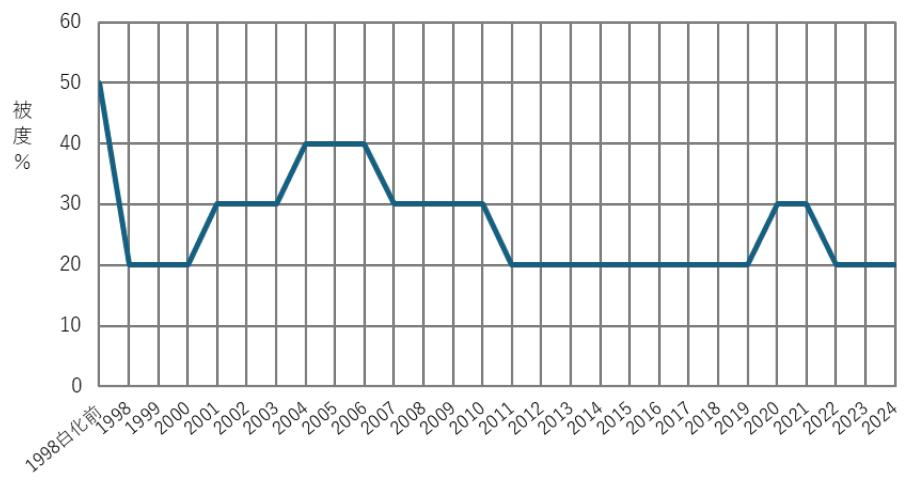

図7 平均サンゴ被度の推移(石垣島周辺海域)

生育型別地点数の推移を見ると(表 4、図 8)、ミドリイシ類優占型の地点数は、サンゴ類 の平均被度の推移と似た増減傾向を示しており、1999 年以降 2006 年まで単調に増加し続 け、2007 年以降はおおむね減少傾向となり、2014 年から 2021 年は少しずつ増加、2022 年 は大きく減少していた。今年度は、昨年比 1 地点増の 10 地点である。

特定種優占型(生息型Ⅳ)は 15 地点で、昨年度より 1 地点減少した。多種混成型(生育 型Ⅴ)は、昨年度と同様の 50 地点で、ソフトコーラル優占型(生育型Ⅵ)も 2 地点で、昨 年度と同様であった。

表4 サンゴの生育型別地点数の推移

|                                                  | 1998白化前                 | 1998                    | 1999                         | 2000                         | 2001                    | 2002                         | 2003                    | 2004                     | 2005                          | 2006                     | 2007                           | 2008                         | 2009                    | 2010                         |
|--------------------------------------------------|-------------------------|-------------------------|------------------------------|------------------------------|-------------------------|------------------------------|-------------------------|--------------------------|-------------------------------|--------------------------|--------------------------------|------------------------------|-------------------------|------------------------------|
| I: 枝状計"川沙類優占型                                    | 23                      | 6                       | 5                            | 7                            | 7                       | 6                            | 8                       | 7                        | 6                             | 8                        | 8                              | 13                           | 15                      | 14                           |
| Ⅱ:卓状讣゙リイシ類優占型                                    | 10                      | 5                       | 4                            | 6                            |                         | 12                           | 16                      | 18                       |                               | 19                       | 16                             | 9                            | 11                      | 9                            |
| Ⅲ:枝状・卓状ミドリイシ類混成型                                 | 13                      | 6                       | 2                            | 4                            | 2                       |                              | 6                       | 6                        | 7                             | 8                        | 4                              | 6                            | 6                       | 6                            |
| IV:特定類優占型                                        | 10                      | 12                      | 17                           | 19                           | 19                      | 19                           | 18                      | 16                       | 16                            | 14                       | 12                             | 14                           | 14                      |                              |
| V : 多種混成型                                        | 14                      | 40                      | 42                           | 36                           | 34                      | 31                           | 25                      |                          | 26                            | 24                       | 32                             | 32                           | 28                      | 30                           |
| VI: ソフトコーラル優占型                                   | 2                       | 3                       | 2                            |                              |                         |                              |                         |                          |                               |                          |                                |                              |                         |                              |
| ⅠⅢ四合計                                            | 46                      | 17                      | 11                           | 17                           | 19                      | 22                           | 30                      | 31                       | 31                            | 35                       | 28                             | 28                           | 32                      | 29                           |
| 合計地点数                                            | 72                      | 72                      | 72                           | 75                           | 75                      | 75                           | 75                      | 75                       | 75                            | 75                       | 75                             | 77                           | 77                      | 77                           |
|                                                  |                         |                         |                              |                              |                         |                              |                         |                          |                               |                          |                                |                              |                         |                              |
|                                                  | 2011                    | 2012                    | 2013                         | 2014                         | 2015                    | 2016                         | 2017                    | 2018                     | 2019                          | 2020                     | 2021                           | 2022                         | 2023                    | 2024                         |
| I:枝状补*リ心類優占型                                     |                         | 2012 1               | 2013 1                    | 2014 2                    | 2015 1               | 2016 1                    | 2017 1               | 2018 0                | 2019 0                     | 2020 1                | 2021 1                      | 2022 2                    | 2023 5               | 2024 7                    |
| I:枝状計"リイシ類優占型 II:卓状計"リイシ類優占型                  |                         | 1                       | 1                            | 2                            | 1                       | 1                            | 1 8                  | 0 10                  | 0 13                       | 1 16                  | 1                              | 2                            | 2023 5 1          | 2024 7 2               |
| I:枝状ミト゚リイン類優占型  I:卓状ミドリイン類優占型  II:枝状・卓状ミドリイン類優広型 | 6 5 3             | 1 3                  | 2013 1 2 1          | 2                            | 1                       | 1                            | 1 8 0             | 0 10 2             | 0 13                       | 1 16                  | 1 13                        | 2 5 2                  | 5 1 4             | 2024 7 2 6          |
| IV:特定類優占型                                        | 6 5 3             | 1 3                  | 1 2 1                  | 2                            | 1 4 1             | 1 9 0                  | 1 8 0             | 0 10 2             | 0 13 3                  | 1 16 6             | 1 13 10                  | 2 5 2 16            | 5 1 4 15       | 7 2 6 18            |
| IV : 特定類優占型 V : 多種混成型                         | 6 5 3 17 43 | 1 3 1 17 52 | 1 2 1 18            | 2 3 1                  | 1 4 1 16 51 | 1 9 0 16 48      | 1 8 0 15       | 0 10 2             | 0 13 3                  | 1 16 6 15       | 1 13 10                  | 2 5 2 16 50      | 5 1 4 15 50 | 7 2 6 18 43      |
| IV:特定類優占型 V:多種混成型                             | 6 5 3 17       | 1 3 1 17 52 | 1 2 1 18            | 2 3 1 16 52      | 1 4 1 16 51 | 1 9 0 16 48      | 1 8 0 15 50 | 0 10 2 16       | 0 13 3 15 44      | 1 16 6 15 36 | 1 13 10 15 35      | 2 5 2 16 50      | 5 1 4 15 50 | 7 2 6 18 43      |
| IV : 特定類優占型 V : 多種混成型                         | 6 5 3 17 43 | 1 3 1 17 52 | 1 2 1 18 52 3 | 2 3 1 16 52 3 | 1 4 1 16 51 | 1 9 0 16 48 3 | 1 8 0 15 50 | 0 10 2 16 46 | 0 13 3 15 44 2 | 1 16 6 15 36 | 1 13 10 15 35 3 | 2 5 2 16 50 2 | 5 1 4 15 50 | 7 2 6 18 43 1 |

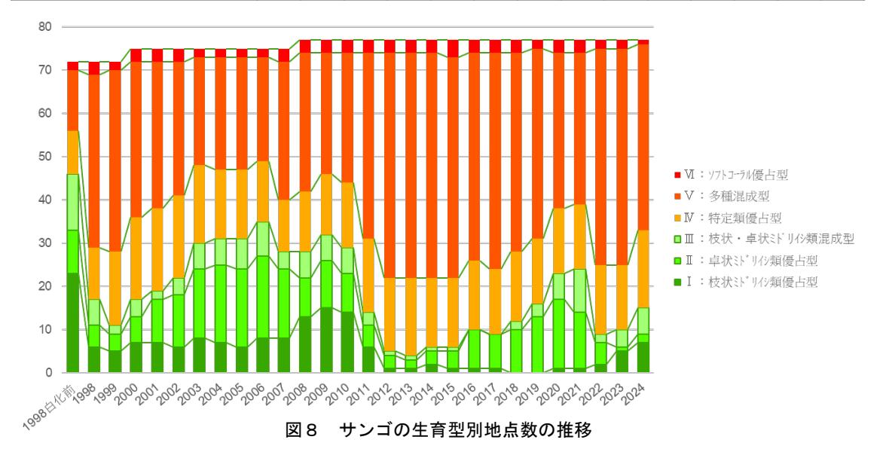

## 2)卓状ミドリイシ類の最大長径(平均値)

卓状ミドリイシ類の最大長径別の地点数の推移を表 5 に、各調査地点における卓状ミド リイシ類の最大長径を図 9 に示す。

今年度の調査では、卓状ミドリイシ類の最大長径が「25 cm 未満」の地点は昨年度より 9 地点増加して 23 地点、「25 cm 以上 100 cm 未満」は 5 地点減少して 22 地点で、

「100 cm 以上 200 cm 未満」と「200 cm 以上」はそれぞれ 0 地点であった(昨年度と同 様)。

昨年度から最大長径が増加した地点は 19 地点であった。一方、最大長径が減少したの は 19 地点であり、30 cm 以上増加した地点は、地点 13 の 1 地点、30 cm 以上減少した地 点は、地点 30 と地点 67 の 2 地点であった。また、卓状ミドリイシ類が確認できなかった 地点は昨年度よりも 4 地点減少して 32 地点となった。

表5 卓状ミドリイシ類の最大長径(平均値)別の地点数の推移

| 調査年度最大長径                 | 2006 | 2007 | 2008 | 2009 | 2010 | 2011 | 2012 | 2013 | 2014 | 2015 | 2016 | 2017 | 2018 | 2019 | 2020 | 2021 | 2022 | 2023 | 2024 |
|--------------------------|------|------|------|------|------|------|------|------|------|------|------|------|------|------|------|------|------|------|------|
| 200cm以上                  | 0    | 0    | 0    | 0    | 0    | 0    | 0    | 0    | 0    | 0    | 0    | 0    | 0    | 0    | 0    | 0    | 0    | 0    | 0    |
| 100cm以上 200cm未満          | 6    | 3    | 5    | 9    | 9    | 4    | 5    | 3    | 2    | 2    | 1    | 0    | 0    | 0    | 0    | 0    | 0    | 0    | 0    |
| 25cm以上 100cm未満           | 45   | 35   | 30   | 24   | 23   | 12   | 9    | 13   | 9    | 10   | 11   | 5    | 27   | 26   | 43   | 46   | 29   | 29   | 22   |
| 25cm未満                   | 13   | 2    | 2    | 8    | 15   | 5    | 7    | 10   | 13   | 11   | 13   | 19   | 14   | 23   | 7    | 12   | 5    | 5    | 23   |
| 卓状ミドリイシ群体が 確認できなかった地点 | 11   | 35   | 40   | 36   | 30   | 56   | 56   | 51   | 53   | 54   | 52   | 53   | 36   | 28   | 27   | 19   | 43   | 43   | 32   |
| 合計地点数                    | 75   | 75   | 77   | 77   | 77   | 77   | 77   | 77   | 77   | 77   | 77   | 77   | 77   | 77   | 77   | 77   | 77   | 77   | 77   |

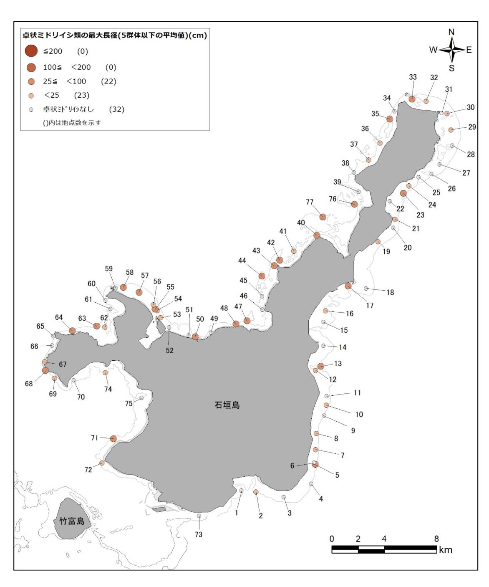

図9 石垣島周辺海域における卓状ミドリイシ類の最大長径(5 群体以下の平均値)

## 3)ミドリイシ類の新規加入量(群体密度)

今年度の各調査地点におけるミドリイシ類の新規加入量を表 6 と図 10 に示す。

新規加入が 20 群体/m2以上の地点は昨年度と同様に 0 地点、10 群体/m2以上 20 群体/m2 未満の地点は昨年度と同様 1 地点で、5 群体/m2以上 10 群体/m2未満の地点は 12 地点(昨 年度から 8 地点増加)、1 群体/m2以上 5 群体/m2未満の地点は 35 地点(昨年度から 6 地点 減少)であった。また、1 群体/m2未満の地点は 22 地点(昨年度から 1 地点増加)であり、 加入がない地点は 7 地点(昨年度から 3 地点減少)であった。

表6 ミドリイシ類の加入密度別地点数(全 77 地点中)

| ミドリイシ類加入密度(群体/㎡) | 地点数(昨年度) |
|------------------|----------|
| 20≦              | 0( 0)    |
| 10≦ <20       | 1( 1)    |
| 5≦ <10        | 12( 4)   |
| 1≦ <5         | 35(41)   |
| 0< <1         | 22(21)   |
| 0                | 7(10)    |

※( )内の数字は昨年度の値を示す

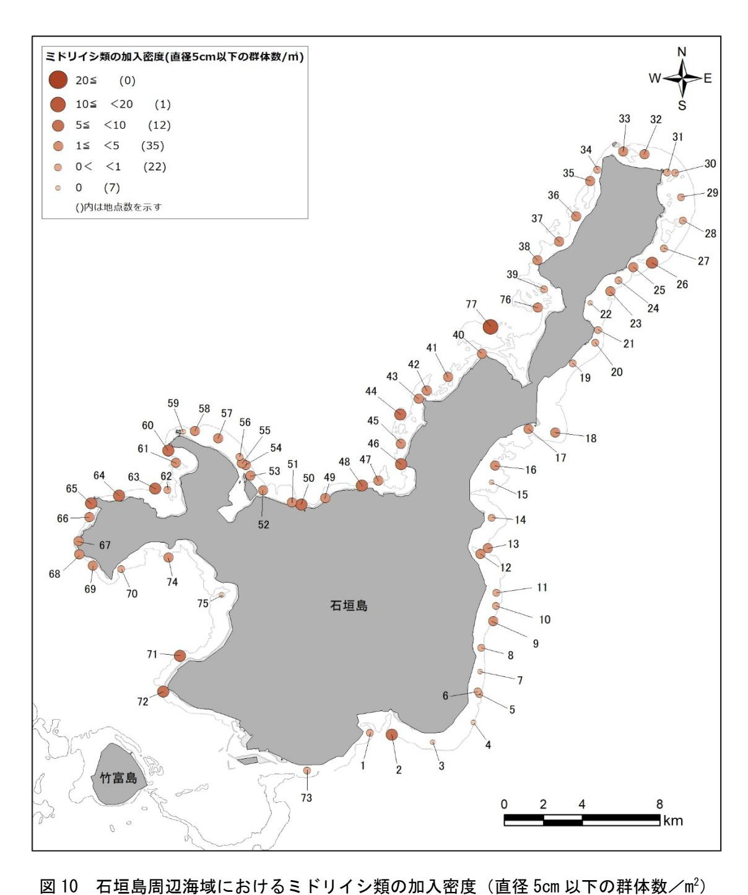

図 10 石垣島周辺海域におけるミドリイシ類の加入密度(直径 5cm 以下の群体数/m2

## (2)サンゴのかく乱要因の状況

## 1)オニヒトデ

1998 年度から 2024 年度までのオニヒトデの総観察個体数の推移を図 11 に、今年度のオ ニヒトデの 15 分換算観察個体数を図 12 に、同優占サイズを図 13 に示す。

サンゴ群集の最大の脅威であるオニヒトデは、八重山地方においては 1980 年代に大量発 生があった後、しばらくは少ない状態が続いていた。2001 年頃から石西礁湖や名蔵湾など でやや高い密度の集団が確認されはじめた後は、徐々に増加、拡散する傾向となり、2010 年度、2011 年度にピークを迎えたのち、2012 年度からは減少傾向にあった。

今年度の調査では、オニヒトデが確認されたのは 2 地点(地点 56 及び地点 69)であっ た。

オニヒトデの調査員一名あたりの総確認個体数の推移を見ると、調査を開始した 1998 年 度から 2006 年度までは、0~1.5 個体の範囲で推移していたが、2007 年度は 3.5 個体、2008 年は 14.5 個体度、2009 年度は 29 個体、2010 年度は 279 個体、2011 年度は 424 個体と急 激に増加したのち、2012 年度は 88.5 個体、2013 年度には 1.5 個体と急激に減少した。そ れ以降は 0~2.5 個体と少ない水準にとどまっており、今年度も 1.0 個体と、今のところ通 常分布の範囲である。

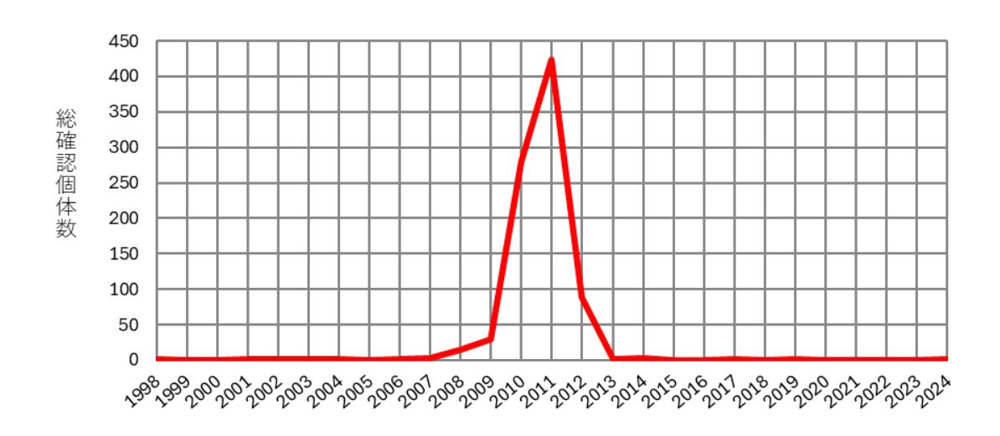

図 11 オニヒトデの総観察個体数の推移

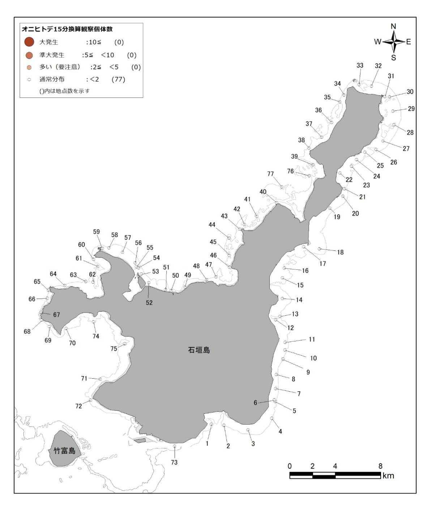

図 12 石垣島周辺海域におけるオニヒトデ 15 分換算観察個体数

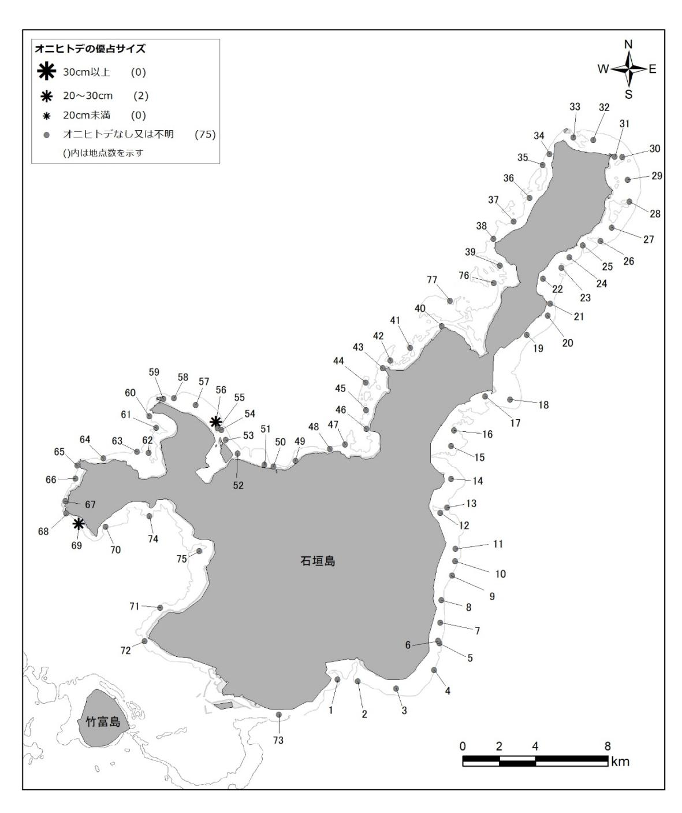

図 13 石垣島周辺海域におけるオニヒトデの優占サイズ

## 2)サンゴ食巻貝

サンゴ食巻貝の発生状況階級別の調査地点数を表 7 に、地点毎の分布状況を図 14 に示 す。

今年度の調査では、ランクⅢ以上の地点はなく、ランクⅡが 10 地点(昨年度から 6 地点 減少)であった。以上の結果から石垣島周辺海域では現在のところ、サンゴ食巻貝はサンゴ 群集への大きなかく乱要因にはなっていない。

表7 サンゴ食巻貝の発生状況階級別の調査地点数(全 77 地点中)

| 階級 | サンゴ食巻貝の発生状況                                          | 地点数(昨年度) |
|----|------------------------------------------------------|----------|
| Ⅰ  | 食痕が目立たない                                             | 67(61)   |
| Ⅱ  | 小さな食痕や食害部のある群体が散見                                    | 10(16)   |
| Ⅲ  | 食痕は大きく、食害部のある群体が目立つが、 数百個体以上からなる密集した貝集団は見られ ない | 0( 0)    |
| Ⅳ  | 死亡群体が目立ち、密集した貝集団が散見され る                           | 0( 0)    |
|    | 白化によって判別ができず不明                                       | 0( 0)    |

※( )内の数字は昨年度の値を示す

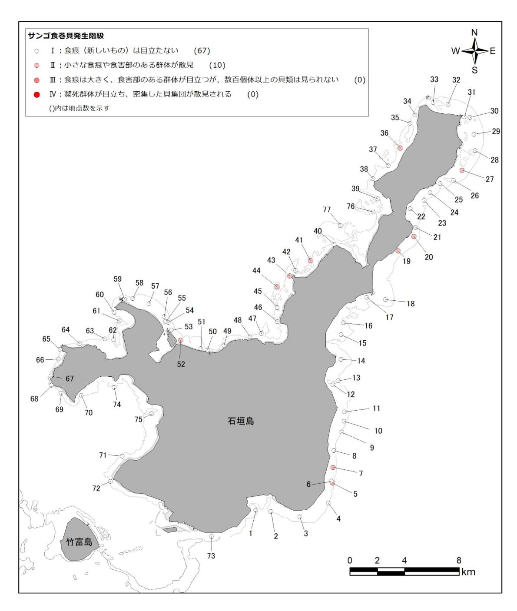

図 14 石垣島周辺海域におけるサンゴ食巻貝の分布状況

## 3)白化現象

表 8 に今年度の白化率毎の地点数を示す。また、図 15 に今年度の地点毎の白化率を示す。

今年度は 6 月から 7 月にかけて日射の強い暑い日が続いたため、石西礁湖をはじめ沖縄 県の各所で大規模なサンゴの白化現象が起こった。

本調査は 10 月中旬以降に実施したため、白化した状態のサンゴはほとんど観察されてい ないが、この白化現象に由来すると考えられる死サンゴが合計 25 地点で確認された。

比較的影響が大きかったのは、地点 5 と地点 68、地点 69 の 3 地点であり、死亡率が 10% 以上であった。

しかし、いずれの地点でもサンゴ被度が大幅に減少するような白化現象は確認されてお らず、石垣島周辺海域においては白化現象によるサンゴの減少は限定的であった。

夏季の白化現象とは別に、2025 年 1 月に調査を実施した地点のうち 8 地点で、干出に由 来する白化現象が確認されている。

これは、サンゴが垂直方向への成長したため干出部が死亡したもので、干出と降雨や波浪 などが重なったときにしばしば見られる現象である。

表8 2023 年度調査時の白化率毎の地点数(全 77 地点中)

| 白化率            | 地点数(昨年度) |
|----------------|----------|
| 75%≦           | 0( 0)    |
| 50%≦ <75%未満 | 2( 0)    |
| 25%≦ <50%未満 | 4( 0)    |
| 0%< <25%    | 27( 0)   |
| 0%             | 44( 0)   |

※( )内の数字は昨年度の値を示す

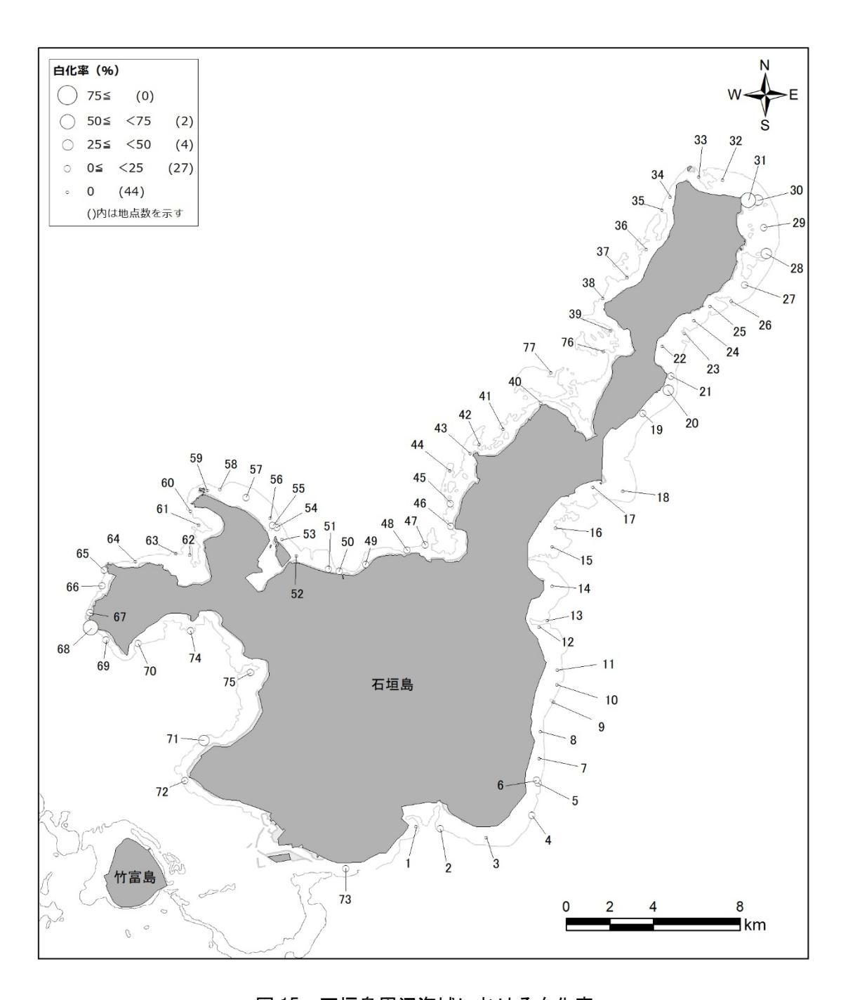

図 15 石垣島周辺海域における白化率

## 4)その他の自然のかく乱

## ① 台風

今年度石垣島地方に接近した台風は、7 月 24 日頃の台風 3 号と 10 月 31 日頃の台風 21 号の 2 個であった。

台風 3 号は八重山の南岸を北西向きに進行し、石垣島では南寄りの強い風が吹き 35.5 m/s の最大瞬間風速を記録した。

台風 21 号は台湾の東岸を北上し、石垣島では南寄りの強風が吹き 30.1 m/s の最大瞬間 風速を記録した。

今年度の調査で台風の影響が確認された地点はなかった。

なお、気象庁が定義する「(石垣島への)台風の接近」とは、台風の中心が石垣島地方気 象台(北緯 24.337°、東経 124.163°)から 300km 以内に入った場合を指す。

## ② サンゴの病気

表 9 にサンゴの病気毎の確認地点数、図 16 に病気の発生状況を示す。

病気の種類 確認された地点数 腫瘍 2(0) 黒帯病 0(0) ホワイトシンドローム 0(0)

表9 サンゴの病気の種類別確認地点数(昨年度地点数)

※( )内の数字は昨年度の値を示す

今年度の調査では、地点 30 と地点 60 の 2 地点で軽微な疾病が確認された。疾病の内訳 は両地点とも葉状コモンサンゴ類の腫瘍であった。

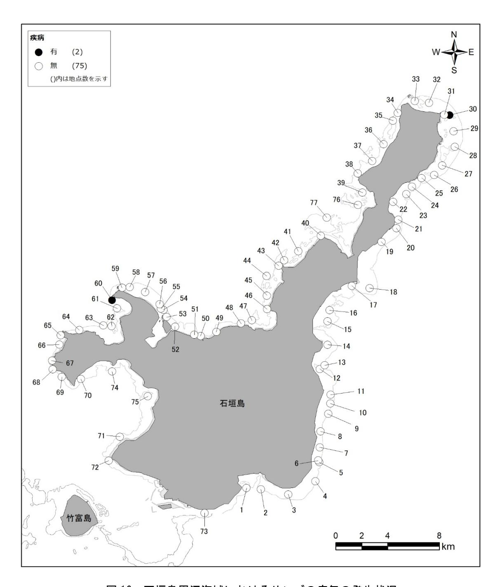

図 16 石垣島周辺海域におけるサンゴの病気の発生状況

## ③テルピオス

テルピオス類(黒色の海綿類の一種)はサンゴ群体に付着成長し、群体全体を覆ってしま うことがある。南西諸島のサンゴ礁域では散見されるのが普通であるが、希に大量に発生し、 広範囲にサンゴを死滅させてしまうことがある。

今年度の調査では、屋良部~大崎(地点 69)の 1 地点(昨年度比変化なし)にて確認された。

## ④シルトの堆積状況(SPSS)

各調査地点における SPSS の階級別地点数の推移を表 10 に、各地点の SPSS 階級を図 17 に示す。

SPSS 測定値の平均値は 13.1 kg/m3であり、昨年度(10.7 kg/m3)より増加した。また、 SPSS 階級が 5b 以上であったのは地点 5、地点 16、地点 36、地点 37、地点 62、地点 75 の 6 地点であった(昨年度より 1 地点増加)。

表 10 石垣島周辺海域における SPSS の階級別地点数の推移

| 調査時期     | 2004 | 2005 | 2006 | 2007 | 2008 | 2009 | 2010 | 2011 | 2012 | 2013 | 2014 | 2015 | 2016 | 2017 | 2018 | 2019 | 2020 | 2021 | 2022 | 2023 | 2024 |
|----------|------|------|------|------|------|------|------|------|------|------|------|------|------|------|------|------|------|------|------|------|------|
| 1        | 0    | 0    | 0    | 0    | 0    | 0    | 0    | 0    | 0    | 0    | 0    | 0    | 0    | 0    | 0    | 0    | 0    | 0    | 0    | 0    | 0    |
| 2        | 2    | 1    | 0    | 0    | 0    | 0    | 0    | 1    | 0    | 0    | 0    | 1    | 0    | 2    | 1    | 3    | 2    | 1    | 2    | 3    | 1    |
| 3        | 25   | 18   | 9    | 18   | 11   | 5    | 4    | 10   | 16   | 16   | 15   | 20   | 19   | 22   | 13   | 32   | 6    | 15   | 23   | 21   | 20   |
| 4        | 13   | 18   | 18   | 24   | 11   | 11   | 24   | 15   | 22   | 10   | 20   | 20   | 21   | 19   | 9    | 8    | 15   | 12   | 10   | 14   | 15   |
| 5a       | 23   | 24   | 34   | 22   | 31   | 37   | 24   | 29   | 23   | 29   | 28   | 16   | 20   | 22   | 27   | 20   | 21   | 18   | 21   | 15   | 25   |
| 5b       | 3    | 4    | 5    | 4    | 7    | 12   | 8    | 7    | 3    | 8    | 4    | 6    | 4    | 1    | 3    | 3    | 6    | 9    | 3    | 4    | 3    |
| 6        | 2    | 3    | 3    | 2    | 6    | 4    | 6    | 5    | 3    | 9    | 4    | 7    | 3    | 1    | 7    | 1    | 7    | 3    | 3    | 1    | 3    |
| 7        | 0    | 1    | 0    | 0    | 1    | 1    | 1    | 0    | 1    | 1    | 0    | 0    | 1    | 0    | 0    | 0    | 0    | 1    | 0    | 0    | 0    |
| 8        | 0    | 0    | 0    | 0    | 1    | 0    | 0    | 1    | 0    | 0    | 0    | 0    | 0    | 0    | 0    | 1    | 0    | 0    | 0    | 0    | 0    |
| 測定不可     | 7    | 6    | 6    | 5    | 9    | 7    | 10   | 9    | 8    | 4    | 6    | 7    | 9    | 10   | 17   | 9    | 20   | 18   | 15   | 19   | 10   |
| 5b以上の地点数 | 5    | 8    | 8    | 6    | 15   | 17   | 15   | 13   | 7    | 18   | 8    | 13   | 8    | 2    | 10   | 5    | 13   | 13   | 6    | 5    | 6    |
| 合計地点数    | 75   | 75   | 75   | 75   | 77   | 77   | 77   | 77   | 76   | 77   | 77   | 77   | 77   | 77   | 77   | 77   | 77   | 77   | 77   | 77   | 77   |

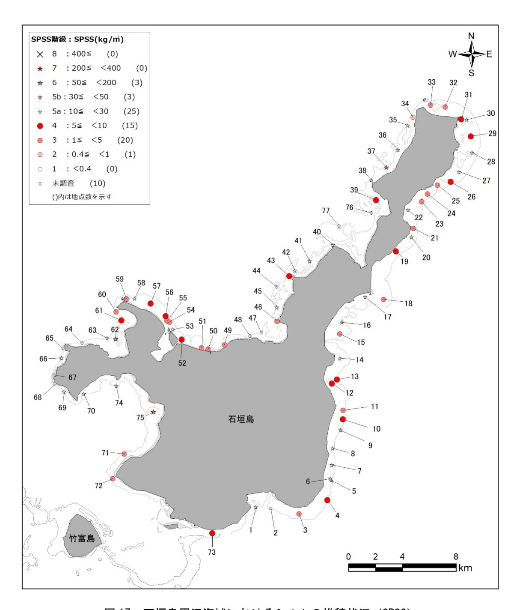

図 17 石垣島周辺海域におけるシルトの堆積状況(SPSS)

## (3)大型定着性魚類

ブダイ類はサンゴ群体を骨格ごとかじりとり補食する。また、調査項目に含まれていない が、ハナナガスズメダイやクロソラスズメダイなどのいわゆる「農魚」はサンゴをつつき殺 してその骨格上に生育させた藻類を捕食する。

今年度の調査では、食痕等が特に多いとされた地点は無かった。

## 2.石西礁湖及び西表島周辺海域

## (1)サンゴの生育状況

## 1)サンゴ被度及び生育型

サンゴ被度によるサンゴ礁の状態の評価別地点数を表 11 に、各調査地点におけるサンゴ 被度を図 18 及び図 19 に、生育型を図 20 及び図 21 に示す。

石西礁湖から西表島及び周辺離島にかけて設定された全 124 調査地点における平均サン ゴ被度は 20.2%であり、昨年度の 23.5%よりわずかに減少した。しかし 10%刻みではどち らも 20%となり、被度によるサンゴ礁の状態は、昨年度と同様に「不良」と評価される。

サンゴ被度の最高値は昨年度と変わらず 70%で、昨年度同様 1 地点(地点 31)で見られ たが、昨年度とは別地点であった。

サンゴ礁の状態が「優良」と評価される地点は昨年度と同じく 0 地点であり、「良」と評 価される地点は昨年度より 2 地点減少して 11 地点であった。

サンゴ被度によるサンゴの状態の評価 地点数(昨年度) 石西礁湖周辺 地点数(昨年度) 西表島周辺 地点数(昨年度) 合計 優良:80%以上(80%≦) 0( 0) 0( 0) 0( 0) 良:50%以上 80%未満(50%≦ <80%) 8( 9) 3( 4) 11(13) やや不良:30%以上 50%未満(30%≦ <50%) 19(28) 6( 7) 25(35) 不良:10%以上 30%未満(10%≦ <30%) 30(34) 10(10) 40(44) 極めて不良:10%未満(<10%) 44(31) 4( 2) 48(33)

表 11 サンゴ被度によるサンゴ礁の評価別地点数(全 124(125)地点中)

※( )内の数字は昨年度の値を示す

一方、「やや不良」と評価される地点は昨年度より 10 地点減少して 25 地点、「不良」と 評価される地点は昨年度より 4 地点減少して 40 地点、「極めて不良」と評価される地点が 昨年度より 15 地点増加して 48 地点であった。評価が向上した地点は 8 地点であった一方 で、悪化した地点が 30 地点であり、このことから全体的には昨年度より被度がやや減少傾 向を示し、サンゴ礁景観は劣化基調にあると考えられる。

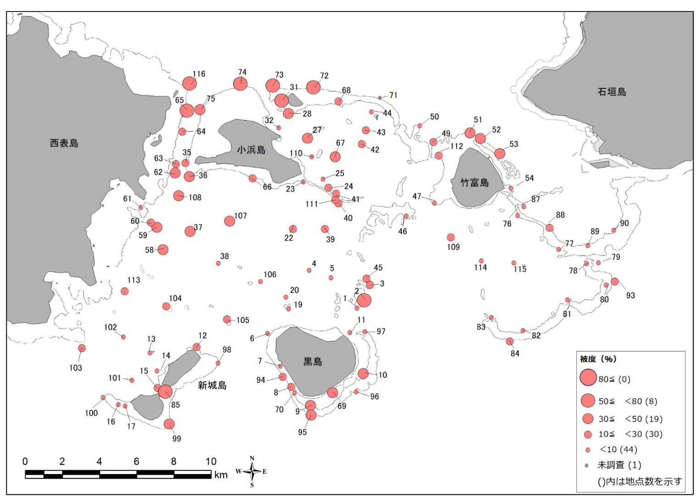

図 18 石西礁湖周辺海域におけるサンゴ被度

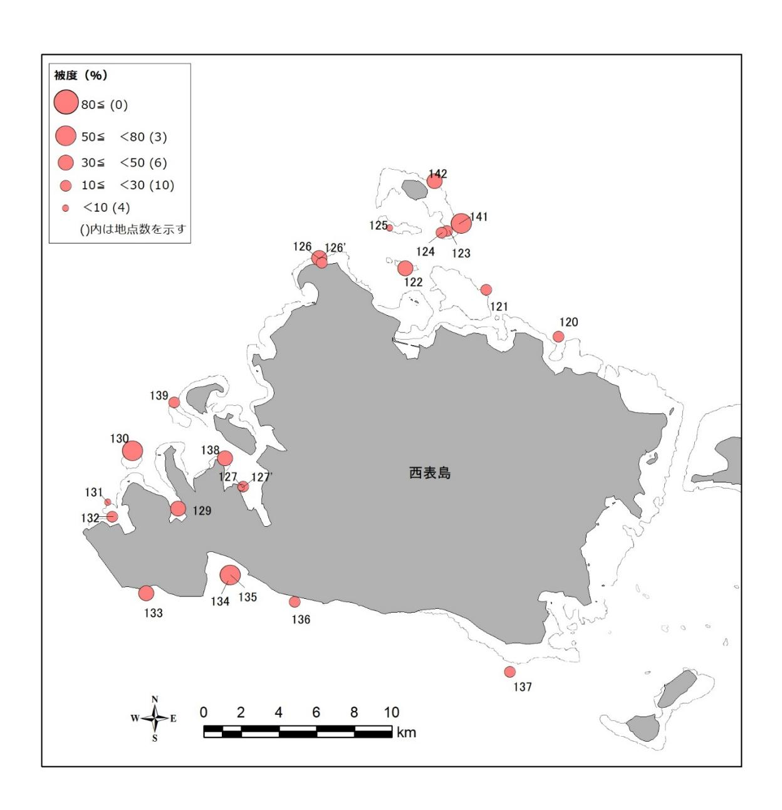

図 19 西表島周辺海域におけるサンゴ被度

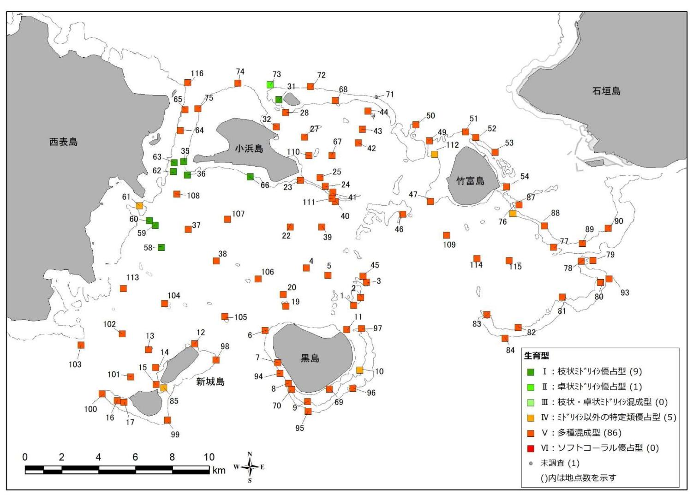

図 20 石西礁湖周辺海域におけるサンゴの生育型

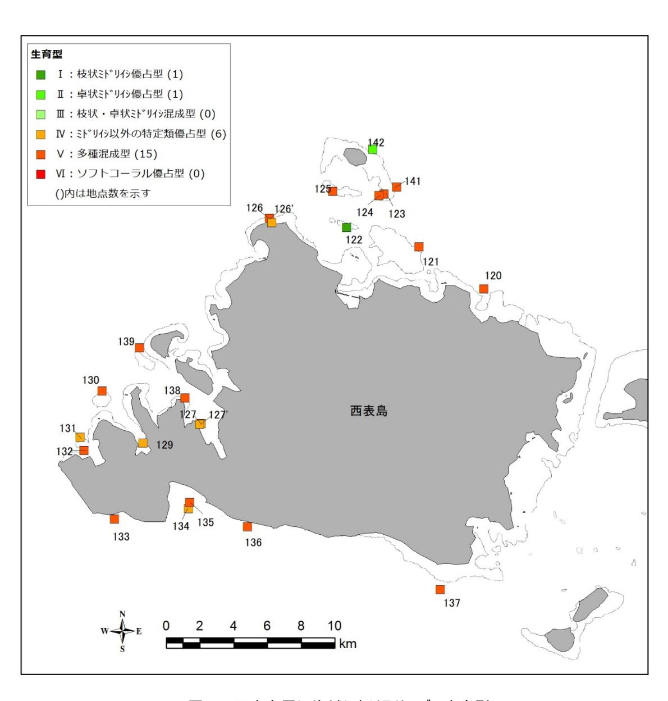

図 21 西表島周辺海域におけるサンゴの生育型

サンゴの生育型を見ると、今年度は、ミドリイシ類優占型(生育型ⅠⅡⅢ)の地点は、石 西礁湖北部に 6 地点(地点 31、35、36、62、63、73)、石西礁湖中央部に 4 地点(地点 58、 59、60、66)、西表島と周辺離島に 2 地点(地点 122、142)の合計 12 地点であった(昨年 度比 1 地点増加、全体の 10%)。

ミドリイシ類優占型以外は、特定種優占型(生育型Ⅳ)が 11 地点(昨年度比 5 地点減少、 全体の 9%)、多種混生型(生育型Ⅴ)が 101 地点(昨年度比 3 地点増加、全体の 81%)、 ソフトコーラル型(生育型Ⅵ)が 0 地点(昨年度と同じ)であった。

次に昨年度からのサンゴ被度の増減による評価区分毎の地点数を表 12、各地点における 昨年度からのサンゴ被度の増減を図 22 及び図 23 に示す。

表 12 昨年度からのサンゴ被度の変化(増減)(全 124(125)地点中)

| サンゴ被度の増減                                | 地点数(昨年度) 石西礁湖周辺 | 地点数(昨年度) 西表島周辺 | 地点数(昨年度) 合計 |
|-----------------------------------------|--------------------|-------------------|----------------|
| 「大きく増加」:30 ポイント以上(30≦)                  | 0( 0)              | 0( 0)             | 0( 0)          |
| 「増加」:10 ポイント以上 30 ポイント未満(10≦ <30)       | 13(27)             | 1( 5)             | 14(32)         |
| 「変化なし」:-10 ポイントより大きく 10 ポイント未満(±10)     | 57(66)             | 12(15)            | 69(81)         |
| 「減少」:-30 ポイントより大きく-10 ポイント以下(-30< ≦-10) | 29( 9)             | 9( 3)             | 38(12)         |
| 「大きく減少」:-30 ポイント以下(≦-30)                | 2( 0)              | 1( 0)             | 3( 0)          |

※( )内の数字は昨年度の値を示す

昨年度と同様にサンゴ被度が「大きく増加」(30 ポイント以上)した地点はなかった。「増 加」(10 ポイント以上 30 ポイント未満)した地点は昨年度から 18 地点減少して 14 地点で あった。「減少」(10 ポイント以上 30 ポイント未満)した地点は昨年度より 26 地点増加し て 38 地点であり、「大きく減少」(30 ポイント以上)した地点が昨年度よりも 3 地点増加し て 3 地点であった。「ほぼ変化なし」(10 ポイント未満の増減)の地点は、昨年度から 12 地 点増加して 69 地点であった。

今年度サンゴ被度が増加した地点が 14 地点であるのに対し、減少した地点は 41 地点あ ったことから、本調査地域全域において、サンゴ礁景観は劣化基調にあると考えられる

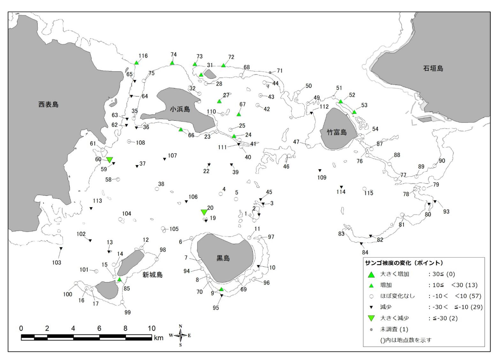

図 22 石西礁湖周辺海域における昨年度からのサンゴ被度の変化

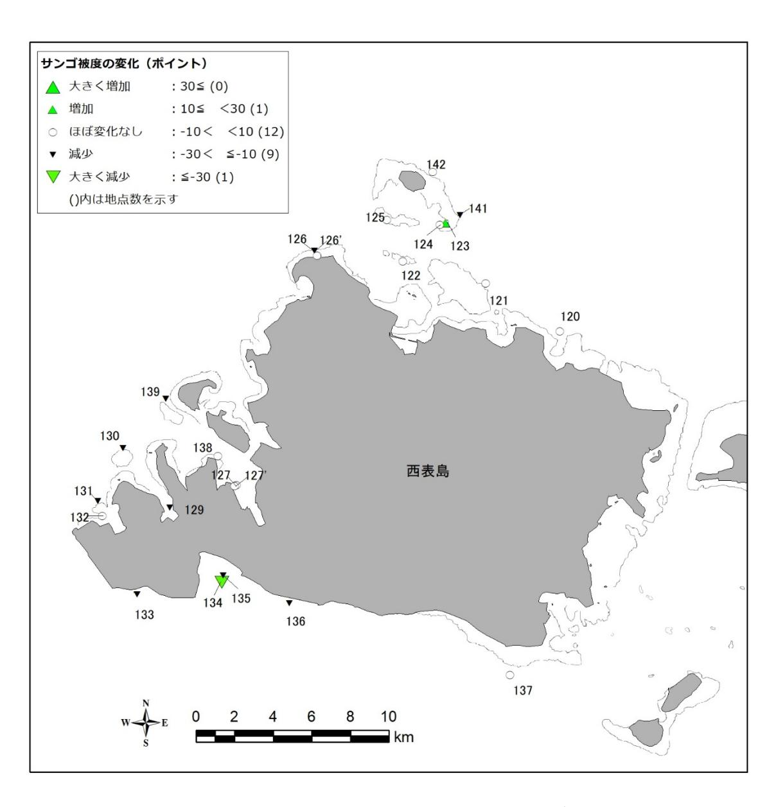

図 23 西表島周辺海域における昨年度からのサンゴ被度の変化

平均サンゴ被度の推移を見ると(図 24 及び図 25)、石西礁湖周辺海域および西表島周辺 海域の両地域とも増減を繰り返しながら推移しており、回復の傾向が見られても大規模な かく乱によって、再び被度が低下するというサイクルを繰り返している。

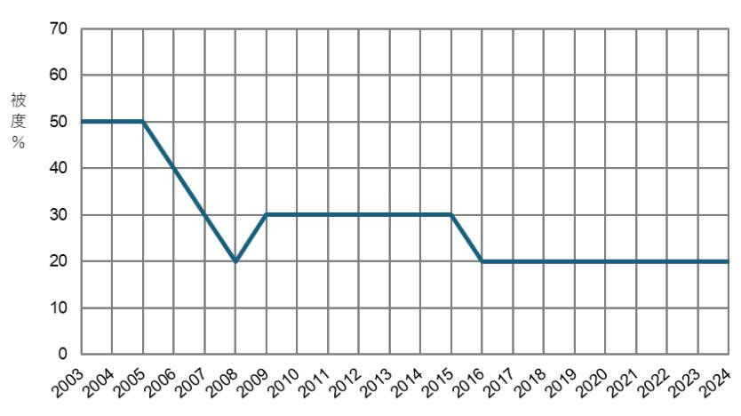

図 24 平均サンゴ被度の推移(石西礁湖周辺海域)

## 2)卓状ミドリイシ類の最大長径(平均値)

表 13 に卓状ミドリイシ類の最大長径別の地点数を、各調査地点における卓状ミドリイシ の最大長径を図 26 及び図 27 に示す。

今年度の調査では、卓状ミドリイシ類の最大長径が「25 cm 未満」の地点は昨年度より 14 地点増加し 48 地点、「25 cm 以上 100 cm 未満」は 19 地点増加して 46 地点、「100 cm 以 上 200 cm 未満」の地点数は 1 地点増加し 9 地点で、200 cm 以上の地点は 1 地点(地点 107)で昨年度から変化がなかった。

昨年度から最大長径が増加した地点は 45 地点(石西礁湖周辺 35 地点、西表島周辺 10 地 点)であった。一方、最大長径が減少したのは 64 地点(石西礁湖周辺 58 地点、西表島周 辺 6 地点)であり、30 cm 以上増加した地点はなく、30 cm 以上減少した地点は、石西礁湖 北部の 2 地点(地点 35、地点 62)、石西礁湖東部の 1 地点(地点 82)、石西礁湖中央部の 6 地点(地点 19、地点 20、地点 22、地点 37、地点 38、地点 106)、石西礁湖南部の 1 地点 (地点 69)及び西表島周辺の 1 地点(地点 136)の 11 地点であった。また、卓状ミドリイ シ群体が確認できなかった地点 3 地点増加して 17 地点であった。

表 13 卓状ミドリイシ類の最大長径(平均値)別の地点数

| 卓状ミドリイシ類の最大長径サイズ階級   | 地点数(昨年度) 石西礁湖周辺 | 地点数(昨年度) 西表島周辺 | 地点数(昨年度) 合計 |
|----------------------|--------------------|-------------------|----------------|
| 200cm 以上             | 1( 1)              | 0( 0)             | 1( 1)          |
| 100cm 以上 200cm 未満 | 6( 7)              | 3( 1)             | 9( 8)          |
| 25cm 以上 100cm 未満  | 39(54)             | 7(11)             | 46( 65)        |
| 25cm 未満              | 42(30)             | 6( 4)             | 48( 34)        |
| 卓状ミドリイシ群体が確認できなかった地点 | 13(10)             | 4( 4)             | 17( 14)        |
| 未調査                  | 1 ( 0)             | 3 ( 3)            | 4 ( 3)         |

※( )内の数字は昨年度の値を示す

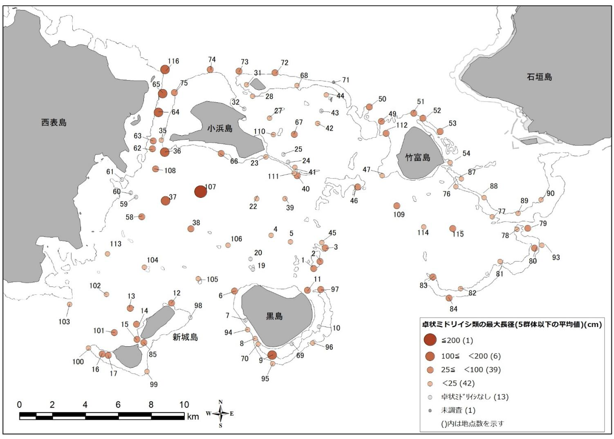

図 26 石西礁湖周辺海域における卓状ミドリイシ類の最大長径(5 群体以下の平均値)

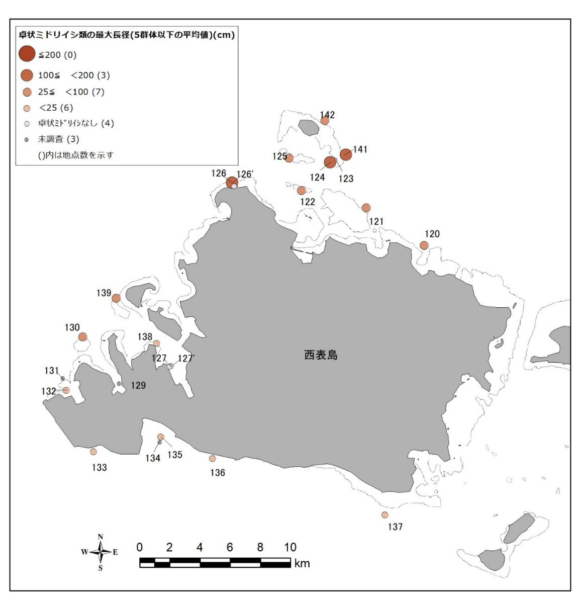

図 27 西表島周辺海域における卓状ミドリイシ類の最大長径(5 群体以下の平均値)

## 3)ミドリイシ類の新規加入量(群体密度)

今年度の各調査地点におけるミドリイシ類の新規加入量別の地点数を表 14 に、図 28 と 29 に各地点の新規加入量を示す(単一群体を調査対象としている地点 129、131、134 は新 規加入量を調査項目としていないため、表 14 及び図 28 中では未調査地点として扱った)。

新規加入が 20 群体/m2 以上の地点は 16 地点(昨年度 30 地点)であり昨年度より 14 地 点減少した。10 群体/m2以上 20 群体/m2未満の地点は 12 地点(昨年度から 10 地点減少)、 5 群体/m2以上 10 群体/m2未満の地点は 31 地点(昨年度から 9 地点減少)で、1 群体/m2 以 上 5 群体/m2 未満の地点は 52 地点(昨年度から 15 地点増加)であった。また、1 群体/m2 未満の地点は昨年度と同様 0 地点であり、加入がない地点は 10 地点(昨年度より 1 地点減 少)であった。

今年度は昨年度と比較して、加入量が多いカテゴリーである 20 群体/m2 以上の地点が減 少したのみならず、51 群体/m2 以上の加入量を計数した地点も 2 地点に減少した(昨年度 は 8 地点)。

なお、本調査では 15 分間遊泳中に観察された 1 m2の仮想枠内における 5 cm 以下の小型 ミドリイシ群体を計数した数値の中から、最大値をデータとして採用し、かつ 2 名の調査 員のデータのうち大きい値を分析対象としている。また、100 群体以上を数えた場合は打ち 切りを行い、加入量を 100 群体/ m2 として記録しているが、今年度は最も加入が多かった 地点でも 65 群体/ m2であった(石西礁湖北部の地点 74)。

表 14 ミドリイシ類の加入密度別地点数(全 125 地点中)

| ミドリイシ類加入密度(群体/㎡) | 地点数(昨年度) 石西礁湖周辺 | 地点数(昨年度) 西表島周辺 | 地点数(昨年度) 合計 |
|------------------|--------------------|-------------------|----------------|
| 20≦              | 13(26)             | 3( 4)             | 16(30)         |
| 10≦ <20       | 6(17)              | 6( 5)             | 12(22)         |
| 5≦ <10        | 28(19)             | 3( 3)             | 31(22)         |
| 1≦ <5         | 48(33)             | 4( 4)             | 52(37)         |
| 0< <1         | 0( 0)              | 0( 0)             | 0( 0)          |
| 0                | 6( 7)              | 4( 4)             | 10(11)         |
| 未調査              | 1( 0)              | 3( 3)             | 4( 3)          |

※( )内の数字は昨年度の値を示す

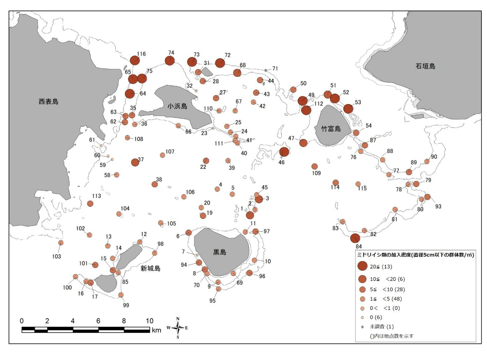

図 28 石西礁湖周辺海域におけるミドリイシ類の加入密度(直径 5cm 以下の群体数/m2 )

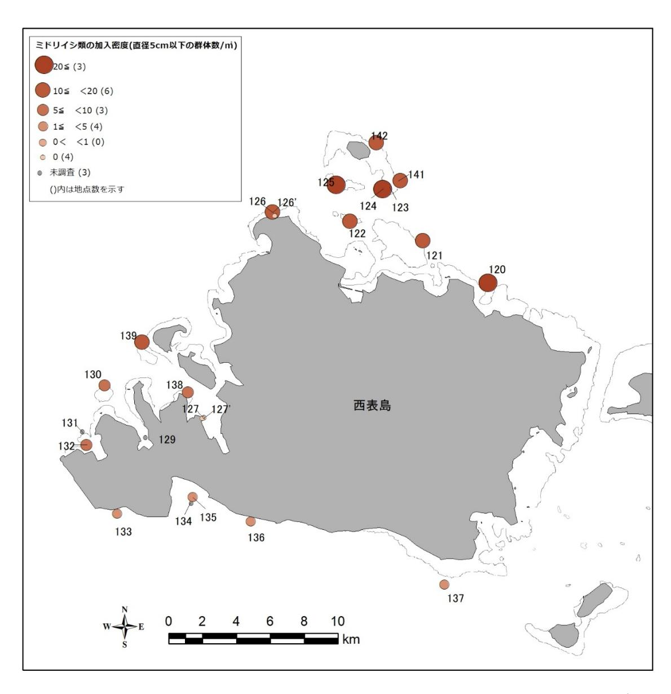

 図 29 西表島周辺海域におけるミドリイシ類の加入密度(直径 5cm 以下の群体数/m2 )

## (2)サンゴのかく乱要因の状況

## 1)オニヒトデ

オニヒトデの 15 分換算観察個体数別の調査地点数を表 15 に、各調査地点における観察 個体数を図 30 及び 31 に、各調査地点における優占サイズを図 32 及び 33 に示す。なお、 石西礁湖と西表島周辺においては、地点内のオニヒトデの個体数をより正確にとらえるた め 2 人で観察範囲を分けて計数している。そのためこれらのサイトでは 2 人の合計値を示 している。

| オニヒトデ発生状態               | 地点数(昨年度) 石西礁湖周辺 | 地点数(昨年度) 西表島周辺 | 地点数(昨年度) 合計 |
|-------------------------|--------------------|-------------------|----------------|
| 通常分布(0 個体)              | 100( 86)           | 22(22)            | 122(108)       |
| 通常分布(0< <2 個体)       | 1( 13)             | 0( 0)             | 1( 13)         |
| 多い(要注意)(2 個体≦ <5 個体) | 0( 3)              | 1( 1)             | 1( 4)          |
| 準大発生(5 個体≦ <10 個体)   | 0( 0)              | 0( 0)             | 0( 0)          |
| 大 発 生(10 個体≦)           | 0( 0)              | 0( 0)             | 0( 0)          |

表 15 オニヒトデの 15 分換算観察個体数別の調査地点数(124(125)地点)

※( )内の数字は昨年度の値を示す

オニヒトデは、124 調査地点中 2 地点で観察された(昨年度の 17 地点から減少)。総観 察数は 3 個体(昨年度 23 個体)であった。

15 分間観察個体数を指標として、オニヒトデを目撃しなかった地点が 122 地点(昨年度 は 108 地点)、2 個体未満が 1 地点(昨年度は 13 地点)であり、これら「通常分布」と見 なされる地点が合計 123 地点(昨年度は 121 地点)であった。「大発生」及び「準大発生」 状態とみなされる地点は 0 地点(昨年度と同じ)、2 個体以上 5 個体未満の「多い(要注意)」 地点は 1 地点(昨年度の 4 地点から 3 地点減少)であり、全体としてはオニヒトデの観察 地点数及び観察個体数共に減少した。

オニヒトデが観察された 2 地点のうち、20 ㎝未満のサイズの個体が観察されたのは、西 表島周辺の地点 137(2 個体)で、その地点では 20 ㎝以上 30 ㎝未満または 30 ㎝以上のサ イズの個体は観察されなかった。

2 年連続でオニヒトデを観察した調査地点は、存在しなかった。

なお、今年度発生した白化現象により平均白化率及び平均死亡率が共に高かったため、ほ ぼ全ての調査地点において、オニヒトデがサンゴを食べた後の食痕が灰白色から白色の状 態で視認できることを目印として周辺に隠れていると予想されるオニヒトデを探し出し発 見することが困難であり、今年度調査では調査時の見落としの可能性がある。

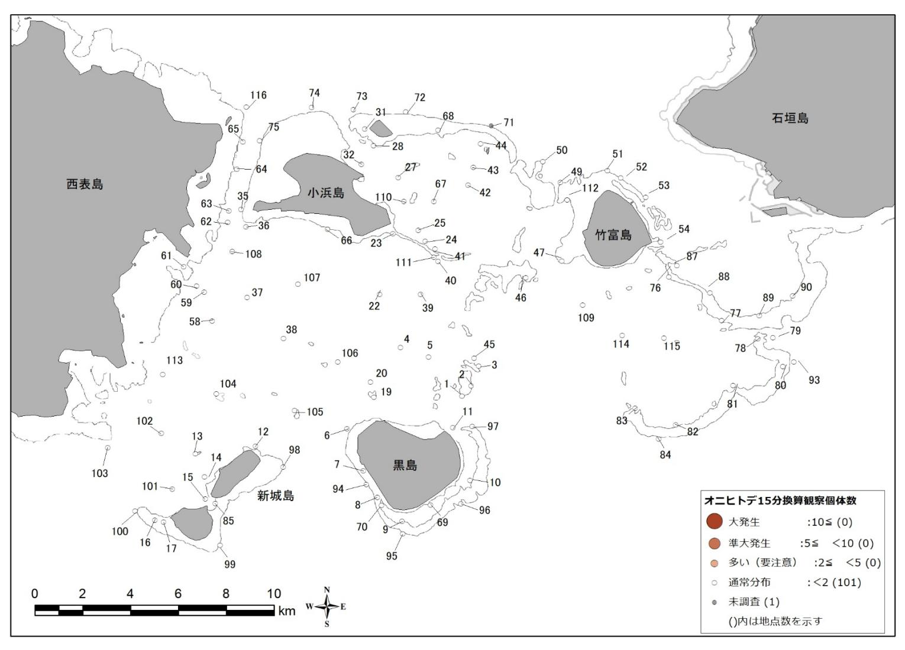

図 30 石西礁湖周辺海域におけるオニヒトデ 15 分換算観察個体数

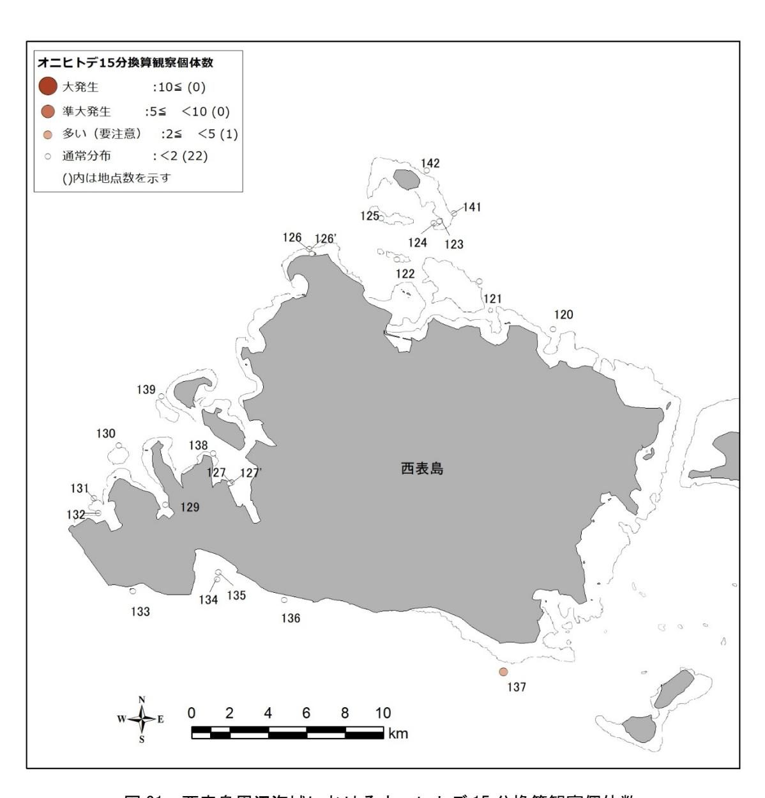

図 31 西表島周辺海域におけるオニヒトデ 15 分換算観察個体数

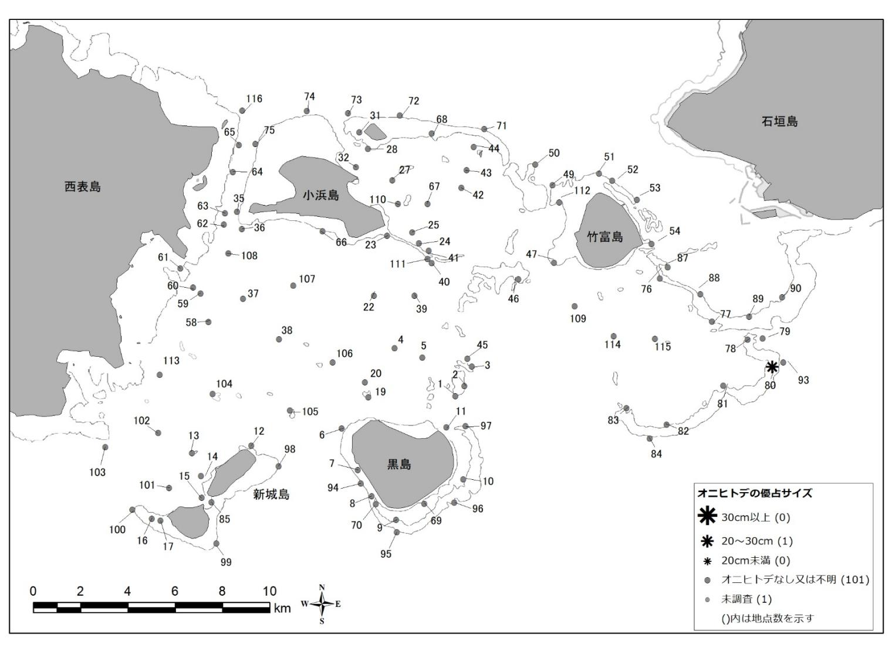

図 32 石西礁湖周辺海域におけるオニヒトデの優占サイズ

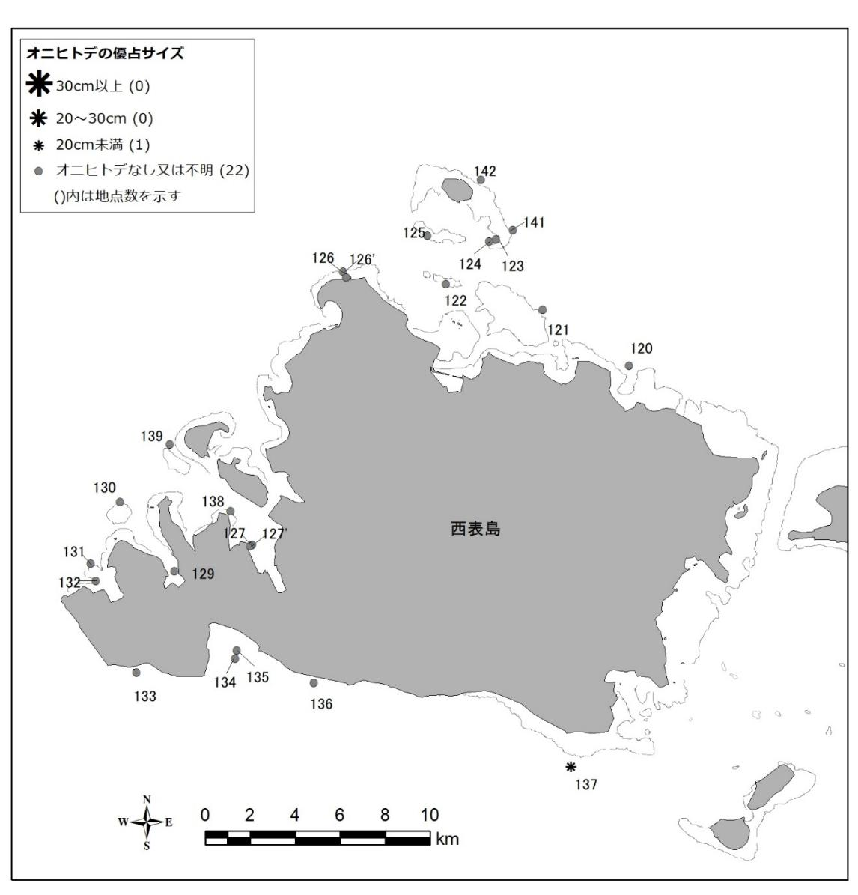

図 33 西表島周辺海域におけるオニヒトデの優占サイズ

## 2)サンゴ食巻貝

サンゴ食巻貝の発生状況の階級別調査地点数を表 16 に、各調査地点におけるサンゴ食巻 貝の分布状況を図 34 及び 35 に示す。

サンゴ食巻貝の食痕があまり大きくない階級Ⅰ及びⅡを示したのは 121 地点(昨年度か ら 1 地点減少)であり、ほとんどの地点でサンゴ食巻貝のかく乱はまれであった。食痕が目 立つ階級Ⅲの地点は 3 地点(昨年度は 0 地点)であったが、密集した貝集団が散見される 階級Ⅳの地点は 0 地点(昨年度は 3 地点)であった。

階級Ⅲを示したのは石西礁湖中央部の 2 地点(地点 58 及び地点 59)と西表島周辺の 1 地 点(地点 122)であり、これら 3 地点では枝状ミドリイシの大群落が形成されている景観で あった。

表 16 サンゴ食巻貝の発生状況階級別の調査地点数(全 124(125)地点中)

| 階級 | サンゴ食巻貝の発生状況                                          | 地点数 (昨年度) 石西礁湖周辺 | 地点数 (昨年度) 西表島周辺 | 地点数 (昨年度) 合計 |
|----|------------------------------------------------------|------------------------|-----------------------|--------------------|
| Ⅰ  | 食痕が目立たない                                             | 3( 6)                  | 6( 6)                 | 9( 12)             |
| Ⅱ  | 小さな食痕や食害部のある群体が散見                                    | 96(94)                 | 16(16)                | 112(110)           |
| Ⅲ  | 食痕は大きく、食害部のある群体が目立つが、 数百個体以上からなる密集した貝集団は見られ ない | 2( 0)                  | 1( 0)                 | 3( 0)              |
| Ⅳ  | 死亡群体が目立ち、密集した貝集団が散見され る                           | 0( 2)                  | 0( 1)                 | 0( 3)              |

※( )内の数字は昨年度の値を示す

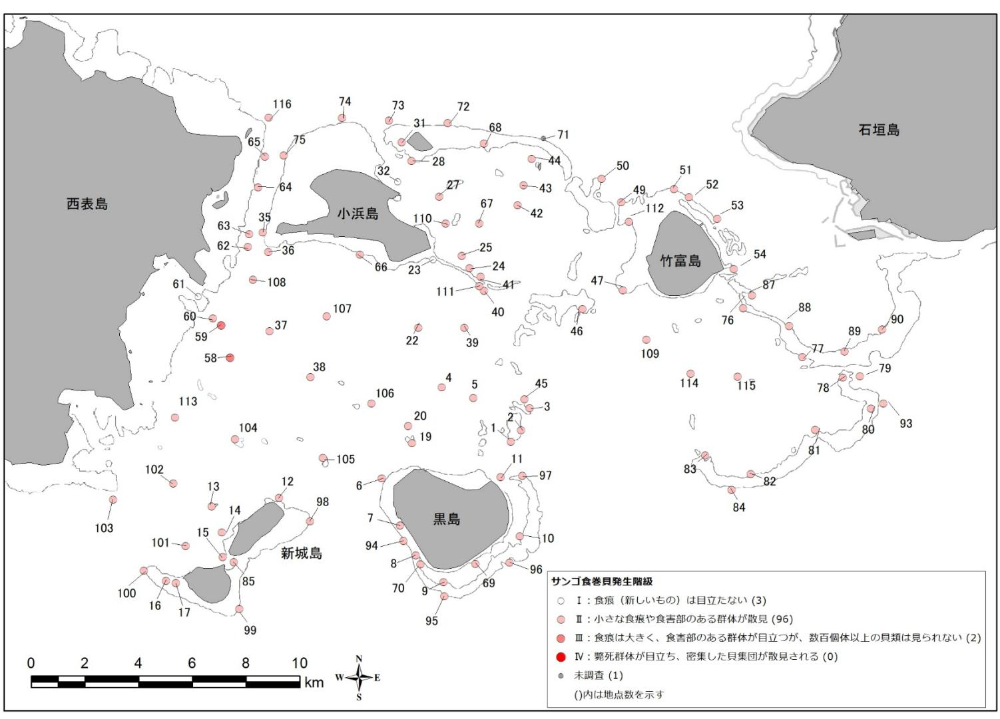

図 34 石西礁湖周辺海域におけるサンゴ食巻貝の分布状況

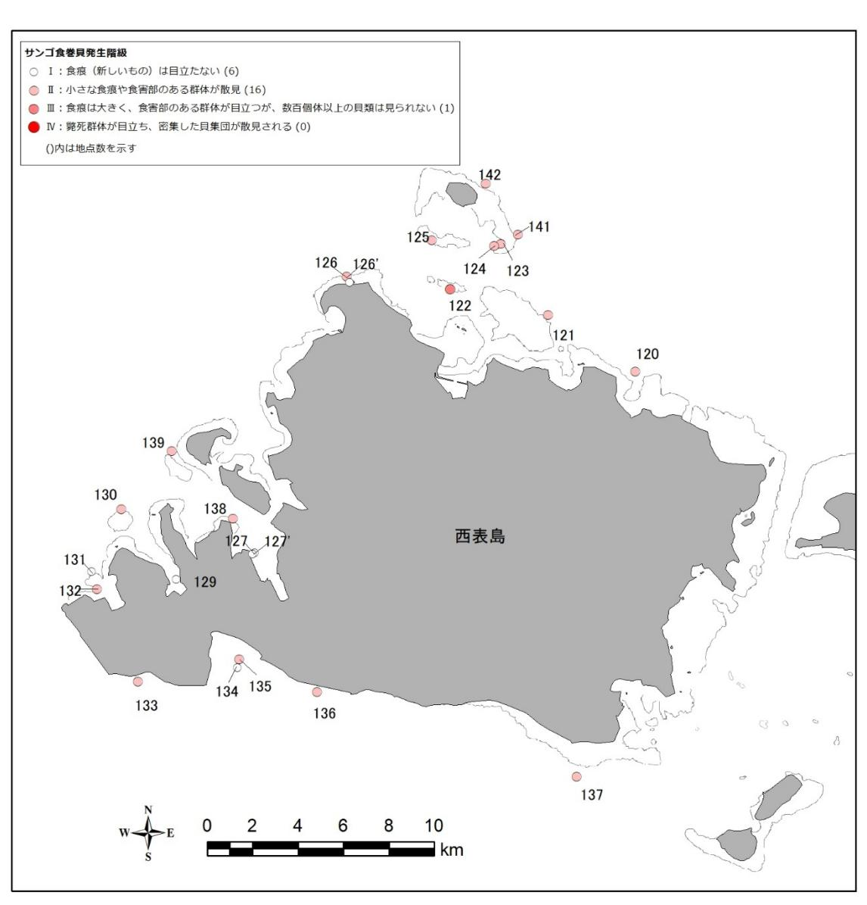

図 35 西表島周辺海域におけるサンゴ食巻貝の分布状況

#### 3) 白化現象

表 17 に 1998 年以降の全調査地点における平均白化率及び平均死亡率を、表 18 に今年度の白化率毎の地点数を示す。また、図 36 及び図 37 に今年度の地点毎の白化率を示す。

今年度も夏季高水温が原因と考えられる白化現象が観察され、全地点の平均白化率は89.0%(昨年度は42.1%)、平均死亡率は30.9%(昨年度は0.2%)であった。

|            |        | -    |      |       |      |      |      |      |      |       |      |       |      |
|------------|--------|------|------|-------|------|------|------|------|------|-------|------|-------|------|
| 調査年度       |        |      |      | 2001  | 2003 | 2005 | 2006 | 2007 | 2008 | 2009  | 2010 | 2011  | 2012 |
| 白化率(%)     |        |      | 65   | 24    | 31   | 33   | 16   | 49   | 65   | 42    | 39   | 32    | 17   |
| 死亡率(%)     |        |      | 35   | 2.8   |      |      | 0.6  |      | 6.3  | 0.1   | 0.4  | <0.1  | <0.1 |
| Ē          | 調査年度   | 2013 | 2014 | 2015  | 2016 | 2017 | 2018 | 2019 | 2020 | 2021  | 2022 | 2023  | 2024 |
| 1          | 化率 (%) | 14   | 55   | 60    | 98   | 90   | 15   | 21   | 55   | 57    | 89   | 42    | 89   |
| 死亡率(%) 0.3 |        | 1.5  | 2.5  | 49. 3 | 8.6  | 0    | 0    | 2.4  | 1.4  | 26. 8 | 0.2  | 30. 9 |      |

表 17 1998 年度から 2023 年度までの白化の確認された年の全地点の平均白化率及び平均死亡率(%)

124 調査地点中、全調査地点で 50%を越える白化率を示し(昨年度 38 地点)、そのうち 75%を超える白化率を示した地点が 111 地点(昨年度 7 地点)であった。また最も白化率 が高い 100%を示した地点はそのうち 18 地点(昨年度 0 地点)であった。

また、124 調査地点のうち死亡率が他よりも高かった(全調査地点に対する死亡率の平均値 30.9%に不偏標準偏差 20.6%を加算した 51.5%よりも高い死亡率であった)地点は、石西礁湖北部の3地点(地点62、地点63、地点64)、東部の6地点(地点79、地点82、地点83、地点84、地点114、地点115)、中央部の4地点(地点5、地点19、地点20、地点106)、及び南部の5地点(地点3、地点13、地点97、地点101、地点102)、西表島周辺3地点(地点131、地点133、地点134)の21地点であった。

| 白化率         | 地点数(昨年 度)石西礁湖周 辺 | 地点数(昨年 度)西表島周辺 | 地点数(昨年度) 合計 |
|-------------|------------------------|-------------------|----------------|
| 75%≦        | 93 ( 7)                | 19 ( 1)           | 112 ( 8)       |
| 50%≦ 〈75%未満 | 8 (28)                 | 4 ( 2)            | 12 ( 30)       |
| 25%≦ 〈50%未満 | 0 (59)                 | 0 (15)            | 0 ( 74)        |
| 0%< <25%    | 0 (8)                  | 0 (5)             | 0 (13)         |
| 0%          | 0 ( 0)                 | 0 ( 0)            | 0 ( 0)         |

表 18 2024 年度調査時の白化率毎の地点数(124(125)地点中)

※()内の数字は昨年度の値を示す

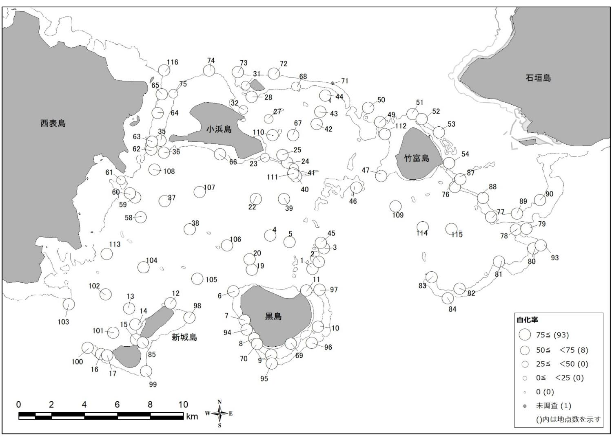

図 36 石西礁湖周辺海域におけるサンゴの白化率

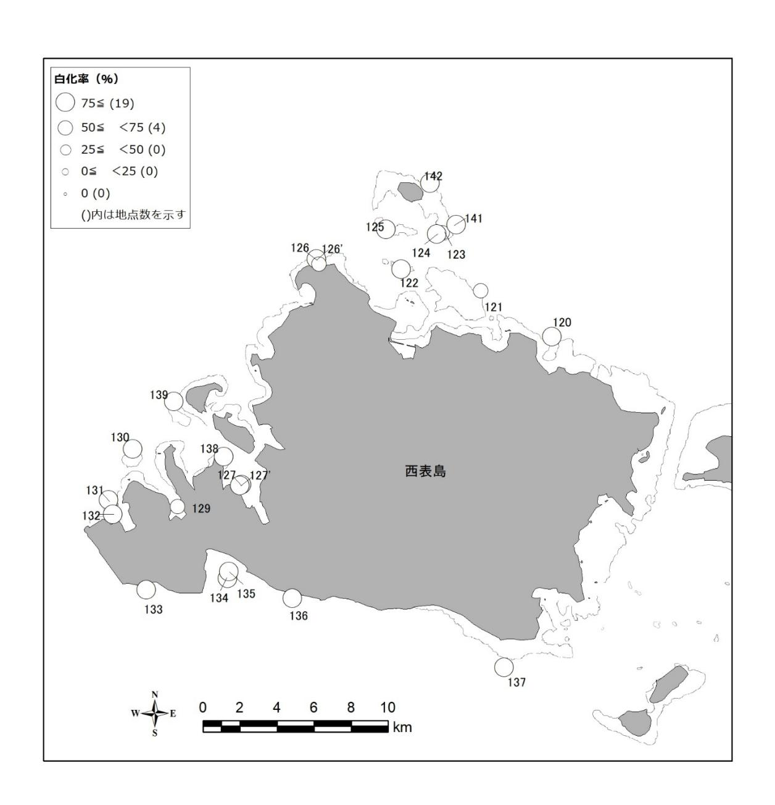

図 37 西表島周辺海域におけるサンゴの白化率

## 4)その他の自然のかく乱

## ①台風

2024 年に八重山地方の一部(石垣島、西表島)を暴風域内に巻き込んだ台風は、台風 3 号(7 月 21 日~7 月 28 日;最大瞬間風速:35.5 m/s)、台風 21 号(10 月 28 日~11 月 2 日;最大瞬間風速:30.1 m/s)の 2 個であった(出典:沖縄気象台発表「顕著気象現象速 報」)。

これらの台風によるサンゴ群集の破損は、全 124 調査地点の 29%にあたる 36 地点にお いてサンゴ群体の破損が観察された。ただし、サンゴ群集のみならず岩盤そのものが複数箇 所において崩壊・崩落するなどの甚大な影響が観察された調査地点は 7 地点であった。こ れら7地点での被害をもたらしたのは、台風 21 号であった。この台風 21 号が八重山に接 近したのは本調査期間中であったため、10 月 28 日以前までに調査を実施していた 84 地点 (西表島周辺、石西礁湖南側および北側礁外縁に位置する調査地点を含む)では、この台風 の影響を記録できていないことに留意すべきである。

なお、台風の接近とは、台風の中心が石垣島地方気象台(北緯24.337°、東経 124.163°)、 もしくは西表島特別地域気象観測所から 300 km 以内に入ることをいう。

## ②サンゴの病気

表 19 に各病気の確認された地点数を、図 38 及び図 39 に今年度の調査において病気が確 認された地点を示す。

腫瘍、黒帯病及びホワイトシンドロームが観察されたのは、それぞれ 33 地点(昨年度 42 地点)、35 地点(昨年度 31 地点)、115 地点(昨年度 117 地点)であった。昨年度と比較し て、3 種類の病気のうち腫瘍の観察された地点数が減少していた。また、今年度も全調査地 点の約 9 割にあたる地点でホワイトシンドロームが認められた。

| 病気の種類      | 確認された地点数 (昨年度) 石西礁湖周辺 | 確認された地点数 (昨年度) 西表島周辺 | 確認された地点数 (昨年度) 合計 |  |  |
|------------|-----------------------------|----------------------------|-------------------------|--|--|
| 腫瘍         | 28( 35)                     | 5( 7)                      | 33( 42)                 |  |  |
| 黒帯病        | 30( 25)                     | 5( 6)                      | 35( 31)                 |  |  |
| ホワイトシンドローム | 98(100)                     | 17(17)                     | 115(117)                |  |  |

表 19 サンゴの病気の種類別確認地点数

※( )内の数字は昨年度の値を示す

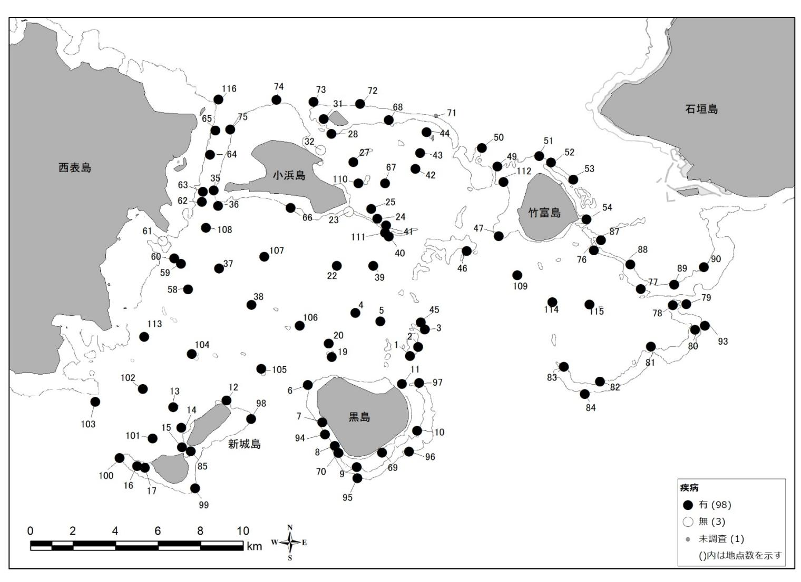

図 38 石西礁湖周辺海域におけるサンゴの病気の発生状況

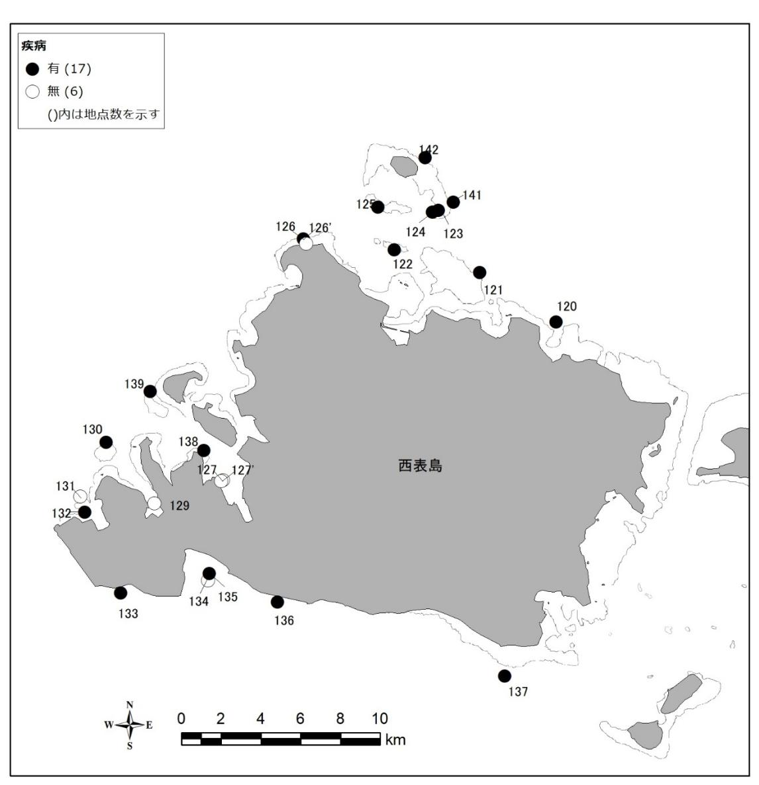

図 39 西表島周辺海域におけるサンゴの病気の発生状況

## ③テルピオス

病気ではないが、テルピオス類(黒色の海綿類の一種)はサンゴ群体に付着して成長 し、群体全体を覆ってしまうことがある。石西礁湖では、テルピオスの出現を以下の 3 つのランクで記録した(表 20)。

| ランク | 調査年度             | 2008 | 2009 | 2010 | 2011 | 2012 | 2013 | 2014 | 2015 | 2016 | 2017 | 2018 | 2019 | 2020 | 2021 | 2022 | 2023 | 2024 |
|-----|------------------|------|------|------|------|------|------|------|------|------|------|------|------|------|------|------|------|------|
|     | ランク 1 (見ない)   | 103  | 112  | 97   | 81   | 85   | 80   | 79   | 75   | 55   | 36   | 40   | 58   | 42   | 42   | 42   | 47   | 50   |
|     | ライン 2 (1ヵ所程度) | 19   | 11   | 25   | 31   | 30   | 36   | 37   | 43   | 53   | 64   | 69   | 57   | 64   | 63   | 52   | 59   | 57   |
| (数  | ランク 3 カ所/規模大) | 3    | 2    | 3    | 13   | 10   | 9    | 9    | 7    | 17   | 25   | 16   | 10   | 19   | 20   | 31   | 19   | 17   |

表 20 テルピオスが確認された地点数の推移(2008~2023 年度)

今年度テルピオスが観察された地点は 74 地点(昨年度は 78 地点)であった。ランク 2 の調査地点数が 59 地点から 57 地点と減少し、ランク 3 を示した地点数が 19 地点から 17 地点へと減少した。

昨年度ランク 2 から今年度ランク 3 へとランクが上昇した調査地点は、石西礁湖北部の 2 地点(地点 62、地点 63)、石西礁湖中央部の 1 地点(地点 107)、石西礁湖南部の 1 地 点(地点 15)で、昨年度ランク 1 から今年度ランク 2 へとランクが上昇した調査地点は、 石西礁湖北部の 3 地点(地点 36、地点 44、地点 64)、石西礁湖中央部の 6 地点(地点 20、地点 39、地点 40、地点 41、地点 58、地点 59)、石西礁湖南部の 1 地点(地点 12)、 西表島周辺の 1 地点(地点 123)であった。

一方で昨年度ランク 3 から今年度ランク 2 へとランクが下降した調査地点は、石西礁湖 北部の 1 地点(地点 43)、石西礁湖南部の 2 地点(地点 7、地点 107)、西表島周辺の 3 地 点(地点 121、地点 141、地点 142)で、昨年度ランク 2 から今年度ランク 1 へとランク が下降した調査地点は、石西礁湖北部の 7 地点(地点 49、地点 51、地点 53、地点 72、 地点 73、地点 74、地点 112)、石西礁湖東部の 5 地点(地点 77、地点 78、地点 88、地点 90、地点 115)、石西礁湖南部の 2 地点(地点 13、地点 17)であった。

## ④シルトの堆積状況(SPSS)

SPSS 階級毎の地点数を表 21、各地点の SPSS 階級を図 40 及び図 41 に示す。

生き生きとしたサンゴ礁生態系が維持される目安となる SPSS 階級 1 から 5a までは 56 地点(昨年度の 55 地点から 1 地点増加)であった。これは、調査対象とした 82 調査地点 のうちの約 68%に該当する。

| SPSS 階級 | 地点数(昨年度) 石西礁湖周辺 | 地点数(昨年度) 西表島周辺 | 地点数(昨年度) 合計 |
|---------|--------------------|-------------------|----------------|
| 1       | 0( 0)              | 0( 0)             | 0( 0)          |
| 2       | 1( 0)              | 0( 0)             | 1( 0)          |
| 3       | 17( 2)             | 0( 1)             | 17( 3)         |
| 4       | 10(15)             | 0( 0)             | 10(15)         |
| 5a      | 23(35)             | 5( 2)             | 28(37)         |
| 5b      | 10( 7)             | 0( 2)             | 10( 9)         |
| 6       | 9(15)              | 2( 2)             | 11(17)         |
| 7       | 1( 0)              | 0( 0)             | 1( 0)          |
| 8       | 3( 0)              | 1( 1)             | 4( 1)          |

表 21 SPSS 階級別調査地点数(全 82 地点中)

※( )内の数字は昨年度の値を示す

一方、サンゴ礁生態系に影響を与えるとされる 5b 以上の地点は 26 地点(昨年度の 27 地 点から 1 地点減少)であった。また、調査対象の 82 地点における SPSS 測定値の平均は 60.0 kg/m3であり、昨年度の 42.5 kg/m3から増加していたため、本調査海域における堆積 物の状況は悪化していたと言える。最も高い SPSS 値を記録したのは石西礁湖中央部の地 点 59(700.8 kg/m3)、次いで西表島および周辺離島の地点 127(692.4kg/m3)であった。

今年度 SPSS 階級が 2 階級以上増加した地点は、石西礁湖北部の 2 地点(地点 28 及び地 点 31)、石西礁湖中央部の 4 地点(地点 37、地点 38、地点 59、地点 60)及び西表島およ び周辺離島の 1 地点(地点 126')であった。一方で SPSS 階級が 2 階級以上減少した地点 は、石西礁湖東部の 5 地点(地点 46、地点 82、地点 83、地点 88、地点 109)、石西礁湖中 央部の 4 地点(地点 4、地点 5、地点 22、地点 106)及び石西礁湖南部の 4 地点(地点 1、 地点 8、地点 13、地点 14)であった。

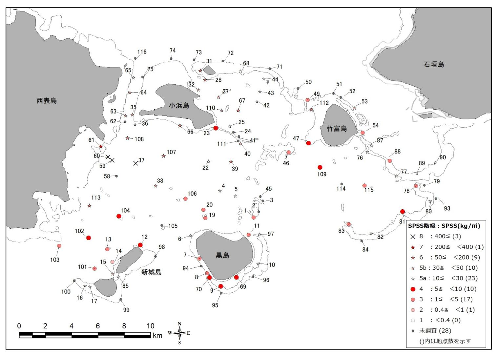

図 40 石西礁湖周辺海域におけるシルトの堆積状況(SPSS)

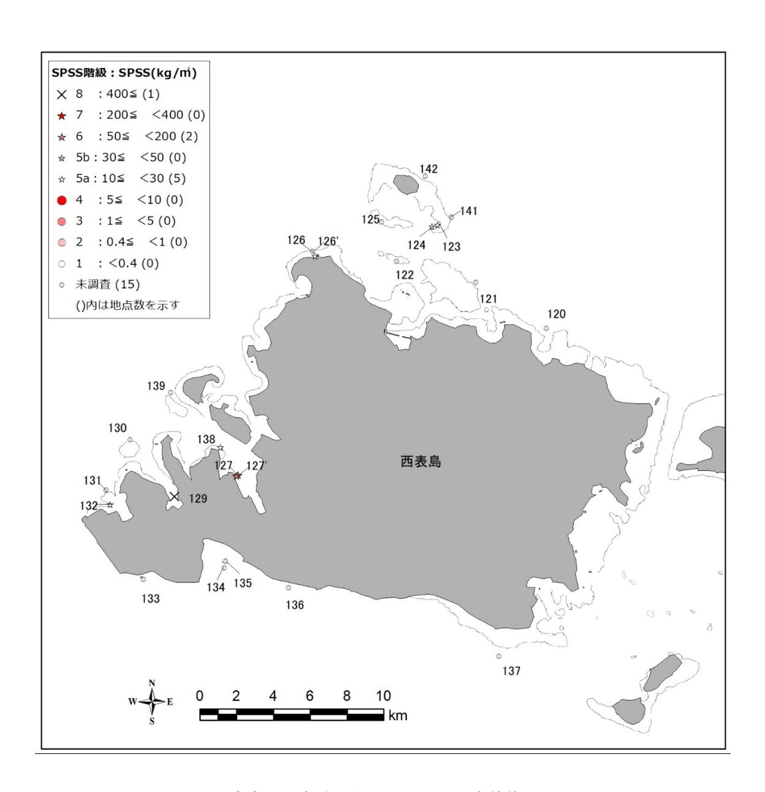

図 41 西表島周辺海域におけるシルトの堆積状況(SPSS)

## (3)大型定着性魚類

2004 年度より、ハタ類、ブダイ類、ベラ類の目撃数を記録している。今年度は、ハタ類 115 個体(昨年度は 150 個体)とブダイ類 649 個体(昨年度は 1698 個体)及びベラ類 42 個体(昨年度は 50 個体)を数え、3 種類すべてにおいて昨年よりも観察数が減少した。特 に、ブダイ類の観察数は 21 年間において最小値を記録した(表 22)。

表 22 全調査地点における大型定着性魚類の出現個体数の合計(2004~2024 年度)

| 調査年 魚類 | 2004   | 2005   | 2006   | 2007   | 2008   | 2009   | 2010   | 2011  | 2012 | 2013   | 2014  |
|-----------|--------|--------|--------|--------|--------|--------|--------|-------|------|--------|-------|
| ハタ類       | 90     | 113    | 145    | 136    | 87     | 68     | 51     | 70    | 46   | 94     | 62    |
| ブダイ類      | 683    | 2, 162 | 1,379  | 1,028  | 1, 148 | 1, 128 | 748    | 812   | 693  | 985    | 981   |
| ベラ類       | 48     | 61     | 67     | 45     | 33     | 30     | 24     | 25    | 15   | 26     | 19    |
| 総個体数      | 821    | 2, 336 | 1, 591 | 1, 209 | 1, 268 | 1, 226 | 823    | 907   | 754  | 1, 105 | 1,062 |
| 調査年 魚類 | 2015   | 2016   | 2017   | 2018   | 2019   | 2020   | 2021   | 2022  | 2023 | 2024   |       |
| ハタ類       | 67     | 71     | 69     | 126    | 105    | 117    | 92     | 126   | 150  | 115    |       |
| ブダイ類      | 1,022  | 953    | 917    | 1,515  | 1,502  | 1,028  | 1,062  | 1,090 | 698  | 649    |       |
| ベラ類       | 28     | 27     | 46     | 47     | 40     | 25     | 40     | 39    | 50   | 42     |       |
| 総個体数      | 1, 117 | 1,051  | 1,032  | 1,688  | 1,647  | 1,170  | 1, 194 | 1,255 | 898  | 806    |       |

## (4)貨物船座礁事故の発生

2023 年 1 月 24 日午前9時 30 分頃、石垣島西 7.2 キロメートルのサンゴ礁に、石垣港 に向かっていた貨物船が座礁するという事故が発生した。座礁した位置は、石西礁湖北部 の調査地点 71 のすぐ近くであり、調査範囲東半分のうち東端約 3 分の 1 から 4 分の 1 の 範囲を占有していた。今年度は、調査実施期間において座礁船撤去作業につき設定された 立入禁止措置が継続されていたため、この調査地点では調査を行わなかった。

## Ⅲ 参考文献

- 環境庁自然保護局.1998.生態系多様性地域調査(石垣東部及び平久保半島の沿岸海域) 報告書.
- 環境庁自然保護局.1999~2000.石垣島周辺海域におけるサンゴ礁モニタリング調査報 告書.環境庁委託調査報告書.
- 環境省自然環境局.2001~2003.石垣島周辺海域におけるサンゴ礁モニタリング調査報 告書.環境省請負調査報告書.
- 環境省自然保護局 生物多様性センター.2007~2019.西表石垣国立公園石西礁湖及び その近隣海域におけるサンゴ礁モニタリング調査報告書
- 環境省自然環境局・(財)自然環境研究センター.2003.西表国立公園における海中公 園計画作成に関する海域調査業務 報告書.174pp.
- 西平守孝・J.E.N.Veron.1995.日本の造礁サンゴ類.海游社、東京.439pp.
- 沖縄県衛生環境研究所・大見謝辰夫.2000.海の赤土汚染調査法(講演資料)
- (財)海中公園センター.1997.石西礁湖及び近隣海域におけるオニヒトデ及びサンゴ 類の分布調査報告書.竹富町委託調査報告書.
- (財)海中公園センター・環境庁.1999~2002.西表国立公園石西礁湖及び近隣海域に おけるサンゴ礁モニタリング調査報告書.共同調査報告書.
- (財)沖縄県環境科学センター.1994.沿岸海域実態調査(宮古島、石垣島及び西表島 並びに周辺離島).平成5年度 委託調査 沖縄県企.

## Ⅳ 付 録

付表 調査結果一覧

付図1 各調査地点の景観及び概況(石垣島周辺海域)

付図2 各調査地点の景観及び概況(石西礁湖及び西表島周辺海域)

|       |           |     |    |           |                |            | サンゴ                   |     |                         |                  |                   | ヒトデ        |            |                  | <b>「食巻貝</b> |   | 表別の有別 (群体数) | F                                       | SI   | SPSS       |     | 30om以上の大型魚類教 |          |  |
|-------|-----------|-----|----|-----------|----------------|------------|-----------------------|-----|-------------------------|------------------|-------------------|------------|------------|------------------|-------------|---|----------------|-----------------------------------------|------|------------|-----|--------------|----------|--|
| 地点番号  | 地名        | 被度  | 全体 | 白· 計切砂 | 化率 全体 死滅 | 計リ 死滅   | 生育型                   | 加入數 | 卓計 大5群体平均サ イズ(om) | 15分換算機 察數(注5) | 優占 サイス (om) | 範囲 (om) | 被食率 (%) | 発生 階級 (注1) | 被食率 (%)  | 集 | B B D    | W S                                  | 測定値  | 階級 (注2) | ハタ類 | ペラ 類      | ブダイ 類 |  |
| 【石垣島居 | ]辺海域】     | 1   | 1  |           | : <b>%</b>     | : <b>%</b> | :                     |     | : 1A(GM)                |                  | : (011)           | 1          |            | (21)             |             |   | , 0            | 1                                       | .1   |            |     |              |          |  |
| 1     | 大浜小前      | <10 | 0  | 0         | 0              | 0          | 特定類優占型(塊状ハマサンゴ 類)  | <1  | -                       | 0                | -                 | -          | 0          | 1                | 0           |   | 無              |                                         | 12.1 | 5a         | 0   | 0            | 0        |  |
| 2     | 宮良川河口     | 30  | 10 | 20        | 5              | 20         | 多種混成型                 | 8   | 20.0                    | 0                | -                 | -          | 0          | 1                | 0           |   | 無              |                                         | -    | -          | 0   | 0            | 4        |  |
| 3     | 宮良集落前     | <5  | 0  | 0         | 0              | 0          | 多種混成型                 | 0   | -                       | 0                | -                 | -          | 0          | 1                | 0           |   | 無              |                                         | 4.0  | 3          | 0   | 0            | 0        |  |
| 4     | 白保集落前     | <5  | <1 | 0         | <1             | 0          | 多種混成型                 | 0   | -                       | 0                | -                 | -          | 0          | 1                | 0           |   | 無              |                                         | 8.6  | 4          | 0   | 0            | 0        |  |
| 5     | 白保アオサンゴ   | 60  | 10 | 20        | 10             | 20         | 特定類優占型(アオサンゴ)         | <1  | 45.0                    | 0                | -                 | -          | 0          | 2                | <1          |   | 無              |                                         | 37.8 | 5b         | 0   | 0            | 0        |  |
| 6     | 白保第1ポール   | 60  | <5 | 10        | <5             | 10         | 特定類優占型(ユビエダハマサ ンゴ) | <1  | -                       | 0                | -                 | -          | 0          | 1                | 0           |   | 無              |                                         | 11.2 | 5a         | 0   | 0            | 0        |  |
| 7     | 白保~轟川     | 40  | 0  | 0         | 0              | 0          | 多種混成型                 | 0   | 15.0                    | 0                | -                 | -          | 0          | 2                | <1          |   | 無              |                                         | 10.9 | 5a         | 0   | 0            | 0        |  |
| 8     | 轟川河口      | 40  | 0  | 0         | 0              | 0          | 特定類優占型(塊状ハマサンゴ 類)  | <1  | 10.0                    | 0                | -                 | -          | 0          | 1                | 0           |   | 無              |                                         | 13.6 | 5a         | 0   | 0            | 0        |  |
| 9     | モリヤマグチ    | 10  | 0  | 0         | 0              | 0          | 卓状ミドリイシ優占型            | 1   | -                       | 0                | -                 | -          | 0          | 1                | 0           |   | 無              |                                         | 13.0 | 5а         | 0   | 0            | 0        |  |
| 10    | スムジグチ     | 10  | 0  | 0         | 0              | 0          | 多種混成型                 | <1  | 15.0                    | 0                | -                 | -          | 0          | 1                | 0           |   | 無              |                                         | 7.5  | 4          | 0   | 0            | 0        |  |
| 11    | 採石場前      | <1  | 0  | 0         | 0              | 0          | 多種混成型                 | <1  | -                       | 0                | -                 | -          | 0          | 1                | 0           |   | 無              |                                         | 1.9  | 3          | 0   | 0            | 0        |  |
| 12    | 通路川南      | 20  | 0  | 0         | 0              | 0          | 多種混成型                 | 1   | 15.0                    | 0                | -                 | -          | 0          | 1                | 0           |   | 無              |                                         | 7.1  | 4          | 0   | 0            | 0        |  |
| 13    | 通路川水路北    | 10  | 0  | 0         | 0              | 0          | 多種混成型                 | 3   | 90.0                    | 0                | -                 | -          | 0          | 1                | 0           |   | 無              |                                         | 8.3  | 4          | 0   | 0            | 0        |  |
| 14    | 野原崎       | <10 | 0  | 0         | 0              | 0          | 多種混成型                 | <1  | -                       | 0                | -                 | -          | 0          | 1                | 0           |   | 無              |                                         | 14.7 | 5a         | 0   | 0            | 0        |  |
| 15    | 伊野田漁港前    | <1  | 0  | 0         | 0              | 0          | 多種混成型                 | 0   | -                       | 0                | -                 | -          | 0          | 1                | 0           |   | 無              |                                         | 4.6  | 3          | 0   | 0            | 0        |  |
| 16    | 大野牧場前     | 20  | 0  | 0         | 0              | 0          | 多種混成型                 | 4   | 15.0                    | 0                | -                 | -          | 0          | 1                | 0           |   | 無              |                                         | 44.2 | 5ь         | 0   | 0            | 0        |  |
| 17    | 玉取崎南      | 70  | 0  | 0         | 0              | 0          | 特定類優占型(ユビエダハマサ ンゴ) | 1   | 25.0                    | 0                | -                 | -          | 0          | 1                | 0           |   | 無              |                                         | 10.3 | 5a         | 0   | 0            | 0        |  |
| 18    | 玉取崎東      | <10 | 0  | 0         | 0              | 0          | 多種混成型                 | 1   | -                       | 0                | -                 | -          | 0          | 1                | 0           |   | 無              |                                         | 2.1  | 3          | 0   | 0            | 0        |  |
| 19    | 伊原間牧場前    | 70  | <5 | 0         | <5             | 0          | 特定類優占型(エダハナガササ ンゴ) | <1  | 15.0                    | 0                | -                 | -          | 0          | 2                | <1          |   | 無              |                                         | 8.8  | 4          | 0   | 0            | 0        |  |
| 20    | トムル崎南     | 30  | 30 | 0         | <1             | 0          | 特定類優占型(枝状コモンサン ゴ)  | <1  | -                       | 0                | -                 | -          | 0          | 2                | <1          |   | 無              |                                         | 15.0 | 5a         | 0   | 0            | 0        |  |
| 21    | トムル崎      | 40  | 5  | 0         | 0              | 0          | 特定類優占型(枝状コモンサン ゴ)  | <1  | 10.0                    | 0                | -                 | -          | 0          | 1                | 0           |   | 無              |                                         | 1.1  | 3          | 0   | 0            | 0        |  |
| 22    | パ゚ラワールト*前 | <5  | 0  | 0         | 0              | 0          | 多種混成型                 | 0   | -                       | 0                | -                 | -          | 0          | 1                | 0           |   | 無              |                                         | 15.2 | 5a         | 0   | 0            | 0        |  |
| 23    | 明石~安良崎    | <10 | 0  | 0         | 0              | 0          | 多種混成型                 | 1   | 35.0                    | 0                | -                 | -          | 0          | 1                | 0           |   | 無              |                                         | 4.0  | 3          | 0   | 0            | 5        |  |
| 24    | 安良崎南      | <5  | 0  | 0         | 0              | 0          | ソフトコーラル優占型            | <1  | 10.0                    | 0                | -                 | -          | 0          | 1                | 0           |   | 無              |                                         | 1.2  | 3          | 0   | 0            | 0        |  |
| 25    | 安良崎       | 10  | 0  | 0         | 0              | 0          | 特定類優占型(ハマサンゴ)         | 1   | -                       | 0                | -                 | -          | 0          | 1                | 0           |   | 無              |                                         | 3.8  | 3          | 0   | 0            | 0        |  |
| 26    | 安良グチ北     | <5  | 0  | 0         | 0              | 0          | 多種混成型                 | 6   | -                       | 0                | -                 | -          | 0          | 1                | 0           | 1 | 無              |                                         | 6.0  | 4          | 0   | 0            | 0        |  |
| 27    | 岩崎南       | 80  | 20 | 0         | <1             | 0          | 特定類優占型(枝状コモンサン ゴ)  | <1  | -                       | 0                | -                 | -          | 0          | 2                | <1          |   | 無              |                                         | 10.2 | 5a         | 0   | 0            | 0        |  |
| 28    | 岩崎        | 60  | 40 | 10        | <1             | <1         | 多種混成型                 | <1  | -                       | 0                | _                 | -          | 0          | 1                | 0           |   | 無              | *************************************** | 15.2 | 5a         | 0   | 0            | 0        |  |
| 29    | 岩崎~浦崎     | 40  | 10 | 10        | 0              | 0          | 特定類優占型(ユビエダハマサ ンゴ) | <1  | 15.0                    | 0                | -                 | -          | 0          | 1                | 0           | 1 | 無              |                                         | 7.0  | 4          | 0   | 0            | 0        |  |

|      |           |     |                 |                       |                | ,         | サンゴ                   |     |                |        | オニ        | ヒトデ        |            | サンゴ      | 食養貝        |          | 表別の有 (群体教 | <b>**</b> | SF   | PSS        | 30om以上の大型魚類散 |          |          |
|------|-----------|-----|-----------------|-----------------------|----------------|-----------|-----------------------|-----|----------------|--------|-----------|------------|------------|----------|------------|----------|--------------|-----------|------|------------|--------------|----------|----------|
| 地点番号 | 地名        | 被度  |                 | •••••••               | 化率 全体 死滅 | 計リ 死滅  | 生育型                   | 加入數 | 卓計・ 大5群体平均サ | 15分換算機 | 優占 サイズ | 範囲 (om) | 被食率 (%) | 発生 階級 | 被食率 (%) | 重集       | B B       | W         | 測定   | 階級 (注2) | ハタ類          | ペラ       | ブダイ 類 |
| 30   | 浦崎沖       | 30  | <b>全体</b> 40 | <b>라'リイ&gt;</b> 30 | 死滅 (1          | <b>死滅</b> | 特定類優占型(コモンサンゴ         | <1  | イズ(cm) 10.0 | 0      | (om) - | (om)       | 0          | (注1)     | 0          | -        | <u>D</u>     |           | 24.4 | (Æ2) 5a | 0            | 0        | 0        |
| 31   | 浦崎前       | 40  | 60              | 10                    | <1             | <1        | 類) 特定類優占型(枝状コモンサン     | <1  | -              |        | _         |            | 0          | 1        | 0          | <u> </u> | 無            |           | 8.0  | 4          |              | 0        | 0        |
|      |           |     | <u> </u>        | -                     | 0              | 0         | ゴ類)                   |     | 15.0           | 0      |           | _          | <u> </u>   | 1        |            | ļ        | 無            |           | 4.4  |            | <b>-</b>     | <u> </u> | 0        |
| 32   | 平野集落前     | 20  | 0               | 0                     |                | ļ         | 枝状ミドリイシ優占型            | 1   |                |        |           | -          | 0          |          | 0          |          |              |           |      | 3          | 0            | 0        |          |
| 33   | 平久保灯台北    | 20  | 0               | 0                     | 0              | 0         | 多種混成型                 | 3   | 50.0           | 0      | -         | -          | 0          | 1        | 0          |          | <b>無</b>     |           | 3.5  | 3          | 0            | 0        | 10       |
| 34   | 平久保灯台西    | <1  | 0               | 0                     | 0              | 0         | 多種混成型                 | <1  | -              | 0      | -         | -          | 0          | 1        | 0          |          | 無            |           | 0.8  | 2          | 0            | 0        | 0        |
| 35   | 平久保川北     | 30  | 0               | 0                     | 0              | 0         | 枝状ミドリイシ優占型            | 2   | 35.0           | 0      | -         | -          | 0          | 1        | 0          | ļ        | 無            |           | 16.9 | 5a         | 0            | 0        | 0        |
| 36   | 平久保集落南    | 30  | 0               | 0                     | 0              | 0         | 枝状ミドリイシ優占型            | 2   | 20.0           | 0      | -         | -          | 0          | 2        | <1         | ļ        | 無            |           | 40.5 | 5b         | 0            | 0        | 0        |
| 37   | 嘉良川前      | <10 | 0               | 0                     | 0              | 0         | 多種混成型                 | 3   | 15.0           | 0      | -         | -          | 0          | 1        | 0          | ļ        | 無            |           | 58.9 | 6          | 0            | 0        | 0        |
| 38   | ダテフ崎北     | <5  | 0               | 0                     | 0              | 0         | 多種混成型                 | 3   | -              | 0      | -         | -          | 0          | 1        | 0          |          | 無            |           | 11.2 | 5a         | 0            | 0        | 0        |
| 39   | ダテフ崎南     | <5  | 0               | 0                     | 0              | 0         | 多種混成型                 | <1  | -              | 0      | -         | -          | 0          | 1        | 0          |          | 無            |           | 6.8  | 4          | 0            | 0        | 0        |
| 40   | 野底石崎      | <10 | 0               | 0                     | 0              | 0         | 多種混成型                 | 2   | 70.0           | 0      | -         | -          | 0          | 1        | 0          |          | 無            |           | 19.3 | 5a         | 0            | 0        | 0        |
| 41   | 栄集落前      | 20  | 0               | 0                     | 0              | 0         | 枝状・卓状ミドリイシ混成型         | 3   | 20.0           | 0      | -         | -          | 0          | 2        | <1         |          | 無            |           | 13.3 | 5a         | 0            | 0        | 0        |
| 42   | 野底集落前     | 30  | 0               | 0                     | 0              | 0         | 枝状・卓状ミドリイシ混成型         | 4   | 30.0           | 0      | -         | -          | 0          | 1        | 0          |          | 無            |           | 27.7 | 5a         | 0            | 0        | 0        |
| 43   | 野底崎       | 40  | 0               | 0                     | 0              | <1        | 枝状・卓状ミドリイシ混成型         | 2   | 90.0           | 0      | -         | -          | 0          | 2        | <1         |          | 無            |           | 8.0  | 4          | 0            | 0        | 0        |
| 44   | 伊土名北      | 70  | 0               | 0                     | 0              | 0         | 枝状ミドリイシ優占型            | 5   | 70.0           | 0      | -         | -          | 0          | 2        | <1         |          | 無            |           | -    | -          | 0            | 0        | 0        |
| 45   | 伊土名南      | <5  | <5              | 0                     | 0              | 0         | 多種混成型                 | 2   | -              | 0      | -         | -          | 0          | 1        | 0          |          | 無            |           | 11.7 | 5a         | 0            | 0        | 0        |
| 46   | 浦底湾口北     | <5  | 5               | 0                     | 0              | 0         | 多種混成型                 | 7   | -              | 0      | -         | -          | 0          | 1        | 0          | <b></b>  | 無            |           | 3.3  | 3          | 0            | 0        | 0        |
| 47   | 浦底湾口西     | 10  | 5               | 0                     | 0              | 0         | 多種混成型                 | 4   | 55.0           | 0      | -         | -          | 0          | 1        | 0          |          | 無            |           | -    | -          | 0            | 0        | 4        |
| 48   | 富野集落前     | 20  | 10              | 10                    | <5             | <5        | 多種混成型                 | 9   | 50.0           | 0      | -         | -          | 0          | 1        | 0          |          | 無            |           | -    | -          | 0            | 0        | 4        |
| 49   | 米原キャンプ。場  | 50  | 10              | <5                    | 0              | 0         | 特定類優占型(枝状コモンサン ゴ類) | 2   | -              | 0      | -         | -          | 0          | 1        | 0          | <b></b>  | 無            |           | 4.1  | 3          | 0            | 0        | 0        |
| 50   | ヤマバレー前    | 30  | 20              | 30                    | <5             | <5        | 多種混成型                 | 5   | 40.0           | 0      | -         | -          | 0          | 1        | 0          |          | 無            |           | 3.3  | 3          | 0            | 0        | 5        |
| 51   | ヤマバレー西    | 30  | 5               | 0                     | 5              | 0         | 多種混成型                 | 1   | -              | 0      | -         | -          | 0          | 1        | 0          |          | 無            |           | 5.0  | 3          | 0            | 0        | 0        |
| 52   | 川平小島東     | 30  | 0               | 0                     | 0              | 0         | 多種混成型                 | 1   | -              | 0      | -         | -          | 0          | 2        | <1         |          | 無            |           | 7.4  | 4          | 0            | 0        | 0        |
| 53   | 川平小島北     | 30  | 0               | 0                     | 0              | 0         | 多種混成型                 | 2   | 15.0           | 0      | -         | -          | 0          | 1        | 0          | <b></b>  | 無            |           | 14.7 | 5a         | 0            | 0        | 0        |
| 54   | 川平水路東     | 40  | <1              | <1                    | <1             | <1        | 枝状ミドリイシ優占型            | 2   | 20.0           | 0      | -         | -          | 0          | 1        | 0          | <u> </u> | 無            |           | 1.7  | 3          | 0            | 0        | 5        |
| 55   | 川平水路      | 40  | <1              | <5                    | <1             | <5        | 多種混成型                 | 3   | 35.0           | 0      | -         | -          | 0          | 1        | 0          |          | 無            |           | 4.9  | 3          | 0            | 0        | 10       |
| 56   | 川平水路北西    | <1  | 0               | 0                     | 0              | 0         | 多種混成型                 | <1  | 15.0           | 1      | 20-30     | 28         | <1         | 1        | 0          | ļ        | 無            |           | 8.8  | 4          | 0            | 0        | 0        |
| 57   | 川平~石崎     | 50  | <5              | 10                    | <5             | 10        | 特定類優占型(ユビエダハマサ        | 2   | 30.0           | 0      | -         | -          | 0          | 1        | 0          |          | 無            |           | 6.3  | 4          | 0            | 0        | 0        |
| 58   | クラフ・メット・前 | 40  | 0               | 0                     | 0              | 0         | ンゴ) 枝状・卓状ミドリイシ混成型  | 3   | 75.0           | 0      | _         | _          | 0          | 1        | 0          |          | 無            |           | 10.7 | 5a         | 0            | 0        | 0        |
| 59   | リア石崎北     | <1  | 0               |                       | 0              | 0         | 多種混成型                 |     | 70.0           |        | _         | _          | 0          | 1        | 0          | <u> </u> | 無 無       |           | 3.7  |            | 0            | ļ        | 0        |
| 59   | 川平石噂花     |     | u               | 0                     | U              | U         | 多種混成型                 | U   |                | U      |           |            | U          | L'       | U          | <u> </u> | 無            |           | 3./  | 3          | 1            | 0        | U        |

| 第名 新城島上地北岸離復 マイビシ海中公園地区 新城島上地西岸 新城島開水路部 | 被皮 10                                                          | 全体                                                                                                                        | 白信                                                                                |                                                                                                     |                                                                                                                   |                                                                                                                                   | #ುವ                                                                                                                                                   |                                                                                                                                                                   |                                                                                                                                                                                                                                                                                   |                                                                                                                                                                                                |                                                                                                                                                                                                            |                                                                                                                                                                                                                                                                                                                                                                                                                                                                      |                                                                                                                                                                                                                                                                                                                                                                                                                                                                                                                                                                                                                                            |                                                                                                                                                                                                                                                                                                            |                                                                                                                                                                                                                                                                                                                     | 疾病の有罪 (群体数)                                                                                                                                                                                                                                                        |                                                                                                                                                                                                                                                                                                                                                                                                                                                                                                                                                                                                                                                                                                                                                                                                    |                                                                                                                                                                                                                                                                                                                                                                                                                                                                                                                                                                                                                                                                                                                                                                                                                                                |                                                                                                                                                                                                                                                                                                                                                                                                                                                                                                                                                                                                                                                                                                                                                                                                                                                                                                                                      | 30om以上の大型魚類数                                                                                                                                                                                                                                                                                                                                                                                                                                                                                                                                                                                                                                                                                                                                                                                                                                                                                                         |                                                                                                                                                                                                                                                                                                                                                                                                                                                                                                                                                                                                                                                                                                                                                                                                                                                                                                                                                                                                                                                                                                                                                                                                                                                                                                                                                                                                                                                                                                                                                                                                                                                                                                                                                                                                                                                            |                                                                                                                                                                                                                                                                                                                                                                                                                                                                                                                                                                                                                                                                                                                                                                                                                                                                                                              |
|-----------------------------------------------------|----------------------------------------------------------------|---------------------------------------------------------------------------------------------------------------------------|-----------------------------------------------------------------------------------|-----------------------------------------------------------------------------------------------------|-------------------------------------------------------------------------------------------------------------------|-----------------------------------------------------------------------------------------------------------------------------------|-------------------------------------------------------------------------------------------------------------------------------------------------------|-------------------------------------------------------------------------------------------------------------------------------------------------------------------|-----------------------------------------------------------------------------------------------------------------------------------------------------------------------------------------------------------------------------------------------------------------------------------|------------------------------------------------------------------------------------------------------------------------------------------------------------------------------------------------|------------------------------------------------------------------------------------------------------------------------------------------------------------------------------------------------------------|----------------------------------------------------------------------------------------------------------------------------------------------------------------------------------------------------------------------------------------------------------------------------------------------------------------------------------------------------------------------------------------------------------------------------------------------------------------------|--------------------------------------------------------------------------------------------------------------------------------------------------------------------------------------------------------------------------------------------------------------------------------------------------------------------------------------------------------------------------------------------------------------------------------------------------------------------------------------------------------------------------------------------------------------------------------------------------------------------------------------------|------------------------------------------------------------------------------------------------------------------------------------------------------------------------------------------------------------------------------------------------------------------------------------------------------------|---------------------------------------------------------------------------------------------------------------------------------------------------------------------------------------------------------------------------------------------------------------------------------------------------------------------|-----------------------------------------------------------------------------------------------------------------------------------------------------------------------------------------------------------------------------------------------------------------------|----------------------------------------------------------------------------------------------------------------------------------------------------------------------------------------------------------------------------------------------------------------------------------------------------------------------------------------------------------------------------------------------------------------------------------------------------------------------------------------------------------------------------------------------------------------------------------------------------------------------------------------------------------------------------------------------------------------------------------------------------------------------------------------------------|------------------------------------------------------------------------------------------------------------------------------------------------------------------------------------------------------------------------------------------------------------------------------------------------------------------------------------------------------------------------------------------------------------------------------------------------------------------------------------------------------------------------------------------------------------------------------------------------------------------------------------------------------------------------------------------------------------------------------------------------------------------------------------------------------------------------------------------------|--------------------------------------------------------------------------------------------------------------------------------------------------------------------------------------------------------------------------------------------------------------------------------------------------------------------------------------------------------------------------------------------------------------------------------------------------------------------------------------------------------------------------------------------------------------------------------------------------------------------------------------------------------------------------------------------------------------------------------------------------------------------------------------------------------------------------------------------------------------------------------------------------------------------------------------|----------------------------------------------------------------------------------------------------------------------------------------------------------------------------------------------------------------------------------------------------------------------------------------------------------------------------------------------------------------------------------------------------------------------------------------------------------------------------------------------------------------------------------------------------------------------------------------------------------------------------------------------------------------------------------------------------------------------------------------------------------------------------------------------------------------------------------------------------------------------------------------------------------------------|------------------------------------------------------------------------------------------------------------------------------------------------------------------------------------------------------------------------------------------------------------------------------------------------------------------------------------------------------------------------------------------------------------------------------------------------------------------------------------------------------------------------------------------------------------------------------------------------------------------------------------------------------------------------------------------------------------------------------------------------------------------------------------------------------------------------------------------------------------------------------------------------------------------------------------------------------------------------------------------------------------------------------------------------------------------------------------------------------------------------------------------------------------------------------------------------------------------------------------------------------------------------------------------------------------------------------------------------------------------------------------------------------------------------------------------------------------------------------------------------------------------------------------------------------------------------------------------------------------------------------------------------------------------------------------------------------------------------------------------------------------------------------------------------------------------------------------------------------------|--------------------------------------------------------------------------------------------------------------------------------------------------------------------------------------------------------------------------------------------------------------------------------------------------------------------------------------------------------------------------------------------------------------------------------------------------------------------------------------------------------------------------------------------------------------------------------------------------------------------------------------------------------------------------------------------------------------------------------------------------------------------------------------------------------------------------------------------------------------------------------------------------------------|
| マイビシ海中公園地区 新城島上地西岸                                  | -                                                              | ±#                                                                                                                        |                                                                                   | 全体 死滅                                                                                            | 計"リ 死滅                                                                                                         | 生育型                                                                                                                               | 加入數                                                                                                                                                   | 卓計 大5群体平均サ                                                                                                                                                     | 15分換算機 麻敷(注5)                                                                                                                                                                                                                                                                     | <b>優占</b> サイス・                                                                                                                                                                              | 範囲 (om)                                                                                                                                                                                                 | 被食率 (%)                                                                                                                                                                                                                                                                                                                                                                                                                                                              | 発生 階級                                                                                                                                                                                                                                                                                                                                                                                                                                                                                                                                                                                                                                   | 被食率 (%)                                                                                                                                                                                                                                                                                                 |                                                                                                                                                                                                                                                                                                                     | В В                                                                                                                                                                                                                                                                | W S                                                                                                                                                                                                                                                                                                                                                                                                                                                                                                                                                                                                                                                                                                                                                                                             | 測定値                                                                                                                                                                                                                                                                                                                                                                                                                                                                                                                                                                                                                                                                                                                                                                                                                                            | 階級 (注2)                                                                                                                                                                                                                                                                                                                                                                                                                                                                                                                                                                                                                                                                                                                                                                                                                                                                                                                           | ハタ類                                                                                                                                                                                                                                                                                                                                                                                                                                                                                                                                                                                                                                                                                                                                                                                                                                                                                                                  | ペラ 類                                                                                                                                                                                                                                                                                                                                                                                                                                                                                                                                                                                                                                                                                                                                                                                                                                                                                                                                                                                                                                                                                                                                                                                                                                                                                                                                                                                                                                                                                                                                                                                                                                                                                                                                                                                                                                                    | ブダイ 類                                                                                                                                                                                                                                                                                                                                                                                                                                                                                                                                                                                                                                                                                                                                                                                                                                                                                                     |
| マイビシ海中公園地区 新城島上地西岸                                  | -                                                              | 95.0                                                                                                                      | 97.5                                                                              | 死滅 18                                                                                               | 死滅 33                                                                                                          | 多種混成型                                                                                                                             | 2                                                                                                                                                     | イズ(om) 36.5                                                                                                                                                    | 0                                                                                                                                                                                                                                                                                 | (om) -                                                                                                                                                                                      | -                                                                                                                                                                                                          | 0                                                                                                                                                                                                                                                                                                                                                                                                                                                                    | <b>(注1)</b> 2                                                                                                                                                                                                                                                                                                                                                                                                                                                                                                                                                                                                                           | 1                                                                                                                                                                                                                                                                                                          | 3                                                                                                                                                                                                                                                                                                                   | D 4                                                                                                                                                                                                                                                                | 20.0                                                                                                                                                                                                                                                                                                                                                                                                                                                                                                                                                                                                                                                                                                                                                                                               | 5.2                                                                                                                                                                                                                                                                                                                                                                                                                                                                                                                                                                                                                                                                                                                                                                                                                                            | 4                                                                                                                                                                                                                                                                                                                                                                                                                                                                                                                                                                                                                                                                                                                                                                                                                                                                                                                                    | 0                                                                                                                                                                                                                                                                                                                                                                                                                                                                                                                                                                                                                                                                                                                                                                                                                                                                                                                    | 0                                                                                                                                                                                                                                                                                                                                                                                                                                                                                                                                                                                                                                                                                                                                                                                                                                                                                                                                                                                                                                                                                                                                                                                                                                                                                                                                                                                                                                                                                                                                                                                                                                                                                                                                                                                                                                                          | 1                                                                                                                                                                                                                                                                                                                                                                                                                                                                                                                                                                                                                                                                                                                                                                                                                                                                                                            |
| 新城島上地西岸                                             | <10                                                            | 99.0                                                                                                                      | 100.0                                                                             | 80                                                                                                  | 78                                                                                                                | 多種混成型                                                                                                                             | 3                                                                                                                                                     | 27.9                                                                                                                                                              | 0                                                                                                                                                                                                                                                                                 |                                                                                                                                                                                                | -                                                                                                                                                                                                          | 0                                                                                                                                                                                                                                                                                                                                                                                                                                                                    | 2                                                                                                                                                                                                                                                                                                                                                                                                                                                                                                                                                                                                                                          | 1                                                                                                                                                                                                                                                                                                          | 0                                                                                                                                                                                                                                                                                                                   | 0                                                                                                                                                                                                                                                                     | 25.0                                                                                                                                                                                                                                                                                                                                                                                                                                                                                                                                                                                                                                                                                                                                                                                               | 2.3                                                                                                                                                                                                                                                                                                                                                                                                                                                                                                                                                                                                                                                                                                                                                                                                                                            | 3                                                                                                                                                                                                                                                                                                                                                                                                                                                                                                                                                                                                                                                                                                                                                                                                                                                                                                                                    | 1                                                                                                                                                                                                                                                                                                                                                                                                                                                                                                                                                                                                                                                                                                                                                                                                                                                                                                                    | 0                                                                                                                                                                                                                                                                                                                                                                                                                                                                                                                                                                                                                                                                                                                                                                                                                                                                                                                                                                                                                                                                                                                                                                                                                                                                                                                                                                                                                                                                                                                                                                                                                                                                                                                                                                                                                                                          | 12                                                                                                                                                                                                                                                                                                                                                                                                                                                                                                                                                                                                                                                                                                                                                                                                                                                                                                           |
|                                                     | <5                                                             | 100.0                                                                                                                     | 97.5                                                                              | 43                                                                                                  | 55                                                                                                                | 多種混成型                                                                                                                             | 3                                                                                                                                                     | 30.0                                                                                                                                                              | 0                                                                                                                                                                                                                                                                                 |                                                                                                                                                                                                | _                                                                                                                                                                                                          | 0                                                                                                                                                                                                                                                                                                                                                                                                                                                                    | 2                                                                                                                                                                                                                                                                                                                                                                                                                                                                                                                                                                                                                                          | 1                                                                                                                                                                                                                                                                                                          | 0                                                                                                                                                                                                                                                                                                                   | 0                                                                                                                                                                                                                                                                     | 15.0                                                                                                                                                                                                                                                                                                                                                                                                                                                                                                                                                                                                                                                                                                                                                                                               | 0.8                                                                                                                                                                                                                                                                                                                                                                                                                                                                                                                                                                                                                                                                                                                                                                                                                                            | 2                                                                                                                                                                                                                                                                                                                                                                                                                                                                                                                                                                                                                                                                                                                                                                                                                                                                                                                                    | 0                                                                                                                                                                                                                                                                                                                                                                                                                                                                                                                                                                                                                                                                                                                                                                                                                                                                                                                    | 0                                                                                                                                                                                                                                                                                                                                                                                                                                                                                                                                                                                                                                                                                                                                                                                                                                                                                                                                                                                                                                                                                                                                                                                                                                                                                                                                                                                                                                                                                                                                                                                                                                                                                                                                                                                                                                                          | 2                                                                                                                                                                                                                                                                                                                                                                                                                                                                                                                                                                                                                                                                                                                                                                                                                                                                                                            |
| 利 794,201日77、11日日1                                  | 20                                                             | 92.5                                                                                                                      | 92.5                                                                              | 23                                                                                                  | 35                                                                                                                | 多種混成型                                                                                                                             | 6                                                                                                                                                     | 25.0                                                                                                                                                              | 0                                                                                                                                                                                                                                                                                 |                                                                                                                                                                                                | -                                                                                                                                                                                                          | 0                                                                                                                                                                                                                                                                                                                                                                                                                                                                    | 2                                                                                                                                                                                                                                                                                                                                                                                                                                                                                                                                                                                                                                          | 1                                                                                                                                                                                                                                                                                                          | 1                                                                                                                                                                                                                                                                                                                   | 3                                                                                                                                                                                                                                                                     | 15.0                                                                                                                                                                                                                                                                                                                                                                                                                                                                                                                                                                                                                                                                                                                                                                                               | 33.6                                                                                                                                                                                                                                                                                                                                                                                                                                                                                                                                                                                                                                                                                                                                                                                                                                           | 5b                                                                                                                                                                                                                                                                                                                                                                                                                                                                                                                                                                                                                                                                                                                                                                                                                                                                                                                                   | 1                                                                                                                                                                                                                                                                                                                                                                                                                                                                                                                                                                                                                                                                                                                                                                                                                                                                                                                    | 2                                                                                                                                                                                                                                                                                                                                                                                                                                                                                                                                                                                                                                                                                                                                                                                                                                                                                                                                                                                                                                                                                                                                                                                                                                                                                                                                                                                                                                                                                                                                                                                                                                                                                                                                                                                                                                                          | 3                                                                                                                                                                                                                                                                                                                                                                                                                                                                                                                                                                                                                                                                                                                                                                                                                                                                                                            |
| 新城島下地西岸礁池内①                                         | <5                                                             | 97.5                                                                                                                      | 97.5                                                                              | 45                                                                                                  | 50                                                                                                                | 多種混成型                                                                                                                             | 2                                                                                                                                                     | 33.0                                                                                                                                                              |                                                                                                                                                                                                                                                                                   |                                                                                                                                                                                                | _                                                                                                                                                                                                          | 0                                                                                                                                                                                                                                                                                                                                                                                                                                                                    | 2                                                                                                                                                                                                                                                                                                                                                                                                                                                                                                                                                                                                                                          | 1                                                                                                                                                                                                                                                                                                          | 0                                                                                                                                                                                                                                                                                                                   | 0                                                                                                                                                                                                                                                                     | 10.0                                                                                                                                                                                                                                                                                                                                                                                                                                                                                                                                                                                                                                                                                                                                                                                               | 12.3                                                                                                                                                                                                                                                                                                                                                                                                                                                                                                                                                                                                                                                                                                                                                                                                                                           | 5a                                                                                                                                                                                                                                                                                                                                                                                                                                                                                                                                                                                                                                                                                                                                                                                                                                                                                                                                   | 2                                                                                                                                                                                                                                                                                                                                                                                                                                                                                                                                                                                                                                                                                                                                                                                                                                                                                                                    | 0                                                                                                                                                                                                                                                                                                                                                                                                                                                                                                                                                                                                                                                                                                                                                                                                                                                                                                                                                                                                                                                                                                                                                                                                                                                                                                                                                                                                                                                                                                                                                                                                                                                                                                                                                                                                                                                          | 3                                                                                                                                                                                                                                                                                                                                                                                                                                                                                                                                                                                                                                                                                                                                                                                                                                                                                                            |
|                                                     | -                                                              | ļ                                                                                                                         |                                                                                   |                                                                                                     |                                                                                                                   |                                                                                                                                   |                                                                                                                                                       |                                                                                                                                                                   | 0                                                                                                                                                                                                                                                                                 |                                                                                                                                                                                                |                                                                                                                                                                                                            | 0                                                                                                                                                                                                                                                                                                                                                                                                                                                                    | 2                                                                                                                                                                                                                                                                                                                                                                                                                                                                                                                                                                                                                                          |                                                                                                                                                                                                                                                                                                            | 1                                                                                                                                                                                                                                                                                                                   |                                                                                                                                                                                                                                                                       |                                                                                                                                                                                                                                                                                                                                                                                                                                                                                                                                                                                                                                                                                                                                                                                                    |                                                                                                                                                                                                                                                                                                                                                                                                                                                                                                                                                                                                                                                                                                                                                                                                                                                |                                                                                                                                                                                                                                                                                                                                                                                                                                                                                                                                                                                                                                                                                                                                                                                                                                                                                                                                      | 4                                                                                                                                                                                                                                                                                                                                                                                                                                                                                                                                                                                                                                                                                                                                                                                                                                                                                                                    | 0                                                                                                                                                                                                                                                                                                                                                                                                                                                                                                                                                                                                                                                                                                                                                                                                                                                                                                                                                                                                                                                                                                                                                                                                                                                                                                                                                                                                                                                                                                                                                                                                                                                                                                                                                                                                                                                          | 7                                                                                                                                                                                                                                                                                                                                                                                                                                                                                                                                                                                                                                                                                                                                                                                                                                                                                                            |
| 新城島下地西岸礁池内②                                         | <10                                                            | 95.0                                                                                                                      | 100.0                                                                             | 40                                                                                                  | 35                                                                                                                | 多種混成型                                                                                                                             | 7                                                                                                                                                     | 28.9                                                                                                                                                              |                                                                                                                                                                                                                                                                                   |                                                                                                                                                                                                |                                                                                                                                                                                                            |                                                                                                                                                                                                                                                                                                                                                                                                                                                                      |                                                                                                                                                                                                                                                                                                                                                                                                                                                                                                                                                                                                                                            | <u> </u>                                                                                                                                                                                                                                                                                                   |                                                                                                                                                                                                                                                                                                                     | 0                                                                                                                                                                                                                                                                     | 15.0                                                                                                                                                                                                                                                                                                                                                                                                                                                                                                                                                                                                                                                                                                                                                                                               | 15.4                                                                                                                                                                                                                                                                                                                                                                                                                                                                                                                                                                                                                                                                                                                                                                                                                                           | 5a                                                                                                                                                                                                                                                                                                                                                                                                                                                                                                                                                                                                                                                                                                                                                                                                                                                                                                                                   |                                                                                                                                                                                                                                                                                                                                                                                                                                                                                                                                                                                                                                                                                                                                                                                                                                                                                                                      |                                                                                                                                                                                                                                                                                                                                                                                                                                                                                                                                                                                                                                                                                                                                                                                                                                                                                                                                                                                                                                                                                                                                                                                                                                                                                                                                                                                                                                                                                                                                                                                                                                                                                                                                                                                                                                                            |                                                                                                                                                                                                                                                                                                                                                                                                                                                                                                                                                                                                                                                                                                                                                                                                                                                                                                              |
| 黒島北沖離礁③                                             | <10                                                            | 99.0                                                                                                                      | 99.0                                                                              | 80                                                                                                  | 88                                                                                                                | 多種混成型                                                                                                                             | 6                                                                                                                                                     | 0.0                                                                                                                                                               | 0                                                                                                                                                                                                                                                                                 | -                                                                                                                                                                                              |                                                                                                                                                                                                            | 0                                                                                                                                                                                                                                                                                                                                                                                                                                                                    | 2                                                                                                                                                                                                                                                                                                                                                                                                                                                                                                                                                                                                                                          | <u>'</u>                                                                                                                                                                                                                                                                                                   | 0                                                                                                                                                                                                                                                                                                                   | '                                                                                                                                                                                                                                                                     | 25.0                                                                                                                                                                                                                                                                                                                                                                                                                                                                                                                                                                                                                                                                                                                                                                                               | 1.7                                                                                                                                                                                                                                                                                                                                                                                                                                                                                                                                                                                                                                                                                                                                                                                                                                            | 3                                                                                                                                                                                                                                                                                                                                                                                                                                                                                                                                                                                                                                                                                                                                                                                                                                                                                                                                    | 0                                                                                                                                                                                                                                                                                                                                                                                                                                                                                                                                                                                                                                                                                                                                                                                                                                                                                                                    | 0                                                                                                                                                                                                                                                                                                                                                                                                                                                                                                                                                                                                                                                                                                                                                                                                                                                                                                                                                                                                                                                                                                                                                                                                                                                                                                                                                                                                                                                                                                                                                                                                                                                                                                                                                                                                                                                          | 8                                                                                                                                                                                                                                                                                                                                                                                                                                                                                                                                                                                                                                                                                                                                                                                                                                                                                                            |
| 黒島北沖離礁④                                             | <10                                                            | 98.0                                                                                                                      | 100.0                                                                             | 78                                                                                                  | 88                                                                                                                | 多種混成型                                                                                                                             | 2                                                                                                                                                     | 0.0                                                                                                                                                               | 0                                                                                                                                                                                                                                                                                 | -                                                                                                                                                                                              | -                                                                                                                                                                                                          | 0                                                                                                                                                                                                                                                                                                                                                                                                                                                                    | 2                                                                                                                                                                                                                                                                                                                                                                                                                                                                                                                                                                                                                                          | 1                                                                                                                                                                                                                                                                                                          | 0                                                                                                                                                                                                                                                                                                                   | 0                                                                                                                                                                                                                                                                     | 15.0                                                                                                                                                                                                                                                                                                                                                                                                                                                                                                                                                                                                                                                                                                                                                                                               | 4.3                                                                                                                                                                                                                                                                                                                                                                                                                                                                                                                                                                                                                                                                                                                                                                                                                                            | 3                                                                                                                                                                                                                                                                                                                                                                                                                                                                                                                                                                                                                                                                                                                                                                                                                                                                                                                                    | 0                                                                                                                                                                                                                                                                                                                                                                                                                                                                                                                                                                                                                                                                                                                                                                                                                                                                                                                    | 0                                                                                                                                                                                                                                                                                                                                                                                                                                                                                                                                                                                                                                                                                                                                                                                                                                                                                                                                                                                                                                                                                                                                                                                                                                                                                                                                                                                                                                                                                                                                                                                                                                                                                                                                                                                                                                                          | 1                                                                                                                                                                                                                                                                                                                                                                                                                                                                                                                                                                                                                                                                                                                                                                                                                                                                                                            |
| 黒島一小浜島間離礁①                                          | 10                                                             | 87.5                                                                                                                      | 92.5                                                                              | 38                                                                                                  | 50.0                                                                                                              | 多種混成型                                                                                                                             | 6                                                                                                                                                     | 22.0                                                                                                                                                              | 0                                                                                                                                                                                                                                                                                 | -                                                                                                                                                                                              | -                                                                                                                                                                                                          | 0                                                                                                                                                                                                                                                                                                                                                                                                                                                                    | 2                                                                                                                                                                                                                                                                                                                                                                                                                                                                                                                                                                                                                                          | 1                                                                                                                                                                                                                                                                                                          | 0                                                                                                                                                                                                                                                                                                                   | 0                                                                                                                                                                                                                                                                     | 12.5                                                                                                                                                                                                                                                                                                                                                                                                                                                                                                                                                                                                                                                                                                                                                                                               | 23.1                                                                                                                                                                                                                                                                                                                                                                                                                                                                                                                                                                                                                                                                                                                                                                                                                                           | 5a                                                                                                                                                                                                                                                                                                                                                                                                                                                                                                                                                                                                                                                                                                                                                                                                                                                                                                                                   | 2                                                                                                                                                                                                                                                                                                                                                                                                                                                                                                                                                                                                                                                                                                                                                                                                                                                                                                                    | 1                                                                                                                                                                                                                                                                                                                                                                                                                                                                                                                                                                                                                                                                                                                                                                                                                                                                                                                                                                                                                                                                                                                                                                                                                                                                                                                                                                                                                                                                                                                                                                                                                                                                                                                                                                                                                                                          | 3                                                                                                                                                                                                                                                                                                                                                                                                                                                                                                                                                                                                                                                                                                                                                                                                                                                                                                            |
| 小浜島南東岸礁緑                                            | <5                                                             | 72.5                                                                                                                      | 72.5                                                                              | 10                                                                                                  | 5                                                                                                                 | 多種混成型                                                                                                                             | 0                                                                                                                                                     | 20.0                                                                                                                                                              | 0                                                                                                                                                                                                                                                                                 | -                                                                                                                                                                                              | -                                                                                                                                                                                                          | 0                                                                                                                                                                                                                                                                                                                                                                                                                                                                    | 1                                                                                                                                                                                                                                                                                                                                                                                                                                                                                                                                                                                                                                          | 0                                                                                                                                                                                                                                                                                                          | 0                                                                                                                                                                                                                                                                                                                   | 0                                                                                                                                                                                                                                                                     | 0                                                                                                                                                                                                                                                                                                                                                                                                                                                                                                                                                                                                                                                                                                                                                                                                  | 7.8                                                                                                                                                                                                                                                                                                                                                                                                                                                                                                                                                                                                                                                                                                                                                                                                                                            | 4                                                                                                                                                                                                                                                                                                                                                                                                                                                                                                                                                                                                                                                                                                                                                                                                                                                                                                                                    | 0                                                                                                                                                                                                                                                                                                                                                                                                                                                                                                                                                                                                                                                                                                                                                                                                                                                                                                                    | 0                                                                                                                                                                                                                                                                                                                                                                                                                                                                                                                                                                                                                                                                                                                                                                                                                                                                                                                                                                                                                                                                                                                                                                                                                                                                                                                                                                                                                                                                                                                                                                                                                                                                                                                                                                                                                                                          | 0                                                                                                                                                                                                                                                                                                                                                                                                                                                                                                                                                                                                                                                                                                                                                                                                                                                                                                            |
| 小浜島南東沖礁緑①                                           | 20                                                             | 80.0                                                                                                                      | 75.0                                                                              | 16                                                                                                  | 14                                                                                                                | 多種混成型                                                                                                                             | 3                                                                                                                                                     | 0.0                                                                                                                                                               | 0                                                                                                                                                                                                                                                                                 | -                                                                                                                                                                                              | -                                                                                                                                                                                                          | 0                                                                                                                                                                                                                                                                                                                                                                                                                                                                    | 2                                                                                                                                                                                                                                                                                                                                                                                                                                                                                                                                                                                                                                          | 1                                                                                                                                                                                                                                                                                                          | 0                                                                                                                                                                                                                                                                                                                   | 0                                                                                                                                                                                                                                                                     | 5.0                                                                                                                                                                                                                                                                                                                                                                                                                                                                                                                                                                                                                                                                                                                                                                                                | -                                                                                                                                                                                                                                                                                                                                                                                                                                                                                                                                                                                                                                                                                                                                                                                                                                              | -                                                                                                                                                                                                                                                                                                                                                                                                                                                                                                                                                                                                                                                                                                                                                                                                                                                                                                                                    | 0                                                                                                                                                                                                                                                                                                                                                                                                                                                                                                                                                                                                                                                                                                                                                                                                                                                                                                                    | 0                                                                                                                                                                                                                                                                                                                                                                                                                                                                                                                                                                                                                                                                                                                                                                                                                                                                                                                                                                                                                                                                                                                                                                                                                                                                                                                                                                                                                                                                                                                                                                                                                                                                                                                                                                                                                                                          | 0                                                                                                                                                                                                                                                                                                                                                                                                                                                                                                                                                                                                                                                                                                                                                                                                                                                                                                            |
| 小浜島南東沖礁緑②                                           | <10                                                            | 80.0                                                                                                                      | 77.5                                                                              | 17                                                                                                  | 10                                                                                                                | 多種混成型                                                                                                                             | 1                                                                                                                                                     | 0.0                                                                                                                                                               | 0                                                                                                                                                                                                                                                                                 | -                                                                                                                                                                                              | -                                                                                                                                                                                                          | 0                                                                                                                                                                                                                                                                                                                                                                                                                                                                    | 2                                                                                                                                                                                                                                                                                                                                                                                                                                                                                                                                                                                                                                          | 1                                                                                                                                                                                                                                                                                                          | 0                                                                                                                                                                                                                                                                                                                   | 0                                                                                                                                                                                                                                                                     | 5.0                                                                                                                                                                                                                                                                                                                                                                                                                                                                                                                                                                                                                                                                                                                                                                                                | 14.6                                                                                                                                                                                                                                                                                                                                                                                                                                                                                                                                                                                                                                                                                                                                                                                                                                           | 5a                                                                                                                                                                                                                                                                                                                                                                                                                                                                                                                                                                                                                                                                                                                                                                                                                                                                                                                                   | 0                                                                                                                                                                                                                                                                                                                                                                                                                                                                                                                                                                                                                                                                                                                                                                                                                                                                                                                    | 1                                                                                                                                                                                                                                                                                                                                                                                                                                                                                                                                                                                                                                                                                                                                                                                                                                                                                                                                                                                                                                                                                                                                                                                                                                                                                                                                                                                                                                                                                                                                                                                                                                                                                                                                                                                                                                                          | 0                                                                                                                                                                                                                                                                                                                                                                                                                                                                                                                                                                                                                                                                                                                                                                                                                                                                                                            |
| 小浜島東沖                                               | 30                                                             | 70.0                                                                                                                      | 62.5                                                                              | 8                                                                                                   | 5                                                                                                                 | 多種混成型                                                                                                                             | 6                                                                                                                                                     | 8.3                                                                                                                                                               | 0                                                                                                                                                                                                                                                                                 | -                                                                                                                                                                                              | -                                                                                                                                                                                                          | 0                                                                                                                                                                                                                                                                                                                                                                                                                                                                    | 2                                                                                                                                                                                                                                                                                                                                                                                                                                                                                                                                                                                                                                          | 1                                                                                                                                                                                                                                                                                                          | 0                                                                                                                                                                                                                                                                                                                   | 0                                                                                                                                                                                                                                                                     | 12.5                                                                                                                                                                                                                                                                                                                                                                                                                                                                                                                                                                                                                                                                                                                                                                                               | 34.7                                                                                                                                                                                                                                                                                                                                                                                                                                                                                                                                                                                                                                                                                                                                                                                                                                           | 5b                                                                                                                                                                                                                                                                                                                                                                                                                                                                                                                                                                                                                                                                                                                                                                                                                                                                                                                                   | 0                                                                                                                                                                                                                                                                                                                                                                                                                                                                                                                                                                                                                                                                                                                                                                                                                                                                                                                    | 0                                                                                                                                                                                                                                                                                                                                                                                                                                                                                                                                                                                                                                                                                                                                                                                                                                                                                                                                                                                                                                                                                                                                                                                                                                                                                                                                                                                                                                                                                                                                                                                                                                                                                                                                                                                                                                                          | 0                                                                                                                                                                                                                                                                                                                                                                                                                                                                                                                                                                                                                                                                                                                                                                                                                                                                                                            |
| 嘉弥真島南岸礁緑                                            | 40                                                             | 77.5                                                                                                                      | 67.5                                                                              | 8                                                                                                   | 8                                                                                                                 | 多種混成型                                                                                                                             | 5                                                                                                                                                     | 15.0                                                                                                                                                              | 0                                                                                                                                                                                                                                                                                 | -                                                                                                                                                                                              | -                                                                                                                                                                                                          | 0                                                                                                                                                                                                                                                                                                                                                                                                                                                                    | 2                                                                                                                                                                                                                                                                                                                                                                                                                                                                                                                                                                                                                                          | 1                                                                                                                                                                                                                                                                                                          | 0                                                                                                                                                                                                                                                                                                                   | 0                                                                                                                                                                                                                                                                     | 12.5                                                                                                                                                                                                                                                                                                                                                                                                                                                                                                                                                                                                                                                                                                                                                                                               | 51.2                                                                                                                                                                                                                                                                                                                                                                                                                                                                                                                                                                                                                                                                                                                                                                                                                                           | 6                                                                                                                                                                                                                                                                                                                                                                                                                                                                                                                                                                                                                                                                                                                                                                                                                                                                                                                                    | 0                                                                                                                                                                                                                                                                                                                                                                                                                                                                                                                                                                                                                                                                                                                                                                                                                                                                                                                    | 0                                                                                                                                                                                                                                                                                                                                                                                                                                                                                                                                                                                                                                                                                                                                                                                                                                                                                                                                                                                                                                                                                                                                                                                                                                                                                                                                                                                                                                                                                                                                                                                                                                                                                                                                                                                                                                                          | 0                                                                                                                                                                                                                                                                                                                                                                                                                                                                                                                                                                                                                                                                                                                                                                                                                                                                                                            |
| 嘉弥真島南西岸礁池内                                          | 70                                                             | 50.0                                                                                                                      | 47.5                                                                              | 5.0                                                                                                 | 5.0                                                                                                               | 枝状ミドリイシ優占型                                                                                                                        | 9                                                                                                                                                     | 13.8                                                                                                                                                              | 0                                                                                                                                                                                                                                                                                 | -                                                                                                                                                                                              | -                                                                                                                                                                                                          | 0                                                                                                                                                                                                                                                                                                                                                                                                                                                                    | 2                                                                                                                                                                                                                                                                                                                                                                                                                                                                                                                                                                                                                                          | 1                                                                                                                                                                                                                                                                                                          | 0                                                                                                                                                                                                                                                                                                                   | 0                                                                                                                                                                                                                                                                     | 5.0                                                                                                                                                                                                                                                                                                                                                                                                                                                                                                                                                                                                                                                                                                                                                                                                | 52.9                                                                                                                                                                                                                                                                                                                                                                                                                                                                                                                                                                                                                                                                                                                                                                                                                                           | 6                                                                                                                                                                                                                                                                                                                                                                                                                                                                                                                                                                                                                                                                                                                                                                                                                                                                                                                                    | 1                                                                                                                                                                                                                                                                                                                                                                                                                                                                                                                                                                                                                                                                                                                                                                                                                                                                                                                    | 1                                                                                                                                                                                                                                                                                                                                                                                                                                                                                                                                                                                                                                                                                                                                                                                                                                                                                                                                                                                                                                                                                                                                                                                                                                                                                                                                                                                                                                                                                                                                                                                                                                                                                                                                                                                                                                                          | 0                                                                                                                                                                                                                                                                                                                                                                                                                                                                                                                                                                                                                                                                                                                                                                                                                                                                                                            |
| 小浜島北東岸礁緑                                            | <5                                                             | 62.5                                                                                                                      | 55.0                                                                              | 0                                                                                                   | 0                                                                                                                 | 多種混成型                                                                                                                             | 0                                                                                                                                                     | 0.0                                                                                                                                                               | 0                                                                                                                                                                                                                                                                                 | -                                                                                                                                                                                              | -                                                                                                                                                                                                          | 0                                                                                                                                                                                                                                                                                                                                                                                                                                                                    | 1                                                                                                                                                                                                                                                                                                                                                                                                                                                                                                                                                                                                                                          | 0                                                                                                                                                                                                                                                                                                          | 0                                                                                                                                                                                                                                                                                                                   | 0                                                                                                                                                                                                                                                                     | 0.0                                                                                                                                                                                                                                                                                                                                                                                                                                                                                                                                                                                                                                                                                                                                                                                                | 42.2                                                                                                                                                                                                                                                                                                                                                                                                                                                                                                                                                                                                                                                                                                                                                                                                                                           | 5b                                                                                                                                                                                                                                                                                                                                                                                                                                                                                                                                                                                                                                                                                                                                                                                                                                                                                                                                   | 0                                                                                                                                                                                                                                                                                                                                                                                                                                                                                                                                                                                                                                                                                                                                                                                                                                                                                                                    | 0                                                                                                                                                                                                                                                                                                                                                                                                                                                                                                                                                                                                                                                                                                                                                                                                                                                                                                                                                                                                                                                                                                                                                                                                                                                                                                                                                                                                                                                                                                                                                                                                                                                                                                                                                                                                                                                          | 0                                                                                                                                                                                                                                                                                                                                                                                                                                                                                                                                                                                                                                                                                                                                                                                                                                                                                                            |
| ヨナラ水道南礁緑                                            | 20                                                             | 87.5                                                                                                                      | 90.0                                                                              | 35                                                                                                  | 43                                                                                                                | 枝状ミドリイシ優占型                                                                                                                        | 9                                                                                                                                                     | 13.3                                                                                                                                                              | 0                                                                                                                                                                                                                                                                                 | -                                                                                                                                                                                              | -                                                                                                                                                                                                          | 0                                                                                                                                                                                                                                                                                                                                                                                                                                                                    | 2                                                                                                                                                                                                                                                                                                                                                                                                                                                                                                                                                                                                                                          | 1                                                                                                                                                                                                                                                                                                          | 0                                                                                                                                                                                                                                                                                                                   | 0                                                                                                                                                                                                                                                                     | 15.0                                                                                                                                                                                                                                                                                                                                                                                                                                                                                                                                                                                                                                                                                                                                                                                               | 49.1                                                                                                                                                                                                                                                                                                                                                                                                                                                                                                                                                                                                                                                                                                                                                                                                                                           | 5b                                                                                                                                                                                                                                                                                                                                                                                                                                                                                                                                                                                                                                                                                                                                                                                                                                                                                                                                   | 3                                                                                                                                                                                                                                                                                                                                                                                                                                                                                                                                                                                                                                                                                                                                                                                                                                                                                                                    | 0                                                                                                                                                                                                                                                                                                                                                                                                                                                                                                                                                                                                                                                                                                                                                                                                                                                                                                                                                                                                                                                                                                                                                                                                                                                                                                                                                                                                                                                                                                                                                                                                                                                                                                                                                                                                                                                          | 1                                                                                                                                                                                                                                                                                                                                                                                                                                                                                                                                                                                                                                                                                                                                                                                                                                                                                                            |
| ョナラ水道南①                                             | 30                                                             | 85.0                                                                                                                      | 97.5                                                                              | 35                                                                                                  | 55                                                                                                                | 枝状ミドリイシ優占型                                                                                                                        | 3                                                                                                                                                     | 130.5                                                                                                                                                             | 0                                                                                                                                                                                                                                                                                 | -                                                                                                                                                                                              | -                                                                                                                                                                                                          | 0                                                                                                                                                                                                                                                                                                                                                                                                                                                                    | 2                                                                                                                                                                                                                                                                                                                                                                                                                                                                                                                                                                                                                                          | 1                                                                                                                                                                                                                                                                                                          | 0                                                                                                                                                                                                                                                                                                                   | 0                                                                                                                                                                                                                                                                     | 12.5                                                                                                                                                                                                                                                                                                                                                                                                                                                                                                                                                                                                                                                                                                                                                                                               | 20.0                                                                                                                                                                                                                                                                                                                                                                                                                                                                                                                                                                                                                                                                                                                                                                                                                                           | 5a                                                                                                                                                                                                                                                                                                                                                                                                                                                                                                                                                                                                                                                                                                                                                                                                                                                                                                                                   | 5                                                                                                                                                                                                                                                                                                                                                                                                                                                                                                                                                                                                                                                                                                                                                                                                                                                                                                                    | 0                                                                                                                                                                                                                                                                                                                                                                                                                                                                                                                                                                                                                                                                                                                                                                                                                                                                                                                                                                                                                                                                                                                                                                                                                                                                                                                                                                                                                                                                                                                                                                                                                                                                                                                                                                                                                                                          | 5                                                                                                                                                                                                                                                                                                                                                                                                                                                                                                                                                                                                                                                                                                                                                                                                                                                                                                            |
| 黒島一西表島間離礁①                                          | 30                                                             | 92.5                                                                                                                      | 97.5                                                                              | 28                                                                                                  | 45                                                                                                                | 多種混成型                                                                                                                             | 10                                                                                                                                                    | 115.5                                                                                                                                                             | 0                                                                                                                                                                                                                                                                                 | -                                                                                                                                                                                              | -                                                                                                                                                                                                          | 0                                                                                                                                                                                                                                                                                                                                                                                                                                                                    | 2                                                                                                                                                                                                                                                                                                                                                                                                                                                                                                                                                                                                                                          | 2                                                                                                                                                                                                                                                                                                          | 1                                                                                                                                                                                                                                                                                                                   | 0                                                                                                                                                                                                                                                                     | 15.0                                                                                                                                                                                                                                                                                                                                                                                                                                                                                                                                                                                                                                                                                                                                                                                               | 667.7                                                                                                                                                                                                                                                                                                                                                                                                                                                                                                                                                                                                                                                                                                                                                                                                                                          | 8                                                                                                                                                                                                                                                                                                                                                                                                                                                                                                                                                                                                                                                                                                                                                                                                                                                                                                                                    | 1                                                                                                                                                                                                                                                                                                                                                                                                                                                                                                                                                                                                                                                                                                                                                                                                                                                                                                                    | 0                                                                                                                                                                                                                                                                                                                                                                                                                                                                                                                                                                                                                                                                                                                                                                                                                                                                                                                                                                                                                                                                                                                                                                                                                                                                                                                                                                                                                                                                                                                                                                                                                                                                                                                                                                                                                                                          | 0                                                                                                                                                                                                                                                                                                                                                                                                                                                                                                                                                                                                                                                                                                                                                                                                                                                                                                            |
| 黒島一西表島間離礁②                                          | <10                                                            | 92.5                                                                                                                      | 95.0                                                                              | 23                                                                                                  | 35                                                                                                                | 多種混成型                                                                                                                             | 6                                                                                                                                                     | 85.0                                                                                                                                                              | 0                                                                                                                                                                                                                                                                                 | -                                                                                                                                                                                              | -                                                                                                                                                                                                          | 0                                                                                                                                                                                                                                                                                                                                                                                                                                                                    | 2                                                                                                                                                                                                                                                                                                                                                                                                                                                                                                                                                                                                                                          | 1                                                                                                                                                                                                                                                                                                          | 0                                                                                                                                                                                                                                                                                                                   | 0                                                                                                                                                                                                                                                                     | 20.0                                                                                                                                                                                                                                                                                                                                                                                                                                                                                                                                                                                                                                                                                                                                                                                               | 40.6                                                                                                                                                                                                                                                                                                                                                                                                                                                                                                                                                                                                                                                                                                                                                                                                                                           | 5b                                                                                                                                                                                                                                                                                                                                                                                                                                                                                                                                                                                                                                                                                                                                                                                                                                                                                                                                   | 0                                                                                                                                                                                                                                                                                                                                                                                                                                                                                                                                                                                                                                                                                                                                                                                                                                                                                                                    | 0                                                                                                                                                                                                                                                                                                                                                                                                                                                                                                                                                                                                                                                                                                                                                                                                                                                                                                                                                                                                                                                                                                                                                                                                                                                                                                                                                                                                                                                                                                                                                                                                                                                                                                                                                                                                                                                          | 0                                                                                                                                                                                                                                                                                                                                                                                                                                                                                                                                                                                                                                                                                                                                                                                                                                                                                                            |
| 黒島一小浜島間離礁②                                          | 20                                                             | 90.0                                                                                                                      | 90.0                                                                              | 38                                                                                                  | 50                                                                                                                | 多種混成型                                                                                                                             | 2                                                                                                                                                     | 15.0                                                                                                                                                              | 0                                                                                                                                                                                                                                                                                 | -                                                                                                                                                                                              | -                                                                                                                                                                                                          | 0                                                                                                                                                                                                                                                                                                                                                                                                                                                                    | 2                                                                                                                                                                                                                                                                                                                                                                                                                                                                                                                                                                                                                                          | 1                                                                                                                                                                                                                                                                                                          | 0                                                                                                                                                                                                                                                                                                                   | 0                                                                                                                                                                                                                                                                     | 5.0                                                                                                                                                                                                                                                                                                                                                                                                                                                                                                                                                                                                                                                                                                                                                                                                | 119.6                                                                                                                                                                                                                                                                                                                                                                                                                                                                                                                                                                                                                                                                                                                                                                                                                                          | 6                                                                                                                                                                                                                                                                                                                                                                                                                                                                                                                                                                                                                                                                                                                                                                                                                                                                                                                                    | 0                                                                                                                                                                                                                                                                                                                                                                                                                                                                                                                                                                                                                                                                                                                                                                                                                                                                                                                    | 0                                                                                                                                                                                                                                                                                                                                                                                                                                                                                                                                                                                                                                                                                                                                                                                                                                                                                                                                                                                                                                                                                                                                                                                                                                                                                                                                                                                                                                                                                                                                                                                                                                                                                                                                                                                                                                                          | 0                                                                                                                                                                                                                                                                                                                                                                                                                                                                                                                                                                                                                                                                                                                                                                                                                                                                                                            |
| 小浜島南東沖離礁①                                           | 20                                                             | 75.0                                                                                                                      | 80.0                                                                              | 14                                                                                                  | 12                                                                                                                | 多種混成型                                                                                                                             | 1                                                                                                                                                     | 26.7                                                                                                                                                              | 0                                                                                                                                                                                                                                                                                 | -                                                                                                                                                                                              | -                                                                                                                                                                                                          | 0                                                                                                                                                                                                                                                                                                                                                                                                                                                                    | 2                                                                                                                                                                                                                                                                                                                                                                                                                                                                                                                                                                                                                                          | 1                                                                                                                                                                                                                                                                                                          | 0                                                                                                                                                                                                                                                                                                                   | 0                                                                                                                                                                                                                                                                     | 10.0                                                                                                                                                                                                                                                                                                                                                                                                                                                                                                                                                                                                                                                                                                                                                                                               | 43.4                                                                                                                                                                                                                                                                                                                                                                                                                                                                                                                                                                                                                                                                                                                                                                                                                                           | 5b                                                                                                                                                                                                                                                                                                                                                                                                                                                                                                                                                                                                                                                                                                                                                                                                                                                                                                                                   | 0                                                                                                                                                                                                                                                                                                                                                                                                                                                                                                                                                                                                                                                                                                                                                                                                                                                                                                                    | 0                                                                                                                                                                                                                                                                                                                                                                                                                                                                                                                                                                                                                                                                                                                                                                                                                                                                                                                                                                                                                                                                                                                                                                                                                                                                                                                                                                                                                                                                                                                                                                                                                                                                                                                                                                                                                                                          | 0                                                                                                                                                                                                                                                                                                                                                                                                                                                                                                                                                                                                                                                                                                                                                                                                                                                                                                            |
| 小浜島南東沖離礁②                                           | 20                                                             | 70.0                                                                                                                      | 72.5                                                                              | 11                                                                                                  | 14                                                                                                                | 多種混成型                                                                                                                             | 2                                                                                                                                                     | 20.0                                                                                                                                                              | 0                                                                                                                                                                                                                                                                                 | -                                                                                                                                                                                              | -                                                                                                                                                                                                          | 0                                                                                                                                                                                                                                                                                                                                                                                                                                                                    | 2                                                                                                                                                                                                                                                                                                                                                                                                                                                                                                                                                                                                                                          | 1                                                                                                                                                                                                                                                                                                          | 0                                                                                                                                                                                                                                                                                                                   | 0                                                                                                                                                                                                                                                                     | 10.0                                                                                                                                                                                                                                                                                                                                                                                                                                                                                                                                                                                                                                                                                                                                                                                               | -                                                                                                                                                                                                                                                                                                                                                                                                                                                                                                                                                                                                                                                                                                                                                                                                                                              | -                                                                                                                                                                                                                                                                                                                                                                                                                                                                                                                                                                                                                                                                                                                                                                                                                                                                                                                                    | 0                                                                                                                                                                                                                                                                                                                                                                                                                                                                                                                                                                                                                                                                                                                                                                                                                                                                                                                    | 0                                                                                                                                                                                                                                                                                                                                                                                                                                                                                                                                                                                                                                                                                                                                                                                                                                                                                                                                                                                                                                                                                                                                                                                                                                                                                                                                                                                                                                                                                                                                                                                                                                                                                                                                                                                                                                                          | 0                                                                                                                                                                                                                                                                                                                                                                                                                                                                                                                                                                                                                                                                                                                                                                                                                                                                                                            |
| 小浜島東沖礁湖内①                                           | 20                                                             | 82.5                                                                                                                      | 85.0                                                                              | 15                                                                                                  | 20.0                                                                                                              | 多種混成型                                                                                                                             | 3                                                                                                                                                     | 23.5                                                                                                                                                              | 0                                                                                                                                                                                                                                                                                 | -                                                                                                                                                                                              | -                                                                                                                                                                                                          | 0                                                                                                                                                                                                                                                                                                                                                                                                                                                                    | 2                                                                                                                                                                                                                                                                                                                                                                                                                                                                                                                                                                                                                                          | 1                                                                                                                                                                                                                                                                                                          | 1                                                                                                                                                                                                                                                                                                                   | 0                                                                                                                                                                                                                                                                     | 5.0                                                                                                                                                                                                                                                                                                                                                                                                                                                                                                                                                                                                                                                                                                                                                                                                | 22.1                                                                                                                                                                                                                                                                                                                                                                                                                                                                                                                                                                                                                                                                                                                                                                                                                                           | 5a                                                                                                                                                                                                                                                                                                                                                                                                                                                                                                                                                                                                                                                                                                                                                                                                                                                                                                                                   | 0                                                                                                                                                                                                                                                                                                                                                                                                                                                                                                                                                                                                                                                                                                                                                                                                                                                                                                                    | 0                                                                                                                                                                                                                                                                                                                                                                                                                                                                                                                                                                                                                                                                                                                                                                                                                                                                                                                                                                                                                                                                                                                                                                                                                                                                                                                                                                                                                                                                                                                                                                                                                                                                                                                                                                                                                                                          | 3                                                                                                                                                                                                                                                                                                                                                                                                                                                                                                                                                                                                                                                                                                                                                                                                                                                                                                            |
| 小浜島東沖礁湖内②                                           | 20                                                             | 77.5                                                                                                                      | 90.0                                                                              | 20                                                                                                  | 30                                                                                                                | 多種混成型                                                                                                                             | 5                                                                                                                                                     | 0.0                                                                                                                                                               | 0                                                                                                                                                                                                                                                                                 | -                                                                                                                                                                                              | -                                                                                                                                                                                                          | 0                                                                                                                                                                                                                                                                                                                                                                                                                                                                    | 2                                                                                                                                                                                                                                                                                                                                                                                                                                                                                                                                                                                                                                          | 1                                                                                                                                                                                                                                                                                                          | 0                                                                                                                                                                                                                                                                                                                   | 0                                                                                                                                                                                                                                                                     | 5.0                                                                                                                                                                                                                                                                                                                                                                                                                                                                                                                                                                                                                                                                                                                                                                                                | 25.3                                                                                                                                                                                                                                                                                                                                                                                                                                                                                                                                                                                                                                                                                                                                                                                                                                           | 5a                                                                                                                                                                                                                                                                                                                                                                                                                                                                                                                                                                                                                                                                                                                                                                                                                                                                                                                                   | 0                                                                                                                                                                                                                                                                                                                                                                                                                                                                                                                                                                                                                                                                                                                                                                                                                                                                                                                    | 0                                                                                                                                                                                                                                                                                                                                                                                                                                                                                                                                                                                                                                                                                                                                                                                                                                                                                                                                                                                                                                                                                                                                                                                                                                                                                                                                                                                                                                                                                                                                                                                                                                                                                                                                                                                                                                                          | 0                                                                                                                                                                                                                                                                                                                                                                                                                                                                                                                                                                                                                                                                                                                                                                                                                                                                                                            |
| 嘉弥真島東沖礁湖内                                           | <10                                                            | 82.5                                                                                                                      | 92.5                                                                              | 20                                                                                                  | 25.0                                                                                                              | 多種混成型                                                                                                                             | 5                                                                                                                                                     | 11.0                                                                                                                                                              | 0                                                                                                                                                                                                                                                                                 | -                                                                                                                                                                                              | -                                                                                                                                                                                                          | 0                                                                                                                                                                                                                                                                                                                                                                                                                                                                    | 2                                                                                                                                                                                                                                                                                                                                                                                                                                                                                                                                                                                                                                          | 1                                                                                                                                                                                                                                                                                                          | 0                                                                                                                                                                                                                                                                                                                   | 0                                                                                                                                                                                                                                                                     | 2.5                                                                                                                                                                                                                                                                                                                                                                                                                                                                                                                                                                                                                                                                                                                                                                                                | 22.3                                                                                                                                                                                                                                                                                                                                                                                                                                                                                                                                                                                                                                                                                                                                                                                                                                           | 5a                                                                                                                                                                                                                                                                                                                                                                                                                                                                                                                                                                                                                                                                                                                                                                                                                                                                                                                                   | 0                                                                                                                                                                                                                                                                                                                                                                                                                                                                                                                                                                                                                                                                                                                                                                                                                                                                                                                    | 0                                                                                                                                                                                                                                                                                                                                                                                                                                                                                                                                                                                                                                                                                                                                                                                                                                                                                                                                                                                                                                                                                                                                                                                                                                                                                                                                                                                                                                                                                                                                                                                                                                                                                                                                                                                                                                                          | 1                                                                                                                                                                                                                                                                                                                                                                                                                                                                                                                                                                                                                                                                                                                                                                                                                                                                                                            |
| ウラビシ北離礁                                             | 10                                                             | 100.0                                                                                                                     | 100.0                                                                             | 50.0                                                                                                | 85                                                                                                                | 多種混成型                                                                                                                             | 3                                                                                                                                                     | 21.1                                                                                                                                                              | 0                                                                                                                                                                                                                                                                                 | -                                                                                                                                                                                              | -                                                                                                                                                                                                          | 0                                                                                                                                                                                                                                                                                                                                                                                                                                                                    | 2                                                                                                                                                                                                                                                                                                                                                                                                                                                                                                                                                                                                                                          | 1                                                                                                                                                                                                                                                                                                          | 1                                                                                                                                                                                                                                                                                                                   | 1                                                                                                                                                                                                                                                                     | 20.0                                                                                                                                                                                                                                                                                                                                                                                                                                                                                                                                                                                                                                                                                                                                                                                               | -                                                                                                                                                                                                                                                                                                                                                                                                                                                                                                                                                                                                                                                                                                                                                                                                                                              | -                                                                                                                                                                                                                                                                                                                                                                                                                                                                                                                                                                                                                                                                                                                                                                                                                                                                                                                                    | 1                                                                                                                                                                                                                                                                                                                                                                                                                                                                                                                                                                                                                                                                                                                                                                                                                                                                                                                    | 0                                                                                                                                                                                                                                                                                                                                                                                                                                                                                                                                                                                                                                                                                                                                                                                                                                                                                                                                                                                                                                                                                                                                                                                                                                                                                                                                                                                                                                                                                                                                                                                                                                                                                                                                                                                                                                                          | 11                                                                                                                                                                                                                                                                                                                                                                                                                                                                                                                                                                                                                                                                                                                                                                                                                                                                                                           |
| シモビシ海中公園地区                                          | <10                                                            | 95.0                                                                                                                      | 100.0                                                                             | 45                                                                                                  | 55                                                                                                                | 多種混成型                                                                                                                             | 22                                                                                                                                                    | 28.6                                                                                                                                                              | 0                                                                                                                                                                                                                                                                                 | -                                                                                                                                                                                              | -                                                                                                                                                                                                          | 0                                                                                                                                                                                                                                                                                                                                                                                                                                                                    | 2                                                                                                                                                                                                                                                                                                                                                                                                                                                                                                                                                                                                                                          | 1                                                                                                                                                                                                                                                                                                          | 0                                                                                                                                                                                                                                                                                                                   | 5                                                                                                                                                                                                                                                                     | 20.0                                                                                                                                                                                                                                                                                                                                                                                                                                                                                                                                                                                                                                                                                                                                                                                               | 4.0                                                                                                                                                                                                                                                                                                                                                                                                                                                                                                                                                                                                                                                                                                                                                                                                                                            | 3                                                                                                                                                                                                                                                                                                                                                                                                                                                                                                                                                                                                                                                                                                                                                                                                                                                                                                                                    | 0                                                                                                                                                                                                                                                                                                                                                                                                                                                                                                                                                                                                                                                                                                                                                                                                                                                                                                                    | 1                                                                                                                                                                                                                                                                                                                                                                                                                                                                                                                                                                                                                                                                                                                                                                                                                                                                                                                                                                                                                                                                                                                                                                                                                                                                                                                                                                                                                                                                                                                                                                                                                                                                                                                                                                                                                                                          | 7                                                                                                                                                                                                                                                                                                                                                                                                                                                                                                                                                                                                                                                                                                                                                                                                                                                                                                            |
|                                                     | -                                                              | 87.5                                                                                                                      | 80.0                                                                              |                                                                                                     |                                                                                                                   |                                                                                                                                   |                                                                                                                                                       |                                                                                                                                                                   | 0                                                                                                                                                                                                                                                                                 | -                                                                                                                                                                                              | -                                                                                                                                                                                                          | 0                                                                                                                                                                                                                                                                                                                                                                                                                                                                    | 2                                                                                                                                                                                                                                                                                                                                                                                                                                                                                                                                                                                                                                          | 1                                                                                                                                                                                                                                                                                                          | 0                                                                                                                                                                                                                                                                                                                   | 1                                                                                                                                                                                                                                                                     | 7.5                                                                                                                                                                                                                                                                                                                                                                                                                                                                                                                                                                                                                                                                                                                                                                                                |                                                                                                                                                                                                                                                                                                                                                                                                                                                                                                                                                                                                                                                                                                                                                                                                                                                | 4                                                                                                                                                                                                                                                                                                                                                                                                                                                                                                                                                                                                                                                                                                                                                                                                                                                                                                                                    | 1                                                                                                                                                                                                                                                                                                                                                                                                                                                                                                                                                                                                                                                                                                                                                                                                                                                                                                                    | 0                                                                                                                                                                                                                                                                                                                                                                                                                                                                                                                                                                                                                                                                                                                                                                                                                                                                                                                                                                                                                                                                                                                                                                                                                                                                                                                                                                                                                                                                                                                                                                                                                                                                                                                                                                                                                                                          | 0                                                                                                                                                                                                                                                                                                                                                                                                                                                                                                                                                                                                                                                                                                                                                                                                                                                                                                            |
|                                                     | -                                                              | -                                                                                                                         |                                                                                   |                                                                                                     |                                                                                                                   |                                                                                                                                   |                                                                                                                                                       |                                                                                                                                                                   |                                                                                                                                                                                                                                                                                   |                                                                                                                                                                                                | _                                                                                                                                                                                                          |                                                                                                                                                                                                                                                                                                                                                                                                                                                                      |                                                                                                                                                                                                                                                                                                                                                                                                                                                                                                                                                                                                                                            | 1                                                                                                                                                                                                                                                                                                          |                                                                                                                                                                                                                                                                                                                     |                                                                                                                                                                                                                                                                       |                                                                                                                                                                                                                                                                                                                                                                                                                                                                                                                                                                                                                                                                                                                                                                                                    |                                                                                                                                                                                                                                                                                                                                                                                                                                                                                                                                                                                                                                                                                                                                                                                                                                                |                                                                                                                                                                                                                                                                                                                                                                                                                                                                                                                                                                                                                                                                                                                                                                                                                                                                                                                                      |                                                                                                                                                                                                                                                                                                                                                                                                                                                                                                                                                                                                                                                                                                                                                                                                                                                                                                                      |                                                                                                                                                                                                                                                                                                                                                                                                                                                                                                                                                                                                                                                                                                                                                                                                                                                                                                                                                                                                                                                                                                                                                                                                                                                                                                                                                                                                                                                                                                                                                                                                                                                                                                                                                                                                                                                            | 3                                                                                                                                                                                                                                                                                                                                                                                                                                                                                                                                                                                                                                                                                                                                                                                                                                                                                                            |
| 3                                                   | 小浜島東沖礁湖内①  小浜島東沖礁湖内②  嘉弥真島東沖礁湖内  ウラビシ北灘礁  レモビシ海中公園地区  竹富島南西岸礁縁 | <ul><li>小浜島東沖礁湖内① 20</li><li>小浜島東沖礁湖内② 20</li><li>高弥真島東沖礁湖内 &lt;10</li><li>ウラビシ北離礁 10</li><li>レモビシ海中公園地区 &lt;10</li></ul> | 小浜島東沖礁湖内①     20     82.5       小浜島東沖礁湖内②     20     77.5       嘉弥真島東沖礁湖内     <10 | 小浜島東沖礁湖内①     20     82.5     85.0       小浜島東沖礁湖内②     20     77.5     90.0       嘉弥真島東沖礁湖内     <10 | 小浜島東沖礁湖内①     20     82.5     85.0     15       小浜島東沖礁湖内②     20     77.5     90.0     20       嘉弥真島東沖礁湖内     <10 | 小浜島東沖礁湖内①     20     82.5     85.0     15     20.0       小浜島東沖礁湖内②     20     77.5     90.0     20     30       嘉弥真島東沖礁湖内     <10 | 小浜島東沖礁湖内①     20     82.5     85.0     15     20.0     多種混成型       小浜島東沖礁湖内②     20     77.5     90.0     20     30     多種混成型       高弥真島東沖礁湖内     <10 | 小浜島東沖礁湖内①     20     82.5     85.0     15     20.0     多種混成型     3       小浜島東沖礁湖内②     20     77.5     90.0     20     30     多種混成型     5       嘉弥真島東沖礁湖内     <10 | 小浜島東沖礁湖内① 20 825 850 15 200 多種混成型 3 23.5 小浜島東沖礁湖内② 20 77.5 90.0 20 30 多種混成型 5 0.0 盧弥真島東沖礁湖内 <10 82.5 92.5 20 25.0 多種混成型 5 11.0 ウラビシ北離礁 10 100.0 100.0 50.0 85 多種混成型 3 21.1 ペモビシ海中公園地区 <10 95.0 100.0 45 55 多種混成型 22 28.6 竹富島南西岸礁縁 <5 87.5 80.0 23 25 多種混成型 18 15.0 | 小浜島東沖礁湖内①     20     82.5     85.0     15     20.0     多種混成型     3     23.5     0       小浜島東沖礁湖内②     20     77.5     90.0     20     30     多種混成型     5     0.0     0       高弥真島東沖礁湖内     <10 | 小浜島東沖礁湖内①     20     82.5     85.0     15     20.0     多種混成型     3     23.5     0     -       小浜島東沖礁湖内②     20     77.5     90.0     20     30     多種混成型     5     0.0     0     -       高弥真島東沖礁湖内     <10 | N.浜島東沖礁湖内①   20   82.5   85.0   15   20.0   多種混成型   3   23.5   0   -   -       ハ浜島東沖礁湖内②   20   77.5   90.0   20   30   多種混成型   5   0.0   0   -   -     高弥真島東沖礁湖内   <10   82.5   82.5   20   25.0   多種混成型   5   11.0   0   -   -     ウラビシ北麓礁   10   100.0   100.0   50.0   85   多種混成型   3   21.1   0   -   -     マモビシ海中公園地区   <10   95.0   100.0   45   55   多種混成型   22   28.6   0   -   -     竹富島南西岸礁緑   <5   87.5   80.0   23   25   多種混成型   18   15.0   0   -   - | 小浜島東沖礁湖内①     20     82.5     85.0     15     20.0     多種選成型     3     23.5     0     -     -     0       小浜島東沖礁湖内②     20     77.5     90.0     20     30     多種選成型     5     0.0     0     -     -     0       高弥真島東沖礁湖内     (10     82.5     92.5     20     25.0     多種選成型     5     11.0     0     -     -     0       ウラビシ北維磁     10     100.0     50.0     85     多種選成型     3     21.1     0     -     -     0       ペーモビシ海中公園地区     〈10     95.0     100.0     45     55     多種選成型     22     28.6     0     -     -     0       竹富島南西岸礁緑     〈5     87.5     80.0     23     25     多種混成型     18     15.0     0     -     -     0 | 小浜島東沖礁湖内① 20 825 850 15 200 多種混成型 3 235 0 0 2 小浜島東沖礁湖内② 20 77.5 90.0 20 30 多種混成型 5 0.0 0 0 2 高弥真島東沖礁湖内 <10 82.5 92.5 20 25.0 多種混成型 5 11.0 0 0 2  ウラビシ北種礁 10 100.0 100.0 50.0 85 多種混成型 3 21.1 0 - 0 2  マモビシ海中公園地区 <10 95.0 100.0 45 55 多種混成型 22 28.6 0 0 2  竹富島南西岸礁線 <5 87.5 80.0 23 25 多種混成型 18 15.0 0 0 2 | 小浜島東沖礁湖内① 20 825 850 15 200 多種混成型 3 23.5 0 0 2 1 小浜島東沖礁湖内② 20 77.5 900 20 30 多種混成型 5 0.0 0 0 2 1 高弥真島東沖礁湖内 <10 82.5 92.5 20 25.0 多種混成型 5 11.0 0 0 2 1  ウラビシ北峰礁 10 1000 1000 50.0 85 多種混成型 3 21.1 0 - 0 2 1  マモビシ海中公園地区 <10 95.0 1000 45 55 多種混成型 22 28.6 0 0 2 1  竹富島南西岸礁線 <5 87.5 80.0 23 25 多種混成型 18 15.0 0 0 2 1 | 小浜鳥葉沖礁湖内①     20     82.5     850     15     20.0     多種混成型     3     23.5     0     -     -     0     2     1     1       小浜鳥葉沖礁湖内②     20     77.5     90.0     20     30     多種混成型     5     0.0     0     -     -     0     2     1     0       高弥真島東沖礁湖内     <10 | 小浜鳥葉沖礁湖内①     20     82.5     850     15     20.0     多種混成型     3     23.5     0     -     -     0     2     1     1     0       小浜鳥葉沖礁湖内②     20     77.5     90.0     20     30     多種混成型     5     0.0     0     -     -     0     2     1     0     0       高弥真島東沖礁湖内     <10     82.5     92.5     20     25.0     多種混成型     5     11.0     0     -     -     0     2     1     0     0       ウラビシ北峰礁     10     100.0     100.0     50.0     85     多種混成型     3     21.1     0     -     -     0     2     1     1     1       イモビシ海中公園地区     <10     95.0     100.0     45     55     多種混成型     22     28.6     0     -     -     0     2     1     0     5       竹富島南西岸礁線     <5     87.5     80.0     23     25     多種混成型     18     15.0     0     -     -     0     2     1     0     1 | 小浜鳥葉沖礁湖内①     20     825     850     15     200     多種混成型     3     23.5     0     -     -     0     2     1     1     0     50       小浜鳥葉沖礁湖内②     20     77.5     900     20     30     多種混成型     5     0.0     0     -     -     0     2     1     0     0     50       高弥真島東沖礁湖内     <10     82.5     92.5     20     25.0     多種混成型     5     11.0     0     -     -     0     2     1     0     0     2.5       ウラビシ北峰礁     10     100.0     100.0     50.0     85     多種混成型     3     21.1     0     -     -     0     2     1     1     1     20.0       大モビシ海中公園地区     <10     95.0     100.0     45     55     多種混成型     2     28.6     0     -     -     0     2     1     0     5     20.0       竹富島南西岸礁線     <5     87.5     80.0     23     25     多種混成型     18     15.0     0     -     -     0     2     1     0     1     7.5 | 小浜鳥葉沖種湖内①     20     825     850     15     200     多種混成型     3     23.5     0     -     -     0     2     1     1     0     50     22.1       小浜鳥葉沖種湖内②     20     77.5     90.0     20     30     多種混成型     5     0.0     0     -     -     0     2     1     0     0     50     25.3       高弥真島東沖種湖内     <10     82.5     82.5     2.0     25.0     多種混成型     5     11.0     0     -     -     0     2     1     0     0     25.5     22.3       ウラビシ北種様     10     100.0     100.0     50.0     85     多種混成型     3     21.1     0     -     -     0     2     1     0     0     25.5     22.3       プラビシ北種様     10     100.0     100.0     50.0     85     多種混成型     3     21.1     0     -     -     0     2     1     1     1     20.0     -       ペーモビシ海中公園地区     (10     95.0     100.0     45     55     多種混成型     22     28.6     0     -     -     0     2     1     0     5     20.0     4.0       竹富島市西洋海路     3     25 | 小浜鳥葉沖礁湖内①     20     825     850     15     200     多種混成型     3     23.5     0     -     -     0     2     1     1     0     50     22.1     5a       小浜鳥葉沖礁湖内②     20     77.5     90.0     20     30     多種混成型     5     0.0     0     -     -     0     2     1     0     0     50     25.3     5a       高弥真島東沖礁湖内     <10     82.5     92.5     20     25.0     多種混成型     5     11.0     0     -     -     0     2     1     0     0     25     22.3     5a       ウラビシ北麓健     10     100.0     50.0     85     多種混成型     3     21.1     0     -     -     0     2     1     0     0     25     22.3     5a       プラビシ北麓健     10     100.0     100.0     50.0     85     多種混成型     3     21.1     0     -     -     0     2     1     1     1     20.0     -     -       プービンカー     95.0     100.0     45     55     多種混成型     22     28.6     0     -     -     0     2     1     0     5     20.0     4.0     3 | 小浜鳥葉沖礁湖内①     20     82.5     85.0     15     20.0     多種混成型     3     23.5     0     -     -     0     2     1     1     0     5.0     22.1     5a     0       小浜鳥葉沖礁湖内②     20     77.5     90.0     20     30     多種混成型     5     0.0     0     -     -     0     2     1     0     5.0     22.1     5a     0       高弥真島東沖礁湖内     <10     82.5     92.5     20     25.0     多種混成型     5     11.0     0     -     -     0     2     1     0     0     25     22.3     5a     0       ウラビシ北極礁     10     100     100     50.0     85     多種混成型     3     21.1     0     -     -     0     2     1     1     1     20.0     -     -     1       プービシ北極陽     (10     95.0     100.0     45     55     多種混成型     2     28.6     0     -     -     0     2     1     0     5     20.0     4.0     3     0       中国     10     95.0     100     45     55     多種混成型     18     15.0     0     -     -     0     2     1     0 </td <td>小浜鳥葉沖礁湖内①     20     825     850     15     200     多種混成型     3     23.5     0     -     -     0     2     1     1     0     50     22.1     5a     0     0       小浜鳥葉沖礁湖内②     20     77.5     900     20     30     多種混成型     5     0.0     0     -     -     0     2     1     0     0     50     25.3     5a     0     0       高弥真島東沖礁湖内     &lt;10     82.5     92.5     20     25.0     多種混成型     5     11.0     0     -     -     0     2     1     0     0     2.5     22.3     5a     0     0       ウラビシ北極礁     10     100     100     50.0     85     多種混成型     3     21.1     0     -     -     0     2     1     1     1     20.0     -     -     1     0     2     1     1     1     20.0     -     -     1     0     2     1     1     1     20.0     -     -     1     0     2     1     1     1     20.0     -     -     1     0     2     1     1     1     1     20.0     -     -     1     &lt;</td> | 小浜鳥葉沖礁湖内①     20     825     850     15     200     多種混成型     3     23.5     0     -     -     0     2     1     1     0     50     22.1     5a     0     0       小浜鳥葉沖礁湖内②     20     77.5     900     20     30     多種混成型     5     0.0     0     -     -     0     2     1     0     0     50     25.3     5a     0     0       高弥真島東沖礁湖内     <10     82.5     92.5     20     25.0     多種混成型     5     11.0     0     -     -     0     2     1     0     0     2.5     22.3     5a     0     0       ウラビシ北極礁     10     100     100     50.0     85     多種混成型     3     21.1     0     -     -     0     2     1     1     1     20.0     -     -     1     0     2     1     1     1     20.0     -     -     1     0     2     1     1     1     20.0     -     -     1     0     2     1     1     1     20.0     -     -     1     0     2     1     1     1     1     20.0     -     -     1     < |

|      |            | サンゴ |       |            |                 |                 |                         |     |                |                  | オニ        | ヒトデ        |         | サンゴ      | 食巻貝        | 狭洞の有無 (群体数) |               |      | SI    | PSS        | 30om | 以上の大型 | 魚類散      |
|------|------------|-----|-------|------------|-----------------|-----------------|-------------------------|-----|----------------|------------------|-----------|------------|---------|----------|------------|----------------|---------------|------|-------|------------|------|-------|----------|
| 地点番号 | 地名         | 被度  | 全体    | 白· 計リイシ | 化率 全体 死滅  | 計"リ 死滅       | 生育型                     | 加入數 | 卓計 大5群体平均サ  | 15分換算機 察數(注5) | 優占 サイス | 範囲 (om) | 被食率 (%) | 発生 階級 | 被食率 (%) | 唐              | B B        | W    | 測定値   | 階級 (注2) | ハタ類  | ペラ    | ブダイ 類 |
| 50   | 竹富島西沖離礁外縁  | <10 | 92.5  | 100.0      | <b>死滅</b> 18 | <b>死菌</b> 33 | 多種混成型                   | 8   | イズ(om) 78.0 | 0                | (om) - | -          | 0       | (注1)     | 1          | 0              | <b>D</b> 0 | 10.0 | -     | -          | 1    | 0     | 4        |
| 51   | 竹富島北岸礁外縁   | 40  | 95.0  | 95.0       | 30              | 33              | 多種混成型                   | 18  | 83.5           | 0                | -         | -          | 0       | 2        | 1          | 0              | 0             | 5.0  | -     | -          | 1    | 0     | 0        |
| 52   | 竹富島北東岸礁外縁  | 40  | 90.0  | 85.0       | 23              | 20              | 多種混成型                   | 41  | 77.0           | 0                | -         | -          | 0       | 2        | 1          | 0              | 0             | 5.0  | -     | -          | 1    | 0     | 3        |
| 53   | 竹富島北東沖礁縁   | 40  | 82.5  | 85.0       | 17.5            | 15.0            | 多種混成型                   | 41  | 82.5           | 0                | -         | -          | 0       | 2        | 1          | 0              | 0             | 7.5  | 43.5  | 5b         | 1    | 0     | 3        |
| 54   | 竹富島東沖離礁    | <10 | 87.5  | 95.0       | 23              | 20              | 多種混成型                   | 8   | 13.3           | 0                | -         | -          | 0       | 2        | 1          | 0              | 0             | 10.0 | 2.9   | 3          | 2    | 0     | 1        |
| 58   | 西表島東沖離礁①   | 40  | 82.5  | 80.0       | 13              | 17.5            | 枝状ミドリイシ優占型              | 2   | 32.5           | 0                | -         | -          | 0       | 3        | 2          | 0              | 0             | 7.5  | -     | -          | 0    | 0     | 0        |
| 59   | 西表島東沖離礁②   | 40  | 82.5  | 75.0       | 28              | 17.5            | 枝状ミドリイシ優占型              | 0   | 0.0            | 0                | -         | -          | 0       | 3        | 2          | 0              | 0             | 15.0 | 700.8 | 8          | 3    | 2     | 7        |
| 60   | 西表島東沖離礁③   | 20  | 92.5  | 90.0       | 13              | 27.5            | 枝状ミドリイシ優占型              | 0   | 0.0            | 0                | -         | -          | 0       | 2        | 1          | 0              | 0             | 5.0  | 588.7 | 8          | 0    | 0     | 0        |
| 61   | 西表島東岸礁池内   | <10 | 67.5  | -          | 10              | -               | 特定類優占型(ハマサンゴ・キ クメイシ) | 0   | 0.0            | 0                | -         | -          | 0       | 1        | 0          | 0              | 0             | 0    | 290.5 | 7          | 1    | 4     | 0        |
| 62   | ヨナラ水道南②    | 30  | 99.0  | 100.0      | 70.0            | 68              | 枝状ミドリイシ優占型              | 8   | 90.5           | 0                | -         | -          | 0       | 2        | 1          | 0              | 0             | 65.0 | -     | -          | 1    | 0     | 1        |
| 63   | ヨナラ水道南部    | 20  | 100.0 | 97.5       | 70.0            | 67.5            | 枝状ミドリイシ優占型              | 9   | 27.0           | 0                | -         | -          | 0       | 2        | 1          | 0              | 0             | 20.0 | 44.1  | 5b         | 2    | 0     | 0        |
| 64   | ヨナラ水道中央部①  | 20  | 100.0 | 100.0      | 80              | 75              | 多種混成型                   | 20  | 107.5          | 0                | -         | -          | 0       | 2        | 1          | 0              | 0             | 47.5 | 45.1  | 5ь         | 9    | 3     | 41       |
| 65   | ヨナラ水道北部    | 50  | 96.5  | 97.5       | 33              | 28              | 多種混成型                   | 40  | 101.0          | 0                | -         | -          | 0       | 2        | 1          | 0              | 0             | 10.0 | 23.1  | 5a         | 1    | 0     | 1        |
| 66   | 小浜島南礁緑     | 20  | 85.0  | 90.0       | 23              | 33              | 枝状ミドリイシ優占型              | 1   | 48.5           | 0                | -         | -          | 0       | 2        | 1          | 0              | 0             | 17.5 | 59.3  | 6          | 0    | 0     | 0        |
| 67   | 小浜島東沖離礁①   | 30  | 87.5  | 87.5       | 23              | 18              | 多種混成型                   | 2   | 30.0           | 0                | -         | -          | 0       | 2        | 1          | 0              | 0             | 5.0  | 53.3  | 6          | 1    | 2     | 5        |
| 68   | 嘉弥真島東沖礁内縁  | 20  | 72.5  | 75.0       | 15              | 20              | 多種混成型                   | 15  | 16.4           | 0                | -         | -          | 0       | 2        | 1          | 0              | 1             | 10.0 | 10.8  | 5a         | 0    | 0     | 0        |
| 69   | 黒島南東岸礁池内②  | 40  | 95.0  | 100.0      | 15              | 23              | 多種混成型                   | 1   | 0.0            | 0                | -         | -          | 0       | 2        | 1          | 1              | 4             | 7.5  | 5.7   | 4          | 0    | 0     | 1        |
| 70   | 黒島南西岸礁池内②  | <10 | 90.0  | 92.5       | 10              | 10              | 多種混成型                   | 2   | 10.0           | 0                | -         | -          | 0       | 2        | 1          | 0              | 2             | 10.0 | 10.0  | 4          | 0    | 0     | 0        |
| 71   | 嘉弥真島東沖礁外縁  |     |       |            |                 |                 |                         |     |                |                  |           |            |         |          |            |                |               |      |       |            |      |       |          |
| 72   | 嘉弥真島北岸礁外縁① | 50  | 82.5  | 80.0       | 5               | 5               | 多種混成型                   | 38  | 92.0           | 0                | -         | -          | 0       | 2        | 1          | 0              | 0             | 5.0  | -     | -          | 0    | 1     | 7        |
| 73   | 嘉弥真島北岸礁外縁② | 50  | 75.0  | 75.0       | 8               | 8               | 卓状ミドリイシ優占型              | 45  | 94.5           | 0                | -         | -          | 0       | 2        | 1          | 1              | 0             | 5.0  | -     | -          | 0    | 0     | 35       |
| 74   | 小浜島北岸礁外縁   | 50  | 80.0  | 75.0       | 10              | 5               | 多種混成型                   | 65  | 69.0           | 0                | -         | -          | 0       | 2        | 1          | 0              | 0             | 7.5  | -     | -          | 0    | 0     | 4        |
| 75   | ヨナラ水道中央部②  | 40  | 70.0  | 80.0       | 15              | 15              | 多種混成型                   | 22  | 87.0           | 0                | -         | -          | 0       | 2        | 1          | 0              | 0             | 32.5 | -     | -          | 5    | 0     | 29       |
| 76   | アーサーピー外縁   | <10 | 90.0  | 85.0       | 30              | 15              | 特定類優占型(枝状アナサンゴ モドキ)  | 3   | 8.3            | 0                | -         | -          | 0       | 2        | 1          | 0              | 0             | 7.5  | 10.9  | 5a         | 0    | 0     | 0        |
| 77   | ウマノハピー礁内①  | <10 | 87.5  | 85.0       | 28              | 15              | 多種混成型                   | 4   | 14.5           | 0                | -         | -          | 0       | 2        | 1          | 0              | 0             | 5.0  | 16.7  | 5a         | 1    | 0     | 0        |
| 78   | ウマノハピー礁内②  | <5  | 100.0 | 100.0      | 35              | 55              | 多種混成型                   | 2   | 18.0           | 0                | -         | -          | 0       | 2        | 1          | 0              | 1             | 10.0 | 3.4   | 3          | 0    | 0     | 0        |
| 79   | ウマノハピー礁内③  | <10 | 100.0 | 100.0      | 63              | 53              | 多種混成型                   | 7   | 32.0           | 0                | -         | -          | 0       | 2        | 1          | 0              | 0             | 20.0 | -     | -          | 1    | 0     | 1        |
| 80   | ウマノハピー内縁①  | <10 | 100.0 | 100.0      | 48              | 73              | 多種混成型                   | 1   | 25.0           | 1                | 20-30     | 20-30      | 1       | 2        | 1          | 5              | 1             | 15.0 | 11.4  | 5a         | 0    | 0     | 0        |
| 81   | ウマノハピー内縁②  | <5  | 87.5  | 97.5       | 28              | 48              | 多種混成型                   | 1   | 13.0           | 0                | -         | -          | 0       | 2        | 1          | 0              | 0             | 10.0 | 6.4   | 4          | 0    | 0     | 0        |
| 82   | ウマノハビー内縁③  | <10 | 99.0  | 100.0      | 72              | 93.5            | 多種混成型                   | 2   | 15.0           | 0                | -         | -          | 0       | 2        | 1          | 1              | 0             | 25.0 | 25.9  | 5a         | 0    | 0     | 0        |

|      |              | <del>"</del> " |       |             |                   |                        |                        |     |                |                  | オニ        | オニヒトデ サンゴ食物 |            |          |            | 性着員 狭瀬の有無 SPSS |        |      |       | PSS        | 30om以上の大型魚類散 |    |          |  |
|------|--------------|----------------|-------|-------------|-------------------|------------------------|------------------------|-----|----------------|------------------|-----------|-------------|------------|----------|------------|----------------|--------|------|-------|------------|--------------|----|----------|--|
| 地点番号 | 地名           | 被度             | 全体    | 白· 計*リイシ | 化率 全体 死滅    | 하 * リ 死滅 | 生育型                    | 加入數 | 卓計・ 大5群体平均サ | 15分換算機 察數(注5) | 優占 サイス | 範囲 (om)  | 被食率 (%) | 発生 階級 | 被食率 (%) | - 第            | В В | W    | 測定値   | 階級 (注2) | ハタ類          | ペラ | ブダイ 類 |  |
| 83   | ウマノハピー内縁④    | <5             | 100.0 | 100.0       | <b>死滅</b> 65.0 | 死滅 87.5                | 多種混成型                  | 3   | イズ(om) 42.5 | 0                | (om) - | -           | 0          | (注1)     | 1          | 0              | D 1 | 20.0 | 3.2   | 3          | 2            | 0  | 3        |  |
| 84   | ウマノハピー外縁①    | 20             | 100.0 | 100.0       | 78                | 88                     | 多種混成型                  | 23  | 27.5           | 0                | _         | _           | 0          | 2        | 1          | 1              | 1      | 27.5 | -     | -          | 0            | 0  | 27       |  |
| 85   | 新城島水路部礁池内    | 60             | 77.5  | 90.0        | 20                | 23                     | 特定類優占型(被覆状コモンサンゴ)      | 3   | 25.0           | 0                | _         | -           | 0          | 2        | 1          | 9              | 5      | 10.0 | 15.5  | 5a         | 0            | 0  | 0        |  |
| 87   | アーサービー内縁①    | <10            | 95.0  | 87.5        | 35                | 7.5                    | 多種混成型                  | 5   | 11.0           | 0                | -         | -           | 0          | 2        | 1          | 0              | 0      | 5.0  | 12.9  | 5a         | 0            | 0  | 0        |  |
| 88   | アーサービー内縁②    | 10             | 95.0  | 92.5        | 15                | 13                     | 多種混成型                  | 3   | 7.5            | 0                | -         | -           | 0          | 2        | 1          | 1              | 0      | 5.0  | 3.2   | 3          | 0            | 0  | 0        |  |
| 89   | アーサービー内縁③    | <10            | 95.0  | 92.5        | 13                | 18                     | 多種混成型                  | 8   | 9.0            | 0                | -         | -           | 0          | 2        | 1          | 1              | 0      | 5.0  | 26.2  | 5a         | 1            | 1  | 1        |  |
| 90   | アーサービー内縁④    | <10            | 87.5  | 90.0        | 15                | 20                     | 多種混成型                  | 1   | 7.0            | 0                | -         | -           | 0          | 2        | 1          | 0              | 0      | 20.0 | 24.5  | 5a         | 0            | 0  | 0        |  |
| 93   | ウマノハピー外縁②    | 10             | 100.0 | 100.0       | 45                | 55                     | 多種混成型                  | 5   | 23.0           | 0                | -         | -           | 0          | 2        | 1          | 0              | 0      | 30.0 | -     | -          | 1            | 0  | 12       |  |
| 94   | 黒島南西岸礁外縁     | 20             | 92.5  | 100.0       | 22.5              | 60.0                   | 多種混成型                  | 7   | 18.0           | 0                | -         | -           | 0          | 2        | 1          | 6              | 2      | 10.0 | -     | -          | 2            | 1  | 8        |  |
| 95   | 黒島南岸礁外縁      | 40             | 97.5  | 100.0       | 38                | 68                     | 多種混成型                  | 1   | 12.5           | 0                | -         | -           | 0          | 2        | 1          | 9              | 3      | 10.0 | -     | -          | 1            | 0  | 38       |  |
| 96   | キャングチ海中公園地区  | <10            | 97.5  | 99.0        | 30                | 50                     | 多種混成型                  | 6   | 23.0           | 0                | -         | -           | 0          | 2        | 1          | 0              | 0      | 15.0 | -     | -          | 1            | 2  | 12       |  |
| 97   | 黒島東岸礁外縁      | <5             | 99.0  | 100.0       | 60                | 80                     | 多種混成型                  | 5   | 61.0           | 0                | -         | -           | 0          | 2        | 1          | 0              | 1      | 15.0 | 20.3  | 5a         | 1            | 0  | 25       |  |
| 98   | 新城島上地東岸礁外縁   | <10            | 92.5  | 100.0       | 17.5              | 32.5                   | 多種混成型                  | 1   | 0.0            | 0                | -         | -           | 0          | 2        | 1          | 1              | 1      | 10.0 | -     | -          | 0            | 1  | 10       |  |
| 99   | 新城島下地南東岸礁外緑  | 30             | 92.5  | 92.5        | 20                | 25                     | 多種混成型                  | 3   | 10.8           | 0                | -         | -           | 0          | 2        | 1          | 5              | 2      | 12.5 | -     | -          | 0            | 0  | 3        |  |
| 100  | 新城島下地西岸礁外縁   | <10            | 95.0  | 100.0       | 25                | 38                     | 多種混成型                  | 2   | 15.0           | 0                | -         | -           | 0          | 2        | 1          | 0              | 1      | 10.0 | -     | -          | 2            | 1  | 7        |  |
| 101  | 新城島北西沖離礁     | <10            | 94.0  | 100.0       | 65                | 70                     | 多種混成型                  | 6   | 33.0           | 0                | -         | -           | 0          | 2        | 1          | 0              | 0      | 12.5 | 4.1   | 3          | 1            | 1  | 4        |  |
| 102  | 新城島一西表島間離礁①  | <10            | 98.5  | 99.0        | 70                | 80                     | 多種混成型                  | 4   | 10.0           | 0                | -         | -           | 0          | 2        | 1          | 0              | 0      | 12.5 | 7.1   | 4          | 1            | 0  | 11       |  |
| 103  | 南風見崎沖離礁外縁東   | 10             | 91.5  | 100.0       | 33                | 55                     | 多種混成型                  | 1   | 24.0           | 0                | -         | -           | 0          | 2        | 1          | 0              | 0      | 50.0 | 2.3   | 3          | 3            | 2  | 16       |  |
| 104  | 新城島一西表島間離礁②  | 10             | 95.0  | 100.0       | 30                | 50                     | 多種混成型                  | 3   | 17.5           | 0                | -         | -           | 0          | 2        | 1          | 3              | 8      | 5.0  | 5.6   | 4          | 0            | 0  | 0        |  |
| 105  | 黒島一新城島間大型離礁  | 20             | 97.5  | 97.5        | 25                | 55                     | 多種混成型                  | 1   | 22.5           | 0                | -         | -           | 0          | 2        | 1          | 4              | 3      | 15.0 | -     | -          | 0            | 0  | 8        |  |
| 106  | 黒島北西沖離礁      | <10            | 95.0  | 100.0       | 58                | 85                     | 多種混成型                  | 3   | 24.0           | 0                | -         | -           | 0          | 2        | 1          | 0              | 0      | 15.0 | 4.1   | 3          | 3            | 2  | 7        |  |
| 107  | 小浜島南沖離礁      | 30             | 80.0  | 92.5        | 40                | 38                     | 多種混成型                  | 3   | 276.0          | 0                | -         | -           | 0          | 2        | 1          | 0              | 0      | 17.5 | 121.9 | 6          | 1            | 1  | 2        |  |
| 108  | ヨナラ水道南沖離礁    | 30             | 80.0  | 82.5        | 17.5              | 30.0                   | 多種混成型                  | 3   | 63.5           | 0                | -         | -           | 0          | 2        | 1          | 1              | 0      | 27.5 | 65.2  | 6          | 3            | 0  | 10       |  |
| 109  | 竹富島南沖離礁①     | 20             | 91.5  | 99.0        | 45                | 78                     | 多種混成型                  | 8   | 61.4           | 0                | -         | -           | 0          | 2        | 1          | 3              | 3      | 20.0 | 5.2   | 4          | 1            | 0  | 1        |  |
| 110  | 小浜島東沖離礁②     | <10            | 82.5  | 72.5        | 8                 | 2.5                    | 多種混成型                  | 1   | 10.0           | 0                | -         | -           | 0          | 2        | 1          | 0              | 0      | 5.0  | 41.0  | 5b         | 0            | 0  | 0        |  |
| 111  | 小浜島南東沖離礁③    | 20             | 82.5  | 85.0        | 17                | 15                     | 多種混成型                  | 2   | 5.0            | 0                | -         | -           | 0          | 2        | 1          | 0              | 0      | 7.5  | -     | -          | 0            | 0  | 0        |  |
| 112  | タキドングチ海中公園地区 | 20             | 80.0  | 95.0        | 25.0              | 55                     | 特定類優占型(枝状アナサンゴ モドキ) | 25  | 35.0           | 0                | -         | -           | 0          | 2        | 1          | 0              | 0      | 7.5  | 78.8  | 6          | 4            | 2  | 6        |  |
| 113  | 西表島仲間崎沖離礁    | 20             | 82.5  | 87.5        | 18                | 30                     | 多種混成型                  | 5   | 13.8           | 0                | -         | -           | 0          | 2        | 1          | 1              | 0      | 10.0 | 135.6 | 6          | 0            | 1  | 4        |  |
| 114  | 竹富島南沖離礁②     | <10            | 91.5  | 97.5        | 58                | 68                     | 多種混成型                  | 8   | 21.7           | 0                | _         | -           | 0          | 2        | 1          | 0              | 0      | 15.0 | -     | -          | 1            | 0  | 6        |  |
| 115  | ウマノハピー礁内④    | <10            | 100.0 | 100.0       | 70.0              | 80.0                   | 多種混成型                  | 2   | 46.7           | 0                | -         | -           | 0          | 2        | 1          | 0              | 0      | 20.0 | 3.0   | 3          | 5            | 1  | 0        |  |

|      |          | #>:1 |       |       |                |          |                          |     |                                      | オニ               | ヒトデ                |            | サンコ        | 食卷貝              |            | 接腕の有類 (群体数) |             | Si     | PSS   | 30om       | 以上の大型 | 魚類散     |          |
|------|----------|------|-------|-------|----------------|----------|--------------------------|-----|--------------------------------------|------------------|--------------------|------------|------------|------------------|------------|----------------|-------------|--------|-------|------------|-------|---------|----------|
| 地点番号 | 地名       | 被皮   | 全体    | 白化    | 化率 全体 死滅 | 타비 死滅 | 生育型                      | 加入數 | 卓計 * 大5群体平均サ イズ(om) | 15分換算機 察數(注5) | 優占 サイス* (om) | 範囲 (om) | 被食率 (%) | 発生 階級 (注1) | 被食率 (%) | <b>屋</b>       | B B D | W S | 測定値   | 階級 (注2) | ハタ類   | ペラ 類 | ブダイ 類 |
| 116  | ウ離島前離礁   | 50   | 85.0  | 87.5  | 18             | 15       | 多種混成型                    | 34  | 104.5                                | 0                | -                  | -          | 0          | 2                | 1          | 0              | 0           | 7.5    | -     | -          | 1     | 0       | 21       |
| 120  | ユツン湾口礁縁  | 20   | 77.5  | 87.5  | 15             | 10       | 多種混成型                    | 40  | 49.5                                 | 0                | -                  | -          | 0          | 2                | 1          | 0              | 0           | 12.5   | -     | -          | 1     | 0       | 7        |
| 121  | 船浦沖離礁    | 10   | 72.5  | 87.5  | 10             | 18       | 多種混成型                    | 12  | 54.5                                 | 0                | -                  | -          | 0          | 2                | 1          | 0              | 0           | 12.5   | -     | -          | 0     | 0       | 5        |
| 122  | バラス島西    | 30   | 97.5  | 100.0 | 12.5           | 7.5      | 枝状ミドリイシ優占型               | 11  | 77.0                                 | 0                | -                  | -          | 0          | 3                | 3          | 1              | 0           | 30.0   | -     | -          | 0     | 0       | 0        |
| 123  | 鳩間島南東礁池① | 20   | 50.0  | 52.5  | 5              | 4        | 多種混成型                    | 0   | 0.0                                  | 0                | -                  | -          | 0          | 2                | 1          | 0              | 0           | 7.5    | 18.1  | 5a         | 0     | 0       | 0        |
| 124  | 鳩間島南東礁池② | 20   | 95.0  | 95.0  | 23             | 23       | 多種混成型                    | 24  | 121.5                                | 0                | -                  | -          | 0          | 2                | 1          | 0              | 0           | 7.5    | 22.7  | 5a         | 2     | 1       | 4        |
| 125  | 鳩間島南西沖離礁 | <10  | 90.0  | 90.0  | 17.5           | 20.0     | 多種混成型                    | 36  | 87.5                                 | 0                | -                  | -          | 0          | 2                | 1          | 0              | 0           | 20.0   | -     | -          | 1     | 0       | 9        |
| 126  | 星砂浜前礁緑   | 30   | 92.5  | 95.0  | 20.0           | 17.5     | 多種混成型                    | 17  | 101.5                                | 0                | -                  | -          | 0          | 2                | 1          | 0              | 0           | 15.0   | -     | -          | 0     | 0       | 4        |
| 126' | 星砂浜前礁池内  | 20   | 60.0  | -     | 5              | -        | 特定類優占型(シコロサンゴ・ ハマサンゴ) | 0   | 0.0                                  | 0                | -                  | -          | 0          | 1                | 0          | 0              | 0           | 0      | 10.5  | 5a         | 0     | 0       | 0        |
| 127  | タコ崎礁緑    | 10   | 100.0 | -     | 25             | -        | 特定類優占型(ユビエダハマサ ンゴ)    | 0   | 0.0                                  | 0                | -                  | -          | 0          | 1                | 0          | 0              | 0           | 0      | 115.4 | 6          | 0     | 0       | 0        |
| 127' | タコ崎礁浅部   | <5   | 100.0 | 100.0 | 18             | 15.0     | 特定類優占型(ハマサンゴ)            | 0   | 0.0                                  | 0                | -                  | -          | 0          | 1                | 0          | 0              | 0           | 0      | 64.5  | 6          | 0     | 0       | 0        |
| 129  | 網取湾奥     | 30   | 72.5  | -     | 23             | -        | 特定類優占型(エダハナガササ ンゴ)    | -   | -                                    | 0                | -                  | -          | 0          | 1                | 0          | 0              | 0           | 0      | 692.4 | 8          | 0     | 0       | 0        |
| 130  | ョナソネ     | 50   | 90.0  | 90.0  | 28             | 25       | 多種混成型                    | 7   | 26.1                                 | 0                | -                  | -          | 0          | 2                | 1          | 36             | 34          | 15.0   | -     | -          | 0     | 0       | 6        |
| 131  | 崎山礁縁     | <10  | 100.0 | -     | 65             | -        | 特定類優占型(アザミサンゴ)           | -   | -                                    | 0                | -                  | -          | 0          | 1                | 0          | 0              | 0           | 0      | -     | -          | 0     | 0       | 0        |
| 132  | 崎山礁池     | 10   | 95.0  | 97.5  | 20             | 27.5     | 多種混成型                    | 5   | 15.6                                 | 0                | -                  | -          | 0          | 2                | 1          | 0              | 0           | 5.0    | 20.5  | 5a         | 2     | 0       | 0        |
| 133  | 波照間石     | 40   | 100.0 | 100.0 | 57.5           | 62.5     | 多種混成型                    | 3   | 23.0                                 | 0                | -                  | -          | 0          | 2                | 1          | 8              | 1           | 15.0   | -     | -          | 2     | 2       | 20       |
| 134  | 鹿川湾中ノ瀬①  | <10  | 100.0 | -     | 88             | -        | 特定類優占型(アザミサンゴ)           | -   | -                                    | 0                | -                  | -          | 0          | 1                | 0          | 0              | 0           | 0      | -     | -          | 0     | 0       | 0        |
| 135  | 鹿川湾中ノ瀬②  | 50   | 95.0  | 100.0 | 32.5           | 68       | 多種混成型                    | 3   | 15.0                                 | 0                | -                  | -          | 0          | 2                | 1          | 23             | 6           | 20.0   | -     | -          | 2     | 1       | 1        |
| 136  | サザレ浜礁緑   | 20   | 92.5  | 100.0 | 42.5           | 78       | 多種混成型                    | 2   | 15.0                                 | 0                | -                  | -          | 0          | 2                | 1          | 0              | 0           | 50.0   | -     | -          | 0     | 0       | 20       |
| 137  | 豊原沖礁縁    | 10   | 95.0  | 100.0 | 30             | 60       | 多種混成型                    | 1   | 24.0                                 | 2                | <20                | <20        | 2          | 2                | 1          | 0              | 0           | 45.0   | -     | -          | 1     | 0       | 23       |
| 138  | 船浮崎前     | 30   | 100.0 | 100.0 | 25.0           | 18       | 多種混成型                    | 9   | 15.0                                 | 0                | -                  | -          | 0          | 2                | 1          | 1              | 1           | 15.0   | 26.6  | 5a         | 2     | 0       | 0        |
| 139  | 外パナリ南礁縁  | 10   | 96.0  | 98.5  | 28             | 35       | 多種混成型                    | 10  | 40.0                                 | 0                | -                  | -          | 0          | 2                | 1          | 0              | 0           | 12.5   | -     | -          | 0     | 1       | 9        |
| 141  | 鳩間島東礁緑   | 50   | 82.5  | 92.5  | 15             | 33       | 多種混成型                    | 14  | 103.5                                | 0                | -                  | -          | 0          | 2                | 1          | 0              | 6           | 15.0   | -     | -          | 1     | 0       | 18       |
| 142  | 鳩間島北礁緑   | 30   | 77.5  | 75.0  | 15             | 15       | 卓状ミドリイシ優占型               | 11  | 77.0                                 | 0                | -                  | -          | 0          | 2                | 1          | 0              | 0           | 30.0   | -     | -          | 3     | 0       | 19       |

- 注1: サンゴ食巻貝の階級凡例
  - 1:食痕(新しいもの)は目立たない。
  - 2:小さな食痕や食害部のある群体が散見。
  - 3:食痕は大きく、食害部のある群体が 目立つが、数百個体以上からなる密集した 貝集団は見られない。
  - 4:斃死群体が目立ち、密集した貝集団 が散見される。

- 注2: SPSSの階級凡例
  - 1: <0.4; きわめてきれい
  - 2: 0.4≦, <1; 砂をかき混ぜてもシルトの舞い上がりは確認しづらい
  - 3: 1≤, <5; 砂をかき混ぜるとシルトの舞い上がりは確認できる
  - 4: 5≤, <10; 見た目では分からないが、砂をかき混ぜるとシルトで水が濁る
  - 5: 10≦, <50; 注意して見ると、表層にシルトの堆積が確認できる
  - 5a: 10≦,<30 5 b: 30 ≤, < 50

  - 6: 50≤,<200; 一見してシルトの堆積を確認 7: 200≤,<400; シルトが堆積するが、まだ砂も確認することができる
  - 8: ≧400; 底質の見た目は泥そのもの

注3: 未調査の項目は空欄で示し、該当するデータが無い もの(例:オニヒトデ観察数が0の場合のオニヒトデ のサイズ) は「-1 で示した。

## 付図1 各調査地点の景観及び概況

(石垣島周辺海域)

## ※サンゴの生育型の類型:

- Ⅰ:枝状ミドリイシ優占型(枝状ミドリイシ類の割合が 60%以上)
- Ⅱ:卓状ミドリイシ優占型(卓状ミドリイシ類の割合が 60%以上)
- Ⅲ:枝状・卓状ミドリイシ混成型
- Ⅳ:特定類優占型(ミドリイシ類以外の特定のイシサンゴ類が優占する)
- Ⅴ:多種混成型(多種のサンゴが混在し、特定の種が優占しない)
- Ⅵ:ソフトコーラル優占型(ソフトコーラルが最も優占する)

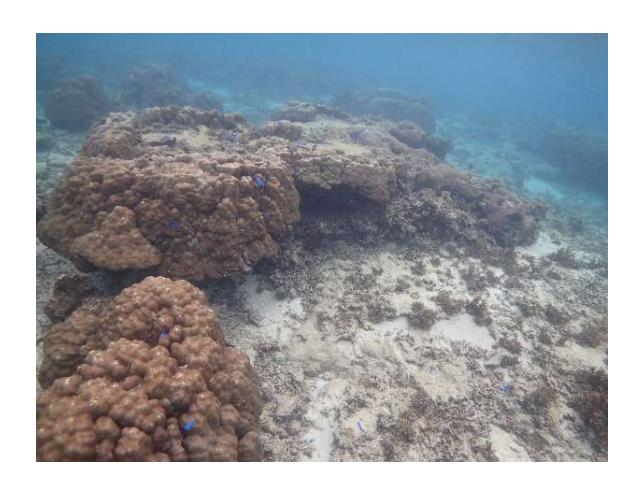

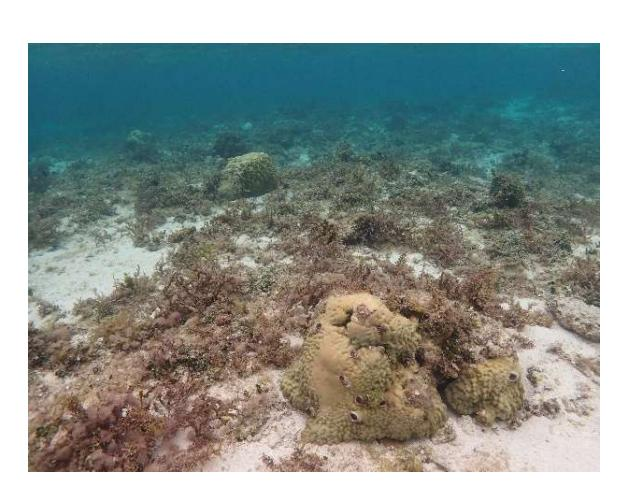

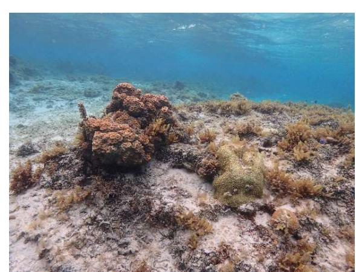

#### 地点 1 大浜小前

調査日:令和7年1月18日

サンゴ類生育型:Ⅳ(特定類優占型)

サンゴ類被度:10%未満 昨年のサンゴ類被度:10%未満

ミドリイシ類の新規加入:1 群体未満

貝類食痕ランク:1

写真:塊状ハマサンゴ類などが見られる海域の状況 ※大型の塊状ハマサンゴ類が優勢であり、ウミヅタ類も やや多い。ミドリイシ類は少ない。ホンダワラ類が多い。 なお、生育型の変化は、ソフトコーラルを被度対象から

除外したためである。

## 地点 2 宮良川河口

調査日:令和7年1月18日 サンゴ類生育型:V(多種混成型)

サンゴ類被度:30% 昨年のサンゴ類被度:30% 計 引 が類の新規加入:8 群体

貝類食痕ランク:1

写真: 多種が混成する水路部のサンゴ

※水路に面した斜面は、大型のハマサンゴ類や、アオサンゴなどの多種混成で被度が高い。リーフフラットは被度が低いがミドリイシ類の小型群体が多く新規加入も多い。夏季白化由来の死サンゴがあり、調査時も白化して

いるサンゴが少しある。

## 地点 3 宮良集落前

調査日:令和7年1月18日 サンゴ類生育型:V(多種混成型)

サンゴ類被度: 5%未満 昨年のサンゴ類被度:5%未満 ミドリイシ類の新規加入:0群体

貝類食痕ランク:1

写真:サンゴが少なく海藻が多い海域の状況

※ハマサンゴ類やキクメイシ類、コモンサンゴ類などが

多少見られる。ホンダワラ類が多い。

#### 地点 4 白保集落前

調査日:令和7年1月18日 サンゴ類生育型:V(多種混成型)

サンゴ類被度:5%未満

昨年のサンゴ類被度: 5%未満 ミドリイシ類の新規加入:0群体

貝類食痕ランク:1

写真:サンゴ類が少ない海域の状況

※ハマサンゴ類やキクメイシ類、コモンサンゴ類などの 多種混成で被度は低い。ホンダワラ類など海藻が多い。

夏季白化由来の死サンゴが少しある。

付図 1-1. 各調査地点の海中景観及び概況

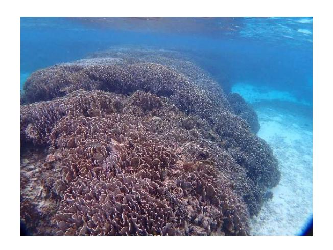

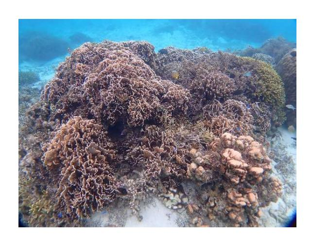

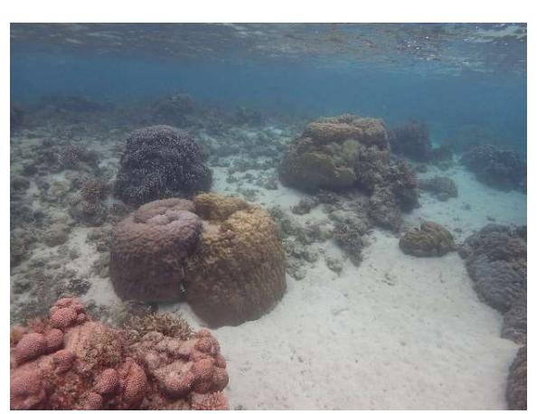

## 地点 5 白保アオサンゴ

調杏日: 令和7年1月18日

サンゴ類生育型:Ⅳ(特定類優占型)

サンゴ類被度:60% 昨年のサンゴ類被度:60% ミドリイシ類の新規加入:1 群体未満

貝類食痕ランク:2 写真:アオサンゴ群落

※高被度のアオサンゴ群落。ユビエダハマサンゴもやや 多い。アオサンゴやミドリイシ類などに夏季の白化由来 の死亡が見られる。コモンサンゴ類に貝類の食痕が少し

見られる。

## 地点6 白保第一ポール

調査日:令和7年1月18日

サンゴ類生育型:Ⅳ(特定類優占型)

サンゴ類被度:60% 昨年のサンゴ類被度:60% ミト・リク類の新規加入:1群体未満

貝類食痕ランク:1

写真:ユビエダハマサンゴの群落

※ユビエダハマサンゴの群落で、アオサンゴもやや多く 見られる。ミドリイシ類など夏季白化由来の死サンゴが

少しある。

## 地点 7 白保~轟川

調査日:令和7年1月18日 サンゴ類生育型:V(多種混成型)

サンゴ類被度:40% 昨年のサンゴ類被:40% ミドリイシ類の新規加入:0群体

貝類食痕ランク:2

写真:シコロサンゴ類などのサンゴ類

※シコロサンゴ類とハマサンゴ類、コモンサンゴ類などを主体とする多種混成である。コモンサンゴ類に貝類の

食痕が少し見られる。

#### 地点8轟川河口

調査日:令和7年1月18日

サンゴ類生育型: IV (特定類優占型)

サンゴ類被度:40% 昨年のサンゴ類被度:40% ミドリイシ類の新規加入:1群体未満

貝類食痕ランク:1

写真:塊状ハマサンゴ類主体のサンゴ群集

※大小様々な大きさの塊状ハマサンゴ類を主体とするサンゴ群集である。小型のミドリイシ類やシコロサンゴ類

もやや多い。ホンダワラ類などの海藻が多い。

付図 1-2. 各調査地点の海中景観及び概況

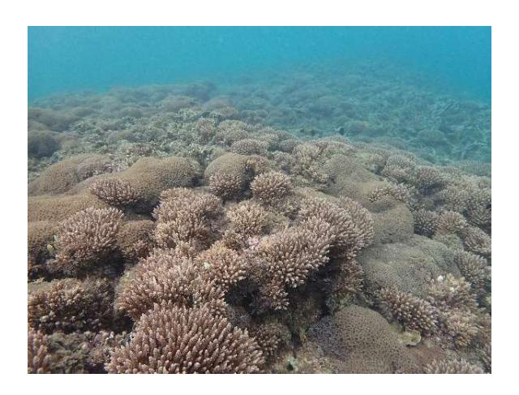

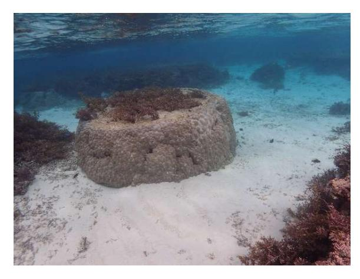

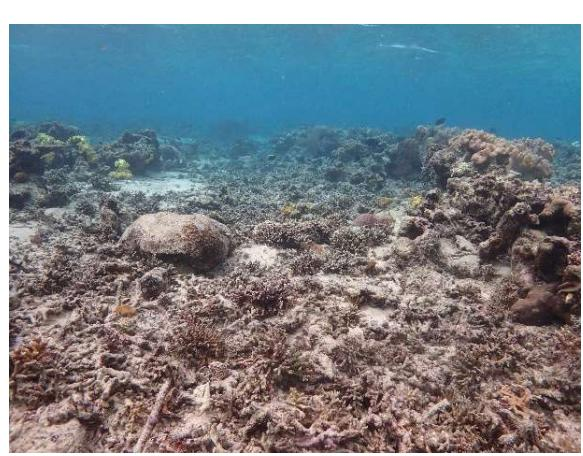

## 地点 9 モリヤマグチ

調査日:令和7年1月8日

サンゴ類生育型: Ⅱ (卓状ミドリイシ優占型)

サンゴ類被度:10% 昨年のサンゴ類被度:20% ミトリ が類の新規加入:1 群体

貝類食痕ランク:1

写真:優勢な散房花状ミドリイシ類

※リーフフラットから水路にかけて小型の散房花状ミドリイシ類が多く見られ、ウミヅタ類もやや多い。被度減少はソフトコーラルを被度対象から除外したためであ

る。

## 地点. 10 スムジグチ

調査日:令和7年1月8日

サンゴ類生育型: V (多種混成型)

サンゴ類被度:10% 昨年のサンゴ類被度:10% ミト・リジ類の新規加入:1 群体未満

貝類食痕ランク:1

写真:塊状ハマサンゴ類などが見られる海域の状況 ※大型の塊状ハマサンゴ類がやや多く、ユビエダハマサンゴやキクメイシ類もやや多い。ミドリイシ類は小型の

群体がやや多く見られる。

## 地点 11 採石場前

調査日:令和7年1月8日

サンゴ類生育型: V (多種混成型)

サンゴ類被度:1%未満

昨年のサンゴ類被度: 1%未満 ミドリイシ類の新規加入:1群体未満

貝類食痕ランク:1

写真:ハマサンゴ類の大型群体

※ハマサンゴ類やキクメイシ類などがわずかに見られる 程度である。岩盤上にホンダワラ類などが繁茂している。

## 地点 12 通路川南

調査日:令和7年1月8日

サンゴ類生育型:V(多種混成型)

サンゴ類被度:20% 昨年のサンゴ類被度:30% ミドリイン類の新規加入:1群体

貝類食痕ランク:1

写真:多種が混成する海域の状況

※枝状コモンサンゴ類などを主体とする多種混成。前年まで優占していたソフトコーラルは白化しているものが多く被度も減少している。なお、被度減少はソフトを被

度対象から除外したことも一因である。

付図 1-3. 各調査地点の海中景観及び概況

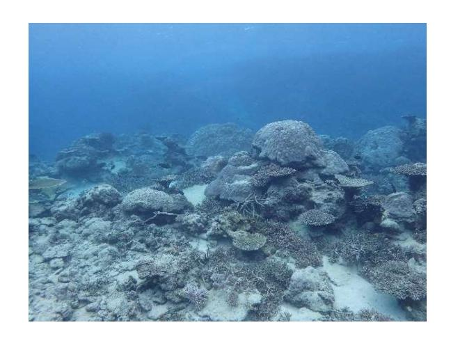

## 地点 13 通路川水路北

調査日:令和7年1月8日

サンゴ類生育型: V (多種混成型)

サンゴ類被度:10% 昨年のサンゴ類被度:10% ミドリジ類の新規加入:3群体

貝類食痕ランク:1

写真:水路部の塊状ハマサンゴ類など

※リーフフラットはキクメイシ類が多少見られる程度。 水路部は大型の塊状ハマサンゴ類やミドリイシ類を主体

とする多種混成である。

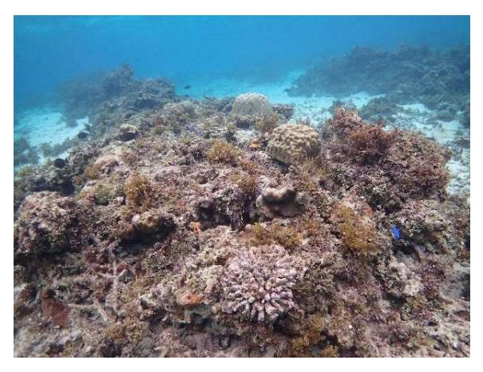

## 地点 14 野原崎

調査日:令和7年1月8日

サンゴ類生育型: V (多種混成型)

サンゴ類被度:10%未満 昨年のサンゴ類被度:10%未満 ミドリイシ類の新規加入:1群体未満

貝類食痕ランク:1

写真:ハマサンゴ類などが少し見られる状況

※ハマサンゴ類やキクメイシ類などの多種混成型である。ミドリイシ類は少ない。岩盤上にホンダワラ類が多

い。

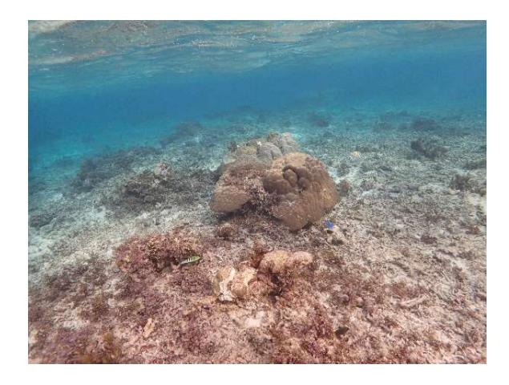

## 地点 15 伊野田漁港前

調査日:令和7年1月8日

サンゴ類生育型: V (多種混成型)

サンゴ類被度: 1%未満 昨年のサンゴ類被度:1%未満 ミドリイク類の新規加入:0群体

貝類食痕ランク:1

写真:ハマサンゴ類などが少し見られる海域の状況 ※平坦な礫質底の礁池。大型の塊状ハマサンゴ類などが 少し見られる程度である。ミドリイシ類は小型の群体が

少し見られる程度である。

#### 地点 16 大野牧場前

調査日:令和7年1月8日

サンゴ類生育型: V (多種混成型)

サンゴ類被度:20%

昨年のサンゴ類被度:10% ミト・リ が類の新規加入:4群体

貝類食痕ランク:1

写真:水路部の塊状ハマサンゴ類

※リーフフラットはサンゴ被度が低いが、小型のミドリイシ類が多く新規加入も多い。水路部は大型の塊状ハマ

サンゴ類が多い。

付図 1-4. 各調査地点の海中景観及び概況

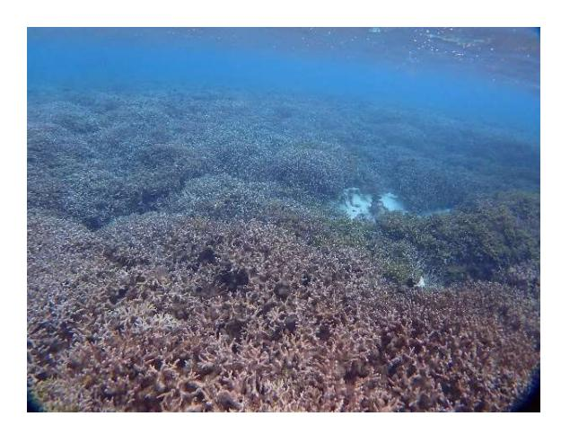

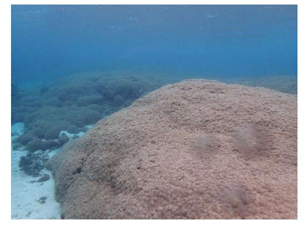

## 地点 17 玉取崎南

調査日:令和7年1月8日

サンゴ類生育型:Ⅳ(特定類優占型)

サンゴ類被度:70% 昨年のサンゴ類被度:70% ミドリイン類の新規加入:1群体

貝類食痕ランク:1

写真:ユビエダハマサンゴ群落

※ユビエダハマサンゴの高被度群落。ミドリイシ類は小型の群体落が少し見られる。ユビエダハマサンゴの枝間

に海藻類がやや多く、基部の死亡が見られた。

## 地点 18 玉取崎東

調査日:令和7年1月8日

サンゴ類生育型: V (多種混成型)

サンゴ類被度:10%未満 昨年のサンゴ類被度:10% ミドリイシ類の新規加入:1 群体

貝類食痕ランク:1

写真:ハマサンゴ類などが見られる海域の状況

※ハマサンゴ類やキクメイシ類、コモンサンゴ類などの 多種混成である。ミドリイシ類は小型の群体や新規加入

が多少見られる。

## 地点 19 伊原間牧場前

調査日:令和7年1月7日

サンゴ類生育型:Ⅳ(特定類優占型)

サンゴ類被度:70%

昨年のサンゴ類被度:70% ミドリイシ類の新規加入:1 群体未満

貝類食痕ランク:2

写真:エダハナガササンゴ群落

※エダハナガササンゴの大群落が広がっている。周辺の 礫質底に枝状コモンサンゴ類の群落が形成されている。 エダハナガササンゴは枝先の死亡が少し見られ、夏季の

白化によるとみられる。

## 地点 20 トムル崎南

調査日:令和7年1月7日

サンゴ類生育型: IV (特定類優占型)

サンゴ類被度:30%

昨年のサンゴ類被度:20%

ミドリイシ類の新規加入:1 群体未満

貝類食痕ランク:2

写真:枝状コモンサンゴ類の群落

※場所により枝状コモンサンゴ類の高被度群落が形成されている。群体の最上部が白化しており、干出によると

見られる。

付図 1-5. 各調査地点の海中景観及び概況

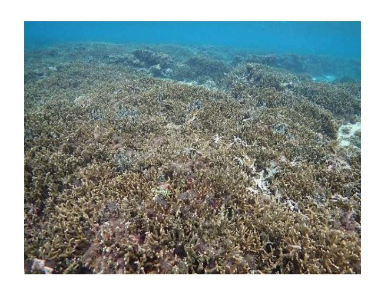

#### 地点 21 トムル崎

調査日: 令和7年1月7日

サンゴ類生育型:Ⅳ(特定類優占型)

サンゴ類被度:40% 昨年のサンゴ類被度:30% ミドリイシ類の新規加入:1群体未満

貝類食痕ランク:1

写真: 枝状コモンサンゴ類の群落

※場所により枝状コモンサンゴ類の高被度群落が形成さ

れている。干出による白化が少し見られる。

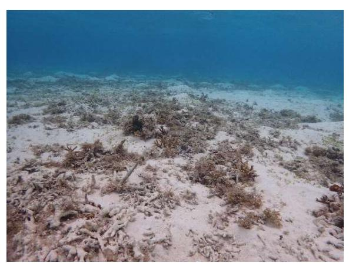

## 地点 22 パラワールド前

調査日:令和7年1月7日

サンゴ類生育型: V (多種混成型)

サンゴ類被度:5%未満 昨年のサンゴ類被度:5%未満 ミト・リイシ類の新規加入:0群体

貝類食痕ランク:1

写真:サンゴ類が少ない海域の状況

※砂礫質底の平坦な礁池に、枝状コモンサンゴ類やハマ

サンゴ類などが少し見られる。

## 地点 23 明石~安良崎

調査日:令和7年1月7日

サンゴ類牛育型: V (多種混成型)

サンゴ類被度:10%未満

昨年のサンゴ類被度:10%未満 計 リ 沙類の新規加入:1 群体

貝類食痕ランク:1

写真:水路部のハマサンゴ類など

※リーフフラットは被度が低い。水路部は大型の塊状ハ マサンゴ類やアナサンゴモドキ類、ミドリイシ類などが

見られる。

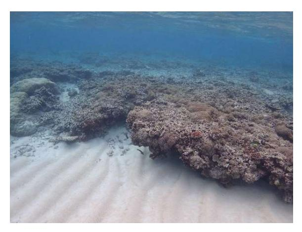

## 地点 24 安良崎南

調査日: 令和7年1月7日

サンゴ類生育型: VI (ソフトコーラル優占型)

サンゴ類被度:5%未満 昨年のサンゴ類被度:30% ミト・リイシ類の新規加入:1群体未満

貝類食痕ランク:1

写真:ウミヅタ類が多い海域の状況

※ウミヅタ類などのソフトコーラルの被度は 10%であ る。場所によりウミヅタ類が多く見られるが、前年より も減少している。サンゴ類はハマサンゴ類やコモンサン ゴ類、キクメイシ類が主体である。被度減少は主にソフ

トを計測対象から除外したためである。

付図 1-6. 各調査地点の海中景観及び概況

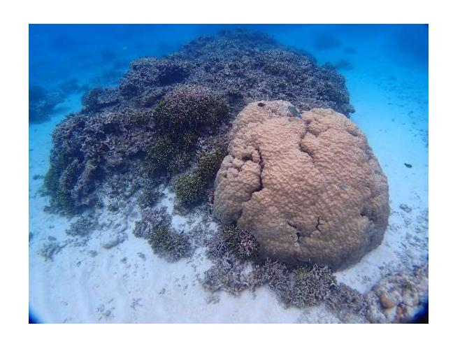

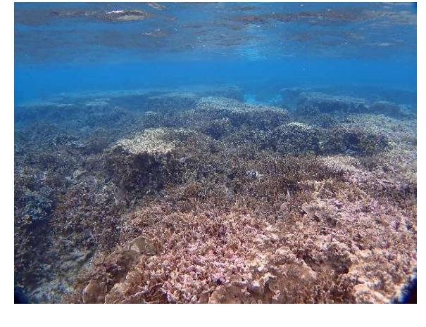

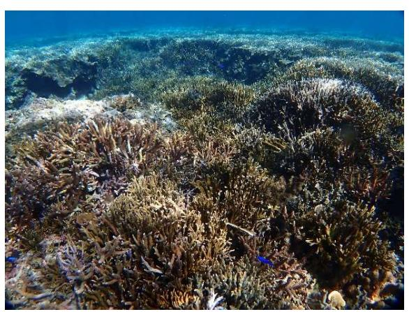

## 地点 25 安良崎

調査日: 令和7年1月7日

サンゴ類生育型:Ⅳ(特定類優占型)

サンゴ類被度:10% 昨年のサンゴ類被度:20% ミドリイン類の新規加入:1群体

貝類食痕ランク:1

写真: 枝状・塊状のハマサンゴ類が多い状況

※ユビエダハマサンゴや大型の塊状ハマサンゴ類を主体とするサンゴ群集。ウミヅタ類もやや多い。ソフトコーラルを被度対象から除外したため、被度と生育型が変化

している。

## 地点 26 安良グチ北

調査日:令和7年1月7日

サンゴ類生育型:V(多種混成型)

サンゴ類被度:5%未満 昨年のサンゴ類被度:5%未満 計リの類の新規加入:6群体

貝類食痕ランク:1

写真:ミドリイシ類新規加入群体

※リーフフラットから水路に面した斜面にかけて、ハマサンゴ類やキクメイシ類などが多少見られる程度であ

る。ミドリイシ類は少ないが新規加入が多い。

## 地点 27 岩崎南

調査日:令和7年1月7日

サンゴ類生育型:Ⅳ(特定類優占型)

サンゴ類被度:80%

昨年のサンゴ類被度:80% ミドリジ類の新規加入:1 群体未満

貝類食痕ランク:2

写真:枝状コモンサンゴ類の高被度群落

※浅い礁原に枝状コモンサンゴ類の高被度群落が形成さ

れている。最上部が干出により白化している。

## 地点 28 岩崎

調査日:令和7年1月5日

サンゴ類生育型: V (多種混成型)

サンゴ類被度:60% 昨年のサンゴ類被度:50% ミドリイシ類の新規加入:1群体未満

貝類食痕ランク:1

写真:リーフフラットのの枝状サンゴ類

※リーフフラットは枝状コモンサンゴ類が多く場所により高被度な群落を形成している。深い場所はユビエダハマサンゴが主体である。群体の最上部が白化しており干

出によると見られる。

付図 1-7. 各調査地点の海中景観及び概況

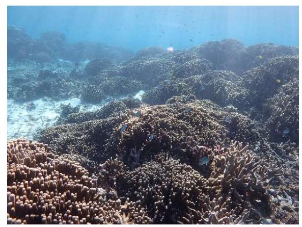

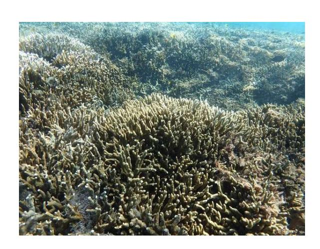

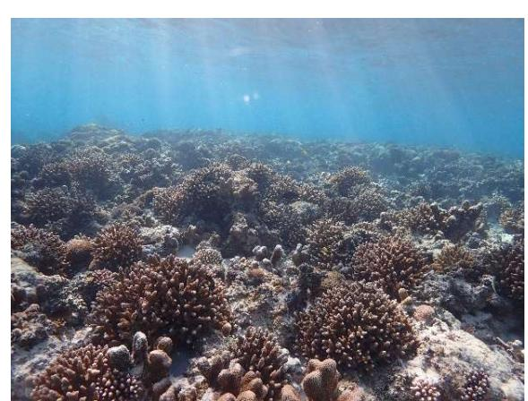

## 地点 29 岩崎~浦崎

調査日:令和7年1月5日

サンゴ類生育型:Ⅳ(特定類優占型)

サンゴ類被度:40% 昨年のサンゴ類被度:40% ミドリイシ類の新規加入:1群体未満

貝類食痕ランク:1

写真:ユビエダハマサンゴの群落

※リーフフラットから礁池にユビエダハマサンゴの群落が見られる。浅い場所は枝状コモンサンゴ類も多い。群体の最上部が白化しており干出によると見られる。

## 地点 30 浦崎沖

調査日:令和7年1月5日

サンゴ類生育型:Ⅳ(特定類優占型)

サンゴ類被度:30% 昨年のサンゴ類被度:20% 計リや類の新規加入:1群体未満

貝類食痕ランク:1

写真: 枝状・葉状コモンサンゴ類

※浅い岩盤上に枝状・葉状コモンサンゴ類の群落が形成されている。群体の最上部が白化しており、干出によると見られる。葉状コモンサンゴに腫瘍が少し見られる。

## 地点 31 浦崎前

調査日:令和7年1月5日

サンゴ類生育型: IV (特定類優占型)

サンゴ類被度:40% 昨年のサンゴ類被度30% ミドリイシ類の新規加入:1 群体未満

貝類食痕ランク:1

写真:枝状コモンサンゴ類群落

※浅い岩盤上に枝状コモンサンゴ類の群落が形成されている。群体の最上部が白化しており、干出によると見ら

れる。枝間に海藻類が多い。

#### 地点 32 平野集落前

調査日:令和7年1月5日

サンゴ類生育型:Ι (枝状ミドリイシ優占型)

サンゴ類被度:20% 昨年のサンゴ類被度:30% 計 引 が類の新規加入:1 群体

貝類食痕ランク:1

写真:優勢な枝状ミドリイシ類

※フトエダミドリイシなどの枝状ミドリイシ類が優勢である。ウミヅタ類も多い。ソフトコーラルを被度対象から除外したため、被度が減少し生育型が変化している。

付図 1-8. 各調査地点の海中景観及び概況

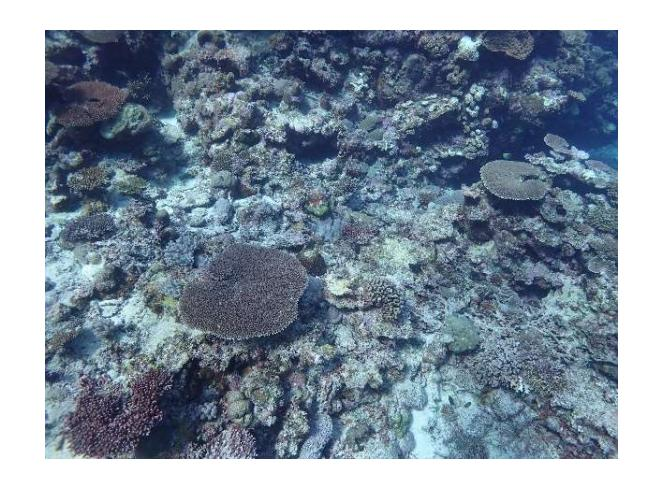

## 地点 33 平久保灯台北

調査日:令和7年1月5日

サンゴ類生育型: V (多種混成型)

サンゴ類被度:20% 昨年のサンゴ類被度:20% ミドリイン類の新規加入:3群体

貝類食痕ランク:1

写真:多種が混成する水路斜面

※リーフフラットは小型のミドリイシ類が多いが被度が 低い。礁斜面はミドリイシ類やハマサンゴ類などの多種

混成である。

## 地点 34 平久保灯台西

調査日:令和7年1月5日

サンゴ類生育型: V (多種混成型)

サンゴ類被度:1%未満 昨年のサンゴ類被度:1%未満

ミドリイシ類の新規加入:1群体未満

貝類食痕ランク:1

写真:サンゴ類が少ない海域の状況

※浅い岩礫底に、ハマサンゴ類やキクメイシ類などがわ

ずかに見られる程度である。

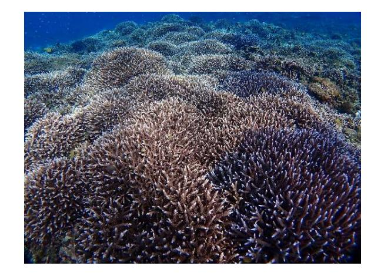

## 地点 35 平久保川北

調査日:令和7年1月5日

サンゴ類生育型:I(枝状ミドリイシ優占型)

サンゴ類被度:30% 昨年のサンゴ類被度:10% ミドリイシ類の新規加入:2群体

貝類食痕ランク:1

写真: 枝状ミドリイシ類の群落

※起伏のある岩盤・砂礫底で、枝状ミドリイシ類が優勢であり、岩盤上は場所により高被度の群落を形成してい

る。

#### 地点 36 平久保集落南

調査日:令和7年1月5日

サンゴ類生育型:I(枝状ミドリイシ優占型)

サンゴ類被度:30% 昨年のサンゴ類被度:20% ミト・リイン類の新規加入:2群体

貝類食痕ランク:2

写真: 枝状ミドリイシ類の群落

※礫質底に枝状ミドリイシ類が優勢であり、場所により 高被度の群落を形成しつつある。場所によりコモンサン

ゴ類もやや多い。

付図 1-9. 各調査地点の海中景観及び概況

## 地点 37 嘉良川前

調査日:令和6年12月25日 サンゴ類生育型:V(多種混成型)

サンゴ類被度:10%未満

昨年のサンゴ類被度:10%未満 ミトリの類の新規加入:3群体

貝類食痕ランク:1

写真:小型のミドリイシ類などが見られる海域状況 ※コモンサンゴ類、キクメイシ類、直径 10 cm大のミドリ イシ類が少し見られる。礫底にコケイバラが繁茂してい

る。

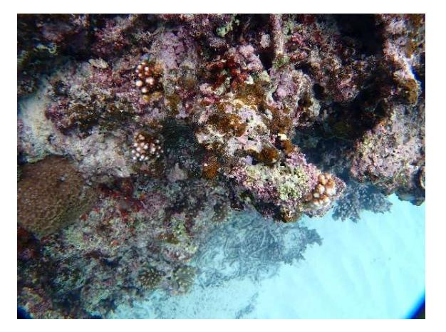

## 地点 38 ダテフ崎北

調査日:令和6年12月25日 サンゴ類生育型:V(多種混成型)

サンゴ類被度:5%未満 昨年のサンゴ類被度:5%未満 ミドリイシ類の新規加入:3群体

貝類食痕ランク:1

写真:岩盤上の新規加入群体

※縁溝縁脚の礁原部でハナヤサイ類、キクメイシ類、ソフトコーラル類が少し見られる程度。新規加入がやや多

く見られる。

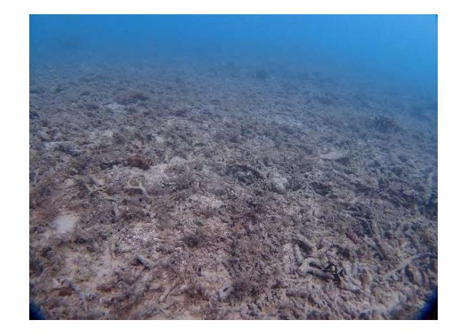

## 地点39 ダテフ崎南

調査日:令和6年12月25日 サンゴ類生育型: V (多種混成型)

サンゴ類被度:5%未満

昨年のサンゴ類被度:5%未満 ミドリジ類の新規加入:1群体未満

貝類食痕ランク:1

写真:サンゴ類が少ない海域の状況

※起伏のない砂礫底でサンゴ類は少ない。小型のミドリイシ類、枝コモンサンゴ類、アナサンゴなどが少し見ら

れる。

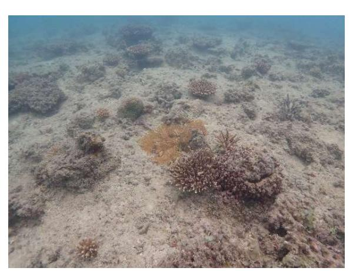

## 地点 40 野底石崎

調査日:令和6年12月5日

サンゴ類生育型: V (多種混成型) サンゴ類被度:10%未満

昨年のサンゴ類被度:5%未満 ミドリイシ類の新規加入:2群体

貝類食痕ランク:1

写真:ミドリイシ類などが見られる海域状況

※ミドリイシ類やキクメイシ類などの多種混成である。 ミドリイシ類は小型の群体が多い。ホンダワラ類などの

海藻が多い。

付図 1-10. 各調査地点の海中景観及び概況

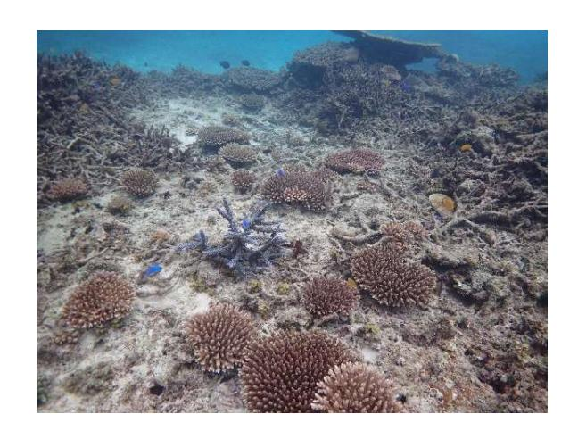

## 地点 41 栄集落前

調査日: 令和6年12月5日

サンゴ類生育型: 皿(枝状・卓状ミドリイシ混成型)

サンゴ類被度:20% 昨年のサンゴ類被度:10% ミトリ が類の新規加入:3 群体

貝類食痕ランク:2

写真:ミドリイシ類などが見られる海域の状況

※岩盤上に小型の枝状・散房花状ミドリイシ類群体が多

く見られる。

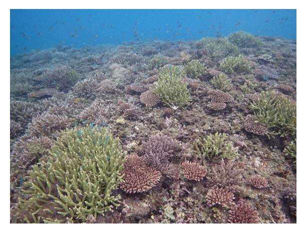

## 地点 42 野底集落前

調査日:令和6年12月5日

サンゴ類生育型: 皿(枝状・卓状ミドリイシ混成型)

サンゴ類被度: 30% 昨年のサンゴ類被度: 20% ミトリ が類の新規加入: 4 群体

貝類食痕ランク:1

写真:浅場のミドリイシ類

※やや深い場所はミドリイシ類やユビエダハマサンゴ、ウミヅタ類などが多く、浅い場所はミドリイシ類が多い。

ミドリイシ類は小型の群体が多い。

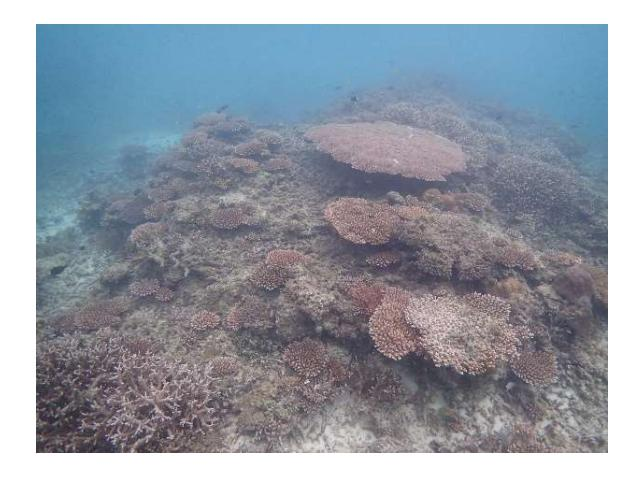

## 地点 43 野底崎

調査日:令和6年12月5日

サンゴ類生育型:Ⅲ(枝状・卓状ミドリイシ混成型)

サンゴ類被度:40% 昨年のサンゴ類被度:40% ミト・リイシ類の新規加入:2群体

貝類食痕ランク:2

写真:ミドリイシ類が多い海域の状況

※岩盤上に枝状や散房花状のミドリイシ類が多く、大型の卓状ミドリイシ類も見られる。局所的にウミヅタ類が

優占している。

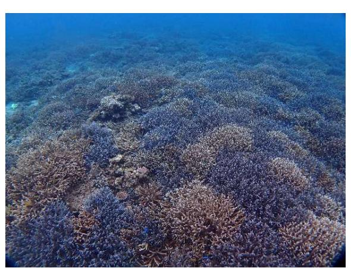

## 地点 44 伊土名北

調査日:令和6年12月5日

サンゴ類生育型:Ι (枝状ミドリイシ優占型)

サンゴ類被度:70% 昨年のサンゴ類被度:40% ミドリイシ類の新規加入:5群体

貝類食痕ランク:2

写真: 枝状ミドリイシ類群落

※浅い岩盤上に枝状ミドリイシ類が高被度に生息しており、新規加入も多い。場所によりコモンサンゴ類もやや

多い。貝類の食痕が散見される。

付図 1-11. 各調査地点の海中景観及び概況

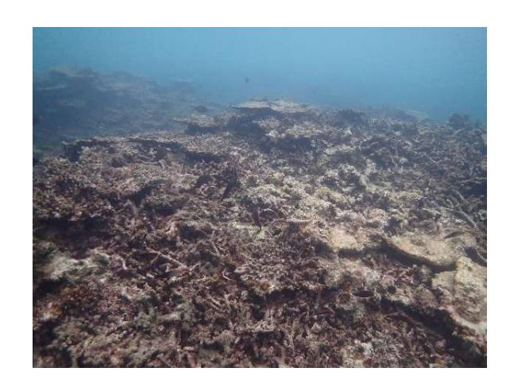

## 地点 45 伊土名南

調査日:令和6年12月5日 サンゴ類生育型:V(多種混成型)

サンゴ類被度:5%未満 昨年のサンゴ類被度:5%未満 計 引 が類の新規加入:2群体

貝類食痕ランク:1

写真:サンゴ類の少ないリーフフラットの状況

※リーフフラットはサンゴはほとんど見当たらない。礁 斜面はハマサンゴ類やキクメイシ類などが多少見られ、

新規加入も少しある。

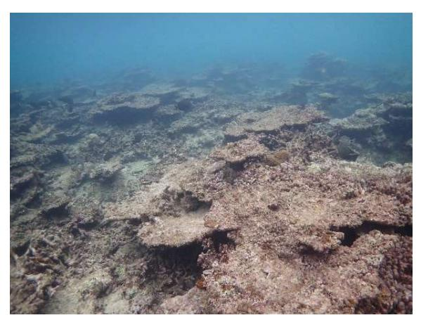

## 地点 46 浦底湾口北

調査日:令和6年12月5日 サンゴ類生育型:V(多種混成型)

サンゴ類被度:5%未満 昨年のサンゴ類被度:5%未満 ミドリイシ類の新規加入:7群体

貝類食痕ランク:1

写真:サンゴ類の少ない海域の状況

※リーフフラットから礁斜面にかけてサンゴは少なく、 キクメイシ類やコモンサンゴ類、ハマサンゴ類などが少

し見られる程度である。新規加入が多い。

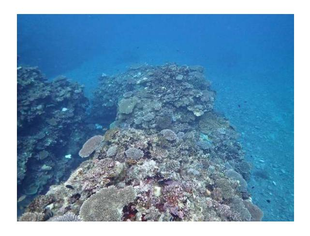

## 地点 47 浦底湾口西

調査日:令和6年12月5日 サンゴ類生育型: V (多種混成型)

サンゴ類被度:10%

昨年のサンゴ類被度:10%未満 ミドリイシ類の新規加入:4群体

貝類食痕ランク:1

写真:やや深い場所のサンゴ類

※浅い場所はサンゴが少ない。やや深い場所にミドリイシ類やハマサンゴ類、キクメイシ類などが見られる。新

規加入はやや多い。

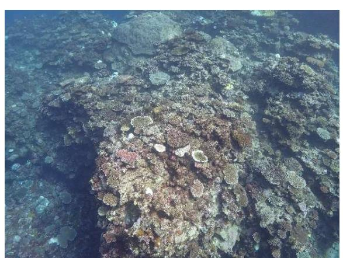

#### 地点 48 富野集落前

調査日:令和6年10月18日 サンゴ類生育型:V(多種混成型)

サンゴ類被度:20% 昨年のサンゴ類被度:10% ミドリジ類の新規加入:9群体

貝類食痕ランク:1

写真:ミドリイシ類などが見られる海域の状況

※リーフフラットはサンゴがほとんどみらない。礁斜面はミドリイシ類やキクメイシ類、ハマサンゴ類などの多種混成である。浅い場所に新規加入が非常に多い。白化

したサンゴがあるが、死亡は少ない。

付図 1-12. 各調査地点の海中景観及び概況

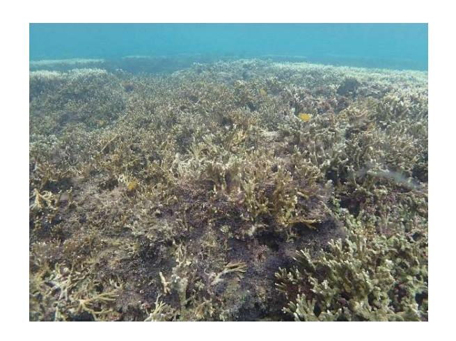

## 地点 49 米原キャンプ場

調査日:令和7年1月5日

サンゴ類生育型:Ⅳ(特定類優占型)

サンゴ類被度:50% 昨年のサンゴ類被度:30% ミト・リイン類の新規加入:2群体

貝類食痕ランク:1

写真: 枝状コモンサンゴ類の群落

※浅い礁池に枝状コモンサンゴ類の群落が形成されている。塊状ハマサンゴ類も多い。群体の最上部が白化して

おり干出によると見られる。

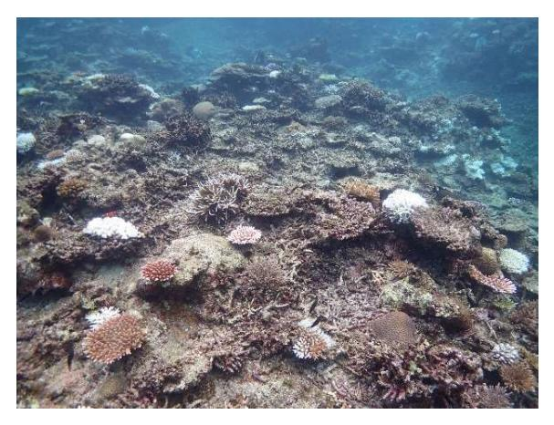

## 地点 50 ヤマバレー前

調査日:令和6年10月18日 サンゴ類生育型:V(多種混成型)

サンゴ類被度:30% 昨年のサンゴ類被度:20% ミドリイシ類の新規加入:5群体

貝類食痕ランク:1

写真:ミドリイシ類などが見られる海域の状況

※リーフフラットはキクメイシ類が多い。深みは小型の ミドリイシ類が多く、一部でアナサンゴモドキ類が多い。 ミドリイシ類やハナヤサイサンゴ類に白化があり、一部

死亡している。

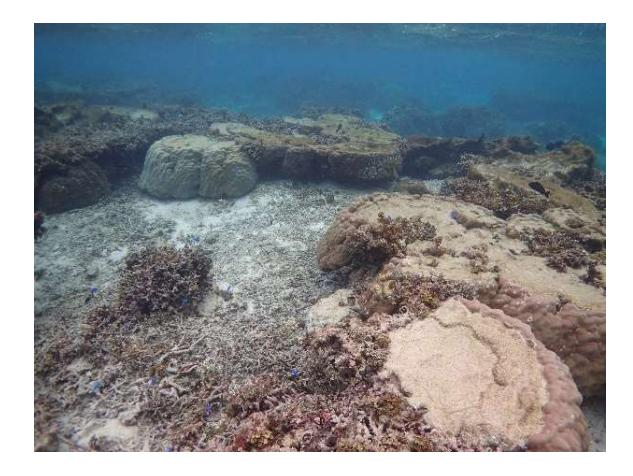

## 地点 51 ヤマバレー西

調査日:令和6年12月6日 サンゴ類生育型: V (多種混成型)

サンゴ類被度:30%

昨年のサンゴ類被度:20% ミドリイシ類の新規加入:1 群体

貝類食痕ランク:1

写真:塊状ハマサンゴ類などが見られる海域の状況 ※塊状ハマサンゴ類の大型のマイクロアトールが多い。 コモンサンゴ類やシコロサンゴ類もやや多い。ごく浅い

場所のサンゴに白化による死亡が見られる。

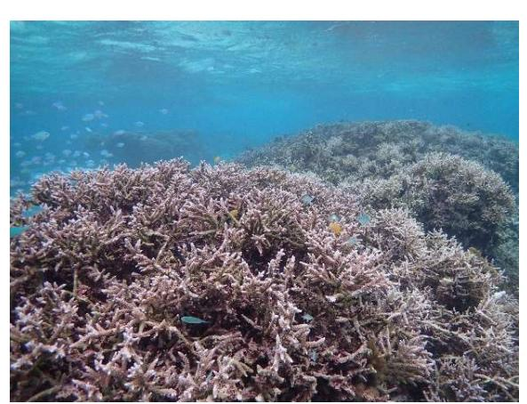

## 地点 52 川平小島東

調査日:令和6年12月6日 サンゴ類生育型:V(多種混成型)

サンゴ類被度:30% 昨年のサンゴ類被度:20% ミト・リイン類の新規加入:1群体

貝類食痕ランク:2

写真:優勢な枝状ミドリイシ類

※枝状コモンサンゴ類とミドリイシ類を主体とする多種

混成である。ミドリイシ類は小型の群体が多い。

付図 1-13. 各調査地点の海中景観及び概況

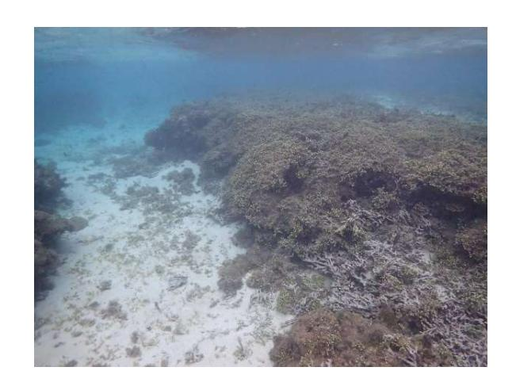

## 地点 53 川平小島北

調査日:令和6年12月6日

サンゴ類生育型: V (多種混成型)

サンゴ類被度:30% 昨年のサンゴ類被度:40% ミト リイシ類の新規加入:2群体

貝類食痕ランク:1

写真:ユビエダハマサンゴの群落

※ユビエダハマサンゴと枝状ミドリイシ類を主体とする サンゴ群集である。ユビエダハマサンゴの枝間に海藻類 が密生し下部が死滅し、相対的にミドリイシ類の割合が

増えたため生育型が変化。

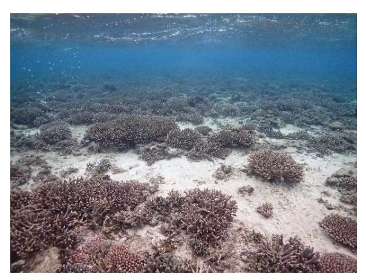

## 地点 54 川平水路東

調査日:令和6年12月6日

サンゴ類生育型: I (枝状ミドリイシ優占型)

サンゴ類被度:40% 昨年のサンゴ類被度:20% 計 リ 分類の新規加入:2群体

貝類食痕ランク:1

写真: リーフフラットの枝状ミドリイシ類

※リーフフラットは枝状ミドリイシ類、水路付近は散房 花状ミドリイシ類が多く、リーフフラットは場所により

高被度である。

## 地点 55 川平水路

調査日:令和6年12月6日 サンゴ類生育型: V (多種混成型)

サンゴ類被度:40% 昨年のサンゴ類被度:20% ミト リイシ類の新規加入:3群体

目類食痕ランク:1

写真:コモンサンゴ類とミドリイシ類のサンゴ群集 ※リーフフラットはミドリイシ類とコモンサンゴ類の混 成であり、水路付近はミドリイシ類が主体である。ミド

リイシ類は小型の群体が多い。

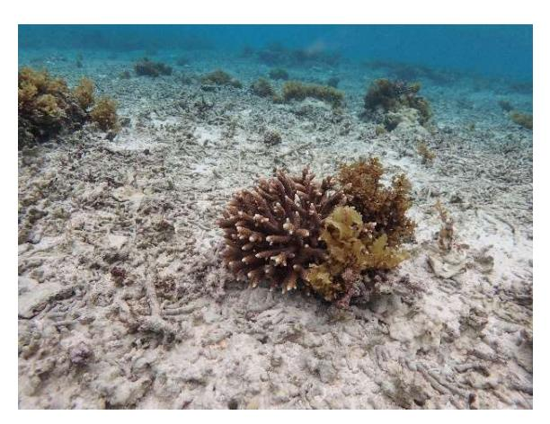

## 地点 56 川平水路北西

調査日:令和6年12月6日 サンゴ類生育型: V (多種混成型)

サンゴ類被度:1%未満 昨年のサンゴ類被度:1%未満

ミト・リイシ類の新規加入:1群体未満

貝類食痕ランク:1

写真:小型のサンゴがわずかに見られる海域状況 ※ごく浅い礫質底でサンゴ被度は低く、ハマサンゴ類や キクメイシ類、ミドリイシ類などがわずかに見られる。

近くの岩の下にオニヒトデが確認された。

付図 1-14. 各調査地点の海中景観及び概況

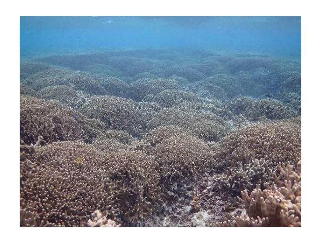

## 地点 57 川平~石崎

調査日:令和6年12月6日

サンゴ類生育型:Ⅳ(特定類優占型)

サンゴ類被度:50% 昨年のサンゴ類被度:50% ミト・リイン類の新規加入:2群体

貝類食痕ランク:1

写真:ユビエダハマサンゴ群落

※ユビエダハマサンゴが場所により高被度である。ミド リイシ類は小型の群体がやや多く見られる。ミドリイシ

類に白化による死亡が見られる。

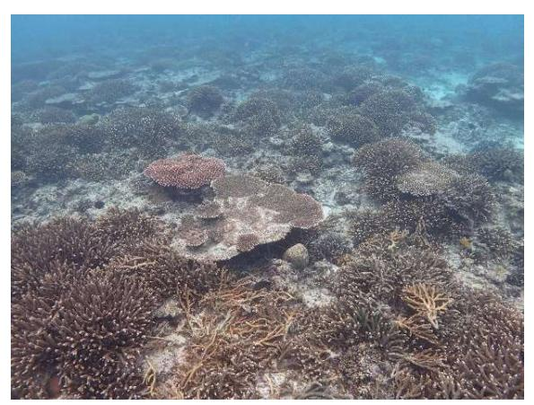

## 地点 58 クラフ メット 前

調査日:令和6年12月6日

サンゴ類生育型: 皿(枝状・卓状ミドリイシ混成型)

サンゴ類被度:40%

昨年のサンゴ類被度:20% ミドリや類の新規加入:3群体

貝類食痕ランク:1

写真: リーフフラットのミドリイシ類

※リーフフラットは枝状・散房花状ミドリイシ類が多く、 やや深い場所は枝状ミドリイシ類が多い。大型の卓状ミ

ドリイシ類も少しある。

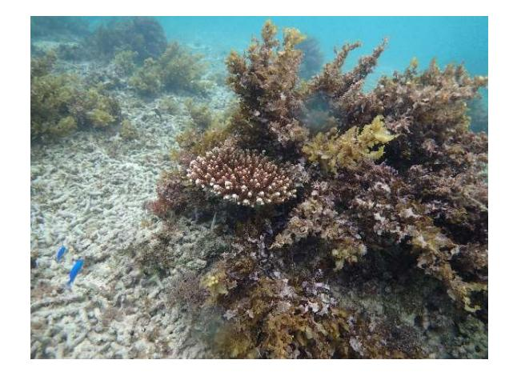

#### 地点 59 川平石崎北

調査日:令和6年12月6日 サンゴ類生育型:V(多種混成型)

サンゴ類被度:1%未満 昨年のサンゴ類被度:1%未満 ミドリイシ類の新規加入:0群体

貝類食痕ランク:1

写真:サンゴ類が少ない海域の状況

※岩盤・礫質底にホンダワラ類などが繁茂している。サンゴ類はキクメイシ類やハマサンゴ類などがわずかに見

られる程度である。

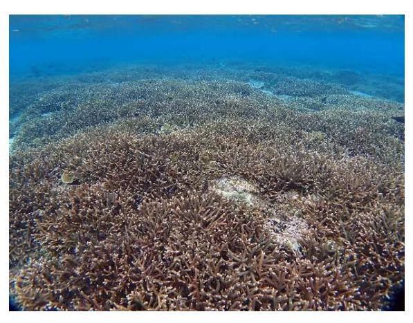

#### 地点 60 川平石崎南

調査日:令和6年12月11日

サンゴ類生育型:Ι (枝状ミドリイシ優占型)

サンゴ類被度:50% 昨年のサンゴ類被度:30% ミドリジ類の新規加入:5群体

貝類食痕ランク:1

写真: 枝状ミドリイシ類の群落

※岩の周囲に枝状ミドリイシ類の高被度群落が形成されており、場所によっては葉状・被覆状のコモンサンゴ類

が多い。コモンサンゴ類に腫瘍が少し見られる。

付図 1-15. 各調査地点の海中景観及び概況

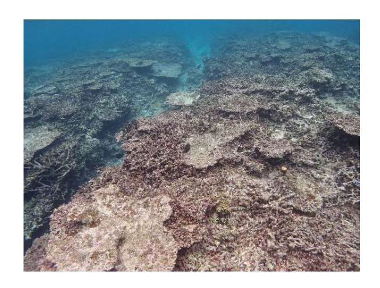

## 地点61 底地ビーチ沖

調査日:令和6年12月11日 サンゴ類生育型:V(多種混成型)

サンゴ類生育型: V (多種混成型) サンゴ類被度:1%未満

昨年のサンゴ類被度:1%未満 ミドリイシ類の新規加入:1群体

貝類食痕ランク:1

写真:サンゴ類がほとんど見当たらない海域の状況 ※リーフフラットから礁斜面にかけてハマサンゴ類やキ クメイシ類などが少し見られる程度である。ミドリイシ

類は見当たらないが新規加入が多少ある。

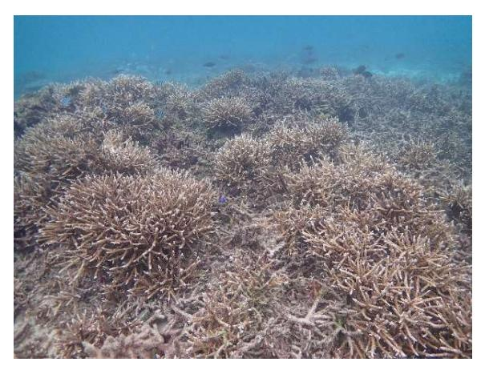

## 地点 62 崎枝湾内

調査日: 令和6年12月11日

サンゴ類生育型: I (枝状ミドリイシ優占型)

サンゴ類被度:20%

昨年のサンゴ類被度:10%未満 ミドリイシ類の新規加入:1 群体未満

貝類食痕ランク:1

写真: 枝状ミドリイシ類群落

※枝状ミドリイシ類の群体が多く所々に群落を形成している。場所により枝状アナサンゴモドキ類や枝状コモン

サンゴ類が多い。

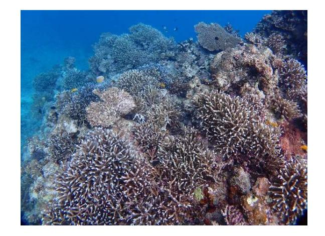

## 地点 63 崎枝湾口

調査日:令和6年12月11日 サンゴ類生育型: V (多種混成型)

サンゴ類被度:20%

昨年のサンゴ類被度:10%未満 ミドリイシ類の新規加入:8群体

貝類食痕ランク:1

写真:礁斜面のミドリイシ類

※リーフフラットは被度が低いが新規加入が多い。礁斜面はミドリイシ類やハマサンゴ類が多く、やや深い場所

は被度が高い

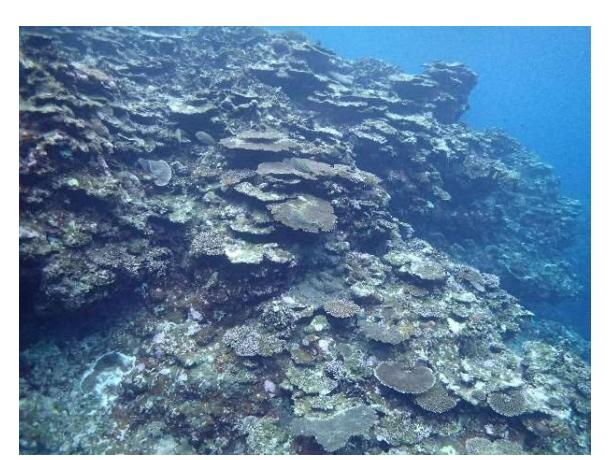

#### 地点64 崎枝~御神

調査日:令和6年12月11日 サンゴ類生育型:V(多種混成型)

サンゴ類被度:10%

昨年のサンゴ類被度:10%未満 ミドリイシ類の新規加入:7群体

貝類食痕ランク:1

写真: 礁斜面の卓状ミドリイシ類

※リーフフラットは被度が低い。礁斜面はミドリイシ類やハナヤサイサンゴ類、キクメイシ類などの多種混成で、やや深い場所は中サイズの卓状ミドリイシ類が見られ

る。新規加入が多い。

付図 1-16. 各調査地点の海中景観及び概況

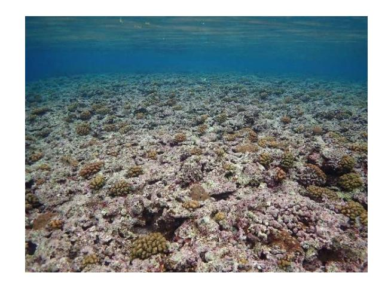

## 地点 65 御神崎

調査日:令和6年12月11日 サンゴ類生育型:V(多種混成型)

サンゴ類被度:10%

昨年のサンゴ類被度:10%未満 ミドリイシ類の新規加入:5群体

貝類食痕ランク:1

写真:浅い場所のハナヤサイサンゴ類

※リーフフラットは小型のハナヤサイサンゴ類が非常に 多い。礁斜面は被覆状のコモンサンゴ類やキクメイシ類 などの多種混成である。ミドリイシ類はほとんど見当た

らないが、新規加入は多い。

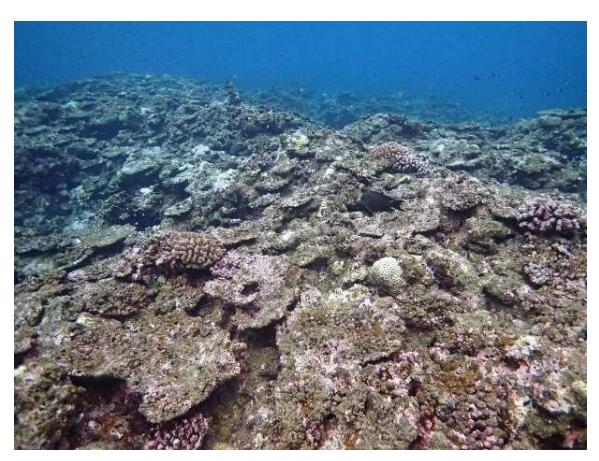

## 地点 66 御神~屋良部

調査日:令和6年12月11日 サンゴ類生育型:V(多種混成型)

サンゴ類被度:5%未満 昨年のサンゴ類被度:5%未満 ミトリの類の新規加入:2群体

貝類食痕ランク:1

写真: 礁斜面のハナヤサイサンゴ類など

※リーフフラットから礁斜面にかけて、キクメイシ類やコモンサンゴ類、ハナヤサイサンゴ類などが少し見られる程度である。ミドリイシ類はほとんど見当たらないが、

新規加入は多少ある。

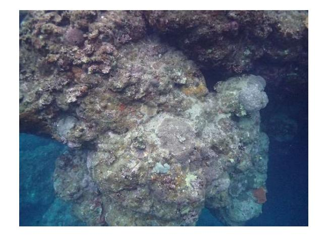

## 地点 67 屋良部崎北

調査日:令和6年12月11日 サンゴ類生育型:V(多種混成型)

サンゴ類被度:10%

昨年のサンゴ類被度:10% 計 リイシ類の新規加入:4群体

貝類食痕ランク:1 写真: 礁斜面のサンゴ類

※リーフフラットは被度が低い。礁斜面はコモンサンゴ類やアナサンゴモドキ類、ハマサンゴ類などの多種混成である。ミドリイシ類は小型の群体が多少見られる。一

部のキクメイシ類などに白化が見られる。

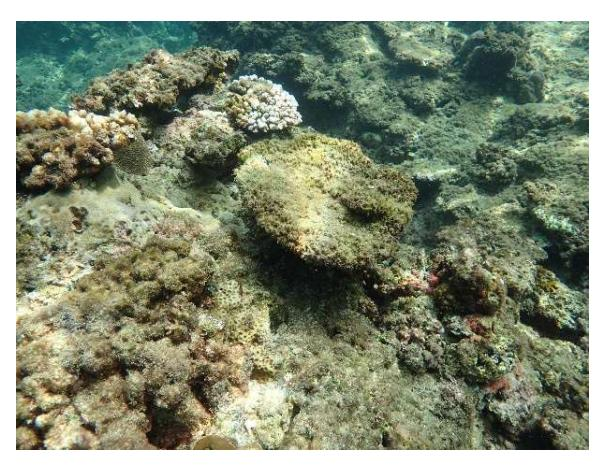

#### 地点 68 屋良部崎南

調査日:令和6年10月17日 サンゴ類生育型:V(多種混成型)

サンゴ類被度:10%未満 昨年のサンゴ類被度:10% ミトリ が類の新規加入:2 群体

貝類食痕ランク:1

写真:白化で死亡したミドリイシ類

※ミドリイシ類やキクメイシ類を主体とする多種混成で 被度が低い。ミドリイシ類は白化によると見られる死亡 が多い。調査時点ではソフトコーラルが白化しているが、

造礁サンゴはほとんど白化していない。

付図 1-17. 各調査地点の海中景観及び概況

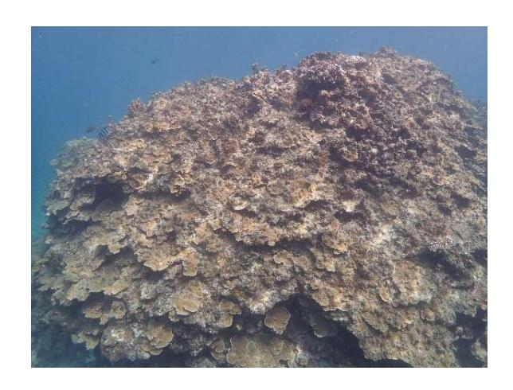

## 地点 69 屋良部~大崎

調査日: 令和6年10月17日

サンゴ類生育型:IV (特定類優占型)

サンゴ類被度:20%

昨年のサンゴ類被度:30% まずりが類の新規加入:3群体

貝類食痕ランク:1

写真: 死亡部が多いパラオハマサンゴ

※岩盤上にパラオハマサンゴが優占している。比較的新 しい死亡部があり白化によるとみられる。ミドリイシ類 は小型の群体がやや多く見られる。オニヒトデ1個体と

テルピオスが見られた。

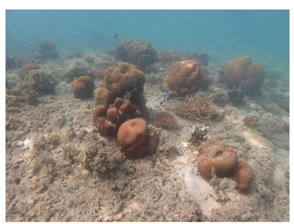

## 地点 70 名蔵保護水面

調査日:令和6年10月17日 サンゴ類生育型:V(多種混成型)

サンゴ類被度:20%

昨年のサンゴ類被度:10% 計 別 が 類の 新規加入:1 群体未満

貝類食痕ランク:1

写真: キクメイシ類などの多種混成である

※ミドリイシ類や塊状ハマサンゴ類、キクメイシ類を主体とした多種混成である。ミドリイシ類は小型の群体が

多い。白化による死亡が少し見られる。

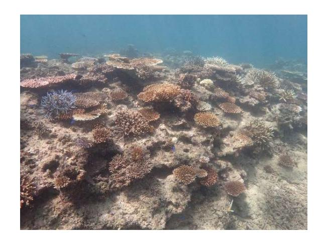

## 地点 71 富崎小島前

調査日: 令和6年10月17日

サンゴ類生育型:皿(枝状・卓状ミドリイシ混成型)

サンゴ類被度:20%

昨年のサンゴ類被度:10%未満 ミドリイシ類の新規加入:7群体

貝類食痕ランク:1

写真:ミドリイシ類が多い海域の状況

※全体に小型の卓状・枝状ミドリイシ類が多い。やや白 化気味の群体が多いが死亡は少ない。場所により新規加

入が非常に多い。

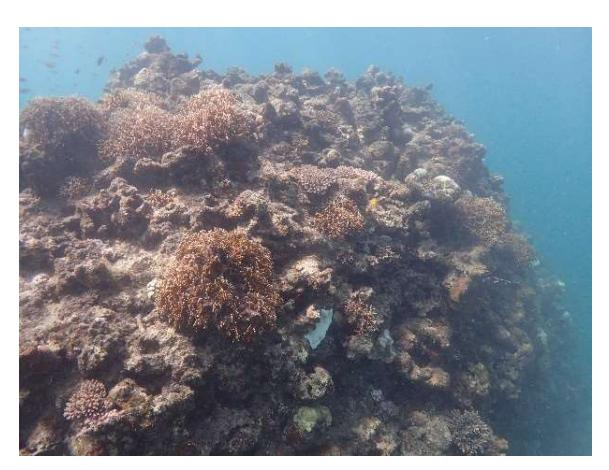

## 地点 72 観音崎

調査日:令和6年10月17日 サンゴ類生育型: V(多種混成型)

サンゴ類被度:10%

昨年のサンゴ類被度:10%未満 ミドリイシ類の新規加入:5群体

貝類食痕ランク:1

写真: 多種が混成する海域の状況

※リーフフラットはミドリイシ類の小型の群体が多少見られる程度である。礁斜面はキクメイシ類やハマサンゴ類、アナサンゴモドキ類などが多い。キクメイシ類など

に白化が見られるが死亡は少ない。

付図 1-18. 各調査地点の海中景観及び概況

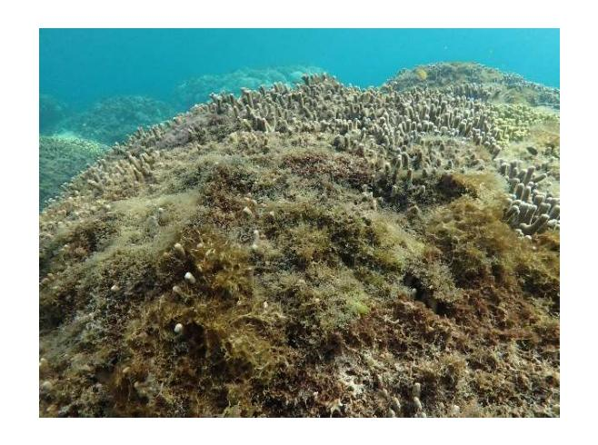

## 地点 73 真栄甲海岸前

調査日: 令和6年10月17日

サンゴ類生育型:Ⅳ(特定類優占型)

サンゴ類被度:60% 昨年のサンゴ類被度:70% ミドリイシ類の新規加入:1群体未満

貝類食痕ランク:1

写真:海藻に被覆されたユビエダハマサンゴ ※ユビエダハマサンゴ群落上にマット状の藻類が多く、 所により厚く被覆してサンゴが死亡している。全容は分 からないがサンゴ被度が低下していると見られる。白化

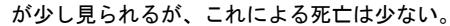

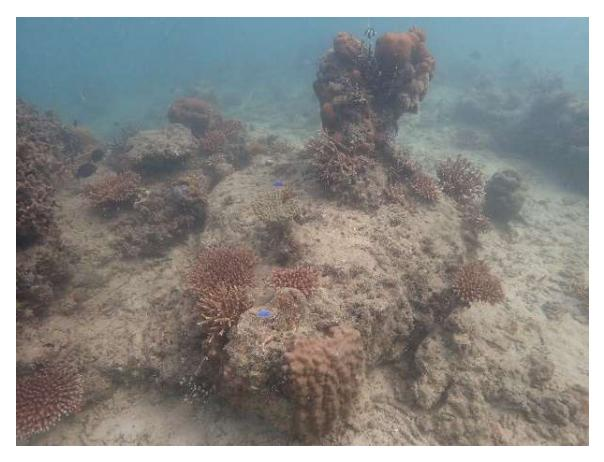

## 地点 74 赤崎

調査日:令和6年10月17日 サンゴ類生育型:V(多種混成型)

サンゴ類被度:20% 昨年のサンゴ類被度:20% ミドリイン類の新規加入:2 群体

貝類食痕ランク:1

写真:多種が混成する海域の状況

※ミドリイシ類やキクメイシ類を主体とした多種混成である。ミドリイシ類は直径30cm未満の群体が多く見られる。白化しているサンゴは少ないが、白化による死亡が

少しある。

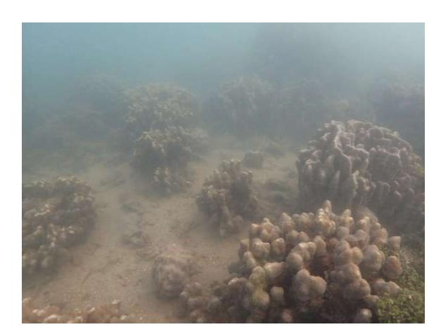

#### 地点 75 名蔵川河口

調査日:令和6年10月17日 サンゴ類生育型:IV(特定類優占型)

サンゴ類被度:30% 昨年のサンゴ類被度:30%

ミト・リイシ類の新規加入:0群体

貝類食痕ランク:1

写真:ハマサンゴ類が多い海域の状況

※塊状、準塊状ハマサンゴ類が多く、特に深みの周縁部で被度が高い。場所によってはシコロサンゴ類がやや多い。浅い場所はサンゴ被度が低く、ホンダワラ類が多い。白化はほとんど見られず、それによる死亡も少ない。

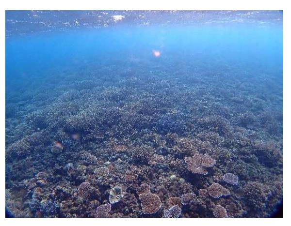

#### 地点 76 明石西

調査日: 令和6年12月25日

サンゴ類生育型:Ⅲ(枝状・卓状ミドリイシ混成型)

サンゴ類被度:40% 昨年のサンゴ類被度:20% ミドリイシ類の新規加入:4 群体

貝類食痕ランク:1

写真:ミドリイシ類が多い海域の状況

※主に礫で形成された離礁で天端部の浅所に枝状ミドリイシ類が高被度で見られる。斜面部でも直径 30~40 cmの

ミドリイシ類が多く見られる。新規加入も多い。

付図 1-19. 各調査地点の海中景観及び概況

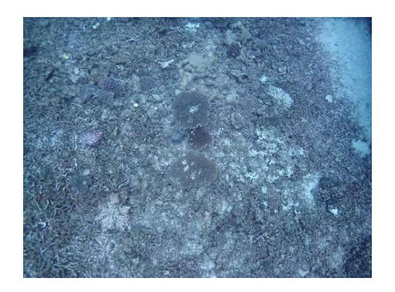

## 地点 77 伊原間湾口

調査日:令和6年12月5日

サンゴ類生育型: Ⅱ (卓状ミドリイシ優占型)

サンゴ類被度:10% 昨年のサンゴ類被度:10% ミト・リ が類の新規加入:11 群体

貝類食痕ランク:1

写真:やや深場の卓状ミドリイシ類

※浅い岩盤上に小型の卓状・散房花状ミドリイシ類が非常に多く、新規加入も多い。※波が強く本来の場所から

200m離れた地点で実施した。

付図 1-20. 各調査地点の海中景観及び概況

## 付図2 各調査地点の景観及び概況

## (石西礁湖及び西表島周辺海域)

## ※サンゴの生育型の類型:

- Ⅰ:枝状ミドリイシ優占型(枝状ミドリイシ類の割合が 60%以上)
- Ⅱ:卓状ミドリイシ優占型(卓状ミドリイシ類の割合が 60%以上)
- Ⅲ:枝状・卓状ミドリイシ混成型
- Ⅳ:特定類優占型(ミドリイシ類以外の特定のイシサンゴ類が優占する)
- Ⅴ:多種混成型(多種のサンゴが混在し、特定の種が優占しない)
- Ⅵ:ソフトコーラル優占型(ソフトコーラルが最も優占する)

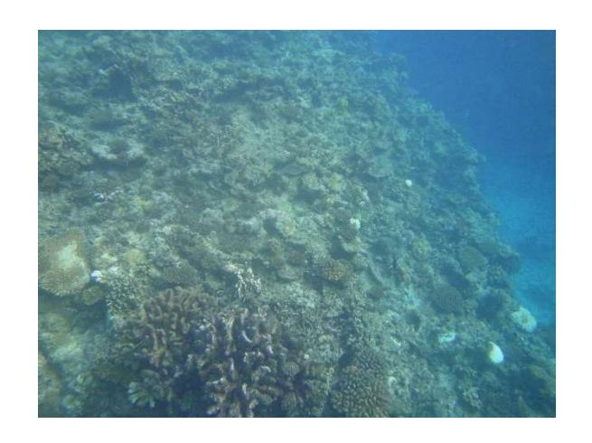

## 地点1 ウラビシ南礁縁

調査日:令和6年11月4日 サンゴ類生育型: V (多種混成型)

サンゴ類被度:10%未満 昨年のサンゴ類被度:10% ミト・リイシ類の新規加入:17 群体

貝類食痕ランク:2

写真:調査地点の海中景観

コメント:海藻少ない、台風あり、調査範囲南部(上野調 査範囲)礁原上テーブル状およびコリンボース状ミドリ

イシ類ほぼ全滅状態

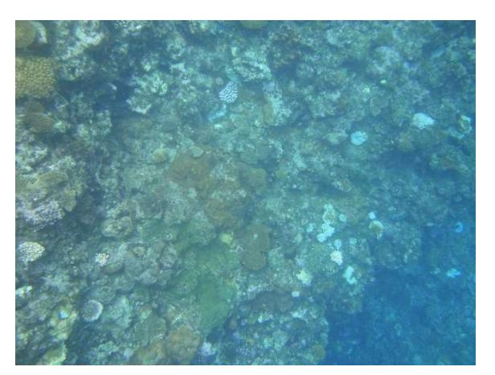

## 地点2 ウラビシ東礁縁

調査日:令和6年11月4日 サンゴ類生育型: V (多種混成型)

サンゴ類被度:50% 昨年のサンゴ類被度:60% ミドリイシ類の新規加入:2群体

貝類食痕ランク:2

写真:調査地点の海中景観 コメント:海藻少ない、台風あり

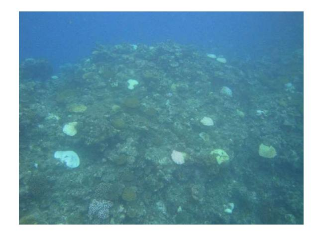

## 地点3 ウラビシ北東礁縁

調査日:令和6年11月4日 サンゴ類生育型: V (多種混成型)

サンゴ類被度:10% 昨年のサンゴ類被度:20% ミドリイシ類の新規加入: 12 群体

貝類食痕ランク:2 写真:調査地点の海中景観 コメント:海藻少ない、台風あり

## 地点 4 黒島北沖離礁

調査日: 令和6年11月20日 サンゴ類生育型: V (多種混成型)

サンゴ類被度:10%未満

昨年のサンゴ類被度:10%未満 ミト・リイシ類の新規加入:3群体

貝類食痕ランク:2

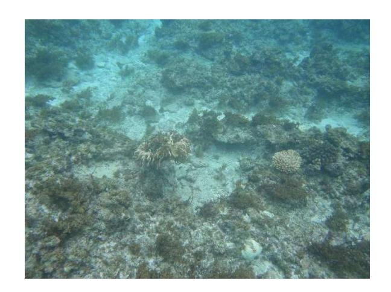

## 地点5 黑島北沖離礁

調査日:令和6年11月20日 サンゴ類生育型:V(多種混成型)

サンゴ類被度:10%未満 昨年のサンゴ類被度:10%未満 ミドリイシ類の新規加入:4 群体

貝類食痕ランク:2

写真:調査地点の海中景観 コメント:海藻多い、台風あり

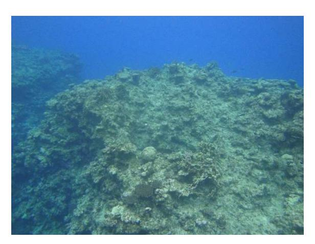

## 地点 6 黒島北西岸礁縁

調査日:令和6年11月20日 サンゴ類生育型:V(多種混成型)

サンゴ類被度:10%未満 昨年のサンゴ類被度:10%未満 計 引 が類の新規加入:5 群体

貝類食痕ランク:2

写真:調査地点の海中景観 コメント:海藻少ない

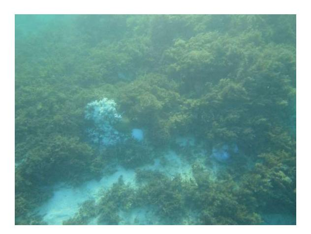

## 地点 7 黒島西岸礁池内

調査日:令和6年10月19日 サンゴ類生育型:V(多種混成型)

サンゴ類被度:10%未満 昨年のサンゴ類被度:10%未満 ミドリイン類の新規加入:0群体

貝類食痕ランク:2

写真:調査地点の海中景観 コメント:海藻多い

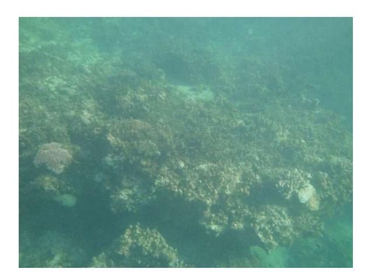

## 地点8 黑島南西岸礁池内

調査日:令和6年10月19日 サンゴ類生育型:V(多種混成型)

サンゴ類被度:10%

昨年のサンゴ類被度:10%未満 ミドリイシ類の新規加入:7群体

貝類食痕ランク:2

付図 2-2. 各調査地点の海中景観及び概況

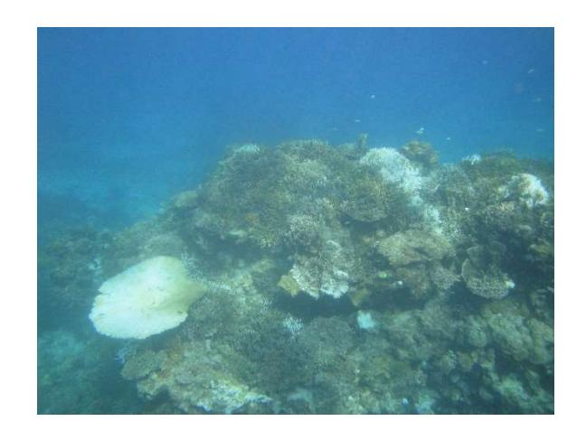

## 地点 9 黒島南岸礁池内

調査日:令和6年10月19日 サンゴ類生育型:V(多種混成型)

サンゴ類独度:40%

昨年のサンゴ類被度:30% ミドリイシ類の新規加入:1 群体

貝類食痕ランク:2

写真:調査地点の海中景観 コメント:海藻少ない

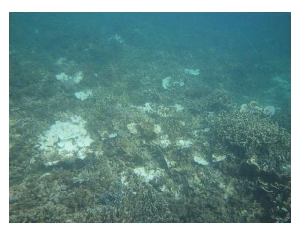

## 地点 10 黒島南東岸礁池内

調査日: 令和6年10月19日

サンゴ類生育型:IV(特定類優占型)

サンゴ類被度:30%

昨年のサンゴ類被度:40% ミト・リ が類の新規加入:1 群体

貝類食痕ランク:2

写真:調査地点の海中景観

コメント:海藻多い、ほぼ群体全体が死亡したユビエダ

ハマサンゴ目立つ

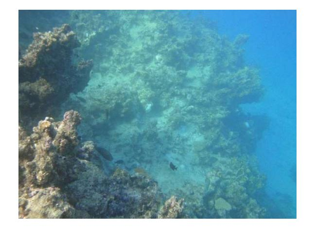

## 地点 11 黒島北東岸礁池内

調査日:令和6年11月4日

サンゴ類生育型: V (多種混成型)

サンゴ類被度:5%未満

昨年のサンゴ類被度:5%未満 ミトリや類の新規加入:3群体

貝類食痕ランク:2

写真:調査地点の海中景観

コメント:海藻少ない、台風あり

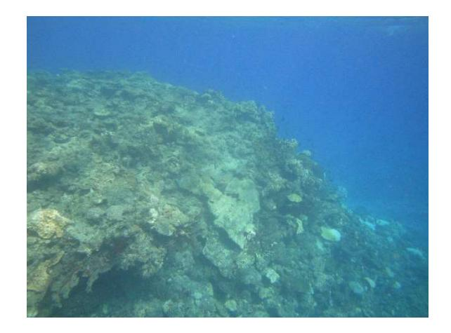

## 地点 12 新城島上地北岸離礁

調査日:令和6年10月21日

サンゴ類生育型:V(多種混成型)

サンゴ類被度:10% 昨年のサンゴ類被度:10%

ミト・リイシ類の新規加入:2群体

貝類食痕ランク:2

写真:調査地点の海中景観

コメント:海藻並み

付図 2-3. 各調査地点の海中景観及び概況

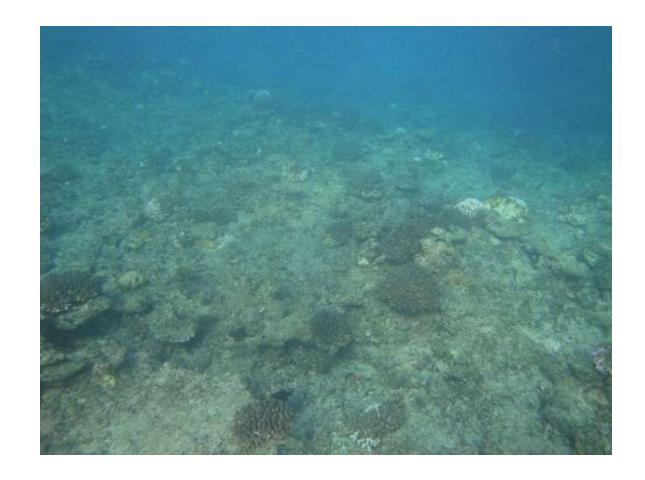

## 地点 13 マイビシ海中公園地区

調査日:令和6年10月28日 サンゴ類生育型:V(多種混成型)

サンゴ類被度:10%未満 昨年のサンゴ類被度:20% ミトリ が類の新規加入:3 群体

貝類食痕ランク:2

写真:調査地点の海中景観 コメント:海藻少ない

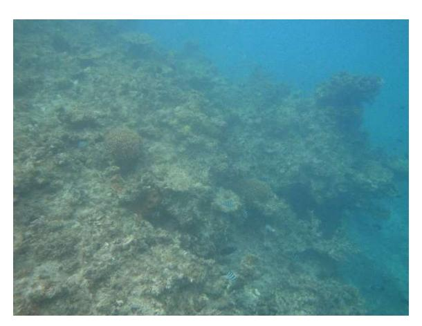

## 地点 14 新城島上地西岸

調査日:令和6年10月28日 サンゴ類生育型:V(多種混成型)

サンゴ類被度:5%未満 昨年のサンゴ類被度:5%未満 ミドリイシ類の新規加入:3群体

貝類食痕ランク:2

写真:調査地点の海中景観 コメント:海藻多い

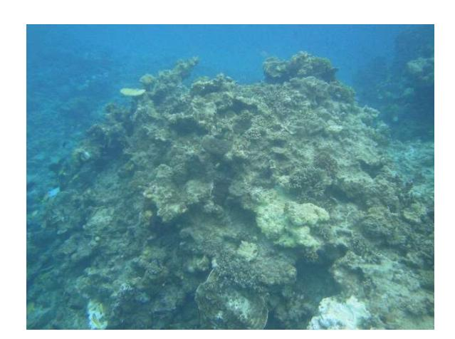

## 地点 15 新城島間水路部

調査日:令和6年10月28日 サンゴ類生育型:V(多種混成型)

サンゴ類被度:20% 昨年のサンゴ類被度:20% ミドリイシ類の新規加入:6群体

貝類食痕ランク:2 写真:調査地点の海中景観 コメント:海藻少ない

## 地点 16 新城島下地西岸礁池内

調査日:令和6年10月28日 サンゴ類生育型:V(多種混成型)

サンゴ類被度:5%未満 昨年のサンゴ類被度:5%未満 ミドリイシ類の新規加入:2群体

貝類食痕ランク:2

付図 2-4. 各調査地点の海中景観及び概況

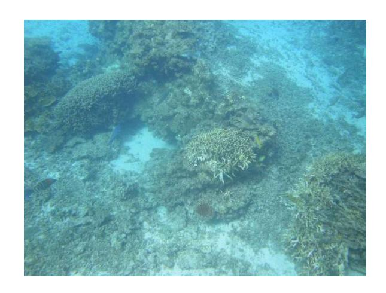

## 地点 17 新城島下地西岸礁池内

調査日:令和6年10月28日 サンゴ類生育型:V(多種混成型)

サンゴ類被度:10%未満

昨年のサンゴ類被度:10%未満 ミト・リイン類の新規加入:7群体

貝類食痕ランク:2

写真:調査地点の海中景観

コメント:海藻少ない、ほぼ群体全体が死亡したユビエ

ダハマサンゴ目立つ

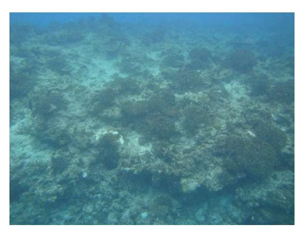

## 地点 19 黒島北沖離礁

調査日:令和6年11月23日 サンゴ類生育型:V(多種混成型)

サンゴ類被度:10%未満 昨年のサンゴ類被度:20% 計 引 が類の新規加入:6 群体

貝類食痕ランク:2

写真:調査地点の海中景観

コメント:海藻並み、調査中黒島港から出港した安栄観 光フェリーがエンジントラブルのため調査範囲すぐ近傍

まで漂流、約30分後僚船によって曳航・離脱

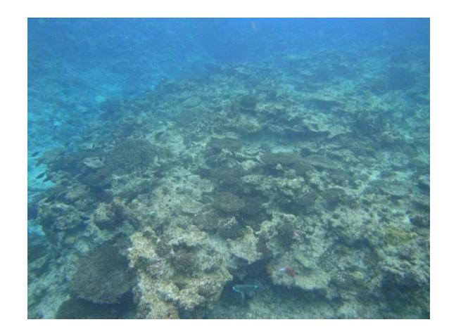

## 地点 20 黒島北沖離礁

調査日:令和6年11月20日 サンゴ類生育型:V(多種混成型)

サンゴ類被度:10%未満 昨年のサンゴ類被度:40% ミドリイシ類の新規加入:2群体

貝類食痕ランク:2 写真:調査地点の海中景観

| ラ具:調査地点の海中京戦

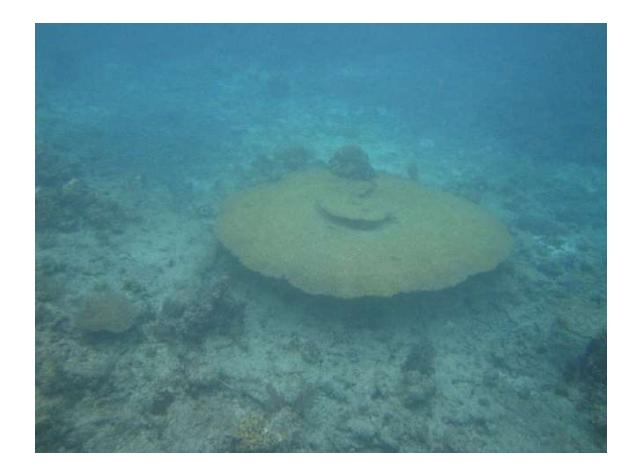

## 地点 22 黒島一小浜島間離礁

調査日:令和6年11月19日 サンゴ類生育型:V(多種混成型)

サンゴ類被度:10%

昨年のサンゴ類被度:20% ミトリの類の新規加入:6群体

貝類食痕ランク:2

付図 2-5. 各調査地点の海中景観及び概況

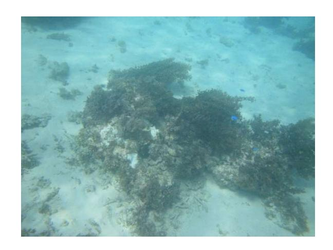

## 地点 23 小浜島南東岸礁縁

調査日:令和6年11月9日 サンゴ類生育型:V(多種混成型)

サンゴ類被度:5%未満 昨年のサンゴ類被度:5%未満 ミドリイシ類の新規加入:0群体

写真:調査地点の海中景観

貝類食痕ランク: 1

コメント:海藻多い、調査範囲南側の海草場拡大

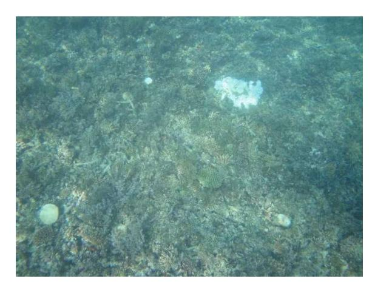

## 地点 24 小浜島南東沖礁縁

調査日:令和6年11月9日

サンゴ類生育型: V (多種混成型)

サンゴ類被度:20% 昨年のサンゴ類被度:10% ミトリ が類の新規加入:3群体

貝類食痕ランク:2

写真:調査地点の海中景観 コメント:海藻多い

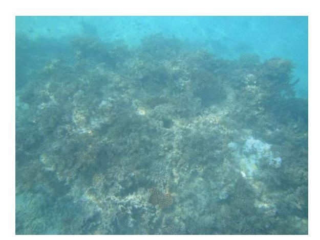

## 地点 25 小浜島南東沖礁縁

調査日:令和6年11月9日 サンゴ類生育型:V(多種混成型)

サンゴ類被度:10%未満 昨年のサンゴ類被度:10%未満 ミドリイシ類の新規加入:1群体

貝類食痕ランク:2 写真:調査地点の海中景観

コメント:海藻多い、海草場拡大、もずく養殖場拡張

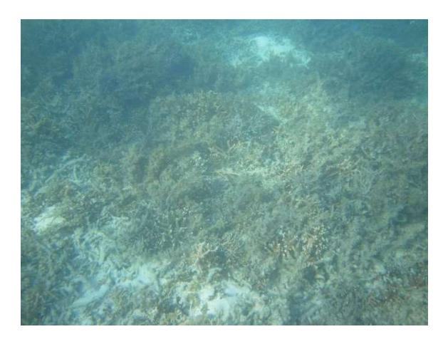

## 地点 27 小浜島東沖

調査日:令和6年10月22日 サンゴ類生育型:V(多種混成型)

サンゴ類被度:30%

昨年のサンゴ類被度:20% ミト・リ が類の新規加入:6群体

貝類食痕ランク:2

写真:調査地点の海中景観

コメント: 海藻多い、枝状ミドリイシ類生長(最長30cm)

かつ分散拡大し被度増加

付図 2-6. 各調査地点の海中景観及び概況

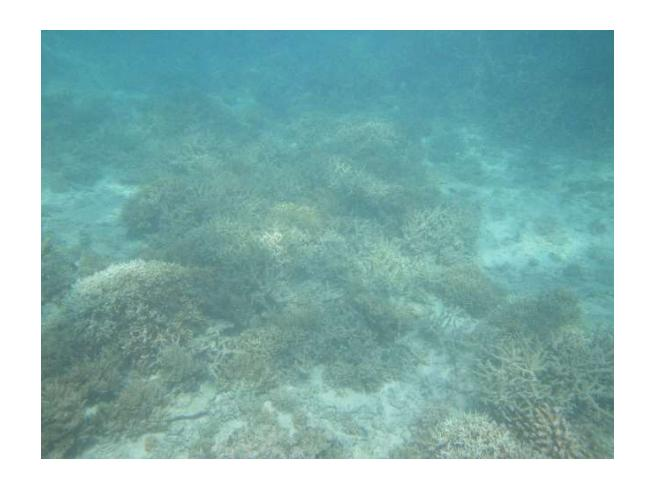

#### 地点 28 嘉弥真島南岸礁縁

調査日:令和6年10月22日 サンゴ類生育型:V(多種混成型)

サンゴ類被度:40% 昨年のサンゴ類被度:40% ミドリイシ類の新規加入:5群体

貝類食痕ランク:2

写真:調査地点の海中景観 コメント:海藻少ない

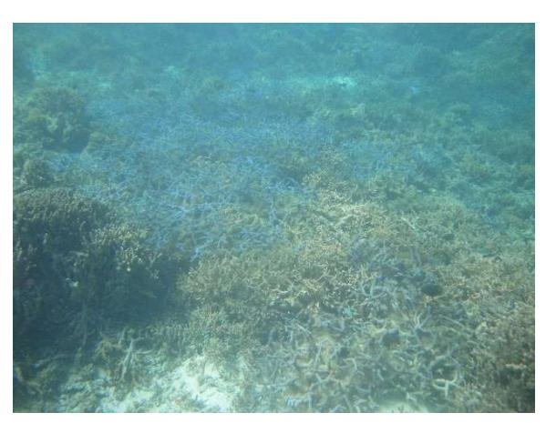

## 地点 31 嘉弥真島南西岸礁池内

調査日: 令和6年10月22日

サンゴ類生育型:I(枝状ミドリイシ優占型)

サンゴ類被度:70% 昨年のサンゴ類被度:60% ミドリイシ類の新規加入:9 群体

貝類食痕ランク:2

写真:調査地点の海中景観 コメント:海藻並み

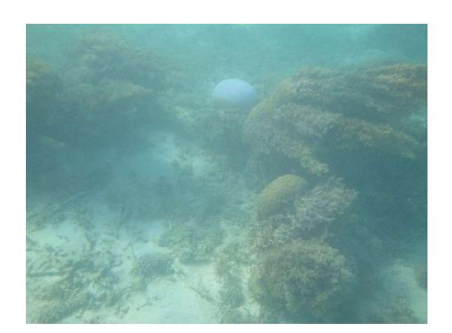

## 地点 32 小浜島北東岸礁縁

調査日:令和6年10月22日 サンゴ類生育型:V(多種混成型)

サンゴ類被度:5%未満 昨年のサンゴ類被度:5%未満 ミトリ が類の新規加入:0群体

貝類食痕ランク:1 写真:調査地点の海中景観

コメント:海藻多い、枝状ミドリイシ類断片複数加入、

海草繁茂ウミガメの食み跡なし

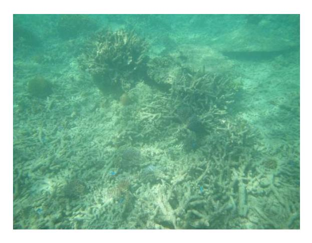

## 地点 35 ヨナラ水道南礁縁

調査日: 令和6年10月27日

サンゴ類生育型: I (枝状ミドリイシ優占型)

サンゴ類被度:20% 昨年のサンゴ類被度:20% 計\*リイシ類の新規加入:9 群体

貝類食痕ランク:2 写真:調査地点の海中景観

コメント:海藻少ない、海草場繁茂範囲拡大(ヨナラ水

道方向)

付図 2-7. 各調査地点の海中景観及び概況

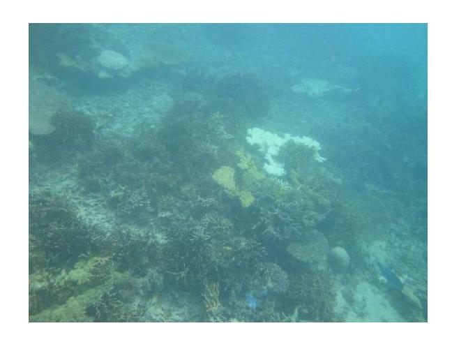

## 地点36 ヨナラ水道南

調査日: 令和6年10月27日

サンゴ類生育型:I(枝状ミドリイシ優占型)

サンゴ類被度:30% 昨年のサンゴ類被度:50% ミドリイシ類の新規加入:3群体

貝類食痕ランク:2

写真:調査地点の海中景観

コメント:海藻少ない、小浜島側白化死亡率低く(沖側

60%に対して40%) 生残多い

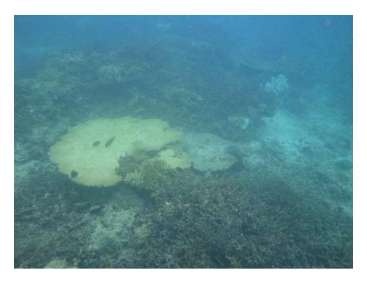

## 地点 37 黒島一西表島間離礁

調査日:令和6年10月20日 サンゴ類生育型:V(多種混成型)

サンゴ類被度:30% 昨年のサンゴ類被度:40% ミトリ (1) 利の新規加入:10 群体

貝類食痕ランク:2

写真:調査地点の海中景観 コメント:海藻多い

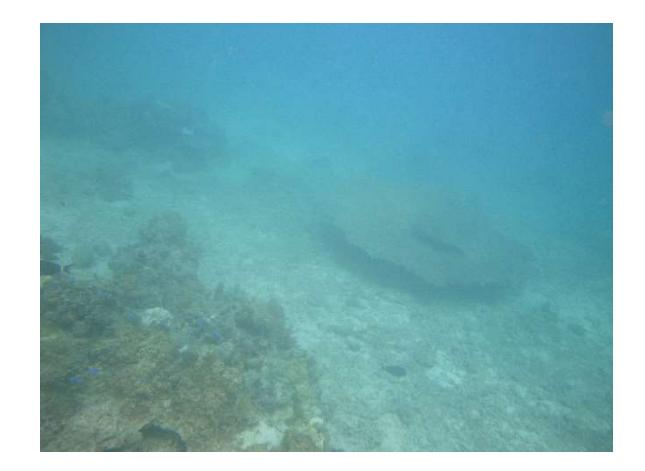

## 地点 38 黒島一西表島間離礁

調査日:令和6年10月20日 サンゴ類生育型:V(多種混成型)

サンゴ類被度:10%未満 昨年のサンゴ類被度:10%未満 ミトリの類の新規加入:6群体

貝類食痕ランク:2 写真:調査地点の海中景観

コメント:海藻並み、場所により海藻繁茂バラツキ大き

()

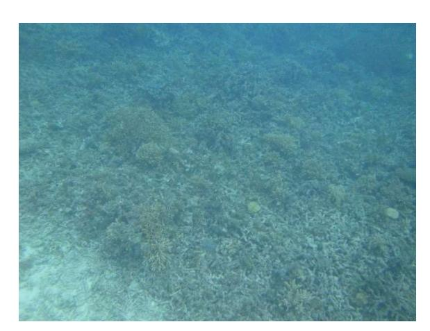

## 地点 39 黒島一小浜島間離礁

調査日:令和6年11月19日 サンゴ類生育型:V(多種混成型)

サンゴ類被度:20% 昨年のサンゴ類被度:30% ミドリイシ類の新規加入:2群体

貝類食痕ランク:2

写真:調査地点の海中景観 コメント:海藻並み

付図 2-8. 各調査地点の海中景観及び概況

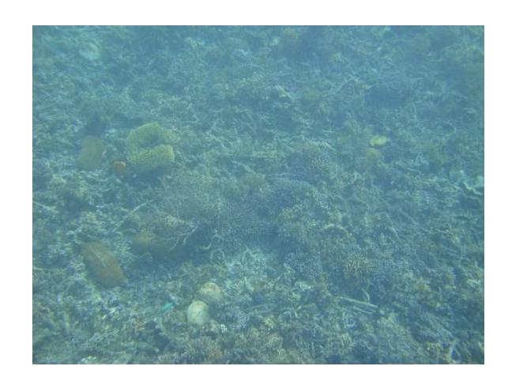

## 地点 40 小浜島南東沖離礁

調査日:令和6年11月9日 サンゴ類生育型:V(多種混成型)

サンゴ類被度:20% 昨年のサンゴ類被度:20% 計リ砂類の新規加入:1 群体

貝類食痕ランク:2

写真:調査地点の海中景観 コメント:海藻多い

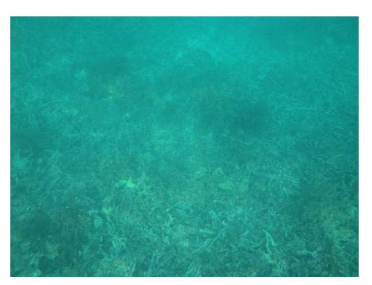

## 地点 41 小浜島南東沖離礁

調査日:令和6年11月9日 サンゴ類生育型:V(多種混成型)

サンゴ類被度:20% 昨年のサンゴ類被度:20% ミトリ が類の新規加入:2 群体

貝類食痕ランク:2

写真:調査地点の海中景観 コメント:海藻多い

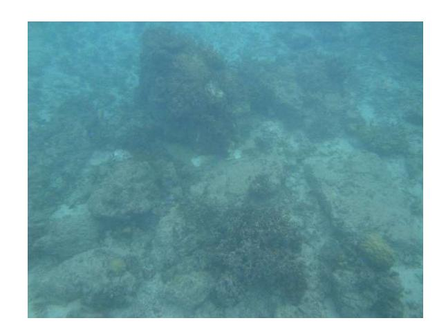

## 地点 42 小浜島東沖礁湖内

調査日:令和6年11月19日 サンゴ類生育型:V(多種混成型)

サンゴ類被度:20% 昨年のサンゴ類被度:20% 計 引 が類の新規加入:3群体

貝類食痕ランク:2

写真:調査地点の海中景観 コメント:海藻並み

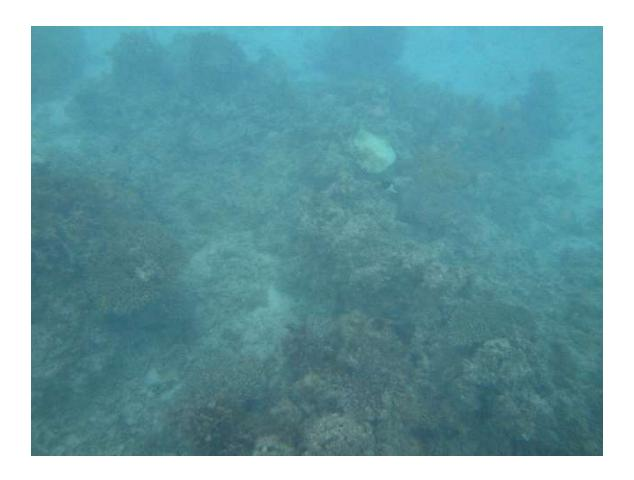

## 地点 43 小浜島東沖礁湖内

調査日:令和6年11月19日 サンゴ類生育型:V(多種混成型)

サンゴ類被度:20%

昨年のサンゴ類被度:20% ミドリジ類の新規加入:5群体

貝類食痕ランク:2

付図 2-9. 各調査地点の海中景観及び概況

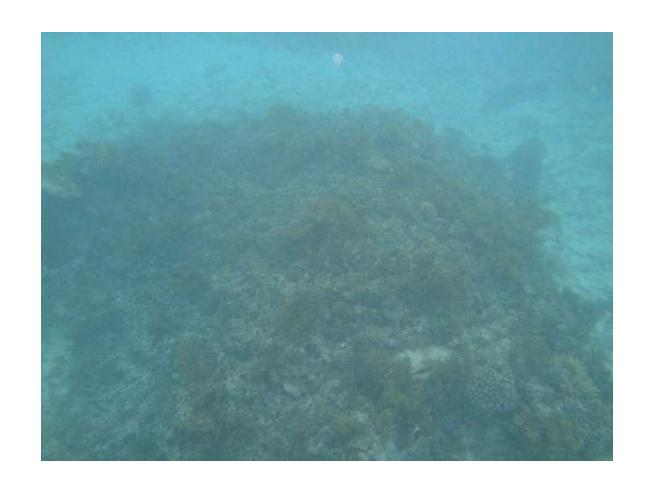

## 地点 44 嘉弥真島東沖礁湖内

調査日:令和6年11月19日 サンゴ類生育型:V(多種混成型)

サンゴ類被度:10%未満 昨年のサンゴ類被度:10% ミトリウ類の新規加入:5群体

貝類食痕ランク:2

写真:調査地点の海中景観 コメント:海藻多い

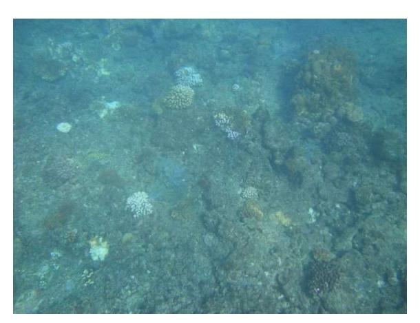

## 地点 45 ウラビシ北離礁

調査日:令和6年11月4日 サンゴ類生育型:V(多種混成型)

サンゴ類被度:10% 昨年のサンゴ類被度:20% ミトリ が類の新規加入:3群体

貝類食痕ランク:2

写真:調査地点の海中景観 コメント:海藻少ない、台風あり

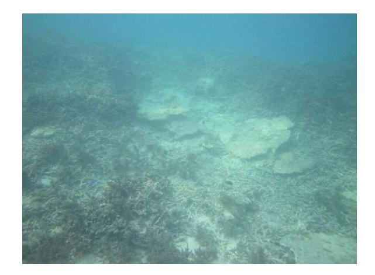

## 地点 46 シモビシ海中公園地区

調査日:令和6年11月5日 サンゴ類生育型:V(多種混成型)

サンゴ類被度:10%未満 昨年のサンゴ類被度:10%未満 ミドリイシ類の新規加入:22 群体

貝類食痕ランク:2 写真:調査地点の海中景観 コメント:海藻並み、台風大

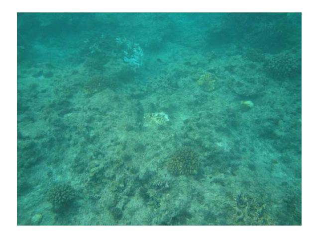

## 地点 47 竹富島南西岸礁縁

調査日:令和6年11月5日 サンゴ類生育型:V(多種混成型)

サンゴ類被度:5%未満 昨年のサンゴ類被度:5%未満 ミドリイシ類の新規加入:18 群体

貝類食痕ランク:2 写真:調査地点の海中景観

コメント:海藻多い、台風大、台風21号による海底砂再

懸濁による影響継続し濁りひどい

付図 2-10. 各調査地点の海中景観及び概況

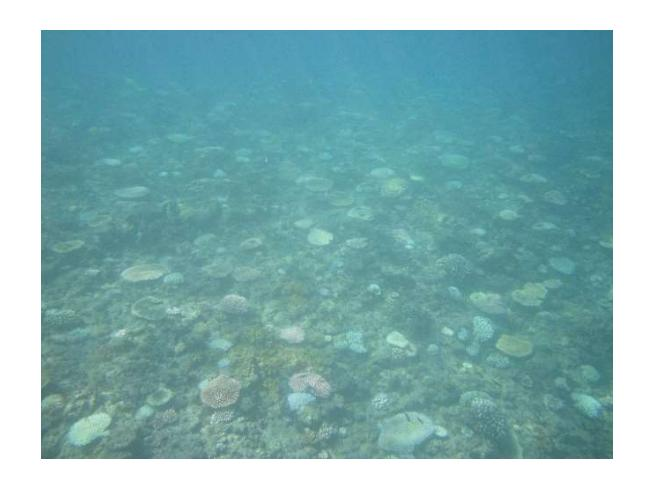

#### 地点 49 竹富島西沖離礁礁縁

調査日:令和6年10月17日 サンゴ類生育型:V(多種混成型)

サンゴ類被度:20% 昨年のサンゴ類被度:20% ミドリイシ類の新規加入:60群体

貝類食痕ランク:2

写真:調査地点の海中景観 コメント:海藻少ない、台風あり

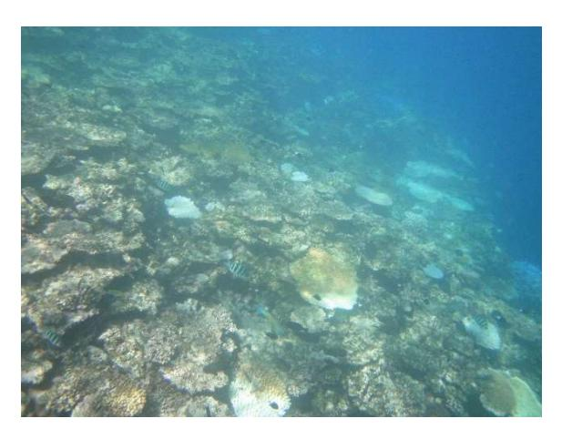

## 地点 50 竹富島西沖離礁外縁

調査日:令和6年10月17日 サンゴ類生育型:V(多種混成型)

サンゴ類被度:10%未満 昨年のサンゴ類被度:10% ミドリイシ類の新規加入:8群体

貝類食痕ランク:2

写真:調査地点の海中景観 コメント:海藻少ない、台風あり

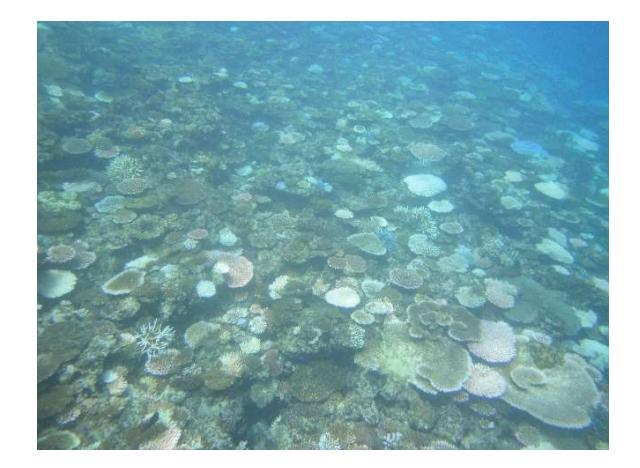

## 地点 51 竹富島北岸礁外縁

調査日:令和6年10月25日 サンゴ類生育型:V(多種混成型)

サンゴ類被度:40% 昨年のサンゴ類被度:40% ミドリイシ類の新規加入:18 群体

貝類食痕ランク:2 写真:調査地点の海中景観

コメント:海藻少ない、白化死亡率高い(50-60%)場所

あり、ミドリイシ類小型群体に死亡多い

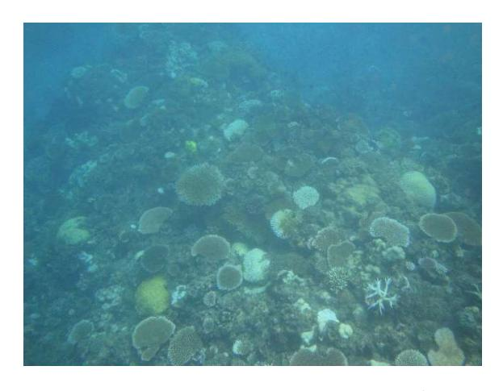

## 地点 52 竹富島北東岸礁外縁

調査日:令和6年10月25日 サンゴ類生育型:V(多種混成型)

サンゴ類被度:40% 昨年のサンゴ類被度:30% ミドリイシ類の新規加入:41 群体

貝類食痕ランク:2 写真:調査地点の海中景観

コメント:海藻少ない、沖側の方が白化死亡率高い(50-70%)、被度10%程度と低い場所あり、ミドリイシ類小

型群体に死亡多い

付図 2-11. 各調査地点の海中景観及び概況

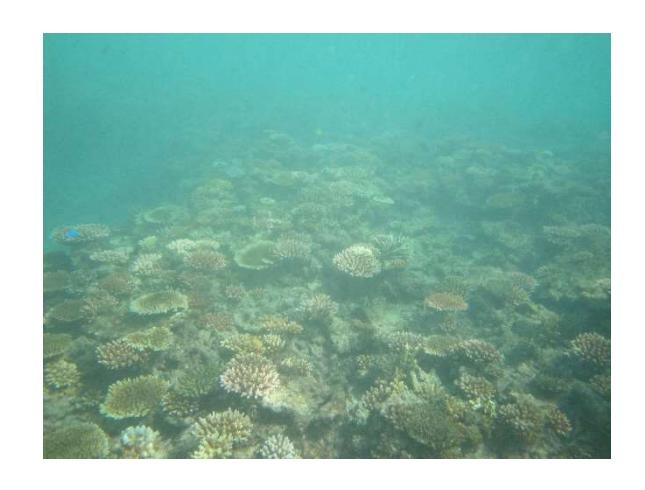

#### 地点 53 竹富島北東沖礁縁

調査日: 令和6年10月25日

サンゴ類生育型: V (多種混成型)

サンゴ類被度:40% 昨年のサンゴ類被度:20% ミト・リイシ類の新規加入:41 群体

貝類食痕ランク:2

写真:調査地点の海中景観

コメント:海藻並み、調査範囲東側(上野調査範囲)の方 が白化死亡率高い、浚渫工事以後海底砂巻き上げ再懸濁

のため濁りひどい

#### 地点 54 竹富島東沖離礁

調査日: 令和6年10月25日 サンゴ類生育型: V (多種混成型)

サンゴ類被度:10%未満

昨年のサンゴ類被度:10%未満 ミト・リイシ類の新規加入:8群体

貝類食痕ランク:2

写真:調査地点の海中景観

コメント:海藻多い、アナサンゴモドキ群体の死亡多い

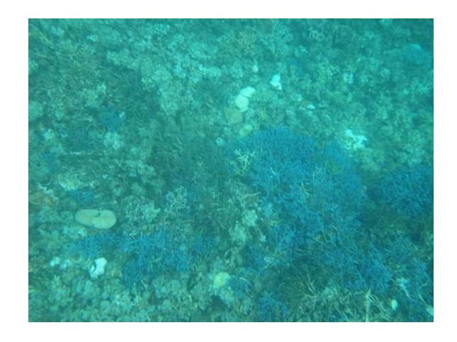

## 地点 58 西表島東沖離礁

調査日: 令和6年10月20日

サンゴ類生育型: I (枝状ミドリイシ優占型)

サンゴ類被度:40% 昨年のサンゴ類被度:40% ミドリ沙類の新規加入:2群体

貝類食痕ランク:3

写真:調査地点の海中景観

コメント:海藻多い、北東寄り白化死亡率高く最大30% 程度、ほぼ群体全体が死亡したユビエダハマサンゴ多数

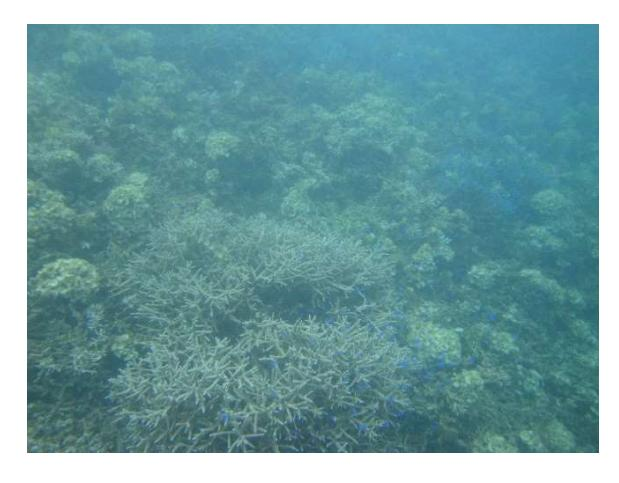

## 地点 59 西表島東沖離礁

調査日: 令和6年10月20日

サンゴ類生育型: I (枝状ミドリイシ優占型)

サンゴ類被度:40% 昨年のサンゴ類被度:50% ミドリイシ類の新規加入:0群体

貝類食痕ランク:3

写真:調査地点の海中景観

コメント:海藻多い、藍藻類多い、ほぼ群体全体が死亡

したユビエダハマサンゴ多数

付図 2-12. 各調査地点の海中景観及び概況

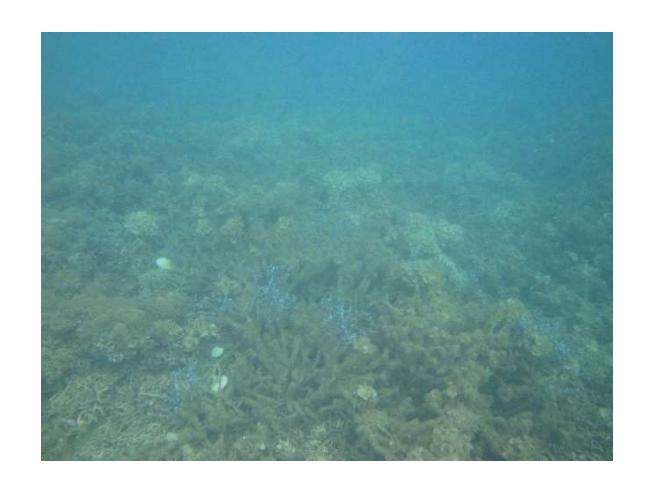

## 地点60 西表島東沖離礁

調査日: 令和6年10月20日

サンゴ類生育型:I(枝状ミドリイシ優占型)

サンゴ類被度:20% 昨年のサンゴ類被度:50% ミドリイン類の新規加入:0群体

貝類食痕ランク:2

写真:調査地点の海中景観 コメント:海藻多い

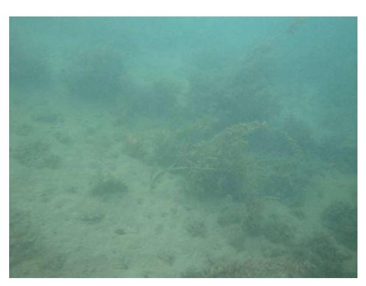

## 地点 61 西表島東岸礁池内

調査日: 令和6年10月20日

サンゴ類生育型:Ⅳ(特定類優占型)

サンゴ類被度:10%未満 昨年のサンゴ類被度:10%未満 計 引 引 引 引 対 類 の 新規 加入:0 群体

貝類食痕ランク: 1 写真:調査地点の海中景観

与具:調査地点の海中景 コメント:海藻多い

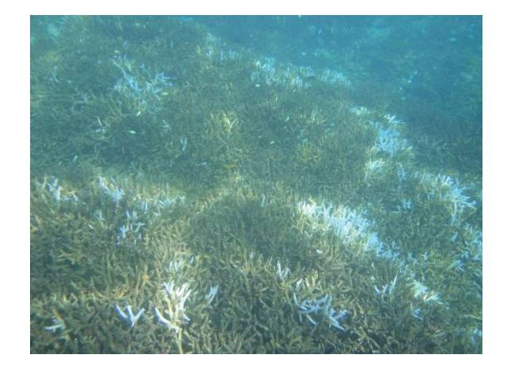

## 地点 62 ヨナラ水道南

調査日:令和6年10月27日

サンゴ類生育型:I(枝状ミドリイシ優占型)

サンゴ類被度:30% 昨年のサンゴ類被度:40% ミドリイン類の新規加入:8群体

貝類食痕ランク:2 写真:調査地点の海中景観

コメント:海藻少ない、A. e/seyi群集の生残顕著

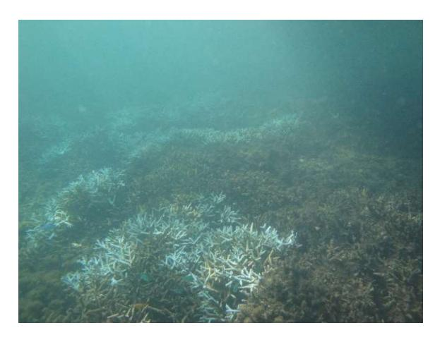

## 地点 63 ヨナラ水道南部

調査日: 令和6年10月27日

サンゴ類生育型: I (枝状ミドリイシ優占型)

サンゴ類被度:20% 昨年のサンゴ類被度:30% ミドリイシ類の新規加入:9群体

貝類食痕ランク:2

付図 2-13. 各調査地点の海中景観及び概況

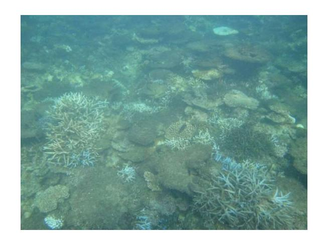

## 地点 64 ヨナラ水道中央部

調査日:令和6年10月27日 サンゴ類生育型:V(多種混成型)

サンゴ類被度:20% 昨年のサンゴ類被度:40% ミドリイン類の新規加入:20 群体

貝類食痕ランク:2

写真:調査地点の海中景観

コメント:海藻少ない、礁原上サンゴほぼ全滅状態

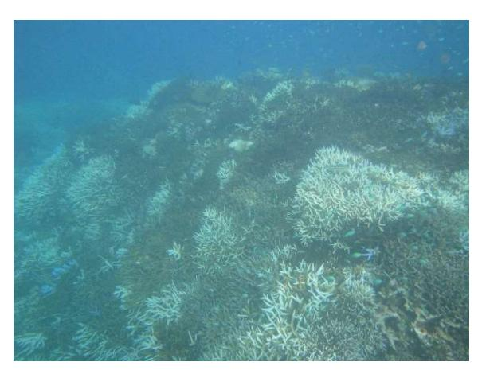

## 地点 65 ヨナラ水道北部

調査日:令和6年10月17日 サンゴ類生育型:V(多種混成型)

サンゴ類被度:50% 昨年のサンゴ類被度:60% ミドリイシ類の新規加入:40 群体

貝類食痕ランク:2

写真:調査地点の海中景観

コメント:海藻少ない、台風あり、白化死亡率高いとこ

ろで 60%前後

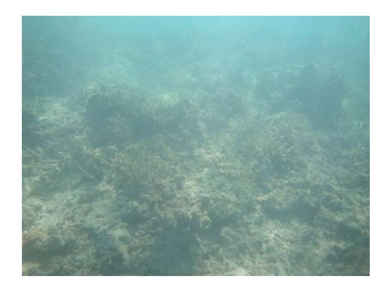

## 地点 66 小浜島南礁縁

調査日:令和6年10月27日

サンゴ類生育型: I (枝状ミドリイシ優占型)

サンゴ類被度:20% 昨年のサンゴ類被度:10% ミト・リク類の新規加入:1 群体

貝類食痕ランク:2 写真:調査地点の海中景観

コメント:海藻並み、枝状ミドリイシ類生残顕著

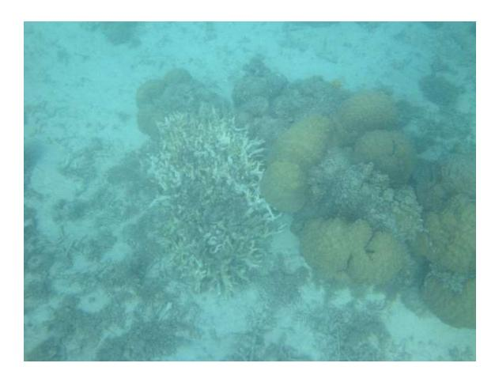

## 地点 67 小浜島東沖離礁

調査日:令和6年10月22日 サンゴ類生育型:V(多種混成型)

サンゴ類被度:30% 昨年のサンゴ類被度:20%

昨年のサンコ 親被度: 20% ミトリ が類の新規加入: 2 群体

貝類食痕ランク:2 写真:調査地点の海中景観

コメント:海藻並み、ほぼ群体全体が死亡したユビエダ

ハマサンゴ目立つ

付図 2-14. 各調査地点の海中景観及び概況

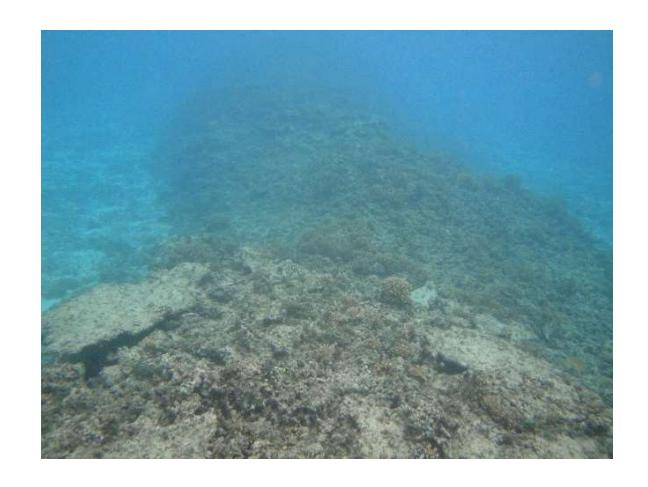

## 地点 68 嘉弥真島東沖礁内縁

調査日:令和6年11月19日 サンゴ類生育型:V(多種混成型)

サンゴ類被度:20% 昨年のサンゴ類被度:20% ミドリイシ類の新規加入:15 群体

貝類食痕ランク:2

写真:調査地点の海中景観 コメント:海藻並み

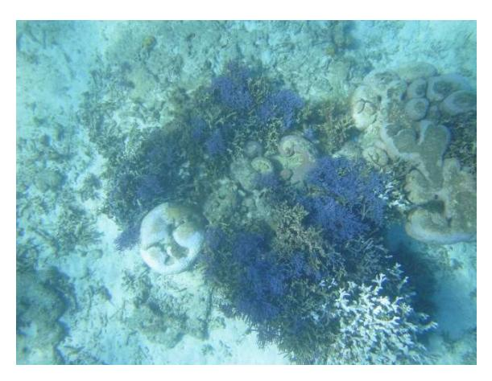

## 地点 69 黒島南東岸礁池内

調査日:令和6年10月19日 サンゴ類生育型:V(多種混成型)

サンゴ類被度:40% 昨年のサンゴ類被度:40% ミトリイシ類の新規加入:1群体

貝類食痕ランク:2

写真:調査地点の海中景観

コメント:海藻並み、台風あり、紫色の枝状(網状)カイ

メン昨年度よりも大幅増加

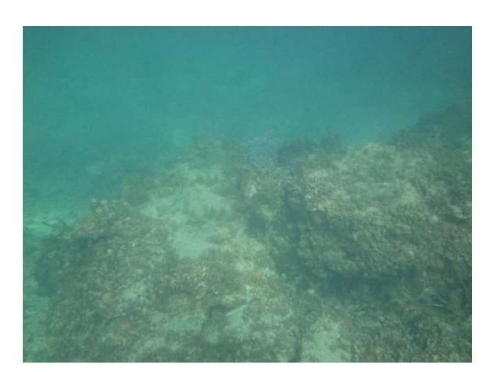

## 地点 70 黒島南西岸礁池内

調査日:令和6年10月19日 サンゴ類生育型:V(多種混成型)

サンゴ類被度:10%未満 昨年のサンゴ類被度:10%未満 ミドリイシ類の新規加入:2群体

貝類食痕ランク:2 写真:調査地点の海中景観 コメント:海藻多い、台風あり

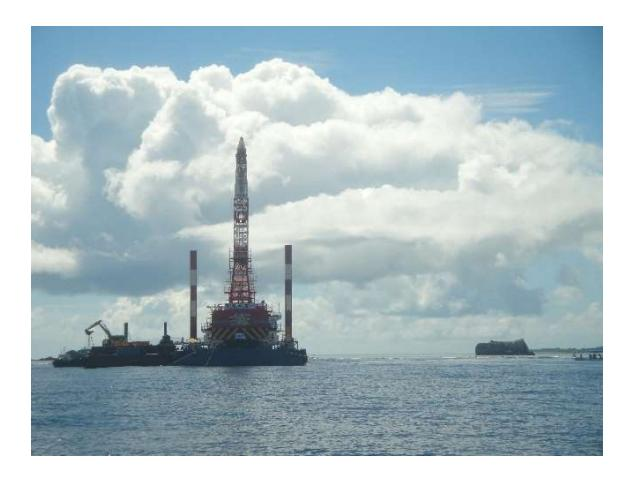

## 地点 71 嘉弥真島東沖礁外縁

調査日:

サンゴ類生育型:サンゴ類被度:

昨年のサンゴ類被度:60% ミトリウ類の新規加入: 貝類食痕ランク:

写真:調査地点の海上景観

コメント:座礁船撤去作業継続中につき、本年度は調査

対象地点から除外

付図 2-15. 各調査地点の海中景観及び概況

## 地点 72 嘉弥真島北岸礁外縁

調査日:令和6年10月17日 サンゴ類生育型:V(多種混成型)

サンゴ類被度:50% 昨年のサンゴ類被度:30% ミドリイン類の新規加入:38 群体

貝類食痕ランク:2

写真:調査地点の海中景観 コメント:海藻少ない

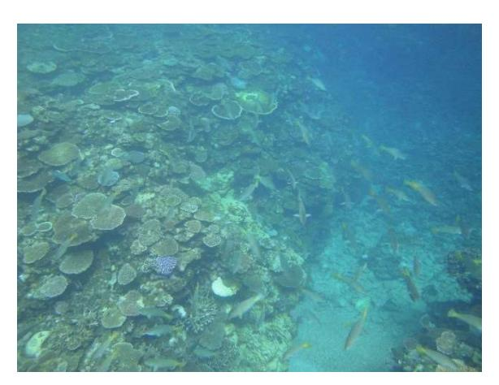

## 地点 73 嘉弥真島北岸礁外縁

調査日: 令和6年10月17日

サンゴ類生育型: I (卓状ミドリイシ優占型)

サンゴ類被度:50% 昨年のサンゴ類被度:40% ミドリイン類の新規加入:45 群体

貝類食痕ランク:2

写真:調査地点の海中景観 コメント:海藻少ない

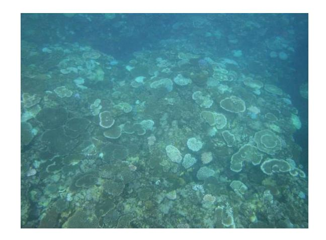

## 地点 74 小浜島北岸礁外縁

調査日:令和6年10月17日 サンゴ類生育型:V(多種混成型)

サンゴ類被度:50% 昨年のサンゴ類被度:40% ミドリイシ類の新規加入:65 群体

貝類食痕ランク:2 写真:調査地点の海中景観 コメント:海藻少ない

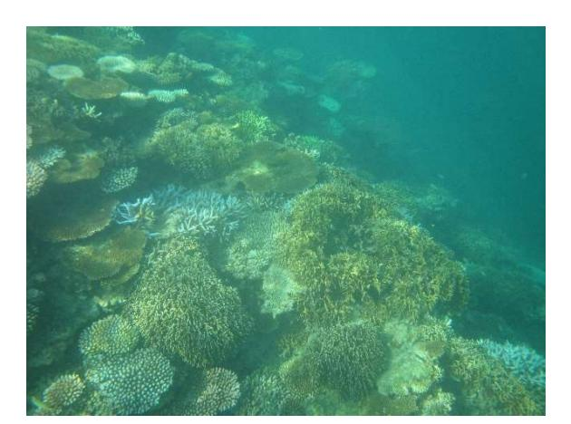

## 地点 75 ヨナラ水道中央部

調査日:令和6年10月17日 サンゴ類生育型:V(多種混成型)

サンゴ類被度:40%

昨年のサンゴ類被度:40% ミトリジ類の新規加入:22 群体

貝類食痕ランク:2

付図 2-16. 各調査地点の海中景観及び概況

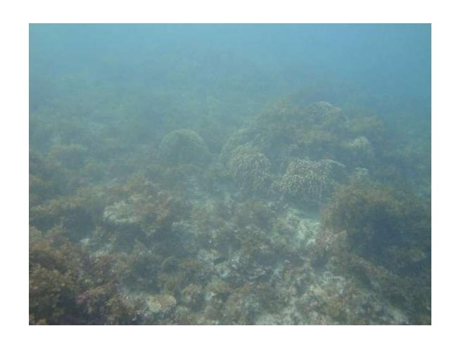

## 地点 76 アーサーピー外縁

調査日: 令和6年10月25日

サンゴ類生育型:Ⅳ(特定類優占型)

サンゴ類被度:10%未満 昨年のサンゴ類被度:10% ミドリイシ類の新規加入:3群体

貝類食痕ランク:2

写真:調査地点の海中景観

コメント:海藻多い、台風あり、アナサンゴモドキ群体

の死亡多い

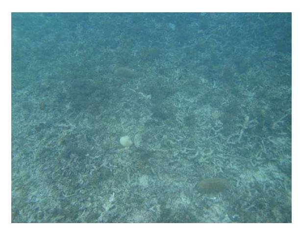

## 地点 77 ウマノハピー礁内

調査日:令和6年11月3日

サンゴ類生育型: V (多種混成型)

サンゴ類被度:10%未満

昨年のサンゴ類被度:10%未満 ミト・リジ類の新規加入:4 群体

貝類食痕ランク:2

写真:調査地点の海中景観

コメント:海藻多い、台風あり、海底の枝状礫崩れる

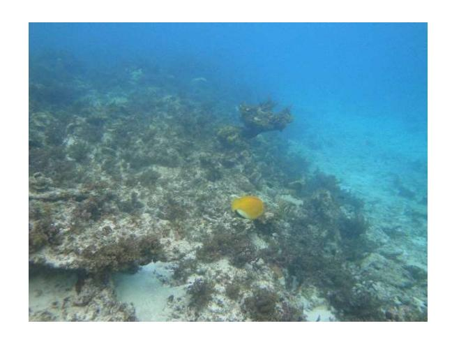

## 地点 78 ウマノハピー礁内

調査日:令和6年11月3日

サンゴ類生育型:V(多種混成型)

サンゴ類被度:5%未満

昨年のサンゴ類被度:5%未満 ミトリの類の新規加入:2群体

貝類食痕ランク:2

写真:調査地点の海中景観

コメント:海藻多い、台風あり

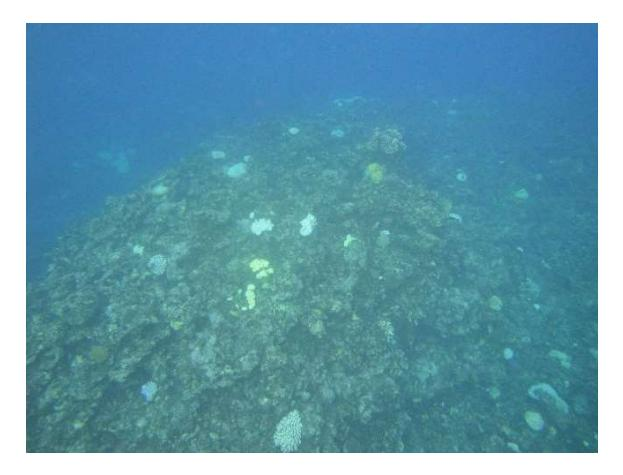

## 地点 79 ウマノハピー礁内

調査日:令和6年11月3日

サンゴ類生育型: V (多種混成型)

サンゴ類被度:10%未満

昨年のサンゴ類被度:10%未満 ミトリの類の新規加入:7群体

貝類食痕ランク:2

写真:調査地点の海中景観

コメント:海藻少ない

付図 2-17. 各調査地点の海中景観及び概況

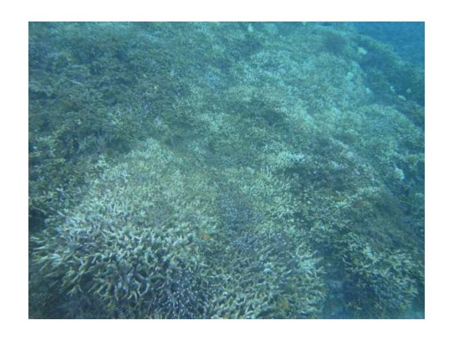

## 地点80 ウマノハピー内縁

調査日:令和6年11月5日 サンゴ類生育型:V(多種混成型)

サンゴ類被度:10%未満 昨年のサンゴ類被度:20% ミドリイン類の新規加入:1群体

貝類食痕ランク:2

写真:調査地点の海中景観

コメント:海藻多い、台風大、ほぼ群体全体が死亡した

ユビエダハマサンゴ目立つ

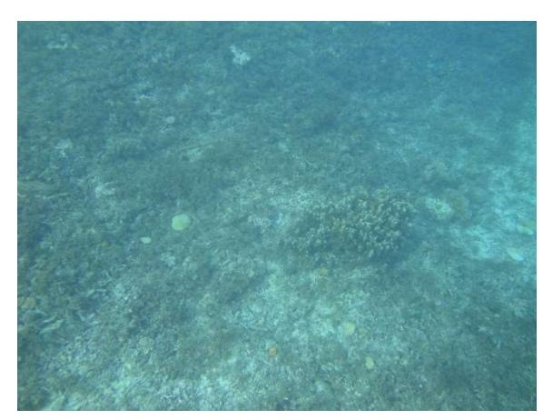

## 地点81 ウマノハピー内縁

調査日:令和6年11月5日 サンゴ類生育型:V(多種混成型)

サンゴ類被度:5%未満

昨年のサンゴ類被度:5%未満 ミト・リや類の新規加入:1 群体

貝類食痕ランク:2

写真:調査地点の海中景観 コメント:海藻多い、台風あり

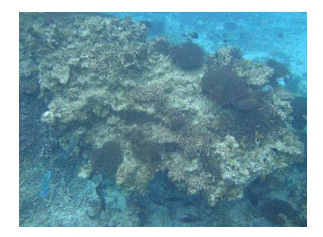

## 地点82 ウマノハピー内縁

調査日:令和6年11月21日 サンゴ類生育型:V(多種混成型)

サンゴ類被度:10%未満 昨年のサンゴ類被度:30% ミドリイシ類の新規加入:2群体

貝類食痕ランク:2 写真:調査地点の海中景観

コメント:海藻少ない、ほぼ群体全体が死亡したユビエ

ダハマサンゴ目立つ

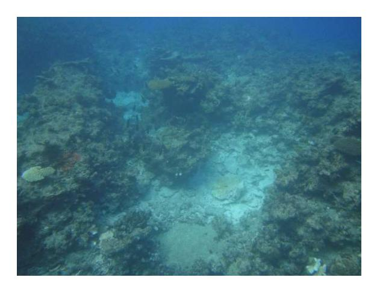

## 地点83 ウマノハピー内縁

調査日:令和6年11月3日 サンゴ類生育型:V(多種混成型)

サンゴ類被度:5%未満

昨年のサンゴ類被度:10%未満 ミトリの類の新規加入:3群体

貝類食痕ランク:2

写真:調査地点の海中景観 コメント:海藻並み、台風大

付図 2-18. 各調査地点の海中景観及び概況

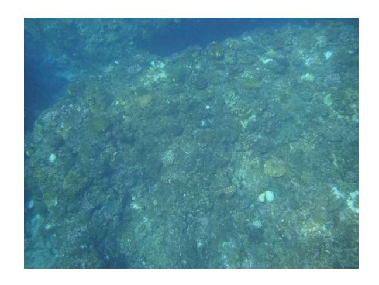

## 地点84 ウマノハピー外縁

調査日:令和6年11月3日 サンゴ類生育型:V(多種混成型)

サンゴ類被度: 20%

昨年のサンゴ類被度:30% ミトリク類の新規加入:23 群体

貝類食痕ランク:2

写真:調査地点の海中景観 コメント:海藻少ない、台風大

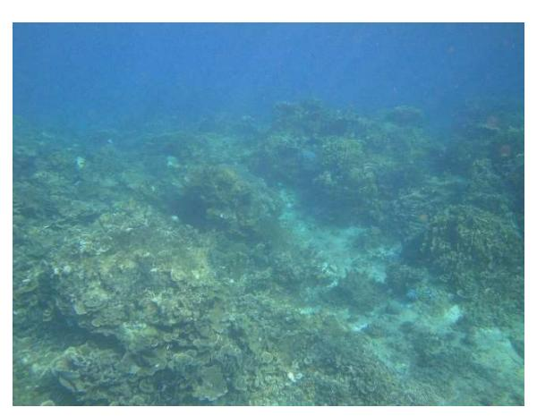

## 地点 85 新城島水路部礁池内

調査日: 令和6年10月21日

サンゴ類生育型:Ⅳ(特定類優占型)

サンゴ類被度:60% 昨年のサンゴ類被度:50% ミトリイシ類の新規加入:3群体

貝類食痕ランク:2

写真:調査地点の海中景観

コメント:海藻少ない、台風あり、マリンレジャー業者

によるアンカー痕多い

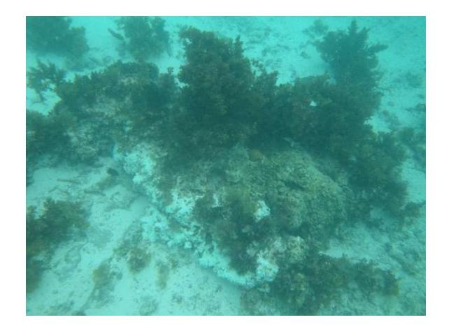

## 地点87アーサーピー内縁

調査日:令和6年10月25日 サンゴ類生育型:V(多種混成型)

サンゴ類被度:10%未満 昨年のサンゴ類被度:10%未満 計 引 が類の新規加入:5 群体

貝類食痕ランク:2 写真:調査地点の海中景観

コメント:海藻多い、アナサンゴモドキ群体の死亡多い

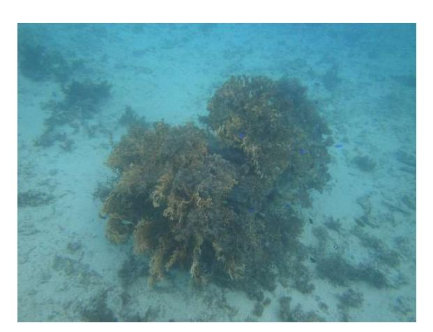

## 地点88アーサーピー内縁

調査日:令和6年10月26日 サンゴ類生育型:V(多種混成型)

サンゴ類被度:10% 昨年のサンゴ類被度:10% ミドリ が類の新規加入:3 群体

貝類食痕ランク:2

付図 2-19. 各調査地点の海中景観及び概況

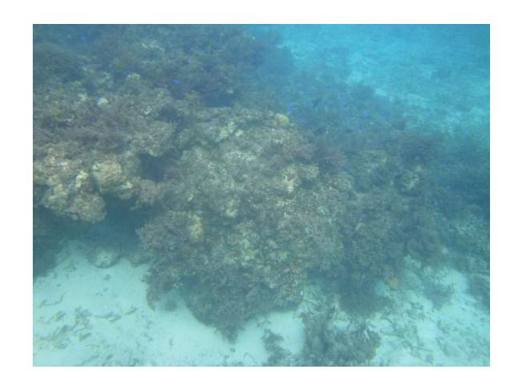

## 地点89 アーサーピー内縁

調査日:令和6年10月26日 サンゴ類生育型:V(多種混成型)

サンゴ類被度:10%未満 昨年のサンゴ類被度:5%未満 計リ砂類の新規加入:8群体

貝類食痕ランク:2

写真:調査地点の海中景観 コメント:海藻多い

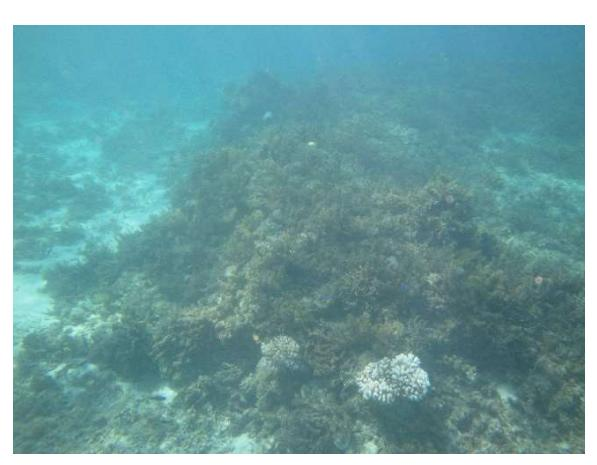

## 地点 90 アーサーピー内縁

調査日:令和 6 年 10 月 26 日 サンゴ類生育型:V (多種混成型)

サンゴ類被度:10%未満 昨年のサンゴ類被度:10%未満 計 引 引 引 引 引 計 付 計 付 計 付 計 付 計 付 計 付 計 付

貝類食痕ランク:2

写真:調査地点の海中景観 コメント:海藻多い

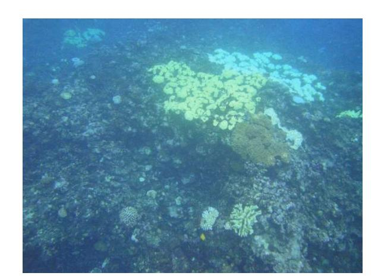

## 地点 93 ウマノハピー外縁

調査日:令和6年11月3日 サンゴ類生育型:V(多種混成型)

サンゴ類被度:10% 昨年のサンゴ類被度:20% ミドリイン類の新規加入:5 群体

貝類食痕ランク:2 写真:調査地点の海中景観

コメント:海藻少ない、台風大、ソフトコーラル白色の

群体多い

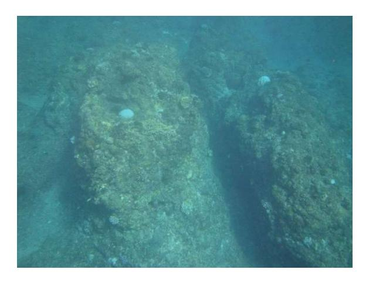

## 地点 94 黒島南西岸礁外縁

調査日:令和6年10月21日 サンゴ類生育型:V(多種混成型)

サンゴ類被度:20% 昨年のサンゴ類被度:20%

ミドリジ類の新規加入:7群体 貝類食痕ランク:2

付図 2-20. 各調査地点の海中景観及び概況

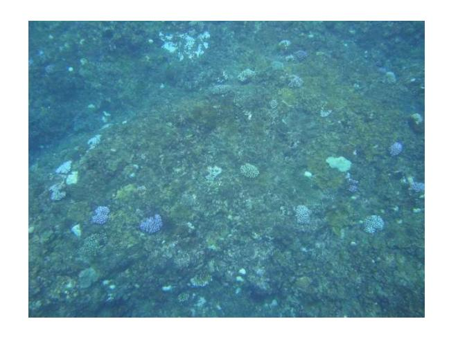

## 地点 95 黒島南岸礁外縁

調査日:令和6年10月21日 サンゴ類生育型:V(多種混成型)

サンゴ類被度:40% 昨年のサンゴ類被度:60% ミトリイン類の新規加入:1群体

貝類食痕ランク:2

写真:調査地点の海中景観 コメント:海藻少ない

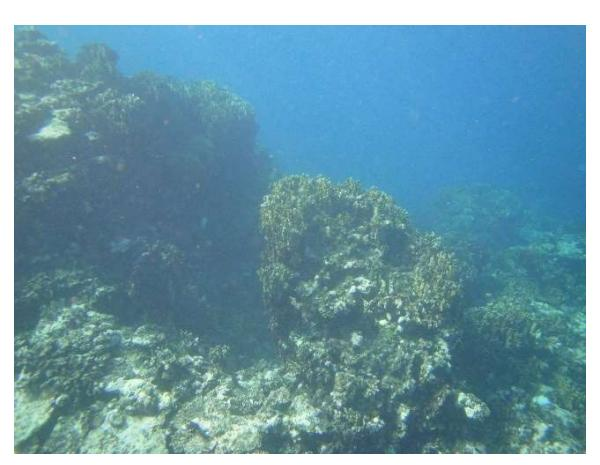

## 地点 96 キャングチ海中公園地区

調査日:令和6年10月21日 サンゴ類生育型:V(多種混成型)

サンゴ類被度:10%未満

昨年のサンゴ類被度:10%未満 ミドリイシ類の新規加入:6群体

貝類食痕ランク:2

写真:調査地点の海中景観

コメント:海藻少ない、アオサンゴ生長し被度増加、海

底の枝状ミドリイシ群集ほぼ全滅

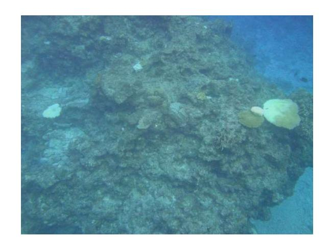

## 地点 97 黒島東岸礁外縁

調査日:令和6年11月4日 サンゴ類生育型:V(多種混成型)

サンゴ類被度:5%未満

昨年のサンゴ類被度:10%未満 ミト・リ が類の新規加入:5 群体

貝類食痕ランク:2

写真:調査地点の海中景観 コメント:海藻少ない、台風大

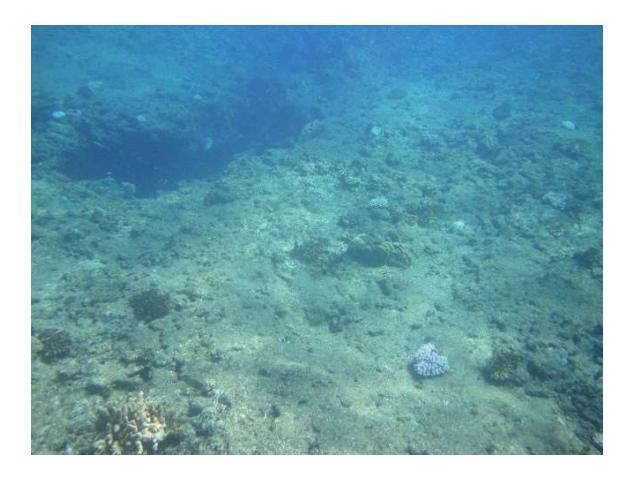

## 地点 98 新城島上地東岸礁外縁

調査日:令和6年10月21日 サンゴ類生育型:V(多種混成型)

サンゴ類被度:10%未満 昨年のサンゴ類被度:10% ミトリイシ類の新規加入:1群体

貝類食痕ランク:2

付図 2-21. 各調査地点の海中景観及び概況

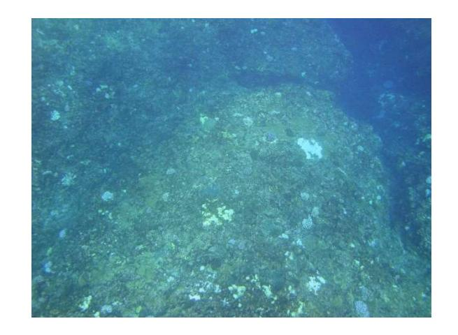

#### 地点 99 新城島下地南東岸礁外縁

調査日:令和6年10月21日 サンゴ類生育型:V(多種混成型)

サンゴ類被度:30% 昨年のサンゴ類被度:30% ミドリイン類の新規加入:3群体

貝類食痕ランク:2

写真:調査地点の海中景観 コメント:海藻少ない

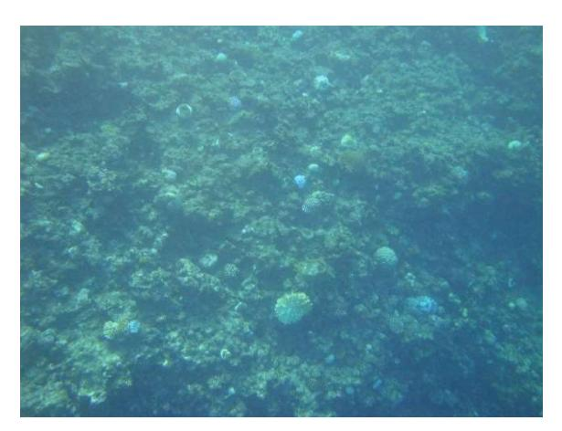

## 地点 100 新城島下地西岸礁外縁

調査日:令和6年10月21日 サンゴ類生育型:V(多種混成型)

サンゴ類被度:10%未満 昨年のサンゴ類被度:10% ミトリイク類の新規加入:2群体

貝類食痕ランク:2

写真:調査地点の海中景観 コメント:海藻少ない

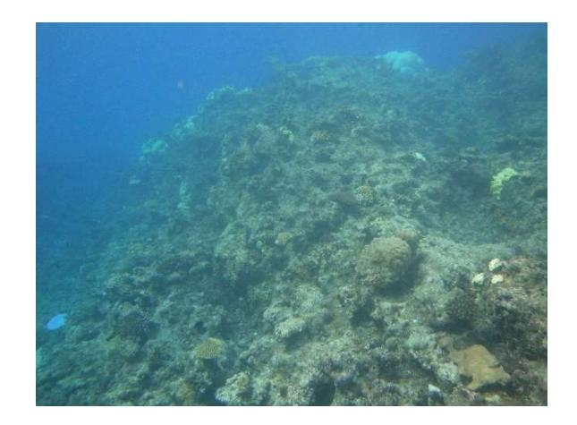

## 地点 101 新城島北西沖離礁

調査日:令和6年10月28日 サンゴ類生育型:V(多種混成型)

サンゴ類被度:10%未満 昨年のサンゴ類被度:10%未満 ミトリ が類の新規加入:6群体

貝類食痕ランク:2

写真:調査地点の海中景観 コメント:海藻並み

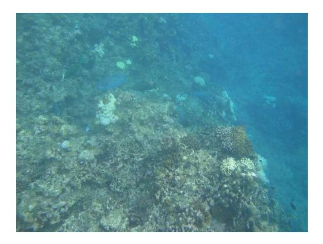

## 地点 102 新城島一西表島間離礁

調査日:令和6年10月28日 サンゴ類生育型:V(多種混成型)

サンゴ類被度:10%未満 昨年のサンゴ類被度:30% 計 リ が類の新規加入:4 群体

貝類食痕ランク:2 写真:調査地点の海中景観

コメント:海藻少ない、ユビエダハマサンゴ群体全滅状

態 (名嘉調査範囲)

付図 2-22. 各調査地点の海中景観及び概況

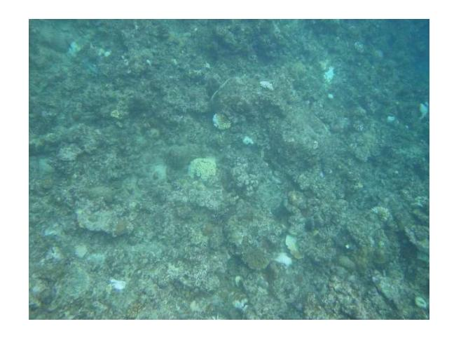

#### 地点 103 南風見崎沖離礁外縁東

調査日:令和6年10月16日 サンゴ類生育型:V(多種混成型)

サンゴ類被度:10% 昨年のサンゴ類被度:20% ミトリイシ類の新規加入:1 群体

貝類食痕ランク:2

写真:調査地点の海中景観

コメント:海藻少ない、ソフトコーラル白色の群体多い

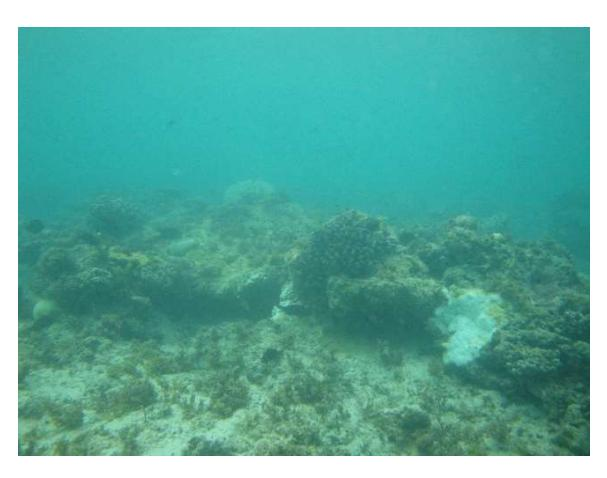

## 地点 104 新城島一西表島間離礁

調査日:令和6年10月28日 サンゴ類生育型:V(多種混成型)

サンゴ類被度:10%

昨年のサンゴ類被度:10% ミト・リや類の新規加入:3群体

貝類食痕ランク:2

写真:調査地点の海中景観

コメント:海藻多い、ハナヤサイサンゴ類死亡群体多い

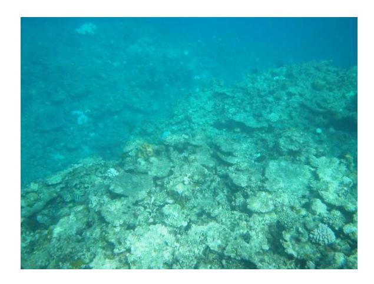

## 地点 105 黑島一新城島間大型離礁

調査日:令和6年10月21日 サンゴ類生育型:V(多種混成型)

サンゴ類被度:20% 昨年のサンゴ類被度:20% ミドリイン類の新規加入:1群体

貝類食痕ランク:2 写真:調査地点の海中景観

コメント:海藻少ない、ミドリイシ類ほぼ全滅に近い状

熊

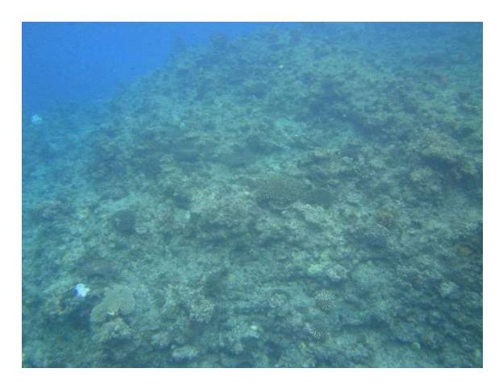

## 地点 106 黒島北西沖離礁

調査日:令和6年11月20日 サンゴ類生育型:V(多種混成型)

サンゴ類被度:10%未満 昨年のサンゴ類被度:20% 計リ分類の新規加入:3群体

貝類食痕ランク:2

付図 2-23. 各調査地点の海中景観及び概況

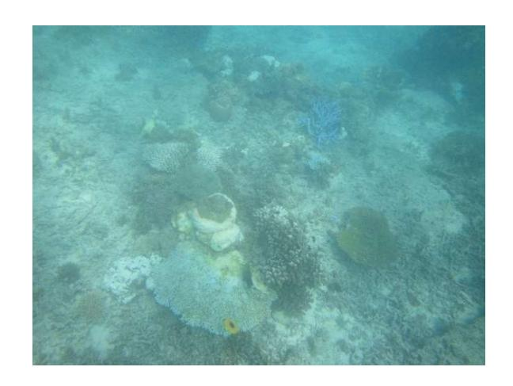

## 地点 107 小浜島南沖離礁

調査日:令和6年10月27日 サンゴ類生育型:V(多種混成型)

サンゴ類被度:30% 昨年のサンゴ類被度:40% ミト・リイシ類の新規加入:3群体

貝類食痕ランク:2

写真:調査地点の海中景観 コメント:海藻少ない

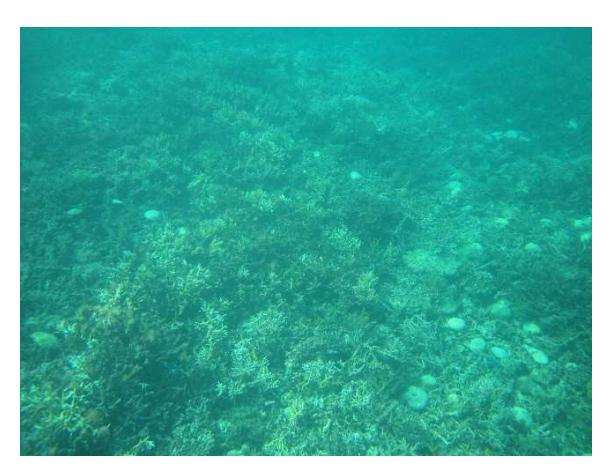

## 地点 108 ヨナラ水道南沖離礁

調査日:令和6年10月27日 サンゴ類生育型:V(多種混成型)

サンゴ類被度:30% 昨年のサンゴ類被度:30% 計 引 り 利の新規加入:3 群体

貝類食痕ランク:2

写真:調査地点の海中景観 コメント:海藻多い

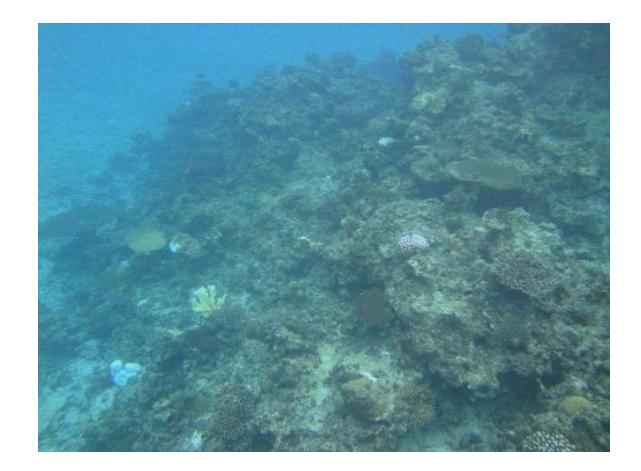

## 地点 109 竹富島南沖離礁

調査日:令和6年11月22日 サンゴ類生育型:V(多種混成型)

サンゴ類被度:20% 昨年のサンゴ類被度:30% ミドリイシ類の新規加入:8群体

貝類食痕ランク:2 写真:調査地点の海中景観 コメント:海藻少ない、台風あり

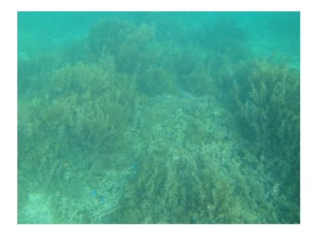

## 地点 110 小浜島東沖離礁

調査日:令和6年10月22日 サンゴ類生育型:V(多種混成型)

サンゴ類被度:10%未満 昨年のサンゴ類被度:5%未満 ミドリイシ類の新規加入:1 群体

貝類食痕ランク:2 写真:調査地点の海中景観

コメント:海藻多い、紫色の枝状(網状)カイメン昨年度

よりも減少

付図 2-24. 各調査地点の海中景観及び概況

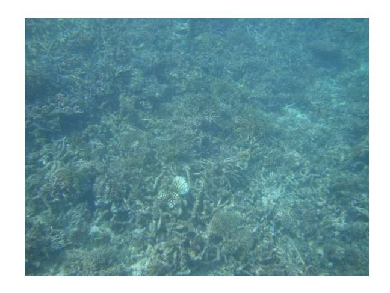

#### 地点 111 小浜島南東沖離礁

調査日:令和6年11月9日 サンゴ類生育型:V(多種混成型)

サンゴ類被度:20% 昨年のサンゴ類被度:30% ミトリイン類の新規加入:2群体

貝類食痕ランク:2

写真:調査地点の海中景観 コメント:海藻多い

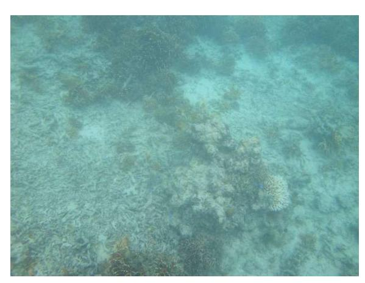

## 地点 112 タキドングチ海中公園地区

調査日:令和6年11月5日

サンゴ類生育型:IV(特定類優占型)

サンゴ類被度:20% 昨年のサンゴ類被度:30% ミトリ 小類の新規加入:25 群体

貝類食痕ランク:2

写真:調査地点の海中景観

コメント:海藻多い、台風あり、台風 21 号による海底砂

再懸濁による影響継続し濁りひどい

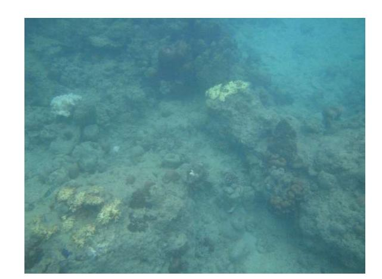

## 地点 113 西表島仲間崎沖離礁

調査日:令和6年11月20日 サンゴ類生育型:V(多種混成型)

サンゴ類被度:20% 昨年のサンゴ類被度:30% ミドリイシ類の新規加入:5群体

貝類食痕ランク:2

写真:調査地点の海中景観 コメント:海藻少ない

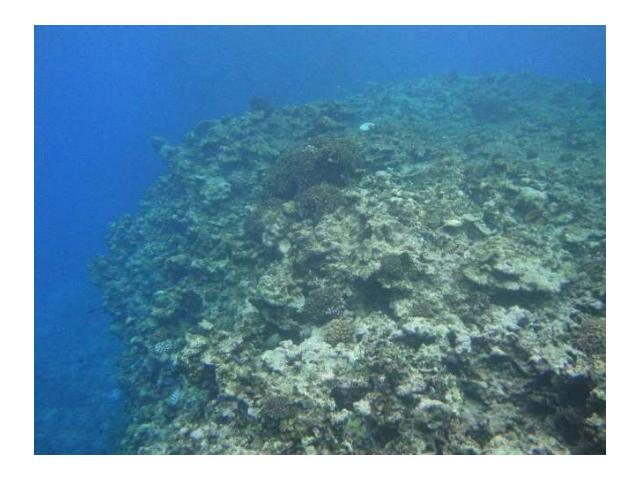

## 地点 114 竹富島南沖離礁

調査日:令和6年11月21日 サンゴ類生育型:V(多種混成型)

サンゴ類被度:10%未満 昨年のサンゴ類被度:20% 計 引 が類の新規加入:8 群体

貝類食痕ランク:2

写真:調査地点の海中景観 コメント:海藻少ない、台風あり

付図 2-25. 各調査地点の海中景観及び概況

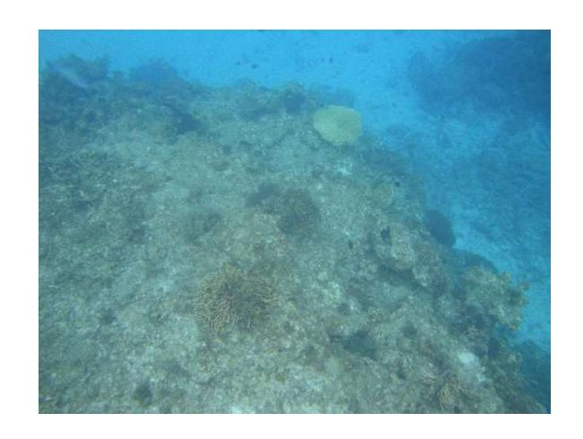

## 地点 115 ウマノハピー礁内

調査日:令和6年11月5日 サンゴ類生育型:V(多種混成型)

サンゴ類被度:10%未満 昨年のサンゴ類被度:10%未満 計 引 が類の新規加入:2 群体

貝類食痕ランク:2

写真:調査地点の海中景観 コメント:海藻少ない、台風あり

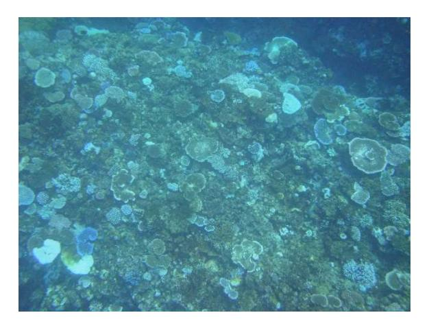

## 地点 116 鵜離島前離礁

調査日:令和6年10月17日 サンゴ類生育型:V(多種混成型)

サンゴ類被度:50% 昨年のサンゴ類被度:40% ミドリイシ類の新規加入:34 群体

貝類食痕ランク:2

写真:調査地点の海中景観 コメント:海藻少ない、台風あり

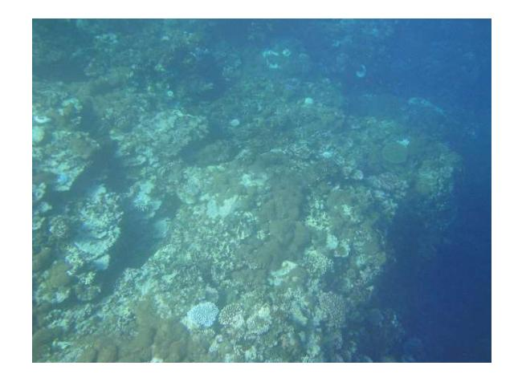

## 地点 120 ユツン湾口礁縁

調査日:令和6年10月18日 サンゴ類生育型:V(多種混成型)

サンゴ類被度:20% 昨年のサンゴ類被度:20% ミドリイシ類の新規加入:40群体

貝類食痕ランク:2 写真:調査地点の海中景観 コメント:海藻少ない

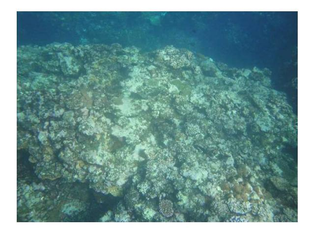

## 地点 121 船浦沖離礁

調査日:令和6年10月18日 サンゴ類生育型:V(多種混成型)

リノコ類生育空: V (多種)成空

サンゴ類被度:10% 昨年のサンゴ類被度:10% ミドリイシ類の新規加入:12 群体

貝類食痕ランク:2

付図 2-26. 各調査地点の海中景観及び概況

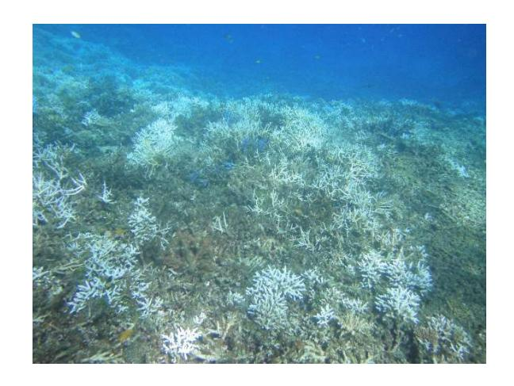

## 地点 122 バラス島西

調査日: 令和6年10月18日

サンゴ類生育型:I(枝状ミドリイシ優占型)

サンゴ類被度:30% 昨年のサンゴ類被度:30% ミドリイシ類の新規加入:11 群体

貝類食痕ランク:3

写真:調査地点の海中景観 コメント:海藻多い、台風あり

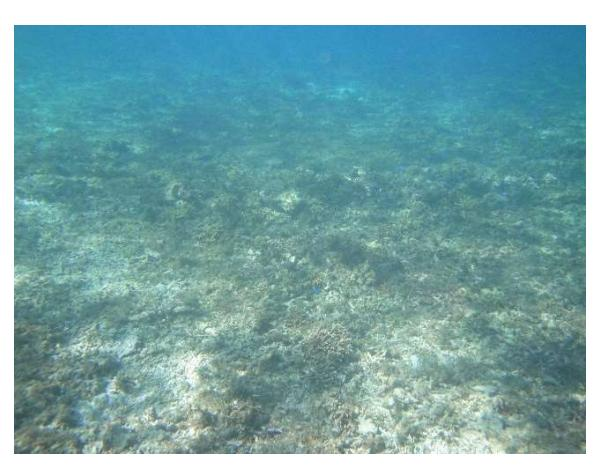

## 地点 123 鳩間島南東礁池

調査日:令和6年10月18日

サンゴ類生育型: V (多種混成型)

サンゴ類被度:20%

昨年のサンゴ類被度:10% ミト・リ が類の新規加入:0群体

貝類食痕ランク:2

写真:調査地点の海中景観

コメント:海藻多い、台風あり、南側範囲外葉状コモン

サンゴ群落あり

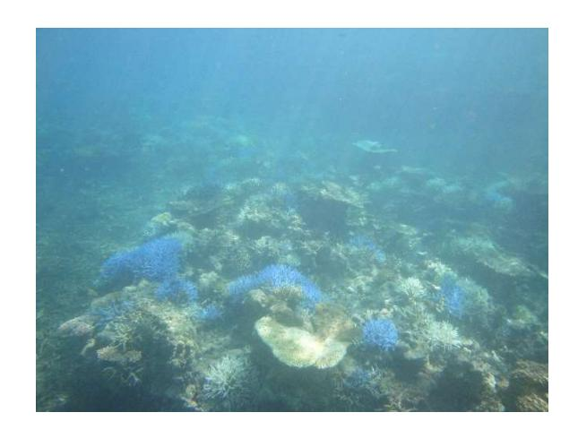

## 地点 124 鳩間島南東礁池

調査日:令和6年10月18日 サンゴ類生育型:V(多種混成型)

サンゴ類被度:20% 昨年のサンゴ類被度:20% ミドリイク類の新規加入:24 群体

貝類食痕ランク:2 写真:調査地点の海中景観 コメント:海藻少ない、台風あり

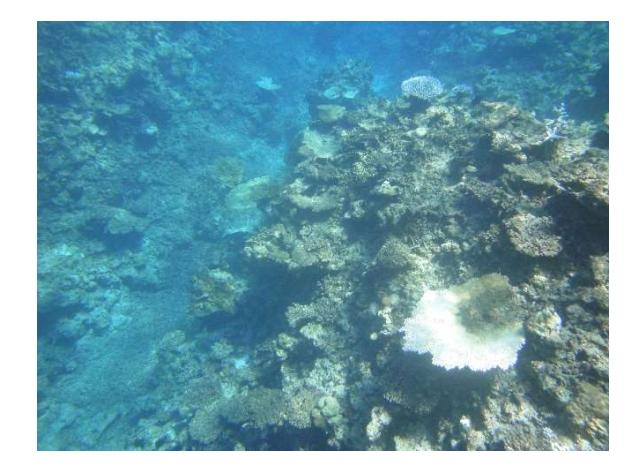

## 地点 125 鳩間島南西沖離礁

調査日:令和6年10月18日 サンゴ類生育型:V(多種混成型)

サンゴ類被度:10%未満 昨年のサンゴ類被度:10%未満 ミドリイシ類の新規加入:36 群体

貝類食痕ランク:2 写真:調査地点の海中景観 コメント:海藻少ない、台風あり

付図 2-27. 各調査地点の海中景観及び概況

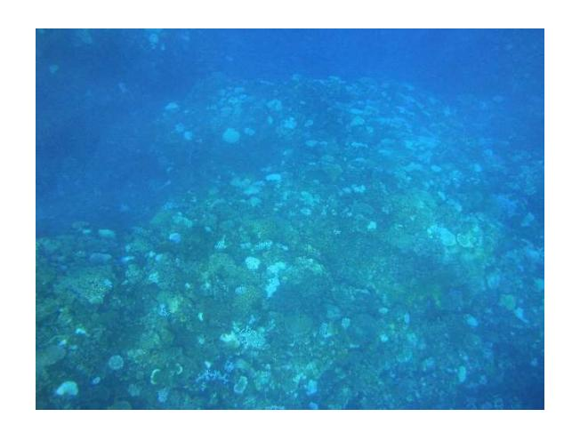

## 地点 126 星砂浜前礁緑

調査日:令和6年10月18日 サンゴ類生育型:V(多種混成型)

サンゴ類被度:30% 昨年のサンゴ類被度:40% ミドリイシ類の新規加入:17 群体

貝類食痕ランク:2

写真:調査地点の海中景観 コメント:海藻少ない

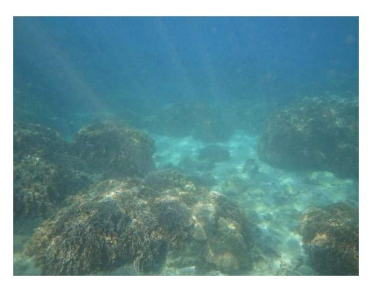

## 地点 126' 星砂浜前礁池内

調査日: 令和6年10月18日

サンゴ類生育型: IV (特定類優占型)

サンゴ類被度:20% 昨年のサンゴ類被度:20% ミドリイク類の新規加入:0群体

貝類食痕ランク:1

写真:調査地点の海中景観 コメント:海藻少ない、海草繁茂

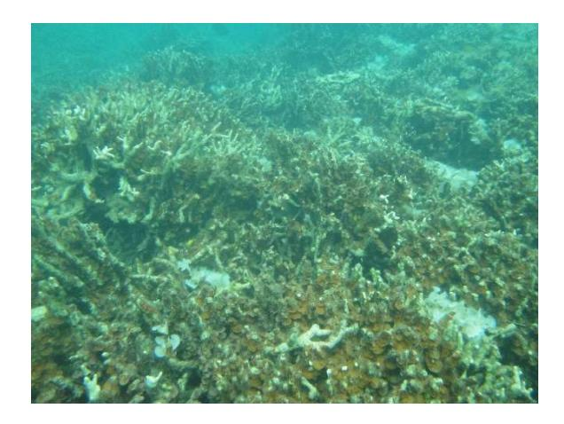

## 地点 127 タコ崎礁縁

調査日: 令和6年10月15日

サンゴ類生育型: IV (特定類優占型)

サンゴ類被度:10% 昨年のサンゴ類被度:10% ミドリイシ類の新規加入:0群体

貝類食痕ランク:1

写真:調査地点の海中景観 コメント:海藻多い

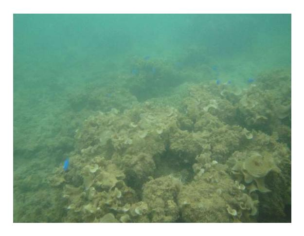

## 地点 127' タコ崎礁浅部

調査日:令和6年10月15日

サンゴ類生育型:Ⅳ(特定類優占型)

サンゴ類被度:5%未満 昨年のサンゴ類被度:5%未満 ミドリイシ類の新規加入:0群体

貝類食痕ランク:1

写真:調査地点の海中景観 コメント:海藻並み

付図 2-28. 各調査地点の海中景観及び概況

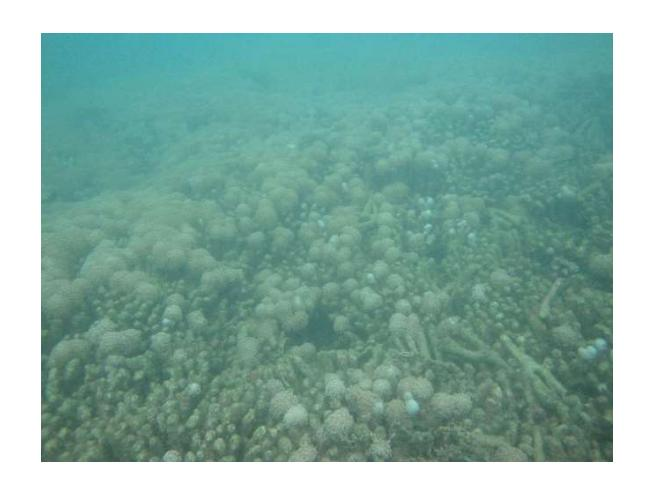

## 地点 129 網取湾奥

調査日:令和6年10月15日

サンゴ類生育型:Ⅳ(特定類優占型)

サンゴ類被度:30% 昨年のサンゴ類被度:40%

ミドリイシ類の新規加入:(観察項目でない)

貝類食痕ランク:1

写真:調査地点の海中景観 コメント:海藻少ない

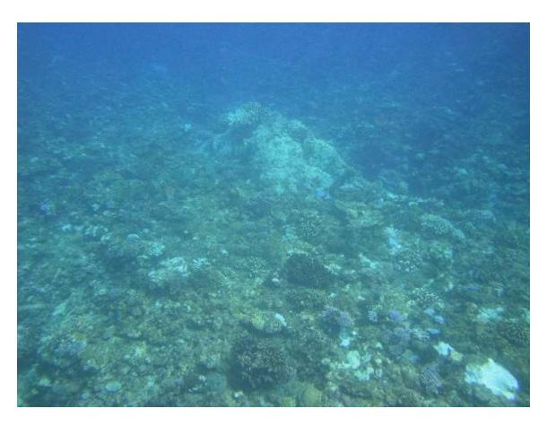

## 地点 130 ヨナソネ

調査日:令和6年10月15日

サンゴ類生育型: V (多種混成型) サンゴ類被度:50%

昨年のサンゴ類被度:60% ミドリジ類の新規加入:7群体

貝類食痕ランク:2

写真:調査地点の海中景観

コメント:海藻少ない、台風あり、ソフトコーラルほぼ

すべて白色

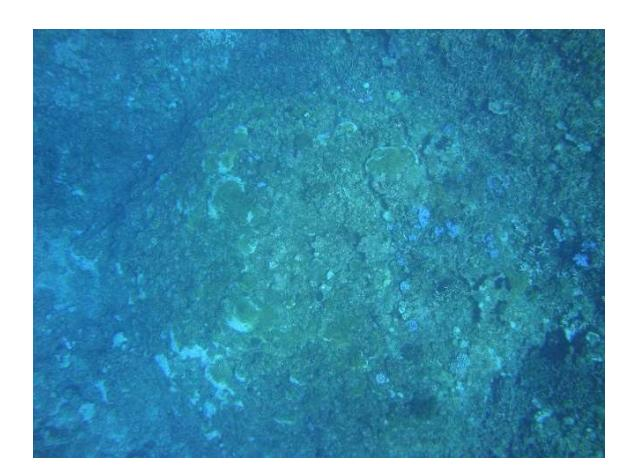

## 地点 131 崎山礁縁

調査日:令和6年10月15日

サンゴ類生育型:IV(特定類優占型)

サンゴ類被度:10%未満 昨年のサンゴ類被度:20%

ミドリイシ類の新規加入:(観察項目でない)

貝類食痕ランク:1

写真:調査地点の海中景観 コメント:海藻少ない

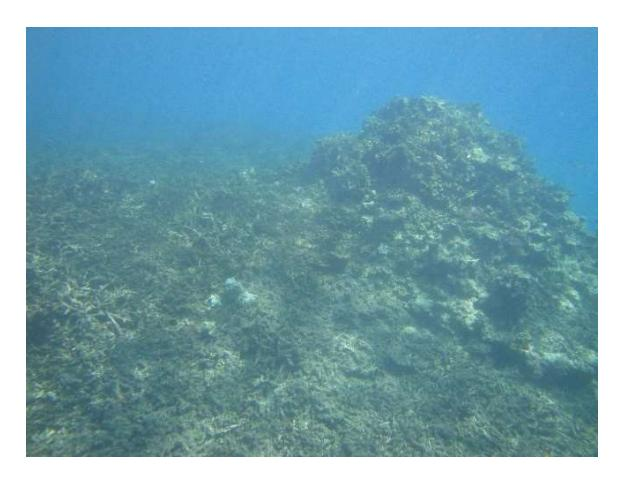

## 地点 132 崎山礁池

調査日:令和6年10月15日

サンゴ類生育型: V (多種混成型)

サンゴ類被度:10% 昨年のサンゴ類被度:10% ミト・リイシ類の新規加入:5群体

貝類食痕ランク:2

写真:調査地点の海中景観 コメント:海藻少ない、台風あり

付図 2-29. 各調査地点の海中景観及び概況

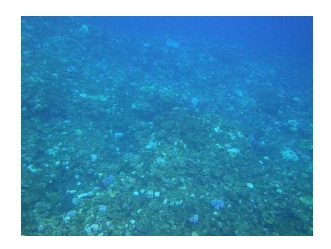

## 地点 133 波照間石

調査日:令和6年10月16日 サンゴ類生育型:V(多種混成型)

サンゴ類被度:40% 昨年のサンゴ類被度:50% ミドリイン類の新規加入:3群体

貝類食痕ランク:2

写真:調査地点の海中景観

コメント:海藻少ない、この調査地点を含む西表島南側はサンゴ群体死亡時期早い(時間経過より8月上旬と推

察)

## 地点 134 鹿川湾中ノ瀬

調査日: 令和6年10月16日

サンゴ類生育型:Ⅳ(特定類優占型)

サンゴ類被度:10%未満 昨年のサンゴ類被度:40%

ミドリイシ類の新規加入:(観察項目でない)

貝類食痕ランク:1

写真:調査地点の海中景観 コメント:海藻少ない

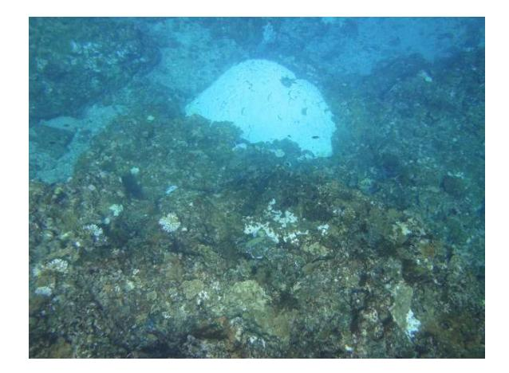

## 地点 135 鹿川湾中ノ瀬

調査日:令和6年10月16日 サンゴ類生育型:V(多種混成型)

サンゴ類被度:50% 昨年のサンゴ類被度:70% ミドリ砂類の新規加入:3群体

貝類食痕ランク:2 写真:調査地点の海中景観

コメント:海藻少ない、ナカンチ東側(名嘉調査範囲)と 西端および南端(調査範囲外)は白化程度大(「死亡」お

よび「白色」の割合高い)

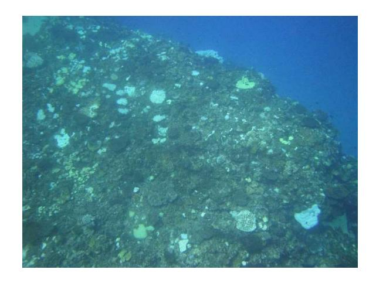

## 地点 136 サザレ浜礁縁

調査日:令和6年10月16日 サンゴ類生育型:V(多種混成型)

サンゴ類被度:20% 昨年のサンゴ類被度:40% ミドリイシ類の新規加入:2 群体

貝類食痕ランク:2

付図 2-30. 各調査地点の海中景観及び概況

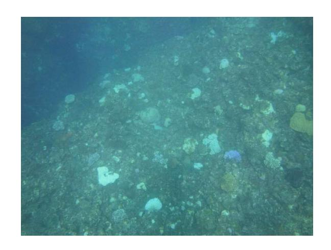

## 地点 137 豊原沖礁縁

調査日:令和6年10月16日 サンゴ類生育型:V(多種混成型)

サンゴ類被度:10% 昨年のサンゴ類被度:10% 計 り が類の新規加入:1 群体

貝類食痕ランク:2

写真:調査地点の海中景観 コメント:海藻少ない

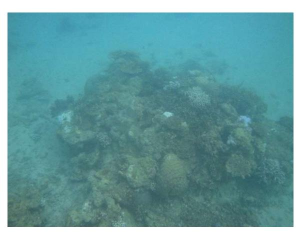

## 地点 138 船浮崎前

調査日:令和6年10月15日 サンゴ類生育型:V(多種混成型)

サンゴ類被度:30% 昨年のサンゴ類被度:30% ミトリの類の新規加入:9群体

貝類食痕ランク:2

写真:調査地点の海中景観 コメント:海藻少ない

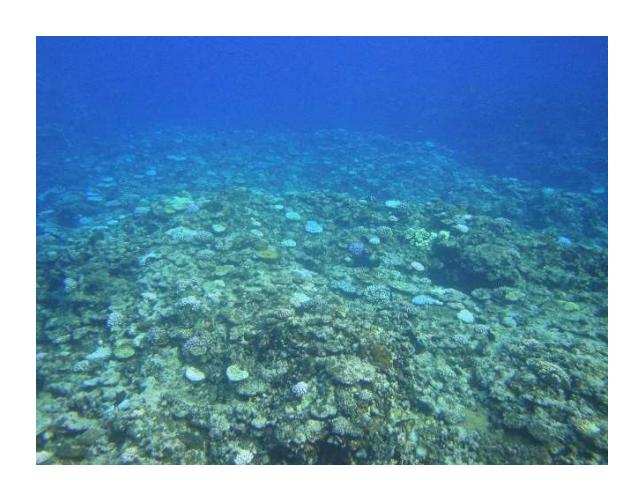

## 地点 139 外パナリ南礁縁

調査日:令和6年10月15日 サンゴ類生育型:V(多種混成型)

サンゴ類被度:10% 昨年のサンゴ類被度:20% ミドリ砂類の新規加入:10群体

貝類食痕ランク:2 写真:調査地点の海中景観

コメント:海藻少ない、台風あり

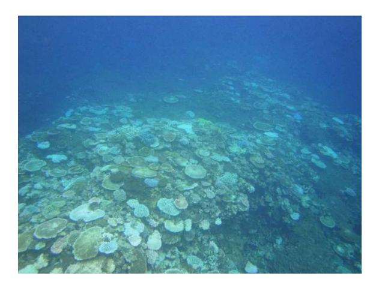

## 地点 141 鳩間島東礁縁

調査日:令和6年10月18日 サンゴ類生育型:V(多種混成型)

サンゴ類被度:50%

昨年のサンゴ類被度:60% ミト・リイシ類の新規加入:14群体

貝類食痕ランク:2

付図 2-31. 各調査地点の海中景観及び概況

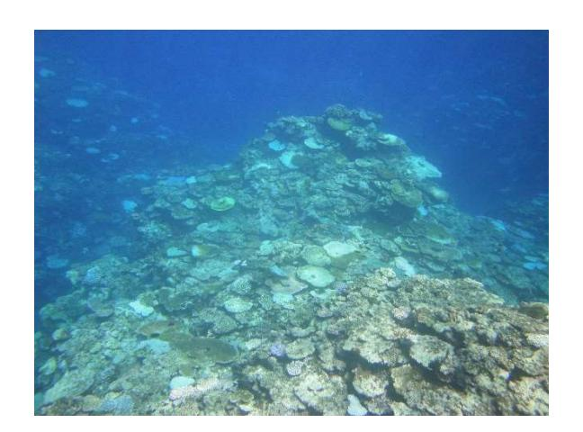

## 地点 142 鳩間島北礁縁

調査日:令和6年10月18日

サンゴ類生育型: I (卓状ミドリイシ優占型)

サンゴ類被度:30% 昨年のサンゴ類被度:30% ミトリ が類の新規加入:11 群体

貝類食痕ランク:2

付図 2-32. 各調査地点の海中景観及び概況

## ―――――――――――――――――――――――――――――――――――― 2024 年度

西表石垣国立公園石西礁湖及びその近隣海域における サンゴ礁モニタリング調査報告書

令和 7(2025)年 3 月

環境省自然環境局 生物多様性センター 〒403-0005 山梨県富士吉田市上吉田剣丸尾 5597-1 電話:0555-72-6033

――――――――――――――――――――――――――――――――――――

――――――――――――――――――――――――――――――――――――

業務名 令和 6 年度重要生態系監視地域モニタリング推進事業 (サンゴ礁調査)

請負者 一般財団法人 自然環境研究センター 〒130-8606 東京都墨田区江東橋 3-3-7

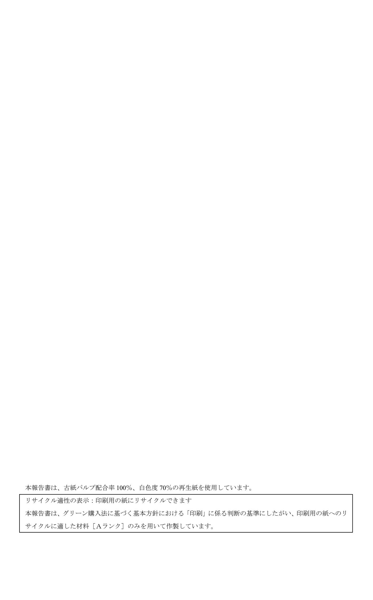