# ᖹᡂ 24 ᖺᗘ㻌 す⾲▼ᇉᅜ❧බᅬ▼す♋†ཬ䜃䛭䛾㏆㞄ᾏᇦ㻌 䛻䛚䛡䜛䝃䞁䝂♋䝰䝙䝍䝸䞁䜾ㄪᰝሗ࿌᭩

ᖹᡂ 25㸦2013㸧ᖺ 3 ᭶ ⎔ቃ┬⮬↛⎔ቃᒁ ⏕≀ከᵝᛶ࣮ࢱࣥࢭ

# ᖹᡂ 24 ᖺᗘ㻌 す⾲▼ᇉᅜ❧බᅬ▼す♋†ཬ䜃䛭䛾㏆㞄ᾏᇦ㻌 䛻䛚䛡䜛䝃䞁䝂♋䝰䝙䝍䝸䞁䜾ㄪᰝሗ࿌᭩

ᖹᡂ 25㸦2013㸧ᖺ 3 ᭶ ⎔ቃ┬⮬↛⎔ቃᒁ ⏕≀ከᵝᛶ࣮ࢱࣥࢭ

## ࡵࡌࡣ

▼す♋†ཬࡧ࿘㎶ࡢᾏᇦࠊࡣ1970㹼80 ᖺ௦ࡢࢹࢺࣄࢽ࢜ࡢⓎ⏕ࢇࠊ࡚ࡗࡼ ࡣᖺ1998ࠊࡀࡓࡁ࡚ࡋᅇࠎ㝖ࡣែ⣔♋⏕ࢦࣥࢧࠊᚋࡢࡑࠋࡓࡋ⁛Ṛࡀ㞟⩌ࢦࣥࢧࡢ క㛤Ⓨࠊࡓࡲࠋࡓࡅཷࢆᐖ⿕࡞ࡁࡧࠊࡁ㉳ࡀ㇟⌧ⓑࡢࢦࣥࢧࡿࡼ᪼ୖࡢ ᾏỈ ࡞༴ᶵⓗ᭦ࢆែ⣔♋⏕ࢦࣥࢧࠊࡣࡃேⅭⓗࡢ࡞Ỉά⏕ࡸ㉥ᅵὶฟࡢࡽ㝣ᆅ࠺ ࡶࢆ㣗ᐖ࡞ࡁࠊࡋቑᛴࡧࡀࢹࢺࣄࢽ࢜ࡣᖺ௨㝆2001ࡽࡉࠋࡿ࠸࡛ࢇ㎸࠸㏣ἣ≧ ࠼⤯ࠊࡅཷࢆᙳ㡪࡞ࠎᵝேⅭⓗࡧⓗཬ⮬↛ࡣែ⣔♋⏕ࢦࣥࢧ࠺ࡼࡢࡇࠋࡿ࠸࡚ࡋࡽࡓ ࡍᢕᥱ࡚ࡋ⥆⥅ࢆ≦⌧ࡢែ⣔♋⏕ࢦࣥࢧࠊࡣࡵࡓࡃ࠸࡚ࡋಖࢆࢀࡇࠊࡾ࠾࡚ࡋኚࡎ ࠋࡿ࠶࡛Ḟྍࡀㄪᰝࢢࣥࣜࢱࢽࣔࡾࡲࡘࠊࡇࡿ

ࠊࡵࡓࡢࡇ⎔ቃ┬ࠊࡣ࡛▼ᇉᓥ࿘㎶ᾏᇦࠊ▼す♋†ཬࡧす⾲ᓥ࿘㎶ᾏᇦࠊ࡚࠸࠾ᗈᇦ ⓗࡢࢦࣥࢧ࡞⏕ᜥ≧ἣࢆᢕᥱࡢࡵࡓࡿࡍㄪᰝࢆ足ࠋࡿ࠸࡚ࡗ▼す♋†ࡣ࡚࠸ࡘ1983ᖺᗘ ㈈⏫ᐩ➉ࡣ࡛ࡲᖺᗘ1997㹼1983㸦ࡿ࠼ᩘࢆ┠ᅇ30࡛ᖺᗘࠊࡾ࠾࡚ࢀࡉ⥆⥅ࡀㄪᰝࡽ ᅋἲேᾏ୰බᅬ࣮ࢱࣥࢭඵ㔜ᒣᾏ୰බᅬ◊✲ᡤࡢඹྠㄪᰝࠊ1998㹼2001ᖺᗘࡣ⎔ቃ┬㈈ ᅋἲேᾏ୰බᅬ࣮ࢱࣥࢭඵ㔜ᒣᾏ୰බᅬ◊✲ᡤࡢඹྠㄪᰝࠊ2002ᖺᗘ௨㝆ࡣ⎔ቃ┬ᴗ ࡚ࡋᐇ㸧ࠋ୍᪉ࠊ▼ᇉᓥ࿘㎶ᾏᇦཬࡧす⾲ᓥ࿘㎶ᾏᇦࡣ࡚࠸ࡘⓑ┤ᚋࡢ1998ᖺᗘ ࠋࡓࡗ࡞ㄪᰝࡢ┠ᅇ15࡛ᖺᗘࠊࡋ㛤ጞࢆㄪᰝ

ࠊ࠾࡞2003ᖺᗘࡽᮏㄪᰝࡣ⎔ቃ┬ࡢ㔜せ⏕ែ⣔┘どᆅᇦࢢࣥࣜࢱࢽࣔ᥎㐍ᴗ㸦ࢽࣔ ࠋࡿ࠸࡚ࢀࡽࡵ㐍࡚ࡋ⎔୍ࡢ㸧1000ࢺࢧࢢࣥࣜࢱ

## ࠚᇉᓥ࿘㎶ᾏᇦ▼࠙

- ࠋࡓࡗ࡞ࡣືኚࡽ๓ᖺࠊࡾ࠶࡛㸣20 ࡣᗘ⿕ࢦࣥࢧᖹᆒࡢㄪᰝᆅⅬ 77 -
- ᆅⅬ࠸㧗ࡶ᭱ࠊࡾ࠶࡛ᆅⅬ 8 ࡣࡢࡓࡋቑຍୖ௨ࢺ࣏ࣥ 10 ࡾࡼ๓ᖺࡀᗘ⿕ࢦࣥࢧ -ࠋࡓࡗ࠶࡛ቑຍࡢࢺ࣏ࣥ 15 ࡛㸧70 㸦ᆅⅬ
- - 77 ᆅⅬ୰ 64 ᆅⅬࠊࡣ๓ᖺࡢࡽ龠ᗘࡢኚࡀs10 ࢺ࣏ࣥ௨ෆࡰࠕࠊࡾ࠶࡛ኚ ࠋࡓࢀࡉホ౯ࠖࡋ࡞
- ࡛ᆅⅬ 2 ࡢࡕ࠺ࡢࡑࠊࡾ࠶࡛ᆅⅬ 5 ࡣࡢࡓࡋῶᑡୖ௨ࢺ࣏ࣥ 10 ࡽ๓ᖺࡀᗘ ⿕-4㣗ᐖ㸦ࡿࡼࢹࢺࣄࢽ࢜ࠊࡣཎᅉ࡞ࡢᗘῶᑡ⿕ࠋࡓࡋῶᑡୖ௨ࢺ࣏ࣥ 30 ࡣ ᆅⅬ㸧ྎ㢼ࡿࡼ龠ᐖ㸦1 ᆅⅬ㸧ࠋࡓࡗ࠶࡛
- ᆅⅬ 38 ࡢᖺᗘࠊࡾ࠶࡛ᆅⅬ 18 ࡢㄪᰝᆅⅬ୰ 77ࠊࡣࡢࡓࢀࡉほᐹࡀࢹࢺࣄࢽ࢜ -ࠋࡓࡋῶᑡࡃࡁࡽ
- ᒇⰋ㒊ᓮ▼ᕝᖹ≉ࠊࡋ⨨すᓊࡀࢇࠊࡣᆅⅬࡓࢀࡉほᐹࡀࢹࢺࣄࢽ࢜ -༙ᓥ࿘㎶࡛ಶయᩘࡀከࠋࡓࡗᖺᗘࡀࢹࢺࣄࢽ࢜ከࡓࡗᖹஂಖ༙ᓥࡽᕝᖹ࿘ ࠋࡓ࠸࡚ࡋῶᑡࡀᩘほᐹࡣ࡛㎶
- ࡗ࠶࡛ಶయ 177 ࡚ࡋῶᑡࡃࡁࡽಶయ 848 ࡢ๓ᖺࠊࡣᩘほᐹಶయ⥲ࡢࢹࢺࣄࢽ࢜ -࣋ࣞ㏻ᖖศᕸࠊࡾ࠶࡛ 1.1 ࡣᆅⅬᖹᆒࡢᩘほᐹ⟬ศ 15 ࡢࡾࡓ࠶ே୍ࠊࡓࡲࠋࡓ ࠋࡓࡋ♧ࢆ್ࡢࣝ
- - SPSS  ᐃ್ࠊࡣ๓ᖺࡾࡼⱝᖸῶᑡࠊࡣࢀࡇࠋࡓࡋྎ㢼ࡿࡼἼᾉࢦࣥࢧࠊࡵࡓࡢ ࠋ࠸࡞ࢀࡋࡶࡢࡓࢀࡉ㐍ಁࡀฟࡢ≀✚ሁࡢෆ♋

## ࠙▼す♋†ཬࡧす⾲ᓥ࿘㎶ᾏᇦࠚ

- ࠋࡓࡗ࡞ࡣືኚࡽ๓ᖺࠊࡾ࠶࡛㸣30 ࡣᗘ⿕ࢦࣥࢧᖹᆒࡢ࡛ㄪᰝᆅⅬ -
- - ๓ᖺࢦࣥࢧࡽ龠ᗘࡀ 10 ࢺ࣏ࣥ௨ୖቑຍࡓࡋᆅⅬࠊࡣᖺᗘࡢ 17 ᆅⅬࡽᖺ ࠋࡓࡋῶᑡᆅⅬ 12 ࡣᗘ
- - 125 ㄪᰝᆅⅬ୰ࠊ95 ᆅⅬ㸦ᖺᗘ 104 ᆅⅬ㸧ࡣ๓ᖺࡢࡽ龠ᗘࡢኚࡀs10 ࣏ ࠋࡓࢀࡉホ౯ࠖࡋ࡞ኚࡰࠕࠊࡵࡓࡿ࠶࡛௨ෆࢺࣥ
- ࠊᆅⅬ㸧 0 ᖺᗘᆅⅬ㸦 4 ࡣࡢࡓࡋࠖῶᑡࡃࡁࠕୖ௨ࢺ࣏ࣥ 30 ࡀᗘ⿕ࡾࡼ๓ᖺ -ࠋࡓࡗ࠶࡛ᆅⅬ㸧 4 ᖺᗘᆅⅬ㸦 13 ࡀᆅⅬࡓࡋῶᑡࢺ࣏ࣥ 30 ࡽࢺ࣏ࣥ 10
- - ࡀࢹࢺࣄࢽ࢜☜ㄆࠊࡣࡢࡓࢀࡉ125 ㄪᰝᆅⅬ୰ 64 ᆅⅬ㸦ᆅⅬࡢ 51㸣㸧ࠊ࡛๓ᖺ 㸦75 ᆅⅬ㸧ࡶࡾࡼῶᑡࠋࡓࡋ
- ࡃࡁࡽಶయ 1,405 ࡢᖺᗘࠊࡣᩘほᐹಶయ⥲ࡢࢹࢺࣄࢽ࢜ࡿࡅ࠾ㄪᰝᆅⅬ -ࠋࡓࡗ࠶࡛ಶయ 558 ࡚ࡋῶᑡ
- - ᖺᗘࡣኟᏘྎ㢼ࡀከࠊࡃ75 ᆅⅬ㸦ㄪᰝᆅⅬࡢ 61㸣㸧࡛ྎ㢼ࡢἼᾉࢧࡿࡼ つᶍ࡛す㒊ࡧ㒊ཬࡢᓥ⾲す㒊ࡢ†♋す▼≉ࠋࡓࢀࡉほᐹࡀᦆ◚ࡢࢦࣥ ࠋࡓࢀࡉቯ◚ࡀ㞟⩌ࢦࣥࢧ
- - ᖺᗘࡶⓑ⌧㇟ࡀ☜ㄆࠊࡀࡓࢀࡉㄪᰝᆅⅬࡿࡅ࠾ᖹᆒⓑ⋡ࡣ 17㸣㸦๓ᖺ ࠋࡓࡗ࠶࡛㍍ᚤࡣᙳ㡪ࡢᗘ⿕ࢦࣥࢧࠊࡾ࠶࡛㸣௨ୗ0.1 ࡣ≼/ᖹᆒṚஸࠊ㸣㸧32
- 11 ࡣࡢࡓࢀࡉほᐹࡀ㯮ᖏࠊᆅⅬ 41 ࡣᆅⅬࡓࢀࡉほᐹࡀ(19)⭘ࠊㄪᰝᆅⅬ୰ 125 -ࠋࡓࡗ࠶࡛ᆅⅬ 106 ࡣࡢࡓࢀࡉほᐹࡀ࣒࣮ࣟࢻࣥࢩࢺ࣡࣍ࠊᆅⅬ

## SUMMARY

## ࠙**Ishigaki Island**ࠚ

- The average coral cover recorded at the 77 monitoring stations in Fiscal Year (FY) 2012 was 20㸣which was same as the average coral cover of previous year.
- Among the 77 stations, eight recorded a difference of more than 10 of coral coverage showing the largest increase of 15 from FY 2011.
- Sixty-four of the 77 stations registered less than 10 changes in coral cover and it is concluded no significant changes between FY 2011 and 2012.
- Decreases of more than 10 was recorded at 5 stations between FY 2011 and 2012, of which 2 stations registered reductions greater than 30, which resulted mainly from Acanthaster planci predation for 4 stations and destruction by Typhoon for one station.
- Acanthaster planci were observed at 18 among the 77 stations which showed a great decreasing from the 38 stations of the previous year.
- Acanthaster planci were mostly observed at the western reefs with the core area between Kabira Ishigaki and Yarabu peninsulas. The area between Hirakubo peninsulas and Kabira showed decreasing of the number of Acanthaster planci which was the core area of the previous year.
- The total number of Acanthaster planci observed at all stations of Ishigaki Island was 177 in FY 2012, which decreased from 848 individuals recorded in FY 2011. The average of Acanthasters observed in 15 minutes was 1.1 individual per observer showing a usual density.
- SPSS (Suspended Particle in Sea Sediment) concentrations were a little lower in FY 2012 compared to 2012. This is likely due to the flushing of the sediments by several typhoons in FY 2012.

## ࠙**Sekisei Lagoon and Iriomote Island**ࠚ

- - The average coral cover recorded at the 125 monitoring stations in FY 2012 was 30㸣 which was same as the average coral cover of previous year.
- - Between FY 2011 and 2012, coral cover increased by more than 10 at 12 stations, compared with 17 stations between FY 2010 and 2011.
- - No significant changes in coral communities were recorded at 95 of the 125 stations, which registered less than a 10 differences in coral cover between FY 2011 and 2012.
- - Four stations registered a decrease in coral cover of more than 30 and 13 stations registered a decrease between 10 and 30 in coral cover compared to 2011.
- - Acanthaster planci was observed at 64 stations (51% of the total stations), a decrease over the previous year (75 stations).
- - In total, 558 individuals were recorded in FY 2012, a great decrease over the 1,405 individuals recorded in FY 2011.
- - Coral damage by typhoons were observed at 75 stations (61% of total station). The destruction in large scale was mainly occurred at northern part of lagoon, north and west of Iriomote Island.
- - Coral bleaching was observed in FY 2012, affecting an average of 17% of the corals here. However, bleaching-related coral mortality was less than 0.1% which was registered a slight damage on coral cover.
- - Coral tumors were observed at 41 stations, black band disease was observed at 11 stations and white syndromes were observed at 106 of the 125 monitoring stations.

## 目 次

| _  |     |     |    |
|----|-----|-----|----|
| 14 | 10  | W   | ノフ |
| は  | 1 / | (x) | lι |
|    |     |     |    |

要約

## SUMMARY

| Ι | 調査方法・・・・・・・・・・・・・・・・・・・・・・・・・・1                 |
|---|-------------------------------------------------|
|   | 1. 調査範囲及び地点・・・・・・・・・・・・・・・・ 1                   |
|   | 2. 調査期間・・・・・・・・・・・・・・・・・・・ 1                    |
|   | 3. 調査方法及び調査項目・・・・・・・・・・・・・・ 1                   |
|   | (1) 調査方法・・・・・・・・・・・・・・・・・・・・・・・1                |
|   | (2)調査項目・・・・・・・・・・・・・・・・・・・・・・・・・・・・・・・・・・・・     |
|   | 1) サンゴの生息状況・・・・・・・・・・・・・・・・・・・・・・・・・・・・・・・・・・・・ |
|   | 2) サンゴのかく乱要因・・・・・・・・・・・・・・11                    |
|   | 3) 物理環境・・・・・・・・・・・・・・・・・・・・・・13                 |
|   | 4) 大型定着性魚類・・・・・・・・・・・・・・・・14                    |
|   | 5) 特記事項・・・・・・・・・・・・・・・・・・・・・14                  |
|   | 4. 調査実施者・・・・・・・・・・・・・・・ 14                      |
|   |                                                 |
| П | 調査結果と考察・・・・・・・・・・・・・・・・・・・15                    |
|   | 1. 石垣島周辺海域・・・・・・・・・・・・・・・・ 15                   |
|   | (1) サンゴの生息状況・・・・・・・・・・・・・・・・15                  |
|   | 1) サンゴの被度及び生育型・・・・・・・・・・・・・15                   |
|   | 2) 卓状ミドリイシ類の最大長径・・・・・・・・・・・・20                  |
|   | 3) ミドリイシ類の新規加入・・・・・・・・・・・・・・21                  |
|   | (2) サンゴのかく乱要因の状況・・・・・・・・・・・・・24                 |
|   | 1) オニヒトデ・・・・・・・・・・・・・・・・・・・・・・・24               |
|   | 2) サンゴ食巻貝・・・・・・・・・・・・・・・・・・・・27                 |
|   | 3) 白化現象・・・・・・・・・・・・・・・・・・・・・・・・・・・・・27          |
|   | 4) その他の自然のかく乱・・・・・・・・・・・・30                     |
|   | i ) 台風・・・・・・・・・・・・・・・・・・・30                     |
|   | ii )サンゴの病気・・・・・・・・・・・・・・・・・・30                  |

|    | iii)シルトの堆積状況(SPSS)・・・・・・・・・・・・30                   |
|----|----------------------------------------------------|
|    | (3) 大型定着性魚類・・・・・・・・・・・・・・・ 31                      |
|    | 2. 石西礁湖及び西表島周辺海域・・・・・・・・・・・・・・35                   |
|    | (1) サンゴの生息状況・・・・・・・・・・・・・・・ 35                     |
|    | 1) サンゴの被度及び生育型・・・・・・・・・・・・・・35                     |
|    | 2) 卓状ミドリイシ類の最大長径・・・・・・・・・・・・42                     |
|    | 3) ミドリイシ類の新規加入・・・・・・・・・・・・・・42                     |
|    | (2) サンゴのかく乱要因の状況・・・・・・・・・・・・ 48                    |
|    | 1) オニヒトデ・・・・・・・・・・・・・・・・・・・・・48                    |
|    | 2) サンゴ食巻貝・・・・・・・・・・・・・・・・・49                       |
|    | 3) 白化現象・・・・・・・・・・・・・・・・・・・56                       |
|    | 4) その他の自然のかく乱・・・・・・・・・・・・・・・60                     |
|    | i ) 台風········60                                   |
|    | ii )サンゴの病気・・・・・・・・・・・・・・・・・・60                     |
|    | iii)シルトの堆積状況(SPSS)・・・・・・・・・・・・・61                  |
|    | (3) 大型定着性魚類・・・・・・・・・・・・・・ 62                       |
|    | (3) 八至足有压点類 11 11 11 11 11 11 11 11 11 11 11 11 11 |
| Ш  | 参考文献・・・・・・・・・・・・・・・・・・・・・・・67                      |
| IV | 付録・・・・・・・・・・・・・・・・・・・・・・69                         |
|    | 付表 調査結果一覧 ・・・・・・・・・・・・・・・・ 71                      |
|    | 付図1. 各調査地点の景観及び概況(石垣島周辺海域) ・・・・・・・ 81              |
|    | 付図2. 各調査地点の景観及び概況(石西礁湖及び西表島周辺海域)・・・・103            |
|    |                                                    |

## Ϩ ㄪᰝ᪉ἲ

## 㸯㸬ㄪᰝ⠊ᅖཬࡧᆅⅬ

ᮏㄪᰝࠊࡣㄪᰝ⠊ᅖࠕࢆ▼ᇉᓥ࿘㎶ᾏᇦࠖ୪ࠕࡧ▼す♋†ཬࡧす⾲ᓥ࿘㎶ᾏᇦࠖࡢ 2 ᾏᇦศ࡚ࡅᐇࠋࡿ࠸࡚ࡋㄪᰝᆅⅬࡣ▼ᇉᓥ࿘㎶ᾏᇦ 77 ᆅⅬ㸦ᅗ 1㸧ࠊ▼す♋† 102 ᆅⅬ㸦ᅗ 2㸧ࠊす⾲ᓥ࿘㎶ᾏᇦ 23 ᆅⅬ㸦ᅗ 3㸧ࡢྜィ 202 ᆅⅬࢆタ⨨ࠋࡿ࠸࡚ࡋ 韭1 ᇶ♏ࠊ࡚ࡋࢱ࣮ࢹྛㄪᰝᆅⅬࡢ⨨㸦⦋ᗘ⤒ᗘ㸧ࡸᆅᙧ➼ࢆ♧ࠊ࠾࡞ࠋࡓࡋㄪᰝᆅⅬࡢ ⨨㸦⦋ᗘ⤒ᗘ㸧ࡣ WGS-84  ᆅ⣔ࡿࡼ GPS ࡛グ㘓ࠋࡓࡋ

## 㸰㸬ㄪᰝᮇ㛫

ㄪᰝࠊࡣ▼ᇉᓥ࿘㎶ᾏᇦࡣ࡛ 2012 ᖺ 8 ᭶ 9 ᪥㹼12 ᭶ 14 ᪥ࡢᮇ㛫୰ 10 ᪥㛫ࠊ࡛▼す ♋†ཬࡧす⾲ᓥ࿘㎶ᾏᇦࡣ࡛ 2012 ᖺ 10 ᭶ 10 ᪥㹼11 ᭶ 21 ᪥ࡢᮇ㛫୰ 21 ᪥㛫࡛ᐇࡋ ࠋࡓ

## 㸱㸬ㄪᰝ᪉ἲཬࡧㄪᰝ㡯┠

## 㸦㸯㸧ㄪᰝ᪉ἲ

ศ㛫 15 ព௵ࢀࡒࢀࡑࡀྡ 2 ㄪᰝဨࠊࡁ㉱࡛⯪ㄪᰝᆅⅬ࡚࠸⏝ࢆ GPSࠊࡣㄪᰝ᪉ἲ ࢵ࢙ࢳࢺࢵ࣏ࢫࠕ࠺足ࢆどほᐹ┠࡚࠸ࡘ┠ㄪᰝ㡯ࡢᚋ㏙ࠊࡽࡀ࡞ࡋࢆࢢࣥࣜࢣ࣮ࣀࢫࡢ ྲྀ᥇ࢆᗏ㉁ࡽࢀࡑࠊࡣ࡛ሙᡤࡓࢀࡉㄆ☜ࡀ✚ሁࡢἾࡣཪ◁ᗏ㉁ࠊࡓࡲࠋࡓ࠸⏝ࢆࠖἲࢡ ࠋࡓࡋ ィࢆ᭷㔞ྵ㉥ᅵࡢᗏ㉁୰࡚࠸⏝ࢆᐃἲ  SPSSࠊࡾᖐࡕᣢᐇ㦂ᐊ࡚ࡋ

ࠋࡓࡗ足ࡶᙳ┿ࡢࡵࡓࡿࡍグ㘓ࢆᚩ≉ࡢᬒほࠊࡧ㑅ࢆሙᡤ࡞ⓗ⾲௦ࡣ࡛ᆅⅬྛ ࠋࡍ♧ୗグࢆㄪᰝᡭ㡰࡞ලయⓗࡧཬ┠ㄪᰝ㡯ྛ

ࡍ⛠⥲ࢆ✀ࡢୗグࡢ㛛≀ື⬊่ࢆ࣮ࠖࣝࣛࢥࢺࣇࢯࠕࡧཬࠖࢦࣥࢧࠕࠊࡣ࡛ᮏሗ࿌ࠊ࠾࡞ ࠋࡓࡗᢅ࡚ࡋࡢࡶࡿ

## 㸸ࠖࢦࣥࢧࠕ

- ✀┠࢟ࢻࣔࢦࣥࢧࢼ⥘ࣟࢻࣄ࣭
- ࣭ⰼ⥘ඵᨺࢦࣥࢧள⥘᰿⏕┠ࢦࣥࢧࢲࢡࡢࡕ࠺ࡢ
- 㸧ࡳࡢ✀ 1 ࢦࣥࢧ࢜⏘㸦ᮏ㑥┠ࢦࣥࢧ࢜⥘ளࢦࣥࢧඵᨺ⥘ⰼ࣭
- ✀┠ࢦࣥࢧࢩ⥘ளࢦࣥࢧභᨺ⥘ⰼ࣭

## 㸸࣮ࠖࣝࣛࢥࢺࣇࢯࠕ

࣭ⰼ⥘ඵᨺࢦࣥࢧள⥘᰿⏕┠ࢦࣥࢧࢲࢡࡕ࠺ࡢ㸦1 ᒓ 1 ✀㸧ࢆ㝖ࡃ✀ཬࢺ࣑࢘ࡧ ✀┠࢝ࢧ

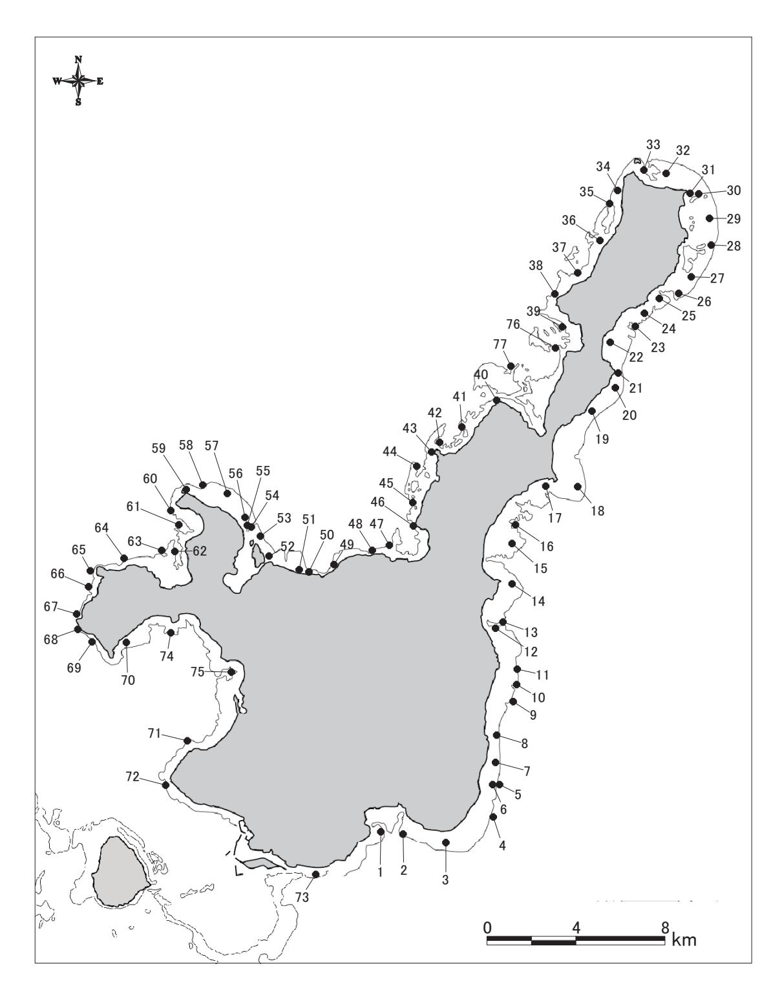

ᅗ㸯 ▼ᇉᓥ࿘㎶ᾏᇦࡢㄪᰝᆅⅬ⨨ᅗ

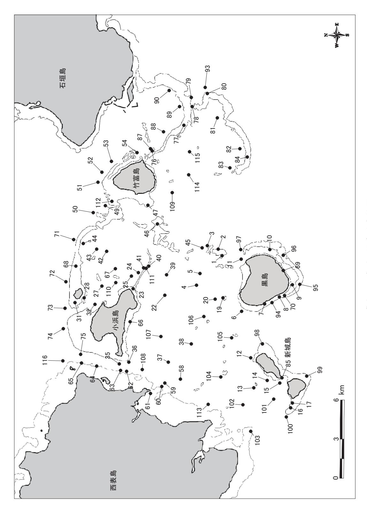

ᅗ凤䢢 ▼す♋†࿘㎶ᾏᇦ僔ㄪᰝᆅⅬ⨨ᅗ䢢

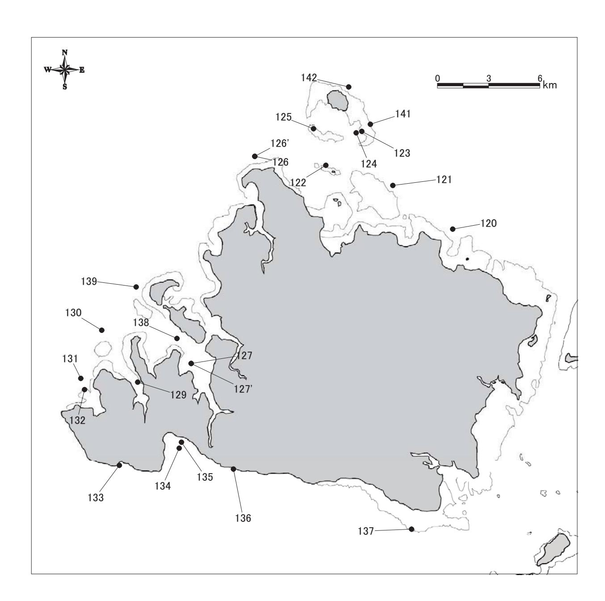

ᅗ㸱 す⾲ᓥ࿘㎶ᾏᇦࡢㄪᰝᆅⅬ⨨ᅗ

ࢱ࣮ࢹ♏ᇶࢢࣥࣜࢱࢽࣔ 㸯⾲

| ᆅⅬ␒ྕ | ᆅྡ            | ໭⦋  | ᮾ⤒  | ᆅᙧ      | ᗏ㉁   | ほᐹ⠊ᅖ P | Ỉ῝⠊ᅖ P |
|------|---------------|-----|-----|---------|------|-----------|-----------|
| ▼࠙   | ᇉᓥ࿘㎶ᾏᇦ ࠚ   |     |     |         |      |           |           |
|      | ኱὾ᑠ๓          | r͛͜ | r͛͜ | ♋ụ      | ᒾ࣭   | ♟ᯞ™       | 㹼         |
|      | ᐑⰋᕝἙཱྀ        | r͛͜ | r͛͜ | ♋ཎ࣭♋ᩳ㠃  | ᒾ    | ™         | 㹼         |
|      | ᐑⰋ㞟ⴠ๓         | r͛͜ | r͛͜ | ♋ụ      | ◁࣭ᒾ  | ™         | 㹼         |
|      | ⓑಖ㞟ⴠ๓         | r͛͜ | r͛͜ | ♋ụ࣭♋ཎ   | ᒾ࣭   | ♟ᯞ™       | 㹼         |
|      | ⓑಖ㺏㺓㺙㺻㺘㺼      | r͛͜ | r͛͜ | ♋ụ࣭♋ཎ   | ᒾ࣭   | ◁™        | 㹼         |
|      | ⓑಖ➨㸯㺬㺽㺎㺷      | r͛͜ | r͛͜ | ♋ụ      | ᒾ࣭   | ♟ᯞ™       | 㹼         |
|      | ⓑಖ㹼㎘ᕝ         | r͛͜ | r͛͜ | ♋ụ      | ᒾ࣭   | ♟ᯞ™       | 㹼         |
|      | ㎘ᕝἙཱྀ         | r͛͜ | r͛͜ | ♋ụ      | ᒾ࣭   | ◁™        | 㹼         |
|      | ࢳࢢ࣐ࣖࣜࣔ        | r͛͜ | r͛͜ | ♋ཎ࣭Ỉ㊰ᩳ㠃 | ᒾ࣭   | ♟ᯞ™       | 㹼         |
|      | ࢳࢢࢪ࣒ࢫ         | r͛͜ | r͛͜ | ♋ụ      | ᒾ࣭   | ♟ᯞ™       | 㹼         |
|      | ᥇▼ሙ๓          | r͛͜ | r͛͜ | ♋ụ࣭♋ཎ   | ᒾ࣭   | ♟ᯞ™       | 㹼         |
|      | ㏻㊰ᕝ༡          | r͛͜ | r͛͜ | ♋ụ      | ᒾ࣭   | ♟ᯞ™       | 㹼         |
|      | ㏻㊰ᕝỈ㊰໭        | r͛͜ | r͛͜ | ♋ཎ࣭Ỉ㊰ᩳ㠃 | ᒾ࣭   | ♟ᯞ™       | 㹼         |
|      | 㔝ཎᓮ           | r͛͜ | r͛͜ | ♋ụ      | ᯞ♟࣭  | ◁™        | 㹼         |
|      | ఀ㔝⏣⁺ ๓        | r͛͜ | r͛͜ | ♋ụ      | ᯞ♟࣭ᒾ | ™         | 㹼         |
|      | ኱㔝∾ሙ๓         | r͛͜ | r͛͜ | ♋ཎ࣭Ỉ㊰ᩳ㠃 | ᒾ࣭   | ♟ᯞ™       | 㹼         |
|      | ⋢ྲྀᓮ༡         | r͛͜ | r͛͜ | ♋ụ      | ᒾ࣭   | ♟ᯞ™       | 㹼         |
|      | ⋢ྲྀᓮᮾ         | r͛͜ | r͛͜ | ♋ụ      | ᒾ࣭   | ♟ᯞ™       | 㹼         |
|      | ఀཎ㛫∾ሙ๓        | r͛͜ | r͛͜ | ♋ụ      | ᯞ♟࣭ᒾ | ™         | 㹼         |
|      | ࣒ࣝࢺᓮ༡         | r͛͜ | r͛͜ | ♋ụ࣭♋ཎ   | ᒾ࣭   | ♟ᯞ™       | 㹼         |
|      | ࣒ࣝࢺᓮ          | r͛͜ | r͛͜ | ♋ཎ      | ᯞ♟࣭ᒾ | ™         | 㹼         |
|      |               |     |     |         |      |           |           |
|      | 㺨㺽㺵㺺㺎㺷㺢㺼๓     | r͛͜ | r͛͜ | ♋ụ      | ᯞ♟   | ™         | 㹼         |
|      | ᫂▼㹼ᏳⰋᓮ        | r͛͜ | r͛͜ | ♋ཎ࣭Ỉ㊰ᩳ㠃 | ᒾ࣭   | ♟™        | 㹼         |
|      | ᏳⰋᓮ༡          | r͛͜ | r͛͜ | ♋ụ      | ᒾ࣭   | ♟ᯞ™       | 㹼         |
|      | ᏳⰋᓮ           | r͛͜ | r͛͜ | ♋ụ      | ᒾ࣭   | ♟ᯞ™       | 㹼         |
|      | ᏳⰋ ࢳࢢ ໭ | r͛͜ | r͛͜ | ♋ཎ࣭Ỉ㊰ᩳ㠃 | ᒾ࣭   | ♟™        | 㹼         |
|      | ᒾᓮ༡           | r͛͜ | r͛͜ | ♋ụ      | ᒾ࣭   | ♟ᯞ™       | 㹼         |
|      | ᒾᓮ            | r͛͜ | r͛͜ | ♋ụ      | ᒾ࣭   | ♟ᯞ™       | 㹼         |
|      | ᒾᓮ㹼ᾆᓮ         | r͛͜ | r͛͜ | ♋ụ      | ᒾ࣭   | ♟ᯞ™       | 㹼         |
|      | ᾆᓮἈ           | r͛͜ | r͛͜ | ♋ụ࣭♋ཎ   | ᒾ࣭   | ♟ᯞ™       | 㹼         |
|      | ᾆᓮ๓           | r͛͜ | r͛͜ | ♋ụ      | ᯞ♟࣭ᒾ | ™         | 㹼         |
|      | ᖹ㔝㞟ⴠ๓         | r͛͜ | r͛͜ | ♋ụ      | ᒾ࣭   | ♟ᯞ™       | 㹼         |
|      | ᖹஂಖⅉྎ໭        | r͛͜ | r͛͜ | ♋ཎ࣭Ỉ㊰ᩳ㠃 | ᒾ࣭   | ♟ᯞ™       | 㹼         |
|      | ᖹஂಖⅉྎす        | r͛͜ | r͛͜ | ♋ụ࣭♋ཎ   | ᯞ♟࣭ᒾ | ™         | 㹼         |
|      | ᖹஂಖᕝ໭         | r͛͜ | r͛͜ | ♋ụ      | ᯞ♟࣭ᒾ | ™         | 㹼         |
|      | ᖹஂಖ㞟ⴠ༡        | r͛͜ | r͛͜ | ♋ụ      | ᯞ♟࣭ᒾ | ™         | 㹼         |
|      | ჆Ⰻᕝ๓          | r͛͜ | r͛͜ | ♋ụ      | ᯞ♟࣭ᒾ | ™         | 㹼         |
|      | ࣇࢸࢲᓮ໭         | r͛͜ | r͛͜ | ♋ᩳ㠃     | ᒾ࣭   | ♟ᯞ™       | 㹼         |
|      | ࣇࢸࢲᓮ༡         | r͛͜ | r͛͜ | ♋ụ      | ᯞ♟࣭  | ◁™        | 㹼         |
|      | 㔝ᗏ▼ᓮ          | r͛͜ | r͛͜ | ♋ụ      | ᯞ♟࣭ᒾ | ™         | 㹼         |
|      | ᰤ㞟ⴠ๓          | r͛͜ | r͛͜ | ♋ụ      | ᯞ♟࣭ᒾ | ™         | 㹼         |
|      | 㔝ᗏ㞟ⴠ๓         | r͛͜ | r͛͜ | ♋ụ      | ᯞ♟࣭ᒾ | ™         | 㹼         |
|      | 㔝ᗏᓮ           | r͛͜ | r͛͜ | ♋ụ      | ᒾ࣭   | ♟ᯞ™       | 㹼         |
|      | ఀᅵྡ໭          | r͛͜ | r͛͜ | ♋ụ࣭♋ཎ   | ᯞ♟   | ™         | 㹼         |
|      | ఀᅵྡ༡          | r͛͜ | r͛͜ | ♋ཎ࣭♋ᩳ㠃  | ᒾ࣭   | ♟ᯞ™       | 㹼         |
|      | ᾆᗏ‴ཱྀ໭        | r͛͜ | r͛͜ | ♋ཎ࣭♋ᩳ㠃  | ᒾ࣭   | ♟ᯞ™       | 㹼         |
|      | ᾆᗏ‴ཱྀす        | r͛͜ | r͛͜ | ♋ཎ࣭♋ᩳ㠃  | ᯞ♟࣭ᒾ | ™         | 㹼         |
|      | ᐩ㔝㞟ⴠ๓         | r͛͜ | r͛͜ | ♋ཎ࣭♋ᩳ㠃  | ᒾ    | ™         | 㹼         |
|      | ⡿ཎ㺕㺊㺻㺪㺽ሙ      | r͛͜ | r͛͜ | ♋ụ      | ᯞ♟࣭ᒾ | ™         | 㹼         |
|      | ࣮ࣞࣂ࣐ࣖ๓        | r͛͜ | r͛͜ | ♋ཎ࣭♋ᩳ㠃  | ᒾ࣭   | ♟ᯞ™       | 㹼         |
|      | ࣮ࣞࣂ࣐ࣖす        | r͛͜ | r͛͜ | ♋ụ      | ᒾ࣭   | ♟ᯞ™       | 㹼         |
|      |               |     |     |         |      |           |           |
|      | ᕝᖹᑠᓥᮾ         | r͛͜ | r͛͜ | ♋ụ      | ᒾ࣭   | ♟ᯞ™       | 㹼         |
|      | ᕝᖹᑠᓥ໭         | r͛͜ | r͛͜ | ♋ụ      | ᒾ࣭   | ♟ᯞ™       | 㹼         |
|      | ᕝᖹỈ㊰ᮾ         | r͛͜ | r͛͜ | ♋ཎ࣭Ỉ㊰ᩳ㠃 | ᒾ࣭   | ♟ᯞ™       | 㹼         |
|      | ᕝᖹỈ㊰          | r͛͜ | r͛͜ | ♋ཎ࣭Ỉ㊰ᩳ㠃 | ᯞ♟࣭ᒾ | ™         | 㹼         |
|      | ᕝᖹỈ㊰໭す        | r͛͜ | r͛͜ | ♋ụ࣭♋ཎ   | ᒾ࣭   | ♟ᯞ™       | 㹼         |
|      | ᕝᖹ㹼▼ᓮ         | r͛͜ | r͛͜ | ♋ụ      | ᒾ࣭   | ♟ᯞ™       | 㹼         |
|      | 㺖㺵㺪㺼㺰㺍㺢㺼๓     | r͛͜ | r͛͜ | ♋ཎ࣭♋ᩳ㠃  | ᒾ࣭   | ♟ᯞ™       | 㹼         |
|      | ᕝᖹ▼ᓮ໭         | r͛͜ | r͛͜ | ♋ụ࣭♋ཎ   | ᯞ♟࣭ᒾ | ™         | 㹼         |

| ᆅⅬ␒ྕ | ᆅྡ              | ໭⦋  | ᮾ⤒  | ᆅᙧ     | ᗏ㉁   | ほᐹ⠊ᅖ P | Ỉ῝⠊ᅖ P |
|------|-----------------|-----|-----|--------|------|-----------|-----------|
|      | ᕝᖹ▼ᓮ༡           | r͛͜ | r͛͜ | ♋ụ࣭♋ཎ  | ᒾ࣭   | ♟ᯞ™       | 㹼         |
|      | ᗏᆅ ࢳ࣮ࣅἈ      | r͛͜ | r͛͜ | ♋ụ     | ᯞ♟࣭ᒾ | ™         | 㹼         |
|      | ᓮᯞ‴ෆ            | r͛͜ | r͛͜ | ♋ụ     | ᯞ♟࣭ᒾ | ™         | 㹼         |
|      | ᓮᯞ‴ཱྀ           | r͛͜ | r͛͜ | ♋ཎ࣭♋ᩳ㠃 | ᒾ    | ™         | 㹼         |
|      | ᓮᯞ㹼ᚚ⚄           | r͛͜ | r͛͜ | ♋ཎ࣭♋ᩳ㠃 | ᒾ    | ™         | 㹼         |
|      | ᚚ⚄ᓮ             | r͛͜ | r͛͜ | ♋ཎ࣭♋ᩳ㠃 | ᒾ    | ™         | 㹼         |
|      | ᚚ⚄㹼ᒇⰋ㒊          | r͛͜ | r͛͜ | ♋ཎ࣭♋ᩳ㠃 | ᒾ࣭   | ♟ᯞ™       | 㹼         |
|      | ᒇⰋ㒊ᓮ໭           | r͛͜ | r͛͜ | ♋ཎ࣭♋ᩳ㠃 | ᒾ    | ™         | 㹼         |
|      | ᒇⰋ㒊ᓮ༡           | r͛͜ | r͛͜ | ♋ཎ࣭♋ᩳ㠃 | ᒾ    | ™         | 㹼         |
|      | ᒇⰋ㒊㹼኱ᓮ          | r͛͜ | r͛͜ | ♋ụ࣭♋ཎ  | ᯞ♟࣭ᒾ | ™         | 㹼         |
|      | ྡⶶಖㆤỈ㠃          | r͛͜ | r͛͜ | ♋ụ     | ᯞ♟࣭  | ◁™        | 㹼         |
|      | ෠ᓮᑠᓥ๓           | r͛͜ | r͛͜ | ♋ཎ࣭♋ᩳ㠃 | ᯞ♟࣭ᒾ | ™         | 㹼         |
|      | ほ㡢ᓮ             | r͛͜ | r͛͜ | ♋ཎ࣭♋ᩳ㠃 | ᒾ࣭   | ♟™        | 㹼         |
|      | ┿ᰤ㔛ᾏᓊ๓          | r͛͜ | r͛͜ | ♋ụ     | ᒾ࣭   | ♟◁™       | 㹼         |
|      | ㉥ᓮ              | r͛͜ | r͛͜ | ♋ཎ࣭♋ᩳ㠃 | ᯞ♟࣭ᒾ | ™         | 㹼         |
|      | ྡⶶᕝἙཱྀ          | r͛͜ | r͛͜ | ♋ụ     | ◁Ἶ࣭ᒾ | ™         | 㹼         |
|      | ᫂▼す             | r͛͜ | r͛͜ | ♋ụ     | ᯞ♟   | ™         |           |
|      | ఀཎ㛫‴ཱྀ          | r͛͜ | r͛͜ | ♋ᩳ㠃    | ᒾ    | ™         |           |
|      | ࠙▼す♋†ཬࡧす⾲ᓥ࿘㎶ᾏᇦࠚ |     |     |        |      |           |           |
|      | 䜴䝷䝡䝅༡♋⦕         | r͛͜ | 㺽͛  | 㞳♋     | ᒾࠊ   | ♟™        | 㹼         |
|      | 䜴䝷䝡䝅ᮾ♋⦕         | r͛͜ | 㺽͛  | 㞳♋     | ᒾࠊ   | ♟™        | 㹼         |
|      | 䜴䝷䝡䝅໭ᮾ♋⦕        | 㺽͛  | 㺽͛  | 㞳♋     | ᒾࠊ   | ♟™        | 㹼         |
|      | 㯮ᓥ໭Ἀ㞳♋䐟         | 㺽͛  | 㺽͛  | 㞳♋     | ᒾࠊ   | ♟™        | 㹼         |
|      | 㯮ᓥ໭Ἀ㞳♋䐠         | 㺽͛  | 㺽͛  | 㞳♋     | ᒾࠊ   | ♟™        | 㹼         |
|      | 㯮ᓥ໭すᓊ♋⦕         | 㺽͛  | 㺽͛  | 㞳♋     | ᒾࠊ   | ♟™        | 㹼         |
|      | 㯮ᓥすᓊ♋ụෆ         | 㺽͛  | 㺽͛  | ♋ụ     | ᒾࠊ   | ◁™        | 㹼         |
|      | 㯮ᓥ༡すᓊ♋ụෆ䐟       | 㺽͛  | 㺽͛  | ♋ụ     | ᒾࠊ   | ♟™        | 㹼         |
|      | 㯮ᓥ༡ᓊ♋ụෆ         | 㺽͛͜ | 㺽͛  | ♋ụ     | ᒾࠊ   | ◁™        | 㹼         |
|      | 㯮ᓥ༡ᮾᓊ♋ụෆ䐟       | 㺽͛  | 㺽͛  | ♋ụ     | ᒾࠊ   | ♟™        | 㹼         |
|      | 㯮ᓥ໭ᮾᓊ♋ụෆ        | 㺽͛  | 㺽͛  | ♋ụ     | ᒾࠊ   | ♟™        | 㹼         |
|      | ᪂ᇛᓥୖᆅ໭ᓊ㞳♋       | 㺽͛  | 㺽͛  | 㞳♋     | ᒾࠊ   | ◁™        | 㹼         |
|      | 䝬䜲䝡䝅ᾏ୰බᅬᆅ༊      | 㺽͛  | 㺽͛  | 㞳♋     | ᒾࠊ   | ◁™        | 㹼         |
|      | ᪂ᇛᓥୖᆅすᓊ         | 㺽͛͜ | 㺽͛  | 㞳♋     | ♟ࠊ   | ◁™        | 㹼         |
|      | ᪂ᇛᓥ㛫Ỉ㊰㒊         | 㺽͛  | 㺽͛  | 㞳♋     | ᒾࠊ   | ♟™        | 㹼         |
|      | ᪂ᇛᓥୗᆅすᓊ♋ụෆ䐟     | 㺽͛  | 㺽͛  | ♋ụ     | ᒾࠊ   | ♟™        | 㹼         |
|      | ᪂ᇛᓥୗᆅすᓊ♋ụෆ䐠     | 㺽͛  | 㺽͛  | ♋ụ     | ᒾࠊ   | ♟™        | 㹼         |
|      | 㯮ᓥ໭Ἀ㞳♋䐡         | 㺽͛  | 㺽͛  | 㞳♋     | ᒾࠊ   | ♟™        | 㹼         |
|      | 㯮ᓥ໭Ἀ㞳♋䐢         | 㺽͛  | 㺽͛  | 㞳♋     | ᒾࠊ   | ♟™        | 㹼         |
|      | 㯮ᓥ䞊ᑠ὾ᓥ㛫㞳♋䐟      | 㺽͛  | 㺽͛  | 㞳♋     | ♟    | ™         | 㹼         |
|      | ᑠ὾ᓥ༡ᮾᓊ♋⦕        | 㺽͛  | 㺽͛  | ♋ᩳ㠃    | ♟ࠊ   | ◁™        | 㹼         |
|      | ᑠ὾ᓥ༡ᮾἈ♋⦕䐟       | 㺽͛  | 㺽͛  | ♋ᩳ㠃    | ♟    | ™         | 㹼         |
|      | ᑠ὾ᓥ༡ᮾἈ♋⦕䐠       | 㺽͛  | 㺽͛  | ♋ᩳ㠃    | ♟ࠊ   | ◁™        |           |
|      | ᑠ὾ᓥᮾἈ           | 㺽͛  | 㺽͛  | 㞳♋     | ♟    | ™         | 㹼         |
|      | ჆ᘺ┿ᓥ༡ᓊ♋⦕        | 㺽͛  | 㺽͛  | ♋ᩳ㠃    | ♟ࠊ   | ◁™        | 㹼         |
|      | ჆ᘺ┿ᓥ༡すᓊ♋ụෆ      | 㺽͛  | 㺽͛  | ♋ụ     | ᒾࠊ   | ♟™        | 㹼         |
|      | ᑠ὾ᓥ໭ᮾᓊ♋⦕        | 㺽͛  | 㺽͛  | ♋ᩳ㠃    | ♟ࠊ   | ◁™        | 㹼         |
|      | 䝶䝘䝷Ỉ㐨༡♋⦕        | 㺽͛  | 㺽͛  | ♋ᩳ㠃    | ᒾࠊ   | ♟™        | 㹼         |
|      | 䝶䝘䝷Ỉ㐨༡䐟         | 㺽͛  | 㺽͛  | 㞳♋     | ♟ࠊ   | ◁™        |           |
|      | 㯮ᓥ䞊す⾲ᓥ㛫㞳♋䐟      | 㺽͛  | 㺽͛  | 㞳♋     | ♟    | ™         | 㹼         |
|      | 㯮ᓥ䞊す⾲ᓥ㛫㞳♋䐠      | 㺽͛  | 㺽͛  | 㞳♋     | ♟ࠊ   | ◁™        | 㹼         |
|      | 㯮ᓥ䞊ᑠ὾ᓥ㛫㞳♋䐠      | 㺽͛  | 㺽͛  | 㞳♋     | ᒾࠊ   | ♟™        | 㹼         |
|      | ᑠ὾ᓥ༡ᮾἈ㞳♋䐟       | 㺽͛  | 㺽͛  | 㞳♋     | ♟    | ™         | 㹼         |
|      | ᑠ὾ᓥ༡ᮾἈ㞳♋䐠       | 㺽͛  | 㺽͛  | 㞳♋     | ♟    | ™         | 㹼         |
|      | ᑠ὾ᓥᮾἈ♋†ෆ䐟       | 㺽͛  | 㺽͛  | 㞳♋     | ᒾࠊ   | ◁™        | 㹼         |
|      | ᑠ὾ᓥᮾἈ♋†ෆ䐠       | 㺽͛  | 㺽͛  | 㞳♋     | ᒾࠊ   | ◁™        |           |
|      | ჆ᘺ┿ᓥᮾἈ♋†ෆ       | 㺽͛  | 㺽͛  | ♋ụ     | ᒾࠊ   | ◁™        | 㹼         |
|      | 䜴䝷䝡䝅໭㞳♋         | 㺽͛  | 㺽͛  | 㞳♋     | ᒾࠊ   | ♟™        | 㹼         |
|      | 䝅䝰䝡䝅ᾏ୰බᅬᆅ༊      | 㺽͛  | 㺽͛  | 㞳♋     | ᒾࠊ   | ♟™        | 㹼         |
|      | ➉ᐩᓥ༡すᓊ♋⦕        | 㺽͛  | 㺽͛  | ♋ᩳ㠃    | ᒾࠊ   | ♟™        | 㹼         |
|      | ➉ᐩᓥすἈ㞳♋♋⦕       | 㺽͛  | 㺽͛  | 㞳♋     | ᒾࠊ   | ♟™        | 㹼         |
|      |                 |     |     |        |      |           |           |
|      | ➉ᐩᓥすἈ㞳♋እ⦕       | 㺽͛  | 㺽͛  | 㞳♋     | ᒾࠊ   | ♟™        | 㹼         |

| ᆅⅬ␒ྕ | ᆅྡ           | ໭⦋ | ᮾ⤒ | ᆅᙧ  | ᗏ㉁  | ほᐹ⠊ᅖ P | Ỉ῝⠊ᅖ P |
|------|--------------|----|----|-----|-----|-----------|-----------|
|      | ➉ᐩᓥ໭ᓊ♋እ⦕     | 㺽͛ | 㺽͛ | ♋ᩳ㠃 | ᒾࠊ  | ♟™        | 㹼         |
|      | ➉ᐩᓥ໭ᮾᓊ♋እ⦕    | 㺽͛ | 㺽͛ | ♋ᩳ㠃 | ᒾࠊ  | ♟™        | 㹼         |
|      | ➉ᐩᓥ໭ᮾἈ♋⦕     | 㺽͛ | 㺽͛ | ♋ᩳ㠃 | ᒾࠊ  | ♟™        | 㹼         |
|      | ➉ᐩᓥᮾἈ㞳♋      | 㺽͛ | 㺽͛ | 㞳♋  | ᒾࠊ  | ♟™        | 㹼         |
|      | す⾲ᓥᮾἈ㞳♋䐟     | 㺽͛ | 㺽͛ | 㞳♋  | ♟   | ™         | 㹼         |
|      | す⾲ᓥᮾἈ㞳♋䐠     | 㺽͛ | 㺽͛ | 㞳♋  | ♟ࠊ  | ◁™        | 㹼         |
|      | す⾲ᓥᮾἈ㞳♋䐡     | 㺽͛ | 㺽͛ | 㞳♋  | ♟ࠊ  | ◁™        | 㹼         |
|      | す⾲ᓥᮾᓊ♋ụෆ     | 㺽͛ | 㺽͛ | ♋ụ  | Ἶ   | ™         |           |
|      | 䝶䝘䝷Ỉ㐨༡䐠      | 㺽͛ | 㺽͛ | ♋ᩳ㠃 | ♟   | ™         | 㹼         |
|      | 䝶䝘䝷Ỉ㐨༡㒊      | 㺽͛ | 㺽͛ | ♋ᩳ㠃 | ᒾࠊ  | ♟™        | 㹼         |
|      | 䝶䝘䝷Ỉ㐨୰ኸ㒊䐟    | 㺽͛ | 㺽͛ | ♋ᩳ㠃 | ᒾࠊ  | ♟™        | 㹼         |
|      | 䝶䝘䝷Ỉ㐨໭㒊      | 㺽͛ | 㺽͛ | ♋ᩳ㠃 | ᒾࠊ  | ♟™        | 㹼         |
|      |              |    |    |     |     |           |           |
|      | ᑠ὾ᓥ༡♋⦕       | 㺽͛ | 㺽͛ | ♋ᩳ㠃 | ᒾࠊ  | ◁™        | 㹼         |
|      | ᑠ὾ᓥᮾἈ㞳♋䐟     | 㺽͛ | 㺽͛ | 㞳♋  | ♟ࠊ  | ◁™        | 㹼         |
|      | ჆ᘺ┿ᓥᮾἈ♋ෆ⦕    | 㺽͛ | 㺽͛ | ♋ụ  | ᒾࠊ  | ♟™        | 㹼         |
|      | 㯮ᓥ༡ᮾᓊ♋ụෆ䐠    | 㺽͛ | 㺽͛ | ♋ụ  | ♟ࠊ  | ◁™        | 㹼         |
|      | 㯮ᓥ༡すᓊ♋ụෆ䐠    | 㺽͛ | 㺽͛ | ♋ụ  | ᒾࠊ  | ♟™        | 㹼         |
|      | ჆ᘺ┿ᓥᮾἈ♋እ⦕    | 㺽͛ | 㺽͛ | ♋ᩳ㠃 | ᒾࠊ  | ♟™        | 㹼         |
|      | ჆ᘺ┿ᓥ໭ᓊ♋እ⦕䐟   | 㺽͛ | 㺽͛ | ♋ᩳ㠃 | ᒾࠊ  | ♟™        | 㹼         |
|      | ჆ᘺ┿ᓥ໭ᓊ♋እ⦕䐠   | 㺽͛ | 㺽͛ | ♋ᩳ㠃 | ᒾࠊ  | ♟™        | 㹼         |
|      | ᑠ὾ᓥ໭ᓊ♋እ⦕     | 㺽͛ | 㺽͛ | ♋ᩳ㠃 | ᒾࠊ  | ♟™        | 㹼         |
|      | 䝶䝘䝷Ỉ㐨୰ኸ㒊䐠    | 㺽͛ | 㺽͛ | ♋ᩳ㠃 | ᒾ   | ™         | 㹼         |
|      | 䜰䞊䝃䞊䝢䞊እ⦕     | 㺽͛ | 㺽͛ | 㞳♋  | ♟ࠊ  | ◁™        | 㹼         |
|      | 䜴䝬䝜䝝䝢䞊♋ෆ䐟    | 㺽͛ | 㺽͛ | ♋ụ  | ᒾࠊ  | ♟™        | 㹼         |
|      | 䜴䝬䝜䝝䝢䞊♋ෆ䐠    | 㺽͛ | 㺽͛ | ♋ụ  | ᒾࠊ  | ♟™        | 㹼         |
|      | 䜴䝬䝜䝝䝢䞊♋ෆ䐡    | 㺽͛ | 㺽͛ | ♋ᩳ㠃 | ᒾ   | ™         | 㹼         |
|      | 䜴䝬䝜䝝䝢䞊ෆ⦕䐟    | 㺽͛ | 㺽͛ | ♋ụ  | ᒾࠊ  | ♟™        | 㹼         |
|      | 䜴䝬䝜䝝䝢䞊ෆ⦕䐠    | 㺽͛ | 㺽͛ | ♋ụ  | ᒾࠊ  | ♟™        | 㹼         |
|      | 䜴䝬䝜䝝䝢䞊ෆ⦕䐡    | 㺽͛ | 㺽͛ | ♋ụ  | ᒾࠊ  | ♟™        | 㹼         |
|      | 䜴䝬䝜䝝䝢䞊ෆ⦕䐢    | 㺽͛ | 㺽͛ | ♋ụ  | ᒾࠊ  | ♟™        | 㹼         |
|      | 䜴䝬䝜䝝䝢䞊እ⦕䐟    | 㺽͛ | 㺽͛ | ♋ᩳ㠃 | ᒾ   | ™         | 㹼         |
|      | ᪂ᇛᓥỈ㊰㒊♋ụෆ    | 㺽͛ | 㺽͛ | ♋ụ  | ᒾ   | ™         | 㹼         |
|      | 䜰䞊䝃䞊䝢䞊ෆ⦕䐟    | 㺽͛ | 㺽͛ | 㞳♋  | ᒾࠊ  | ♟™        | 㹼         |
|      | 䜰䞊䝃䞊䝢䞊ෆ⦕䐠    | 㺽͛ | 㺽͛ | 㞳♋  | ᒾࠊ  | ♟™        | 㹼         |
|      |              |    |    |     |     |           |           |
|      | 䜰䞊䝃䞊䝢䞊ෆ⦕䐡    | 㺽͛ | 㺽͛ | 㞳♋  | ♟ࠊ  | ◁™        | 㹼         |
|      | 䜰䞊䝃䞊䝢䞊ෆ⦕䐢    | 㺽͛ | 㺽͛ | 㞳♋  | ᒾࠊ  | ♟™        | 㹼         |
|      | 䜴䝬䝜䝝䝢䞊እ⦕䐠    | 㺽͛ | 㺽͛ | ♋ᩳ㠃 | ᒾ   | ™         | 㹼         |
|      | 㯮ᓥ༡すᓊ♋እ⦕     | 㺽͛ | 㺽͛ | ♋ᩳ㠃 | ᒾࠊ  | ♟™        | 㹼         |
|      | 㯮ᓥ༡ᓊ♋እ⦕      | 㺽͛ | 㺽͛ | ♋ᩳ㠃 | ᒾࠊ  | ♟™        | 㹼         |
|      | 䜻䝱䞁䜾䝏ᾏ୰බᅬᆅ༊  | 㺽͛ | 㺽͛ | ♋ᩳ㠃 | ᒾ   | ™         | 㹼         |
|      | 㯮ᓥᮾᓊ♋እ⦕      | 㺽͛ | 㺽͛ | ♋ᩳ㠃 | ᒾࠊ  | ♟™        | 㹼         |
|      | ᪂ᇛᓥୖᆅᮾᓊ♋እ⦕   | 㺽͛ | 㺽͛ | ♋ᩳ㠃 | ᒾࠊ  | ♟™        | 㹼         |
|      | ᪂ᇛᓥୗᆅ༡ᮾᓊ♋እ⦕  | 㺽͛ | 㺽͛ | ♋ᩳ㠃 | ᒾࠊ  | ♟™        | 㹼         |
|      | ᪂ᇛᓥୗᆅすᓊ♋እ⦕   | 㺽͛ | 㺽͛ | ♋ᩳ㠃 | ᒾࠊ  | ♟™        | 㹼         |
|      | ᪂ᇛᓥ໭すἈ㞳♋     | 㺽͛ | 㺽͛ | 㞳♋  | ᒾࠊ  | ◁™        | 㹼         |
|      | ᪂ᇛᓥ䞊す⾲ᓥ㛫㞳♋䐟  | 㺽͛ | 㺽͛ | 㞳♋  | ᒾࠊ  | ◁™        | 㹼         |
|      | ༡㢼ぢᓮἈ㞳♋እ⦕ᮾ   | 㺽͛ | 㺽͛ | ♋ᩳ㠃 | ᒾࠊ  | ♟™        | 㹼         |
|      | ᪂ᇛᓥ䞊す⾲ᓥ㛫㞳♋䐠  | 㺽͛ | 㺽͛ | 㞳♋  | ᒾࠊ  | ♟™        | 㹼         |
|      | 㯮ᓥ䞊᪂ᇛᓥ㛫኱ᆺ㞳♋  | 㺽͛ | 㺽͛ | 㞳♋  | ᒾࠊ  | ♟™        | 㹼         |
|      | 㯮ᓥ໭すἈ㞳♋      | 㺽͛ | 㺽͛ | 㞳♋  | ᒾࠊ  | ♟™        | 㹼         |
|      | ᑠ὾ᓥ༡Ἀ㞳♋      | 㺽͛ | 㺽͛ | 㞳♋  | ♟ࠊ  | ◁™        | 㹼         |
|      | 䝶䝘䝷Ỉ㐨༡Ἀ㞳♋    | 㺽͛ | 㺽͛ | 㞳♋  | ♟ࠊἾ | ™         | 㹼         |
|      |              |    |    |     |     |           |           |
|      | ➉ᐩᓥ༡Ἀ㞳♋䐟     | 㺽͛ | 㺽͛ | 㞳♋  | ᒾࠊ  | ♟™        | 㹼         |
|      | ᑠ὾ᓥᮾἈ㞳♋䐠     | 㺽͛ | 㺽͛ | 㞳♋  | ♟ࠊ  | ◁™        | 㹼         |
|      | ᑠ὾ᓥ༡ᮾἈ㞳♋䐡    | 㺽͛ | 㺽͛ | 㞳♋  | ♟ࠊ  | ◁™        | 㹼         |
|      | 䝍䜻䝗䞁䜾䝏ᾏ୰බᅬᆅ༊ | 㺽͛ | 㺽͛ | ♋ᩳ㠃 | ♟ࠊ  | ◁™        | 㹼         |
|      | す⾲ᓥ௰㛫ᓮἈ㞳♋    | 㺽͛ | 㺽͛ | 㞳♋  | ᒾࠊ  | ◁™        | 㹼         |
|      | ➉ᐩᓥ༡Ἀ㞳♋䐠     | 㺽͛ | 㺽͛ | 㞳♋  | ᒾࠊ  | ♟™        | 㹼         |
|      | 䜴䝬䝜䝝䝢䞊♋ෆ䐢    | 㺽͛ | 㺽͛ | 㞳♋  | ᒾࠊ  | ♟™        | 㹼         |

| ᆅⅬ␒ྕ | ᆅྡ       | ໭⦋ | ᮾ⤒ | ᆅᙧ     | ᗏ㉁ | ほᐹ⠊ᅖ P | Ỉ῝⠊ᅖ P |
|------|----------|----|----|--------|----|-----------|-----------|
|      | 㬼㞳ᓥ๓㞳♋   | 㺽͛ | 㺽͛ | ♋ᩳ㠃    | ᒾࠊ | ♟™        | 㹼         |
|      | 䝴䝒䞁‴ཱྀ♋⦕ | 㺽͛ | 㺽͛ | ♋ཎ㹼♋ᩳ㠃 | ᒾࠊ | ♟™        | 㹼         |
|      | ⯪ᾆἈ㞳♋    | 㺽͛ | 㺽͛ | ♋ᩳ㠃    | ᒾࠊ | ♟™        | 㹼         |
|      | 䝞䝷䝇ᓥす    | 㺽͛ | 㺽͛ | 㞳♋     | ♟  | ™         | 㹼         |
|      | 㬀㛫ᓥ༡ᮾ♋ụ䐟 | 㺽͛ | 㺽͛ | ♋ཎ     | ᒾࠊ | ♟™        | 㹼         |
|      | 㬀㛫ᓥ༡ᮾ♋ụ䐠 | 㺽͛ | 㺽͛ | 㞳♋     | ᒾࠊ | ♟™        | 㹼         |
|      | 㬀㛫ᓥ༡すἈ㞳♋ | 㺽͛ | 㺽͛ | 㞳♋     | ᒾࠊ | ♟™        | 㹼         |
|      | ᫍ◁὾๓♋⦕   | 㺽͛ | 㺽͛ | ♋ᩳ㠃    | ᒾࠊ | ♟™        | 㹼         |
|      | ᫍ◁὾๓♋ụෆ  | 㺽͛ | 㺽͛ | ♋ụ     | ᒾࠊ | ♟™        | 㹼         |
|      | 䝍䝁ᓮ♋⦕    | 㺽͛ | 㺽͛ | ෆ‴     | ᒾࠊ | ♟™        | 㹼         |
|      | 䝍䝁ᓮ♋ὸ㒊   | 㺽͛ | 㺽͛ | ෆ‴     | ♟ࠊ | ◁™        | 㹼         |
|      | ⥙ྲྀ‴ዟ    | 㺽͛ | 㺽͛ | ෆ‴     | ♟  | ™         | 㹼         |
|      | 䝶䝘䝋䝛     | 㺽͛ | 㺽͛ | ♋ᩳ㠃    | ᒾࠊ | ♟™        | 㹼         |
|      | ᓮᒣ♋⦕     | 㺽͛ | 㺽͛ | ♋ᩳ㠃    | ᒾ  | ™         | 㹼         |
|      | ᓮᒣ♋ụ     | 㺽͛ | 㺽͛ | ♋ụ     | ♟  | ™         | 㹼         |
|      | Ἴ↷㛫▼     | 㺽͛ | 㺽͛ | ♋ᩳ㠃    | ᒾ  | ™         | 㹼         |
|      | 㮵ᕝ‴୰䝜℩䐟  | 㺽͛ | 㺽͛ | ♋ᩳ㠃    | ᒾ  | ™         | 㹼         |
|      | 㮵ᕝ‴୰䝜℩䐠  | 㺽͛ | 㺽͛ | ♋ᩳ㠃    | ᒾࠊ | ♟™        | 㹼         |
|      | 䝃䝄䝺὾♋⦕   | 㺽͛ | 㺽͛ | ♋ᩳ㠃    | ᒾ  | ™         | 㹼         |
|      | ㇏ཎἈ♋⦕    | 㺽͛ | 㺽͛ | ♋ᩳ㠃    | ᒾࠊ | ♟™        | 㹼         |
|      | ⯪ᾋᓮ๓     | 㺽͛ | 㺽͛ | ♋ཎ     | ᒾࠊ | ♟™        | 㹼         |
|      | እ䝟䝘䝸༡♋⦕  | 㺽͛ | 㺽͛ | ♋ཎ㹼♋ᩳ㠃 | ᒾࠊ | ♟™        |           |
|      | 㬀㛫ᓥᮾ♋⦕   | 㺽͛ | 㺽͛ | ♋ᩳ㠃    | ᒾ࣭ | ♟™        | 㹼         |
|      | 㬀㛫ᓥ໭♋⦕   | 㺽͛ | 㺽͛ | ♋ᩳ㠃    | ᒾ࣭ | ♟™        | 㹼         |

## 㸦㸰㸧ㄪᰝ㡯┠

## 㸯㸧ࡢࢦࣥࢧ⏕ᜥ≧ἣ

## ձࡢࢦࣥࢧ龠ᗘཬࡧ⫱⏕ᆺ

࡚ࡋᑐࡢࡶࡿ࠺ࡾ࡞ᇶ㉁╔⏕ࡢࢦࣥࢧࠊࡕ࠺ࡢᗏ㉁ࡢㄪᰝᆅⅬࠊࡣᗘ⿕ࡢࢦࣥࢧ ࡢࢦࣥࢧࡢ➼Ἶࡸ◁ࠋ㸧࠸࡞ࡲྵࡣ࣮ࣝࣛࢥࢺࣇࢯ㸦࠺࠸ࢆྜࡿࡵ༨ࡀࢦࣥࢧࡿ࠸࡚ࡁ⏕ ╔⏕ᇶ㉁࠸࡞ࡽ࡞ᗏ㉁㒊ศࡣᑐ㇟እࠋࡿࡍ龠ᗘ࡛ࢺࣥࢭ࣮ࣃࡣグ㘓ࠋࡓࡋ

ㄪᰝ༢ࡢࢀࡒࢀࡑࠊࡅศㄪᰝ༢ࡢࡈศ 5 ࢆ㛫ㄪᰝࡢศ 15ࠎྛࡣㄪᰝဨࡢྡ 2 ㄪᰝ 6 ィྜࡢྡ 2 ㄪᰝဨࠊ࡛ୖࡢࡑࠋࡓࡋグ㘓ࢆᗘ⿕ࡢࢦࣥࢧࡓࡗࡶ✚ぢ࡛ど┠࡚࠸ࡘ ༢ࡢ༢⣧ᖹᆒࡢࡑࢆᆅⅬࢦࣥࢧࡢ龠ᗘࠊࡋࡔࡓࠋࡓࡋす⾲ᓥ༡す㒊ࡿ࠶≉ᐃࣥࢧࡢ ࡣㄪᰝဨྛࠊࡣ࡛㸧134ࠊ131ࠊ129 ᆅⅬ㸦ᆅⅬ 3 ࡓࡋ㇟ㄪᰝᑐࢆⴠ⩌య㸭⩌୍༢ࡢ✀ࢦ ࢆᗘ⿕ࡢㄪᰝᆅⅬࠊ࡛ࡇࡿࡍᖹᆒࢆࢱ࣮ࢹࡢㄪᰝ༢ 2 ࡽࢀࡇࠊࡋグ㘓ࡳࡢㄪᰝ༢ 1 ࠋࡓࡵồ

ホ౯࠺ࡼࡢ韭ࡢୗ࡛ࡲᖺᗘࠊ࡚࠸ࡘホ౯ࡢែ≧ࡢ♋ࢦࣥࢧࡿࡼᗘ⿕ࢦࣥࢧ࠾࡞ ࠊࡀࡓࡁ࡚ࡋグ㏙ࢆἣ≧ࡢࢦࣥࢧࡁ࡙ᇶ

| ࢦࣥࢧ龠ᗘࡢ⠊ᅖ   | ホ౯        |  |  |
|------------|-----------|--|--|
| 75㸣ӌ       | ඃⰋ        |  |  |
| 50㸣ӌ  㸺75㸣 | Ⰻ         |  |  |
| 25㸣ӌ  㸺50㸣 | ࡸࡸ୙Ⰻ      |  |  |
| 10㸣ӌ  㸺25㸣 | ୙Ⰻ        |  |  |
| 㸺10㸣       | ᴟ ࡚ࡵ୙Ⰻ |  |  |

ホ౯ࡢ♋ࢦࣥࢧࡿࡼᗘ⿕ࢦࣥࢧ

ᖺᗘࡢ᳨ウࢡࢵ࢙ࢳࢺࢵ࣏ࢫ࡛ἲࢦࣥࢧࡿࡼ龠ᗘࡢぢ✚ࡾ⢭ᗘࡀ 10㸣⛬ᗘࡿ࠶࡛ ࡓࡲ‵‵㸣ᮍ1 ࢆࡢࡶ࠸ࡉᑠ࡚ࡵᴟࡀᗘ⿕ࠊᯝ⤖ࡓࡋウ᳨ࢆグ᪉ἲ⾲ࡢᗘ⿕ࠊࡋ៖⪃ࢆࡇ ࠊࡅཷࢆኚ᭦ࡢグ᪉ἲ⾲ࠋࡓࡗ࡞ࡇࡿࡍグ⾲࡛ࡳ้㸣10 ࢆࡢࡶࡢୖ௨ࢀࡑࠊ‵‵㸣ᮍ5 ࡣ ࢦࣥࢧ࡞࠺ࡼࡢ韭ୗ⪄ཧࢆ⠊ᅖࡢᗘ⿕ࢦࣥࢧࡢ࡛ࡲࢀࡇᬻᐃⓗࡣ࡚࠸ࡘᯝ⤖ᖺᗘ ࠋࡓࡗ足ࢆホ౯ࡢࢺࢧྛࠊࡋタᐃࢆ༊ศࡢᗘ⿕

༊ศࡢᗘ⿕ࢦࣥࢧࡿ࠸⏝ᯝ⤖ᖺᗘ

| ⿕ࢦࣥࢧ ⠊ᅖࡢᗘ |  |  |  |  |
|--------------|--|--|--|--|
| 80㸣ӌ         |  |  |  |  |
| 50㸣ӌ  㸺80㸣   |  |  |  |  |
| 30㸣ӌ  㸺50㸣   |  |  |  |  |
| 10㸣ӌ  㸺30㸣   |  |  |  |  |
| 㸺10㸣         |  |  |  |  |

ࠋࡿ࠶࡛ࡾ㏻ࡢ௨ୗࡣホ౯༊ศࡿࡼቑῶࡢᗘ⿕ࢦࣥࢧࡢࡽᖺᗘࠊࡓࡲ

| ᫖ᖺᗘ ࡽ࠿ ࢦࣥࢧࡢ 龠ᗘࡢኚ໬ 㸦 ࢺࣥ࢖࣏㸧 | ホ౯         |
|------------------------------------------|------------|
| 㸩30ӌ                                     | ኱ ࡃࡁቑຍ  |
| 㸩10ӌ   㸺㸩30                              | ቑຍ         |
| 㸫10㸺   㸺㸩10                              | ࡰ࡯ኚ໬ ࡋ࡞ |
| 㸫30㸺   ӌ㸫10                              | ῶᑡ         |
| ӌ㸫30                                     | ኱ ࡃࡁῶᑡ  |

ࠋࡓࡋศ㢮ᆺ 6 ࡢ௨ୗࢆᆺ⏕⫱ࡢ㞟⩌ࢦࣥࢧࡿࡅ࠾ㄪᰝᆅⅬ

| ⏕⫱ᆺ | ⩌㞟ࡢ≦ἣ                                                       |
|-----|-------------------------------------------------------------|
| Ϩ   | 㢮ࡢ๭ྜࡀ 60㸣௨ୖ㸧 ᯞ≧ ࣑ ࢩ࢖ࣜࢻ ඃ༨ᆺ㸦ᯞ≧ ࣑ ࢩ࢖ࣜࢻ      |
| ϩ   | ᯞ≧࣭༟≧ ࣑ ࢩ࢖ࣜࢻ ΰᡂᆺ                                   |
| Ϫ   | 㢮ࡢ๭ྜࡀ 60㸣௨ୖ㸧 ༟≧ ࣑ ࢩ࢖ࣜࢻ ඃ༨ᆺ㸦༟≧ ࣑ ࢩ࢖ࣜࢻ      |
| ϫ   | ≉ᐃ㢮ඃ༨ᆺ㸦 ࣑ ࢩ࢖ࣜࢻ 㢮௨እࡢ≉ᐃ ࢖ࡢ ࢦࣥࢧࢩ 㢮ࡀඃ༨ ࡿࡍ㸧 |
| Ϭ   | ከ✀ΰᡂᆺ㸦ከ✀ ࡢ ࡀࢦࣥࢧ ΰᅾ ࠊࡋ≉ᐃࡢ✀ࡀඃ༨ ࠸࡞ࡋ㸧            |
| ϭ   | ࢺࣇࢯ ࣮ࣝࣛࢥ ඃ༨ᆺ㸦 ࢥࢺࣇࢯ ࡀ࣮ࣝࣛ ඃ༨ࡶ᭱ 㸧ࡿࡍ          |

ྛㄪᰝဨࡣ 15 ศࡢㄪᰝ㛫ࢆ 5 ศࡢࡈㄪᰝ༢ศࢦࣥࢧ࡚࠸ࡘࢀࡒࢀࡑࠊࡅ⩌ 㞟ࡢ⫱⏕ᆺࢆグ㘓ࠋࡓࡋㄪᰝဨ 2 ྡࡢྜィ 6 ㄪᰝ༢ࠊ࡛ཎ๎࡚ࡋ᭱ࡶฟ⌧㢖ᗘࡀ㧗 ࡿࡍ⌧ฟ࡛㢖ᗘࡢᗘ⛬ྠࡀᆺ⏕⫱ࡿ࡞ETBࠋࡓࡋᆺ⏕⫱࡞ⓗ⾲௦ࡢᆅⅬࡢࡑࢆᆺ⏕⫱ࡓࡗ ሙྜࡢࡑࠊࡣ㒔ᗘ᳨ウࢆ足࠸ᆅⅬࡢ⫱⏕ᆺࢆỴᐃࡓࡋ㸦ࠊࡤ࠼ϨᆺϪᆺࡀྠ⛬ᗘࡢ㢖 ࣇࢯࡣᗘ⿕ࢦࣥࢧࠊࡶྜሙࡢඃ༨ᆺ࣮ࣝࣛࢥࢺࣇࢯࠊ࠾࡞ࠋ㸧ࡓࡋϩᆺࡣྜሙࡿ࠶࡛ᗘ ࠋ࠸࡞࠸࡚ࡵྵࡣᗘ⿕ࡢ࣮ࣝࣛࢥࢺ

#### ղ༟≧ࢩࣜࢻ࣑㢮ࡢ᭱㛗ᚄ

ㄪᰝᆅⅬ࡛ほᐹࡓࢀࡉ༟≧ࢩࣜࢻ࣑㢮ࡢ㛗ᚄࢆグ㘓ࠋࡓࡋᙜヱᆅⅬࡢࢦࣥࢧࡢᡂ㛗≧ ἣ࣭ᅇ⤒㐣ࡢ┠Ᏻࠋࡿ࡞

ྡ 2 ㄪᰝဨࠋࡓࡋᐃ ࢆ㛗ᚄࡢ㢮ࢩࣜࢻ࣑≦༟ࡢయ ⩌5 㡰࠸ࡁࢀࡒࢀࡑࡣㄪᰝဨ ࠋࡓࡋ㛗ᚄ᭱ࡢ㢮ࢩࣜࢻ࣑≦༟ࡢᙜヱᆅⅬࠊࡋᖹᆒࢆ್ࡢィྜࡢ

௨ୗࠊ༟≧ࢩࣜࢻ࣑⩌యࡢ᭱㛗ᚄࡽぢࡓᅇᮇཬࡢࡑࡼ࠾࠾ࡧᖺ㱋ࡢ┠Ᏻࢆ♧ ࠋࡍ

| ᭱኱㛗ᚄ              | ᅇ᚟ᮇ | ࠾ ࡢࡑࡼ࠾ ᖺ㱋㸦ᖺ㸧 |
|-------------------|-----|--------------------|
| 25cm ᮍ‶           | ึᮇ  | 0㹼5                |
| 25cm ௨ୖ 100cm ᮍ‶  | ๓ᮇ  | 5㹼10               |
| 100cm ௨ୖ 200cm ᮍ‶ | ୰ᮇ  | 10㹼15              |
| 200cm ௨ୖ          | ᚋᮇ  | 15 ௨ୖ              |

## ճࢩࣜࢻ࣑㢮ࡢ᪂つຍධ

ࡢࢦࣥࢧⲨᗫࡓࡋᾏᇦࢩࣜࢻ࣑ࡢ㢮ࡢᅇࡢ⛬ᗘࡢᣦᶆࠊ࡚ࡋ┤ᚄ 5cm ᮍ‶ࢻ࣑ࡢ ࡢࢩࣜᑠ⩌యࢆຍධ⩌య࡚ࡋグ㘓ࠋࡓࡋ

ྛㄪᰝဨࠊࡀ15 ศ㛫ࡢㄪᰝ㛫୰ࠊᆺࢦࣥࢧࡢ⩌యࡀᑡࡃ࡞ᒾ┙ࡢ㟢ฟ㠃ࡀከ࠸ሙ ᡤ࡚࠸࠾ ┠࡛௬ࡢ᪉ᙧᯟ㸦1m1m㸧ࢆタᐃࡢࡑࠊࡋ୰ࡢຍධ⩌యᩘࢆグ㘓ࠋࡓࡋ ᩘ᪂つຍධࡢ㢮ࢩࣜࢻ࣑ࡢᙜヱᆅⅬࢆ್ࡓࡋᖹᆒࢆ್ࡢᡤศ 3ࠊ࠸足࡛ᡤ 3 ࢆࢀࡇ ࠋࡓࡋ

## 㸰㸧ࡃࡢࢦࣥࢧせᅉ

## ࢹࢺࣄࢽ࢜ձ

್ᖹᆒࡢㄪᰝဨࡢྡ 2ࠊࡋグ㘓ࢆᩘಶయࡢࢹࢺࣄࢽ࢜ࡓࢀࡉほᐹ࡚ࡗࡼ㐟Ὃࡢศ㛫 15 ࣑≦༟ࠊࡣ࡛ㄪᰝࡢᐇ㝿ࠋࡓࡋᩘほᐹಶయ⥲ࢆィྜࠊᩘศ㛫ほᐹಶయ 15 ࡢᙜヱᆅⅬࢆ ࡋỈ₯࡛ࡾ₯⣲ࡣྜሙࡓࡅࡘぢࢆ㣗ࠊࡵࡓ࠸ከࡀࡇࡿ࠸࡚ࢀ㞃✰ࡸୗࡢ㢮ࢩࣜࢻ ࠋࡓࡋㄆ☜ࢆᏑᅾࡢࢹࢺࣄࢽ࢜ࠊ࡚

cm20ࠊ‵‵ᮍ cm20 ࢆ㸧࡛ࡲ4ࡢ⭎ࡢᑐഃࡽ4ࡢ⭎ᚄ㸦┤ࡢࢹࢺࣄࢽ࢜ࡓࡋ⌧ฟࠊࡓࡲ ௨ୖ 30cm ᮍ‶ࠊ30cm ௨ୖࡢ 3 㝵⣭ศ㢮ࠊࡋඃ༨㸦᭱ࡶከ࠸㸧ࢬࢧ㝵⣭ࢆồࠋࡓࡵ

ࡀ㸦㦵᱁ࡿศࡓࢀࡉ㣗ᐖࢹࢺࣄࢽ࢜㏆᭱ࡽ᫂ࠊࡿࡍᑐయࢦࣥࢧࠊࡽࡉ ࠋࡓࡋグ㘓࡚ࡋ≼/㣗ᐖࢆᩘᴫࡢྜࡢࢦࣥࢧ㸧ࡿ࠼ぢࡃⓑ

ࠋࡍ♧ࢆᏳ┠ࡢែ⏕≧Ⓨࡢࢹࢺࣄࢽ࢜ࡃ࡙ᇶᩘศ㛫ほᐹಶయ 15ࠊ௨ୗ

| 15 ศ㛫ほᐹಶయᩘ     | Ⓨ⏕≧ែ    |
|----------------|---------|
| 2 ಶయᮍ‶         | ㏻ᖖศᕸ    |
| 2 ಶయ௨ୖ 5 ಶయᮍ‶  | ከ࠸㸦せὀព㸧 |
| 5 ಶయ௨ୖ 10 ಶయᮍ‶ | ‽኱Ⓨ⏕    |
| 10 ಶయ௨ୖ        | ኱Ⓨ⏕     |

## ղࢦࣥࢧ㣗ᕳ㈅

ࣞࣟࢩ⛉࢞࢟ࢡ㢮㸦ࢩ࣐ࢲ࢞ࢩࣞࣟࢩࡍࡰཬࢆᐖ⿕࡛ࡇࡿࡍᤕ㣗ࢆࢦࣥࢧ ࢩ࣐ࢲ࢞ࢩᒓ *Drupella* ࡢᑠᆺᕳ㈅㢮㸧➼ࡢⓎ⏕≧ἣࢆ௨ୗࡢ㝵⣭࡛グ㘓ࠋࡓࡋ

| 㝵⣭ | Ⓨ ⏕ ≧ ἣ                                                    |
|----|------------------------------------------------------------|
| Ϩ  | 㣗⑞㸦᪂ ࡢࡶ࠸ࡋ㸧ࡣ ❧┠ ࠸࡞ࡓ                                |
| ϩ  | ᑠ ࡞ࡉ㣗⑞ࡸ㣗ᐖ㒊 ࡿ࠶ࡢ⩌యࡀᩓぢ                                  |
|    | ⑞㣗 ࡃࡁ኱ࡣ 㣗ᐖ㒊ࠊ ⩌ࡿ࠶ࡢ ❧┠ࡀయ ᩘࠊࡀࡘ ⓒಶయ௨ ࡞ࡽ࠿ୖ |
| Ϫ  | ࡋᐦ㞟ࡿ ㈅㞟ᅋࡓ ࡳࡣ ࠸࡞ࢀࡽ                                 |
| ϫ  | ࡬ య⩌Ṛ࠸ ࡕ❧┠ࡀ ࡋᐦ㞟ࠊ ㈅㞟ᅋࡓ ᩓぢࡀ ࡿࢀࡉ            |

調査員2名によって得られたデータのうち、ランクが高い方をその調査地点の代表値とした。

また、サンゴ全体に対する、明らかに最近サンゴ食巻貝に食害されたと分かる(骨格が白く見える)サンゴの割合の概数を食害率として記録した。

#### ③サンゴの白化現象

白化前まで生存していたと思われるサンゴ全体に占める白化したサンゴもしくは白化後 死滅したサンゴの割合を記録し、2名の調査員の平均値を白化率とした。また、サンゴ全 体とは別に、白化の影響を受けやすいミドリイシ類についても同様に記録した。

#### ④サンゴの病気の発生状況

サンゴに発生する病気のうち腫瘍、黒帯病及びホワイトシンドロームの 3 種について、その有無を記録した。

| 病気の種類      | 主な症状                                                                             |
|------------|----------------------------------------------------------------------------------|
| 腫瘍         | 群体表面に、瘤状の骨格異常が形成される。                                                             |
| 黒帯病        | 軟組織にシアノバクテリアが侵入繁殖し、黒い帯状となって組 織の壊死が起こる。                                        |
| ホワイトシンドローム | 卓状ミドリイシ類でよくみられ、ケーキを切り分けていくよう な形で徐々に死亡していく。死亡した部分は海藻が覆い、生き ている部分との境に白い帯状の部分がみられる。 |

なお、石垣島周辺海域では試験的に、病気の発生程度を以下の 4 つのランクに分けて、 石西礁湖海域では病気の発生していたサンゴの群体数を記録した。

| ランク | 発生状況        | 発生程度                |
|-----|-------------|---------------------|
| I   | 病気は確認されない   | 0 群体/15 分           |
| П   | 病気が少しだけみられる | 1 群体/15 分           |
| III | 病気が散見する     | 2 群体以上 10 群体未満/15 分 |
| IV  | 病気が顕著にみられる  | 10 群体以上/15 分        |

## 㸱㸧≀⌮⎔ቃ

ձ⨨㸸ㄪᰝᆅⅬࡢ୰ᚰ㏆ࡢ⦌ᗘ⤒ᗘࢆ GPS ࡛ィ ࡚ࡋグධࠊ࠾࡞ࠋࡓࡋ⦌ᗘ⤒ᗘࡣ ୡ⏺ ᆅ⣔㸦WGS-84  ᆅ⣔㸧ࢆ⏝ࠋࡓࡋ

ղᆅᙧ㸸ㄪᰝᆅⅬࡢᆅᙧⓗ⎔ቃࠊࢆ♋ụࠊ㞳♋ࠊ♋ཎࠊ♋ᩳ㠃ศ㢮࡚ࡋグ㘓ࠋࡓࡋ

ࡵ༨ࠊࡋศ㢮Ἶࠊ◁ࠊ♟/◁ࠊ㸧♟ࢦࣥࢧ㸦♟ࠊᒾ㸧ࢦࣥࢧᒾ㸦ࠊࢆែ≧ࡢճᗏ㉁㸸ᾏᗏ㠃 ࠋࡓࡋグ㘓ࢆ㸧ࡘ 2 ୖ㸦ࡢࡶ࠸ከࡢ⠊ᅖࡿ

⠊ᅖࡓࡋほᐹࠊࡀࡿ࡞ETB࡚ࡗࡼ➼᪉ࡾࡀᗈࡢ㞟⩌ࢦࣥࢧࡸᆅᙧࡣմほᐹ⠊ᅖ㸸ほᐹ⠊ᅖ ࡢࡑࡼ࠾࠾ࡢ㠃✚㸦੍㸧ࢆグ㘓ࠋࡓࡋ

յỈ῝⠊ᅖ㸸15 ศ㛫ࡢ㐟Ὃ⠊ᅖࡣ࡛㉳అࡢኚࡀࠊࡵࡓ࠸ࡁほᐹᇦࡢỈ῝㸦m㸧⠊ᅖࢆ ࠋࡓࡋグ㘓࡛ ┠

## նࡢࢺࣝࢩሁ✚㸦SPSS㸧

SPSS ࡣ㸦content of Suspended Particles in Sea Sediment㸧ࡢSSㄒࠊࡾ࠶࡛ᗏ㉁୰ᠱ ⃮≀㉁ྵ᭷㔞ࢆពࠋࡿࡍᮏㄪᰝࠊࡣ࡛Ἀ⦖┴⾨⏕⎔ቃ◊✲ᡤ㉥ᅵ◊✲ᐊࡀ㉥ᅵởᰁࡢ⛬ ᗘࢆ᥎ᐃࡿࡍ┠ⓗ࡛⪄ࡓࡋᡭἲ㸦SPSS ⡆᫆ ᐃἲ㸧ࢆ⏝࡚࠸ ᐃࠋࡿࡍㄪᰝᆅⅬࡢᗏ ㉁ࢆ᥇㞟࡚ࡋᐇ㦂ᐊᣢࡕᖐࠊࡾヨᩱࢆᕼ㔘ࡓࡋ㝿ࡢ㏱どᗘࢆ ᐃ࡚ࡋᠱ⃮≀㉁ྵ㔞ࢆ⟭ ࠋࡓࡋグ㘓࡚ࡋศ㢮㝵⣭ࡢࡘ 9 ࡢ௨ୗࡣᯝ⤖ฟ⟬ࠋࡓࡋฟ

| 㝵⣭ | SPSS㸦kg/m3㸧 | 㝵⣭ | SPSS㸦kg/m3㸧 |
|----|-------------|----|-------------|
| 1  | 㸺0.4        | 5b | 30ӌ, 㸺50    |
| 2  | 0.4ӌ, 㸺1    | 6  | 50ӌ, 㸺200   |
| 3  | 1ӌ, 㸺5      | 7  | 200ӌ, 㸺400  |
| 4  | 5ӌ, 㸺10     | 8  | 400ӌ        |
| 5a | 10ӌ, 㸺30    |    |             |

| 㝵⣭ | SPSS㸦kg/m3㸧 | 㝵⣭ | SPSS㸦kg/m3㸧 |
|----|-------------|----|-------------|
| 1  | 㸺0.4        | 5b | 30ӌ, 㸺50    |
| 2  | 0.4ӌ, 㸺1    | 6  | 50ӌ, 㸺200   |
| 3  | 1ӌ, 㸺5      | 7  | 200ӌ, 㸺400  |
| 4  | 5ӌ, 㸺10     | 8  | 400ӌ        |

 Ἀ⦖┴⾨⏕⎔ቃ◊✲ᡤࠊࡣ࡛㝵⣭ 6 ௨ୖ㸦SPSS ࡀ 50kg/m3௨ୖ㸧ࠊࡣ᫂ࡽேⅭⓗ ࡞㉥ᅵ➼ࡢὶฟࡿࡼởᰁࠊ㝵⣭ 5b㸦SPSS ࡀ 30㹼50kg/m3㸧࡛㏱᫂ᗘࡀᝏࣥࢧࠊࡾ࡞ࡃ ࠋࡿ࠸࡚ࡋ࡞ࡳࡿࡵฟጞࡀᝏᙳ㡪ᗘ⿕ࢦ

㏱どᗘࡽᚤ⢏Ꮚࡢྵ᭷㔞ࢆ⟭ฟࡿࡍィ⟬ᘧࠊࡣḟࠋࡿ࠶࡛ࡾ࠾ࡢ

㹁㸻㹹㸦1718÷㹒㸧㸫17.8㹻×㹂÷㹑

㹁㸸ᗏ㉁୰ࡢᚤ⢏Ꮚࡢྵ᭷㔞㸦kg/m3㸧

㹒㸸㏱どᗘ㸦cm㸧

㹑㸸 ᐃ⏝ࡓ࠸ヨᩱ㔞㸦ml㸧

㹂㸸ᕼ㔘ಸ㸻500㸭ศྲྀ㔞

࡚࠸࡚ࡋᏑᅾࡀ≀✚ሁࡢ㔞࡞༑ศࡸㄪᰝᆅⅬ࠸࡞ࡋᏑᅾࡀ≀✚ሁࡢ㔞࡞༑ศࠊࡣ࡛ㄪᰝ ࠋࡓࡗ࡞ࡋᐇࢆㄪᰝἲࡢࡇࠊࡣྜሙࡓ࠸࡚ࢀእࡃࡁࡽ῝Ỉࡢㄪᰝ⠊ᅖࡶ

## 㸲㸧ᆺᐃ╔ᛶ㨶㢮

 Ỉ⏘㈨※㔞ࡢ┠Ᏻࠊ࡚ࡋᆺᐃ╔ᛶ㨶㢮ࡕ࠺ࡢ㛗 30cm ௨ୖࢱࣁࡢ㢮ࣛ࣋ࠊ㢮ࣈࠊ ㄪᰝဨࠊࡣᩘほᐹಶయࡢ㨶㢮ྛࠊ࠾࡞ࠋࡓࡋグ㘓ࢆྡ✀࡛⠊ᅖࡿศࡧཬᩘಶయࡢ㢮ࢲ ࠋࡓࡋ⏝᥇ࢆ್࠸ከࡕ࠺ࡢྡ 2

## 㸳㸧≉グ㡯

ࠋࡓࡋグ㘓ࢆࡇ࡞ETB≉ࠊࡇࡓ࠸ࡀẼㄪᰝ୰

## 㸲㸬ㄪᰝᐇ⪅

#### ▼ᇉᓥ࿘㎶ᾏᇦ

᭷㝈♫ ᾏ ྜྷ⏣ ⛱

᭷㝈♫ ᾏ ᮏᐑ ಙኵ

᭷㝈♫ ᾏ ᳃ ᾈ୍

᭷㝈♫ ᾏ బᕝ 㕲ᖹ

## ▼す♋†ཬࡧす⾲ᓥ࿘㎶ᾏᇦ

▼す♋†ࢦࣥࢧ♋ㄪᰝ ୖ㔝 ගᘯ

ඵ㔜ᒣ⁺ᴗ༠ྠ⤌ྜ ◁ᕝ ᨻఙ

ඵ㔜ᒣ⁺ᴗ༠ྠ⤌ྜ ᐑᓥ ඞ

## ϩ ㄪᰝ⤖ᯝ⪄ᐹ

ࠋࡍ♧韭ࢆᯝ⤖ㄪᰝࡢㄪᰝᆅⅬ

## 㸯㸬▼ᇉᓥ࿘㎶ᾏᇦ

## 㸦㸯㸧ࡢࢦࣥࢧ⏕ᜥ≧ἣ

## 㸯㸧ࡢࢦࣥࢧ龠ᗘཬࡧ⫱⏕ᆺ

ྛㄪᰝᆅⅬࡢࢦࣥࢧࡿࡅ࠾龠ᗘཬࡧ⫱⏕ᆺࢆᅗ 4 ࢦࣥࢧࠊ龠ᗘࡢࢦࣥࢧࡿࡼ≦ែ ࠋࡍ♧ 2 韭ࢆᩘᆅⅬูホ౯ࡢ

⿕ᗘ 80㸣௨ୖࡢᆅⅬࡣᐩᓮࡽほ㡢ᓮࡢ 2 ᆅⅬ㸦ᆅⅬ 71ࠊ72㸧ࡓࡗ࠶࡛㸦ᖺᗘࡽ 2 ᆅⅬቑຍࠊయࡢ 3㸣ࡿࡓ࠶㸧ࠋ龠ᗘ 50㸣௨ୖ 80㸣ᮍ‶ࡢᆅⅬࠊࡣᮾᓊࡢ༡㒊㸦ᆅⅬ すᓊ༡㒊㸦ᆅࠊ㸧31ࠊ30ࠊ27ࠊ24ࠊ19 㒊࿘㎶㸦ᆅⅬࡧ㸧ཬ17 ୰㒊㸦ᆅⅬ㸧73ࠊ6ࠊ5 Ⅼ 57ࠊ70ࠊ74㸧ࡢྜィ 12 ᆅⅬ㸦ᆅⅬࡢ 16㸣㸧ࠊࡾ࠶࡛ᖺᗘࡽ 1 ᆅⅬῶᑡࠋࡓࡋ

| ࢦࣥࢧ龠ᗘ ࡿࡼ࡟ ࡢࢦࣥࢧ ≦ែࡢホ౯ | ᆅⅬᩘ㸦᫖ᖺᗘ㸧 |
|-------------------------------|----------|
| 10㸣ᮍ‶                         | 37㸦33㸧   |
| 10㸣௨ୖ 30㸣ᮍ‶                   | 15㸦18㸧   |
| 30㸣௨ୖ 50㸣ᮍ‶                   | 11㸦13㸧   |
| 50㸣௨ୖ 80㸣ᮍ‶                   | 12㸦13㸧   |

80㸣௨ୖ 2㸦0㸧

⾲㸰 ࢦࣥࢧ龠ᗘࡢࢦࣥࢧࡿࡼ≦ែࡢホ౯ูㄪᰝᆅⅬᩘ㸦 ᆅⅬ୰㸧

ࠊ15ࠊ14ࠊ11ࠊ10ࠊ4ࠊ3ࠊ1 ᆅⅬ㸦ᆅⅬ 12 ࡢᖏ୍ᓊᮾࠊࡣᆅⅬࡢ‵‵㸣ᮍ10 ᗘ⿕ࠊ᪉୍ ࠊ35ࠊ34 ᆅⅬ㸦ᆅⅬ 16 ࡢ࡚ࡅᐩ㔝ࡽಖஂᖹࡢ㒊すᓊ୰㹼ࠊ㸧26ࠊ22ࠊ21ࠊ20ࠊ18 ᕝᖹࡢすᓊ༡㒊ࡧ㸧ཬ77ࠊ76ࠊ48ࠊ47ࠊ46ࠊ45ࠊ44ࠊ42ࠊ41ࠊ40ࠊ39ࠊ38ࠊ37ࠊ36 ྜࡢ㸧68ࠊ67ࠊ66ࠊ65ࠊ64ࠊ63ࠊ61ࠊ60ࠊ59ࠊ58 ᆅⅬ㸦ᆅⅬ 10 ࡢ࡚ࡅᒇⰋ㒊ᓮࡽ ィ 38 ᆅⅬ㸦ᆅⅬࡢ 49㸣㸧ࠊࡾ࠶࡛ᖺᗘࡽ 4 ᆅⅬቑຍࠋࡓࡋ

ࡢࢦࣥࢧ⫱⏕ᆺࢆぢࢩࣜࢻ࣑ࠊࡿ㢮ࡀඃ༨ࡿࡍᆅⅬ㸦⏕⫱ᆺϨࠊϩࠊϪ㸧ࠊࡣᮾᓊ ༡㒊㸦ᆅⅬ 9㸧ࠊすᓊࡢྡⶶ‴࿘㎶ 4 ᆅⅬ㸦ᆅⅬ 70ࠊ71ࠊ72ࠊ74㸧ࡢྜィ 5 ᆅⅬ㸦 ࠋࡓࡋᆅⅬῶᑡ 9 ࡽᖺᗘࠊࡾ࠶࡛㸣㸧6 ࡢయ

ࢩࣜࢻ࣑㢮ඃ༨ᆺ௨እࠊࡣ≉ᐃ㢮ඃ༨ᆺ㸦⏕⫱ᆺϫ㸧ࡀ 17 ᆅⅬ㸦యࡢ 22㸣ࠊᖺ ᗘࡽኚࡋ࡞㸧ࠊከ✀ΰᡂᆺ㸦⏕⫱ᆺϬ㸧ࡀ 52 ᆅⅬ㸦యࡢ 68㸣ࠊᖺᗘࡽ 9 ᆅⅬ ቑຍ㸧࣮ࣝࣛࢥࢺࣇࢯࠊඃ༨ᆺ㸦⏕⫱ᆺϭ㸧ࡀ 3 ᆅⅬ㸦యࡢ 4㸣ࠋᖺᗘࡽኚࡋ࡞㸧 ࠋࡓࡗ࠶࡛

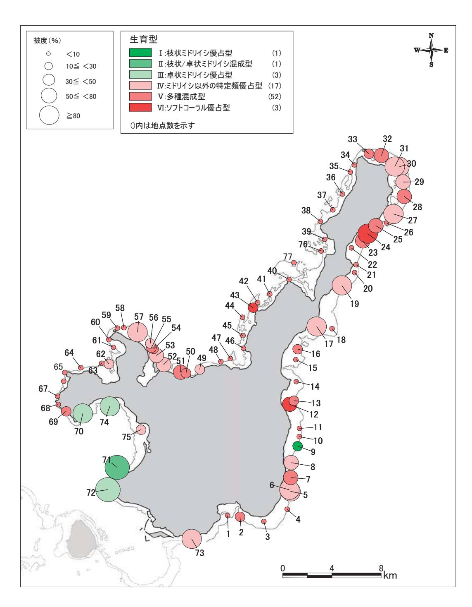

ᅗ㸲 ▼ᇉᓥ࿘㎶ᾏᇦࢦࣥࢧࡿࡅ࠾龠ᗘཬࡧ⫱⏕ᆺ

ࠋࡍ♧6ᅗࢆ⛣᥎ࡢᗘ⿕ᖹᆒࡢࢦࣥࢧࠊ5ᅗ3韭ࢆቑῶࡢᗘ⿕ࢦࣥࢧࡢࡽᖺᗘ ᆅⅬᖹᆒࢦࣥࢧࡢ㢮⿕ᗘࡣ 20㸣ࠊࡾ࠶࡛ᖺᗘኚࠊࡓࡲࠋࡓࡗ࠶࡛ࡋ࡞龠ᗘ᭱㧗 ್ࡣ 80㸣㸦ᖺᗘ 70㸣㸧ࠋࡓࡗ࠶࡛

⾲㸱 ᖺᗘࢦࣥࢧࡢ龠ᗘࡢቑῶ㸦 ᆅⅬ୰㸧

| ࢦࣥࢧ龠ᗘࡢቑῶ                             | ᆅⅬᩘ㸦᫖ᖺᗘ㸧 |
|--------------------------------------|----------|
| ࡃࡁቑຍ㸸30 ௨ୖ㸦30ӌ㸧 ኱                 | 0㸦1㸧     |
| ቑຍ 10 ௨ୖ 30 ᮍ‶㸦10ӌ 㸺30㸧              | 8㸦7㸧     |
| ࡋ࡞㸸-10 ࡃࡁ 10 ᮍ‶㸦±10㸧 ኚ໬ ࡾࡼ኱ | 64㸦45㸧   |
| ῶᑡ㸸-30 ࡃࡁ-10 ௨ୗ㸦-30㸺 ӌ-10㸧 ࡾࡼ኱ | 3㸦15㸧    |
| ࡃࡁῶᑡ㸸-30 ௨ୗ㸦ӌ-30㸧 ኱               | 2㸦9㸧     |

ࢺ࣏ࣥ 15㹼10 ࡶࢀࡎ࠸ࠊࡾ࠶࡛ᆅⅬ 8 ࡣࡢࡓࢀࡽࡳࡀቑຍࡢᗘ⿕ࡢୖ௨ࢺ࣏ࣥ 10 ࠊ71ࠊ70 ᆅⅬ㸦ᆅⅬ 4 ࡀቑຍࡢ㢮ࢩࣜࢻ࣑ࠊࡣせᅉ࡞ࡢᗘቑຍ⿕ࠋࡓࡗ࠶࡛ቑຍࡢ ቑࡢ㢮ࢦࣥࢧ♋㐀ࡢ✀ከࠊ㸧27ࠊ31ࠊ52 ᆅⅬ㸦ᆅⅬ 3 ࡀቑຍࡢ㢮ࢦࣥࢧࣥࣔࢥࠊ㸧74ࠊ72 ຍࡀ 1 ᆅⅬ㸦ᆅⅬ 7㸧ࠋࡓࡗ࠶࡛

ୖ௨ࢺ࣏ࣥ 30 ࡕ࠺ࡢࡇࠊࡾ࠶࡛ᆅⅬ 5 ࡣᆅⅬࡓࡋῶᑡࡀᗘ⿕ୖ௨ࢺ࣏ࣥ 10ࠊ᪉୍ ᆅ 3 ࡣᗘῶᑡ⿕ࡢ‵‵ᮍࢺ࣏ࣥ 30 ୖ௨ࢺ࣏ࣥ 10ࠊ㸧56ࠊ46 ᆅⅬ㸦ᆅⅬ 2 ࡣᗘῶᑡ⿕ࡢ ᆅⅬ㸦ᆅ 4 ࡀ㣗ᐖࡿࡼࢹࢺࣄࢽ࢜ࠊࡣཎᅉ࡞ࡢᗘῶᑡ⿕ࠋࡓࡗ࠶࡛㸧69ࠊ54ࠊ28Ⅼ㸦 ࠋࡓࡗ࠶࡛㸧28 ᆅⅬ㸦ᆅⅬ 1 ࡀ➼ᇙἐࡿࡼ㢼ྎࠊ㸧69ࠊ56ࠊ54ࠊ46 Ⅼ

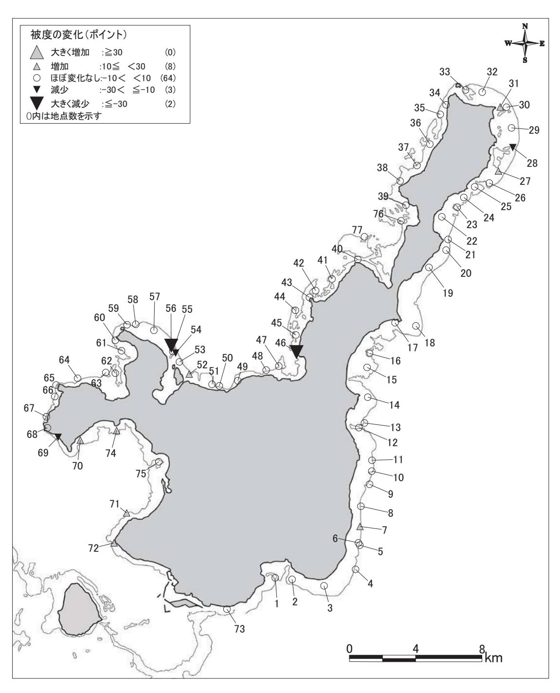

ᅗ㸳 ▼ᇉᓥ࿘㎶ᾏᇦࢦࣥࢧࡿࡅ࠾龠ᗘࡢᖺᗘࡢࡽኚ

ࢦࣥࢧ㢮ࡢᖹᆒ⿕ᗘࡢ᥎⛣㸦ᅗ 6㸧ࢆぢࠊࡿ1998 ᖺࡢつᶍ࡞ⓑ⌧㇟ࡢᙳ㡪ࡀ᮰ ࡓࡋ 1999 ᖺ௨㝆 2006 ᖺࡢ࡛ࡲ 7 ᖺ㛫ࠊࡣ龠ᗘࡀ༢ㄪቑຍࡿࡍഴྥࠋࡓࡗ࠶࡛2007 ᖺ ࠋࡓࡋపୗࡀᗘ⿕࡚ࡗࡼ㇟⌧ⓑ࡞つᶍࡓࡋ⏕Ⓨᖺ 2007 ࡣ࡚ࡅᖺ 2008 ࡽ ῶࡧ࡛ᙳ㡪ࡿࡼ㣗ᐖࡢࢹࢺࣄࢽ࢜ࡣᖺ௨㝆 2010ࠊࡀࡓࡋቑຍⓗ୍ࡣᖺ 2009 ࡣῶᑡᖜࡿࡍẚ㍑ᖺᗘࠊࡢࡢࡶࡿ࠸࡚ࡋ⥆⥅ࡣྥഴࡢῶᑡࡶᮏᖺࠋࡿ࠸࡚ࡌ㌿ᑡ ࠋ࠸࡞ࢀࡋࡶࡢࡿ࠸࡚࠸࡙㏆᮰ࠊࡣ㣗ᐖࡢࢹࢺࣄࢽ࢜ࠊࡃࡉᑠ

1998 ᖺࡢⓑ௨㝆ࠊᖹᆒ⿕ᗘࡣᴫࡡ 20㹼40㸣ࡢ㛫࡛᥎⛣ࠊࡾ࠾࡚ࡋ1998 ᖺࡢⓑ๓ࡢ ᥎ᐃ್ࡿ࠶࡛ 50㸣⛬ᗘࡾ࡞ࡶࡾࡼప࠸Ỉ‽ࠊࡓࡲࠋࡿ࠸࡚ࡗࡲᮏᖺࡢᖹᆒ⿕ᗘࡣ ࠋࡿ࠶࡛‽Ỉࡢᗘ⛬ࡌྠ㇟⌧つᶍⓑࡢᖺ 1998

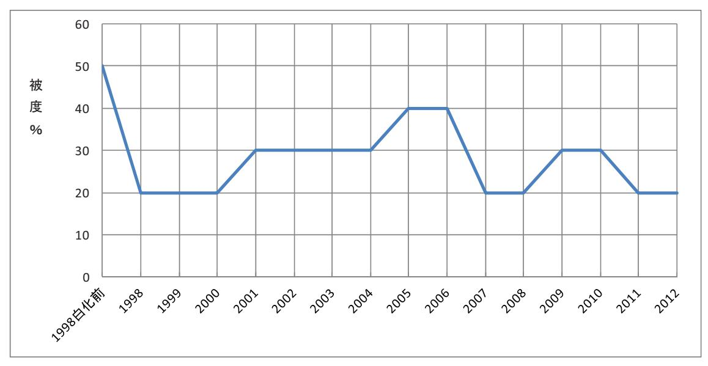

ᅗ㸴 ࡢࢦࣥࢧᖹᆒ⿕ᗘࡢ᥎⛣

⏕⫱ᆺูᆅⅬᩘࡢ᥎⛣㸦⾲ 4㸧ࢆぢࢩࣜࢻ࣑ࠊࡿ㢮ඃ༨ᆺ㸦⏕⫱ᆺϨࠊϩࠊϪ㸧ࡢ ྜィᆅⅬᩘࡣ 1999 ᖺ௨㝆 2006 ᖺ࡛ࡲ༢ㄪቑຍࡋ⥆ࠊࡅ2007 ᖺࡣῶᑡࠊࡾ࡞2009 ᖺ ࡃࡼ㠀ᖖ⛣᥎ࡢᗘ⿕ᖹᆒࠊࡣኚࡢࡇࠋࡿ࠸࡚ࡗ࡞ῶᑡࡧࡣᖺ௨㝆 2010ࠊቑຍࡣ ఝࠊࡾ࠾࡚ᖹᆒ⿕ᗘࢩࣜࢻ࣑ࡣ㢮ࡢ龠ᗘ㛵㐃ࡀࡇࡿ࠸࡚ࡋศࠋࡿᮏᖺᗘࡣ㐣ཤ᭱ పࡢỈ‽ࡶࡾࡼ᭦పࡎࢃ࠸ 5 ᆅⅬࡿࡼࢹࢺࣄࢽ࢜ࠊࡾ࠾࡚ࡗ࡞㣗ᐖࠊࡣⓑ⌧㇟ ࠋࡿ࠼ఛࡀࡇ࠸ࡁࡾࡼࡀᙳ㡪ࡿࡍᑐ㢮ࢩࣜࢻ࣑ࠊ࡚ࡋẚ㍑

ඃ༨ࢩࣜࢻ࣑≦ᯞࠊቃࢆᖺ 2008 ࡽᖺ 2007ࠊࡿࡳࢆෆヂࡢ㢮ඃ༨ᆺࢩࣜࢻ࣑ ᆺ㸦⏕⫱ᆺϨ㸧ࡢẚ⋡ࡀቑຍࠊࡋ༟≧ࢩࣜࢻ࣑ඃ༨ᆺ㸦⏕⫱ᆺϪ㸧ࡢẚ⋡ࡀῶᑡࡿࡍഴ ࠊẚ㢮ࢩࣜࢻ࣑≦༟ࡢᾏᇦ࠸ὸࠊ㝿ࡢ㇟⌧ⓑࡢᖺ 2007 ࡣࢀࡇࠋࡓࢀࡽࡳࡀྥ ࡚ࡋᫎࢆࡇࡓࡗ࡞ᑡᑐⓗ┦ࡀᐖ⿕ࡢ㢮ࢩࣜࢻ࣑≦ᯞࡿࡍᜥ⏕ሙᡤ࠸῝ࡸࡸ ࠋࡿࢀࡽ࠼⪄ࡿ࠸

≉ᐃ㢮ඃ༨ᆺ㸦⏕⫱ᆺϫ㸧ࠊࡣᮏᖺᗘࡣ๓ᖺᗘኚࡎࡽࢃ 17 ᆅⅬࡢࡇࠋࡓࡗ࠶࡛⫱⏕

ࠎᚎᚋࡢࡑࠊࡀࡓࡋቑຍⓗ୍ࠊᚋ⌧㇟ⓑ࡞つᶍࡢᖺ 1998ࠊࡣㄪᰝᆅⅬࡍ♧ࢆᆺ ࠋࡿ࠶ྥቑຍഴࡧࠊࡣ௨㝆⌧㇟つᶍⓑࡢᖺ 2007ࠊࡀࡓ࠸࡚ࡋ♧ࢆྥഴࡿࡍῶᑡ ࠊ࡛᪉୍ࡓࡋపୗࡀᗘ⿕ࡢ㢮ࢩࣜࢻ࣑ࠊࡾࡼ㣗ᐖࡢࢹࢺࣄࢽ࢜ᖺ௨㝆 2008ࠊࡣࢀࡇ ┦ࠊࡀ㢮ࢦࣥࢧࡿࢀࢃᛮ࠸࡞ࡲዲࡾࡲ࠶ࡀࢹࢺࣄࢽ࢜ࡣࡃࡋࡶࠊ㢮ࢦࣥࢧࡓࢀචࢆᐖ⿕ ࠋࡿࢀࡽ࠼⪄ࡵࡓࡿ࠸࡚ࡋቑຍᑐⓗ

ከ✀ΰᡂᆺ㸦⏕⫱ᆺϬ㸧ࠊࡣᖺᗘࡾࡼ 9 ᆅⅬቑຍ࡚ࡋ 52 ᆅⅬࡣࢀࡇࠋࡓࡗ࠶࡛ㄪᰝ ከࠊ୰ࡿࡍῶᑡࡀ㢮ࢩࣜࢻ࣑ࡾࡼ㣗ᐖࡢࢹࢺࣄࢽ࢜ࠋࡿ࠶࡛ᩘᆅⅬࡢ࡛᭱㛤ጞ௨᮶ ࠋࡿࢀࢃᛮࡵࡓࡓ࠼ቑࡀᆅⅬࡿࡍΰᡂࡀయ⩌ᑠࡢ✀

1998ࠊࡃ࡞ࡣኚ࡞ࡁㄪᰝ㛤ጞ௨᮶ࠊࡣᩘᆅⅬࡢᆺϭ㸧⏕⫱ඃ༨ᆺ㸦࣮ࣝࣛࢥࢺࣇࢯ ࡗࡼቑຍࡢࢦࣥࢧ♋㐀ࡣ࡛ᆅⅬ 3 ࡢࡽࢀࡇࠋࡿ࠸࡚ࡗ࡞ᆅⅬ 3 ࡌྠࡃᚋⓑࡢᖺ ୍࡚ⓗከ✀ΰᡂᆺኚ࣮ࣝࣛࢥࢺࣇࢯࠊࡀࡿ࠶ࡶࡇࡿࡍ㢮ࡀඃໃࡿ࠶࡛≦ែࡀኚ ࠋࡓࡗ࡞ࡣࡇࡿࡍ

| ㄪᰝ᫬ᮇ         |       |   |   |   |   |   |   |   |  |
|--------------|-------|------|------|------|------|------|------|------|--|
| ⏕⫱ᆺ          | ⓑ໬๓᥎ᐃ |      |      |      |      |      |      |      |  |
| ࣜࢻ࣑ᯞϨ㸸       |       |      |      |      |      |      |      |      |  |
| ϩ㸸 ࣜࢻ࣑༟࣭ᯞ |       |      |      |      |      |      |      |      |  |
| ࣜࢻ࣑Ϫ㸸༟       |       |      |      |      |      |      |      |      |  |
| ϫ㸸≉ᐃ✀        |       |   |   |   |   |   |   |   |  |
| Ϭ㸸ከ✀ΰᡂ       |       |   |   |   |   |   |   |   |  |
| ࢺࣇࢯϭ㸸        |       |      |      |      |      |      |      |      |  |
| ϨϩϪࡢྜィ       |       |   |   |   |   |   |   |   |  |
| ྜィᆅⅬᩘ        |       |   |   |   |   |   |   |   |  |

⾲㸲 ࢦࣥࢧ㢮ࡢ⫱⏕ᆺูᆅⅬᩘࡢ᥎⛣

## 㸰㸧༟≧ࢩࣜࢻ࣑㢮ࡢ᭱㛗ᚄ

ྛㄪᰝᆅⅬࡿࡅ࠾༟≧ࢩࣜࢻ࣑㢮ࡢ᭱㛗ᚄࢆᅗ 7 ࠊ༟≧ࢩࣜࢻ࣑㢮᭱㛗ᚄ ࠋࡍ♧ 5 韭ࢆ⛣᥎ࡢᩘᆅⅬࡢู

᭱㛗ᚄࡀ 25 ᮍ‶ࠊ࡛ᅇࡀጞࡽ࡚ࡗࡲ 0㹼5 ᖺࡢࠗึᮇ࠘ホ౯ࡿࢀࡉᆅⅬࡀ 68 ᆅⅬࠊ25㹼100 ࡛ᅇࡢࠗ๓ᮇ࠘㸦5㹼10 ᖺ㸧ホ౯ࡿࢀࡉᆅⅬࡣ 5 ᆅⅬࠊ100㹼200 ࡢᅇࠗ୰ᮇ࠘㸦10㹼15 ᖺ㸧ホ౯ࡿࢀࡉᆅⅬࡣ 4 ᆅⅬࠊ200 ௨ୖ࡛ᅇࡢᚋᮇ㸦15 ࠋࡓࡗ↓ࡣᆅⅬࡿࢀࡉホ౯㸧ୖᖺ௨

୍᪉ࠊ್ࡀῶᑡࡣࡢࡓࡋ 14 ᆅⅬࠊ࡛30 ௨ୖࡢῶᑡࠊࡣᾆᗏ‴ཱྀ㸦ᆅⅬ 46㸧࣐ࣖ ࣮ࣞࣂ๓㸦ᆅⅬ 50㸧ࠊᒇⰋ㒊㹼ᓮ㸦ᆅⅬ 69㸧ࡢྜィ 3 ᆅⅬࠋࡓࡗ࠶್࡛ࡀῶᑡࡓࡋ࡞ ࠋࡿࢀࡽࡳ㣗ᐖࡿࡼࢹࢺࣄࢽ࢜ࠊࡣせᅉ

⾲㸳 ༟≧ࢩࣜࢻ࣑㢮᭱㛗ᚄูࡢᆅⅬᩘࡢ᥎⛣

|                     | 2008 | 2009 | 2010 | 2011 | 2012 |
|---------------------|------|------|------|------|------|
| ࢡࣥࣛ 1: 25cm ᮍ‶   | 47   | 47   | 51   | 66   | 68   |
| ࢡࣥࣛ 2: 25㹼100cm  | 25   | 22   | 18   | 7    | 5    |
| ࢡࣥࣛ 3: 100㹼200cm | 5    | 8    | 8    | 4    | 4    |
| ࢡࣥࣛ 4: 200cm ௨ୖ  | 0    | 0    | 0    | 0    | 0    |
| ྜィ್Ⅼᩘ               | 77   | 77   | 77   | 77   | 77   |

## 㸱㸧ࢩࣜࢻ࣑㢮ࡢ᪂つຍධ

ࠋࡍ♧ 8 ᅗࢆἣ≧᪂つຍධࡢ㢮ࢩࣜࢻ࣑ࡿࡅ࠾ㄪᰝᆅⅬྛࡢᖺᗘ

య ⩌5 ࡾࡓ࠶੍ 1ࠊᆅⅬῶᑡ㸧 1 ࡽᆅⅬ㸦๓ᖺᗘ 35 ࡣᆅⅬ࠸࡞ࢀࡽࡳࡃࡀ᪂つຍධ ௨ୗࡢᆅⅬࡣ 31 ᆅⅬ㸦๓ᖺᗘࡽ 7 ᆅⅬῶᑡ㸧ࠊ5 ௨ୖ 10 ⩌యᮍ‶ࡢᆅⅬࡣ 11 ᆅⅬ㸦๓ ᖺᗘࡽ 8 ᆅⅬቑຍ㸧ࠊ10 ௨ୖ 20 ⩌యᮍ‶ࡢᆅⅬࡣ 0 ᆅⅬ㸦๓ᖺᗘࡽኚࡋ࡞㸧ࠊ20 ࠋࡓࡗ࠶࡛㸧ࡋ࡞ᆅⅬ㸦๓ᖺᗘẚኚ 0 ࡶᆅⅬࡿ࠼㉸ࢆయ⩌

▼ᇉᓥ࿘㎶ᾏᇦయࢩࣜࢻ࣑࡚ࡋ㢮ࡢ᪂つຍධᩘࡣᑡ࠸࡞Ỉ‽ࠊࡀࡿ࠶≉ᖺ ᕝᖹࡿ࠸࡚ࡋ⥆⥅ࡀ㣗ᐖࡶᮏᖺᗘࠊ‴ᾆᗏࡽಖஂᖹࡓࡗࡋ⃭ࡀ㣗ᐖࡢࢹࢺࣄࢽ࢜ᗘ ࠊ࡛᪉୍ࠋࡿ࠸࡚ࡗ࡞ࡃከࡀᆅⅬ࠸࡞ࢀࡽࡳࢇࡀ᪂つຍධࠊ࡚ࡅᓥ༙ᒇⰋ㒊ࡽ ྡⶶ‴࿘㎶ࡸᮾᾏᓊࡢỈ㊰㒊࡛࡞᪂つຍධࡀẚ㍑ⓗከ࠸ᆅⅬࠋࡓࢀࡽࡳࡀ

ᖺᗘࡈ 10⩌ య/੍௨ୖࡢᆅⅬᩘࢆẚ㍑ࠊࡿࡍ1999 ᖺࡣ 9 ᆅⅬࠊ2000 ᖺࡣ 13 ᆅ 2005ࠊᆅⅬ 29 ࡣᖺ 2004ࠊᆅⅬ 22 ࡣᖺ 2003ࠊᆅⅬ 19 ࡣᖺ 2002ࠊᆅⅬ 18 ࡣᖺ 2001ࠊⅬ 24 ࡣᖺ 2009ࠊᆅⅬ 17 ࡣᖺ 2008ࠊᆅⅬ 11 ࡣᖺ 2007ࠊᆅⅬ 24 ࡣᖺ 2006ࠊᆅⅬ 26 ࡣᖺ ࡢᮏᖺᗘࠋࡿ࠸࡚ࡗ࡞ᆅⅬ 11 ࡣᖺ 2012ࠊᆅⅬ 3 ࡣᖺ 2011ࠊᆅⅬ 20 ࡣᖺ 2010ࠊᆅⅬ ᪂つຍධ≧ἣࡣ㐣ཤẚ㍑ࠊ࡚ࡋ౫↛࡚ࡋᑡ࠸࡞Ỉ‽ࠊࡢࡢࡶࡿ࠶ᖺᗘࡽቑຍࡍ ࠋࡿ࠶ྥഴࡿ

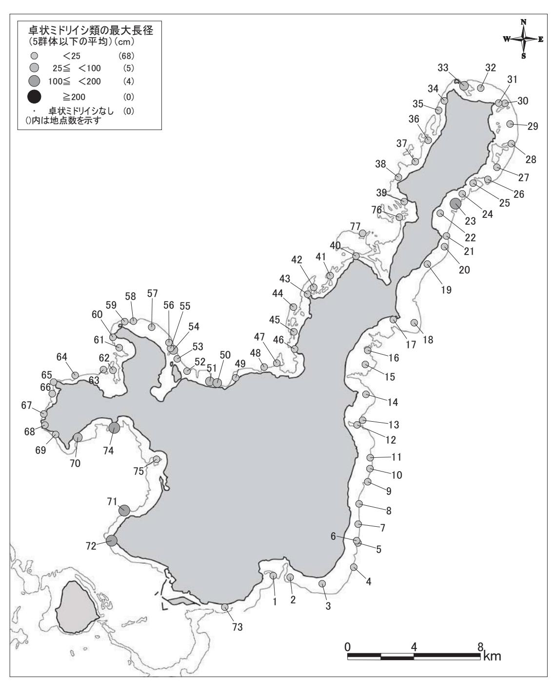

ᅗ㸵 ▼ᇉᓥ࿘㎶ᾏᇦࡿࡅ࠾༟≧ࢩࣜࢻ࣑㢮ࡢ᭱㛗ᚄ㸦 ⩌య௨ୗࡢᖹᆒ㸧

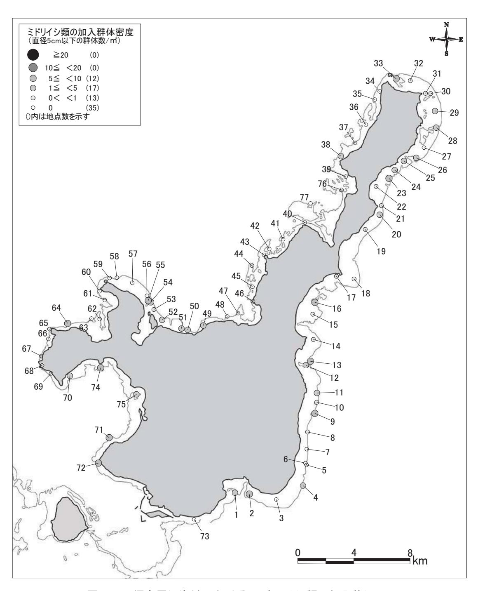

ᅗ㸶 ▼ᇉᓥ࿘㎶ᾏᇦࢩࣜࢻ࣑ࡿࡅ࠾㢮ࡢຍධ≧ἣ

## 㸦㸰㸧ࡃࡢࢦࣥࢧせᅉࡢ≦ἣ

## ࢹࢺࣄࢽ࢜㸯㸧

ࢆ⛣᥎ࡢᩘほᐹࢹࢺࣄࢽ࢜ࠊ 10 ᅗࢆࢬࢧඃ༨ 9 ᅗࢆศᕸࡢࢹࢺࣄࢽ࢜ࡢᮏᖺᗘ ࠋࡍ♧ 11 韭

ᮏᖺᗘࢆࢹࢺࣄࢽ࢜ほᐹࡣࡢࡓࡋ㸦ᅗ 9㸧ࠊ77 ᆅⅬ୰ 18 ᆅⅬ㸦23㸣㸧ࠊ࡛๓ᖺᗘ㸦38 ᆅⅬࠊ49㸣㸧ࡾࡼῶᑡࠋࡓࡋ⥲ほᐹಶయᩘࡣ 177 ಶయࠊ࡛๓ᖺᗘࡢ 848 ಶయࡽᖜῶ ᑡࠋࡿ࠸࡚ࡋ15 ศ㛫ࡢ㐟Ὃ୰ㄪᰝဨ 1 ேࡢࡾࡓ࠶ほᐹᩘࡽホ౯ࠊࡿࡍࠗ㏻ᖖศᕸ࠘ࡢ ಶయ 2 ࡀࢹࢺࣄࢽ࢜ࡕ࠺ࡢ࠘㏻ᖖศᕸࠗࠊᆅⅬ 59 ࡣࡢࡓࡗ࡞ࢀࡉほᐹࡀࢹࢺࣄࢽ࢜ࡕ࠺ ᮍ‶☜ㄆࡣࡢࡓࢀࡉ 9 ᆅⅬࠊ2 ಶయ௨ୖ 5 ಶయᮍ‶☜ㄆࡓࢀࡉࠗከ࠸࠘ᆅⅬࡣ 5 ᆅⅬࠊ5 ಶయ௨ୖ 10 ಶయᮍ‶☜ㄆࡓࢀࡉࠗ‽Ⓨ⏕࠘ࡢࣝ࣋ࣞᆅⅬࡣ 2 ᆅⅬࠊ10 ಶయ௨ୖ☜ㄆࡉ ࡀࡓࡗ࡞ࢀࡉㄆ☜ࡣಶయࠊࡣ࡛ᆅⅬ 14ࠊࡓࡲࠋࡓࡗ࠶࡛ᆅⅬ 2 ࡣࣝ࣋ࣞ࠘⏕Ⓨࠗࡓࢀ ࠋࡓࢀࡉㄆ☜ࡀ㣗

ࠗⓎ⏕࠘ࠊࡣࡢࡓࢀࡉᕝᖹỈ㊰す㸦ᆅⅬ 56ࠊ26.0 ಶయ㸧ᓮᯞ‴ෆ㸦ᆅⅬ 62ࠊ 27.5 ಶయ㸧ࠊࡾ࠶࡛୧ᆅⅬࡶ┤ᚄ 20㹼30 ࡢ୰ᆺࡢಶయࡀከࡃほᐹࡓࢀࡉ㸦ᅗ 10㸧ࠋ Ⓨ⏕ᆅⅬࡢศᕸࢆぢࠊࡿ≦⌧࡛ಶయᩘࡀከࡣࡢ࠸ᕝᖹ▼ᓮᒇⰋ㒊༙ᓥࡢ࿘㎶ࠊࡀࡿ࠶࡛ ᮰ࠎᚎࠊࡵࡓࡿ࠸࡚ࢀࡉࡃᑾ࠸㣗ࡀࢇࡢ㢮ࢩࣜࢻ࣑᪤ࠊࡣ࡛ᆅⅬࡢࡽࢀࡇ ࡅᕝᖹ࿘㎶ࡽᓥ༙ಖஂᖹࡓ࠸࡚ࡋ⏕Ⓨ๓ᖺࠊࡓࡲࠋࡿࢀࡽ࠼⪄ࡢࡶ࠺ྥ ࠋࡿࢀࡽࡳࡿ࠸࡚ࡗྥ᮰ࠊࡣ࡚

ࡢࢹࢺࣄࢽ࢜☜⥲ㄆಶయᩘࡢ᥎⛣㸦ᅗ 11㸧ࢆぢࠊࡿㄪᰝࢆ㛤ጞࡓࡋ 1998 ᖺࡽ 2006 ᖺࠊࡣ࡛ࡲ0㹼3 ಶయࡢ⠊ᅖ࡛᥎⛣ࠊࡀࡓ࠸࡚ࡋ2007 ᖺࡣ 7 ಶయࠊ2008 ᖺࡣ 29 ಶయࠊ2009 ᮏᖺࠋࡿࡁ࡛ㄆ☜ࡀቑຍ࡞⃭ᛴಶయ 848 ࡣᖺ 2011ࠊಶయ 558 ࡣᖺ 2010ࠊಶయ 58 ࡣᖺ ࠊࡾ࠾࡚ࡋῶᑡᖜࡿࡍẚ㍑๓ᖺࠊࡀࡿ࠶ࡣ࡛‽Ỉ࠸ከ࡚ࡋ↛౫ࠊಶయ177 ࡣᗘ ࠋࡿࢀࢃᛮ࠺ࡼࡓࡂ㐣ࡣࢡ࣮ࣆࡢ⏕Ⓨ

龠࠸ẚ㍑ⓗ㧗ࠊࡣ࡛㸧74ࠊ72ࠊ71ࠊ70 ࿘㎶㸦ᆅⅬ‴ⶶྡࡿࡍ㞄᥋ᓥ༙ᒇⰋ㒊ࠊ᪉୍ ࡉᠱᛕࡀ⏕Ⓨࡢࢹࢺࣄࢽ࡛࢜ᆅⅬࡢࡽࢀࡇᚋࠊࡽࡇࡿ࠸࡚ࡋᏑᅾࡀ㞟⩌ࢦࣥࢧࡢᗘ ࠋࡿࢀ

ࠊ࠾࡞ᮏㄪᰝࡢᆅⅬࠊࡀ࠸࡞ࡣ࡛ᖹஂಖⅉྎୗࡃࡈࡢὸ࠸♋ᆅࡢࢹࢺࣄࢽ࢜ࠊ࡚࠸࠾ ࡣ࡛㠃ᩳ♋ࡢ࿘㎶ࡢࡇࠋࡓࢀࡉㄆ☜ࡀ㞟⩌㢮ࢩࣜࢻ࣑≦ᯞ࡞つᶍ࠸࡞࠸࡚ࡅཷࢆ㣗ᐖ ᒁᡤⓗ࠺ࡼࡢࡇࠊࡀ࠸ప㠀ᖖࡀᗘ⿕ࢦࣥࢧࠊࡋ⏕Ⓨࡀࢹࢺࣄࢽ࢜ࡽᖺ㡭 2010 ࡀࢹࢺࣄࢽ࢜ࠊࡾ࡞⬟ྍࡀ⤥౪ࡢ༸ࡢ࿘㎶ᾏᇦࠊࡤࢀ࠸࡚ࢀࡉṧࡀ㞟⩌ࢦࣥࢧ࡞ ࠋࡿࢀࢃᛮࡿࡍᐤࡃࡁᅇࡢᾏᇦࡢᚋࡓࡋ᮰

ᅗ㸷 ▼ᇉᓥ࿘㎶ᾏᇦࡢࢹࢺࣄࢽ࢜ࡿࡅ࠾⏕ᜥ≧ἣ

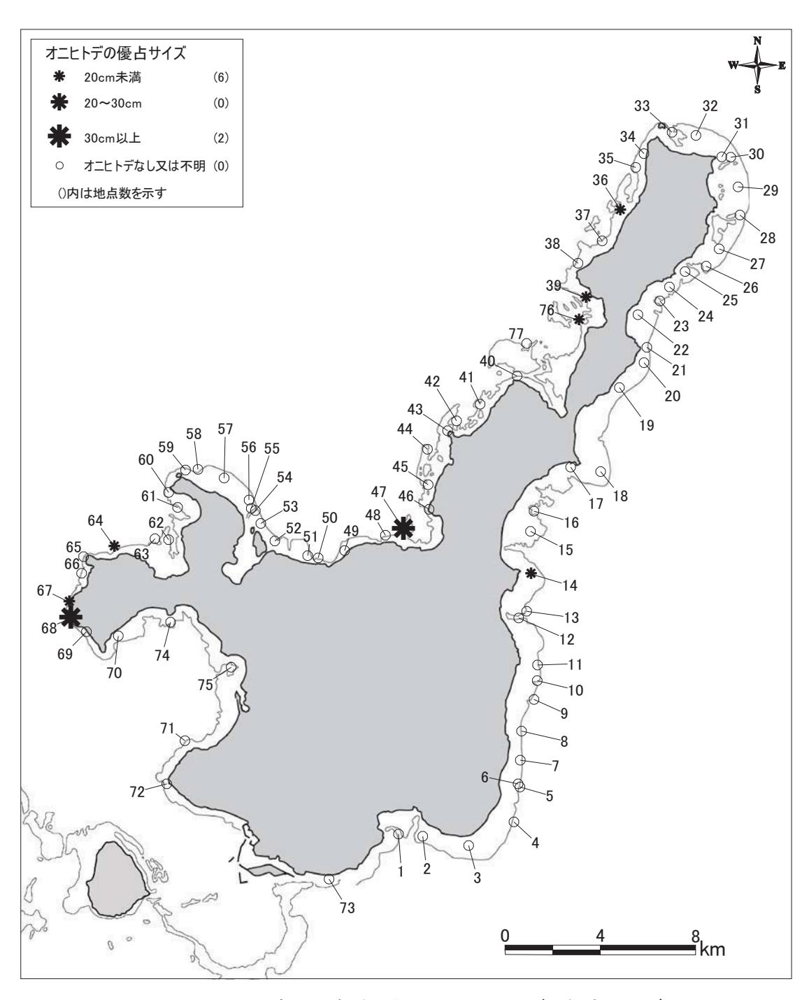

図10 石垣島周辺海域におけるオニヒトデの優占サイズ

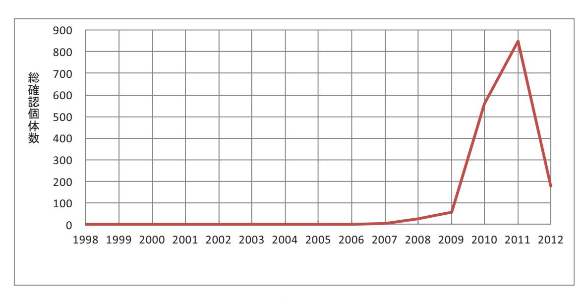

図 11 オニヒトデの総確認個体数の推移

オニヒトデほどの被害をもたらすことはないがサンゴを補食することが知られているマンジュウヒトデは、本年の調査では確認地点はなかった。

#### 2) サンゴ食巻貝

サンゴ食巻貝の分布状況を図 12 に示す。本年度の調査では、目立った食害が観察されるランクIIIの地点はなく、通常分布レベルのランクIIが 22 地点(昨年度 18 地点)であり、サンゴ類被度が低下するほどの発生はみられていない。

#### 3) 白化現象

本年度の各地点における白化率を図 13 に示す。本年度は、8 月に調査を行なったヤマバレー西 (地点 51)、川平小島前 (地点 52)、川平水路東 (地点 54) で、浅い場所のミドリイシ類に軽微な白化がみられたが、大規模な白化現象は確認されなかった。

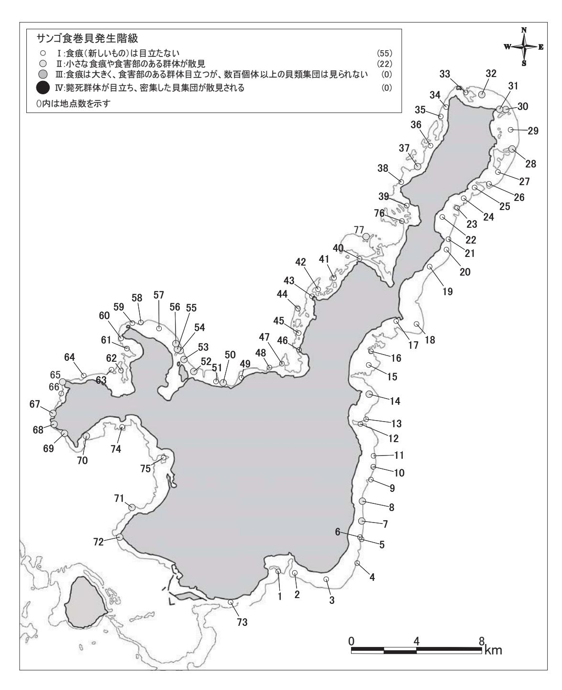

ᅗ ▼ᇉᓥ࿘㎶ᾏᇦࢦࣥࢧࡿࡅ࠾㣗ᕳ㈅ࡢศᕸ≧ἣ

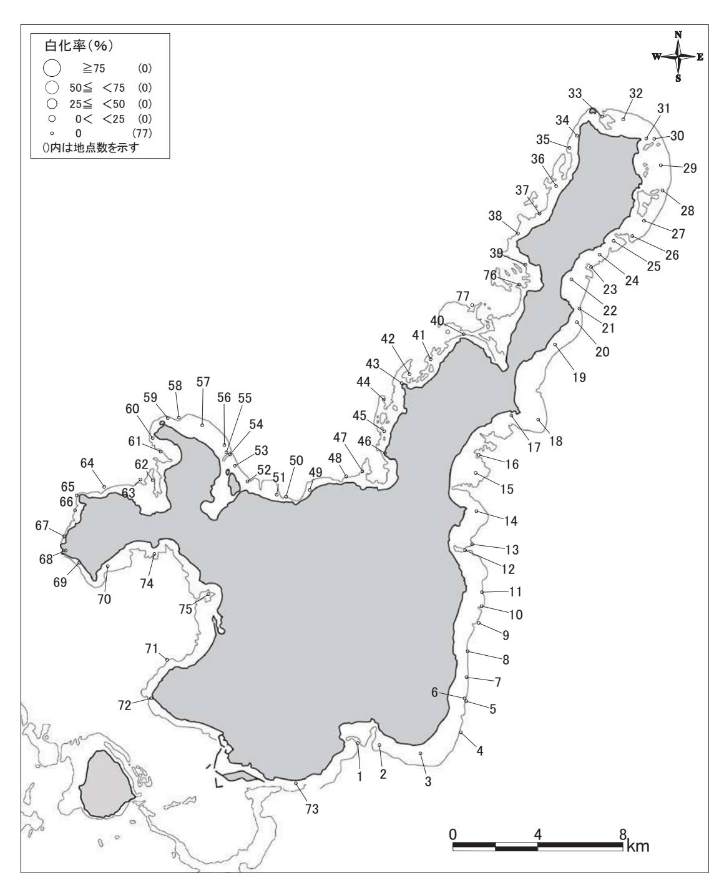

ᅗ ▼ᇉᓥ࿘㎶ᾏᇦࡿࡅ࠾ⓑ⋡

#### 4) その他の自然のかく乱

#### ①台風

本年度石垣島地方に接近した台風は、台風 9 号 (8 月 1 日頃通過)、14 号 (8 月 28 日頃通過)及び 17 号 (9 月 28 日頃通過)の 3 個であった。このうち台風 17 号は石垣島の南岸を東向きに通過し、石垣島地方では東からやや北寄りの 50m/s 位の暴風が吹き荒れた。本年度の調査では、伊野田漁港前(地点 15)と岩崎(地点 28)の 2 地点で、台風によるサンゴの破砕などが確認され、特に岩崎(地点 28)では底質の礫が移動してサンゴが埋没するなどにより、サンゴ被度が低下した。

#### ②サンゴの病気

本年度の病気の発生状況を図 14 に示す。サンゴの病気が確認された 8 地点のうち(昨年度も 8 地点)、ランク II (病気が少しだけ見られる:1 群体/15分) は、モリヤマグチ (地点 9)、岩崎南 (地点 27)、岩崎 (地点 28)、浦崎沖 (地点 30)、浦崎前 (地点 31)、平久保灯台北 (地点 33)、観音崎 (地点 72) の 7 地点であり、ランク III (病気が散見して見られる:2 群体以上 10 群体未満/15分) は、名蔵保護水面(地点 70)の 1 地点であった。病気の内訳は、腫瘍が 4 地点、ホワイトシンドロームが 4 地点であり、黒帯病が確認された地点はなかった。

#### ③シルトの堆積状況 (SPSS)

各調査地点における SPSS の階級別地点数の推移を表 6 に、シルトの堆積状況 (SPSS の階級) を図 15 にそれぞれ示す。

| 調査時期    | 2000 | 2001     | 2002 | 2003 | 調査時期 SPSS階級 | 2004 | 2005 | 2006 | 2007 | 2008 | 2009 | 2010 | 2011 | 2012 |
|---------|------|----------|------|------|----------------|------|------|------|------|------|------|------|------|------|
| 1       | 0    | 0        | 0    | 0    | 1              | 0    | 0    | 0    | 0    | 0    | 0    | 0    | 0    | 0    |
| 2       | 1    | 0        | 0    | 0    | 2              | 2    | 1    | 0    | 0    | 0    | 0    | 0    | 1    | 0    |
| 3       | 9    | 11       | 10   | 12   | 3              | 25   | 18   | 9    | 18   | 11   | 5    | 4    | 10   | 16   |
| 4       | 16   | 7        | 15   | 17   | 4              | 13   | 18   | 18   | 24   | 11   | 11   | 24   | 15   | 22   |
| 5       | 39   | 39 49 44 | 44   | 35   | 5a             | 23   | 24   | 34   | 22   | 31   | 37   | 24   | 30   | 24   |
| 5       | 39   | 49       | 44   | 30   | 5b             | 3    | 4    | 5    | 4    | 7    | 12   | 8    | 6    | 3    |
| 6       | 7    | 3        | 2    | 6    | 6              | 2    | 3    | 3    | 2    | 6    | 4    | 6    | 5    | 3    |
| 7       | 1    | 1        | 1    | 0    | 7              | 0    | 1    | 0    | 0    | 1    | 1    | 1    | 0    | 1    |
| 8       | 0    | 1        | 0    | 0    | 8              | 0    | 0    | 0    | 0    | 1    | 0    | 0    | 1    | 0    |
| 測定不可    | 2    | 3        | 3    | 5    | 測定不可           | 7    | 6    | 6    | 5    | 9    | 7    | 10   | 9    | 8    |
| 5以上の地点数 | 47   | 54       | 47   | 41   | 5以上の地点数        | 28   | 32   | 42   | 28   | 46   | 54   | 39   | 42   | 31   |
| 合計地点数   | 75   | 75       | 75   | 75   | 合計地点数          | 75   | 75   | 75   | 75   | 77   | 77   | 77   | 77   | 77   |

表 6 石垣島周辺海域における SPSS の階級別地点数の推移

調査の結果、明らかな人為的な赤土流出等の流出による汚染を判断される SPSS 階級 6 以上であったのは、ダテフ崎南(地点 39)、野底石崎(地点 40)、屋良部~大崎(地点 69)、 名蔵川河口(地点 75)の 4 地点であった(昨年度は 6 地点)。階級 5 以上の地点数は 31 地点(昨年度は 42 地点)であり、赤土流出の状況は昨年度より若干改善していると思わ ࡀࡇࡓࢀࡉ㐍ಁࡀฟࡢ≀✚ሁࡢෆ♋ࢦࣥࢧࠊ࡛ᙳ㡪ࡢἼᾉࡿࡼ㢼ྎࠊࡣࢀࡇࠋࡓࢀ ࠋ࠸࡞ࢀࡋࡶせᅉ

## 㸦㸱㸧ᆺᐃ╔ᛶ㨶㢮

ࢺࣄࢽ࢜ࠋࡓࡗ࡞ࡣᆅⅬࡓࢀࡉ࠸ከ≉ࡀ➼㣗ࡢ➼㢮ࢲࣈࠊࡣ࡛ㄪᰝࡢᮏᖺᗘ ࡿࡼࢹቯ⁛ⓗࢦࣥࢧ࡞㢮ࡢ㣗ᐖࡀ㉳ࡓࡗࡇᖹஂಖᕝ㸦ᆅⅬ 35㸧ᖹஂಖ㞟ⴠ༡㸦ᆅⅬ ࣓ࢬࢫࣛࢯࣟࢡࡿ࠶࡛㎰㨶ࡿࢀࡽ▱࡛ࡇࡿ࡚⫱ࢆ㢮⸴➼♟ࢦࣥࢧࠊࡣ࡛ᆅⅬ 2 ࡢ㸧36 ࡎࡅཷࢆ㣗ᐖࡢࢹࢺࣄࢽ࢜ࠊࡀ㢮ࢩࣜࢻ࣑ࡿ࠶ෆࡾᙇ⦖ࡢࢲ࣓ࢬࢫ࢞ࢼࢼࣁࠊࢲ ࠋࡓࢀࡉほᐹࡀᵝᏊࡿ࠸࡚ࡗṧࡁ⏕

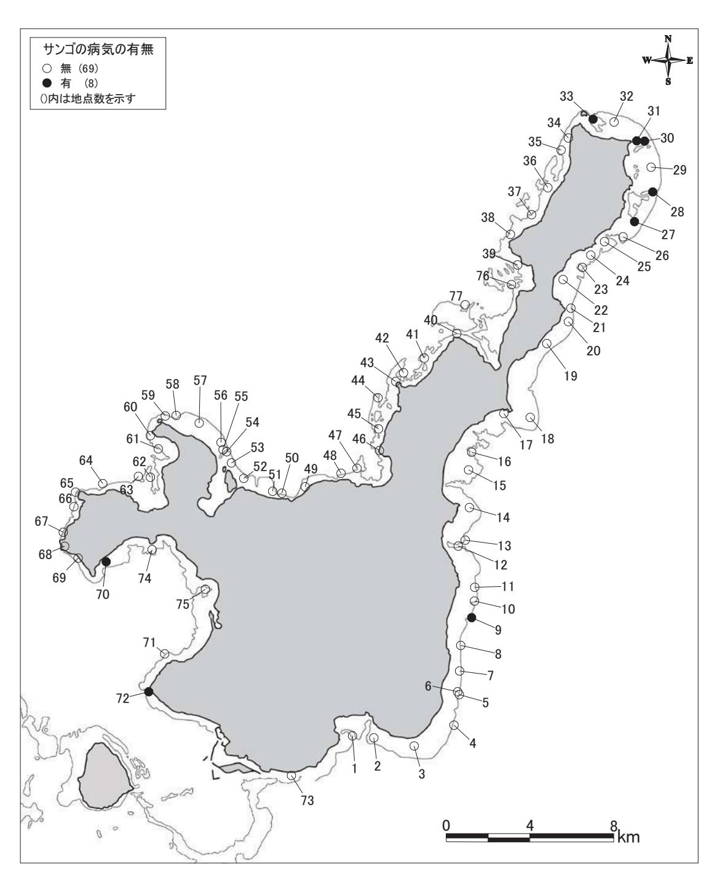

ᅗ ▼ᇉᓥ࿘㎶ᾏᇦࡿࡅ࠾ẼࡢⓎ⏕≧ἣ

ᅗ ▼ᇉᓥ࿘㎶ᾏᇦࡢࢺࣝࢩࡿࡅ࠾ሁ✚≧ἣ

## 㸰㸬▼す♋†ཬࡧす⾲ᓥ࿘㎶ᾏᇦ

## 㸦㸯㸧ࡢࢦࣥࢧ⏕ᜥ≧ἣ

## 㸯㸧ࡢࢦࣥࢧ龠ᗘཬࡧ⫱⏕ᆺ

ࡧᗘཬ⿕ࡢࢦࣥࢧࠊ 7 韭ࢆホ౯ࡢែ≧ࡢࢦࣥࢧࡿࡼᗘ⿕ࢦࣥࢧࡿࡅ࠾ㄪᰝᆅⅬྛ ࠋࡍ♧ 19 ࡧཬ 18 ᅗ 8 韭ࢆቑῶࡢᗘ⿕ࢦࣥࢧࡢࡽᖺᗘࠊ 17 16 ᅗࢆᆺ⏕⫱

ㄪᰝᆅⅬࡢ࡛ᖹᆒࢦࣥࢧ龠ᗘࡣ 30㸣ࠊࡾ࠶࡛ᖺᗘ㸦30㸣㸧ࡽኚࡇࠋࡓࡗ࡞ࡀ ࡛ࡲࢀࡇࠊࡣࢀ㧗⿕ᗘᾏᇦࡀᗈࡓ࠸࡚ࡗࡀ▼す♋†እ⦕㒊ࡸす⾲ᓥ㒊ཬࡧす㒊࠸࠾ ࡉቯ◚ࡀ㞟⩌ࢦࣥࢧつᶍࠊࡾࡼᭀ㢼Ἴᾉࡢࡾᐤࡢく᮶ྕ 21 ࡧཬྕ 17 㢼ྎࠊ࡚ ࡋẅ┦ࢆቑຍࡢᗘ⿕ࡿࡼᡂ㛗ࠊࡀῶᑡ࡞ᖜࡢᗘ⿕㢮ࢦࣥࢧࡢ࡛ㄪᰝᆅⅬࡢࡽࢀࡇࠊࢀ ࠋࡿࢀࡽ࠼⪄ࡵࡓࡓ

ᮏᖺᗘࢦࣥࢧ龠ᗘࡀ龠ᗘ 10㸣ᮍ‶ࡿࢀࡉᆅⅬࡣ 20 ᆅⅬࠊ10㸣௨ୖ 30㸣ᮍ‶ࡣ 23 ᆅ Ⅼࠊ30㸣௨ୖ 50㸣ᮍ‶ࡿࢀࡉ࡞ࡳᆅⅬࡀ 37 ᆅⅬࠊ50㸣௨ୖ 80㸣ᮍ‶ࡀ 37 ᆅⅬࠊ80㸣 ᖹࠊࡓࡲࠊࢀࡉุ᩿‵‵㸣ᮍ50 ࡀㄪᰝᆅⅬࡢ༙ᩘ㐣ࠋࡓࡋᆅⅬᏑᅾ 8 ࡀᆅⅬࡿࢀࡉୖ௨ ᆒࢦࣥࢧ龠ᗘ㸦30㸣㸧ࡶ 30㸣௨ୖ 50㸣ᮍ‶༊ศࡢࡇࠊࡵࡓࡿࢀࡉᾏᇦࢦࣥࢧࡢ♋ࡣⰋ ዲ࠸࡞࠼࠸ࡣ≦ἣࠋࡿ࠶ᖺᗘࡣ龠ᗘ 10㸣ᮍ‶ࡀ 15 ᆅⅬࠊ10㸣௨ୖ 30㸣ᮍ‶ࡀ 35 ᆅⅬࠊ30㸣௨ୖ 50㸣ᮍ‶ࡀ 30 ᆅⅬࠊ50㸣௨ୖ 80㸣ᮍ‶ࡀ 33 ᆅⅬࠊ80㸣௨ୖࡀ 12 ᆅⅬ ࠊ࡛ࡢࡓࡗ࠶࡛ᖺᗘࡣ龠ᗘ 10㸣ᮍ‶ࡢᆅⅬࡀ 5 ᆅⅬቑຍࠊࡋ80㸣௨ୖࡢᆅⅬࡀ 4 ᆅⅬ ῶᑡࠊ30㸣௨ୖ 50㸣ᮍ‶ࡢᆅⅬࡀ 7 ᆅⅬቑຍࡓࡋ୍᪉ࠊ10㸣௨ୖ 30㸣ᮍ‶ࡢᆅⅬࡀ 12 ᆅⅬῶᑡࠊࡋ50㸣௨ୖ 80㸣ᮍ‶ᆅⅬࡀ 4 ᆅⅬቑຍࠋࡓࡋ

⾲㸵 ࢦࣥࢧ龠ᗘࡢࢦࣥࢧࡿࡼ≦ែࡢホ౯ูㄪᰝᆅⅬᩘ㸦 ᆅⅬ୰㸧

| ࢦࣥࢧ⩌㞟ࡢ≦ែ               | ᆅⅬᩘ㸦᫖ᖺᗘ㸧 |
|------------------------|----------|
| 10㸣ᮍ‶㸦㸺10㸣㸧            | 20㸦15㸧   |
| 10㸣௨ୖ 30㸣ᮍ‶㸦10㸣ӌ 㸺30㸣㸧 | 23㸦35㸧   |
| 30㸣௨ୖ 50㸣ᮍ‶㸦30㸣ӌ 㸺50㸣㸧 | 37㸦30㸧   |
| 50㸣௨ୖ 80㸣ᮍ‶㸦50㸣ӌ 㸺80㸣㸧 | 37㸦33㸧   |
| 80㸣௨ୖ㸦80㸣ӌ㸧            | 8㸦12㸧    |

⿕ᗘ 80㸣௨ୖホ౯ࠊࡣࡢࡓࢀࡉ▼す♋†㒊ࡢ 4 ᆅⅬ㸦31ࠊ44ࠊ47ࠊ112㸧ཬࡧす⾲ ᓥࡢ 4 ᆅⅬ㸦129ࠊ130ࠊ132ࠊ134㸧ࠊࡕ࠺ࡢࡇࠋࡓࡗ࠶࡛す⾲ᓥࡢ⥙ྲྀ‴ዟ㸦ᆅⅬ 129㸧 㮵ᕝ‴୰ࣀ℩ձ㸦ᆅⅬ 134㸧ࡣ㧗⿕ᗘࡢ༢୍⩌యࢆほᐹᑐ㇟ࢦࣥࢧࠊ࡛ࡢࡿ࠸࡚ࡋ⩌ 㞟࡚ࡋ龠ᗘ 80㸣௨ୖホ౯ࡿࢀࡉᆅⅬࠊࡣ▼す♋†㒊㸦ᆅⅬ 31ࠊ44ࠊ112㸧ཬࡧᮾ㒊 㸦ᆅⅬ 47㸧す⾲ᓥす㒊㸦ᆅⅬ 130ࠊ132㸧ࡕ࠺ࡢࡇࠊࡋࡋࠋࡿ࠶࡛ 2 ᆅⅬ㸦ᆅⅬ 31ࠊ 112㸧ࠊࡣ࡛୰㹼ᆺࡀࢹࢺࣄࢽ࢜ࡢቑຍࡾ࠾࡚ࡋ㸦ᆅⅬ 31 ࡣ࡛ 10 ಶయࠊ112 ࡣ࡛ 16 ಶ ࠋࡿࢀࡉᠱᛕࡀᗘῶᑡ⿕ࡢᚋࠊయ㸧

⾲㸶 ᖺᗘࢦࣥࢧࡢ龠ᗘࡢቑῶ㸦 ᆅⅬ୰㸧

| ࢦࣥࢧ龠ᗘࡢቑῶ                                                  | ᆅⅬᩘ㸦᫖ᖺᗘ㸧 |
|-----------------------------------------------------------|----------|
| ࡃࡁቑຍ࠘㸸30 ࢺࣥ࢖࣏௨ୖ㸦30ӌ㸧 ࠗ኱                             | 1㸦0㸧     |
| ࠗቑຍ࠘㸸10 ࢺࣥ࢖࣏௨ୖ 30 ࢺࣥ࢖࣏ᮍ‶㸦10ӌ 㸺30㸧                   | 12㸦17㸧   |
| ࡋ࡞࠘㸸-10 ࡃࡁ 10 ࢺࣥ࢖࣏ᮍ‶㸦±10㸧 ࠗኚ໬ ࢖࣏ ࡾࡼࢺࣥ ኱ | 95㸦104㸧  |
| ࠗῶᑡ࠘㸸-30 ࡃࡁ-10 ࢺࣥ࢖࣏௨ୗ㸦-30㸺 ӌ-10㸧 ࢖࣏ ࡾࡼࢺࣥ ኱ | 13㸦4㸧    |
| ࡃࡁῶᑡ࠘㸸-30 ࢺࣥ࢖࣏௨ୗ㸦ӌ-30㸧 ࠗ኱                           | 4㸦0㸧     |

ᖺᗘẚ㍑ࢦࣥࢧࡓࡋ㢮⿕ᗘࡢቑῶࠊࡿࡳࢆࠗࡃࡁቑຍ࠘㸦30 ࢺ࣏ࣥ௨ୖቑຍ㸧 ࡓࡋᆅⅬࡣ 1 ᆅⅬ㸦ᖺᗘࡣ 0 ᆅⅬ㸧ࠊࠗቑຍ࠘㸦10 ࢺ࣏ࣥ௨ୖ 30 ࢺ࣏ࣥᮍ‶㸧ࡓࡋ ᆅⅬࡀ 12 ᆅⅬ㸦ᖺᗘࡣ 17 ᆅⅬ㸧ࠊࠗኚࡋ࡞࠘㸦s10 ᮍ‶ࡢቑῶ㸧ࡢᆅⅬࡀ 95 ᆅⅬ㸦 ᖺᗘࡣ 104 ᆅⅬ㸧ࠊࠗῶᑡ࠘㸦-30 ࡾࡼࡃࡁ-10 ௨ୗ㸧ࡢᆅⅬࡀ 13 ᆅⅬ㸦ᖺᗘࡣ 4 ᆅⅬ㸧ࠊ ࠗࡃࡁῶᑡ࠘㸦-30 ࢺ࣏ࣥ௨ୗ㸧ࡢᆅⅬࡀ 4 ᆅⅬ㸦ᖺᗘࡣ 0 ᆅⅬ㸧ࠋࡓࡗ࠶࡛ᮏᖺᗘ ࠘ቑຍࠗࠊࡀࡓࡋ㸧0 ࡣᖺᗘᆅⅬቑຍ㸦 1 ࡀᆅⅬ࠘ࡓࡋቑຍࡃࡁ࡚ࠗࡋẚ㍑ᖺᗘࠊࡣ ࠘ῶᑡࡃࡁࠗࠊࡀࡓࡋᆅⅬῶᑡ 14 ࡣᆅⅬࡓࡋ࠘ῶᑡࠗࠊࡓࡲࠋࡓࡋᆅⅬῶᑡ 3 ࡣᆅⅬࡓࡋ ࠋࡓࡋᆅⅬቑຍ 3 ࡣᆅⅬࡓࡋ

ᖺᗘࢦࣥࢧࡽ㢮⿕ᗘࡀ 10 ࢺ࣏ࣥ௨ୖᅇࡓࡋ 13 ᆅⅬࠊࡣ▼す♋†ࡢ㒊 4 ᆅⅬ ࠊ㸧37 ᆅⅬ㸦ᆅⅬ 1 ୰ኸ㒊ࠊ㸧105ࠊ95ࠊ7ࠊ1 ᆅⅬ㸦ᆅⅬ 4 ༡㒊ࠊ㸧68ࠊ44ࠊ43ࠊ28 㸦ᆅⅬ ᮾ㒊 2 ᆅⅬ㸦ᆅⅬ 47ࠊ78㸧ࠊཬࡧす⾲ᓥ࿘㎶㞳ᓥ 2 ᆅⅬ㸦ᆅⅬ 133ࠊ135㸧ࠋࡓࡗ࠶࡛

ࠊࡕ࠺ࡢࡽࢀࡇ▼す♋†༡㒊㸦ᆅⅬ 1ࠊ105㸧㒊㸦ᆅⅬ 43ࠊ44ࠊ68㸧ཬࡧす⾲ᓥ࿘ ࡢ㒊ࠊࡶ࡛୰ࠋࡿ࠸࡚ࡌ⏕ࡀቑຍୖ௨ࢺ࣏ࣥ 10 ࡚ࡋ⥆ᖺ㐃 2ࠊࡣ࡛㸧133 ㎶㸦ᆅⅬ ᘺ┿ᓥᮾἈ♋†ෆ㸦ᆅⅬ 44㸧ࡣ 3 ᖺ㐃⥆ 10 ࢺ࣏ࣥ௨ୖࡢቑຍࡀ⥆⥅࣑ࢨࠋࡿ࠸࡚ࡋ ࡢࢦࣥࢧ༢୍⩌యࢆᑐ㇟ࡿ࠸࡚ࡋἼ↷㛫▼㸦ᆅⅬ 133㸧௨እࡢᆅⅬࠊࡣ2004 ᖺࡽ 2006 ࡀࡃከࡢయ⩌ᑠᆺࡢࡢࡑࠊࡾ࠾࡚ࡋグ㘓ࢆ᪂つຍධ㔞ࢩࣜࢻ࣑࠸ẚ㍑ⓗ㧗࡚ࡅᖺ ࡁ⏕ࢆࡃࡿࡼᧁ┤㢼ྎᆺࡢ࡛ࡲᖺ 2008 ࡽᖺ 2005 ࡸ㇟⌧つᶍⓑࡢᖺ 2007 ᘏࠊࡧ㡰ㄪ࡞ᡂ㛗ࢆ⥔ᣢࡿ࠸࡚ࡋᛮࠋࡓࢀࢃ≉ࠊ༡㒊ࢩࣅࣛ࢘ࡢ༡♋⦕㸦ᆅⅬ 1㸧 㯮ᓥ㸫᪂ᇛᓥ㛫ᆺ㞳♋㸦ᆅⅬ 105㸧ࠊ㒊ࡢᘺ┿ᓥᮾἈ♋†ෆ㸦ᆅⅬ 44㸧ᘺ┿ᓥ ᮾἈ♋ෆ⦕㸦ᆅⅬ 68㸧ཬࡧす⾲ᓥ࿘㎶ࡢἼ↷㛫▼㸦ᆅⅬ 133㸧ࡢ 5 ᆅⅬࠊࡣ࡚࠸࠾༟≧ ࠋࡿ࠸࡚ࡋቑຍ⃭ᛴᖺ௨㝆 2008㹼2007 ࡶ್ᖹᆒࡢ㛗ᚄ᭱ࡢ㢮ࢩࣜࢻ࣑

୍᪉ࢦࣥࢧࠊ龠ᗘࡀ 10 ࢺ࣏ࣥ௨ୖῶᑡࠊࡣࡢࡓࡋ▼す♋†㒊ࣛࢼࣚࡢỈ㐨࿘㎶㸦ᆅ ᓥ࿘┿ᘺࠊ㸧53ࠊ52ࠊ51ࠊ50ࠊ49 ᐩᓥ࿘㎶㸦ᆅⅬ➉㸧116ࠊ75ࠊ65ࠊ64ࠊ63ࠊ62 Ⅼ ㎶㸦ᆅⅬ 71ࠊ72ࠊ74㸧ࠊす⾲ᓥ㒊㸦ᆅⅬ 121㸧ࠊ㬀㛫ᓥ࿘㎶㸦ᆅⅬ 141ࠊ142㸧ࡢ 17 ᆅ 㢼ྎࠊࡿࡍ᥎ᐹࢆཎᅉࡢᗘῶᑡ⿕ࡢࡽࢀࡇ࡚ࡋ៖⪃ࢆᯝ⤖ほᐹࡢࢁࡈ᪥ࠋࡓࡗ࠶࡛Ⅼ ࡢࢹࢺࣄࢽ࢜ࠊ㸧72ࠊ71 ᒣᓥ࿘㎶㸦ᆅⅬ㸧53ࠊ50ࠊ49 ࿘㎶㸦ᆅⅬ⏫ᐩ➉ࡣᐖ⿕ࡿࡼ 㣗ᐖࣛࢼࣚࡣỈ㐨࿘㎶㸦ᆅⅬ 62ࠊ63ࠊ75㸧ᘺ┿ᓥ࿘㎶㸦ᆅⅬ 74㸧ࠊྎ㢼ࢹࢺࣄࢽ࢜ 㢼ྎࠊ㸧142 㬀㛫ᓥ࿘㎶㸦ᆅⅬ㸧116ࠊ65ࠊ64 Ỉ㐨࿘㎶㸦ᆅⅬࣛࢼࣚࡣࡢࡿࡼ୧᪉ Ẽ㸦࣒࣮ࣟࢻࣥࢩࢺ࣡࣍㸧ࡣࡢࡿࡼ10ᐩᓥ࿘㎶㸦ᆅⅬ 51ࠊ52㸧す⾲㒊㸦ᆅⅬ 121㸧ࠊྎ㢼ࢹࢺࣄࢽ࢜Ẽ㸦࣒࣮ࣟࢻࣥࢩࢺ࣡࣍㸧ࡢ「ྜⓗ࡞せᅉࡣࡢࡿࡼ㬀㛫 ᓥ࿘㎶㸦ᆅⅬ 141㸧ᛮࠋࡓࢀࢃ

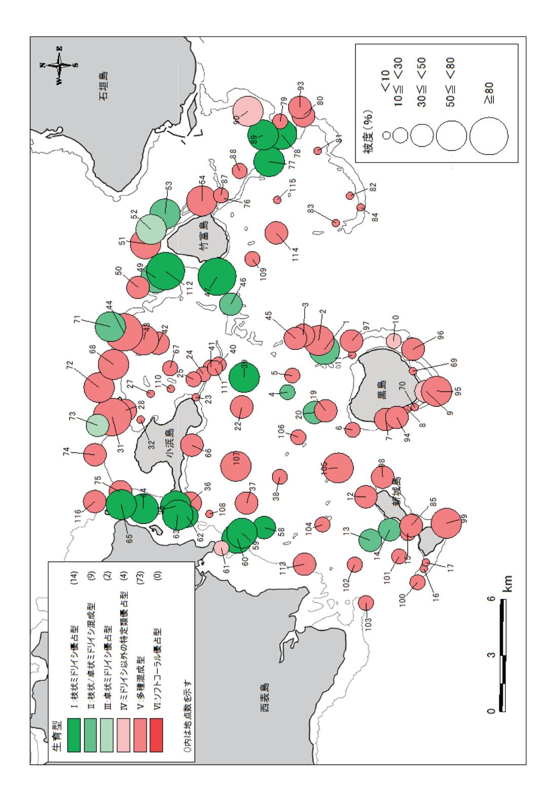

図 16 石西礁湖周辺海域におけるサンゴ被度及び生育型

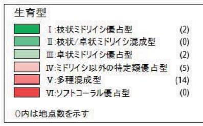

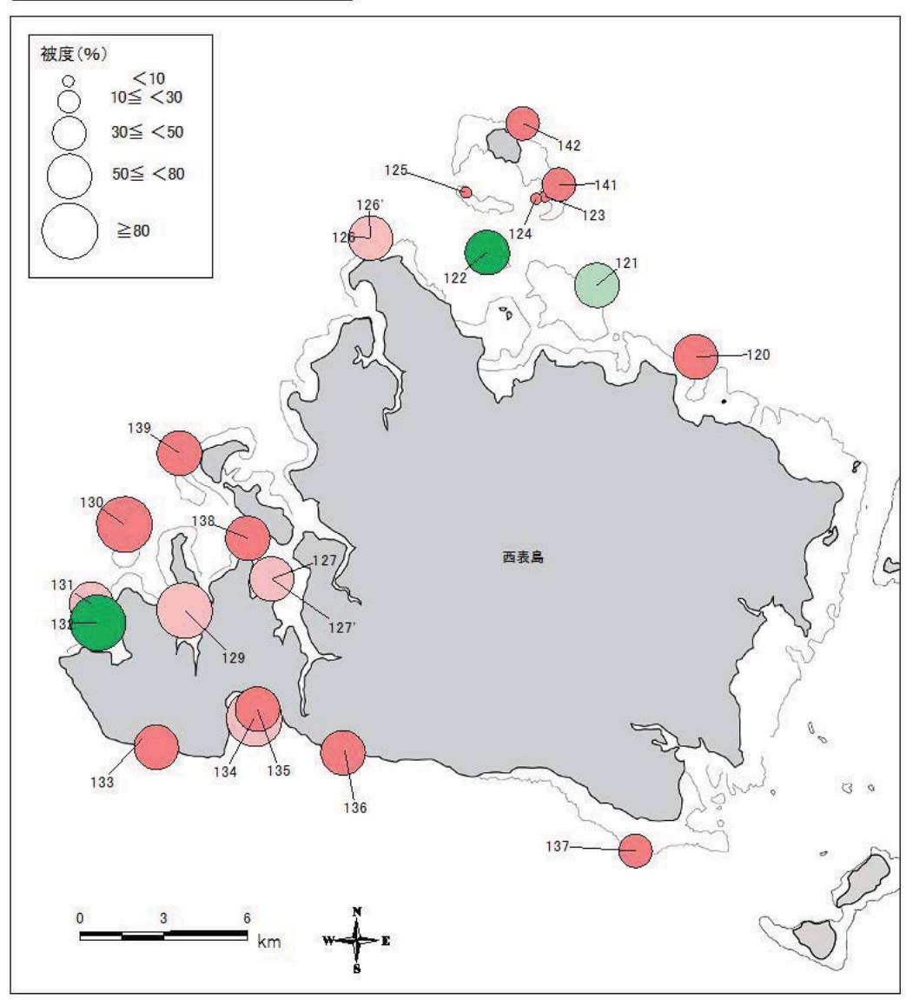

図 17 西表島周辺海域におけるサンゴ被度及び生育型

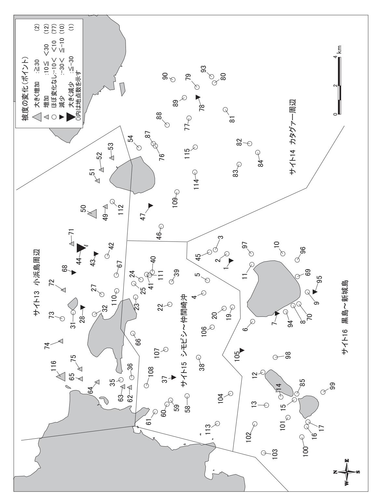

ᅗ ▼す♋†࿘㎶ᾏᇦࢦࣥࢧࡿࡅ࠾龠ᗘࡢᖺᗘࡢࡽኚ

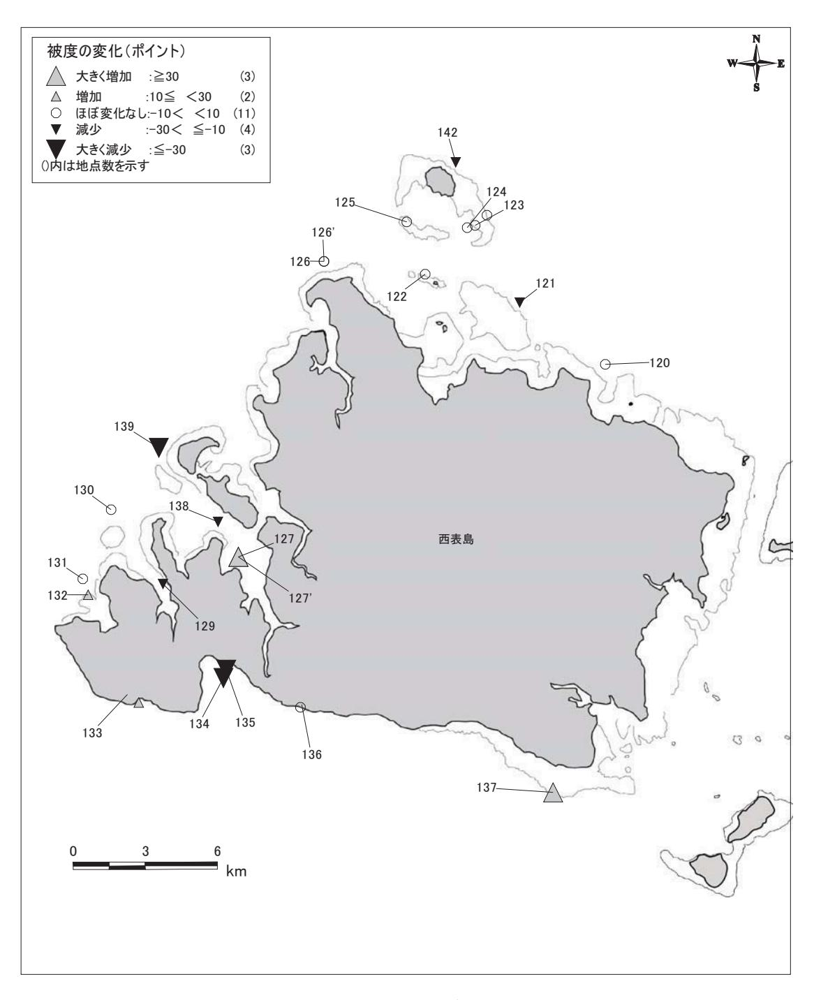

ᅗ す⾲ᓥ࿘㎶ᾏᇦࢦࣥࢧࡿࡅ࠾龠ᗘࡢᖺᗘࡢࡽኚ

## 㸰㸧༟≧ࢩࣜࢻ࣑㢮ࡢ᭱㛗ᚄ

ࠊࡣᮏᖺᗘࠋࡍ♧ 21 ࡧཬ 20 ᅗ 9 韭ࢆ⛣᥎ࡢᩘᆅⅬู㛗ᚄ᭱ࡢ㢮ࢩࣜࢻ࣑≦༟ ༟≧ࡢࢩࣜࢻ࣑᭱㛗ᚄࡀ 25cm ᮍ‶ࡢᆅⅬࠊࡣᖺᗘࡽ 4 ᆅⅬῶᑡ࡚ࡋ 24 ᆅⅬ࡛ ࠊࡀࡓࡗ࠶᭱㛗ᚄࠕ100cm ௨ୖ 200cm ᮍ‶ࠖࡢᆅⅬࡣᖺᗘࡢ 40 ᆅⅬࡽ 15 ᆅⅬῶ ᑡ࡚ࡋ 25 ᆅⅬࠕࠊࡾ࡞25cm ௨ୖࠊ100cm ᮍ‶ࠖࡢᆅⅬࡀᖺᗘࡽ 18 ᆅⅬቑຍ࡚ࡋ 64 ᆅⅬࠋࡓࡗ࡞100㹼200cm ࡢࢫࣛࢡῶᑡࠊࡣྎ㢼ࡿࡼ◚ᦆཬࡢࢹࢺࣄࢽ࢜ࡧ㣗ᐖ ࠋࡿࢀࢃᛮࡢࡶࡿࡼ

᭱㛗ᚄࡀ 200cm ௨ୖࠊࡣࡢࡓࡗ࠶࡛▼す♋†༡㒊ࢩࣅ࣐ࡢᾏ୰බᅬᆅ༊㸦ᆅⅬ 13㸧 ࠋࡓࡗ࠶࡛ࡅࡔ

ࠊ࠾࡞༡㒊ࡢ㯮ᓥ༡ᮾᓊ♋ụෆ 1㸦ᆅⅬ 10㸧㬀㛫ᓥࡢ 2 ᆅⅬ㸦ᆅⅬ 124ࠊ125㸧ࠊࡣ࡛ ࠋࡓࡗ࡞ࡃ࡞ࡅぢࡃࡓࡗࡲࢆయ⩌ࢩࣜࢻ࣑≦༟

|                   | 2003 | 2004 | 2005 | 2006 | 2007 | 2008 | 2009 | 2010 | 2011 | 2012 |
|-------------------|------|------|------|------|------|------|------|------|------|------|
| 25 ੉ᮍ‶            | 13   | 3    | 3    | 5    | 11   | 18   | 19   | 27   | 28   | 24   |
| 25cm ௨ୖࠊ100cm ᮍ‶  | 51   | 65   | 63   | 59   | 70   | 66   | 68   | 58   | 46   | 64   |
| 100cm ௨ୖࠊ200cm ᮍ‶ | 45   | 39   | 40   | 45   | 30   | 25   | 24   | 31   | 40   | 25   |
| 200cm ௨ୖ          | 4    | 13   | 13   | 9    | 1    | 0    | 0    | 0    | 2    | 1    |
| ༟ ࣜࢻ࣑≦ ࡋ࡞ࢩ࢖ | 10   | 3    |      | 5 4  | 11   | 16   | 14   |      | 9 9  | 11   |
| ᖹᆒ್               | 90   | 103  | 107  | 106  | 78   | 70   | 67   | 67   | 74   | 67   |
| ᶆ‽೫ᕪ              | 59   | 66   | 65   | 62   | 46   | 45   | 45   | 47   | 54   | 45   |
| ྜィ                | 123  | 123  | 123  | 123  | 123  | 125  | 125  | 125  | 125  | 125  |

⾲㸷 ༟≧ࢩࣜࢻ࣑㢮ࡢ᭱㛗ᚄ㸦 ⩌యࡢᖹᆒ್㸧ูࡢᆅⅬᩘࡢ᥎⛣㸦 ᆅⅬ୰㸧

## 㸱㸧ࢩࣜࢻ࣑㢮ࡢ᪂つຍධ

ࡿ࡞Ᏻ┠ࡢᅇࡢ♋ࢦࣥࢧࠋࡍ♧ 23 ࡧཬ 22 ᅗ 10 韭ࢆἣ≧ຍධࡢ㢮ࢩࣜࢻ࣑ ᪂つຍධࡀ 10⩌ య/੍௨ୖࡢᆅⅬࠊࡣᖺᗘࡢ 63 ᆅⅬࡽῶᑡ࡚ࡋ 59 ᆅⅬࠋࡓࡗ࠶࡛୰ ♋す▼㸧65ࠊ64ࠊ35 Ỉ㐨࿘㎶㸦ᆅⅬࣛࢼࣚࠊࡣᆅⅬ࠸㧗ࡢୖయ௨ ⩌40 ࡀ᪂つຍධࡶ࡛ †ᓊ㸦ᆅⅬ 52㸧ࡢᆅⅬࠊࡓࡲࠋࡓࡗ࠶࡛᪂つຍධ㔞ࡀᖜቑຍࡓࡋᆅⅬࣛࢼࣚࠊࡣỈ 㐨༡ࡢᑠᓥഃ㸦ᆅⅬ 35㸸17 ⩌యЍ45 ⩌య㸧▼す♋†༡㒊ࡢእὒ㠃ࡓࡋᆅⅬ㸦ᆅⅬ 84㸸3 ⩌యЍ20 ⩌యࠊ85㸸6 ⩌యЍ17 ⩌య㸧ࠋࡓࡗ࠶࡛

୍᪉ࠊᖺᗘࡽ᪂つຍධ㔞ࡀᖜῶᑡࡓࡋᆅⅬࠊࡣ▼す♋†㒊ࡢ10ᐩᓥ࿘㎶㸦ᆅ Ⅼ 49㸸42 ⩌యЍ25 ⩌యࠊ53㸸100 ⩌యЍ17 ⩌యࠊ54㸸45 ⩌యЍ25 ⩌య㸧ࣛࢼࣚࠊỈ㐨 ༡ࡢす⾲ᓥഃ㸦ᆅⅬ 63㸸40 ⩌యЍ11 ⩌యࠊ65㸸100 ⩌యЍ45 ⩌య㸧ࠊ▼す♋†ᓊ㸦ᆅ  72㸸32 ⩌యЍ20 ⩌యࠊ73㸸50 ⩌యЍ20 ⩌యࠊ116㸸23 ⩌యЍ11㸧ࠊす⾲ᓥ㒊㸦ᆅⅬ 㸸40 ⩌యЍ20 ⩌య㸧ࠋࡓࡗ࠶࡛

⾲ ࢩࣜࢻ࣑㢮ຍධᐦᗘูᆅⅬᩘ㸦 ᆅⅬ୰㸧

| ࣑ ࢩ࢖ࣜࢻ 㢮ຍධᐦᗘ㸦⩌య㸭੍㸧 | ᆅⅬᩘ㸦᫖ᖺᗘ㸧 |
|--------------------------|----------|
| 0ӌ <1                    | 1㸦2㸧     |
| 1ӌ <5                    | 35㸦35㸧   |
| 5ӌ <10                   | 27㸦22㸧   |
| 10ӌ <20                  | 36㸦31㸧   |
| 20ӌ <30                  | 15㸦19㸧   |
| 30ӌ <40                  | 4㸦4㸧     |
| 40ӌ                      | 4㸦9㸧     |

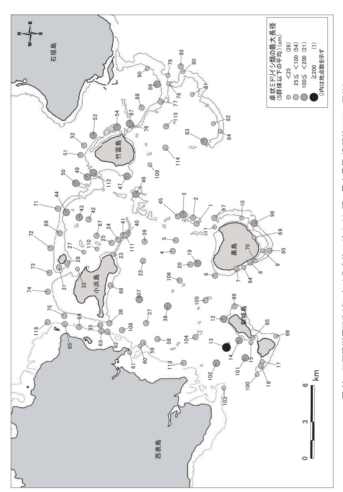

図 20 石西礁湖周辺海域における卓状ミドリイシ類の最大長径 (5 群体以下の平均)

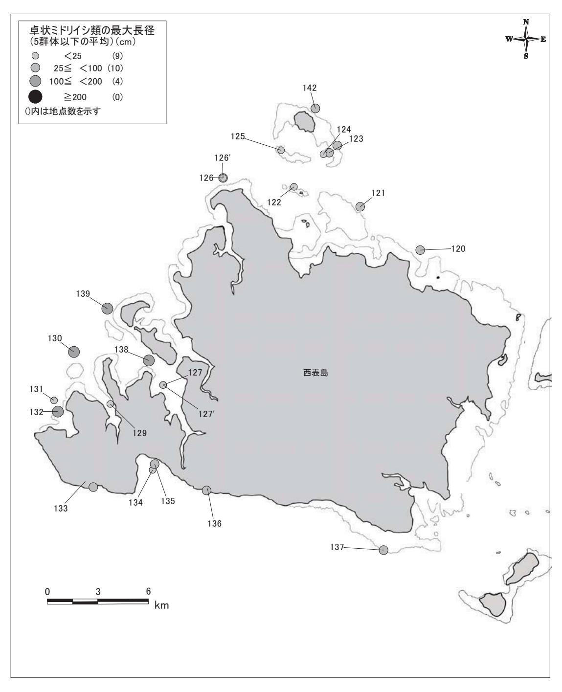

ᅗ す⾲ᓥ࿘㎶ᾏᇦࡿࡅ࠾༟≧ࢩࣜࢻ࣑㢮ࡢ᭱㛗ᚄ㸦 ⩌య௨ୗࡢᖹᆒ㸧

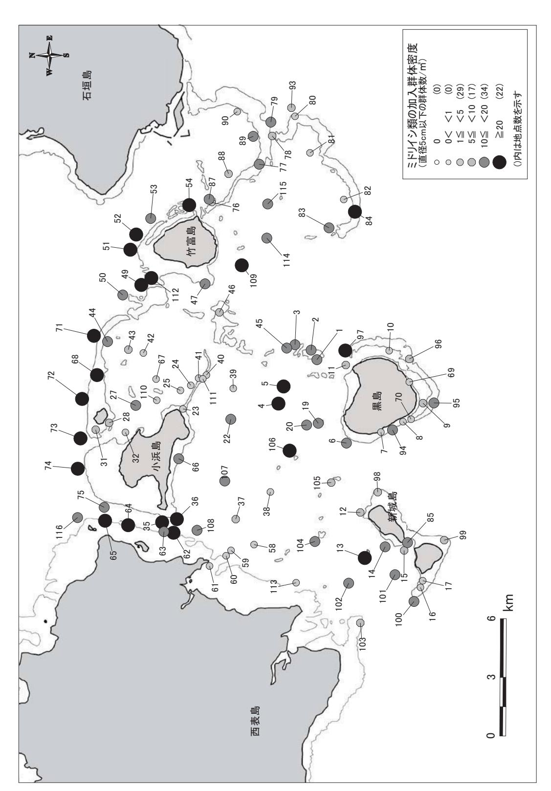

図 22 石西礁湖周辺海域におけるミドリイシ類の加入状況

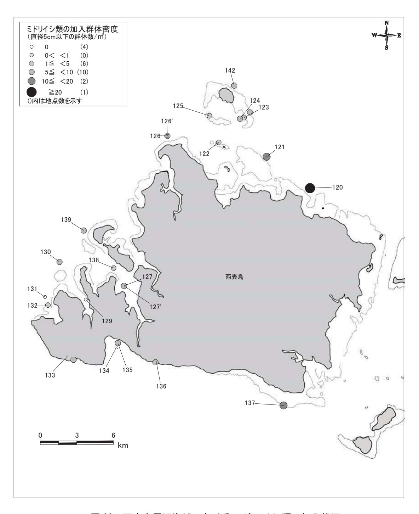

ᅗ す⾲ᓥ࿘㎶ᾏᇦࢩࣜࢻ࣑ࡿࡅ࠾㢮ࡢຍධ≧ἣ

## 㸦㸰㸧ࡃࡢࢦࣥࢧせᅉࡢ≦ἣ

## ࢹࢺࣄࢽ࢜㸯㸧

ࢺࣄࢽ࢜ࡿࡅ࠾ㄪᰝᆅⅬྛࠊ 11 韭ࢆᩘㄪᰝᆅⅬࡢᩘูほᐹ⟬ศ 15 ࡢࢹࢺࣄࢽ࢜ ࡢࢹ⏕ᜥ≧ἣࢆᅗ 24 ཬࡧ 25 ࠊྛㄪᰝᆅⅬࡢࢹࢺࣄࢽ࢜ࡿࡅ࠾ඃ༨ࢆࢬࢧᅗ 26 ཬ ࠋࡍ♧ 27 ࡧ

| ࢜ ࢹࢺࣄࢽ Ⓨ⏕≧ἣ    | ᆅⅬᩘ㸦᫖ᖺᗘᆅⅬᩘ㸧 |
|----------------------|-------------|
| ㏻ᖖศᕸ㸦0 ಶయ㸧           | 61㸦50㸧      |
| ㏻ᖖศᕸ㸦0㸺 㸺2 ಶయ㸧       | 34㸦31㸧      |
| ከ࠸㸦せὀព㸧㸦2 ಶయӌ 㸺5 ಶయ㸧 | 10㸦21㸧      |
| ‽኱Ⓨ⏕㸦5 ಶయӌ 㸺10 ಶయ㸧   | 16㸦8㸧       |
| ኱ Ⓨ ⏕㸦10 ಶయӌ㸧        | 4㸦15㸧       |

⾲ ࡢࢹࢺࣄࢽ࢜ ศ⟬ほᐹᩘูࡢㄪᰝᆅⅬᩘ㸦 ᆅⅬ㸧

ᮏᖺᗘࢆࢹࢺࣄࢽ࢜ほᐹࠊࡣࡢࡓࡋ125 ㄪᰝᆅⅬ୰ 64 ᆅⅬ㸦51㸣㸧ࠊ࡛ᖺᗘ㸦75 ᆅ ಶయ 558ࠊ࡚ẚಶయ 1,405 ࡢᖺᗘࡶᩘほᐹಶయ⥲ࠊࡽࡉࠋࡓࡋῶᑡࡶࡾࡼⅬ㸧 ᖜῶᑡࠋࡓࡋ15 ศ㛫㐟Ὃ୰ㄪᰝဨ 1 ேࡢࡾࡓ࠶ほᐹᩘࢆ⏝ࡢࢹࢺࣄࢽ࡚࢜࠸Ⓨ⏕≧ἣ ࢆ༊ศࢆࢹࢺࣄࢽ࢜ࠊࡿࡍほᐹࡓࡗ࡞ࡋᆅⅬ㸦0 ಶయ㸧ࡣ 61 ᆅⅬ㸦ᖺᗘࡣ 50 ᆅⅬ㸧ࠊ ࠗ㏻ᖖศᕸ࠘ࡿࢀࡉ࡞ࡳᆅⅬ㸦0 ࡾࡼከࡃ 2 ಶయᮍ‶㸧ࡣ 34 ᆅⅬ㸦ᖺᗘࡣ 31 ᆅⅬ㸧ࠊ ࠗከ࠸㸦せὀព㸧࠘ࡿࢀࡉ࡞ࡳᆅⅬ㸦2 ಶయ௨ୖࠊ5 ಶయᮍ‶㸧ࡣ 10 ᆅⅬ㸦ᖺᗘࡣ 21 ᆅⅬ㸧ࠊࠗ‽Ⓨ⏕࠘≧ែࡿࢀࡉ࡞ࡳࡿ࠶ᆅⅬ㸦5 ಶయ௨ୖࠊ10 ಶయᮍ‶㸧ࡣ 16 ᆅⅬ 㸦ᖺᗘࡣ 8 ᆅⅬ㸧ࠊࠗⓎ⏕࠘≧ែࡿ࠶࡛ᆅⅬ㸦10 ಶయ௨ୖ㸧ࡣ 4 ᆅⅬ㸦ᖺᗘࡣ 15 ᆅ ࠋࡓࡗ࠶࡛Ⅼ㸧

Ⓨ⏕≧ែࣛࢼࣚࠊࡣࡢࡓࡏ࡞ࡳỈ㐨༡㒊㸦ᆅⅬ 63㸸87 ಶయЍ22 ಶయ㸧ࣛࢼࣚࠊỈ 㐨୰ኸ㒊㸦ᆅⅬ 64㸸27 ಶయЍ30 ಶయ㸧ࣛࢼࣚࠊỈ㐨୰ኸ㒊㸦ᆅⅬ 75㸸90 ಶయЍ118 ಶయ㸧ࠊ 㬼㞳ᓥ๓㞳♋㸦ᆅⅬ 116㸸222 ಶయЍ32 ಶయ㸧ࠊࡾ࠶࡛ᖺࡽ⥆⥅ⓗ࡞≦ἣࢆ♧࠸࡚ࡋ ࠋࡓ

ᖺᗘⓎ⏕≧ែࡓࡗ࠶ 15 ᆅⅬࣛࢼࣚࠊࡕ࠺ࡢỈ㐨ࢆྵࡴ▼す♋†㒊ཬࡧ㬀㛫ᓥ ࡛㸧142ࠊ141ࠊ116ࠊ75ࠊ74ࠊ73ࠊ65ࠊ64ࠊ63ࠊ62 ㄪᰝᆅⅬ㸦ᆅⅬࡢ㒊ᓥ⾲すࡴྵࢆ ࠋࡓࡋῶᑡࡃࡁࡀᗘ⿕࡚ࡗࡼ㣗ᐖࡢࢹࢺࣄࢽ࢜ࡶࡾࡼᙳ㡪ࡢ㢼ྎࠊࡣ

ୖグࡢᆅⅬ௨እࡀࢹࢺࣄࢽ࢜ࠊᛴቑࡓࡋᆅⅬࠊࡣ࡚ࡋᘺ┿ᓥ༡すᓊ♋ụෆ㸦ᆅⅬ 31㸸0 ಶయЍ10 ಶయ㸧ࣛࢼࣚࠊỈ㐨༡♋⦕㸦ᆅⅬ 35㸸1 ಶయЍ5 ಶయ㸧ࠊ10ᐩᓥすἈ㞳♋♋ ⦕㸦ᆅⅬ 49㸸12 ಶయЍ17 ಶయ㸧ࠊ10ᐩᓥᓊ♋እ⦕㸦ᆅⅬ 51㸸16 ಶయЍ19 ಶయ㸧ࠊ㯮ᓥ ᮾᓊ♋እ⦕㸦ᆅⅬ 97㸸1 ಶయЍ12 ಶయ㸧ࢳࢢࣥࢻ࢟ࢱࠊᾏ୰බᅬᆅ༊㸦ᆅⅬ 112㸸4 ಶయ Ѝ16 ಶయ㸧ࠊ10ᐩᓥ༡Ἀ㞳♋㸦ᆅⅬ 114㸸3 ಶయЍ15 ಶయ㸧ࠊࡾ࠶ࡀ≉ᆅⅬ 49㸦➉ᐩᓥ すἈ㞳♋♋⦕㸧ᆅⅬ 51㸦➉ᐩᓥᓊ♋እ⦕㸧ࡣᖺᗘ⥆ࡁ⥆⥅ⓗ࡞ቑຍഴྥࡿ࠶ ಶ 0 ࡢᖺᗘ୍ࡶ࡛ᾏ୰බᅬᆅ༊㸧ࢳࢢࣥࢻ࢟ࢱ㸦112 ᆅⅬࡿࡍ⨨㏆㞄ࡽࡉࠊ࠼࠸ యࡢほᐹ⤖ᯝ௨᮶ࠊ୰ᆺࡽᆺಶయࡢほᐹᩘࡀቑຍࠋࡓࡋ

ᮏᖺᗘࠊࡣ10ᐩᓥࡽすࡢ࡚ࡅ୍ᖏ㸦♋♋ᩳ㠃㝈ࡎࡽ㸧ࠊ࡛ྎ㢼ࡢἼᾉ ࡓࡿ࠸࡚ࡋศᕸᗈ⠊ᅖࡀ⩌ಶయࢹࢺࣄࢽ࢜ࡣ࡛ᾏᇦࡢࡇࠊࡀࡓࡅཷࢆ᧠࡞つᶍࡿࡼ ࡀᛶ⬟ྍࡿ࠺ࡾࡇ㉳ࡀపୗ࡞⃭ᛴࡢᗘ⿕㢮ࢦࣥࢧࠊࢀࡉᠱᛕࡀࡇࡿࡍ㐩ែ⏕≧Ⓨࡵ ࠋࡿ࠶

ࠊ78ࠊ74ࠊ73ࠊ72ࠊ71ࠊ65ࠊ63ࠊ50ࠊ46 ᆅⅬ㸦ᆅⅬ 17 ࡓࡋῶᛴࡀࢹࢺࣄࢽ࢜ࠊ᪉୍ 韭すࡧཬ⦕እ♋†す▼ࡣᆅⅬ 11 ࡢࡕ࠺ࡢ㸧142ࠊ141ࠊ125ࠊ121ࠊ116ࠊ109ࠊ105ࠊ99 ῶᑡࡢᩘほᐹࢹࢺࣄࢽ࢜ࡢ࡛ㄪᰝᆅⅬࡢࡽࢀࡇࠊࡾ࠾࡚ࡋ⨨㸧ࡴྵࢆ㒊㸦㬀㛫ᓥᓥ ࢆᜥሙᡤ⏕ࠊࢀࡉቯ◚ࡀࢦࣥࢧ࡚ࡗࡼ㢼ྎࠊࡸࡇࡓࡋపୗࡀᗘ⿕ࢦࣥࢧࡿ࡞㣵ࠊࡣ ࠋࡿࢀࡽ࠼⪄ᙳ㡪ࡓࡗኻ

## 㸰㸧ࢦࣥࢧ㣗ᕳ㈅

ࠋࡍ♧ 29 ࡧཬ 28 ᅗࢆἣ≧ศᕸࠊ 12 韭ࢆᩘᆅⅬูࢡࣥࣛᐖ⿕ࡢ㣗ᕳ㈅㢮ࢦࣥࢧ

ᮏᖺᗘㄪᰝࠊࡣ࡛ᑠ࡞ࡉ㣗ࡸ㣗ᐖ㒊ࡿ࠶ࡢ⩌యࡀᩓぢࢡࣥࣛࡿࡍϩࡀ 74 ᆅⅬࠊ㣗 ࡽࡓぢᙜࡣ㈅㞟ᅋࡓࡋᐦ㞟ࡿ࡞ࡽୖⓒಶ௨ᩘࠊࡀࡘ❧┠ࡀయ⩌ࡿ࠶ࡢ㣗ᐖ㒊ࠊࡃࡁࡀ ᆅ 4 ࡀϫࢡࣥࣛࡿࢀࡉᩓぢࡀ㈅㞟ᅋࡓࡋᐦ㞟ࠊࡕ❧┠ࡀయ⩌ṚஸࠊᆅⅬ 5 ࡀϪࢡࣥࣛ࠸࡞ Ỉࣛࢼࣚࡿࡍศᕸࡀ㞟ࡢࢩࣜࢻ࣑≦ᯞࠊࡣᆅⅬࡓࢀࡉほᐹࡀ㈅㢮ࡽࢀࡇࠋࡓࡗ࠶࡛Ⅼ 㐨࿘㎶ࢳࢢࣥࢻ࢟ࢱࠊᾏ୰බᅬᆅ༊ࠊᘺ┿ᓥ༡すᓊ♋ụෆ⨨ࠋࡿ࠸࡚ࡋ

⾲ ࢦࣥࢧ㣗ᕳ㈅ࡢⓎ⏕≧ἣ㝵⣭ูࡢㄪᰝᆅⅬᩘ㸦 ᆅⅬ୰㸧

| ࢦࣥࢧ㣗ᕳ㈅ࡢⓎ⏕≧ἣ                                                                                     | ᆅⅬᩘ㸦᫖ᖺᗘ㸧 |
|-------------------------------------------------------------------------------------------------|----------|
| Ϩ㸦㣗⑞ࡀ ❧┠ ࠸࡞ࡓ㸧                                                                             | 43㸦29㸧   |
| ϩ㸦ᑠ ࡞ࡉ㣗⑞ࡸ㣗ᐖ㒊 ࡿ࠶ࡢ⩌యࡀᩓぢ㸧                                                                    | 74㸦89㸧   |
| ⑞Ϫ㸦㣗 ࡃࡁ኱ࡣ 㣗ᐖ㒊ࠊ ⩌ࡿ࠶ࡢ ❧┠ࡀయ ᩘࠊࡀࡘ ⓒಶయ௨ ୖ ࡿ࡞ࡽ࠿ᐦ㞟 ࡓࡋ㈅㞟ᅋ ࡳࡣ ࠸࡞ࢀࡽ 㸧 | 5㸦3㸧     |
| ϫ㸦Ṛஸ⩌యࡀ ❧┠ ࠊࡕᐦ㞟 ࡓࡋ㈅㞟ᅋࡀᩓぢ ࡿࢀࡉ㸧                                                       | 3㸦4㸧     |

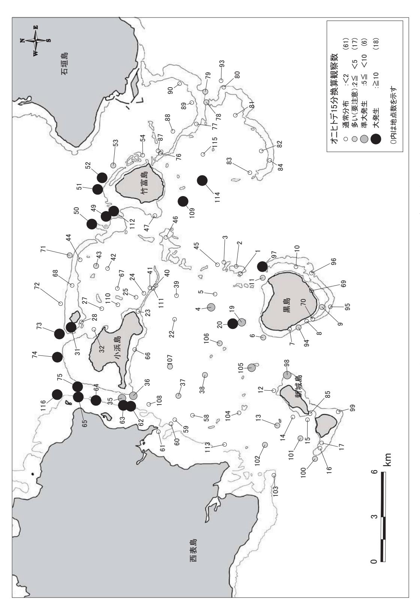

図 24 石西礁湖周辺海域におけるオニヒトデの生息状況

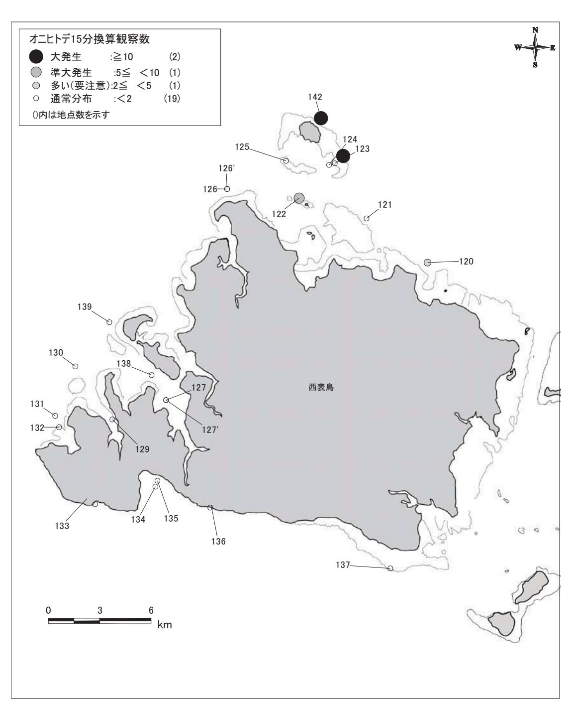

ᅗ す⾲ᓥ࿘㎶ᾏᇦࡢࢹࢺࣄࢽ࢜ࡿࡅ࠾⏕ᜥ≧ἣ

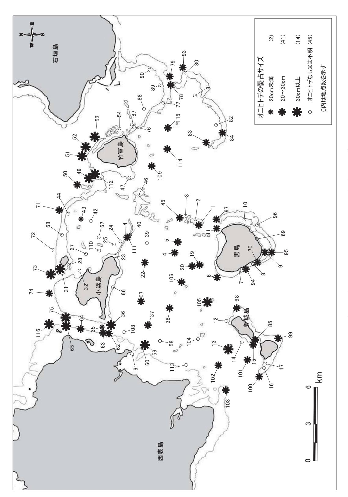

図 26 西表島周辺海域におけるオニヒトデの優占サイズ

ᅗ す⾲ᓥ࿘㎶ᾏᇦࡢࢹࢺࣄࢽ࢜ࡿࡅ࠾ඃ༨ࢬࢧ

図 28 石西礁湖周辺海域におけるサンゴ食巻貝の分布状況

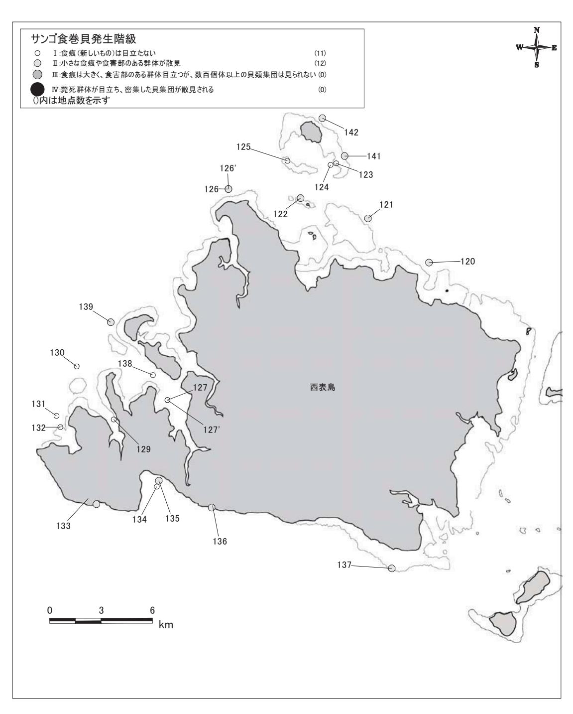

ᅗ す⾲ᓥ࿘㎶ᾏᇦࢦࣥࢧࡿࡅ࠾㣗ᕳ㈅ࡢศᕸ≧ἣ

## 㸱㸧ⓑ⌧㇟

ᮏᖺᗘࡣⱝᖸࡢⓑࢀࡽࡳࡀ㸦⾲ 13㸧ࠊ128 ᆅⅬࡢ࡛ᖹᆒⓑ⋡ࡣ 17㸣ࠊᖹᆒṚஸ⋡ࡣ 1998ࠊᖺ 1983ࠊ௨᮶࡚ࡗࡲጞࡀㄪᰝࢢࣥࣜࢱࢽࣔ♋ࢦࣥࢧࡢ†♋す▼ࠋࡓࡗ࠶࡛㸣௨ୗ0.1 2011ࠊᖺ 2010ࠊᖺ 2009ࠊᖺ 2008ࠊᖺ 2007ࠊᖺ 2006ࠊᖺ 2005ࠊᖺ 2003ࠊᖺ 2001ࠊᖺ 足㐍⃭ᛴࡽࢁࡈ᭶ୗ᪪ 6ࠊࡣ㇟⌧ⓑࡢᖺᗘࠋ㸧14⾲ 㸦ࡿࡓ࠶┠ᗘ 12ࠊࡁ⥆ᖺ ࡃⷧࡀⰍࡧⓗ୍᭶୰᪪ 9ࠊࡀࡓࡗ࠶ྥഴᅇࠊᚋࡓࡋ㐩ࢡ࣮ࣆ᭶୰᪪ 7ࠊࡋ ࠋࡓࡗ㎺ࢆ⦌⤒࠺࠸ࠊࡿ࡞

ࡢࡢࡑࠊᆅⅬ 21 ࡀᆅⅬࡢ‵‵㸣ᮍ50 ୖ㸣௨25ࠊᆅⅬ 1 ࡣᆅⅬࡓࡋ♧ࢆୖ㸣௨75⋡ ⓑ 106 ᆅⅬࡣⓑ⋡ 25㸣ᮍ‶ࠊࡾ࠶࡛ᮏᖺᗘࡢ▼す♋†ཬࡧす⾲ᓥ࿘㎶ᾏᇦࡢ࡛ⓑ⌧㇟ࡣ ࠋࡿࢀࡽ࠼⪄ࡓࡗࡔ㍍ᚤࡣᙳ㡪ࠊ࡛ᑠつᶍ

⾲ ᖺᗘㄪᰝࡢⓑ⋡ࡢࡈࢡࣥࣛᆅⅬᩘ㸦 ᆅⅬ୰㸧

| ⓑ໬⋡         | ᆅⅬᩘ |
|-------------|-----|
| 75㸣ӌ        | 1   |
| 50㸣ӌ <75㸣ᮍ‶ | 0   |
| 25㸣ӌ <50㸣ᮍ‶ | 21  |
| 0㸣< <25% | 106 |
| 0%          | 0   |

ࡉほᐹࡶ㇟⌧ⓑࡿࡼ పỈࡢᏘࠊࡾ࡞ETBࡣⓑࡿࡼ 㧗ỈࡢኟᏘࠊࡣᮏᖺᗘ ࠋࡓࢀඵ㔜ᒣᾏᇦࡢ▼す♋†㒊㸦♋እ⦕ࡃ࡞࡛ࡅࡔ10ᐩᓥ㸫ᑠᓥ㛫♋†ෆࢆྵࡴ㸧 ࠊࡣ࡛9 ᭶ྎ㢼 17 ྕ㸦9 ᭶ 24 ᪥㹼30 ᪥㸧ࡵࡓࡢᐤࡢࡾᭀ㢼ࡀ㛗㛫྿ࠊࡇࡓ࠸ ᭀ㢼୪ࡳ㸦▐㛫᭱㢼㏿ẖ⛊ 18 ࣝࢺ࣮࣓๓ᚋ㸧ࡢሙࡢᏘ⠇㢼㸦㏻⛠ࢩࢽ࣮࣑㸧ࡶ྿ࡁ Ⲩࡽࡉࠊࢀྎ㢼 21 ྕ㸦10 ᭶ 10 ᪥㹼18 ᪥㸧ࡢἼᾉࢦࣥࢧࠊࡵࡓࡢ⩌యࡢ୍㒊ࡽࡔࡲࡀ ࢀࡉほᐹᗈ⠊ᅖࠊࡀṚஸ࡞㒊ศⓗࡸᦆ◚ࡢయ⩌ࢦࣥࢧࡸ㇟⌧ࡿ࠸࡚ࡗ࡞ࡃⷧࡀⰍᶍᵝ ࠋࡓ

ᮏᖺᗘࡢⓑ⌧㇟ࡣᇦⓗ㍍ᗘࡀࡓࡗ࠶࡛㸦ᅗ 30ࠊ31㸧ࠊす⾲ᓥす㒊ࡢ‴ෆࡣ࡛ ⓑࢦࣥࢧࡓࡋ⩌యࡸṚஸ⩌యࢆከᩘほᐹࡢࡇࠋࡓࡋᆅᇦࡢࡅࡔETB≉ⓗ࡞ⓑ⌧㇟ࡣ 2006 ᖺࡶⓎ⏕ࡢࡑࠊࡾ࠾࡚ࡋᖺࡢᖹᆒⓑ⋡㸦 123 ㄪᰝᆅⅬ㸧ࡣ 16㸣ࠊᖹᆒṚஸ⋡ ࡎࢃࡣ 0.6㸣ࢥࢱࠊࡀࡓࡗ࠶࡛ᓮ♋ὸ㒊㸦ᆅⅬ 127̓㸧⥙ྲྀ‴ዟ㸦ᆅⅬ 129㸧ࡢṚஸ⋡ ࠋࡓࡋグ㘓ࢆ್࠸㧗ࡢ㸣20 㸣35 ࢀࡒࢀࡑࡣ

⾲ ᖺᗘࡽ ᖺᗘࡢ࡛ࡲⓑࡢほᐹࡓࢀࡉᖺࡢⓑ⋡㸦㸧

| ㄪᰝᖺᗘ   | 1998 | 2001 | 2003 | 2005 | 2006 | 2007 | 2008 | 2009 | 2010 | 2011  | 2012 |
|--------|------|------|------|------|------|------|------|------|------|-------|------|
| ⓑ໬⋡㸦%㸧 | 65   | 24   | 31   | 33   | 16   | 49   | 65   | 42   | 39   | 32    | 17   |
| Ṛஸ⋡㸦%㸧 | 35   | 2.8  | 2.7  | 0.2  | 0.6  | 33   | 6.3  | 0.1  | 0.4  | < 0.1 | <0.1 |

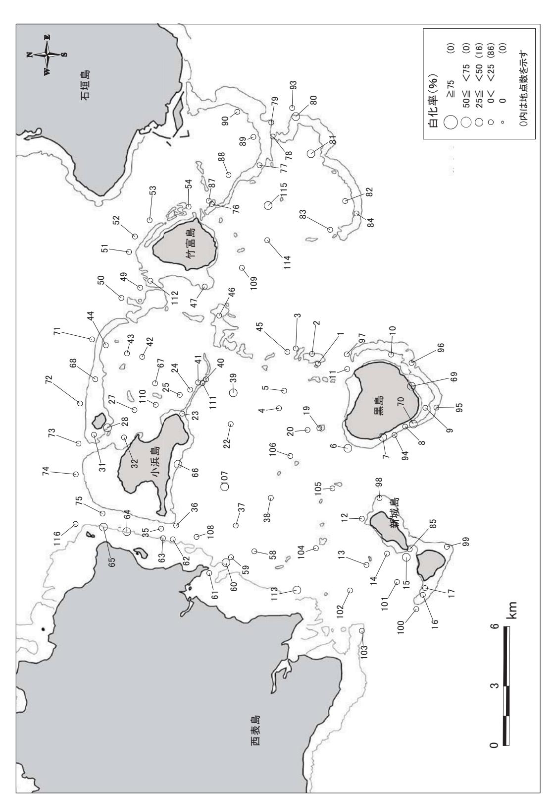

図 30 石西礁湖周辺海域におけるサンゴの白化率

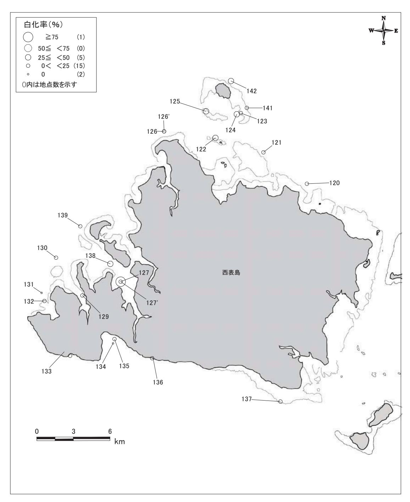

ᅗ す⾲ᓥ࿘㎶ᾏᇦࡢࢦࣥࢧࡿࡅ࠾ⓑ⋡

## ࡃࡢ↛⮬ࡢࡢࡑ㸲㸧

## ձྎ㢼

ᮏᖺᗘྎ㢼ࢦࣥࢧࡿࡼ⩌㞟ࡢ◚ᦆࠊࡣㄪᰝᆅⅬࡢ 61㸣ࡢ 76 ᆅⅬ࡛ㄆࠋࡓࢀࡽࡵ≉ す⾲ᓥす㒊ཬࡧ㒊ࠊ㬀㛫ᓥࠊ▼す♋†እ⦕㒊࡛つᶍࢦࣥࢧ⩌㞟ࡀ◚ቯࠋࡓࢀࡉ ࡢࡽࢀࡇࠋࡓࢀࡉㄆ☜ࡀሙᡤࡿ࠸࡚ࡋᔂቯࡃࡁࡀࡢࡶࡢࡑ┙ᒾࡶ࡛༡㒊♋†す▼ࠊࡓࡲ 龠ࡢࡽࢀࡇࠋࡿ࠶࡛⥆ᖺ㐃 2 ࡚࠸⥆ᖺࠊࡣࡢࡓࡋῶᑡࡀᗘ⿕ࢦࣥࢧࡾࡼ㢼ྎ࡛ᆅᇦ ࡢࡶࡿࡼྕ 17 㢼ྎࡢ᭶ 9 ࡓࡗకࢆᭀ㢼ᇦࠊࡽ᪉ゅࡢἼᾉࡸ㊧ࡢᦆ◚ࠊࡣࡃከࡢᐖ ࠋࡓࢀࡉ᥎ᐃ

ࠊ࠾࡞2012 ᖺඵ㔜ᒣᆅ᪉ࢆᭀ㢼ᅪෆᕳࡁ㎸ࡔࢇྎ㢼ࠊࡣྎ㢼 9 ྕ㸦7 ᭶ 30 ᪥㹼8 ᭶ 3 ᪥㸹᭱▐㛫㢼㏿㸸ᮾ༡ᮾ 30.8m/s㸧ࠊྎ㢼 17 ྕ㸦9 ᭶ 24 ᪥㹼30 ᪥㸹᭱▐㛫㢼㏿㸸 ᮾ 50.6 m/s㸧ࡢࡑࠊࡀࡓࡗ࠶࡛ࡶ 6 ᭶ྎ㢼 3㹼6 ྕࠊ8 ᭶ࡣྎ㢼 11 ྕ 13 ᪥࠸㧗ࡢἼᾉࡿࡼ㢼ྎࠊࡅཷࢆᙳ㡪ࡢྕ 21 㢼ྎࡣ᭶ 10ࠊྕ 16 㢼ྎ᭶ 9ࠊྕ 15㹼 ᭀ㢼୪ࠊࡾࡲᙉࡶ⨨Ẽᅽ㓄ࡢᆺࡣ᥋㏆ྕ 21 㢼ྎࠊ≉ࠋࡓࡗ࠶࡛ᖺࡓ࠸⥆ࡃ㛗ࡀ ࡳ㸦▐㛫᭱㢼㏿ẖ⛊ 18 ࣝࢺ࣮࣓๓ᚋ㸧ࡢሙࡢᏘ⠇㢼㸦㏻⛠ࢩࢽ࣮࣑㸧ࡀ྿ࡁⲨࡓࢀ 㸦㢼㸧ࠋ

## ղࡢࢦࣥࢧẼ

ࠋࡍ♧ࢆᆅⅬ⏕ⓎࡢẼ 33ࠊ32 ᅗࠊࢆᩘᆅⅬ⌧ฟูẼࡢࢦࣥࢧ 15 韭

ࠊᆅⅬ 41 ࢀࡒࢀࡑࠊࡣࡢࡓࢀࡉほᐹࡀ࣒࣮ࣟࢻࣥࢩࢺ࣡࣍ࠊ㯮ᖏࠊ(19)⭘ࠊᮏᖺᗘ 11 ᆅⅬࠊ106 ᆅⅬࠋࡓࡗ࠶࡛ᖺᗘࢀࡒࢀࡑࡣ 49 ᆅⅬࠊ12 ᆅⅬࠊ102 ᆅⅬࠊࡾ࠶࡛ᖺ ⥆ࡁᘬࠊࡓࢀࡽࡵㄆࡀ࣒࣮ࣟࢻࣥࢩࢺ࡛࣡࣍ᆅⅬࡿࡓ࠶ 8 ⣙ࡢㄪᰝᆅⅬࡶᗘ ࠋࡓࡗ࡞ᯝ⤖࠸ከࡶᆅⅬ⌧ฟࡢ(19)⭘ࡁ

2003 ᖺࡢㄪᰝ㛤ጞ௨᮶ࠊ༟≧ཬࢫ࣮࣎ࣥࣜࢥࡧ≦ࢩࣜࢻ࣑㢮ࠊ龠そ≧ཬࡧⴥ≧ࣔࢥ ◚㢼ྎࡀయ⩌ᆺࢩࣜࢻ࣑ࡢ≦㏆ᖺ༟ࠊࡀࡓ࠸࡚ࢀࡉほᐹࡀ(19)⭘࡚ࡋඃ༨㢮ࢦࣥࢧࣥ ᦆࡢࢹࢺࣄࢽ࢜ࡸ㣗ᐖࡾࡼᖜῶᑡࠊࡵࡓࡓࡋ龠そ≧ཬࡧⴥ≧ࢦࣥࢧࣥࣔࢥ㢮Ẽ ࠋࡿ࠸࡚ࡗࡲ㧗ࡀྜࡢ

ࠊ133ࠊ130ࠊ103ࠊ99ࠊ98ࠊ95ࠊ94ࠊ85ࠊ80 ㄪᰝᆅⅬ㸦ᆅⅬࡓࢀࡉほᐹᩘከࡀ(19)⭘ᮏᖺ 135㸧ࠊࡣከࡀࡃ▼す♋†ཬࡧす⾲ᓥ༡ഃ♋እ⦕⨨ࡢࡇࠊࡾ࠾࡚ࡋഴྥࡣẼࣥࢧࡢ ࠋࡿ࠸࡚ࢀࡽࡳ࡚ࡋ⥆⥅ᖺ௨㝆 2006 ࡓࡵࡌࡣࡳヨࢆᩘィࡢయ⩌ࢦ

ࡽ᪂ᇛᓥ࿘㎶ࡣࡢࡓࢀࡉほᐹ࡛య⩌ᩘ」ࠊࡕ࠺ࡢᆅⅬ 11 ࡓࢀࡽࡵㄆࡀᮏᖺᗘ㯮ᖏ ࡀ㢮ࢦࣥࢧࣥࣔࢥ≦そ⿕ࠊࡾ࠶࡛ⴭ㢧࡛㸧135ࠊ104ࠊ94ࠊ85ࠊ15ࠊ12 ᓥ༡㒊㸦ᆅⅬ⾲す ࠋࡓࢀࡽࡵㄆ࡚ࡋ⥆⥅ࡽᖺ 2010 ࡣྥഴࡢࡇࠊࡃࡍࡸࡋᝈ⨯

࣒࣮ࣟࢻࣥࢩࢺ࣡࣍⨯ᝈࢦࣥࢧࡓࡋ⩌యࢆẚ㍑ⓗከᩘほᐹࠊࡣࡢࡓࡋ㯮ᓥ㸫す⾲ᓥ 㛫㞳♋㸦ᆅⅬ 38㸧ࠊ㯮ᓥ㸫ᑠᓥ㛫㞳♋㸦ᆅⅬ 39㸧ࠊ10ᐩᓥᓊ♋እ⦕㸦ᆅⅬ 51㸧ࠊ10ᐩ ᓥᮾᓊ♋እ⦕㸦ᆅⅬ 52㸧ࠊ⯪ᾋᓮ๓㸦ᆅⅬ 138㸧ࠊ㬀㛫ᓥᮾ♋⦕㸦ᆅⅬ 141㸧ࡢ 6 ᆅⅬ࡛ య⩌ࡓࡋᦆ◚࡚ࡗࡼ㢼ྎࠊࡣ࡛ほᐹࡢ࣒࣮ࣟࢻࣥࢩࢺ࣡࣍ࡢ㐣ཤࠊࡋࡋࠋࡓࡗ࠶ እ♋†♋す▼ࡓࡅཷࢆᐖ⿕࡛㢼ྎࡢᖺᗘࠊࡵࡓࡿ࠸࡚ࢀࡽࡳࡃከࡀࢫ࣮ࢣࡿࡍᝈ⨯ࡀ ⦕ࡸす⾲ᓥ㒊ཬࡧす㒊ࠊ࡚࠸࠾ᚋࡿࡼ࣒࣮ࣟࢻࣥࢩࢺ࣡࣍Ṛஸ⩌యࡀቑຍࡿࡍ ࠋࡿ࠶ࡀᛶ⬟ྍ

⾲ ࡢࢦࣥࢧẼࡢ✀㢮ูฟ⌧ᆅⅬᩘ㸦 ㄪᰝᆅⅬ㸧

| ⑓Ẽࡢ✀㢮              | ほᐹ ࡓࢀࡉᆅⅬᩘ |
|--------------------|--------------|
| ⭘⒆                 | 41㸦49㸧       |
| 㯮ᖏ⑓                | 11㸦12㸧       |
| ࣡࣍ ࣥࢩࢺ࢖ ࣒࣮ࣟࢻ | 106㸦102㸧     |

ࠊࡋᡂ㛗࡚ࡋ╔య⩌ࢦࣥࢧࡣ㸧✀୍ࡢ㢮⥥ᾏࡢ㢮㸦㯮Ⰽࢫ࢜ࣆࣝࢸࠊࡀ࠸࡞ࡣ࡛Ẽͤ ⩌యయࢆそࠋࡿ࠶ࡀࡇ࠺ࡲࡋ࡚ࡗᮏᖺᗘࡢࢫ࢜ࣆࣝࢸฟ⌧グ㘓ࢆ 3 ࢡࣥࣛࡢࡘ㸦1㸸ほ ᐹࠊ࠸࡞ࢀࡉ2㸸1 ࣧᡤ⛬ᗘ࡛ほᐹࠊ3㸸ᩘࣧᡤࡣ࠸ࡿ࠶つᶍ࡞ศᕸࡿࢀࡽࡳࡀ㸧࡛グ㘓ࡋ ࢁࡇࡓ㸦⾲ 16㸧ࡀࢫ࢜ࣆࣝࢸࠊほᐹࡓࢀࡉᆅⅬࡣ 40 ᆅⅬࠊ࡛ᖺᗘ㸦44 ᆅⅬ㸧ࡰྠ ụ♋㸦㯮ᓥすᓊ7 ᆅⅬࠊࡣᆅⅬࡓࡋ♧ࢆ 3 ࢡࣥࣛࡓࢀࡉほᐹ࡛ᡤࣧᩘ「ࠋࡓࡗ࠶࡛ἣ≧ࡢᵝ ෆ㸧ࠊ10㸦㯮ᓥ༡ᮾᓊ♋ụෆ㸧ࠊ31㸦ᘺ┿ᓥ༡すᓊ♋ụෆ㸧ࠊ35㸦ࣛࢼࣚỈ㐨༡♋⦕㸧ࠊ60 㸦す⾲ᓥᮾἈ㞳♋㸧ࠊ62㸦ࣛࢼࣚỈ㐨༡㸧ࠊ63㸦ࣛࢼࣚỈ㐨༡㒊㸧ࠊ126 㸦ᫍ◁๓♋⦕㸧136 㸦ࣞࢨࢧ⦖♋㸧ࠊ139㸦እࣜࢼࣃ༡♋⦕㸧ࡓࡗ࠶࡛㸦ィ 10 ᆅⅬ㸧ࠋ

⾲ ࡀࢫ࢜ࣆࣝࢸほᐹࡓࢀࡉᆅⅬᩘࡢ᥎⛣㸦 ᖺ㹼 ᖺ㸧

|                       | 2008 ᖺ | 2009 ᖺ | 2010 ᖺ | 2011 ᖺ | 2012 ᖺ |
|-----------------------|--------|--------|--------|--------|--------|
| 1 ࢡࣥࣛ ࡉ㸦ほᐹ 㸧࠸࡞ࢀ | 103    | 112    | 97     | 81     | 85     |
| ࢡࣥࣛ 2㸦1 ࣧᡤ⛬ᗘ㸧         | 19     | 11     | 25     | 31     | 30     |
| ࢡࣥࣛ 3㸦ᩘࣧᡤ㸭つᶍ኱㸧        | 3      | 2      | 3      | 13     | 10     |
| ྜィ                    | 125    | 125    | 125    | 125    | 125    |

### ճࡢࢺࣝࢩሁ✚≧ἣ㸦SPSS㸧

࡚ἲ SPSSࠊࡋ᥇㞟ࢆ≀✚ሁࡽᆅⅬ 82 ࡌྠᖺᗘࠊㄪᰝᆅⅬ୰ 125 ࡶᮏᖺᗘ ㉥ᅵ➼ᠱ⃮≀㉁ྵ᭷㔞ࡢ ᐃࢆ足ࠋࡓࡗSPSS 㝵⣭ูㄪᰝᆅⅬᩘࢆ 韭18 ࠊྛㄪᰝᆅⅬࡢ ࠋࡍ♧ 35ࠊ34 ᅗࢆ㝵⣭㸧 ἣ㸦SPSS✚≧ሁࡢࢺࣝࢩ

ᆅࡓࡋ♧ࢆ a5㹼1 ࢡࣥࣛࡿ࠸࡚ࢀࡉ⠊ᅖ SPSS ࡍ♧ࢆែ⣔♋⏕ࢦࣥࢧࡓࡋࡁ⏕ࡁ⏕ Ⅼࡣ 65 ᆅⅬ㸦ㄪᰝᑐ㇟ 82 ㄪᰝᆅⅬࡢ⣙ 8 㸧ࠊࡾ࠶࡛㉥ᅵ➼ᠱ⃮≀㉁㛵ࡣ࡚ࡋẚ㍑ⓗ Ⰻዲ࡞≦ែࠋࡿ࠼࠸ࡿ࠶ 82 ᆅⅬࡢ࡛ᖹᆒࡣᖺࡾࡼῶᑡࠊࡋ30kg/m3㸦ᖺࡣ 34kg/m3㸧್ࢆ♧ࠋࡓࡋ

ࠊ66ࠊ22ࠊ20 ᓥ࿘㎶㸦ᆅⅬᑠࡽ㯮ᓥࠊࡣᆅⅬࡓࡋቑຍୖẁ㝵௨ 2 ࡀࢡࣥࣛ SPSS 106㸧ࡸ▼す♋†ࡢᮾᓊ㸦ᆅⅬ 78㸧ࠊཬࡧ᪂ᇛᓥࡽす⾲ᓥ࿘㎶ࡢᾏᇦ㸦ᆅⅬ 104ࠊ127㸧 ࠋࡓࡗ࠶࡛

ࠊ42ࠊ12ࠊ7 ᓥ࿘㎶㸦ᆅⅬ㯮ᓥ㹼ᑠࠊࡣᆅⅬࡓࡋῶᑡୖẁ㝵௨ 2 ࡀࢡࣥࣛ SPSSࠊ᪉୍ ᓥ࿘㎶㸦ᆅ⾲すࡧཬࠊ㸧83ࠊ82ࠊ80ࠊ76ࠊ53 㒊㸦ᆅⅬ♋†ᮾす▼ࡽぢᓥ➉ࠊ㸧97ࠊ70ࠊ46 ࠋࡓࡗ࠶࡛㸧'127ࠊ123 Ⅼ

ࠋࡓࡋቑຍࡀᆅⅬࡢࢡࣥࣛపࠊࡋῶᑡࡀᩘᆅⅬࡢࢡࣥࣛ㧗ࡣᮏᖺᗘ

| SPSS 㝵⣭ | ᆅⅬᩘ㸦᫖ᖺᗘ㸧 |  |  |  |  |
|---------|----------|--|--|--|--|
| 1       | 0㸦1㸧     |  |  |  |  |
| 2       | 0㸦0㸧     |  |  |  |  |
| 3       | 12㸦8㸧    |  |  |  |  |
| 4       | 26㸦9㸧    |  |  |  |  |
| 5a      | 27㸦42㸧   |  |  |  |  |
| 5b      | 6㸦8㸧     |  |  |  |  |
| 6       | 8㸦12㸧    |  |  |  |  |
| 7       | 3㸦2㸧     |  |  |  |  |
| 8       | 0㸦0㸧     |  |  |  |  |

⾲ 6366 㝵⣭ูㄪᰝᆅⅬᩘ㸦 ᆅⅬ୰㸧

## 㸦㸱㸧ᆺᐃ╔ᛶ㨶㢮

2004 ᖺᗘࢱࣁࠊࡾࡼ㢮ࢲࣈࠊ㢮ࣛ࣋ࠊ㢮ࡢ┠ᧁᩘࢆグ㘓ࠋࡿ࠸࡚ࡋᮏᖺᗘࡣ㐣ཤ᭱ప ࠋ㸧18⾲ 㸦ࡿ࠸࡚ࡋ♧ࢆྥῶᑡഴ࡞ⓗ⥅⥆ࡾࡼㄪᰝ㛤ጞࠊࡾ࠶࡛ᩘほᐹࡢ

| ⾲   ᖺᗘ ࡽ࠿  ᖺᗘ ࢽࣔࡢ ࢢࣥࣜࢱ ࡿࡅ࠾࡟ 㨶㢮ࡢฟ⌧ಶయᩘ㸦 ᆅⅬ㸧 |  |
|----------------------------------------------------------|--|
|----------------------------------------------------------|--|

|      | 2004 | 2005 | 2006 | 2007 | 2008 | 2009 | 2010 | 2011 | 2012 |
|------|------|------|------|------|------|------|------|------|------|
| 㢮ࢱࣁ  | 90   | 113  | 145  | 136  | 87   | 68   | 51   | 70   | 46   |
| 㢮࢖ࢲࣈ | 683  | 2162 | 1379 | 1028 | 1148 | 1128 | 748  | 812  | 693  |
| 㢮ࣛ࣋  | 48   | 61   | 67   | 45   | 33   | 30   | 24   | 25   | 15   |
| ⥲ಶయᩘ | 821  | 2336 | 1591 | 1209 | 1268 | 1226 | 823  | 907  | 754  |

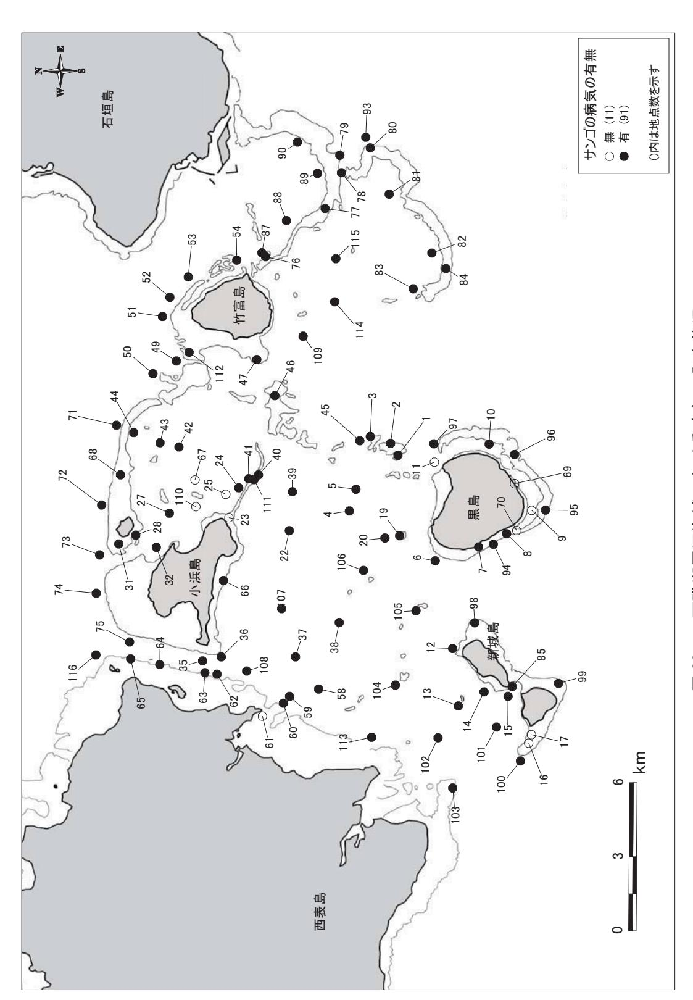

図 32 石西礁湖周辺海域における病気の発生状況

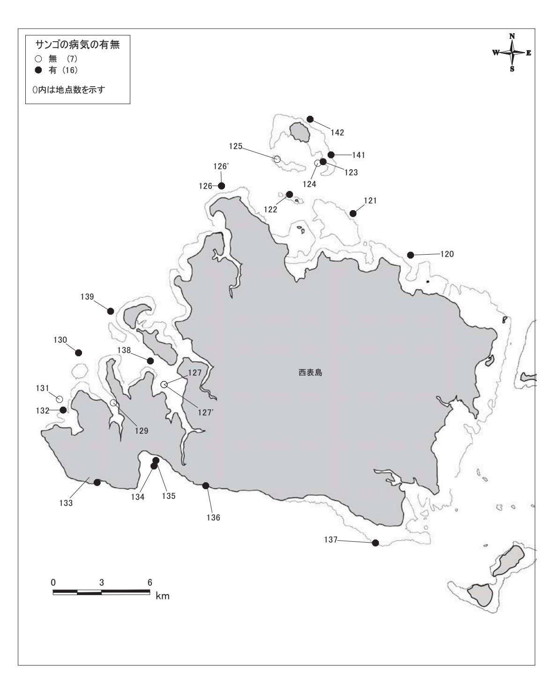

ᅗ す⾲ᓥ࿘㎶ᾏᇦࡿࡅ࠾ẼࡢⓎ⏕≧ἣ

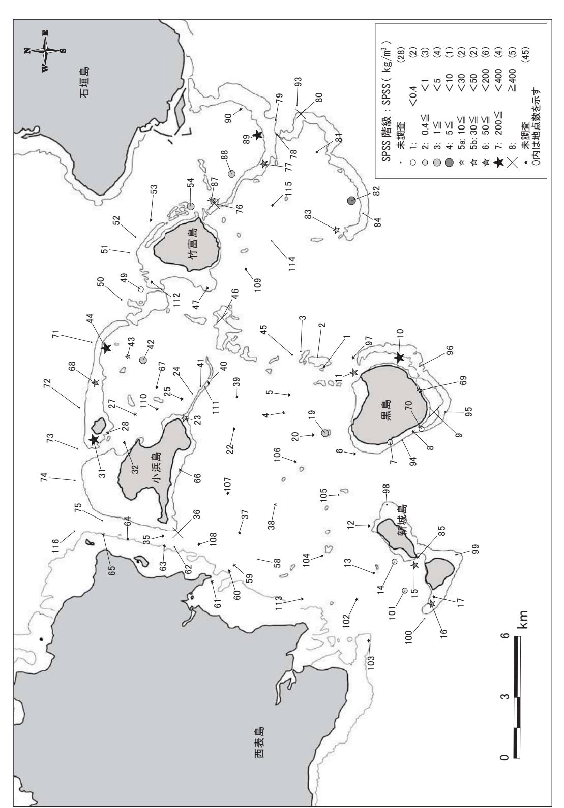

図 34 石西礁湖周辺海域におけるシルトの堆積状況

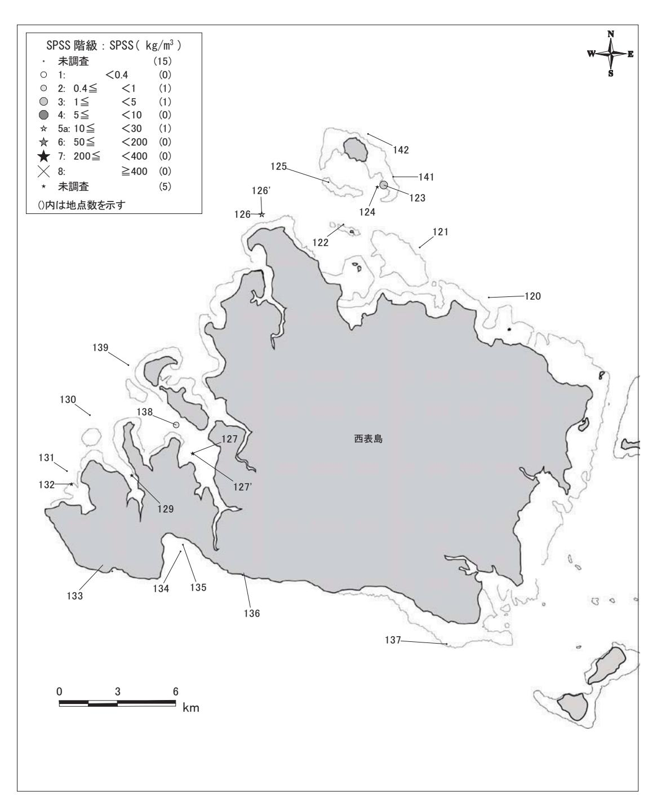

ᅗ す⾲ᓥ࿘㎶ᾏᇦࡢࢺࣝࢩࡿࡅ࠾ሁ✚≧ἣ

## Ϫ ཧ⪃ᩥ⊩

- ⎔ቃᗇ⮬↛ಖㆤᒁ㸬㸬⏕ែ⣔ከᵝᛶᆅᇦㄪᰝ㸦▼ᇉᮾ㒊ཬࡧᖹஂಖ༙ᓥࡢἢᓊᾏ ᇦ㸧ሗ࿌᭩㸬
- ⎔ቃᗇ⮬↛ಖㆤᒁ㸬㹼㸬▼ᇉᓥ࿘㎶ᾏᇦࢦࣥࢧࡿࡅ࠾♋ࢢࣥࣜࢱࢽࣔㄪᰝ ሗ࿌᭩㸬⎔ቃᗇጤクㄪᰝሗ࿌᭩㸬
- ⎔ቃ┬⮬↛⎔ቃᒁ㸬㹼㸬▼ᇉᓥ࿘㎶ᾏᇦࢦࣥࢧࡿࡅ࠾♋ࢢࣥࣜࢱࢽࣔㄪᰝ ሗ࿌᭩㸬⎔ቃ┬ㄳ㈇ㄪᰝሗ࿌᭩㸬
- ⎔ቃ┬⮬↛⎔ቃᒁ࣭㸦㈈㸧⮬↛⎔ቃ◊✲࣮ࢱࣥࢭ㸬㸬す⾲ᅜ❧බᅬࡿࡅ࠾ᾏ୰බ ᅬィ⏬సᡂ㛵ࡿࡍᾏᇦㄪᰝᴗົ ሗ࿌᭩㸬SS㸬

すᖹᏲᏕ࣭-)19HURQ㸬㸬᪥ᮏࡢ㐀♋ࢦࣥࢧ㢮㸬ᾏ♫㸪ᮾி㸬SS㸬

Ἀ⦖┴⾨⏕⎔ቃ◊✲ᡤ࣭ぢㅰ㎮ኵ㸬㸬ᾏࡢ㉥ᅵởᰁㄪᰝἲ㸦ㅮ₇㈨ᩱ㸧

- 㸦㈈㸧ᾏ୰බᅬ࣮ࢱࣥࢭ㸬㸬▼す♋†ཬࡧ㏆㞄ᾏᇦࢹࢺࣄࢽ࢜ࡿࡅ࠾ཬࣥࢧࡧ ࢦ㢮ࡢศᕸㄪᰝሗ࿌᭩㸬➉ᐩ⏫ጤクㄪᰝሗ࿌᭩㸬
- 㸦㈈㸧ᾏ୰බᅬ࣭࣮ࢱࣥࢭ⎔ቃᗇ㸬㹼㸬す⾲ᅜ❧බᅬ▼す♋†ཬࡧ㏆㞄ᾏᇦ ㄪᰝሗ࿌᭩㸬ྠㄪᰝሗ࿌᭩㸬ඹࢢࣥࣜࢱࢽࣔ♋ࢦࣥࢧࡿࡅ࠾
- 㸦㈈㸧Ἀ⦖┴⎔ቃ⛉Ꮫ࣮ࢱࣥࢭ㸬㸬ἢᓊᾏᇦᐇែㄪᰝ㸦ᐑྂᓥࠊ▼ᇉᓥཬࡧす⾲ ᓥ୪ࡧ࿘㎶㞳ᓥ㸧㸬ᖹᡂ㸳ᖺᗘ ጤクㄪᰝ Ἀ⦖┴

## ϫ 㘓

⾲ ㄪᰝ⤖ᯝ୍ぴ

ᅗ㸯 ྛㄪᰝᆅⅬࡢᬒほཬࡧᴫἣ㸦▼ᇉᓥ࿘㎶ᾏᇦ㸧

ᅗ㸰 ྛㄪᰝᆅⅬࡢᬒほཬࡧᴫἣ㸦▼す♋†ཬࡧす⾲ᓥ࿘㎶ᾏᇦ㸧

⾲㸸ᖹᡂ㸦㸧ᖺᗘㄪᰝ⤖ᯝ୍ぴ

|      |                                   |            |    |    |        |      |         | 䝃䚷䚷䞁䚷䚷䝂                  |     |                    |           | 䜸䚷䝙䚷䝠䚷䝖䚷䝕    |             |     | 䝃䞁䝂㣗ᕳ㈅     |     |   | ⑌⑓䛾᭷↓                     |      | 㻿㻼㻿㻿 |      | 㻟㻜㼏㼙௨ୖ䛾኱ᆺ㨶㢮ᩘ |    |     |
|------|-----------------------------------|------------|----|----|--------|------|---------|--------------------------|-----|--------------------|-----------|--------------|-------------|-----|------------|-----|---|---------------------------|------|------|------|--------------|----|-----|
| ᆅⅬ␒ྕ | ᆅྡ                                | ㄪᰝ᪥        |    |    | ⓑ໬⋡    |      |         |                          |     | ༟䝭䝗                | 㻝㻡ศ       | ඃ༨           |             |     | Ⓨ⏕         |     | ⭘ | 㻮                         | 㼃    | ᐃ    | 㝵⣭   |              | 䝧䝷 | 䝤䝎䜲 |
|      |                                   |            | ⿕ᗘ | ඲య | 䢌䢀䢚䢔䡮䡸 | ඲యṚ⁛ | 䢌䢀䢚䢔 Ṛ⁛ | ⏕⫱ᆺ                      | ຍධᩘ | ኱㻡⩌యᖹᆒ 䡷䡮䡹䢚䠄㼏㼙䠅 | ほᐹᩘ ᥮⟬ | 䡷䡮䡹䢚 㻔㼏㼙㻕 | ⠊ᅖ          | ⿕㣗⋡ | 㻔ὀ㻝㻕 㝵⣭ | ⿕㣗⋡ | ⒆ | 㻮 㻰                    | 㻿    | ್    | 㻔ὀ㻞㻕 | 䝝䝍㢮          | 㢮  | 㢮   |
|      | ᇦ䛇 ᾏ ㎶ ᓥ࿘ ᇉ ▼ 䛆 |            |    |    |        |      |         |                          |     |                    |           |              |             |     |            |     |   | 䊢䠖㻝㻡ศ䛷㻝㻜⩌యᮍ‶ᩓぢ 䊡䠖㻝㻡ศ䛷䊠 | ⩌య⛬ᗘ |      |      |              |    |     |
| 㻝    | ኱὾ᑠ๓                              | 㻞㻜㻝㻞㻛㻥㻛㻢   | 㻨㻡 | 㻜  | 㻜      | 㻜    | 㻜       | ከ✀ΰᡂᆺ                    | 㻝   | 㻝㻟                 | 㻜         | 㻙            | 㻙           | 㻜   | 㻝          | 㻜   | ↓ | ↓                         | ↓    | 㻝㻟㻚㻞 | 㻡    | 㻜            | 㻝  | 㻝   |
| 㻞    | ᐑⰋᕝἙཱྀ                            | 㻞㻜㻝㻞㻛㻥㻛㻢   | 㻞㻜 | 㻜  | 㻜      | 㻜    | 㻜       | ከ✀ΰᡂᆺ                    | 㻣   | 㻜                  | 㻜         | 㻙            | 㻙           | 㻜   | 㻝          | 㻜   | ↓ | ↓                         | ↓    | 㻙    | 㻙    | 㻜            | 㻜  | 㻞   |
| 㻟    | ᐑⰋ㞟ⴠ๓                             | 㻞㻜㻝㻞㻛㻥㻛㻢   | 㻨㻝 | 㻜  | 㻜      | 㻜    | 㻜       | ከ✀ΰᡂᆺ                    | 㻜   | 㻜                  | 㻜         | 㻙            | 㻙           | 㻜   | 㻝          | 㻜   | ↓ | ↓                         | ↓    | 㻟㻞㻚㻢 | 㻡    | 㻜            | 㻜  | 㻜   |
| 㻠    | ⓑಖ㞟ⴠ๓                             | 㻞㻜㻝㻞㻛㻥㻛㻢   | 㻨㻝 | 㻜  | 㻜      | 㻜    | 㻜       | ከ✀ΰᡂᆺ                    | 㻟   | 㻜                  | 㻜         | 㻙            | 㻙           | 㻜   | 㻝          | 㻜   | ↓ | ↓                         | ↓    | 㻞㻥㻚㻤 | 㻡    | 㻜            | 㻜  | 㻜   |
| 㻡    | ⓑಖ䡭䡱䡷䢙䡶䢚                          | 㻞㻜㻝㻞㻛㻥㻛㻢   | 㻢㻜 | 㻜  | 㻜      | 㻜    | 㻜       | ≉ᐃ㢮ඃ༨ᆺ 㻔䡭䡱䡷䢙䡶䢚㻕       | 㻜   | 㻟                  | 㻜         | 㻙            | 㻙           | 㻜   | 㻝          | 㻜   | ↓ | ↓                         | ↓    | 㻢㻚㻡  | 㻠    | 㻜            | 㻝  | 㻜   |
| 㻢    | ⓑಖ➨䠍䢊䢛䡬䢕                          | 㻞㻜㻝㻞㻛㻥㻛㻢   | 㻡㻜 | 㻜  | 㻜      | 㻜    | 㻜       | 㻔䢑䢇䢚䡰䡼䢚䢆䢋䡷䢙䡶䢚㻕 ≉ᐃ㢮ඃ༨ᆺ | 㻜   | 㻜                  | 㻜         | 㻙            | 㻙           | 㻜   | 㻝          | 㻜   | ↓ | ↓                         | ↓    | 㻡㻚㻤  | 㻠    | 㻜            | 㻜  | 㻞   |
| 㻣    | ⓑಖ䡚㎘ᕝ                             | 㻞㻜㻝㻞㻛㻥㻛㻢   | 㻟㻜 | 㻜  | 㻜      | 㻜    | 㻜       | ከ✀ΰᡂᆺ                    | 㻜   | 㻜                  | 㻜         | 㻙            | 㻙           | 㻜   | 㻞          | 㻨㻝  | ↓ | ↓                         | ↓    | 㻝㻟㻚㻣 | 㻡    | 㻜            | 㻜  | 㻜   |
| 㻤    | ㎘ᕝἙཱྀ                             | 㻞㻜㻝㻞㻛㻥㻛㻢   | 㻟㻜 | 㻜  | 㻜      | 㻜    | 㻜       | ≉ᐃ㢮ඃ༨ᆺ 㻔ሢ≧䢆䢋䡷䢙䡶䢚䠅     | 㻨㻝  | 㻥㻚㻡                | 㻜         | 㻙            | 㻙           | 㻜   | 㻞          | 㻨㻝  | ↓ | ↓                         | ↓    | 㻢㻚㻜  | 㻠    | 㻜            | 㻜  | 㻜   |
| 㻥    | 䝰䝸䝲䝬䜾䝏                            | 㻞㻜㻝㻞㻛㻥㻛㻢   | 㻞㻜 | 㻜  | 㻜      | 㻜    | 㻜       | ᯞ≧䢌䢀䢚䢔䡮䡸ඃ༨ᆺ              | 㻢   | 㻝㻟㻚㻡               | 㻜         | 㻙            | 㻙           | 㻜   | 㻝          | 㻜   | ↓ | ↓                         | ᭷㻔䊡㻕 | 㻟㻚㻠  | 㻟    | 㻜            | 㻜  | 㻜   |
| 㻝㻜   | 䝇䝮䝆䜾䝏                             | 㻞㻜㻝㻞㻛㻥㻛㻣   | 㻨㻡 | 㻜  | 㻜      | 㻜    | 㻜       | ከ✀ΰᡂᆺ                    | 㻨㻝  | 㻠㻚㻡                | 㻜         | 㻙            | 㻙           | 㻜   | 㻝          | 㻜   | ↓ | ↓                         | ↓    | 㻞㻚㻜  | 㻟    | 㻜            | 㻜  | 㻝   |
| 㻝㻝   | ᥇▼ሙ๓                              | 㻞㻜㻝㻞㻛㻥㻛㻣   | 㻨㻝 | 㻜  | 㻜      | 㻜    | 㻜       | ከ✀ΰᡂᆺ                    | 㻝   | 㻠                  | 㻜         | 㻙            | 㻙           | 㻨㻝  | 㻝          | 㻜   | ↓ | ↓                         | ↓    | 㻡㻚㻣  | 㻠    | 㻜            | 㻜  | 㻜   |
| 㻝㻞   | ㏻㊰ᕝ༡                              | 㻞㻜㻝㻞㻛㻥㻛㻣   | 㻠㻜 | 㻜  | 㻜      | 㻜    | 㻜       | 䝋䝣䝖䝁䞊䝷䝹 ඃ༨ᆺ           | 㻞   | 㻜                  | 㻜         | 㻙            | 㻙           | 㻨㻝  | 㻝          | 㻜   | ↓ | ↓                         | ↓    | 㻝㻜㻚㻞 | 㻡    | 㻜            | 㻞  | 㻞   |
| 㻝㻟   | ㏻㊰ᕝỈ㊰໭                            | 㻞㻜㻝㻞㻛㻥㻛㻣   | 㻝㻜 | 㻜  | 㻜      | 㻜    | 㻜       | ከ✀ΰᡂᆺ                    | 㻤   | 㻜                  | 㻜         | 㻙            | 㻙           | 㻨㻝  | 㻝          | 㻜   | ↓ | ↓                         | ↓    | 㻝㻝㻚㻢 | 㻡    | 㻜            | 㻜  | 㻜   |
| 㻝㻠   | 㔝ཎᓮ                               | 㻞㻜㻝㻞㻛㻥㻛㻣   | 㻨㻡 | 㻜  | 㻜      | 㻜    | 㻜       | ከ✀ΰᡂᆺ                    | 㻨㻝  | 㻜                  | 㻜㻚㻡       | 㻨㻞㻜          | 㻨㻞㻜         | 㻨㻝  | 㻞          | 㻨㻝  | ↓ | ↓                         | ↓    | 㻝㻟㻚㻟 | 㻡    | 㻜            | 㻜  | 㻜   |
| 㻝㻡   | ఀ㔝⏣⁺ ๓                            | 㻞㻜㻝㻞㻛㻥㻛㻣   | 㻨㻡 | 㻜  | 㻜      | 㻜    | 㻜       | ከ✀ΰᡂᆺ                    | 㻨㻝  | 㻜                  | 㻜         | 㻙            | 㻙           | 㻜   | 㻝          | 㻜   | ↓ | ↓                         | ↓    | 㻝㻟㻚㻟 | 㻡    | 㻜            | 㻜  | 㻜   |
| 㻝㻢   | ኱㔝∾ሙ๓                             | 㻞㻜㻝㻞㻛㻥㻛㻣   | 㻞㻜 | 㻜  | 㻜      | 㻜    | 㻜       | ከ✀ΰᡂᆺ                    | 㻣   | 㻠                  | 㻜㻚㻡       |              | 㻞㻜㻙㻟㻜 㻞㻜㻙㻟㻜 | 㻨㻝  | 㻝          | 㻜   | ↓ | ↓                         | ↓    | 㻝㻡㻚㻠 | 㻡    | 㻜            | 㻜  | 㻝   |
| 㻝㻣   | ⋢ྲྀᓮ༡                             | 㻞㻜㻝㻞㻛㻥㻛㻣   | 㻣㻜 | 㻜  | 㻜      | 㻜    | 㻜       | 㻔䢑䢇䢚䡰䡼䢚䢆䢋䡷䢙䡶䢚㻕 ≉ᐃ㢮ඃ༨ᆺ | 㻨㻝  | 㻝㻝㻚㻡               | 㻜         | 㻙            | 㻙           | 㻜   | 㻝          | 㻜   | ↓ | ↓                         | ↓    | 㻝㻢㻚㻥 | 㻡    | 㻜            | 㻜  | 㻜   |
| 㻝㻤   | ⋢ྲྀᓮᮾ                             | 㻞㻜㻝㻞㻛㻥㻛㻣   | 㻨㻡 | 㻜  | 㻜      | 㻜    | 㻜       | ከ✀ΰᡂᆺ                    | 㻨㻝  | 㻜                  | 㻜         | 㻙            | 㻙           | 㻨㻝  | 㻝          | 㻜   | ↓ | ↓                         | ↓    | 㻟㻚㻟  | 㻟    | 㻜            | 㻜  | 㻜   |
| 㻝㻥   | ఀཎ㛫∾ሙ๓                            | 㻞㻜㻝㻞㻛㻝㻞㻛㻝㻠 | 㻡㻜 | 㻜  | 㻜      | 㻜    | 㻜       | 㻔䡰䡼䢚䢆䢁䡲䢚䡷䡷䢙䡶䢚㻕 ≉ᐃ㢮ඃ༨ᆺ | 㻨㻝  | 㻜                  | 㻜         | 㻙            | 㻙           | 㻜   | 㻝          | 㻜   | ↓ | ↓                         | ↓    | 㻝㻜㻚㻜 | 㻡    | 㻜            | 㻜  | 㻜   |
| 㻞㻜   | 䝖䝮䝹ᓮ༡                             | 㻞㻜㻝㻞㻛㻝㻞㻛㻝㻠 | 㻨㻝 | 㻜  | 㻜      | 㻜    | 㻜       | ከ✀ΰᡂᆺ                    | 㻝   | 㻜                  | 㻜         | 㻙            | 㻙           | 㻨㻝  | 㻝          | 㻜   | ↓ | ↓                         | ↓    | 㻟㻚㻠  | 㻟    | 㻜            | 㻜  | 㻜   |
| 㻞㻝   | 䝖䝮䝹ᓮ                              | 㻞㻜㻝㻞㻛㻝㻞㻛㻝㻠 | 㻨㻝 | 㻜  | 㻜      | 㻜    | 㻜       | ከ✀ΰᡂᆺ                    | 㻨㻝  | 㻜                  | 㻜         | 㻙            | 㻙           | 㻨㻝  | 㻝          | 㻜   | ↓ | ↓                         | ↓    | 㻙    | 㻙    | 㻜            | 㻜  | 㻜   |
| 㻞㻞   | 䢆䢛䢓䢘䡬䢕䢀䢚๓                         | 㻞㻜㻝㻞㻛㻝㻞㻛㻝㻠 | 㻨㻝 | 㻜  | 㻜      | 㻜    | 㻜       | ከ✀ΰᡂᆺ                    | 㻨㻝  | 㻜                  | 㻜         | 㻙            | 㻙           | 㻜   | 㻝          | 㻜   | ↓ | ↓                         | ↓    | 㻞㻢㻚㻥 | 㻡    | 㻜            | 㻜  | 㻜   |
| 㻞㻟   | ᫂▼䡚ᏳⰋᓮ                            | 㻞㻜㻝㻞㻛㻝㻞㻛㻝㻝 | 㻟㻜 | 㻜  | 㻜      | 㻜    | 㻜       | ከ✀ΰᡂᆺ                    | 㻢   | 㻝㻟㻢                | 㻜         | 㻙            | 㻙           | 㻜   | 㻝          | 㻜   | ↓ | ↓                         | ↓    | 㻡㻚㻡  | 㻠    | 㻜            | 㻜  | 㻝   |
| 㻞㻠   | ᏳⰋᓮ༡                              | 㻞㻜㻝㻞㻛㻝㻞㻛㻝㻝 | 㻢㻜 | 㻜  | 㻜      | 㻜    | 㻜       | 䝋䝣䝖䝁䞊䝷䝹 ඃ༨ᆺ           | 㻞   | 㻜                  | 㻜         | 㻙            | 㻙           | 㻜   | 㻝          | 㻜   | ↓ | ↓                         | ↓    | 㻞㻚㻞  | 㻟    | 㻜            | 㻜  | 㻜   |

⾲㸸ᖹᡂ㸦㸧ᖺᗘㄪᰝ⤖ᯝ୍ぴ

|      |          |            |    |    |        |      |         | 䝃䚷䚷䞁䚷䚷䝂                  |     |                    |           | 䜸䚷䝙䚷䝠䚷䝖䚷䝕    |     |     | 䝃䞁䝂㣗ᕳ㈅     |     |      | ⑌⑓䛾᭷↓  |      | 㻿㻼㻿㻿  |      | 㻟㻜㼏㼙௨ୖ䛾኱ᆺ㨶㢮ᩘ |     |
|------|----------|------------|----|----|--------|------|---------|--------------------------|-----|--------------------|-----------|--------------|-----|-----|------------|-----|------|--------|------|-------|------|--------------|-----|
| ᆅⅬ␒ྕ | ᆅྡ       | ㄪᰝ᪥        |    |    |        | ⓑ໬⋡  |         |                          |     | ༟䝭䝗                | 㻝㻡ศ       | ඃ༨           |     |     | Ⓨ⏕         |     | ⭘    | 㻮      | 㼃    | ᐃ     | 㝵⣭   | 䝧䝷           | 䝤䝎䜲 |
|      |          |            | ⿕ᗘ | ඲య | 䢌䢀䢚䢔䡮䡸 | ඲యṚ⁛ | 䢌䢀䢚䢔 Ṛ⁛ | ⏕⫱ᆺ                      | ຍධᩘ | ኱㻡⩌యᖹᆒ 䡷䡮䡹䢚䠄㼏㼙䠅 | ほᐹᩘ ᥮⟬ | 䡷䡮䡹䢚 㻔㼏㼙㻕 | ⠊ᅖ  | ⿕㣗⋡ | 㻔ὀ㻝㻕 㝵⣭ | ⿕㣗⋡ | ⒆    | 㻮 㻰 | 㻿    | ್     | 㻔ὀ㻞㻕 | 㢮 䝝䝍㢮     | 㢮   |
| 㻞㻡   | ᏳⰋᓮ      | 㻞㻜㻝㻞㻛㻝㻞㻛㻝㻝 | 㻟㻜 | 㻜  | 㻜      | 㻜    | 㻜       | ከ✀ΰᡂᆺ                    | 㻝   | 㻜                  | 㻜         | 㻙            | 㻙   | 㻨㻝  | 㻝          | 㻜   | ↓    | ↓      | ↓    | 㻞㻚㻣   | 㻟    | 㻜 㻜       | 㻜   |
| 㻞㻢   | ᏳⰋ䜾䝏໭    | 㻞㻜㻝㻞㻛㻝㻞㻛㻝㻝 | 㻝㻜 | 㻜  | 㻜      | 㻜    | 㻜       | ከ✀ΰᡂᆺ                    | 㻟   | 㻜                  | 㻜         | 㻙            | 㻙   | 㻨㻝  | 㻝          | 㻜   | ↓    | ↓      | ↓    | 㻠㻚㻡   | 㻟    | 㻜 㻜       | 㻜   |
| 㻞㻣   | ᒾᓮ༡      | 㻞㻜㻝㻞㻛㻝㻞㻛㻝㻝 | 㻡㻜 | 㻜  | 㻜      | 㻜    | 㻜       | ≉ᐃ㢮ඃ༨ᆺ 㻔䡶䢏䢙䡷䢙䡶䢚㻕      | 㻜   | 㻜                  | 㻜         | 㻙            | 㻙   | 㻜   | 㻝          | 㻜   | ᭷㻔䊡㻕 | ↓      | ↓    | 㻝㻡㻚㻤  | 㻡    | 㻜 㻜       | 㻜   |
| 㻞㻤   | ᒾᓮ       | 㻞㻜㻝㻞㻛㻝㻞㻛㻝㻝 | 㻟㻜 | 㻜  | 㻜      | 㻜    | 㻜       | ከ✀ΰᡂᆺ                    | 㻝   | 㻜                  | 㻜         | 㻙            | 㻙   | 㻜   | 㻞          | 㻨㻝  | ᭷㻔䊡㻕 | ↓      | ↓    | 㻡㻚㻣   | 㻠    | 㻜 㻜       | 㻞   |
| 㻞㻥   | ᒾᓮ䡚ᾆᓮ    | 㻞㻜㻝㻞㻛㻝㻞㻛㻝㻝 | 㻠㻜 | 㻜  | 㻜      | 㻜    | 㻜       | 㻔䢑䢇䢚䡰䡼䢚䢆䢋䡷䢙䡶䢚㻕 ≉ᐃ㢮ඃ༨ᆺ | 㻞   | 㻜                  | 㻜         | 㻙            | 㻙   | 㻜   | 㻝          | 㻜   | ↓    | ↓      | ↓    | 㻝㻢㻚㻝  | 㻡    | 㻜 㻜       | 㻜   |
| 㻟㻜   | ᾆᓮἈ      | 㻞㻜㻝㻞㻛㻥㻛㻝㻜  | 㻣㻜 | 㻜  | 㻜      | 㻜    | 㻜       | ≉ᐃ㢮ඃ༨ᆺ 㻔䡶䢏䢙䡷䢙䡶䢚㻕      | 㻨㻝  | 㻜                  | 㻜         | 㻙            | 㻙   | 㻜   | 㻞          | 㻨㻝  | ᭷㻔䊡㻕 | ↓      | ↓    | 㻝㻠㻚㻣  | 㻡    | 㻜 㻜       | 㻜   |
| 㻟㻝   | ᾆᓮ๓      | 㻞㻜㻝㻞㻛㻥㻛㻝㻜  | 㻢㻜 | 㻜  | 㻜      | 㻜    | 㻜       | ≉ᐃ㢮ඃ༨ᆺ 㻔䡶䢏䢙䡷䢙䡶䢚㻕      | 㻨㻝  | 㻜                  | 㻜         | 㻙            | 㻙   | 㻜   | 㻞          | 㻨㻝  | ᭷㻔䊡㻕 | ↓      | ↓    | 㻥㻚㻣   | 㻠    | 㻜 㻜       | 㻜   |
| 㻟㻞   | ᖹ㔝㞟ⴠ๓    | 㻞㻜㻝㻞㻛㻥㻛㻝㻜  | 㻟㻜 | 㻜  | 㻜      | 㻜    | 㻜       | ከ✀ΰᡂᆺ                    | 㻨㻝  | 㻜                  | 㻜         | 㻙            | 㻙   | 㻜   | 㻞          | 㻨㻝  | ↓    | ↓      | ↓    | 㻝㻟㻚㻤  | 㻡    | 㻜 㻜       | 㻜   |
| 㻟㻟   | ᖹஂಖⅉྎ໭   | 㻞㻜㻝㻞㻛㻥㻛㻝㻜  | 㻝㻜 | 㻜  | 㻜      | 㻜    | 㻜       | ከ✀ΰᡂᆺ                    | 㻤   | 㻢㻡㻚㻡               | 㻜         | 㻙            | 㻙   | 㻜   | 㻝          | 㻜   | ↓    | ↓      | ᭷㻔䊡㻕 | 㻝㻜㻚㻡  | 㻡    | 㻝 㻜       | 㻝   |
| 㻟㻠   | ᖹஂಖⅉྎす   | 㻞㻜㻝㻞㻛㻥㻛㻝㻜  | 㻨㻝 | 㻜  | 㻜      | 㻜    | 㻜       | ከ✀ΰᡂᆺ                    | 㻜   | 㻜                  | 㻜         | 㻙            | 㻙   | 㻜   | 㻝          | 㻜   | ↓    | ↓      | ↓    | 㻠㻚㻞   | 㻟    | 㻜 㻜       | 㻜   |
| 㻟㻡   | ᖹஂಖᕝ໭    | 㻞㻜㻝㻞㻛㻥㻛㻝㻜  | 㻨㻝 | 㻜  | 㻜      | 㻜    | 㻜       | ከ✀ΰᡂᆺ                    | 㻜   | 㻜                  | 㻜         | 㻙            | 㻙   | 㻜   | 㻝          | 㻜   | ↓    | ↓      | ↓    | 㻝㻡㻚㻤  | 㻡    | 㻜 㻜       | 㻜   |
| 㻟㻢   | ᖹஂಖ㞟ⴠ༡   | 㻞㻜㻝㻞㻛㻥㻛㻝㻜  | 㻨㻝 | 㻜  | 㻜      | 㻜    | 㻜       | ከ✀ΰᡂᆺ                    | 㻜   | 㻜                  | 㻞         | 㻨㻞㻜          | 㻨㻞㻜 | 㻨㻝  | 㻝          | 㻜   | ↓    | ↓      | ↓    | 㻥㻚㻝   | 㻠    | 㻜 㻜       | 㻜   |
| 㻟㻣   | ჆Ⰻᕝ๓     | 㻞㻜㻝㻞㻛㻥㻛㻝㻜  | 㻨㻡 | 㻜  | 㻜      | 㻜    | 㻜       | ከ✀ΰᡂᆺ                    | 㻜   | 㻜                  | 㻜         | 㻙            | 㻙   | 㻨㻝  | 㻞          | 㻨㻝  | ↓    | ↓      | ↓    | 㻥㻚㻣   | 㻠    | 㻜 㻜       | 㻝   |
| 㻟㻤   | 䝎䝔䝣ᓮ໭    | 㻞㻜㻝㻞㻛㻥㻛㻝㻜  | 㻨㻝 | 㻜  | 㻜      | 㻜    | 㻜       | ከ✀ΰᡂᆺ                    | 㻞   | 㻜                  | 㻜         | 㻙            | 㻙   | 㻜   | 㻝          | 㻜   | ↓    | ↓      | ↓    | 㻥㻚㻢   | 㻠    | 㻜 㻜       | 㻜   |
| 㻟㻥   | 䝎䝔䝣ᓮ༡    | 㻞㻜㻝㻞㻛㻥㻛㻝㻜  | 㻨㻝 | 㻜  | 㻜      | 㻜    | 㻜       | ከ✀ΰᡂᆺ                    | 㻜   | 㻜                  | 㻝         | 㻨㻞㻜          | 㻨㻞㻜 | 㻨㻝  | 㻝          | 㻜   | ↓    | ↓      | ↓    | 㻞㻝㻠㻚㻞 | 㻣    | 㻜 㻜       | 㻜   |
| 㻠㻜   | 㔝ᗏ▼ᓮ     | 㻞㻜㻝㻞㻛㻥㻛㻝㻝  | 㻨㻝 | 㻜  | 㻜      | 㻜    | 㻜       | ከ✀ΰᡂᆺ                    | 㻜   | 㻜                  | 㻜         | 㻙            | 㻙   | 㻜   | 㻝          | 㻜   | ↓    | ↓      | ↓    | 㻢㻞㻚㻣  | 㻢    | 㻜 㻜       | 㻜   |
| 㻠㻝   | ᰤ㞟ⴠ๓     | 㻞㻜㻝㻞㻛㻥㻛㻝㻝  | 㻨㻝 | 㻜  | 㻜      | 㻜    | 㻜       | ከ✀ΰᡂᆺ                    | 㻜   | 㻜                  | 㻜         | 㻙            | 㻙   | 㻜   | 㻝          | 㻜   | ↓    | ↓      | ↓    | 㻞㻜㻚㻤  | 㻡    | 㻜 㻜       | 㻜   |
| 㻠㻞   | 㔝ᗏ㞟ⴠ๓    | 㻞㻜㻝㻞㻛㻥㻛㻝㻝  | 㻨㻡 | 㻜  | 㻜      | 㻜    | 㻜       | ከ✀ΰᡂᆺ                    | 㻜   | 㻜                  | 㻜         | 㻙            | 㻙   | 㻜   | 㻝          | 㻜   | ↓    | ↓      | ↓    | 㻞㻢㻚㻥  | 㻡    | 㻜 㻜       | 㻜   |
| 㻠㻟   | 㔝ᗏᓮ      | 㻞㻜㻝㻞㻛㻥㻛㻝㻝  | 㻞㻜 | 㻜  | 㻜      | 㻜    | 㻜       | 䝋䝣䝖䝁䞊䝷䝹 ඃ༨ᆺ           | 㻜   | 㻜                  | 㻜         | 㻙            | 㻙   | 㻜   | 㻝          | 㻜   | ↓    | ↓      | ↓    | 㻟㻟㻚㻜  | 㻡    | 㻜 㻜       | 㻜   |
| 㻠㻠   | ఀᅵྡ໭     | 㻞㻜㻝㻞㻛㻥㻛㻝㻝  | 㻨㻝 | 㻜  | 㻜      | 㻜    | 㻜       | ከ✀ΰᡂᆺ                    | 㻜   | 㻜                  | 㻜         | 㻙            | 㻙   | 㻜   | 㻝          | 㻜   | ↓    | ↓      | ↓    | 㻞㻡㻚㻥  | 㻡    | 㻜 㻜       | 㻜   |
| 㻠㻡   | ఀᅵྡ༡     | 㻞㻜㻝㻞㻛㻥㻛㻝㻝  | 㻨㻝 | 㻜  | 㻜      | 㻜    | 㻜       | ከ✀ΰᡂᆺ                    | 㻜   | 㻜                  | 㻜         | 㻙            | 㻙   | 㻜   | 㻝          | 㻜   | ↓    | ↓      | ↓    | 㻝㻣㻚㻟  | 㻡    | 㻜 㻜       | 㻝   |
| 㻠㻢   | ᾆᗏ‴ཱྀ໭   | 㻞㻜㻝㻞㻛㻥㻛㻝㻝  | 㻨㻝 | 㻜  | 㻜      | 㻜    | 㻜       | ከ✀ΰᡂᆺ                    | 㻜   | 㻜                  | 㻜         | 㻙            | 㻙   | 㻜   | 㻝          | 㻜   | ↓    | ↓      | ↓    | 㻞㻚㻝   | 㻟    | 㻜 㻜       | 㻜   |
| 㻠㻣   | ᾆᗏ‴ཱྀす   | 㻞㻜㻝㻞㻛㻥㻛㻝㻝  | 㻨㻡 | 㻜  | 㻜      | 㻜    | 㻜       | ከ✀ΰᡂᆺ                    | 㻜   | 㻜                  | 㻜㻚㻡       | 㻟㻜㻨          | 㻟㻜㻨 | 㻨㻝  | 㻝          | 㻜   | ↓    | ↓      | ↓    | 㻙     | 㻙    | 㻜 㻜       | 㻝   |
| 㻠㻤   | ᐩ㔝㞟ⴠ๓    | 㻞㻜㻝㻞㻛㻥㻛㻝㻝  | 㻨㻡 | 㻜  | 㻜      | 㻜    | 㻜       | ከ✀ΰᡂᆺ                    | 㻜   | 㻜                  | 㻠㻚㻡       | 㻞㻜㻙㻟㻜 㻝㻜㻙㻟㻜  |     | 㻡   | 㻝          | 㻜   | ↓    | ↓      | ↓    | 㻙     | 㻙    | 㻜 㻜       | 㻝   |
| 㻠㻥   | ⡿ཎ䡳䡨䢙䢈䢛ሙ | 㻞㻜㻝㻞㻛㻝㻞㻛㻣  | 㻝㻜 | 㻜  | 㻜      | 㻜    | 㻜       | ≉ᐃ㢮ඃ༨ᆺ 㻔ሢ≧䢆䢋䡷䢙䡶䢚㻕     | 㻠   | 㻜                  | 㻜         | 㻙            | 㻙   | 㻜   | 㻝          | 㻜   | ↓    | ↓      | ↓    | 㻟㻚㻜   | 㻟    | 㻜 㻜       | 㻜   |

⾲㸸ᖹᡂ㸦㸧ᖺᗘㄪᰝ⤖ᯝ୍ぴ

|      |           |           |    |    |        |      | 䝃䚷䚷䞁䚷䚷䝂 |                          |     |                    |           | 䜸䚷䝙䚷䝠䚷䝖䚷䝕    |             |     | 䝃䞁䝂㣗ᕳ㈅     |     |   | ⑌⑓䛾᭷↓  |             | 㻿㻼㻿㻿 |     | 㻟㻜㼏㼙௨ୖ䛾኱ᆺ㨶㢮ᩘ |     |  |
|------|-----------|-----------|----|----|--------|------|---------|--------------------------|-----|--------------------|-----------|--------------|-------------|-----|------------|-----|---|--------|-------------|------|-----|--------------|-----|--|
| ᆅⅬ␒ྕ | ᆅྡ        | ㄪᰝ᪥       |    |    | ⓑ໬⋡    |      |         |                          |     | ༟䝭䝗                | 㻝㻡ศ       | ඃ༨           |             |     | Ⓨ⏕         |     | ⭘ | 㻮      | ᐃ 㼃      | 㝵⣭   |     | 䝧䝷           | 䝤䝎䜲 |  |
|      |           |           | ⿕ᗘ | ඲య | 䢌䢀䢚䢔䡮䡸 | ඲యṚ⁛ | 䢌䢀䢚䢔 Ṛ⁛ | ⏕⫱ᆺ                      | ຍධᩘ | ኱㻡⩌యᖹᆒ 䡷䡮䡹䢚䠄㼏㼙䠅 | ほᐹᩘ ᥮⟬ | 䡷䡮䡹䢚 㻔㼏㼙㻕 | ⠊ᅖ          | ⿕㣗⋡ | 㻔ὀ㻝㻕 㝵⣭ | ⿕㣗⋡ | ⒆ | 㻮 㻰 | ್ 㻿      | 㻔ὀ㻞㻕 | 䝝䝍㢮 | 㢮            | 㢮   |  |
| 㻡㻜   | 䝲䝬䝞䝺䞊๓    | 㻞㻜㻝㻞㻛㻤㻛㻥  | 㻞㻜 | 㻜  | 㻜      | 㻜    | 㻜       | ከ✀ΰᡂᆺ                    | 㻞   | 㻡㻢                 | 㻜         | 㻙            | 㻙           | 㻨㻝  | 㻞          | 㻨㻝  | ↓ | ↓      | 㻠㻚㻣 ↓    | 㻟    | 㻜   | 㻜            | 㻜   |  |
| 㻡㻝   | 䝲䝬䝞䝺䞊す    | 㻞㻜㻝㻞㻛㻤㻛㻥  | 㻠㻜 | 㻨㻝 | 㻨㻝     | 㻨㻡   | 㻨㻝      | ከ✀ΰᡂᆺ                    | 㻠   | 㻠㻜㻚㻡               | 㻜         | 㻙            | 㻙           | 㻜   | 㻝          | 㻜   | ↓ | ↓      | 㻞㻚㻝 ↓    | 㻟    | 㻜   | 㻜            | 㻜   |  |
| 㻡㻞   | ᕝᖹᑠᓥᮾ     | 㻞㻜㻝㻞㻛㻤㻛㻥  | 㻠㻜 | 㻨㻝 | 㻜      | 㻨㻝   | 㻜       | ≉ᐃ㢮ඃ༨ᆺ 㻔䡶䢏䢙䡷䢙䡶䢚㻕      | 㻞   | 㻥㻚㻡                | 㻜         | 㻙            | 㻙           | 㻜   | 㻞          | 㻨㻝  | ↓ | ↓      | 㻥㻚㻝 ↓    | 㻠    | 㻜   | 㻜            | 㻜   |  |
| 㻡㻟   | ᕝᖹᑠᓥ໭     | 㻞㻜㻝㻞㻛㻤㻛㻥  | 㻠㻜 | 㻜  | 㻜      | 㻜    | 㻜       | 㻔䢑䢇䢚䡰䡼䢚䢆䢋䡷䢙䡶䢚㻕 ≉ᐃ㢮ඃ༨ᆺ | 㻨㻝  | 㻝㻜                 | 㻜         | 㻙            | 㻙           | 㻜   | 㻞          | 㻨㻝  | ↓ | ↓      | 㻝㻝㻚㻞 ↓   | 㻡    | 㻜   | 㻜            | 㻜   |  |
| 㻡㻠   | ᕝᖹỈ㊰ᮾ     | 㻞㻜㻝㻞㻛㻤㻛㻥  | 㻝㻜 | 㻨㻝 | 㻜      | 㻨㻝   | 㻜       | ከ✀ΰᡂᆺ                    | 㻡   | 㻟㻜                 | 㻜         | 㻙            | 㻙           | 㻜   | 㻞          | 㻨㻝  | ↓ | ↓      | 㻝㻚㻡 ↓    | 㻟    | 㻜   | 㻜            | 㻜   |  |
| 㻡㻡   | ᕝᖹỈ㊰      | 㻞㻜㻝㻞㻛㻤㻛㻥  | 㻝㻜 | 㻜  | 㻜      | 㻜    | 㻜       | ከ✀ΰᡂᆺ                    | 㻢   | 㻥㻚㻡                | 㻜         | 㻙            | 㻙           | 㻨㻝  | 㻞          | 㻨㻝  | ↓ | ↓      | 㻞㻚㻥 ↓    | 㻟    | 㻜   | 㻜            | 㻞   |  |
| 㻡㻢   | ᕝᖹỈ㊰໭す    | 㻞㻜㻝㻞㻛㻤㻛㻥  | 㻞㻜 | 㻜  | 㻜      | 㻜    | 㻜       | ≉ᐃ㢮ඃ༨ᆺ 㻔䡶䢏䢙䡷䢙䡶䢚㻕      | 㻜   | 㻟㻚㻡                | 㻞㻢        | 㻞㻜㻙㻟㻜        | 㻝㻜㻙 㻟㻜㻨     | 㻢㻜  | 㻞          | 㻨㻝  | ↓ | ↓      | 㻡㻚㻡 ↓    | 㻠    | 㻜   | 㻜            | 㻜   |  |
| 㻡㻣   | ᕝᖹ䡚▼ᓮ     | 㻞㻜㻝㻞㻛㻤㻛㻝㻜 | 㻣㻜 | 㻜  | 㻜      | 㻜    | 㻜       | 㻔䢑䢇䢚䡰䡼䢚䢆䢋䡷䢙䡶䢚㻕 ≉ᐃ㢮ඃ༨ᆺ | 㻜   | 㻜                  | 㻜㻚㻡       | 㻞㻜㻙㻟㻜 㻞㻜㻙㻟㻜  |             | 㻨㻡  | 㻝          | 㻜   | ↓ | ↓      | 㻡㻚㻞 ↓    | 㻠    | 㻜   | 㻜            | 㻜   |  |
| 㻡㻤   | 䡴䢓䢈䢚䢎䡫䢀䢚๓ | 㻞㻜㻝㻞㻛㻤㻛㻝㻜 | 㻨㻡 | 㻜  | 㻜      | 㻜    | 㻜       | ከ✀ΰᡂᆺ                    | 㻜   | 㻜                  | 㻜         | 㻙            | 㻙           | 㻜   | 㻝          | 㻜   | ↓ | ↓      | 㻝㻜㻚㻞 ↓   | 㻡    | 㻜   | 㻜            | 㻝   |  |
| 㻡㻥   | ᕝᖹ▼ᓮ໭     | 㻞㻜㻝㻞㻛㻤㻛㻝㻜 | 㻨㻝 | 㻜  | 㻜      | 㻜    | 㻜       | ከ✀ΰᡂᆺ                    | 㻜   | 㻜                  | 㻜         | 㻙            | 㻙           | 㻜   | 㻝          | 㻜   | ↓ | ↓      | 㻥㻚㻠 ↓    | 㻠    | 㻜   | 㻜            | 㻜   |  |
| 㻢㻜   | ᕝᖹ▼ᓮ༡     | 㻞㻜㻝㻞㻛㻤㻛㻝㻜 | 㻨㻝 | 㻜  | 㻜      | 㻜    | 㻜       | ከ✀ΰᡂᆺ                    | 㻜   | 㻜                  | 㻜         | 㻙            | 㻙           | 㻜   | 㻝          | 㻜   | ↓ | ↓      | 㻤㻚㻣 ↓    | 㻠    | 㻜   | 㻜            | 㻜   |  |
| 㻢㻝   | ᗏᆅ䝡䞊䝏Ἀ    | 㻞㻜㻝㻞㻛㻤㻛㻝㻜 | 㻨㻝 | 㻜  | 㻜      | 㻜    | 㻜       | ከ✀ΰᡂᆺ                    | 㻜   | 㻜                  | 㻜         | 㻙            | 㻙           | 㻜   | 㻝          | 㻜   | ↓ | ↓      | 㻥㻚㻝 ↓    | 㻠    | 㻜   | 㻜            | 㻜   |  |
| 㻢㻞   | ᓮᯞ‴ෆ      | 㻞㻜㻝㻞㻛㻤㻛㻝㻜 | 㻝㻜 | 㻜  | 㻜      | 㻜    | 㻜       | ≉ᐃ㢮ඃ༨ᆺ 㻔䡭䢁䡷䢙䡶䢚䢏䢀䢚䡳㻕   | 㻜   | 㻜                  | 㻞㻣㻚㻡      | 㻞㻜㻙㻟㻜        | 㻨㻞㻜㻙 㻟㻜㻨 | 㻠㻜  | 㻝          | 㻜   | ↓ | ↓      | 㻟㻝㻚㻡 ↓   | 㻡    | 㻜   | 㻜            | 㻜   |  |
| 㻢㻟   | ᓮᯞ‴ཱྀ     | 㻞㻜㻝㻞㻛㻤㻛㻝㻜 | 㻨㻝 | 㻜  | 㻜      | 㻜    | 㻜       | ከ✀ΰᡂᆺ                    | 㻜   | 㻜                  | 㻡㻚㻡       | 㻞㻜㻙㻟㻜        | 㻨㻞㻜㻙 㻟㻜     | 㻢㻜  | 㻝          | 㻜   | ↓ | ↓      | 㻥㻚㻤 ↓    | 㻠    | 㻜   | 㻜            | 㻜   |  |
| 㻢㻠   | ᓮᯞ䡚ᚚ⚄     | 㻞㻜㻝㻞㻛㻤㻛㻝㻜 | 㻨㻝 | 㻜  | 㻜      | 㻜    | 㻜       | ከ✀ΰᡂᆺ                    | 㻢   | 㻜                  | 㻝         | 㻨㻞㻜          | 㻨㻞㻜㻙 㻟㻜     | 㻝㻜  | 㻝          | 㻜   | ↓ | ↓      | 㻙 ↓      | 㻙    | 㻜   | 㻜            | 㻞   |  |
| 㻢㻡   | ᚚ⚄ᓮ       | 㻞㻜㻝㻞㻛㻥㻛㻝㻞 | 㻨㻡 | 㻜  | 㻜      | 㻜    | 㻜       | ከ✀ΰᡂᆺ                    | 㻜   | 㻜                  | 㻟㻚㻡       | 㻞㻜㻙㻟㻜        | 㻞㻜㻙 㻟㻜㻨     | 㻝㻜  | 㻞          | 㻨㻝  | ↓ | ↓      | 㻙 ↓      | 㻙    | 㻝   | 㻜            | 㻞   |  |
| 㻢㻢   | ᚚ⚄䡚ᒇⰋ㒊    | 㻞㻜㻝㻞㻛㻥㻛㻝㻞 | 㻨㻝 | 㻜  | 㻜      | 㻜    | 㻜       | ከ✀ΰᡂᆺ                    | 㻜   | 㻜                  | 㻠㻚㻡       | 㻞㻜㻙㻟㻜        | 㻨㻞㻜㻙 㻟㻜     | 㻞㻜  | 㻝          | 㻜   | ↓ | ↓      | 㻟㻚㻢 ↓    | 㻟    | 㻜   | 㻜            | 㻜   |  |
| 㻢㻣   | ᒇⰋ㒊ᓮ໭     | 㻞㻜㻝㻞㻛㻥㻛㻝㻞 | 㻨㻡 | 㻜  | 㻜      | 㻜    | 㻜       | ከ✀ΰᡂᆺ                    | 㻜   | 㻜                  | 㻞         | 㻨㻞㻜          | 㻨㻞㻜㻙 㻟㻜㻨 | 㻡   | 㻞          | 㻨㻝  | ↓ | ↓      | 㻙 ↓      | 㻙    | 㻜   | 㻜            | 㻟   |  |
| 㻢㻤   | ᒇⰋ㒊ᓮ༡     | 㻞㻜㻝㻞㻛㻥㻛㻝㻞 | 㻨㻡 | 㻜  | 㻜      | 㻜    | 㻜       | ከ✀ΰᡂᆺ                    | 㻜   | 㻜                  | 㻡㻚㻡       | 㻟㻜㻨          | 㻞㻜㻙 㻟㻜㻨     | 㻝㻜  | 㻞          | 㻨㻝  | ↓ | ↓      | 㻡㻚㻞 ↓    | 㻠    | 㻜   | 㻜            | 㻝   |  |
| 㻢㻥   | ᒇⰋ㒊䡚኱ᓮ    | 㻞㻜㻝㻞㻛㻥㻛㻝㻞 | 㻞㻜 | 㻜  | 㻜      | 㻜    | 㻜       | ከ✀ΰᡂᆺ                    | 㻜   | 㻜                  | 㻝         | 㻙            | 㻞㻜㻙㻟㻜       | 㻡   | 㻞          | 㻨㻝  | ↓ | ↓      | 㻝㻜㻤㻚㻡 ↓  | 㻢    | 㻜   | 㻜            | 㻞   |  |
| 㻣㻜   | ྡⶶಖㆤỈ㠃    | 㻞㻜㻝㻞㻛㻥㻛㻝㻞 | 㻡㻜 | 㻜  | 㻜      | 㻜    | 㻜       | ༟≧䢌䢀䢚䢔䡮䡸ඃ༨ᆺ              | 㻠   | 㻣㻠㻚㻡               | 㻜         | 㻙            | 㻙           | 㻜   | 㻞          | 㻨㻝  | ↓ | ↓      | 㻥㻚㻠 ᭷㻔䊢㻕 | 㻠    | 㻜   | 㻜            | 㻝   |  |
| 㻣㻝   | ᐩᓮᑠᓥ๓     | 㻞㻜㻝㻞㻛㻥㻛㻝㻞 | 㻤㻜 | 㻜  | 㻜      | 㻜    | 㻜       | ᯞ≧䞉༟≧䢌䢀䢚䢔䡮䡸 ΰᡂᆺ       | 㻢   | 㻝㻟㻢                | 㻜         | 㻙            | 㻙           | 㻨㻝  | 㻞          | 㻨㻝  | ↓ | ↓      | 㻞㻚㻡 ↓    | 㻟    | 㻜   | 㻜            | 㻜   |  |
| 㻣㻞   | ほ㡢ᓮ       | 㻞㻜㻝㻞㻛㻥㻛㻝㻞 | 㻤㻜 | 㻜  | 㻜      | 㻜    | 㻜       | ༟≧䢌䢀䢚䢔䡮䡸ඃ༨ᆺ              | 㻤   | 㻝㻜㻢㻚㻡              | 㻜         | 㻙            |             | 㻨㻝  | 㻞          | 㻨㻝  | ↓ | ↓      | 㻡㻚㻠 ᭷㻔䊡㻕 | 㻠    | 㻜   | 㻜            | 㻝   |  |
| 㻣㻟   | ┿ᰤ㔛ᾏᓊ๓    | 㻞㻜㻝㻞㻛㻝㻞㻛㻣 | 㻣㻜 | 㻜  | 㻜      | 㻜    | 㻜       | 㻔䢑䢇䢚䡰䡼䢚䢆䢋䡷䢙䡶䢚㻕 ≉ᐃ㢮ඃ༨ᆺ | 㻜   | 㻜                  | 㻜         | 㻙            | 㻙           | 㻜   | 㻝          | 㻜   | ↓ | ↓      | 㻤㻚㻥 ↓    | 㻠    | 㻜   | 㻜            | 㻜   |  |
| 㻣㻠   | ㉥ᓮ        | 㻞㻜㻝㻞㻛㻥㻛㻝㻞 | 㻡㻜 | 㻜  | 㻜      | 㻜    | 㻜       | ༟≧䢌䢀䢚䢔䡮䡸ඃ༨ᆺ              | 㻢   | 㻝㻜㻞㻚㻡              | 㻝         | 㻞㻜㻙㻟㻜        | 㻞㻜㻙 㻟㻜㻨     | 㻨㻝  | 㻝          | 㻜   | ↓ | ↓      | 㻥㻚㻣 ↓    | 㻠    | 㻜   | 㻜            | 㻜   |  |

⾲㸸ᖹᡂ㸦㸧ᖺᗘㄪᰝ⤖ᯝ୍ぴ

|             |                                              |            |    |    |        |      |         | 䝃䚷䚷䞁䚷䚷䝂               |     |                    |           | 䜸䚷䝙䚷䝠䚷䝖䚷䝕    |     |     | 䝃䞁䝂㣗ᕳ㈅     |     |     | ⑌⑓䛾᭷↓  |     | 㻿㻼㻿㻿       |      |     | 㻟㻜㼏㼙௨ୖ䛾኱ᆺ㨶㢮ᩘ |     |
|-------------|----------------------------------------------|------------|----|----|--------|------|---------|-----------------------|-----|--------------------|-----------|--------------|-----|-----|------------|-----|-----|--------|-----|------------|------|-----|--------------|-----|
| ᆅⅬ␒ྕ        | ᆅྡ                                           | ㄪᰝ᪥        |    |    |        | ⓑ໬⋡  |         |                       |     | ༟䝭䝗                | 㻝㻡ศ       | ඃ༨           |     |     | Ⓨ⏕         |     | ⭘   | 㻮      | 㼃   | ᐃ          | 㝵⣭   |     | 䝧䝷           | 䝤䝎䜲 |
|             |                                              |            | ⿕ᗘ | ඲య | 䢌䢀䢚䢔䡮䡸 | ඲యṚ⁛ | 䢌䢀䢚䢔 Ṛ⁛ | ⏕⫱ᆺ                   | ຍධᩘ | ኱㻡⩌యᖹᆒ 䡷䡮䡹䢚䠄㼏㼙䠅 | ほᐹᩘ ᥮⟬ | 䡷䡮䡹䢚 㻔㼏㼙㻕 | ⠊ᅖ  | ⿕㣗⋡ | 㻔ὀ㻝㻕 㝵⣭ | ⿕㣗⋡ | ⒆   | 㻮 㻰 | 㻿   | ್          | 㻔ὀ㻞㻕 | 䝝䝍㢮 | 㢮            | 㢮   |
| 㻣㻡          | ྡⶶᕝἙཱྀ                                       | 㻞㻜㻝㻞㻛㻝㻞㻛㻣  | 㻝㻜 | 㻜  | 㻜      | 㻜    | 㻜       | ≉ᐃ㢮ඃ༨ᆺ 㻔ሢ≧䢆䢋䡷䢙䡶䢚㻕  | 㻞   | 㻜                  | 㻜         | 㻙            | 㻙   | 㻜   | 㻝          | 㻜   | ↓   | ↓      | ↓   | 㻝㻠㻣㻚㻠      | 㻢    | 㻜   | 㻜            | 㻜   |
| 㻣㻢          | ᫂▼す                                          | 㻞㻜㻝㻞㻛㻥㻛㻝㻜  | 㻨㻝 | 㻜  | 㻜      | 㻜    | 㻜       | ከ✀ΰᡂᆺ                 | 㻜   | 㻜                  | 㻝㻚㻡       | 㻨㻞㻜          | 㻨㻞㻜 | 㻨㻝  | 㻝          | 㻜   | ↓   | ↓      | ↓   | 㻞㻜㻚㻞       | 㻡    | 㻜   | 㻜            | 㻜   |
| 㻣㻣          | ఀཎ㛫‴ཱྀ                                       | 㻞㻜㻝㻞㻛㻥㻛㻝㻜  | 㻨㻝 | 㻜  | 㻜      | 㻜    | 㻜       | ከ✀ΰᡂᆺ                 | 㻜   | 㻜                  | 㻜         | 㻙            | 㻙   | 㻨㻡  | 㻞          | 㻨㻝  | ↓   | ↓      | ↓   | 㻙          | 㻙    | 㻜   | 㻜            | 㻜   |
| す ▼ 䛆 | ᇦ䛇 ᾏ ㎶ ᓥ࿘ ⾲ す 䜃 ཬ ♋† |            |    |    |        |      |         |                       |     |                    |           |              |     |     |            |     | ⩌యᩘ |        |     |            |      |     |              |     |
| 㻝           | 䜴䝷䝡䝅༡♋⦕                                      | 㻞㻜㻝㻞㻛㻝㻝㻛㻝㻞 | 㻢㻜 | 㻢  | 㻡      | 㻜    | 㻜       | ᯞ≧䞉༟≧䝭䝗䝸䜲䝅ΰ ᡂᆺ     | 㻝㻜  | 㻥㻝                 | 㻜㻚㻡       | 㻨㻞㻡          |     | 㻝   | 㻞          | 㻝   | 㻜   | 㻜      | 㻡   | 㻝㻤㻚㻝㻥      | 㻡㼍   | 㻜   | 㻜            | 㻜   |
| 㻞           | 䜴䝷䝡䝅ᮾ♋⦕                                      | 㻞㻜㻝㻞㻛㻝㻝㻛㻝㻞 | 㻠㻜 | 㻤  | 㻡      | 㻜    | 㻜       | ከ✀ΰᡂᆺ                 | 㻝㻞  | 㻤㻜                 | 㻜㻚㻜       | 㻜            |     | 㻜   | 㻝          | 㻜   | 㻞   | 㻜      | 㻣㻚㻡 |            |      | 㻜   | 㻝㻠           | 㻜   |
| 㻟           | 䜴䝷䝡䝅໭ᮾ♋⦕                                     | 㻞㻜㻝㻞㻛㻝㻝㻛㻝㻞 | 㻟㻜 | 㻝㻜 | 㻝㻜     | 㻜    | 㻜       | ከ✀ΰᡂᆺ                 | 㻝㻡  | 㻝㻝㻜                | 㻜㻚㻜       | 㻜            |     | 㻜   | 㻞          | 㻝   | 㻜   | 㻜      | 㻡   |            |      | 㻜   | 㻞            | 㻜   |
| 㻠           | 㯮ᓥ໭Ἀ㞳♋䐟                                      | 㻞㻜㻝㻞㻛㻝㻝㻛㻝㻝 | 㻞㻜 | 㻝㻡 | 㻝㻡     | 㻜    | 㻜       | ᯞ≧䞉༟≧䝭䝗䝸䜲䝅ΰ ᡂᆺ     | 㻞㻜  | 㻥㻢                 | 㻟㻚㻡       | 㻨㻞㻡          |     | 㻝   | 㻞          | 㻝   | 㻜   | 㻜      |     | 㻣㻚㻡 㻝㻜㻚㻞㻣  | 㻡㼍   | 㻜   | 㻝㻠           | 㻜   |
| 㻡           | 㯮ᓥ໭Ἀ㞳♋䐠                                      | 㻞㻜㻝㻞㻛㻝㻝㻛㻝㻝 | 㻝㻜 | 㻝㻟 | 㻝㻟     | 㻜    | 㻜       | ከ✀ΰᡂᆺ                 | 㻞㻟  | 㻠㻥                 | 㻜㻚㻡       | 㻨㻞㻡          |     | 㻝   | 㻞          | 㻝   | 㻜   | 㻜      |     | 㻣㻚㻡 㻞㻜㻚㻝㻠  | 㻡㼍   | 㻜   | 㻞            | 㻜   |
| 㻢           | 㯮ᓥ໭すᓊ♋⦕                                      | 㻞㻜㻝㻞㻛㻝㻜㻛㻝㻥 | 㻝㻜 | 㻞㻤 | 㻞㻡     | 㻜    | 㻜       | ከ✀ΰᡂᆺ                 | 㻝㻜  | 㻞㻥                 | 㻞㻚㻜       | 㻨㻞㻡          |     | 㻝   | 㻞          | 㻝   | 㻜   | 㻜      |     | 㻞㻚㻡 㻝㻡㻣㻚㻡  | 㻢    | 㻝   | 㻟            | 㻜   |
| 㻣           | 㯮ᓥすᓊ♋ụෆ                                      | 㻞㻜㻝㻞㻛㻝㻜㻛㻝㻥 | 㻟㻜 | 㻞㻡 | 㻞㻟     | 㻜    | 㻜       | ከ✀ΰᡂᆺ                 | 㻞   | 㻟㻜                 | 㻜㻚㻜       | 㻜            |     | 㻜   | 㻞          | 㻝   | 㻠   | 㻜      |     | 㻞㻚㻡 㻞㻚㻢㻡㻤  | 㻟    | 㻜   | 㻜            | 㻜   |
| 㻤           | 㯮ᓥ༡すᓊ♋ụෆ䐟                                    | 㻞㻜㻝㻞㻛㻝㻜㻛㻝㻥 | 㻡  | 㻞㻜 | 㻞㻟     | 㻜    | 㻜       | ከ✀ΰᡂᆺ                 | 㻞   | 㻞㻣                 | 㻜㻚㻜       | 㻜            |     | 㻜   | 㻞          | 㻝   | 㻜   | 㻜      | 㻡   | 㻝㻠㻚㻠㻟      | 㻡㼍   | 㻜   | 㻜            | 㻝   |
| 㻥           | 㯮ᓥ༡ᓊ♋ụෆ                                      | 㻞㻜㻝㻞㻛㻝㻜㻛㻝㻥 | 㻟㻜 | 㻝㻡 | 㻝㻤     | 㻜    | 㻜       | ≉ᐃ㢮ඃ༨ᆺ㻔䝴䝡䜶 䝎䝝䝬䝃䞁䝂㻕 | 㻡   | 㻞㻟                 | 㻝㻚㻜       | 㻨㻞㻡          |     | 㻝   | 㻞          | 㻝   | 㻜   | 㻜      | 㻜   | 㻤㻚㻥㻠㻥      | 㻠    | 㻜   | 㻠            | 㻜   |
| 㻝㻜          | 㯮ᓥ༡ᮾᓊ♋ụෆ䐟                                    | 㻞㻜㻝㻞㻛㻝㻝㻛㻝㻝 | 㻞㻜 | 㻝㻟 | 㻝㻡     | 㻜    | 㻜       | ≉ᐃ㢮ඃ༨ᆺ㻔ᯞ≧䝁 䝰䞁䝃䞁䝂㻕  | 㻝   |                    | 㻜㻚㻜       | 㻜            |     | 㻜   | 㻞          | 㻝   | 㻟   | 㻝      | 㻞㻚㻡 | 㻣㻚㻠㻥       | 㻠    | 㻜   | 㻝            | 㻜   |
| 㻝㻝          | 㯮ᓥ໭ᮾᓊ♋ụෆ                                     | 㻞㻜㻝㻞㻛㻝㻝㻛㻝㻝 | 㻨㻡 | 㻞㻟 | 㻞㻟     | 㻜    | 㻜       | ከ✀ΰᡂᆺ                 | 㻥   | 㻞㻟                 | 㻞㻚㻜       | 㻨㻞㻡          |     | 㻝   | 㻞          | 㻝   | 㻜   | 㻜      | 㻜   | 㻢㻚㻠㻠㻥      | 㻠    | 㻜   | 㻞            | 㻜   |
| 㻝㻞          | ᪂ᇛᓥୖᆅ໭ᓊ㞳♋                                    | 㻞㻜㻝㻞㻛㻝㻜㻛㻞㻡 | 㻟㻜 | 㻝㻤 | 㻝㻟     | 㻜    | 㻜       | ከ✀ΰᡂᆺ                 | 㻤   | 㻝㻟㻥                | 㻜㻚㻜       | 㻜            |     | 㻜   | 㻞          | 㻝   | 㻞   | 㻡      | 㻡   | 㻝㻞㻚㻟       | 㻡㼍   | 㻜   | 㻞            | 㻜   |
| 㻝㻟          | 䝬䜲䝡䝅ᾏ୰බᅬᆅ༊                                   | 㻞㻜㻝㻞㻛㻝㻜㻛㻞㻢 | 㻞㻜 | 㻤  | 㻤      | 㻜    | 㻜       | ᯞ≧䞉༟≧䝭䝗䝸䜲䝅ΰ ᡂᆺ     | 㻟㻜  | 㻞㻜㻜                | 㻝㻚㻡       | 㻞㻡㻙㻝㻜㻜       |     | 㻝   | 㻞          | 㻝   | 㻝   | 㻝      |     | 㻣㻚㻡 㻥㻚㻡㻞㻟  | 㻠    | 㻝   | 㻝㻤           | 㻜   |
| 㻝㻠          | ᪂ᇛᓥୖᆅすᓊ                                      | 㻞㻜㻝㻞㻛㻝㻜㻛㻞㻡 | 㻟㻜 | 㻝㻤 | 㻝㻟     | 㻜    | 㻜       | ᯞ≧䞉༟≧䝭䝗䝸䜲䝅ΰ ᡂᆺ     | 㻝㻡  | 㻝㻥㻡                | 㻜㻚㻜       | 㻜            |     | 㻜   | 㻞          | 㻝   | 㻞   | 㻜      |     | 㻣㻚㻡 㻞㻚㻡㻝㻠  | 㻟    | 㻜   | 㻜            | 㻜   |
| 㻝㻡          | ᪂ᇛᓥ㛫Ỉ㊰㒊                                      | 㻞㻜㻝㻞㻛㻝㻜㻛㻞㻡 | 㻝㻜 | 㻟㻜 | 㻞㻜     | 㻜    | 㻜       | ከ✀ΰᡂᆺ                 | 㻣   | 㻝㻝                 | 㻜㻚㻡       | 㻨㻞㻡          |     | 㻝   | 㻞          | 㻝   | 㻝   | 㻠      |     | 㻞㻚㻡 㻢㻚㻠㻠㻢  | 㻠    | 㻜   | 㻞            | 㻜   |
| 㻝㻢          | ᪂ᇛᓥୗᆅすᓊ♋ụෆ䐟                                  | 㻞㻜㻝㻞㻛㻝㻜㻛㻞㻡 | 㻝㻜 | 㻝㻡 | 㻝㻜     | 㻜    | 㻜       | ከ✀ΰᡂᆺ                 | 㻞   | 㻢㻜                 | 㻜㻚㻜       | 㻜            |     | 㻜   | 㻝          | 㻜   | 㻜   | 㻜      | 㻜   | 㻢㻚㻝㻢       | 㻠    | 㻝   | 㻟            | 㻞   |
| 㻝㻣          | ᪂ᇛᓥୗᆅすᓊ♋ụෆ䐠                                  | 㻞㻜㻝㻞㻛㻝㻜㻛㻞㻡 | 㻝㻜 | 㻝㻤 | 㻝㻤     | 㻜    | 㻜       | ከ✀ΰᡂᆺ                 | 㻝   | 㻝㻞                 | 㻜㻚㻜       | 㻜            |     | 㻜   | 㻝          | 㻜   | 㻜   | 㻜      | 㻜   | 㻞㻜㻚㻤㻝      | 㻡㼍   | 㻜   | 㻢            | 㻝   |
| 㻝㻥          | 㯮ᓥ໭Ἀ㞳♋䐡                                      | 㻞㻜㻝㻞㻛㻝㻝㻛㻝㻝 | 㻟㻜 | 㻝㻡 | 㻝㻡     | 㻜    | 㻜       | ከ✀ΰᡂᆺ                 | 㻝㻜  | 㻝㻜㻝                | 㻞㻚㻡       | 㻨㻞㻡          |     | 㻝   | 㻞          | 㻝   | 㻜   | 㻜      |     | 㻝㻞㻚㻡 㻟㻚㻡㻥㻟 | 㻟    | 㻞   | 㻞            | 㻜   |
| 㻞㻜          | 㯮ᓥ໭Ἀ㞳♋䐢                                      | 㻞㻜㻝㻞㻛㻝㻝㻛㻝㻝 | 㻠㻜 | 㻝㻤 | 㻝㻤     | 㻜    | 㻜       | ᯞ≧䞉༟≧䝭䝗䝸䜲䝅ΰ ᡂᆺ     | 㻝㻠  | 㻤㻠                 | 㻡㻚㻜       | 㻨㻞㻡          |     | 㻝   | 㻞          | 㻝   | 㻜   | 㻜      | 㻝㻜  | 㻞㻣㻚㻣㻢      | 㻡㼍   | 㻝   | 㻥            | 㻜   |
| 㻞㻞          | 㯮ᓥ䞊ᑠ὾ᓥ㛫㞳♋䐟                                   | 㻞㻜㻝㻞㻛㻝㻜㻛㻞㻠 | 㻞㻜 | 㻝㻤 | 㻝㻤     | 㻜    | 㻜       | ከ✀ΰᡂᆺ                 | 㻝㻝  | 㻣㻟                 | 㻜㻚㻡       | 㻨㻞㻡          |     | 㻝   | 㻞          | 㻝   | 㻜   | 㻜      | 㻝㻜  | 㻝㻜㻟㻚㻤      | 㻢    | 㻜   | 㻝            | 㻜   |
| 㻞㻟          | ᑠ὾ᓥ༡ᮾᓊ♋⦕                                     | 㻞㻜㻝㻞㻛㻝㻜㻛㻝㻜 | 㻨㻡 | 㻡  | 㻟      | 㻜    | 㻜       | ከ✀ΰᡂᆺ                 | 㻝   | 㻥                  | 㻜㻚㻜       | 㻜            |     | 㻜   | 㻝          | 㻜   | 㻜   | 㻜      | 㻜   | 㻡㻚㻤㻟㻟      | 㻠    | 㻜   | 㻜            | 㻜   |

⾲㸸ᖹᡂ㸦㸧ᖺᗘㄪᰝ⤖ᯝ୍ぴ

| ᆅⅬ␒ྕ 㻞㻠 㻞㻡 㻞㻣 㻞㻤 |            |            |    |    |        |      |         |                   |     |                    |           |              |           |   |            |     |   |             |            |      |     |    |     |
|------------------------------|------------|------------|----|----|--------|------|---------|-------------------|-----|--------------------|-----------|--------------|-----------|---|------------|-----|---|-------------|------------|------|-----|----|-----|
|                              | ᆅྡ         | ㄪᰝ᪥        |    |    | ⓑ໬⋡    |      |         |                   |     | ༟䝭䝗                | 㻝㻡ศ       | ඃ༨           |           |   | Ⓨ⏕         |     | ⭘ | 㼃 㻮      | ᐃ          | 㝵⣭   |     | 䝧䝷 | 䝤䝎䜲 |
|                              |            |            | ⿕ᗘ | ඲య | 䢌䢀䢚䢔䡮䡸 | ඲యṚ⁛ | 䢌䢀䢚䢔 Ṛ⁛ | ⏕⫱ᆺ               | ຍධᩘ | ኱㻡⩌యᖹᆒ 䡷䡮䡹䢚䠄㼏㼙䠅 | ほᐹᩘ ᥮⟬ | 䡷䡮䡹䢚 㻔㼏㼙㻕 | ⿕㣗⋡ ⠊ᅖ |   | 㻔ὀ㻝㻕 㝵⣭ | ⿕㣗⋡ | ⒆ | 㻿 㻮 㻰 | ್          | 㻔ὀ㻞㻕 | 䝝䝍㢮 | 㢮  | 㢮   |
|                              | ᑠ὾ᓥ༡ᮾἈ♋⦕䐟  | 㻞㻜㻝㻞㻛㻝㻜㻛㻝㻜 | 㻞㻜 | 㻞㻜 | 㻞㻟     | 㻜    | 㻜       | ከ✀ΰᡂᆺ             | 㻞   | 㻟㻡                 | 㻜㻚㻜       | 㻜            | 㻜         | 㻝 |            | 㻜   | 㻝 | 㻡 㻜      |            |      | 㻜   | 㻝  | 㻜   |
|                              | ᑠ὾ᓥ༡ᮾἈ♋⦕䐠  | 㻞㻜㻝㻞㻛㻝㻜㻛㻝㻜 | 㻝㻜 | 㻝㻡 | 㻤      | 㻜    | 㻜       | ከ✀ΰᡂᆺ             | 㻝   | 㻞㻥                 | 㻜㻚㻜       | 㻜            | 㻜         | 㻝 |            | 㻜   | 㻜 | 㻜 㻜      | 㻝㻤㻚㻝㻥      | 㻡㼍   | 㻜   | 㻜  | 㻜   |
|                              | ᑠ὾ᓥᮾἈ      | 㻞㻜㻝㻞㻛㻝㻜㻛㻝㻟 | 㻝㻜 | 㻝㻜 | 㻢      | 㻜    | 㻜       | ከ✀ΰᡂᆺ             | 㻝㻜  | 㻞㻜                 | 㻜㻚㻜       | 㻜            | 㻜         | 㻝 |            | 㻜   | 㻜 | 㻜           | 㻞㻚㻡 㻞㻜㻚㻝㻠  | 㻡㼍   | 㻜   | 㻜  | 㻜   |
|                              | ჆ᘺ┿ᓥ༡ᓊ♋⦕   | 㻞㻜㻝㻞㻛㻝㻝㻛㻝㻡 | 㻟㻜 | 㻟㻟 | 㻞㻡     | 㻜    | 㻜       | ከ✀ΰᡂᆺ             | 㻣   | 㻡㻜                 | 㻜㻚㻜       | 㻜            | 㻜         | 㻝 |            | 㻜   | 㻜 | 㻜           | 㻞㻚㻡 㻠㻢㻚㻥㻥  | 㻡㼎   | 㻞   | 㻟  | 㻜   |
| 㻟㻝                           | ჆ᘺ┿ᓥ༡すᓊ♋ụෆ | 㻞㻜㻝㻞㻛㻝㻝㻛㻝㻡 | 㻤㻜 | 㻞㻜 | 㻞㻤     | 㻜    | 㻜       | ከ✀ΰᡂᆺ             | 㻡   | 㻟㻢                 | 㻡㻚㻜       | 㻞㻡㻙㻝㻜㻜       | 㻝         |   | 㻟          | 㻝   | 㻜 | 㻝㻜 㻜     | 㻣㻚㻞㻟㻡      | 㻠    | 㻜   | 㻡  | 㻜   |
| 㻟㻞                           | ᑠ὾ᓥ໭ᮾᓊ♋⦕   | 㻞㻜㻝㻞㻛㻝㻝㻛㻝㻡 | 㻨㻡 | 㻝㻜 | 㻝㻜     | 㻜    | 㻜       | ከ✀ΰᡂᆺ             | 㻝   | 㻝㻠                 | 㻜㻚㻜       | 㻜            | 㻜         | 㻝 |            | 㻜   | 㻜 | 㻜 㻜      | 㻝㻢㻚㻢㻡      | 㻡㼍   | 㻜   | 㻜  | 㻜   |
| 㻟㻡                           | 䝶䝘䝷Ỉ㐨༡♋⦕   | 㻞㻜㻝㻞㻛㻝㻜㻛㻞㻤 | 㻢㻜 | 㻞㻟 | 㻞㻟     | 㻜    | 㻜       | ᯞ≧䝭䝗䝸䜲䝅 ඃ༨ᆺ    | 㻠㻡  | 㻤㻝                 | 㻞㻚㻡       | 㻝㻜㻜㻙㻞㻜㻜      | 㻝         |   | 㻠          | 㻞   | 㻝 | 㻝㻜 㻜     | 㻝㻜㻝㻚㻡      | 㻢    | 㻝   | 㻜  | 㻜   |
| 㻟㻢                           | 䝶䝘䝷Ỉ㐨༡䐟    | 㻞㻜㻝㻞㻛㻝㻜㻛㻞㻠 | 㻠㻜 | 㻝㻟 | 㻝㻠     | 㻜    | 㻜       | ከ✀ΰᡂᆺ             | 㻞㻜  | 㻣㻞                 | 㻠㻚㻡       | 㻞㻡㻙㻝㻜㻜       | 㻝         |   | 㻞          | 㻝   | 㻜 | 㻝㻜 㻜     | 㻤㻚㻠㻠㻢      | 㻠    | 㻝   | 㻝  | 㻜   |
| 㻟㻣                           | 㯮ᓥ䞊す⾲ᓥ㛫㞳♋䐟 | 㻞㻜㻝㻞㻛㻝㻝㻛㻝㻥 | 㻟㻜 | 㻝㻡 | 㻝㻟     | 㻜    | 㻜       | ከ✀ΰᡂᆺ             | 㻥   | 㻤㻜                 | 㻝㻚㻡       | 㻨㻞㻡          | 㻝         |   | 㻞          | 㻝   | 㻜 | 㻣㻚㻡 㻜    | 㻟㻣㻚㻤       | 㻡㼎   | 㻝   | 㻟  | 㻜   |
| 㻟㻤                           | 㯮ᓥ䞊す⾲ᓥ㛫㞳♋䐠 | 㻞㻜㻝㻞㻛㻝㻜㻛㻞㻠 | 㻝㻜 | 㻞㻜 | 㻞㻝     | 㻜    | 㻜       | ከ✀ΰᡂᆺ             | 㻟   | 㻝㻠㻢                | 㻝㻚㻡       | 㻨㻞㻡          | 㻝         |   | 㻞          | 㻝   | 㻝 | 㻜           | 㻝㻞㻚㻡 㻝㻞㻚㻜㻣 | 㻡㼍   | 㻝   | 㻤  | 㻜   |
| 㻟㻥                           | 㯮ᓥ䞊ᑠ὾ᓥ㛫㞳♋䐠 | 㻞㻜㻝㻞㻛㻝㻜㻛㻝㻞 | 㻢㻜 | 㻞㻤 | 㻞㻤     | 㻜    | 㻜       | ᯞ≧䝭䝗䝸䜲䝅 ඃ༨ᆺ    | 㻞   | 㻣㻤                 | 㻜㻚㻜       | 㻜            | 㻜         | 㻝 |            | 㻜   | 㻜 | 㻜           | 㻞㻞㻚㻡 㻤㻣㻚㻣㻟 | 㻢    | 㻝   | 㻜  | 㻜   |
| 㻠㻜                           | ᑠ὾ᓥ༡ᮾἈ㞳♋䐟  | 㻞㻜㻝㻞㻛㻝㻜㻛㻝㻜 | 㻞㻜 | 㻝㻜 | 㻝㻟     | 㻜    | 㻜       | ከ✀ΰᡂᆺ             | 㻝   | 㻠㻜                 | 㻜㻚㻜       | 㻜            | 㻜         |   | 㻞          | 㻝   | 㻜 | 㻡 㻜      | 㻞㻞㻚㻜㻤      | 㻡㼍   | 㻜   | 㻜  | 㻝   |
| 㻠㻝                           | ᑠ὾ᓥ༡ᮾἈ㞳♋䐠  | 㻞㻜㻝㻞㻛㻝㻜㻛㻝㻜 | 㻝㻜 | 㻝㻤 | 㻝㻟     | 㻜    | 㻜       | ከ✀ΰᡂᆺ             | 㻝   | 㻠㻢                 | 㻜㻚㻜       | 㻜            | 㻜         | 㻝 |            | 㻜   | 㻜 | 㻡 㻜      |            |      | 㻜   | 㻜  | 㻜   |
| 㻠㻞                           | ᑠ὾ᓥᮾἈ♋†ෆ䐟  | 㻞㻜㻝㻞㻛㻝㻜㻛㻞㻠 | 㻟㻜 | 㻝㻟 | 㻝㻟     | 㻜    | 㻜       | ከ✀ΰᡂᆺ             | 㻟   | 㻢㻞                 | 㻜㻚㻜       | 㻜            | 㻜         |   | 㻞          | 㻝   | 㻝 | 㻡 㻜      | 㻟㻚㻞㻢       | 㻟    | 㻜   | 㻜  | 㻜   |
| 㻠㻟                           | ᑠ὾ᓥᮾἈ♋†ෆ䐠  | 㻞㻜㻝㻞㻛㻝㻜㻛㻝㻟 | 㻢㻜 | 㻝㻡 | 㻞㻟     | 㻜    | 㻜       | ከ✀ΰᡂᆺ             | 㻢   | 㻝㻜㻠                | 㻝㻚㻜       | 㻝㻜㻜㻙㻞㻜㻜      | 㻝         | 㻝 |            | 㻜   | 㻜 | 㻝㻜 㻜     | 㻡㻚㻞㻢㻠      | 㻠    | 㻜   | 㻜  | 㻜   |
| 㻠㻠                           | ჆ᘺ┿ᓥᮾἈ♋†ෆ  | 㻞㻜㻝㻞㻛㻝㻜㻛㻝㻟 | 㻣㻜 | 㻞㻟 | 㻞㻜     | 㻜    | 㻜       | ከ✀ΰᡂᆺ             | 㻝㻣  | 㻝㻞㻢                | 㻜㻚㻜       | 㻜            | 㻜         |   | 㻞          | 㻝   | 㻞 | 㻜           | 㻣㻚㻡 㻣㻚㻞㻟㻡  | 㻠    | 㻜   | 㻜  | 㻜   |
| 㻠㻡                           | 䜴䝷䝡䝅໭㞳♋    | 㻞㻜㻝㻞㻛㻝㻝㻛㻝㻞 | 㻟㻜 | 㻝㻜 | 㻝㻜     | 㻜    | 㻜       | ከ✀ΰᡂᆺ             | 㻝㻣  | 㻢㻞                 | 㻜㻚㻡       | 㻨㻞㻡          | 㻝         |   | 㻞          | 㻝   | 㻜 | 㻡 㻜      |            |      | 㻜   | 㻝㻣 | 㻜   |
| 㻠㻢                           | 䝅䝰䝡䝅ᾏ୰බᅬᆅ༊ | 㻞㻜㻝㻞㻛㻝㻜㻛㻝㻝 | 㻞㻜 | 㻤  | 㻤      | 㻜    | 㻜       | ᯞ≧䞉༟≧䝭䝗䝸䜲䝅ΰ ᡂᆺ | 㻣   | 㻝㻢㻜                | 㻜㻚㻜       | 㻜            | 㻜         | 㻝 |            | 㻜   | 㻜 | 㻜           | 㻞㻚㻡 㻤㻚㻥㻠㻥  | 㻠    | 㻜   | 㻟  | 㻜   |
| 㻠㻣                           | ➉ᐩᓥ༡すᓊ♋⦕   | 㻞㻜㻝㻞㻛㻝㻜㻛㻝㻝 | 㻣㻜 | 㻡  | 㻡      | 㻜    | 㻜       | ᯞ≧䝭䝗䝸䜲䝅ඃ༨ᆺ        | 㻝㻜  | 㻝㻡㻠                | 㻜㻚㻜       | 㻜            | 㻜         | 㻝 |            | 㻜   | 㻝 | 㻜           | 㻞㻚㻡 㻝㻣㻚㻡㻞  | 㻡㼍   | 㻜   | 㻟  | 㻜   |
| 㻠㻥                           | ➉ᐩᓥすἈ㞳♋♋⦕  | 㻞㻜㻝㻞㻛㻝㻝㻛㻝㻢 | 㻢㻜 | 㻝㻡 | 㻝㻟     | 㻜    | 㻜       | ᯞ≧䞉༟≧䝭䝗䝸䜲䝅ΰ ᡂᆺ | 㻞㻡  | 㻝㻞㻡                | 㻤㻚㻡       | 㻞㻡㻙㻝㻜㻜       | 㻝         |   | 㻞          | 㻝   | 㻜 | 㻜           | 㻝㻞㻚㻡 㻝㻚㻠㻝㻟 | 㻟    | 㻞   | 㻝㻞 | 㻜   |
| 㻡㻜                           | ➉ᐩᓥすἈ㞳♋እ⦕  | 㻞㻜㻝㻞㻛㻝㻝㻛㻝㻢 | 㻟㻜 | 㻝㻡 | 㻞㻜     | 㻜    | 㻜       | ከ✀ΰᡂᆺ             | 㻝㻞  | 㻝㻜㻥                | 㻢㻚㻡       | 㻨㻞㻡          | 㻝         |   | 㻞          | 㻝   | 㻜 | 㻝㻜 㻜     |            |      | 㻜   | 㻡  | 㻜   |
| 㻡㻝                           | ➉ᐩᓥ໭ᓊ♋እ⦕   | 㻞㻜㻝㻞㻛㻝㻝㻛㻝㻢 | 㻠㻜 | 㻝㻜 | 㻝㻟     | 㻜    | 㻜       | ከ✀ΰᡂᆺ             | 㻞㻤  | 㻥㻝                 | 㻥㻚㻡       | 㻞㻡㻙㻝㻜㻜       | 㻝         |   | 㻞          | 㻝   | 㻜 | 㻝㻡 㻜     |            |      | 㻜   | 㻝㻜 | 㻜   |
| 㻡㻞                           | ➉ᐩᓥ໭ᮾᓊ♋እ⦕  | 㻞㻜㻝㻞㻛㻝㻝㻛㻝㻢 | 㻡㻜 | 㻝㻡 | 㻝㻜     | 㻜    | 㻜       | ༟≧䝭䝗䝸䜲䝅 ඃ༨ᆺ    | 㻠㻜  | 㻥㻤                 | 㻥㻚㻡       | 㻞㻡㻙㻝㻜㻜       | 㻝         |   | 㻞          | 㻝   | 㻜 | 㻝㻡 㻜     |            |      | 㻜   | 㻝  | 㻜   |
| 㻡㻟                           | ➉ᐩᓥ໭ᮾἈ♋⦕   | 㻞㻜㻝㻞㻛㻝㻝㻛㻝㻢 | 㻢㻜 | 㻤  | 㻤      | 㻜    | 㻜       | ᯞ≧䞉༟≧䝭䝗䝸䜲䝅ΰ ᡂᆺ | 㻝㻣  | 㻝㻞㻡                | 㻝㻚㻡       | 㻞㻡㻙㻝㻜㻜       | 㻝         |   | 㻞          | 㻝   | 㻝 | 㻝㻜 㻜     | 㻥㻚㻤㻞㻤      | 㻠    | 㻜   | 㻝  | 㻜   |
| 㻡㻠                           | ➉ᐩᓥᮾἈ㞳♋    | 㻞㻜㻝㻞㻛㻝㻝㻛㻝㻞 | 㻠㻜 | 㻤  | 㻡      | 㻜    | 㻜       | ከ✀ΰᡂᆺ             | 㻞㻡  | 㻝㻡㻜                | 㻜㻚㻜       | 㻜            | 㻜         |   | 㻞          | 㻝   | 㻜 | 㻡 㻜      | 㻟㻚㻡㻤㻟      | 㻟    | 㻜   | 㻜  | 㻜   |

⾲㸸ᖹᡂ㸦㸧ᖺᗘㄪᰝ⤖ᯝ୍ぴ

|      |            |            |    |    |        |      | 䝃䚷䚷䞁䚷䚷䝂 |                         |     |                    |           | 䜸䚷䝙䚷䝠䚷䝖䚷䝕    |    |     | 䝃䞁䝂㣗ᕳ㈅     |     |    | ⑌⑓䛾᭷↓       |           | 㻿㻼㻿㻿 |     | 㻟㻜㼏㼙௨ୖ䛾኱ᆺ㨶㢮ᩘ |     |
|------|------------|------------|----|----|--------|------|---------|-------------------------|-----|--------------------|-----------|--------------|----|-----|------------|-----|----|-------------|-----------|------|-----|--------------|-----|
| ᆅⅬ␒ྕ | ᆅྡ         | ㄪᰝ᪥        |    |    | ⓑ໬⋡    |      |         |                         |     | ༟䝭䝗                | 㻝㻡ศ       | ඃ༨           |    |     | Ⓨ⏕         |     | ⭘  | 㼃 㻮      | ᐃ         | 㝵⣭   |     | 䝧䝷           | 䝤䝎䜲 |
|      |            |            | ⿕ᗘ | ඲య | 䢌䢀䢚䢔䡮䡸 | ඲యṚ⁛ | 䢌䢀䢚䢔 Ṛ⁛ | ⏕⫱ᆺ                     | ຍධᩘ | ኱㻡⩌యᖹᆒ 䡷䡮䡹䢚䠄㼏㼙䠅 | ほᐹᩘ ᥮⟬ | 䡷䡮䡹䢚 㻔㼏㼙㻕 | ⠊ᅖ | ⿕㣗⋡ | 㻔ὀ㻝㻕 㝵⣭ | ⿕㣗⋡ | ⒆  | 㻿 㻮 㻰 | ್         | 㻔ὀ㻞㻕 | 䝝䝍㢮 | 㢮            | 㢮   |
| 㻡㻤   | す⾲ᓥᮾἈ㞳♋䐟   | 㻞㻜㻝㻞㻛㻝㻝㻛㻝㻥 | 㻟㻜 | 㻞㻜 | 㻟㻟     | 㻜    | 㻜       | ᯞ≧䝭䝗䝸䜲䝅 ඃ༨ᆺ          | 㻞   | 㻞㻢                 | 㻜㻚㻜       | 㻜            |    | 㻜   | 㻞          | 㻝   | 㻜  | 㻞㻚㻡 㻜    |           |      | 㻜   | 㻜            | 㻜   |
| 㻡㻥   | す⾲ᓥᮾἈ㞳♋䐠   | 㻞㻜㻝㻞㻛㻝㻝㻛㻝㻥 | 㻢㻜 | 㻞㻟 | 㻞㻜     | 㻜    | 㻜       | ᯞ≧䝭䝗䝸䜲䝅 ඃ༨ᆺ          | 㻝   | 㻟㻡                 | 㻜㻚㻡       | 㻞㻡㻙㻝㻜㻜       |    | 㻝   | 㻟          | 㻝   | 㻜  | 㻜           | 㻣㻚㻡 㻟㻤㻚㻜㻥 | 㻡㼎   | 㻟   | 㻝            | 㻜   |
| 㻢㻜   | す⾲ᓥᮾἈ㞳♋䐡   | 㻞㻜㻝㻞㻛㻝㻝㻛㻝㻥 | 㻡㻜 | 㻞㻤 | 㻟㻟     | 㻜    | 㻜       | ᯞ≧䝭䝗䝸䜲䝅 ඃ༨ᆺ          | 㻝   | 㻞㻝                 | 㻜㻚㻜       | 㻜            |    | 㻜   | 㻞          | 㻝   | 㻜  | 㻜           | 㻣㻚㻡 㻣㻤㻚㻣㻡 | 㻢    | 㻜   | 㻜            | 㻜   |
| 㻢㻝   | す⾲ᓥᮾᓊ♋ụෆ   | 㻞㻜㻝㻞㻛㻝㻝㻛㻝㻥 | 㻝㻜 | 㻝㻜 | 㻜      | 㻜    |         | ≉ᐃ㢮ඃ༨ᆺ㻔䝝䝬䝃 䞁䝂䞉䜻䜽䝯䜲䝅㻕 | 㻝   |                    | 㻜㻚㻜       | 㻜            |    | 㻜   | 㻝          | 㻜   | 㻜  | 㻜 㻜      | 㻥㻟㻚㻞㻝     | 㻢    | 㻝   | 㻜            | 㻝   |
| 㻢㻞   | 䝶䝘䝷Ỉ㐨༡䐠    | 㻞㻜㻝㻞㻛㻝㻜㻛㻞㻤 | 㻠㻜 | 㻝㻤 | 㻝㻤     | 㻜    | 㻜       | ᯞ≧䝭䝗䝸䜲䝅 ඃ༨ᆺ          | 㻟㻜  | 㻟㻡                 | 㻣㻚㻡       | 㻨㻞㻡          |    | 㻝   | 㻟          | 㻝   | 㻜  | 㻞㻚㻡 㻜    |           |      | 㻜   | 㻜            | 㻜   |
| 㻢㻟   | 䝶䝘䝷Ỉ㐨༡㒊    | 㻞㻜㻝㻞㻛㻝㻜㻛㻞㻤 | 㻡㻜 | 㻞㻜 | 㻞㻜     | 㻜    | 㻜       | ᯞ≧䝭䝗䝸䜲䝅 ඃ༨ᆺ          | 㻝㻝  | 㻟㻜                 | 㻝㻝㻚㻜      | 㻨㻞㻡          |    | 㻝   | 㻠          | 㻝   | 㻜  | 㻜           | 㻣㻚㻡 㻞㻝㻚㻤㻥 | 㻡㼍   | 㻜   | 㻜            | 㻜   |
| 㻢㻠   | 䝶䝘䝷Ỉ㐨୰ኸ㒊䐟  | 㻞㻜㻝㻞㻛㻝㻜㻛㻞㻤 | 㻠㻜 | 㻟㻜 | 㻟㻜     | 㻜    | 㻜       | ᯞ≧䝭䝗䝸䜲䝅 ඃ༨ᆺ          | 㻠㻜  | 㻟㻞                 | 㻝㻡㻚㻜      | 㻨㻞㻡          |    | 㻞   | 㻠          | 㻞   | 㻜  | 㻡 㻜      | 㻠㻟㻚㻠㻤     | 㻡㼎   | 㻠   | 㻡            | 㻜   |
| 㻢㻡   | 䝶䝘䝷Ỉ㐨໭㒊    | 㻞㻜㻝㻞㻛㻝㻜㻛㻞㻤 | 㻡㻜 | 㻟㻡 | 㻟㻡     | 㻜    | 㻜       | ᯞ≧䝭䝗䝸䜲䝅 ඃ༨ᆺ          | 㻠㻡  | 㻟㻥                 | 㻤㻚㻡       | 㻞㻡㻙㻝㻜㻜       |    | 㻝   | 㻟          | 㻝   | 㻜  | 㻡 㻜      | 㻝㻝㻚㻠㻠     | 㻡㼍   | 㻝   | 㻡            | 㻜   |
| 㻢㻢   | ᑠ὾ᓥ༡♋⦕     | 㻞㻜㻝㻞㻛㻝㻜㻛㻝㻞 | 㻞㻜 | 㻞㻡 | 㻟㻜     | 㻜    | 㻜       | ከ✀ΰᡂᆺ                   | 㻝㻜  | 㻡㻜                 | 㻜㻚㻜       | 㻜            |    | 㻜   | 㻞          | 㻝   | 㻜  | 㻡 㻜      | 㻡㻡㻚㻟㻡     | 㻢    | 㻜   | 㻞            | 㻝   |
| 㻢㻣   | ᑠ὾ᓥᮾἈ㞳♋䐟   | 㻞㻜㻝㻞㻛㻝㻜㻛㻝㻟 | 㻞㻜 | 㻝㻟 | 㻝㻡     | 㻜    | 㻜       | ከ✀ΰᡂᆺ                   | 㻞   | 㻟㻥                 | 㻜㻚㻜       | 㻜            |    | 㻜   | 㻝          | 㻜   | 㻜  | 㻜 㻜      | 㻝㻢㻚㻣㻣     | 㻡㼍   | 㻜   | 㻝            | 㻜   |
| 㻢㻤   | ჆ᘺ┿ᓥᮾἈ♋ෆ⦕  | 㻞㻜㻝㻞㻛㻝㻜㻛㻝㻟 | 㻢㻜 | 㻤  | 㻝㻟     | 㻜    | 㻜       | ከ✀ΰᡂᆺ                   | 㻞㻜  | 㻣㻝                 | 㻜㻚㻜       | 㻜            |    | 㻜   | 㻝          | 㻜   | 㻝  | 㻡 㻜      | 㻢㻚㻤㻣㻥     | 㻠    | 㻜   | 㻜            | 㻜   |
| 㻢㻥   | 㯮ᓥ༡ᮾᓊ♋ụෆ䐠  | 㻞㻜㻝㻞㻛㻝㻜㻛㻝㻥 | 㻝㻜 | 㻟㻟 | 㻞㻜     | 㻜    | 㻜       | ከ✀ΰᡂᆺ                   | 㻞   | 㻝㻟                 | 㻜㻚㻜       | 㻜            |    | 㻜   | 㻞          | 㻝   | 㻜  | 㻜 㻜      | 㻡㻚㻜㻝㻡     | 㻠    | 㻜   | 㻜            | 㻜   |
| 㻣㻜   | 㯮ᓥ༡すᓊ♋ụෆ䐠  | 㻞㻜㻝㻞㻛㻝㻜㻛㻝㻥 | 㻝㻜 | 㻞㻤 | 㻠㻜     | 㻜    | 㻜       | ከ✀ΰᡂᆺ                   | 㻠   | 㻝㻢                 | 㻜㻚㻡       | 㻨㻞㻡          |    | 㻝   | 㻝          | 㻜   | 㻜  | 㻜 㻜      | 㻝㻚㻢㻝㻞     | 㻟    | 㻜   | 㻞            | 㻜   |
| 㻣㻝   | ჆ᘺ┿ᓥᮾἈ♋እ⦕  | 㻞㻜㻝㻞㻛㻝㻜㻛㻞㻟 | 㻡㻜 | 㻝㻟 | 㻝㻡     | 㻜    | 㻜       | ᯞ≧䞉༟≧䝭䝗䝸䜲䝅ΰ ᡂᆺ       | 㻞㻜  | 㻣㻢                 | 㻝㻚㻜       | 㻨㻞㻡          |    | 㻝   | 㻝          | 㻜   | 㻜  | 㻡 㻜      |           |      | 㻜   | 㻜            | 㻜   |
| 㻣㻞   | ჆ᘺ┿ᓥ໭ᓊ♋እ⦕䐟 | 㻞㻜㻝㻞㻛㻝㻜㻛㻞㻟 | 㻡㻜 | 㻝㻟 | 㻝㻜     | 㻜    | 㻜       | ከ✀ΰᡂᆺ                   | 㻞㻜  | 㻥㻞                 | 㻜㻚㻜       | 㻜            |    | 㻜   | 㻝          | 㻜   | 㻜  | 㻡 㻜      |           |      | 㻜   | 㻝㻟           | 㻜   |
| 㻣㻟   | ჆ᘺ┿ᓥ໭ᓊ♋እ⦕䐠 | 㻞㻜㻝㻞㻛㻝㻜㻛㻞㻟 | 㻠㻜 | 㻝㻢 | 㻝㻟     | 㻜    | 㻜       | ༟≧䝭䝗䝸䜲䝅 ඃ༨ᆺ          | 㻞㻜  | 㻥㻞                 | 㻣㻚㻡       | 㻞㻡㻙㻝㻜㻜       |    | 㻝   | 㻞          | 㻝   | 㻜  | 㻣㻚㻡 㻜    |           |      | 㻜   | 㻝            | 㻜   |
| 㻣㻠   | ᑠ὾ᓥ໭ᓊ♋እ⦕   | 㻞㻜㻝㻞㻛㻝㻜㻛㻞㻟 | 㻟㻜 | 㻝㻡 | 㻤      | 㻜    | 㻜       | ከ✀ΰᡂᆺ                   | 㻞㻡  | 㻤㻝                 | 㻥㻚㻡       | 㻨㻞㻡          |    | 㻝   | 㻞          | 㻝   | 㻜  | 㻡 㻜      |           |      | 㻜   | 㻤            | 㻜   |
| 㻣㻡   | 䝶䝘䝷Ỉ㐨୰ኸ㒊䐠  | 㻞㻜㻝㻞㻛㻝㻜㻛㻞㻤 | 㻟㻜 | 㻞㻟 | 㻞㻜     | 㻜    | 㻜       | ከ✀ΰᡂᆺ                   | 㻝㻡  | 㻟㻞                 | 㻡㻥㻚㻜      | 㻞㻡㻙㻝㻜㻜       |    | 㻝㻜  | 㻞          | 㻝   | 㻜  | 㻡 㻜      |           |      | 㻝   | 㻥            | 㻜   |
| 㻣㻢   | 䜰䞊䝃䞊䝢䞊እ⦕   | 㻞㻜㻝㻞㻛㻝㻜㻛㻝㻝 | 㻝㻜 | 㻞  | 㻟      | 㻜    | 㻜       | ከ✀ΰᡂᆺ                   | 㻞   | 㻟㻣                 | 㻜㻚㻜       | 㻜            |    | 㻜   | 㻞          | 㻝   | 㻜  | 㻜           | 㻞㻚㻡 㻤㻚㻜㻟㻣 | 㻠    | 㻜   | 㻜            | 㻜   |
| 㻣㻣   | 䜴䝬䝜䝝䝢䞊♋ෆ䐟  | 㻞㻜㻝㻞㻛㻝㻜㻛㻞㻥 | 㻡㻜 | 㻝㻤 | 㻝㻠     | 㻜    | 㻜       | ᯞ≧䝭䝗䝸䜲䝅 ඃ༨ᆺ          | 㻝㻜  | 㻢㻤                 | 㻜㻚㻜       | 㻜            |    | 㻜   | 㻝          | 㻜   | 㻜  | 㻝㻜 㻜     | 㻢㻚㻜㻥㻞     | 㻠    | 㻝   | 㻝            | 㻜   |
| 㻣㻤   | 䜴䝬䝜䝝䝢䞊♋ෆ䐠  | 㻞㻜㻝㻞㻛㻝㻜㻛㻞㻥 | 㻠㻜 | 㻤  | 㻤      | 㻜    | 㻜       | ᯞ≧䝭䝗䝸䜲䝅 ඃ༨ᆺ          | 㻢   | 㻞㻝                 | 㻝㻚㻡       | 㻨㻞㻡          |    | 㻝   | 㻞          | 㻝   | 㻜  | 㻜           | 㻞㻚㻡 㻟㻜㻚㻢㻠 | 㻡㼎   | 㻜   | 㻥            | 㻜   |
| 㻣㻥   | 䜴䝬䝜䝝䝢䞊♋ෆ䐡  | 㻞㻜㻝㻞㻛㻝㻜㻛㻟㻜 | 㻝㻜 | 㻝㻤 | 㻝㻤     | 㻜    | 㻜       | ከ✀ΰᡂᆺ                   | 㻝㻝  | 㻝㻝                 | 㻝㻚㻜       | 㻨㻞㻡          |    | 㻝   | 㻞          | 㻝   | 㻜  | 㻡 㻜      |           |      | 㻜   | 㻝            | 㻜   |
| 㻤㻜   | 䜴䝬䝜䝝䝢䞊ෆ⦕䐟  | 㻞㻜㻝㻞㻛㻝㻜㻛㻞㻥 | 㻟㻜 | 㻟㻜 | 㻞㻟     | 㻜    | 㻜       | ከ✀ΰᡂᆺ                   | 㻟   | 㻤                  | 㻜㻚㻜       | 㻜            |    | 㻜   | 㻞          | 㻝   | 㻞㻜 | 㻡 㻝      | 㻤㻚㻥㻡㻤     | 㻠    | 㻜   | 㻜            | 㻜   |
| 㻤㻝   | 䜴䝬䝜䝝䝢䞊ෆ⦕䐠  | 㻞㻜㻝㻞㻛㻝㻜㻛㻞㻥 | 㻨㻡 | 㻠㻝 | 㻞㻟     | 㻜    | 㻜       | ከ✀ΰᡂᆺ                   | 㻞   |                    | 㻜㻚㻜       | 㻜            |    | 㻜   | 㻝          | 㻜   | 㻜  | 㻜           | 㻞㻚㻡 㻥㻚㻝㻟㻞 | 㻠    | 㻜   | 㻜            | 㻜   |
| 㻤㻞   | 䜴䝬䝜䝝䝢䞊ෆ⦕䐡  | 㻞㻜㻝㻞㻛㻝㻜㻛㻞㻥 | 㻨㻡 | 㻞㻜 | 㻝㻡     | 㻜    | 㻜       | ከ✀ΰᡂᆺ                   | 㻠   | 㻝㻟                 | 㻜㻚㻜       | 㻜            |    | 㻜   | 㻝          | 㻜   | 㻜  | 㻡 㻜      | 㻠㻚㻝㻞㻣     | 㻟    | 㻜   | 㻜            | 㻜   |

⾲㸸ᖹᡂ㸦㸧ᖺᗘㄪᰝ⤖ᯝ୍ぴ

|      |             |            |    |    |        |      | 䝃䚷䚷䞁䚷䚷䝂 |                      |     |                    |           | 䜸䚷䝙䚷䝠䚷䝖䚷䝕    |    |     | 䝃䞁䝂㣗ᕳ㈅     |     |    | ⑌⑓䛾᭷↓  |             | 㻿㻼㻿㻿 |     | 㻟㻜㼏㼙௨ୖ䛾኱ᆺ㨶㢮ᩘ |     |  |
|------|-------------|------------|----|----|--------|------|---------|----------------------|-----|--------------------|-----------|--------------|----|-----|------------|-----|----|--------|-------------|------|-----|--------------|-----|--|
| ᆅⅬ␒ྕ | ᆅྡ          | ㄪᰝ᪥        |    |    | ⓑ໬⋡    |      |         |                      |     | ༟䝭䝗                | 㻝㻡ศ       | ඃ༨           |    |     | Ⓨ⏕         |     | ⭘  | 㻮      | ᐃ 㼃      | 㝵⣭   |     | 䝧䝷           | 䝤䝎䜲 |  |
|      |             |            | ⿕ᗘ | ඲య | 䢌䢀䢚䢔䡮䡸 | ඲యṚ⁛ | 䢌䢀䢚䢔 Ṛ⁛ | ⏕⫱ᆺ                  | ຍධᩘ | ኱㻡⩌యᖹᆒ 䡷䡮䡹䢚䠄㼏㼙䠅 | ほᐹᩘ ᥮⟬ | 䡷䡮䡹䢚 㻔㼏㼙㻕 | ⠊ᅖ | ⿕㣗⋡ | 㻔ὀ㻝㻕 㝵⣭ | ⿕㣗⋡ | ⒆  | 㻮 㻰 | ್ 㻿      | 㻔ὀ㻞㻕 | 䝝䝍㢮 | 㢮            | 㢮   |  |
| 㻤㻟   | 䜴䝬䝜䝝䝢䞊ෆ⦕䐢   | 㻞㻜㻝㻞㻛㻝㻜㻛㻞㻥 | 㻝㻜 | 㻝㻤 | 㻝㻤     | 㻜    | 㻜       | ከ✀ΰᡂᆺ                | 㻝㻞  | 㻝㻝㻥                | 㻜㻚㻡       | 㻨㻞㻡          |    | 㻝   | 㻞          | 㻝   | 㻝  | 㻜      | 㻡㻚㻣㻝 㻞㻚㻡 | 㻠    | 㻜   | 㻜            | 㻜   |  |
| 㻤㻠   | 䜴䝬䝜䝝䝢䞊እ⦕䐟   | 㻞㻜㻝㻞㻛㻝㻜㻛㻟㻜 | 㻝㻜 | 㻞㻟 | 㻝㻟     | 㻜    | 㻜       | ከ✀ΰᡂᆺ                | 㻞㻜  | 㻝㻜                 | 㻜㻚㻡       | 㻨㻞㻡          |    | 㻝   | 㻞          | 㻝   | 㻜  | 㻜      | 㻞㻚㻡         |      | 㻜   | 㻞㻥           | 㻞   |  |
| 㻤㻡   | ᪂ᇛᓥỈ㊰㒊♋ụෆ   | 㻞㻜㻝㻞㻛㻝㻜㻛㻞㻡 | 㻟㻜 | 㻝㻟 | 㻤      | 㻜㻚㻡  | 㻜       | ከ✀ΰᡂᆺ                | 㻝㻣  | 㻝㻣                 | 㻜㻚㻡       | 㻨㻞㻡          |    | 㻝   | 㻞          | 㻝   | 㻣  | 㻞㻝     | 㻥㻚㻠㻠㻥 㻡  | 㻠    | 㻜   | 㻜            | 㻜   |  |
| 㻤㻣   | 䜰䞊䝃䞊䝢䞊ෆ⦕䐟   | 㻞㻜㻝㻞㻛㻝㻜㻛㻝㻞 | 㻞㻜 | 㻥  | 㻝㻟     | 㻜    | 㻜       | ከ✀ΰᡂᆺ                | 㻝㻣  | 㻝㻜㻝                | 㻜㻚㻜       | 㻜            |    | 㻜   | 㻝          | 㻜   | 㻜  | 㻜      | 㻞㻚㻡 㻢㻚㻞㻥㻥   | 㻠    | 㻜   | 㻝            | 㻜   |  |
| 㻤㻤   | 䜰䞊䝃䞊䝢䞊ෆ⦕䐠   | 㻞㻜㻝㻞㻛㻝㻜㻛㻝㻞 | 㻝㻜 | 㻝㻜 | 㻝㻜     | 㻜    | 㻜       | ከ✀ΰᡂᆺ                | 㻤   | 㻣㻡                 | 㻜㻚㻜       | 㻜            |    | 㻜   | 㻞          | 㻝   | 㻞  | 㻜      | 㻟㻚㻜㻝㻟 㻡  | 㻟    | 㻜   | 㻜            | 㻜   |  |
| 㻤㻥   | 䜰䞊䝃䞊䝢䞊ෆ⦕䐡   | 㻞㻜㻝㻞㻛㻝㻜㻛㻝㻞 | 㻢㻜 | 㻝㻡 | 㻞㻜     | 㻜    | 㻜       | ᯞ≧䝭䝗䝸䜲䝅 ඃ༨ᆺ       | 㻝㻜  | 㻝㻞㻤                | 㻜㻚㻜       | 㻜            |    | 㻜   | 㻝          | 㻜   | 㻟  | 㻜      | 㻣㻚㻡 㻣㻚㻢㻥㻞   | 㻠    | 㻜   | 㻝            | 㻜   |  |
| 㻥㻜   | 䜰䞊䝃䞊䝢䞊ෆ⦕䐢   | 㻞㻜㻝㻞㻛㻝㻜㻛㻝㻞 | 㻡㻜 | 㻝㻤 | 㻞㻜     | 㻜    | 㻜       | ≉ᐃ㢮ඃ༨ᆺ㻔䜶䝎䜰 䝄䝭䝃䞁䝂㻕 | 㻟   | 㻞㻝                 | 㻜㻚㻜       | 㻜            |    | 㻜   | 㻝          | 㻜   | 㻜  | 㻜      | 㻞㻚㻡 㻝㻣㻚㻟㻥   | 㻡㼍   | 㻜   | 㻜            | 㻜   |  |
| 㻥㻟   | 䜴䝬䝜䝝䝢䞊እ⦕䐠   | 㻞㻜㻝㻞㻛㻝㻜㻛㻟㻜 | 㻟㻜 | 㻞㻜 | 㻝㻟     | 㻜    | 㻜       | ከ✀ΰᡂᆺ                | 㻡   | 㻢㻣                 | 㻜㻚㻡       | 㻨㻞㻡          |    | 㻝   | 㻞          | 㻝   | 㻜  | 㻜      | 㻣㻚㻡         |      | 㻝   | 㻝㻜           | 㻜   |  |
| 㻥㻠   | 㯮ᓥ༡すᓊ♋እ⦕    | 㻞㻜㻝㻞㻛㻝㻝㻛㻞㻝 | 㻟㻜 | 㻝㻟 | 㻝㻟     | 㻜    | 㻜       | ከ✀ΰᡂᆺ                | 㻝㻡  | 㻞㻝                 | 㻝㻚㻜       | 㻨㻞㻡          |    | 㻝   | 㻞          | 㻝   | 㻥  | 㻟      | 㻝㻜          |      | 㻜   | 㻝㻢           | 㻝   |  |
| 㻥㻡   | 㯮ᓥ༡ᓊ♋እ⦕     | 㻞㻜㻝㻞㻛㻝㻝㻛㻞㻝 | 㻠㻜 | 㻝㻡 | 㻤      | 㻜    | 㻜       | ከ✀ΰᡂᆺ                | 㻝㻣  | 㻞㻢                 | 㻜㻚㻜       | 㻨㻞㻡          |    | 㻜   | 㻞          | 㻝   | 㻝㻡 | 㻜      | 㻣㻚㻡         |      | 㻜   | 㻠㻥           | 㻜   |  |
| 㻥㻢   | 䜻䝱䞁䜾䝏ᾏ୰බᅬᆅ༊ | 㻞㻜㻝㻞㻛㻝㻝㻛㻞㻝 | 㻠㻜 | 㻝㻟 | 㻝㻜     | 㻜    | 㻜       | ከ✀ΰᡂᆺ                | 㻡   | 㻝㻟㻜                | 㻜㻚㻜       | 㻜            |    | 㻜   | 㻞          | 㻝   | 㻜  | 㻜      | 㻡           |      | 㻝   | 㻝㻝           | 㻜   |  |
| 㻥㻣   | 㯮ᓥᮾᓊ♋እ⦕     | 㻞㻜㻝㻞㻛㻝㻝㻛㻝㻞 | 㻞㻜 | 㻝㻟 | 㻝㻜     | 㻜    | 㻜       | ከ✀ΰᡂᆺ                | 㻞㻝  | 㻤㻢                 | 㻢㻚㻜       | 㻨㻞㻡          |    | 㻝   | 㻝          | 㻜   | 㻜  | 㻜      | 㻝㻡㻚㻞㻞 㻡  | 㻡㼍   | 㻜   | 㻟            | 㻜   |  |
| 㻥㻤   | ᪂ᇛᓥୖᆅᮾᓊ♋እ⦕  | 㻞㻜㻝㻞㻛㻝㻝㻛㻞㻝 | 㻠㻜 | 㻝㻡 | 㻝㻜     | 㻜    | 㻜       | ከ✀ΰᡂᆺ                | 㻤   | 㻞㻣                 | 㻟㻚㻜       | 㻨㻞㻡          |    | 㻝   | 㻞          | 㻝   | 㻢  | 㻝      | 㻝㻜          |      | 㻜   | 㻞㻝           | 㻜   |  |
| 㻥㻥   | ᪂ᇛᓥୗᆅ༡ᮾᓊ♋እ⦕ | 㻞㻜㻝㻞㻛㻝㻝㻛㻞㻝 | 㻠㻜 | 㻝㻟 | 㻝㻜     | 㻜    | 㻜       | ከ✀ΰᡂᆺ                | 㻡   | 㻝㻣                 | 㻜㻚㻡       | 㻨㻞㻡          |    | 㻝   | 㻞          | 㻝   | 㻥  | 㻜      | 㻝㻞㻚㻡        |      | 㻜   | 㻢            | 㻜   |  |
| 㻝㻜㻜  | ᪂ᇛᓥୗᆅすᓊ♋እ⦕  | 㻞㻜㻝㻞㻛㻝㻝㻛㻞㻝 | 㻞㻜 | 㻝㻤 | 㻝㻡     | 㻜    | 㻜       | ከ✀ΰᡂᆺ                | 㻝㻟  | 㻝㻣                 | 㻝㻚㻡       | 㻨㻞㻡          |    | 㻝   | 㻞          | 㻝   | 㻝  | 㻜      | 㻣㻚㻡         |      | 㻜   | 㻞㻝           | 㻜   |  |
| 㻝㻜㻝  | ᪂ᇛᓥ໭すἈ㞳♋    | 㻞㻜㻝㻞㻛㻝㻜㻛㻞㻢 | 㻞㻜 | 㻞㻟 | 㻞㻟     | 㻜    | 㻜       | ከ✀ΰᡂᆺ                | 㻝㻢  | 㻝㻜㻟                | 㻞㻚㻜       | 㻨㻞㻡          |    | 㻝   | 㻞          | 㻝   | 㻜  | 㻜      | 㻞㻚㻠㻤㻠 㻡  | 㻟    | 㻜   | 㻞            | 㻜   |  |
| 㻝㻜㻞  | ᪂ᇛᓥ䞊す⾲ᓥ㛫㞳♋䐟 | 㻞㻜㻝㻞㻛㻝㻜㻛㻞㻢 | 㻞㻜 | 㻝㻤 | 㻞㻟     | 㻜    | 㻜       | ከ✀ΰᡂᆺ                | 㻝㻜  | 㻝㻝㻠                | 㻝㻚㻜       | 㻨㻞㻡          |    | 㻝   | 㻞          | 㻝   | 㻝  | 㻜      | 㻞㻚㻡 㻝㻡㻚㻥㻟   | 㻡㼍   | 㻜   | 㻟            | 㻜   |  |
| 㻝㻜㻟  | ༡㢼ぢᓮἈ㞳♋እ⦕ᮾ  | 㻞㻜㻝㻞㻛㻝㻜㻛㻞㻜 | 㻝㻜 | 㻝㻡 | 㻝㻟     | 㻜    | 㻜       | ከ✀ΰᡂᆺ                | 㻤   | 㻞㻠                 | 㻜㻚㻡       | 㻨㻞㻡          |    | 㻝   | 㻞          | 㻝   | 㻝㻜 | 㻝      | 㻣㻚㻡 㻥㻚㻥㻤㻣   | 㻠    | 㻝   | 㻝㻢           | 㻜   |  |
| 㻝㻜㻠  | ᪂ᇛᓥ䞊す⾲ᓥ㛫㞳♋䐠 | 㻞㻜㻝㻞㻛㻝㻜㻛㻞㻠 | 㻝㻜 | 㻝㻟 | 㻤      | 㻜    | 㻜       | ከ✀ΰᡂᆺ                | 㻝㻠  | 㻟㻡                 | 㻜㻚㻜       | 㻜            |    | 㻜   | 㻞          | 㻝   | 㻜  | 㻡      | 㻞㻚㻡 㻝㻡㻚㻣㻡   | 㻡㼍   | 㻜   | 㻥            | 㻜   |  |
| 㻝㻜㻡  | 㯮ᓥ䞊᪂ᇛᓥ㛫኱ᆺ㞳♋ | 㻞㻜㻝㻞㻛㻝㻜㻛㻞㻢 | 㻢㻜 | 㻝㻟 | 㻡      | 㻜    | 㻜       | ከ✀ΰᡂᆺ                | 㻣   | 㻢㻣                 | 㻠㻚㻜       | 㻞㻡㻙㻝㻜㻜       |    | 㻝   | 㻞          | 㻝   | 㻝  | 㻜      | 㻣㻚㻡         |      | 㻜   | 㻞㻟           | 㻜   |  |
| 㻝㻜㻢  | 㯮ᓥ໭すἈ㞳♋     | 㻞㻜㻝㻞㻛㻝㻜㻛㻞㻢 | 㻞㻜 | 㻝㻟 | 㻝㻜     | 㻜    | 㻜       | ከ✀ΰᡂᆺ                | 㻟㻜  | 㻤㻡                 | 㻝㻚㻜       | 㻨㻞㻡          |    | 㻝   | 㻞          | 㻝   | 㻜  | 㻜      | 㻝㻟㻚㻞㻤 㻡  | 㻡㼍   | 㻜   | 㻝㻠           | 㻜   |  |
| 㻝㻜㻣  | ᑠ὾ᓥ༡Ἀ㞳♋     | 㻞㻜㻝㻞㻛㻝㻜㻛㻞㻠 | 㻠㻜 | 㻞㻡 | 㻞㻟     | 㻜    | 㻜       | ከ✀ΰᡂᆺ                | 㻝㻡  | 㻝㻞㻠                | 㻝㻚㻡       | 㻨㻞㻡          |    | 㻝   | 㻞          | 㻝   | 㻜  | 㻜      | 㻝㻞㻚㻤 㻡   | 㻡㼍   | 㻝   | 㻞            | 㻜   |  |
| 㻝㻜㻤  | 䝶䝘䝷Ỉ㐨༡Ἀ㞳♋   | 㻞㻜㻝㻞㻛㻝㻝㻛㻝㻥 | 㻨㻡 | 㻝㻜 | 㻡      | 㻜    | 㻜       | ከ✀ΰᡂᆺ                | 㻝㻠  | 㻡㻞                 | 㻜㻚㻜       | 㻜            |    | 㻜   | 㻞          | 㻝   | 㻜  | 㻜      | 㻞㻚㻡 㻝㻡㻥㻚㻟   | 㻢    | 㻟   | 㻢            | 㻜   |  |
| 㻝㻜㻥  | ➉ᐩᓥ༡Ἀ㞳♋䐟    | 㻞㻜㻝㻞㻛㻝㻜㻛㻝㻝 | 㻝㻜 | 㻤  | 㻤      | 㻜    | 㻜       | ከ✀ΰᡂᆺ                | 㻞㻣  | 㻞㻟                 | 㻡㻚㻡       | 㻨㻞㻡          |    | 㻝   | 㻞          | 㻝   | 㻜  | 㻜      | 㻝㻠㻚㻠㻟 㻡  | 㻡㼍   | 㻜   | 㻤            | 㻜   |  |
| 㻝㻝㻜  | ᑠ὾ᓥᮾἈ㞳♋䐠    | 㻞㻜㻝㻞㻛㻝㻜㻛㻝㻟 | 㻨㻡 | 㻝㻡 | 㻝㻜     | 㻜    | 㻜       | ከ✀ΰᡂᆺ                | 㻞   | 㻝㻡                 | 㻜㻚㻜       | 㻜            |    | 㻜   | 㻝          | 㻜   | 㻜  | 㻜      | 㻥㻚㻜㻠 㻜   | 㻠    | 㻜   | 㻝            | 㻜   |  |

⾲㸸ᖹᡂ㸦㸧ᖺᗘㄪᰝ⤖ᯝ୍ぴ

|      |              |            |     |    |        |      |         | 䝃䚷䚷䞁䚷䚷䝂                  |     |                    |           | 䜸䚷䝙䚷䝠䚷䝖䚷䝕    |    |     | 䝃䞁䝂㣗ᕳ㈅     |     |    | ⑌⑓䛾᭷↓       |            | 㻿㻼㻿㻿 |     | 㻟㻜㼏㼙௨ୖ䛾኱ᆺ㨶㢮ᩘ |     |
|------|--------------|------------|-----|----|--------|------|---------|--------------------------|-----|--------------------|-----------|--------------|----|-----|------------|-----|----|-------------|------------|------|-----|--------------|-----|
| ᆅⅬ␒ྕ | ᆅྡ           | ㄪᰝ᪥        |     |    |        | ⓑ໬⋡  |         |                          |     | ༟䝭䝗                | 㻝㻡ศ       | ඃ༨           |    |     | Ⓨ⏕         |     | ⭘  | 㼃 㻮      | ᐃ          | 㝵⣭   |     | 䝧䝷           | 䝤䝎䜲 |
|      |              |            | ⿕ᗘ  | ඲య | 䢌䢀䢚䢔䡮䡸 | ඲యṚ⁛ | 䢌䢀䢚䢔 Ṛ⁛ | ⏕⫱ᆺ                      | ຍධᩘ | ኱㻡⩌యᖹᆒ 䡷䡮䡹䢚䠄㼏㼙䠅 | ほᐹᩘ ᥮⟬ | 䡷䡮䡹䢚 㻔㼏㼙㻕 | ⠊ᅖ | ⿕㣗⋡ | 㻔ὀ㻝㻕 㝵⣭ | ⿕㣗⋡ | ⒆  | 㻿 㻮 㻰 | ್          | 㻔ὀ㻞㻕 | 䝝䝍㢮 | 㢮            | 㢮   |
| 㻝㻝㻝  | ᑠ὾ᓥ༡ᮾἈ㞳♋䐡    | 㻞㻜㻝㻞㻛㻝㻜㻛㻝㻜 | 㻝㻜  | 㻤  | 㻤      | 㻜    | 㻜       | ከ✀ΰᡂᆺ                    | 㻝   | 㻟㻜                 | 㻜㻚㻡       | 㻨㻞㻡          |    | 㻝   | 㻝          | 㻜   | 㻝  | 㻞㻚㻡 㻜    |            |      | 㻜   | 㻜            | 㻜   |
| 㻝㻝㻞  | 䝍䜻䝗䞁䜾䝏ᾏ୰බᅬᆅ༊ | 㻞㻜㻝㻞㻛㻝㻝㻛㻝㻢 | 㻤㻜  | 㻝㻟 | 㻝㻡     | 㻜    | 㻜       | ᯞ≧䝭䝗䝸䜲䝅 ඃ༨ᆺ           | 㻟㻜  | 㻝㻞㻢                | 㻤㻚㻜       | 㻞㻡㻙㻝㻜㻜       |    | 㻞   | 㻟          | 㻝   | 㻜  | 㻜           | 㻝㻞㻚㻡 㻞㻣㻢㻚㻤 | 㻣    | 㻝   | 㻜            | 㻜   |
| 㻝㻝㻟  | す⾲ᓥ௰㛫ᓮἈ㞳♋    | 㻞㻜㻝㻞㻛㻝㻜㻛㻞㻢 | 㻠㻜  | 㻟㻜 | 㻟㻜     | 㻜    | 㻜       | ከ✀ΰᡂᆺ                    | 㻝   | 㻢㻢                 | 㻜㻚㻜       | 㻜            |    | 㻜   | 㻝          | 㻜   | 㻜  | 㻡 㻜      | 㻠㻡㻚㻣㻠      | 㻡㼎   | 㻜   | 㻞            | 㻝   |
| 㻝㻝㻠  | ➉ᐩᓥ༡Ἀ㞳♋䐠     | 㻞㻜㻝㻞㻛㻝㻜㻛㻝㻝 | 㻞㻜  | 㻝㻤 | 㻝㻤     | 㻜    | 㻜       | ከ✀ΰᡂᆺ                    | 㻝㻡  | 㻟㻝                 | 㻣㻚㻡       | 㻨㻞㻡          |    | 㻝   | 㻝          | 㻜   | 㻜  | 㻞㻚㻡 㻜    |            |      | 㻝   | 㻤            | 㻜   |
| 㻝㻝㻡  | 䜴䝬䝜䝝䝢䞊♋ෆ䐢    | 㻞㻜㻝㻞㻛㻝㻜㻛㻝㻝 | 㻝㻜  | 㻠㻜 | 㻠㻜     | 㻜    | 㻜       | ከ✀ΰᡂᆺ                    | 㻝㻡  | 㻡㻣                 | 㻜㻚㻡       | 㻨㻞㻡          |    | 㻝   | 㻝          | 㻜   | 㻜  | 㻜           | 㻞㻚㻡 㻝㻟㻚㻜㻟  | 㻡㼍   | 㻜   | 㻞            | 㻜   |
| 㻝㻝㻢  | 㬼㞳ᓥ๓㞳♋       | 㻞㻜㻝㻞㻛㻝㻜㻛㻞㻟 | 㻟㻜  | 㻝㻡 | 㻤      | 㻜    | 㻜       | ከ✀ΰᡂᆺ                    | 㻝㻝  | 㻠㻣                 | 㻝㻢㻚㻜      | 㻞㻡㻙㻝㻜㻜       |    | 㻞   | 㻞          | 㻝   | 㻜  | 㻣㻚㻡 㻜    |            |      | 㻜   | 㻝㻞           | 㻜   |
| 㻝㻞㻜  | 䝴䝒䞁‴ཱྀ♋⦕     | 㻞㻜㻝㻞㻛㻝㻜㻛㻞㻟 | 㻣㻜  | 㻥  | 㻡      | 㻜    | 㻜       | ከ✀ΰᡂᆺ                    | 㻞㻜  | 㻣㻠                 | 㻝㻚㻜       | 㻨㻞㻡          |    | 㻝   | 㻞          | 㻝   | 㻜  | 㻡 㻜      |            |      | 㻞   | 㻞㻣           | 㻝   |
| 㻝㻞㻝  | ⯪ᾆἈ㞳♋        | 㻞㻜㻝㻞㻛㻝㻜㻛㻞㻞 | 㻢㻜  | 㻝㻟 | 㻝㻜     | 㻜    | 㻜       | ༟≧䝭䝗䝸䜲䝅 ඃ༨ᆺ           | 㻝㻞  | 㻥㻢                 | 㻜㻚㻜       | 㻜            |    | 㻜   | 㻞          | 㻝   | 㻝  | 㻝㻜 㻜     |            |      | 㻝   | 㻡            | 㻜   |
| 㻝㻞㻞  | 䝞䝷䝇ᓥす        | 㻞㻜㻝㻞㻛㻝㻜㻛㻞㻞 | 㻡㻜  | 㻠㻟 | 㻠㻟     | 㻜    | 㻜       | ᯞ≧䝭䝗䝸䜲䝅 ඃ༨ᆺ           | 㻠   | 㻞㻠                 | 㻠㻚㻡       | 㻞㻡㻙㻝㻜㻜       |    | 㻝   | 㻞          | 㻝   | 㻜  | 㻞㻚㻡 㻜    |            |      | 㻜   | 㻝㻟           | 㻜   |
| 㻝㻞㻟  | 㬀㛫ᓥ༡ᮾ♋ụ䐟     | 㻞㻜㻝㻞㻛㻝㻜㻛㻞㻞 | 㻨㻡  | 㻞㻜 | 㻝㻜     | 㻜    | 㻜       | ከ✀ΰᡂᆺ                    | 㻝   | 㻡㻜                 | 㻜㻚㻜       | 㻜            |    | 㻜   | 㻝          | 㻜   | 㻜  | 㻜           | 㻞㻚㻡 㻟㻚㻡㻤㻟  | 㻟    | 㻜   | 㻜            | 㻜   |
| 㻝㻞㻠  | 㬀㛫ᓥ༡ᮾ♋ụ䐠     | 㻞㻜㻝㻞㻛㻝㻜㻛㻞㻞 | 㻝㻜  | 㻟㻜 | 㻝㻤     | 㻜    | 㻜       | ከ✀ΰᡂᆺ                    | 㻢   |                    | 㻜㻚㻜       | 㻜            |    | 㻜   | 㻝          | 㻜   | 㻜  | 㻜 㻜      | 㻝㻤㻚㻟㻟      | 㻡㼍   | 㻜   | 㻝㻜           | 㻜   |
| 㻝㻞㻡  | 㬀㛫ᓥ༡すἈ㞳♋     | 㻞㻜㻝㻞㻛㻝㻜㻛㻞㻞 | 㻨㻡  | 㻟㻜 | 㻞㻡     | 㻜    | 㻜       | ከ✀ΰᡂᆺ                    | 㻞   |                    | 㻜㻚㻜       | 㻜            |    | 㻜   | 㻝          | 㻜   | 㻜  | 㻜 㻜      |            |      | 㻟   | 㻣            | 㻜   |
| 㻝㻞㻢  | ᫍ◁὾๓♋⦕       | 㻞㻜㻝㻞㻛㻝㻜㻛㻞㻞 | 㻟㻜  | 㻞㻜 | 㻤      | 㻜    | 㻜       | ༟≧䝭䝗䝸䜲䝅 ඃ༨ᆺ           | 㻣   | 㻥㻥                 | 㻜㻚㻜       | 㻜            |    | 㻜   | 㻞          | 㻝   | 㻝  | 㻣㻚㻡 㻜    |            |      | 㻝   | 㻡㻞           | 㻝   |
| 㻝㻞㻢㻓 | ᫍ◁὾๓♋ụෆ      | 㻞㻜㻝㻞㻛㻝㻜㻛㻞㻞 | 㻢㻜  | 㻝㻟 | 㻜      | 㻜    | 㻜       | ≉ᐃ㢮ඃ༨ᆺ㻔䝅䝁䝻䝃 䞁䝂䞉䝝䝬䝃䞁䝂㻕 | 㻜   |                    | 㻜㻚㻜       | 㻜            |    | 㻜   | 㻞          | 㻝   | 㻜  | 㻜 㻜      | 㻡㻚㻠㻞㻠      | 㻠    | 㻜   | 㻜            | 㻜   |
| 㻝㻞㻣  | 䝍䝁ᓮ♋⦕        | 㻞㻜㻝㻞㻛㻝㻜㻛㻞㻝 | 㻡㻜  | 㻝㻢 | 㻟㻤     | 㻜    | 㻜       | ≉ᐃ㢮ඃ༨ᆺ㻔䝴䝡䜶 䝎䝝䝬䝃䞁䝂㻕    | 㻞   |                    | 㻜㻚㻜       | 㻜            |    | 㻜   | 㻝          | 㻜   | 㻜  | 㻜 㻜      | 㻞㻞㻞㻚㻣      | 㻣    | 㻜   | 㻟            | 㻜   |
| 㻝㻞㻣㻓 | 䝍䝁ᓮ♋ὸ㒊       | 㻞㻜㻝㻞㻛㻝㻜㻛㻞㻝 | 㻟㻜  | 㻤㻜 | 㻤㻤     | 㻝    | 㻜       | ከ✀ΰᡂᆺ                    | 㻥   |                    | 㻜㻚㻜       | 㻜            |    | 㻜   | 㻝          | 㻜   | 㻜  | 㻜 㻜      | 㻞㻝㻚㻣       | 㻡㼍   | 㻜   | 㻜            | 㻜   |
| 㻝㻞㻥  | ⥙ྲྀ‴ዟ        | 㻞㻜㻝㻞㻛㻝㻜㻛㻞㻝 | 㻤㻜  | 㻝㻜 | 㻜      | 㻜    | 㻜       | ≉ᐃ㢮ඃ༨ᆺ㻔䜶䝎䝘 䜺䝺䝝䝘䜺䝃䝃䞁䝂㻕 |     |                    | 㻜㻚㻜       | 㻜            |    | 㻜   | 㻝          | 㻜   | 㻜  | 㻜 㻜      | 㻞㻟㻣㻚㻝      | 㻣    | 㻜   | 㻜            | 㻜   |
| 㻝㻟㻜  | 䝶䝘䝋䝛         | 㻞㻜㻝㻞㻛㻝㻜㻛㻞㻝 | 㻣㻜  | 㻝㻟 | 㻝㻜     | 㻜    | 㻜       | ከ✀ΰᡂᆺ                    | 㻤   | 㻝㻝㻢                | 㻜㻚㻜       | 㻜            |    | 㻜   | 㻝          | 㻜   | 㻝㻜 | 㻣㻚㻡 㻜    |            |      | 㻟   | 㻝㻟           | 㻜   |
| 㻝㻟㻝  | ᓮᒣ♋⦕         | 㻞㻜㻝㻞㻛㻝㻜㻛㻞㻝 | 㻡㻜  | 㻜  | 㻜      | 㻜    | 㻜       | 㻔䜰䝄䝭䝃䞁䝂㻕 ≉ᐃ㢮ඃ༨ᆺ       |     |                    | 㻜㻚㻜       | 㻜            |    | 㻜   | 㻝          | 㻜   | 㻜  | 㻜 㻜      |            |      | 㻜   | 㻜            | 㻜   |
| 㻝㻟㻞  | ᓮᒣ♋ụ         | 㻞㻜㻝㻞㻛㻝㻜㻛㻞㻝 | 㻣㻜  | 㻝㻡 | 㻝㻟     | 㻜    | 㻜       | ᯞ≧䝭䝗䝸䜲䝅 ඃ༨ᆺ           | 㻞   | 㻝㻡㻡                | 㻜㻚㻜       | 㻜            |    | 㻜   | 㻝          | 㻜   | 㻞  | 㻝㻜 㻜     | 㻝㻝㻚㻟㻟      | 㻡㼍   | 㻜   | 㻜            | 㻜   |
| 㻝㻟㻟  | Ἴ↷㛫▼         | 㻞㻜㻝㻞㻛㻝㻜㻛㻞㻜 | 㻢㻜  | 㻝㻜 | 㻝㻜     | 㻜    | 㻜       | ከ✀ΰᡂᆺ                    | 㻡   | 㻟㻢                 | 㻜㻚㻜       | 㻜            |    | 㻜   | 㻞          | 㻝   | 㻤  | 㻝㻜 㻜     |            |      | 㻜   | 㻞㻣           | 㻝   |
| 㻝㻟㻠  | 㮵ᕝ‴୰䝜℩䐟      | 㻞㻜㻝㻞㻛㻝㻜㻛㻞㻜 | 㻝㻜㻜 | 㻜  | 㻜      | 㻜    | 㻜       | 㻔䜰䝄䝭䝃䞁䝂㻕 ≉ᐃ㢮ඃ༨ᆺ       |     |                    | 㻜㻚㻜       | 㻜            |    | 㻜   | 㻝          | 㻜   | 㻟  | 㻝㻞㻚㻡 㻜   |            |      | 㻜   | 㻜            | 㻜   |
| 㻝㻟㻡  | 㮵ᕝ‴୰䝜℩䐠      | 㻞㻜㻝㻞㻛㻝㻜㻛㻞㻜 | 㻣㻜  | 㻝㻟 | 㻝㻟     | 㻜    | 㻜       | ከ✀ΰᡂᆺ                    | 㻡   | 㻣㻤                 | 㻜㻚㻡       | 㻨㻞㻡          |    | 㻝   | 㻞          | 㻝   | 㻟㻤 | 㻝㻞㻚㻡 㻞   |            |      | 㻜   | 㻠            | 㻝   |
| 㻝㻟㻢  | 䝃䝄䝺὾♋⦕       | 㻞㻜㻝㻞㻛㻝㻜㻛㻞㻜 | 㻡㻜  | 㻝㻜 | 㻝㻜     | 㻜    | 㻜       | ከ✀ΰᡂᆺ                    | 㻡   | 㻡㻝                 | 㻜㻚㻡       | 㻨㻞㻡          |    | 㻝   | 㻞          | 㻝   | 㻝  | 㻣㻚㻡 㻜    |            |      | 㻜   | 㻞㻞           | 㻜   |
| 㻝㻟㻣  | ㇏ཎἈ♋⦕        | 㻞㻜㻝㻞㻛㻝㻜㻛㻞㻜 | 㻞㻜  | 㻤  | 㻤      | 㻜    | 㻜       | ከ✀ΰᡂᆺ                    | 㻝㻡  | 㻠㻞                 | 㻜㻚㻡       | 㻨㻞㻡          |    | 㻝   | 㻞          | 㻝   | 㻞  | 㻣㻚㻡 㻜    |            |      | 㻜   | 㻤            | 㻜   |

⾲㸸ᖹᡂ㸦㸧ᖺᗘㄪᰝ⤖ᯝ୍ぴ

|      |                                                                                             |            |      |      |        |      |         | 䝃䚷䚷䞁䚷䚷䝂                                                                                                         |     |                    |           | 䜸䚷䝙䚷䝠䚷䝖䚷䝕    |    |     | 䝃䞁䝂㣗ᕳ㈅     |     |        | ⑌⑓䛾᭷↓    |                           | 㻿㻼㻿㻿       |     |         | 㻟㻜㼏㼙௨ୖ䛾኱ᆺ㨶㢮ᩘ                 |
|------|---------------------------------------------------------------------------------------------|------------|------|------|--------|------|---------|-----------------------------------------------------------------------------------------------------------------|-----|--------------------|-----------|--------------|----|-----|------------|-----|--------|----------|---------------------------|------------|-----|---------|------------------------------|
| ᆅⅬ␒ྕ | ᆅྡ                                                                                          | ㄪᰝ᪥        |      |      | ⓑ໬⋡    |      |         |                                                                                                                 |     | ༟䝭䝗                | 㻝㻡ศ       | ඃ༨           |    |     | Ⓨ⏕         |     |        | 㻮        |                           |            |     |         |                              |
|      |                                                                                             |            | ⿕ᗘ   | ඲య   | 䢌䢀䢚䢔䡮䡸 | ඲యṚ⁛ | 䢌䢀䢚䢔 Ṛ⁛ | ⏕⫱ᆺ                                                                                                             | ຍධᩘ | ኱㻡⩌యᖹᆒ 䡷䡮䡹䢚䠄㼏㼙䠅 | ほᐹᩘ ᥮⟬ | 䡷䡮䡹䢚 㻔㼏㼙㻕 | ⠊ᅖ | ⿕㣗⋡ | 㻔ὀ㻝㻕 㝵⣭ | ⿕㣗⋡ | ⭘ ⒆ | 㻮 㻰   | ᐃ ್ 㼃 㻿          | 㻔ὀ㻞㻕 㝵⣭ | 䝝䝍㢮 | 䝧䝷 㢮 | 䝤䝎䜲 㢮                     |
| 㻝㻟㻤  | ⯪ᾋᓮ๓                                                                                        | 㻞㻜㻝㻞㻛㻝㻜㻛㻞㻝 | 㻡㻜   | 㻟㻤   | 㻞㻡     | 㻜    | 㻜       | ከ✀ΰᡂᆺ                                                                                                           | 㻟   | 㻝㻢㻡                | 㻜㻚㻜       | 㻜            |    | 㻜   | 㻝          | 㻜   | 㻜      | 㻜        | 㻝㻞㻚㻡 㻞㻚㻜㻣㻢                | 㻟          | 㻜   | 㻝       | 㻜                            |
| 㻝㻟㻥  | እ䝟䝘䝸༡♋⦕                                                                                     | 㻞㻜㻝㻞㻛㻝㻜㻛㻞㻝 | 㻢㻜   | 㻡    | 㻡      | 㻜    | 㻜       | ከ✀ΰᡂᆺ                                                                                                           | 㻢   | 㻝㻝㻟                | 㻜㻚㻡       | 㻨㻞㻡          |    | 㻝   | 㻞          | 㻝   | 㻞      | 㻜        | 㻝㻜                        |            | 㻜   | 㻥       | 㻜                            |
| 㻝㻠㻝  | 㬀㛫ᓥᮾ♋⦕                                                                                      | 㻞㻜㻝㻞㻛㻝㻜㻛㻞㻞 | 㻟㻜   | 㻞㻟   | 㻞㻜     | 㻜    | 㻜       | ከ✀ΰᡂᆺ                                                                                                           | 㻣   | 㻥㻤                 | 㻥㻚㻡       | 㻨㻞㻡          |    | 㻞   | 㻞          | 㻝   | 㻞      | 㻜        | 㻝㻣㻚㻡                      |            | 㻜   | 㻠㻟      | 㻜                            |
| 㻝㻠㻞  | 㬀㛫ᓥ໭♋⦕                                                                                      | 㻞㻜㻝㻞㻛㻝㻜㻛㻞㻞 | 㻞㻜   | 㻟㻜   | 㻞㻤     | 㻜    | 㻜       | ከ✀ΰᡂᆺ                                                                                                           | 㻡   | 㻤㻡                 | 㻢㻚㻜       | 㻨㻞㻡          |    | 㻝   | 㻞          | 㻝   | 㻝      | 㻜        | 㻝㻜                        |            | 㻝   | 㻠㻣      | 㻜                            |
| ὀ䠍䠖  | ᑠ䛥䛺㣗⑞䜔㣗ᐖ㒊䛾䛒䜛⩌య䛜ᩓぢ䚹 㣗ᐖ㒊䛾䛒䜛⩌య䛜┠ 䝃䞁䝂㣗ᕳ㈅䛾㝵⣭ซ౛ 㣗⑞䠄᪂䛧䛔䜒䛾䠅䛿┠ 㣗⑞䛿኱䛝䛟䚸 䠍䠖 䠎䠖 䠏䠖 | ❧䛯䛺䛔䚹      | ❧䛴䛜䚸 | ᩘⓒಶయ |        | ὀ䠎䠖  |         | 䠎䠖䚷㻜㻚㻠䍺㻘㻌䠘㻝䠗䚷◁䜢䛛䛝ΰ䛬䛶䜒䝅䝹䝖䛾⯙䛔ୖ䛜䜚䛿☜ㄆ䛧䛵䜙䛔 䠏䠖㻌䚷㻝䍺㻘㻌䠘㻡㻌䠗䚷◁䜢䛛䛝ΰ䛬䜛䛸䝅䝹䝖䛾⯙䛔ୖ䛜䜚䛿☜ㄆ䛷䛝䜛 䠍䠖㻌䠘㻜㻚㻠㻌䠗䚷䛝䜟䜑䛶䛝䜜䛔 㻿㻼㻿㻿䛾㝵⣭ซ౛ |     |                    |           |              |    |     |            | ὀ䠏䠖 |        | 䛂㻙䛃䛷♧䛧䛯䚹 | ᮍㄪᰝ䛾㡯┠䛿✵ḍ䛷♧䛧䚸ヱᙜ䛩䜛䝕䞊䝍䛜↓䛔䜒䛾 |            |     |         | 䠄౛䠖䜸䝙䝠䝖䝕ほᐹᩘ䛜㻜䛾ሙྜ䛾䜸䝙䝠䝖䝕䛾䝃䜲䝈䠅䛿 |

䚷䚷䚷௨ୖ䛛䜙䛺䜛ᐦ㞟䛧䛯㈅㞟ᅋ䛿ぢ䜙䜜䛺䛔䚹 䠐䠖䚷㻌㻡䍺㻘㻌䠘㻝㻜䠗䚷ぢ䛯┠䛷䛿ศ䛛䜙䛺䛔䛜䚸◁䜢䛛䛝ΰ䛬䜛䛸䝅䝹䝖䛷Ỉ䛜⃮䜛 䠐䠖ᩢṚ⩌య䛜┠❧䛱䚸ᐦ㞟䛧䛯㈅㞟ᅋ䛜ᩓぢ䛥䜜䜛䚹 䠑䠖䚷㻌㻝㻜䍺㻘㻌䠘㻡㻜䠗䚷ὀព䛧䛶ぢ䜛䛸䚸⾲ᒙ䛻䝅䝹㻌䝖䛾ሁ✚䛜☜ㄆ䛷䛝䜛

䠑㼍䠖㻌㻝㻜䍺㻘㻌䠘㻟㻜 䠑㼎䠖䚷㻟㻜䍺㻘㻌䠘㻡㻜 䠒䠖䚷㻌㻡㻜䍺㻘㻌䠘㻞㻜㻜䠗䚷୍ぢ䛧䛶䝅䝹䝖䛾ሁ✚䜢☜ㄆ

䠓䠖䚷㻞㻜㻜䍺㻘㻌䠘㻠㻜㻜䠗䚷䝅䝹䝖䛜ሁ✚䛩䜛䛜䚸䜎䛰◁䜒☜ㄆ䛩䜛䛣䛸䛜䛷䛝䜛

䠔䠖䚷䍻㻠㻜㻜䠗䚷ᗏ㉁䛾ぢ䛯┠䛿Ἶ䛭䛾䜒䛾

## ᅗ㸯 ྛㄪᰝᆅⅬࡢᬒほཬࡧᴫἣ

㸦▼ᇉᓥ࿘㎶ᾏᇦ㸧

#### 䈜䝃䞁䝂䛾⏕⫱ᆺ䛾㢮ᆺ䠖㻌

- 䊠䠖ᯞ≧䝭䝗䝸䜲䝅ඃ༨ᆺ䠄ᯞ≧䝭䝗䝸䜲䝅㢮䛾ྜ䛜 㻢㻜䠂௨ୖ䠅㻌
- 䊡䠖ᯞ≧䞉༟≧䝭䝗䝸䜲䝅ΰᡂᆺ㻌
- 䊢䠖༟≧䝭䝗䝸䜲䝅ඃ༨ᆺ䠄༟≧䝭䝗䝸䜲䝅㢮䛾ྜ䛜 㻢㻜䠂௨ୖ䠅㻌 㻌
- 䊣䠖≉ᐃ㢮ඃ༨ᆺ䠄䝭䝗䝸䜲䝅㢮௨እ䛾≉ᐃ䛾䜲䝅䝃䞁䝂㢮䛜ඃ༨䛩䜛䠅㻌
- 䊤䠖ከ✀ΰᡂᆺ䠄ከ✀䛾䝃䞁䝂䛜ΰᅾ䛧䚸≉ᐃ䛾✀䛜ඃ༨䛧䛺䛔䠅㻌
- 䊥䠖䝋䝣䝖䝁䞊䝷䝹ඃ༨ᆺ䠄䝋䝣䝖䝁䞊䝷䝹䛜᭱䜒ඃ༨䛩䜛䠅㻌

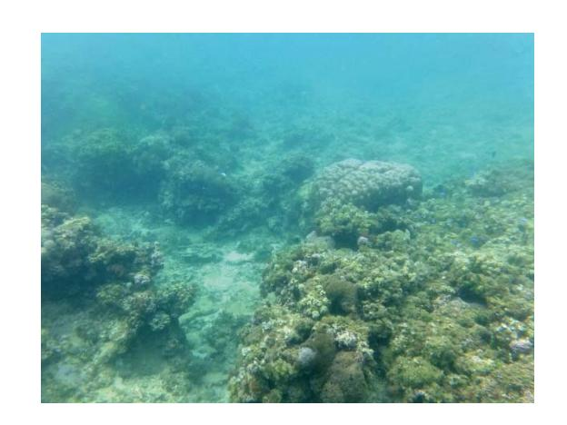

#### 6Wᑠ๓

ㄪᰝ᪥㸸ᖹᡂ ᖺ ᭶ ᪥ ࢦࣥࢧ⫱⏕ᆺ㸸Ϭ㸦ከ✀ΰᡂᆺ㸧

ࢦࣥࢧ龠ᗘ㸸㸣ᮍ‶ ᖺࢦࣥࢧࡢ龠ᗘ㸸㸣ᮍ‶

ࢩࣜࢻ࣑㢮ࡢ᪂つຍධ㸸 ⩌య੍

㈅㢮㣗ࢡࣥࣛ㸸Ϩ

┿㸸ࢦࣥࢧ࣐ࣁ㢮ࡀయࡢᾏᇦࡢ≦ἣ

㢮ࢦࣥࢧ࣐ࣁ≦ሢࡸ㢮ࢱࢷ࣑࢘ࠊࡃ࡞ᑡࡣ㢮ࢦࣥࢧ㸸ࢺ࣓ࣥࢥ ᑡࡀయ⩌ࡢᑠᆺࡣ㢮ࢩࣜࢻ࣑ࠋᗘ⛬ࡿࢀࡽぢࡋᑡࡀ ࡚ࡋⱱ⦾ࡀ࡞㢮ࣛ࢞ࣛ࢞ࠊࢡࣔࣃࢵࣛࠋࡿࢀࡽぢࡋ

ࠋࡿ࠸

#### 6WᐑⰋᕝἙཱྀ

ㄪᰝ᪥㸸ᖹᡂ ᖺ ᭶ ᪥ ࢦࣥࢧ⫱⏕ᆺ㸸Ϭ㸦ከ✀ΰᡂᆺ㸧

ࢦࣥࢧ龠ᗘ㸸㸣 ᖺࢦࣥࢧࡢ龠ᗘ㸸㸣

ࢩࣜࢻ࣑㢮ࡢ᪂つຍධ㸸 ⩌య੍

㈅㢮㣗ࢡࣥࣛ㸸Ϩ

┿㸸ࢦࣥࢧ㢮ࡀᑡ࠸࡞♋ཎࡢ≦ἣ

ࢺ࣓ࣥࢥ㸸♋ཎࢦࣥࢧࡣ㢮ࡀᑡࠋ࠸࡞Ỉ㊰㠃ࡓࡋ♋ᩳ㠃ࡣሢ≧ ࡸࡸࡀࢦࣥࢧ࢜ࠊ㢮࢟ࢻࣔࢦࣥࢧࢼࡸ㢮ࢦࣥࢧ࣐ࣁ ࠋ࠸ከࡀ᪂つຍධࡢ㢮ࢩࣜࢻ࣑ሙᡤ࠸ὸࠊࡃከ

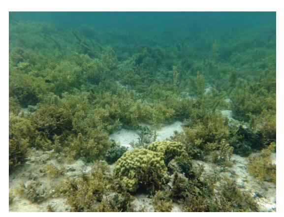

#### 6WᐑⰋ㞟ⴠ๓

ㄪᰝ᪥㸸ᖹᡂ ᖺ ᭶ ᪥ ࢦࣥࢧ⫱⏕ᆺ㸸Ϭ㸦ከ✀ΰᡂᆺ㸧

ࢦࣥࢧ龠ᗘ㸸㸣ᮍ‶ ᖺࢦࣥࢧࡢ龠ᗘ㸸㸣ᮍ‶

ࢩࣜࢻ࣑㢮ࡢ᪂つຍධ㸸 ⩌య੍

㈅㢮㣗ࢡࣥࣛ㸸Ϩ

┿㸸ᾏ⸴㢮ࡀ⦾ⱱࡿࡍᾏᇦࡢ≦ἣ

ࡎࢃࡀ࡞㢮ࢩ࣓ࢡ࢟ࡸ㢮ࢦࣥࢧ࣐ࣁ≦ሢࡢ㸸ᑠᆺࢺ࣓ࣥࢥ ࡚ࡵྵࢆ᪂つຍධࡣ㢮ࢩࣜࢻ࣑ࠋᗘ⛬ࡿࢀࡽぢ ࡋⱱ⦾ࡀ࡞㢮࣑ࣝࠊ㢮ࣛ࣡ࢲࣥ࣍ࠋ࠸࡞ࡽࡓぢᙜࢇ

ࠋࡿ࠸࡚

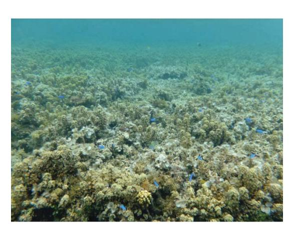

#### 6Wⓑಖ㞟ⴠ๓

ㄪᰝ᪥㸸ᖹᡂ ᖺ ᭶ ᪥ ࢦࣥࢧ⫱⏕ᆺ㸸Ϭ㸦ከ✀ΰᡂᆺ㸧

ࢦࣥࢧ龠ᗘ㸸㸣ᮍ‶

ᖺࢦࣥࢧࡢ龠ᗘ㸸㸣ᮍ‶ ࢩࣜࢻ࣑㢮ࡢ᪂つຍධ㸸 ⩌య੍

㈅㢮㣗ࢡࣥࣛ㸸Ϩ

┿㸸ᾏ⸴㢮ࡀ❧┠ࡘᾏᇦࡢ≦ἣ

ࡣᗘ⿕࡛ΰᡂ✀ከࡢ࡞㢮ࢦࣥࢧ࣐ࣁࡸ㢮ࢩ࣓ࢡ࢟㸸ࢺ࣓ࣥࢥ ࡀయ⩌ᑠᆺࡢ㢮ࢦࣥࢧࣥࣔࢥ≦ᯞࠊ㢮ࢩࣜࢻ࣑ࠋ࠸ప ࢘ࠋ࠸ከࡸࡸࡣ᪂つຍධࡢ㢮ࢩࣜࢻ࣑ࠋࡿࢀࡽぢࡋᑡ ࠋࡿ࠸࡚ࡋⱱ⦾ࡀ࡞ࢡࣔࣃࢵࣛࠊ㢮࣡ࢳ࣑࢘

ᅗ ྛㄪᰝᆅⅬࡢᬒほཬࡧᴫἣ

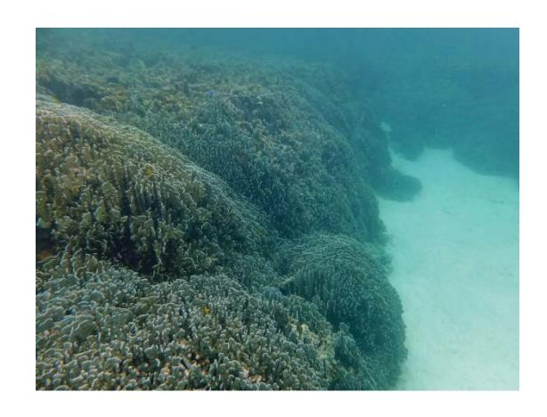

#### 6Wⓑಖࢦࣥࢧ࢜

ㄪᰝ᪥㸸ᖹᡂ ᖺ ᭶ ᪥

ඃ༨ᆺ㸧ࢦࣥࢧ࢜ᆺ㸸ϫ㸦⏕⫱ࢦࣥࢧ

ࢦࣥࢧ龠ᗘ㸸㸣

ᖺࢦࣥࢧࡢ龠ᗘ㸸㸣

ࢩࣜࢻ࣑㢮ࡢ᪂つຍධ㸸 ⩌య੍

㈅㢮㣗ࢡࣥࣛ㸸Ϩ

┿㸸ࡢࢦࣥࢧ࢜⩌㞟

ࠊࢡࣔࣃࢵࣛࡣཎ♋ࠋࡿࡀᗈࡀ㞟⩌ࡢࢦࣥࢧ࢜≦ᯈ㸸ࢺ࣓ࣥࢥ

ࠋࡿࡍⱱ⦾ࡀ㢮࣡ࢳ࣑࢘࢘

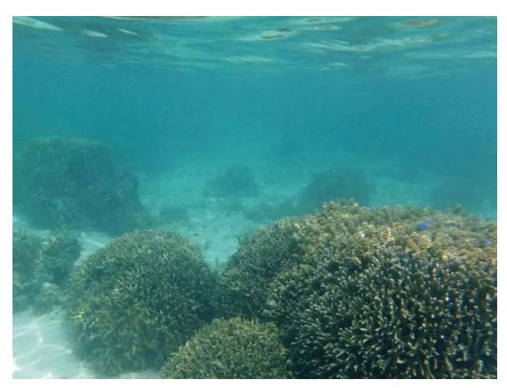

#### 6Wⓑಖ➨୍࣮࣏ࣝ

ㄪᰝ᪥㸸ᖹᡂ ᖺ ᭶ ᪥

ඃ༨ᆺ㸧ࢦࣥࢧ࣐ࣁࢲ࢚ࣅࣘᆺ㸸ϫ㸦⏕⫱ࢦࣥࢧ

ࢦࣥࢧ龠ᗘ㸸㸣 ᖺࢦࣥࢧࡢ龠ᗘ㸸㸣

ࢩࣜࢻ࣑㢮ࡢ᪂つຍධ㸸 ⩌య੍

㈅㢮㣗ࢡࣥࣛ㸸Ϩ

┿㸸ࡢࢦࣥࢧ࣐ࣁࢲ࢚ࣅࣘ⩌㞟

ࡸࡸࡶࢦࣥࢧ࢜ࠊࡾ࠶࡛ඃໃࡀࢦࣥࢧ࣐ࣁࢲ࢚ࣅࣘ㸸ࢺ࣓ࣥࢥ ࡽࡓぢᙜࢇࡵྵࢆ᪂つຍධࡣ㢮ࢩࣜࢻ࣑ࠋ࠸ከ

ࠋࡿ࠸࡚ࡋⱱ⦾ࡀࢡࣔࣃࢵࣛࠋ࠸࡞

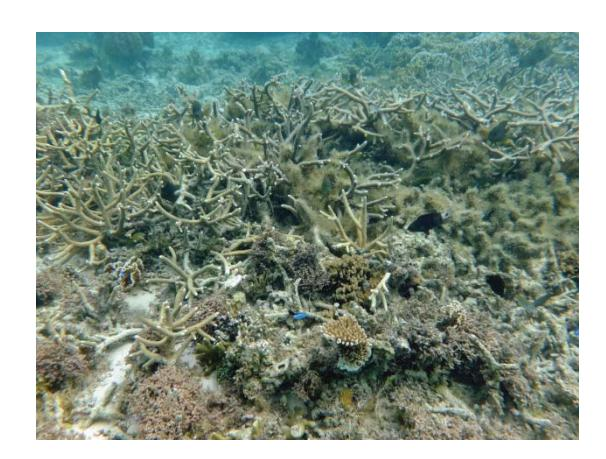

## 6Wⓑಖ㹼㎘ᕝ

ㄪᰝ᪥㸸ᖹᡂ ᖺ ᭶ ᪥ ࢦࣥࢧ⫱⏕ᆺ㸸Ϭ㸦ከ✀ΰᡂᆺ㸧

ࢦࣥࢧ龠ᗘ㸸㸣 ᖺࢦࣥࢧࡢ龠ᗘ㸸㸣

ࢩࣜࢻ࣑㢮ࡢ᪂つຍධ㸸 ⩌య੍

㈅㢮㣗ࢡࣥࣛ㸸ϩ

┿㸸ᯞ≧ࢩࣜࢻ࣑㢮ࡢ⩌㞟

ࣥࢧࣥࣔࢥ≦ᯞࠊ㢮ࢩࣜࢻ࣑≦ᯞࠊ㢮ࢦࣥࢧࣟࢥࢩ㸸ࢺ࣓ࣥࢥ ࡋᑡࡀ㣗ࡢ㈅㢮㢮ࢩࣜࢻ࣑ࠋΰᡂ✀ከࡢ࡞㢮ࢦ ࢳ࣑࢘࢘ࠋࡿ࠸࡚ࢀࡉᙧᡂࡀሙ࣐ࣔᆅ◁ࠋࡿࢀࡽぢ

ࠋ࠸ከࡸࡸࡀ࡞㢮࣡

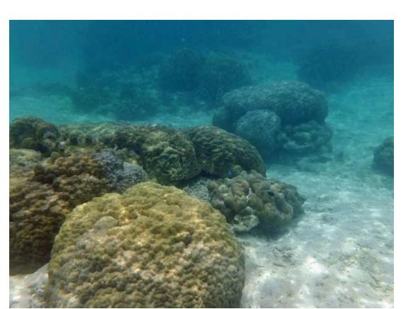

#### 6W㎘ᕝἙཱྀ

ㄪᰝ᪥㸸ᖹᡂ ᖺ ᭶ ᪥

ඃ༨ᆺ㸧ࢦࣥࢧ࣐ࣁ≦ᆺ㸸ϫ㸦ሢ⏕⫱ࢦࣥࢧ

ࢦࣥࢧ龠ᗘ㸸㸣 ᖺࢦࣥࢧࡢ龠ᗘ㸸㸣

ࢩࣜࢻ࣑㢮ࡢ᪂つຍධ㸸 ⩌య੍ᮍ‶

㈅㢮㣗ࢡࣥࣛ㸸ϩ

┿㸸ሢ≧ࢦࣥࢧ࣐ࣁ㢮ࡢ⩌య

≦ᯞࠊ࡛㞟⩌ࢦࣥࢧࡢ୰ᚰࡀ㢮ࢦࣥࢧ࣐ࣁ≦ሢࡢᑠ㸸ࢺ࣓ࣥࢥ య⩌ࡢᑠᆺࡣ㢮ࢩࣜࢻ࣑ࠋ࠸ከࡸࡸࡶ㢮ࢦࣥࢧࣥࣔࢥ ࠋࡿ࠸࡚ࢀࡉᙧᡂࡀሙ࣐ࣔᆅ◁ࠋࡿࢀࡽከᑡぢࡀ

ᅗ ྛㄪᰝᆅⅬࡢᬒほཬࡧᴫἣ

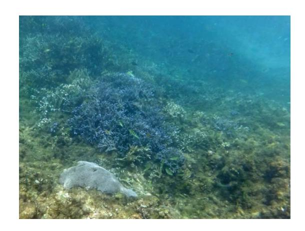

#### ࢳࢢ࣐ࣖࣜࣔW6

ㄪᰝ᪥㸸ᖹᡂ ᖺ ᭶ ᪥

ඃ༨ᆺ㸧ࢩࣜࢻ࣑≦ᯞᆺ㸸Ϩ㸦⏕⫱ࢦࣥࢧ

ࢦࣥࢧ龠ᗘ㸸㸣 ᖺࢦࣥࢧࡢ龠ᗘ㸸㸣

ࢩࣜࢻ࣑㢮ࡢ᪂つຍධ㸸 ⩌య੍

㈅㢮㣗ࢡࣥࣛ㸸Ϩ

┿㸸Ỉ㊰㒊ࡢ≦ᯞࢩࣜࢻ࣑㢮⩌㞟

Ⅼࡀ㞟⩌ᑠࡢ㢮ࢩࣜࢻ࣑≦ᯞ㠃ᩳࡓࡋ㠃㸸Ỉ㊰ࢺ࣓ࣥࢥ ᅾࠋࡿࡍ♋ཎࢦࣥࢧࡣ㢮ᑡࢩࣜࢻ࣑ࠋ࠸࡞㢮ࡢ᪂つ ຍධࡀከࡀ࣒࣮ࣟࢻࣥࢩࢺ࣡࣍ࠊࢫ࢜ࣆࣝࢸࠋ࠸ᑡ

ࠋࡿࢀࡽぢࡋ

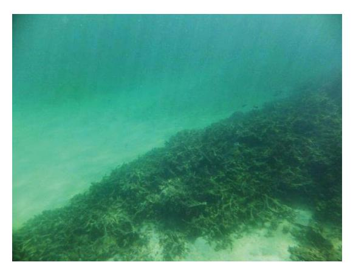

## ࢳࢢࢪ࣒ࢫW6

ㄪᰝ᪥㸸ᖹᡂ ᖺ ᭶ ᪥ ࢦࣥࢧ⫱⏕ᆺ㸸Ϭ㸦ከ✀ΰᡂᆺ㸧

ࢦࣥࢧ龠ᗘ㸸㸣ᮍ‶

ᖺࢦࣥࢧࡢ龠ᗘ㸸㸣ᮍ‶

ࢩࣜࢻ࣑㢮ࡢ᪂つຍධ㸸 ⩌య੍ᮍ‶

㈅㢮㣗ࢡࣥࣛ㸸ϩ

┿㸸ࢦࣥࢧ㢮ࡀᑡ࠸࡞Ỉ㊰㒊ࡢ≦ἣ

࣡ࢳ࣑࢘࢘ࡣཎ♋ࠊࡃ࡞㢮ᑡࢦࣥࢧࡶỈ㊰ࠊཎ♋㸸ࢺ࣓ࣥࢥ ࢦࣥࢧ࣐ࣁ≦ሢࠋࡿ࠸࡚ࡋⱱ⦾ࡀ࡞ࢡࣔࣃࢵࣛࠊ㢮 ࡀ࡞య⩌ᑠࡢ㢮ࢩࣜࢻ࣑≦ᯞࠊ㢮ࢩ࣓ࢡ࢟ࠊ㢮

ࠋࡿࢀࡽぢ

## 6W᥇▼ሙ๓

ㄪᰝ᪥㸸ᖹᡂ ᖺ ᭶ ᪥ ࢦࣥࢧ⫱⏕ᆺ㸸Ϭ㸦ከ✀ΰᡂᆺ㸧

ࢦࣥࢧ龠ᗘ㸸㸣ᮍ‶

ᖺࢦࣥࢧࡢ龠ᗘ㸸㸣ᮍ‶

ࢩࣜࢻ࣑㢮ࡢ᪂つຍධ㸸 ⩌య੍ ㈅㢮㣗ࢡࣥࣛ㸸Ϩ

┿㸸ᾏ⸴㢮そࡓࢀࢃ♋ཎࡢᵝᏊ

ࢩ࣓ࢡ࢟ࠊ㢮ࢦࣥࢧ࣐ࣁ≦ሢࠊࡃ࡞ᑡࡣ㢮ࢦࣥࢧ㸸ࢺ࣓ࣥࢥ ࣡ࢳ࣑࢘࢘┙ᒾࠋࡿ࠶࡛ᗘ⛬ࡿࢀࡽከᑡぢࡀ࡞㢮 㢮ࡀ࡞⦾ⱱࠋࡿ࠸࡚ࡋ≦ᯞࢩࣜࢻ࣑㢮ࡣ FP ⛬ᗘ

ࠋࡿࢀࡽぢࡋᑡࡀ᪂つຍධࡸయ⩌ࡢ

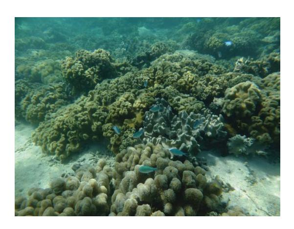

#### 6W㏻㊰ᕝ༡

ㄪᰝ᪥㸸ᖹᡂ ᖺ ᭶ ᪥

ඃ༨ᆺ㸧࣮ࣝࣛࢥࢺࣇࢯᆺ㸸ϭ㸦⏕⫱ࢦࣥࢧ

ࢦࣥࢧ龠ᗘ㸸㸣 ᖺࢦࣥࢧࡢ龠ᗘ㸸㸣

ࢩࣜࢻ࣑㢮ࡢ᪂つຍධ㸸 ⩌య੍

㈅㢮㣗ࢡࣥࣛ㸸Ϩ

┿㸸ඃໃ࣮ࣝࣛࢥࢺࣇࢯ࡞㢮ࡢᵝᏊ

ࡢࠊࡃከࡀ࣮ࣝࣛࢥࢺࣇࢯ୰ᚰࢆ㢮ࢥࣀ࣑࢟࢘㸸ࢺ࣓ࣥࢥ ぢࡋᑡࡀ᪂つຍධࡢ㢮ࢩࣜࢻ࣑ࠋ࠸࡞ᑡࡣ㢮ࢦࣥࢧ

ࠋࡿࢀࡽ

ᅗ ྛㄪᰝᆅⅬࡢᬒほཬࡧᴫἣ

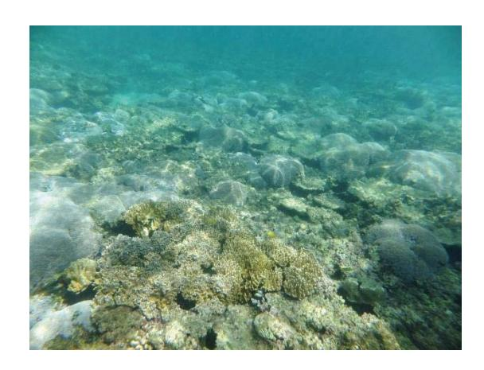

#### 6W㏻㊰ᕝỈ㊰

ㄪᰝ᪥㸸ᖹᡂ ᖺ ᭶ ᪥ ࢦࣥࢧ⫱⏕ᆺ㸸Ϭ㸦ከ✀ΰᡂᆺ㸧

ࢦࣥࢧ龠ᗘ㸸㸣

ᖺࢦࣥࢧࡢ龠ᗘ㸸㸣

ࢩࣜࢻ࣑㢮ࡢ᪂つຍධ㸸 ⩌య੍

㈅㢮㣗ࢡࣥࣛ㸸Ϩ

┿㸸ࡀ࣮ࣝࣛࢥࢺࣇࢯከ࠸♋ཎࡢᵝᏊ

ࢦࣥࢧ♋㐀ࠊࡃከࡸࡸࡀ㢮ࢱࢷ࣑࢘ࡣࢺࢵࣛࣇ࣮ࣜ㸸ࢺ࣓ࣥࢥ ࣓ࢡ࢟ࠊ㢮ࢦࣥࢧ࣐ࣁ≦ሢࡣ㠃ᩳ♋ࠋ࠸࡞ᑡࡣ㢮 ᪂つຍධࡢ㢮ࢩࣜࢻ࣑࡛㒊୍ࠋࡿࢀࡽぢࡀ࡞㢮ࢩ

ࠋ࠸ከࡸࡸࡀ

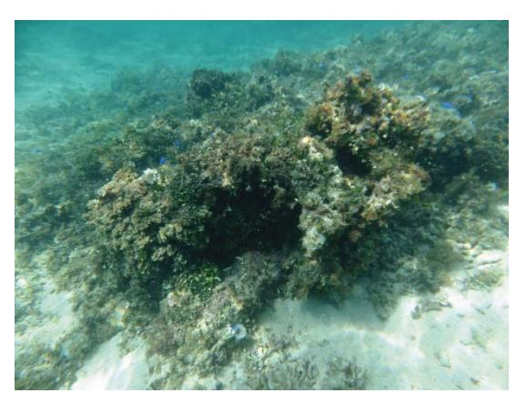

## 6W㔝ཎᓮ

ㄪᰝ᪥㸸ᖹᡂ ᖺ ᭶ ᪥ ࢦࣥࢧ⫱⏕ᆺ㸸Ϭ㸦ከ✀ΰᡂᆺ㸧

ࢦࣥࢧ龠ᗘ㸸㸣ᮍ‶ ᖺࢦࣥࢧࡢ龠ᗘ㸸㸣ᮍ‶

ࢩࣜࢻ࣑㢮ࡢ᪂つຍධ㸸 ⩌య੍ᮍ‶

㈅㢮㣗ࢡࣥࣛ㸸ϩ

┿㸸ᯞ≧ࢦࣥࢧࣥࣔࢥ㢮ࡀ࡞ⅬᅾࡿࡍᵝᏊ

ࢩ࣓ࢡ࢟ࠊ㢮ࢦࣥࢧࣥࣔࢥ≦ᯞࠊࡃ࡞ᑡࡣ㢮ࢦࣥࢧ㸸ࢺ࣓ࣥࢥ ࣜࢻ࣑ࠋ࠸ከࡸࡸࡀ㢮࣡ࢳ࣑࢘࢘ࠋࡿࡍⅬᅾࡀ࡞㢮

ࠋࡿࢀࡽぢࡋᑡࡀయ⩌ᑠᆺࡢ㢮ࢩ

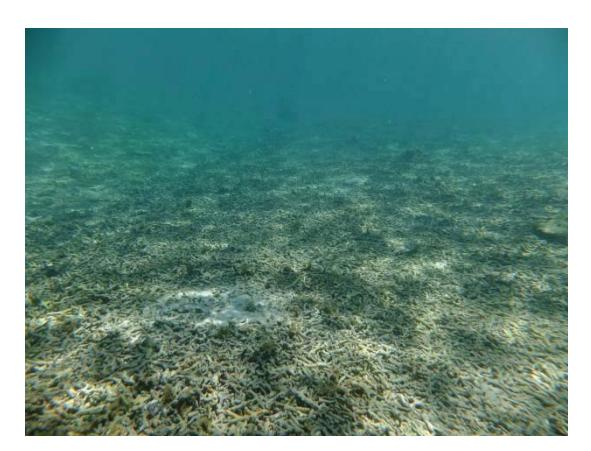

#### 6Wఀ㔝⏣⁺ ๓

ㄪᰝ᪥㸸ᖹᡂ ᖺ ᭶ ᪥ ࢦࣥࢧ⫱⏕ᆺ㸸Ϭ㸦ከ✀ΰᡂᆺ㸧

ࢦࣥࢧ龠ᗘ㸸㸣ᮍ‶ ᖺࢦࣥࢧࡢ龠ᗘ㸸㸣ᮍ‶

ࢩࣜࢻ࣑㢮ࡢ᪂つຍධ㸸 ⩌య੍ᮍ‶

㈅㢮㣗ࢡࣥࣛ㸸Ϩ

┿㸸ࢦࣥࢧ㢮ࢇࡀぢᙜ࠸࡞ࡽࡓᾏᇦࡢ≦ἣ

ࢦࣥࢧ࣐ࣁ≦ሢࠊ࣮ࣝࣛࢥࢺࣇࢯࠊࡾࡀᗈࡀ♟ࢦࣥࢧ㸸ࢺ࣓ࣥࢥ ࠶ࡀື⛣ࡢᗏ㉁ࡾࡼ㢼ྎࠋࡿ࠶࡛ᗘ⛬ࡿࡍⅬᅾࡀ㢮

ࠋࡿࢀࢃᛮࡓࡗ

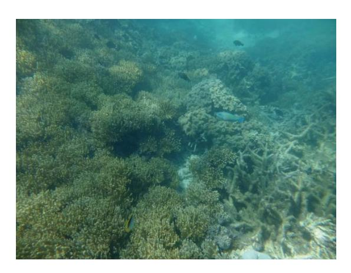

### 6W㔝∾ሙ๓

ㄪᰝ᪥㸸ᖹᡂ ᖺ ᭶ ᪥ ࢦࣥࢧ⫱⏕ᆺ㸸Ϭ㸦ከ✀ΰᡂᆺ㸧

ࢦࣥࢧ龠ᗘ㸸㸣 ᖺࢦࣥࢧࡢ龠ᗘ㸸㸣

ࢩࣜࢻ࣑㢮ࡢ᪂つຍධ㸸 ⩌య੍

㈅㢮㣗ࢡࣥࣛ㸸Ϩ

┿㸸ࡀ࣮ࣝࣛࢥࢺࣇࢯඃໃ࡞Ỉ㊰㒊ࡢᵝᏊ

ࢦࣥࢧ࣐ࣁ≦ሢࡣỈ㊰㒊ࠊࡀ࠸࡞㢮ᑡࢦࣥࢧࡣཎ♋㸸ࢺ࣓ࣥࢥ ࡽぢࡀ࡞ࢩࣜࢻ࣑ࢲ࢚ࢺࣇࠊ࣮ࣝࣛࢥࢺࣇࢯࠊ㢮 ࠋ࠸ከࡀ᪂つຍධࡢ㢮ࢩࣜࢻ࣑ཎ♋ࠋࡿࢀ

ᅗ ྛㄪᰝᆅⅬࡢᬒほཬࡧᴫἣ

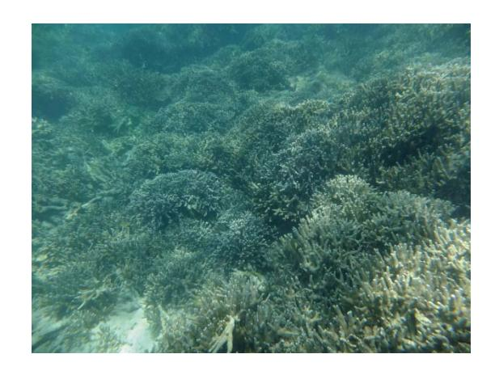

#### 6W⋢ྲྀᓮ༡

ㄪᰝ᪥㸸ᖹᡂ ᖺ ᭶ ᪥

ඃ༨ᆺ㸧ࢦࣥࢧ࣐ࣁࢲ࢚ࣅࣘᆺ㸸ϫ㸦⏕⫱ࢦࣥࢧ

ࢦࣥࢧ龠ᗘ㸸㸣 ᖺࢦࣥࢧࡢ龠ᗘ㸸㸣

ࢩࣜࢻ࣑㢮ࡢ᪂つຍධ㸸 ⩌య੍ᮍ‶

㈅㢮㣗ࢡࣥࣛ㸸Ϩ

┿㸸ࡢࢦࣥࢧ࣐ࣁࢲ࢚ࣅࣘ⩌㞟

ࢺ࣓ࣥࢥ㸸ࡀࢦࣥࢧ࣐ࣁࢲ࢚ࣅࣘᗈ⠊ᅖ㧗⿕ᗘ⩌㞟ࢆᙧᡂࡍ ࢜ࠋࡿࢀࡽぢࡋᑡࡀయ⩌ࡢᑠᆺࡣ㢮ࢩࣜࢻ࣑ࠋࡿ

ࠋࡾ࠶㞟⩌ᑠࡢࢦࣥࢧ

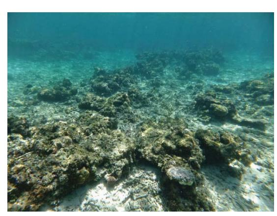

#### 6W⋢ྲྀᓮᮾ

ㄪᰝ᪥㸸ᖹᡂ ᖺ ᭶ ᪥

ࢦࣥࢧ⫱⏕ᆺ㸸Ϭ㸦ከ✀ΰᡂᆺ㸧 ࢦࣥࢧ龠ᗘ㸸㸣ᮍ‶

ᖺࢦࣥࢧࡢ龠ᗘ㸸㸣ᮍ‶

ࢩࣜࢻ࣑㢮ࡢ᪂つຍධ㸸 ⩌య੍ᮍ‶

㈅㢮㣗ࢡࣥࣛ㸸Ϩ

┿㸸ࢦࣥࢧ㢮ࡀᑡ࠸࡞ᾏᇦࡢ≦ἣ

㢮࣮ࣝࣛࢥࢺࣇࢯࠊ㢮ࢩ࣓ࢡ࢟ࡸ㢮ࢦࣥࢧ࣐ࣁ≦㸸ሢࢺ࣓ࣥࢥ ࡿࡼࢹࢺࣄࢽ࢜ࡢᑠᆺࠋ࠸పࡣᗘ⿕ࡀࡔΰᡂ✀ከࡢ

ࠋࡿࢀࡽぢࡋᑡࡀ㣗ࡿࢀࡽぢ

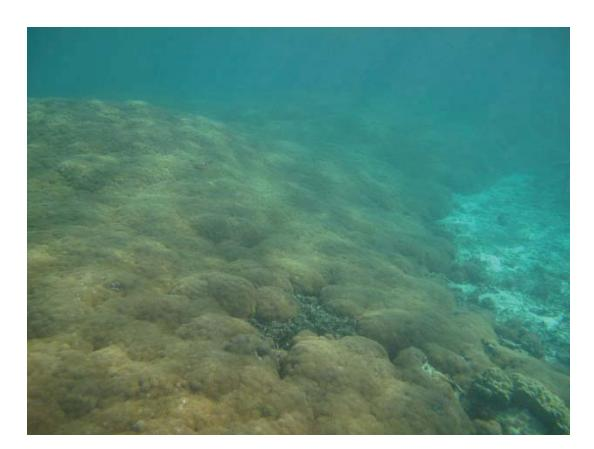

#### 6Wఀཎ㛫∾ሙ๓

ㄪᰝ᪥㸸ᖹᡂ ᖺ ᭶ ᪥

ඃ༨ᆺ㸧ࢦࣥࢧࢧ࢞ࢼࣁࢲ࢚ᆺ㸸ϫ㸦⏕⫱ࢦࣥࢧ

ࢦࣥࢧ龠ᗘ㸸㸣 ᖺࢦࣥࢧࡢ龠ᗘ㸸㸣

ࢩࣜࢻ࣑㢮ࡢ᪂つຍධ㸸 ⩌య੍ᮍ‶

㈅㢮㣗ࢡࣥࣛ㸸Ϩ

┿㸸ࡢࢦࣥࢧࢧ࢞ࢼࣁࢲ࢚つᶍ⩌㞟ࡢᵝᏊ

ࠎᚎࡣ㞟⩌ࠋࡿࡀᗈࡀ㞟⩌ࡢࢦࣥࢧࢧ࢞ࢼࣁࢲ࢚㸸ࢺ࣓ࣥࢥ ࠊࡃ࡞ᑡࡣ㢮ࢦࣥࢧࡢࡢࡑࠋࡿࢀࢃᛮࡿ࠸࡚ࡋᣑ ぢࡎࢃࡀ࡞ࢩࣜࢻ࣑ࢲ࢚ࢺࣇࡣ㢮ࢩࣜࢻ࣑

ࠋࡿ࠶࡛ᗘ⛬ࡿࢀࡽ

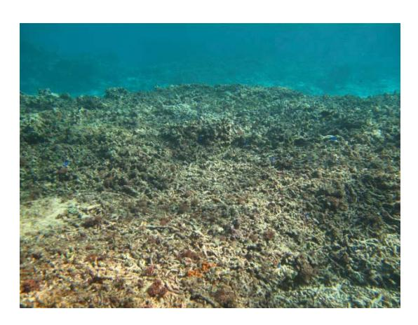

#### 6W࣒ࣝࢺᓮ༡

ㄪᰝ᪥㸸ᖹᡂ ᖺ ᭶ ᪥ ࢦࣥࢧ⫱⏕ᆺ㸸Ϭ㸦ከ✀ΰᡂᆺ㸧

ࢦࣥࢧ龠ᗘ㸸㸣ᮍ‶ ᖺࢦࣥࢧࡢ龠ᗘ㸸㸣ᮍ‶

ࢩࣜࢻ࣑㢮ࡢ᪂つຍධ㸸 ⩌య੍

㈅㢮㣗ࢡࣥࣛ㸸Ϩ

┿㸸ࢦࣥࢧ㢮ࡀᑡ࠸࡞ᾏᇦࡢ≦ἣ

ࢧ࡛యࢦࣥࢧ࣐ࣁ࢜ࣛࣃࡧࡼ࠾㢮ࢦࣥࢧ࣐ࣁ≦㸸ሢࢺ࣓ࣥࢥ ࠊࡾ࠶ከᑡࡀయ⩌ᑠࡣ㢮ࢩࣜࢻ࣑ࠋ࠸పࡣᗘ⿕ࢦࣥ ࠋࡿࢀࡽぢࡘࡃ࠸ࡀయ≧⩌ࢫ࣮࣎ࣥࣜࢥࡢ FP

ࠋࡿࢀࡉᩓぢࡀ㣗ࡢࢹࢺࣄࢽ࢜

ᅗ ྛㄪᰝᆅⅬࡢᬒほཬࡧᴫἣ

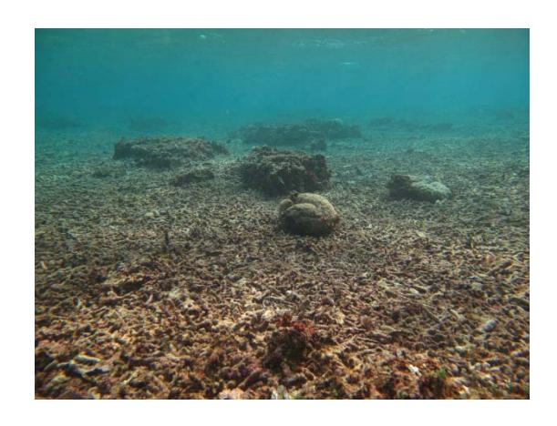

#### 6W࣒ࣝࢺᓮ

ㄪᰝ᪥㸸ᖹᡂ ᖺ ᭶ ᪥ ࢦࣥࢧ⫱⏕ᆺ㸸Ϭ㸦ከ✀ΰᡂᆺ㸧

ࢦࣥࢧ龠ᗘ㸸㸣ᮍ‶ ᖺࢦࣥࢧࡢ龠ᗘ㸸㸣ᮍ‶

ࢩࣜࢻ࣑㢮ࡢ᪂つຍධ㸸 ⩌య੍ᮍ‶

㈅㢮㣗ࢡࣥࣛ㸸Ϩ

┿㸸ࢦࣥࢧ㢮ࡀᑡ࠸࡞ᾏᇦࡢ≦ἣ

࡞㢮ࢱࢷ࣑࢘ࠊ㢮ࢦࣥࢧࣥࣔࢥ≦ᯞࠊ㢮ࢦࣥࢧ࣐ࣁ㸸ࢺ࣓ࣥࢥ ࡢᑠ⩌యࡎࢃࡀぢࡿࢀࡽ⛬ᗘࢦࣥࢧ࡛龠ᗘࡣప ࠋࡿࢀࡽぢࡎࢃࡀయ⩌ຍධࡢ㢮ࢩࣜࢻ࣑ࠋ࠸

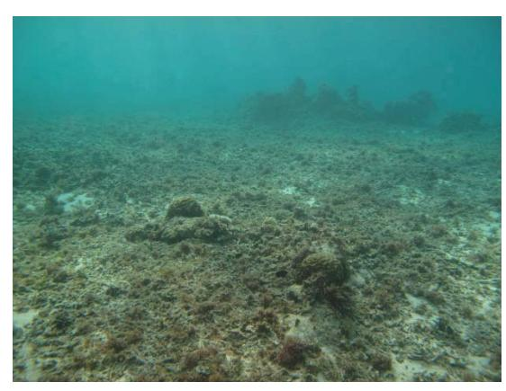

#### 6W㺨㺽㺵㺺㺎㺷㺢㺼๓

ㄪᰝ᪥㸸ᖹᡂ ᖺ ᭶ ᪥ ࢦࣥࢧ⫱⏕ᆺ㸸Ϭ㸦ከ✀ΰᡂᆺ㸧

ࢦࣥࢧ龠ᗘ㸸㸣ᮍ‶ ᖺࢦࣥࢧࡢ龠ᗘ㸸㸣ᮍ‶

ࢩࣜࢻ࣑㢮ࡢ᪂つຍධ㸸 ⩌య੍ᮍ‶

㈅㢮㣗ࢡࣥࣛ㸸Ϩ

┿㸸ࢦࣥࢧ㢮ࡀᑡ࠸࡞♟ᗏࡢᵝᏊ

ከᑡぢࡀ࡞㢮ࢩࣛࣅࢧࢡࠊ㢮ࢦࣥࢧࣥࣔࢥ≦ᯞ㸸ࢺ࣓ࣥࢥ ࢧࣥࣔࢥ≦ᯞࠊࡀ࠸పࡣᗘ⿕ࡔࡲࠋࡿ࠶࡛ᗘ⛬ࡿࢀࡽ ࣜࢻ࣑ࡢ FPࠋࡿࢀࢃᛮࡔྥቑຍഴࡣ㢮ࢦࣥ

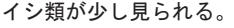

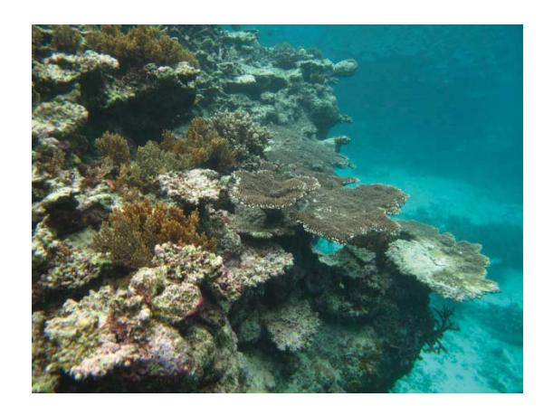

#### 6W᫂▼㹼ᏳⰋᓮ

ㄪᰝ᪥㸸ᖹᡂ ᖺ ᭶ ᪥ ࢦࣥࢧ⫱⏕ᆺ㸸Ϭ㸦ከ✀ΰᡂᆺ㸧

ࢦࣥࢧ龠ᗘ㸸㸣 ᖺࢦࣥࢧࡢ龠ᗘ㸸㸣

ࢩࣜࢻ࣑㢮ࡢ᪂つຍධ㸸 ⩌య੍

㈅㢮㣗ࢡࣥࣛ㸸Ϩ

┿㸸༟≧ࢩࣜࢻ࣑㢮ࡀඃໃ࡞Ỉ㊰࿘㎶ࡢᵝᏊ

ሢࡸ㢮ࢩࣜࢻ࣑≦༟࣭≦ᯞ࡚ࡅ㠃ᩳࡽ㸸Ỉ㊰ࢺ࣓ࣥࢥ ࠋࡿ࠶࡛ඃໃࡀ࡞࣮ࣝࣛࢥࢺࣇࢯࠊ㢮ࢦࣥࢧ࣐ࣁ≦ ♋ཎࢦࣥࢧࡣ龠ᗘࡣపࢩࣜࢻ࣑ࠊࡀ࠸㢮ࡢ᪂つຍධ

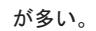

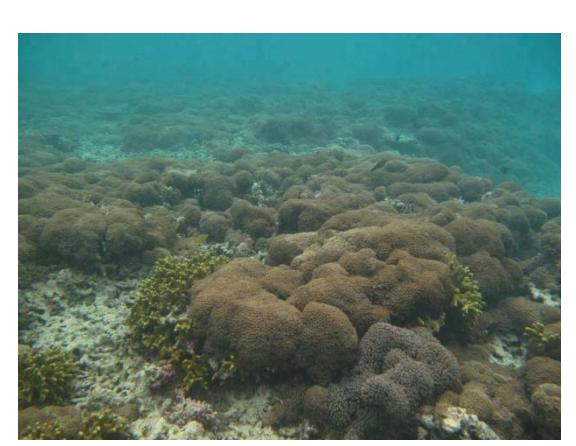

#### 6WᏳⰋᓮ༡

ㄪᰝ᪥㸸ᖹᡂ ᖺ ᭶ ᪥

ඃ༨ᆺ㸧࣮ࣝࣛࢥࢺࣇࢯᆺ㸸ϭ㸦⏕⫱ࢦࣥࢧ

ࢦࣥࢧ龠ᗘ㸸㸣 ᖺࢦࣥࢧࡢ龠ᗘ㸸㸣

ࢩࣜࢻ࣑㢮ࡢ᪂つຍධ㸸 ⩌య੍

㈅㢮㣗ࢡࣥࣛ㸸Ϩ

┿㸸ࢱࢷ࣑࢘㢮ࡀඃ༨ࡿࡍᾏᇦࡢᵝᏊ

ࢆୖᒾࡀ࣮ࣝࣛࢥࢺࣇࢯࡿࡍయࢆ㢮ࢱࢷ࣑࢘㸸ࢺ࣓ࣥࢥ ࢩࣜࢻ࣑ࠋ࠸ከࡸࡸࡶ㢮ࢦࣥࢧ࣐ࣁࠋࡿ࠸࡚ࡗそ 㢮ࡣᑡࡀ࠸࡞᪂つຍධ⩌యࡀከᑡぢࠋࡿࢀࡽ

ᅗ ྛㄪᰝᆅⅬࡢᬒほཬࡧᴫἣ

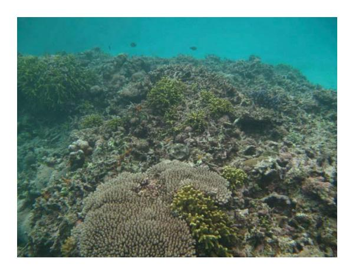

#### 6WᏳⰋᓮ

ㄪᰝ᪥㸸ᖹᡂ ᖺ ᭶ ᪥ ࢦࣥࢧ⫱⏕ᆺ㸸Ϭ㸦ከ✀ΰᡂᆺ㸧

ࢦࣥࢧ龠ᗘ㸸㸣 ᖺࢦࣥࢧࡢ龠ᗘ㸸㸣

ࢩࣜࢻ࣑㢮ࡢ᪂つຍධ㸸 ⩌య੍

㈅㢮㣗ࢡࣥࣛ㸸Ϩ

┿㸸♋ཎࢦࣥࢧࡢ㢮ࡢᵝᏊ

࡛ΰᡂ✀ከࡿࡍయࢆ㢮ࢦࣥࢧ࣐ࣁࡸ㢮ࢱࢷ࣑࢘㸸ࢺ࣓ࣥࢥ ᑠᆺࠋࡿ࠶࡛ᗘ⛬ࡿࢀࡽከᑡぢࡣ㢮ࢩࣜࢻ࣑ࠋࡿ࠶

ࠋࡿࢀࡽぢࡎࢃࡀ㣗ࡢࢹࢺࣄࢽ࢜ࡢ

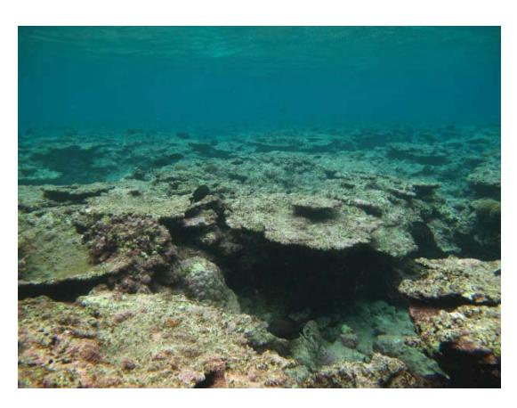

#### 6WᏳⰋࢳࢢ

ㄪᰝ᪥㸸ᖹᡂ ᖺ ᭶ ᪥ ࢦࣥࢧ⫱⏕ᆺ㸸Ϭ㸦ከ✀ΰᡂᆺ㸧

ࢦࣥࢧ龠ᗘ㸸㸣

ᖺࢦࣥࢧࡢ龠ᗘ㸸㸣ᮍ‶ ࢩࣜࢻ࣑㢮ࡢ᪂つຍධ㸸 ⩌య੍

㈅㢮㣗ࢡࣥࣛ㸸Ϩ

┿㸸ࢦࣥࢧ㢮ࡀᑡ࠸࡞♋ཎࡢ≦ἣ

ࢺ࣓ࣥࢥ㸸♋ཎࡽỈ㊰ᩳ㠃ࢼࡸ࣮ࣝࣛࢥࢺࣇࢯࠊ࡚ࡅ ࢀࡽከᑡぢࡀ࡞㢮ࢦࣥࢧ࣐ࣁ≦ሢࠊ㢮࢟ࢻࣔࢦࣥࢧ ᪂ࡢ㢮ࢩࣜࢻ࣑ሙᡤ࠸ὸࠋ࠸పࡣᗘ⿕ࠊ࡛ᗘ⛬ࡿ つຍධࡸࡸࡀከࡃぢࠋࡿࢀࡽᑠᆺࡢࢹࢺࣄࢽ࢜ࡢ㣗

ࠋࡿࢀࡽぢࡎࢃࡀ

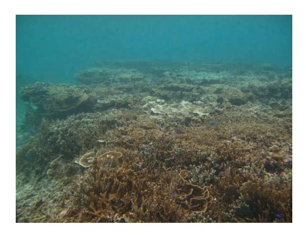

#### 6Wᒾᓮ༡

ㄪᰝ᪥㸸ᖹᡂ ᖺ ᭶ ᪥

ඃ༨ᆺ㸧ࢦࣥࢧࣥࣔࢥᆺ㸸ϫ㸦⏕⫱ࢦࣥࢧ

ࢦࣥࢧ龠ᗘ㸸㸣 ᖺࢦࣥࢧࡢ龠ᗘ㸸㸣

ࢩࣜࢻ࣑㢮ࡢ᪂つຍධ㸸 ⩌య੍

㈅㢮㣗ࢡࣥࣛ㸸Ϩ

┿㸸ࢦࣥࢧࣥࣔࢥ㢮ࡀඃໃ࡞ᾏᇦࡢ≦ἣ

ࡀᗈඃໃࡀ㢮ࢦࣥࢧࣥࣔࢥࡢ≦そ⿕ࠊ≦ⴥࠊ≦ᯞ㸸ࢺ࣓ࣥࢥ ᑡࡣ㢮ࢦࣥࢧ♋㐀ࡢࡢࡑࠋࡿࢀࡽぢࡀ⫱⏕࡞Ⰻዲࡾ ࠋࡿࢀࡽぢࡋᑡࡀ(19)⭘㢮ࢦࣥࢧࣥࣔࢥ≦ⴥࠋ࠸࡞

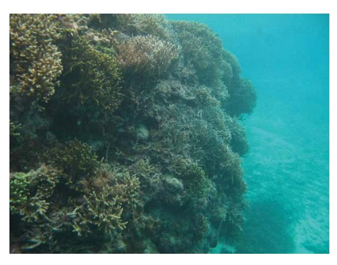

#### 6Wᒾᓮ

ㄪᰝ᪥㸸ᖹᡂ ᖺ ᭶ ᪥ ࢦࣥࢧ⫱⏕ᆺ㸸Ϭ㸦ከ✀ΰᡂᆺ㸧

ࢦࣥࢧ龠ᗘ㸸㸣 ᖺࢦࣥࢧࡢ龠ᗘ㸸㸣

ࢩࣜࢻ࣑㢮ࡢ᪂つຍධ㸸 ⩌య੍

㈅㢮㣗ࢡࣥࣛ㸸ϩ

┿㸸ᯞ≧ࢦࣥࢧ㢮ࡀඃໃ࡞ᒾ࿘⦕㒊ࡢ≦ἣ

ࠊࡀ࠸ከࡀ㢮ࢦࣥࢧࣥࣔࢥࡢ≦ⴥᒁᡤⓗࡣཎ♋㸸ࢺ࣓ࣥࢥ ᆺࡢࢦࣥࢧ࣐ࣁࢲ࢚ࣅࣘࡣሙ῝ࠋ࠸పࡀᗘ⿕⯡ ࡿࡼ㢼ྎࠋࡿࢀࡽぢࡀ㞟⩌㢮ࢩࣜࢻ࣑≦ᯞࡸయ⩌

ࠋῶᑡࡀ㢮ࢦࣥࢧࠊࡾ࠶ࡀື⛣ࡢ㸧♟ᗏ㉁㸦

ᅗ ྛㄪᰝᆅⅬࡢᬒほཬࡧᴫἣ

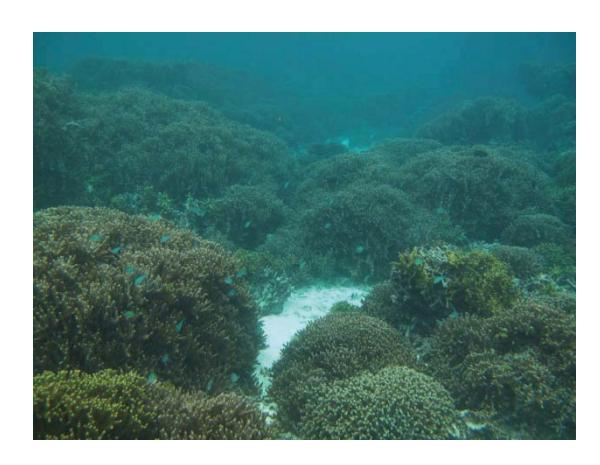

#### 6Wᒾᓮ㹼ᾆᓮ

ㄪᰝ᪥㸸ᖹᡂ ᖺ ᭶ ᪥

ඃ༨ᆺ㸧ࢦࣥࢧ࣐ࣁࢲ࢚ࣅࣘᆺ㸸ϫ㸦⏕⫱ࢦࣥࢧ

ࢦࣥࢧ龠ᗘ㸸㸣

ᖺࢦࣥࢧࡢ龠ᗘ㸸㸣

ࢩࣜࢻ࣑㢮ࡢ᪂つຍධ㸸 ⩌య੍

㈅㢮㣗ࢡࣥࣛ㸸Ϩ

┿㸸ඃໃࡢࢦࣥࢧ࣐ࣁࢲ࢚ࣅࣘ࡞⩌㞟

࡚ࡋᙧᡂࢆ㞟⩌ࡾࡀᗈඃໃࡀࢦࣥࢧ࣐ࣁࢲ࢚ࣅࣘ㸸ࢺ࣓ࣥࢥ ᗘ⛬ࡿࢀࡽከᑡぢࡀయ⩌ࡢᑠᆺࡣ㢮ࢩࣜࢻ࣑ࠋࡿ࠸ 㢮ࢫࢧࣥࢰୖṚ㧁ࡢࢦࣥࢧࠊࡾࡼሙᡤࠋࡿ࠶࡛

ࠋࡿ࠸࡚ࡋ⏕ᐦࡀ

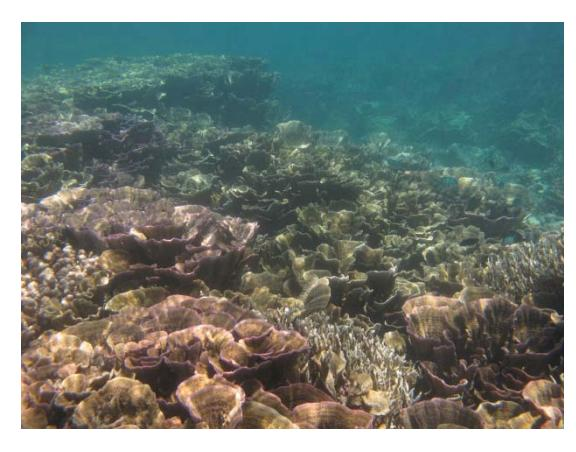

## 6WᾆᓮἈ

ㄪᰝ᪥㸸ᖹᡂ ᖺ ᭶ ᪥

ඃ༨ᆺ㸧ࢦࣥࢧࣥࣔࢥᆺ㸸ϫ㸦⏕⫱ࢦࣥࢧ

ࢦࣥࢧ龠ᗘ㸸㸣

ᖺࢦࣥࢧࡢ龠ᗘ㸸㸣

ࢩࣜࢻ࣑㢮ࡢ᪂つຍධ㸸 ⩌య੍ᮍ‶

㈅㢮㣗ࢡࣥࣛ㸸ϩ

┿㸸♋ཎࡢⴥ≧ࢦࣥࢧࣥࣔࢥ㢮⩌㞟

龠ࢦࣥࢧࠊࡾࡀᗈࡀ㞟⩌㢮ࢦࣥࢧࣥࣔࢥ≦ⴥ࣭≦ᯞ㸸ࢺ࣓ࣥࢥ ࠋࡿࢀࡽぢࡋᑡࡀ(19)⭘㢮ࢦࣥࢧࣥࣔࢥ≦ⴥࠋ࠸㧗ࡀᗘ

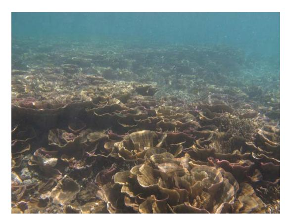

## 6Wᾆᓮ๓

ㄪᰝ᪥㸸ᖹᡂ ᖺ ᭶ ᪥

ඃ༨ᆺ㸧ࢦࣥࢧࣥࣔࢥᆺ㸸ϫ㸦⏕⫱ࢦࣥࢧ

ࢦࣥࢧ龠ᗘ㸸㸣

ᖺࢦࣥࢧࡢ龠ᗘ㸸㸣

ࢩࣜࢻ࣑㢮ࡢ᪂つຍධ㸸 ⩌య੍ᮍ‶

㈅㢮㣗ࢡࣥࣛ㸸ϩ

┿㸸♋ཎࡢⴥ≧ࢦࣥࢧࣥࣔࢥ㢮

龠ࢦࣥࢧࠊࡾࡀᗈࡀ㞟⩌㢮ࢦࣥࢧࣥࣔࢥ≦ⴥ࣭≦ᯞ㸸ࢺ࣓ࣥࢥ ᗘࡀ㧗ࢱࢷ࣑࢘ࠋ࠸㢮ࡸࡸࡶከࢩࣜࢻ࣑ࠋ࠸㢮ࡣᑡ ࠋࡿࢀࡽぢࡋᑡࡀ(19)⭘㢮ࢦࣥࢧࣥࣔࢥ≦ⴥࠋ࠸࡞

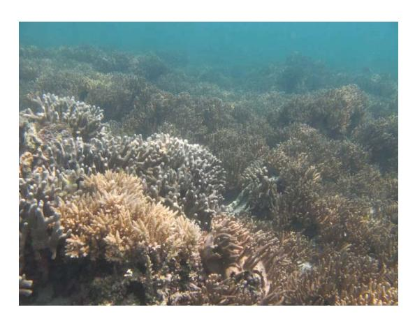

## 6Wᖹ㔝㞟ⴠ๓

ㄪᰝ᪥㸸ᖹᡂ ᖺ ᭶ ᪥ ࢦࣥࢧ⫱⏕ᆺ㸸Ϭ㸦ከ✀ΰᡂᆺ㸧

ࢦࣥࢧ龠ᗘ㸸㸣

ᖺࢦࣥࢧࡢ龠ᗘ㸸㸣

ࢩࣜࢻ࣑㢮ࡢ᪂つຍධ㸸 ⩌య੍ᮍ‶

㈅㢮㣗ࢡࣥࣛ㸸ϩ

┿㸸ከ✀ΰᡂࢦࣥࢧࡢ⩌㞟ࡀᗈࡿࡀᵝᏊ

ࣁࢲ࢚ࣅࣘࠊࡾ࠶ࡀ㞟⩌࡞ࡁࡸࡸࡢ࣮ࣝࣛࢥࢺࣇࢯ㸸ࢺ࣓ࣥࢥ ࠋΰᡂ✀ከࡿࡊΰࡀ࡞㢮ࢩࣜࢻ࣑≦ᯞࡸࢦࣥࢧ࣐

ᅗ ྛㄪᰝᆅⅬࡢᬒほཬࡧᴫἣ

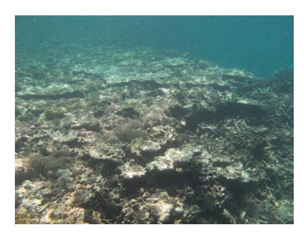

#### 6Wᖹஂಖⅉྎ

ㄪᰝ᪥㸸ᖹᡂ ᖺ ᭶ ᪥ ࢦࣥࢧ⫱⏕ᆺ㸸Ϭ㸦ከ✀ΰᡂᆺ㸧

ࢦࣥࢧ龠ᗘ㸸㸣

ᖺࢦࣥࢧࡢ龠ᗘ㸸㸣

ࢩࣜࢻ࣑㢮ࡢ᪂つຍධ㸸 ⩌య੍

㈅㢮㣗ࢡࣥࣛ㸸Ϩ

┿㸸ࢦࣥࢧ㢮ࡀᑡ࠸࡞♋ཎࡢᵝᏊ

ࢺ࣓ࣥࢥ㸸♋ཎࢦࣥࢧࡣ㢮ᑡࠊࡃ࡞♋ᩳ㠃ࠊ࣮ࣝࣛࢥࢺࣇࢯࡣሢ ࣑≦ᯞ࣭≦༟Ỉ㊰㒊ࠊࢀࡽࡳࡀ࡞㢮ࢦࣥࢧ࣐ࣁ≦ ࣡࣍㢮ࢩࣜࢻ࣑≦༟ࠋࡿࢀࡽぢࡋᑡࡀ㢮ࢩࣜࢻ ຍࡢ㢮ࢩࣜࢻ࣑ࠋࡿࢀࡽぢࡋᑡࡀ࣒࣮ࣟࢻࣥࢩࢺ

ࠋ࠸ከࡀධ

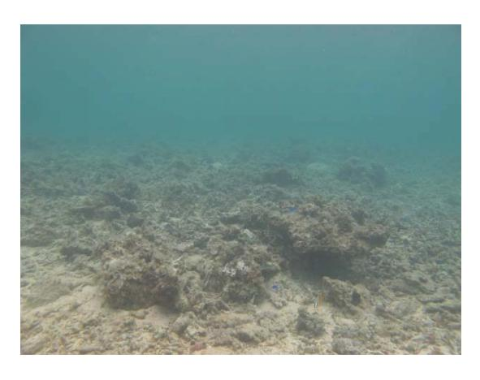

#### 6Wᖹஂಖⅉྎす

ㄪᰝ᪥㸸ᖹᡂ ᖺ ᭶ ᪥ ࢦࣥࢧ⫱⏕ᆺ㸸Ϭ㸦ከ✀ΰᡂᆺ㸧

ࢦࣥࢧ龠ᗘ㸸㸣ᮍ‶

ᖺࢦࣥࢧࡢ龠ᗘ㸸㸣ᮍ‶

ࢩࣜࢻ࣑㢮ࡢ᪂つຍධ㸸 ⩌య੍

㈅㢮㣗ࢡࣥࣛ㸸Ϩ

┿㸸ࢦࣥࢧ㢮ࡢᑡ࠸࡞ᾏᇦࡢ≦ἣ

≦ሢࠊ࣮ࣝࣛࢥࢺࣇࢯࠊࡾ࠾࡚ࡋ⁛Ṛࡰࡣ㢮ࢦࣥࢧ㸸ࢺ࣓ࣥࢥ ࣑ࠋࡿ࠶࡛ᗘ⛬ࡿࢀࡽぢࡎࢃࡀ࡞㢮ࢦࣥࢧ࣐ࣁ ⦾ࡀ㢮࣡ࢳ࣑࢘࢘ࠋ࠸࡞ࢀࡽࡳࡃࡓࡗࡲࡣ㢮ࢩࣜࢻ

ࠋࡿ࠸࡚ࡋⱱ

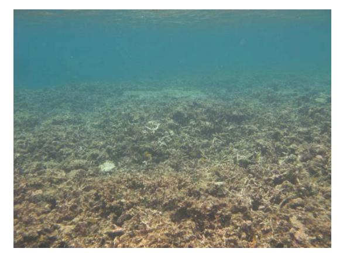

#### 6Wᖹஂಖᕝ

ㄪᰝ᪥㸸ᖹᡂ ᖺ ᭶ ᪥ ࢦࣥࢧ⫱⏕ᆺ㸸Ϭ㸦ከ✀ΰᡂᆺ㸧

ࢦࣥࢧ龠ᗘ㸸㸣ᮍ‶ ᖺࢦࣥࢧࡢ龠ᗘ㸸㸣ᮍ‶

ࢩࣜࢻ࣑㢮ࡢ᪂つຍධ㸸 ⩌య੍

㈅㢮㣗ࢡࣥࣛ㸸Ϩ

┿㸸ࢩࣜࢻ࣑㢮ࡰࡀṚ⁛ࡓࡋᾏᇦࡢᵝᏊ

≦ሢࠊ࣮ࣝࣛࢥࢺࣇࢯࠊࡾ࠾࡚ࡋ⁛Ṛࡰࡣ㢮ࢦࣥࢧ㸸ࢺ࣓ࣥࢥ ࢡࠋࡿ࠶࡛ᗘ⛬ࡿࢀࡽぢࡎࢃࡀ࡞㢮ࢦࣥࢧ࣐ࣁ ࢃࡀ㢮ࢩࣜࢻ࣑≦ᯞෆࡾᙇ⦖ࡢࢲ࣓ࢬࢫࣛࢯࣟ

ࠋࡿ࠸࡚ࡗṧࡎ

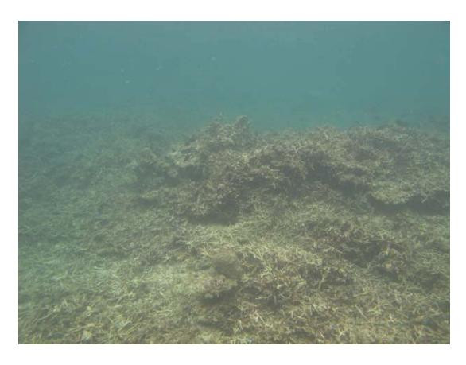

## 6Wᖹஂಖ㞟ⴠ༡

ㄪᰝ᪥㸸ᖹᡂ ᖺ ᭶ ᪥ ࢦࣥࢧ⫱⏕ᆺ㸸Ϭ㸦ከ✀ΰᡂᆺ㸧

ࢦࣥࢧ龠ᗘ㸸㸣ᮍ‶

ᖺࢦࣥࢧࡢ龠ᗘ㸸㸣ᮍ‶

ࢩࣜࢻ࣑㢮ࡢ᪂つຍධ㸸 ⩌య੍

㈅㢮㣗ࢡࣥࣛ㸸Ϩ

┿㸸ࢦࣥࢧ㢮ࡀᑡ࠸࡞ᾏᇦࡢᵝᏊ

ࣇࢯࠊ㢮ࢩࣛࣅࢧࢡࠊࡾ࠾࡚ࡋ⁛Ṛࡰࡣ㢮ࢦࣥࢧ㸸ࢺ࣓ࣥࢥ ࢬࢫ࢞ࢼࢼࣁࠋࡿ࠶࡛ᗘ⛬ࡿࢀࡽぢࡋᑡࡀ࣮ࣝࣛࢥࢺ ṧࡎࢃࡀ㢮ࢩࣜࢻ࣑≦ᯞࡣෆࡾᙇ⦖ࡢࢲ࣓ ࠋࡿࢀࡉほᐹࡋᑡࡀࢹࢺࣄࢽ࢜ࡢᑠᆺ࡚ࡋ↛౫ࠋࡿ

ᅗ ྛㄪᰝᆅⅬࡢᬒほཬࡧᴫἣ

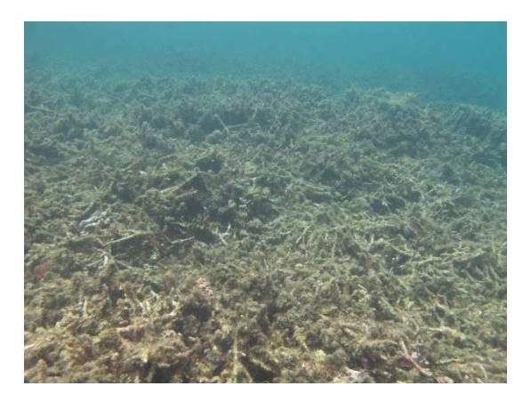

#### 6WⰋᕝ๓

ㄪᰝ᪥㸸ᖹᡂ ᖺ ᭶ ᪥ ࢦࣥࢧ⫱⏕ᆺ㸸Ϭ㸦ከ✀ΰᡂᆺ㸧

ࢦࣥࢧ龠ᗘ㸸㸣ᮍ‶ ᖺࢦࣥࢧࡢ龠ᗘ㸸㸣ᮍ‶

ࢩࣜࢻ࣑㢮ࡢ᪂つຍධ㸸 ⩌య੍

㈅㢮㣗ࢡࣥࣛ㸸ϩ

┿㸸ࢦࣥࢧ㢮ࢇࡀぢ࠸࡞ࢀࡽᾏᇦࡢᵝᏊ

ࣇࢯࠊ㢮ࢩࣛࣅࢧࢡࠊࡾ࠾࡚ࡋ⁛Ṛࡰࡣ㢮ࢦࣥࢧ㸸ࢺ࣓ࣥࢥ ࣜࢻ࣑≦ᯞࡎࢃࠋࡿࢀࡽぢࡋᑡࡀ࡞࣮ࣝࣛࢥࢺ ࠋࡿࢀࢃそ㢮⸴ᾏࡣୖཎ♋ࠋࡿ࠸࡚ࡋṧ⏕ࡀ㢮ࢩ

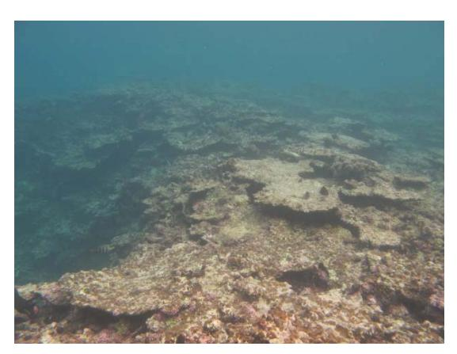

#### 6Wࣇࢸࢲᓮ

ㄪᰝ᪥㸸ᖹᡂ ᖺ ᭶ ᪥ ࢦࣥࢧ⫱⏕ᆺ㸸Ϭ㸦ከ✀ΰᡂᆺ㸧

ࢦࣥࢧ龠ᗘ㸸㸣ᮍ‶

ᖺࢦࣥࢧࡢ龠ᗘ㸸㸣ᮍ‶

ࢩࣜࢻ࣑㢮ࡢ᪂つຍධ㸸 ⩌య੍

㈅㢮㣗ࢡࣥࣛ㸸Ϩ

┿㸸ࢦࣥࢧ㢮ࢇࡀぢ࠸࡞ࢀࡽᾏᇦࡢᵝᏊ

龠ࠊ㢮࣮ࣝࣛࢥࢺࣇࢯࠊࡾ࠾࡚ࡋ⁛Ṛࡰࡣ㢮ࢦࣥࢧ㸸ࢺ࣓ࣥࢥ そ≧࢟ࢻࣔࢦࣥࢧࢼ㢮ࡎࢃࡀ࡞ぢࡿࢀࡽ⛬ᗘ ࡽከᑡぢࡀ᪂つຍධࡢ㢮ࢩࣜࢻ࣑ሙᡤ࠸ὸࠋࡿ࠶࡛

ࠋࡿࢀ

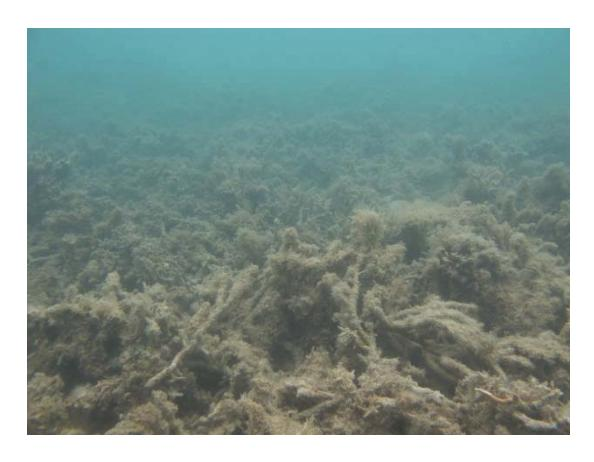

## 6Wࣇࢸࢲᓮ༡

ㄪᰝ᪥㸸ᖹᡂ ᖺ ᭶ ᪥ ࢦࣥࢧ⫱⏕ᆺ㸸Ϭ㸦ከ✀ΰᡂᆺ㸧

ࢦࣥࢧ龠ᗘ㸸㸣ᮍ‶

ᖺࢦࣥࢧࡢ龠ᗘ㸸㸣ᮍ‶

ࢩࣜࢻ࣑㢮ࡢ᪂つຍධ㸸 ⩌య੍

㈅㢮㣗ࢡࣥࣛ㸸Ϩ

┿㸸⸴㢮そࡓࢀࢃᾏᗏࡢᵝᏊ

࢟ࢻࣔࢦࣥࢧࢼ≦ᯞࠊࡾ࠾࡚ࡋ⁛Ṛࡰࡣ㢮ࢦࣥࢧ㸸ࢺ࣓ࣥࢥ ࠶࡛ᗘ⛬ࡿࢀࡽぢࡎࢃࡀ࡞࣮ࣝࣛࢥࢺࣇࢯࡸ㢮 ᪂ࡢ㢮ࢩࣜࢻ࣑ࠊࡾ࠾࡚ࢀࢃそ㢮⸴ࡣࢦࣥࢧṚࠋࡿ

ࠋ࠸࡞ࢀࡽࡳࡣつຍධ

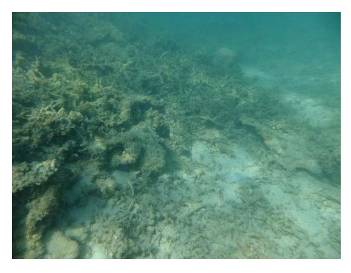

#### 6W㔝ᗏ▼ᓮ

ㄪᰝ᪥㸸ᖹᡂ ᖺ ᭶ ᪥ ࢦࣥࢧ⫱⏕ᆺ㸸Ϭ㸦ከ✀ΰᡂᆺ㸧

ࢦࣥࢧ龠ᗘ㸸㸣ᮍ‶ ᖺࢦࣥࢧࡢ龠ᗘ㸸㸣ᮍ‶

ࢩࣜࢻ࣑㢮ࡢ᪂つຍධ㸸 ⩌య੍

㈅㢮㣗ࢡࣥࣛ㸸Ϩ

┿㸸ࢦࣥࢧ㢮ࡰࡀṚ⁛ࡓࡋᾏᇦࡢᵝᏊ

࡞㢮࢟ࢻࣔࢦࣥࢧࢼࠊࡾ࠾࡚ࡋ⁛Ṛࡰࡣ㢮ࢦࣥࢧ㸸ࢺ࣓ࣥࢥ ᪂つࡣ㢮ࢩࣜࢻ࣑ࠋࡿ࠶࡛ᗘ⛬ࡿࢀࡽぢࡎࢃࡀ ຍධࢆྵࡵぢᙜࠋ࠸࡞ࡽࡓṚࢦࣥࢧⰪ≧⸴㢮ࡀ⦾ⱱ

ࠋࡿ࠸࡚ࡋ✚ሁࡀࢺࣝࢩࠊࡋ

ᅗ ྛㄪᰝᆅⅬࡢᬒほཬࡧᴫἣ

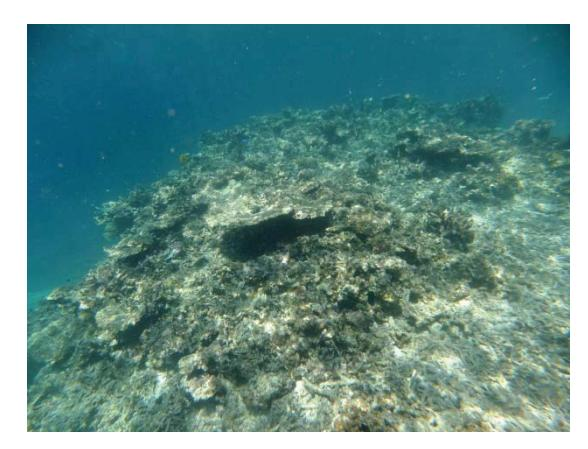

## 6Wᰤ㞟ⴠ๓

ㄪᰝ᪥㸸ᖹᡂ ᖺ ᭶ ᪥ ࢦࣥࢧ⫱⏕ᆺ㸸Ϭ㸦ከ✀ΰᡂᆺ㸧

ࢦࣥࢧ龠ᗘ㸸㸣ᮍ‶ ᖺࢦࣥࢧࡢ龠ᗘ㸸㸣

ࢩࣜࢻ࣑㢮ࡢ᪂つຍධ㸸 ⩌య੍

㈅㢮㣗ࢡࣥࣛ㸸Ϩ

┿㸸ࢦࣥࢧ㢮ࡰࡀṚ⁛ࡓࡋᾏᇦࡢ≦ἣ

ࢼࡸ㢮ࢦࣥࢧ࣐ࣁࠊࡾ࠾࡚ࡋ⁛Ṛࡰࡣ㢮ࢦࣥࢧ㸸ࢺ࣓ࣥࢥ Ṛࡢ㢮ࢦࣥࢧ࣐ࣁࠊࡀࡿṧࡎࢃࡀ㢮࢟ࢻࣔࢦࣥࢧ ࠋ࠸࡞ࡽࡓぢᙜࢇࡣ㢮ࢩࣜࢻ࣑ࠋ࠸ከࡶ㧁

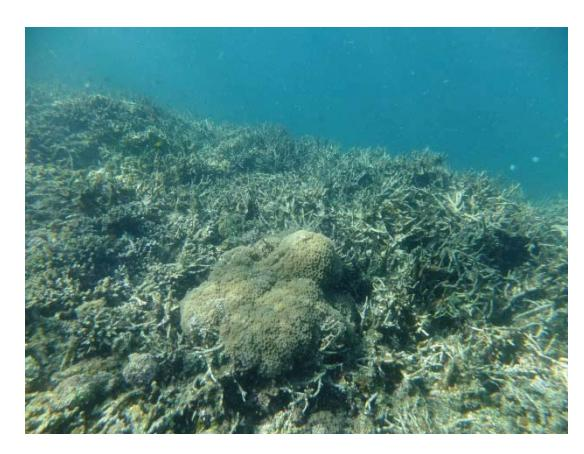

#### 6W㔝ᗏ㞟ⴠ๓

ㄪᰝ᪥㸸ᖹᡂ ᖺ ᭶ ᪥ ࢦࣥࢧ⫱⏕ᆺ㸸Ϭ㸦ከ✀ΰᡂᆺ㸧

ࢦࣥࢧ龠ᗘ㸸㸣ᮍ‶ ᖺࢦࣥࢧࡢ龠ᗘ㸸㸣

ࢩࣜࢻ࣑㢮ࡢ᪂つຍධ㸸 ⩌య੍

㈅㢮㣗ࢡࣥࣛ㸸Ϩ

┿㸸ࢦࣥࢧ㢮ࡎࢃࡀṧࡿ♋ཎࡢ≦ἣ

ࢧࣖࢼࣁࠊ࣮ࣝࣛࢥࢺࣇࢯࠊࡃ࡞㢮ᑡࢦࣥࢧࡣཎ♋㸸ࢺ࣓ࣥࢥ ࣐ࣁࡣ㠃ᩳ♋ࠋᗘ⛬ࡿࢀࡽぢࡎࢃࡀ㢮ࢦࣥࢧ ᯞࡣ㢮ࢩࣜࢻ࣑≦ᯞࠊࡿࢀࡽከᑡぢࡀ࡞㢮ࢦࣥࢧ

ࠋࡿ࠶ࡋᑡࡀṧ⏕ࡳࡢඛ

#### 6W㔝ᗏᓮ

ㄪᰝ᪥㸸ᖹᡂ ᖺ ᭶ ᪥

ඃ༨ᆺ㸧࣮ࣝࣛࢥࢺࣇࢯᆺ㸸ϭ㸦⏕⫱ࢦࣥࢧ

ࢦࣥࢧ龠ᗘ㸸㸣

ᖺࢦࣥࢧࡢ龠ᗘ㸸㸣

ࢩࣜࢻ࣑㢮ࡢ᪂つຍධ㸸 ⩌య੍

㈅㢮㣗ࢡࣥࣛ㸸Ϩ

┿㸸ࢱࢷ࣑࢘㢮ࡀ龠そࡿࡍᾏᇦࡢ≦ἣ

ࢦࣥࢧࡣ௨እࢀࡑࠋࡿࡍඃ༨㒊ศⓗࡀ㢮ࢱࢷ࣑࢘㸸ࢺ࣓ࣥࢥ ࡽぢࡎࢃࡀ࡞㢮࢟ࢻࣔࢦࣥࢧࢼࠊࡃ࡞ᑡࡀ㢮

ࠋࡿ࠸࡚ࢀࢃそ㢮≧⸴Ⱚࡣᗏ㉁ࠋᗘ⛬ࡿࢀ

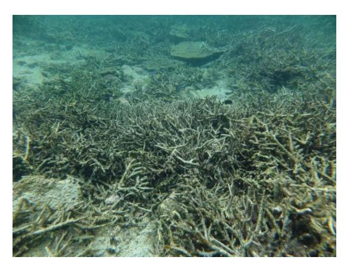

#### 6Wఀᅵྡ

ㄪᰝ᪥㸸ᖹᡂ ᖺ ᭶ ᪥ ࢦࣥࢧ⫱⏕ᆺ㸸Ϭ㸦ከ✀ΰᡂᆺ㸧

ࢦࣥࢧ龠ᗘ㸸㸣ᮍ‶ ᖺࢦࣥࢧࡢ龠ᗘ㸸㸣ᮍ‶

ࢩࣜࢻ࣑㢮ࡢ᪂つຍධ㸸 ⩌య੍

㈅㢮㣗ࢡࣥࣛ㸸Ϩ

┿㸸ࢦࣥࢧ㢮ࡰࡀṚ⁛ࡓࡋᾏᇦࡢ≦ἣ

㢮ࢩ࣓ࢡ࢟ࠊࡾ࠾࡚ࡋ⁛Ṛࡰࡣ㢮ࢦࣥࢧ㸸ࢺ࣓ࣥࢥ

ࠋࡿ࠶࡛ᗘ⛬ࡿࢀࡽぢࡎࢃࡀ࡞

ᅗ ྛㄪᰝᆅⅬࡢᬒほཬࡧᴫἣ

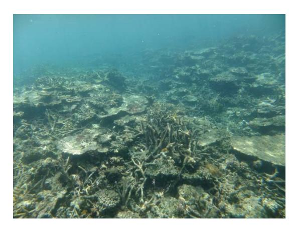

#### 6Wఀᅵྡ༡

ㄪᰝ᪥㸸ᖹᡂ ᖺ ᭶ ᪥ ࢦࣥࢧ⫱⏕ᆺ㸸Ϭ㸦ከ✀ΰᡂᆺ㸧

ࢦࣥࢧ龠ᗘ㸸㸣ᮍ‶ ᖺࢦࣥࢧࡢ龠ᗘ㸸㸣ᮍ‶

ࢩࣜࢻ࣑㢮ࡢ᪂つຍධ㸸 ⩌య੍

㈅㢮㣗ࢡࣥࣛ㸸Ϩ

┿㸸ࢦࣥࢧ㢮ࡰࡀṚ⁛ࡓࡋ♋ཎࡢ≦ἣ

ࢧ࣐ࣁ㠃ᩳ♋ࠊࡾ࠾࡚ࡋ⁛Ṛࡰࡣ㢮ࢦࣥࢧࡢཎ♋㸸ࢺ࣓ࣥࢥ ࢨࡢሙ῝ࠋࡿࢀࡽぢࡋᑡࡀ࡞㢮ࢩ࣓ࢡ࢟ࡸ㢮ࢦࣥ

ࠋࡿ࠸࡚ࡋ⁛Ṛࡣయ⩌ᆺࡢࢦࣥࢧ࣑

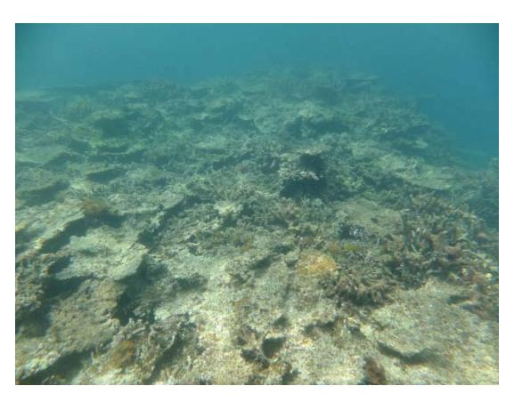

#### 6Wᾆᗏ‴ཱྀ

ㄪᰝ᪥㸸ᖹᡂ ᖺ ᭶ ᪥ ࢦࣥࢧ⫱⏕ᆺ㸸Ϭ㸦ከ✀ΰᡂᆺ㸧

ࢦࣥࢧ龠ᗘ㸸㸣ᮍ‶ ᖺࢦࣥࢧࡢ龠ᗘ㸸㸣

ࢩࣜࢻ࣑㢮ࡢ᪂つຍධ㸸 ⩌య੍

㈅㢮㣗ࢡࣥࣛ㸸Ϩ

┿㸸ࢦࣥࢧ㢮ࡰࡀṚ⁛ࡓࡋ♋ཎࡢ≦ἣ

ࡋ⁛Ṛࡰࡣ㢮ࢦࣥࢧ࡚ࡅ㠃ᩳ♋ࡽཎ♋㸸ࢺ࣓ࣥࢥ

ࠋࡿ࠸࡚

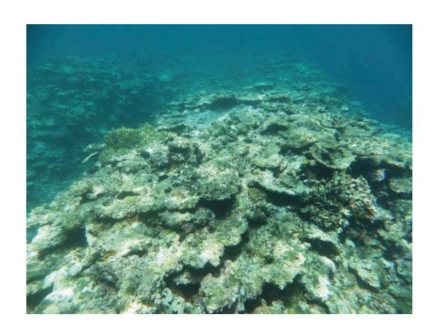

#### 6Wᾆᗏ‴ཱྀす

ㄪᰝ᪥㸸ᖹᡂ ᖺ ᭶ ᪥ ࢦࣥࢧ⫱⏕ᆺ㸸Ϭ㸦ከ✀ΰᡂᆺ㸧

ࢦࣥࢧ龠ᗘ㸸㸣ᮍ‶ ᖺࢦࣥࢧࡢ龠ᗘ㸸㸣

ࢩࣜࢻ࣑㢮ࡢ᪂つຍධ㸸 ⩌య੍

㈅㢮㣗ࢡࣥࣛ㸸Ϩ

┿㸸ࢦࣥࢧ㢮ࡀᑡ࠸࡞ᾏᇦࡢ≦ἣ

ࢦࣥࢧࣥࣔࢥ≦そ⿕ࠊ㢮ࢦࣥࢧ࣐ࣁࠊ࣮ࣝࣛࢥࢺࣇࢯ㸸ࢺ࣓ࣥࢥ 㢮ࡀ࡞ᑡࡋぢࡿࢀࡽ⛬ᗘࢩࣜࢻ࣑ࠋࡿ࠶࡛㢮ࡣṚ⁛ ࡋᑡࡀ㣗ࡢࢹࢺࣄࢽ࢜ࡶ㢮ࢦࣥࢧࡢ≦ሢࠊࡾ࠾࡚ࡋ

ࠋࡿࢀࡽぢ

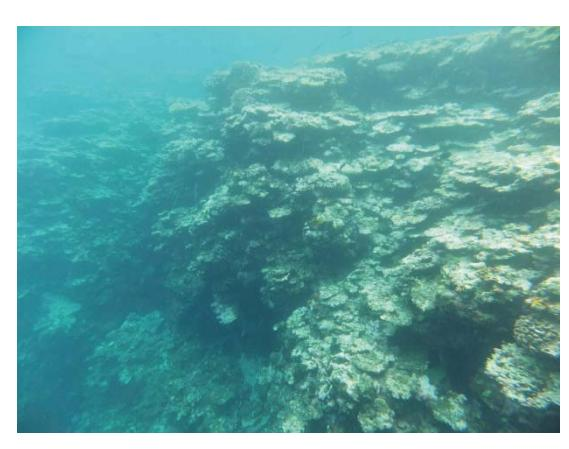

#### 6Wᐩ㔝㞟ⴠ๓

ㄪᰝ᪥㸸ᖹᡂ ᖺ ᭶ ᪥ ࢦࣥࢧ⫱⏕ᆺ㸸Ϭ㸦ከ✀ΰᡂᆺ㸧

ࢦࣥࢧ龠ᗘ㸸㸣ᮍ‶ ᖺࢦࣥࢧࡢ龠ᗘ㸸㸣

ࢩࣜࢻ࣑㢮ࡢ᪂つຍධ㸸 ⩌య੍

㈅㢮㣗ࢡࣥࣛ㸸Ϩ

┿㸸ࢦࣥࢧ㢮ࡀᑡ࠸࡞♋ᩳ㠃ࡢᵝᏊ

ሢࠊ㢮ࢩ࣓ࢡ࢟ࡓࡗṧࡎࢃࠊࡃపࡣᗘ⿕ࢦࣥࢧ㸸ࢺ࣓ࣥࢥ ࠋࡿ࠸࡚ࡅཷࢆ㣗ᐖࡢࢹࢺࣄࢽ࢜ࡀ㢮ࢦࣥࢧ࣐ࣁ≦

ᅗ ྛㄪᰝᆅⅬࡢᬒほཬࡧᴫἣ

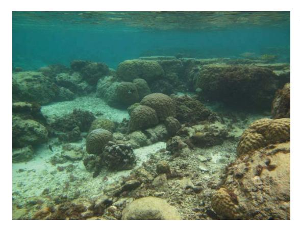

#### 6W⡿ཎࣉࣥࣕ࢟ሙ

ㄪᰝ᪥㸸ᖹᡂ ᖺ ᭶ ᪥

ඃ༨ᆺ㸧ࢦࣥࢧ࣐ࣁ≦ᆺ㸸ϫ㸦ሢ⏕⫱ࢦࣥࢧ

ࢦࣥࢧ龠ᗘ㸸㸣 ᖺࢦࣥࢧࡢ龠ᗘ㸸㸣

ࢩࣜࢻ࣑㢮ࡢ᪂つຍධ㸸 ⩌య੍

㈅㢮㣗ࢡࣥࣛ㸸Ϩ

┿㸸ࢦࣥࢧ࣐ࣁ㢮ࡀయࡢᾏᇦࡢᵝᏊ

FPࠊࡃከࡀ࣮ࣝࢺࣟࢡ࣐ࡢ㢮ࢦࣥࢧ࣐ࣁ≦㸸ሢࢺ࣓ࣥࢥ ᮍ‶ࢦࣥࢧ࣐ࣁࡢ㢮ᑠ⩌యࡶከࢩ࣓ࢡ࢟ࠋ࠸㢮ࠊ≦ᯞ ࠸࡞ᑡࡣ㢮ࢩࣜࢻ࣑ࠋࡿࢀࡽぢࡋᑡࡶ㢮ࢦࣥࢧࣥࣔࢥ ࡀ㢮ࣛ࢞ࣛ࢞ࠊࢡࣔࣃࢵࣛࠋ࠸ከࡸࡸࡣయ⩌᪂つຍධࡀ

ࠋࡿ࠸࡚ࡋⱱ⦾

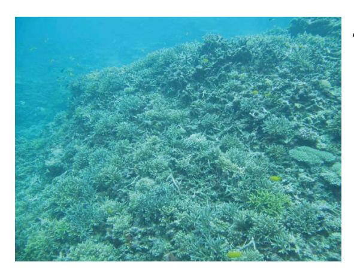

#### 6W࣮ࣞࣂ࣐ࣖ๓

ㄪᰝ᪥㸸ᖹᡂ ᖺ ᭶ ᪥ ࢦࣥࢧ⫱⏕ᆺ㸸Ϭ㸦ከ✀ΰᡂᆺ㸧

ࢦࣥࢧ龠ᗘ㸸㸣 ᖺࢦࣥࢧࡢ龠ᗘ㸸㸣

ࢩࣜࢻ࣑㢮ࡢ᪂つຍධ㸸 ⩌య੍

㈅㢮㣗ࢡࣥࣛ㸸ϩ

┿㸸♋ᩳ㠃ࢩࣜࢻ࣑ࡢ㢮

ࡣሙᡤ࠸῝ࠋᗘ⛬ࡿࢀࡽከᑡぢࡀ㢮ࢩ࣓ࢡ࢟ࡣཎ♋㸸ࢺ࣓ࣥࢥ ࠋࡿ࠶࡛ඃໃࡀ㢮࢟ࢻࣔࢦࣥࢧࢼ㢮ࢩࣜࢻ࣑≦ᯞ

ࠋ࠸ከࡀࢦࣥࢧṚ࠸ྂ㢮ࢩࣜࢻ࣑≦༟

## 6W࣮ࣞࣂ࣐ࣖす

ㄪᰝ᪥㸸ᖹᡂ ᖺ ᭶ ᪥ ࢦࣥࢧ⫱⏕ᆺ㸸Ϭ㸦ከ✀ΰᡂᆺ㸧

ࢦࣥࢧ龠ᗘ㸸㸣 ᖺࢦࣥࢧࡢ龠ᗘ㸸㸣

ࢩࣜࢻ࣑㢮ࡢ᪂つຍධ㸸 ⩌య੍

㈅㢮㣗ࢡࣥࣛ㸸Ϩ

ἣ≧ࡢᾏᇦࡿࡍ⫱⏕Ⰻዲࡀ㢮ࢦࣥࢧࡢ✀㸸ከ┿

࣑ࠊ㢮ࢦࣥࢧࣥࣔࢥࠊ㢮ࢦࣥࢧࣟࢥࢩࠊ㢮ࢦࣥࢧ࣐ࣁ㸸ࢺ࣓ࣥࢥ ࢩࣜࢻ㢮ࡢ࡞ከ✀ΰᡂࡀ࣮ࣝࢺࣟࢡ࣐ࠋከࡃⅬ ࣜࢻ࣑ࠋ࠸ከࡸࡸࡀ᪂つຍධࡢ㢮ࢩࣜࢻ࣑ࠋࡿࡍᅾ

ࠋࡿࢀࡽぢࡀ㇟⌧ⓑࡋᑡ㢮ࢩ

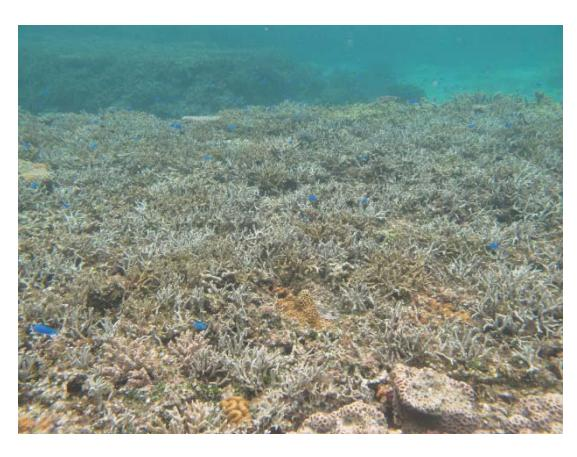

#### 6Wᕝᖹᑠᓥᮾ

ㄪᰝ᪥㸸ᖹᡂ ᖺ ᭶ ᪥

ඃ༨ᆺ㸧ࢦࣥࢧࣥࣔࢥ≦ᯞᆺ㸸ϫ㸦⏕⫱ࢦࣥࢧ

ࢦࣥࢧ龠ᗘ㸸㸣 ᖺࢦࣥࢧࡢ龠ᗘ㸸㸣

ࢩࣜࢻ࣑㢮ࡢ᪂つຍධ㸸 ⩌య੍

㈅㢮㣗ࢡࣥࣛ㸸ϩ

┿㸸ᯞ≧ࢦࣥࢧࣥࣔࢥ㢮ࡀయࡢᾏᇦࡢ≦ἣ

ࣥࣜࢥࡸ≦ᯞࠊࡾ࠶࡛ᾏᇦ࡞ඃໃࡀࢦࣥࢧࣥࣔࢥ≦ᯞ㸸ࢺ࣓ࣥࢥ ࡀ㣗ࡢ㈅㢮ࠋࡿࢀࡽぢࡃከࡶ㢮ࢩࣜࢻ࣑ࡢ≦ࢫ࣮࣎ ࠊࡀࡿࢀࡽぢࡀ㇟⌧ⓑࡋᑡ㢮ࢩࣜࢻ࣑ࠋ࠸ከࡸࡸ

ࠋ࠸࡞ࢀࡉㄆ☜ࡣṚஸࡿࡼࢀࡇ

ᅗ ྛㄪᰝᆅⅬࡢᬒほཬࡧᴫἣ

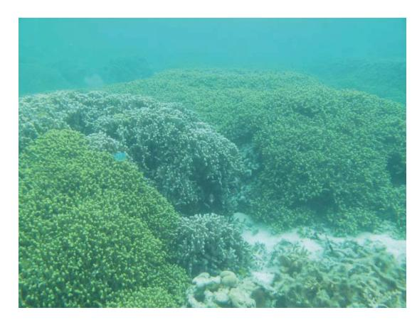

#### 6Wᕝᖹᑠᓥ

ㄪᰝ᪥㸸ᖹᡂ ᖺ ᭶ ᪥

ඃ༨ᆺ㸧ࢦࣥࢧ࣐ࣁࢲ࢚ࣅࣘᆺ㸸ϫ㸦⏕⫱ࢦࣥࢧ

ࢦࣥࢧ龠ᗘ㸸㸣 ᖺࢦࣥࢧࡢ龠ᗘ㸸㸣

ࢩࣜࢻ࣑㢮ࡢ᪂つຍධ㸸 ⩌య੍ᮍ‶

㈅㢮㣗ࢡࣥࣛ㸸ϩ

┿㸸ࢦࣥࢧ࣐ࣁࢲ࢚ࣅࣘ⩌ⴠࡢ≦ἣ

ࣜࢻ࣑ࠋ㞟⩌ࢦࣥࢧࡓࡋయࢆࢦࣥࢧ࣐ࣁࢲ࢚ࣅࣘ㸸ࢺ࣓ࣥࢥ ࡢ㈅㢮㢮ࢩࣜࢻ࣑ࠋࡿࢀࡽከᑡぢࡀⴠ⩌ᑠࡣ㢮ࢩ

ࠋࡿࢀࡽぢࡋᑡࡀ㣗

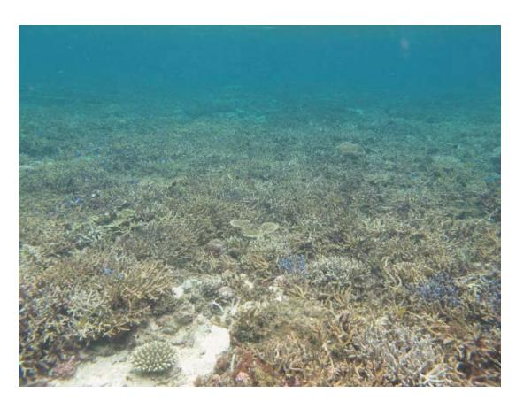

#### 6WᕝᖹỈ㊰ᮾ

ㄪᰝ᪥㸸ᖹᡂ ᖺ ᭶ ᪥ ࢦࣥࢧ⫱⏕ᆺ㸸Ϭ㸦ከ✀ΰᡂᆺ㸧

ࢦࣥࢧ龠ᗘ㸸㸣 ᖺࢦࣥࢧࡢ龠ᗘ㸸㸣

ࢩࣜࢻ࣑㢮ࡢ᪂つຍධ㸸 ⩌య੍

㈅㢮㣗ࢡࣥࣛ㸸ϩ

┿㸸ᯞ≧ࢩࣜࢻ࣑㢮ࡀඃໃ࡞ᾏᇦࡢ≦ἣ

᪂つࠊࢀࡽぢඃໃࡀ㢮ࢩࣜࢻ࣑≦༟࣭≦ᯞཎ♋㸸ࢺ࣓ࣥࢥ ຍධ⩌యࡶከࠋ࠸Ỉ㊰ࡢ♋ᩳ㠃ࡣṚࡀࢦࣥࢧከࠊࡃ≦ᯞ ࠋࡿ࠶࡛ᗘ⛬ࡿࢀࡽከᑡぢࡀ࡞㢮࢟ࢻࣔࢦࣥࢧࢼࡢ

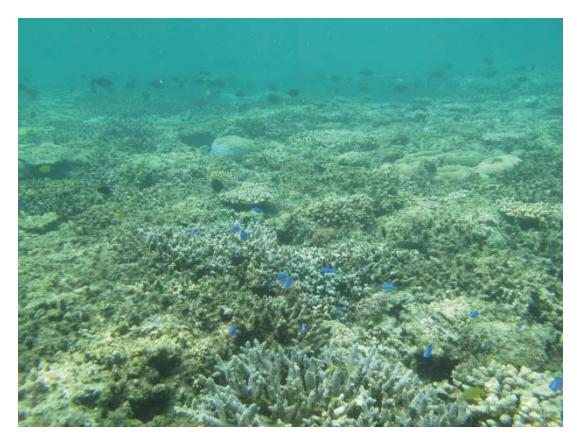

## 6WᕝᖹỈ㊰

ㄪᰝ᪥㸸ᖹᡂ ᖺ ᭶ ᪥ ࢦࣥࢧ⫱⏕ᆺ㸸Ϭ㸦ከ✀ΰᡂᆺ㸧

ࢦࣥࢧ龠ᗘ㸸㸣 ᖺࢦࣥࢧࡢ龠ᗘ㸸㸣

ࢩࣜࢻ࣑㢮ࡢ᪂つຍධ㸸 ⩌య੍

㈅㢮㣗ࢡࣥࣛ㸸ϩ

┿㸸ࢦࣥࢧࣥࣔࢥ㢮ࡀ࡞ぢࡿࢀࡽᾏᇦࡢᵝᏊ

ࡿࢀࡽከᑡぢࡀ㢮ࢦࣥࢧࣥࣔࢥࡸ㢮ࢩࣜࢻ࣑ࡣཎ♋㸸ࢺ࣓ࣥࢥ ࠋ࠸ከࡣ᪂つຍධࡢ㢮ࢩࣜࢻ࣑ࠊࡀ࠸పࡀᗘ⿕࡛ᗘ⛬ ࣥࢧࢼࡣ࡛≦⌧ࠊࡃከࡀࢦࣥࢧṚ࠸ྂࡣ㠃ᩳࡢỈ㊰ ࠶࡛ᗘ⛬ࡿࢀࡽከᑡぢࡀ㢮ࢩࣜࢻ࣑≦ᯞࡸ㢮࢟ࢻࣔࢦ ࠋࡿ࠶ࡋᑡࡀ㣗ࡿࢀࡽぢࡿࡼࢹࢺࣄࢽ࢜ࡢᑠᆺࠋࡿ

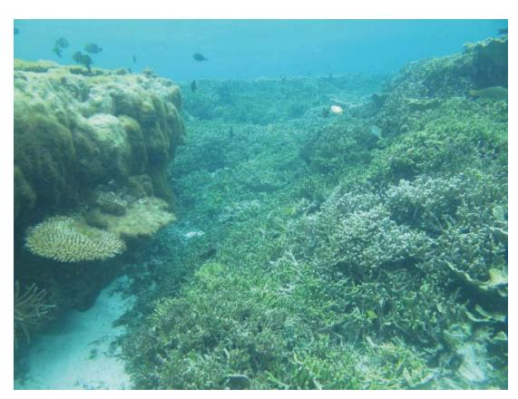

## 6WᕝᖹỈ㊰す

ㄪᰝ᪥㸸ᖹᡂ ᖺ ᭶ ᪥

ඃ༨ᆺ㸧ࢦࣥࢧࣥࣔࢥ≦ᯞᆺ㸸ϫ㸦⏕⫱ࢦࣥࢧ

ࢦࣥࢧ龠ᗘ㸸㸣 ᖺࢦࣥࢧࡢ龠ᗘ㸸㸣

ࢩࣜࢻ࣑㢮ࡢ᪂つຍධ㸸 ⩌య੍

㈅㢮㣗ࢡࣥࣛ㸸ϩ

┿㸸ࢦࣥࢧࣥࣔࢥ㢮⩌ⴠࡢᵝᏊ

ࡀࢹࢺࣄࢽ࢜ࠊࡀࡿ࠶࡛ඃໃࡀ㢮ࢦࣥࢧࣥࣔࢥ≦ᯞ㸸ࢺ࣓ࣥࢥ ࠋࡿ࠸࡚ࡅཷࢆ㣗ᐖࡀ㸣 ࡢయ᪤ࠊ࡛ែ≧ࡢ⏕Ⓨ

ᅗ ྛㄪᰝᆅⅬࡢᬒほཬࡧᴫἣ

#### 6Wᕝᖹ㹼▼ᓮ

ㄪᰝ᪥㸸ᖹᡂ ᖺ ᭶ ᪥

ඃ༨ᆺ㸧ࢦࣥࢧ࣐ࣁࢲ࢚ࣅࣘᆺ㸸ϫ㸦⏕⫱ࢦࣥࢧ

ࢦࣥࢧ龠ᗘ㸸㸣 ᖺࢦࣥࢧࡢ龠ᗘ㸸㸣

ࢩࣜࢻ࣑㢮ࡢ᪂つຍධ㸸 ⩌య੍

㈅㢮㣗ࢡࣥࣛ㸸Ϩ

┿㸸ࢦࣥࢧ࣐ࣁࢲ࢚ࣅࣘ⩌ⴠࡢᵝᏊ

ࢺ࣓ࣥࢥ㸸ࡢࢦࣥࢧ࣐ࣁࢲ࢚ࣅࣘ㧗⿕ᗘ⩌ⴠࡀᗈ࣑ࠋࡿ࠸࡚ࡗࡀ ࢲ࢚ࣅࣘࠊࢀࡽぢࡃከࡀࢦࣥࢧṚ࠸ྂࡸࡸࡢ㢮ࢩࣜࢻ ࡿࡼࢹࢺࣄࢽ࢜ࠋࡿ࠶ከᑡࡀṚஸ㒊ࡶࢦࣥࢧ࣐ࣁ

ࠋࡿࢀࡽぢ㣗ᐖ

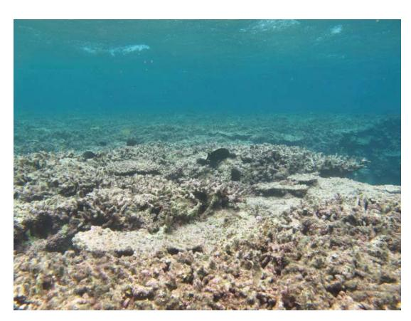

#### 6W㺖㺵㺪㺼㺰㺍㺢㺼๓

ㄪᰝ᪥㸸ᖹᡂ ᖺ ᭶ ᪥ ࢦࣥࢧ⫱⏕ᆺ㸸Ϭ㸦ከ✀ΰᡂᆺ㸧

ࢦࣥࢧ龠ᗘ㸸㸣ᮍ‶ ᖺࢦࣥࢧࡢ龠ᗘ㸸㸣ᮍ‶

ࢩࣜࢻ࣑㢮ࡢ᪂つຍධ㸸 ⩌య੍

㈅㢮㣗ࢡࣥࣛ㸸Ϩ

┿㸸ࢦࣥࢧ龠ᗘࡀప࠸♋ཎࡢᵝᏊ

ࢧ♋㐀ࠊࡃከࡀࢦࣥࢧṚ࠸࡚ྂࡅ㠃ᩳ♋ࡽཎ♋㸸ࢺ࣓ࣥࢥ ࢧṚࠋ࠸࡞ࡽࡓぢᙜࢇ࡚ࡵྵࢆ᪂つຍධࡣ㢮ࢦࣥ ࡽከᑡぢࡀ࣮ࣝࣛࢥࢺࣇࢯࡢ࡞㢮ࢱࢷ࣑࢘ୖࢦࣥ

ࠋࡿࢀ

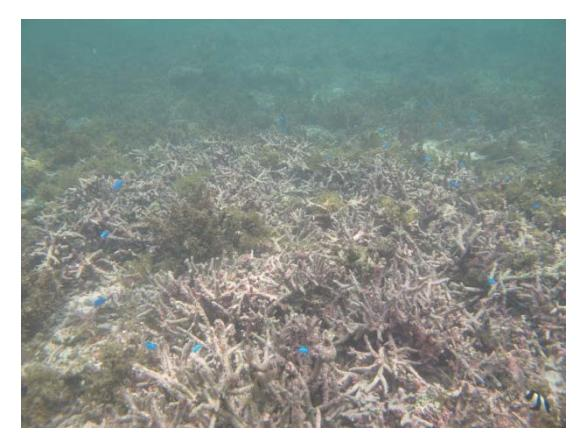

## 6Wᕝᖹ▼ᓮ

ㄪᰝ᪥㸸ᖹᡂ ᖺ ᭶ ᪥ ࢦࣥࢧ⫱⏕ᆺ㸸Ϭ㸦ከ✀ΰᡂᆺ㸧

ࢦࣥࢧ龠ᗘ㸸㸣ᮍ‶ ᖺࢦࣥࢧࡢ龠ᗘ㸸㸣ᮍ‶

ࢩࣜࢻ࣑㢮ࡢ᪂つຍධ㸸 ⩌య੍

㈅㢮㣗ࢡࣥࣛ㸸Ϩ

┿㸸Ṛࢦࣥࢧᾏ⸴㢮ࡀ⦾ⱱࡿࡍᾏᇦࡢ≦ἣ

ࡿࢀࡽぢࡎࢃࡀ㢮ࢱࢷ࣑࢘ࠋ࠸ከࡀࢦࣥࢧṚ࠸ྂ㸸ࢺ࣓ࣥࢥ ࢲࣥ࣍ࠋ࠸࡞ࡽࡓぢᙜࢇࡣ㢮ࢦࣥࢧ♋㐀ࠊ࡛ᗘ⛬

ࠋ࠸ከࡀ㢮⸴ᾏࡢ࡞㢮ࣛ࣡

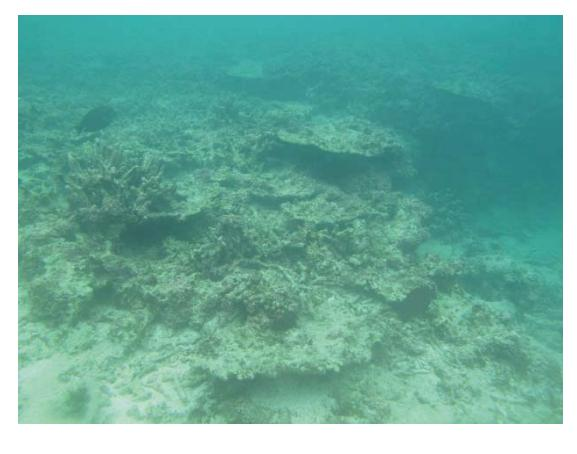

#### 6Wᕝᖹ▼ᓮ༡

ㄪᰝ᪥㸸ᖹᡂ ᖺ ᭶ ᪥ ࢦࣥࢧ⫱⏕ᆺ㸸Ϭ㸦ከ✀ΰᡂᆺ㸧

ࢦࣥࢧ龠ᗘ㸸㸣ᮍ‶

ᖺࢦࣥࢧࡢ龠ᗘ㸸㸣ᮍ‶

ࢩࣜࢻ࣑㢮ࡢ᪂つຍධ㸸 ⩌య੍

㈅㢮㣗ࢡࣥࣛ㸸Ϩ

┿㸸ࢦࣥࢧ㢮ࡃࡈࡀᑡ࠸࡞ᾏᇦࡢ≦ἣ

⛬ࡿࢀࡽぢࡎࢃࡀ࣮ࣝࣛࢥࢺࣇࢯࡸ㢮ࢩ࣓ࢡ࢟㸸ࢺ࣓ࣥࢥ

ࠋ࠸ከࡀࢦࣥࢧṚ࠸ྂࠋᗘ

ᅗ ྛㄪᰝᆅⅬࡢᬒほཬࡧᴫἣ

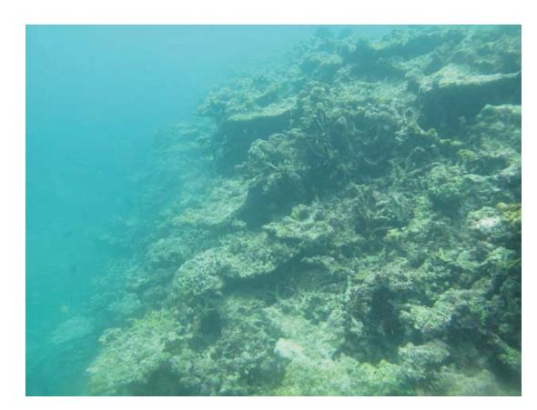

#### 6Wᗏᆅࢳ࣮ࣅἈ

ㄪᰝ᪥㸸ᖹᡂ ᖺ ᭶ ᪥ ࢦࣥࢧ⫱⏕ᆺ㸸Ϭ㸦ከ✀ΰᡂᆺ㸧

ࢦࣥࢧ龠ᗘ㸸㸣ᮍ‶

ᖺࢦࣥࢧࡢ龠ᗘ㸸㸣ᮍ‶

ࢩࣜࢻ࣑㢮ࡢ᪂つຍධ㸸 ⩌య੍

㈅㢮㣗ࢡࣥࣛ㸸Ϩ

┿㸸ࢦࣥࢧ㢮ࡢ龠ᗘࡀ㠀ᖖప࠸ᾏᇦࡢ≦ἣ

ࣥࢧ⏕ࠋ࠸ከࡀࢦࣥࢧṚ࠸࡚ྂࡅ㠃ᩳ♋ࡽཎ♋㸸ࢺ࣓ࣥࢥ

ࠋ࠸࡞ࡽࡓぢᙜࢇࡣࢦ

#### 6Wᓮᯞ‴ෆ

ㄪᰝ᪥㸸ᖹᡂ ᖺ ᭶ ᪥

ࢦࣥࢧ⫱⏕ᆺ㸸ϫ㸦࢟ࢻࣔࢦࣥࢧࢼඃ༨ᆺ㸧

ࢦࣥࢧ龠ᗘ㸸㸣 ᖺࢦࣥࢧࡢ龠ᗘ㸸㸣

ࢩࣜࢻ࣑㢮ࡢ᪂つຍධ㸸 ⩌య੍

㈅㢮㣗ࢡࣥࣛ㸸Ϩ

┿㸸࢟ࢻࣔࢦࣥࢧࢼ㢮ࡸࡸࡀከ࠸ᾏᇦࡢᵝᏊ

୰ᆺࡽᑠᆺࠋࡿ࠶࡛ඃໃࡀ㢮࢟ࢻࣔࢦࣥࢧࢼ≦ᯞ㸸ࢺ࣓ࣥࢥ ࢟ࢻࣔࢦࣥࢧࢼࠊࡾ࠶࡛ែ≧ࡢ⏕Ⓨࡀࢹࢺࣄࢽ࢜ࡢ ࡣ㢮ࢩࣜࢻ࣑ࠋࡿ࠸࡚ࡋ㣗ᐖࢆ㢮ࢦࣥࢧࢳࣂࣜࢫࡸ㢮

ࠋ࠸࡞ࡽࡓぢᙜࡃ

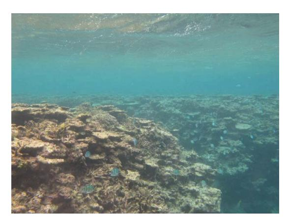

#### 6Wᓮᯞ‴ཱྀ

ㄪᰝ᪥㸸ᖹᡂ ᖺ ᭶ ᪥ ࢦࣥࢧ⫱⏕ᆺ㸸Ϭ㸦ከ✀ΰᡂᆺ㸧

ࢦࣥࢧ龠ᗘ㸸㸣ᮍ‶ ᖺࢦࣥࢧࡢ龠ᗘ㸸㸣ᮍ‶

ࢩࣜࢻ࣑㢮ࡢ᪂つຍධ㸸 ⩌య੍

㈅㢮㣗ࢡࣥࣛ㸸Ϩ

┿㸸ࢦࣥࢧ龠ᗘࡀప࠸ᾏᇦࡢ≦ἣ

࡛≦⌧ࠋ࠸ከࡀࢦࣥࢧṚ࠸࡚ྂࡅ㠃ᩳ♋ࡽཎ♋㸸ࢺ࣓ࣥࢥ ࡞㢮ࢦࣥࢧࢤࢺ࢜࢜ࠊ㢮ࢩ࣓ࢡ࢟ࡸ㢮ࢦࣥࢧ࣐ࣁࡣ ࢧࡓࡗṧࡁ⏕ࡀࢹࢺࣄࢽ࢜ࠊ࡛ᗘ⛬ࡿࢀࡽぢࡎࢃࡀ

ࠋࡿ࠸࡚㣗ࢆࢦࣥ

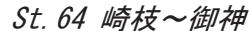

ࢦࣥࢧ龠ᗘ㸸㸣ᮍ‶ ᖺࢦࣥࢧࡢ龠ᗘ㸸㸣ᮍ‶

ࢩࣜࢻ࣑㢮ࡢ᪂つຍධ㸸 ⩌య੍

㈅㢮㣗ࢡࣥࣛ㸸Ϩ

┿㸸ࢦࣥࢧ龠ᗘࡀప࠸ᾏᇦࡢ≦ἣ

ࣖࢼࣁࠊࡃከࡀࢦࣥࢧṚ࠸࡚ྂࡅ㠃ᩳ♋ࡽཎ♋㸸ࢺ࣓ࣥࢥ ࡞㢮࢟ࢻࣔࢦࣥࢧࢼࠊ㢮ࢩ࣓ࢡ࢟ࡸ㢮ࢦࣥࢧࢧ ࢩࣜࢻ࣑ࡣሙᡤ࠸ὸࠋࡿ࠶࡛ᗘ⛬ࡿࢀࡽぢࡎࢃࡀ ࡎࢃࡀಶయࢹࢺࣄࢽ࢜ࡢᑠᆺࠋ࠸ከࡸࡸࡀ᪂つຍධࡢ㢮

ࠋࡿ࠸࡚ࡏ14ࠊࡀࡿࢀࡽぢ

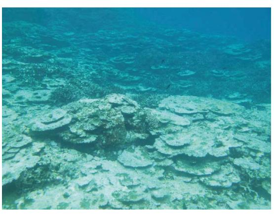

ᅗ ྛㄪᰝᆅⅬࡢᬒほཬࡧᴫἣ

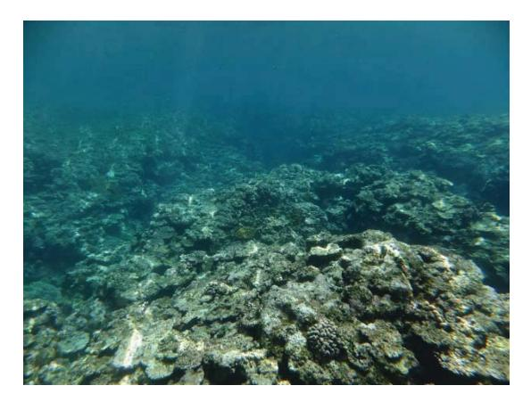

#### 6Wᚚ⚄ᓮ

ㄪᰝ᪥㸸ᖹᡂ ᖺ ᭶ ᪥ ࢦࣥࢧ⫱⏕ᆺ㸸Ϭ㸦ከ✀ΰᡂᆺ㸧

ࢦࣥࢧ龠ᗘ㸸㸣ᮍ‶

ᖺࢦࣥࢧࡢ龠ᗘ㸸㸣ᮍ‶

ࢩࣜࢻ࣑㢮ࡢ᪂つຍධ㸸 ⩌య੍

㈅㢮㣗ࢡࣥࣛ㸸ϩ

┿㸸ࢦࣥࢧ㢮ࡢᑡ࠸࡞♋ཎࡢᵝᏊ

㢮ࢩ࣓ࢡ࢟ࠊ࣮ࣝࣛࢥࢺࣇࢯࡸ㢮ࢦࣥࢧࢧࣖࢼࣁ㸸ࢺ࣓ࣥࢥ ࣄࢽ࢜ࠋ࠸పࡣᗘ⿕ࢦࣥࢧࠊ࡛ᗘ⛬ࡿࢀࡽከᑡぢࡀ࡞

ࠋ࠸ከࡀ㣗ࢹࢺ

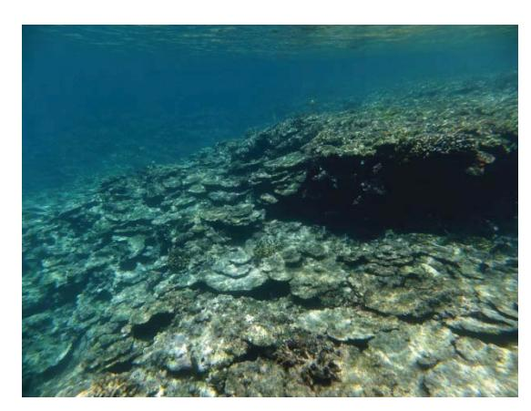

### 6Wᚚ⚄㹼ᒇⰋ㒊

ㄪᰝ᪥㸸ᖹᡂ ᖺ ᭶ ᪥ ࢦࣥࢧ⫱⏕ᆺ㸸Ϭ㸦ከ✀ΰᡂᆺ㸧

ࢦࣥࢧ龠ᗘ㸸㸣ᮍ‶ ᖺࢦࣥࢧࡢ龠ᗘ㸸㸣ᮍ‶

ࢩࣜࢻ࣑㢮ࡢ᪂つຍධ㸸 ⩌య੍

㈅㢮㣗ࢡࣥࣛ㸸Ϩ

┿㸸ࢦࣥࢧ㢮ࡢᑡ࠸࡞♋ཎࡢᵝᏊ

ࣜࢻ࣑≦ᯞࡣ㠃ᩳ♋ࠊ࡞㢮ࢩ࣓ࢡ࢟ࡣཎ♋㸸ࢺ࣓ࣥࢥ ࣄࢽ࢜ࠋࡿࢀࡽぢࡋᑡࡀ࡞㢮ࢦࣥࢧࢧࣖࢼࣁࡸ㢮ࢩ

ࠋ࠸ከࡀ㣗ࡢࢹࢺ

#### 6WᒇⰋ㒊ᓮ

ㄪᰝ᪥㸸ᖹᡂ ᖺ ᭶ ᪥ ࢦࣥࢧ⫱⏕ᆺ㸸Ϭ㸦ከ✀ΰᡂᆺ㸧

ࢦࣥࢧ龠ᗘ㸸㸣ᮍ‶ ᖺࢦࣥࢧࡢ龠ᗘ㸸㸣ᮍ‶

ࢩࣜࢻ࣑㢮ࡢ᪂つຍධ㸸 ⩌య੍

㈅㢮㣗ࢡࣥࣛ㸸ϩ

┿㸸ࢦࣥࢧ㢮ࡀᑡ࠸࡞♋ཎࡢ≦ἣ

ࡽከᑡぢࡀ࡞࣮ࣝࣛࢥࢺࣇࢯࠊ㢮ࢦࣥࢧࢧࣖࢼࣁ㸸ࢺ࣓ࣥࢥ ࡓぢᙜࡣ㢮ࢩࣜࢻ࣑ࠋ࠸పࡣᗘ⿕ࢦࣥࢧࠊ࡛ᗘ⛬ࡿࢀ

ࠋ࠸ከࡀ㣗ࡢࢹࢺࣄࢽ࢜ࠋ࠸࡞ࡽ

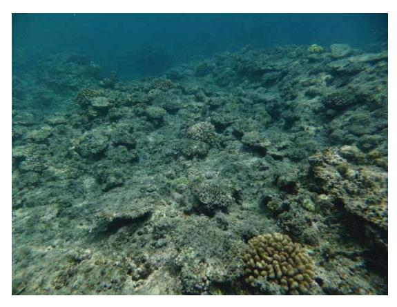

#### 6WᒇⰋ㒊ᓮ༡

ㄪᰝ᪥㸸ᖹᡂ ᖺ ᭶ ᪥ ࢦࣥࢧ⫱⏕ᆺ㸸Ϭ㸦ከ✀ΰᡂᆺ㸧

ࢦࣥࢧ龠ᗘ㸸㸣ᮍ‶ ᖺࢦࣥࢧࡢ龠ᗘ㸸㸣

ࢩࣜࢻ࣑㢮ࡢ᪂つຍධ㸸 ⩌య੍

㈅㢮㣗ࢡࣥࣛ㸸ϩ

┿㸸ࢦࣥࢧࢧࣖࢼࣁ㢮ࡀⅬᅾࢺࢵࣛࣇࡿࡍ㒊

ࡿࢀࡽከᑡぢࡀ࣮ࣝࣛࢥࢺࣇࢯࠊ㢮ࢦࣥࢧࢧࣖࢼࣁ㸸ࢺ࣓ࣥࢥ ࡞ࡽࡓぢᙜࡣ㢮ࢩࣜࢻ࣑ࠋ࠸పࡣᗘ⿕ࢦࣥࢧࠊ࡛ᗘ⛬ 韭ࡀࢹࢺࣄࢽ࢜ࡢᆺࠊࡃከࡀ㣗ࡢࢹࢺࣄࢽ࢜ࠋ࠸

ࠋࡿ࠸࡚ࡁ࡚ฟ

ᅗ ྛㄪᰝᆅⅬࡢᬒほཬࡧᴫἣ

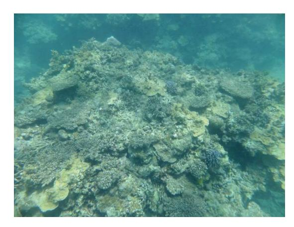

#### 6WᒇⰋ㒊㹼ᓮ

ㄪᰝ᪥㸸ᖹᡂ ᖺ ᭶ ᪥ ࢦࣥࢧ⫱⏕ᆺ㸸Ϭ㸦ከ✀ΰᡂᆺ㸧

ࢦࣥࢧ龠ᗘ㸸㸣 ᖺࢦࣥࢧࡢ龠ᗘ㸸㸣

ࢩࣜࢻ࣑㢮ࡢ᪂つຍධ㸸 ⩌య੍

㈅㢮㣗ࢡࣥࣛ㸸ϩ

┿㸸ࢦࣥࢧ࣐ࣁ㢮ࡀ࡞ぢࡿࢀࡽᾏᇦࡢᵝᏊ

ከࡿࡍయࢆ㢮ࢩࣜࢻ࣑≦ᯞࢦࣥࢧ࣐ࣁ࢜ࣛࣃ㸸ࢺ࣓ࣥࢥ ✀ΰᡂࡾࡼࢹࢺࣄࢽ࢜ࠋ༟≧ࢩࣜࢻ࣑㢮ࡰࡣṚ⁛ ࢫ࢜ࣆࣝࢸࠋࡘ❧┠ࡸࡸࡀ㣗ࡢࢹࢺࣄࢽ࢜ࠋࡿ࠸࡚ࡋ

ࠋࡿ࠸࡚ࡋ⏕Ⓨࢁࡇࢁࡇࡀ

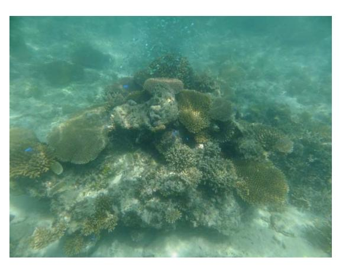

## 6WྡⶶಖㆤỈ㠃

ㄪᰝ᪥㸸ᖹᡂ ᖺ ᭶ ᪥

ඃ༨ᆺ㸧ࢩࣜࢻ࣑≦ᆺ㸸Ϫ㸦༟⏕⫱ࢦࣥࢧ

ࢦࣥࢧ龠ᗘ 㸣

ᖺࢦࣥࢧࡢ龠ᗘ㸸㸣

ࢩࣜࢻ࣑㢮ࡢ᪂つຍධ㸸 ⩌య੍

㈅㢮㣗ࢡࣥࣛ㸸ϩ

ἣ≧ࡢᾏᇦࡿࡍ⫱⏕Ⰻዲࡀ㢮ࢩࣜࢻ࣑㸸┿

ࠊࡃከࡀ㢮ࢩࣜࢻ࣑≦ࢫ࣮࣎ࣥࣜࢥ࣭≦༟ࡢ㸸ᑠ㹼୰ᆺࢺ࣓ࣥࢥ ࣥࢧ࣐ࣁ≦ሢࠊ㢮࢟ࢻࣔࢦࣥࢧࢼࠊ㢮ࢩࣜࢻ࣑≦ᯞ ࠊࢀࡽぢࡋᑡࡀࢦࣥࢧṚ࠸ྂࡸࡸࠋࡿࢀࡽぢࡶ࡞㢮ࢦ ࠋࡿ࠶ࡀ࣒࣮ࣟࢻࣥࢩࢺ࣡࣍㢮ࢩࣜࢻ࣑≦༟

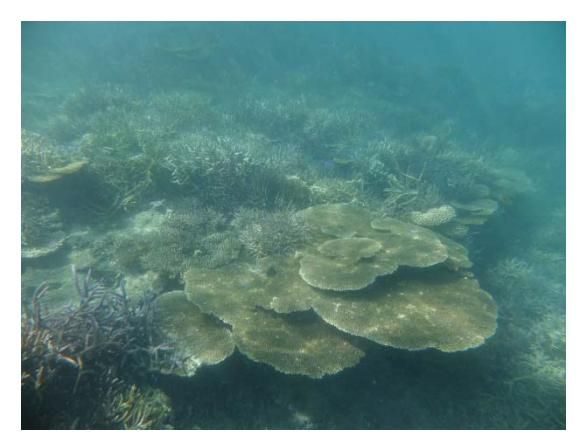

## 6Wᐩᓮᑠᓥ๓

ㄪᰝ᪥㸸ᖹᡂ ᖺ ᭶ ᪥

ࢦࣥࢧ⫱⏕ᆺ㸸ϩ㸦ᯞ≧༟≧ࢩࣜࢻ࣑ඃ༨ᆺ㸧

ࢦࣥࢧ龠ᗘ㸸㸣 ᖺࢦࣥࢧࡢ龠ᗘ㸸㸣

ࢩࣜࢻ࣑㢮ࡢ᪂つຍධ㸸 ⩌య੍

㈅㢮㣗ࢡࣥࣛ㸸ϩ

┿㸸ࢩࣜࢻ࣑㢮ࢆ୰ᚰ龠ᗘࡀ㧗࠸ᾏᇦࡢ≦ἣ

୰ࡀ㢮ࢩࣜࢻ࣑≦༟ࡢᆺࡸࡸࠊ㢮ࢩࣜࢻ࣑≦ᯞ㸸ࢺ࣓ࣥࢥ ࡽぢࡿࡼࢹࢺࣄࢽ࢜ࡢᑠᆺࠋ࠸㧗ࡀᗘ⿕ࢦࣥࢧ࡛ᚰ ࠋࡿࢀࡉほᐹࡋᑡࡀࢫ࢜ࣆࣝࢸࠋࡿ࠶ࡋᑡࡀ㣗ࡿࢀ

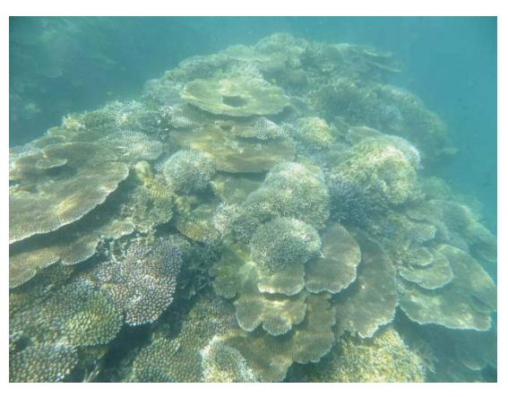

#### 6Wほ㡢ᓮ

ㄪᰝ᪥㸸ᖹᡂ ᖺ ᭶ ᪥

ඃ༨ᆺ㸧ࢩࣜࢻ࣑≦ᆺ㸸Ϫ㸦༟⏕⫱ࢦࣥࢧ

ࢦࣥࢧ龠ᗘ㸸㸣 ᖺࢦࣥࢧࡢ龠ᗘ㸸㸣

ࢩࣜࢻ࣑㢮ࡢ᪂つຍධ㸸 ⩌య੍

㈅㢮㣗ࢡࣥࣛ㸸ϩ

┿㸸༟≧ࢩࣜࢻ࣑㢮ࢆ୰ᚰ龠ᗘࡀ㧗࠸ᵝᏊ

ࠋ࠸㧗ࡀᗘ⿕ࢦࣥࢧ୰ᚰࢆ㢮ࢩࣜࢻ࣑≦༟ࡢ㸸ᑠᆺࢺ࣓ࣥࢥ ࢩࣜࢻ࣑≦༟ࡢᆺࡸࡸࠊࡀࡿࡕⴠࡀᗘ⿕ࡸࡸࡣሙ῝ 㢮ࡀከࡃぢࢩࣜࢻ࣑ࠋࡿࢀࡽ㢮ࡢ᪂つຍධࡸࡸࡶከ

ࠋࡿࢀࡽぢࡋᑡࡀ࣒࣮ࣟࢻࣥࢩࢺ࣡࣍ࠋ࠸

ᅗ ྛㄪᰝᆅⅬࡢᬒほཬࡧᴫἣ

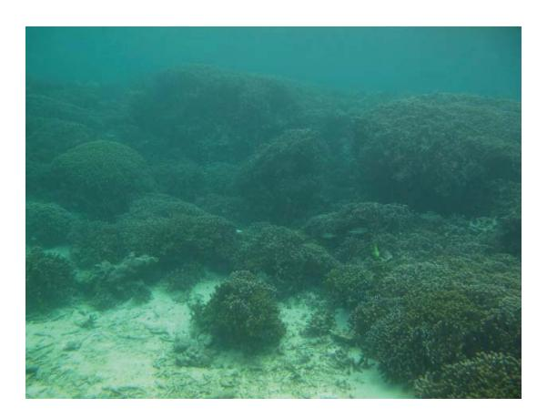

#### 6W┿ᰤ㔛ᾏᓊ๓

ㄪᰝ᪥㸸ᖹᡂ ᖺ ᭶ ᪥

ඃ༨ᆺ㸧ࢦࣥࢧ࣐ࣁࢲ࢚ࣅࣘᆺ㸸ϫ㸦⏕⫱ࢦࣥࢧ

ࢦࣥࢧ龠ᗘ㸸㸣 ᖺࢦࣥࢧࡢ龠ᗘ㸸㸣

ࢩࣜࢻ࣑㢮ࡢ᪂つຍධ㸸 ⩌య੍

㈅㢮㣗ࢡࣥࣛ㸸Ϩ

┿㸸ࢦࣥࢧ࣐ࣁࢲ࢚ࣅࣘ⩌ⴠࡀᗈࡿࡀᾏᇦࡢ≦ἣ

ࢻ࣑≦ᯞࠋࡿࡀᗈࡀⴠ⩌ᗘ⿕㧗ࡢࢦࣥࢧ࣐ࣁࢲ࢚ࣅࣘ㸸ࢺ࣓ࣥࢥ ࣥࢧ࣐ࣁࢲ࢚ࣅࣘࠋࡿࢀࡽぢࡀⴠ⩌࡞ᑠつᶍࡢ㢮ࢩࣜ

ࠋࡿ࠸࡚ࡋ⏕ᐦࡀ㢮ࢡࣕࢳࣥࢠࢯ㛫ᯞࡢࢦ

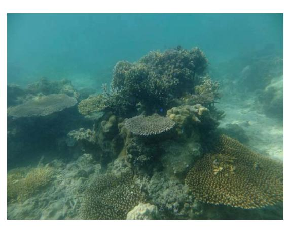

#### 6W㉥ᓮ

ㄪᰝ᪥㸸ᖹᡂ ᖺ ᭶ ᪥

ඃ༨ᆺ㸧ࢩࣜࢻ࣑≦ᆺ㸸Ϫ㸦༟⏕⫱ࢦࣥࢧ

ࢦࣥࢧ龠ᗘ㸸㸣 ᖺࢦࣥࢧࡢ龠ᗘ㸸㸣

ࢩࣜࢻ࣑㢮ࡢ᪂つຍධ㸸 ⩌య੍

㈅㢮㣗ࢡࣥࣛ㸸Ϩ

ᵝᏊࡢᾏᇦࡿࡍ⫱⏕ࡀ࡞㢮ࢩࣜࢻ࣑≦㸸༟┿

ࡸ୰ᚰࢆ㢮ࢩࣜࢻ࣑≦ࢫ࣮࣎ࣥࣜࢥ࣭≦༟ࡢ㸸ᑠᆺࢺ࣓ࣥࢥ ࢟ࢻࣔࢦࣥࢧࢼࠊ㢮ࢩ࣓ࢡ࢟ࠋ࠸㧗ࡀᗘ⿕ࢦࣥࢧࡸ

ࠋࡿࢀࡽぢࡎࢃࡀࢹࢺࣄࢽ࢜ࠋ࠸ከࡶ㢮

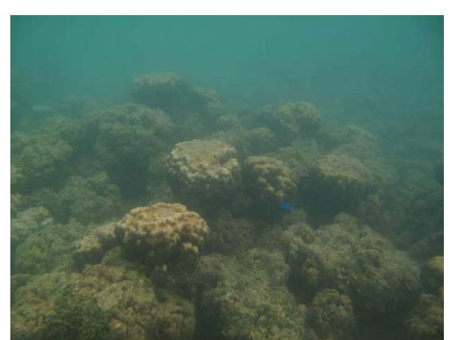

#### 6WྡⶶᕝἙཱྀ

ㄪᰝ᪥㸸ᖹᡂ ᖺ ᭶ ᪥

ඃ༨ᆺ㸧ࢦࣥࢧ࣐ࣁ≦ᆺ㸸ϫ㸦ሢ⏕⫱ࢦࣥࢧ

ࢦࣥࢧ龠ᗘ㸸㸣 ᖺࢦࣥࢧࡢ龠ᗘ㸸㸣

ࢩࣜࢻ࣑㢮ࡢ᪂つຍධ㸸 ⩌య੍

㈅㢮㣗ࢡࣥࣛ㸸Ϩ

┿㸸ᑠᆺࢦࣥࢧ࣐ࣁࡢ㢮ࡀⅬᅾࡿࡍᾏᇦࡢ≦ἣ

ࢥࡣῡࡢࡳ῝ࠊࡃከࡸࡸࡀ㢮ࢦࣥࢧ࣐ࣁ≦ሢࡢ㸸ᑠᆺࢺ࣓ࣥࢥ ࡋᑡࡀ㢮ࢦࣥࢧࣟࢥࢩࡸ㢮ࢩࣜࢻ࣑ࡢ≦ࢫ࣮࣎ࣥࣜ ΰࢧࢢࣥࢸ࣎ࢧࠋࡿࡊ㢮ࣛ࣡ࢲࣥ࣍ࠊ㢮ࡀ࡞ከࠊࡃᑠ

ࠋࡿ࠶ࡀሙ࣐ࣔ࡞つᶍ

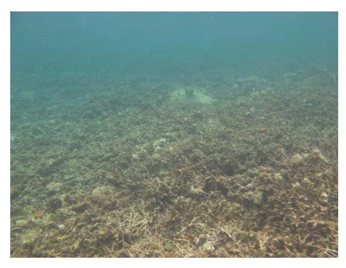

#### 6W᫂▼す

ㄪᰝ᪥㸸ᖹᡂ ᖺ ᭶ ᪥ ࢦࣥࢧ⫱⏕ᆺ㸸Ϭ㸦ከ✀ΰᡂᆺ㸧

ࢦࣥࢧ龠ᗘ㸸㸣ᮍ‶

ᖺࢦࣥࢧࡢ龠ᗘ㸸㸣ᮍ‶

ࢩࣜࢻ࣑㢮ࡢ᪂つຍධ㸸 ⩌య੍

㈅㢮㣗ࢡࣥࣛ㸸Ϩ

┿㸸ࢦࣥࢧ㢮ࡃࡈࡀᑡ࠸࡞ᾏᇦࡢ≦ἣ

ࠊࡎࢀࡽぢࢇࡣ㢮ࢦࣥࢧࡾࡼ㣗ᐖࡢࢹࢺࣄࢽ࢜㸸ࢺ࣓ࣥࢥ ࠋࡿṧࡀ࡞࣮ࣝࣛࢥࢺࣇࢯࠊ㢮ࢩࣛࣅࢧࢡࡎࢃ ࠋࡿ࠸࡚ࡋⱱ⦾ࡀ࡞㢮࣡ࢳ࣑࢘࢘♟ࢦࣥࢧṚ

ᅗ ྛㄪᰝᆅⅬࡢᬒほཬࡧᴫἣ

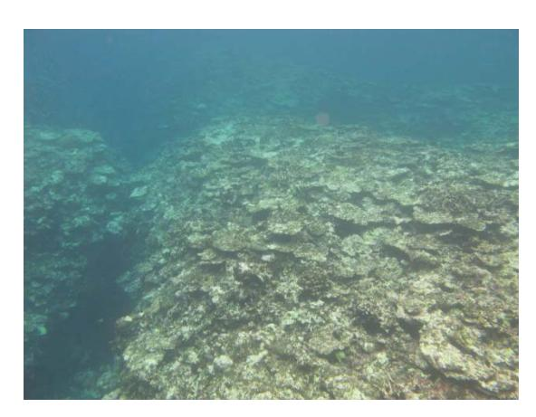

#### 6Wఀཎ㛫‴ཱྀ

ㄪᰝ᪥㸸ᖹᡂ ᖺ ᭶ ᪥ ࢦࣥࢧ⫱⏕ᆺ㸸Ϭ㸦ከ✀ΰᡂᆺ㸧

ࢦࣥࢧ龠ᗘ㸸㸣ᮍ‶ ᖺࢦࣥࢧࡢ龠ᗘ㸸㸣ᮍ‶ ࢩࣜࢻ࣑㢮ࡢ᪂つຍධ㸸 ⩌య੍

㈅㢮㣗ࢡࣥࣛ㸸ϩ

┿㸸ࢦࣥࢧ㢮ࢇࡀぢ࠸࡞ࢀࡽᾏᇦࡢᵝᏊ

ࡣ㢮ࢦࣥࢧࡶ㠃ᩳ♋ࠊཎ♋ࡾࡼ㣗ᐖࡢࢹࢺࣄࢽ࢜㸸ࢺ࣓ࣥࢥ ࣇࢯࠊ㢮ࢦࣥࢧࢧࣖࢼࣁࡎࢃࠊࡎࢀࡽࡳࢇ ࡵྵࢆ᪂つຍධࡣ㢮ࢩࣜࢻ࣑ࠋࡿṧࡀ࡞࣮ࣝࣛࢥࢺ

ࠋ࠸࡞ࡽࡓぢᙜ࡚

ᅗ ྛㄪᰝᆅⅬࡢᬒほཬࡧᴫἣ

## ᅗ㸰 ྛㄪᰝᆅⅬࡢᬒほཬࡧᴫἣ

## 㸦▼す♋†ཬࡧす⾲ᓥ࿘㎶ᾏᇦ㸧

#### 䈜䝃䞁䝂䛾⏕⫱ᆺ䛾㢮ᆺ䠖㻌

- 䊠䠖ᯞ≧䝭䝗䝸䜲䝅ඃ༨ᆺ䠄ᯞ≧䝭䝗䝸䜲䝅㢮䛾ྜ䛜 㻢㻜䠂௨ୖ䠅㻌
- 䊡䠖ᯞ≧䞉༟≧䝭䝗䝸䜲䝅ΰᡂᆺ㻌
- 䊢䠖༟≧䝭䝗䝸䜲䝅ඃ༨ᆺ䠄༟≧䝭䝗䝸䜲䝅㢮䛾ྜ䛜 㻢㻜䠂௨ୖ䠅㻌 㻌
- 䊣䠖≉ᐃ㢮ඃ༨ᆺ䠄䝭䝗䝸䜲䝅㢮௨እ䛾≉ᐃ䛾䜲䝅䝃䞁䝂㢮䛜ඃ༨䛩䜛䠅㻌
- 䊤䠖ከ✀ΰᡂᆺ䠄ከ✀䛾䝃䞁䝂䛜ΰᅾ䛧䚸≉ᐃ䛾✀䛜ඃ༨䛧䛺䛔䠅㻌
- 䊥䠖䝋䝣䝖䝁䞊䝷䝹ඃ༨ᆺ䠄䝋䝣䝖䝁䞊䝷䝹䛜᭱䜒ඃ༨䛩䜛䠅㻌

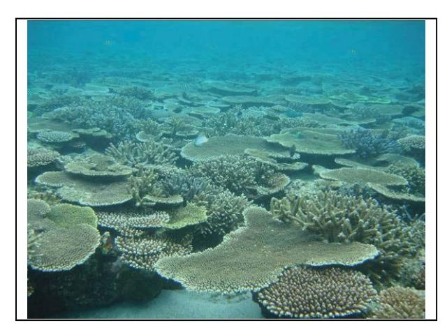

## 6Wࢩࣅࣛ࢘༡♋⦕

ㄪᰝ᪥㸸ᖹᡂ ᖺ ᭶ ᪥

ΰᡂᆺ㸧ࢩࣜࢻ࣑≦༟࣭≦ᯞᆺ㸸ϩ㸦⏕⫱ࢦࣥࢧ

ࢦࣥࢧ龠ᗘ㸸㸣 ᖺࢦࣥࢧࡢ龠ᗘ㸸㸣

ࢩࣜࢻ࣑㢮ࡢ᪂つຍධ㸸 ⩌య੍

㈅㢮㣗ࢡࣥࣛ㸸ϩ

┿㸸ㄪᰝᆅⅬࡢᾏ୰ᬒほ

ࢺ࣓ࣥࢥ㸸ྎ㢼◚ᦆࠊࡾ࠶ᾏ⸴ᑡࠊ࠸࡞ㄪᰝ⠊ᅖෆࡢ ♋ཎୖࡢ⩌యࡀ⏕㛗ࡋᖜ龠ᗘࡀୖ᪼㸦⠊

ᅖእࡣ⩌యࡽࡤࡲ㸧

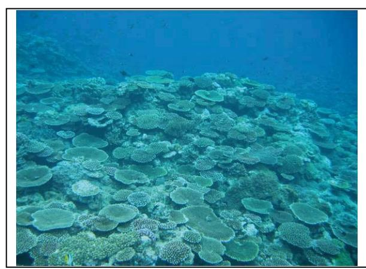

#### ⦖♋ᮾࢩࣅࣛ࢘W6

ㄪᰝ᪥㸸ᖹᡂ ᖺ ᭶ ᪥ ࢦࣥࢧ⫱⏕ᆺ㸸Ϭ㸦ከ✀ΰᡂᆺ㸧

ࢦࣥࢧ龠ᗘ㸸㸣 ᖺࢦࣥࢧࡢ龠ᗘ㸸㸣

ࢩࣜࢻ࣑㢮ࡢ᪂つຍධ㸸 ⩌య੍

㈅㢮㣗ࢡࣥࣛ㸸Ϩ ┿㸸ㄪᰝᆅⅬࡢᾏ୰ᬒほ

ࣝࢡ㸧ࢡࣔࣃࢵࣛ㸦⸴ࢀὶࠊ࠸࡞ᑡ⸴㸸ᾏࢺ࣓ࣥࢥ

㢮ࣅ࢚࣐

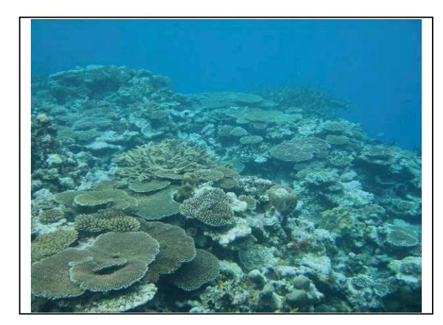

#### ⦖♋ᮾࢩࣅࣛ࢘W6

ㄪᰝ᪥㸸ᖹᡂ ᖺ ᭶ ᪥ ࢦࣥࢧ⫱⏕ᆺ㸸Ϭ㸦ከ✀ΰᡂᆺ㸧

ࢦࣥࢧ龠ᗘ㸸㸣 ᖺࢦࣥࢧࡢ龠ᗘ㸸㸣

ࢩࣜࢻ࣑㢮ࡢ᪂つຍධ㸸 ⩌య੍

㈅㢮㣗ࢡࣥࣛ㸸ϩ ┿㸸ㄪᰝᆅⅬࡢᾏ୰ᬒほ

ࢺ࣓ࣥࢥ㸸ྎ㢼◚ᦆࠊࡾ࠶ᾏ⸴ᑡࠊ࠸࡞ᑠᆺࣜࢻ࣑

యቑຍ⩌ࢩ

#### 6W㯮ᓥἈ㞳♋

ㄪᰝ᪥㸸ᖹᡂ ᖺ ᭶ ᪥

ΰᡂᆺ㸧ࢩࣜࢻ࣑≦༟࣭≦ᯞᆺ㸸ϩ㸦⏕⫱ࢦࣥࢧ

ࢦࣥࢧ龠ᗘ㸸㸣 ᖺࢦࣥࢧࡢ龠ᗘ㸸㸣

ࢩࣜࢻ࣑㢮ࡢ᪂つຍධ㸸 ⩌య੍

㈅㢮㣗ࢡࣥࣛ㸸ϩ

┿㸸ㄪᰝᆅⅬࡢᾏ୰ᬒほ

ࢺ࣓ࣥࢥ㸸ྎ㢼◚ᦆࠊࡾ࠶ᾏ⸴ᑡ࠸࡞

ᅗ ྛㄪᰝᆅⅬࡢᾏ୰ᬒほཬࡧᴫἣ

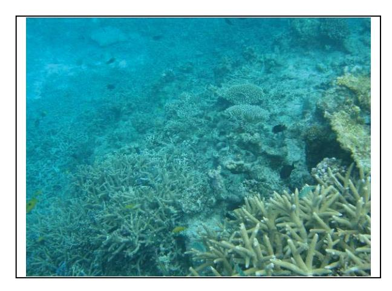

## 6W㯮ᓥἈ㞳♋

ㄪᰝ᪥㸸ᖹᡂ ᖺ ᭶ ᪥ ࢦࣥࢧ⫱⏕ᆺ㸸Ϭ㸦ከ✀ΰᡂᆺ㸧

ࢦࣥࢧ龠ᗘ㸸㸣 ᖺࢦࣥࢧࡢ龠ᗘ㸸㸣

ࢩࣜࢻ࣑㢮ࡢ᪂つຍධ㸸 ⩌య੍

㈅㢮㣗ࢡࣥࣛ㸸ϩ

┿㸸ㄪᰝᆅⅬࡢᾏ୰ᬒほ ࢺ࣓ࣥࢥ㸸ྎ㢼◚ᦆࠊࡾ࠶ᾏ⸴ᑡ࠸࡞

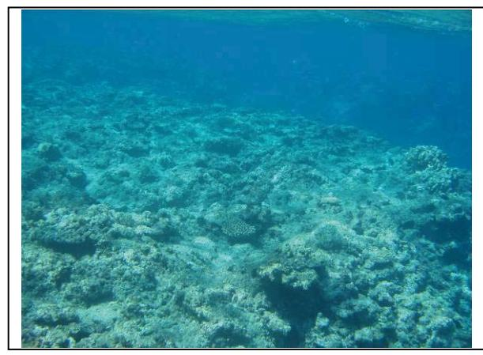

#### 6W㯮ᓥすᓊ♋⦕

ㄪᰝ᪥㸸ᖹᡂ ᖺ ᭶ ᪥ ࢦࣥࢧ⫱⏕ᆺ㸸Ϭ㸦ከ✀ΰᡂᆺ㸧

ࢦࣥࢧ龠ᗘ㸸㸣 ᖺࢦࣥࢧࡢ龠ᗘ㸸㸣

ࢩࣜࢻ࣑㢮ࡢ᪂つຍධ㸸 ⩌య੍

㈅㢮㣗ࢡࣥࣛ㸸ϩ ┿㸸ㄪᰝᆅⅬࡢᾏ୰ᬒほ ࠸࡞ᑡ⸴㸸ᾏࢺ࣓ࣥࢥ

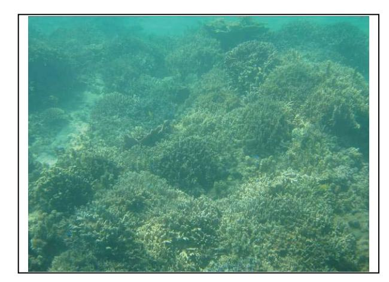

#### 6W㯮ᓥすᓊ♋ụෆ

ㄪᰝ᪥㸸ᖹᡂ ᖺ ᭶ ᪥ ࢦࣥࢧ⫱⏕ᆺ㸸Ϭ㸦ከ✀ΰᡂᆺ㸧

ࢦࣥࢧ龠ᗘ㸸㸣 ᖺࢦࣥࢧࡢ龠ᗘ㸸㸣

ࢩࣜࢻ࣑㢮ࡢ᪂つຍධ㸸 ⩌య੍

㈅㢮㣗ࢡࣥࣛ㸸ϩ ┿㸸ㄪᰝᆅⅬࡢᾏ୰ᬒほ ࠸ከ⸴㸸ᾏࢺ࣓ࣥࢥ

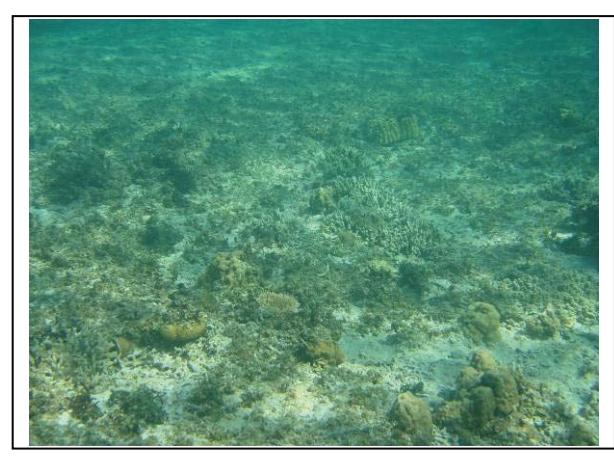

#### 6W㯮ᓥ༡すᓊ♋ụෆ

ㄪᰝ᪥㸸ᖹᡂ ᖺ ᭶ ᪥ ࢦࣥࢧ⫱⏕ᆺ㸸Ϭ㸦ከ✀ΰᡂᆺ㸧

ࢦࣥࢧ龠ᗘ㸸㸣

ᖺࢦࣥࢧࡢ龠ᗘ㸸㸣ᮍ‶

ࢩࣜࢻ࣑㢮ࡢ᪂つຍධ㸸 ⩌య੍

㈅㢮㣗ࢡࣥࣛ㸸ϩ

┿㸸ㄪᰝᆅⅬࡢᾏ୰ᬒほ ࠸ከ⸴㸸ᾏࢺ࣓ࣥࢥ

ᅗ ྛㄪᰝᆅⅬࡢᾏ୰ᬒほཬࡧᴫἣ

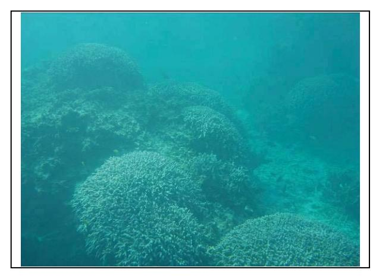

## 6W㯮ᓥ༡ᓊ♋ụෆ

ㄪᰝ᪥㸸ᖹᡂ ᖺ ᭶ ᪥

ඃ༨ᆺ㸧ࢦࣥࢧࣥࣔࢥ≦ᯞᆺ㸸ϫ㸦⏕⫱ࢦࣥࢧ

ࢦࣥࢧ龠ᗘ㸸㸣 ᖺࢦࣥࢧࡢ龠ᗘ㸸㸣

ࢩࣜࢻ࣑㢮ࡢ᪂つຍධ㸸 ⩌య੍

㈅㢮㣗ࢡࣥࣛ㸸ϩ ┿㸸ㄪᰝᆅⅬࡢᾏ୰ᬒほ ࡳ୪⸴㸸ᾏࢺ࣓ࣥࢥ

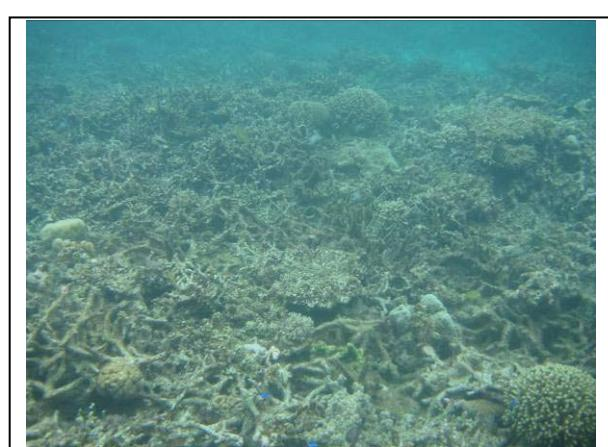

#### 6W㯮ᓥ༡ᮾᓊ♋ụෆ

ㄪᰝ᪥㸸ᖹᡂ ᖺ ᭶ ᪥

ඃ༨ᆺ㸧ࢦࣥࢧࣥࣔࢥ≦ᯞᆺ㸸ϫ㸦⏕⫱ࢦࣥࢧ

ࢦࣥࢧ龠ᗘ㸸㸣 ᖺࢦࣥࢧࡢ龠ᗘ㸸㸣

ࢩࣜࢻ࣑㢮ࡢ᪂つຍධ㸸 ⩌య੍

㈅㢮㣗ࢡࣥࣛ㸸ϩ ┿㸸ㄪᰝᆅⅬࡢᾏ୰ᬒほ ࢺ࣓ࣥࢥ㸸ᾏ⸴ከ࠸㸦⸛⸴ከ࠸㸧

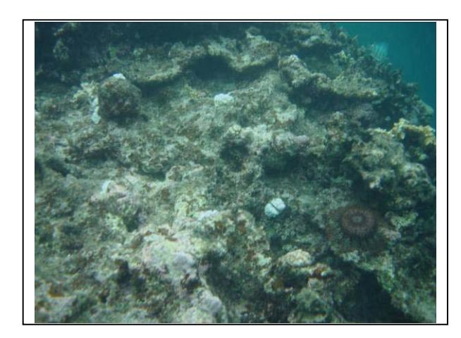

#### 6W㯮ᓥᮾᓊ♋ụෆ

ㄪᰝ᪥㸸ᖹᡂ ᖺ ᭶ ᪥ ࢦࣥࢧ⫱⏕ᆺ㸸Ϭ㸦ከ✀ΰᡂᆺ㸧

ࢦࣥࢧ龠ᗘ㸸㸣ᮍ‶ ᖺࢦࣥࢧࡢ龠ᗘ㸸㸣ᮍ‶

ࢩࣜࢻ࣑㢮ࡢ᪂つຍධ㸸 ⩌య੍

㈅㢮㣗ࢡࣥࣛ㸸ϩ ┿㸸ㄪᰝᆅⅬࡢᾏ୰ᬒほ

ࢺ࣓ࣥࢥ㸸ྎ㢼◚ᦆࠊࡾ࠶ᾏ⸴ᑡࠊ࠸࡞⃮ࡾᙉ࠸

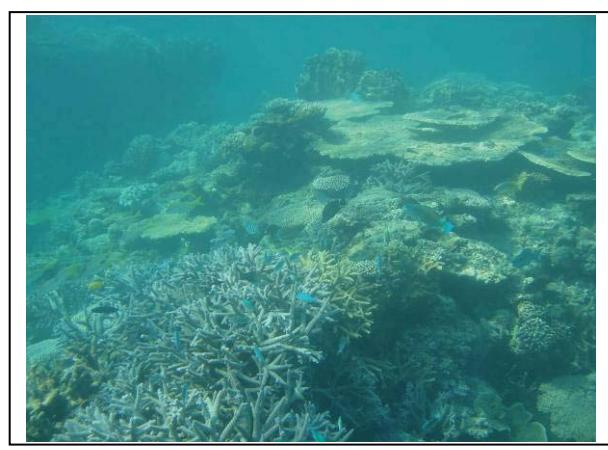

#### 6W᪂ᇛᓥୖᆅᓊ㞳♋

ㄪᰝ᪥㸸ᖹᡂ ᖺ ᭶ ᪥ ࢦࣥࢧ⫱⏕ᆺ㸸Ϭ㸦ከ✀ΰᡂᆺ㸧

ࢦࣥࢧ龠ᗘ㸸㸣 ᖺࢦࣥࢧࡢ龠ᗘ㸸㸣

ࢩࣜࢻ࣑㢮ࡢ᪂つຍධ㸸 ⩌య੍

㈅㢮㣗ࢡࣥࣛ㸸ϩ

┿㸸ㄪᰝᆅⅬࡢᾏ୰ᬒほ ࠸࡞ᑡ⸴㸸ᾏࢺ࣓ࣥࢥ

ᅗ ྛㄪᰝᆅⅬࡢᾏ୰ᬒほཬࡧᴫἣ

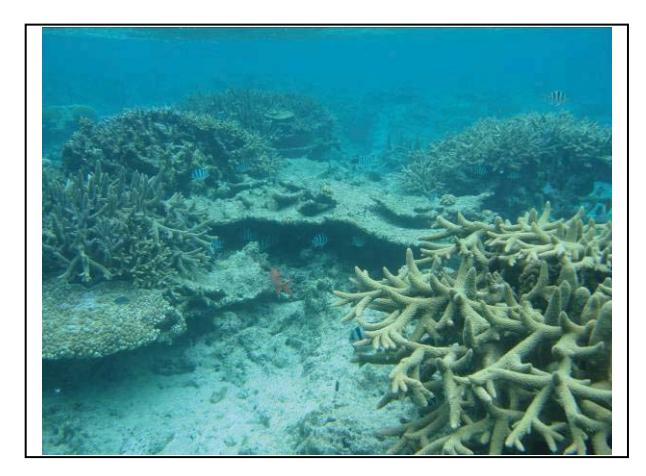

## 6Wࢩࣅ࣐ᾏ୰බᅬᆅ༊

ㄪᰝ᪥㸸ᖹᡂ ᖺ ᭶ ᪥

ΰᡂᆺ㸧ࢩࣜࢻ࣑≦༟࣭≦ᯞᆺ㸸ϩ㸦⏕⫱ࢦࣥࢧ

ࢦࣥࢧ龠ᗘ㸸㸣 ᖺࢦࣥࢧࡢ龠ᗘ㸸㸣

ࢩࣜࢻ࣑㢮ࡢ᪂つຍධ㸸 ⩌య੍

㈅㢮㣗ࢡࣥࣛ㸸ϩ

┿㸸ㄪᰝᆅⅬࡢᾏ୰ᬒほ

ࢺ࣓ࣥࢥ㸸ྎ㢼◚ᦆࠊࡾ࠶ᾏ⸴ᑡࠊ࠸࡞ᑠᆺࣜࢻ࣑

ቑຍయᒁᡤⓗ⩌ࢩ

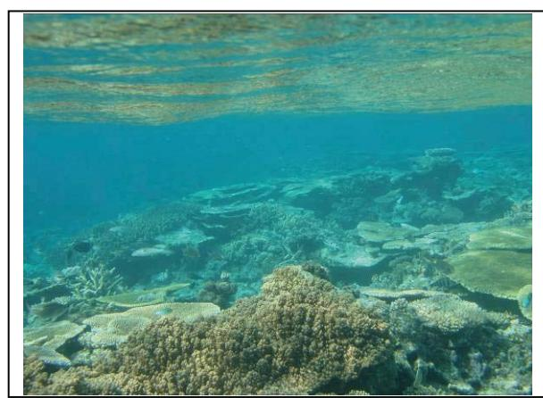

## 6W᪂ᇛᓥୖᆅすᓊ

ㄪᰝ᪥㸸ᖹᡂ ᖺ ᭶ ᪥

ΰᡂᆺ㸧ࢩࣜࢻ࣑≦༟࣭≦ᯞᆺ㸸ϩ㸦⏕⫱ࢦࣥࢧ

ࢦࣥࢧ龠ᗘ㸸㸣 ᖺࢦࣥࢧࡢ龠ᗘ㸸㸣

ࢩࣜࢻ࣑㢮ࡢ᪂つຍධ㸸 ⩌య੍

㈅㢮㣗ࢡࣥࣛ㸸ϩ ┿㸸ㄪᰝᆅⅬࡢᾏ୰ᬒほ

ࢺ࣓ࣥࢥ㸸ྎ㢼◚ᦆࠊࡾ࠶ᾏ⸴୪ࡳ

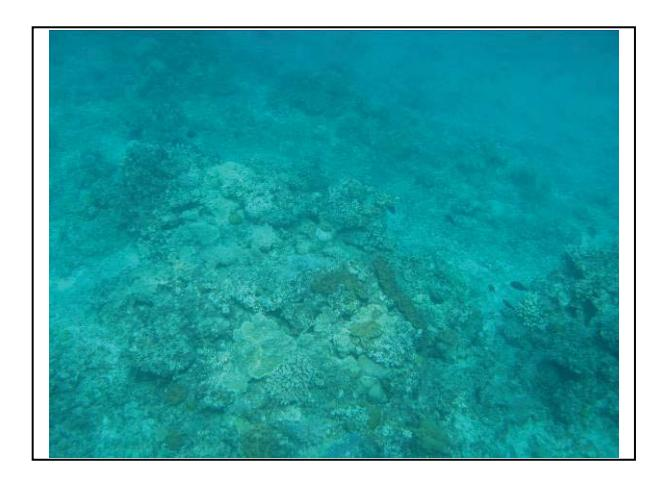

#### 6W᪂ᇛᓥ㛫Ỉ㊰㒊

ㄪᰝ᪥㸸ᖹᡂ ᖺ ᭶ ᪥ ࢦࣥࢧ⫱⏕ᆺ㸸Ϭ㸦ከ✀ΰᡂᆺ㸧

ࢦࣥࢧ龠ᗘ㸸㸣 ᖺࢦࣥࢧࡢ龠ᗘ㸸㸣

ࢩࣜࢻ࣑㢮ࡢ᪂つຍධ㸸 ⩌య੍

㈅㢮㣗ࢡࣥࣛ㸸ϩ ┿㸸ㄪᰝᆅⅬࡢᾏ୰ᬒほ

ࡳ୪⸴㸸ᾏࢺ࣓ࣥࢥ

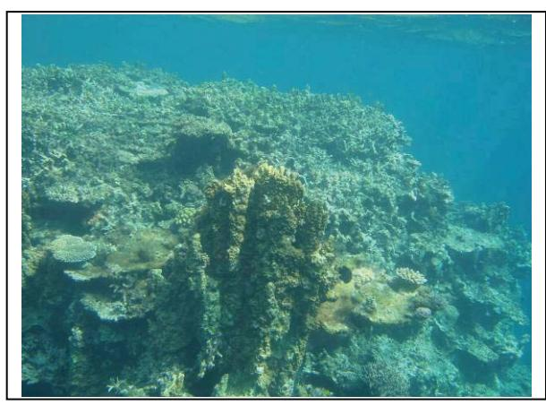

#### 6W᪂ᇛᓥୗᆅすᓊ♋ụෆ

ㄪᰝ᪥㸸ᖹᡂ ᖺ ᭶ ᪥ ࢦࣥࢧ⫱⏕ᆺ㸸Ϭ㸦ከ✀ΰᡂᆺ㸧

ࢦࣥࢧ龠ᗘ㸸㸣

ᖺࢦࣥࢧࡢ龠ᗘ㸸㸣ᮍ‶

ࢩࣜࢻ࣑㢮ࡢ᪂つຍධ㸸 ⩌య੍

㈅㢮㣗ࢡࣥࣛ㸸Ϩ

┿㸸ㄪᰝᆅⅬࡢᾏ୰ᬒほ ࡳ୪⸴㸸ᾏࢺ࣓ࣥࢥ

ᅗ ྛㄪᰝᆅⅬࡢᾏ୰ᬒほཬࡧᴫἣ

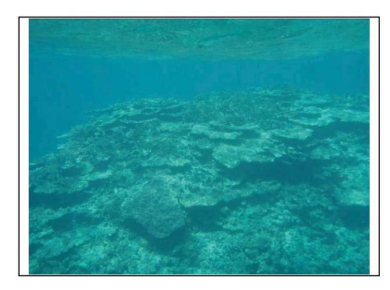

## 6W᪂ᇛᓥୗᆅすᓊ♋ụෆ

ㄪᰝ᪥㸸ᖹᡂ ᖺ ᭶ ᪥ ࢦࣥࢧ⫱⏕ᆺ㸸Ϭ㸦ከ✀ΰᡂᆺ㸧

ࢦࣥࢧ龠ᗘ㸸㸣

ᖺࢦࣥࢧࡢ龠ᗘ㸸㸣ᮍ‶

ࢩࣜࢻ࣑㢮ࡢ᪂つຍධ㸸 ⩌య੍

㈅㢮㣗ࢡࣥࣛ㸸Ϩ

┿㸸ㄪᰝᆅⅬࡢᾏ୰ᬒほ ࡳ୪⸴㸸ᾏࢺ࣓ࣥࢥ

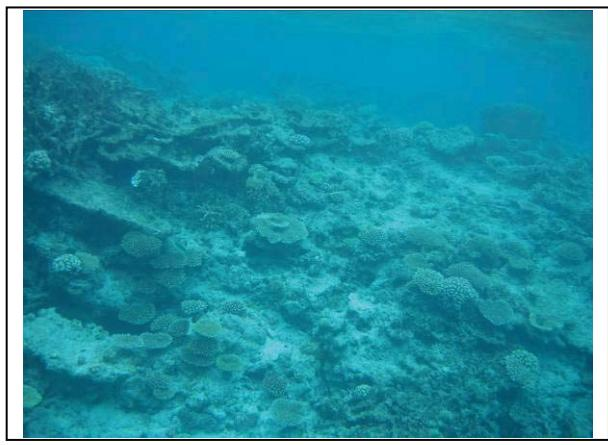

#### 6W㯮ᓥἈ㞳♋

ㄪᰝ᪥㸸ᖹᡂ ᖺ ᭶ ᪥ ࢦࣥࢧ⫱⏕ᆺ㸸Ϭ㸦ከ✀ΰᡂᆺ㸧

ࢦࣥࢧ龠ᗘ㸸㸣 ᖺࢦࣥࢧࡢ龠ᗘ㸸㸣

ࢩࣜࢻ࣑㢮ࡢ᪂つຍධ㸸 ⩌య੍

㈅㢮㣗ࢡࣥࣛ㸸ϩ ┿㸸ㄪᰝᆅⅬࡢᾏ୰ᬒほ

ࢺ࣓ࣥࢥ㸸ྎ㢼◚ᦆࠊࡾ࠶ᾏ⸴ᑡࠊ࠸࡞ᑠᆺࣜࢻ࣑

ቑຍయᒁᡤⓗ⩌ࢩ

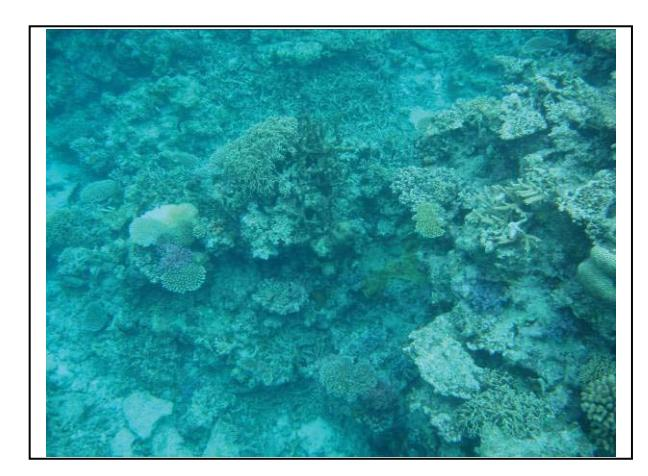

#### 6W㯮ᓥἈ㞳♋

ㄪᰝ᪥㸸ᖹᡂ ᖺ ᭶ ᪥

ΰᡂᆺ㸧ࢩࣜࢻ࣑≦༟࣭≦ᯞᆺ㸸ϩ㸦⏕⫱ࢦࣥࢧ

ࢦࣥࢧ龠ᗘ㸸㸣 ᖺࢦࣥࢧࡢ龠ᗘ㸸㸣

ࢩࣜࢻ࣑㢮ࡢ᪂つຍධ㸸 ⩌య੍

㈅㢮㣗ࢡࣥࣛ㸸ϩ

┿㸸ㄪᰝᆅⅬࡢᾏ୰ᬒほ

ࢺ࣓ࣥࢥ㸸ྎ㢼◚ᦆࠊࡾ࠶ᾏ⸴ᑡ࠸࡞

#### 6W㯮ᓥ࣮ᑠᓥ㛫㞳♋

ㄪᰝ᪥㸸ᖹᡂ ᖺ ᭶ ᪥ ࢦࣥࢧ⫱⏕ᆺ㸸Ϭ㸦ከ✀ΰᡂᆺ㸧

ࢦࣥࢧ龠ᗘ㸸㸣 ᖺࢦࣥࢧࡢ龠ᗘ㸸㸣

ࢩࣜࢻ࣑㢮ࡢ᪂つຍධ㸸 ⩌య੍

㈅㢮㣗ࢡࣥࣛ㸸ϩ

┿㸸ㄪᰝᆅⅬࡢᾏ୰ᬒほ

ࢺ࣓ࣥࢥ㸸ྎ㢼◚ᦆࠊࡾ࠶ᾏ⸴୪ࡳ㸦⸛⸴ከ࠸㸧

ᅗ ྛㄪᰝᆅⅬࡢᾏ୰ᬒほཬࡧᴫἣ

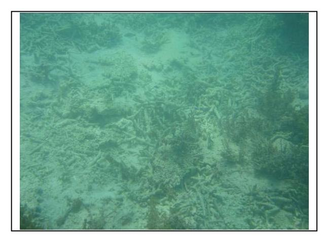

## 6Wᑠᓥ༡ᮾᓊ♋⦕

ㄪᰝ᪥㸸ᖹᡂ ᖺ ᭶ ᪥ ࢦࣥࢧ⫱⏕ᆺ㸸Ϭ㸦ከ✀ΰᡂᆺ㸧

ࢦࣥࢧ龠ᗘ㸸㸣ᮍ‶ ᖺࢦࣥࢧࡢ龠ᗘ㸸㸣ᮍ‶

ࢩࣜࢻ࣑㢮ࡢ᪂つຍධ㸸 ⩌య੍

㈅㢮㣗ࢡࣥࣛ㸸Ϩ

┿㸸ㄪᰝᆅⅬࡢᾏ୰ᬒほ

ࢺ࣓ࣥࢥ㸸ྎ㢼◚ᦆࠊࡾ࠶ᾏ⸴ከ࠸

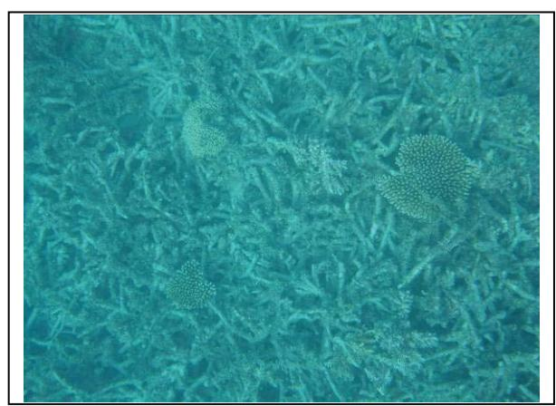

#### 6Wᑠᓥ༡ᮾἈ♋⦕

ㄪᰝ᪥㸸ᖹᡂ ᖺ ᭶ ᪥ ࢦࣥࢧ⫱⏕ᆺ㸸Ϭ㸦ከ✀ΰᡂᆺ㸧

ࢦࣥࢧ龠ᗘ㸸㸣 ᖺࢦࣥࢧࡢ龠ᗘ㸸㸣

ࢩࣜࢻ࣑㢮ࡢ᪂つຍධ㸸 ⩌య੍

㈅㢮㣗ࢡࣥࣛ㸸Ϩ ┿㸸ㄪᰝᆅⅬࡢᾏ୰ᬒほ

ࢺ࣓ࣥࢥ㸸ྎ㢼◚ᦆࠊࡾ࠶ᾏ⸴୪ࡳ

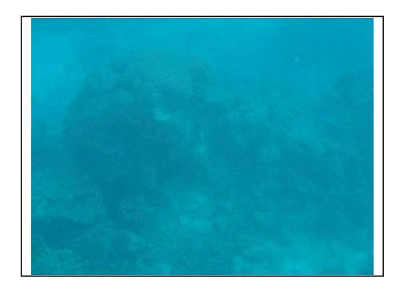

#### 6Wᑠᓥ༡ᮾἈ♋⦕

ㄪᰝ᪥㸸ᖹᡂ ᖺ ᭶ ᪥ ࢦࣥࢧ⫱⏕ᆺ㸸Ϭ㸦ከ✀ΰᡂᆺ㸧

ࢦࣥࢧ龠ᗘ㸸㸣 ᖺࢦࣥࢧࡢ龠ᗘ㸸㸣

ࢩࣜࢻ࣑㢮ࡢ᪂つຍධ㸸 ⩌య੍

㈅㢮㣗ࢡࣥࣛ㸸Ϩ

┿㸸ㄪᰝᆅⅬࡢᾏ୰ᬒほ ࠸ከ⸴㸸ᾏࢺ࣓ࣥࢥ

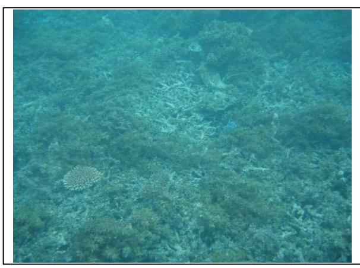

#### 6WᑠᓥᮾἈ

ㄪᰝ᪥㸸ᖹᡂ ᖺ ᭶ ᪥ ࢦࣥࢧ⫱⏕ᆺ㸸Ϭ㸦ከ✀ΰᡂᆺ㸧

ࢦࣥࢧ龠ᗘ㸸㸣

ᖺࢦࣥࢧࡢ龠ᗘ㸸㸣ᮍ‶

ࢩࣜࢻ࣑㢮ࡢ᪂つຍධ㸸 ⩌య੍

㈅㢮㣗ࢡࣥࣛ㸸Ϩ

┿㸸ㄪᰝᆅⅬࡢᾏ୰ᬒほ

ࢺ࣓ࣥࢥ㸸ྎ㢼◚ᦆࠊࡾ࠶ᾏ⸴ከࠊ࠸ᚤ⣽⸴㢮ࡢ⦾ⱱ యᒁ⩌ࢩࣜࢻ࣑ᑠᆺୖ♟ᯞ࠸࡞࠸࡚ࡋ

ᡤⓗቑຍ

ᅗ ྛㄪᰝᆅⅬࡢᾏ୰ᬒほཬࡧᴫἣ

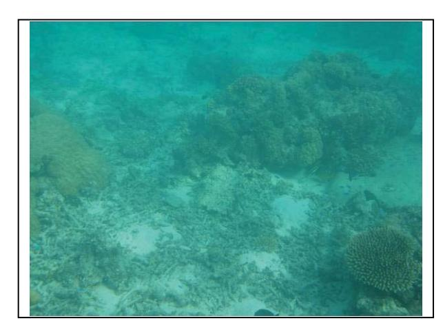

## 6Wᘺ┿ᓥ༡ᓊ♋⦕

ㄪᰝ᪥㸸ᖹᡂ ᖺ ᭶ ᪥ ࢦࣥࢧ⫱⏕ᆺ㸸Ϭ㸦ከ✀ΰᡂᆺ㸧

ࢦࣥࢧ龠ᗘ㸸㸣 ᖺࢦࣥࢧࡢ龠ᗘ㸸㸣

ࢩࣜࢻ࣑㢮ࡢ᪂つຍධ㸸 ⩌య੍

㈅㢮㣗ࢡࣥࣛ㸸Ϩ

┿㸸ㄪᰝᆅⅬࡢᾏ୰ᬒほ ࠸ከ⸴㸸ᾏࢺ࣓ࣥࢥ

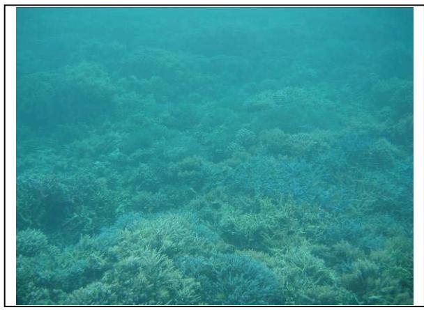

## 6Wᘺ┿ᓥ༡すᓊ♋ụෆ

ㄪᰝ᪥㸸ᖹᡂ ᖺ ᭶ ᪥ ࢦࣥࢧ⫱⏕ᆺ㸸Ϭ㸦ከ✀ΰᡂᆺ㸧

ࢦࣥࢧ龠ᗘ㸸㸣 ᖺࢦࣥࢧࡢ龠ᗘ㸸㸣

ࢩࣜࢻ࣑㢮ࡢ᪂つຍධ㸸 ⩌య੍

㈅㢮㣗ࢡࣥࣛ㸸Ϫ ┿㸸ㄪᰝᆅⅬࡢᾏ୰ᬒほ

ࢺ࣓ࣥࢥ㸸ྎ㢼◚ᦆࠊࡾ࠶ᾏ⸴ᑡ࠸࡞

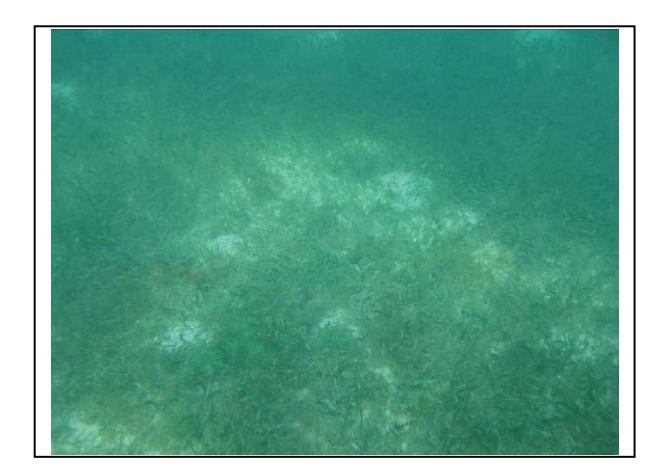

#### 6Wᑠᓥᮾᓊ♋⦕

ㄪᰝ᪥㸸ᖹᡂ ᖺ ᭶ ᪥ ࢦࣥࢧ⫱⏕ᆺ㸸Ϭ㸦ከ✀ΰᡂᆺ㸧

ࢦࣥࢧ龠ᗘ㸸㸣ᮍ‶ ᖺࢦࣥࢧࡢ龠ᗘ㸸㸣ᮍ‶

ࢩࣜࢻ࣑㢮ࡢ᪂つຍධ㸸 ⩌య੍

㈅㢮㣗ࢡࣥࣛ㸸Ϩ

┿㸸ㄪᰝᆅⅬࡢᾏ୰ᬒほ ࡾ࠶ᾏⲡࠊ࠸ከ⸴㸸ᾏࢺ࣓ࣥࢥ

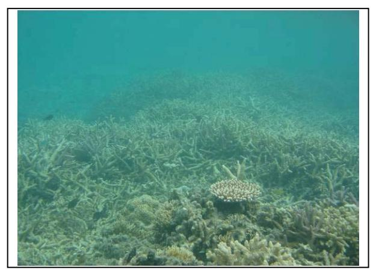

#### 6WࣛࢼࣚỈ㐨༡♋⦕

ㄪᰝ᪥㸸ᖹᡂ ᖺ ᭶ ᪥

ඃ༨ᆺ㸧ࢩࣜࢻ࣑≦ᯞᆺ㸸Ϩ㸦⏕⫱ࢦࣥࢧ

ࢦࣥࢧ龠ᗘ㸸㸣 ᖺࢦࣥࢧࡢ龠ᗘ㸸㸣

ࢩࣜࢻ࣑㢮ࡢ᪂つຍධ㸸 ⩌య੍

㈅㢮㣗ࢡࣥࣛ㸸ϫ

┿㸸ㄪᰝᆅⅬࡢᾏ୰ᬒほ

ࢺ࣓ࣥࢥ㸸ྎ㢼◚ᦆࠊࡾ࠶ᾏ⸴ᑡ࠸࡞

ᅗ ྛㄪᰝᆅⅬࡢᾏ୰ᬒほཬࡧᴫἣ

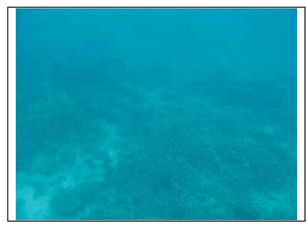

## 6WࣛࢼࣚỈ㐨༡

ㄪᰝ᪥㸸ᖹᡂ ᖺ ᭶ ᪥ ࢦࣥࢧ⫱⏕ᆺ㸸Ϭ㸦ከ✀ΰᡂᆺ㸧

ࢦࣥࢧ龠ᗘ㸸㸣 ᖺࢦࣥࢧࡢ龠ᗘ㸸㸣

ࢩࣜࢻ࣑㢮ࡢ᪂つຍධ㸸 ⩌య੍

㈅㢮㣗ࢡࣥࣛ㸸ϩ ┿㸸ㄪᰝᆅⅬࡢᾏ୰ᬒほ ࠸࡞ᑡ⸴㸸ᾏࢺ࣓ࣥࢥ

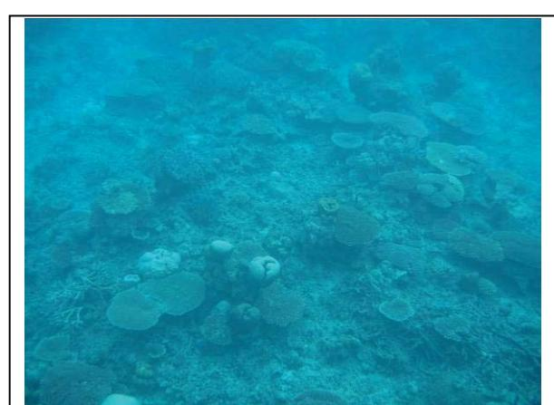

## 6W㯮ᓥ࣮す⾲ᓥ㛫㞳♋

ㄪᰝ᪥㸸ᖹᡂ ᖺ ᭶ ᪥ ࢦࣥࢧ⫱⏕ᆺ㸸Ϭ㸦ከ✀ΰᡂᆺ㸧

ࢦࣥࢧ龠ᗘ㸸㸣 ᖺࢦࣥࢧࡢ龠ᗘ㸸㸣

ࢩࣜࢻ࣑㢮ࡢ᪂つຍධ㸸 ⩌య੍

㈅㢮㣗ࢡࣥࣛ㸸ϩ ┿㸸ㄪᰝᆅⅬࡢᾏ୰ᬒほ ࠸࡞ᑡ⸴㸸ᾏࢺ࣓ࣥࢥ

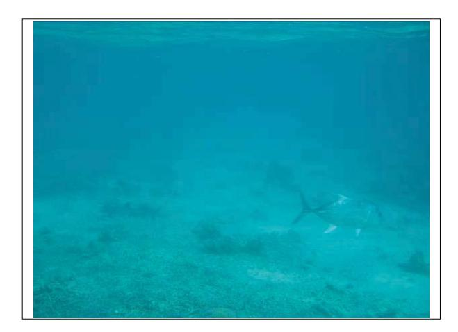

#### 6W㯮ᓥ࣮す⾲ᓥ㛫㞳♋

ㄪᰝ᪥㸸ᖹᡂ ᖺ ᭶ ᪥ ࢦࣥࢧ⫱⏕ᆺ㸸Ϭ㸦ከ✀ΰᡂᆺ㸧

ࢦࣥࢧ龠ᗘ㸸㸣 ᖺࢦࣥࢧࡢ龠ᗘ㸸㸣

ࢩࣜࢻ࣑㢮ࡢ᪂つຍධ㸸 ⩌య੍

㈅㢮㣗ࢡࣥࣛ㸸ϩ ┿㸸ㄪᰝᆅⅬࡢᾏ୰ᬒほ

ࢺ࣓ࣥࢥ㸸ྎ㢼◚ᦆࠊࡾ࠶ᾏ⸴୪ࠊࡳ⯟㊰ࣈ

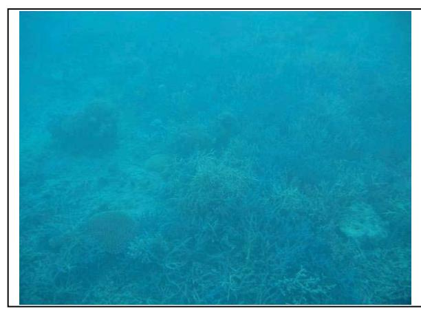

#### 6W㯮ᓥ࣮ᑠᓥ㛫㞳♋

ㄪᰝ᪥㸸ᖹᡂ ᖺ ᭶ ᪥

ඃ༨ᆺ㸧ࢩࣜࢻ࣑≦ᯞᆺ㸸Ϩ㸦⏕⫱ࢦࣥࢧ

ࢦࣥࢧ龠ᗘ㸸㸣 ᖺࢦࣥࢧࡢ龠ᗘ㸸㸣

ࢩࣜࢻ࣑㢮ࡢ᪂つຍධ㸸 ⩌య੍

㈅㢮㣗ࢡࣥࣛ㸸Ϩ

┿㸸ㄪᰝᆅⅬࡢᾏ୰ᬒほ

ࢺ࣓ࣥࢥ㸸ྎ㢼◚ᦆࠊࡾ࠶ᾏ⸴ᑡ࠸࡞

ᅗ ྛㄪᰝᆅⅬࡢᾏ୰ᬒほཬࡧᴫἣ

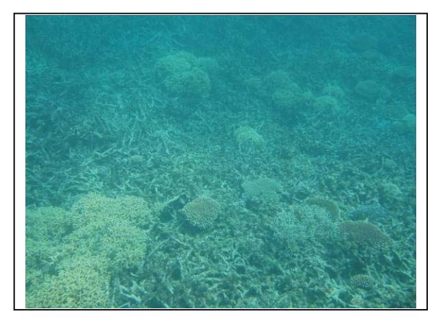

## 6Wᑠᓥ༡ᮾἈ㞳♋

ㄪᰝ᪥㸸ᖹᡂ ᖺ ᭶ ᪥ ࢦࣥࢧ⫱⏕ᆺ㸸Ϭ㸦ከ✀ΰᡂᆺ㸧

ࢦࣥࢧ龠ᗘ㸸㸣 ᖺࢦࣥࢧࡢ龠ᗘ㸸㸣

ࢩࣜࢻ࣑㢮ࡢ᪂つຍධ㸸 ⩌య੍

㈅㢮㣗ࢡࣥࣛ㸸ϩ ┿㸸ㄪᰝᆅⅬࡢᾏ୰ᬒほ ࠸ከ⸴㸸ᾏࢺ࣓ࣥࢥ

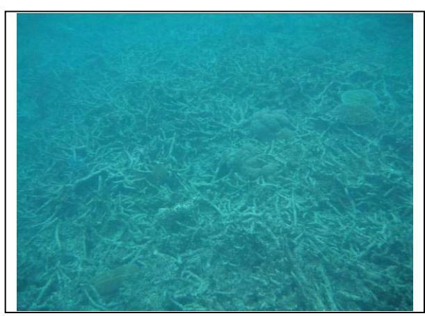

### 6Wᑠᓥ༡ᮾἈ㞳♋

ㄪᰝ᪥㸸ᖹᡂ ᖺ ᭶ ᪥ ࢦࣥࢧ⫱⏕ᆺ㸸Ϭ㸦ከ✀ΰᡂᆺ㸧

ࢦࣥࢧ龠ᗘ㸸㸣 ᖺࢦࣥࢧࡢ龠ᗘ㸸㸣

ࢩࣜࢻ࣑㢮ࡢ᪂つຍධ㸸 ⩌య੍

㈅㢮㣗ࢡࣥࣛ㸸Ϩ ┿㸸ㄪᰝᆅⅬࡢᾏ୰ᬒほ

ࢺ࣓ࣥࢥ㸸ྎ㢼◚ᦆࠊࡾ࠶ᾏ⸴୪ࡳ

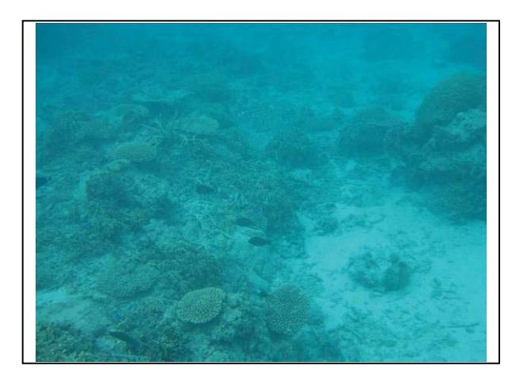

#### 6WᑠᓥᮾἈ♋†ෆ

ㄪᰝ᪥㸸ᖹᡂ ᖺ ᭶ ᪥ ࢦࣥࢧ⫱⏕ᆺ㸸Ϭ㸦ከ✀ΰᡂᆺ㸧

ࢦࣥࢧ龠ᗘ㸸㸣 ᖺࢦࣥࢧࡢ龠ᗘ㸸㸣

ࢩࣜࢻ࣑㢮ࡢ᪂つຍධ㸸 ⩌య੍

㈅㢮㣗ࢡࣥࣛ㸸ϩ ┿㸸ㄪᰝᆅⅬࡢᾏ୰ᬒほ

ࢺ࣓ࣥࢥ㸸ྎ㢼◚ᦆࠊࡾ࠶ᾏ⸴ᑡ࠸࡞

#### 6WᑠᓥᮾἈ♋†ෆ

ㄪᰝ᪥㸸ᖹᡂ ᖺ ᭶ ᪥ ࢦࣥࢧ⫱⏕ᆺ㸸Ϭ㸦ከ✀ΰᡂᆺ㸧

ࢦࣥࢧ龠ᗘ㸸㸣 ᖺࢦࣥࢧࡢ龠ᗘ㸸㸣

ࢩࣜࢻ࣑㢮ࡢ᪂つຍධ㸸 ⩌య੍

㈅㢮㣗ࢡࣥࣛ㸸Ϩ

┿㸸ㄪᰝᆅⅬࡢᾏ୰ᬒほ

ࢺ࣓ࣥࢥ㸸ྎ㢼◚ᦆࠊࡾ࠶ᾏ⸴୪ࡳ

ᅗ ྛㄪᰝᆅⅬࡢᾏ୰ᬒほཬࡧᴫἣ

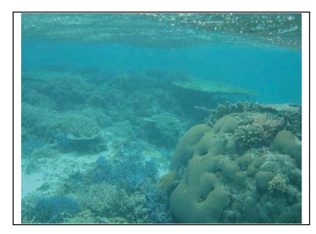

## 6Wᘺ┿ᓥᮾἈ♋†ෆ

ㄪᰝ᪥㸸ᖹᡂ ᖺ ᭶ ᪥ ࢦࣥࢧ⫱⏕ᆺ㸸Ϭ㸦ከ✀ΰᡂᆺ㸧

ࢦࣥࢧ龠ᗘ㸸㸣 ᖺࢦࣥࢧࡢ龠ᗘ㸸㸣

ࢩࣜࢻ࣑㢮ࡢ᪂つຍධ㸸 ⩌య੍

㈅㢮㣗ࢡࣥࣛ㸸ϩ

┿㸸ㄪᰝᆅⅬࡢᾏ୰ᬒほ

ࢺ࣓ࣥࢥ㸸ྎ㢼◚ᦆࠊࡾ࠶ᾏ⸴୪ࡳ

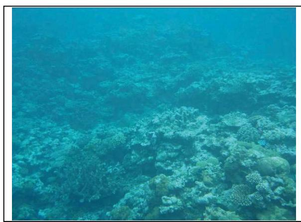

## 6Wࢩࣅࣛ࢘㞳♋

ㄪᰝ᪥㸸ᖹᡂ ᖺ ᭶ ᪥ ࢦࣥࢧ⫱⏕ᆺ㸸Ϭ㸦ከ✀ΰᡂᆺ㸧

ࢦࣥࢧ龠ᗘ㸸㸣 ᖺࢦࣥࢧࡢ龠ᗘ㸸㸣

ࢩࣜࢻ࣑㢮ࡢ᪂つຍධ㸸 ⩌య੍

㈅㢮㣗ࢡࣥࣛ㸸ϩ ┿㸸ㄪᰝᆅⅬࡢᾏ୰ᬒほ

ࢺ࣓ࣥࢥ㸸ᾏ⸴ᑡࠊ࠸࡞ᑠᆺࢩࣜࢻ࣑⩌యቑຍ

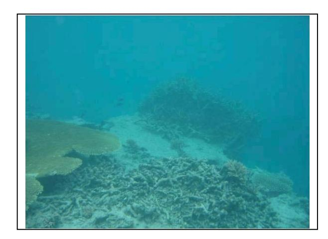

#### 6Wࢩࣅࣔࢩᾏ୰බᅬᆅ༊

ㄪᰝ᪥㸸ᖹᡂ ᖺ ᭶ ᪥

ΰᡂᆺ㸧ࢩࣜࢻ࣑≦༟࣭≦ᯞᆺ㸸ϩ㸦⏕⫱ࢦࣥࢧ

ࢦࣥࢧ龠ᗘ㸸㸣 ᖺࢦࣥࢧࡢ龠ᗘ㸸㸣

ࢩࣜࢻ࣑㢮ࡢ᪂つຍධ㸸 ⩌య੍

㈅㢮㣗ࢡࣥࣛ㸸Ϩ

┿㸸ㄪᰝᆅⅬࡢᾏ୰ᬒほ

ࢺ࣓ࣥࢥ㸸ྎ㢼◚ᦆࠊࡾ࠶ᾏ⸴ᑡ࠸࡞

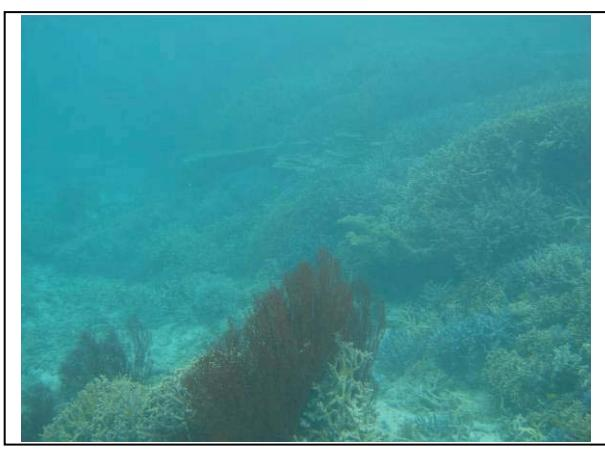

#### 6W➉ᐩᓥ༡すᓊ♋⦕

ㄪᰝ᪥㸸ᖹᡂ ᖺ ᭶ ᪥

ඃ༨ᆺ㸧ࢩࣜࢻ࣑≦ᯞᆺ㸸Ϩ㸦⏕⫱ࢦࣥࢧ

ࢦࣥࢧ龠ᗘ㸸㸣 ᖺࢦࣥࢧࡢ龠ᗘ㸸㸣

ࢩࣜࢻ࣑㢮ࡢ᪂つຍධ㸸 ⩌య੍

㈅㢮㣗ࢡࣥࣛ㸸Ϩ

┿㸸ㄪᰝᆅⅬࡢᾏ୰ᬒほ ࠸࡞ᑡ⸴㸸ᾏࢺ࣓ࣥࢥ

ᅗ ྛㄪᰝᆅⅬࡢᾏ୰ᬒほཬࡧᴫἣ

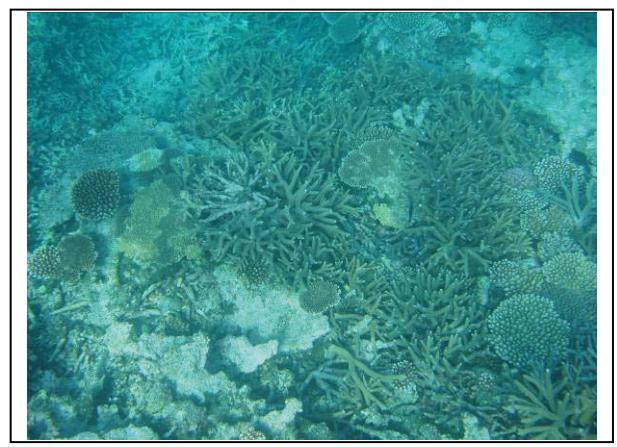

## 6W➉ᐩᓥすἈ㞳♋♋⦕

ㄪᰝ᪥㸸ᖹᡂ ᖺ ᭶ ᪥

ΰᡂᆺ㸧ࢩࣜࢻ࣑≦༟࣭≦ᯞᆺ㸸ϩ㸦⏕⫱ࢦࣥࢧ

ࢦࣥࢧ龠ᗘ㸸㸣 ᖺࢦࣥࢧࡢ龠ᗘ㸸㸣

ࢩࣜࢻ࣑㢮ࡢ᪂つຍධ㸸 ⩌య੍

㈅㢮㣗ࢡࣥࣛ㸸ϩ ┿㸸ㄪᰝᆅⅬࡢᾏ୰ᬒほ

ࢺ࣓ࣥࢥ㸸ྎ㢼◚ᦆࠊᾏ⸴ᑡࢻࣥࢩࢺ࣡࣍ࠊ࠸࡞

࠶ᩘ「ࢁࡇࡿ࠸࡚ࡋ㞟୰ᒁᡤⓗ࣒࣮ࣟ ࡾ㸦≉༟≧㸧

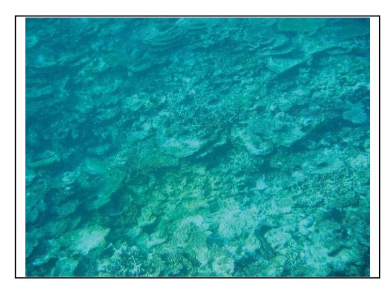

## 6W➉ᐩᓥすἈ㞳♋እ⦕

ㄪᰝ᪥㸸ᖹᡂ ᖺ ᭶ ᪥ ࢦࣥࢧ⫱⏕ᆺ㸸Ϭ㸦ከ✀ΰᡂᆺ㸧

ࢦࣥࢧ龠ᗘ㸸㸣 ᖺࢦࣥࢧࡢ龠ᗘ㸸㸣

ࢩࣜࢻ࣑㢮ࡢ᪂つຍධ㸸 ⩌య੍

㈅㢮㣗ࢡࣥࣛ㸸ϩ ┿㸸ㄪᰝᆅⅬࡢᾏ୰ᬒほ

ࢺ࣓ࣥࢥ㸸ྎ㢼◚ᦆ㸦ㄪᰝ⠊ᅖ㸦Ỉ῝ᖏࡶྵࡴ㸧ࡣ ࿘㎶࠸ࡦࡾ࡞ࡶࡾࡼ≦ἣ㸧ࠊᾏ⸴ᑡ࠸࡞

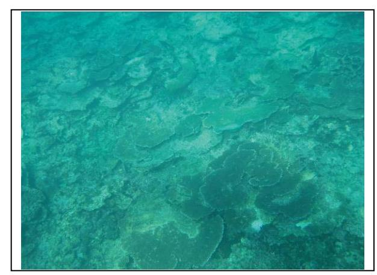

#### 6W➉ᐩᓥᓊ♋እ⦕

ㄪᰝ᪥㸸ᖹᡂ ᖺ ᭶ ᪥ ࢦࣥࢧ⫱⏕ᆺ㸸Ϭ㸦ከ✀ΰᡂᆺ㸧

ࢦࣥࢧ龠ᗘ㸸㸣 ᖺࢦࣥࢧࡢ龠ᗘ㸸㸣

ࢩࣜࢻ࣑㢮ࡢ᪂つຍධ㸸 ⩌య੍

㈅㢮㣗ࢡࣥࣛ㸸ϩ ┿㸸ㄪᰝᆅⅬࡢᾏ୰ᬒほ

ࢺ࣓ࣥࢥ㸸ྎ㢼◚ᦆࠊᾏ⸴ᑡࢻࣥࢩࢺ࣡࣍ࠊ࠸࡞ ࠶ᩘ「ࢁࡇࡿ࠸࡚ࡋ㞟୰ᒁᡤⓗ࣒࣮ࣟ ࡾ㸦≉༟≧㸧ྎ㢼ᙳ㡪ࡽࡔࡲࡵࡓࡢᶍᵝ Ⰽⷧࢦࣥࢧ࠸⩌య┠❧ࡘ㸦㎶⦕㒊ศࡢ㒊ศṚ

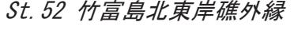

ㄪᰝ᪥㸸ᖹᡂ ᖺ ᭶ ᪥

ඃ༨ᆺ㸧ࢩࣜࢻ࣑≦ᆺ㸸Ϫ㸦༟⏕⫱ࢦࣥࢧ

ࢦࣥࢧ龠ᗘ㸸㸣 ᖺࢦࣥࢧࡢ龠ᗘ㸸㸣

㸧ࡶ

ࢩࣜࢻ࣑㢮ࡢ᪂つຍධ㸸 ⩌య੍

㈅㢮㣗ࢡࣥࣛ㸸ϩ

┿㸸ㄪᰝᆅⅬࡢᾏ୰ᬒほ

ࢺ࣓ࣥࢥ㸸ྎ㢼◚ᦆࠊᾏ⸴ᑡࠊ࠸࡞ྂࢩࢺ࣡࣍࠸ ࡚ࡋᐦ㞟ᒁᡤⓗࡃయከ⩌Ṛஸ࣒࣮ࣟࢻࣥ 㸧ࢫ࣮࣎ࣥࣜࢥ≉㸦ࡾ࠶ᩘ「ࢁࡇࡿ࠸

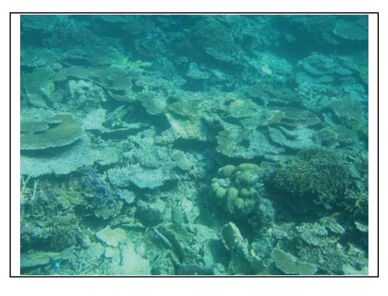

ᅗ ྛㄪᰝᆅⅬࡢᾏ୰ᬒほཬࡧᴫἣ

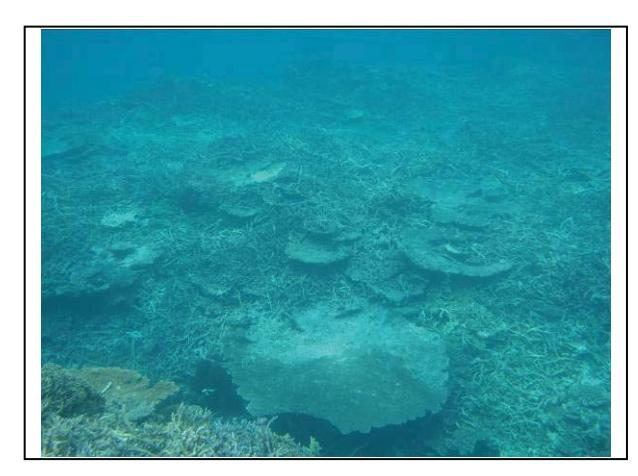

## 6W➉ᐩᓥᮾἈ♋⦕

ㄪᰝ᪥㸸ᖹᡂ ᖺ ᭶ ᪥

ΰᡂᆺ㸧ࢩࣜࢻ࣑≦༟࣭≦ᯞᆺ㸸ϩ㸦⏕⫱ࢦࣥࢧ

ࢦࣥࢧ龠ᗘ㸸㸣 ᖺࢦࣥࢧࡢ龠ᗘ㸸㸣

ࢩࣜࢻ࣑㢮ࡢ᪂つຍධ㸸 ⩌య੍

㈅㢮㣗ࢡࣥࣛ㸸ϩ

┿㸸ㄪᰝᆅⅬࡢᾏ୰ᬒほ

ࢺ࣓ࣥࢥ㸸ྎ㢼◚ᦆࠊᾏ⸴ᑡ࠸࡞

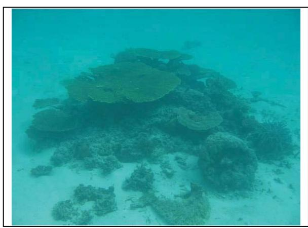

#### 6W➉ᐩᓥᮾἈ㞳♋

ㄪᰝ᪥㸸ᖹᡂ ᖺ ᭶ ᪥ ࢦࣥࢧ⫱⏕ᆺ㸸Ϭ㸦ከ✀ΰᡂᆺ㸧

ࢦࣥࢧ龠ᗘ㸸㸣 ᖺࢦࣥࢧࡢ龠ᗘ㸸㸣

ࢩࣜࢻ࣑㢮ࡢ᪂つຍධ㸸 ⩌య੍

㈅㢮㣗ࢡࣥࣛ㸸ϩ ┿㸸ㄪᰝᆅⅬࡢᾏ୰ᬒほ

ࢺ࣓ࣥࢥ㸸ᾏ⸴ከࠊ࠸ᑠᆺࢦࣥࢧ⩌య⯟㊰㏆ࡃ࡙㸦ᮾ

᪉㸧ከ࠸ഴྥ

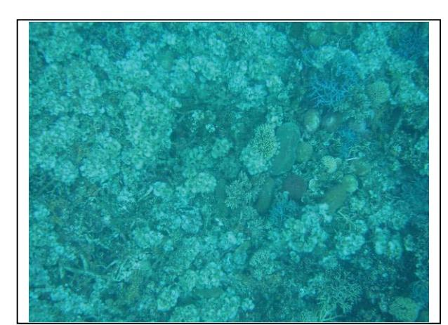

#### 6Wす⾲ᓥᮾἈ㞳♋

ㄪᰝ᪥㸸ᖹᡂ ᖺ ᭶ ᪥

ඃ༨ᆺ㸧ࢩࣜࢻ࣑≦ᯞᆺ㸸Ϩ㸦⏕⫱ࢦࣥࢧ

ࢦࣥࢧ龠ᗘ㸸㸣 ᖺࢦࣥࢧࡢ龠ᗘ㸸㸣

ࢩࣜࢻ࣑㢮ࡢ᪂つຍධ㸸 ⩌య੍

㈅㢮㣗ࢡࣥࣛ㸸ϩ

┿㸸ㄪᰝᆅⅬࡢᾏ୰ᬒほ ࠸ከ⸴㸸ᾏࢺ࣓ࣥࢥ

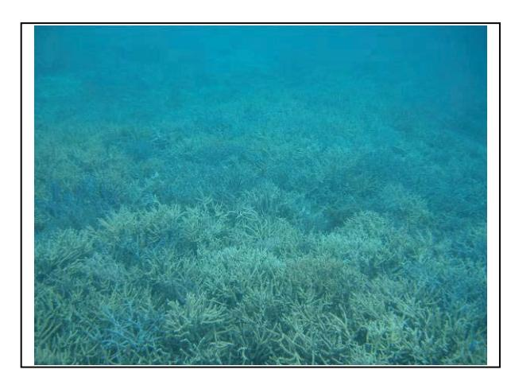

#### 6Wす⾲ᓥᮾἈ㞳♋

ㄪᰝ᪥㸸ᖹᡂ ᖺ ᭶ ᪥

ඃ༨ᆺ㸧ࢩࣜࢻ࣑≦ᯞᆺ㸸Ϩ㸦⏕⫱ࢦࣥࢧ

ࢦࣥࢧ龠ᗘ㸸㸣 ᖺࢦࣥࢧࡢ龠ᗘ㸸㸣

ࢩࣜࢻ࣑㢮ࡢ᪂つຍධ㸸 ⩌య੍

㈅㢮㣗ࢡࣥࣛ㸸Ϫ

┿㸸ㄪᰝᆅⅬࡢᾏ୰ᬒほ ࠸ከ⸴㸸ᾏࢺ࣓ࣥࢥ

ᅗ ྛㄪᰝᆅⅬࡢᾏ୰ᬒほཬࡧᴫἣ

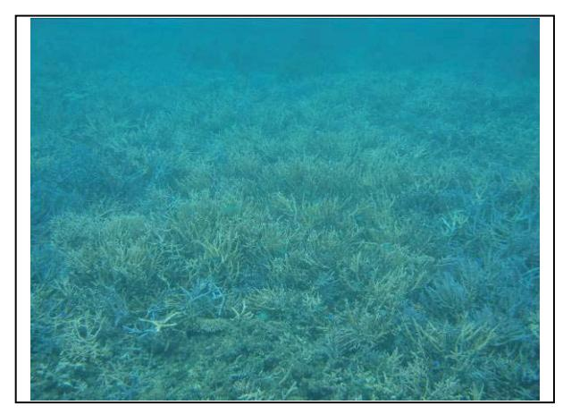

## 6Wす⾲ᓥᮾἈ㞳♋

ㄪᰝ᪥㸸ᖹᡂ ᖺ ᭶ ᪥

ඃ༨ᆺ㸧ࢩࣜࢻ࣑≦ᯞᆺ㸸Ϩ㸦⏕⫱ࢦࣥࢧ

ࢦࣥࢧ龠ᗘ㸸㸣 ᖺࢦࣥࢧࡢ龠ᗘ㸸㸣

ࢩࣜࢻ࣑㢮ࡢ᪂つຍධ㸸 ⩌య੍

㈅㢮㣗ࢡࣥࣛ㸸ϩ ┿㸸ㄪᰝᆅⅬࡢᾏ୰ᬒほ ࠸ከ⸴㸸ᾏࢺ࣓ࣥࢥ

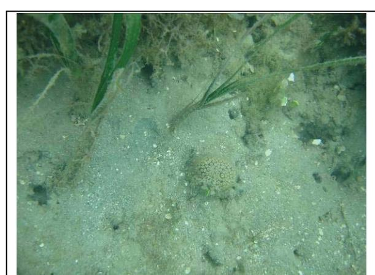

## 6Wす⾲ᓥᮾᓊ♋ụෆ

ㄪᰝ᪥㸸ᖹᡂ ᖺ ᭶ ᪥

ඃ༨ᆺ㸧ࢩ࣓ࢡ࣭࢟ࢦࣥࢧ࣐ࣁᆺ㸸ϫ㸦⏕⫱ࢦࣥࢧ

ࢦࣥࢧ龠ᗘ㸸㸣 ᖺࢦࣥࢧࡢ龠ᗘ㸸㸣

ࢩࣜࢻ࣑㢮ࡢ᪂つຍධ㸸 ⩌య੍

㈅㢮㣗ࢡࣥࣛ㸸Ϩ ┿㸸ㄪᰝᆅⅬࡢᾏ୰ᬒほ ࡾ࠶ᾏⲡࠊ࠸ከ⸴㸸ᾏࢺ࣓ࣥࢥ

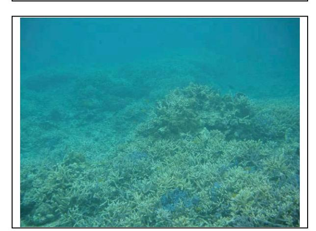

## 6WࣛࢼࣚỈ㐨༡

ㄪᰝ᪥㸸ᖹᡂ ᖺ ᭶ ᪥

ඃ༨ᆺ㸧ࢩࣜࢻ࣑≦ᯞᆺ㸸Ϩ㸦⏕⫱ࢦࣥࢧ

ࢦࣥࢧ龠ᗘ㸸㸣 ᖺࢦࣥࢧࡢ龠ᗘ㸸㸣

ࢩࣜࢻ࣑㢮ࡢ᪂つຍධ㸸 ⩌య੍

㈅㢮㣗ࢡࣥࣛ㸸Ϫ

┿㸸ㄪᰝᆅⅬࡢᾏ୰ᬒほ ࢺ࣓ࣥࢥ㸸ྎ㢼◚ᦆࠊࡾ࠶ᾏ⸴ᑡ࠸࡞

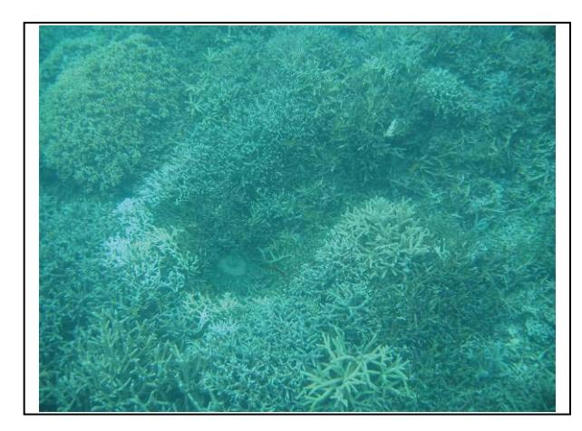

#### 6WࣛࢼࣚỈ㐨༡㒊

ㄪᰝ᪥㸸ᖹᡂ ᖺ ᭶ ᪥

ඃ༨ᆺ㸧ࢩࣜࢻ࣑≦ᯞᆺ㸸Ϩ㸦⏕⫱ࢦࣥࢧ

ࢦࣥࢧ龠ᗘ㸸㸣 ᖺࢦࣥࢧࡢ龠ᗘ㸸㸣

ࢩࣜࢻ࣑㢮ࡢ᪂つຍධ㸸 ⩌య੍

㈅㢮㣗ࢡࣥࣛ㸸ϫ

┿㸸ㄪᰝᆅⅬࡢᾏ୰ᬒほ

ࢺ࣓ࣥࢥ㸸ྎ㢼◚ᦆࠊࡾ࠶ᾏ⸴ᑡ࠸࡞

ᅗ ྛㄪᰝᆅⅬࡢᾏ୰ᬒほཬࡧᴫἣ

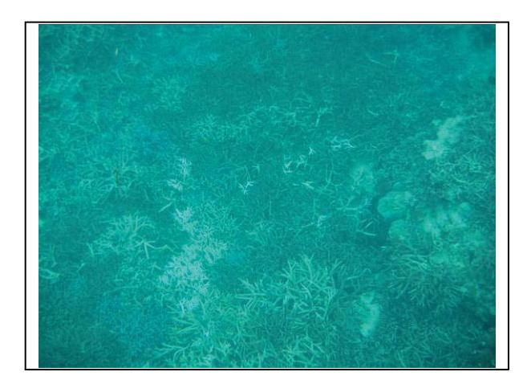

## 6WࣛࢼࣚỈ㐨୰ኸ㒊

ㄪᰝ᪥㸸ᖹᡂ ᖺ ᭶ ᪥

ඃ༨ᆺ㸧ࢩࣜࢻ࣑≦ᯞᆺ㸸Ϩ㸦⏕⫱ࢦࣥࢧ

ࢦࣥࢧ龠ᗘ㸸㸣 ᖺࢦࣥࢧࡢ龠ᗘ㸸㸣

ࢩࣜࢻ࣑㢮ࡢ᪂つຍධ㸸 ⩌య੍

㈅㢮㣗ࢡࣥࣛ㸸ϫ ┿㸸ㄪᰝᆅⅬࡢᾏ୰ᬒほ

ࢺ࣓ࣥࢥ㸸ྎ㢼◚ᦆࠊᾏ⸴ᑡ࠸࡞

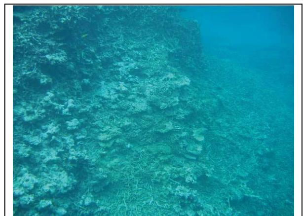

## 6WࣛࢼࣚỈ㐨㒊

ㄪᰝ᪥㸸ᖹᡂ ᖺ ᭶ ᪥

ඃ༨ᆺ㸧ࢩࣜࢻ࣑≦ᯞᆺ㸸Ϩ㸦⏕⫱ࢦࣥࢧ

ࢦࣥࢧ龠ᗘ㸸㸣 ᖺࢦࣥࢧࡢ龠ᗘ㸸㸣

ࢩࣜࢻ࣑㢮ࡢ᪂つຍධ㸸 ⩌య੍

㈅㢮㣗ࢡࣥࣛ㸸Ϫ ┿㸸ㄪᰝᆅⅬࡢᾏ୰ᬒほ

ࢺ࣓ࣥࢥ㸸ྎ㢼◚ᦆࠊᾏ⸴ᑡࠊ࠸࡞ᾏᗏࡢ㉳అࡁ

ኚࡃ

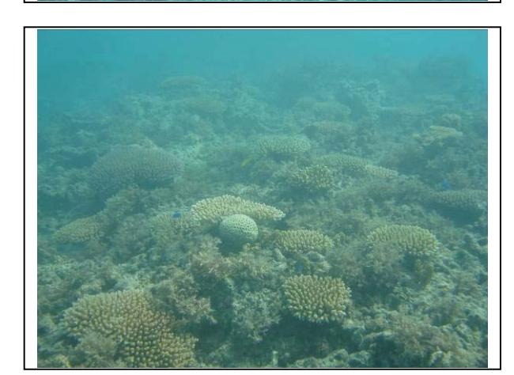

#### 6Wᑠᓥ༡♋⦕

ㄪᰝ᪥㸸ᖹᡂ ᖺ ᭶ ᪥ ࢦࣥࢧ⫱⏕ᆺ㸸Ϭ㸦ከ✀ΰᡂᆺ㸧

ࢦࣥࢧ龠ᗘ㸸㸣 ᖺࢦࣥࢧࡢ龠ᗘ㸸㸣

ࢩࣜࢻ࣑㢮ࡢ᪂つຍධ㸸 ⩌య੍

㈅㢮㣗ࢡࣥࣛ㸸ϩ

┿㸸ㄪᰝᆅⅬࡢᾏ୰ᬒほ

ࢺ࣓ࣥࢥ㸸ᾏ⸴ከࢦࣥࢧࠊ࠸⩌య⏕㛗

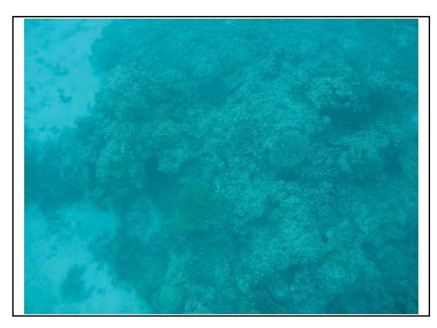

#### 6WᑠᓥᮾἈ㞳♋

ㄪᰝ᪥㸸ᖹᡂ ᖺ ᭶ ᪥ ࢦࣥࢧ⫱⏕ᆺ㸸Ϭ㸦ከ✀ΰᡂᆺ㸧

ࢦࣥࢧ龠ᗘ㸸㸣 ᖺࢦࣥࢧࡢ龠ᗘ㸸㸣

ࢩࣜࢻ࣑㢮ࡢ᪂つຍධ㸸 ⩌య੍

㈅㢮㣗ࢡࣥࣛ㸸Ϩ

┿㸸ㄪᰝᆅⅬࡢᾏ୰ᬒほ ࠸ከ⸴㸸ᾏࢺ࣓ࣥࢥ

ᅗ ྛㄪᰝᆅⅬࡢᾏ୰ᬒほཬࡧᴫἣ

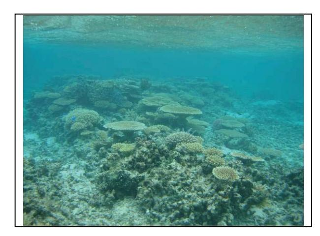

## 6Wᘺ┿ᓥᮾἈ♋ෆ⦕

ㄪᰝ᪥㸸ᖹᡂ ᖺ ᭶ ᪥ ࢦࣥࢧ⫱⏕ᆺ㸸Ϭ㸦ከ✀ΰᡂᆺ㸧

ࢦࣥࢧ龠ᗘ㸸㸣 ᖺࢦࣥࢧࡢ龠ᗘ㸸㸣

ࢩࣜࢻ࣑㢮ࡢ᪂つຍධ㸸 ⩌య੍

㈅㢮㣗ࢡࣥࣛ㸸Ϩ

┿㸸ㄪᰝᆅⅬࡢᾏ୰ᬒほ

ࢺ࣓ࣥࢥ㸸ྎ㢼◚ᦆࠊࡾ࠶ᾏ⸴ᑡࠊ࠸࡞ᑠᆺࣜࢻ࣑

ࢩ⩌య⏕㛗ⴭ࠸ࡋ㸦⿕ᗘᅇ㸧

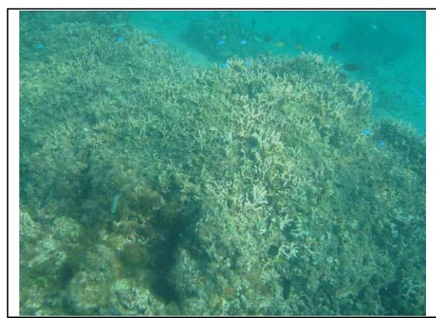

#### 6W㯮ᓥ༡ᮾᓊ♋ụෆ

ㄪᰝ᪥㸸ᖹᡂ ᖺ ᭶ ᪥ ࢦࣥࢧ⫱⏕ᆺ㸸Ϭ㸦ከ✀ΰᡂᆺ㸧

ࢦࣥࢧ龠ᗘ㸸㸣 ᖺࢦࣥࢧࡢ龠ᗘ㸸㸣

ࢩࣜࢻ࣑㢮ࡢ᪂つຍධ㸸 ⩌య੍

㈅㢮㣗ࢡࣥࣛ㸸ϩ ┿㸸ㄪᰝᆅⅬࡢᾏ୰ᬒほ ࡳ୪⸴㸸ᾏࢺ࣓ࣥࢥ

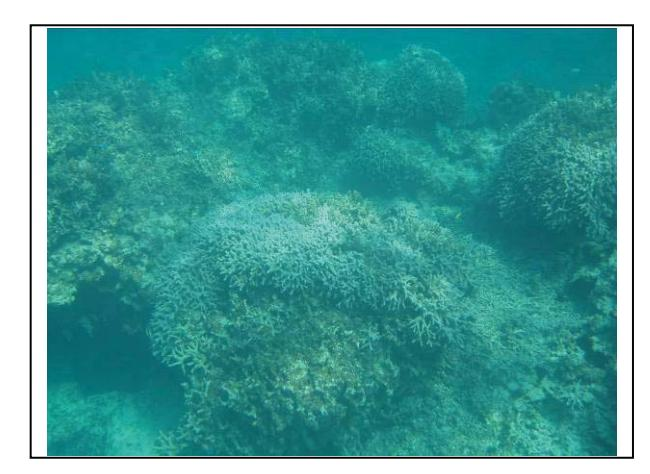

#### 6W㯮ᓥ༡すᓊ♋ụෆ

ㄪᰝ᪥㸸ᖹᡂ ᖺ ᭶ ᪥ ࢦࣥࢧ⫱⏕ᆺ㸸Ϭ㸦ከ✀ΰᡂᆺ㸧

ࢦࣥࢧ龠ᗘ㸸㸣

ᖺࢦࣥࢧࡢ龠ᗘ㸸㸣ᮍ‶

ࢩࣜࢻ࣑㢮ࡢ᪂つຍධ㸸 ⩌య੍

㈅㢮㣗ࢡࣥࣛ㸸Ϩ

┿㸸ㄪᰝᆅⅬࡢᾏ୰ᬒほ ࠸ከ⸴㸸ᾏࢺ࣓ࣥࢥ

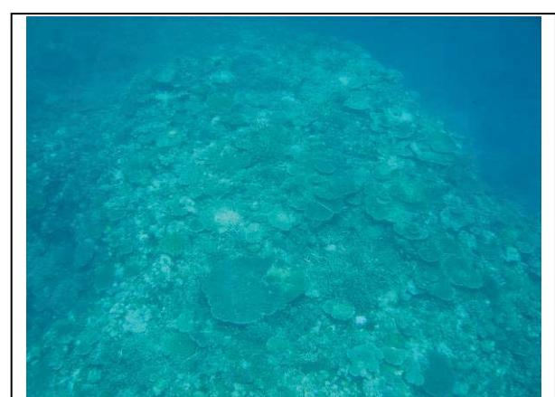

#### 6Wᘺ┿ᓥᮾἈ♋እ⦕

ㄪᰝ᪥㸸ᖹᡂ ᖺ ᭶ ᪥

ΰᡂᆺ㸧ࢩࣜࢻ࣑≦༟࣭≦ᯞᆺ㸸ϩ㸦⏕⫱ࢦࣥࢧ

ࢦࣥࢧ龠ᗘ㸸㸣 ᖺࢦࣥࢧࡢ龠ᗘ㸸㸣

ࢩࣜࢻ࣑㢮ࡢ᪂つຍධ㸸 ⩌య੍

㈅㢮㣗ࢡࣥࣛ㸸Ϩ

┿㸸ㄪᰝᆅⅬࡢᾏ୰ᬒほ

ࢺ࣓ࣥࢥ㸸ྎ㢼◚ᦆࠊᾏ⸴ᑡ࠸࡞

ᅗ ྛㄪᰝᆅⅬࡢᾏ୰ᬒほཬࡧᴫἣ

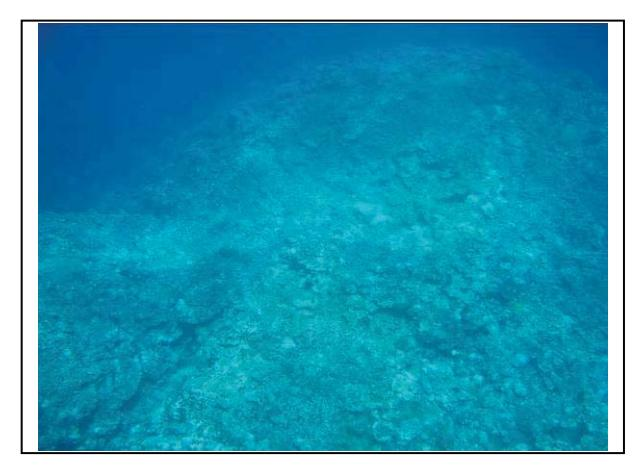

## 6Wᘺ┿ᓥᓊ♋እ⦕

ㄪᰝ᪥㸸ᖹᡂ ᖺ ᭶ ᪥ ࢦࣥࢧ⫱⏕ᆺ㸸Ϭ㸦ከ✀ΰᡂᆺ㸧

ࢦࣥࢧ龠ᗘ㸸㸣 ᖺࢦࣥࢧࡢ龠ᗘ㸸㸣

ࢩࣜࢻ࣑㢮ࡢ᪂つຍධ㸸 ⩌య੍

㈅㢮㣗ࢡࣥࣛ㸸Ϩ

┿㸸ㄪᰝᆅⅬࡢᾏ୰ᬒほ

ࢺ࣓ࣥࢥ㸸ྎ㢼◚ᦆࠊᾏ⸴ᑡ࠸࡞

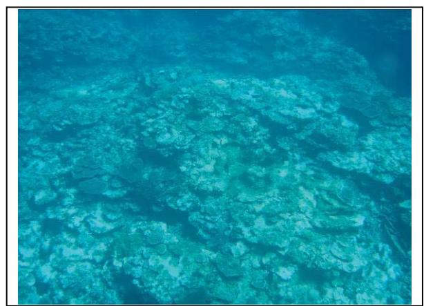

## 6Wᘺ┿ᓥᓊ♋እ⦕

ㄪᰝ᪥㸸ᖹᡂ ᖺ ᭶ ᪥

ඃ༨ᆺ㸧ࢩࣜࢻ࣑≦ᆺ㸸Ϫ㸦༟⏕⫱ࢦࣥࢧ

ࢦࣥࢧ龠ᗘ㸸㸣 ᖺࢦࣥࢧࡢ龠ᗘ㸸㸣

ࢩࣜࢻ࣑㢮ࡢ᪂つຍධ㸸 ⩌య੍

㈅㢮㣗ࢡࣥࣛ㸸ϩ ┿㸸ㄪᰝᆅⅬࡢᾏ୰ᬒほ

ࢺ࣓ࣥࢥ㸸ྎ㢼◚ᦆࠊᾏ⸴ᑡ࠸࡞

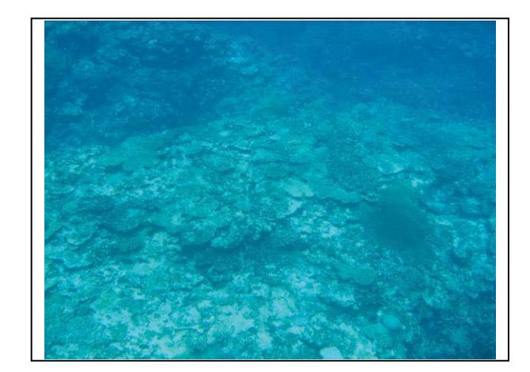

#### 6Wᑠᓥᓊ♋እ⦕

ㄪᰝ᪥㸸ᖹᡂ ᖺ ᭶ ᪥ ࢦࣥࢧ⫱⏕ᆺ㸸Ϭ㸦ከ✀ΰᡂᆺ㸧

ࢦࣥࢧ龠ᗘ㸸㸣 ᖺࢦࣥࢧࡢ龠ᗘ㸸㸣

ࢩࣜࢻ࣑㢮ࡢ᪂つຍධ㸸 ⩌య੍

㈅㢮㣗ࢡࣥࣛ㸸ϩ

┿㸸ㄪᰝᆅⅬࡢᾏ୰ᬒほ

ࢺ࣓ࣥࢥ㸸ྎ㢼◚ᦆࠊᾏ⸴ᑡ࠸࡞

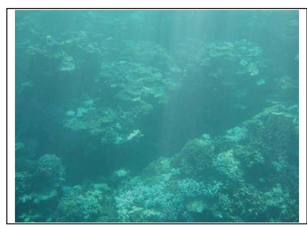

#### 6WࣛࢼࣚỈ㐨୰ኸ㒊

ㄪᰝ᪥㸸ᖹᡂ ᖺ ᭶ ᪥ ࢦࣥࢧ⫱⏕ᆺ㸸Ϭ㸦ከ✀ΰᡂᆺ㸧

ࢦࣥࢧ龠ᗘ㸸㸣 ᖺࢦࣥࢧࡢ龠ᗘ㸸㸣

ࢩࣜࢻ࣑㢮ࡢ᪂つຍධ㸸 ⩌య੍

㈅㢮㣗ࢡࣥࣛ㸸ϩ

┿㸸ㄪᰝᆅⅬࡢᾏ୰ᬒほ

ࢺ࣓ࣥࢥ㸸ྎ㢼◚ᦆࠊࡾ࠶ᾏ⸴ᑡࠊ࠸࡞龠ᗘపୗࡢ ࡞せᅉࡢࢹࢺࣄࢽ࡚࢜ࡋ㣗ᐖྎ㢼◚ᦆ

ࡾ࠶

ᅗ ྛㄪᰝᆅⅬࡢᾏ୰ᬒほཬࡧᴫἣ

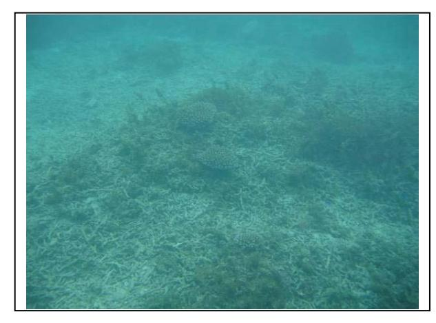

## 6W࣮ࣆ࣮ࢧ࣮እ⦕

ㄪᰝ᪥㸸ᖹᡂ ᖺ ᭶ ᪥ ࢦࣥࢧ⫱⏕ᆺ㸸Ϭ㸦ከ✀ΰᡂᆺ㸧

ࢦࣥࢧ龠ᗘ㸸㸣

ᖺࢦࣥࢧࡢ龠ᗘ㸸㸣ᮍ‶

ࢩࣜࢻ࣑㢮ࡢ᪂つຍධ㸸 ⩌య੍

㈅㢮㣗ࢡࣥࣛ㸸ϩ ┿㸸ㄪᰝᆅⅬࡢᾏ୰ᬒほ ࠸ከ⸴㸸ᾏࢺ࣓ࣥࢥ

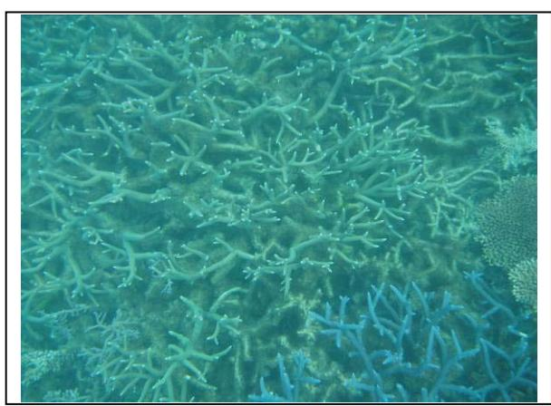

#### 6W࣮ࣆࣁࣀ࣐࢘♋ෆ

ㄪᰝ᪥㸸ᖹᡂ ᖺ ᭶ ᪥

ඃ༨ᆺ㸧ࢩࣜࢻ࣑≦ᯞᆺ㸸Ϩ㸦⏕⫱ࢦࣥࢧ

ࢦࣥࢧ龠ᗘ㸸㸣 ᖺࢦࣥࢧࡢ龠ᗘ㸸㸣

ࢩࣜࢻ࣑㢮ࡢ᪂つຍධ㸸 ⩌య੍

㈅㢮㣗ࢡࣥࣛ㸸Ϩ

┿㸸ㄪᰝᆅⅬࡢᾏ୰ᬒほ

ࢺ࣓ࣥࢥ㸸ྎ㢼◚ᦆࠊࡾ࠶ᾏ⸴ከ࠸

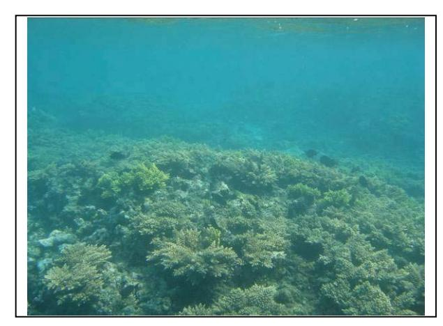

#### 6W࣮ࣆࣁࣀ࣐࢘♋ෆ

ㄪᰝ᪥㸸ᖹᡂ ᖺ ᭶ ᪥

ඃ༨ᆺ㸧ࢩࣜࢻ࣑≦ᯞᆺ㸸Ϩ㸦⏕⫱ࢦࣥࢧ

ࢦࣥࢧ龠ᗘ㸸㸣 ᖺࢦࣥࢧࡢ龠ᗘ㸸㸣

ࢩࣜࢻ࣑㢮ࡢ᪂つຍධ㸸 ⩌య੍

㈅㢮㣗ࢡࣥࣛ㸸ϩ

┿㸸ㄪᰝᆅⅬࡢᾏ୰ᬒほ

ࢺ࣓ࣥࢥ㸸ྎ㢼◚ᦆࠊࡾ࠶ᾏ⸴ᑡࠊ࠸࡞ᑠᆺࣜࢻ࣑

యቑຍ⩌ࢩ

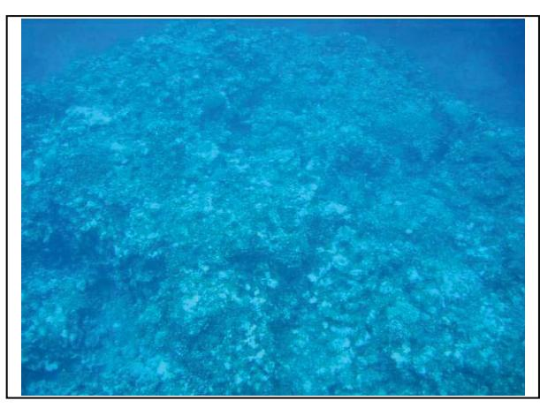

#### 6W࣮ࣆࣁࣀ࣐࢘♋ෆ

ㄪᰝ᪥㸸ᖹᡂ ᖺ ᭶ ᪥ ࢦࣥࢧ⫱⏕ᆺ㸸Ϭ㸦ከ✀ΰᡂᆺ㸧

ࢦࣥࢧ龠ᗘ㸸㸣 ᖺࢦࣥࢧࡢ龠ᗘ㸸㸣

ࢩࣜࢻ࣑㢮ࡢ᪂つຍධ㸸 ⩌య੍

㈅㢮㣗ࢡࣥࣛ㸸ϩ

┿㸸ㄪᰝᆅⅬࡢᾏ୰ᬒほ

ࢺ࣓ࣥࢥ㸸ྎ㢼◚ᦆࠊࡾ࠶ᾏ⸴ᑡ࠸࡞

ᅗ ྛㄪᰝᆅⅬࡢᾏ୰ᬒほཬࡧᴫἣ

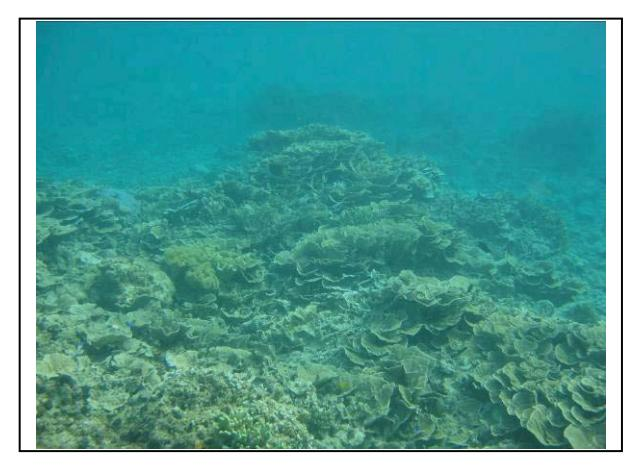

## 6W࣮ࣆࣁࣀ࣐࢘ෆ⦕

ㄪᰝ᪥㸸ᖹᡂ ᖺ ᭶ ᪥ ࢦࣥࢧ⫱⏕ᆺ㸸Ϭ㸦ከ✀ΰᡂᆺ㸧

ࢦࣥࢧ龠ᗘ㸸㸣 ᖺࢦࣥࢧࡢ龠ᗘ㸸㸣

ࢩࣜࢻ࣑㢮ࡢ᪂つຍධ㸸 ⩌య੍

㈅㢮㣗ࢡࣥࣛ㸸ϩ ┿㸸ㄪᰝᆅⅬࡢᾏ୰ᬒほ ࡳ୪⸴㸸ᾏࢺ࣓ࣥࢥ

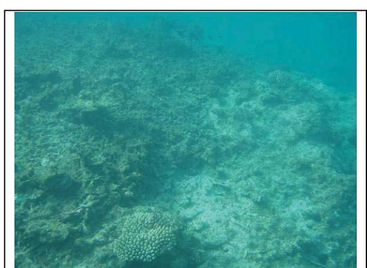

#### 6W࣮ࣆࣁࣀ࣐࢘ෆ⦕

ㄪᰝ᪥㸸ᖹᡂ ᖺ ᭶ ᪥ ࢦࣥࢧ⫱⏕ᆺ㸸Ϭ㸦ከ✀ΰᡂᆺ㸧

ࢦࣥࢧ龠ᗘ㸸㸣ᮍ‶ ᖺࢦࣥࢧࡢ龠ᗘ㸸㸣ᮍ‶

ࢩࣜࢻ࣑㢮ࡢ᪂つຍධ㸸 ⩌య੍

㈅㢮㣗ࢡࣥࣛ㸸Ϩ ┿㸸ㄪᰝᆅⅬࡢᾏ୰ᬒほ

ࢺ࣓ࣥࢥ㸸ྎ㢼◚ᦆࠊࡾ࠶ᾏ⸴ከ࠸

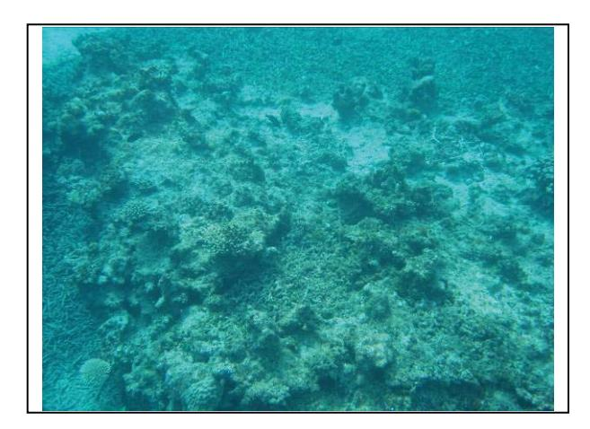

#### 6W࣮ࣆࣁࣀ࣐࢘ෆ⦕

ㄪᰝ᪥㸸ᖹᡂ ᖺ ᭶ ᪥ ࢦࣥࢧ⫱⏕ᆺ㸸Ϭ㸦ከ✀ΰᡂᆺ㸧

ࢦࣥࢧ龠ᗘ㸸㸣ᮍ‶ ᖺࢦࣥࢧࡢ龠ᗘ㸸㸣ᮍ‶

ࢩࣜࢻ࣑㢮ࡢ᪂つຍධ㸸 ⩌య੍

㈅㢮㣗ࢡࣥࣛ㸸Ϩ

┿㸸ㄪᰝᆅⅬࡢᾏ୰ᬒほ

ࢺ࣓ࣥࢥ㸸ྎ㢼◚ᦆࠊࡾ࠶ᾏ⸴୪ࡳ

#### 6W࣮ࣆࣁࣀ࣐࢘ෆ⦕

ㄪᰝ᪥㸸ᖹᡂ ᖺ ᭶ ᪥ ࢦࣥࢧ⫱⏕ᆺ㸸Ϭ㸦ከ✀ΰᡂᆺ㸧

ࢦࣥࢧ龠ᗘ㸸㸣 ᖺࢦࣥࢧࡢ龠ᗘ㸸㸣

ࢩࣜࢻ࣑㢮ࡢ᪂つຍධ㸸 ⩌య੍

㈅㢮㣗ࢡࣥࣛ㸸ϩ

┿㸸ㄪᰝᆅⅬࡢᾏ୰ᬒほ

ࢺ࣓ࣥࢥ㸸ྎ㢼◚ᦆࠊࡾ࠶ᾏ⸴ᑡࠊ࠸࡞ᑠᆺࣜࢻ࣑

యቑຍ⩌ࢩ

ᅗ ྛㄪᰝᆅⅬࡢᾏ୰ᬒほཬࡧᴫἣ

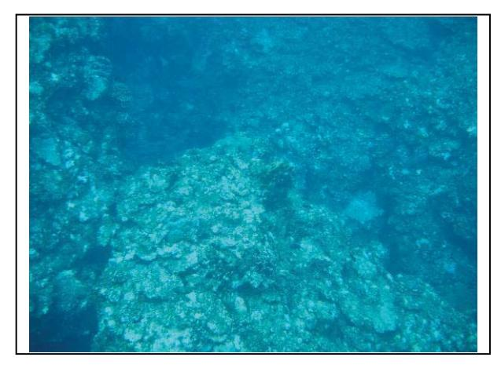

## 6W࣮ࣆࣁࣀ࣐࢘እ⦕

ㄪᰝ᪥㸸ᖹᡂ ᖺ ᭶ ᪥ ࢦࣥࢧ⫱⏕ᆺ㸸Ϭ㸦ከ✀ΰᡂᆺ㸧

ࢦࣥࢧ龠ᗘ㸸㸣

ᖺࢦࣥࢧࡢ龠ᗘ㸸㸣ᮍ‶

ࢩࣜࢻ࣑㢮ࡢ᪂つຍධ㸸 ⩌య੍

㈅㢮㣗ࢡࣥࣛ㸸ϩ

┿㸸ㄪᰝᆅⅬࡢᾏ୰ᬒほ

ࢺ࣓ࣥࢥ㸸ྎ㢼◚ᦆࠊࡾ࠶ᾏ⸴ᑡࠊ࠸࡞ᑠᆺࣜࢻ࣑

యቑຍ⩌ࢩ

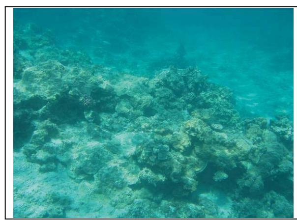

#### 6W᪂ᇛᓥỈ㊰㒊♋ụෆ

ㄪᰝ᪥㸸ᖹᡂ ᖺ ᭶ ᪥ ࢦࣥࢧ⫱⏕ᆺ㸸Ϭ㸦ከ✀ΰᡂᆺ㸧

ࢦࣥࢧ龠ᗘ㸸㸣 ᖺࢦࣥࢧࡢ龠ᗘ㸸㸣

ࢩࣜࢻ࣑㢮ࡢ᪂つຍධ㸸 ⩌య੍

㈅㢮㣗ࢡࣥࣛ㸸ϩ ┿㸸ㄪᰝᆅⅬࡢᾏ୰ᬒほ ࠸࡞ᑡ⸴㸸ᾏࢺ࣓ࣥࢥ

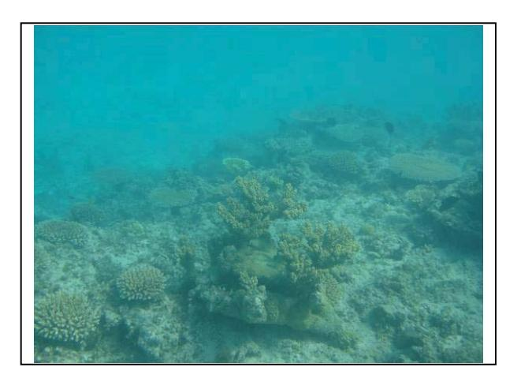

#### 6W࣮ࣆ࣮ࢧ࣮ෆ⦕

ㄪᰝ᪥㸸ᖹᡂ ᖺ ᭶ ᪥ ࢦࣥࢧ⫱⏕ᆺ㸸Ϭ㸦ከ✀ΰᡂᆺ㸧

ࢦࣥࢧ龠ᗘ㸸㸣 ᖺࢦࣥࢧࡢ龠ᗘ㸸㸣

ࢩࣜࢻ࣑㢮ࡢ᪂つຍධ㸸 ⩌య੍

㈅㢮㣗ࢡࣥࣛ㸸Ϩ

┿㸸ㄪᰝᆅⅬࡢᾏ୰ᬒほ

ࢺ࣓ࣥࢥ㸸ྎ㢼◚ᦆࠊࡾ࠶ᾏ⸴ከࠊ࠸ᑠᆺࢩࣜࢻ࣑

⩌యቑຍ

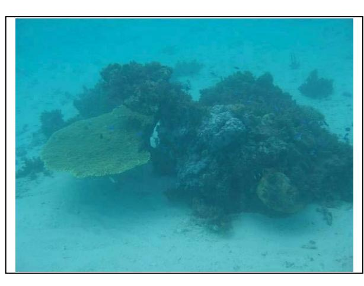

#### 6W࣮ࣆ࣮ࢧ࣮ෆ⦕

ㄪᰝ᪥㸸ᖹᡂ ᖺ ᭶ ᪥ ࢦࣥࢧ⫱⏕ᆺ㸸Ϭ㸦ከ✀ΰᡂᆺ㸧

ࢦࣥࢧ龠ᗘ㸸㸣 ᖺࢦࣥࢧࡢ龠ᗘ㸸㸣

ࢩࣜࢻ࣑㢮ࡢ᪂つຍධ㸸 ⩌య੍

㈅㢮㣗ࢡࣥࣛ㸸ϩ

┿㸸ㄪᰝᆅⅬࡢᾏ୰ᬒほ

ࢺ࣓ࣥࢥ㸸ྎ㢼◚ᦆࠊࡾ࠶ᾏ⸴ከ࠸

ᅗ ྛㄪᰝᆅⅬࡢᾏ୰ᬒほཬࡧᴫἣ

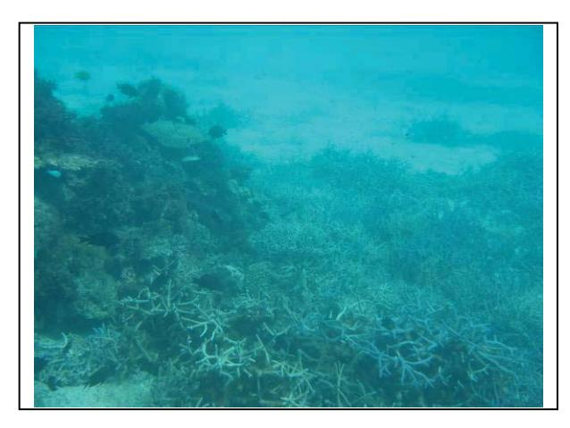

## 6W࣮ࣆ࣮ࢧ࣮ෆ⦕

ㄪᰝ᪥㸸ᖹᡂ ᖺ ᭶ ᪥

ඃ༨ᆺ㸧ࢩࣜࢻ࣑≦ᯞᆺ㸸Ϩ㸦⏕⫱ࢦࣥࢧ

ࢦࣥࢧ龠ᗘ㸸㸣 ᖺࢦࣥࢧࡢ龠ᗘ㸸㸣

ࢩࣜࢻ࣑㢮ࡢ᪂つຍධ㸸 ⩌య੍

㈅㢮㣗ࢡࣥࣛ㸸Ϩ

┿㸸ㄪᰝᆅⅬࡢᾏ୰ᬒほ

ࢺ࣓ࣥࢥ㸸ྎ㢼◚ᦆࠊࡾ࠶ᾏ⸴୪ࡳ

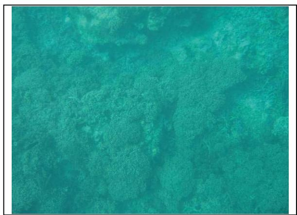

#### 6W࣮ࣆ࣮ࢧ࣮ෆ⦕

ㄪᰝ᪥㸸ᖹᡂ ᖺ ᭶ ᪥

ඃ༨ᆺ㸧ࢦࣥࢧ࣑ࢨࢲ࢚ᆺ㸸ϫ㸦⏕⫱ࢦࣥࢧ

ࢦࣥࢧ龠ᗘ㸸㸣 ᖺࢦࣥࢧࡢ龠ᗘ㸸㸣

ࢩࣜࢻ࣑㢮ࡢ᪂つຍධ㸸 ⩌య੍

㈅㢮㣗ࢡࣥࣛ㸸Ϩ ┿㸸ㄪᰝᆅⅬࡢᾏ୰ᬒほ

ࢺ࣓ࣥࢥ㸸ྎ㢼◚ᦆࠊࡾ࠶ᾏ⸴ከ࠸

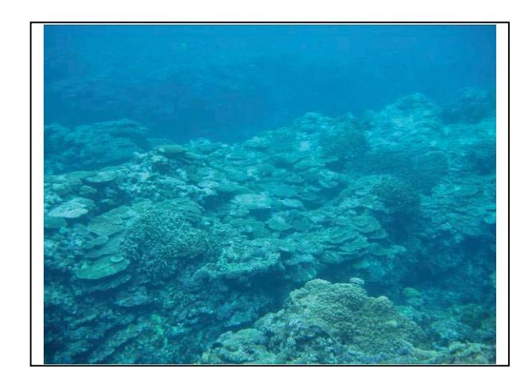

## 6W࣮ࣆࣁࣀ࣐࢘እ⦕

ㄪᰝ᪥㸸ᖹᡂ ᖺ ᭶ ᪥ ࢦࣥࢧ⫱⏕ᆺ㸸Ϭ㸦ከ✀ΰᡂᆺ㸧

ࢦࣥࢧ龠ᗘ㸸㸣 ᖺࢦࣥࢧࡢ龠ᗘ㸸㸣

ࢩࣜࢻ࣑㢮ࡢ᪂つຍධ㸸 ⩌య੍

㈅㢮㣗ࢡࣥࣛ㸸ϩ

┿㸸ㄪᰝᆅⅬࡢᾏ୰ᬒほ

ࢺ࣓ࣥࢥ㸸ྎ㢼◚ᦆࠊࡾ࠶ᾏ⸴ᑡ࠸࡞

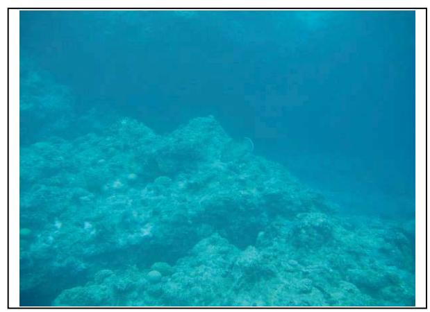

#### 6W㯮ᓥ༡すᓊ♋እ⦕

ㄪᰝ᪥㸸ᖹᡂ ᖺ ᭶ ᪥ ࢦࣥࢧ⫱⏕ᆺ㸸Ϭ㸦ከ✀ΰᡂᆺ㸧

ࢦࣥࢧ龠ᗘ㸸㸣 ᖺࢦࣥࢧࡢ龠ᗘ㸸㸣

ࢩࣜࢻ࣑㢮ࡢ᪂つຍධ㸸 ⩌య੍

㈅㢮㣗ࢡࣥࣛ㸸ϩ

┿㸸ㄪᰝᆅⅬࡢᾏ୰ᬒほ

ࡿ࡞ETBࡃࡁᗘ⿕ࡾࡼሙᡤࠊ࠸࡞ᑡ⸴㸸ᾏࢺ࣓ࣥࢥ

ᅗ ྛㄪᰝᆅⅬࡢᾏ୰ᬒほཬࡧᴫἣ

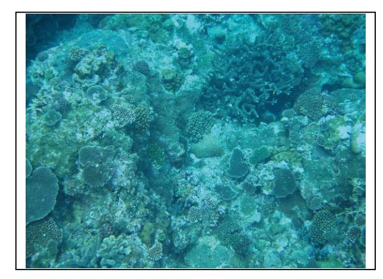

## 6W㯮ᓥ༡ᓊ♋እ⦕

ㄪᰝ᪥㸸ᖹᡂ ᖺ ᭶ ᪥ ࢦࣥࢧ⫱⏕ᆺ㸸Ϭ㸦ከ✀ΰᡂᆺ㸧

ࢦࣥࢧ龠ᗘ㸸㸣 ᖺࢦࣥࢧࡢ龠ᗘ㸸㸣

ࢩࣜࢻ࣑㢮ࡢ᪂つຍධ㸸 ⩌య੍

㈅㢮㣗ࢡࣥࣛ㸸ϩ

┿㸸ㄪᰝᆅⅬࡢᾏ୰ᬒほ

ࢺ࣓ࣥࢥ㸸ྎ㢼◚ᦆࠊࡾ࠶ᾏ⸴ᑡࠊ࠸࡞ሙᡤࡾࡼ龠

ࡿ࡞ETBࡃࡁᗘ

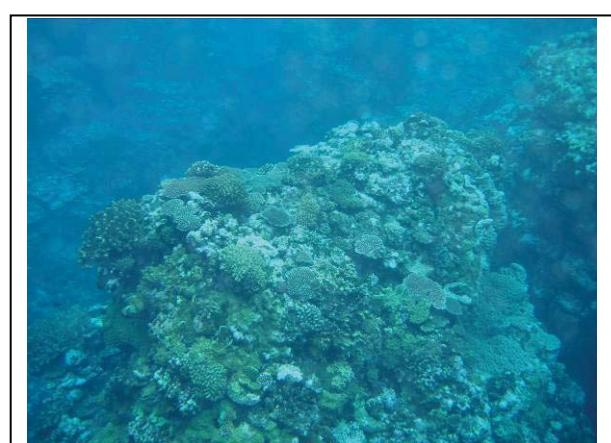

#### 6Wࢳࢢࣥࣕ࢟ᾏ୰බᅬᆅ༊

ㄪᰝ᪥㸸ᖹᡂ ᖺ ᭶ ᪥ ࢦࣥࢧ⫱⏕ᆺ㸸Ϭ㸦ከ✀ΰᡂᆺ㸧

ࢦࣥࢧ龠ᗘ㸸㸣 ᖺࢦࣥࢧࡢ龠ᗘ㸸㸣

ࢩࣜࢻ࣑㢮ࡢ᪂つຍධ㸸 ⩌య੍

㈅㢮㣗ࢡࣥࣛ㸸ϩ ┿㸸ㄪᰝᆅⅬࡢᾏ୰ᬒほ

ࢺ࣓ࣥࢥ㸸ྎ㢼◚ᦆࡾ࠶㸦␚ᅄ␚ࡢᒾ┙ᔂⴠ㸧ࠊᾏ

࠸࡞ᑡ⸴

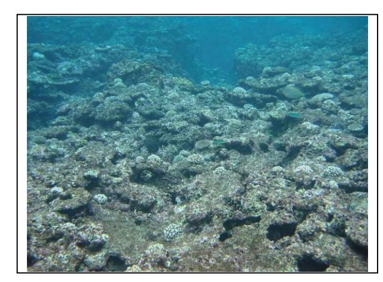

#### 6W㯮ᓥᮾᓊ♋እ⦕

ㄪᰝ᪥㸸ᖹᡂ ᖺ ᭶ ᪥ ࢦࣥࢧ⫱⏕ᆺ㸸Ϭ㸦ከ✀ΰᡂᆺ㸧

ࢦࣥࢧ龠ᗘ㸸㸣 ᖺࢦࣥࢧࡢ龠ᗘ㸸㸣

ࢩࣜࢻ࣑㢮ࡢ᪂つຍධ㸸 ⩌య੍

㈅㢮㣗ࢡࣥࣛ㸸Ϩ

┿㸸ㄪᰝᆅⅬࡢᾏ୰ᬒほ

ࢺ࣓ࣥࢥ㸸ྎ㢼◚ᦆࠊࡾ࠶ᾏ⸴ᑡࠊ࠸࡞ᑠᆺࣜࢻ࣑

యቑຍ⩌ࢩ

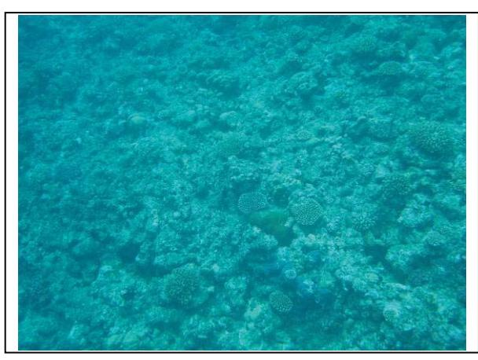

#### 6W᪂ᇛᓥୖᆅᮾᓊ♋እ⦕

ㄪᰝ᪥㸸ᖹᡂ ᖺ ᭶ ᪥ ࢦࣥࢧ⫱⏕ᆺ㸸Ϭ㸦ከ✀ΰᡂᆺ㸧

ࢦࣥࢧ龠ᗘ㸸㸣 ᖺࢦࣥࢧࡢ龠ᗘ㸸㸣

ࢩࣜࢻ࣑㢮ࡢ᪂つຍධ㸸 ⩌య੍

㈅㢮㣗ࢡࣥࣛ㸸ϩ

┿㸸ㄪᰝᆅⅬࡢᾏ୰ᬒほ ࠸࡞ᑡ⸴㸸ᾏࢺ࣓ࣥࢥ

ᅗ ྛㄪᰝᆅⅬࡢᾏ୰ᬒほཬࡧᴫἣ

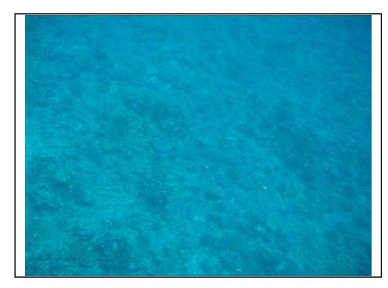

## 6W᪂ᇛᓥୗᆅ༡ᮾᓊ♋እ⦕

ㄪᰝ᪥㸸ᖹᡂ ᖺ ᭶ ᪥ ࢦࣥࢧ⫱⏕ᆺ㸸Ϭ㸦ከ✀ΰᡂᆺ㸧

ࢦࣥࢧ龠ᗘ㸸㸣 ᖺࢦࣥࢧࡢ龠ᗘ㸸㸣

ࢩࣜࢻ࣑㢮ࡢ᪂つຍධ㸸 ⩌య੍

㈅㢮㣗ࢡࣥࣛ㸸ϩ ┿㸸ㄪᰝᆅⅬࡢᾏ୰ᬒほ ࠸࡞ᑡ⸴㸸ᾏࢺ࣓ࣥࢥ

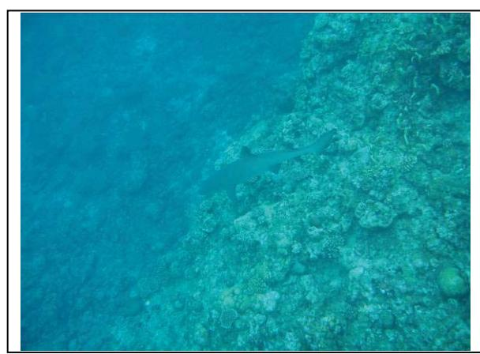

#### 6W᪂ᇛᓥୗᆅすᓊ♋እ⦕

ㄪᰝ᪥㸸ᖹᡂ ᖺ ᭶ ᪥ ࢦࣥࢧ⫱⏕ᆺ㸸Ϭ㸦ከ✀ΰᡂᆺ㸧

ࢦࣥࢧ龠ᗘ㸸㸣 ᖺࢦࣥࢧࡢ龠ᗘ㸸㸣

ࢩࣜࢻ࣑㢮ࡢ᪂つຍධ㸸 ⩌య੍

㈅㢮㣗ࢡࣥࣛ㸸ϩ ┿㸸ㄪᰝᆅⅬࡢᾏ୰ᬒほ

ࢺ࣓ࣥࢥ㸸ᾏ⸴ᑡࠊ࠸࡞♋ཎୖᑠᆺࢩࣜࢻ࣑⩌యቑ

ࡿ࠼

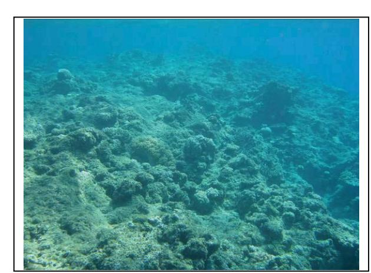

#### 6W᪂ᇛᓥすἈ㞳♋

ㄪᰝ᪥㸸ᖹᡂ ᖺ ᭶ ᪥ ࢦࣥࢧ⫱⏕ᆺ㸸Ϭ㸦ከ✀ΰᡂᆺ㸧

ࢦࣥࢧ龠ᗘ㸸㸣 ᖺࢦࣥࢧࡢ龠ᗘ㸸㸣

ࢩࣜࢻ࣑㢮ࡢ᪂つຍධ㸸 ⩌య੍

㈅㢮㣗ࢡࣥࣛ㸸ϩ

┿㸸ㄪᰝᆅⅬࡢᾏ୰ᬒほ

ࢺ࣓ࣥࢥ㸸ྎ㢼◚ᦆࠊࡾ࠶ᾏ⸴ᑡ࠸࡞

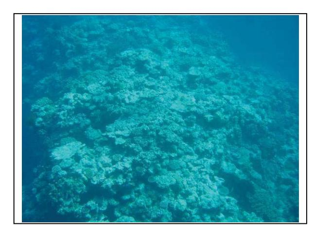

#### 6W᪂ᇛᓥ࣮す⾲ᓥ㛫㞳♋

ㄪᰝ᪥㸸ᖹᡂ ᖺ ᭶ ᪥ ࢦࣥࢧ⫱⏕ᆺ㸸Ϭ㸦ከ✀ΰᡂᆺ㸧

ࢦࣥࢧ龠ᗘ㸸㸣 ᖺࢦࣥࢧࡢ龠ᗘ㸸㸣

ࢩࣜࢻ࣑㢮ࡢ᪂つຍධ㸸 ⩌య੍

㈅㢮㣗ࢡࣥࣛ㸸ϩ

┿㸸ㄪᰝᆅⅬࡢᾏ୰ᬒほ

ࢺ࣓ࣥࢥ㸸ᾏ⸴ᑡࠊ࠸࡞ᆺ༟≧Ṛ⁛ከࠊ࠸ᑠᆺࢻ࣑

యቑຍ⩌ࢩࣜ

ᅗ ྛㄪᰝᆅⅬࡢᾏ୰ᬒほཬࡧᴫἣ

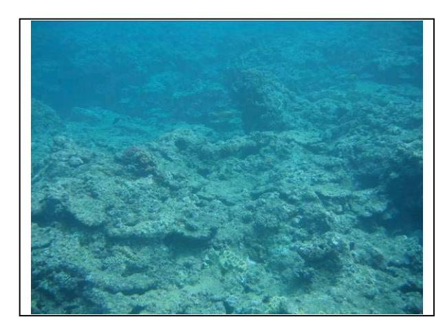

## 6W༡㢼ぢᓮἈ㞳♋እ⦕ᮾ

ㄪᰝ᪥㸸ᖹᡂ ᖺ ᭶ ᪥ ࢦࣥࢧ⫱⏕ᆺ㸸Ϭ㸦ከ✀ΰᡂᆺ㸧

ࢦࣥࢧ龠ᗘ㸸㸣 ᖺࢦࣥࢧࡢ龠ᗘ㸸㸣

ࢩࣜࢻ࣑㢮ࡢ᪂つຍධ㸸 ⩌య੍

㈅㢮㣗ࢡࣥࣛ㸸ϩ ┿㸸ㄪᰝᆅⅬࡢᾏ୰ᬒほ

ࢺ࣓ࣥࢥ㸸ྎ㢼◚ᦆࠊࡾ࠶ᾏ⸴ᑡ࠸࡞

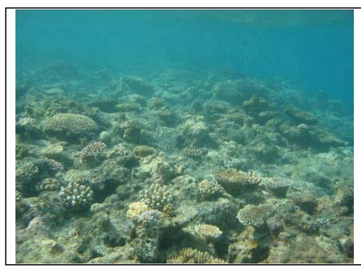

#### 6W᪂ᇛᓥ࣮す⾲ᓥ㛫㞳♋

ㄪᰝ᪥㸸ᖹᡂ ᖺ ᭶ ᪥ ࢦࣥࢧ⫱⏕ᆺ㸸Ϭ㸦ከ✀ΰᡂᆺ㸧

ࢦࣥࢧ龠ᗘ㸸㸣 ᖺࢦࣥࢧࡢ龠ᗘ㸸㸣

ࢩࣜࢻ࣑㢮ࡢ᪂つຍධ㸸 ⩌య੍

㈅㢮㣗ࢡࣥࣛ㸸ϩ ┿㸸ㄪᰝᆅⅬࡢᾏ୰ᬒほ

ࢺ࣓ࣥࢥ㸸ྎ㢼◚ᦆࠊࡾ࠶ᾏ⸴ᑡࠊ࠸࡞ᑠᆺࣜࢻ࣑

యቑຍ⩌ࢩ

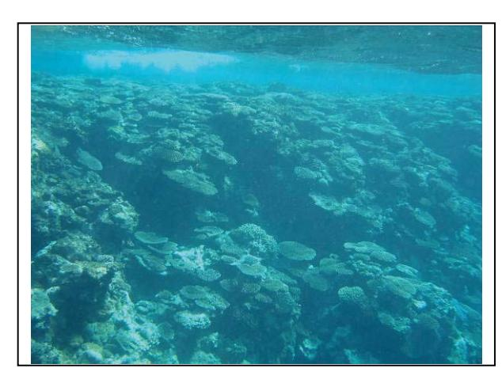

#### 6W㯮ᓥ࣮᪂ᇛᓥ㛫ᆺ㞳♋

ㄪᰝ᪥㸸ᖹᡂ ᖺ ᭶ ᪥ ࢦࣥࢧ⫱⏕ᆺ㸸Ϭ㸦ከ✀ΰᡂᆺ㸧

ࢦࣥࢧ龠ᗘ㸸㸣 ᖺࢦࣥࢧࡢ龠ᗘ㸸㸣

ࢩࣜࢻ࣑㢮ࡢ᪂つຍධ㸸 ⩌య੍

㈅㢮㣗ࢡࣥࣛ㸸ϩ

┿㸸ㄪᰝᆅⅬࡢᾏ୰ᬒほ

ࢺ࣓ࣥࢥ㸸ྎ㢼◚ᦆࠊࡾ࠶ᾏ⸴ᑡ࠸࡞

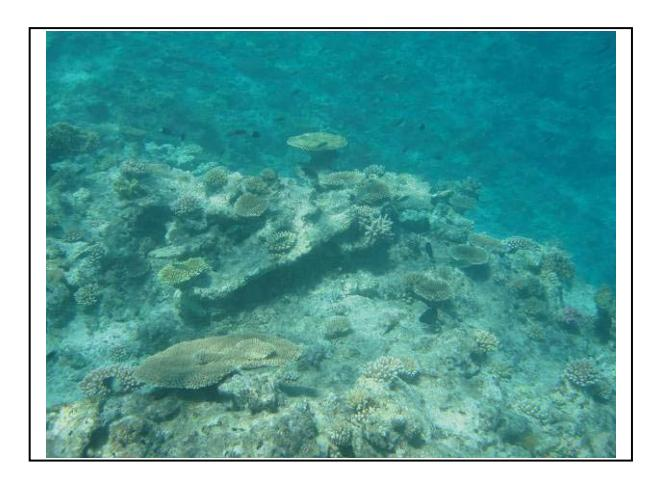

#### 6W㯮ᓥすἈ㞳♋

ㄪᰝ᪥㸸ᖹᡂ ᖺ ᭶ ᪥ ࢦࣥࢧ⫱⏕ᆺ㸸Ϭ㸦ከ✀ΰᡂᆺ㸧

ࢦࣥࢧ龠ᗘ㸸㸣 ᖺࢦࣥࢧࡢ龠ᗘ㸸㸣

ࢩࣜࢻ࣑㢮ࡢ᪂つຍධ㸸 ⩌య੍

㈅㢮㣗ࢡࣥࣛ㸸ϩ

┿㸸ㄪᰝᆅⅬࡢᾏ୰ᬒほ

ࢺ࣓ࣥࢥ㸸ྎ㢼◚ᦆࠊࡾ࠶ᾏ⸴ᑡࠊ࠸࡞ᑠᆺࣜࢻ࣑

యቑຍ⩌ࢩ

ᅗ ྛㄪᰝᆅⅬࡢᾏ୰ᬒほཬࡧᴫἣ

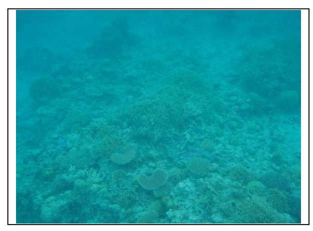

## 6Wᑠᓥ༡Ἀ㞳♋

ㄪᰝ᪥㸸ᖹᡂ ᖺ ᭶ ᪥ ࢦࣥࢧ⫱⏕ᆺ㸸Ϭ㸦ከ✀ΰᡂᆺ㸧

ࢦࣥࢧ龠ᗘ㸸㸣 ᖺࢦࣥࢧࡢ龠ᗘ㸸㸣

ࢩࣜࢻ࣑㢮ࡢ᪂つຍධ㸸 ⩌య੍

㈅㢮㣗ࢡࣥࣛ㸸ϩ ┿㸸ㄪᰝᆅⅬࡢᾏ୰ᬒほ ࠸࡞ᑡ⸴㸸ᾏࢺ࣓ࣥࢥ

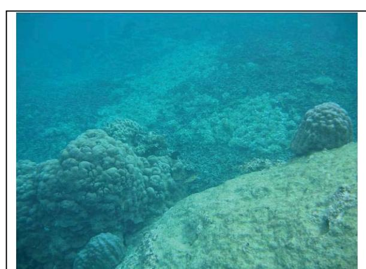

#### 6WࣛࢼࣚỈ㐨༡Ἀ㞳♋

ㄪᰝ᪥㸸ᖹᡂ ᖺ ᭶ ᪥ ࢦࣥࢧ⫱⏕ᆺ㸸Ϭ㸦ከ✀ΰᡂᆺ㸧

ࢦࣥࢧ龠ᗘ㸸㸣ᮍ‶ ᖺࢦࣥࢧࡢ龠ᗘ㸸㸣ᮍ‶

ࢩࣜࢻ࣑㢮ࡢ᪂つຍධ㸸 ⩌య੍

㈅㢮㣗ࢡࣥࣛ㸸ϩ ┿㸸ㄪᰝᆅⅬࡢᾏ୰ᬒほ ࢺ࣓ࣥࢥ㸸ᾏ⸴ከ࠸㸦⸛⸴ከ࠸㸧

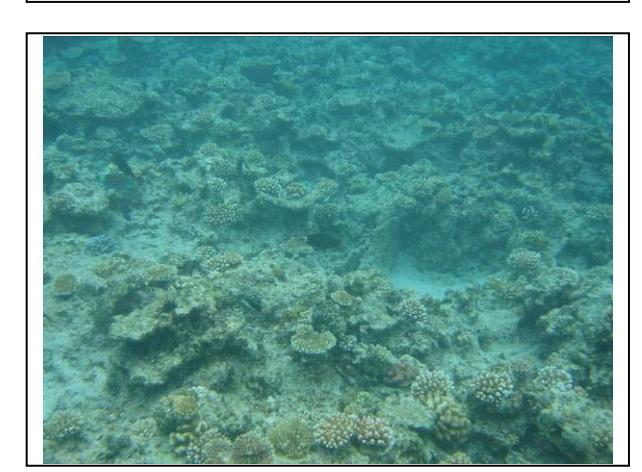

#### 6W➉ᐩᓥ༡Ἀ㞳♋

ㄪᰝ᪥㸸ᖹᡂ ᖺ ᭶ ᪥ ࢦࣥࢧ⫱⏕ᆺ㸸Ϭ㸦ከ✀ΰᡂᆺ㸧

ࢦࣥࢧ龠ᗘ㸸㸣 ᖺࢦࣥࢧࡢ龠ᗘ㸸㸣

ࢩࣜࢻ࣑㢮ࡢ᪂つຍධ㸸 ⩌య੍

㈅㢮㣗ࢡࣥࣛ㸸ϩ ┿㸸ㄪᰝᆅⅬࡢᾏ୰ᬒほ

ࢺ࣓ࣥࢥ㸸ྎ㢼◚ᦆࠊࡾ࠶ᾏ⸴ᑡࠊ࠸࡞ᑠᆺࣜࢻ࣑

యቑຍ⩌ࢩ

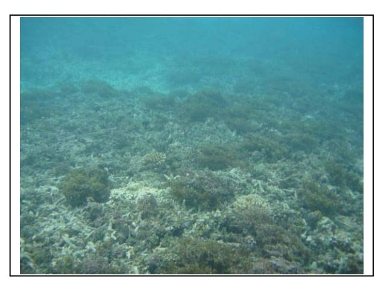

#### 6WᑠᓥᮾἈ㞳♋

ㄪᰝ᪥㸸ᖹᡂ ᖺ ᭶ ᪥ ࢦࣥࢧ⫱⏕ᆺ㸸Ϭ㸦ከ✀ΰᡂᆺ㸧

ࢦࣥࢧ龠ᗘ㸸㸣ᮍ‶ ᖺࢦࣥࢧࡢ龠ᗘ㸸㸣ᮍ‶

ࢩࣜࢻ࣑㢮ࡢ᪂つຍධ㸸 ⩌య੍

㈅㢮㣗ࢡࣥࣛ㸸Ϩ

┿㸸ㄪᰝᆅⅬࡢᾏ୰ᬒほ

ࢺ࣓ࣥࢥ㸸ྎ㢼◚ᦆࠊࡾ࠶ᾏ⸴ከ࠸

ᅗ ྛㄪᰝᆅⅬࡢᾏ୰ᬒほཬࡧᴫἣ

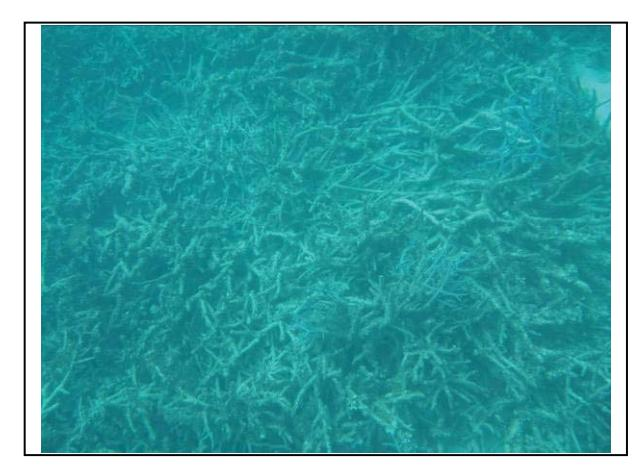

## 6Wᑠᓥ༡ᮾἈ㞳♋

ㄪᰝ᪥㸸ᖹᡂ ᖺ ᭶ ᪥ ࢦࣥࢧ⫱⏕ᆺ㸸Ϭ㸦ከ✀ΰᡂᆺ㸧

ࢦࣥࢧ龠ᗘ㸸㸣 ᖺࢦࣥࢧࡢ龠ᗘ㸸㸣

ࢩࣜࢻ࣑㢮ࡢ᪂つຍධ㸸 ⩌య੍

㈅㢮㣗ࢡࣥࣛ㸸Ϩ

┿㸸ㄪᰝᆅⅬࡢᾏ୰ᬒほ ࠸ከ⸴㸸ᾏࢺ࣓ࣥࢥ

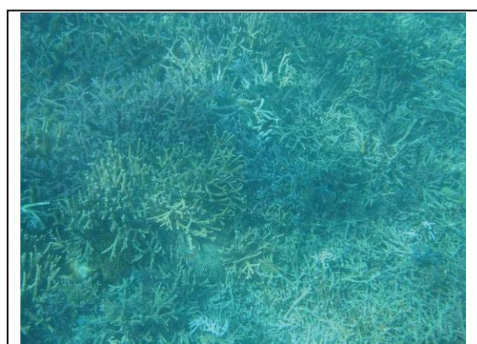

#### 6Wࢳࢢࣥࢻ࢟ࢱᾏ୰බᅬᆅ༊

ㄪᰝ᪥㸸ᖹᡂ ᖺ ᭶ ᪥

ඃ༨ᆺ㸧ࢩࣜࢻ࣑≦ᯞᆺ㸸Ϩ㸦⏕⫱ࢦࣥࢧ

ࢦࣥࢧ龠ᗘ㸸㸣 ᖺࢦࣥࢧࡢ龠ᗘ㸸㸣

ࢩࣜࢻ࣑㢮ࡢ᪂つຍධ㸸 ⩌య੍

㈅㢮㣗ࢡࣥࣛ㸸Ϫ ┿㸸ㄪᰝᆅⅬࡢᾏ୰ᬒほ

ࢺ࣓ࣥࢥ㸸ྎ㢼◚ᦆࠊࡾ࠶ᾏ⸴ᑡࠊ࠸࡞ᚋ୰ᆺࡽ ࡞ᖜࡿࡼ㣗ᐖࡢ㞟ᅋࢹࢺࣄࢽ࢜ࡢᆺ

ࡿࢀࡉᠱᛕࡀపୗࡢᗘ⿕

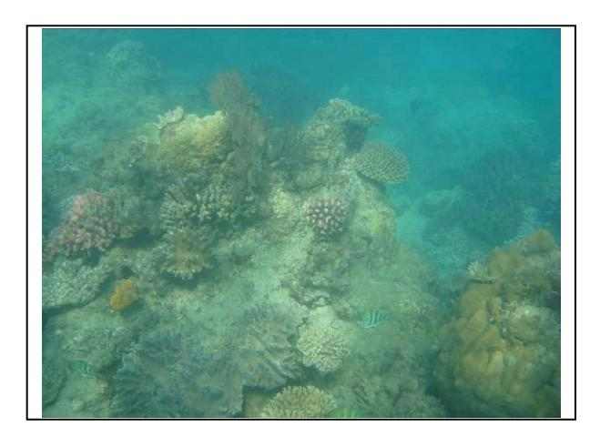

#### 6Wす⾲ᓥ௰㛫ᓮἈ㞳♋

ㄪᰝ᪥㸸ᖹᡂ ᖺ ᭶ ᪥ ࢦࣥࢧ⫱⏕ᆺ㸸Ϭ㸦ከ✀ΰᡂᆺ㸧

ࢦࣥࢧ龠ᗘ㸸㸣 ᖺࢦࣥࢧࡢ龠ᗘ㸸㸣

ࢩࣜࢻ࣑㢮ࡢ᪂つຍධ㸸 ⩌య੍

㈅㢮㣗ࢡࣥࣛ㸸Ϩ

┿㸸ㄪᰝᆅⅬࡢᾏ୰ᬒほ

ࢺ࣓ࣥࢥ㸸ྎ㢼◚ᦆࠊࡾ࠶ᾏ⸴୪ࠊࡳᾏⲡࡾ࠶

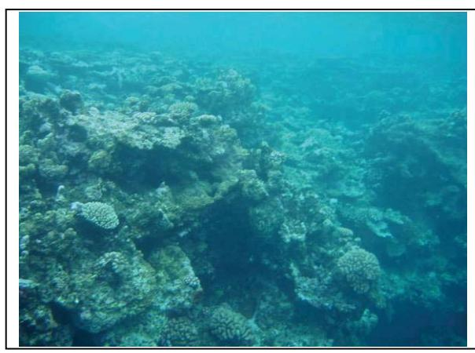

#### 6W➉ᐩᓥ༡Ἀ㞳♋

ㄪᰝ᪥㸸ᖹᡂ ᖺ ᭶ ᪥ ࢦࣥࢧ⫱⏕ᆺ㸸Ϭ㸦ከ✀ΰᡂᆺ㸧

ࢦࣥࢧ龠ᗘ㸸㸣 ᖺࢦࣥࢧࡢ龠ᗘ㸸㸣

ࢩࣜࢻ࣑㢮ࡢ᪂つຍධ㸸 ⩌య੍

㈅㢮㣗ࢡࣥࣛ㸸Ϩ

┿㸸ㄪᰝᆅⅬࡢᾏ୰ᬒほ ࠸࡞ᑡ⸴㸸ᾏࢺ࣓ࣥࢥ

ᅗ ྛㄪᰝᆅⅬࡢᾏ୰ᬒほཬࡧᴫἣ

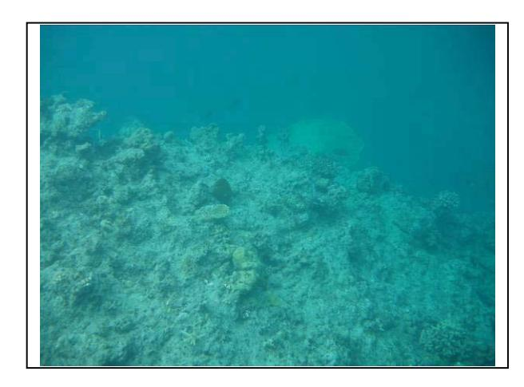

## 6W࣮ࣆࣁࣀ࣐࢘♋ෆ

ㄪᰝ᪥㸸ᖹᡂ ᖺ ᭶ ᪥ ࢦࣥࢧ⫱⏕ᆺ㸸Ϭ㸦ከ✀ΰᡂᆺ㸧

ࢦࣥࢧ龠ᗘ㸸㸣 ᖺࢦࣥࢧࡢ龠ᗘ㸸㸣

ࢩࣜࢻ࣑㢮ࡢ᪂つຍධ㸸 ⩌య੍

㈅㢮㣗ࢡࣥࣛ㸸Ϩ

┿㸸ㄪᰝᆅⅬࡢᾏ୰ᬒほ ࠸࡞ᑡ⸴㸸ᾏࢺ࣓ࣥࢥ

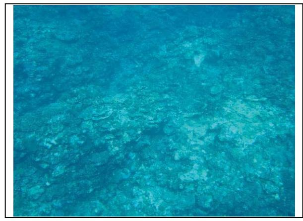

#### 6W㬼㞳ᓥ๓㞳♋

ㄪᰝ᪥㸸ᖹᡂ ᖺ ᭶ ᪥ ࢦࣥࢧ⫱⏕ᆺ㸸Ϭ㸦ከ✀ΰᡂᆺ㸧

ࢦࣥࢧ龠ᗘ㸸㸣 ᖺࢦࣥࢧࡢ龠ᗘ㸸㸣

ࢩࣜࢻ࣑㢮ࡢ᪂つຍධ㸸 ⩌య੍

㈅㢮㣗ࢡࣥࣛ㸸ϩ ┿㸸ㄪᰝᆅⅬࡢᾏ୰ᬒほ

ࢺ࣓ࣥࢥ㸸ྎ㢼◚ᦆࠊᾏ⸴ᑡࠊ࠸࡞龠ᗘࡢᛴ⃭࡞ప ୗࡣࡢࢹࢺࣄࢽ࢜㣗ᐖྎ㢼◚ᦆࡀཎ

ᅉ

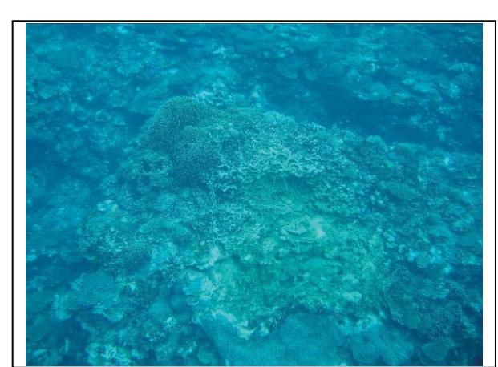

#### ⦖♋‴ཱྀࣥࢶࣘW6

ㄪᰝ᪥㸸ᖹᡂ ᖺ ᭶ ᪥ ࢦࣥࢧ⫱⏕ᆺ㸸Ϭ㸦ከ✀ΰᡂᆺ㸧

ࢦࣥࢧ龠ᗘ㸸㸣 ᖺࢦࣥࢧࡢ龠ᗘ㸸㸣

ࢩࣜࢻ࣑㢮ࡢ᪂つຍධ㸸 ⩌య੍

㈅㢮㣗ࢡࣥࣛ㸸ϩ

┿㸸ㄪᰝᆅⅬࡢᾏ୰ᬒほ

ࢺ࣓ࣥࢥ㸸ྎ㢼◚ᦆࠊᾏ⸴ᑡ࠸࡞

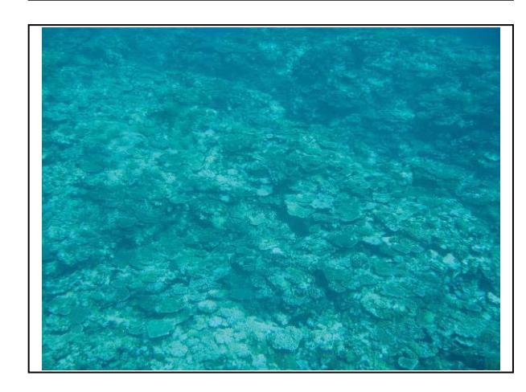

#### 6W⯪ᾆἈ㞳♋

ㄪᰝ᪥㸸ᖹᡂ ᖺ ᭶ ᪥

ඃ༨ᆺ㸧ࢩࣜࢻ࣑≦ᆺ㸸Ϫ㸦༟⏕⫱ࢦࣥࢧ

ࢦࣥࢧ龠ᗘ㸸㸣 ᖺࢦࣥࢧࡢ龠ᗘ㸸㸣

ࢩࣜࢻ࣑㢮ࡢ᪂つຍධ㸸 ⩌య੍

㈅㢮㣗ࢡࣥࣛ㸸ϩ

┿㸸ㄪᰝᆅⅬࡢᾏ୰ᬒほ

ࢺ࣓ࣥࢥ㸸ྎ㢼◚ᦆࠊᾏ⸴ᑡࢻࣥࢩࢺ࣡࣍ࠊ࠸࡞ ᦆ◚㢼ྎࠊ࠸యከ⩌Ṛஸ࠸ྂࡿࡼ࣒࣮ࣟ

ࡿࡍపୗᖜᗘ⿕ࡾࡼ

ᅗ ྛㄪᰝᆅⅬࡢᾏ୰ᬒほཬࡧᴫἣ

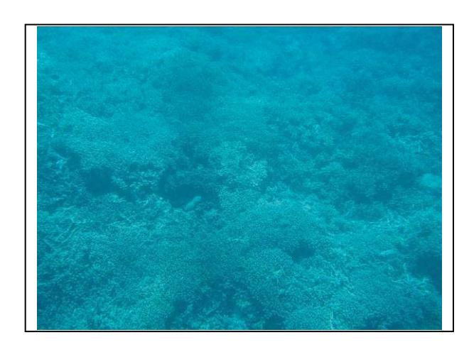

## 6Wࢫࣛࣂᓥす

ㄪᰝ᪥㸸ᖹᡂ ᖺ ᭶ ᪥

ඃ༨ᆺ㸧ࢩࣜࢻ࣑≦ᯞᆺ㸸Ϩ㸦⏕⫱ࢦࣥࢧ

ࢦࣥࢧ龠ᗘ㸸㸣 ᖺࢦࣥࢧࡢ龠ᗘ㸸㸣

ࢩࣜࢻ࣑㢮ࡢ᪂つຍධ㸸 ⩌య੍

㈅㢮㣗ࢡࣥࣛ㸸ϩ ┿㸸ㄪᰝᆅⅬࡢᾏ୰ᬒほ

ࢺ࣓ࣥࢥ㸸ྎ㢼◚ᦆࠊᾏ⸴ᑡࠊ࠸࡞≦ᯞࢩࣜࢻ࣑

ࡀྜࡿࡵ༨ࡢࢩࣜࢻ࣑ࢲ࢚ࢺࣇࡕ࠺ࡢ

ࡿ࡞ࡃࡁ

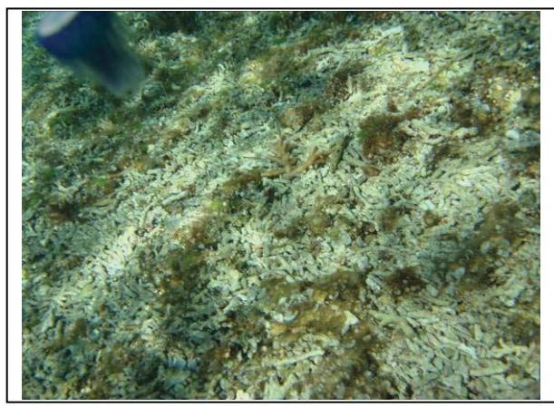

#### 6W㬀㛫ᓥ༡ᮾ♋ụ

ㄪᰝ᪥㸸ᖹᡂ ᖺ ᭶ ᪥ ࢦࣥࢧ⫱⏕ᆺ㸸Ϭ㸦ከ✀ΰᡂᆺ㸧

ࢦࣥࢧ龠ᗘ㸸㸣ᮍ‶ ᖺࢦࣥࢧࡢ龠ᗘ㸸㸣ᮍ‶

ࢩࣜࢻ࣑㢮ࡢ᪂つຍධ㸸 ⩌య੍

㈅㢮㣗ࢡࣥࣛ㸸Ϩ

┿㸸ㄪᰝᆅⅬࡢᾏ୰ᬒほ

ࢺ࣓ࣥࢥ㸸ྎ㢼◚ᦆࠊᾏ⸴୪ࡢࢤࣛࢡ࢝ࣥࢠࠊࡳ

࠺⁻⩌

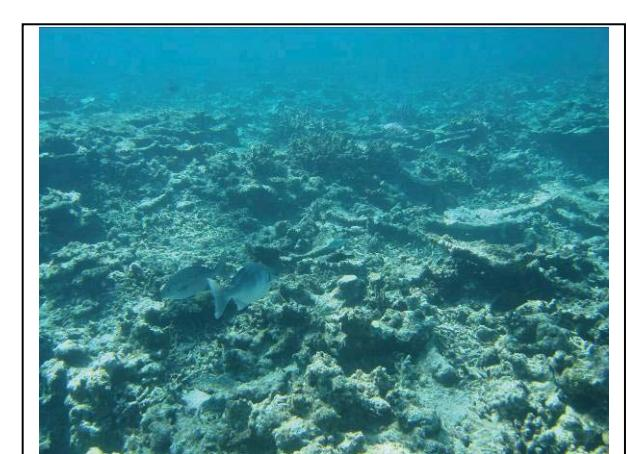

#### 6W㬀㛫ᓥ༡ᮾ♋ụ

ㄪᰝ᪥㸸ᖹᡂ ᖺ ᭶ ᪥ ࢦࣥࢧ⫱⏕ᆺ㸸Ϭ㸦ከ✀ΰᡂᆺ㸧

ࢦࣥࢧ龠ᗘ㸸㸣 ᖺࢦࣥࢧࡢ龠ᗘ㸸㸣

ࢩࣜࢻ࣑㢮ࡢ᪂つຍධ㸸 ⩌య੍

㈅㢮㣗ࢡࣥࣛ㸸Ϩ

┿㸸ㄪᰝᆅⅬࡢᾏ୰ᬒほ ࠸࡞ᑡ⸴㸸ᾏࢺ࣓ࣥࢥ

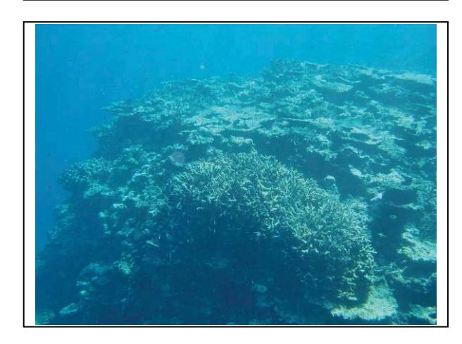

#### 6W㬀㛫ᓥ༡すἈ㞳♋

ㄪᰝ᪥㸸ᖹᡂ ᖺ ᭶ ᪥ ࢦࣥࢧ⫱⏕ᆺ㸸Ϭ㸦ከ✀ΰᡂᆺ㸧

ࢦࣥࢧ龠ᗘ㸸㸣ᮍ‶ ᖺࢦࣥࢧࡢ龠ᗘ㸸㸣

ࢩࣜࢻ࣑㢮ࡢ᪂つຍධ㸸 ⩌య੍

㈅㢮㣗ࢡࣥࣛ㸸Ϩ

┿㸸ㄪᰝᆅⅬࡢᾏ୰ᬒほ

ࢺ࣓ࣥࢥ㸸ྎ㢼◚ᦆࠊࡾ࠶ᾏ⸴ᑡ࠸࡞

ᅗ ྛㄪᰝᆅⅬࡢᾏ୰ᬒほཬࡧᴫἣ

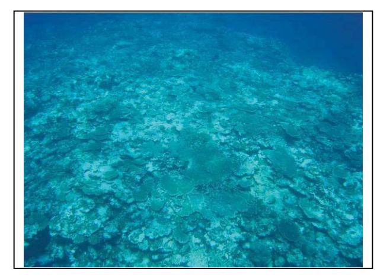

## 6Wᫍ◁๓♋⦕

ㄪᰝ᪥㸸ᖹᡂ ᖺ ᭶ ᪥

ඃ༨ᆺ㸧ࢩࣜࢻ࣑≦ᆺ㸸Ϫ㸦༟⏕⫱ࢦࣥࢧ

ࢦࣥࢧ龠ᗘ㸸㸣 ᖺࢦࣥࢧࡢ龠ᗘ㸸㸣

ࢩࣜࢻ࣑㢮ࡢ᪂つຍධ㸸 ⩌య੍

㈅㢮㣗ࢡࣥࣛ㸸ϩ ┿㸸ㄪᰝᆅⅬࡢᾏ୰ᬒほ

ࢺ࣓ࣥࢥ㸸ྎ㢼◚ᦆࠊᾏ⸴ᑡࢻࣥࢩࢺ࣡࣍ࠊ࠸࡞

࠸యከ⩌Ṛஸ࠸ྂࡿࡼ࣒࣮ࣟ

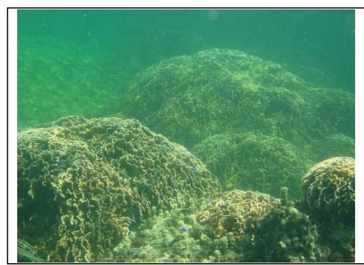

#### 6W̓ᫍ◁๓♋ụෆ

ㄪᰝ᪥㸸ᖹᡂ ᖺ ᭶ ᪥

ඃ༨ᆺ㸧ࢦࣥࢧ࣐ࣁ࣭ࢦࣥࢧࣟࢥࢩᆺ㸸ϫ㸦⏕⫱ࢦࣥࢧ

ࢦࣥࢧ龠ᗘ㸸㸣 ᖺࢦࣥࢧࡢ龠ᗘ㸸㸣

ࢩࣜࢻ࣑㢮ࡢ᪂つຍධ㸸 ⩌య੍

㈅㢮㣗ࢡࣥࣛ㸸ϩ ┿㸸ㄪᰝᆅⅬࡢᾏ୰ᬒほ ࡾ࠶ᾏⲡࠊ࠸ከ⸴㸸ᾏࢺ࣓ࣥࢥ

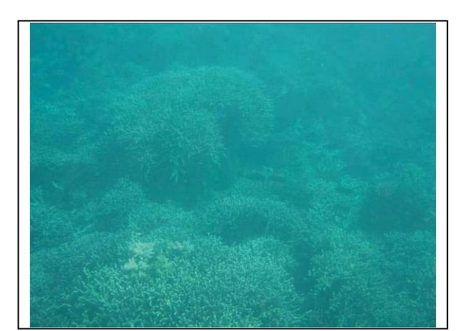

#### 6Wࢥࢱᓮ♋⦕

ㄪᰝ᪥㸸ᖹᡂ ᖺ ᭶ ᪥

ඃ༨ᆺ㸧ࢦࣥࢧ࣐ࣁࢲ࢚ࣅࣘᆺ㸸ϫ㸦⏕⫱ࢦࣥࢧ

ࢦࣥࢧ龠ᗘ㸸㸣 ᖺࢦࣥࢧࡢ龠ᗘ㸸㸣

ࢩࣜࢻ࣑㢮ࡢ᪂つຍධ㸸 ⩌య੍

㈅㢮㣗ࢡࣥࣛ㸸Ϩ

┿㸸ㄪᰝᆅⅬࡢᾏ୰ᬒほ ࡳ୪⸴㸸ᾏࢺ࣓ࣥࢥ

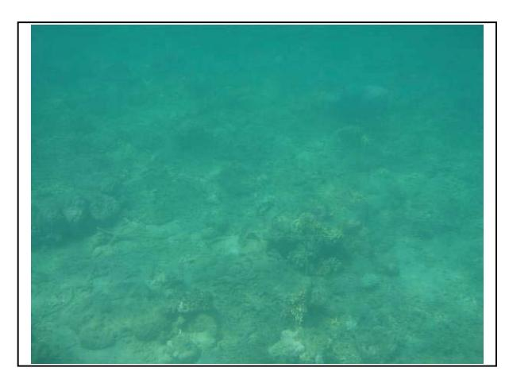

#### 6W̓ࢥࢱᓮ♋ὸ㒊

ㄪᰝ᪥㸸ᖹᡂ ᖺ ᭶ ᪥ ࢦࣥࢧ⫱⏕ᆺ㸸Ϭ㸦ከ✀ΰᡂᆺ㸧

ࢦࣥࢧ龠ᗘ㸸㸣 ᖺࢦࣥࢧࡢ龠ᗘ㸸㸣

ࢩࣜࢻ࣑㢮ࡢ᪂つຍධ㸸 ⩌య੍

㈅㢮㣗ࢡࣥࣛ㸸ϩ

┿㸸ㄪᰝᆅⅬࡢᾏ୰ᬒほ

ࢺ࣓ࣥࢥ㸸ᾏ⸴୪ࠊࡳᾏⲡࠊࡾ࠶ⓑ⌧㇟Ṛஸࢧࢤࢺ

࠸ከࢦࣥ

ᅗ ྛㄪᰝᆅⅬࡢᾏ୰ᬒほཬࡧᴫἣ

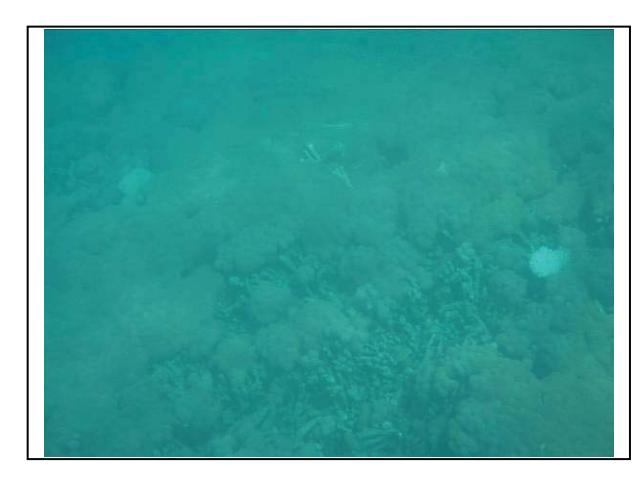

## 6W⥙ྲྀ‴ዟ

ㄪᰝ᪥㸸ᖹᡂ ᖺ ᭶ ᪥

ඃ༨ᆺ㸧ࢦࣥࢧࢧ࢞ࢼࣁࣞ࢞ࢼࢲ࢚ᆺ㸸ϫ㸦⏕⫱ࢦࣥࢧ

ࢦࣥࢧ龠ᗘ㸸㸣 ᖺࢦࣥࢧࡢ龠ᗘ㸸㸣

࠸࡞࡛┠ほᐹ㡯᪂つຍධ㸸ࡢ㢮ࢩࣜࢻ࣑

㈅㢮㣗ࢡࣥࣛ㸸Ϩ

┿㸸ㄪᰝᆅⅬࡢᾏ୰ᬒほ

ࢺ࣓ࣥࢥ㸸ᾏ⸴ᑡࠊ࠸࡞࿘ᅖࡢⓑ⌧㇟࠸ࡦ≦ἣ㸦ὸ ⸴⥳ࠊ㸧࠸㏆⁛Ṛࡀࢦࣥࢧࡢࢇࡢ㒊

୍㠃⦾ⱱ

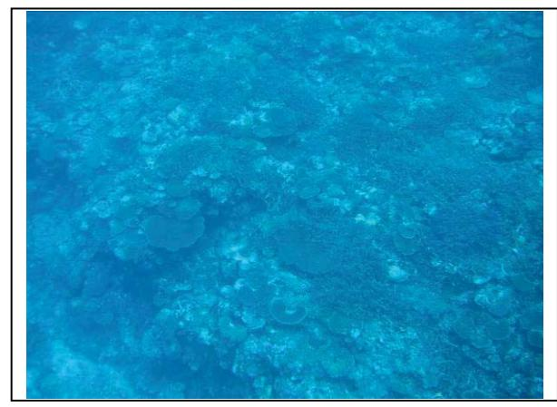

## ࢿࢯࢼࣚW6

ㄪᰝ᪥㸸ᖹᡂ ᖺ ᭶ ᪥ ࢦࣥࢧ⫱⏕ᆺ㸸Ϭ㸦ከ✀ΰᡂᆺ㸧

ࢦࣥࢧ龠ᗘ㸸㸣 ᖺࢦࣥࢧࡢ龠ᗘ㸸㸣

ࢩࣜࢻ࣑㢮ࡢ᪂つຍධ㸸 ⩌య੍

㈅㢮㣗ࢡࣥࣛ㸸Ϩ ┿㸸ㄪᰝᆅⅬࡢᾏ୰ᬒほ

ࢺ࣓ࣥࢥ㸸ྎ㢼◚ᦆࠊᾏ⸴ᑡࢻࣥࢩࢺ࣡࣍ࠊ࠸࡞ ࣜࢥ≉㸦ࡘ❧┠య⩌Ṛஸ࠸ྂࡿࡼ࣒࣮ࣟ

㢮㸧ࢩࣜࢻ࣑≦ࢫ࣮࣎ࣥ

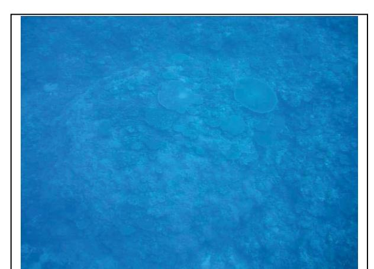

#### 6Wᓮᒣ♋⦕

ㄪᰝ᪥㸸ᖹᡂ ᖺ ᭶ ᪥

ඃ༨ᆺ㸧ࢦࣥࢧ࣑ࢨᆺ㸸ϫ㸦⏕⫱ࢦࣥࢧ

ࢦࣥࢧ龠ᗘ㸸㸣 ᖺࢦࣥࢧࡢ龠ᗘ㸸㸣

࠸࡞࡛┠ほᐹ㡯᪂つຍධ㸸ࡢ㢮ࢩࣜࢻ࣑

㈅㢮㣗ࢡࣥࣛ㸸Ϩ

┿㸸ㄪᰝᆅⅬࡢᾏ୰ᬒほ

ࢺ࣓ࣥࢥ㸸ྎ㢼◚ᦆࠊࡾ࠶ᾏ⸴ᑡ࠸࡞

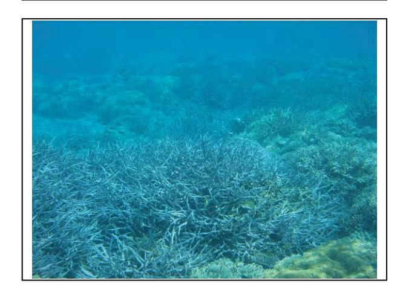

#### 6Wᓮᒣ♋ụ

ㄪᰝ᪥㸸ᖹᡂ ᖺ ᭶ ᪥

ඃ༨ᆺ㸧ࢩࣜࢻ࣑≦ᯞᆺ㸸Ϩ㸦⏕⫱ࢦࣥࢧ

ࢦࣥࢧ龠ᗘ㸸㸣 ᖺࢦࣥࢧࡢ龠ᗘ㸸㸣

ࢩࣜࢻ࣑㢮ࡢ᪂つຍධ㸸 ⩌య੍

㈅㢮㣗ࢡࣥࣛ㸸Ϩ

┿㸸ㄪᰝᆅⅬࡢᾏ୰ᬒほ

ࢺ࣓ࣥࢥ㸸ྎ㢼◚ᦆࠊᾏ⸴ᑡ࠸࡞

ᅗ ྛㄪᰝᆅⅬࡢᾏ୰ᬒほཬࡧᴫἣ

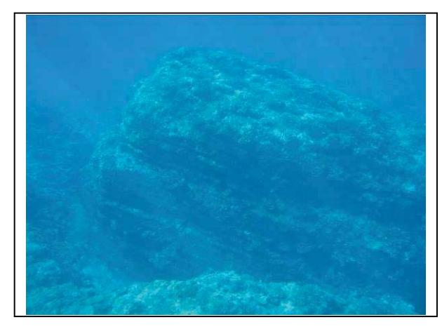

## 6WἼ↷㛫▼

ㄪᰝ᪥㸸ᖹᡂ ᖺ ᭶ ᪥ ࢦࣥࢧ⫱⏕ᆺ㸸Ϭ㸦ከ✀ΰᡂᆺ㸧

ࢦࣥࢧ龠ᗘ㸸㸣 ᖺࢦࣥࢧࡢ龠ᗘ㸸㸣

ࢩࣜࢻ࣑㢮ࡢ᪂つຍධ㸸 ⩌య੍

㈅㢮㣗ࢡࣥࣛ㸸ϩ ┿㸸ㄪᰝᆅⅬࡢᾏ୰ᬒほ

࠸ࡋⴭᗘᅇ⿕ࢦࣥࢧࠊ࠸࡞ᑡ⸴㸸ᾏࢺ࣓ࣥࢥ

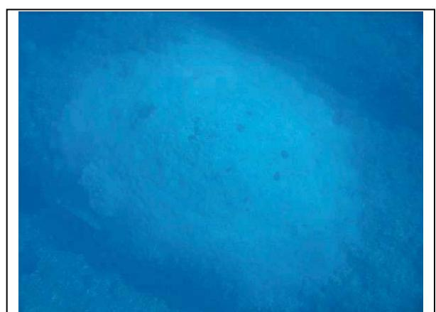

## 6W㮵ᕝ‴୰ࣀ℩

ㄪᰝ᪥㸸ᖹᡂ ᖺ ᭶ ᪥

ඃ༨ᆺ㸧ࢦࣥࢧ࣑ࢨᆺ㸸ϫ㸦⏕⫱ࢦࣥࢧ

ࢦࣥࢧ龠ᗘ㸸㸣 ᖺࢦࣥࢧࡢ龠ᗘ㸸㸣

࠸࡞࡛┠ほᐹ㡯᪂つຍධ㸸ࡢ㢮ࢩࣜࢻ࣑

㈅㢮㣗ࢡࣥࣛ㸸Ϩ ┿㸸ㄪᰝᆅⅬࡢᾏ୰ᬒほ ࠸࡞ᑡ⸴㸸ᾏࢺ࣓ࣥࢥ

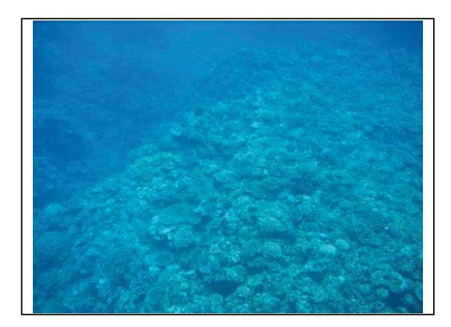

#### 6W㮵ᕝ‴୰ࣀ℩

ㄪᰝ᪥㸸ᖹᡂ ᖺ ᭶ ᪥ ࢦࣥࢧ⫱⏕ᆺ㸸Ϭ㸦ከ✀ΰᡂᆺ㸧

ࢦࣥࢧ龠ᗘ㸸㸣 ᖺࢦࣥࢧࡢ龠ᗘ㸸㸣

ࢩࣜࢻ࣑㢮ࡢ᪂つຍධ㸸 ⩌య੍

㈅㢮㣗ࢡࣥࣛ㸸ϩ ┿㸸ㄪᰝᆅⅬࡢᾏ୰ᬒほ

ࢺ࣓ࣥࢥ㸸ྎ㢼◚ᦆࠊࡾ࠶ᾏ⸴ᑡ࠸࡞

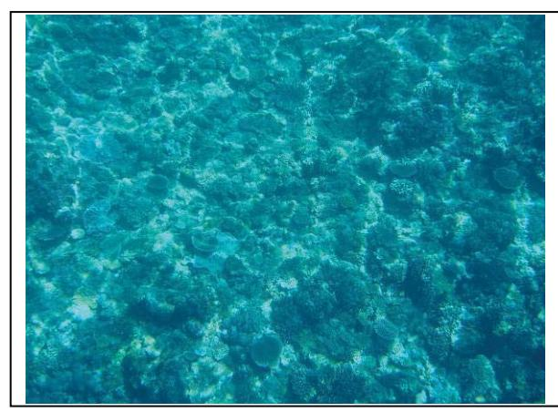

#### ⦖♋ࣞࢨࢧW6

ㄪᰝ᪥㸸ᖹᡂ ᖺ ᭶ ᪥ ࢦࣥࢧ⫱⏕ᆺ㸸Ϭ㸦ከ✀ΰᡂᆺ㸧

ࢦࣥࢧ龠ᗘ㸸㸣 ᖺࢦࣥࢧࡢ龠ᗘ㸸㸣

ࢩࣜࢻ࣑㢮ࡢ᪂つຍධ㸸 ⩌య੍

㈅㢮㣗ࢡࣥࣛ㸸ϩ

┿㸸ㄪᰝᆅⅬࡢᾏ୰ᬒほ ࠸࡞ᑡ⸴㸸ᾏࢺ࣓ࣥࢥ

ᅗ ྛㄪᰝᆅⅬࡢᾏ୰ᬒほཬࡧᴫἣ

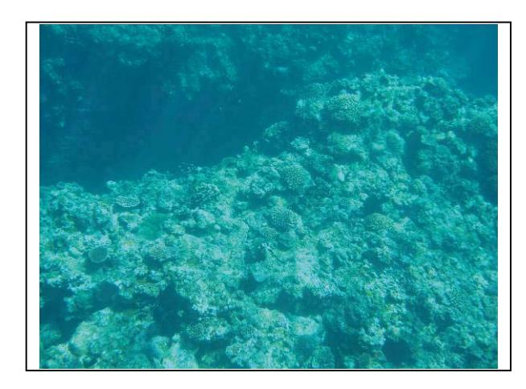

## 6W㇏ཎἈ♋⦕

ㄪᰝ᪥㸸ᖹᡂ ᖺ ᭶ ᪥ ࢦࣥࢧ⫱⏕ᆺ㸸Ϭ㸦ከ✀ΰᡂᆺ㸧

ࢦࣥࢧ龠ᗘ㸸㸣 ᖺࢦࣥࢧࡢ龠ᗘ㸸㸣

ࢩࣜࢻ࣑㢮ࡢ᪂つຍධ㸸 ⩌య੍

㈅㢮㣗ࢡࣥࣛ㸸ϩ ┿㸸ㄪᰝᆅⅬࡢᾏ୰ᬒほ

ࢺ࣓ࣥࢥ㸸ᾏ⸴ᑡࠊ࠸࡞῝ሙᑠᆺࢩࣜࢻ࣑⩌యቑຍ

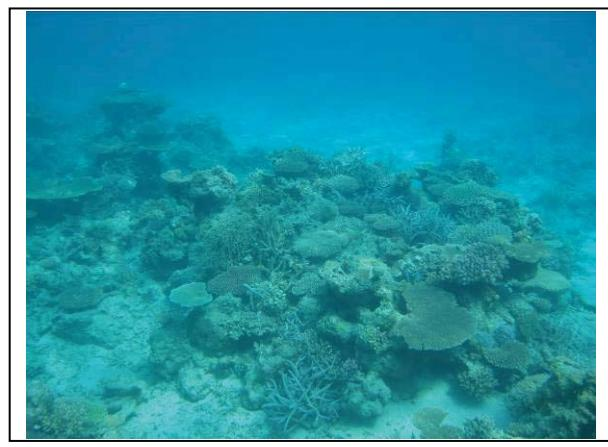

#### 6W⯪ᾋᓮ๓

ㄪᰝ᪥㸸ᖹᡂ ᖺ ᭶ ᪥ ࢦࣥࢧ⫱⏕ᆺ㸸Ϭ㸦ከ✀ΰᡂᆺ㸧

ࢦࣥࢧ龠ᗘ㸸㸣 ᖺࢦࣥࢧࡢ龠ᗘ㸸㸣

ࢩࣜࢻ࣑㢮ࡢ᪂つຍධ㸸 ⩌య੍

㈅㢮㣗ࢡࣥࣛ㸸ϩ ┿㸸ㄪᰝᆅⅬࡢᾏ୰ᬒほ

ࢺ࣓ࣥࢥ㸸ྎ㢼◚ᦆࠊࡾ࠶ᾏ⸴ᑡࠊ࠸࡞ᾏⲡ࣍ࠊࡾ࠶ య⩌Ṛஸ࠸ྂࡿࡼ࣒࣮ࣟࢻࣥࢩࢺ࣡ ࢩࣜࢻ࣑≦ࢫ࣮࣎ࣥࣜࢥ≉㸦࠸ከࡶ࡚ 㢮㸧

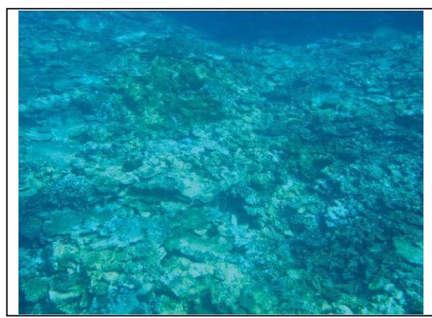

#### 6Wእࣜࢼࣃ༡♋⦕

ㄪᰝ᪥㸸ᖹᡂ ᖺ ᭶ ᪥ ࢦࣥࢧ⫱⏕ᆺ㸸Ϭ㸦ከ✀ΰᡂᆺ㸧

ࢦࣥࢧ龠ᗘ㸸㸣 ᖺࢦࣥࢧࡢ龠ᗘ㸸㸣

ࢩࣜࢻ࣑㢮ࡢ᪂つຍධ㸸 ⩌య੍

㈅㢮㣗ࢡࣥࣛ㸸ϩ ┿㸸ㄪᰝᆅⅬࡢᾏ୰ᬒほ

ࢺ࣓ࣥࢥ㸸ྎ㢼◚ᦆࠊᾏ⸴ᑡࢻࣥࢩࢺ࣡࣍ࠊ࠸࡞ ≉㢼㸦ྎࠊ࠸యከ⩌Ṛஸ࠸ྂࡿࡼ࣒࣮ࣟ ྕ㸧ࡾࡼⰍⷧ࠸⩌యࡸᯞඛ➼㎶⦕㒊ࡢ㒊 ࡘ❧┠㸧࠸ከయ≧⩌ࢫ࣮࣎ࣥࣜࢥศṚ㸦

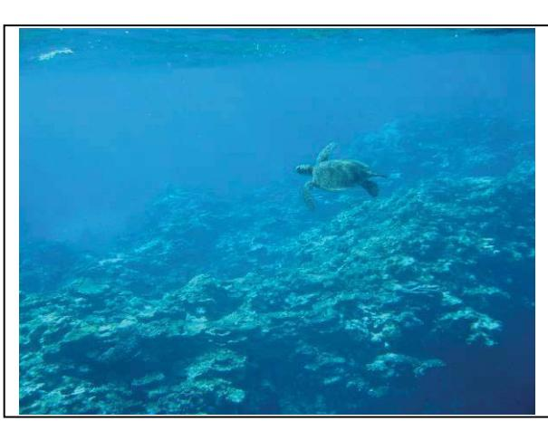

#### 6W㬀㛫ᓥᮾ♋⦕

ㄪᰝ᪥㸸ᖹᡂ ᖺ ᭶ ᪥ ࢦࣥࢧ⫱⏕ᆺ㸸Ϭ㸦ከ✀ΰᡂᆺ㸧

ࢦࣥࢧ龠ᗘ㸸㸣 ᖺࢦࣥࢧࡢ龠ᗘ㸸㸣

ࢩࣜࢻ࣑㢮ࡢ᪂つຍධ㸸 ⩌య੍

㈅㢮㣗ࢡࣥࣛ㸸ϩ

┿㸸ㄪᰝᆅⅬࡢᾏ୰ᬒほ

ࢺ࣓ࣥࢥ㸸ྎ㢼◚ᦆࠊᾏ⸴ᑡࡢࢹࢺࣄࢽ࢜ࠊ࠸࡞㣗 ᐖྎ㢼◚ᦆࡾࡼ龠ᗘⴭࡃࡋపୗ

ᅗ ྛㄪᰝᆅⅬࡢᾏ୰ᬒほཬࡧᴫἣ

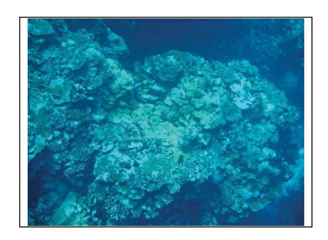

## 6W㬀㛫ᓥ♋⦕

ㄪᰝ᪥㸸ᖹᡂ ᖺ ᭶ ᪥ ࢦࣥࢧ⫱⏕ᆺ㸸Ϭ㸦ከ✀ΰᡂᆺ㸧

ࢦࣥࢧ龠ᗘ㸸㸣 ᖺࢦࣥࢧࡢ龠ᗘ㸸㸣

ࢩࣜࢻ࣑㢮ࡢ᪂つຍධ㸸 ⩌య੍

㈅㢮㣗ࢡࣥࣛ㸸ϩ

┿㸸ㄪᰝᆅⅬࡢᾏ୰ᬒほ

ࢺ࣓ࣥࢥ㸸ྎ㢼◚ᦆࠊᾏ⸴ᑡࢻࣥࢩࢺ࣡࣍ࠊ࠸࡞ ࢹࢺࣄࢽ࢜ࠊ࠸యከ⩌Ṛஸ࠸ྂࡿࡼ࣒࣮ࣟ ࡢ㣗ᐖྎ㢼◚ᦆࡾࡼ龠ᗘⴭࡃࡋపୗ

ᅗ ྛㄪᰝᆅⅬࡢᾏ୰ᬒほཬࡧᴫἣ

## ᖹᡂ ᖺᗘ す⾲▼ᇉᅜ❧බᅬ▼す♋†ཬࡢࡑࡧ㏆㞄ᾏᇦࡿࡅ࠾ ㄪᰝሗ࿌᭩ࢢࣥࣜࢱࢽࣔ♋ࢦࣥࢧ

------------------------------------

------------------------------------

------------------------------------

ᖹᡂ 㸦㸧ᖺ ᭶

⎔ቃ┬⮬↛⎔ቃᒁ ⏕≀ከᵝᛶ࣮ࢱࣥࢭ ࠛᒣ┴ᐩኈྜྷ⏣ᕷୖྜྷ⏣ᑿ 㟁ヰ㸸 )\$;㸸

ᴗົྡ ᖹᡂ ᖺᗘ㔜せ⏕ែ⣔┘どᆅᇦࢢࣥࣜࢱࢽࣔ᥎㐍ᴗ 㸦ἢᓊᇦㄪᰝ㸧

ㄳ㈇⪅ ୍⯡㈈ᅋἲே⮬↛⎔ቃ◊✲࣮ࢱࣥࢭ ࠛᮾி㒔ྎᮾ༊ୗ㇂

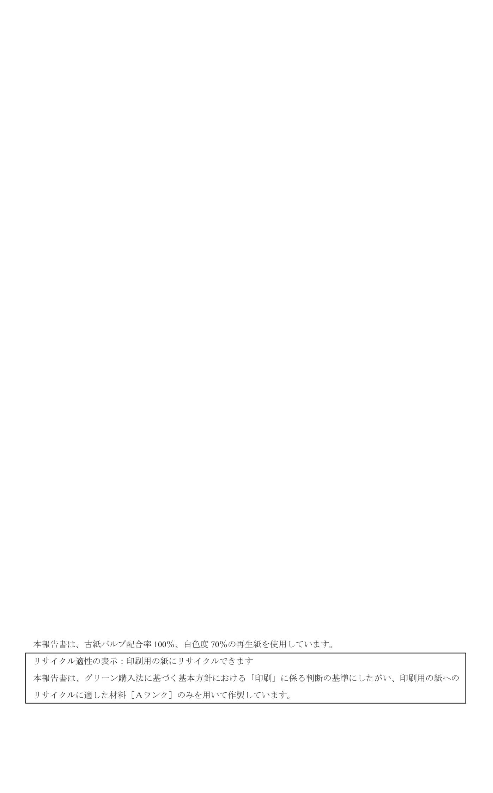