# ᖹᡂ 㻞㻤 ᖺᗘ㻌 䝰䝙䝍䝸䞁䜾䝃䜲䝖 㻝㻜㻜㻜㻌 䝃䞁䝂♋ㄪᰝሗ࿌᭩㻌

ᖹᡂ 㻞㻥䠄㻞㻜㻝㻣䠅ᖺ䠏᭶㻌 ⎔ቃ┬⮬↛⎔ቃᒁ㻌 ⏕≀ከᵝᛶ䝉䞁䝍䞊㻌

#### 【主なサンゴ礁域】

- 主なサンゴ礁域における全サイトの平均サンゴ被度は 30%であり、昨年度と変わらなかったが、宮古島、石西礁湖及び西表島では 10 ポイント以上減少した。
- 主なサンゴ礁域では、夏季高水温が主な原因と考えられる白化現象が確認された。 宮古島以南では大規模な被害が確認されたが、奄美群島から慶良間諸島までの海域では大きな被害には至らなかった。
- 大東諸島列島サイトでは、平均サンゴ被度は前回調査時(2011年)と変わらず 20% であったが、生息環境は健全であると考えられた。
- 沖縄島東岸及び西岸の平均サンゴ被度は30%であり、昨年度と変わらなかったが、 周辺離島は20ポイント増加した。
- 奄美群島では平均サンゴ被度が 40%であり、10 ポイント増加した。オニヒトデの 食害から回復しつつあると考えられた。
- 宮古島周辺及び八重干瀬では、夏季高水温による大規模な白化現象が確認され、 特に八重干瀬では白化率 70%、死亡率 68% を記録した。
- 石垣島周辺でも夏季高水温による 57%の白化率を記録したが、死亡率は比較的低く 12%であり、平均サンゴ被度の減少には現れなかった。
- 石西礁湖周辺では、夏季高水温により大規模な白化現象が確認され、白化率 96%、 死亡率 53%を記録し、1998 年の大規模白化現象を上回る被害であった。

#### 【高緯度サンゴ群集域】

- 高緯度サンゴ群集域における全サイト平均サンゴ被度は昨年度と変わらず 30%であった。
- 高緯度サンゴ群集域でも夏季高水温が主な原因と考えられる白化現象が確認され たが、死亡率は高くなく、被害は局所的で軽微であった。
- 館山では、オニヒトデやサンゴ食巻貝などの大きなかく乱もなく、低被度のサンゴ群集が昨年と同様に維持されていた。
- 壱岐周辺ではガンガゼによるエダミドリイシの食害が確認され、平均サンゴ被度が 40%であり、10 ポイント減少した。
- 串本周辺や四国沿岸、鹿児島県南部沿岸や天草周辺でもオニヒトデの確認数は減 少傾向を示していた。

### SUMMARY

### [Coral Reef Area]

- - The average coral cover within the Coral Reef Areas was 30% in FY 2016, similar to the coral cover recorded in FY 2015.
- - Coral bleaching mainly by high water temperature was observed in the coral reef area. Although severe damages were occurred at the area southward from Miyako Island, less damages were observed at the area from Amami Islands to Kerama Islands.
- - The average coral cover was 20% at the Daito Islands site in 2016, which was same as the one of previous survey conducted in 2011. It seems that the coral community of the area has been growing healthily.
- - Average coral cover was same as the previous year at the East and West coast of Okinawa Islands. The coral cover increased 20 % from previous survey at the outer islands of Okinawa.
- - Average coral cover increased 10 % from FY2015 showing coral recovery from predation of *Acanthasters* in Amami Islands.
- - Mass coral bleaching was observed at the Miyako Islands and Yabiji reefs with 70% of bleaching rate and 68% of mortality.
- - Fifty seven % of coral bleaching was recorded around Ishigaki Island. However, the mortality was 12% and the average coral cover has not been decreased.
- - Large scale of coral bleaching was occurred at the Sekisei Lagoon with 96% of bleaching and 53% of mortality recorded. It was much worse than the damage of mass coral bleaching in 1998.

#### [High Latitude Coral Community Area]

- - The average coral cover recorded within the High Latitude Coral Community Areas was 30%, which was similar to that recorded in FY 2015
- - Coral bleaching mainly by high water temperature was observed in this area without severe damages.
- - No *Acanthaster* and *Drupella* were recorded at Tateyama, which is generally characterized by a healthy coral community with low coral cover.
- - Average coral cover decreased 10% from previous year in Iki Islands with predation of Diademas on *Acropora tumida.*
- - Decline of *Acanthaster* occurred around Kushimoto, Shikoku, Southern coast of Kagoshima prefecture and Amakusa area.

# 平成28年度モニタリングサイト1000サンゴ礁調査報告書

### 目 次

### 要約

### SUMMARY

| Ι  | I 調査の実施・・・・・・・・・・・・・・・・・                           |                                                                                                                    |
|----|----------------------------------------------------|--------------------------------------------------------------------------------------------------------------------|
| 1. | 1. 各サイトでの実施状況と調査結果概要 ・・                            | $\cdots \cdots \cdots \cdots \cdots \cdots \cdots \cdots \cdots \cdots \cdots 1$                                   |
| (1 | (1) サイト1:大隅諸島/屋久島・種子島周辺                            | <u>n</u> · · · · · · · · · · · · · · · 7                                                                           |
| (2 | (2) サイト3:奄美群島/瀬戸内周辺(奄美)                            | 大島) ・・・・・・・・・・ 15                                                                                                  |
| (3 | (3) サイト4:沖縄島東岸/東村〜奥・・・                             | • • • • • • • • • • • • • • • • • • • •                                                                            |
|    | サイト5:沖縄島西岸/恩納村〜残波岬                                 |                                                                                                                    |
|    | サイト6:沖縄島周辺離島/水納島・伊                                 | 是名島・伊平屋島                                                                                                           |
| (4 | (4) サイト 7:慶良間諸島/慶良間諸島中心                            | ン海域(阿嘉島、座間味、渡嘉敷周辺)・36                                                                                              |
| (5 | (5) サイト8: 大東諸島・・・・・・・・・・・・・・・・・・・・・・・・・・・・・・・・・・・・ | • • • • • • • • • • • • • • • • • • 44                                                                             |
| (6 | (6) サイト 9: 宮古島周辺・・・・・・・                            | · · · · · · · · · · · · · · · 52                                                                                   |
|    | サイト 10: 宮古島離礁/八重干瀬                                 |                                                                                                                    |
| (7 | (7) サイト 11: 石垣島東岸/平久保崎~宮長                          | .湾・・・・・・・・・・61                                                                                                     |
|    | サイト 12: 石垣島西岸/川平〜大崎                                |                                                                                                                    |
| (8 | (8) サイト 13: 石西礁湖・北部/小浜島周辺                          | $1 \cdot \cdot \cdot \cdot \cdot \cdot \cdot \cdot \cdot \cdot \cdot \cdot \cdot \cdot \cdot \cdot \cdot \cdot 71$ |
|    | サイト 14: 石西礁湖・東部/カタグァー                              | ·周辺                                                                                                                |
|    | サイト 15: 石西礁湖・中央部/シモビシ                              | ~仲間崎沖                                                                                                              |
|    | サイト 16: 石西礁湖・南部/黒島~新城                              | 法島                                                                                                                 |
|    | サイト 17: 西表島と周辺離島/崎山湾                               | (西表島西部) 周辺                                                                                                         |
| (9 | (9) サイト 18:小笠原諸島/父島周辺・・・                           | • • • • • • • • • • • • • • • 88                                                                                   |
| (1 | (10) サイト 19: 館山 (房総)・・・・・・                         | • • • • • • • • • • • • • • • • • 96                                                                               |
| (1 | (11) サイト 20: 壱岐周辺 ・・・・・・・                          | • • • • • • • • • • • • • • • • • • 103                                                                            |
| (1 | (12) サイト 21: 串本周辺・・・・・・                            | • • • • • • • • • • • • • • • • • • • •                                                                            |
| (1 | (13) サイト 22:四国南西岸 (宇和海~足摺                          | 岬) ・・・・・・・・・・119                                                                                                   |
| (1 | (14) サイト 23: 鹿児島県南部沿岸 ・・・                          | • • • • • • • • • • • • • • • • • • • •                                                                            |
| (1 | (15) サイト 24: 天草周辺 ・・・・・・                           |                                                                                                                    |

| 2. 総括: 平成 28 (2016) 年度のサンゴの状況 ・・・・・・・・・・・・                      | 149 |
|-----------------------------------------------------------------|-----|
| (1) 主なサンゴ礁域 ・・・・・・・・・・・・・・・・・・・・・・・・・・・・・・・・・・・・                | 151 |
| (2) 高緯度サンゴ群集域 ・・・・・・・・・・・・・・・・・・・・・・・・・・・・・・・・・・・・              | 152 |
| (3) 2016 年の夏季高水温による白化現象・・・・・・・・・・・・・・・・・・・・・・・・・・・・・・・・・・・・     | 153 |
|                                                                 |     |
|                                                                 |     |
|                                                                 |     |
|                                                                 |     |
| II 資料 ・・・・・・・・・・・・・・・・・・・・・・・・・・・・・・・・・・                        | 157 |
|                                                                 |     |
| 資料 1: 平成 28 (2016) 年度モニタリングサイト 1000 (サンゴ礁) 調査地点一覧・・             |     |
| 資料2:スポットチェック法によるサンゴ礁調査マニュアル・・・・・・・・・・・・・・・・・・・・・・・・・・・・・・・・・・・・ | 181 |

#### I 調査の実施

### 1. 各サイトでの実施状況と調査結果概要

モニタリングサイト 1000 サンゴ礁調査では、日本の沿岸域をサンゴの分布状況から、トカラ列島以南の奄美群島や沖縄島等のサンゴ礁地形が見られる「主なサンゴ礁域」と、屋久島・種子島以北の「高緯度サンゴ群集域」の 2 つの海域に分け、その中をさらに島の連なりや海流等を考慮して、大ブロック、中ブロックに区分した上で、サンゴ群集の分布状況や調査を実施する研究者及び研究機関の有無等を考慮して、全国に 24 の調査サイトを設けている(各サイトの調査代表者を表 I-1-1 に、サイト及びサイト内に設けた調査地点(モニタリングスポット)の位置を図  $I-1-1\sim3$  に示す)。

表 I-1-1 モニタリングサイト 1000 サンゴ礁調査モニタリングサイトと調査代表者

|              |                        |       |                |                   | モニタリングサイト                    |                          |                          |                                         | 調査地点数   |
|--------------|------------------------|-------|----------------|-------------------|------------------------------|--------------------------|--------------------------|-----------------------------------------|---------|
| 海域           | 大ブロック                  | 中7    | ブロック           | No.               | 地域                           | 都道府県                     | 調査代表者                    | 所属                                      | (スポット数) |
| 主なサンゴ礁域      | ①大隅諸島・トカラ列島            | トカラ列島 | i              | 2                 | 小宝島周辺                        | 鹿児島県                     | 木 村 匡                    | 一般財団法人自然環境研究センター                        | 24      |
| ②奄美群島        |                        | 奄美群島  |                | 3                 | 瀬戸内周辺 (奄美大島)                 | 鹿児島県                     | 興 克 樹                    | ティダ企画有限会社                               | 15      |
|              | ③沖縄島とその周辺離島            | 沖縄島   | 東岸             | 4                 | 東村~奥                         | 沖縄県                      | 長田 智史                    | 一般財団法人沖縄県環境科学センター                       | 32      |
|              |                        |       | 西岸             | 5                 | 恩納村~残波岬                      | 沖縄県                      | †                        |                                         | 35      |
|              |                        | 沖縄島周辺 | 離島             | 6                 | 水納島・伊是名島・伊平屋島                | 沖縄県                      | 1                        |                                         |         |
|              |                        |       |                |                   |                              |                          |                          |                                         | 6       |
|              |                        | 慶良間諸島 | i              | 7                 | 慶良間諸島中心海域 (阿嘉島、座間味、渡嘉敷周辺) | 沖縄県                      | 岩尾 研二                    | 一般財団法人熱帯海洋生態研究振興財団 阿嘉島臨海研究所          | 10      |
| ŀ            | ④大東諸島                  | 大東諸島  |                | 8                 | 大東島                          | 沖縄県                      | 木 村 匡                    | 一般財団法人自然環境研究センター                        | 15      |
|              | ⑤宮古島群島                 | 宮古島周辺 |                |                   | 宮古島周辺                        | 沖縄県                      | 梶原 健次                    | 宮古島市役所                                  | 10      |
|              |                        | 宮古島離礁 |                |                   | 八重干瀬                         | 沖縄県                      |                          |                                         | 4       |
|              | ⑥八重山群島                 | 石垣島   | 東岸             | 11                | 平久保崎~宮良湾                     | 沖縄県                      | 吉田稔                      | 有限会社海游                                  | 33      |
|              |                        |       | 西岸             | 12                | 川平~大崎                        | 沖縄県                      | 1                        |                                         | 44      |
|              |                        | 石西礁湖  | 北部             | 13                | 小浜島周辺                        | 沖縄県                      | 木 村 匡                    | 一般財団法人自然環境研究センター                        | 28      |
|              |                        |       | 東部             | 14                | カタグァー周辺                      | 沖縄県                      | 1                        |                                         | 20      |
|              |                        |       | 中央部            | 15                | シモビシ〜仲間崎沖                    | 沖縄県                      | 1                        |                                         | 24      |
|              |                        |       | 南部             | 16                | 黒島~新城島                       | 沖縄県                      | 1                        |                                         | 30      |
|              |                        | 西表島と周 | 辺離島            | 17                | 崎山湾(西表島西部)周辺                 | 沖縄県                      | 1                        |                                         | 23      |
|              | ⑦小笠原諸島                 | 小笠原諸島 |                | 18                | 父島周辺                         | 東京都                      | 佐々木哲郎                    | NPO法人小笠原自然文化研究所                         | 12      |
| 高緯度サンゴ群集域    | ③房総・伊豆・伊豆諸島 (黒潮影響域) |       |                | 19 館山 (房総)        | 千葉県                          | 清本 正人                    | お茶の水女子大学 湾岸生物教育研究センター |                                         |         |
|              |                        |       |                |                   |                              |                          | 須之部友基                    | 東京海洋大学 水圏科学フィールド教育研究センター 館山ステーション | 6       |
|              | ⑨日本海 (対馬暖流影響           | [域)   |                | 20                | 壱岐周辺                         | 長崎県                      | 木 村 匡                    | 一般財団法人自然環境研究センター                        | 15      |
| ⑪紀伊半島(黒潮影響域) |                        | 21    | 串本周辺           | 和歌山県              | 野村 恵一                        | 株式会社串本海中公園センター           | 17                       |                                         |         |
| ①四国 (黒潮影響域)  |                        | 22    | 四国南西岸(宇和海~足摺岬) | 徳島県 高知県 愛媛県 | 目崎 拓真                        | 公益財団法人黒潮生物研究所 黒潮生物研究所 | 30                       |                                         |         |
|              | ⑫九州                    | 南東部(黒 | 潮影響域)          | 23                | 鹿児島県南部沿岸                     | 鹿児島県                     | 出羽 慎一                    | ダイビングサービス海案内                            | 18      |
|              | 西部(対馬暖流影響域)            |       | 24             | 天草周辺              | 熊本県                          | 野島哲                      | 株式会社ふたば                  | 15                                      |         |
|              | ①大隅諸島・トカラ列島 大隅諸島       |       |                | 1                 | 屋久島・種子島周辺                    | 鹿児島県                     | 松 本 毅                    | 屋久島海洋生物研究会                              | 19      |
| li i         | 1                      |       |                |                   |                              |                          |                          |                                         |         |

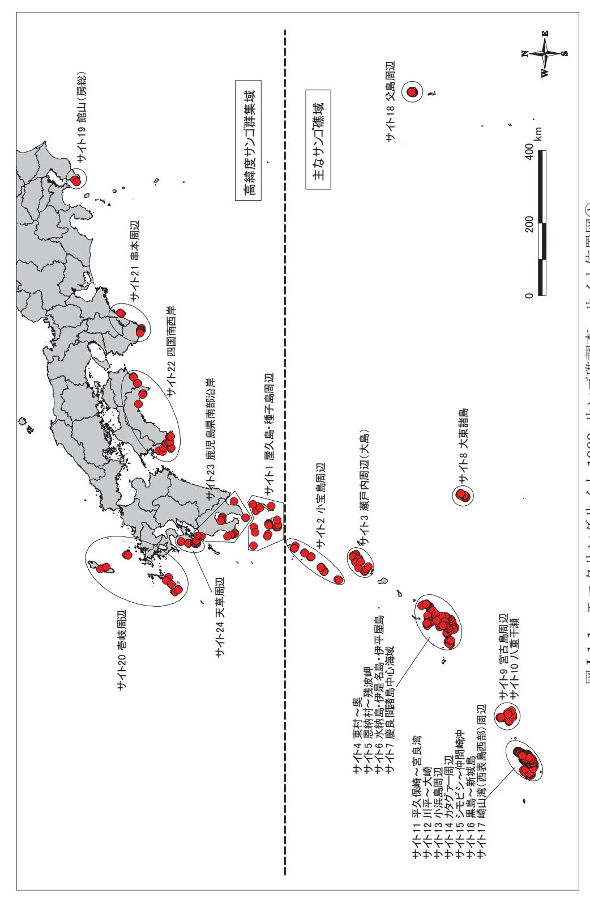

ᅗI-1-1 ࢺࢧࢢࣥࣜࢱࢽࣔ 1000 ࢦࣥࢧ♋ㄪᰝ ࢺࢧ⨨ᅗձ

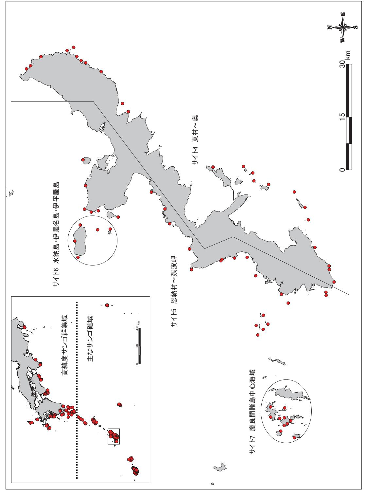

ᅗI-1-2 ࢺࢧࢢࣥࣜࢱࢽࣔ 1000 ࢦࣥࢧ♋ㄪᰝ ࢺࢧ⨨ᅗղ

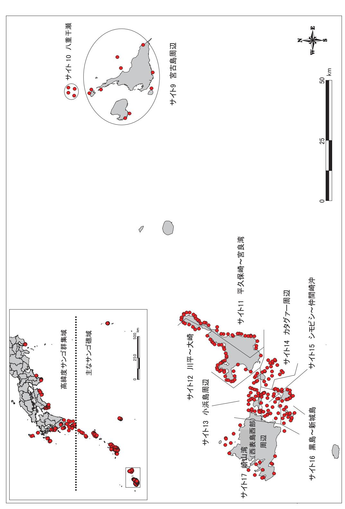

ᅗI-1-3 ࢺࢧࢢࣥࣜࢱࢽࣔ 1000 ࢦࣥࢧ♋ㄪᰝ ࢺࢧ⨨ᅗճ

平成 28 (2016) 年はこれら 24 サイトのうち、毎年調査を行う通常サイト 22 サイトと、おおむね 5 年に一度調査を実施する遠隔地サイトである大東島周辺 (サイト 8) を合わせて 23 サイトで調査を実施した。

調査は、「スポットチェック法によるサンゴ礁調査マニュアル」(巻末の資料 2 を参照)に従って実施した。

以下に実施状況と調査結果の概要をサイトごとに示す。

サンゴ被度によるサンゴ礁の状態の評価は、スポットチェック法によるサンゴ被度の見積り精度が 10%程度であることを考慮し、被度の表記方法を検討した結果、被度が極めて小さいものを 1%未満または 5%未満、それ以上のものを 10%刻みで表記することとして、平成 24 年度より表 I-1-2 評価に基づき記述している。従って、ここでは被度が 1%単位で報告された場合もその値を四捨五入することで 10%刻みに直して評価している。

|           | よるリクロ際の計画 |  |  |  |
|-----------|-----------|--|--|--|
| サンゴ被度の範囲  | 評価        |  |  |  |
| 80%≦      | 優良        |  |  |  |
| 50%≤ <80% | 良         |  |  |  |
| 30%≦ <50% | やや不良      |  |  |  |
| 10%≦ <30% | 不良        |  |  |  |
| < 10%     | 極めて不良     |  |  |  |

表 I-1-2 サンゴ被度によるサンゴ礁の評価

参考までに平成23年度までのサンゴ被度による評価区分を表I-1-3に示す。

表 I-1-3 〈参考〉平成 23 年度までのサンゴ被度によるサンゴ礁の評価

| サンゴ被度の範囲         | 評価    |  |  |  |
|------------------|-------|--|--|--|
| 75%≦             | 優良    |  |  |  |
| 50%≦ <75%        | 良     |  |  |  |
| $25\% \le <50\%$ | やや不良  |  |  |  |
| 10%≦ <25%        | 不良    |  |  |  |
| <10%             | 極めて不良 |  |  |  |

前年からのサンゴ被度の増減の評価区分については、従来から 10%単位で区切られているためこれまでと同じものを用いる (表 I-1-4)。

⾲ I-1-4 ᖺࢦࣥࢧࡢࡽ龠ᗘࡢኚࡢホ౯

| ᫖ᖺ ࡽ࠿ ࢦࣥࢧࡢ 龠ᗘࡢኚ໬ | ホ౯         |
|---------------------------|------------|
| 㸦 ࢺࣥ࢖࣏㸧                |            |
| 㸩30ӌ                      | ኱ ࡃࡁቑຍ  |
| 㸩10ӌ   㸺㸩30               | ቑຍ         |
| 㸫10㸺   㸺㸩10               | ࡰ࡯ኚ໬ ࡋ࡞ |
| 㸫30㸺   ӌ㸫10               | ῶᑡ         |
| ӌ㸫30                      | ኱ ࡃࡁῶᑡ  |

ࡿ࠶࡛ᒁᡤⓗࡀศᕸࠊࡃపࡀᗘ⿕ࢦࣥࢧࠊඖ᮶ࠊࡣ࡚࠸ࡘ㞟ᇦ⩌ࢦࣥࢧᗘ⦋㧗ࠊ࠾࡞ ࠋࡿ࠶ࡀᚲせࡿࡍ៖⪃ࢆࡇࡿ࡞ETB࡚ࡗࡼᆅᇦࡣᏳ┠ホ౯ࡢᗘ⿕ࠊࡵࡓ࠸ከࡀࡇ

#### (1) サイト1:大隅諸島/屋久島・種子島周辺

#### 1) 実施状況

調査は、屋久島海洋生物研究会の松本毅氏が代表となり、同研究会メンバー3名とともに 実施した。

#### 2)調查地点

このサイトでは、大隅諸島の屋久島、口永良部島、馬毛島、種子島、竹島、硫黄島、黒島に20の調査地点(モニタリングスポット)を選定しており、2016年はこれら20地点のうち、2005年より立入制限のために中止している地点15(浦田ビーチ)と今年度天候不良のため調査できなかった地点16(住吉)を除く18地点で調査を実施した。

サイト1:大隅諸島/屋久島・種子島周辺における調査地点(モニタリングスポット:20地点)

屋久島 地点 1: 志戸子 (未調査: 2 地点)

地点2:元浦

地点 3:管理棟下

地点4:お宮下

地点5:タンク下

地点 6: センロク

地点7:塚崎

地点8:七瀬

地点9:中間

地点 10:湯泊

地点 11: 麦生

口永良部島 地点 12: 寝待

地点 13: 岩屋泊

馬毛島 地点 14: 馬毛島

種子島 地点 15:浦田ビーチ(立入制限により 2005 年より調査を中止)

地点 16: 住吉 (悪天候のため中止)

地点 20: 浦田ビーチ

竹島 地点 17: コモリ港

硫黄島 地点 18: 永良部崎

黒島 地点 19: 夫婦瀬

### 3)調查期間

調査は、2016年10月21日から2017年1月5日の期間中に実施した。

#### 4)調查結果

調査地点ごとのサンゴの生育状況とかく乱要因の状況を図 I-2-1~5 に示す。

### ① 今年度のサンゴの状況

サイト平均サンゴ被度は 40%であり、被度評価では「やや不良」(サンゴ被度 30%以上 50%未満) と評価される。

地点毎の被度を比較すると(図 I-2-1)、「優良」地点(サンゴ被度 80%以上)はなく、「良」地点(サンゴ被度 50%以上 80%未満)が 7 地点(地点 1、5、6、8、11、12、13)であった。最も被度が高かったのは屋久島の地点 1(志戸子)、6(センロク)、11(麦生)と口之永良部島の地点 13(岩屋泊)の 60%であり、このうち地点 1 と 11 及び 13 は高水温による白化現象が起こらなかった地点である。「やや不良」地点(サンゴ被度 30%以上 50%未満)も 7 地点(地点 3、4、7、9、10、15、17)であり、「不良」地点(サンゴ被度 10%以上30%未満)が 4 地点(地点 2、14、18、19)、「極めて不良」地点(サンゴ被度 10%未満)はなかった。最も被度が低かった地点 14(馬毛島)は、2007 年に急激に被度が落ち、今年は白化によりさらに悪化した。

### ② 昨年度のサンゴの状況との比較

平均サンゴ被度は、昨年の30%から10ポイント増加した。夏季高水温による白化現象の被害が心配されたが、全体的に死亡率が低く、大きな減少は見られなかった。昨年の6~7月の大雨による土砂の流出による被害からの回復が、今年の白化による被害を上回ったものと考えられ、全体としては増加傾向となった。

地点毎に見ると(図 I-2-3)、30 ポイント以上「大きく増加」した地点が 1 地点(地点 12)、 10 ポイント以上 30 ポイント未満「増加」した地点が 7 地点(地点 1、4、5、7、9、11、13)であった。被度が「大きく増加」した口永良部島の地点 12(寝待)は、昨年の土砂の流出による被害を受けたが、かなり回復してきたことが確認された。

一方、10 ポイント以上 30 ポイント未満で「減少」した地点は 3 地点(地点 2、6、10)であった。その他の 6 地点(地点 3、8、17、18、19、20)は 10 ポイント未満の増減であり、ほぼ変化なしと評価されたため、全体としては増加した地点が減少した地点を上回った。

#### ③ 今年度のかく乱の状況

今年度は、7月20日ごろから水温が上がり始め、7月下旬にシライトイソギンチャクが 白化し始め、8月に入ってさらに水温が上昇し、サンゴが白化を始めた。本調査以外の他業 務による観察から、このサイトにおけるサンゴの白化現象は9月上旬がピークで、全体の  $40\sim50\%$ が白化したと思われた。しかし、9 月上旬の台風で水温は下がり、本モニタリング調査時には死亡に至るサンゴは少なく、全体的に回復に向かっていた。高水温による白化の影響が大きかったのは、屋久島の地点 8 (七瀬)と地点 10 (湯泊)であり(図 I-2-4)、これらは主にクシハダミドリイシが優占するポイントであった。しかし、同じクシハダミドリイシが優占する屋久島の地点 11 (麦生)はほとんど白化が見られず、サンゴ被度は昨年の 50%から 60%に上昇していた。この地点には河川が流れ込んでいる為、海水温の上昇が抑えられたものと考えられる。

その他、オニヒトデ(図 I-2-5)及びサンゴ食巻貝によるかく乱はほとんど確認されなかった。

### ④その他

特になし。

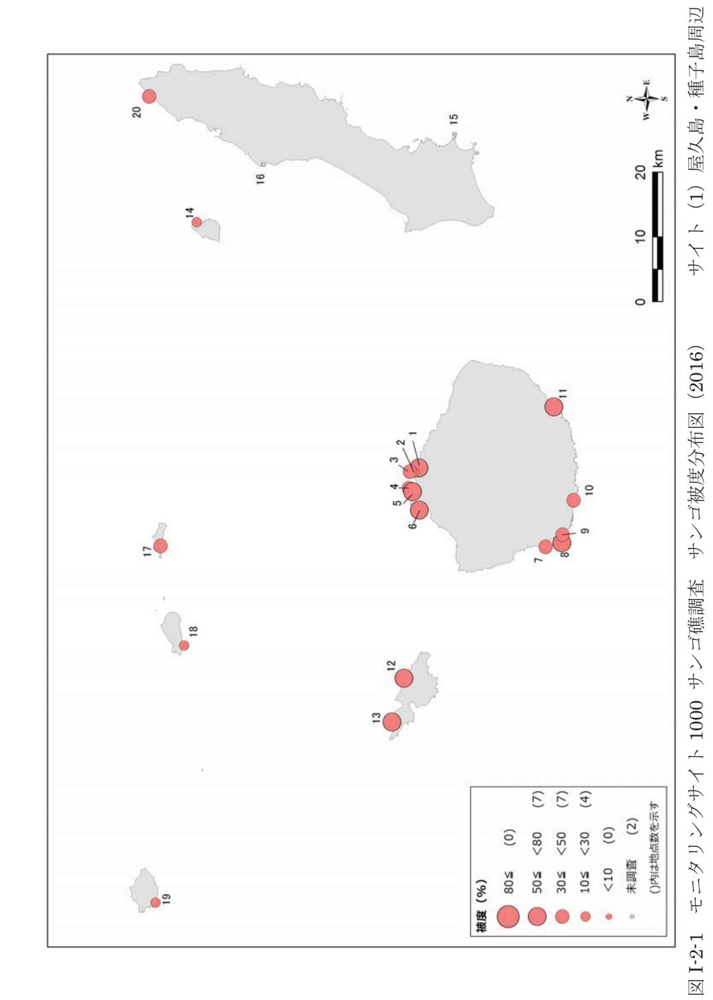

㸦ᆅⅬ 16 ࡣᝏኳೃࡾࡼᖺᗘㄪᰝࢆ୰Ṇࡓࡋ㸬✀ᏊᓥࡢᆅⅬ 15 ࢺࢵࢣࣟࠊࡣᡴࡕୖ࠺࡞ࡶࡆ❧ධ⚗Ṇ༊ᇦࡵࡓࡓࡗ࡞ 2005 ᖺࡾࡼㄪᰝࢆ୰Ṇ㸬㸧

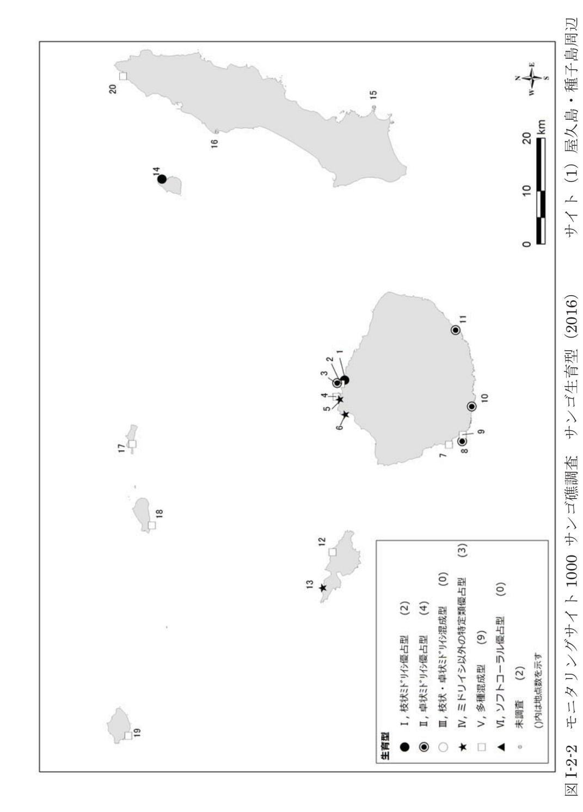

㸦ᆅⅬ 16 ࡣᝏኳೃࡾࡼᖺᗘㄪᰝࢆ୰Ṇࡓࡋ㸬✀ᏊᓥࡢᆅⅬ 15 ࢺࢵࢣࣟࠊࡣᡴࡕୖ࠺࡞ࡶࡆ❧ධ⚗Ṇ༊ᇦࡵࡓࡓࡗ࡞ 2005 ᖺࡾࡼㄪᰝࢆ୰Ṇ㸬㸧

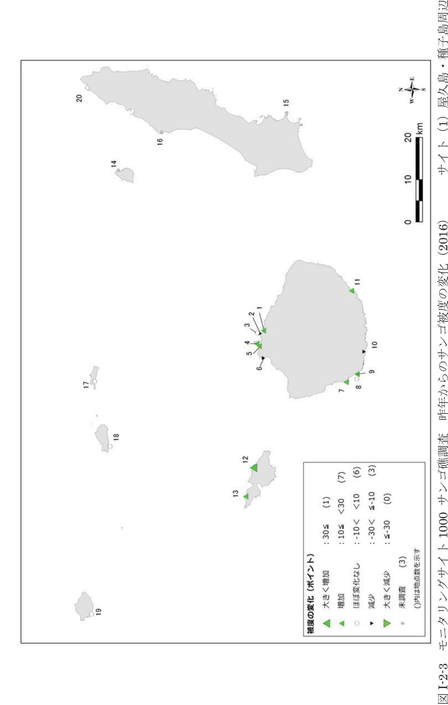

ࢱ࣮ࢹࡿࡍ⟭ィࢆᗘኚ⿕ࠊࡎࡽ࠾࡚ࡋᐇࢆㄪᰝࡵࡓࡢᖺᗘᝏኳೃࡣ 14 ᆅⅬࠊࡀࡿ࠶࡛ 15 16 ᆅⅬࡣᮍㄪᰝࡢᖺᗘ㸦㸧ࡓࡋ࠸ᮍㄪᰝᢅࡣ࡛ࡇࡇࠊࡵࡓ࠸࡞ࡀ

ᅗ

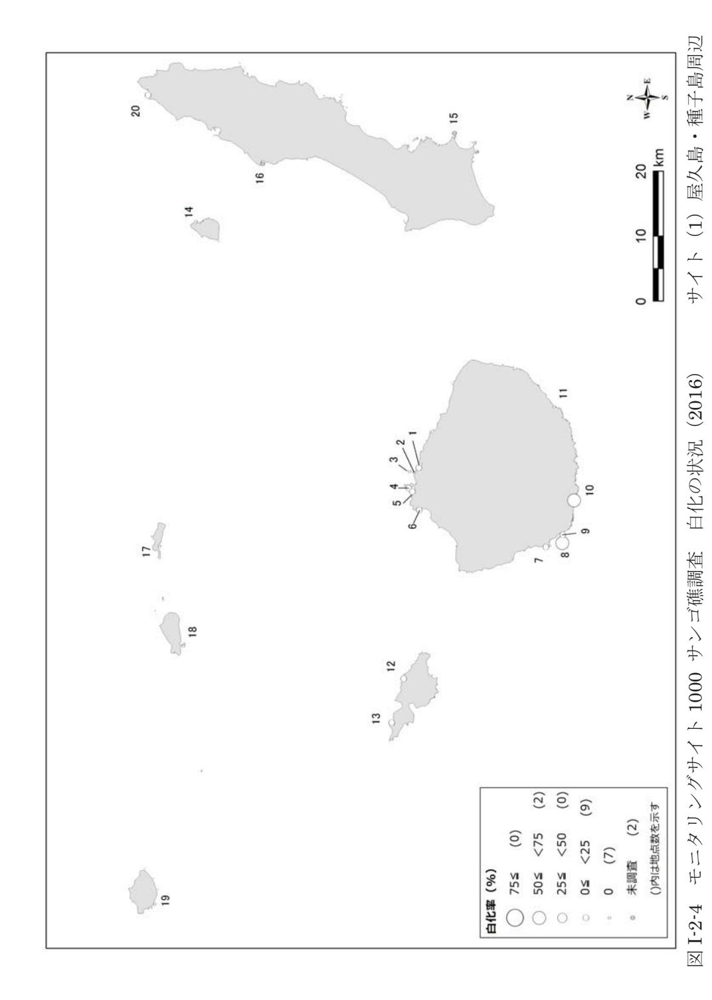

㸦ᆅⅬ 16 ࡣᝏኳೃࡾࡼᖺᗘㄪᰝࢆ୰Ṇࡓࡋ㸬✀ᏊᓥࡢᆅⅬ 15 ࢺࢵࢣࣟࠊࡣᡴࡕୖ࠺࡞ࡶࡆ❧ධ⚗Ṇ༊ᇦࡵࡓࡓࡗ࡞ 2005 ᖺࡾࡼㄪᰝࢆ୰Ṇ㸬㸧

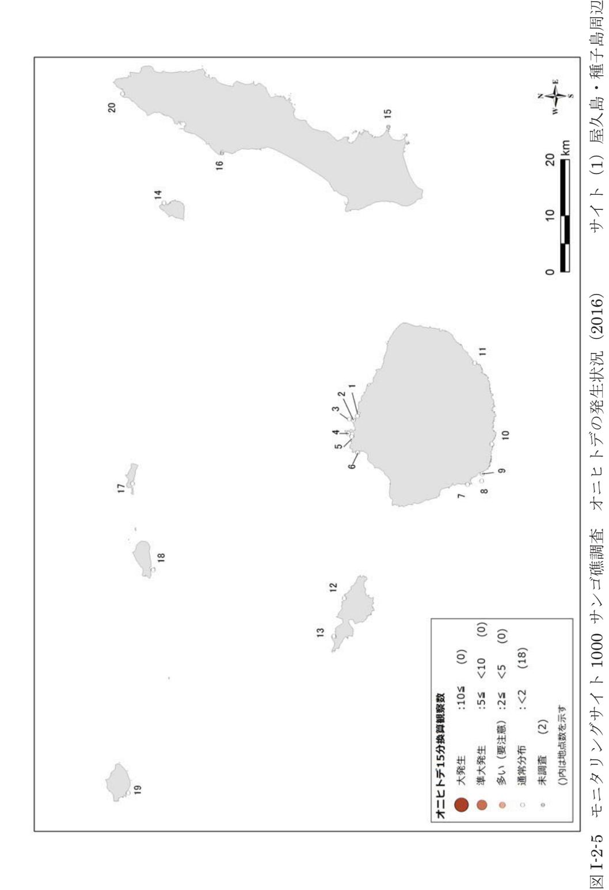

㸦ᆅⅬ 16 ࡣᝏኳೃࡾࡼᖺᗘㄪᰝࢆ୰Ṇࡓࡋ㸬✀ᏊᓥࡢᆅⅬ 15 ࢺࢵࢣࣟࠊࡣᡴࡕୖ࠺࡞ࡶࡆ❧ධ⚗Ṇ༊ᇦࡵࡓࡓࡗ࡞ 2005 ᖺࡾࡼㄪᰝࢆ୰Ṇ㸬㸧

ᅗ

### (2) サイト3: 奄美群島/瀬戸内周辺(奄美大島)

### 1) 実施状況

調査は、ティダ企画有限会社の興克樹氏が代表となり、ダイビングサービススタジオーネの奥村暢男氏と共に実施した。

#### 2)調查地点

このサイトでは、奄美大島周辺に 15 か所の調査地点を選定しており、2016 年はこれら全 15 地点で調査を実施した。

サイト3: 奄美群島/瀬戸内周辺(大島)における調査地点(モニタリングスポット: 15 地点) 奄美大島・北部

地点 1: 赤木名立神

地点2:節田

地点3:神の子

地点 4: 久場

地点5:安木屋場

奄美大島・中部

地点 6: 崎原東

地点7:崎原南

地点8:摺子崎

地点9:大浜

地点 10: 徳浜

地点 11: 和瀬

奄美大島・南部(大島海峡)

地点 12: 実久

地点 13: デリキョンマ崎

地点 14:手安

地点 15: 安脚場

#### 3)調査期間

調査は、2016年9月5日から11月22日の期間中に実施した。

#### 4)調査結果

調査地点ごとのサンゴの生育状況とかく乱要因の状況を図 I-3-1~5 に示す。

#### ① 今年度のサンゴの状況

サイト平均サンゴ被度は 40%であり、「やや不良」(サンゴ被度 30%以上 50%未満)と評価された。

地点毎のサンゴ被度を比較すると(図 I-3-1)、「優良」地点(サンゴ被度 80%以上)は、奄美大島南部の地点 12(実久)(80%)であり、昨年度の被度 70%(評価は「良」)から増加した。「良」地点(サンゴ被度 50%以上 80%未満)は、北部の地点 3(神の子、サンゴ被度 70%)、中部の地点 6(崎原東、同 70%)、南部の地点 14(手安、同 70%)の 3 地点であった。このうち地点 3 は枝状および葉状コモンサンゴ類が優占する高被度群集であり、地点 6 は、大型卓状ミドリイシ(Acropora hyacinthus)が優占する高被度群集、地点 14 は枝状ミドリイシ(Acropora pulchra)の大群落が広がる高被度群集であった。

「やや不良」地点(サンゴ被度 30%以上 50%未満)は、北部の地点 1(赤木名立神、サンゴ被度 30%)及び地点 2(節田、同 40%)、中部の地点 7(崎原南、同 30%)及び 9(大浜、同 30%)、南部の地点 15(安脚場、同 30%)の 5 地点であった。このうち地点 7 は、2010 年の奄美豪雨災害から徐々に回復している地点である。また、地点 15 は、ヒメマツミドリイシ(Acropora aspera)及びウスエダミドリイシ(Acropora tenuis)の大型群体が生存している。

「不良」地点(サンゴ被度 10%以上 30%未満)は、中部の地点 10(徳浜、サンゴ被度 10%)、11(和瀬、同 20%)及び南部の地点 13(デリキョンマ崎、同 20%)であった。このうち地点 13は被度が依然として低いが、以前は目に付いたホワイトシンドローム発症群体が減少していた。また、地点 11は新規加入のサンゴが少ない状態が続いている。

「極めて不良」地点(サンゴ被度 10%未満) は、北部の地点 4 (久場) 及び 5 (安木屋場)、中部の地点 8 (摺子崎) でいずれも被度 5%未満であった。地点 4 は、2010 年の奄美豪雨災害による泥土・泥水による死滅からの回復は見られない地点である。地点 5 は、現時点でサンゴ被度には反映されていないが、新規加入のコモンサンゴ類の小型群体が散見しており、今後の回復が期待される。地点 8 は、新規加入のサンゴが少ない状態が続いており、被度も回復していない。

### ② 昨年度のサンゴの状況との比較

全地点の平均サンゴ被度は40%であり、昨年度から10ポイント増加した。

地点毎に被度の変化を見ると(図 I-3-3)、昨年度よりサンゴ被度が減少した地点はなく、被度が 10 ポイント以上 30 ポイント未満で「増加」したのは、地点 1 (赤木名立神)、9 (大浜)、10 (徳浜)及び 12 (実久)の 4 地点であった。奄美大島北部の地点 1 は卓状および枝状ミドリイシ群体の成長により被度が 10 ポイント増加した。中部の地点 9 及び 10 は、指状および卓状ミドリイシ群体の成長により被度が 10 ポイント増加した。南部の地点 12 は、卓状ミドリイシ群体の成長により被度が 20 ポイント増加した。

上記以外の11地点は、昨年度と同じ被度であった。

### ③ 今年度のかく乱の状況

今年度は、8月に局所的に礁池(地点 1、2、7、8、9、11)や大島海峡内(地点 13、14、15)でサンゴの白化現象が発生した(図 I-3・4)。奄美大島北側の地点 8(摺子崎)と南側の地点 11(和瀬)及び大島海峡内の地点 14(手安)では、白化率は 50%を記録したが、いずれも死亡はなかった。また、地点 1(赤木名立神)、2(節田)、7(崎原南)及び 13(デリキョンマ崎)では白化率が 30%、地点 9(大浜)及び 15(安脚場)では白化率が 20%であったが、いずれも死亡群体はほとんど確認されなかった。外洋に面する礁縁部の地点(地点 6、10)では白化現象の発生は確認されなかった。

オニヒトデはいずれの地点でも確認されず、サンゴ食巻貝の集団も確認されなかった(図 I-3-5)。

### ④ その他

本調査以外の他の業務等で奄美群島周辺を観察した中では、本調査地点以外の海域においても、全体的にサンゴは回復傾向であると考えられた。

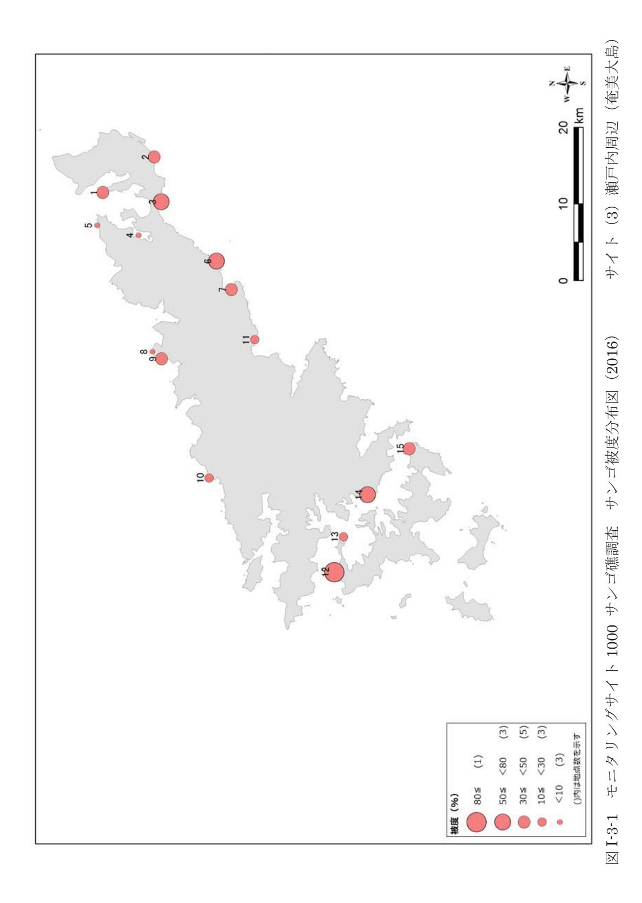

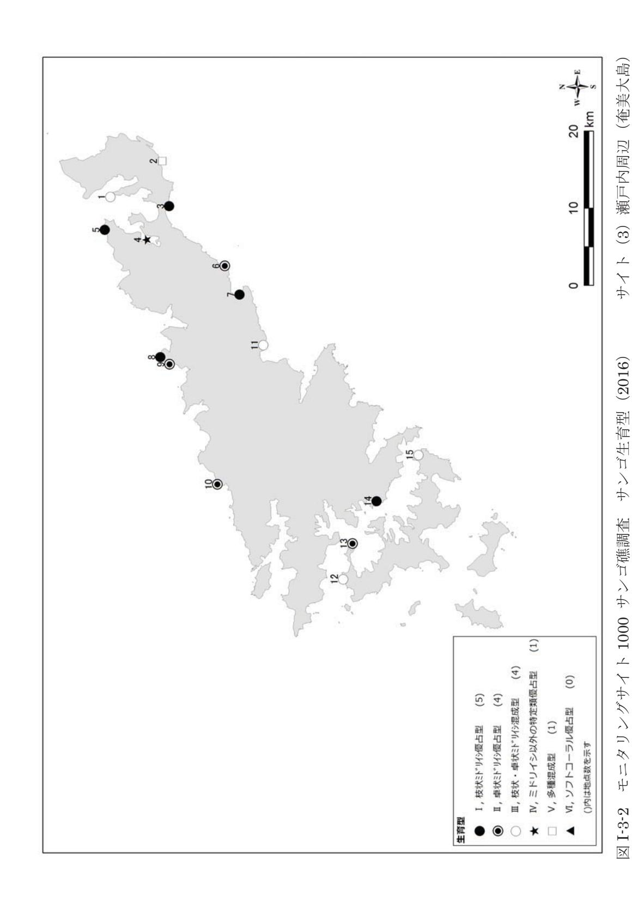

㻝㻥

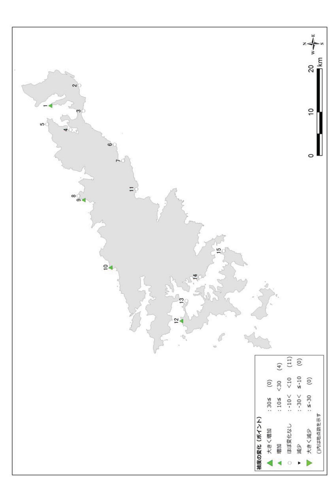

ᅗI-3-3 ࢺࢧࢢࣥࣜࢱࢽࣔ 1000 ࢦࣥࢧ♋ㄪᰝ ᖺࢦࣥࢧࡢࡽ龠ᗘࡢኚ㸦2016㸧 ࢺࢧ㸦3㸧℩ᡞෆ࿘㎶㸦⨾ᓥ㸧

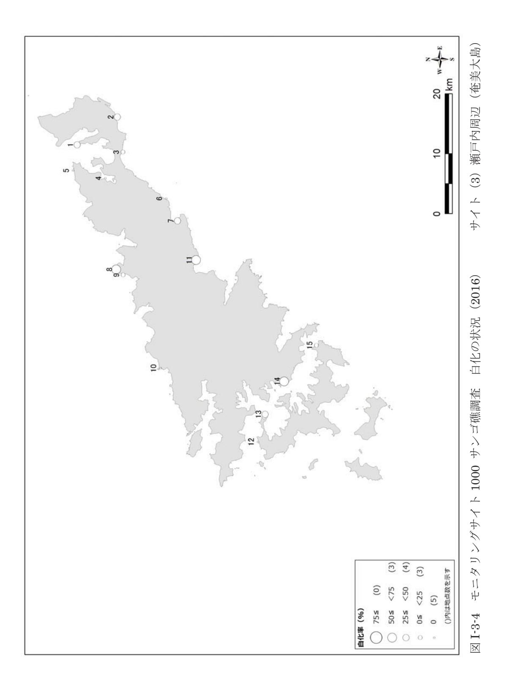

㻞㻝

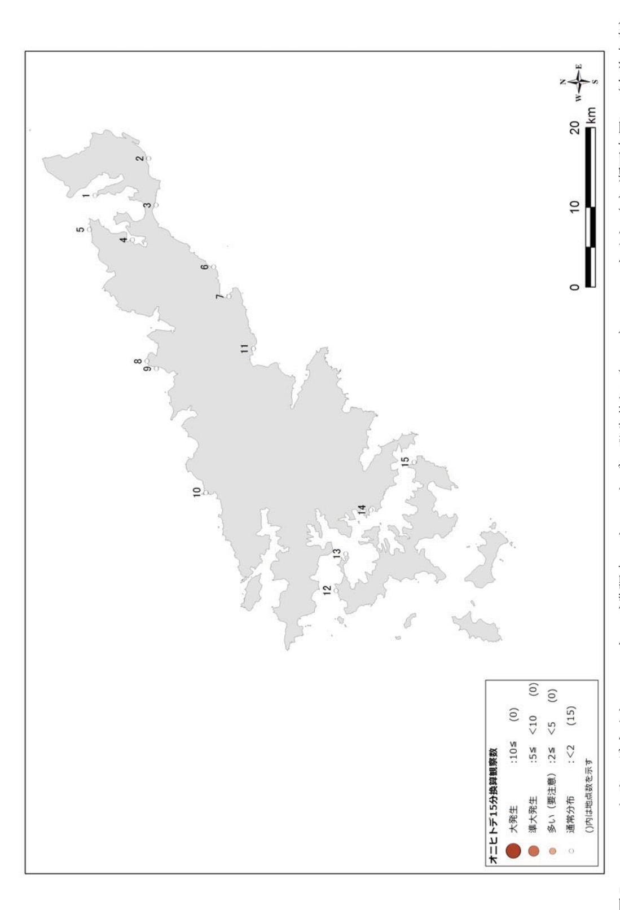

ᅗI-3-5 ࢺࢧࢢࣥࣜࢱࢽࣔ 1000 ࢦࣥࢧ♋ㄪᰝ ࡢࢹࢺࣄࢽ࢜Ⓨ⏕≧ἣ㸦2016㸧 ࢺࢧ㸦3㸧℩ᡞෆ࿘㎶㸦⨾ᓥ㸧

#### (3) サイト4:沖縄島東岸/東村~奥

サイト5:沖縄島西岸/恩納村~残波岬

サイト6:沖縄島周辺離島/水納島・伊是名島・伊平屋島

サイト4から6はひとまとまりの海域であり、同じ調査実施者が調査を行っているため、 ここではこれら3つのサイトをまとめて記述する。

#### 1) 実施状況

調査は、一般財団法人沖縄県環境科学センターの長田智史研究員が代表となり、同センターの山鹿典子研究員、中尾芳典研究員、金井恵研究員と沖縄ダイビングサービスラグーンの山本浩章氏とともに実施した。

#### 2)調查地点

沖縄島周辺の海域は、昨年度に調査地点を整理し、モニタリングサイト 1000 調査として 毎年調査を実施する調査定点と、調査実施者の所属先が自主的に行う自主調査による調査 地点に区分した。ここで言うモニタリングスポットは、調査定点と自主調査地点を合わせ た地点である。

今年の各サイトの調査実施地点は、東岸サイトで 31 地点 (未調査:2 地点)、西岸サイトで 36 地点 (未調査:2 地点)、周辺離島サイトは7 地点 (未調査:2 地点)の合計74 地点 (未調査:6 地点)であった。

サイト 4:沖縄島東岸/東村〜奥における調査地点(モニタリングスポット:31 地点) 調査定点:28 地点・自主調査地点:3 地点(未調査:2 地点)

#### 調査定点:28地点

地点1:荒崎西・礁斜面

地点 2: 大度海岸東·礁池

地点 3: 大度海岸·礁斜面

地点 4: 摩文仁南・礁斜面

地点 5: 奥武島南・礁池

地点 6: 奥武島南・礁斜面

地点7:クマカ島南・礁斜面

地点8:久高島エラブ岩東・礁斜面

地点 9: ウガン岩南・礁斜面

地点 10:津堅島アギハマ東・礁斜面

地点 11: ギノギ岩北東・礁斜面

地点 12: 南浮原島南東・礁斜面

地点 13: 浮原島北東ヨコビシ南・礁斜面

地点 40: 浮原島北東ヨコビシ東・礁斜面

地点 15: 伊計島東・礁斜面

地点 16: 慶佐次ウッパマ東 礁池

地点 28: 慶佐次ウッパマ東・礁斜面

地点 17: 東村宮城ウンシ南・礁斜面

地点 18: 揚水発電所南東・礁斜面

地点 19: 安波南·礁斜面

地点 20:カツセノ崎南・礁斜面

地点 21: イシキナ崎南西・礁斜面

地点 22: 安田ヶ島南・礁斜面

地点 27: 安田ヶ島北・礁斜面

地点 23: 国頭村赤崎北·礁池

地点 24: 国頭村赤崎北·礁斜面

地点 25: 奥漁港北·礁斜面

地点 39: 宇佐浜・東礁斜面

自主調查地点: 3地点(未調查: 2地点)

地点 33: 米須

地点 35:波名城·礁斜面(未調查)

地点14:伊計島東・礁池(未調査)

サイト 5:沖縄島西岸/恩納村~残波岬における調査地点(モニタリングスポット:36 地点) 調査定点:28 地点・自主調査地点:8 地点(未調査:2 地点)

調査定点:28 地点

地点1: 喜屋武漁港西・礁斜面

地点 31: 大嶺崎大瀬・礁斜面

地点4:チービシクエフ南・礁斜面

地点 5: チービシ神山南・礁斜面

地点 6: チービシナガンヌ南・礁斜面

地点7:チービシナガンヌ西・礁斜面

地点8:チービシナガンヌ北・礁斜面

地点9:空寿崎西(座礁船)・礁斜面

地点 10: 伊佐(西)・礁斜面

地点 12: 渡具知・礁斜面

地点 44:砂辺·礁斜面

地点 33:水釜・礁斜面

地点 13: 残波岬西·礁池

地点 14: 残波岬西·礁斜面

地点 43: 真栄田岬西大・礁池

地点 16: 真栄田岬西・礁斜面

地点 17: 恩名村赤崎西·礁池

地点 18: 恩名村赤崎西・礁斜面

地点 19: 安富祖北·礁池

地点 20: 部瀬名岬西·礁斜面

地点 21: 瀬底島南・礁斜面

地点 23:水族館西·礁斜面

地点 24: 備瀬崎東・礁池

地点 25: 備瀬崎東・礁斜面

地点 26: 今帰仁村長浜北・礁池

地点 27: 今帰仁村長浜北・礁斜面

地点 28: 古宇利島北トケイハマ・礁池

地点 29: 古字利島北トケイハマ・礁斜面

自主調查地点:7地点(未調查:2地点)

地点2:那覇空港北儀間の瀬・礁池(未調査)

地点3:那覇空港北儀間の瀬・礁斜面(未調査)

地点 45: チービシ神山北・礁斜面

地点 40: ジャナセ北・礁斜面

地点 32:水釜·礁池

地点 15: 真栄田岬西小・礁池

地点 46: 久良波・礁斜面

地点 47: ウカハ岩西 (礁斜面)

サイト6:沖縄島周辺離島/水納島・伊是名島・伊平屋島における調査地点

(モニタリングスポット:7地点)

調査定点:5地点・自主調査地点:2地点(未調査:2地点)

調査定点:5地点

地点 1:水納島東·礁斜面

地点2:ナカンシ東・礁斜面

地点 3: 伊江島西·礁斜面

地点 4: 伊江島イシャラ原東・礁斜面

地点 5: 伊江島湧出北・礁斜面

自主調查地点:2地点(未調查:2地点)

地点 7: 伊是名島内花橋北・礁斜面 (未調査) 地点 8: 伊是名島アギギタラ・礁斜面 (未調査)

#### 3)調查期間

東岸サイトの調査は、2016 年 10 月 24 日から 2017 年 1 月 18 日までの期間中、西岸サイトの調査は 2016 年 10 月 17 日から 2016 年 11 月 14 日までの期間中、周辺離島サイトの調査は 2016 年 10 月 28 日に実施した。

#### 4)調查結果

調査地点ごとのサンゴの生育状況とかく乱要因の状況を図 I-4-1~5 に示す。

### ① 今年度のサンゴの状況

<サイト4:沖縄島東岸>

サイト平均サンゴ被度は 30%であり、「やや不良」(サンゴ被度 30%以上 50%未満)と評価された。全地点中、「優良」地点(サンゴ被度 80%以上)はなかったが(昨年も 0 地点)、「良」地点(サンゴ被度 50%以上 80%未満)は 2 地点あり、昨年度と同様であった。「やや不良」地点(サンゴ被度 30%以上 50%未満)は 12 地点であり、昨年度から 2 地点減少した。また、「不良」地点(サンゴ被度 10%以上 30%未満)は 15 地点であり、昨年度より1 地点増加した。「極めて不良」地点(サンゴ被度 10%未満)はなかった(図 I-4-1)。被度は礁斜面で比較的高く、礁池では低い傾向が見られた。

#### <サイト5:沖縄島西岸>

サイト平均サンゴ被度は30%であり、東岸と同様「やや不良」と評価された。「優良」地点(サンゴ被度80%以上)はなく、「良」地点(サンゴ被度50%以上80%未満)は7地点であり、昨年度から4地点増加した。「やや不良」地点(サンゴ被度30%以上50%未満)は11地点であり、昨年度より4地点減少した。「不良」地点(サンゴ被度10%以上30%未満)は16地点で、昨年度から3地点減少した。また、「極めて不良」地点(サンゴ被度10%未満)はなく、昨年度から3地点減少した。被度は礁斜面で比較的高く、礁池では低い傾向が見られた。

このサイトでミドリイシ類の小型群体数が比較的少ない 10 群体/m²未満であった地点は 13 地点あり、多くは地点 13 (残波岬西・礁池) などの礁池であった。一方、礁斜面では 10 群体//m²以上の地点が多く、最大で 73.2 群体/m² (地点 29: 古宇利島北トケイハマ・礁 斜面) を記録するなど、小型群体数は全体的に多かった。

卓状ミドリイシ類の最大長径が比較的大きい(50cm をこえる)地点は、南部と北部の礁斜面など12地点と昨年度と同程度であり、値が最も大きかった地点も昨年度と同じく南部離礁の地点45(チービシ神山北・礁斜面)及び40(ジャナセ北・礁斜面)であったが、値は75.0cmであり昨年度から減少していた。

#### <サイト6:沖縄島周辺離島>

サイト平均サンゴ被度は60%であり、昨年度から20ポイント増加し、「良」と評価された。「優良」地点(サンゴ被度80%以上)はなく、「良」地点(サンゴ被度50%以上80%未満)は昨年より2地点増えて4地点、「やや不良」地点(30%以上50%未満)は昨年度より2地点減少して1地点であった。「不良」、「極めて不良」の地点はなかった。

ミドリイシ類の新規加入は全域の幅広い水深帯で広く見られ、ハナヤサイサンゴ類も多かった。地点 3(伊江島西・礁斜面)、2(ナカンシ東・礁斜面)及び 1(水納島東・礁斜面)では 12.8 群体/m²以上、地点 4(伊江島イシャラ原・礁斜面)では 22 群体/m²、地点 5(伊江島湧出北・礁斜面)では 38 群体/m² と非常に多かった。

ミドリイシ類大型卓状群体の最大長径は、地点 1(水納島東・礁斜面)で 95cm 以上を記録した他、地点 3(伊江島西・礁斜面)で 86.0cm、地点 2(ナカンシ東・礁斜面)で 78.0cm、地点 5(伊江島湧出北・礁斜面)で 61.0cm であった。地点 4(伊江島イシャラ原東・礁斜面)では最も小さく 35.0cm であった。

### ② 昨年度のサンゴの状況との比較

#### <サイト4:沖縄島東岸>

サイト平均サンゴ被度は 30%であり、昨年度と変わらなかった。地点毎に見ると(図 I-4-3)昨年より 30 ポイント以上「大きく増加」した地点はなく、10 ポイント以上 30 ポイント未満で「増加」した地点は 9 地点であった。一方、30 ポイント以上「大きく減少」した地点はなく、10 ポイント以上 30 ポイント未満で「減少」した地点は 12 地点であった。その他の 8 地点は増減が 10 ポイント未満で「ほとんど変化なし」であったため、減少した地点が増加した地点を上回った。

北側の地点では、被度は維持または増加傾向であったものの、南側では減少した地点が多く、夏期の高水温(と強光)による白化現象の影響によると考えられる。ミドリイシ類の小型群体密度は全体にやや増加していたと思われたが、卓状ミドリイシ類の最大長径は減少した地点が多かった。

#### <サイト5:沖縄島西岸>

サイト平均サンゴ被度は 30%であり、昨年度と変わらなかった。サンゴ被度の変化を地 点別に見ると(図 I-4-3)、30 ポイント以上「大きく増加」した地点が 3 地点あり、10 ポイント以上 30 ポイント未満で「増加」した地点は 9 地点であった。一方、30 ポイント以上 「大きく減少」した地点はなく、10 ポイント以上 30 ポイント未満で「減少」した地点が 10 地点であった。その他の 11 地点は増減が 10 ポイント未満で「ほぼ変化なし」と評価されるので、このサイトでは、増加した地点が減少した地点を上回っていた。

サンゴ被度は、夏期の高水温(と強光)の影響により中部では減少したものの、南部と 北部や離島では増加傾向にあった。また、全般にミドリイシ類の新規加入は維持または増 加傾向にあったが、卓状ミドリイシ類の最大長径は被度と同じく夏期の高水温(と強光) による白化現象の影響で減少したと考えられる。礁池では、比較的サンゴ被度が高いもの の増加は緩やかであった。

#### <サイト6:沖縄島周辺離島>

サイト平均サンゴ被度は 60%であり、昨年度よりも 20 ポイント増加した。地点別にみると(図 I-4-3)、30 ポイント以上「大きく増加」した地点が 1 地点(地点 3)、10 ポイント以上 30 ポイント未満で「増加」した地点が 4 地点であり(地点 1、2、4、5)、減少した地点はなかった。

殆どの地点では卓状ミドリイシ類の最大長径や新規加入も増加していた。今後、このサイトの優占種群は、被度の増加に伴ってハナヤサイサンゴ類からミドリイシ類へと置き換わることが予想される。

#### ③ 今年度のかく乱の状況

<サイト4:沖縄島東岸>

夏季の高水温(と強光)が原因と考えられる白化現象の調査結果を図 I-4-4 に示す。このサイトでは、白化現象が伊計島以南の地点で広く確認された。

白化率 75%以上を示した地点はなく、50%以上 75%未満が 1 地点(地点 6)であり、白化率 25%以上 50%未満であったのが 7 地点(地点 1、4、10、11、12、33、40)であった。白化率が 25%未満であったのが 17 地点、全く白化が観察されなかったのが 4 地点(地点 20、21、22、27)であった。最も高い死亡率は 35%(地点 11、12)、次いで 30%(地点 10)であったが、平均では 10%未満であった。

オニヒトデは(図 I-4-5)、地点 33(米須)及び 11(ギノギ岩北東・礁斜面)で 0.5 個体 /15 分が観察され、その他 3 地点(地点 5、18、39)で食痕が確認されたが、通常分布の範囲であった。

サンゴ食巻貝類は地点 33 (米須) や 2、3 (大度海岸)、23、24 (国頭村赤崎北) などで記録されたがいずれもランク II (小さな食痕や食害部のある群体が散見) であり、顕著な影響がみられなかった。

SPSS 階級は、比較的高い値が地点 28 (慶佐次ウッパマ・礁斜面) 及び 20 (カツセノ崎南・礁斜面) で記録されたが、ランクは 4 であり、サンゴ礁生態系に影響を与えるレベルではなかった。

#### <サイト5:沖縄島西岸>

夏季の高水温(と強光)が原因と考えられる白化現象が、沖縄島西岸の中央部分で広く確認され、水深の浅いミドリイシ類およびハナヤサイサンゴ類の死亡及び被度の低下が記録された。各地点の白化の状況を図 I-4-4 に示す。白化率が 75%以上であったのは 2 地点(地点 8、46)であり、50%以上 75%未満の白化率を示した地点はなかった。25%以上 50%未満の白化率を示したのが 3 地点(地点 13、14、25)であり、残りの 29 地点は 25%未満の白化率であった。最も高い死亡率は 30%(地点 46)であったが、サイト平均では 5%未満であった。

オニヒトデが記録された地点は 8 地点であったが(図 I-4-5)、最大値は地点 18 (恩納村 赤崎西・礁斜面)及び 20 (部瀬名岬西・礁斜面)の 1.5 個体/15 分であり、いずれの地点でも通常分布の範囲であった。

サンゴ食巻貝類は、地点 26 (今帰仁村長浜北・礁池) など 10 地点で記録され、過年度と同じ地点数であった。

SPSS階級が比較的高い地点(階級 4 以上)は 4 地点と昨年度より増加したが、ランクはいずれも 4 であり、サンゴ礁生熊系に影響を与えるほどではなかった。

地点 15(真栄田岬西小・礁池)及び 24(備瀬崎東・礁池)では、踏みつけやフィンキックによる破損など観光利用による影響が顕著であった。

### <サイト6:沖縄島周辺離島>

夏季高水温 (と強光) の影響と考えられる白化現象は、全地点で高い割合で確認された。 地点 2 (ナカンシ東) では白化率が 60%、死亡率が 20%を記録し、このサイトでは最も高かった。このサイトでは、白化率が 50%以上 75%未満であった地点が 2 地点 (地点 1、4)、 25%以上 50%未満が 2 地点 (地点 3、5) であり (図 I-4-4)、サイト平均の死亡率は 15%未満であった。

このサイトでは、オニヒトデは確認されなかった(図 I-4-5)。

その他、サンゴ食巻貝類は地点 2 (ナカンシ東) で僅かに記録されのみであり、また SPSS 階級は全地点でランク 2 以下であり、これらのかく乱によるサンゴ礁生態系への顕著な影響は確認されなかった。

#### ④ その他

<サイト4:沖縄島東岸>

地点 14 (伊計島東・礁池) では、調査対象としていたユビエダハマサンゴおよびチヂミウスコモンサンゴが消滅してから数年経っているが、回復の兆しが確認できないことから調査を見送っている。

<サイト5:沖縄島西岸>

地点 2 (那覇空港北儀間の瀬・礁池) 及び 3 (礁斜面) は、那覇空港建設工事の実施を考慮して調査を見送っている。

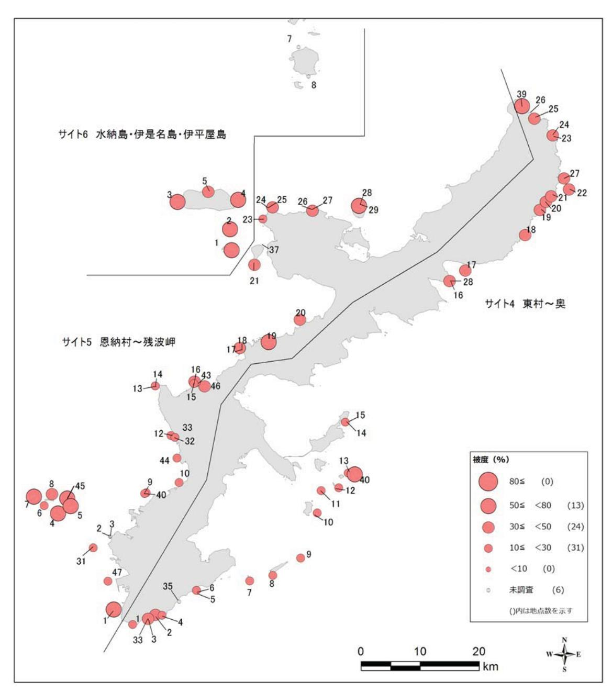

図 I-4-1 モニタリングサイト 1000 サンゴ礁調査 サンゴ被度分布図 (2016) サイト (4) ~ (6) 沖縄島東岸・西岸・周辺離島

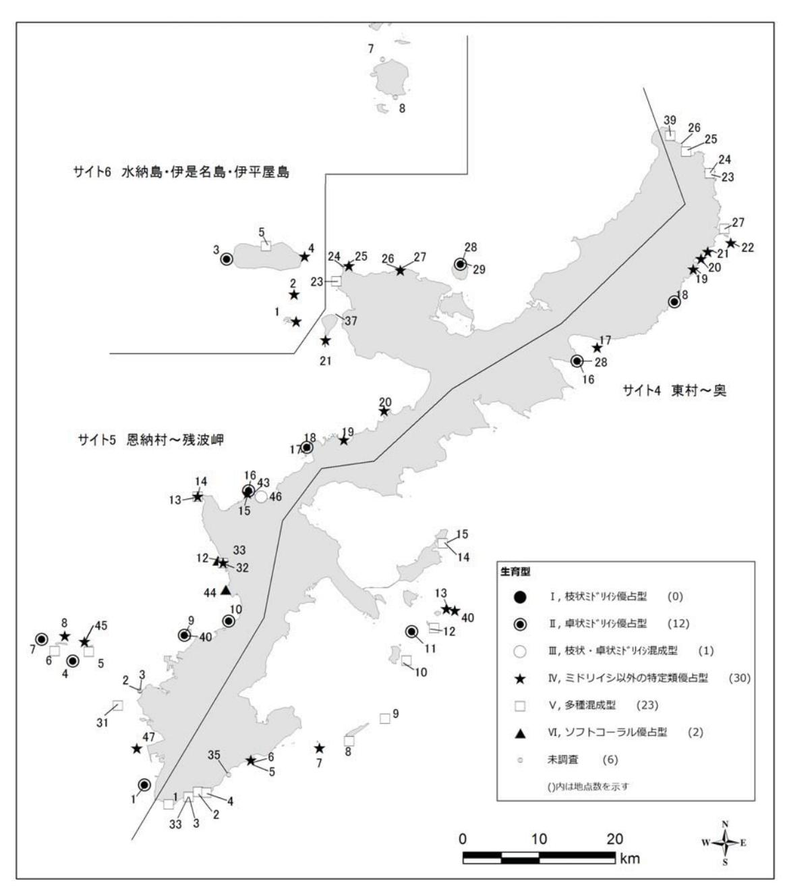

図 I -4-2 モニタリングサイト 1000 サンゴ礁調査 サンゴ生育型 (2016) サイト (4) ~ (6) 沖縄島東岸・西岸・周辺離島

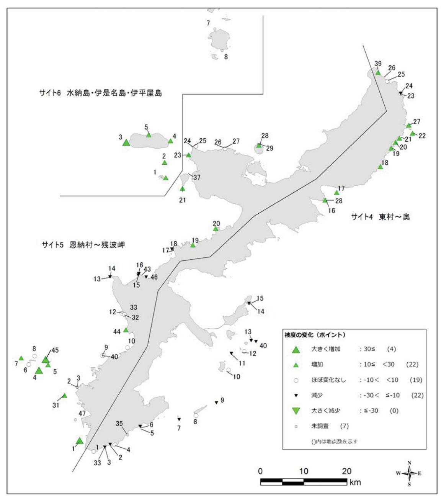

図 I-4-3 モニタリングサイト 1000 サンゴ礁調査 昨年からのサンゴ被度の変化 (2016)

サイト (4) ~ (6) 沖縄島東岸・西岸・周辺離島

(未調査地点は6地点であるが、地点47は昨年度調査を実施しておらず、被度変化を計算するためのデータがないため、未調査扱いとした)

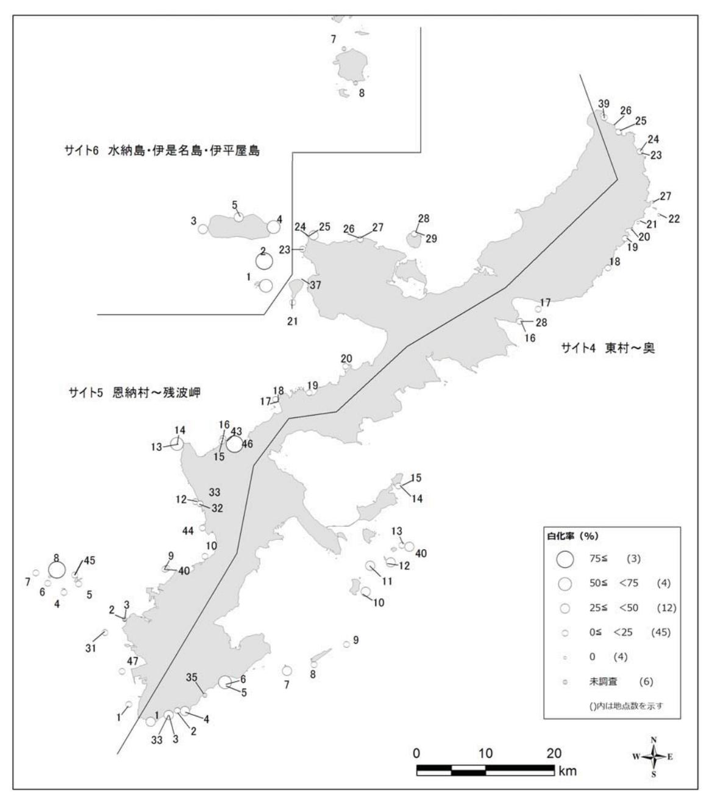

図 I-4-4 モニタリングサイト 1000 サンゴ礁調査 白化の状況(2016) サイト (4)  $\sim$  (6) 沖縄島東岸・西岸・周辺離島

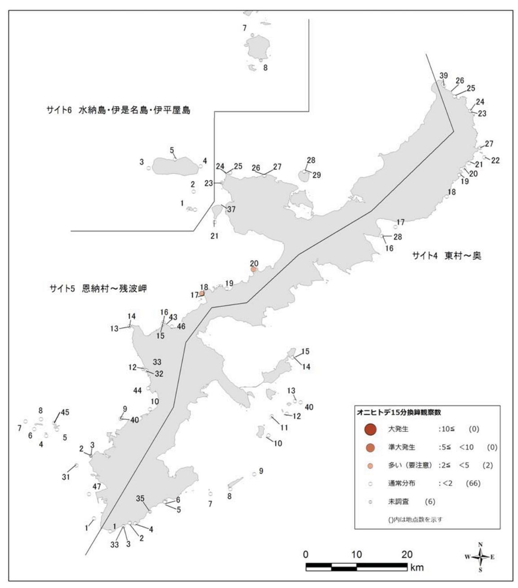

図 I-4-5 モニタリングサイト 1000 サンゴ礁調査 オニヒトデの発生状況 (2016) サイト (4) ~ (6) 沖縄島東岸・西岸・周辺離島

(4) サイト7: 慶良間諸島/慶良間諸島中心海域(阿嘉島、座間味、渡嘉敷周辺)

#### 1) 実施状況

調査は、一般財団法人熱帯海洋生態研究振興財団・阿嘉島臨海研究所の岩尾研二研究員が代表となり、あか・げるまダイビング協会の豊島正彦氏ほか多数の協会員と実施した。

#### 2)調查地点

本サイトでは、10 か所に調査地点を設置し、2016 年度には全調査地点で調査を実施した。 今年度は昨年度に引き続き、渡嘉敷で行われているボランティアによるモニタリングの データ(地点 11、12)の提供を受けたので、本業務の調査地点と合わせて記述する。

サイト7: 慶良間諸島/慶良間諸島中心海域(阿嘉島、座間味、渡嘉敷周辺)における調査地点(モニタリングスポット: 10 地点及びボランティアによる協力地点 2 地点)

地点1:安室南

地点2:座間味阿護の浦

地点3:座間味ニタ

地点 4: 嘉比南

地点5:阿嘉ニシハマ

地点 6: 阿嘉クシバル

地点7:阿嘉アグ

地点8:阿嘉マエノハマ

地点 9: 屋嘉比東

地点 10: 久場北西

地点 11:渡嘉敷アリガー(協力地点) 地点 12:渡嘉敷アハレン(協力地点)

#### 3)調查時期

調査は、2016年11月18日から12月14日の期間中に実施した。

#### 4)調查結果

調査地点ごとのサンゴの生育状況とかく乱要因の状況を図 I-5-1~5 に示す。

#### ① 今年度のサンゴの状況

平均サンゴ被度は 20%であり、昨年度と変わらず「不良」(サンゴ被度 10%以上 30%未満) と評価された。

地点毎にみると(図 I-5-1)、調査地点の中で50%以上のサンゴ被度を示した地点はなく、

最も高いサンゴ被度を示したのは、前年と同じく地点 7(阿嘉アグ)の 30%であり、サンゴ被度 30%以上 50%未満の「やや不良」と評価された。残りの 11 地点はサンゴ被度 10%以上 30%未満の「不良」と評価された。前年と同様、調査地点全てにおいてサンゴ被度 10%以上であったが、30%を超える地点はなく、良好な状態にあるとは言えない。

卓状ミドリイシ類の最大長径については、全地点の平均値は前年からわずかに増加した (62.5cm $\rightarrow$ 70.1cm)。卓状ミドリイシ群体を発見できなかった地点数は減少しており (9 地 点 $\rightarrow$ 6 地点)、また、1 群体もカウントされなかった地点も減少していた (4 地点 $\rightarrow$ 2 地点) ことから、僅かながら卓状ミドリイシ群体の成長が期待された。

ミドリイシ類の新規加入量は、全地点の平均値が 4.3 群体/ $m^2$  (前年 4.2 群体/ $m^2$ )、平均 5.0 群体/ $m^2$ 以上の加入が見られた場所は 5 地点 (前年 5 地点) であり、前年同様に加入の少なさを示していた。今年度調査で加入の多かった上位 5 地点は、地点 8 (阿嘉マエノハマ、8.5 群体/ $m^2$ :)、6 (阿嘉クシバル、8.0 群体/ $m^2$ )、4 (嘉比南、6.5 群体/ $m^2$ )、12 (渡嘉敷アハレン、5.5 群体/ $m^2$ )、3 (座間味ニタ、5.0 群体/ $m^2$ ) であった。

### ② 昨年度のサンゴの状況との比較

平均サンゴ被度は 20%であり、昨年度と変わらなかった。地点毎に前年からのサンゴ被度の変化を見ると(図 I-5-3)、30 ポイント以上大きく減少した地点はなく、地点 2 (座間味阿護の浦)及び 3 (座間味ニタ)の 2 地点で、いずれも 10 ポイントの低下であった。逆に増加したのは地点 12 (渡嘉敷アハレン)のみで、10 ポイントの増加であり、残りの 9 地点では変化がなかった。

近年、慶良間海域はオニヒトデの大発生が収束し、ようやくサンゴ群集の回復傾向にあると考えられるが、今回の調査ではサンゴ被度は昨年から横ばいという結果になった。これは、サンゴの成長/回復による増加分と、2016年の夏季高水温による白化現象の減少分とが相殺された可能性が考えられる。

しかし、調査中の観察によると、小型~中型のミドリイシ類が群体数を増やしており、 今後のサンゴ群集の回復が期待される。特に地点 11 (渡嘉敷アリガー) では、他の地点で は増加が顕著ではない枝状ミドリイシ類の小型~中型群体が散見されており、以前のよう な枝状ミドリイシ類群落の復活が期待される。

枝状ミドリイシ類の増加は、その他に地点 6 (阿嘉クシバル) でも見られており、ここでの回復も期待できそうである。

また、地点 6 (阿嘉クシバル) 及び 7 (阿嘉アグ) などでは多くの卓状、指状、コリンボース状ミドリイシ類が着実に成長しているのが確認され、特に地点 7 では、局所的にはサンゴ被度 70%以上の群集も見られているので、今後地点全体のサンゴ被度の増加が期待される。

### ③ 今年度のかく乱の状況

本調査以外で現地調査者が 11 月に調査したところ、12 調査地点のうち 10 地点(地点 1、2、4、5、6、7、8、9、11、12) が 90%以上、1 地点(地点 10) で 80%以上、1 地点(地点 3) で 70%の白化率を示した。しかし、12 月に実施した本調査では、死亡率の最高値は 20%(地点 3)であり、次いで 15%(地点 10)、残りの 10 地点では死亡率が 5%以下であったので、このサイトでは白化現象は大規模に起こったものの、死亡率は比較的低く、軽度の被害ですんだと考えられる。

オニヒトデの観察数は 2012 年以降減少傾向にあり、昨年度に引き続き、今年度も全 12 地点で 1 個体も確認されなかった(図 I-5-5)。また、昨年度は食痕が 3 地点で認められたが、今年度の調査では確認されなかった。

サンゴ食巻貝は昨年 12 地点中 11 地点で確認され、海域全体での蔓延が心配されたが、今年も 12 地点中 9 地点で確認されており、今後も注意が必要である。

地点 5(阿嘉ニシハマ)及び 7(阿嘉アグ)では黒帯病が確認され、特に地点 5 ではその頻度が高かった。また、調査地点ではないが阿嘉島南岸のマジャノハマでも多くの群体で同じ病気が確認されている。地点 1(安室南)でも卓状ミドリイシ群体において骨格異常が認められたが、これまでのところこの 1 群体のみであり、他には広がっていないので大きな問題ではないと考えられる。

#### ④ その他

テルピオス (カイメン) の発生が地点 1 (安室南) で 1 群体確認されている。2015 年に渡嘉敷島周辺で近接する被覆状コモンサンゴの 10 数群体でテルピオスが確認され、同時期に阿嘉島南岸のマジャノハマでも複数のサンゴ群体でテルピオスの被覆が確認された。2016 年の夏から秋にかけて観察したところマジャノハマで被覆されているサンゴ群体数が増加していると考えられたため、今後も注視していく必要がある。

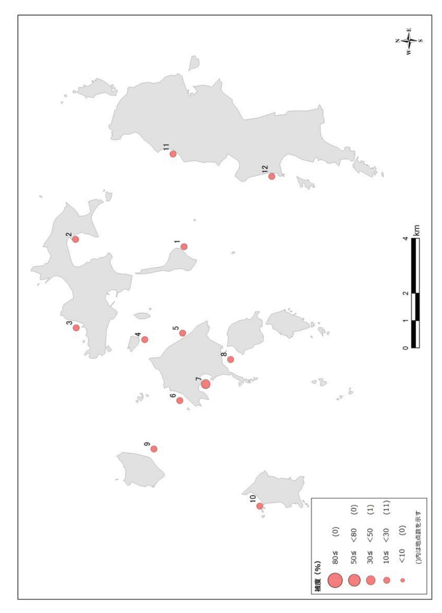

ᅗI-5-1 ࢺࢧࢢࣥࣜࢱࢽࣔ 1000 ࢦࣥࢧ♋ㄪᰝ ࢦࣥࢧ龠ᗘศᕸᅗ㸦2016㸧 ࢺࢧ㸦7㸧Ⰻ㛫ㅖᓥ

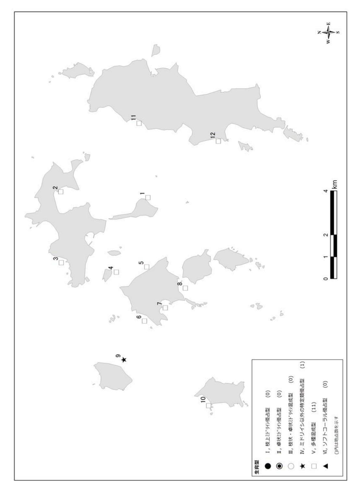

ᅗI-5-2 ࢺࢧࢢࣥࣜࢱࢽࣔ 1000 ࢦࣥࢧ♋ㄪᰝ ࢦࣥࢧ⫱⏕ᆺ㸦2016㸧 ࢺࢧ㸦7㸧Ⰻ㛫ㅖᓥ

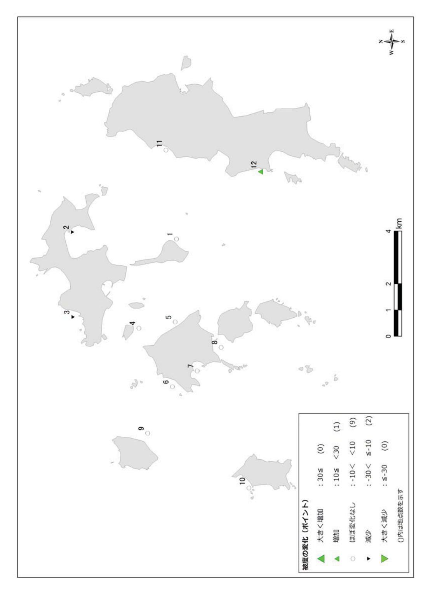

ᅗI-5-3 ࢺࢧࢢࣥࣜࢱࢽࣔ 1000 ࢦࣥࢧ♋ㄪᰝ ᖺࢦࣥࢧࡢࡽ龠ᗘࡢኚ㸦2016㸧 ࢺࢧ㸦7㸧Ⰻ㛫ㅖᓥ

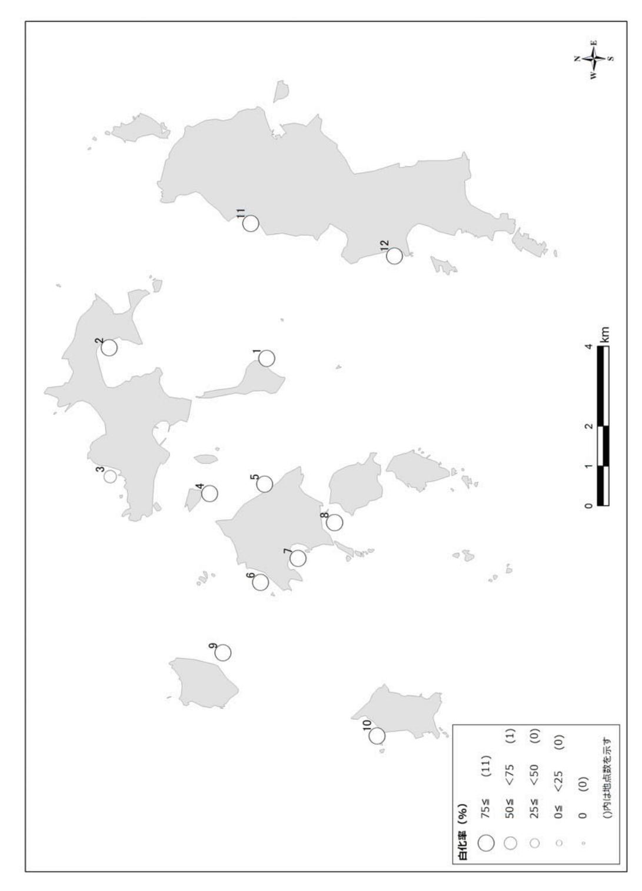

ᅗI-5-4 ࢺࢧࢢࣥࣜࢱࢽࣔ 1000 ࢦࣥࢧ♋ㄪᰝ ⓑࡢ≦ἣ㸦2016㸧 ࢺࢧ㸦7㸧Ⰻ㛫ㅖᓥ

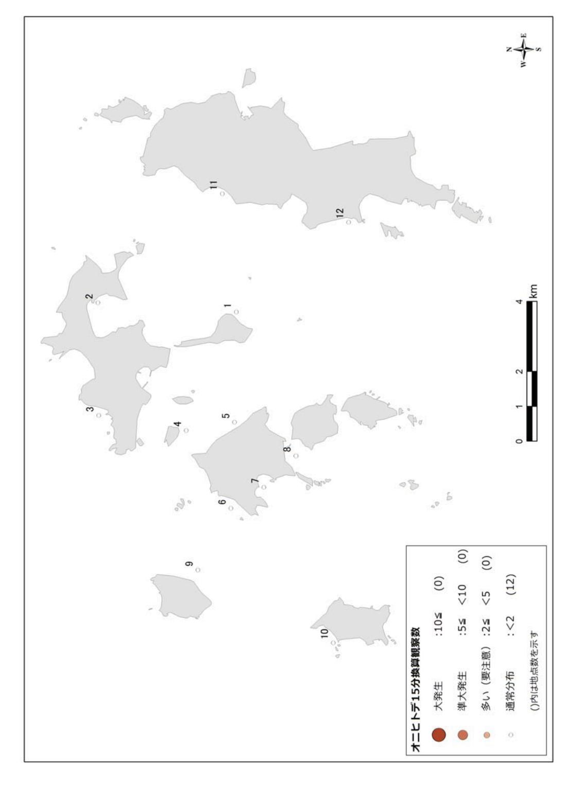

ᅗI-5-5 ࢺࢧࢢࣥࣜࢱࢽࣔ 1000 ࢦࣥࢧ♋ㄪᰝ ࡢࢹࢺࣄࢽ࢜Ⓨ⏕≧ἣ㸦2016㸧 ࢺࢧ㸦7㸧Ⰻ㛫ㅖᓥ

#### (5) サイト8: 大東諸島

#### 1) 実施状況

大東諸島はモニタリングサイト 1000 サンゴ礁調査の 5 年ごとの期間中に 1 回調査を実施する遠隔地サイトである。最初の調査は 2003~2007 年度の第 1 期間中の 2007 年に、第 2 回の調査は 2008~2012 年度の第 2 期間中の 2011 年に実施し、今年度で第 3 回目となる。調査は、自然環境研究センターの木村匡研究員と東海大学非常勤講師の下池和幸氏で実施した。

#### 2)調查地点

調査地点は、第1回調査時に15地点(北大東島に5ヵ所、南大東島に10ヵ所)を設置した後、第2回調査時に3地点(南大東島)を追加し、合計18ヵ所を設置した。しかし、今年度は台風接近による悪天候のため、5地点で調査が実施できず、南大東島の8地点(地点1、2、3、4、5、6、7、9)と北大東島の5地点(地点11、12、13、14、15)の合計13地点でのみ調査を実施した。

サイト8:大東諸島における調査地点(モニタリングスポット)

#### 南大東島

地点1:本場階段前

地点2:ヤギ道(岸壁)前

地点3:塩屋プール前

地点4:塩屋のハナ

地点 5: アカバマ (銅浜)

地点 6: 亀池港前

地点7:海軍棒前

地点8:海軍棒プール(悪天候のため未調査)

地点 9: アカツキポイント

地点 10: アカツキポイント (20m) (悪天候のため未調査)

地点 16:海軍棒前・深場(悪天候のため未調査)

地点 17: 塩屋プール (悪天候のため未調査)

地点 18: ながやの下南側・浅瀬 (悪天候のため未調査)

#### 北大東島

地点 11: 北のハナ・東

地点 12: 北のハナ・南

地点 13: 北大東南端

地点 14: ニイケガマ (二階釜)

地点 15: 真黒崎

#### 3)調查期間

調査は2016年7月4日に実施した。

#### 4)調查結果

調査結果を図 I-6-1~5 に示す。

#### ①今年度のサンゴの状況

調査対象とした北大東島と南大東島は、島の周囲には発達の弱い裾礁が取り巻き、短い 縁脚縁溝構造を形成している。海岸線から水深 20m まではなだらかに傾斜し、それ以降は 水深 2000mまで急激に落ち込んでいる。沿岸の水深 10m 以浅では、あまり大きなサンゴ群 体は見られず、岩盤上に張り付くようにハナヤサイサンゴ類やミドリイシ類の小型群体が 点在していた。

サイト平均サンゴ被度は20%であり、被度区分でも「不良」と評価された。

各調査地点のサンゴ被度を図 I-6-1 に、生育型を図 I-6-2 に示す。調査を実施した 13 地点のうち、サンゴ群集が「優良」及び「良」地点はなく、「やや不良」地点(サンゴ被度 30%以上 50%未満)は、南大東島の 3 地点(地点 1、4、9)であった。「不良」地点(サンゴ被度 10%以上 30%未満)は、北大東島の 5 地点(地点 11、12、13、14、15)及び南大東島の 5 地点(地点 2、3、5、6、7)であった。調査地点の 8 割近くが「不良」と評価され、

しかし、本調査で主に対象としているサンゴ群集は波浪の影響を受けやすい水深 10m以 浅にあり、礁池があまり発達せず外洋に面している大東諸島では、常に波当りが強いため、 繊細な枝状あるいは卓状のミドリイシ類は定着しにくく、被度が増加しにくいと考えられる。サンゴ被度では「不良」と評価されたが、生育状況を観察する限りでは、サンゴ群集は健全と思われた。

#### ②前回調査でのサンゴの状況との比較

5年前の2011年調査では平均サンゴ被度が20%であり、今回の調査と変わらなかった。地点別で比較すると(図 I-6-3)、サンゴ被度が前回調査より30ポイント以上増加した地点はなかったが、10ポイント以上30ポイント未満の増加は南大東島の4地点(地点1、4、7、9)であった。一方、30ポイント以上減少した地点はなかったが、10ポイント以上30ポイント未満の減少を示した地点は、北大東島の3地点(地点11、12、14)と南大東島の1地点(地点2)であり、増加した地点と減少した地点が同じであり、相殺された形となった。ただし20ポイント増加した地点が2地点、10ポイント増加した地点が2地点であったのに対し、20ポイント減少した地点は3地点、10ポイント減少した地点は1地点であったため、被度の増減量で比較すると減少した割合がやや多かった。

なお、10 ポイント未満の増減で変化なしと評価されたのは北大東島の2地点(地点13、

15) と南大東島の3地点(地点3、5、6) であった。

### ③今年度のかく乱の状況

調査を実施したのが 7 月 4 日であり、沖縄海域では高水温が始まった頃であったが、その時点ではまだ高水温による白化現象は確認されなかった (図 I-6-4)。オニヒトデ (図 I-6-5) やサンゴ食巻貝等のかく乱要因も確認されなかった。

### ④その他

特になし。

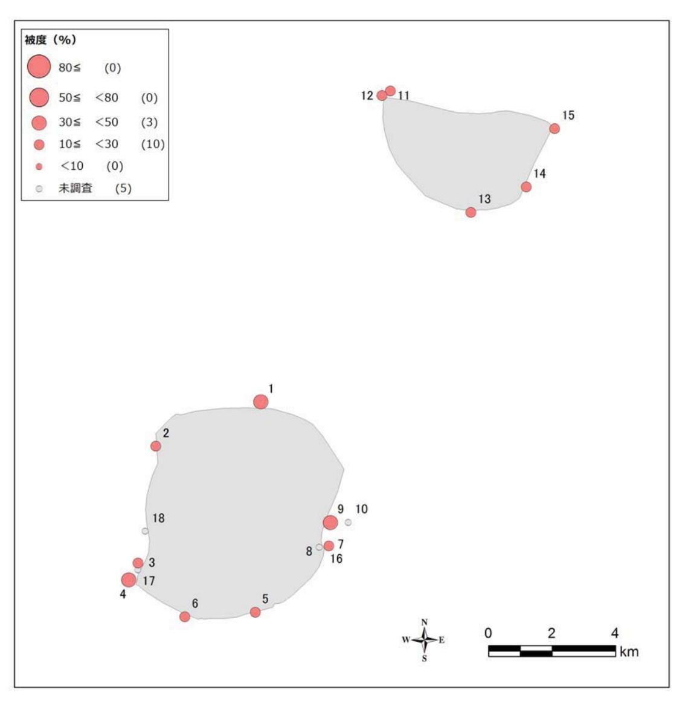

図 I-6-1 モニタリングサイト 1000 サンゴ礁調査 サンゴ被度分布図 (2016) サイト (8) 大東諸島

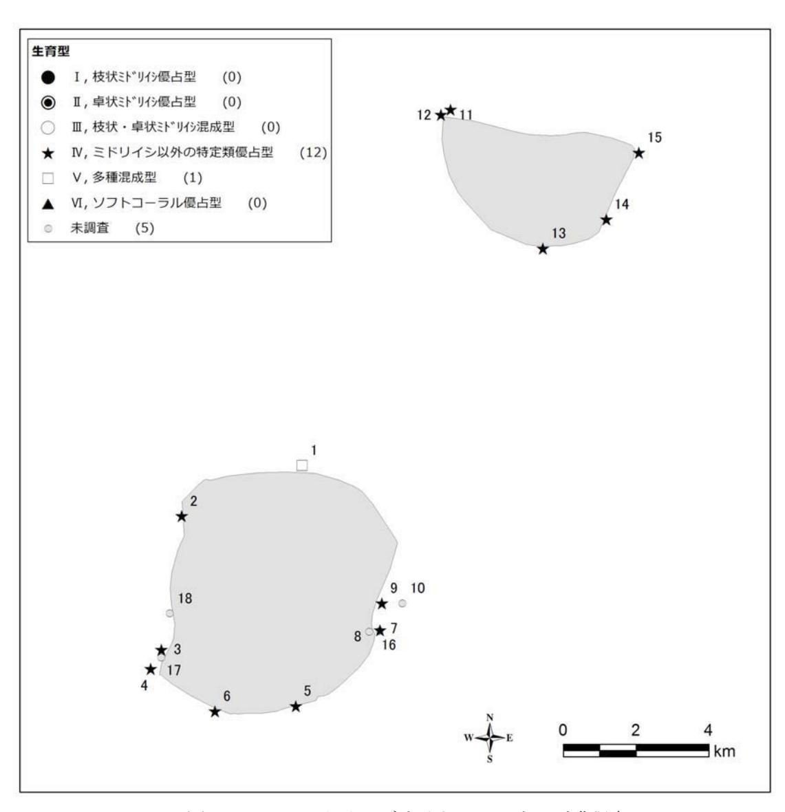

図 I-6-2 モニタリングサイト 1000 サンゴ礁調査 サンゴ生育型 (2016) サイト (8) 大東諸島

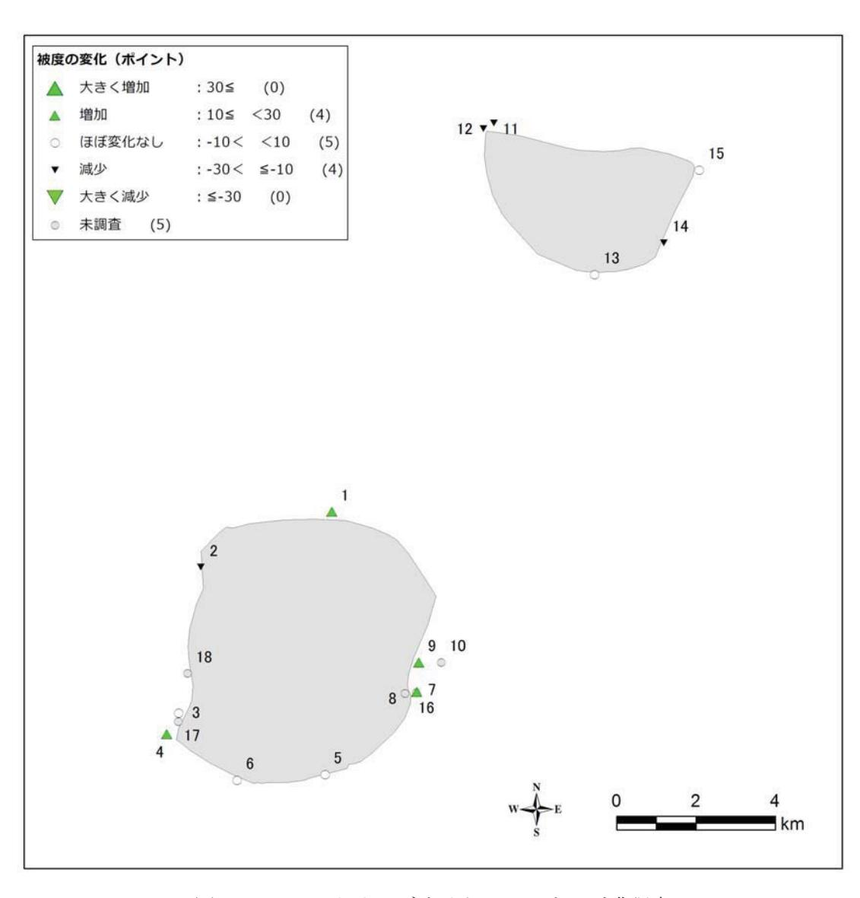

図 I-6-3 モニタリングサイト 1000 サンゴ礁調査 サンゴ被度前年からの変化 (2016) サイト (8) 大東諸島

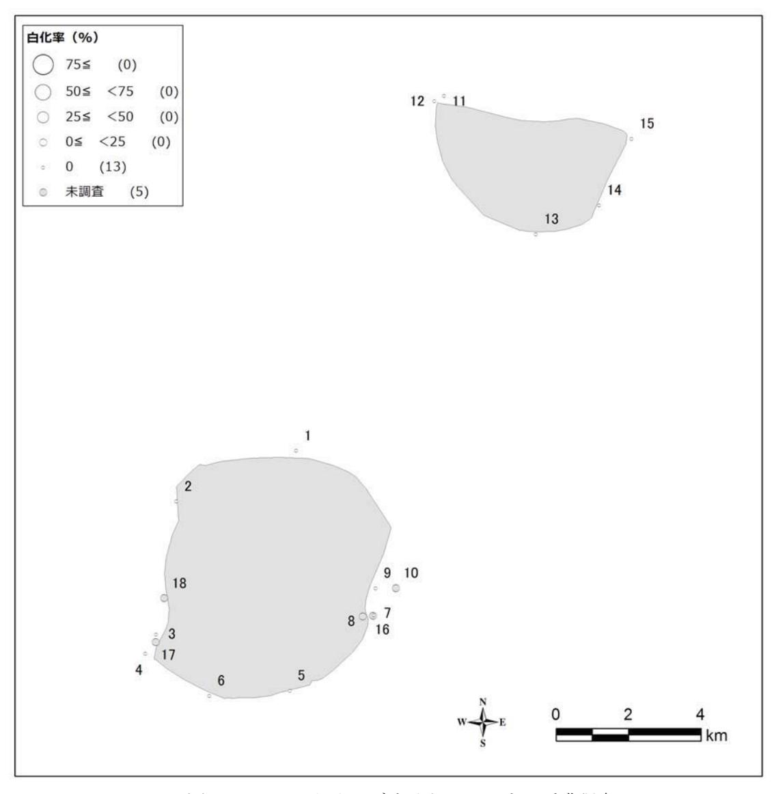

図 I-6-4 モニタリングサイト 1000 サンゴ礁調査 白化の状況 (2016) サイト (8) 大東諸島

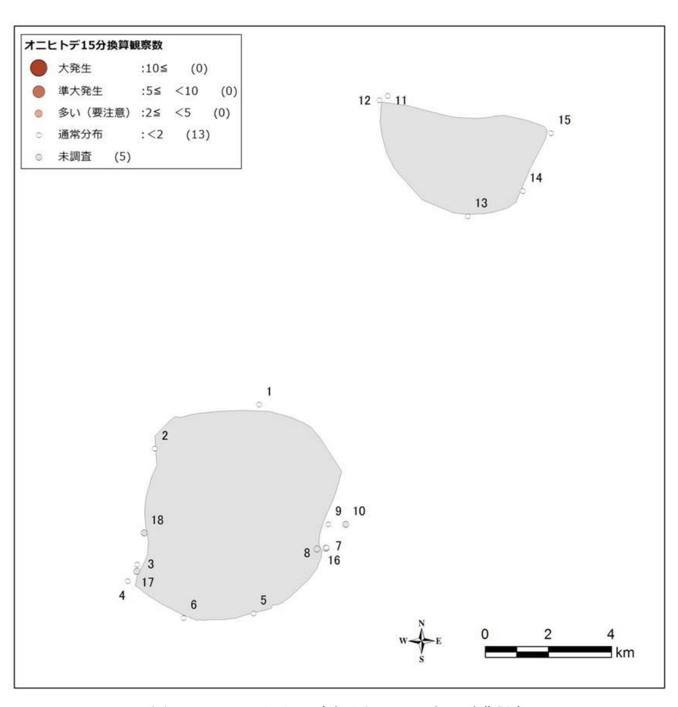

図 I-6-5 モニタリングサイト 1000 サンゴ礁調査 オニヒトデの発生状況 (2016) サイト (8) 大東諸島

### (6) サイト9: 宮古島周辺

サイト 10: 宮古島離礁/八重干瀬

サイト9及び10をひとまとまりの海域とし、調査実施者が同じであるため、まとめて記述する。

#### 1) 実施状況

調査は、宮古島市水産課の梶原健次氏が代表となり、同水産課の島田剛氏及び宮古島市 立久松中学校・松本尚氏とで実施した。

### 2)調查地点

サイト 9 は宮古島の周辺に 10 か所、サイト 10 では宮古島群島北端に位置する離礁である八重干瀬周辺に 4 か所の調査地点(モニタリングスポット)を設置している。2016 年度はこれら全 14 地点で調査を実施した。

サイト9: 宮古島周辺における調査地点(モニタリングスポット:10地点)

地点1:池間島北・カギンミ

地点2:池間島東・チュラビジ

地点 3: 平良·狩俣西

地点4:伊良部・下地島・カヤッファ

地点 5: 伊良部・下地島・渡口沖離礁

地点 6:来間島東・ヨコターラ

地点7:上野・博愛漁港沖・友利大ビセ

地点8:城辺・吉野海岸

地点9:城辺・ツフツワ干瀬北

地点 10:平良・高野漁港沖・二段干瀬

サイト 10: 宮古島離礁/八重干瀬における調査地点 (モニタリングスポット: 4地点)

地点1:八重干瀬・ウル西

地点2:八重干瀬・カナマラ中央南

地点3:八重干瀬・クンカディ・ガマ(旧名:スムトゥビジ南)

地点4:八重干瀬・イフ南

#### 3)調査期間

サイト 9 の調査は、2016 年 9 月 11 日から 2017 年 1 月 9 日までの期間に、サイト 10 の調査は 2017 年 1 月 3 日に実施した。

### 4)調査結果

地点ごとのサンゴの生育状況とかく乱要因の状況を図 I-7-1~5 に示す。

### ① 今年度のサンゴの状況

宮古島周辺及び八重干瀬のサンゴ被度を図 I-7-1 に、生育型を図 I-7-2 に示す。

#### <宮古鳥周辺>

サイト平均サンゴ被度は 20%であり、「不良」(サンゴ被度 10%以上 30%未満)と評価された。

地点毎にみると(図 I-7-1)、サンゴ被度が最も高かったのは、地点 4(伊良部・下地島・カヤッファ)及び 10(平良・高野漁港沖・二段干瀬)の 40%であり、これらは「やや不良」(サンゴ被度 30%以上 50%未満)と評価されるが、その他 12 地点(地点 1、3、2、5、6、7、<math>8、9)は「不良」(サンゴ被度 10%以上 30%未満)と評価された。

ただし、これらのうち、「やや不良」と評価された地点 10 と「不良」と評価された地点 1、2 及び 9 の 4 地点は 2016 年 9 月に調査を実施しており、11 月または翌年 1 月に調査を行ったその他の 6 地点とは調査時期がずれていた。宮古諸島周辺では 2016 年度には夏季高水温による強度の白化現象が生じており、9 月に調査を実施したこれら 4 地点では、高水温の影響でその後サンゴが死亡し、さらに被度が減少した可能性がある。

#### <八重干瀬サイト>

サイト平均サンゴ被度は 10%であり、「不良」(サンゴ被度 10%以上 30%未満)と評価された(図 I-7-1)。

#### ② 昨年度のサンゴの状況との比較

#### <宮古島周辺>

昨年度のサイト平均サンゴ被度は 30%であり、今年度は 10 ポイント減少して 20%となった。

地点毎の被度変化を見ると(図 I-7-3)、30 ポイント以上の減少が 1 地点(地点 6)、10 ポイント以上 30 ポイント未満の減少が 4 地点(地点 4、5、7、8)であり、ほとんどの地点が昨年から被度の減少を示した。地点 8(城辺・吉野海岸)はミドリイシ類がほとんど死亡し、サンゴ被度は 30%から 10 ポイント低下した。地点 4(伊良部・下地島・カヤッファ)は葉状コモンサンゴの減少やミドリイシ類の死亡があり、被度は昨年の 50%から 10 ポイント低下した。

被度が「ほとんど変化なし」であったのが 4 地点(地点 1、2、3、9)、10 ポイント増加したのが 1 地点(地点 10)であったが、地点 10 は 2016 年 9 月 11 日に調査を実施しており、調査時に強度の白化を生じていたため、その後白化から回復せずに大量に死亡した可能性が高いと考えられる。また、地点 1、2 及び 9 についても同様で、9 月以降に死亡し、

さらに被度が減少した可能性が高い。地点 3 (平良・狩俣西) は昨年と同じ 10%であったが、明らかにミドリイシ類の多くが消失していた。

#### <八重干瀬>

サイト平均サンゴ被度は 10%であり、昨年度から 10ポイント減少した。昨年度は卓状ミドリイシ優占群集でサンゴ被度が 70%であった地点 3 (クンカディ・ガマ) は、今年度の調査で多種混成型となり、被度は大きく減少して 10%となった。また、昨年度は卓状・枝状ミドリイシ優占群集で被度 50%であった地点 2 (カナマラ中央南) も多種混成型となり、10%に大きく減少した。昨年度、サンゴ被度が 10%であった地点 1 (ウル西) 及び 5 (イフ南) は、今年度の調査でサンゴ被度に変化がなかったが、これはスポットチェック法の調査特度では 10%未満の低被度の変化を数値として検出できないためであり、実際にはミドリイシ類の死亡が多数確認された。特に地点 4 (イフ南) では、2013 年以降、サンゴ被度の増加はなかったものの、礁縁付近で卓状ミドリイシ類の小型群体が多数成長しているのが確認されており、サンゴ群集回復の初期段階にあると考えられていたが、今回の高水温によると考えられる白化によりその多くが死亡した。

### ③ 今年度のかく乱の状況

<宮古島周辺サイト>

図 I-7-4 に白化の状況を示した。2016 年 9 月 11 日に調査を実施した 4 地点(地点 1、2、9、10)では、いずれも白化率 90%以上で、特にミドリイシ類を中心に強度の白化を生じていた。調査時の死亡率は 10%程度であったが、その後の大量死亡が懸念される。

本調査とは別に、2016年11月12日に調査実施者の一人が地点1(池間島北・カギンミ)付近の状況を確認したところ、ミドリイシ類のほとんどが死亡していたことが確認されている。

11 月以降に調査した 6 地点 (地点  $3\sim8$ ) では、90%以上のミドリイシ類が死亡しており、そのほとんどは高水温による白化が原因と考えられた。特にミドリイシ優占型であった地点 5 (伊良部・下地島・渡口沖離礁)及び 6 (来間島東・ヨコターラ)では、サンゴ群集全体がほぼ壊滅状態となっていた。

また白化以外には、卓状ミドリイシ類のホワイトシンドロームが目立った。これまでの罹患率は 1~5%未満であったが、今年度調査では 10~20%に上昇していた。原因は不明であるが、白化又は高水温により健全性が下がり、発症につながった可能性も考えられ、白化から生き延びたサンゴが今後ホワイトシンドロームのかく乱を受けることが危惧される。葉状コモンサンゴ類は、確認されたどの地点でも白化の影響をほとんど受けていなかった。ただし、地点 4(伊良部・下地島・カヤッファ)では葉状コモンサンゴ群集の 30~40%で部分的損壊(シュノーケリングによる破損またはゴマモンガラによる食害の疑いがある。)と、テルピオスによるかく乱があった。

なお、オニヒトデは地点 4 で小型個体が 1 個体確認されたのみで通常分布の範囲であり、 顕著な食害は確認されなかった(図 I-7-5)。また、サンゴ食巻貝については、地点 4 と 5 で食害が散見されるランク II を示したが、被食率は低く 5%であった。

#### <八重干瀬サイト>

このサイトでも全調査地点で高水温によると考えられる白化及び死亡が確認された(図 I-7-4)。本調査では白化から死亡に至る過程を直接観察していないが、八重干瀬を利用するダイビング事業者からの聞き取り情報や、宮古諸島周辺での白化現象の発生状況から判断すると、確認された死亡のほとんどは高水温による白化の影響と判断される。全地点を共通して葉状コモンサンゴ類は白化せず、健全であった。

最も白化による死亡が顕著であったのは、昨年度のサンゴ被度が70%であった地点3(クンカディ・ガマ)であり、群集のほとんどを構成していた卓状ミドリイシ類の90%以上が死亡し、サンゴ被度は10%となった。昨年度はサンゴ被度が50%で卓状・枝状ミドリイシ優占群集であった地点2(カナマラ中央南)でも、死亡によりサンゴ被度が10%に低下した。地点1(ウル西)及び4(イフ南)では、昨年度までのサンゴ被度は10%であったため今年度の調査結果と変化がなかったが、ミドリイシ類の死亡が多数観察され、特に地点4ではサンゴ群集の回復初期にあった小型の卓状・コリンボース状ミドリイシの多くが死亡していた。

また白化以外には、卓状ミドリイシ類のホワイトシンドロームが目立った。このサイトにおけるこれまでの罹患率は1~5%未満であったが、今年度の調査では10~20%の罹患率に上昇していた。原因は不明であるが、白化又は高水温により生理的健全性が下がり、発症につながった可能性も考えられ、白化から生き延びたサンゴが、今後ホワイトシンドロームのかく乱を受けることが危惧される。

なお、このサイトではオニヒトデによる食害は確認されなかった(図 I-7-5)。サンゴ食巻貝については、地点 3(クンカディ・ガマ)で食害が散見されるランク II を示したが、被食率は低く 5%であった。

#### ④ その他

#### <宮古島周辺サイト>

水温はサイト 10 (宮古島離礁/八重干瀬) の地点 3 (クンカディ・ガマ) 及び 2 (カナマラ中央南) の水深 3mにおいて、1 時間ごとに計測している。水温記録によると、今年度発生した白化現象の主原因は、6 月末から 8 月末まで続いた高水温と考えられた。水温は 7 月中旬に一時的に 30℃を下回る時期があったが、その他の期間では 30.0℃台が持続していた。

なお、2017年1月現在においても水温は25℃前後であり、比較的高い状態が続いていた。

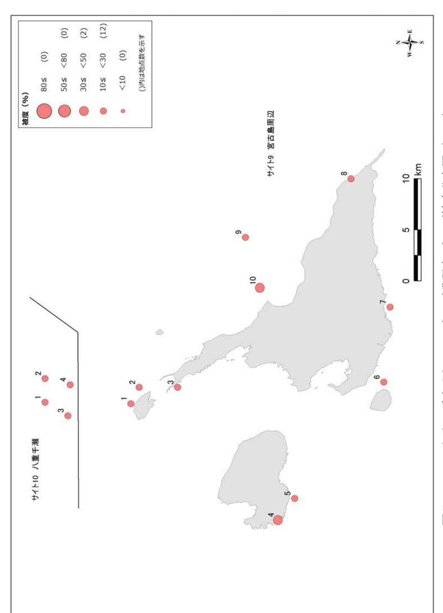

ᅗ I-7-1 ࢺࢧࢢࣥࣜࢱࢽࣔ 1000 ࢦࣥࢧ♋ㄪᰝ ࢦࣥࢧ龠ᗘศᕸᅗ㸦2016㸧 ࢺࢧ㸦9㸧㹼㸦10㸧ᐑྂᓥ࿘㎶ࠊඵ㔜ᖸ℩

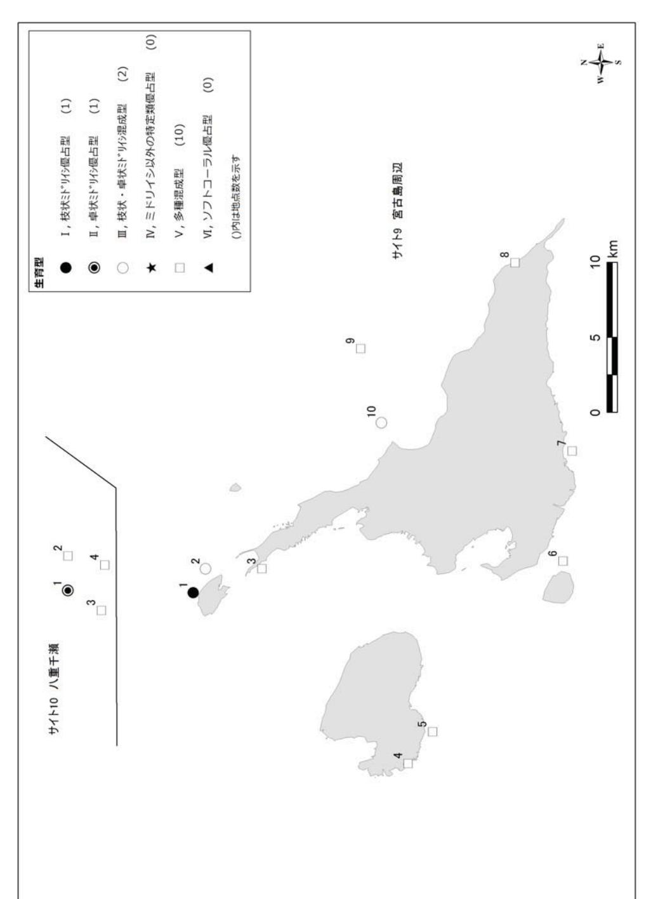

ᅗ I-7-2 ࢺࢧࢢࣥࣜࢱࢽࣔ 1000 ࢦࣥࢧ♋ㄪᰝ ࢦࣥࢧ⫱⏕ᆺ㸦2016㸧 ࢺࢧ㸦9㸧㹼㸦10㸧ᐑྂᓥ࿘㎶ࠊඵ㔜ᖸ℩

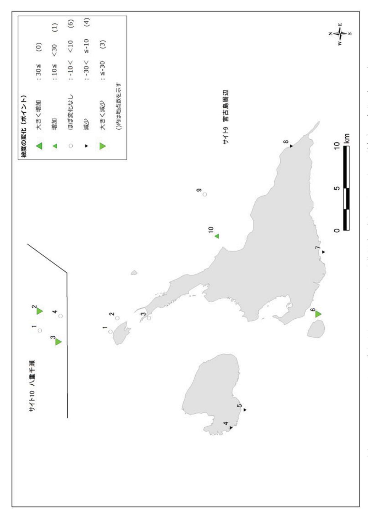

ᅗ I-7-3 ࢺࢧࢢࣥࣜࢱࢽࣔ 1000 ࢦࣥࢧ♋ㄪᰝ ᖺࢦࣥࢧࡢࡽ龠ᗘࡢኚ㸦2016㸧 ࢺࢧ㸦9㸧㹼㸦10㸧ᐑྂᓥ࿘㎶ࠊඵ㔜ᖸ℩

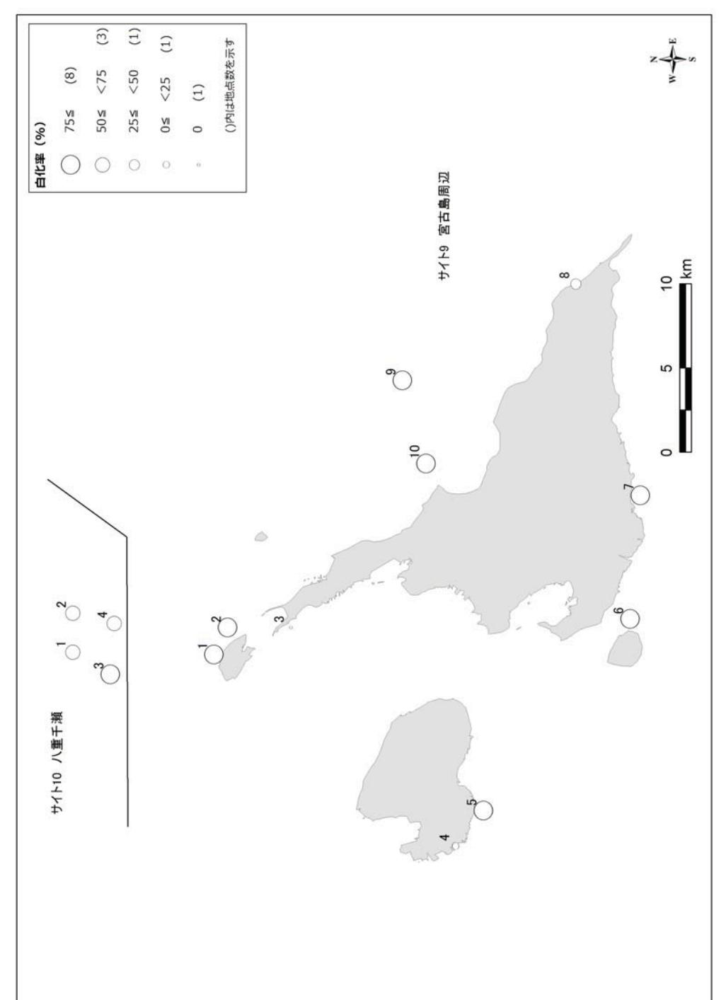

ᅗ I-7-4 ࢺࢧࢢࣥࣜࢱࢽࣔ 1000 ࢦࣥࢧ♋ㄪᰝ ⓑࡢ≦ἣ㸦2016㸧 ࢺࢧ㸦9㸧㹼㸦10㸧ᐑྂᓥ࿘㎶ࠊඵ㔜ᖸ℩

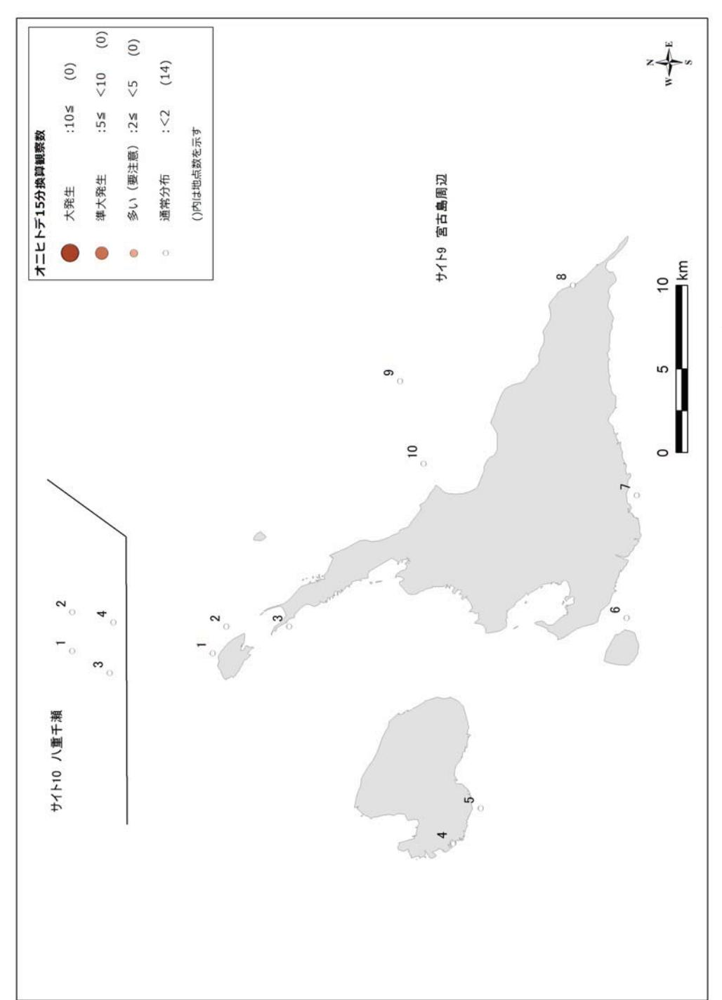

ᅗ I-7-5 ࢺࢧࢢࣥࣜࢱࢽࣔ 1000 ࢦࣥࢧ♋ㄪᰝ ࡢࢹࢺࣄࢽ࢜Ⓨ⏕≧ἣ㸦2016㸧 ࢺࢧ㸦9㸧㹼㸦10㸧ᐑྂᓥ࿘㎶ࠊඵ㔜ᖸ℩

(7) サイト11: 石垣島東岸/平久保崎~宮良湾

サイト12: 石垣島西岸/川平~大崎

サイト 11 及び 12 をひとまとまりの海域とし、調査実施者が同じであるため、まとめて記述する。

#### 1) 実施状況

調査は、有限会社海游の吉田稔氏が代表となり、同社の佐川鉄平氏とともに実施した。

#### 2)調查地点

サイト 11 は石垣島東岸に 33 地点、サイト 12 は石垣島西岸に 44 地点の調査地点を設置 し、2015 年度は全 77 地点で調査を実施した。

サイト 11: 石垣島東岸/平久保崎~宮良湾における調査地点 (モニタリングスポット: 33 地点)

地点1:大浜小前

地点 2: 宮良川河口

地点 3: 宮良集落前

地点 4: 白保集落前

地点 5: 白保アオサンゴ

地点 6: 白保第1ポール

地点 7: 白保~轟川

地点8:轟川河口

地点9:モリヤマグチ

地点 10: スムジグチ

地点 11:採石場前

地点 12:通路川南

地点 13:通路川水路北

地点 14: 野原崎

地点 15: 伊野田漁港前

地点 16: 大野牧場前

地点 17: 玉取崎南

地点 18: 玉取崎東

地点 19: 伊原間牧場前

地点 20: トムル崎南

地点 21: トムル崎

地点 22: パラワールド前

地点 23:明石~安良崎

地点 24:安良崎南

地点 25: 安良崎

地点 26: 安良グチ北

地点 27: 岩崎南

地点 28: 岩崎

地点 29: 岩崎~浦崎

地点 30:浦崎沖

地点 31:浦崎前

地点 32: 平野集落前

地点 33: 平久保灯台北

### サイト 12: 石垣島西岸/川平~大崎における調査地点 (モニタリングスポット: 44 地点)

地点1:平久保灯台西

地点2:平久保川北

地点 3: 平久保集落南

地点 4: 嘉良川前

地点5:ダテフ崎北

地点 6: ダテフ崎南

地点7:野底石崎

地点 8: 栄集落前

地点 9: 野底集落前

地点 10:野底崎

地点 11: 伊土名北

地点 12: 伊土名南

地点 13:浦底湾口北

地点 14:浦底湾口西

地点 15: 富野集落前

地点 16:米原キャンプ場

地点 17: ヤマバレー前

地点 18: ヤマバレー西

地点 19: 川平小島東

地点 20: 川平小島北

地点 21: 川平水路東

地点 22: 川平水路

地点 23: 川平水路北西

地点 24: 川平~石崎

地点 25: クラブメッド前

地点 26: 川平石崎北

地点 27: 川平石崎南

地点 28: 底地ビーチ沖

地点 29: 崎枝湾内

地点 30: 崎枝湾口

地点 31: 崎枝~御神

地点 32: 御神崎

地点 33: 御神~屋良部

地点 34: 屋良部崎北

地点 35: 屋良部崎南

地点 36: 屋良部~大崎

地点 37: 名蔵保護水面

地点 38: 富崎小島前

地点 39: 観音崎

地点 40: 真栄里海岸前

地点 41: 赤崎

地点 42: 名蔵川河口

地点 43:明石西

地点 44: 伊原間湾口

#### 3)調查期間

調査は、サイト 11 (石垣島東岸) は 2016 年 12 月 19 日から 21 日までの期間に、サイト 12 (石垣島西岸) は 2015 年 12 月 9 日から 14 日、及び 22 日から 23 日の期間中に実施した。

### 4)調査結果

地点ごとのサンゴの生育状況及びかく乱要因の状況を図 I-8-1~5 に示す。

#### ① 今年度のサンゴの状況

石垣島東岸と西岸を合わせた全77地点の平均サンゴ被度は20%であり、被度から判断するサンゴ群集の状態は「不良」と評価される。東岸(サイト11)だけの平均サンゴ被度は30%、西岸(サイト12)だけの平均サンゴ被度は10%であり、西岸の方がサンゴ被度の低い地点が多く、特に西岸の北部から中部は被度10%未満の地点が多かった。

地点毎のサンゴ被度を図 I-8-1 に示す。「優良」地点 (サンゴ被度 80%以上) はなく、「良」

地点 (サンゴ被度 50%以上 80%未満) は 15 地点 (サイト 11: 東岸では 9 地点、サイト 12: 西岸は 6 地点) であり、昨年度から 4 地点増加した。「やや不良」地点(サンゴ被度 30%以上 50%未満) は 11 地点 (サイト 11: 東岸では 8 地点、12: 西岸では 3 サイト) であり、昨年度より 5 地点減少し、「不良」地点(サンゴ被度 10%以上 30%未満)は 17 地点 (サイト 11: 東岸では 6 地点、12: 西岸では 11 地点)であり、昨年度より 8 地点増加した。「極めて不良」地点(サンゴ被度 10%未満)は 34 地点(サイト 11: 東岸で 10 地点、12: 西岸では 24 地点)であり、昨年度から 7 地点減少した。全体で見ると「極めて不良」の地点が 44%を占めていた。

生育型別ではミドリイシ類を主体とする地点(枝状、枝状・卓状、卓状の合計)は 10 地点(昨年度は 6 地点)、ミドリイシ類以外の特定類優占型が 16 地点(昨年度と同じ)、多種混成型が 48 地点(昨年度は 51 地点)、ソフトコーラル型が 3 地点(昨年度は 4 地点)であり(図 I-8-2)、多くの地点が低被度の多種混成型であった。

新規加入量が 10 群体/ $m^2$ 以上の地点は 6 地点(地点 12、13、15、33、35、44)であり、全て西岸であった(昨年度も全て西岸)。最高値は地点 15(富野集落前)の 19 群体/ $m^2$ 、次いで地点 44(伊原間湾口)の 15 群体/ $m^2$  と地点 12(伊土名南)の 14 群体/ $m^2$  であった。

### ② 昨年度のサンゴの状況との比較

全地点の平均被度 20%は昨年度と変わらず、サイト 11 (石垣島・東岸) のみの平均被度 (30%) 及びサイト 12 (石垣島・西岸) のみの平均被度 (10%) ともに昨年度と変わらなかった。

地点毎に被度変化をみると(図 I-8-3)、10 ポイント以上のサンゴ被度の「増加」が見られたのは東岸に 3 地点(地点 2、27、30)、西岸に 2 地点(地点 16 及び 18)の合計 5 地点であり、いずれも 10 ポイントの増加であった。昨年度 10 ポイント以上の増加が見られたのは 2 地点であり、やや増加した。被度増加の主な要因はミドリイシ類及びコモンサンゴ類の増加であった。

一方、10 ポイント以上 30 ポイント未満で被度が「減少」した地点は、東岸に 6 地点(地点 9、12、16、24、25、28)、西岸に 4 地点(地点 37、38、39、41)の合計 10 地点であり、昨年度の 8 地点から増加した。被度減少の主な原因は白化現象によるミドリイシ類の減少であった。

その他 62 地点は、昨年度から 10 ポイント未満の増減を示したため、「変化なし」と評価 した。

新規加入量は今年度の最高値が 19 群体/m2 であったが、昨年度は 35 群体/m2 であったため、今年度は新規加入がやや少なかった。

#### ③ 今年度のかく乱の状況

今年度は夏季高水温によるサンゴの白化現象が全ての地点で確認された(図 I-8-4)。75%

以上の白化率を示したのは 31 地点、50%以上 75%未満は 21 地点であった。特にオニヒトデの収束で、小型のミドリイシ類が増加傾向にあった地点や、現状でのミドリイシ類やコモンサンゴ類の割合が高い地点で、白化の比率が高い傾向にあった。死亡率が高かった地点では、ミドリイシ類やアナサンゴモドキ類の死亡が多く確認された。

オニヒトデやその食痕は確認されず(図 I-8-5)、サンゴ食貝類やサンゴの病気が確認された地点は少なかった。ただし高水温による白化現象の影響があったため、例年に比べてオニヒトデによる食痕や病気に羅患した群体の確認が難しく、過小評価している可能性もある。

### ④ その他

本年度の調査は多くの地点で 9 月に実施しており、地点によっては調査後も高水温による白化現象が進行し、群体の死亡を招くことが考えられるため、今年度の夏季高水温によるサンゴ被度への影響を評価するためには、来年度の調査結果を考慮する必要がある。

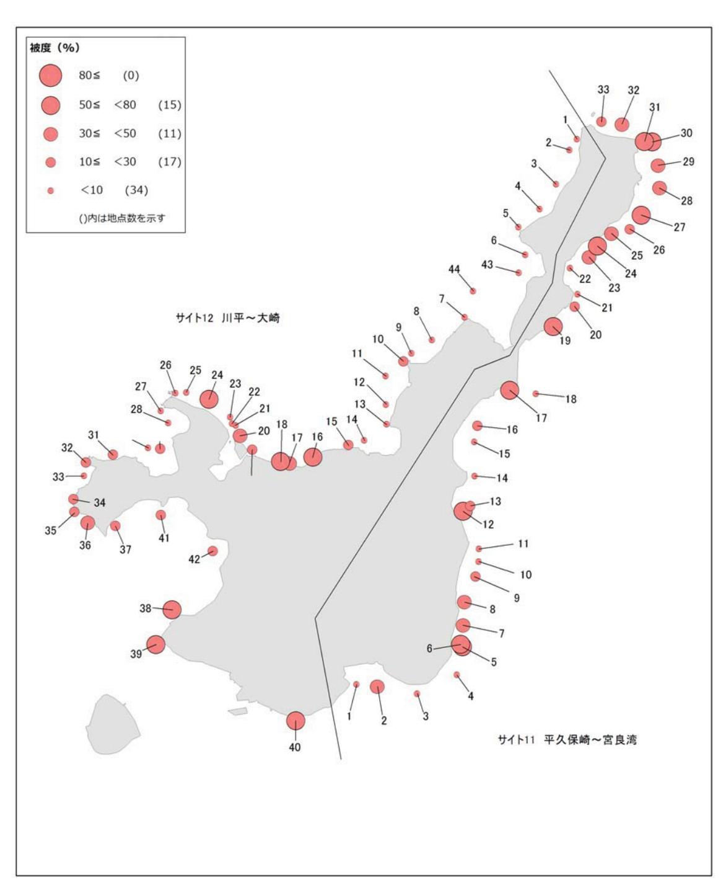

図 I-8-1 モニタリングサイト 1000 サンゴ礁調査 サンゴ被度分布図 (2016) サイト (11) ~ (12) 石垣島東岸・西岸

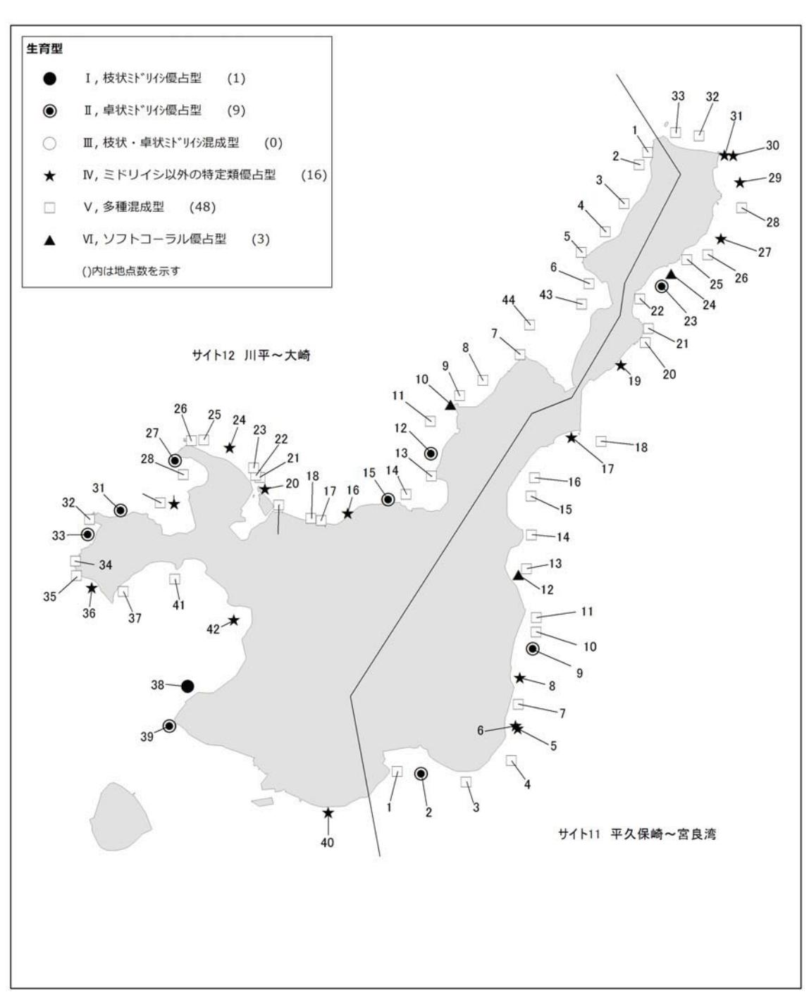

図 I-8-2 モニタリングサイト 1000 サンゴ礁調査 サンゴ生育型 (2016) サイト (11) ~ (12) 石垣島東岸・西岸

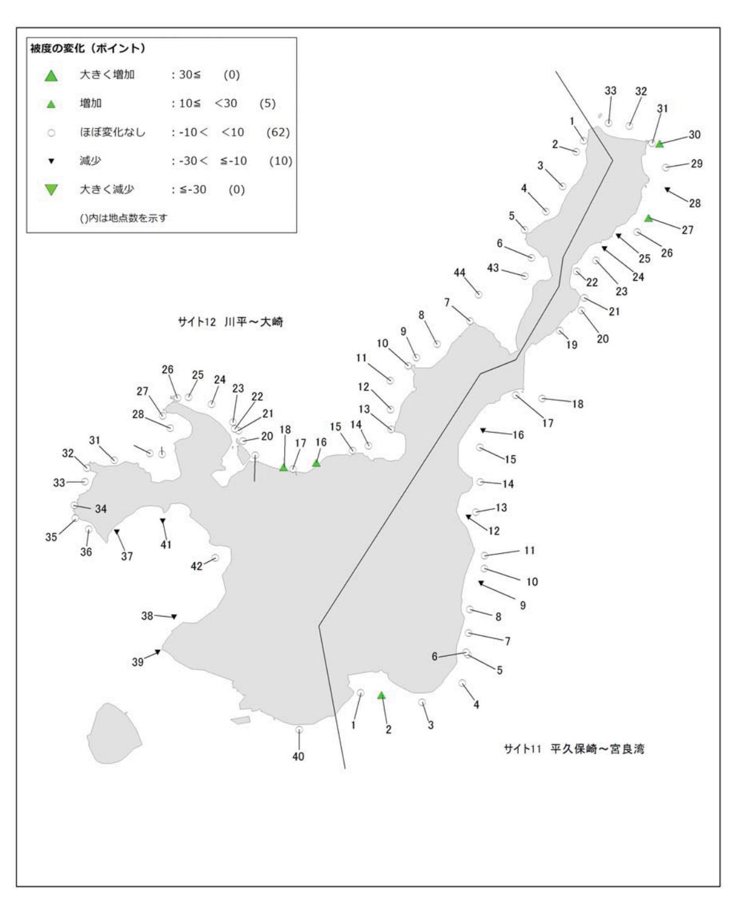

図 I-8-3 モニタリングサイト 1000 サンゴ礁調査 昨年からのサンゴ被度の変化 (2016) サイト (11) ~ (12) 石垣島東岸・西岸

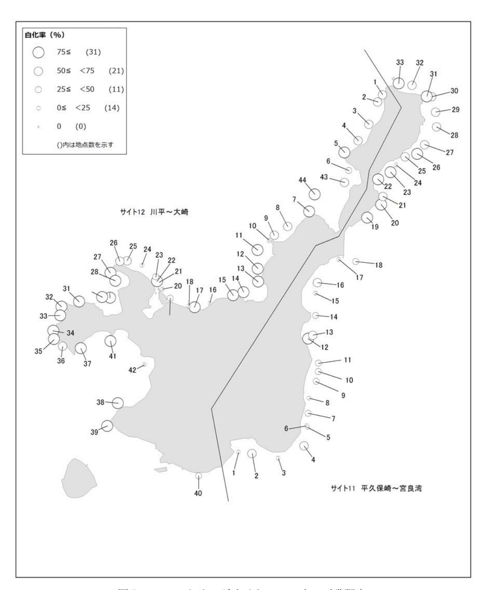

図 I-8-4 モニタリングサイト 1000 サンゴ礁調査 白化の状況 (2016) サイト (11) ~ (12) 石垣島東岸・西岸

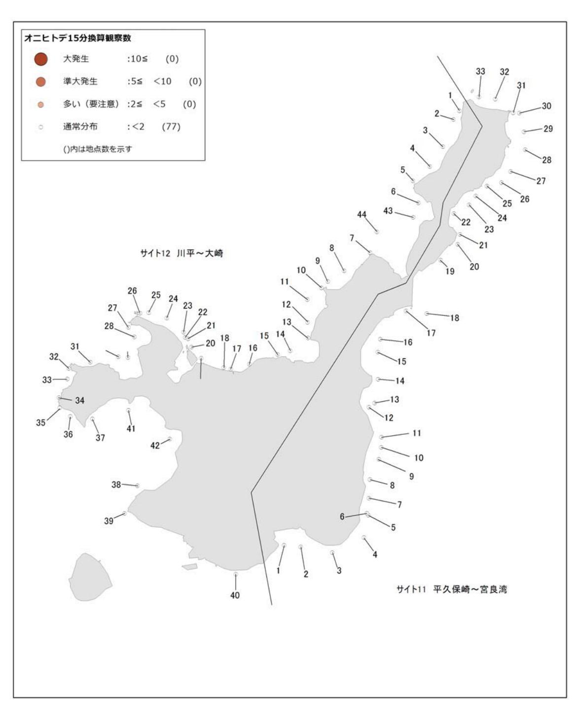

図 I-8-5 モニタリングサイト 1000 サンゴ礁調査 オニヒトデの発生状況 (2016) サイト (11) ~ (12) 石垣島東岸・西岸

(8) サイト13: 石西礁湖・北部/小浜島周辺

サイト 14: 石西礁湖・東部/カタグァー周辺

サイト 15: 石西礁湖・中央部/シモビシ~仲間崎沖

サイト 16: 石西礁湖・南部/黒島~新城島

サイト17: 西表島と周辺離島/崎山湾(西表島西部)周辺

サイト  $13\sim17$  をひとまとまりの海域とし、調査実施者が同じであるため、まとめて記述する。

#### 1) 実施状況

調査は、一般財団法人自然環境研究センターの木村匡研究員を代表者とし、石西礁湖サンゴ礁調査の上野光弘氏と八重山漁業協同組合の砂川政信氏、宮島克典氏及び川﨑豊氏が 実施した。

#### 2)調查地点

石西礁湖北部のサイト 13 に 28 か所、東部のサイト 14 に 20 か所、中央部のサイト 15 に 24 か所、南部のサイト 16 に 30 か所、西表島周辺のサイト 17 に 23 か所の調査地点を設置し(合計 125 か所)、すべての調査地点で調査を実施した。

サイト 13: 石西礁湖・北部/小浜島周辺における調査地点(モニタリングスポット: 28 地点)

地点 27: 小浜島東沖

地点 28: 嘉弥真島南岸礁縁

地点 31: 嘉弥真島南西岸礁池内

地点 32: 小浜島北東岸礁縁

地点 35: ヨナラ水道南礁縁

地点 36: ヨナラ水道南①

地点 42: 小浜島東沖礁湖内①

地点 43:小浜島東沖礁湖内②

地点 44: 嘉弥真島東沖礁湖内

地点 49: 竹富島西沖離礁礁縁

地点 50: 竹富島西沖離礁外縁

地点 51: 竹富島北岸礁外縁

地点 52: 竹富島北東岸礁外縁

地点 53: 竹富島北東沖礁縁

地点 62: ヨナラ水道南②

地点 63: ヨナラ水道南部

地点 64: ヨナラ水道中央部①

地点 65: ヨナラ水道北部

地点 67: 小浜島東沖離礁①

地点 68: 嘉弥真島東沖礁内縁

地点 71: 嘉弥真島東沖礁外縁

地点 72: 嘉弥真島北岸礁外縁①

地点 73: 嘉弥真島北岸礁外縁②

地点 74: 小浜島北岸礁外縁

地点 75: ヨナラ水道中央部②

地点 110: 小浜島東沖離礁②

地点 112: タキドングチ海中公園地区

地点 116: 鵜離島前離礁

サイト 14: 石西礁湖・東部/カタグァー周辺における調査地点(モニタリングスポット: 20 地点)

地点 46:シモビシ海中公園地区

地点 47: 竹富島南西岸礁縁

地点 54: 竹富島東沖離礁

地点 76: アーサーピー外縁

地点 77: ウマノハピー礁内①

地点 78: ウマノハピー礁内②

地点 79: ウマノハピー礁内③

地点 80: ウマノハピー内縁①

地点 81: ウマノハピー内縁②

地点 82: ウマノハピー内縁(3)

地点 83: ウマノハピー内縁④

地点 84: ウマノハピー外縁①

地点 87: アーサーピー内縁①

地点 88: アーサーピー内縁②

地点 89:アーサーピー内縁③

地点 90: アーサーピー内縁④

地点 93: ウマノハピー外縁②

地点 109: 竹富島南沖離礁①

地点 114: 竹富島南沖離礁②

地点 115: ウマノハピー礁内④

サイト **15**: 石西礁湖・中央部/シモビシ〜仲間崎沖における調査地点(モニタリングスポット: **24** 地点)

地点 4: 黒島北沖離礁①

地点 5: 黒島北沖離礁②

地点 19: 黒島北沖離礁③

地点 20: 黒島北沖離礁④

地点 22: 黒島一小浜島間離礁①

地点 23: 小浜島南東岸礁縁

地点 24: 小浜島南東沖礁縁①

地点 25: 小浜島南東沖礁縁②

地点 37: 黒島-西表島間離礁①

地点 38: 黒島-西表島間離礁②

地点 39: 黒島-小浜島間離礁②

地点 40: 小浜島南東沖離礁①

地点 41: 小浜島南東沖離礁②

地点 58: 西表島東沖離礁①

地点 59: 西表島東沖離礁②

地点 60: 西表島東沖離礁③

地点 61: 西表島東岸礁池内

地点 66: 小浜島南礁縁

地点 104:新城島-西表島間離礁②

地点 106: 黒島北西沖離礁

地点 107: 小浜島南沖離礁

地点 108: ヨナラ水道南沖離礁

地点 111: 小浜島南東沖離礁③

地点 113: 西表島仲間崎沖離礁

サイト 16: 石西礁湖・南部/黒島~新城島における調査地点 (モニタリングスポット: 30 地点)

地点1:ウラビシ南礁縁

地点2:ウラビシ東礁縁

地点3:ウラビシ北東礁縁

地点 6: 黒島北西岸礁縁

地点 7: 黒島西岸礁池内

地点8:黒島南西岸礁池内①

地点 9: 黒島南岸礁池内

地点 10: 黒島南東岸礁池内①

地点 11: 黒島北東岸礁池内

地点 12:新城島上地北岸離礁

地点 13:マイビシ海中公園地区

地点 14:新城島上地西岸

地点 15:新城島間水路部

地点 16:新城島下地西岸礁池内①

地点 17:新城島下地西岸礁池内②

地点 45: ウラビシ北離礁

地点 69: 黒島南東岸礁池内②

地点 70: 黒島南西岸礁池内②

地点 85:新城島水路部礁池内

地点 94: 黒島南西岸礁外縁

地点 95: 黒島南岸礁外縁

地点 96:キャングチ海中公園地区

地点 97: 黒島東岸礁外縁

地点 98:新城島上地東岸礁外縁

地点 99:新城島下地南東岸礁外縁

地点 100:新城島下地西岸礁外縁

地点 101:新城島北西沖離礁

地点 102:新城島-西表島間離礁①

地点 103:南風見崎沖離礁外縁東

地点 105: 黒島-新城島間大型離礁

サイト 17: 西表島と周辺離島/崎山湾(西表島西部)周辺における調査地点(モニタリングスポット: 23 地点)

地点 120: ユツン湾口礁縁

地点 121: 船浦沖離礁

地点 122: バラス島西

地点 123: 鳩間島南東礁池①

地点 124: 鳩間島南東礁池②

地点 125: 鳩間島南西沖離礁

地点 126: 星砂浜前礁縁

地点 126': 星砂浜前礁池内

地点 127: タコ崎礁縁

地点 127': タコ崎礁浅部

地点 129:網取湾奥

地点 130: ヨナソネ

地点 131: 崎山礁縁

地点 132: 崎山礁池

地点 133:波照間石

地点 134: 鹿川湾中ノ瀬①

地点 135: 鹿川湾中ノ瀬②

地点 136: サザレ浜礁縁

地点 137: 豊原沖礁縁

地点 138: 船浮崎前

地点 139: 外パナリ南礁縁

地点 141: 鳩間島・東礁縁

地点 142: 鳩間島・北礁縁

#### 3)調查期間

調査は、2016年10月21日から11月20日の期間中に実施した。

#### 4)調查結果

調査地点ごとのサンゴの生育状況及びかく乱要因の状況を石西礁湖(サイト  $13\sim16$ )と西表島(サイト 17)に分けて図  $I-9-1\sim10$  に示す。

#### ① 今年度のサンゴの状況

全調査地点での平均サンゴ被度は 20%であり、「不良」(サンゴ被度 10%以上 30%未満) と評価された。

地点毎にみると(図 I-9-1、図 I-9-2)、サンゴ被度が「極めて不良」地点(サンゴ被度 10%未満)は 10 地点(石西礁湖で 9 地点、西表島で 1 地点)、「不良」地点(サンゴ被度 10%以上 30%未満)は 76 地点(石西礁湖で 69 地点、西表島で 7 地点)、「やや不良」地点(サンゴ被度 30%以上 50%未満)は 29 地点(石西礁湖で 19 地点、西表島で 10 地点)、「良」地点(サンゴ被度 50%以上 80%未満)は 9 地点(石西礁湖で 5 地点、西表島で 4 地点)、「良」地点(サンゴ被度 80%以上)は 1 地点(西表島)であった。サンゴ被度が 50%以上の「良」及び「優良」と評価されたのは、125 調査地点中わずか 10 地点のみであり、調査地点の最多数が「不良」であった。平均サンゴ被度(20%)で判断しても「不良」と評価されるため、今年度の本調査海域は全体として「不良」に区分される。

#### ② 昨年度のサンゴの状況との比較

全調査地点の平均サンゴ被度は、昨年度の 40%から半減した。「不良」と評価される地点数が大幅に増加し、「やや不良」、「優良」及び「良」の地点数は減少した。地点毎の被度変化を見ると(図 I-9-5、図 I-9-6)、昨年度と比較してサンゴ被度が「大きく増加」(30 ポイント以上の増加)した地点はなく、10 ポイント以上 30 ポイント未満「増加」した地点が5地点(石西礁湖で4地点、西表島で1地点)、10 ポイント未満の増減のため「変化なし」と判断される地点が33地点(石西礁湖で29地点、西表島で4地点)、10 ポイント以上30 ポイント未満の幅で「減少」した地点は54地点(石西礁湖で43地点、西表島で11地点)、30 ポイント以上「大きく減少」した地点は33地点(石西礁湖で26地点、西表島で7地点)であり、過半数を占める地点でサンゴ被度が昨年度から減少した。これは、夏季高水温による白化現象の影響によるものと考えられる。

なお、ウラビシ南礁縁(地点 1)では、2016年1月22日から25日にかけて大寒波かつ、 大潮で夜間最干潮時に異常低潮位になり、礁原上のサンゴ群集が干出したことより、直接 死を引き起こす白化現象が発生し、約60%のサンゴが死亡した。

サンゴ被度が 2 年連続して 10 ポイント以上減少した地点のうち 7 地点は、近年継続的に工事が行われている浚渫地点近傍に位置している。

#### ③ 今年度のかく乱の状況

今年度、本海域で最も大きなかく乱であったのが夏季高水温による白化現象であった。 125 地点での平均白化率は 96%、平均死亡率は 49%であり、本調査で白化現象の評価を開始した 1998 年以降、最大規模かつ最も深刻であった。各地点の白化現象の状況を図 I-9-7 と図 I-9-8 に示す。白化率が 75%以上であった地点が 123 地点(石西礁湖で 100 地点、西表島で 23 地点)、50%以上 75%未満であった地点が 1 地点(石西礁湖)、25%以上 50%未満であった地点が 1 地点(石西礁湖)、25%以上 50%未満であった地点が 1 地点(石西礁湖)であり、全地点で白化現象の発生が確認された。

オニヒトデについては、1個体以上確認されたのは125調査地点中8地点(6%)で、昨年度(40地点)よりも大幅に減少し、通常分布範囲であった(図 I-9-9、図 I-9-10)。また、総目撃数も昨年度の140個体に比べて大幅に減少し10個体となった。地点132(崎山礁池)は今年度調査時にオニヒトデが確認されなかったが、昨年度調査時にオニヒトデが大発生状態であり、今年度のサンゴ被度の減少は、オニヒトデによる食害の影響も一因となっていると推定される。

サンゴ食巻貝については、ランクIII(食痕が大きく、食害部のある群体が目立つ。)が 4 地点、ランクIV(死亡群体が目立ち、密集した貝集団が散見される。)の地点が 2 地点あった。これらの地点では枝状ミドリイシ類の大群落が広がっており、今後の被害が懸念される。

調査地点の約7割のSPSSのランクは、サンゴ礁が健全に生育できる範囲内(ランク5a 未満)にあった。調査対象海域全域では、赤土等懸濁物質の平均含有量は昨年より増加し、39kg/m³(昨年は20.1kg/m³)を示した。これは、今年度暴風圏内に入った台風が少なかっ たことがその要因の一つであると考えられる。

腫瘍、黒帯病、ホワイトシンドロームが観察されたのは、それぞれ 27 地点、13 地点、119 地点であった。全調査地点の約 9 割にあたる地点でホワイトシンドロームが確認された。

台風によるサンゴ群集の破損は、全調査地点の約50%の62地点で認められた。台風襲来数とその威力のわりに影響を受けた地点数が多いのは、昨年度の台風破損による、サンゴ群体や岩盤の脆弱化が継続しているためと推測される。

### ④その他

特になし。

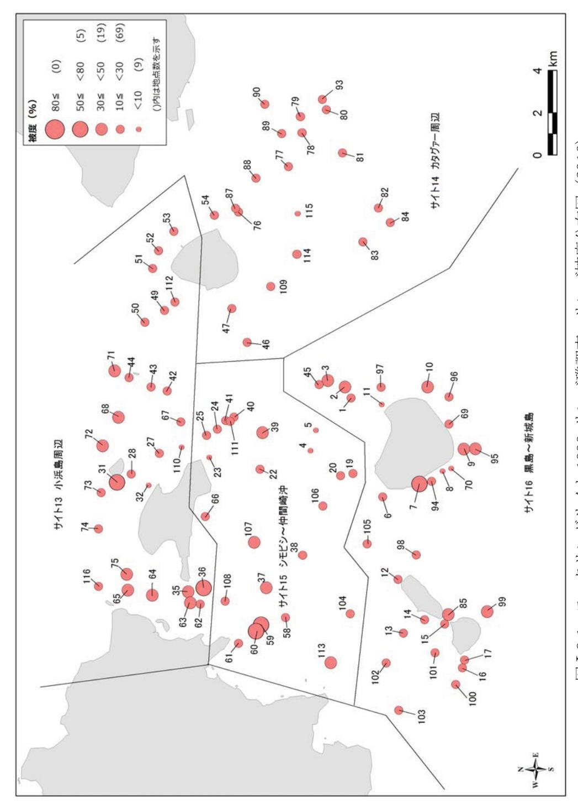

ᅗ I-9-1 ࢺࢧࢢࣥࣜࢱࢽࣔ 1000 ࢦࣥࢧ♋ㄪᰝ ࢦࣥࢧ龠ᗘศᕸᅗ㸦2016㸧 ࢺࢧ㸦13㸧㹼㸦16㸧▼す♋†࣭㒊࣭ᮾ㒊࣭୰ኸ㒊࣭༡㒊

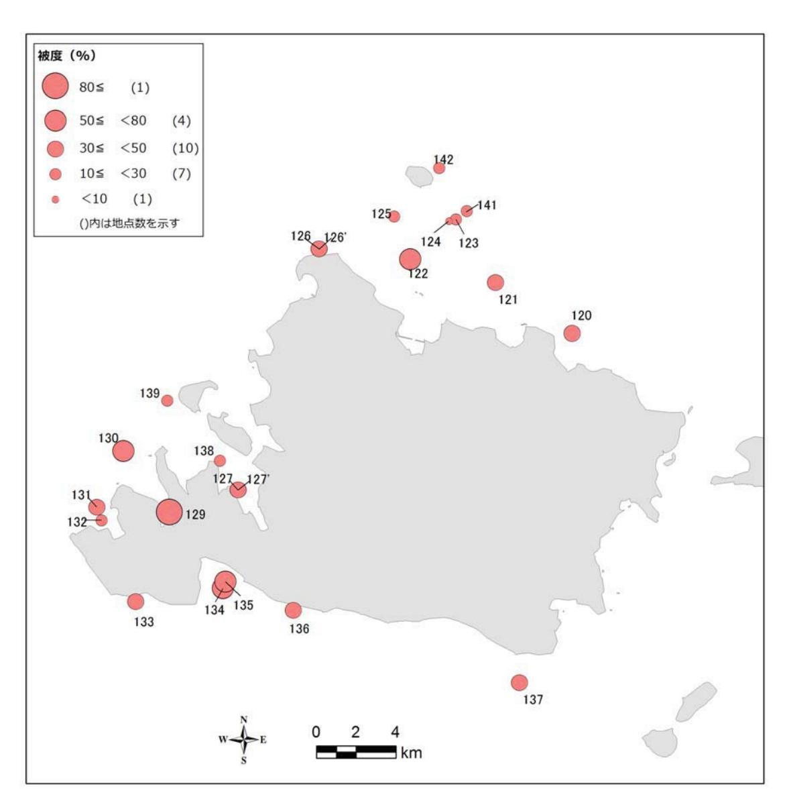

図 I-9-2 モニタリングサイト 1000 サンゴ礁調査 サンゴ被度分布図 (2016) サイト (17) 崎山湾 (西表島西部) 周辺

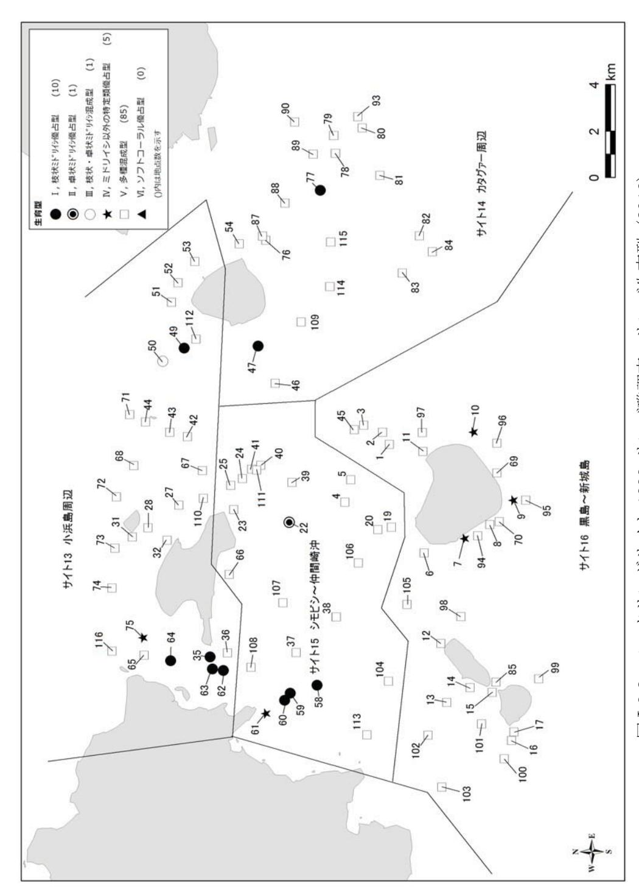

ᅗ I-9-3 ࢺࢧࢢࣥࣜࢱࢽࣔ 1000 ࢦࣥࢧ♋ㄪᰝ ࢦࣥࢧ⫱⏕ᆺ㸦2016㸧 ࢺࢧ㸦13㸧㹼㸦16㸧▼す♋†࣭㒊࣭ᮾ㒊࣭୰ኸ㒊࣭༡㒊

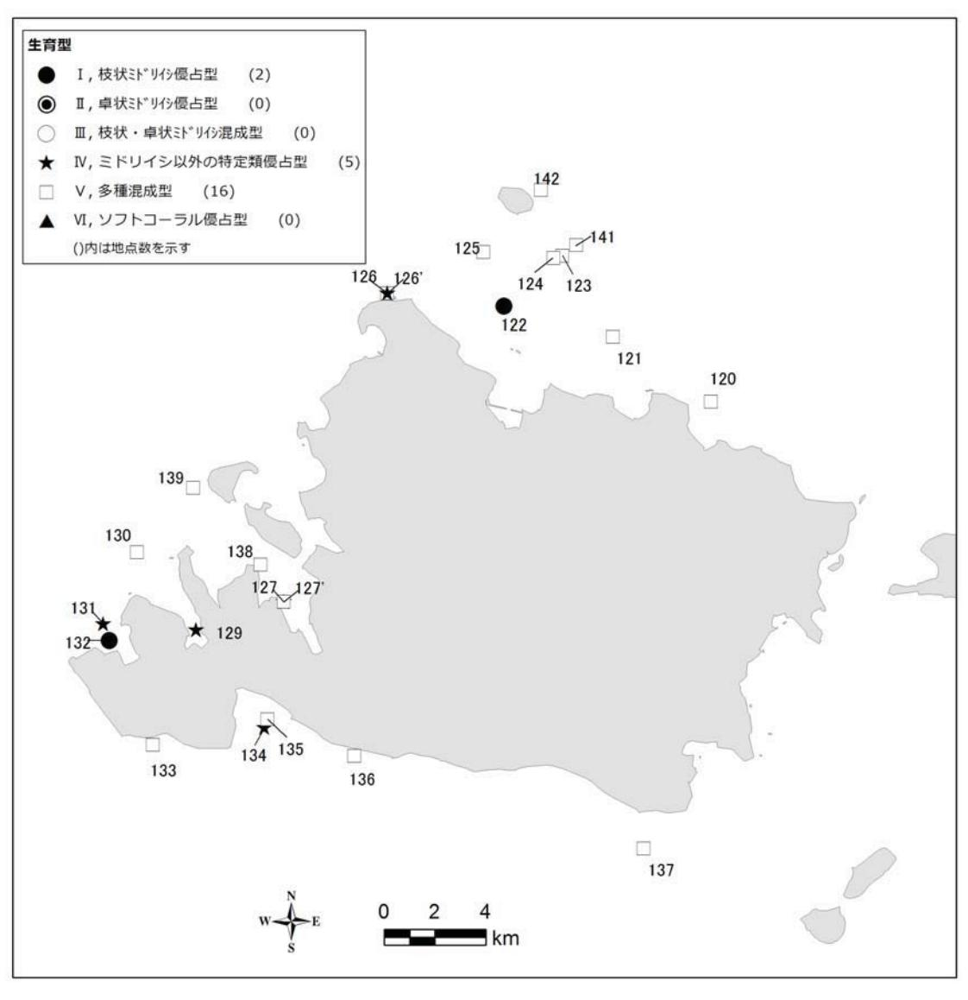

図 I-9-4 モニタリングサイト 1000 サンゴ礁調査 サンゴ生育型 (2016) サイト (17) 崎山湾 (西表島西部) 周辺

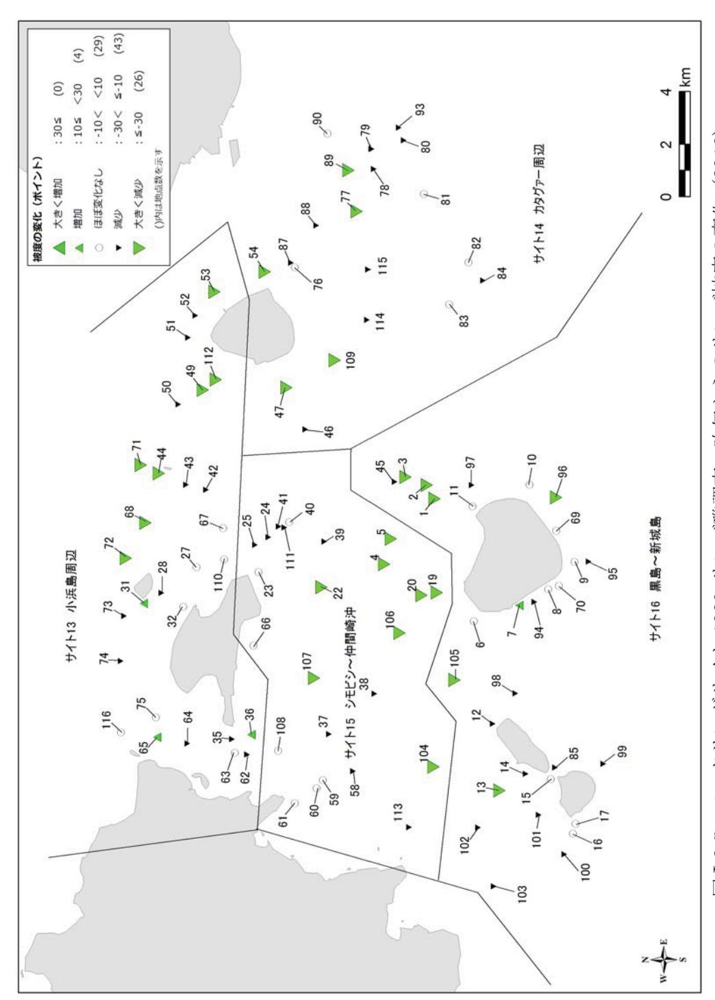

ᅗ I-9-5 ࢺࢧࢢࣥࣜࢱࢽࣔ 1000 ࢦࣥࢧ♋ㄪᰝ ᖺࢦࣥࢧࡢࡽ龠ᗘࡢኚ㸦2016㸧 ࢺࢧ㸦13㸧㹼㸦16㸧▼す♋†࣭㒊࣭ᮾ㒊࣭୰ኸ㒊࣭༡㒊

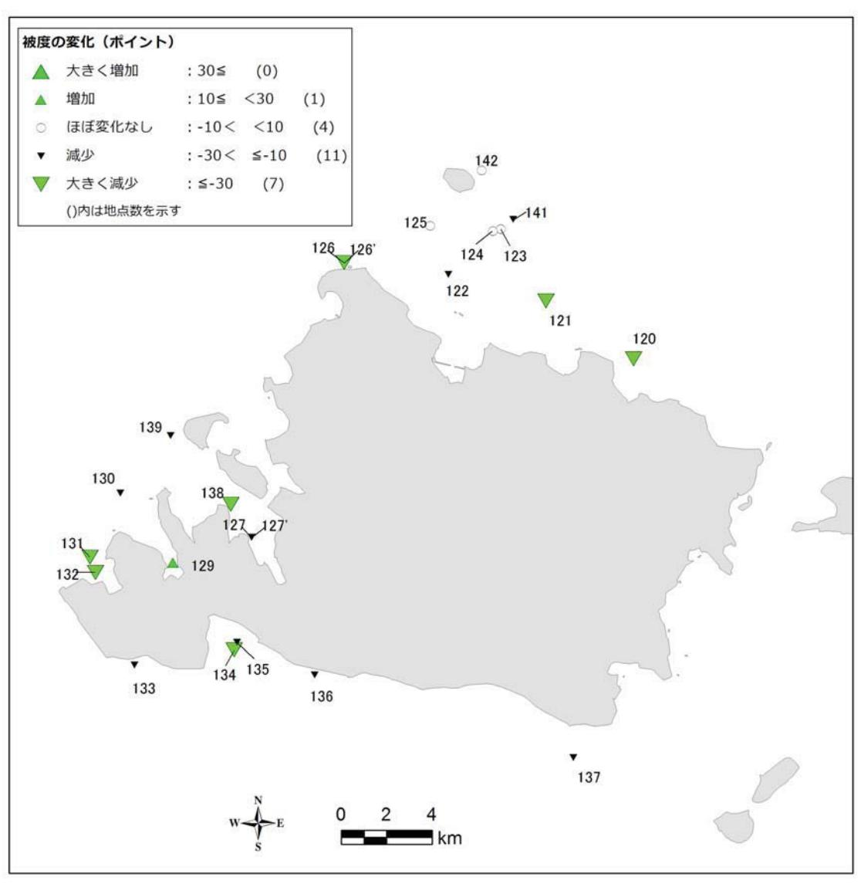

図 I-9-6 モニタリングサイト 1000 サンゴ礁調査 昨年からのサンゴ被度の変化 (2016) サイト (17) 崎山湾 (西表島西部) 周辺

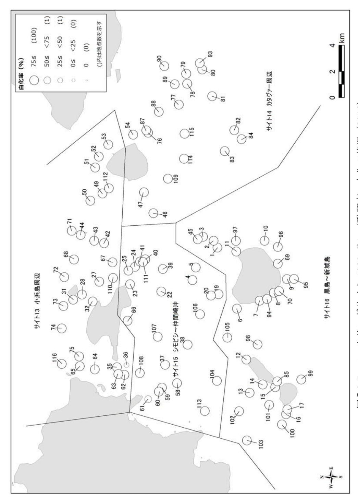

ᅗ I-9-7 ࢺࢧࢢࣥࣜࢱࢽࣔ 1000 ࢦࣥࢧ♋ㄪᰝ ⓑࡢ≦ἣ㸦2016㸧 ࢺࢧ㸦13㸧㹼㸦16㸧▼す♋†࣭㒊࣭ᮾ㒊࣭୰ኸ㒊࣭༡㒊

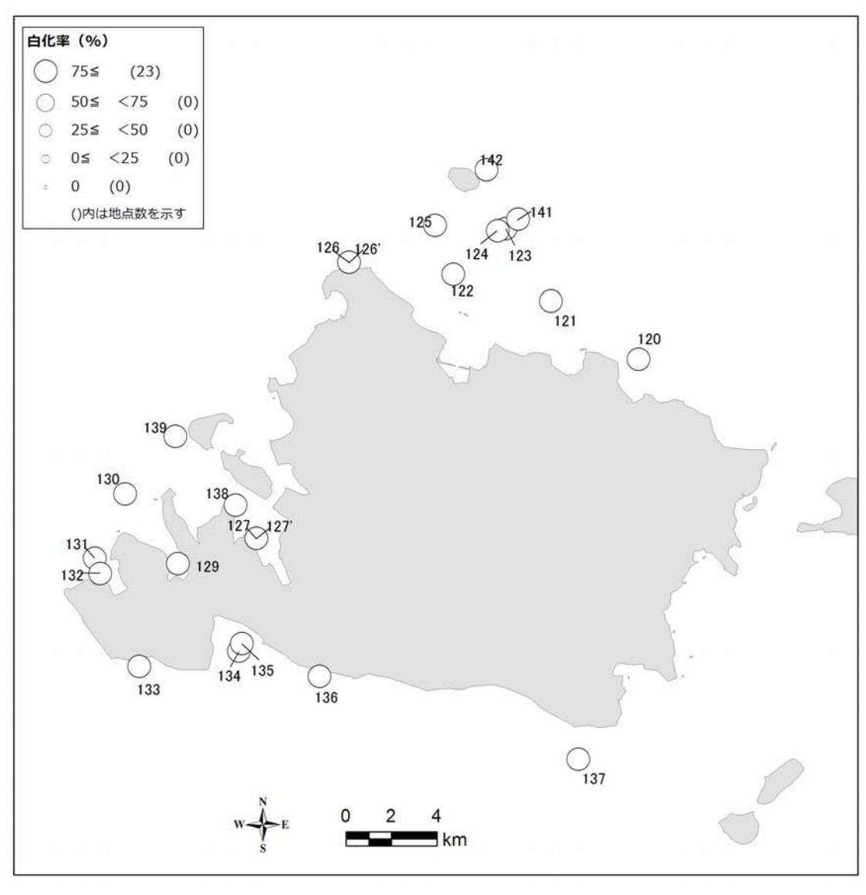

図 I-9-8 モニタリングサイト 1000 サンゴ礁調査 白化の状況 (2016) サイト (17) 崎山湾 (西表島西部) 周辺

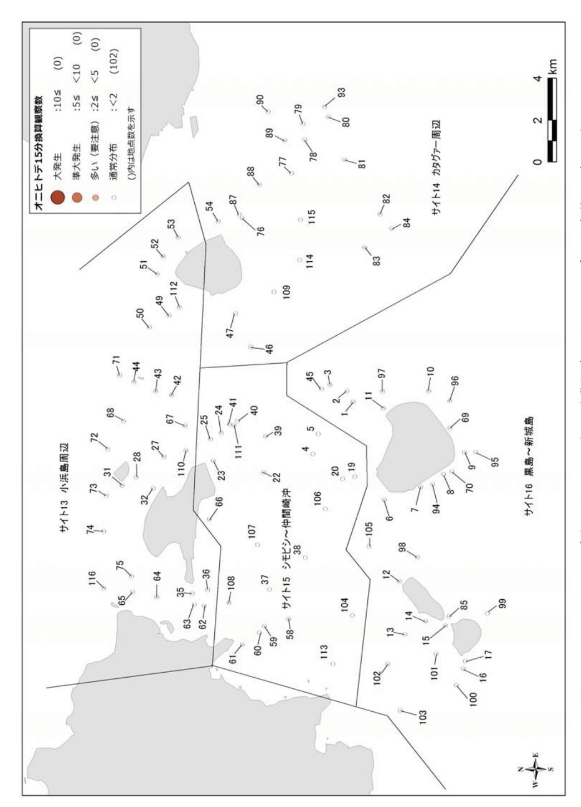

ᅗ I-9-9 ࢺࢧࢢࣥࣜࢱࢽࣔ 1000 ࢦࣥࢧ♋ㄪᰝ ࡢࢹࢺࣄࢽ࢜Ⓨ⏕≧ἣ㸦2016㸧 ࢺࢧ㸦13㸧㹼㸦16㸧▼す♋†࣭㒊࣭ᮾ㒊࣭୰ኸ㒊࣭༡㒊

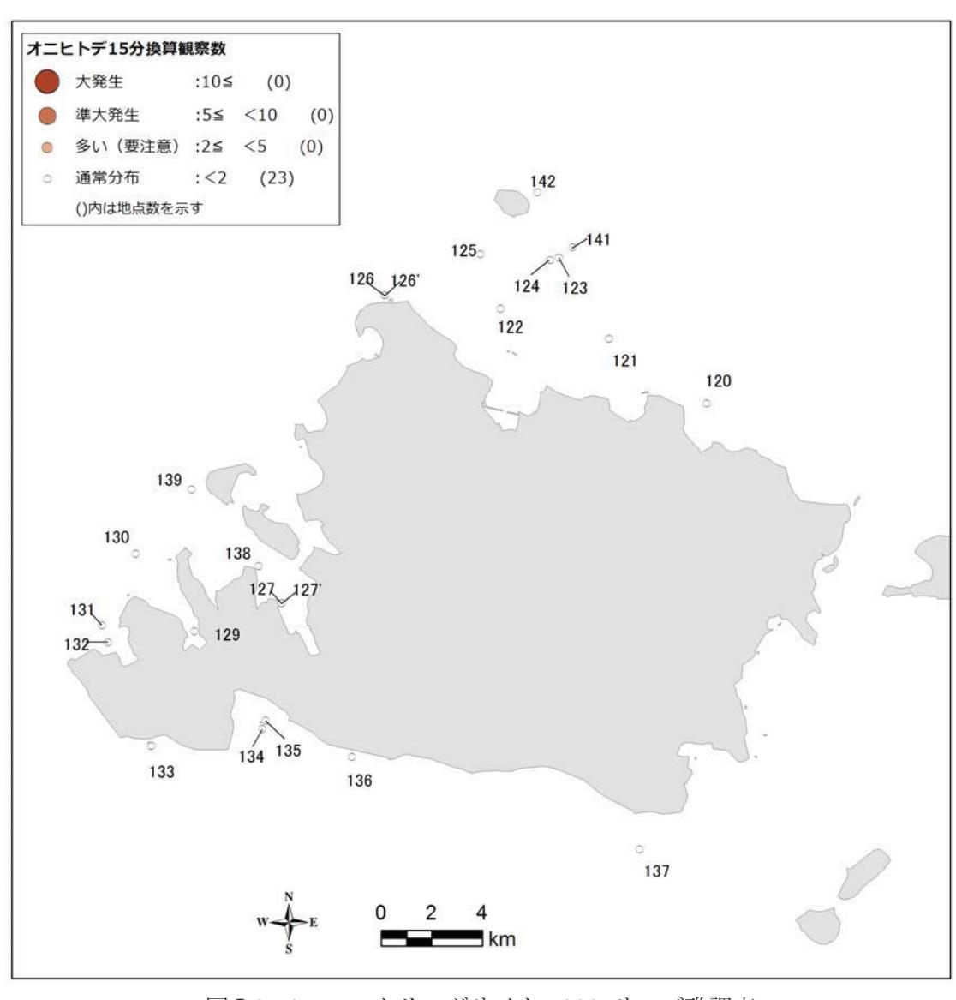

図 I-9-10 モニタリングサイト 1000 サンゴ礁調査 オニヒトデの発生状況 (2016) サイト (17) 崎山湾 (西表島西部) 周辺

#### (9) サイト18:小笠原諸島/父島周辺

#### 1) 実施状況

調査は、NPO 法人小笠原自然文化研究所の佐々木哲朗研究員が代表となり、ダイビングサービス KAIZIN の山田鉄也氏と共に実施した。

#### 2)調查地点

サイト 18 では、小笠原諸島父島周辺に 9 か所、兄島周辺に 3 か所の合計 12 か所の調査 地点を設置し、2016 年度はこれらすべての地点で調査を実施した。

サイト 18: 小笠原諸島/父島周辺における調査地点 (モニタリングスポット: 12 地点)

兄島 地点1:兄島・滝之浦

地点2:兄島・キャベツビーチ

地点 3: 兄島·水玉湾西側

父島 地点 4: 父島・宮之浜

地点5:父島・釣浜

地点 6: 父島・初寝浦

地点7:父島・巽東海岸

地点 8: 父島·巽中海岸

地点 9: 父島(属)・南島サンゴ池

地点 10: 父島・コペペ海岸

地点 11: 父島・野羊山内側

地点 12: 父島・二見湾奥

#### 3)調查期間

調査は、2016年12月6日から8日の期間中に実施した。

### 4)調査結果

調査地点ごとのサンゴの生育状況及びかく乱要因の状況を図 I-10-1~5 に示す。

#### ① 今年度のサンゴの状況

サイト平均サンゴ被度は 40%であり、「やや不良」(サンゴ被度 30%以上 50%未満)と評価される。今年度は冬季と夏季の水温が例年より高めであったが、高水温による大規模な白化現象は生じなかった。しかし、父島の地点 12 (二見湾奥)では、病気による白化と死亡が生じ、被度が減少した。

各調査地点のサンゴ被度を図 I-10-1 に示す。「優良」地点(サンゴ被度 80%以上)はな

く、「良」地点(サンゴ被度 50%以上 80%未満)が 6 地点あった。そのうち、兄島の地点 3 (水玉湾西側、多種混成型)が 80%と最も高く、次いで兄島の地点 2 (キャベツビーチ、多種混合型)、父島の地点 12 (二見湾奥、スギノキミドリイシ優占型)が 60%であった。一方、「やや不良」地点(サンゴ被度 30%以上 50%未満)は 3 地点、「不良」地点(サンゴ被度 10%以上 30%未満)は 3 地点であった。最もサンゴ被度の低かった地点は、父島の地点 7 (異東海岸、多種混合型)、地点 6 (初寝浦)及び地点 10 (コペペ海岸)であり、被度は 20%であった。

#### ② 昨年度のサンゴの状況との比較

昨年度のサイト平均サンゴ被度は50%であり、今年度は10ポイント減少した。

地点毎の昨年度からの被度の変化を図 I-10-3 に示す。サンゴ被度が昨年度から増加した地点はなく、また 10 ポイント未満の増減で「ほぼ変化なし」と評価される地点が 9 地点であり、10 ポイント以上 30 ポイント「減少」した地点が 3 地点(地点 1、6、12)であった。そのうち父島の地点 12(二見湾奥)は 20 ポイントの減少であった。この地点の被度の低下は、枝状ミドリイシ類の病気由来の死亡が原因と考えられた。

### ③ 今年度のかく乱の状況

今年度は例年よりも水温が高かったが、軽微な白化現象のみで大規模なものは生じなかった。地点毎の白化の状況を図 I-10-4 に示す。25%以上 50%未満の白化率を示した地点が 1 地点(地点 12)であったが、斑紋状の部分的な白化を示したので、高水温による影響ではなく、病気由来のものと考えられた。一方、25%未満の僅かな白化を示した地点は 10 地点(地点 2、3、4、5、6、7、8、9、10、11)あり、白化現象が全く確認されなかった地点が 1 地点(地点 1)であった。

小笠原諸島では、2011年度に初めて兄島の2地点においてオニヒトデが確認されたが、その後は確認がない(図 I-10-5)。しかし、地点12を設置した二見湾では、モニタリングサイト1000の調査地点の外側のやや水深が深いところからオニヒトデが確認されており、今後の食害が懸念される。

調査を実施した 12 地点中、8 地点において何らかの病気と考えられる症状が確認された(昨年度は 7 地点)。ミドリイシ類の腫瘍の頻度が最も高く、クシハダミドリイシ、サボテンミドリイシ、被覆状のミドリイシ類において散見された。特に父島の地点 5 (釣浜) では、気づかないうちに着実に進行し、半数以上の大型卓状ミドリイシ類の群体で確認されるに至った。以前、地点 10 (父島(属)・南島サンゴ池) において、腫瘍によって卓状ミドリイシの大型群体が消失したが、この地点 5 においても同様の傾向が見られた。また、今年度は地点 12 (二見湾奥) において枝状ミドリイシ類の大規模な死亡が確認され、感染症が疑われた。特徴は、不均一な白化(斑状あるいはポリプのみが白化)が生じること、浅瀬(水深 1m 程度)では症状が顕著だが、連続した深場(6m 以深)の群落では発症していない事

があげられる。過去の写真を確認すると、死亡は生じなくとも斑状の白化は毎年確認されたことから、以前から感染はしていたと考えられる。

今年度は、台風 5 号(8 月 6 日)、7 号(8 月 15 日)、9 号(8 月 20 日)、10 号(8 月 29 日) 20 号(10 月 10 日)、22 号(10 月 24 日)が父島に接近し、西側の一部で波浪による破損が確認された。

### ④ その他

来年度、東京都事業で南硫黄島総合学術調査が行われる可能性があり、今後も 10 年に一度、同調査が実施される見込みである。

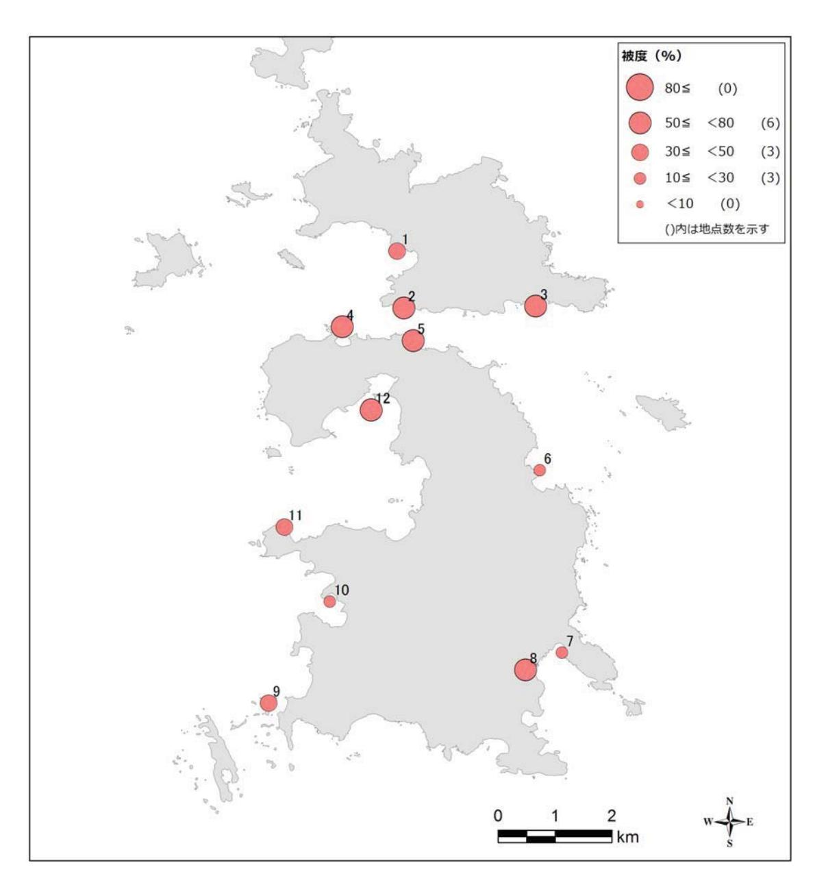

図 I-10-1 モニタリングサイト 1000 サンゴ礁調査 サンゴ被度分布図 (2016) サイト (18) 父島周辺

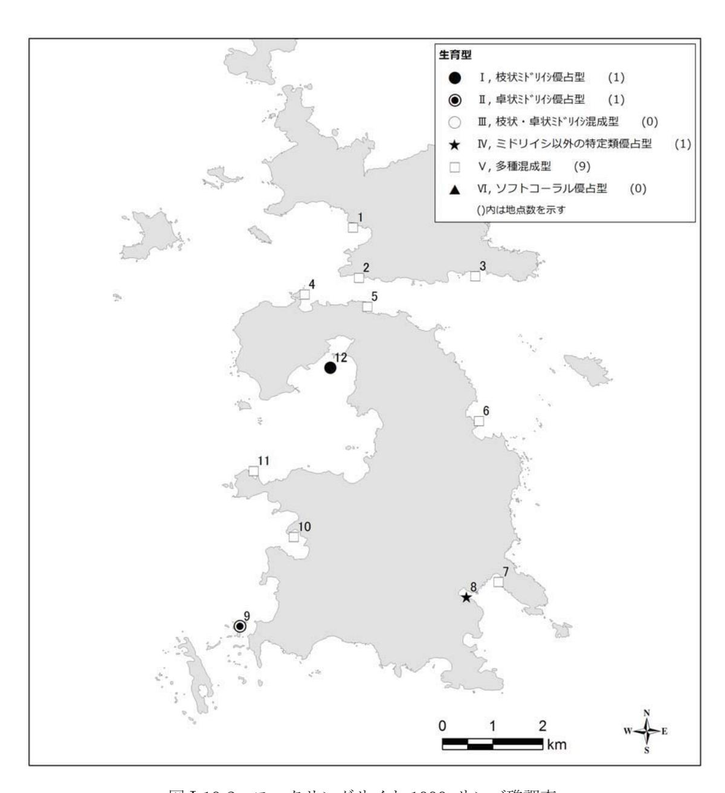

図 I-10-2 モニタリングサイト 1000 サンゴ礁調査 サンゴ生育型 (2016) サイト (18) 父島周辺

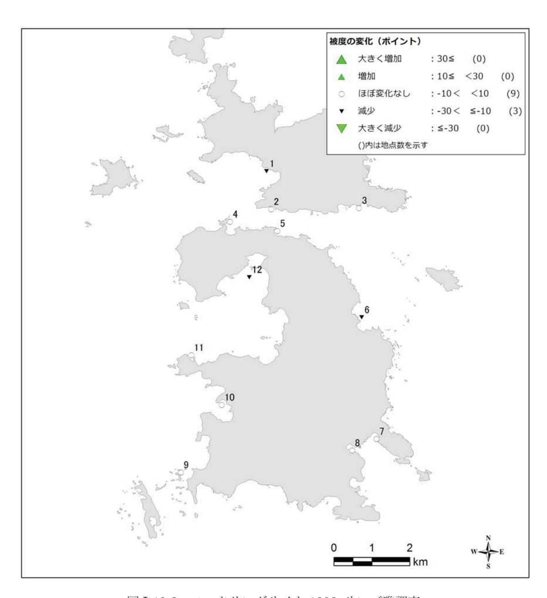

図 I-10-3 モニタリングサイト 1000 サンゴ礁調査 昨年からのサンゴ被度の変化 (2016) サイト (18) 父島周辺

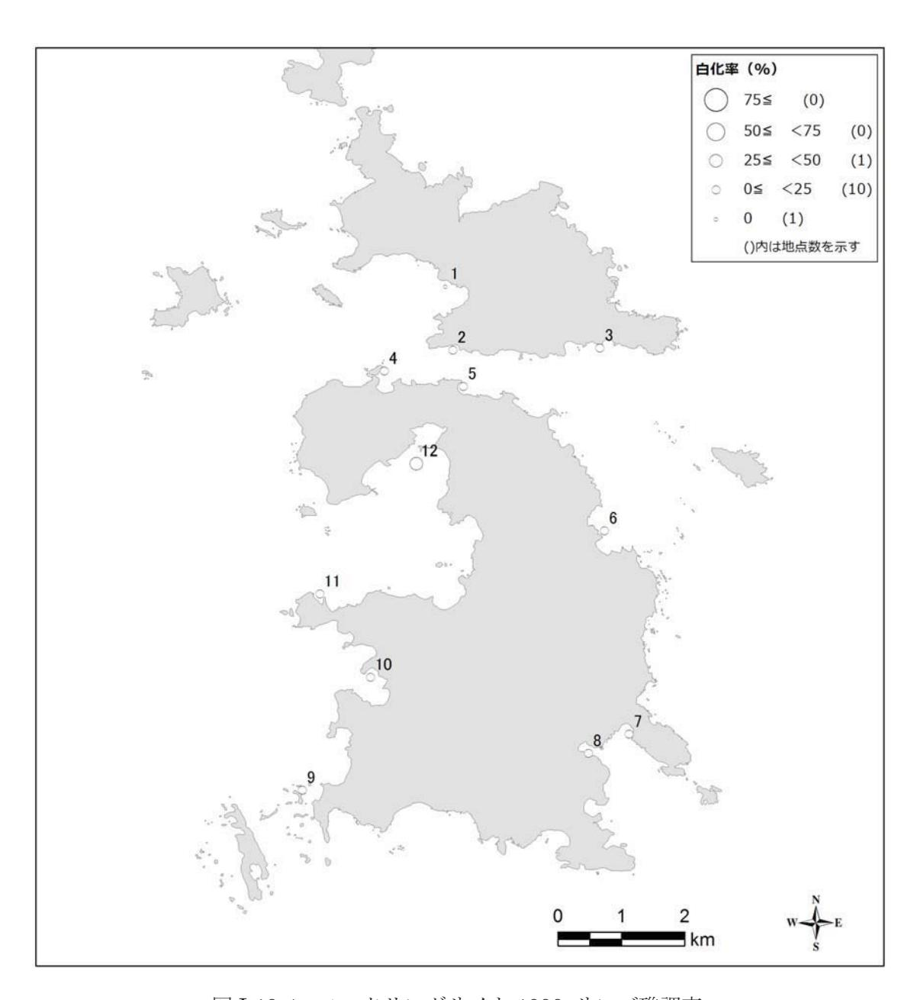

図 I-10-4 モニタリングサイト 1000 サンゴ礁調査 白化の状況 (2016) サイト (18) 父島周辺

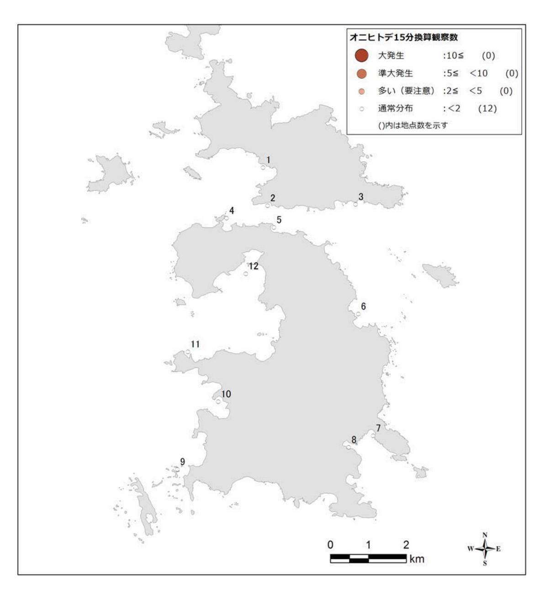

図 I-10-5 モニタリングサイト 1000 サンゴ礁調査 オニヒトデの発生状況 (2016) サイト (18) 父島周辺

#### (10) サイト19:館山(房総)

#### 1) 実施状況

本サイトは、館山湾にあるお茶の水女子大学湾岸生物教育研究センターの清本正人准教授が代表となり、同じ館山湾内に位置する東京海洋大学水圏科学フィールド教育研究センターの須之部友基准教授とともに調査を実施した。地点1(沖ノ島①)、地点2(沖ノ島②)及び地点5(雀島)の調査を清本准教授が、地点3(坂田①)、地点4(坂田②)及び地点6(坂田③)の調査を須之部准教授が実施した。

なお、このサイトはサンゴの分布している水深が深く、透明度も悪いため、調査にはスキューバダイビングを使用した。

#### 2)調査地点

調査地点は、館山湾の沖ノ島の周辺に2か所、雀島に1か所、坂田周辺に3か所の合計6か所設置しており、2015年度はこれらすべての地点で調査を実施した。

サイト19:館山(房総)における調査地点(モニタリングスポット:6地点)

地点 1: 沖ノ島①

地点 2: 沖ノ島②

地点 3: 坂田①

地点 4: 坂田②

地点5:雀島

地点 6: 坂田③

### 3)調查期間

調査は、2016年9月14から11月24日の期間に実施した。

#### 4)調查結果

調査地点ごとのサンゴの生育状況及びかく乱要因の状況を図 I-11-1~5 に示す。

### ① 今年度のサンゴの状況

このサイトのサンゴ群集は、すべての地点で 10%未満という低被度で分布しており、多種混成の地点(地点 1、2 及び 5)で 5%未満、アワサンゴ群集が優占する特定種優占型の地点(地点 3、4 及び 6)でも高くて 5%以上 10%未満と、サンゴ被度の区分では「極めて不良」との評価に該当するが、これまでと同様、低被度ながら群集を健全に維持していた(図 I-12-1)。

#### ② 昨年度のサンゴの状況との比較

全ての地点が低い被度であるが、全体的には、昨年度から同様の状態が維持されている (図 I-11-3)。地点 3 (坂田①) は1昨年にアワサンゴが消滅しており、まだ回復は確認できなかった。2007年に出現した魚礁上のキクメイシ類は今年度も変化が無かった。地点 4 (坂田②) では、昨年度アワサンゴが確認されなかったが、今年度は新規の加入が確認され、小さなアワサンゴ群体が出現した。地点 6 (坂田③) のアワサンゴ群集は、現状が維持されており、他のサンゴについても同様に現状維持であった。

### ③ 今年度のかく乱の状況

地点 1 (沖ノ島①)、2 (沖ノ島②) 及び5 (雀島) では高水温によるサンゴの白化現象は特にみられなかった (図 I-11-4)。また、オニヒトデも確認されていない (図 I-11-5)。

サンゴ食巻貝については、2007年まで見られたイセカセンによる食害が2008年以降は少なく、今年度は各地点で1群体程度であった。

昨年度は、長径が 25cm まで育っていたエンタクミドリイシ 1 群体が死亡していたが、近くの同種群体の状態は良好であった。地点 5 では、調査対象の外側に生育するミレポラコモンサンゴの大型群体の一部が昨年砕けていたが、残った部分の生育状態は良好であった。地点 3 (坂田①) では漁礁が崩壊し、サンゴが砂をかぶって埋没する可能性があったが、今年度調査ではサンゴが砂から露出しているのが確認され、生育状態は良好であった。

#### ④ その他

地点 1 (沖ノ島①) 及び 2 (沖ノ島②) ではアラメなどの大型の海藻類の衰退が依然目立つが、地点 5 (雀島) では昨年度より繁茂していた。

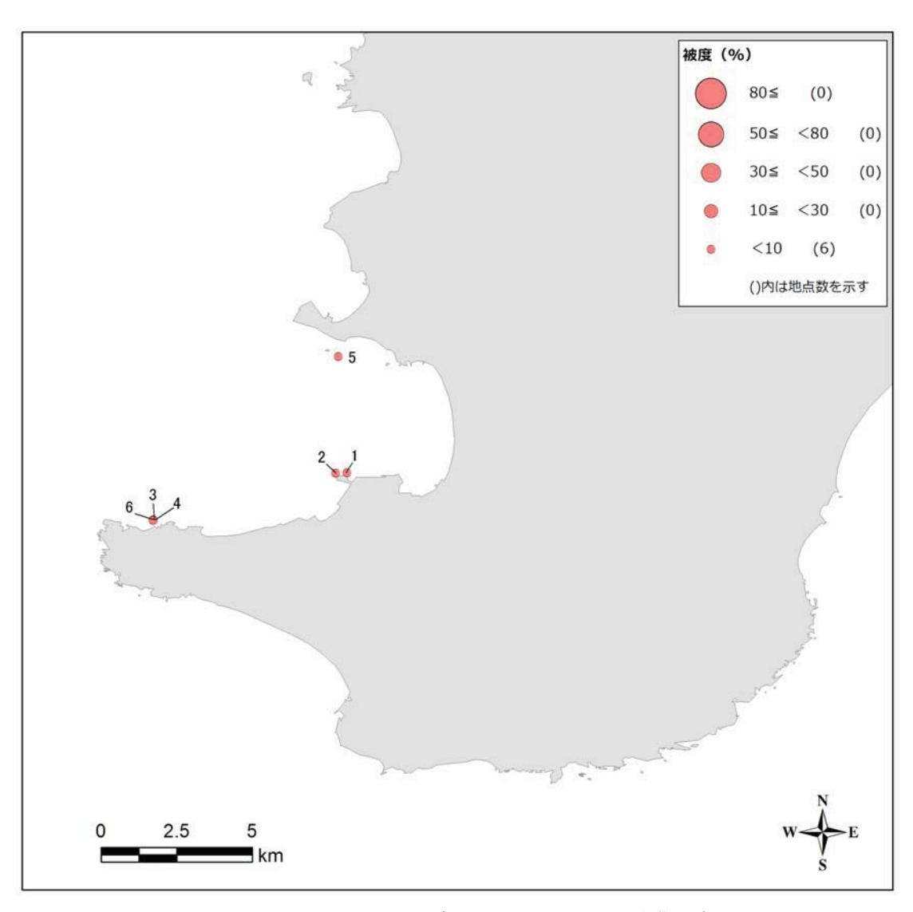

図 I-11-1 モニタリングサイト 1000 サンゴ礁調査 サンゴ被度分布図 (2016) サイト (19) 館山 (房総)

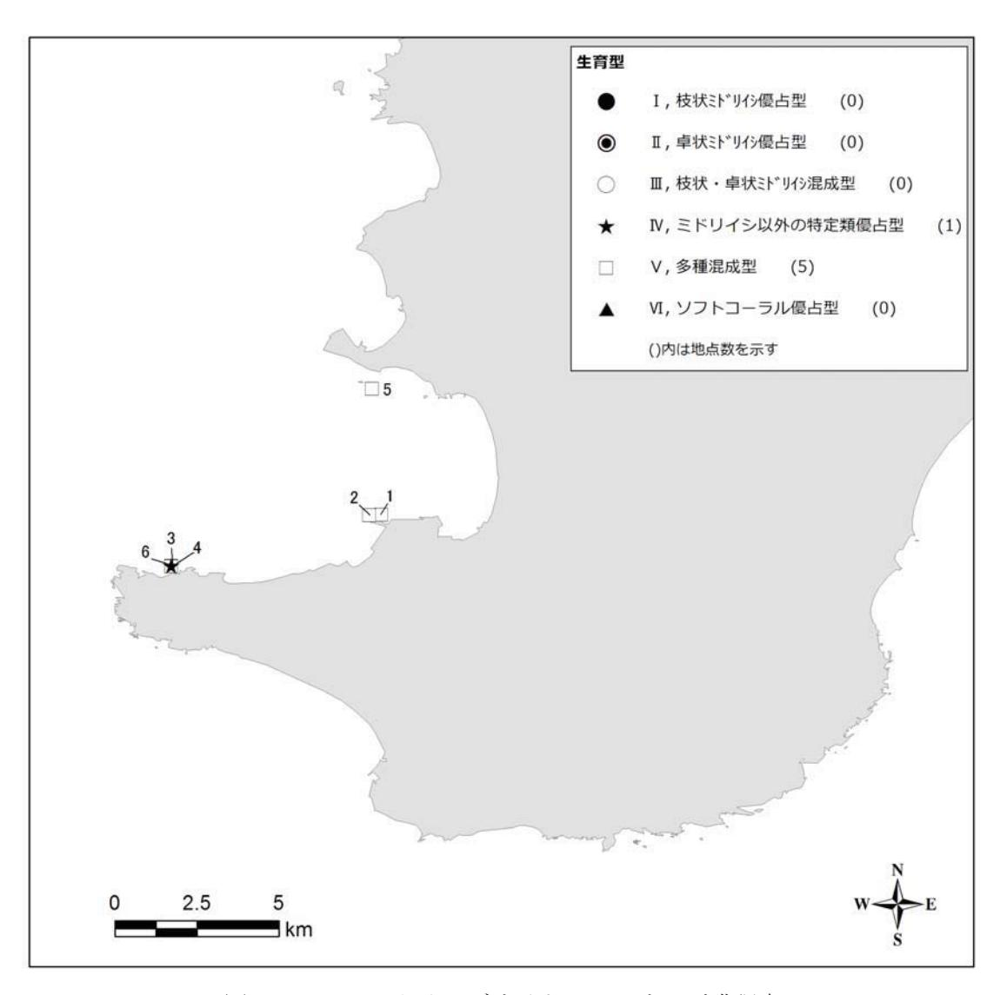

図 I-11-2 モニタリングサイト 1000 サンゴ礁調査 サンゴ生育型 (2016) サイト (19) 館山 (房総)

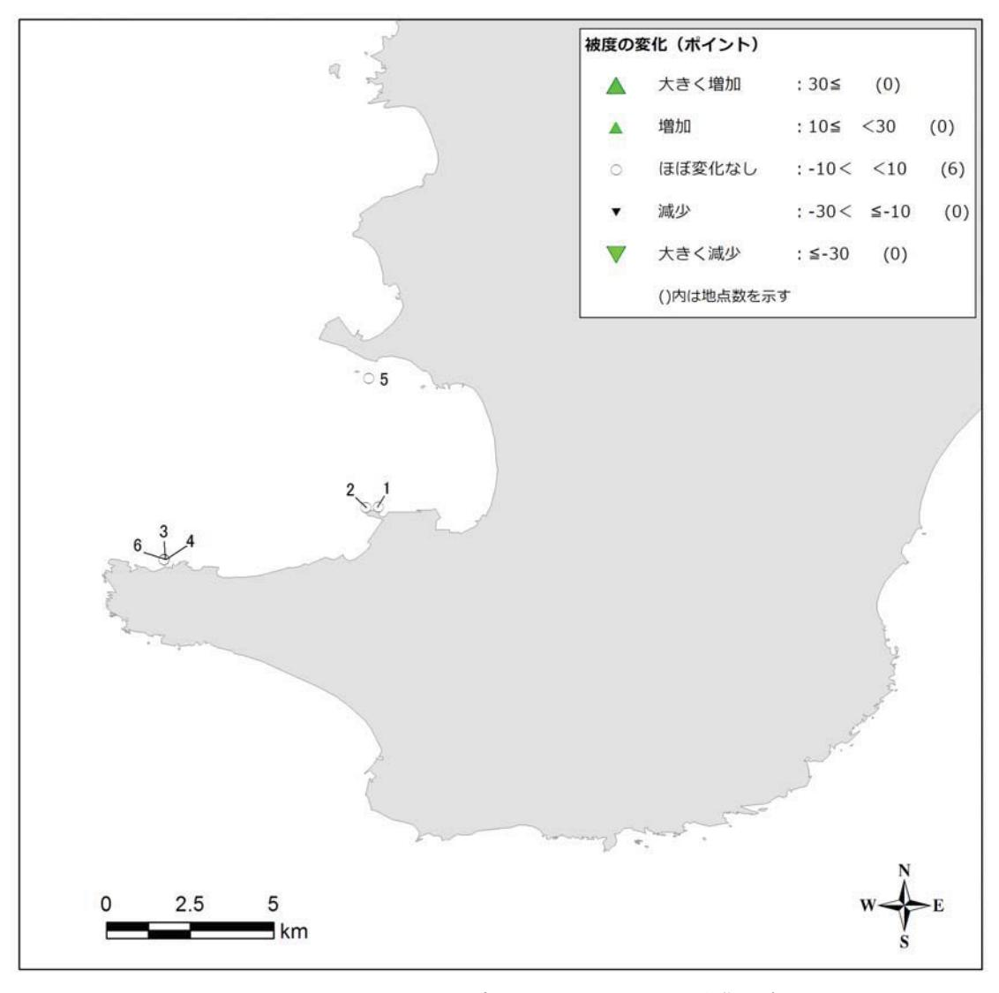

図 I-11-3 モニタリングサイト 1000 サンゴ礁調査 昨年度からのサンゴ被度の変化 (2016) サイト (19) 館山 (房総)

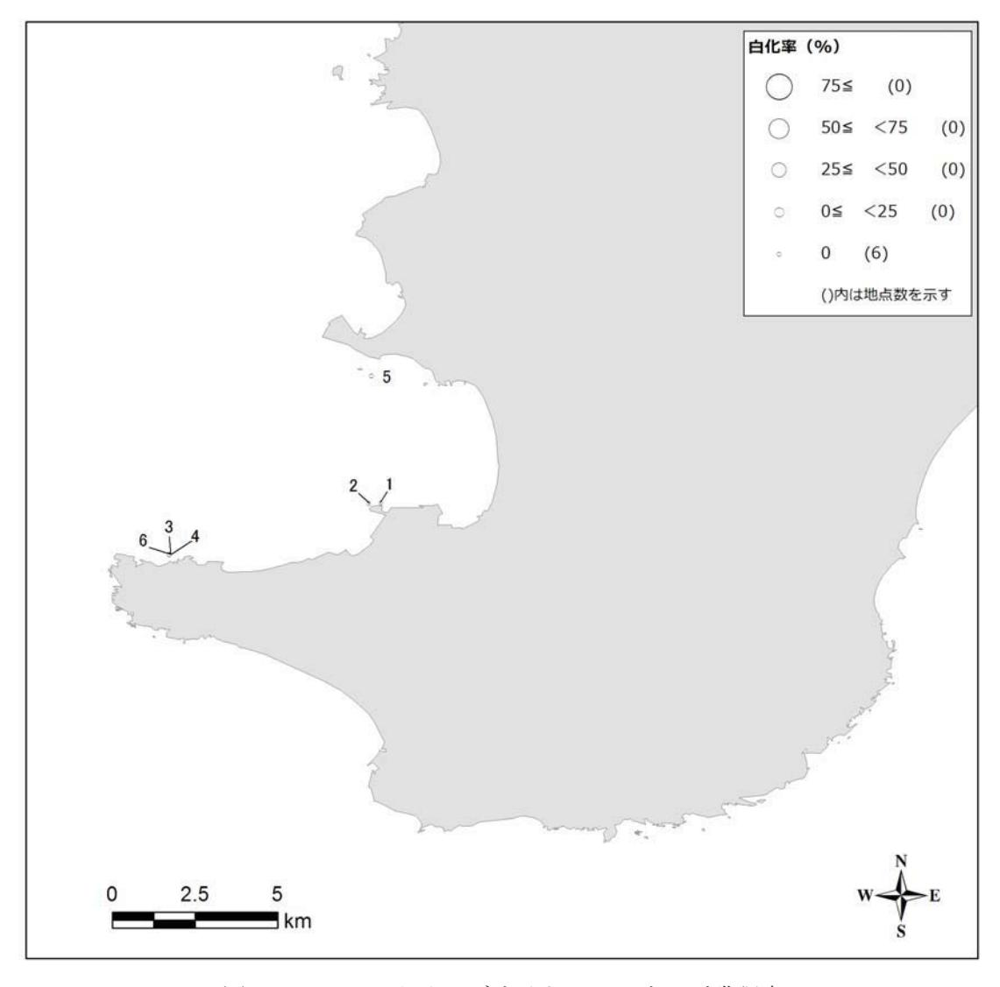

図 I-11-4 モニタリングサイト 1000 サンゴ礁調査 白化の状況 (2016) サイト (19) 館山 (房総)

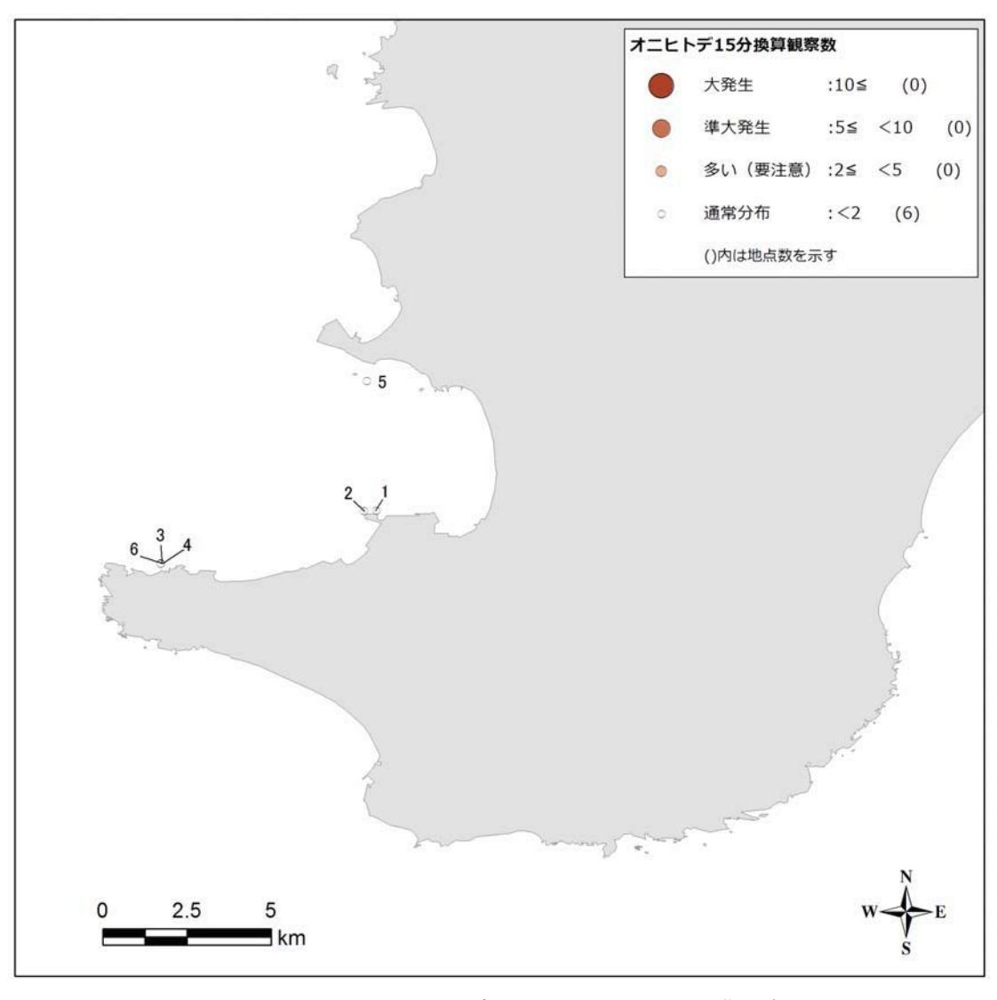

図 I-11-5 モニタリングサイト 1000 サンゴ礁調査 オニヒトデの発生状況 (2016) サイト (19) 館山 (房総)

#### (11) サイト20: 壱岐周辺

#### 1) 実施状況

本サイトは一般財団法人自然環境研究センターの木村匡研究員を調査代表者とし、東海 大学非常勤講師の下池和幸氏とともに調査を実施した。

#### 2)調查地点

調査地点は、五島列島の福江島周辺に 6 か所、中通島に 3 か所、若松島に 1 か所、壱岐に 3 か所、対馬に 3 か所の合計 16 地点を設置していたが、地点 10 (太田浦 (1))のサンゴ群集が見当たらなかったため、昨年度追加した沖に見られた枝状ミドリイシ類が優占する高被度群集(昨年度地点 16:対馬・太田浦 (2))を地点 10 として、全 15 地点で調査を実施した。

サイト20: 壱岐周辺における調査地点(モニタリングスポット:16地点)

五島列島・福江島 地点1:福江・布浦(1)

地点 2: 福江・布浦 (2)

五島列島・津多羅島 地点3:福江・津多羅島(1)

地点 4:福江・津多羅島(2) 地点 5:福江・津多羅島(3)

地点 15: 福江・多々良島

壱岐 地点 6: 壱岐・黒崎

地点7: 壱岐・板浦

地点8: 壱岐・神瀬

対馬 地点9:対馬・瀬ノ浦

地点 10:対馬・太田浦(1)(未調査)

地点 16:対馬·太田浦 (2)

五島列島・中通島 地点 11:中通島・三ツ瀬(1)

地点 12:中通島・三ツ瀬 (2)

地点 13:中通島・三ツ瀬(3)

五島列島・若松島 地点 14: 若松島・滝ヶ原

### 3)調査期間

調査は、2016年10月19日から23日の期間中に実施した。

10月19日には中通島・三瀬(地点11~13)及び若松島(地点14)、21日に福江の布浦(地点1、2)及び多々良島(地点15)、22日に福江の津多羅島(地点3~5)、23日に壱岐(地点6~8)、そして24日に対馬(地点9、10)で調査を実施した。

#### 4)調査結果

調査地点ごとのサンゴの生育状況及びかく乱要因の状況を図 I-12-1~5 に示す。

### ① 今年度のサンゴの状況

サイト平均サンゴ被度は40%であり、「やや不良」と評価された。

地点毎の被度を評価すると(図 I-12-1)、「優良」地点(サンゴ被度が 80%以上)はなく、「良」地点(サンゴ被度 50%以上 80%未満)が壱岐の 3 地点(地点 6、7、8)及び福江・多々良島の 1 地点(地点 15)の合計 4 地点であった。「やや不良」地点(サンゴ被度 30%以上 50%未満)は福江・津多羅島の 1 地点(地点 3)及び対馬の 2 地点(地点 9 及び 10)、中通島の 3 地点(11、12、13)及び若松島の 1 地点(地点 14)の合計 7 地点であった。「不良」地点(サンゴ被度 10%以上 30%未満)は、福江の布浦 2 地点(地点 1 及び 2)及び津多羅島の 2 地点(地点 4、5)の合計 4 地点であった。「極めて不良」地点(サンゴ被度 10%未満)はなかった。

壱岐と対馬及び五島列島で比較すると、壱岐の 3 地点が比較的サンゴ被度が高く「良」、 対馬の 2 地点は中程度で「やや不良」、福江島から津多羅島、中通島及び若松島の五島列島 では他の 2 島よりも調査地点が多く、「良」から「不良」までサンゴ被度はばらつきがあっ た。

#### ② 昨年度のサンゴの状況との比較

サイト平均サンゴ被度は 40%であり、昨年度 (サイト平均サンゴ被度:50%) から 10 ポイント減少した。

地点毎に見ると(図 I-12-3)、30 ポイント以上「大きく増加」した地点は壱岐の1地点(地点7)であり、10 ポイント以上30 ポイント未満で「増加」した地点が壱岐の地点8(神瀬)と対馬の地点9(瀬ノ浦)、10(太田浦)及び若松島の地点14(滝ヶ原)の合計4地点であった。

一方、サンゴ被度が 30 ポイント以上「大きく減少」したのは福江の地点 1 及び 2 (布浦 (1)、(2))、津多羅島の地点 5 (津多羅島 (3)) 及び中通島の地点  $11\sim13$  (三ツ瀬  $(1)\sim(3)$ ) の合計 6 地点であった。また、10 ポイント以上 30 ポイント未満で「減少」した地点は福江の地点 3 及び 4 (津多羅島  $(1)\sim(2)$ ) の 2 地点であり、被度が減少した地点が増加した地点を上回っていた。

### ③ 今年度のかく乱の状況

白化現象は、(図 I-12-4) 壱岐の地点 6 (黒崎) で 30%、対馬の地点 9 (瀬ノ浦) で 10%、 壱岐の地点 7 (板浦) で 1%確認された。地点 6 ではタバネサンゴが白化していたが、直径  $60\sim80$  cmの群体の破断や一部の崩壊も確認されているため、物理的な破損の可能性もあり、 夏季の高水温が原因であるかは不明であった。また、地点 9 では白化したサンゴに泥が堆

積しており、降雨期の濁水や土砂流出の可能性もあるため、夏季の高水温による白化であるかは不明であった。

オニヒトデは直接確認されず(図 I-12-5)、食痕も確認されなかった。

中通島の地点 11 (三ツ瀬 (1)) では、サンゴ食巻貝による食害が散見されたが、被食率は 1%未満であり、被害はほとんどなかった。

福江の地点 1、2 (布浦 (1) (2)) ではガンガゼによる食害によってサンゴ被度が大きく減少した。ガンガゼの食害はこの他でも壱岐の地点 6、7 及び 8 (神瀬)、対馬の地点 9 及び 10 (太田浦)のエダミドリイシやキクメイシ類で見られ、このサイトにおける大きなかく 乱要因となっていた。布浦にある西海区水産研究所五島支所によると、周辺ではここ数年は磯焼けにより海藻の分布域が減少しているとのことであった。

福江の地点  $3\sim5$  (津多羅島  $(1)\sim(3)$ ) ではミドリイシ類にホワイトシンドロームなどのサンゴの病気が散見され、周辺では濁りも目立った。

### 4)その他

このサイトでは、特定の狭い範囲にエダミドリイシやキクメイシ類等のサンゴ群集が密集しており、ガンガゼや病気等のかく乱によって急速に分布域が減少してしまう可能性がある。また、壱岐の地点 8(神瀬)及び対馬の地点 9(瀬ノ浦)などは漁港内の水深 1~2mの浅い海域に分布しており、港湾内における漁具の洗浄や漁船の航行等の影響も受けやすいと考えられる。

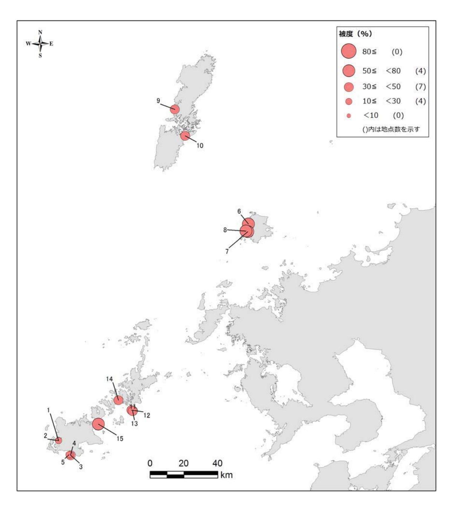

図 I-12-1 モニタリングサイト 1000 サンゴ礁調査 サンゴ被度分布図 (2016) サイト (20) 壱岐周辺

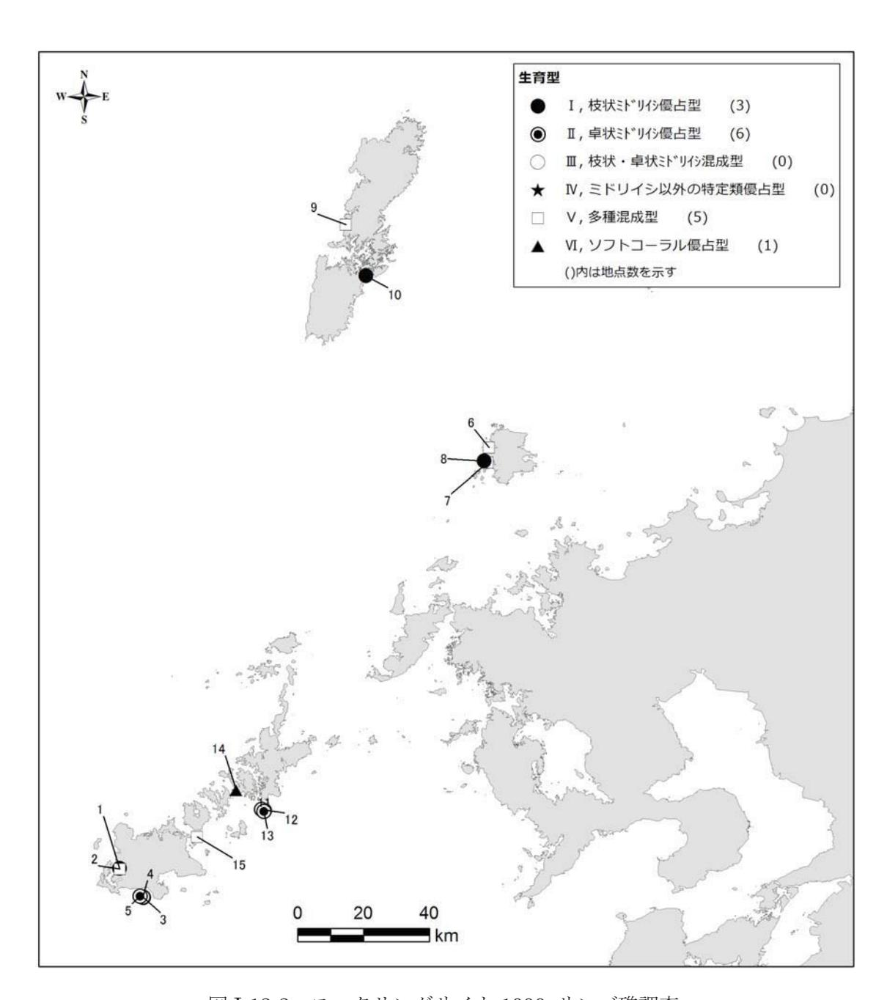

図 I-12-2 モニタリングサイト 1000 サンゴ礁調査 サンゴ生育型 (2016) サイト (20) 壱岐周辺

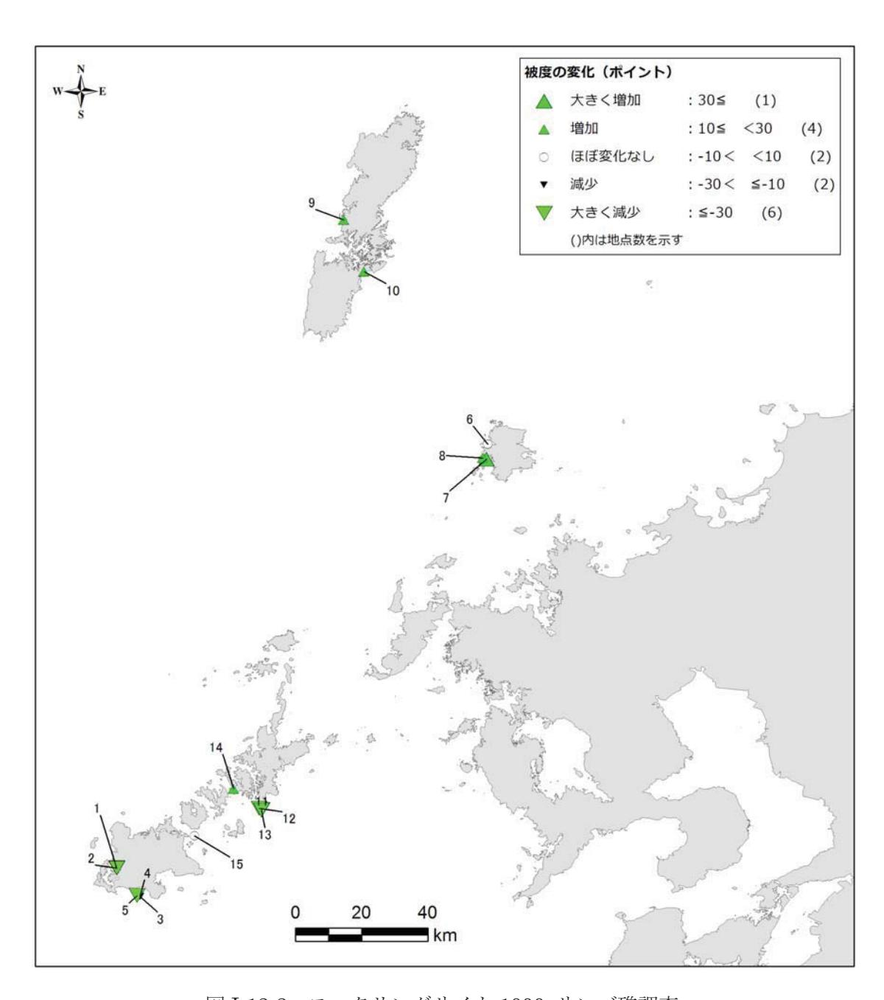

図 I-12-3 モニタリングサイト 1000 サンゴ礁調査 昨年度からのサンゴ被度の変化 (2016) サイト (20) 壱岐周辺

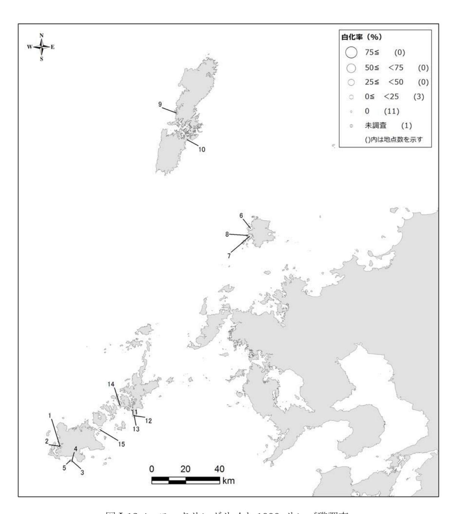

図 I-12-4 モニタリングサイト 1000 サンゴ礁調査 白化の状況 (2016) サイト (20) 壱岐周辺

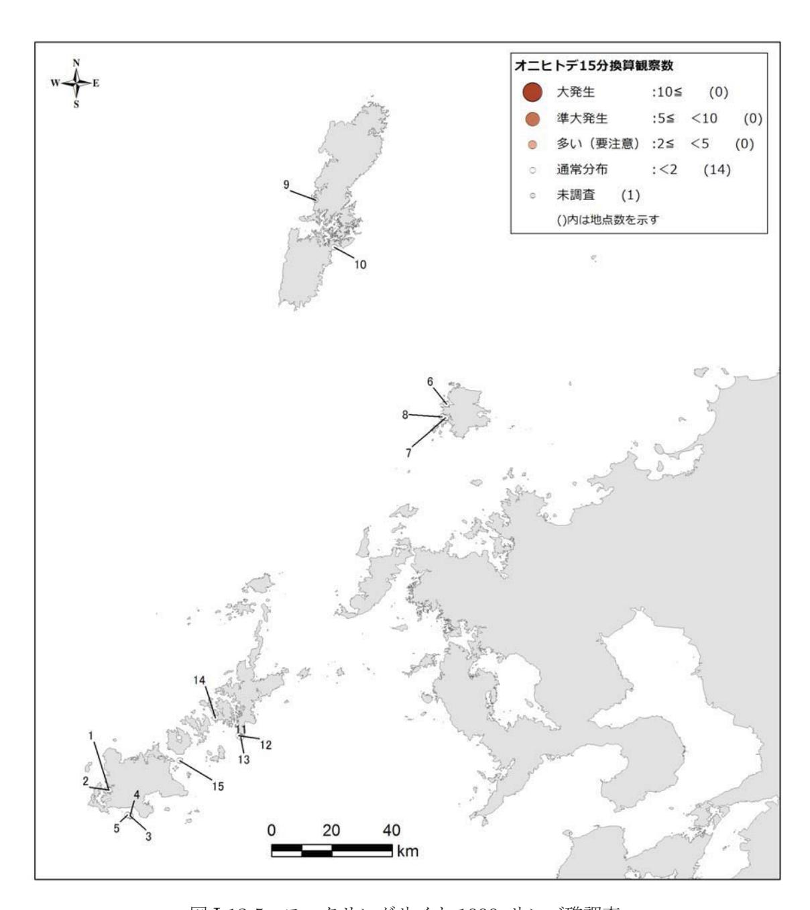

図 I-12-5 モニタリングサイト 1000 サンゴ礁調査 オニヒトデの発生状況 (2016) サイト (20) 壱岐周辺

#### (12) サイト21: 串本周辺

#### 1) 実施状況

本サイトでは、株式会社串本海中公園センターの野村恵一研究員を調査代表者とし、同センターの平林勲研究員とともに調査を実施した。

#### 2)調查地点

本調査では、串本周辺に 15 か所の調査地点を設置し、串本海中公園センターが自主調査で行っている 3 か所(地点 12、14、15)のサンゴ調査のデータも提供し、合わせて 18 地点について記述している。なお、今年度は地点 16 が悪天候により、地点 10 は漁協による立ち入り制限により調査ができなかったため、合計 16 地点で調査を実施した。

サイト 21: 串本周辺における調査地点(モニタリングスポット: 15 地点及び調査実施者 の自主事業で行っている 3 地点)

地点1:通夜島

地点2:住崎

地点3:グラスワールド①

地点 4: グラスワールド②

地点 5: 砥崎

地点 6: 高富湾奥

地点 7: 串本海中公園·1号地

地点8: 串本海中公園・2号地

地点9: 串本海中公園・3号地

地点 10: 串本海中公園・4号地(未調査)

地点 11:展望塔前

地点 12: 有田湾奥(自主調査の調査結果を参照している地点)

地点 13: 双島①

地点 14: 双島②(自主調査の調査結果を参照している地点)

地点 15: 下浅地(自主調査の調査結果を参照している地点)

地点 16: 二木島海中公園·1号地区(未調查)

地点 17: 二木島海中公園・2 号地区

地点 18:紀伊大島・ゾウバナ

#### 3)調查期間

調査は、2016年11月1日から2017年1月26日の期間中に実施した。ただし、地点13(双島①)及び14(双島②)の調査は2016年6月に実施した自主事業調査時に調査した

データを用いた。

#### 4)調查結果

調査地点ごとのサンゴの生育状況及びかく乱要因の状況を図 I-13-1~5 に示す。

### ① 今年度のサンゴの状況

サイト平均サンゴ被度は 30%であり、「やや不良」(サンゴ被度 30%以上 50%未満)と評価される。

各地点のサンゴ被度の状況を図 I-13-1 に示す。「優良」地点(サンゴ被度 80%以上)はなく、「良」地点((サンゴ被度 50%以上 80%未満))は 5 地点(地点 2、4、5、8、13)、「やや不良」地点は 5 地点(3、6、9、14、15)、「不良」地点(サンゴ被度 10%以上 30%未満)は 4 地点(地点 7、11、12、16)、「極めて不良」地点(サンゴ被度 10%未満)は 2 地点(地点 1、17)であり、サンゴ被度 50%未満の「やや不良」以下のランクが 7 割を占めていた。

### ② 昨年度のサンゴの状況との比較

サイト平均サンゴ被度は30%であり、昨年度と変わらなかった。

地点毎の昨年度からのサンゴ被度の変化を図 I-13-3 に示す。サンゴ被度は、昨年度から 30 ポイント以上「大きく増加」した地点はなく、10 ポイント以上 30 ポイント未満の「増加」が 2 地点(地点 2、15)で見られた。一方、10 ポイント以上 30 ポイント未満で被度が減少したのは 3 地点(地点 3、12、17)であった。他の 11 地点ではほぼ変化がなかったので、被度が減少した地点が増加した地点を 1 地点上回った。

### ③ 今年度のかく乱の状況

夏季の高水温によると考えられる白化現象が確認されたのは 7 地点(地点 2、4、6、8、9、11、12)であったが、いずれも白化率は 25%未満であった(図 I-13-4)。調査時にはコモンサンゴ類やハマサンゴ類を中心に白化現象からの回復途中と考えられ、死亡はいずれも 5%未満であった。ただし、本サイトを代表するサンゴ群生地である地点 8(錆浦)において秋に行った本業務外の調査では、サンゴ全体の 75%で白化現象が確認され、うちミドリイシ類では 80%以上で確認された。しかし、白化による死亡率は 0%であり、サイト全体では最終的な被害が 5%未満程度と見積もられた(2017 年 1 月末現在)。

オニヒトデの食害は6地点(2、4、9、11、14、15)で確認された(図 I-13-5)。オニヒトデの観察個体数は過去と比べて減少しているが、地点15(下浅地)では増加傾向が見られ、また、地点4(グラスワールド②)では「多い(要注意)」レベルであり、今後、サンゴ群集への影響が懸念される。

サンゴ食巻貝の食害は12地点(地点1、2、3、4、5、6、7、8、11、13、14、15)で確

認された。ほとんどの地点では発生階級Ⅱ(小さな食痕や食害部のある群体が散見)であったが、地点 13(双島①)及び 14(双島②)では発生階級Ⅲ(食痕は大きく、食害部のある群体が目立つが、数百個体以上からなる密集した貝集団は見られない。)、地点 11(展望塔前)では発生階級Ⅳ(斃死群体が目立ち、数百個体以上からなる密集した貝集団が散見される。)を記録し、今後のサンゴ被度低下が懸念される。

感染症 (パッチ症) が 7 地点 (地点 4、7、9、11、13、14、15) で、ホワイトシンドロームは 4 地点 (地点 1、2、5、8) で確認された。地点 8 (錆浦) では卓状ミドリイシ類の 10%程度がこれらの病気に感染していたが、サイト全体での被害は 5%未満であった。

台風の波浪による直接的な損傷・破壊が3地点(5、8、11)で確認された。このうち、 地点8(錆浦)及び11(展望塔前)の被害が比較的大きかった。

なお、地点3及び12におけるサンゴ被度減少の原因は不明であった。

#### ④ その他

地点 4 (グラスワールド②) では、優占種がサオトメシコロサンゴからシコロサンゴへ置き換わっているのが確認された。

また、地点 6 (高富湾奥) では、枝状ミドリイシ類に多くのチョウチョウウオ科魚類が生息しており、アクアリストによる熱帯性幼魚の採集等が懸念される。

なお、地点 10 (串本海中公園・4 号地) は、漁協支所により海域への立ち入りが認められなかったため、調査が実施できなかった。

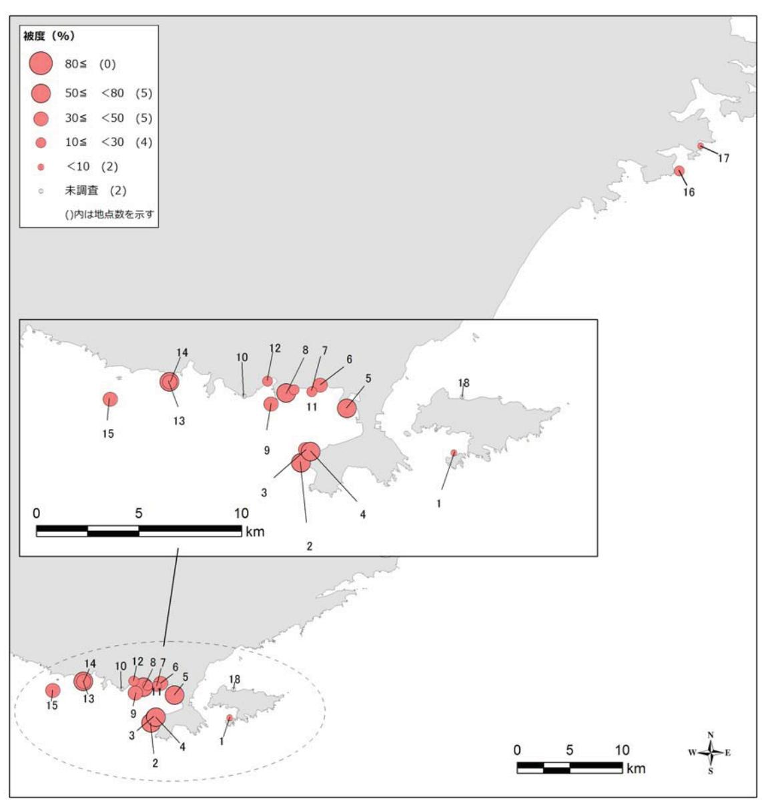

図 I-13-1 モニタリングサイト 1000 サンゴ礁調査 サンゴ被度分布図 (2016) サイト (21) 串本周辺

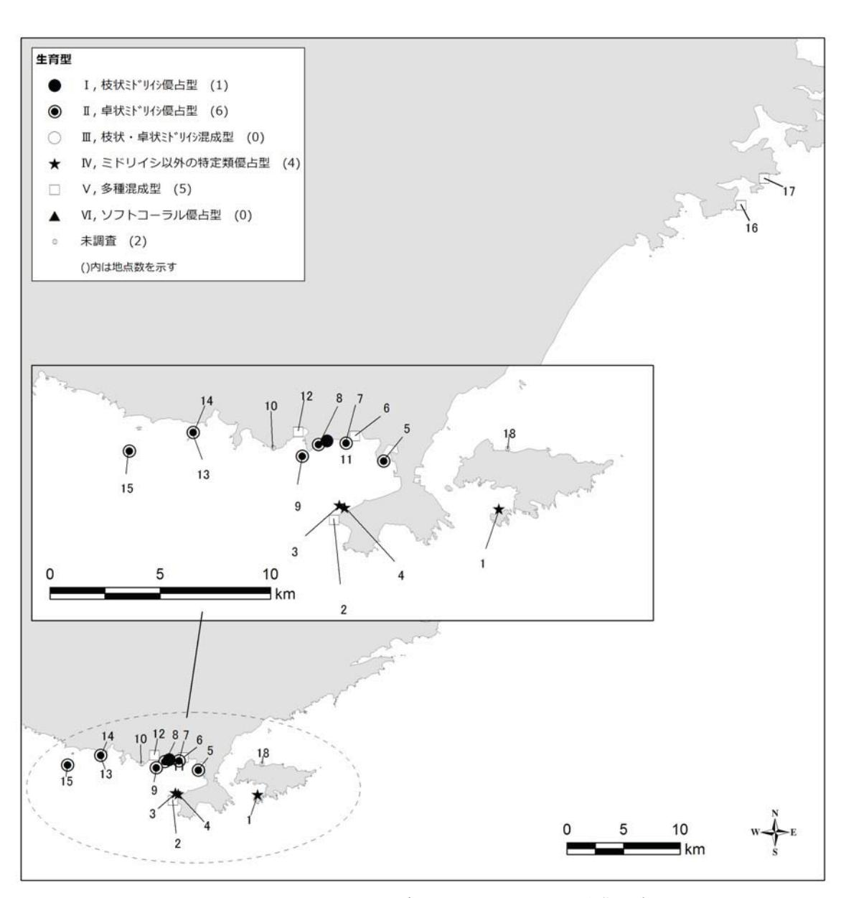

図 I-13-2 モニタリングサイト 1000 サンゴ礁調査 サンゴ生育型 (2016) サイト (21) 串本周辺

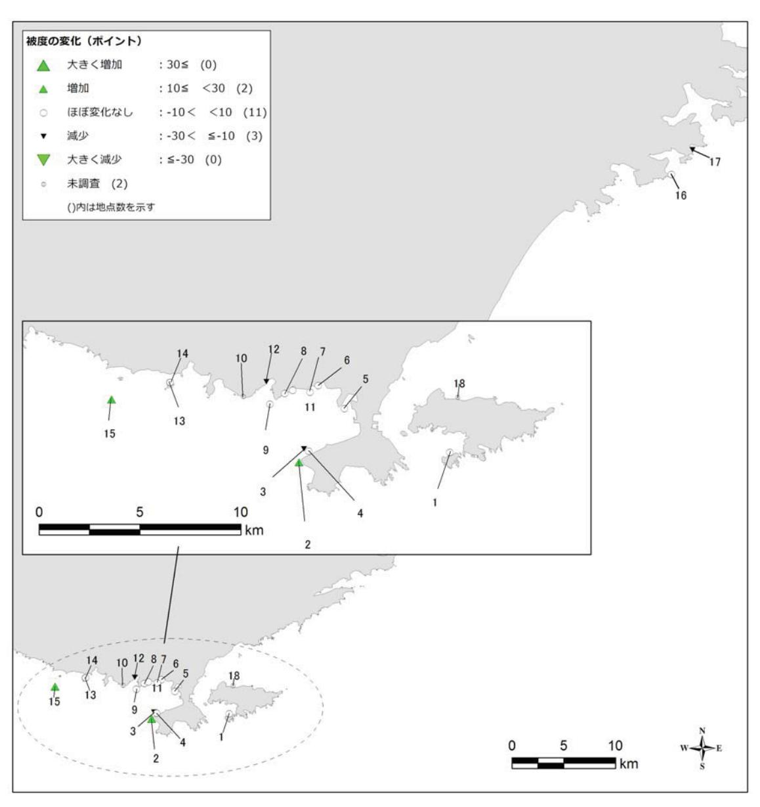

図 I-13-3 モニタリングサイト 1000 サンゴ礁調査 昨年度からのサンゴ被度の変化 (2016) サイト (21) 串本周辺

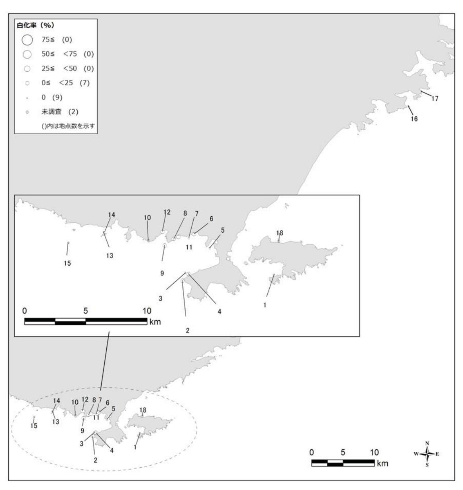

図 I-13-4 モニタリングサイト 1000 サンゴ礁調査 白化の状況 (2016) サイト (21) 串本周辺

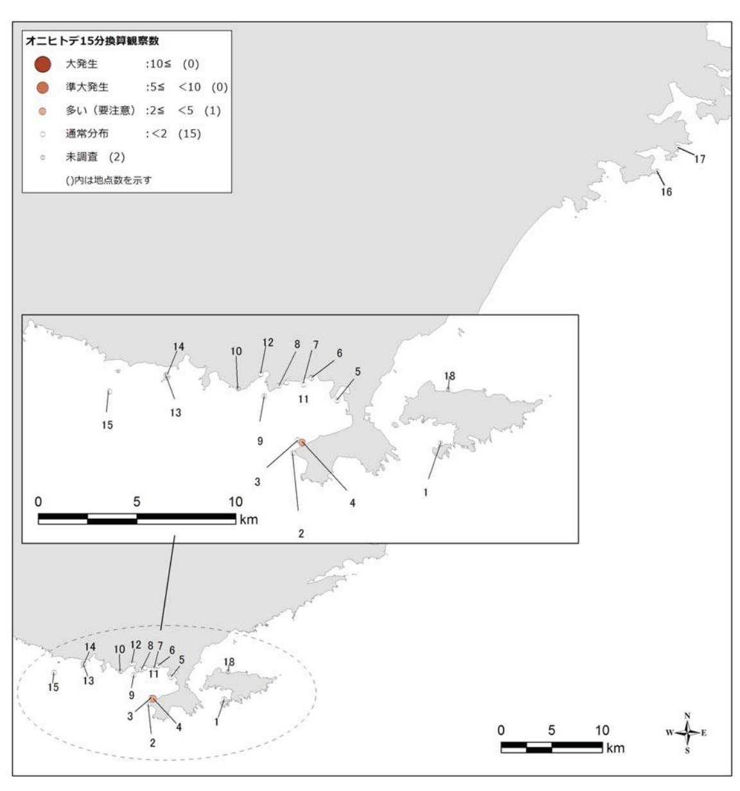

図 I-13-5 モニタリングサイト 1000 サンゴ礁調査 オニヒトデの発生状況 (2016) サイト (21) 串本周辺

### (13) サイト22:四国南西岸(宇和海~足摺岬)

#### 1) 実施状況

本サイトでは、調査代表者を公益財団法人黒潮生物研所の目崎拓真研究員とし、黒潮生物研究所の中地シュウ所長及び戸篠研究員、竜串ダイビングセンター(佐野)、天然資源活用委員会(小笠原・杉本尚・杉本早)、YASU海の駅クラブ(宮本・町田・今倉千並・間城)、もぐりんサンゴの会(島・満石・森本貴・森本剛・和差)、マリンジャム(奥村)、愛媛大学(喜多村)及び大阪 ECO(杉岡)の協力によって調査を実施した。

#### 2)調查地点

足摺宇和海国立公園周辺(宇和海海域)に3か所、宿毛から大月町にかけて8か所、土 佐清水周辺に5か所の合計16か所を調査地点としている。

また、これらの地点に加え、地域での自然保護活動の一環として、地元のボランティアによるモニタリングが 17 地点で行われている。このモニタリングは、上記研究所が技術指導を行いながら本調査と同じ手法を用いて実施しており、協力地点としてこれらの地点のデータも本報告書の取りまとめに加えている。

今年度は、正規モニタリング 16 定点のうち、悪天候のために地点 9 (沖ノ島・三ツ碆) の調査ができず、15 地点で調査を実施した。また、協力地点でも地点 20 (野田 2 号堤・内側)、26 (大島・海中公園 1 号地)、27 (大島・海中公園 2 号地)、30 (大島・チェバの下)の 4 地点が悪天候のため調査できず、地点 31 (モニタリング基盤 WB) は 2012 年より調査を中止しているため、12 地点で調査を実施した。サイト全体では、正規地点と協力地点を合わせて 27 地点であった。

サイト 22: 四国西岸 (宇和海~足摺岬) における調査地点 (モニタリングスポット) 正規モニタリング定点:16地点

宇和海海域(3地点)

地点1:須ノ川

地点2:鹿島

地点3:天嶬鼻

宿毛・大月海域 (8 地点)

地点 4: 白浜

地点5: 黒崎

地点 6:網代

地点7:柏島

地点8:沖ノ島・トリノクビ

地点9:沖ノ島・三ツ碆(未調査)

地点 10: 尻貝

地点 11: 西泊

#### 土佐清水海域(5地点)

地点 12: 爪白

地点 13:海中公園 2号地・竜串 1

地点 14:海中公園 2号地・竜串 2

地点 15:海中公園 3号地・大碆

地点 16: 大村碆

ボランティアモニタリングによる協力地点:17地点

奈半利海域(4地点)

地点 17: 奈半利 10 号堤・内側

地点 18: 奈半利 7 号堤・外側

地点 19: 奈半利 5 号堤·内側

地点 20:田野 2 号堤・内側 (未調査)

### 宍喰海域(5地点)

地点 21: 金目

地点 22:海中公園 1号地・沖側

地点 23:海中公園 1 号地·水路側

地点24:海中公園2号地・竹ヶ島

地点 25:海中公園 2号地·二子島

### 牟岐大島海域(5地点)

地点 26: 大島・海中公園 1 号地 (未調査)

地点 27: 大島・海中公園 2 号地 (未調査)

地点 28: 大島・ビシャゴ

地点 29: 大島·内湾

地点30:大島・チエバの下(未調査)

地点 31: モニタリング基盤 WB (未調査)

#### 夜須町(2地点)

地点 32: 大手の浜・灯台下

地点 33: 大手の浜・海風荘下

### 3)調查期間

正規地点の調査は、2016 年 9 月 14 日から 12 月 20 日の期間中に、協力地点は 2016 年 10 月 22 日から 11 月 24 日の期間中に実施した。

#### 4)調查結果

地点ごとのサンゴの生育状況及びかく乱要因の状況を図 I-14-1~10 に示す。

#### ① 今年度のサンゴの状況

正規地点の平均サンゴ被度は 30%、協力地点の平均サンゴ被度も 30%であり、両者を合わせたサイト全体の平均サンゴ被度も 30%であったため、被度評価では「やや不良」と評価される。

地点毎のサンゴ被度でみると(図 I-14-1、図 I-14-2)、「優良」地点(サンゴ被度 80%以上)はなく、「良」(サンゴ被度 50%以上 80%未満)が正規地点で 3 地点と協力地点で 2 地点の合計 5 地点、「やや不良」(サンゴ被度 30%以上 50%未満)は正規地点で 8 地点と協力地点で 6 地点の合計 14 地点、「不良」(サンゴ 10%以上 30%未満)が正規地点で 3 地点と協力地点で 3 地点の合計 6 地点、「極めて不良」(サンゴ被度 10%未満)が正規地点と協力地点それぞれ 1 地点ずつの合計 2 地点であった。サイト全体で 27 調査地点のうち半数はサンゴ被度 30%以上 50%未満の「やや不良」であった。

新規加入が 10 群体/ $m^2$ 以上の地点はなかったが、5 群体/ $m^2$ 以上の加入が地点 1(須ノ川)で確認された。その他の地点では 3 群体/ $m^2$ 以下であり、昨年同様に全体的にミドリイシ類の加入数は少なかった。

卓状ミドリイシ類の最大長径は、最大が地点 32 (大手の浜・灯台下) の 186cm であり、100cm を超える地点は 11 地点であった。一方、卓状ミドリイシ類が 5 群体以上ない地点は 3 地点であった。

#### ② 昨年度のサンゴの状況との比較

サイト平均サンゴ被度は30%であり、昨年度と変わらなかった。

昨年度からのサンゴ被度の変化を図 I-14-5 と I-14-6 に示す。各地点で比較すると、昨年度から被度が 30 ポイント以上の増加を示した地点はなく、10 ポイント以上 30 ポイント未満の増加が正規地点で 6 地点、協力地点で 5 地点の合計 11 地点であった。一方、30 ポイント以上の減少を示した地点はなく、10 ポイント以上 30 ポイント未満の減少を示したのは正規地点で 1 地点、協力地点で 2 地点の合計 3 地点であった。その他の 13 地点は 10 ポイント以内の増減であるため、ほぼ変化なしと評価されたので、サイト全体では増加した地点が減少した地点を上回った。

#### ③ 今年度のかく乱の状況

今年度、高水温によると考えられる白化現象が確認された地点は 27 地点中 20 地点であった (図 I-14-7、I-14-8)。そのうち比較的白化した群体が多く見られたのは、地点 11 (樫西1号地・西泊、白化率 30%)及び 19 (奈半利 5 号堤 内側、白化率 10%)であったが、2010年の大規模に白化した年と比較すると白化率はいずれの地点も低かった。今年度最も白化率の高かった地点 11 では、サンゴ全体の白化率が 30%、ミドリイシ類で 40%であった

が、いずれも死亡率は5%未満と低かった。9月下旬には台風16号の影響で水温が低下したため、 $2\sim3$ 週間程度でミドリイシ類のほとんどが回復傾向を示した。また、その他のサンゴも $10\sim12$ 月にかけてゆっくりと回復した。

オニヒトデは、正規地点で7地点(昨年度7地点)、協力地点では地点28 (大島・ビシャゴ)の1地点(昨年度0地点)の合計8地点で確認され(図 I-14-9、図 I-14-10)た。正規地点の7地点のうち、地点10 (尻貝海域公園)では15分観察数が9個体であったので「準大発生」と判断された。

また、高知県土佐清水市の竜串海域では、15分間あたりの観察数が1~2個体と少ないものの、5地点中4地点(昨年度は3地点)でオニヒトデが確認されている。串海域では地元団体によるオニヒトデの駆除が行われていることもあり、被度の大きな低下には至っていないが、オニヒトデは海域の全域で確認されているため、今後も注意して観察する必要がある。

病気は、正規地点で4地点、協力地点では4地点で確認されたが、すべての地点で被害は5%未満で軽微であった。病気は感染症と考えられるものが多く、被害にあったサンゴ群体のほとんどが卓状ミドリイシ類であった。

サンゴ食巻貝の発生階級がII以上であった地点は、27 地点中 17 地点であり、昨年度より 6 地点減少した。地点 6 (網代)を除く地点では、1 集団の貝は 10 個体未満と少なく、サンゴへの被害は 5%未満で軽微だった。地点 6 では、昨年度の発生階級IIIからIVとなり、広範囲でスギノキミドリイシの根元が食害を受け、100 個体以上の集団が数ヵ所で確認された。地点 11 (樫西 1 号地・西泊)近くては、調査範囲外ではあるが、昨年度に引き続き発生階級IIIに該当するサンゴ食巻貝が確認された。尚、地点 6 と 11 では、スギノキミドリイシの群集のみで貝の大発生が確認されており、卓状ミドリイシ類の被害はほとんどなかった。

9月下旬に台風 16 号が四国南部を通過し、一部の地点でサンゴの剥離や破損が見られたが被度の低下につながるような被害はなかった。

その他、高知県土佐清水市大碆では、例年マンジュウヒトデによる食害が見られるが、 今年度も複数個体が確認され、食痕が散見された。

### ④ その他

特になし。

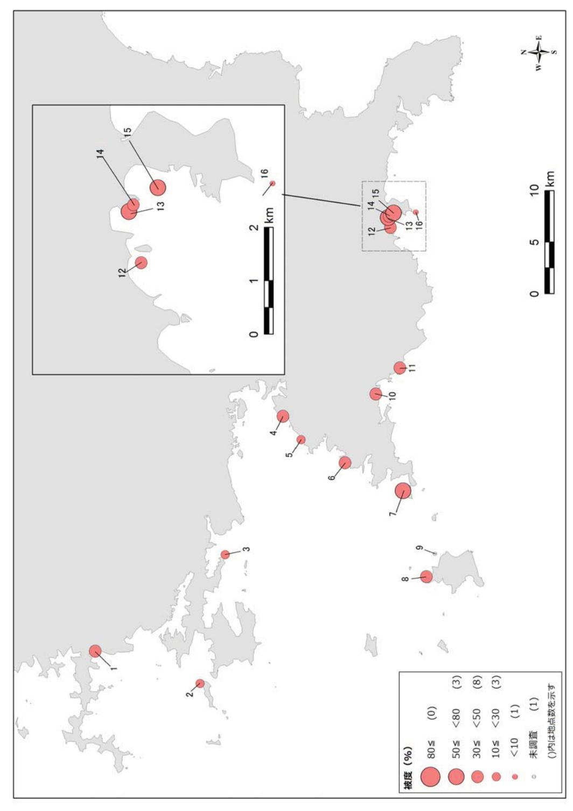

ᅗI-14-1 ࢺࢧࢢࣥࣜࢱࢽࣔ 1000 ࢦࣥࢧ♋ㄪᰝ ࢦࣥࢧ龠ᗘศᕸᅗ㸦2016㸧 ࢺࢧ㸦22㸧ᅄᅜ༡すᓊձ

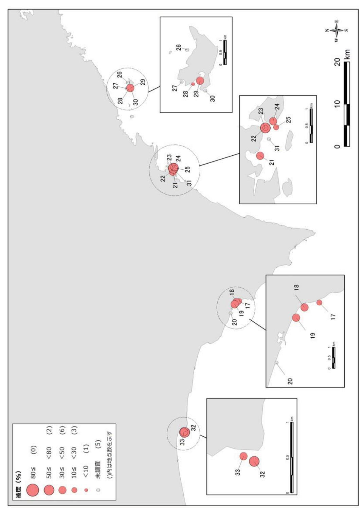

ᅗI-14-2 ࢺࢧࢢࣥࣜࢱࢽࣔ 1000 ࢦࣥࢧ♋ㄪᰝ ࢦࣥࢧ龠ᗘศᕸᅗ㸦2016㸧 ࢺࢧ㸦22㸧ᅄᅜ༡すᓊղ

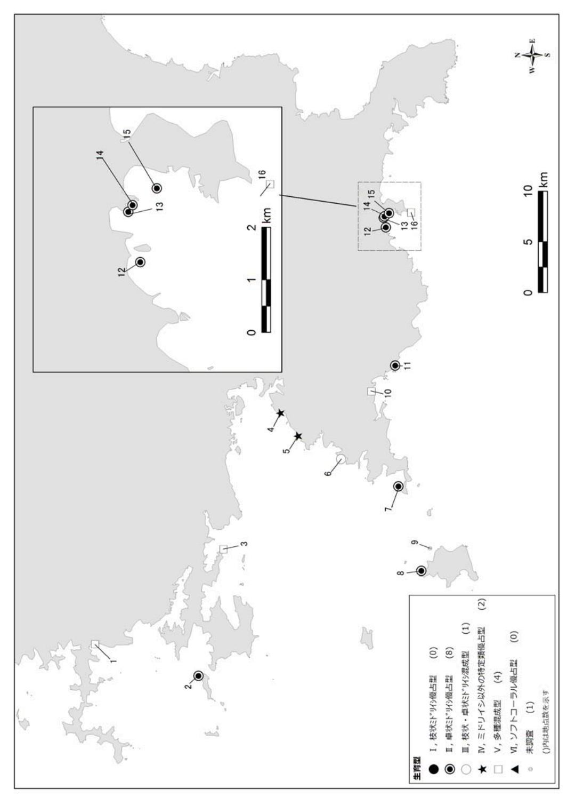

ᅗI-14-3 ࢺࢧࢢࣥࣜࢱࢽࣔ 1000 ࢦࣥࢧ♋ㄪᰝ ࢦࣥࢧ⫱⏕ᆺ㸦2016㸧 ࢺࢧ㸦22㸧ᅄᅜ༡すᓊձ

ᅗI-14-4 ࢺࢧࢢࣥࣜࢱࢽࣔ 1000 ࢦࣥࢧ♋ㄪᰝ ࢦࣥࢧ⫱⏕ᆺ㸦2016㸧 ࢺࢧ㸦22㸧ᅄᅜ༡すᓊղ

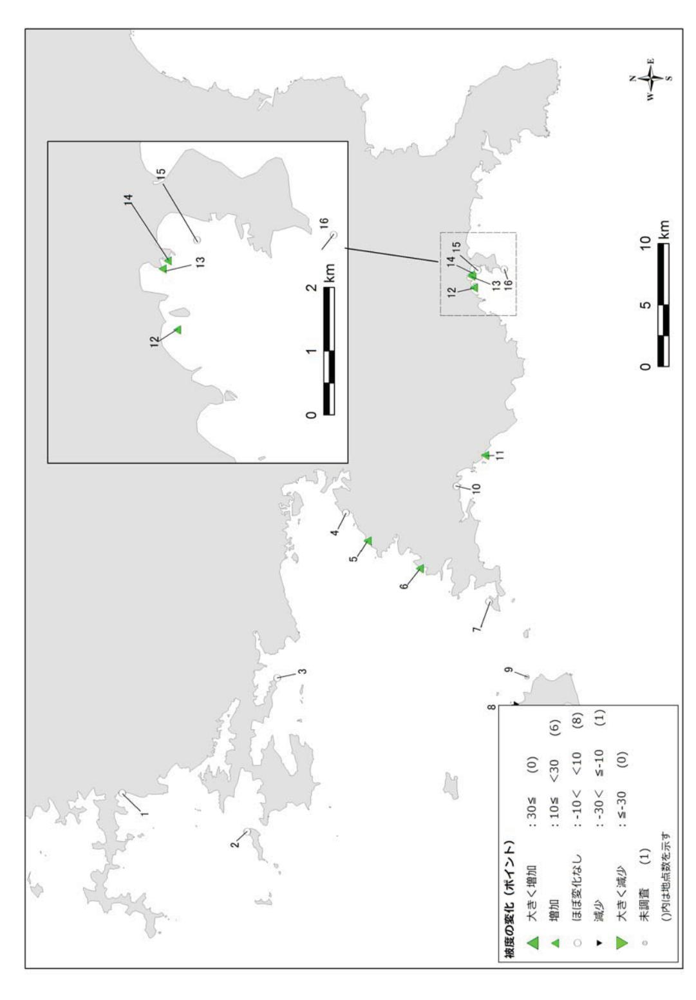

ᅗI-14-5 ࢺࢧࢢࣥࣜࢱࢽࣔ 1000 ࢦࣥࢧ♋ㄪᰝ ᖺᗘࢦࣥࢧࡢࡽ龠ᗘࡢኚ㸦2016㸧 ࢺࢧ㸦22㸧ᅄᅜ༡すᓊձ

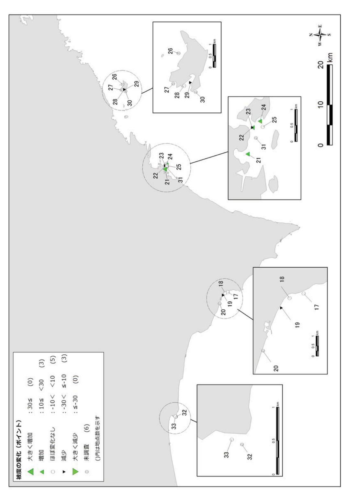

ᅗI-14-6 ࢺࢧࢢࣥࣜࢱࢽࣔ 1000 ࢦࣥࢧ♋ㄪᰝ ᖺᗘࢦࣥࢧࡢࡽ龠ᗘࡢኚ㸦2016㸧 ࢺࢧ㸦22㸧ᅄᅜ༡すᓊղ

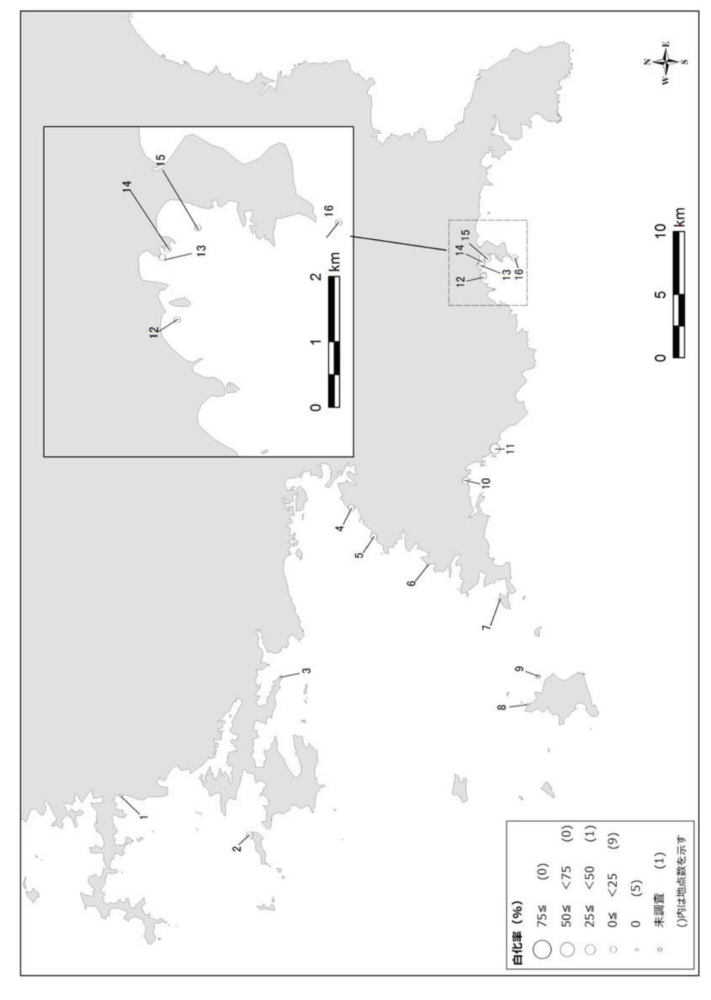

ᅗI-14-7 ࢺࢧࢢࣥࣜࢱࢽࣔ 1000 ࢦࣥࢧ♋ㄪᰝ ⓑࡢ≦ἣ㸦2016㸧 ࢺࢧ㸦22㸧ᅄᅜ༡すᓊձ

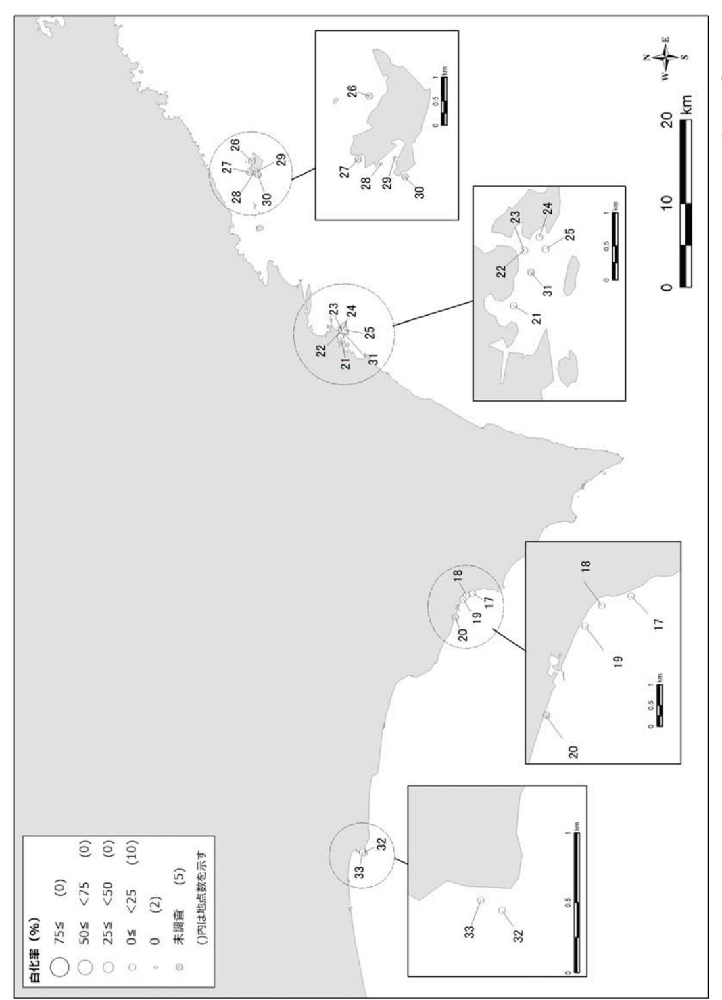

ᅗI-14-8 ࢺࢧࢢࣥࣜࢱࢽࣔ 1000 ࢦࣥࢧ♋ㄪᰝ ⓑࡢ≦ἣ㸦2016㸧 ࢺࢧ㸦22㸧ᅄᅜ༡すᓊ߈

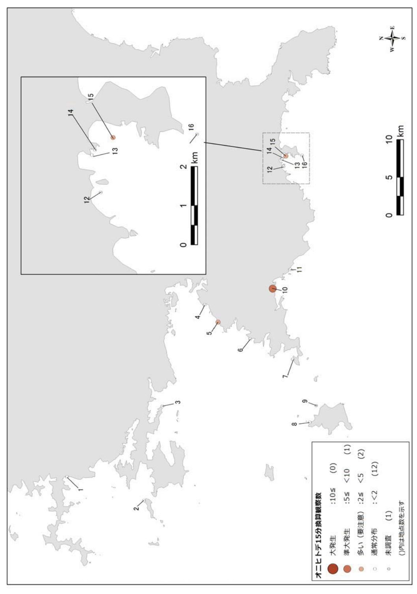

ᅗI-14-9 ࢺࢧࢢࣥࣜࢱࢽࣔ 1000 ࢦࣥࢧ♋ㄪᰝ ࡢࢹࢺࣄࢽ࢜Ⓨ⏕≧ἣ㸦2016㸧 ࢺࢧ㸦22㸧ᅄᅜ༡すᓊձ

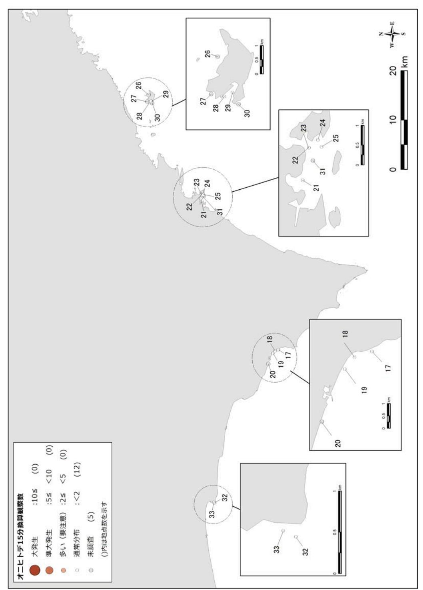

ᅗI-14-10 ࢺࢧࢢࣥࣜࢱࢽࣔ 1000 ࢦࣥࢧ♋ㄪᰝ ࡢࢹࢺࣄࢽ࢜Ⓨ⏕≧ἣ㸦2016㸧 ࢺࢧ㸦22㸧ᅄᅜ༡すᓊղ

#### (14) サイト23: 鹿児島県南部沿岸

#### 1) 実施状況

調査は、ダイビングサービス海案内の出羽慎一氏が代表者となり、公益財団法人鹿児島市水族館公社の出羽尚子氏と西田和記氏、八巻鮎太氏及び鹿児島大学水産学部の松岡翠氏で実施した。

#### 2)調查地点

このサイトでは、錦江湾周辺に 5 か所、大隅半島に 2 か所、薩摩半島の指宿から坊津、 笠沙町に至る海岸線周辺に 8 か所、鹿児島県北部の北薩地域周辺に 3 か所、合計 18 か所に 調査地点(モニタリングスポット)を設定している。2016 年度は 2009 年度より定置網設 置のため調査を中止している地点 8 を除く全 17 地点で調査を実施した。

サイト 23: 鹿児島県南部沿岸における調査地点 (モニタリングスポット:17 地点)

錦江湾周辺:5地点

地点1:身代湾入口

地点2:観音崎東

地点 3: 沖小島 (立神)

地点 4:神瀬

地点 5: 袴越海中公園

大隅半島:2地点

地点 6: 佐多岬海中公園・岬側

地点7:佐多岬海中公園・ビロウ島

薩摩半島(指宿~坊津・笠沙町):8地点

地点8:内之浦湾・白木(未調査)

地点 9: 赤水大龍権現

地点10:坊津・塩ヶ浦

地点 11: 坊津・馬込浜その1

地点 12: 坊津・馬込浜その 2

地点 13: 坊津・平崎集会所下

地点 14: 坊津・田平

地点 15: 笠沙町・大当

北薩地域(鹿児島県北部周辺):3地点

地点 16:阿久根・桑島

地点17:長島・多々羅島

地点 18:東町·加世堂湾

#### 3)調查期間

調査は、2016年8月4日から2017年1月1日までの期間に実施した。

#### 4)調查結果

調査地点ごとのサンゴの生育状況及びかく乱要因の状況を図 I-15-1~5 に示す。

#### ① 今年度のサンゴの状況

サイト平均サンゴ被度は20%であり、「不良」と評価された。

昨年度に引き続き、天候の悪い日が多く雨量も例年より多かったためか、全体的に水温がなかなか上がらず濁りも強いことが多かったが、南薩方面では8月に入ると30℃を超え、業務外の調査による観察では白化するサンゴが見られ始めた。しかし、白化したサンゴの多くは10月には回復し、死亡するものはほとんど見られなかった。

地点毎に被度を評価すると(図 I-15-1)、「優良」地点(サンゴ被度 80%以上)はなく、「良」地点(サンゴ被度 50%以上 80%未満)が 3 地点(地点 6、15、16)、「やや不良」地点(サンゴ被度 30%以上 50%未満)が 2 地点(地点 7、17)、「不良」地点(サンゴ被度 10%以上 30%未満)が 3 地点(地点 3、5、13)であり、残りの 9 地点(地点 1、2、4、9、10、11、12、14、18)は「極めて不良」(サンゴ被度 10%未満)と評価された。

比較的被度の高かった南薩地域の地点 15 (笠沙町・大当、サンゴ被度 70%)、大隅半島地域の地点 16 (阿久根・桑島、サンゴ被度 50%) 及び大隅半島地域の地点 7 (佐多岬海中公園・ビロウ島、サンゴ被度 30%) では、例年以上の台風被害やオニヒトデの食害などが確認されたものの、全域でサンゴの状態は良く、新規加入のサンゴも多く確認された。この他、サンゴ被度が高かったのは、大隅半島地域の地点 6 (佐多岬海中公園、サンゴ被度70%) であった。

#### ② 昨年度のサンゴの状況との比較

サイト平均サンゴ被度は20%であり、昨年度と変わらなかった。

地点毎に比較すると(図 I-15-3)、30 ポイント以上「大きく増加」した地点はなく、10 ポイント以上 30 ポイント未満で「増加」した地点が 1 地点(地点 6) であった。

一方、30 ポイント以上「大きく減少」した地点はなく、10 ポイント以上 30 ポイント未満で「減少」した地点は 2 地点(地点 7、16) あり、その他の 14 地点は 10 ポイント未満の増減で「ほとんど変化なし」であったため、減少地点が増加地点を 1 地点上回っていた。被度減少の原因は、台風による被害やサンゴ食巻貝による食害であると考えられた。

### ③ 今年度のかく乱の状況

今年度に被害が懸念された高水温による白化現象は、薩摩半島のほとんどの地点(地点 9 ~14)のサンゴ及び錦江湾周辺(地点 1~5)の浅所のサンゴイソギンチャクを中心に確認

された。また、大隅半島(地点 6、7)などではわずかではあったが、各地点で白化現象が確認された(図 I-15-4)。主に白化現象が確認されたのは、ごく浅所のサンゴの他にはコモンサンゴ類、ハナヤサイサンゴ及びショウガサンゴなど白化しやすい種が中心であったが、10 月には調査地点全域で回復が見られた。白化率は、4 地点(地点 9、10、11、12)では80%、1 地点(地点 5)では20%、5 地点(地点 3、6、7、13、14)では5%未満であった。

オニヒトデの観察数は、地点 1(身代湾入口)で準大発生レベルであったが、ダイバーによるオニヒトデ駆除がよく行われたため薩摩半島(地点  $9\sim15$ )では観察数が激減し、通常分布レベルになった(図 I-15-5)。

この地域では、新規加入サンゴが増えているため回復が期待できるが、一方でサンゴ食 巻貝の食害は、昨年度に引き続き全体的に増加傾向にある。被食率 5%以上の地点が昨年の3 地点から <math>5 地点へと増加し、そのうちの 2 地点(地点 3、13)は発生階級III(食痕は大きく、食害部のある群体が目立つが、数百個体以上からなる密集した貝集団は見られない。)であったため、今後のサンゴ被度への影響が懸念される。薩摩半島(地点  $9\sim15$ )でも、地点 13(坊津・平崎集会場下)では、サンゴ食巻貝の被害が目立った。

今年度は大型の台風が度々接近し、調査地点の多くでサンゴの破壊や転倒、土砂の堆積が確認された。特に北薩地域の地点 16 (阿久根・桑島) では広範囲に影響が見られ、枝状ミドリイシ類の破壊が目立ち、サンゴ被度は 10 ポイント減少した。また、錦江湾周辺や薩摩半島でも台風の影響が確認されたが、それほど大きな被害ではなかった。

#### ④ その他

昨年度確認された地点 17 (長島・多々羅島) 及び 16 (阿久根・桑島) のコブハマサンゴ の病気は今年度も確認された。また、同地点ではブダイによると思われる噛み跡も多く確認された。

5月には爆発的噴火が全国ニュースでも取り上げられた桜島だが、その後は噴火回数が非常に少なく降灰被害は確認されなかった。

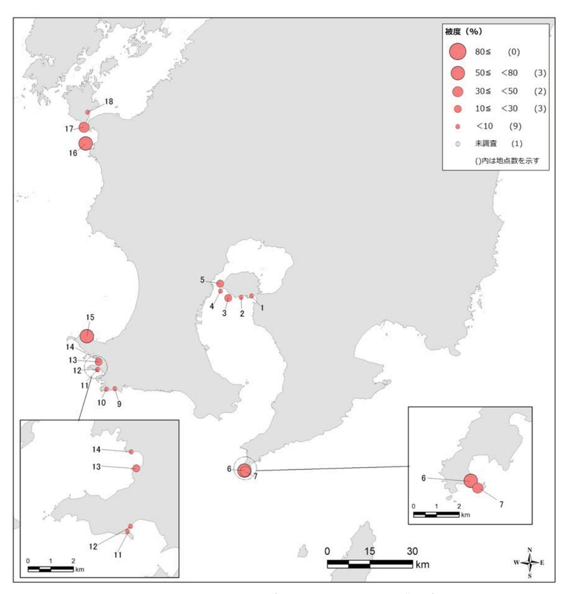

図 I-15-1 モニタリングサイト 1000 サンゴ礁調査 サンゴ被度分布図 (2016) サイト (23) 鹿児島県南部沿岸

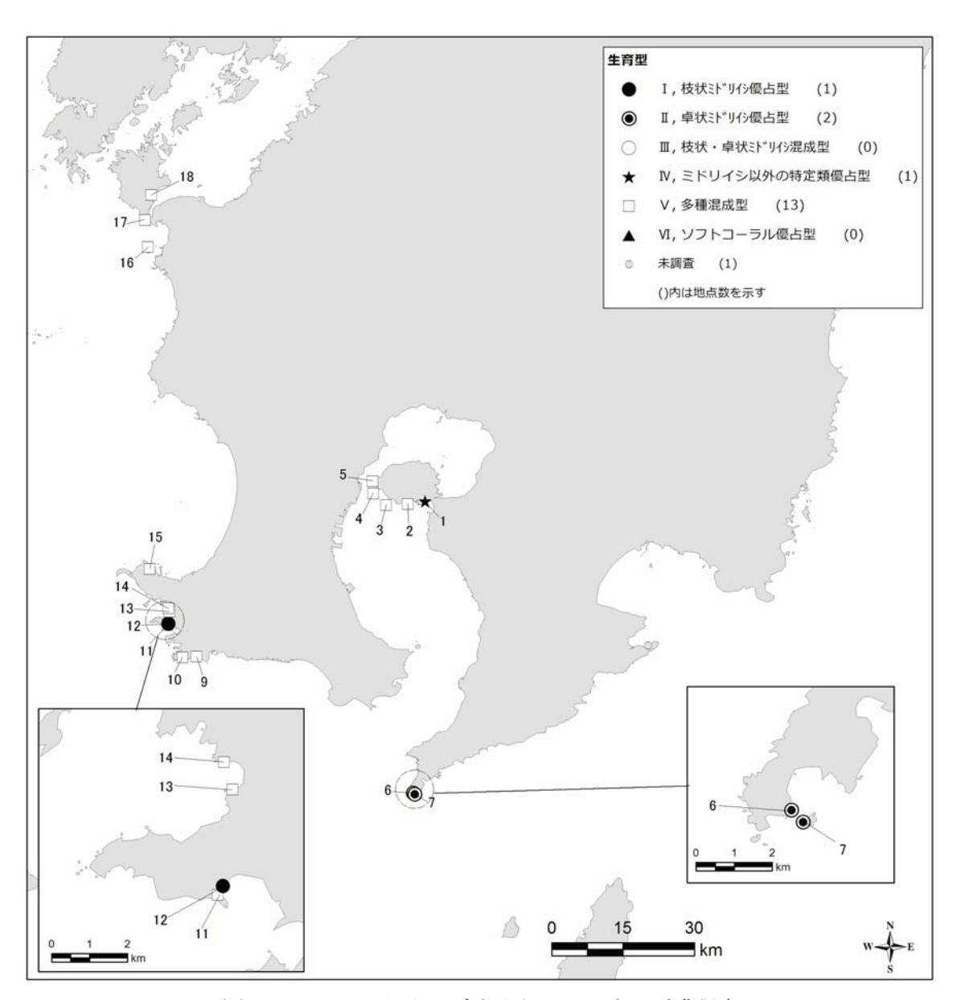

図 I-15-2 モニタリングサイト 1000 サンゴ礁調査 サンゴ生育型 (2016) サイト (23) 鹿児島県南部沿岸

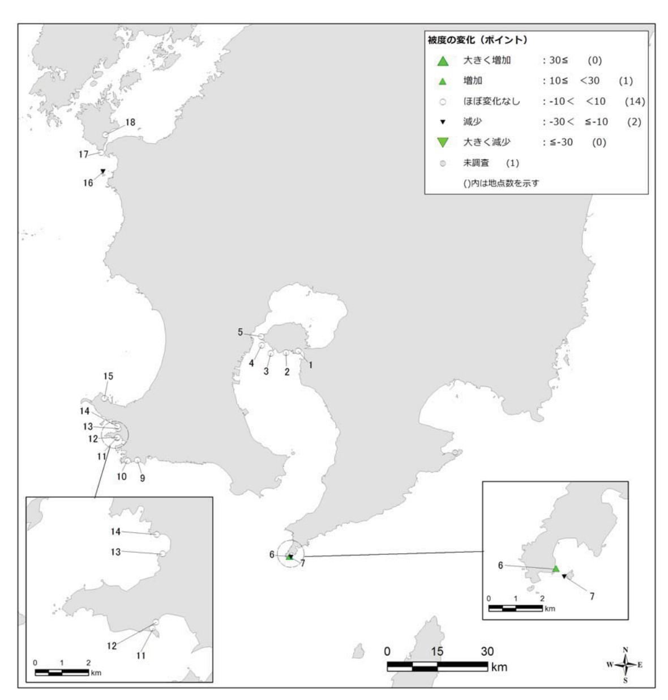

図 I-15-3 モニタリングサイト 1000 サンゴ礁調査 昨年度からのサンゴ被度の変化 (2016) サイト (23) 鹿児島県南部沿岸

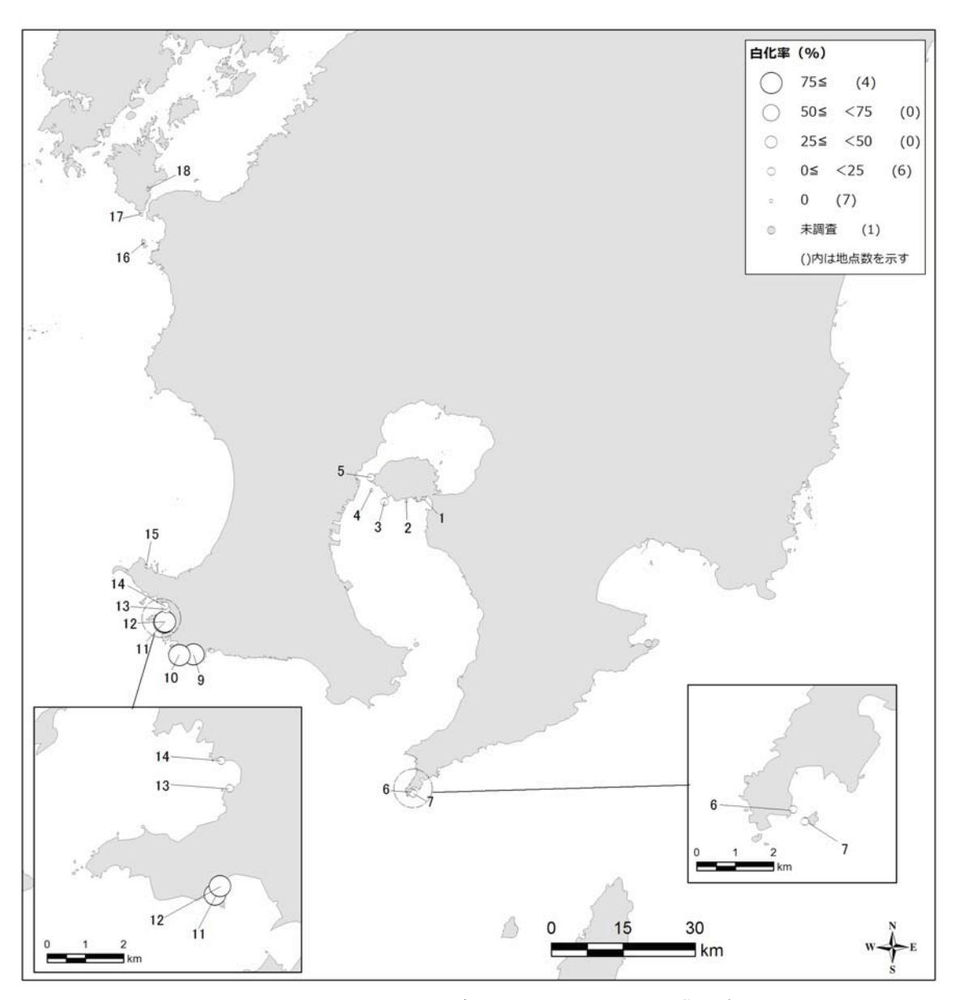

図 I-15-4 モニタリングサイト 1000 サンゴ礁調査 白化の状況 (2016) サイト (23) 鹿児島県南部沿岸

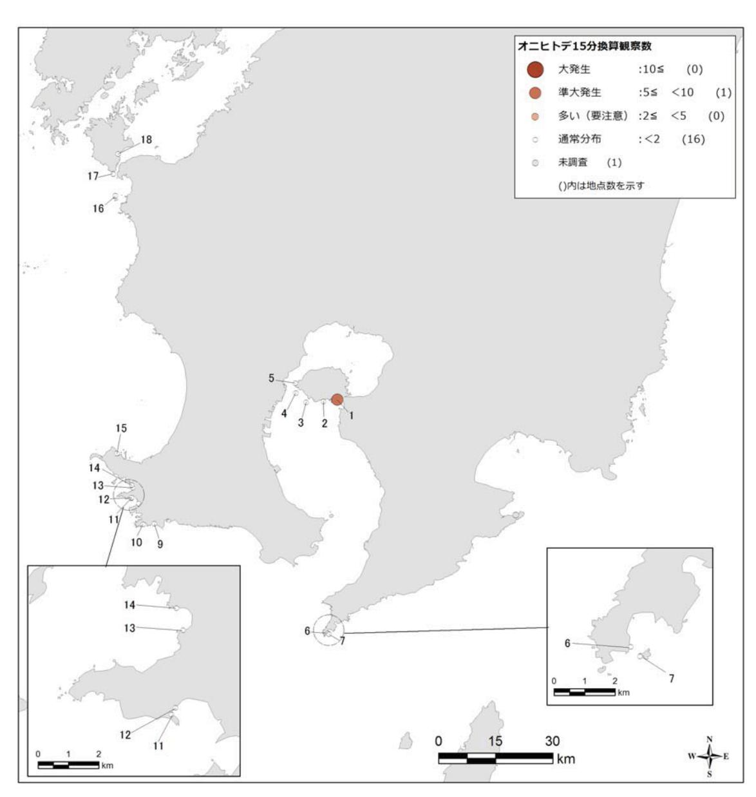

図 I-15-5 モニタリングサイト 1000 サンゴ礁調査 オニヒトデの発生状況 (2016) サイト (23) 鹿児島県南部沿岸

#### (15) サイト24: 天草周辺

#### 1) 実施状況

調査は、株式会社ふたば(元九州大学理学部附属天草臨海実験所准教授)の野島哲氏を 代表者とし、牛深ダイビングクラブの冨川光代表と共に実施した。

なお、天草海域ではサンゴ礁海域に比べて透明度が悪いため、従来のスポットチェック 法で行うスノーケリングではなく、スキューバダイビングにより調査を実施した。

### 2)調查地点

本サイトには、天草半島周辺に 15 か所の調査地点(モニタリングスポット)を設置して おり、今年度は全 15 地点で調査を実施した。

サイト24: 天草周辺における調査地点 (モニタリングスポット:15地点)

地点1:富岡海中公園1号・つつま瀬

地点2:富岡海中公園2号・白岩崎

地点3:大ガ瀬

地点 4: 天草海中公園・大ガ瀬対岸

地点5:桑島

地点 6: 茂串(白浜)(海水浴場沖)

地点7:大島北

地点 8: 牛深海中公園 1号·鶴崎

地点 9: 大島港西

地点 10: 片島

地点 11: 春這

地点 12:平瀬

地点 13: 牛深海中公園 3号・築ノ島

地点 14: 牛深海中公園 4号・法ヶ島南側

地点 15: 片島南

#### 3)調查期間

調査は、2016年9月6日~8日の期間に牛深周辺の11地点(地点5~15)を、9月9日 ~10月11日の期間に天草町及び苓北町沿岸の4地点(地点1~4)で実施した。

#### 4)調査結果

調査地点ごとのサンゴの生育状況及びかく乱要因の状況を図 I-16-1~5 に示す。

### ① 今年度のサンゴの状況

サイトの平均サンゴ被度は30%であり、「やや不良」と評価された。

地点別で見ると(図 I-16-1)、「優良」地点(サンゴ被度 80%以上)は無く、「良」と評価される地点(サンゴ被度 50%以上 80%未満)が 2 地点(地点 10、11)、「やや不良」と評価される地点(サンゴ被度 30%以上 50%未満)が 7 地点(地点 2、3、7、8、9、12、14)、「不良」地点(サンゴ被度 10%以上 30%未満)が 4 地点(地点 5、6、13、15)、「極めて不良」地点(サンゴ被度 10%未満)が 2 地点(地点 1、4)であった。全地点の約半分が「やや不良」であり、「不良」及び「極めて不良」地点が「良」地点を上回っていた。

ただし、新規加入は昨年度よりやや多く確認されたため、今後の被度の増加が期待される。

### ② 昨年度のサンゴの状況との比較

サイト平均サンゴ被度(30%)は、昨年度と変わらなかった。地点毎の被度の増減を比較すると(図 I-16-3)、30 ポイント以上「大きく増加」した地点はなかったが、10 ポイント以上 30 ポイント未満で「増加」した地点が 5 地点(地点 5、7、9、10、14)あった。一方、30 ポイント以上「大きく減少」した地点が 1 地点(地点 12)あり、10 ポイント以上 30 ポイント未満で「減少」した地点は 3 地点(地点 2、11、15)であった。その他の 6 地点は 10 ポイント未満の増減で「ほぼ変化なし」と評価された。被度が増加した地点数が減少した地点数を上回っていたが、30 ポイント以上大きく減少した地点があったため、全体の被度平均値では増減が相殺され、変化がなかった。

ただし、地点 12 の被度減少については、今年度の調査範囲がやや被度の低い地域に偏った可能性があり、これまでと調査範囲がずれたことに起因すると考えられる。

#### ③ 今年度のかく乱の状況

今年度は、夏季に台風の到来がなく、8月に天草での海水温が 29℃を超え、多くの海域でサンゴの白化現象が確認された。白化の程度は初期から中期と思われたが、テーブルサンゴを中心に 10~40%の群体に白化が確認された。本サイトでは、これまでの調査では一番規模の大きなサンゴの白化現象と言える。しかしながら、30℃は超えなかったためか、白化現象は卓状ミドリイシ類を中心に軽度にとどまり、完全に白化した状態の群体は一部の種類にのみに限られ、その後に回復したと考えられ、調査時にはほとんど白化は観察できなかった(図 I-16-4)。今年度の高水温による白化の最終的な評価は次年度の調査結果を待つ必要がある。

7年前(平成 21年)に 9 地点で確認されたオニヒトデは、今年度は僅か 2 地点に減少した(図 I-16-5)。一時の異常発生状態から比べると、小康状態になりつつあると考えられるが、 2 個体(「多い(要注意)」レベル)が観察された地点 3(大ガ瀬)では、これまでオニ

ヒトデの駆除作業が行われておらず、オニヒトデによる食痕が多くのサンゴ群体で確認された。牛深周辺では、地元牛深ダイビングクラブの地道な駆除作業の結果もあり、地点 7 (大島北) で 1.5 個体 (「通常分布」レベル)が確認されたのみであった。

サンゴ食貝類については今回の調査では確認されなかった。また、ホワイトシンドロームについては今年度も7地点(地点2、3、5、7、9、12、14)で確認されたが、罹患した群体数は昨年より減少していた。

### ④ その他

天草では冬期水温の上昇によって多くのサンゴ礁魚類が観察されるようになった。アオブダイの個体数も増加し、一部の海域ではブダイ類によるサンゴへの食痕も顕著になっている。また、地点 7 (大島北) において、天草では初めてルソンヒトデの成体を確認した。

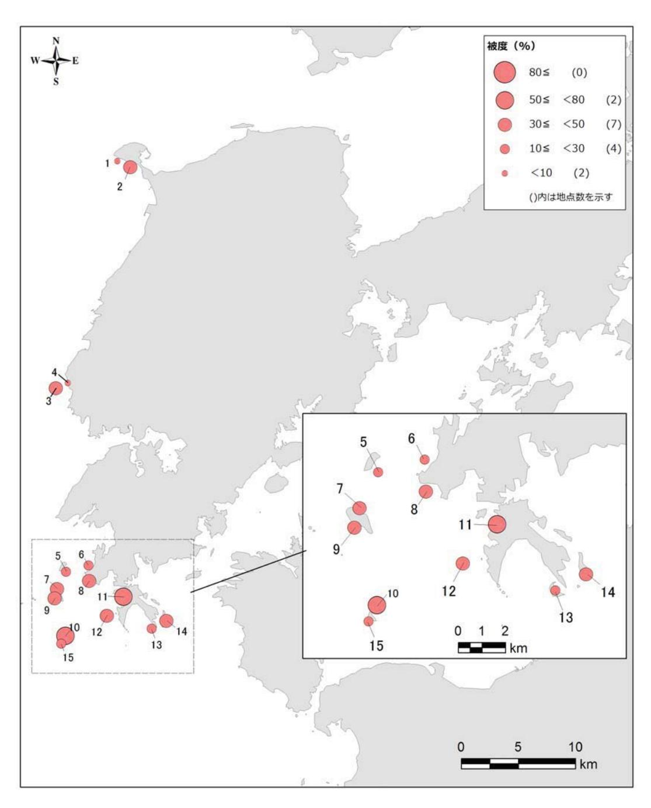

図 I-16-1 モニタリングサイト 1000 サンゴ礁調査 サンゴ被度分布図 (2016) サイト (24) 天草周辺

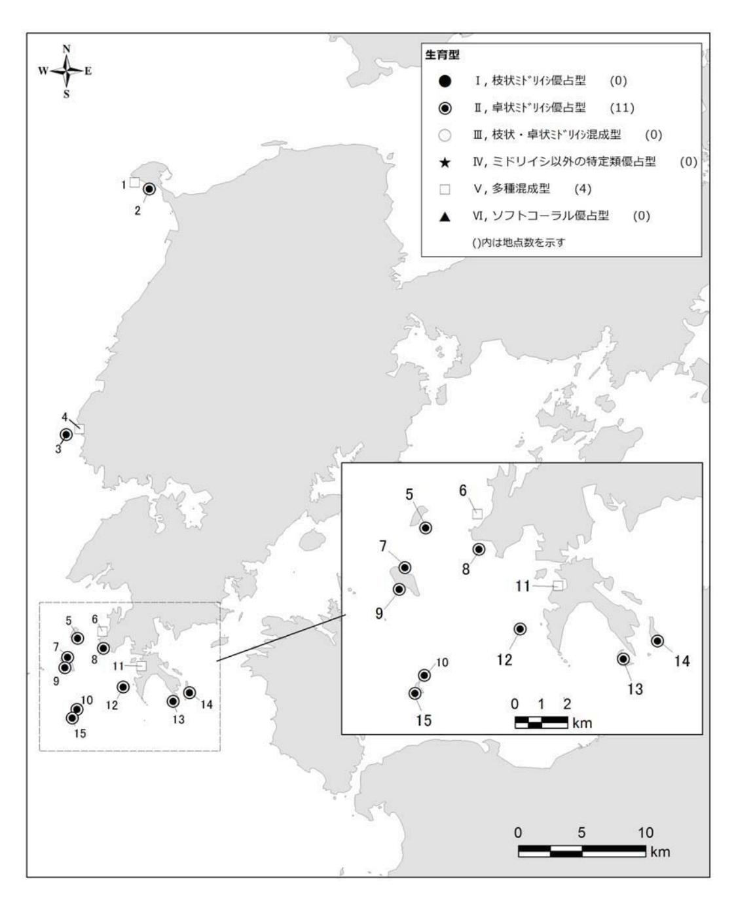

図 I-16-2 モニタリングサイト 1000 サンゴ礁調査 サンゴ生育型 (2016) サイト (24) 天草周辺

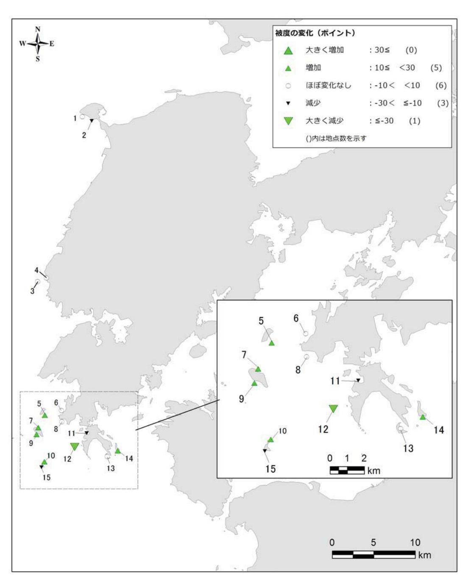

図 I-16-3 モニタリングサイト 1000 サンゴ礁調査 昨年度からのサンゴ被度の変化 (2016) サイト (24) 天草周辺

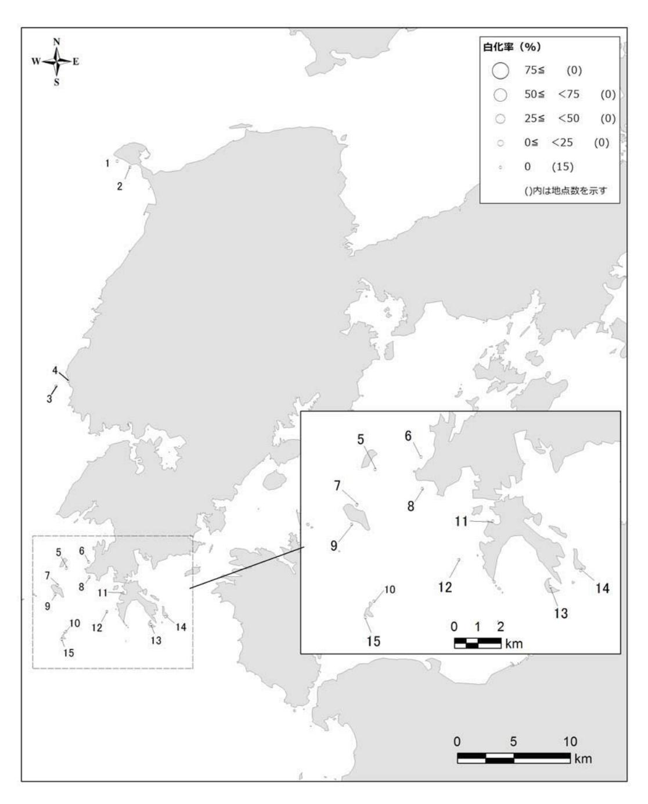

図 I-16-4 モニタリングサイト 1000 サンゴ礁調査 白化の状況 (2016) サイト (24) 天草周辺

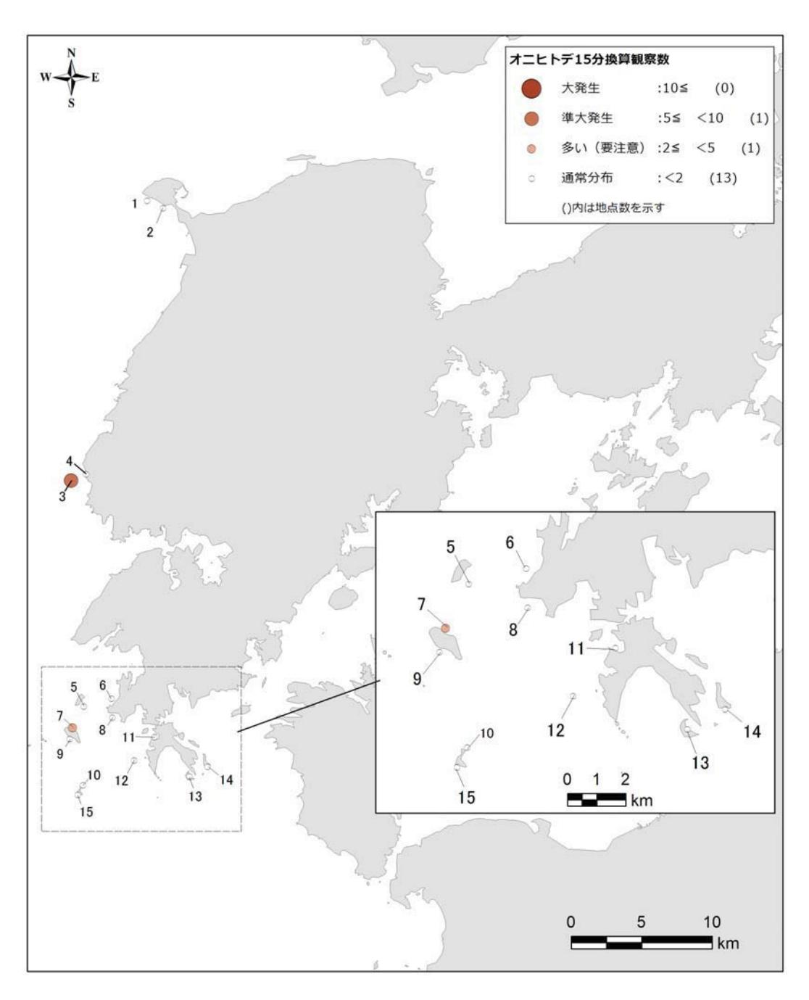

図 I-16-5 モニタリングサイト 1000 サンゴ礁調査 オニヒトデの発生状況 (2016) サイト (24) 天草周辺

### 2. 総括:平成28 (2016) 年度のサンゴの状況

ここでは、今年度に調査を実施したサイトのうち、奄美群島(サイト 3: 瀬戸内周辺)以南のサイトを「主なサンゴ礁域」、大隅諸島(サイト 1: 屋久島・種子島周辺)以北のサイトを「高緯度サンゴ群集域」として、それぞれの概況を記す。

表Ⅱ-1に各サイトにおける2004年以降の平均サンゴ被度の変化を示す。

表Ⅱ-1 各サイトにおける平均サンゴ被度の推移

| (3) 2012(H24) H25(2013) H26(2014) H27(2015) H28(2016) | 40       | 20 20 30 30 | 20 *1 20 *1 30 *1 | 20 30                            | 30 30 40 30      | 20 20                           |        | 30       | 20       | <b>%</b> 2 30 <b>%</b> 2 | 20 10 20  | 40        | 30 **3      | 30            | 30 20      | 20               | 20       | 2.5                                                                                            | 20       | 30       | 30                 | 20           | 30                     | _                                     |
|-------------------------------------------------------|----------|-------------|-------------------|----------------------------------|------------------|---------------------------------|--------|----------|----------|--------------------------|-----------|-----------|-------------|---------------|------------|------------------|----------|------------------------------------------------------------------------------------------------|----------|----------|--------------------|--------------|------------------------|---------------------------------------|
| 2012(H24) H25(2013) H26(2014)                         | 46       | 20 30       | ×1 20 ×1          | 20                               | 30 30            |                                 |        |          | 20       |                          | Ц         | 40        |             | 30            | 30         | 5(               | 50       | 2.5                                                                                            | 50       | 30       | 30                 | 20           | 36                     | ٠,                                    |
| 2012(H24) H25(2013) H26(2014)                         |          | 20          | ×1 20             | 20                               | 30               | 20                              | _      |          |          | <b>%</b>                 | 2         |           |             |               | _          | $\neg$           |          |                                                                                                |          |          |                    |              |                        | 8                                     |
| 2012(H24) H25(2013)                                   |          | 20          |                   |                                  | Щ                | 20                              | Į.     | 1 - 1    | -        | Ь                        | _         | L         | % %      | _             | 40         |                  | Щ        |                                                                                                | Ц        | Ļ        | Ļ                  | ۷            | Ļ                      |                                       |
| 2012(H24) H25(2013)                                   |          |             | _                 | ·                                |                  |                                 | ĺ      | 30       | 30       | 30                       | 10        | 40        | 30          | 30            | 30         | 20               | 50       | 2.5                                                                                            | 40       | 40       | 30                 | 20           | 30                     | ,                                     |
| 2012(H24)                                             |          |             | 20                | - 1                              | 20               |                                 |        |          |          | **2                      | 20        |           | <b>%</b>    |               | 40         |                  |          |                                                                                                |          |          |                    |              |                        | L                                     |
| 2012(H24)                                             |          | 20          |                   | 20                               | 40               | 10                              |        | 30       | 30       | 30                       | 10        | 40        | 30          | 30            | 30         | 20               | 40       | 2.5                                                                                            | 40       | 40       | 30                 | 30           | 30                     | ,                                     |
| -                                                     |          | 20          | *                 | _                                | 30               |                                 |        |          |          | <b>%</b> 5               | 20        |           | % %      |               | 40         |                  |          |                                                                                                |          |          |                    |              |                        | L                                     |
| -                                                     | 1        |             | 30                | 30                               | 20               | 10                              |        | 20       | 20       | 20                       | 20        | 40        | 30          | 20            | 20         | 20               | 40       | 3                                                                                              | 30       | 30       | 20                 | 20           | 30                     |                                       |
| 3                                                     | $\vdash$ |             | *                 | _                                | 30               |                                 |        |          |          | <b>%</b>                 | 20        |           | % **     |               | 30         |                  | Ц        |                                                                                                |          |          |                    |              |                        | L                                     |
| 2011(H23)                                             |          | 20          | 20                | 20                               | 40               | 10                              | 20     | 30       | 20       | 20                       | 20        | 20        | 20          | 20            | 20         | 20               | 40       | 3                                                                                              | 40       | 40       | 20                 | 30           | 30                     | ,                                     |
| 2011                                                  | L        |             | *                 | _                                | 20               |                                 |        |          | L        | <b>%</b> 5               | 20        | L         | % %      |               | 30         |                  |          |                                                                                                |          |          |                    |              |                        | L                                     |
| 2010(H22)                                             | 30       | 20          | 30                | 30                               | 40               | 10                              | !      | 40       | 30       | 20                       | 30        | 20        | 20          | 20            | 20         | 20               | 40       | 3                                                                                              | 50       | 40       | 30                 | 30           | 30                     |                                       |
| $\vdash$                                              |          |             | *                 |                                  | 30               |                                 |        |          |          | <b>%</b> 5               | 30        | L.        | % %      |               | 30         |                  |          |                                                                                                |          |          |                    |              |                        |                                       |
| 2009(H21)                                             |          | 20          | 20                | 30                               | 30               | 10                              |        | 40       | 20       | 20                       | 40        | 50        | 20          | 10            | 20         | 50               | 40       | 3                                                                                              | 40       | 30       | 30                 | 30           | 30                     |                                       |
| 2009                                                  | L        |             | *                 | (                                | 30               |                                 |        |          |          | <b>%</b> 2               | 30        |           | % %      |               | 30         |                  |          |                                                                                                |          |          |                    |              |                        |                                       |
| 2008(H20)                                             |          | 30          | 20                | 20                               | 30               | 20                              |        | 40       | 30       | 20                       | 30        | 40        | 20          | 10            | 20         | 20               | 50       | 3                                                                                              | 40       | 40       | 30                 | 40           | 30                     |                                       |
| 2008                                                  |          |             | *                 | <b>(</b>                         | 20               |                                 |        |          |          | <b>%</b> 5               | 20        |           | % %      |               | 30         |                  |          |                                                                                                |          |          |                    |              |                        |                                       |
| (H19)                                                 |          | 30          | 20                | 20                               | 20               | 20                              | 10     | 40       | 40       | 20                       | 30        | 40        | 30          | 20            | 20         | 20               | 40       | 3                                                                                              | 40       | 30       | 30                 | 40           | 30                     |                                       |
| 2007(H19)                                             |          |             | *1                |                                  | 20               |                                 |        |          |          | 7%                       | 20        |           | £ **     |               | 30         |                  |          |                                                                                                |          |          |                    |              |                        |                                       |
| (H18)                                                 |          | 30          | 10                | 10                               | 10               | 10                              |        | 40       | 40       | 30                       | 40        | 20        | 40          | 20            | 40         | 09               | 20       | 3                                                                                              | 20       | 30       | 30                 | 40           | 30                     | • •                                   |
| 2006(H18)                                             |          |             | *                 |                                  | 10               |                                 |        |          |          | <b>%</b> 2               | 40        |           | % %      |               | 20         |                  |          |                                                                                                |          |          |                    |              |                        |                                       |
| 2005(H17)                                             | 20       | 40          | 10                | 10                               | 10               | 20                              |        | 20       | 20       | 30                       | 40        | 40        | 20          | 20            | 40         | 09               | 20       | 3                                                                                              | 20       | 30       | 20                 | 40           | 30                     | 00                                    |
| 2005(                                                 |          |             | *                 |                                  | 10               |                                 | !      |          |          | <b>%</b> 5               | 40        |           | °%          |               | 20         |                  |          |                                                                                                |          |          |                    |              |                        |                                       |
| H16)                                                  |          | 40          | 10                | 10                               | 10               | 20                              |        | 40       | 09       | 30                       | 40        | 40        | 50          | 20            | 20         | 09               | 20       | 3                                                                                              | 09       | 40       | 20                 | 30           | 30                     |                                       |
| 2004(H16)                                             |          |             | *                 |                                  | 10.0             |                                 |        |          |          | <b>%</b> 5               | 30.0      |           | £           |               | 50.0       |                  |          |                                                                                                |          |          |                    |              |                        |                                       |
|                                                       | 122      | 瀬戸内周辺(大島)   | 4. 東村~奥           | 5. 恩納村~残波岬                       | 6. 水納島・伊是名島・伊平屋島 | 7. 慶良間諸島中心海域 (阿嘉島、座間味、渡嘉敷周辺) | 8. 大東島 | 9. 宮古島周辺 | 10. 八重干瀬 | 11. 平久保崎~宮良湾             | 12. 川平~大崎 | 13. 小浜島周辺 | 14. カタグァー周辺 | 15. シモビシ~仲間崎沖 | 16. 黒島~新城島 | 17. 崎山湾(西表島西部)周辺 | 18. 父島周辺 | 19. 館山(房総)                                                                                     | 20. 壱岐周辺 | 21. 串本周辺 | 22. 四国南西岸(宇和海~足摺岬) | 23. 鹿児島県南部沿岸 | 24. 天草周辺               | 0 4 11 11                    |
| 地域                                                    | 2. 小宝島居  | ω.          | 一                 |                                  |                  |                                 | ~      | 3,       |          |                          |           |           |             |               |            |                  |          |                                                                                                | ,,       | ,,       | ,7                 | )            | )                      |                                       |
| 中ブロック                                                 | 2. 小宝島店  | 3.          | 漸岸                | 赶                                |                  |                                 |        |          |          | <u>₩</u>                 | 屗         | 쓔         | 世           | Ф             | PŒ         | ΠIR              |          |                                                                                                |          |          |                    | 表,           | 777                    |                                       |
| 地域                                                    |          | 小宝島周辺       |                   | 2. 小宝島周辺 3. 瀬戸内周辺( 4. 東村~奥 | 2, 8, 4, 7,      | 2, 8, 4, 7, 0                   |        |          |          |                          |           |           |             |               |            |                  |          | 東 西 東 東 田 東 東 田 東 東 東 田 東 東 東 田 東 東 東 田 東 東 田 東 東 田 東 東 東 東 東 東 東 東 東 東 東 東 東 東 東 東 東 東 東 東 |          |          |                    |              | 新 新 新 新 <del>以</del> 第 | 1 1 1 1 1 1 1 1 1 1 1 1 1 1 1 1 1 1 1 |

※1. 沖縄島全体(サイトペーの全調査区の平均値)

※2. 石垣島全体(サイト11~12の全調査区の平均値)

※3. 石西礁湖および西表島全体(サイト13~17の全調査区の平均値)

※4. 空欄は調査を行っていない※5. 「<1」や「<5」などはその中央値(0.5や2.5)として計算した。</li>

#### (1) 主なサンゴ礁域

今年度の主なサンゴ礁域全体の平均サンゴ被度は、30%(サンゴ被度の区分では「やや不良」と評価される)であり、昨年度と変わらなかったが、宮古島離礁、石西礁湖及び西表島と周辺離島では、平均サンゴ被度が10ポイント以上減少した。

2004年以降の主なサンゴ礁域全サイトの平均サンゴ被度を図Ⅱ-1-1に示す。

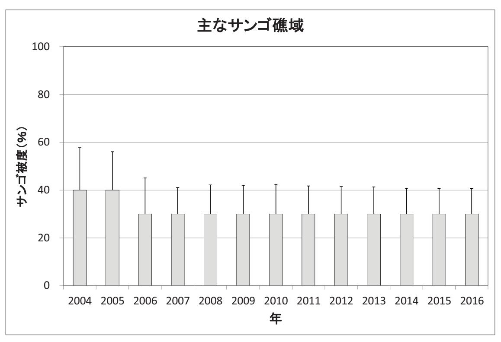

図II-1-1 2004年度から2016年度までの主なサンゴ礁域のモニタリングサイトにおける平均サンゴ被度の変化.主なサンゴ礁域の17サイトについて、各サイトにおける平均サンゴ被度を用いて算出した値を10%区分で示した.縦軸はサンゴ被度(%)、横軸は調査年を示す。各棒グラフの上底から伸びたエラーバーは標準偏差を示す。

主なサンゴ礁域では、調査開始時の 2004 年には平均サンゴ被度が 40%であったが、奄美群島、慶良間諸島、宮古島、石垣島及び石西礁湖周辺では当時オニヒトデの大発生が進行しつつあり、その食害により 2006 年には平均被度が 30%に減少した。また、2007 年には石垣島から西表島に至る八重山海域において夏季高水温による大規模な白化現象が起こり、同海域のサンゴ群集に大きな被害を与えた。その後も各地のオニヒトデ大発生は 2014年頃まで続いたために、平均サンゴ被度に顕著な回復は見られなかった。その後は各地のオニヒトデの大発生がようやく収束しつつあり、今後は回復傾向に転じることが期待されていたところ、2016 年に夏季高水温による大規模な白化現象が起こった。

奄美群島では、昨年度より平均被度が 10 ポイント増加した。これは、長年のオニヒトデ

大発生が収束した後のサンゴ群集の回復が始まり、平均サンゴ被度にも反映されてきたためと考えられた。夏季高水温による白化現象も確認されたが、死亡には至らなかったため、サンゴ被度への影響はなかった。

沖縄島周辺では、2007 年から 2010 年頃までは低被度が続いた後、昨年度ようやく増加傾向に転じた。今年度調査において当海域 3 サイトの平均サンゴ被度は変わらなかったが、周辺離島サイトでは増加傾向を示し、平均サンゴ被度が 20 ポイント増加した。

大東諸島サイト (5年ごとに調査を実施している遠隔地) では、2007年の調査開始以降 第2回目調査 (2011年に実施)で10ポイント平均サンゴ被度が増加して20%となり、1998年の夏季の高水温による大規模白化現象からの順調な回復と考えられたが、今年度の調査では第2回目調査結果と変わらず20%であった。しかし、オニヒトデやサンゴ食巻貝による食害等のかく乱等は確認されず、生息環境は健全であると考えられた。

宮古島や八重干瀬、石垣島周辺では、オニヒトデ大発生は収束したと考えられるが、夏季高水温による大規模な白化現象が起こり、平均サンゴ被度が10~20ポイント減少した。

小笠原諸島ではオニヒトデや白化、台風等のかく乱がなく、2009年の大規模な白化後の回復に向かい始めたと考えられていたが、今年度は一部でサンゴの病気が広がり、平均サンゴ被度が10ポイント減少した。

サンゴ礁域全体でみると、2016年は夏季高水温による大規模な白化現象が宮古島や八重山諸島などの一部の海域でサンゴ群集に大きな被害を与えたが、その他の地域では比較的被害は軽微であり、その後の回復が見られ、平均サンゴ被度としては昨年度と変わらなかった。しかし、調査時にまだ白化現象が進行中であった地点もあるため、2016年夏季高水温による最終的な被害は、次年度の調査結果を待って判断する必要がある。

#### (2) 高緯度サンゴ群集域

高緯度サンゴ群集域における今年度の全サイトの平均サンゴ被度は、30%(サンゴ被度の区分では「やや不良」と評価される)であり、昨年度と変わらなかった。この海域では2004年度の調査開始以降、平均サンゴ被度は30%で推移している。(図II-2-1)。

館山サイトを始めとして、串本周辺や四国南西岸、鹿児島県南部沿岸のサイトでは、昨年度と平均サンゴ被度に変化はなかったが、壱岐周辺サイトでは平均サンゴ被度が 10 ポイント減少した。これは、エダミドリイシ群集におけるガンガゼの食害が進行していたことによるものである。この海域ではガンガゼの主要な餌となる海藻類が減少する磯焼け現象が広がっており、餌を求めたガンガゼが大量にサンゴ群集域に移動して食害を与えていると考えられた。また、天草周辺サイトでは昨年から平均サンゴ被度が 10 ポイント増加した。このサイトでは、昨年度は台風やオニヒトデの食害により被度が減少したが、今年はその後の回復傾向が現れたものと考えられる。

高緯度サンゴ群集域全体で見ると、四国南西岸サイトや天草周辺サイトにおけるオニヒトデの減少傾向や小型群体の増加傾向から、サンゴ被度が回復し始めることが期待されて

いたが、今年度は壱岐周辺サイトにおけるガンガゼの食害により平均サンゴ被度の増加までには至らなかった。

また、高緯度サンゴ群集域でも、夏季高水温による白化現象が確認されたが、その後、 回復したところが多く、ほとんど死亡にまでは至らなかったため、サンゴ被度の減少には 至らなかった。

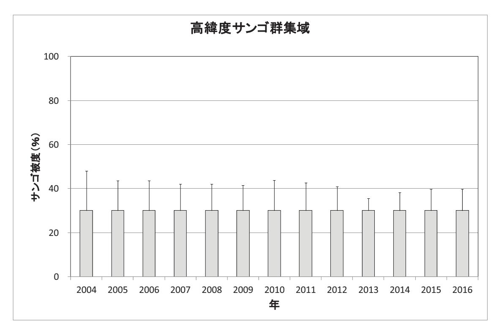

図II-2-1 2004 年度から 2016 年度までの高緯度サンゴ群集域のモニタリングサイトにおける平均サンゴ被度の変化. 高緯度サンゴ群集域の 7 サイトについて、各サイトにおける平均サンゴ被度を用いて算出した値を 10%区分で示した. 縦軸はサンゴ被度 (%)、横軸は調査年を示す。各棒グラフの上底から伸びたエラーバーは標準偏差を示す.

#### (3) 2016年の夏季高水温による白化現象

今年度、主なサンゴ礁域で大きな被害を与えたと考えられる夏季の高水温による白化の 状況をまとめ、各サイトにおける白化率と死亡率を表 $\Pi$ -3-1 及び図 $\Pi$ -3-1 に示す。

2016 年の 7~8 月に高水温が続いた主なサンゴ礁域では、各地でサンゴの白化現象が確認された。特に宮古島周辺や八重干瀬周辺、石垣島から西表島に至る八重山海域では浅海のサンゴ群集の 57~96%が白化した。奄美群島から沖縄島周辺、慶良間諸島等では、閉鎖的な環境や浅い礁池内など局所的に高い白化率を示したが、それぞれの海域全体で見ると宮古島及び八重山海域での大きな被害に比較して影響は軽微であった。その後、台風の襲

来や秋~冬季の到来にしたがって水温が徐々に下降したため、白化したサンゴも一部は回 復に向かったが、被害の大きかった宮古島や八重山海域では 31~68%のサンゴ群集が死亡 した。

表Ⅱ-3-1 モニタリングサイト 1000 サンゴ礁調査各サイトにおける白化率と死亡率

|             |                   |                                                     |       | 平成28(2016)年度 |     |
|-------------|-------------------|-----------------------------------------------------|-------|--------------|-----|
| 海域          | 中ブロック             | サイト                                                 | サンゴ被度 | 白化率          | 死亡率 |
|             | 奄美群島              | 3.瀬戸内周辺(大島)                                         | 40    | 21           | 1   |
|             | 沖縄島東岸・西岸          | 4.東村~奥 5.恩納村~残波岬                                 | 30    | 16           | 6   |
|             | 周辺離島              | 6.水納島・伊是名島・伊平屋島                                     | 60    | 48           | 14  |
|             | 慶良間諸島             | 7.慶良間諸島中心海域 (阿嘉島、座間味、渡嘉敷周辺)                      | 20    | 7            | 5   |
| 主 な      | 大東諸島              | 8.北大東島・南大東島                                         | 20    | 0            | 0   |
| サ           | 宮古島周辺             | 9.宮古島周辺                                             | 20    | 69           | 31  |
| ン           | 宮古島離礁             | 10.八重干瀬                                             | 10    | 70           | 68  |
| ゴ 礁 域 | 石垣島東岸・西岸          | 11.平久保崎~宮良湾 12.川平~大崎                             | 20    | 57           | 12  |
|             | 石西礁湖北部~南部         | 13.小浜島周辺 14.カタグァー周辺 15.シモビシ~仲間崎沖 16.黒島~新城島 | 20    | 96           | 53  |
|             | 西表島と周辺離島          | 17.崎山湾(西表島西部)周辺                                     | 30    | 94           | 35  |
|             | 小笠原諸島             | 18.父島周辺                                             | 40    | 3            | 2   |
| 高           | 房総・伊豆・伊豆諸島(黒潮影響域) | 19.館山(房総)                                           | <5    | 0            | 0   |
| 緯           | 日本海(対馬暖流影響域)      | 20.壱岐周辺                                             | 40    | 0            | 0   |
| 度 サ      | 紀伊半島(黒潮影響域)       | 21.串本周辺                                             | 30    | 1            | 0   |
| ン           | 四国(黒潮影響域)         | 22.四国南西岸(宇和海~足摺岬)                                   | 30    | 3            | 0   |
| ゴ 群      | 九州・南東部(黒潮影響域)     | 23.鹿児島県南部沿岸                                         | 20    | 21           | 0   |
| 集           | 九州・西部(対馬暖流影響域)    | 24.天草周辺                                             | 30    | 0            | 0   |
| 域           | 大隈諸島              | 1.屋久島・種子島周辺                                         | 30    | 8            | 2   |

一方、高緯度サンゴ群集域では、鹿児島県南部沿岸や串本周辺、四国南西岸及び屋久島・ 種子島周辺において白化現象が確認されたが、いずれも死亡率は 5%未満と被害は軽微であ ったと考えられる。

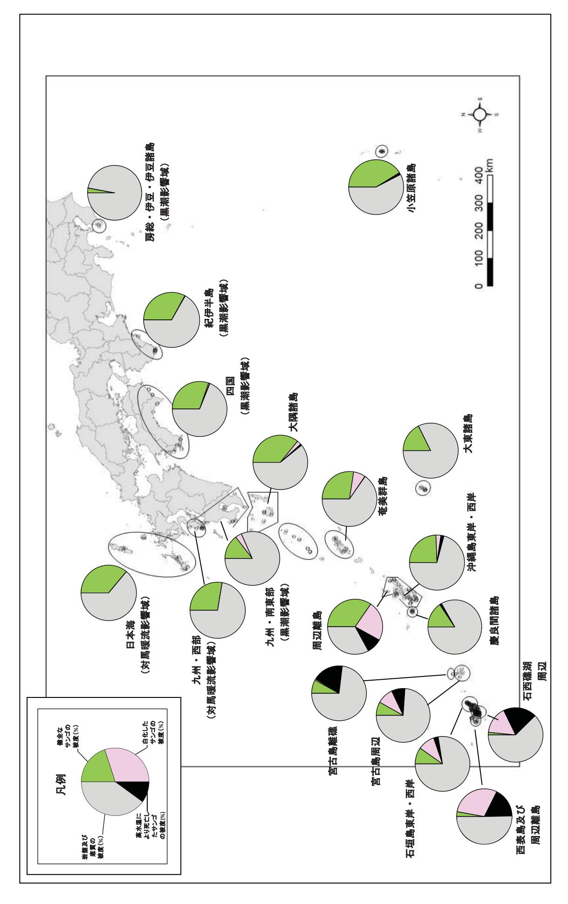

ᅗϩ ࢺࢧࢢࣥࣜࢱࢽࣔ 㸦ࢦࣥࢧ♋ㄪᰝ㸧ࡿࡅ࠾ᖹᡂ 㸦㸧ᖺᗘࡢྛᆅࡢᖹᆒࢦࣥࢧ龠ᗘ㸦㸣㸧ⓑཬࡧṚஸࡢࢦࣥࢧྜ

# II ㈨ᩱ

㈨ᩱ㸯㸸ᖹᡂ 28㸦2016㸧ᖺᗘࢺࢧࢢࣥࣜࢱࢽࣔ 1000㸦ࢦࣥࢧ♋㸧ㄪᰝᆅⅬ୍ぴ

ࣝࣗࢽ࣐ㄪᰝ♋ࢦࣥࢧࡿࡼἲࢡࢵ࢙ࢳࢺࢵ࣏ࢫ㈨ᩱ㸰㸸

㈨ᩱ㸯㸸ᖹᡂ 28㸦2016㸧ᖺᗘࢺࢧࢢࣥࣜࢱࢽࣔ 1000㸦ࢦࣥࢧ♋㸧ㄪᰝᆅⅬ୍ぴ

㈨ᩱ㸯㸬ᖹᡂᖺᗘࢺࢧࢢࣥࣜࢱࢽࣔࠉ㸦ࢦࣥࢧ♋㸧ㄪᰝᆅⅬ୍ぴ

| ୰䝤䝻䝑䜽 | 䝃䜲䝖 㻺㼛㻚 | 䝃䜲䝖ྡ      | ┴ྡ   | ㄪᰝᆅ        | ᆅྡ        | ໭⦋㻔ᗘ䠅    | ໭⦋㻔ศ䠅       | ໭⦋㻔⛊䠅 | ᮾ⤒ ᮾ⤒䠄ᗘ㻕 | ᮾ⤒    | ᆅᙧ          | ᗏ㉁         | ほᐹ⠊ᅖ㻔㼙㻕 | Ỉ῝⠊ᅖ㻔㼙䠅 | ᆅⅬタᐃ⌮⏤䚸ㄪᰝᑐ㇟                                                                    |
|-------|---------|-----------|------|------------|-----------|----------|-------------|-------|-------------|-------|-------------|------------|---------|---------|--------------------------------------------------------------------------------|
|       |         |           |      | 㻔㼟㼜㼛㼠㻕 㻺㼛㻚 |           |          |             |       | 㻔ศ䠅         | 㻔⛊䠅   |             |            |         |         |                                                                                |
| ኱㝮ㅖᓥ  | 㻝       | ᒇஂᓥ䞉✀Ꮚᓥ࿘㎶ | 㮵ඣᓥ┴ | 㻝          | ᒇஂᓥ䚷ᚿᡞᏊ   | 㻞㻢 㻟㻜 | 㻡㻡㻚㻞㻟       | 㻝㻟㻜   | 㻟㻝          | 㻝㻤㻚㻢㻣 | እὒ          | ሁ✚ᒾ 㻞㻡㽢㻝㻜㻜 |         | 㻝䡚㻢     | 㞳Ỉ䝃䞁䝂♋ᇦ䛷䛒䜛䚹䛛䛴䛶䛿Ⰻዲ䛺䝃䞁䝂⩌ⴠ䛜䛒䛳䛯䛜䚸 ‴ᕤ஦䛻䜘䜚ఱᗘ䜒◚ቯ䛥䜜䛶䛝䛯䚹⌧ᅾᅇ᚟䛧ጞ䜑䛶䛔䜛䛾䛷䚸䛭 䛾ኚ㑄䜢䝰䝙䝍䝸䞁䜾䛩䜛䚹 |
| ኱㝮ㅖᓥ  | 㻝       | ᒇஂᓥ䞉✀Ꮚᓥ࿘㎶ | 㮵ඣᓥ┴ | 㻞          | ᒇஂᓥ䚷ඖᾆ    | 㻞㻣 㻟㻜 | 㻝㻤㻚㻤㻠       | 㻝㻟㻜   | 㻟㻜          | 㻡㻡㻚㻤㻞 | ෆ‴          | ሁ✚ᒾ 㻡㻜㽢㻡㻜  |         | 㻠䡚㻢     | ᒇஂᓥ䛻䛿䛒䜎䜚䛺䛔ෆ‴ⓗ⎔ቃ䜢ᣢ䛴ሙᡤ䚹㻥㻢ᖺ䛻䜸䝙䝠䝖䝕䛜ከ䛟ほᐹ䛥䜜䛯䛣䛸䛜䛒䜛䚹                                   |
| ኱㝮ㅖᓥ  | 㻝       | ᒇஂᓥ䞉✀Ꮚᓥ࿘㎶ | 㮵ඣᓥ┴ | 㻟          | ᒇஂᓥ⟶⌮Ჷୗ   | 㻞㻣 㻟㻜 | 㻠㻝㻚㻡㻝       | 㻝㻟㻜   | 㻟㻜          | 㻡㻥㻚㻤㻠 | እὒ          | ሁ✚ᒾ 㻡㻜㽢㻡㻜  |         | 㻝㻟䡚㻝㻤   | 㻥㻤ᖺ䛾ⓑ໬⌧㇟௨๓䛿኱ኚⰋዲ䛺䝃䞁䝂⩌㞟䛜䛒䛳䛯ሙᡤ䚹≉䛻኱ᆺ䛾䝔䞊䝤䝹≧䝃䞁䝂䛜䛒䛳䛯䚹䝃䞁䝂⩌㞟䛾ᅇ᚟䜢䝰䝙䝍䝸䞁䜾 䛩䜛䛯䜑䛻㑅ᐃ䛧䛯䚹    |
| ኱㝮ㅖᓥ  | 㻝       | ᒇஂᓥ䞉✀Ꮚᓥ࿘㎶ | 㮵ඣᓥ┴ | 㻠          | ᒇஂᓥ䚷䛚ᐑୗ   | 㻞㻣 㻟㻜 | 㻠㻢㻚㻝㻞       | 㻝㻟㻜   | 㻞㻥          | 㻟㻢㻚㻟㻠 | እὒ          | ሁ✚ᒾ 㻡㻜㽢㻡㻜  |         | 㻢䡚㻝㻠    | 㻞㻜㻜㻠ᖺ䛾ྎ㢼䛻䜘䜛ᅵ◁ὶฟ䛷䝎䝯䞊䝆䛜䛒䛳䛯䛜䚸䛭䛾ᚋ䛾ᅇ᚟䜢䝰䝙䝍䝸䞁䜾䛩䜛䛯䜑䛻㑅ᐃ䛧䛯䚹                              |
| ኱㝮ㅖᓥ  | 㻝       | ᒇஂᓥ䞉✀Ꮚᓥ࿘㎶ | 㮵ඣᓥ┴ | 㻡          | ᒇஂᓥ䝍䞁䜽ୗ   | 㻞㻣 㻟㻜 | 㻞㻣㻚㻡㻣       | 㻝㻟㻜   | 㻞㻥          | 㻝㻥㻚㻤㻢 | ෆ‴          | ሁ✚ᒾ 㻡㻜㽢㻡㻜  |         | 㻢䡚㻣     | ᪥ᮏ᭱኱⣭䛾䜸䜸䝝䝘䜺䝍䝃䞁䝂䛾⩌ⴠ䛜䛒䜚䚸䛣䜜䜢䝰䝙䝍䝸䞁䜾䛩䜛䚹                                             |
| ኱㝮ㅖᓥ  | 㻝       | ᒇஂᓥ䞉✀Ꮚᓥ࿘㎶ | 㮵ඣᓥ┴ | 㻢          | ᒇஂᓥ䝉䞁䝻䜽   | 㻞㻢 㻟㻜 | 㻡㻟㻚㻤㻟       | 㻝㻟㻜   | 㻞㻣          | 㻠㻤㻚㻞㻝 | እὒ          | ሁ✚ᒾ 㻡㻜㽢㻡㻜  |         | 㻝㻟䡚㻞㻢   | ᒇஂᓥ䛾໭す㒊䛷᭱䜒䝃䞁䝂⿕ᗘ䛾㧗䛔ሙᡤ䛸䛧䛶㑅ᐃ䛧䛯䚹                                                   |
| ኱㝮ㅖᓥ  | 㻝       | ᒇஂᓥ䞉✀Ꮚᓥ࿘㎶ | 㮵ඣᓥ┴ | 㻣          | ᒇஂᓥ䚷ሯᓮ    | 㻝㻢 㻟㻜 | 㻞㻜㻚㻣        | 㻝㻟㻜   | 㻞㻠          | 㻠㻠㻚㻣  | እὒ          | ሁ✚ᒾ 㻡㻜㽢㻡㻜  |         | 㻡䡚㻝㻜    | ᰩ⏕ᾏ୰බᅬᆅ༊㻝ྕ䚷ᒇஂᓥ䛻䛚䛔䛶᭱䜒䝃䞁䝂⩌㞟䛾Ⓨ㐩䛧䛯ሙᡤ䛸䛧䛶㑅ᐃ䛧䛯䚹                                       |
| ኱㝮ㅖᓥ  | 㻝       | ᒇஂᓥ䞉✀Ꮚᓥ࿘㎶ | 㮵ඣᓥ┴ | 㻤          | ᒇஂᓥ䚷୐℩    | 㻟㻜       | 㻡㻥㻚㻝 㻝㻠  | 㻝㻟㻜   | 㻞㻡          | 㻠㻚㻣㻟  | እὒ          | ሁ✚ᒾ 㻡㻜㽢㻡㻜  |         | 㻠䡚㻢     | ᰩ⏕ᾏ୰බᅬᆅ༊㻞ྕ䚷ᒇஂᓥ䛻䛚䛔䛶᭱䜒䝃䞁䝂⩌㞟䛾Ⓨ㐩䛧䛯ሙᡤ䛸䛧䛶㑅ᐃ䛧䛯䚹                                       |
| ኱㝮ㅖᓥ  | 㻝       | ᒇஂᓥ䞉✀Ꮚᓥ࿘㎶ | 㮵ඣᓥ┴ | 㻥          | ᒇஂᓥ䚷୰㛫    | 㻟㻜       | 㻡㻡㻚㻤㻢 㻝㻠 | 㻝㻟㻜   | 㻞㻡          | 㻠㻠㻚㻥㻤 | እὒ          | ሁ✚ᒾ 㻡㻜㽢㻡㻜  |         | 㻡䡚㻝㻟    | ᰩ⏕ᾏ୰බᅬᆅ༊㻟ྕ௜㏆䚷ᒇஂᓥ䛻䛚䛔䛶᭱䜒䝃䞁䝂⩌㞟䛾Ⓨ㐩䛧䛯ሙᡤ䛸䛧䛶㑅ᐃ䛧䛯䚹                                     |
| ኱㝮ㅖᓥ  | 㻝       | ᒇஂᓥ䞉✀Ꮚᓥ࿘㎶ | 㮵ඣᓥ┴ | 㻝㻜         | ᒇஂᓥ䚷‮Ἡ    | 㻟㻜       | 㻜㻚㻠㻢 㻝㻠  | 㻝㻟㻜   | 㻞㻤          | 㻟㻣㻚㻠㻣 | ‴           | ሁ✚ᒾ 㻡㻜㽢㻡㻜  |         | 㻝䡚㻢     | ‮Ἡ 䛾 ‴ෆ䛷䛒䜛䛜䛛䛴䛶䛿䝭䝗䝸䜲䝅㢮䛾⿕ᗘ䛜㠀ᖖ䛻㧗䛛䛳䛯䛜䚸䠕䠔ᖺ䛾ⓑ໬⌧㇟䛷䜋䛸䜣䛹Ṛ⁛䛧䛯䚹                           |
| ኱㝮ㅖᓥ  | 㻝       | ᒇஂᓥ䞉✀Ꮚᓥ࿘㎶ | 㮵ඣᓥ┴ | 㻝㻝         | ᒇஂᓥ䚷㯏⏕    | 㻝㻡 㻟㻜 | 㻟㻤㻚㻝㻡       | 㻝㻟㻜   | 㻟㻢          | 㻞㻠㻚㻤㻡 | እὒ          | ሁ✚ᒾ 㻡㻜㽢㻡㻜  |         | 㻝䡚㻡     | ‴ᕤ஦䛷Ἑᕝ䛜ὶ䜜㎸䜐䜘䛖䛻䛺䛳䛯䚹䛛䛴䛶䛿䝭䝗䝸䜲䝅㢮䛾⿕ᗘ䛜㠀ᖖ䛻㧗䛛䛳䛯䛜䚸䠕䠔ᖺ䛾ⓑ໬⌧㇟䛷䜋䛸䜣䛹Ṛ⁛䛧䛯䚹                    |
| ኱㝮ㅖᓥ  | 㻝       | ᒇஂᓥ䞉✀Ꮚᓥ࿘㎶ | 㮵ඣᓥ┴ | 㻝㻞         | ཱྀỌⰋ㒊䚷ᐷᚅ  | 㻟㻜       | 㻝㻜㻚㻤㻟 㻞㻤 | 㻝㻟㻜   | 㻝㻟          | 㻠㻣㻚㻠㻡 | 䜔䜔ෆ ‴    | ⋞Ṋᒾ 㻡㻜㽢㻡㻜  |         | 㻡䡚㻞㻝    | 䝃䞁䝂⿕ᗘ䛜㧗䛟䚸ᾏ୰බᅬᆅ༊䛾ೃ⿵ᆅ䛸䛺䛳䛶䛔䜛䛾䛷㑅ᐃ䛧䛯䚹                                               |
| ኱㝮ㅖᓥ  | 㻝       | ᒇஂᓥ䞉✀Ꮚᓥ࿘㎶ | 㮵ඣᓥ┴ | 㻝㻟         | ཱྀỌⰋ㒊ᒾᒇἩ  | 㻞㻥 㻟㻜 | 㻝㻝㻚㻤㻡       | 㻝㻟㻜   | 㻝㻜          | 㻤㻚㻟㻤  | ෆ‴          | ⋞Ṋᒾ 㻡㻜㽢㻡㻜  |         | 㻣䡚㻝㻤    | 䝃䞁䝂⿕ᗘ䛜㧗䛟䚸ᾏ୰බᅬᆅ༊䛾ೃ⿵ᆅ䛸䛺䛳䛶䛔䜛䛾䛷㑅ᐃ䛧䛯䚹                                               |
| ኱㝮ㅖᓥ  | 㻝       | ᒇஂᓥ䞉✀Ꮚᓥ࿘㎶ | 㮵ඣᓥ┴ | 㻝㻠         | 㤿ẟᓥ       | 㻠㻡 㻟㻜 | 㻞㻥㻚㻝㻟       | 㻝㻟㻜   | 㻡㻝          | 㻠㻤㻚㻞㻣 | እὒ          | ሁ✚ᒾ 㻡㻜㽢㻡㻜  |         | 㻠䡚㻢     | 㤿ẟᓥ䜢௦⾲䛩䜛䝃䞁䝂⩌㞟䛸䛧䛶㑅ᐃ䛧䛯䚹                                                          |
| ኱㝮ㅖᓥ  | 㻝       | ᒇஂᓥ䞉✀Ꮚᓥ࿘㎶ | 㮵ඣᓥ┴ | 㻝㻡         | ✀Ꮚᓥ䚷኱℩    | 㻟㻜       | 㻡㻢㻚㻥㻠 㻞㻟 | 㻝㻟㻜   | 㻡㻥          | 㻣㻚㻤   | እὒ          | ሁ✚ᒾ 㻡㻜㽢㻡㻜  |         | 㻢䡚㻤     | ➨ᅄᅇ⮬↛⎔ቃಖ඲ᇶ♏ㄪᰝ䛷㻥㻝ᖺ䛻䝃䞁䝂ㄪᰝ䛜⾜䜟䜜䛯䚹⩌㞟␒ྕ㻞㻣ᆅⅬ䚹                                         |
| ኱㝮ㅖᓥ  | 㻝       | ᒇஂᓥ䞉✀Ꮚᓥ࿘㎶ | 㮵ඣᓥ┴ | 㻝㻢         | ✀Ꮚᓥ䚷ఫྜྷ   | 㻟㻥 㻟㻜 | 㻡㻠㻚㻢        | 㻝㻟㻜   | 㻡㻢          | 㻟㻠㻚㻥㻣 | እὒ          | 䝃䞁䝂 ♋   | 㻡㻜㽢㻡㻜   | 㻝䡚㻡     | 㻥㻤ᖺ䛾ⓑ໬⌧㇟௨๓䛿኱ኚⰋዲ䛺䝃䞁䝂⩌㞟䛜䛒䛳䛯䛜䚸䜋䜌Ṛ⁛䛧䛯䚹䛭䛾ᚋ䛾ᅇ᚟䜢䝰䝙䝍䝸䞁䜾䛩䜛䚹                             |
| ኱㝮ㅖᓥ  | 㻝       | ᒇஂᓥ䞉✀Ꮚᓥ࿘㎶ | 㮵ඣᓥ┴ | 㻝㻣         | ➉ᓥ㻌䝁䝰䝸    | 㻠㻤 㻟㻜 | 㻟㻜㻚㻞㻣       | 㻝㻟㻜   | 㻞㻠          | 㻠㻥㻚㻝㻥 | እὒ          | ⋞Ṋᒾ 㻡㻜㽢㻡㻜  |         | 㻡䡚䠍㻢    | ➉ᓥ䜢௦⾲䛩䜛䝃䞁䝂⩌㞟䛸䛧䛶㑅ᐃ䛧䛯䚹                                                           |
| ኱㝮ㅖᓥ  | 㻝       | ᒇஂᓥ䞉✀Ꮚᓥ࿘㎶ | 㮵ඣᓥ┴ | 㻝㻤         | ◲㯤ᓥỌⰋ㒊ᓮ   | 㻠㻢 㻟㻜 | 㻟㻞㻚㻞㻠       | 㻝㻟㻜   | 㻝㻢          | 㻟㻝㻚㻝㻞 | እὒ          | ⋞Ṋᒾ 㻡㻜㽢㻡㻜  |         | 㻝㻟䡚㻝㻢   | ◲㯤ᓥ䜢௦⾲䛩䜛䝃䞁䝂⩌㞟䛸䛧䛶㑅ᐃ䛧䛯䚹                                                          |
| ኱㝮ㅖᓥ  | 㻝       | ᒇஂᓥ䞉✀Ꮚᓥ࿘㎶ | 㮵ඣᓥ┴ | 㻝㻥         | 㯮ᓥ䚷ኵ፬℩    | 㻠㻤 㻟㻜 | 㻡㻡㻚㻞㻣       | 㻝㻞㻥   | 㻡㻡          | 㻠㻚㻤㻡  | እὒ          | ⋞Ṋᒾ 㻡㻜㽢㻡㻜  |         | 㻝㻜䡚㻞㻟   | 䛣䜜䜎䛷ㄪᰝ䛾ሗ࿌䛜䛺䛔䚹                                                                  |
| ኱㝮ㅖᓥ  | 㻝       | ᒇஂᓥ䞉✀Ꮚᓥ࿘㎶ | 㮵ඣᓥ┴ | 㻞㻜         | ✀Ꮚᓥ䚷ᾆ⏣䝡䞊䝏 | 㻠㻥 㻟㻜 | 㻞㻤㻚㻠㻤       | 㻝㻟㻝   | 㻞           | 㻝㻢㻚㻥㻡 | ෆ‴          | ሁ✚ᒾ 㻞㻡㼤㻝㻜㻜 |         | 㻟䡚㻡     | 䠎䠌䠌䠒ᖺᗘ䛛䜙᪂䛧䛟䝫䜲䞁䝖䛻ᣦᐃ䚹✀Ꮚᓥ໭㒊䛾䝎䜲䝡䞁䜾䝫䜲䞁䝖䚹ෆ‴䛻䛺䛳䛯䝡䞊䝏䛷⏕≀ᒙ䛜⃰䛔䚹䝃䞁䝂䛾✀ᩘ䜒ከ䛔䚹                 |
| 䝖䜹䝷ิᓥ | 㻞       | ᑠᐆᓥ࿘㎶     | 㮵ඣᓥ┴ | 㻝          | ᐆᓥ๓⠢ ᮾ    | 㻥 㻞㻥  | 㻟㻢㻚㻞        | 㻝㻞㻥   | 㻝㻞          | 㻟㻡㻚㻞  | ♋ᩳ㠃         | ᒾ┙         | 㻡㻜㽢㻟㻜   | 㻝䡚㻡     | ༟≧䢌䢀䢚䢔䡮䡸䛾Ṛ䝃䞁䝂ᒾ┙䛜ᗈ䛜䜚䝃䞁䝂⿕ᗘ䛿ప䛔䛜䚸ᑠᆺ䝃䞁䝂䛜ከ䛟ぢ䜙䜜䜛䛣䛸䛛䜙ᅇ᚟䛜ᮇᚅ䛥䜜䚸㏣㊧ㄪᰝ䛜ᚲせ䚹                  |
| 䝖䜹䝷ิᓥ | 㻞       | ᑠᐆᓥ࿘㎶     | 㮵ඣᓥ┴ | 㻞          | ᐆᓥᾏỈᾎሙἈ   | 㻥 㻞㻥  | 㻟㻟㻚㻝        | 㻝㻞㻥   | 㻝㻞          | 㻡㻣㻚㻤  | ♋⦕          | ᒾ┙         | 㻡㻜㽢㻟㻜   | 㻝䡚㻡     | ᾏỈᾎሙ䛛䜙♋ᕊ䛻䛒䜛Ỉ㊰䜢㏻䛳䛶ᐜ᫆䛻⾜䛡䜛䚹኱ᆺ䛾༟≧䢌䢀䢚䢔䡮䡸䛜ṧ䛳䛶䛔䜛䚹                                     |
| 䝖䜹䝷ิᓥ | 㻞       | ᑠᐆᓥ࿘㎶     | 㮵ඣᓥ┴ | 㻟          | ᐆᓥ䝦䝸䝫䞊䝖Ἀ䐟 | 㻥 㻞㻥  | 㻝㻠㻚㻞        | 㻝㻞㻥   | 㻝㻟          | 㻞㻢㻚㻥  | ♋⦕䞉㞳 ♋   | ᒾ┙         | 㻡㻜㽢㻡㻜   | 㻟䡚㻝㻜    | 䝋䝣䝖䝁䞊䝷䝹䛾⿕ᗘ䛜㧗䛟䛶䝃䞁䝂⿕ᗘ䛿ప䛔䛜䚸✺䛝ฟ䛧䛯᰿䛾ୖ䛻䝤䝎䜲㢮䚸䝙䝄䝎䜲㢮䚸䝏䝵䜴䝏䝵䜴䜴䜸㢮䛺䛹䛾㨶ᙳ䛜⃰䛔䚹                 |
| 䝖䜹䝷ิᓥ | 㻞       | ᑠᐆᓥ࿘㎶     | 㮵ඣᓥ┴ | 㻠          | ᐆᓥ䝦䝸䝫䞊䝖Ἀ䐠 | 㻥 㻞㻥  | 㻝㻞㻚㻠        | 㻝㻞㻥   | 㻝㻟          | 㻞㻡㻚㻠  | ♋⦕          | ᒾ┙         | 㻡㻜㽢㻟㻜   | 㻝䡚㻤     | ኱ᆺ䛾༟≧䝭䝗䝸䜲䝅䛜ከ䛟ṧ䜛䚹                                                               |
| 䝖䜹䝷ิᓥ | 㻞       | ᑠᐆᓥ࿘㎶     | 㮵ඣᓥ┴ | 㻡          | ᐆᓥὙ▼ ༡    | 㻤 㻞㻥  | 㻟㻤㻚㻠        | 㻝㻞㻥   | 㻝㻟          | 㻝㻝㻚㻣  | ♋ᩳ㠃         | ᒾ┙         | 㻡㻜㽢㻟㻜   | 㻞䡚㻝㻜    | Ὑ▼ 䛛䜙䛾䜰䜽䝉䝇䛜ᐜ᫆䚹䝃䞁䝂⿕ᗘ䛜ẚ㍑ⓗ㧗䛔䚹                                                     |
| 䝖䜹䝷ิᓥ | 㻞       | ᑠᐆᓥ࿘㎶     | 㮵ඣᓥ┴ | 㻢          | ᐆᓥ䝦䝸䝫䞊䝖Ἀ䐡 | 㻥 㻞㻥  | 㻡           | 㻝㻞㻥   | 㻝㻟          | 㻞㻤㻚㻡  | ♋ᩳ㠃         | ᒾ┙         | 㻡㻜㽢㻡㻜   | 㻞䡚㻢     | 䝏䝸䝯䞁䝝䝘䝲䝃䜲䝃䞁䝂䜢୰ᚰ䛸䛧䛯⌋䛧䛔኱⩌ⴠ䛜ぢ䜙䜜䜛䚹                                                 |
| 䝖䜹䝷ิᓥ | 㻞       | ᑠᐆᓥ࿘㎶     | 㮵ඣᓥ┴ | 㻣          | ᐆᓥ䝦䝸䝫䞊䝖Ἀ䐢 | 㻥 㻞㻥  | 㻠㻚㻢         | 㻝㻞㻥   | 㻝㻟          | 㻟㻠㻚㻟  | ♋ᩳ㠃         | ᒾ┙         | 㻡㻜㽢㻡㻜   | 㻤䡚㻝㻜    | ྜྠㄪᰝ䛾ㄪᰝᆅⅬ䚹䝃䞁䝂⿕ᗘ䛿ప䛔䛜䚸䝋䝣䝖䝁䞊䝷䝹䜔ከ✀䛾ᑠᆺ䝃䞁䝂䛜ぢ䜙䜜䜛䚹                                     |
| 䝖䜹䝷ิᓥ | 㻞       | ᑠᐆᓥ࿘㎶     | 㮵ඣᓥ┴ | 㻤          | ᑠᐆᓥ す     | 㻝㻟 㻞㻥 | 㻝㻝㻚㻡        | 㻝㻞㻥   | 㻝㻥          | 㻠㻤㻚㻤  | ♋ᩳ㠃         | ᒾ♋         | 㻡㻜㽢㻡㻜   | 㻞䡚㻤     | Ṛ䝃䞁䝂ᒾ┙䛜ᗈ䛜䜚䝃䞁䝂⿕ᗘ䛿ప䛔䛜䚸ᑠᆺ䝃䞁䝂䛜ከ䛟ぢ䜙䜜䜛䛣䛸䛛䜙ᅇ᚟䛜ᮇᚅ䛥䜜䜛䚹                                  |
| 䝖䜹䝷ิᓥ | 㻞       | ᑠᐆᓥ࿘㎶     | 㮵ඣᓥ┴ | 㻥          | ᝏ▼ᓥ໭ᮾᓊ␇⚄  | 㻞㻤 㻞㻥 | 㻞㻝㻚㻢        | 㻝㻞㻥   | 㻟㻢          | 㻟㻜㻚㻡  | ᒾ♋䞉ᕧ ኱㌿▼ | ᒾ┙         | 㻡㻜㽢㻡㻜   | 㻟䡚㻣     | ከ✀䛾䝃䞁䝂䛜ぢ䜙䜜䜛䚹                                                                   |

資料 1. 平成28 (2016) 年度 モニタリングサイト1000 (サンゴ礁) 調査地点一覧

| 中プロック | <b>‡</b> : | 4个名       | 票    | 雪青档 (spot) | 4000        | 北幕(東)北幕(分)北韓(珍) | (4)第   |          | 東海    | 東極東東極 | 48           | 一             | 製造        | 米龍猴田        | 表示 医生物 化二甲基甲基甲基甲基甲基甲基甲基甲基甲基甲基甲基甲基甲基甲基甲基甲基甲基甲基甲基                                                                                                      |
|-------|------------|-----------|------|---------------|-------------|-----------------|--------|----------|-------|-------|--------------|---------------|-----------|-------------|------------------------------------------------------------------------------------------------------------------------------------------------------|
|       | į          |           |      | Š.            |             |                 |        |          |       |       |              |               | E         | Œ           |                                                                                                                                                      |
| トカラ列島 | 2          | 小宝島周辺     | 鹿児島県 | 10            | 悪石島東岸女神山岬下  | 29 2            | 27 9.4 | 4 129    | 9 37  | 15.4  | 岩礁·E 大転石  | 船             | 50 × 50   | 4~7         | 多種のサンゴが見られる。                                                                                                                                         |
| トカラ列島 | 2          | 小宝島周辺     | 鹿児島県 | 11            | 諏訪之瀬島南東岸 2  | 29 3            | 37 5   | 129      | 9 43  | 6     | 业织           | 巨大転 石・火山   | L 50 × 50 | 3~5         | 陸域から流入した火山灰の影響で水は濁っており、水面からの観察は困難である。 海底には火山灰が堆積い、巨大転石上にコモンサンゴ 属などの被覆状サンゴが見られるが、被度は低い。したがって、今回は調査したが調査地点には選定しない。                                  |
| トカラ列島 | 2          | 小宝島周辺     | 鹿児島県 | 12            | 諏訪之瀬島港桟橋南 2 | 29 3            | 36 33  | 3 129    | 9 42  | 48    | 鎌約面          |               | 50 × 50   | 2~5         | 港技橋の南側に岸から沖に向かって根と澤筋が交互に走り、サンゴ礁の縁脚縁溝のような地形になっている。火山灰の影響を受けながら も根の上に多種の被覆状サンゴが見られる。                                                                |
| トカラ列島 | 2          | 小宝島周辺     | 鹿児島県 | 13            | 中之島ジンニョム岳下  | 29 5            | 50 0   | 129      | 9 54  | 37.2  | 船            | 班 顔        | 50 × 50   | 2~7         | 単から沖に向かって根と滞筋が走り、サンゴ礁の縁闘線溝のような地形になっている。根の上に多種の被覆状サンゴが多く見られる。                                                                                         |
| トカラ列島 | 2          | 小宝島周辺     | 鹿児島県 | 14            | 小宝島赤立神東     | 29 1            | 11     | 11.5 129 | 9 19  | 48.8  | 縣 表名 古 | - 施 糖   | 50 × 50   | 2∼8         | サンゴ被度が高く、卓状ミンインが多い。                                                                                                                                  |
| トカラ列島 | 2          | 小宝島周辺     | 鹿児島県 | 15            | 宝島前籠港西      | 29 9            |        | 36.3 129 | 9 12  | 5.3   | 羅約里          | 雅             | 50 × 50   | 1~5         | 死サンゴ岩盤が広がりサンゴ被度は低いが、小型サンゴが多く見られることから回復が期待される。                                                                                                        |
| トカラ列島 | 2          | 小宝島周辺     | 鹿児島県 | 16            | 小宝島港南 2     | 29 1.           | 13 3.6 | 3.9 129  | 9 19  | 31.6  | 羅約里          | 雅             | 50 × 50   | 2~8         | 死サンゴ岩盤が広がりサンゴ被度は低いが、小型サンゴが多く見られることから回復が期待される。                                                                                                        |
| トカラ列島 | 2          | 小宝島周辺     | 鹿児島県 | 17            | 小宝島横瀬海岸東    | 29 1            | 13 42  | 42.7 129 | 9 19  | 26.9  | 編念団          | 船             | 50 × 50   | 1~5         | 観光地図に大サンゴ礁地帯と示されている地点。現在、サンゴ被度は低いが、回復をモニタリングする。                                                                                                      |
| トカラ列島 | 2          | 小宝島周辺     | 鹿児島県 | 18            | 小宝島横瀬海岸西 2  | 29 1.           | 13 33  | 33.9 129 | 9 19  | 6     | 羅約围          | 雅             | 50 × 50   | 1~5         | 観光地図に大サンゴ礁地帯と示されている地点。                                                                                                                               |
| トカラ列島 | 2          | 小宝島周辺     | 鹿児島県 | 19            |             |                 |        |          |       | Ω     | 雅            |               | 50 × 50   | 3∼8         | 多種のサンゴが見られ、サンゴ被度が高い。 コウイカの産卵礁 になっている。                                                                                                                |
| トカラ列島 | 2          | 小宝島周辺     | 鹿児島県 | 20            | 中之島荷積 2     | 29 5            | 51 29  | 29.2 129 | 29 50 | 8.8   | 小規模で 浅い湾  | iで 当鶴・嶽       | ₩ 50×50   | 2~7         | 浅い海鹿に多様な技状ミドリイン属の群集と大型の塊状ハマサンゴ属が高被腹に分布する。                                                                                                            |
| トカラ列島 | 2          | 小宝島周辺     | 鹿児島県 | 21            | 中之島相原       | 29 5            | 51 8.2 | 2 129    | 9 20  | 15    | 船            | 船             | 50 × 50   | 1~1         | <b>岸から冲に向かって根と滞筋が走り、サンゴ礁の線翅線溝のような地形になっている。根の上に多種の被覆状サンゴが多く見られる。</b>                                                                                  |
| トカラ列島 | 2          | 小宝島周辺     | 鹿児島県 | 22            | 上/根島北       | 28 5            | 50 13  | 13.9 129 | 29 0  | 3.4   | 船            | 雅             | 50 × 50   | 7~10        |                                                                                                                                                      |
| トカラ列島 | 2          | 小宝島周辺     | 鹿児島県 | 23            | 横当島北入り江 2   | 7               |        |          | 8 29  | 4.5   | 転石           | 船             | 50 × 50   | 3 √ 3 | 海洋島の中で比較的な見当たりが弱いため、サンゴが生育していると思われる地点。                                                                                                               |
| トカラ列島 | 2          | 小宝島周辺     | 鹿児島県 | 24            | 大間泊港前航路口    | 29 8            |        | 33.1 129 | 11    | 45.3  | <u> </u>     | 船             | 50 × 50   | 2~3         | 宝島の南西岸に調査地点がなかったため、中央部で周辺の代表的な地点として選定。卓状ミドリイン類と被覆状サンコ類の多様な種が 生息。                                                                                  |
| トカラ列島 | 2          | 小宝島周辺     | 鹿児島県 | 25            | 悪石島風下       | 29 2            | 26 41  | 41.3 129 | 9 36  | 27.8  | 岩礁           | 聯             | 50 × 50   |             | 岸近くにゴロタ石があり、沖側には水深12~13mの砂地から縁脚状の岩盤が立ち上げり、岩盤上に多種のサンゴが被覆している。サンゴ 被度が高く、コウイカの産卵礁になっている。下向きに抑えるように広がる枝状のミドリイシが産卵床になっているのであろう。                        |
| 奄美群島  | 3          | 瀬戸内周辺(大島) | 鹿児島県 | -             | 赤木名立神       | 28 2            | 28 15  | 15.9 129 | 9 38  | 53.3  | 礁原           | サポ ソ ル  | 50 × 50   | 1~3         | 笠利湾内の確原として選定した。88年の白化現象でミドリイシ類がほぼ全滅し、確原上に死滅した卓状および枝状ミドリイシ類の骨格が 残っている。2008年からミドリイシ属の小型群体が敗見できるようになった。回復状況をモニタリングする。                                |
| 奄美群島  | 8          | 瀬戸内周辺(大島) | 鹿児島県 | 2             | 即田 5        | 28 2            | 24 38  | 38.7 129 | 9 41  | 24.1  | 纂            | 多 / 樂   | 50 × 50   | - 3      | 太中洋に面する織池のサンゴ群集にして過乏した。織池の枝状まだリイン類は、88年の日化現象で全滅したが、織原の沖側に掛枝状まドリイン群落が残る。ハマサンゴ属が優占し、直径5mのハマサンゴのマイクロアトールも点在する。                                          |
| 奄美群島  | င          | 瀬戸内周辺(大島) | 鹿児島県 | е             | 神の子         | 28 2            | 24 9.3 | 3 129    | 38    | 15    | 無            | 多 本        | 50 × 50   | 1~2         | 太中洋に面する織池のサンゴ群集にて過乏した。ミドレイン属のサンゴは80年の日化で死滅し事格が推議しているが、循原沖側にトゲエダコモンサンゴとチチェウスコモンサンゴの群落がみられる。サンゴ群集の敷護をモニタリングする。                                         |
| 奄美群島  | 3          | 瀬戸内周辺(大島) | 鹿児島県 | 4             | 久場 2        | 28 2            | 25 45  | 45.1 129 | 9 35  | 53.8  | 区            | 煕             | 50 × 50   | 1~5         | 艦螂湾の内湾的サンゴ群集として選定した。海底にシルトが推構し、透視度も数而しかないが、内湾性のハマサンゴ属、シコロサンゴ属が優占していたが、2010年の奄美豪雨災害で泥土の推積や濁水の滞留で全滅。                                                   |
| 奄美群島  | ဗ          | 瀬戸内周辺(大島) | 鹿児島県 | ß             | 安木屋場        | 28 2            |        | 39.6 129 | 98 36 | 35.3  | 無            | 多 深        | 50 × 50   | 1~2         | 東シナ浦に面する機艦として選定した。まじょくと属のサンゴは80年日化で死滅に、春格が推積しているが、篠原洋側にエダコモンサンゴとチチェウスコモンサンゴの群落が広がっていたが、年々減少しほぼ全滅。回復状況をモニタリングする。                                      |
| 奄美群島  | ဗ          | 瀬戸内周辺(大島) | 鹿児島県 | 9             | 崎原東 6       | 28 2            | 20 15  | 15.2 129 | 9 34  | 2.9   | 難            | サ 張 ソ ル | 50 × 50   | 1~5         | 太中洋に面する裾礁に隣接する離礁として選定した。98年白化の影響が少なく、卓上ミドリイン優占し、直径9mを超えるクシハダミドリインもみられる。                                                                              |
| 奄美群島  | ဗ          | 瀬戸内周辺(大島) | 鹿児島県 | 7             | 崎原南 2       | 28 1            | 19 12  | 12.7 129 | 9 32  | 3.5   | や か 石  | 多一年           | 50 × 50   | 1~5         | 太平洋に面するやや内海的な偏原として過ぎした。核状ミパリイン、塊状ハマサンゴが優占する。88年の白化の影響が軽微で、大きなサンゴ群集が残る。2010年の奄美豪雨災害、2010年の北部豪雨災害で海底に記土が推開した。                                          |
| 奄美群島  | င          | 瀬戸内周辺(大島) | 鹿児島県 | ω             | 超十毫         | 28 2            | 24 46  | 46.2 129 | 9 27  | 40.5  | 無            | 令 零           | 50 × 50   | 1~2         | 東ンナ海に面する結構で、超子像~大浜の篠原内で輪ー生サンゴ被膜の橋い地点として鎖だした。礁池に広がるエダコモンサンゴなチェックスコモンサンゴの大群集をモータリングする。年々減少しコモンサンゴ群落はほぼを減。                                              |
| 奄美群島  | ဗ          | 瀬戸内周辺(大島) | 鹿児島県 | 6             | 大浜          | 28 2            | 24 8.1 |          | 9 27  | 10.9  | 礁原           | か 張 ソ ル | 50 × 50   | 1~3         | 東シナ海に面する棉織で、88年の白化でミドリイン類がほぼ全滅した地点として選定した。礁縁では直径10-15cmのミドリイン類が多く見られ、順調に回復してきているので、サンゴ群集の回復をモニタリングする。                                                |
| 奄美群島  | က          | 瀬戸内周辺(大島) | 鹿児島県 | 10            | <b>鎌</b>    | 28 2            | 20 46  | 3 129    | 9 18  | 45.5  | 鎌原           | サ 非 プ ゴ | 50 × 50   | 1~3         | 東ラナ海に雨する人江にある裾礁として選定した。88年日化の影響が少な、縄池には枝状ミリイン群落が分布し、調査地点の礁線には、クシハダミドリインを中心とした卓状ミドリイン群落が分布していたが、2005~2006年オニヒトデの大量発生により、ミドリイン類は、ほぼ全滅した。回復状況をモニタリングする。 |

㈨ᩱ㸯㸬ᖹᡂᖺᗘࢺࢧࢢࣥࣜࢱࢽࣔࠉ㸦ࢦࣥࢧ♋㸧ㄪᰝᆅⅬ୍ぴ

| ୰䝤䝻䝑䜽 | 䝃䜲䝖 㻺㼛㻚 | 䝃䜲䝖ྡ      | ┴ྡ   | ㄪᰝᆅ 㻔㼟㼜㼛㼠㻕 㻺㼛㻚 | ᆅྡ        | ໭⦋㻔ᗘ䠅 | ໭⦋㻔ศ䠅 | ໭⦋㻔⛊䠅       | ᮾ⤒䠄ᗘ㻕 | ᮾ⤒ 㻔⛊䠅 ᮾ⤒ 㻔ศ䠅 | ᆅᙧ         | ᗏ㉁        | ほᐹ⠊ᅖ㻔㼙㻕              | Ỉ῝⠊ᅖ㻔㼙䠅 | ᆅⅬタᐃ⌮⏤䚸ㄪᰝᑐ㇟                                                                                                                                                   |
|-------|---------|-----------|------|-------------------|-----------|-------|-------|-------------|-------|------------------------|------------|-----------|----------------------|---------|---------------------------------------------------------------------------------------------------------------------------------------------------------------|
| ዆⨾⩌ᓥ  | 㻟       | ℩ᡞෆ࿘㎶䠄኱ᓥ䠅 | 㮵ඣᓥ┴ | 㻝㻝                | ࿴℩        | 㻞㻤    | 㻝㻣    | 㻝㻞㻥 㻟㻟㻚㻠 | 㻞㻤    | 㻟㻝㻚㻢                   | ♋ཎ         | 䝃䞁䝂 ᒾ  | 㻡㻜㽢㻡㻜                | 㻝䡚㻞     | 䝂⩌㞟䛸䛧䛶㑅ᐃ䛧䛯䚹㻥㻤ᖺ䛾ⓑ໬䛾ᙳ㡪䛿ẚ㍑ⓗᑡ䛺䛟䚸኱ᆺ䛾䝭䝗䝸䜲䝅㢮䜒⏕ᜥ䛧䛶䛔䜛䚹㻞㻜㻝㻜ᖺ䛸㻞㻜㻝㻝ᖺ䛾㇦㞵⅏ᐖ䛻䜘䜚䚸㻞ᖺ㐃 ኴᖹὒ䛻㠃䛧䛶₻㏻䛧䛜Ⰻ䛔䛜䚸ἢᓊ䛾◁ᗏ䛛䜙䛿⃈䜣䛰㝣Ỉ䛜‪Ỉ䛧䚸䜔䜔ෆ‴ⓗ䛺⎔ቃ䜒ే䛫ᣢ䛴䚹✀ከᵝᛶ䛻ᐩ䜣䛰≉␗䛺䝃䞁 ⥆䠈ᾏᗏ䜈䛾Ἶᅵ䛾ሁ✚䛜䜏䜙䜜䛯䚹     |
| ዆⨾⩌ᓥ  | 㻟       | ℩ᡞෆ࿘㎶䠄኱ᓥ䠅 | 㮵ඣᓥ┴ | 㻝㻞                | ᐇஂ        | 㻞㻤    | 㻝㻝    | 㻝㻞㻥 㻡㻥㻚㻟 | 㻝㻞    | 㻤                      | ♋ཎ         | 䝃䞁䝂 ᒾ  | 㻡㻜㽢㻡㻜                | 㻝䡚㻞     | ኱ᓥᾏᓙすഃฟཱྀ௜㏆䛾〈♋䛸䛧䛶㑅ᐃ䛧䛯䚹⏕䝃䞁䝂⿕ᗘ䛜㧗䛛䛳䛯䛜䚸㻞㻜㻜㻝ᖺ䛛䜙䛾䜸䝙䝠䝖䝕኱㔞Ⓨ⏕䛻䜘䜚䚸䝭䝗䝸䜲䝅㢮䛜඲⁛ 䛧䚸♋ཎୖ䛻༟≧䞉ᯞ≧䝭䝗䝸䜲䝅䛾㦵᱁䛜ṧ䜛䚹㻞㻜㻜㻥ᖺ䛛䜙䝭䝗䝸䜲䝅ᒓ䛾ᑠᆺ⩌య䛜ᩓぢ䛷䛝䜛䜘䛖䛺䛳䛯䚹ᅇ᚟≧ἣ䜢䝰䝙䝍䝸䞁䜾䛩 䜛䚹                  |
| ዆⨾⩌ᓥ  | 㻟       | ℩ᡞෆ࿘㎶䠄኱ᓥ䠅 | 㮵ඣᓥ┴ | 㻝㻟                | 䝕䝸䜻䝵䞁䝬ᓮ   | 㻞㻤    | 㻝㻝    | 㻝㻞㻥 㻝㻥㻚㻢 | 㻝㻠    | 㻟㻣㻚㻤                   | ♋ཎ         | 䝃䞁䝂 ᒾ  | 㻡㻜㽢㻡㻜                | 㻝䡚㻟     | ≧䝭䝗䝸䜲䝅⩌㞟䛜ṧ䜛ᩘᑡ䛺䛔ᆅⅬ䛸䛧䛶㑅ᐃ䛧䛯䚹㻞㻜㻜㻠ᖺ㻝㻞᭶䜘䜚䝃䞁䝂ಖ඲ᾏᇦ䛻ᣦᐃ䚸䜸䝙䝠䝖䝕㥑㝖䛜ᐇ᪋䛥䜜䛶䛔䜛䚹㻞㻜㻜㻢ᖺ ኱ᓥᾏᓙෆ䛷₻㏻䛧䛾Ⰻ䛔ᓁ䛾ὸᾏ䛻䚸䝃䞁䝂⩌㞟䛜Ⅼᅾ䛩䜛䚹䜸䝙䝠䝖䝕䛾኱㔞Ⓨ⏕䛻䜘䛳䛶䝃䞁䝂䛜ቯ⁛≧ែ䛾኱ᓥᾏᓙෆ䛷䚸༟ 䛛䜙䝩䝽䜲䝖䝅䞁䝗䝻䞊䝮ឤᰁ⩌య䛜ቑຍ䛧䛯䚹 |
| ዆⨾⩌ᓥ  | 㻟       | ℩ᡞෆ࿘㎶䠄኱ᓥ䠅 | 㮵ඣᓥ┴ | 㻝㻠                | ᡭᏳ        | 㻞㻤    | 㻥     | 㻝㻞㻥 㻟㻣㻚㻞 | 㻝㻣    | 㻟㻡㻚㻝                   | ෆ‴         | ◁         | 㻡㻜㽢㻡㻜                | 㻞䡚㻡     | ኱ᓥᾏᓙෆ䛾ෆ‴䛷䚸䝃䞁䝂♟ୖ䛻䝖䝀䝇䜼䝭䝗䝸䜲䝅䛾኱⩌ⴠ䛜ᗈ䛜䜛䚹኱ᓥᾏᓙෆ䛷኱㔞Ⓨ⏕䛧䛯䜸䝙䝠䝖䝕䛾㣗ᐖ䛜ᑡ䛺䛟䚸೺඲䛺 䝃䞁䝂⩌㞟䛜Ꮡᅾ䛩䜛ሙᡤ䛸䛧䛶㑅ᐃ䛧䛯䚹                                                                        |
| ዆⨾⩌ᓥ  | 㻟       | ℩ᡞෆ࿘㎶䠄኱ᓥ䠅 | 㮵ඣᓥ┴ | 㻝㻡                | Ᏻ⬮ሙ       | 㻞㻤    | 㻢     | 㻝㻞㻥 㻠㻞㻚㻞 | 㻞㻜    | 㻠㻥㻚㻠                   | ♋ཎ         | 䝃䞁䝂 ᒾ  | 㻡㻜㽢㻡㻜                | 㻡䡚㻤     | ኱ᓥᾏᓙᮾഃฟཱྀ௜㏆䛾♋ཎ䚹㻞㻜㻜㻝ᖺ䛛䜙䛾䜸䝙䝠䝖䝕䛾኱㔞Ⓨ⏕䛻䜘䜚䚸ቯ⁛≧ែ䛾኱ᓥᾏᓙෆ䛻䛚䛔䛶䚸ᯞ≧ཬ䜃༟ୖ䝭䝗䝸䜲䝅⩌ ⴠ䛜ṧ䜚䚸㻞㻜㻜㻟ᖺ㻢᭶䛻㔜Ⅼ䝃䞁䝂ಖㆤᾏᇦ䛻タᐃ䛥䜜䛶㞟୰ⓗ䛻䜸䝙䝠䝖䝕㥑㝖䛜⾜䜟䜜䛶䛔䜛䚹                                           |
| Ἀ⦖ᓥᮾᓊ | 㻠       | ᮾᮧ䡚ዟ      | Ἀ⦖┴  | 㻝                 | Ⲩᓮす♋ụ㻖㻖   | 㻞㻢    | 㻠     | 㻝㻞㻣 㻟㻞㻚㻥 | 㻠㻜    | 㻞㻤㻚㻟                   | ♋ᩳ㠃 ᒾ      |           | 㻞㻜㻜㽢㻝㻜㻜 㻝䡚㻝㻣         |         | 㻝㻥㻥㻜ᖺ๓ᚋ䛻ᐇ᪋䛥䜜䛯ㄪᰝ䛻䛚䛔䛶㐀♋䝃䞁䝂㢮ΰᡂ⩌㞟䛜⿕ᗘ㻡㻜䠂௨ୖ䛸䛥䜜䛶䛔䜛䚹䝎䜲䝡䞁䜾䚸㐟⁺䛻䜘䜛฼⏝䛜䛒䜛䚹༟≧䢌 䢀䢚䢔䡮䡸㢮㻔㻙♋ᩳ㠃㻕䚹                                                                             |
| Ἀ⦖ᓥᮾᓊ | 㻠       | ᮾᮧ䡚ዟ      | Ἀ⦖┴  | 㻞                 | ኱ᗘᾏᓊ♋ụ㻖㻖  | 㻞㻢    | 㻡     | 㻝㻞㻣 㻞㻡㻚㻣 | 㻠㻞    | 㻟㻞㻚㻡                   | ♋ụ         | ◁䞉ᒾ䞉 ♟ | 㻞㻜㻜㽢㻝㻜㻜 㻜䡚㻞          |         | ẚ㍑ⓗ㧗䛔⿕ᗘ䛷ṧ䛥䜜䛶䛔䛯䚹₻ᖸ⊁䜚䚸䝎䜲䝡䞁䜾䚸⮬↛ほᐹ఍䛻䜘䜛฼⏝䛜䛒䜛䚹‽ሢ≧䡸䡶䢗䡷䢙䡶䢚㢮䞉ሢ≧㻙ᯞ≧䢆䢋䡷䢙䡶䢚㢮䞉ᯞ≧䢌䢀䢚 㢮䛜 㻝㻥㻥㻜ᖺ๓ᚋ䛻ᐇ᪋䛥䜜䛯ㄪᰝ䛻䛚䛔䛶㐀♋䝃䞁䝂㢮ΰᡂ⩌㞟䛜⿕ᗘ㻡㻜䠂௨ୖ䛸䛥䜜䛶䛔䜛䚹㻝㻥㻥㻤ᖺ䛾ⓑ໬ᚋ䛻䛚䛔䛶䚸㐀♋䝃䞁䝂               |
| Ἀ⦖ᓥᮾᓊ | 㻠       | ᮾᮧ䡚ዟ      | Ἀ⦖┴  | 㻟                 | ኱ᗘᾏᓊ♋ᩳ㠃㻖㻖 | 㻞㻢    | 㻡     | 㻝㻞㻣 㻞㻡㻚㻣 | 㻠㻞    | 㻟㻞㻚㻡                   | ♋ᩳ㠃        | ᒾ䞉♟䞉 ◁ | 㻞㻜㻜㽢㻝㻜㻜 㻝䡚㻣          |         | 䢔䡮䡸㢮䞉ⴥ≧㻙ᯞ≧䡶䢏䢙䡷䢙䡶䢚㢮㻔㻙♋ụ㻕䚹༟≧䢌䢀䢚䢔䡮䡸㢮㻔㻙♋ᩳ㠃㻕䚹                                                                                                                      |
| Ἀ⦖ᓥᮾᓊ | 㻠       | ᮾᮧ䡚ዟ      | Ἀ⦖┴  | 㻠                 | ᦶᩥோ༡♋ụ㻖㻖  | 㻞㻢    | 㻡     | 㻝㻞㻣 㻞㻞㻚㻤 | 㻠㻟    | 㻤㻚㻥                    |            |           | ♋ᩳ㠃 ᒾ䞉◁ 㻞㻜㻜㽢㻝㻜㻜 㻝䡚㻣  |         | 㻝㻥㻥㻜ᖺ๓ᚋ䛻ᐇ᪋䛥䜜䛯ㄪᰝ䛻䛚䛔䛶㐀♋䝃䞁䝂㢮ΰᡂ⩌㞟䛜⿕ᗘ㻡㻜䠂௨ୖ䛸䛥䜜䛶䛔䜛䚹㻝㻥㻥㻤ᖺ䛾ⓑ໬ᚋ䛻䛚䛔䛶䚸ẚ㍑ⓗ㐀♋䝃 䞁䝂㢮䛜㧗䛔⿕ᗘ䛷ṧ䛥䜜䛶䛔䛯䚹ከ✀ΰᡂ⩌㞟㻔㻙♋ᩳ㠃㻕䚹                                                             |
| Ἀ⦖ᓥᮾᓊ | 㻠       | ᮾᮧ䡚ዟ      | Ἀ⦖┴  | 㻡                 | ዟṊᓥ༡♋ụ㻖㻖  | 㻞㻢    | 㻣     | 㻝㻞㻣 㻟㻥㻚㻤 | 㻠㻢    | 㻝㻣㻚㻟                   | ♋ụ         | ᒾ         | 㻞㻜㻜㽢㻝㻜㻜 㻜䡚㻞          |         | 㻝㻥㻥㻤ᖺ䛾ⓑ໬ᚋ䛻䛚䛔䛶䚸㐀♋䝃䞁䝂㢮䛜ẚ㍑ⓗ㧗䛔⿕ᗘ䛷ṧ䛥䜜䛶䛔䛯䚹₻ᖸ⊁䜚䚸䝎䜲䝡䞁䜾䚸㐟⁺䚸䝅䞊䜹䝲䝑䜽䚸䝇䜽᥇䜚䛻䜘䜛                                                                                              |
| Ἀ⦖ᓥᮾᓊ | 㻠       | ᮾᮧ䡚ዟ      | Ἀ⦖┴  | 㻢                 | ዟṊᓥ༡♋ᩳ㠃㻖㻖 | 㻞㻢    | 㻣     | 㻝㻞㻣 㻟㻥㻚㻤 | 㻠㻢    | 㻝㻣㻚㻟                   | ♋ᩳ㠃 ᒾ      |           | 㻞㻜㻜㽢㻝㻜㻜 㻝䡚㻣          |         | ฼⏝䛜䛒䜛䚹ᯞ≧㻙ⴥ≧䡶䢏䢙䡷䢙䡶䢚㢮䞉ᯞ≧㻙ሢ≧䢆䢋䡷䢙䡶䢚㢮㻔㻙♋ụ㻕䚹༟≧䢌䢀䢚䢔䡮䡸㢮䞉䡭䡱䡷䢙䡶䢚㻔㻙♋ᩳ㠃㻕䚹                                                                                                 |
| Ἀ⦖ᓥᮾᓊ | 㻠       | ᮾᮧ䡚ዟ      | Ἀ⦖┴  | 㻣                 | 䜽䝬䜹ᓥ༡㻖    | 㻞㻢    | 㻤     | 㻝㻞㻣 㻟㻝㻚㻝 | 㻡㻝    | 㻝㻜                     | ♋ᩳ㠃        | ᒾ䞉♟䞉 ◁ | 㻞㻜㻜㽢㻝㻜㻜 㻝䡚㻥          |         | 㻝㻥㻥㻜ᖺ๓ᚋ䛻ᐇ᪋䛥䜜䛯ㄪᰝ䛻䛚䛔䛶㐀♋䝃䞁䝂⩌㞟䛜⿕ᗘ㻡㻜䠂௨ୖ䛸䛥䜜䛶䛔䜛䚹༟≧䢌䢀䢚䢔䡮䡸㢮㻔㻙♋ᩳ㠃㻕䚹                                                                                                     |
| Ἀ⦖ᓥᮾᓊ | 㻠       | ᮾᮧ䡚ዟ      | Ἀ⦖┴  | 㻤                 | ஂ㧗ᓥ䜶䝷䝤ᒾᮾ  | 㻞㻢    | 㻥     | 㻝㻞㻣 㻝㻚㻣  | 㻡㻟    | 㻝㻢㻚㻟                   | ♋ᩳ㠃        | ᒾ䞉♟䞉 ◁ | 㻞㻜㻜㽢㻝㻜㻜 㻝䡚㻣          |         | 㻝㻥㻣㻞ᖺ௨๓䜘䜚㐀♋䝃䞁䝂⩌㞟䛜ప⿕ᗘ䛷䛒䜛䛸䛥䜜䜛䚹༟≧䢌䢀䢚䢔䡮䡸㢮䞉䡭䡱䡷䢙䡶䢚㻔㻙♋ᩳ㠃㻕䚹                                                                                                           |
| Ἀ⦖ᓥᮾᓊ | 㻠       | ᮾᮧ䡚ዟ      | Ἀ⦖┴  | 㻥                 | 䜴䜺䞁ᒾ༡     | 㻞㻢    | 㻝㻜    | 㻝㻞㻣 㻟㻢㻚㻢 | 㻡㻡    | 㻠㻥                     | ♋ᩳ㠃        | ᒾ䞉♟䞉 ◁ | 㻞㻜㻜㽢㻝㻜㻜 㻝䡚㻣          |         | 䛣䜜䜎䛷බ⾲䛥䜜䛯ㄪᰝ䛾グ㘓䛜↓䛔䚹༟≧䢌䢀䢚䢔䡮䡸㢮㻔㻙♋ᩳ㠃㻕䚹                                                                                                                            |
| Ἀ⦖ᓥᮾᓊ | 㻠       | ᮾᮧ䡚ዟ      | Ἀ⦖┴  | 㻝㻜                | ὠሀᓥ䜰䜼䝝䝬ᮾ  | 㻞㻢    | 㻝㻠    | 㻝㻞㻣 㻠㻠㻚㻝 | 㻡㻣    | 㻝㻥㻚㻡                   | ♋ᩳ㠃        | ᒾ䞉♟䞉 ◁ | 㻞㻜㻜㽢㻝㻜㻜 㻝䡚㻝㻟         |         | 㻝㻥㻣㻜ᖺ๓ᚋ䛻㐀♋䝃䞁䝂⩌㞟䛜⿕ᗘ㻡㻜䠂௨ୖ䛸䛥䜜䛶䛔䜛䜒䛾䛾䚸ᮍ䛰⿕ᗘ䛜ప䛔䜎䜎䛸䛥䜜䛶䛔䜛䚹༟≧䢌䢀䢚䢔䡮䡸㢮䞉䡭䡱䡷䢙䡶䢚㻔㻙♋ᩳ 㠃㻕䚹                                                                                  |
| Ἀ⦖ᓥᮾᓊ | 㻠       | ᮾᮧ䡚ዟ      | Ἀ⦖┴  | 㻝㻝                | 䜼䝜䜼ᒾ໭ᮾ    | 㻞㻢    | 㻝㻢    | 㻝㻞㻣 㻠㻢㻚㻠 | 㻡㻣    | 㻠㻜㻚㻞                   | ♋ᩳ㠃 ᒾ      |           | 㻞㻜㻜㽢㻝㻜㻜 㻝䡚㻝㻟         |         | 㻝㻥㻥㻜ᖺ๓ᚋ䛻ᐇ᪋䛥䜜䛯ㄪᰝ䛻䛚䛔䛶㐀♋䝃䞁䝂⩌㞟䛿⿕ᗘ㻡䠂௨ୗ䛸䛥䜜䛶䛔䜛䚹༟≧䢌䢀䢚䢔䡮䡸㢮㻔㻙♋ᩳ㠃㻕䚹                                                                                                      |
| Ἀ⦖ᓥᮾᓊ | 㻠       | ᮾᮧ䡚ዟ      | Ἀ⦖┴  | 㻝㻞                | ༡ᾋཎᓥ༡ᮾ    | 㻞㻢    | 㻝㻣    | 㻝㻞㻣 㻞㻚㻞  | 㻡㻥    | 㻝㻣㻚㻞                   | ♋ᩳ㠃        | ᒾ䞉♟䞉 ◁ | 㻞㻜㻜㽢㻝㻜㻜 㻝䡚㻝㻟         |         | 㻝㻥㻣㻜ᖺ๓ᚋ䛻㐀♋䝃䞁䝂⩌㞟䛜⿕ᗘ㻡㻜䠂௨ୖ䛸䛥䜜䛶䛔䜛䜒䛾䛾䚸ᮍ䛰⿕ᗘ䛜ప䛔䜎䜎䛸䛥䜜䛶䛔䜛䚹༟≧䢌䢀䢚䢔䡮䡸㢮㻔㻙♋ᩳ㠃㻕䚹                                                                                             |
| Ἀ⦖ᓥᮾᓊ | 㻠       | ᮾᮧ䡚ዟ      | Ἀ⦖┴  | 㻝㻟                | ᾋཎᓥ໭ᮾ䝶䝁䝡䝅 | 㻞㻢    | 㻝㻤    | 㻝㻞㻣 㻞㻞㻚㻣 | 㻜     | 㻥㻚㻝                    | ♋ᩳ㠃 ◁      |           | 㻞㻜㻜㽢㻝㻜㻜 㻝䡚㻥          |         | 䛣䜜䜎䛷බ⾲䛥䜜䛯ㄪᰝ䛾グ㘓䛜↓䛔䚹䝎䜲䝡䞁䜾䛻䜘䜛฼⏝䛜䛒䜛䚹䡶䢏䢙䡸䡶䢗䡷䢙䡶䢚䞉ᯞ≧㻙ሢ≧䢆䢋䡷䢙䡶䢚㢮㻔㻙♋ᩳ㠃㻕䚹                                                                                                |
| Ἀ⦖ᓥᮾᓊ | 㻠       | ᮾᮧ䡚ዟ      | Ἀ⦖┴  | 㻝㻠                | ఀィᓥᮾ♋ụ    | 㻞㻢    | 㻞㻟    | 㻝㻞㻣 㻝㻚㻡  | 㻡㻥    | 㻡㻟㻚㻞                   | ♋ᩳ㠃㻛 ♋ụ | ᒾ䞉◁䞉 ♟ | 㻞㻜㻜㽢㻝㻜㻜 㻜䡚㻞          |         | 㻝㻥㻣㻜ᖺ๓ᚋ䛻㐀♋䝃䞁䝂⩌㞟䛜⿕ᗘ㻡㻜䠂௨ୖ䛸䛥䜜䛶䛔䜛䜒䛾䛾䚸ᮍ䛰⿕ᗘ䛜ప䛔䜎䜎䛸䛥䜜䛶䛔䜛䚹₻ᖸ⊁䜚䚸䝎䜲䝡䞁䜾䛻䜘䜛฼⏝                                                                                              |
| Ἀ⦖ᓥᮾᓊ | 㻠       | ᮾᮧ䡚ዟ      | Ἀ⦖┴  | 㻝㻡                | ఀィᓥᮾ♋ᩳ㠃   | 㻞㻢    | 㻞㻟    | 㻝㻞㻣 㻝㻚㻡  | 㻡㻥    | 㻡㻟㻚㻞                   | ♋ᩳ㠃        | ᒾ䞉♟䞉 ◁ | 㻞㻜㻜㽢㻝㻜㻜 㻝䡚㻝㻝         |         | 䛜䛒䜛䚹ᯞ≧㻙ⴥ≧䡶䢏䢙䡷䢙䡶䢚㢮䞉ᯞ≧㻙ሢ≧䢆䢋䡷䢙䡶䢚㢮㻔㻙♋ụ㻕䚹༟≧䢌䢀䢚䢔䡮䡸㢮㻔㻙♋ᩳ㠃㻕䚹                                                                                                          |
| Ἀ⦖ᓥᮾᓊ | 㻠       | ᮾᮧ䡚ዟ      | Ἀ⦖┴  | 㻝㻢                | ៞బḟ䜴䝑䝟䝬ᮾ  | 㻞㻢    | 㻟㻡    | 㻝㻞㻤 㻡㻡㻚㻥 | 㻥     | 㻞㻠㻚㻡                   |            |           | ♋ᩳ㠃 ᒾ䞉♟ 㻞㻜㻜㽢㻝㻜㻜 㻜䡚㻞  |         | 㻝㻥㻥㻜ᖺ๓ᚋ䛻ᐇ᪋䛥䜜䛯ㄪᰝ䛻䛚䛔䛶㐀♋䝃䞁䝂⩌㞟䛜⿕ᗘ㻡㻜䠂௨ୖ䛸䛥䜜䛶䛔䜛䚹༟≧䢌䢀䢚䢔䡮䡸㢮㻔㻙♋ᩳ㠃㻕䚹                                                                                                     |
| Ἀ⦖ᓥᮾᓊ | 㻠       | ᮾᮧ䡚ዟ      | Ἀ⦖┴  | 㻝㻣                | ᮾᮧᐑᇛ䜴䞁䝅༡  | 㻞㻢    | 㻟㻢    | 㻝㻞㻤 㻡㻟㻚㻞 | 㻝㻜    | 㻡㻜㻚㻝                   |            |           | ♋ᩳ㠃 ᒾ䞉♟ 㻞㻜㻜㽢㻝㻜㻜 㻝䡚㻝㻟 |         | 㻝㻥㻣㻜ᖺ๓ᚋ䛻㐀♋䝃䞁䝂⩌㞟䛜⿕ᗘ㻡㻜䠂௨ୖ䛸䛥䜜䛶䛔䜛䜒䛾䛾䚸ᮍ䛰⿕ᗘ䛜ప䛔䜎䜎䛸䛥䜜䛶䛔䜛䚹༟≧䢌䢀䢚䢔䡮䡸㢮䞉䡭䡱䡷䢙䡶䢚㻔㻙♋ᩳ 㠃㻕䚹                                                                                  |
| Ἀ⦖ᓥᮾᓊ | 㻠       | ᮾᮧ䡚ዟ      | Ἀ⦖┴  | 㻝㻤                | ᥭỈⓎ㟁ᡤ༡ᮾ   | 㻞㻢    | 㻠㻜    | 㻝㻞㻤 㻣㻚㻝  | 㻝㻢    | 㻝㻥                     |            |           | ♋ᩳ㠃 ᒾ䞉◁ 㻞㻜㻜㽢㻝㻜㻜 㻝䡚㻣  |         | 㻝㻥㻣㻜ᖺ๓ᚋ䛻㐀♋䝃䞁䝂⩌㞟䛜⿕ᗘ㻡㻜䠂௨ୖ䛸䛥䜜䛶䛔䜛䜒䛾䛾䚸ᮍ䛰⿕ᗘ䛜ప䛔䜎䜎䛸䛥䜜䛶䛔䜛䚹༟≧䢌䢀䢚䢔䡮䡸㢮㻔㻙♋ᩳ㠃㻕䚹                                                                                             |
| Ἀ⦖ᓥᮾᓊ | 㻠       | ᮾᮧ䡚ዟ      | Ἀ⦖┴  | 㻝㻥                | ᏳἼ༡       | 㻞㻢    | 㻠㻞    | 㻝㻞㻤 㻞㻢㻚㻟 | 㻝㻣    | 㻟㻤㻚㻣                   | ♋ᩳ㠃        | ᒾ䞉◁䞉 ♟ | 㻞㻜㻜㽢㻝㻜㻜 㻝䡚㻣          |         | 㻝㻥㻣㻜ᖺ๓ᚋ䛻㐀♋䝃䞁䝂⩌㞟䛜⿕ᗘ㻡㻜䠂௨ୖ䛸䛥䜜䛶䛔䜛䜒䛾䛾䚸ᮍ䛰⿕ᗘ䛜ప䛔䜎䜎䛸䛥䜜䛶䛔䜛䚹₻ᖸ⊁䜚䛻䜘䜛฼⏝䛜䛒䜛䚹༟≧ 䢌䢀䢚䢔䡮䡸㢮㻔㻙♋ᩳ㠃㻕䚹                                                                            |
| Ἀ⦖ᓥᮾᓊ | 㻠       | ᮾᮧ䡚ዟ      | Ἀ⦖┴  | 㻞㻜                | 䜹䝒䝉䝜ᓮ༡    | 㻞㻢    | 㻠㻟    | 㻝㻞㻤 㻝㻜㻚㻣 | 㻝㻤    | 㻝㻝㻚㻢                   |            |           | ♋ᩳ㠃 ᒾ䞉♟ 㻞㻜㻜㽢㻝㻜㻜 㻝䡚㻝㻟 |         | 㻝㻥㻥㻜ᖺ๓ᚋ䛻ᐇ᪋䛥䜜䛯ㄪᰝ䛻䛚䛔䛶㐀♋䝃䞁䝂㢮ΰᡂ⩌㞟䛜⿕ᗘ㻡㻜䠂௨ୖ䛸䛥䜜䛶䛔䜛䚹༟≧䢌䢀䢚䢔䡮䡸㢮㻔㻙♋ᩳ㠃㻕䚹                                                                                                  |
| Ἀ⦖ᓥᮾᓊ | 㻠       | ᮾᮧ䡚ዟ      | Ἀ⦖┴  | 㻞㻝                | 䜲䝅䜻䝘ᓮ༡    | 㻞㻢    | 㻠㻟    | 㻝㻞㻤 㻠㻜㻚㻥 | 㻝㻤    | 㻠㻜㻚㻠                   | ♋ᩳ㠃 ᒾ      |           | 㻞㻜㻜㽢㻝㻜㻜 㻝䡚㻝㻟         |         | 㻝㻥㻥㻜ᖺ๓ᚋ䛻ᐇ᪋䛥䜜䛯ㄪᰝ䛻䛚䛔䛶༟≧䢌䢀䢚䢔䡮䡸⩌㞟䛜⿕ᗘ㻡㻜䠂௨ୖ䛸䛥䜜䛶䛔䜛䚹༟≧䢌䢀䢚䢔䡮䡸㢮㻔㻙♋ᩳ㠃㻕䚹                                                                                                  |
| Ἀ⦖ᓥᮾᓊ | 㻠       | ᮾᮧ䡚ዟ      | Ἀ⦖┴  | 㻞㻞                | Ᏻ⏣䞄ᓥ༡     | 㻞㻢    | 㻠㻠    | 㻝㻞㻤 㻝㻤㻚㻟 | 㻞㻜    | 㻝㻤㻚㻞                   | ♋ᩳ㠃 ᒾ      |           | 㻞㻜㻜㽢㻝㻜㻜 㻝䡚㻥          |         | 㻝㻥㻥㻜ᖺ๓ᚋ䛻ᐇ᪋䛥䜜䛯ㄪᰝ䛻䛚䛔䛶༟≧䢌䢀䢚䢔䡮䡸⩌㞟䛜⿕ᗘ㻡㻜䠂௨ୖ䛸䛥䜜䛶䛔䜛䚹䢂䡱䡯䢌䢀䢚䢔䡮䡸䞉༟≧䢌䢀䢚䢔䡮䡸㢮㻔㻙♋ᩳ㠃㻕䚹                                                                                        |
|       |         |           |      |                   |           |       |       |             |       |                        |            |           |                      |         |                                                                                                                                                               |

㈨ᩱ㸯㸬ᖹᡂᖺᗘࢺࢧࢢࣥࣜࢱࢽࣔࠉ㸦ࢦࣥࢧ♋㸧ㄪᰝᆅⅬ୍ぴ

| ᮾᮧ䡚ዟ ᮾᮧ䡚ዟ ᮾᮧ䡚ዟ ᮾᮧ䡚ዟ ᮾᮧ䡚ዟ ᮾᮧ䡚ዟ ᮾᮧ䡚ዟ ᮾᮧ䡚ዟ 䝃䜲䝖 㻺㼛㻚 㻠 㻠 㻠 㻠 㻠 㻠 㻠 㻠 ୰䝤䝻䝑䜽 Ἀ⦖ᓥᮾᓊ Ἀ⦖ᓥᮾᓊ Ἀ⦖ᓥᮾᓊ Ἀ⦖ᓥᮾᓊ Ἀ⦖ᓥᮾᓊ Ἀ⦖ᓥᮾᓊ Ἀ⦖ᓥᮾᓊ Ἀ⦖ᓥᮾᓊ | 䝃䜲䝖ྡ    | ┴ྡ Ἀ⦖┴ | ㄪᰝᆅ 㻔㼟㼜㼛㼠㻕 㻺㼛㻚 | ᅜ㢌ᮧ㉥ᓮ໭♋ụ㻖㻖 ᆅྡ  | ໭⦋㻔ᗘ䠅    | ໭⦋㻔⛊䠅 㻝㻠㻚㻣 ໭⦋㻔ศ䠅 | ᮾ⤒䠄ᗘ㻕 | ᮾ⤒ 㻔ศ䠅 | ᮾ⤒ 㻔⛊䠅 | ᆅᙧ              | ᗏ㉁          | Ỉ῝⠊ᅖ㻔㼙䠅 ほᐹ⠊ᅖ㻔㼙㻕   | ᆅⅬタᐃ⌮⏤䚸ㄪᰝᑐ㇟                                                                                                                                                             |
|--------------------------------------------------------------------------------------------------------------------------------------------------------------------------------------------------|---------|-----------|-------------------|-------------------|----------|------------------------|-------|-----------|-----------|-----------------|-------------|----------------------|-------------------------------------------------------------------------------------------------------------------------------------------------------------------------|
|                                                                                                                                                                                                  |         |           |                   |                   |          |                        |       |           |           |                 |             |                      |                                                                                                                                                                         |
|                                                                                                                                                                                                  |         |           | 㻞㻟                |                   | 㻠㻥 㻞㻢 |                        | 㻝㻞㻤   | 㻝㻤        | 㻠㻥        | ◁ ♋ᩳ㠃㻛 ♋ụ | ᒾ䞉♟䞉        | 㻞㻜㻜㽢㻝㻜㻜 㻜䡚㻞          | 㻝㻥㻥㻜ᖺ๓ᚋ䛻ᐇ᪋䛥䜜䛯ㄪᰝ䛻䛚䛔䛶༟≧䢌䢀䢚䢔䡮䡸⩌㞟䛜⿕ᗘ㻡㻜䠂௨ୖ䛸䛥䜜䛶䛔䜛䚹₻ᖸ⊁䜚䛻䜘䜛฼⏝䛜䛒䜛䚹ሢ≧䢆䢋䡷䢙䡶䢚㢮㻔㻙♋                                                                                                   |
|                                                                                                                                                                                                  |         | Ἀ⦖┴       | 㻞㻠                | ᅜ㢌ᮧ㉥ᓮ໭♋ᩳ㠃㻖㻖       | 㻠㻥 㻞㻢 | 㻝㻠㻚㻣                   | 㻝㻞㻤   | 㻝㻤        | 㻠㻥        |                 |             | ♋ᩳ㠃 ᒾ䞉♟ 㻞㻜㻜㽢㻝㻜㻜 㻝䡚㻝㻝 | ụ㻕䚹䢂䡱䡯䢌䢀䢚䢔䡮䡸䞉༟≧䢌䢀䢚䢔䡮䡸㢮䞉䡭䡱䡷䢙䡶䢚㻔㻙♋ᩳ㠃㻕䚹                                                                                                                                    |
|                                                                                                                                                                                                  |         | Ἀ⦖┴       | 㻞㻡                | ዟ⁺ ໭㻖㻖            | 㻡㻜 㻞㻢 | 㻠㻢㻚㻞                   | 㻝㻞㻤   | 㻝㻣        | 㻥㻚㻟       | ◁ ♋ᩳ㠃        | ᒾ䞉♟䞉        | 㻞㻜㻜㽢㻝㻜㻜 㻝䡚㻝㻝         | 㻝㻥㻥㻜ᖺ๓ᚋ䛻ᐇ᪋䛥䜜䛯ㄪᰝ䛻䛚䛔䛶㐀♋䝃䞁䝂㢮ΰᡂ⩌㞟䛜⿕ᗘ㻡㻜䠂௨ୖ䛸䛥䜜䛶䛔䜛䚹㻞㻜㻜㻞ᖺ䛻ᐇ᪋䛥䜜䛯ㄪᰝ䛻䛚䛔䛶䜒㐀♋䝃 䞁䝂㢮ΰᡂ⩌㞟䛜⿕ᗘ㻡㻜䠂௨ୖ䛸䛥䜜䛶䛔䜛䚹䝎䜲䝡䞁䜾䛻䜘䜛฼⏝䛜䛒䜛䚹䢂䡱䡯䢌䢀䢚䢔䡮䡸䞉༟≧䢌䢀䢚䢔䡮䡸㢮䞉䡭䡱䡷䢙䡶䢚㻔㻙♋ᩳ㠃㻕䚹                              |
|                                                                                                                                                                                                  |         | Ἀ⦖┴       | 㻞㻢                | Ᏹబ὾ୡ⓶ᓮす㻖          | 㻡㻝 㻞㻢 | 㻞㻤㻚㻤                   | 㻝㻞㻤   | 㻝㻢        | 㻠㻟㻚㻞      | ♋ᩳ㠃 ᒾ           |             | 㻞㻜㻜㽢㻝㻜㻜 㻝䡚㻝㻝         | 㻝㻥㻥㻜ᖺ๓ᚋ䛻ᐇ᪋䛥䜜䛯ㄪᰝ䛻䛚䛔䛶ከ✀ΰᡂ⩌㞟䛜⿕ᗘ㻡㻜䠂๓ᚋ䛸䛥䜜䛶䛔䜛䚹䝎䜲䝡䞁䜾䛻䜘䜛฼⏝䛜䛒䜛䚹༟≧䢌䢀䢚䢔䡮䡸㢮䞉䡭䡱䡷䢙 䡶䢚㻔㻙♋ᩳ㠃㻕䚹                                                                                       |
|                                                                                                                                                                                                  |         | Ἀ⦖┴       | 㻞㻣                | Ᏻ⏣䞄ᓥ໭㻖            | 㻠㻡 㻞㻢 | 㻝㻤㻚㻞                   | 㻝㻞㻤   | 㻝㻥        | 㻡㻝㻚㻡      | ♋ᩳ㠃 ᒾ           |             | 㻞㻜㻜㽢㻝㻜㻜 㻝䡚㻥          | 䛣䜜䜎䛷බ⾲䛥䜜䛯ㄪᰝ䛾グ㘓䛜↓䛔䚹༟≧䢌䢀䢚䢔䡮䡸㢮㻔㻙♋ᩳ㠃㻕䚹                                                                                                                                      |
|                                                                                                                                                                                                  |         | Ἀ⦖┴       | 㻞㻤                | ៞బḟ䜴䝑䝟䝬ᮾ♋ᩳ㠃       | 㻟㻡 㻞㻢 | 㻡㻡㻚㻥                   | 㻝㻞㻤   | 㻥         | 㻞㻠㻚㻡      |                 |             | ♋ᩳ㠃 ᒾ䞉♟ 㻞㻜㻜㽢㻝㻜㻜 㻝䡚㻝㻟 | 㻝㻥㻥㻜ᖺ๓ᚋ䛻ᐇ᪋䛥䜜䛯ㄪᰝ䛻䛚䛔䛶㐀♋䝃䞁䝂⩌㞟䛜⿕ᗘ㻡㻜䠂௨ୖ䛸䛥䜜䛶䛔䜛䚹༟≧䢌䢀䢚䢔䡮䡸㢮㻔㻙♋ᩳ㠃㻕䚹                                                                                                               |
|                                                                                                                                                                                                  |         | Ἀ⦖┴       | 㻞㻥                | Ἳ℩䢇䢎䢋䡾䢌䢀䢚䢔䡮䡸♋ụ    | 㻝㻤 㻞㻢 | 㻟㻜㻚㻟                   | 㻝㻞㻣   | 㻡㻝        | 㻟㻤㻚㻥      | ♋ụ              | ◁䞉♟ 㻞㻜㻜㽢㻝㻜㻜 | 㻜䡚㻞                  | 䛣䜜䜎䛷බ⾲䛥䜜䛯ㄪᰝグ㘓䛜↓䛛䛳䛯䛜䚸ᕷẸ䛛䜙䛾ᯞ≧䢌䢀䢚䢔䡮䡸㢮䛜ᗈ䛟ほ䜙䜜䜛䛸䛾᝟ሗ䛻ᇶ䛵䛝ㄪᰝ䜢ᐇ᪋䛧䛯䚹                                                                                                               |
|                                                                                                                                                                                                  |         | Ἀ⦖┴       | 㻟㻜                | Ἳ℩䢇䢎䢋䡾䢌䢀䢚䢔䡮䡸♋ᩳ㠃   |          |                        |       |           |           | ♋ᩳ㠃             |             |                      |                                                                                                                                                                         |
| ᮾᮧ䡚ዟ 㻠 Ἀ⦖ᓥᮾᓊ                                                                                                                                                                               |         | Ἀ⦖┴       | 㻟㻝                | ኱ᾆ䢆䢋䡷䢙䡶䢚          | 㻟㻝 㻞㻢 | 㻠㻡㻚㻣㻞                  | 㻝㻞㻤   | 㻠         | 㻞㻡㻚㻞㻢     | ♋ᩳ㠃 ᒾ           | 㻞㻜㻜㼤㻝㻜㻜     | 㻝䡚㻝㻝                 | 㻙                                                                                                                                                                       |
| ᮾᮧ䡚ዟ 㻠 Ἀ⦖ᓥᮾᓊ                                                                                                                                                                               |         | Ἀ⦖┴       | 㻟㻞                | ලᚿᕝᇛ㊧༡            | 㻠 㻞㻢  | 㻠㻟㻚㻠                   | 㻝㻞㻣   | 㻟㻥        | 㻡㻜㻚㻢      | ♋ᩳ㠃 ᒾ           | 㻞㻜㻜㼤㻝㻜㻜     | 㻝䡚㻝㻣                 | 䛣䜜䜎䛷බ⾲䛥䜜䛯ㄪᰝグ㘓䛜↓䛛䛳䛯䛜䚸⁺ᴗ⪅䛛䜙䛾༟≧䢌䢀䢚䢔䡮䡸㢮䛜ᗈ䛟ほ䜙䜜䜛䛸䛾᝟ሗ䛻ᇶ䛵䛝ㄪᰝ䜢ᐇ᪋䛧䛯䚹                                                                                                              |
| ᮾᮧ䡚ዟ 㻠 Ἀ⦖ᓥᮾᓊ                                                                                                                                                                               |         | Ἀ⦖┴       | 㻟㻟                | ⡿㡲                | 㻡 㻞㻢  | 㻠㻚㻟㻠                   | 㻝㻞㻣   | 㻠㻝        | 㻡㻟㻚㻠㻟     | ♋ᩳ㠃 ᒾ           | 㻞㻜㻜㼤㻝㻜㻜     | 㻝䡚㻝㻣                 | 䛣䜜䜎䛷බ⾲䛥䜜䛯ㄪᰝグ㘓䛜↓䛛䛳䛯䛜䚸⁺ᴗ⪅䛛䜙䛾༟≧䢌䢀䢚䢔䡮䡸㢮䛜ᗈ䛟ほ䜙䜜䜛䛸䛾᝟ሗ䛻ᇶ䛵䛝ㄪᰝ䜢ᐇ᪋䛧䛯䚹                                                                                                              |
| ᮾᮧ䡚ዟ 㻠 Ἀ⦖ᓥᮾᓊ                                                                                                                                                                               |         | Ἀ⦖┴       | 㻟㻠                | Ἴྡᇛ♋ụ             | 㻢 㻞㻢  | 㻠㻠㻚㻞                   | 㻝㻞㻣   | 㻠㻠        | 㻟㻢㻚㻞      | ♋ᩳ㠃㻛 ♋ụ      | ᒾ㻛◁ 㻞㻜㻜㼤㻝㻜㻜 | 㻜䡚㻞                  | 䛣䜜䜎䛷බ⾲䛥䜜䛯ㄪᰝグ㘓䛜↓䛛䛳䛯䛜䚸ᕷẸ䛛䜙䛾‽ሢ≧䡸䡶䢗䡷䢙䡶䢚㢮䛜ᗈ䛟ほ䜙䜜䜛䛸䛾᝟ሗ䛻ᇶ䛵䛝ㄪᰝ䜢ᐇ᪋䛧䛯䚹                                                                                                             |
| ᮾᮧ䡚ዟ 㻠 Ἀ⦖ᓥᮾᓊ                                                                                                                                                                               |         | Ἀ⦖┴       | 㻟㻡                | Ἴྡᇛ♋ᩳ㠃            | 㻢 㻞㻢  | 㻟㻣㻚㻟                   | 㻝㻞㻣   | 㻠㻠        | 㻠㻞㻚㻠      |                 |             |                      |                                                                                                                                                                         |
| ᮾᮧ䡚ዟ 㻠 Ἀ⦖ᓥᮾᓊ                                                                                                                                                                               |         | Ἀ⦖┴       | 㻟㻢                | ලᚿ㢌               | 㻣 㻞㻢  | 㻝㻚㻝㻝                   | 㻝㻞㻣   | 㻠㻡        | 㻞㻚㻡㻝      | ♋ᩳ㠃 ᒾ           | 㻞㻜㻜㼤㻝㻜㻜     | 㻝䡚㻝㻣                 | 䛣䜜䜎䛷බ⾲䛥䜜䛯ㄪᰝグ㘓䛜↓䛔䚹                                                                                                                                                       |
| ᮾᮧ䡚ዟ 㻠 Ἀ⦖ᓥᮾᓊ                                                                                                                                                                               |         | Ἀ⦖┴       | 㻟㻣                | ኱ᾆ䡽䢔䢇䢚䡸           | 㻟㻝 㻞㻢 | 㻡㻡㻚㻜㻥                  | 㻝㻞㻤   | 㻠         | 㻟㻝㻚㻤      | ♋ᩳ㠃 ᒾ           | 㻞㻜㻜㼤㻝㻜㻜     | 㻝䡚㻝㻝                 | 䛣䜜䜎䛷බ⾲䛥䜜䛯ㄪᰝ䛾グ㘓䛜↓䛛䛳䛯䛜䚸ᕷẸ䛛䜙䛾䡭䡱䡷䢙䡶䢚䛜ᗈ䛟ほ䜙䜜䜛䛸䛾᝟ሗ䛻ᇶ䛵䛝ㄪᰝ䜢ᐇ᪋䛧䛯䚹                                                                                                                 |
| ᮾᮧ䡚ዟ 㻠 Ἀ⦖ᓥᮾᓊ                                                                                                                                                                               |         | Ἀ⦖┴       | 㻟㻤                | ኱ᗘᾏᓊす♋ụ           | 㻡 㻞㻢  | 㻝㻤㻚㻤㻤                  | 㻝㻞㻣   | 㻠㻞        | 㻞㻠㻚㻢㻡     | ♋ụ              | ◁䞉♟ 㻞㻜㻜㼤㻝㻜㻜 | 㻜䡚㻞                  | 㻝㻥㻥㻜ᖺ๓ᚋ䛻ᐇ᪋䛥䜜䛯ㄪᰝ䛻䛚䛔䛶㐀♋䝃䞁䝂㢮ΰᡂ⩌㞟䛜⿕ᗘ㻡㻜䠂௨ୖ䛸䛥䜜䛶䛔䜛䚹㻝㻥㻥㻤ᖺ䛾ⓑ໬ᚋ䛻䛚䛔䛶䚸㐀♋䝃䞁䝂㢮䛜 ẚ㍑ⓗ㧗䛔⿕ᗘ䛷ṧ䛥䜜䛶䛔䛯䚹₻ᖸ⊁䜚䚸䝎䜲䝡䞁䜾䚸⮬↛ほᐹ఍䛻䜘䜛฼⏝䛜䛒䜛䚹‽ሢ≧䡸䡶䢗䡷䢙䡶䢚㢮䞉ሢ≧䡚ᯞ≧䢆䢋䡷䢙䡶䢚㢮䞉ᯞ≧䢌 䢀䢚䢔䡮䡸㢮䞉ⴥ≧䡚ᯞ≧䡶䢏䢙䡷䢙䡶䢚㢮㻔䡚♋ụ㻕䚹 |
| ᮾᮧ䡚ዟ 㻠 Ἀ⦖ᓥᮾᓊ                                                                                                                                                                               |         | Ἀ⦖┴       | 㻟㻥                | Ᏹబ὾ᮾ♋ᩳ㠃           | 㻡㻝 㻞㻢 | 㻡㻟㻚㻡                   | 㻝㻞㻤   | 㻝㻢        | 㻝㻚㻡       | ♋ᩳ㠃 ᒾ           | 㻞㻜㻜㼤㻝㻜㻜     | 㻝䡚㻝㻝                 | 㻝㻥㻥㻜ᖺ๓ᚋ䛻ᐇ᪋䛥䜜䛯ㄪᰝ䛻䛚䛔䛶ከ✀ΰᡂ⩌㞟䛜⿕ᗘ㻡㻜䠂๓ᚋ䛸䛥䜜䛶䛔䜛 䝎䜲䝡䞁䜾䛻䜘䜛฼⏝䛜䛒䜛 ༟≧䢌䢀䢚䢔䡮䡸㢮䞉䡭䡱䡷䢙 㻝㻥㻥㻜ᖺ๓ᚋ䛻ᐇ᪋䛥䜜䛯ㄪᰝ䛻䛚䛔䛶ከ✀ΰᡂ⩌㞟䛜⿕ᗘ㻡㻜䠂๓ᚋ䛸䛥䜜䛶䛔䜛䚹䝎䜲䝡䞁䜾䛻䜘䜛฼⏝䛜䛒䜛䚹༟≧䢌䢀 䢔䡮䡸㢮䞉䡭䡱䡷䢙 䡶䢚㻔䡚♋ᩳ㠃㻕䚹               |
| ᮾᮧ䡚ዟ 㻠 Ἀ⦖ᓥᮾᓊ                                                                                                                                                                               |         | Ἀ⦖┴       | 㻠㻜                | ᾋཎ໭ᮾ䝶䝁䝡䝅ᮾ         | 㻝㻤 㻞㻢 | 㻝㻡㻚㻜㻡                  | 㻝㻞㻤   | 㻜         | 㻠㻠㻚㻤㻢     | ♋ᩳ㠃             |             |                      |                                                                                                                                                                         |
| 㻡 Ἀ⦖ᓥすᓊ                                                                                                                                                                                       | ᜠ⣡ᮧ䡚ṧἼᓁ | Ἀ⦖┴       | 㻝                 | ႐ᒇṊ⁺ す            | 㻡 㻞㻢  | 㻡㻠㻚㻢                   | 㻝㻞㻣   | 㻟㻤        | 㻠㻠        | ♋ᩳ㠃 ᒾ           |             | 㻞㻜㻜㽢㻝㻜㻜 㻝䡚㻡          | 㻝㻥㻥㻜ᖺ๓ᚋ䛻ᐇ᪋䛥䜜䛯ㄪᰝ䛻䛚䛔䛶㐀♋䝃䞁䝂⩌㞟䛜⿕ᗘ㻡㻜䠂௨ୖ䛸䛥䜜䛶䛔䜛䚹䝎䜲䝡䞁䜾䚸₻ᖸ⊁䜚䚸㐟⁺䚸䝇䜽᥇䜚䛻䜘䜛฼⏝ 䛜䛒䜛䚹༟≧䢌䢀䢚䢔䡮䡸㢮㻔㻙♋ᩳ㠃㻕䚹                                                                                |
| 㻡 Ἀ⦖ᓥすᓊ                                                                                                                                                                                       | ᜠ⣡ᮧ䡚ṧἼᓁ | Ἀ⦖┴       | 㻞                 | 㑣ぞ✵ ໭൤㛫䛾℩♋ụ       | 㻝㻞 㻞㻢 | 㻟㻡㻚㻝                   | 㻝㻞㻣   | 㻟㻤        | 㻞㻟㻚㻤      | ♋ụ              |             | ♟䞉ᒾ 㻞㻜㻜㽢㻝㻜㻜 㻝䡚㻟      | 㻝㻥㻥㻜ᖺ๓ᚋ䛻ᐇ᪋䛥䜜䛯ㄪᰝ䛻䛚䛔䛶ᶞᯞ≧䢌䢀䢚䢔䡮䡸⩌㞟䛜⿕ᗘ㻡㻜䠂௨ୖ䛸䛥䜜䛶䛔䜛䚹㻝㻥㻥㻤ᖺ䛾ⓑ໬ᚋ䛻䛚䛔䛶䜒䚸ᶞᯞ≧䢌䢀䢚䢔䡮䡸ಶయ ⩌䛜ẚ㍑ⓗ㧗䛔⿕ᗘ䛷ṧᏑ䛧䛶䛔䛯䚹᫖ᖺ䜎䛷䛾ㄪᰝᆅⅬ䛜 ‴ᕤ஦䛾ᙳ㡪䛷❧䛱ධ䜚ไ㝈䜢ཷ䛡䛯䛯䜑䚸௒ᖺᗘ䜘䜚ㄪᰝᆅⅬ䜢䜘䜚                                 |
| 㻡 Ἀ⦖ᓥすᓊ                                                                                                                                                                                       | ᜠ⣡ᮧ䡚ṧἼᓁ | Ἀ⦖┴       | 㻟                 | 㑣ぞ✵ ໭൤㛫䛾℩໭♋ᩳ 㠃 | 㻝㻠 㻞㻢 | 㻡㻝㻚㻤                   | 㻝㻞㻣   | 㻟㻤        | 㻟㻡㻚㻣      | ♋ᩳ㠃 ᒾ           |             | 㻞㻜㻜㽢㻝㻜㻜 㻝䡚㻡          | す䛾♋ᩳ㠃䜈ኚ᭦䛧䛯䚹ᯞ≧䢌䢀䢚䢔䡮䡸㢮䞉䡰䡼䢚䡮䢊䢚䡷䢙䡶䢚㻔㻙♋ụ㻕䚹༟≧䢌䢀䢚䢔䡮䡸㢮㻔㻙♋ᩳ㠃㻕䚹                                                                                                                   |
| 㻡 Ἀ⦖ᓥすᓊ                                                                                                                                                                                       | ᜠ⣡ᮧ䡚ṧἼᓁ | Ἀ⦖┴       | 㻠                 | 䝏䞊䝡䝅䜽䜶䝣༡㻖         | 㻝㻠 㻞㻢 | 㻠㻜㻚㻥                   | 㻝㻞㻣   | 㻟㻟        | 㻟㻥㻚㻞      | ♋ᩳ㠃 ᒾ           |             | 㻞㻜㻜㽢㻝㻜㻜 㻝䡚㻡          | ㏆ᖺ䜎䛷බ⾲䛥䜜䛯ㄪᰝ䛾グ㘓䛜↓䛛䛳䛯䛜䚸㻞㻜㻜㻜㻙㻞㻜㻜㻡ᖺ䛻ᐇ᪋䛥䜜䛯ㄪᰝ䛷䛿㐀♋䝃䞁䝂⩌㞟䛜ప⿕ᗘ䛷䛒䜛䛸䛥䜜䛯䚹䝇䝜䞊䜿䝸 䞁䜾䚸䝇䜻䝳䞊䝞䛻䜘䜛฼⏝䛜䛒䜛䚹༟≧䢌䢀䢚䢔䡮䡸㢮㻔㻙♋ᩳ㠃㻕䚹                                                                  |
| 㻡 Ἀ⦖ᓥすᓊ                                                                                                                                                                                       | ᜠ⣡ᮧ䡚ṧἼᓁ | Ἀ⦖┴       | 㻡                 | 䝏䞊䝡䝅⚄ᒣ༡           | 㻝㻡 㻞㻢 | 㻞㻝㻚㻠                   | 㻝㻞㻣   | 㻟㻠        | 㻠㻤㻚㻡      | ♋ᩳ㠃 ᒾ           |             | 㻞㻜㻜㽢㻝㻜㻜 㻝䡚㻡          | ㏆ᖺ䜎䛷බ⾲䛥䜜䛯ㄪᰝ䛾グ㘓䛜↓䛛䛳䛯䛜䚸㻞㻜㻜㻜㻙㻞㻜㻜㻡ᖺ䛻ᐇ᪋䛥䜜䛯ㄪᰝ䛷䛿㐀♋䝃䞁䝂⩌㞟䛜ప⿕ᗘ䛷䛒䜛䛸䛥䜜䛯䚹䝎䜲䝡䞁䜾 䛻䜘䜛฼⏝䛜䛒䜛䚹༟≧䢌䢀䢚䢔䡮䡸㢮㻔㻙♋ᩳ㠃㻕䚹                                                                          |
| 㻡 Ἀ⦖ᓥすᓊ                                                                                                                                                                                       | ᜠ⣡ᮧ䡚ṧἼᓁ | Ἀ⦖┴       | 㻢                 | 䝏䞊䝡䝅䝘䜺䞁䝚༡         | 㻝㻡 㻞㻢 | 㻞㻡                     | 㻝㻞㻣   | 㻟㻞        | 㻞㻟㻚㻠      | ♋ᩳ㠃 ᒾ           |             | 㻞㻜㻜㽢㻝㻜㻜 㻝䡚㻡          | ㏆ᖺ䜎䛷බ⾲䛥䜜䛯ㄪᰝ䛾グ㘓䛜↓䛛䛳䛯䛜䚸㻞㻜㻜㻜㻙㻞㻜㻜㻡ᖺ䛻ᐇ᪋䛥䜜䛯ㄪᰝ䛷䛿㐀♋䝃䞁䝂⩌㞟䛜ప⿕ᗘ䛷䛒䜛䛸䛥䜜䛯䚹䝎䜲䝡䞁䜾 䛻䜘䜛฼⏝䛜䛒䜛䚹ᯞ≧㻙ሢ≧䢆䢋䡷䢙䡶䢚㢮㻔㻙♋ᩳ㠃㻕䚹                                                                       |
| 㻡 Ἀ⦖ᓥすᓊ                                                                                                                                                                                       | ᜠ⣡ᮧ䡚ṧἼᓁ | Ἀ⦖┴       | 㻣                 | 䝏䞊䝡䝅䝘䜺䞁䝚す         | 㻝㻢 㻞㻢 | 㻝㻞㻚㻥                   | 㻝㻞㻣   | 㻟㻝        | 㻞㻢㻚㻤      | ♋ᩳ㠃 ᒾ           |             | 㻞㻜㻜㽢㻝㻜㻜 㻝䡚㻡          | ㏆ᖺ䜎䛷බ⾲䛥䜜䛯ㄪᰝ䛾グ㘓䛜↓䛛䛳䛯䛜䚸㻞㻜㻜㻜㻙㻞㻜㻜㻡ᖺ䛻ᐇ᪋䛥䜜䛯ㄪᰝ䛷䛿㐀♋䝃䞁䝂⩌㞟䛜ప⿕ᗘ䛷䛒䜛䛸䛥䜜䛯䚹㐟⁺䛻䜘䜛 ฼⏝䛜䛒䜛䚹༟≧䢌䢀䢚䢔䡮䡸㢮㻔㻙♋ᩳ㠃㻕䚹                                                                             |
| 㻡 Ἀ⦖ᓥすᓊ                                                                                                                                                                                       | ᜠ⣡ᮧ䡚ṧἼᓁ | Ἀ⦖┴       | 㻤                 | 䝏䞊䝡䝅䝘䜺䞁䝚໭         | 㻝㻢 㻞㻢 | 㻞㻣㻚㻢                   | 㻝㻞㻣   | 㻟㻟        | 㻡㻚㻣       | ♋ᩳ㠃 ᒾ           |             | 㻞㻜㻜㽢㻝㻜㻜 㻝䡚㻡          | 㻞㻜㻜㻝ᖺ䛻ᐇ᪋䛥䜜䛯ㄪᰝ䛻䛚䛔䛶㐀♋䝃䞁䝂⩌㞟䛜⿕ᗘ㻡㻜䠂௨ୖ䛸䛥䜜䛶䛔䜛䚹䝎䜲䝡䞁䜾䛻䜘䜛฼⏝䛜䛒䜛䚹༟≧䢌䢀䢚䢔䡮䡸㢮㻔㻙♋ᩳ㠃㻕䚹                                                                                                   |
| 㻡 Ἀ⦖ᓥすᓊ                                                                                                                                                                                       | ᜠ⣡ᮧ䡚ṧἼᓁ | Ἀ⦖┴       | 㻥                 | ✵ᑑᓮすᗙ♋⯪           | 㻝㻢 㻞㻢 | 㻟㻡㻚㻠                   | 㻝㻞㻣   | 㻠㻝        | 㻠㻞㻚㻡      | ♋ᩳ㠃 ᒾ           |             | 㻞㻜㻜㽢㻝㻜㻜 㻝䡚㻡          | 㻝㻥㻣㻜ᖺ๓ᚋ䛻㐀♋䝃䞁䝂⩌㞟䛜⿕ᗘ㻡㻜䠂௨ୖ䛸䛥䜜䛶䛔䜛䜒䛾䛾䚸ᮍ䛰⿕ᗘ䛜ప䛔䜎䜎䛸䛥䜜䛶䛔䜛䚹༟≧䢌䢀䢚䢔䡮䡸㢮㻔㻙♋ᩳ㠃㻕䚹                                                                                                       |

㈨ᩱ㸯㸬ᖹᡂᖺᗘࢺࢧࢢࣥࣜࢱࢽࣔࠉ㸦ࢦࣥࢧ♋㸧ㄪᰝᆅⅬ୍ぴ

| ୰䝤䝻䝑䜽 | 䝃䜲䝖 㻺㼛㻚 | 䝃䜲䝖ྡ    | ┴ྡ  | ㄪᰝᆅ 㻔㼟㼜㼛㼠㻕 㻺㼛㻚 | ᆅྡ               | ໭⦋㻔ᗘ䠅 | ໭⦋㻔ศ䠅    | ໭⦋㻔⛊䠅       | ᮾ⤒ 㻔ศ䠅 ᮾ⤒䠄ᗘ㻕 | ᮾ⤒ 㻔⛊䠅 | ᆅᙧ         | ᗏ㉁ | ほᐹ⠊ᅖ㻔㼙㻕         | Ỉ῝⠊ᅖ㻔㼙䠅 | ᆅⅬタᐃ⌮⏤䚸ㄪᰝᑐ㇟                                                                                                                   |
|-------|---------|---------|-----|-------------------|------------------|-------|----------|-------------|--------------------|-----------|------------|----|-----------------|---------|-------------------------------------------------------------------------------------------------------------------------------|
| Ἀ⦖ᓥすᓊ | 㻡       | ᜠ⣡ᮧ䡚ṧἼᓁ | Ἀ⦖┴ | 㻝㻜                | ఀబす              | 㻞㻢    | 㻟㻝 㻝㻣 | 㻝㻞㻣         | 㻠㻠                 | 㻠㻞㻚㻝      | ♋ᩳ㠃 ᒾ      |    | 㻞㻜㻜㽢㻝㻜㻜 㻝䡚㻟     |         | 㻝㻥㻥㻜ᖺ๓ᚋ䛻ᐇ᪋䛥䜜䛯ㄪᰝ䛻䛚䛔䛶㐀♋䝃䞁䝂⩌㞟䛜⿕ᗘ㻡㻜䠂௨ୖ䛸䛥䜜䛶䛔䜛䚹ᯞ≧㻙༟≧䢌䢀䢚䢔䡮䡸㢮㻔㻙♋ᩳ㠃㻕䚹                                                                  |
| Ἀ⦖ᓥすᓊ | 㻡       | ᜠ⣡ᮧ䡚ṧἼᓁ | Ἀ⦖┴ | 㻝㻝                | ໭㇂⏫ᐑᇛᾏᓊ          | 㻞㻢    | 㻝㻥       | 㻝㻞㻣 㻞㻤㻚㻞 | 㻠㻠                 | 㻟㻥㻚㻠      | ♋ᩳ㠃 ᒾ      |    | 㻞㻜㻜㽢㻝㻜㻜 㻝䡚㻥     |         | 㻝㻥㻣㻞ᖺ௨๓䜘䜚㐀♋䝃䞁䝂⩌㞟䛜ప⿕ᗘ䛷䛒䜛䛸䛥䜜䜛䚹䝎䜲䝡䞁䜾䚸⮬↛ほᐹ఍䛻䜘䜛฼⏝䛜䛒䜛䚹༟≧䢌䢀䢚䢔䡮䡸㢮㻔㻙♋ᩳ㠃㻕䚹                                                              |
| Ἀ⦖ᓥすᓊ | 㻡       | ᜠ⣡ᮧ䡚ṧἼᓁ | Ἀ⦖┴ | 㻝㻞                | Ώල▱す♋ụ           | 㻞㻢    | 㻠㻤 㻞㻝 | 㻝㻞㻣         | 㻠㻟                 | 㻡㻤㻚㻠      | ♋ᩳ㠃 ᒾ      |    | 㻞㻜㻜㽢㻝㻜㻜 㻝䡚㻝㻝    |         | 㻝㻥㻣㻜ᖺ๓ᚋ䛻ᐇ᪋䛥䜜䛯ㄪᰝ䛻䛚䛔䛶㐀♋䝃䞁䝂⩌㞟䛜⿕ᗘ㻡㻜䠂௨ୖ䛸䛥䜜䛶䛔䜛䜒䛾䛾䚸ᮍ䛰⿕ᗘ䛜ప䛔䜎䜎䛸䛥䜜䛶䛔䜛䚹₻ᖸ⊁ 䜚䚸䝎䜲䝡䞁䜾䚸㐟⁺䚸⮬↛ほᐹ఍䛻䜘䜛฼⏝䛜䛒䜛䚹༟≧䢌䢀䢚䢔䡮䡸㢮㻔㻙♋ᩳ㠃㻕䚹                  |
| Ἀ⦖ᓥすᓊ | 㻡       | ᜠ⣡ᮧ䡚ṧἼᓁ | Ἀ⦖┴ | 㻝㻟                | ṧἼᓁす♋ụ           | 㻞㻢    | 㻞㻢       | 㻝㻞㻣 㻞㻜㻚㻟 | 㻠㻞                 | 㻟㻝㻚㻠      | ♋ụ         |    | ◁䞉♟ 㻞㻜㻜㽢㻝㻜㻜 㻜䡚㻟 |         | 㻝㻥㻥㻜ᖺ๓ᚋ䛻ᐇ᪋䛥䜜䛯ㄪᰝ䛻䛚䛔䛶㐀♋䝃䞁䝂㢮䛿ከ✀ΰᡂ⩌㞟䛜⿕ᗘ㻡㻜䠂௨ୖ䛸䛥䜜䛶䛔䜛䚹䝎䜲䝡䞁䜾䚸㐟⁺䛻䜘䜛฼⏝䛜䛒䜛䚹                                                              |
| Ἀ⦖ᓥすᓊ | 㻡       | ᜠ⣡ᮧ䡚ṧἼᓁ | Ἀ⦖┴ | 㻝㻠                | ṧἼᓁす♋ᩳ㠃          | 㻞㻢    | 㻞㻢       | 㻝㻞㻣 㻞㻜㻚㻟 | 㻠㻞                 | 㻟㻝㻚㻠      | ♋ᩳ㠃 ᒾ      |    | 㻞㻜㻜㽢㻝㻜㻜 㻝䡚㻝㻝    |         | ሢ≧㻙ᯞ≧䢆䢋䡷䢙䡶䢚㢮䞉ᯞ≧㻙ⴥ≧䡶䢏䢙䡷䢙䡶䢚㢮㻔㻙♋ụ㻕䚹༟≧䢌䢀䢚䢔䡮䡸㢮㻔㻙♋ᩳ㠃㻕䚹                                                                              |
| Ἀ⦖ᓥすᓊ | 㻡       | ᜠ⣡ᮧ䡚ṧἼᓁ | Ἀ⦖┴ | 㻝㻡                | ┿ᰤ⏣ᓁす♋ụ          | 㻞㻢    | 㻞㻢       | 㻝㻞㻣 㻠㻡㻚㻞 | 㻠㻢                 | 㻣㻚㻠       | ♋ụ         | ᒾ  | 㻞㻜㻜㽢㻝㻜㻜 㻜䡚㻞     |         | 㻝㻥㻣㻜ᖺ๓ᚋ䛻㐀♋䝃䞁䝂⩌㞟䛜⿕ᗘ㻡㻜䠂௨ୖ䛸䛥䜜䛶䛔䜛䜒䛾䛾䚸ᮍ䛰⿕ᗘ䛜ప䛔䜎䜎䛸䛥䜜䛶䛔䜛䚹䝎䜲䝡䞁䜾䚸䜾䝷䝇䝪䞊䝖䚸㐟⁺䚸                                                             |
| Ἀ⦖ᓥすᓊ | 㻡       | ᜠ⣡ᮧ䡚ṧἼᓁ | Ἀ⦖┴ | 㻝㻢                | ┿ᰤ⏣ᓁす♋ᩳ㠃         | 㻞㻢    | 㻞㻢       | 㻝㻞㻣 㻠㻡㻚㻞 | 㻠㻢                 | 㻣㻚㻠       | ♋ᩳ㠃 ᒾ      |    | 㻞㻜㻜㽢㻝㻜㻜 㻝䡚㻝㻝    |         | ⮬↛ほᐹ఍䛻䜘䜛฼⏝䛜䛒䜛䚹‽ሢ≧䡸䡶䢗䡷䢙䡶䢚㢮䞉ሢ≧䢆䢋䡷䢙䡶䢚㢮㻔㻙♋ụ㻕䚹༟≧䢌䢀䢚䢔䡮䡸㢮㻔㻙♋ᩳ㠃㻕䚹                                                                     |
| Ἀ⦖ᓥすᓊ | 㻡       | ᜠ⣡ᮧ䡚ṧἼᓁ | Ἀ⦖┴ | 㻝㻣                | ᜠ⣡ᮧ㉥ᓮす♋ụ         | 㻞㻢    | 㻞㻥       | 㻝㻞㻣 㻠㻤㻚㻢 | 㻡㻜                 | 㻝㻡㻚㻠      | ♋ụ         | ᒾ  | 㻞㻜㻜㽢㻝㻜㻜 㻜䡚㻝     |         | 㻝㻥㻥㻜ᖺ๓ᚋ䛻ᐇ᪋䛾ㄪᰝ䛻䛚䛔䛶㐀♋䝃䞁䝂㢮ΰᡂ⩌㞟䛜⿕ᗘ㻡㻜䠂௨ୖ䛸䛥䜜䛶䛔䜛䚹䝎䜲䝡䞁䜾䚸䝅䞊䜹䝲䝑䜽䚸㐟⁺䚸⮬↛ほᐹ఍䛻                                                              |
| Ἀ⦖ᓥすᓊ | 㻡       | ᜠ⣡ᮧ䡚ṧἼᓁ | Ἀ⦖┴ | 㻝㻤                | ᜠ⣡ᮧ㉥ᓮす♋ᩳ㠃        | 㻞㻢    | 㻞㻥       | 㻝㻞㻣 㻠㻤㻚㻢 | 㻡㻜                 | 㻝㻡㻚㻠      | ♋ᩳ㠃 ᒾ      |    | 㻞㻜㻜㽢㻝㻜㻜 㻝䡚㻝㻝    |         | 䜘䜛฼⏝䛜䛒䜛䚹‽ሢ≧䡸䡶䢗䡷䢙䡶䢚㢮䞉ሢ≧䢆䢋䡷䢙䡶䢚㢮䞉ሢ≧䡳䡴䢎䡮䡸㢮㻔㻙♋ụ㻕䚹༟≧䢌䢀䢚䢔䡮䡸㢮㻔㻙♋ᩳ㠃㻕䚹                                                                  |
| Ἀ⦖ᓥすᓊ | 㻡       | ᜠ⣡ᮧ䡚ṧἼᓁ | Ἀ⦖┴ | 㻝㻥                | Ᏻᐩ♽໭♋ụ           | 㻞㻢    | 㻟㻜       | 㻝㻞㻣 㻞㻝㻚㻞 | 㻡㻞                 | 㻡㻟㻚㻞      | ♋ụ         | ᒾ  | 㻞㻜㻜㽢㻝㻜㻜 㻝䡚㻥     |         | 䛣䜜䜎䛷බ⾲䛥䜜䛯ㄪᰝ䛾グ㘓䛜↓䛔䚹䝎䜲䝡䞁䜾䛻䜘䜛฼⏝䛜䛒䜛䚹ᯞ≧㻙ሢ≧䢆䢋䡷䢙䡶䢚㢮㻔㻙♋ụ㻕䚹                                                                            |
| Ἀ⦖ᓥすᓊ | 㻡       | ᜠ⣡ᮧ䡚ṧἼᓁ | Ἀ⦖┴ | 㻞㻜                | 㒊℩ྡᓁす            | 㻞㻢    | 㻟㻞       | 㻝㻞㻣 㻞㻟㻚㻤 | 㻡㻡                 | 㻠㻠㻚㻥      | ♋ᩳ㠃 ᒾ      |    | 㻞㻜㻜㽢㻝㻜㻜 㻝䡚㻥     |         | 㻝㻥㻣㻞ᖺ௨๓䜘䜚㐀♋䝃䞁䝂⩌㞟䛜ప⿕ᗘ䛷䛒䜛䛸䛥䜜䜛䚹₻ᖸ⊁䜚䚸䝎䜲䝡䞁䜾䚸䜾䝷䝇䝪䞊䝖䛻䜘䜛฼⏝䛜䛒䜛䚹ᯞ≧㻙ሢ≧䢆䢋䡷䢙䡶䢚㢮䞉༟ ≧䢌䢀䢚䢔䡮䡸㢮㻔㻙♋ᩳ㠃㻕䚹                                       |
| Ἀ⦖ᓥすᓊ | 㻡       | ᜠ⣡ᮧ䡚ṧἼᓁ | Ἀ⦖┴ | 㻞㻝                | ℩ᗏᓥ༡             | 㻞㻢    | 㻟㻣       | 㻝㻞㻣 㻞㻠㻚㻥 | 㻡㻝                 | 㻟㻠㻚㻣      | ♋ᩳ㠃 ᒾ      |    | 㻞㻜㻜㽢㻝㻜㻜 㻝䡚㻣     |         | 㻝㻥㻣㻜ᖺ๓ᚋ䛻㐀♋䝃䞁䝂⩌㞟䛜⿕ᗘ㻡㻜䠂௨ୖ䛸䛥䜜䛶䛔䜛䜒䛾䛾䚸ᮍ䛰⿕ᗘ䛜ప䛔䜎䜎䛸䛥䜜䛶䛔䜛䚹༟≧䢌䢀䢚䢔䡮䡸㢮㻔㻙♋ᩳ㠃㻕䚹                                                             |
| Ἀ⦖ᓥすᓊ | 㻡       | ᜠ⣡ᮧ䡚ṧἼᓁ | Ἀ⦖┴ | 㻞㻞                | ཎᾏὒ䝉䞁䝍䞊す         | 㻞㻢    | 㻠㻜       | 㻝㻞㻣 㻟㻟㻚㻜 | 㻡㻞                 | 㻟㻠㻚㻤      | 㞳♋㻛♋ ᩳ㠃 | ᒾ  | 㻞㻜㻜㽢㻝㻜㻜 㻞䡚㻣     |         | 㻝㻥㻥㻜ᖺ๓ᚋ䛻ᐇ᪋䛾ㄪᰝ䛻䛚䛔䛶㐀♋䝃䞁䝂㢮ΰᡂ⩌㞟ཬ䜃ᶞᯞ≧䢌䢀䢚䢔䡮䡸⩌㞟䛜⿕ᗘ㻡㻜䠂௨ୖ䛸䛥䜜䛶䛔䜛䚹⁺ᴗ⪅➼䛛䜙኱ᆺ䡷䢎㢮 䛜┠ᧁ䛥䜜䜛䛸䛾ὀព䜢ཷ䛡䚸ᮏᾏᇦ䛷䛾ㄪᰝ䛿ᮍᐇ᪋䛷䛒䜛䚹༟≧䢌䢀䢚䢔䡮䡸㢮䞉䡸䡪䡯䡲䢚䡷䢙䡶䢚㻔㻙♋ᩳ㠃㻕䚹 |
| Ἀ⦖ᓥすᓊ | 㻡       | ᜠ⣡ᮧ䡚ṧἼᓁ | Ἀ⦖┴ | 㻞㻟                | Ỉ᪘㤋す             | 㻞㻢    | 㻟㻡 㻠㻝 | 㻝㻞㻣         | 㻡㻞                 | 㻞㻞㻚㻝      | ♋ᩳ㠃 ᒾ      |    | 㻞㻜㻜㽢㻝㻜㻜 㻝䡚㻣     |         | 㻝㻥㻥㻜ᖺ௨๓䜘䜚㐀♋䝃䞁䝂㢮䛾⿕ᗘ䛜ప䛔䛸䛥䜜䛶䛔䜛䚹䝎䜲䝡䞁䜾䛻䜘䜛฼⏝䛜䛒䜛䚹༟≧䢌䢀䢚䢔䡮䡸㢮㻔㻙♋ᩳ㠃㻕䚹                                                                    |
| Ἀ⦖ᓥすᓊ | 㻡       | ᜠ⣡ᮧ䡚ṧἼᓁ | Ἀ⦖┴ | 㻞㻠                | ഛ℩ᓮᮾ♋ụ           | 㻞㻢    | 㻠㻞       | 㻝㻞㻣 㻟㻥㻚㻥 | 㻡㻟                 | 㻝㻠㻚㻣      | ♋ụ         | ᒾ  | 㻞㻜㻜㽢㻝㻜㻜 㻜䡚㻞     |         | 㻝㻥㻥㻜ᖺ๓ᚋ䛻ᐇ᪋䛾ㄪᰝ䛻䛚䛔䛶㐀♋䝃䞁䝂㢮⩌㞟䛜⿕ᗘ㻡㻜䠂௨ୖ䛸䛥䜜䛶䛔䜛䚹₻ᖸ⊁䜚䚸䝎䜲䝡䞁䜾䚸㐟⁺䚸₻ᖸ⊁䜚䛻䜘䜛฼⏝䛜                                                              |
| Ἀ⦖ᓥすᓊ | 㻡       | ᜠ⣡ᮧ䡚ṧἼᓁ | Ἀ⦖┴ | 㻞㻡                | ഛ℩ᓮᮾ♋ᩳ㠃          | 㻞㻢    | 㻠㻞       | 㻝㻞㻣 㻟㻥㻚㻥 | 㻡㻟                 | 㻝㻠㻚㻣      | ♋ᩳ㠃 ᒾ      |    | 㻞㻜㻜㽢㻝㻜㻜 㻝䡚㻣     |         | 䛒䜛䚹䢂䡱䡯䢌䢀䢚䢔䡮䡸㻔㻙♋ụ㻕䚹༟≧䢌䢀䢚䢔䡮䡸㢮㻔㻙♋ᩳ㠃㻕䚹                                                                                            |
| Ἀ⦖ᓥすᓊ | 㻡       | ᜠ⣡ᮧ䡚ṧἼᓁ | Ἀ⦖┴ | 㻞㻢                | ௒ᖐோᮧ㛗὾໭♋ụ㻖       | 㻞㻢    | 㻞㻞 㻠㻞 | 㻝㻞㻣         | 㻡㻢                 | 㻡㻟㻚㻡      | ♋ụ         |    | ♟䞉ᒾ 㻞㻜㻜㽢㻝㻜㻜 㻜䡚㻞 |         | 䢆䢋䡷䢙䡶䢚 㻝㻥㻥㻜ᖺ๓ᚋ䛻ᐇ᪋䛾ㄪᰝ䛻䛚䛔䛶༟≧䢌䢀䢚䢔䡮䡸⩌㞟䛜⿕ᗘ㻡㻜䠂௨ୖ䛸䛥䜜䛶䛔䜛䚹₻ᖸ⊁䜚䚸䝎䜲䝡䞁䜾䛻䜘䜛฼⏝䛜䛒䜛䚹ሢ≧                                                     |
| Ἀ⦖ᓥすᓊ | 㻡       | ᜠ⣡ᮧ䡚ṧἼᓁ | Ἀ⦖┴ | 㻞㻣                | ௒ᖐோᮧ㛗὾໭♋ᩳ㠃㻖      | 㻞㻢    | 㻞㻞 㻠㻞 | 㻝㻞㻣         | 㻡㻢                 | 㻡㻟㻚㻡      | ♋ᩳ㠃 ᒾ      |    | 㻞㻜㻜㽢㻝㻜㻜 㻝䡚㻝㻝    |         | 㢮㻔㻙♋ụ㻕䚹༟≧䢌䢀䢚䢔䡮䡸㢮䞉䡸䡪䡯䡲䢚䡷䢙䡶䢚㻔㻙♋ᩳ㠃㻕䚹                                                                                             |
| Ἀ⦖ᓥすᓊ | 㻡       | ᜠ⣡ᮧ䡚ṧἼᓁ | Ἀ⦖┴ | 㻞㻤                | ྂᏱ฼ᓥ໭♋ụ㻖㻖        | 㻞㻢    | 㻠㻞       | 㻝㻞㻤 㻠㻣㻚㻣 | 㻝                  | 㻤         | ♋ụ         | ᒾ  | 㻞㻜㻜㽢㻝㻜㻜 㻜䡚㻞     |         | 㻝㻥㻣㻜ᖺ๓ᚋ䛻㐀♋䝃䞁䝂⩌㞟䛜⿕ᗘ㻡㻜䠂௨ୖ䛸䛥䜜䛶䛔䜛䜒䛾䛾䚸ᮍ䛰⿕ᗘ䛜ప䛔䜎䜎䛸䛥䜜䛶䛔䜛䚹₻ᖸ⊁䜚䚸䝎䜲䝡䞁䜾䛻䜘䜛฼⏝                                                              |
| Ἀ⦖ᓥすᓊ | 㻡       | ᜠ⣡ᮧ䡚ṧἼᓁ | Ἀ⦖┴ | 㻞㻥                | ྂᏱ฼ᓥ໭♋ᩳ㠃㻖㻖       | 㻞㻢    | 㻠㻞       | 㻝㻞㻤 㻠㻣㻚㻣 | 㻝                  | 㻤         | ♋ᩳ㠃 ᒾ      |    | 㻞㻜㻜㽢㻝㻜㻜 㻝䡚㻝㻝    |         | 䛜䛒䜛䚹ሢ≧䢆䢋䡷䢙䡶䢚㢮䞉ᯞ≧㻙ⴥ≧䡶䢏䢙䡷䢙䡶䢚㢮㻔㻙♋ụ㻕䚹༟≧䢌䢀䢚䢔䡮䡸㢮䞉䡸䡪䡯䡲䢚䡷䢙䡶䢚㻔㻙♋ᩳ㠃㻕䚹                                                                   |
| Ἀ⦖ᓥすᓊ | 㻡       | ᜠ⣡ᮧ䡚ṧἼᓁ | Ἀ⦖┴ | 㻟㻜                | ႐ᒇṊ⁺ す䝖䝁䝬䝃䝸♋㻖 㻞㻢 | 㻡     |          | 㻝㻞㻣 㻠㻠㻚㻣 | 㻟㻤                 | 㻝㻞㻚㻟      | 㞳♋㻛♋ ᩳ㠃 | ᒾ  | 㻞㻜㻜㽢㻝㻜㻜 㻝䡚㻡     |         | 䛣䜜䜎䛷බ⾲䛥䜜䛯ㄪᰝ䛾グ㘓䛜↓䛔䚹䝎䜲䝡䞁䜾䚸㐟⁺䚸⁺ᴗ䛻䜘䜛฼⏝䛜䛒䜛䚹ᯞ≧䢆䢁䢐䡷䡮䡷䢙䡶䢚㢮㻔㻙♋ᩳ㠃㻕䚹                                                                     |
| Ἀ⦖ᓥすᓊ | 㻡       | ᜠ⣡ᮧ䡚ṧἼᓁ | Ἀ⦖┴ | 㻟㻝                | ኱ᕊᓮ኱℩            | 㻞㻢    | 㻝㻝       | 㻝㻞㻣 㻟㻞㻚㻣 | 㻟㻢                 | 㻡㻞㻚㻡      | ♋ᩳ㠃 ᒾ      |    | 㻞㻜㻜㽢㻝㻜㻜 㻝䡚㻡     |         | 㻝㻥㻥㻜ᖺ๓ᚋ䛻ᐇ᪋䛥䜜䛯ㄪᰝ䛻䛚䛔䛶㐀♋䡷䢙䡶䢚⩌㞟䛜⿕ᗘ㻡㻜䠂௨ୖ䛸䛥䜜䛶䛔䜛䚹༟≧䢌䢀䢚䢔䡮䡸㢮㻔㻙♋ᩳ㠃㻕䚹                                                                    |
| Ἀ⦖ᓥすᓊ | 㻡       | ᜠ⣡ᮧ䡚ṧἼᓁ | Ἀ⦖┴ | 㻟㻞                | Ỉ㔩㻖              | 㻞㻢    | 㻞㻝       | 㻝㻞㻣 㻟㻤㻚㻟 | 㻠㻠                 | 㻝㻥㻚㻟      | ♋ụ         | ᒾ  | 㻞㻜㻜㽢㻝㻜㻜 㻝䡚㻝㻝    |         | 㻝㻥㻥㻜ᖺ๓ᚋ䛻ᐇ᪋䛥䜜䛯ㄪᰝ䛻䛚䛔䛶㐀♋䝃䞁䝂⩌㞟䛜⿕ᗘ㻡㻜䠂௨ୖ䛸䛥䜜䛶䛔䜛䜒䛾䛾䚸ᮍ䛰⿕ᗘ䛜ప䛔䜎䜎䛸䛥䜜䛶䛔䜛䚹₻ᖸ⊁                                                               |
| Ἀ⦖ᓥすᓊ | 㻡       | ᜠ⣡ᮧ䡚ṧἼᓁ | Ἀ⦖┴ | 㻟㻟                | Ỉ㔩♋ᩳ㠃㻖           | 㻞㻢    | 㻞㻝       | 㻝㻞㻣 㻟㻤㻚㻟 | 㻠㻠                 | 㻝㻥㻚㻟      | ♋ᩳ㠃 ᒾ      |    | 㻞㻜㻜㽢㻝㻜㻜 㻝䡚㻝㻝    |         | 䜚䚸䝎䜲䝡䞁䜾䚸㐟⁺䚸⮬↛ほᐹ఍䛻䜘䜛฼⏝䛜䛒䜛䚹༟≧䢌䢀䢚䢔䡮䡸㢮㻔㻙♋ᩳ㠃㻕䚹ⴥ≧䡶䢏䢙䡷䢙䡶䢚㢮䞉ᯞ≧䢌䢀䢚䢔䡮䡸㢮㻔㻙♋ụ㻕䚹                                                           |
| Ἀ⦖ᓥすᓊ | 㻡       | ᜠ⣡ᮧ䡚ṧἼᓁ | Ἀ⦖┴ | 㻟㻠                | すὪ♋ụ             | 㻞㻢    | 㻞㻣 㻝㻡 | 㻝㻞㻣         | 㻠㻜                 | 㻠㻡        | ♋ụ         |    | ◁䞉ᒾ 㻞㻜㻜㽢㻝㻜㻜 㻜䡚㻞 |         | 㻝㻥㻥㻜ᖺ๓ᚋ䛻♋ᩳ㠃䛿䝃䞁䝂♋ᾘ⁛ᇦ䛸グ䛥䜜䚸♋ụ䛻䛚䛔䛶䜒⿕ᗘ㻡㻑௨ୗ䛸䛥䜜䛶䛔䜛䚹ᯞ≧㻙ⴥ≧䡶䢏䢙䡷䢙䡶䢚㢮㻔㻙♋ụ㻕䚹༟≧䢌䢀䢚䢔䡮䡸㢮                                                      |
| Ἀ⦖ᓥすᓊ | 㻡       | ᜠ⣡ᮧ䡚ṧἼᓁ | Ἀ⦖┴ | 㻟㻡                | すὪ♋ᩳ㠃            |       |          |             |                    |           | ♋ᩳ㠃 ᒾ      |    | 㻞㻜㻜㽢㻝㻜㻜 㻝䡚㻣     |         | 㻔㻙♋ᩳ㠃㻕䚹                                                                                                                       |
| Ἀ⦖ᓥすᓊ | 㻡       | ᜠ⣡ᮧ䡚ṧἼᓁ | Ἀ⦖┴ | 㻟㻢                | Ἡ኱ᶫ༡             | 㻞㻢    | 㻝㻟       | 㻝㻞㻣 㻟㻞㻚㻠 | 㻠㻜                 | 㻟㻣㻚㻥      | ♋ᩳ㠃 ᒾ      |    | 㻝䡚㻣 㻞㻜㻜䡔㻝㻜㻜  |         | 䛣䜜䜎䛷බ⾲䛥䜜䛯ㄪᰝグ㘓䛜↓䛛䛳䛯䛜䚸⁺ᴗ⪅䛛䜙䛾༟≧䢌䢀䢚䢔䡮䡸㢮㻔㻙♋ᩳ㠃㻕䛜ᗈ䛟ほ䜙䜜䜛䛸䛾᝟ሗ䛻ᇶ䛵䛝ㄪᰝ䜢ᐇ᪋䛧䛯䚹                                                              |
| Ἀ⦖ᓥすᓊ | 㻡       | ᜠ⣡ᮧ䡚ṧἼᓁ | Ἀ⦖┴ | 㻟㻣                | ℩ᗏ኱ᶫ໭            | 㻞㻢    | 㻟㻥       | 㻝㻞㻣 㻝㻠㻚㻞 | 㻡㻞                 | 㻝㻥㻚㻞      | ♋ᩳ㠃 ᒾ䞉◁    |    | 㻝䡚㻝㻝            |         |                                                                                                                               |
| Ἀ⦖ᓥすᓊ | 㻡       | ᜠ⣡ᮧ䡚ṧἼᓁ | Ἀ⦖┴ | 㻟㻤                | ᖸ䝜℩              | 㻞㻢    | 㻝㻟       | 㻝㻞㻣 㻟㻞㻚㻠 | 㻠㻜                 | 㻟㻣㻚㻥      | ♋ᩳ㠃 ᒾ      |    | 㻞㻜㻜㽢㻝㻜㻜 㻝䡚㻣     |         | 䛣䜜䜎䛷බ⾲䛥䜜䛯ㄪᰝグ㘓䛜↓䛛䛳䛯䛜䚸⁺ᴗ⪅䛛䜙䛾༟≧䢌䢀䢚䢔䡮䡸㢮㻔㻙♋ᩳ㠃㻕䛜ᗈ䛟ほ䜙䜜䜛䛸䛾᝟ሗ䛻ᇶ䛵䛝ㄪᰝ䜢ᐇ᪋䛧䛯䚹                                                              |
|       |         |         |     |                   |                  |       |          |             |                    |           |            |    |                 |         |                                                                                                                               |

㈨ᩱ㸯㸬ᖹᡂᖺᗘࢺࢧࢢࣥࣜࢱࢽࣔࠉ㸦ࢦࣥࢧ♋㸧ㄪᰝᆅⅬ୍ぴ

| ୰䝤䝻䝑䜽   | 䝃䜲䝖 㻺㼛㻚 | 䝃䜲䝖ྡ                                     | ┴ྡ  | ㄪᰝᆅ 㻔㼟㼜㼛㼠㻕 㻺㼛㻚 | ᆅྡ        | ໭⦋㻔ᗘ䠅    | ໭⦋㻔ศ䠅 | ໭⦋㻔⛊䠅 | ᮾ⤒ 㻔ศ䠅 ᮾ⤒䠄ᗘ㻕 | ᮾ⤒ 㻔⛊䠅 | ᆅᙧ               | ᗏ㉁                  | ほᐹ⠊ᅖ㻔㼙㻕         | Ỉ῝⠊ᅖ㻔㼙䠅 | ᆅⅬタᐃ⌮⏤䚸ㄪᰝᑐ㇟                                                                                                    |
|---------|---------|------------------------------------------|-----|-------------------|-----------|----------|-------|-------|--------------------|-----------|------------------|---------------------|-----------------|---------|----------------------------------------------------------------------------------------------------------------|
| Ἀ⦖ᓥすᓊ   | 㻡       | ᜠ⣡ᮧ䡚ṧἼᓁ                                  | Ἀ⦖┴ | 㻟㻥                | ὸ䝜℩㜵Ἴሐ    | 㻝㻟 㻞㻢 | 㻟㻞㻚㻠  | 㻝㻞㻣   | 㻠㻜                 | 㻟㻣㻚㻥      | ♋ᩳ㠃 ᒾ            |                     | 㻞㻜㻜㽢㻝㻜㻜 㻝䡚㻣     |         | 䛣䜜䜎䛷බ⾲䛥䜜䛯ㄪᰝグ㘓䛜↓䛛䛳䛯䛜䚸⁺ᴗ⪅䛛䜙䛾༟≧䢌䢀䢚䢔䡮䡸㢮㻔㻙♋ᩳ㠃㻕䛜ᗈ䛟ほ䜙䜜䜛䛸䛾᝟ሗ䛻ᇶ䛵䛝ㄪᰝ䜢ᐇ᪋䛧䛯䚹                                               |
| Ἀ⦖ᓥすᓊ   | 㻡       | ᜠ⣡ᮧ䡚ṧἼᓁ                                  | Ἀ⦖┴ | 㻠㻜                | 䝆䝱䝘䝉      | 㻝㻢 㻞㻢 | 㻟㻜㻚㻥  | 㻝㻞㻣   | 㻠㻝                 | 㻟㻟㻚㻟      | ♋ᩳ㠃 ᒾ            |                     | 㻞㻜㻜㽢㻝㻜㻜 㻝䡚㻡     |         | 㻝㻥㻣㻜ᖺ๓ᚋ䛻㐀♋䝃䞁䝂⩌㞟䛜⿕ᗘ㻡㻜䠂௨ୖ䛸䛥䜜䛶䛔䜛䜒䛾䛾䚸ᮍ䛰⿕ᗘ䛜ప䛔䜎䜎䛸䛥䜜䛶䛔䜛䚹༟≧䢌䢀䢚䢔䡮䡸㢮㻔㻙♋ᩳ㠃㻕䚹                                              |
| Ἀ⦖ᓥすᓊ   | 㻡       | ᜠ⣡ᮧ䡚ṧἼᓁ                                  | Ἀ⦖┴ | 㻠㻝                | ႐ᒇṊᓁす♋ᆅ   | 㻠 㻞㻢  | 㻡㻣    | 㻝㻞㻣   | 㻟㻥                 | 㻝㻤㻚㻟      | ♋ᆅ               | ᒾ䞉♟ 㻞㻜㻜㼤㻝㻜㻜         |                 | 㻜䡚㻞     |                                                                                                                |
| Ἀ⦖ᓥすᓊ   | 㻡       | ᜠ⣡ᮧ䡚ṧἼᓁ                                  | Ἀ⦖┴ | 㻠㻞                | ႐ᒇṊᓁす♋ᩳ㠃  |          |       |       |                    |           | ♋ᩳ㠃              |                     |                 |         | 䛣䜜䜎䛷බ⾲䛥䜜䛯ㄪᰝグ㘓䛜↓䛛䛳䛯䛜䚸⁺ᴗ⪅䛛䜙䛾༟≧䢌䢀䢚䢔䡮䡸㢮䛜ᗈ䛟ほ䜙䜜䜛䛸䛾᝟ሗ䛻ᇶ䛵䛝ㄪᰝ䜢ᐇ᪋䛧䛯䚹                                                     |
| Ἀ⦖ᓥすᓊ   | 㻡       | ᜠ⣡ᮧ䡚ṧἼᓁ                                  | Ἀ⦖┴ | 㻠㻟                | ┿ᰤ⏣ᓁす኱♋ụ  | 㻞㻢 㻞㻢 | 㻟㻟㻚㻤  | 㻝㻞㻣   | 㻠㻢                 | 㻞㻚㻤       | ♋ụ               | ᒾ                   | 㻞㻜㻜㼤㻝㻜㻜         | 㻜䡚㻞     | 㻝㻥㻣㻜ᖺ๓ᚋ䛻㐀♋䝃䞁䝂⩌㞟䛜⿕ᗘ㻡㻜䠂௨ୖ䛸䛥䜜䛶䛔䜛䜒䛾䛾䚸ᮍ䛰⿕ᗘ䛜ప䛔䜎䜎䛸䛥䜜䛶䛔䜛䚹䝎䜲䝡䞁䜾䚸䜾䝷䝇䝪䞊䝖䚸㐟⁺䚸 ⮬↛ほᐹ఍䛻䜘䜛฼⏝䛜䛒䜛䚹‽ሢ≧䡸䡶䢗䡷䢙䡶䢚㢮䞉ሢ≧䢆䢋䡷䢙䡶䢚㢮㻔䡚♋ụ㻕䚹 |
| Ἀ⦖ᓥすᓊ   | 㻡       | ᜠ⣡ᮧ䡚ṧἼᓁ                                  | Ἀ⦖┴ | 㻠㻠                | ◁㎶㻖       | 㻝㻥 㻞㻢 | 㻠㻡㻚㻞  | 㻝㻞㻣   | 㻠㻠                 | 㻟㻝㻚㻢      | ♋ᩳ㠃 ᒾ            |                     | 㻞㻜㻜㼤㻝㻜㻜         | 㻝䡚㻥     | 㻝㻥㻣㻞ᖺ௨๓䜘䜚㐀♋䝃䞁䝂⩌㞟䛜ప⿕ᗘ䛷䛒䜛䛸䛥䜜䜛䚹䝎䜲䝡䞁䜾䚸⮬↛ほᐹ఍䛻䜘䜛฼⏝䛜䛒䜛䚹༟≧䢌䢀䢚䢔䡮䡸㢮㻔㻙♋ᩳ㠃㻕䚹                                               |
| Ἀ⦖ᓥすᓊ   | 㻡       | ᜠ⣡ᮧ䡚ṧἼᓁ                                  | Ἀ⦖┴ | 㻠㻡                | 䝏䞊䝡䝅⚄ᒣ໭   | 㻝㻢 㻞㻢 | 㻞㻚㻤   | 㻝㻞㻣   | 㻟㻠                 | 㻞㻥㻚㻤      | ♋ᩳ㠃 ᒾ            |                     | 㻞㻜㻜㼤㻝㻜㻜         | 㻝䡚㻡     | 䛣䜜䜎䛷බ⾲䛥䜜䛯ㄪᰝグ㘓䛜↓䛛䛳䛯䛜䚸⁺ᴗ⪅䛛䜙༟≧䞉ᯞ≧䢌䢀䢚䢔䡮䡸㢮䜎䛯䛿ᯞ≧䢆䢁䢐䡷䡮䡷䢙䡶䢚㢮䛜ᗈ䛟ほ䜙䜜䜛䛸䛾᝟ሗ䛻ᇶ䛵䛝 ㄪᰝ䜢ᐇ᪋䛧䛯䚹                                |
| Ἀ⦖ᓥすᓊ   | 㻡       | ᜠ⣡ᮧ䡚ṧἼᓁ                                  | Ἀ⦖┴ | 㻠㻢                | ஂⰋἼ㻖      | 㻞㻢 㻞㻢 | 㻝㻤㻚㻥  | 㻝㻞㻣   | 㻠㻣                 | 㻞㻚㻠       | ♋ᩳ㠃 ᒾ            |                     | 㻞㻜㻜㼤㻝㻜㻜         | 㻝䡚㻝㻝    | 䛣䜜䜎䛷බ⾲䛥䜜䛯ㄪᰝグ㘓䛜↓䛛䛳䛯䛜䚸⁺ᴗ⪅䛛䜙༟≧䞉ᯞ≧䢌䢀䢚䢔䡮䡸㢮䛜ᗈ䛟ほ䜙䜜䜛䛸䛾᝟ሗ䛻ᇶ䛵䛝ㄪᰝ䜢ᐇ᪋䛧䛯䚹                                                   |
| Ἀ⦖ᓥすᓊ   | 㻡       | ᜠ⣡ᮧ䡚ṧἼᓁ                                  | Ἀ⦖┴ | 㻠㻣                | 䜴䜹䝝ᒾす     | 㻤 㻞㻢  | 㻞㻥㻚㻤  | 㻝㻞㻣   | 㻟㻤                 | 㻝㻝㻚㻥      | ♋ᩳ㠃 ᒾ            |                     | 㻞㻜㻜㼤㻝㻜㻜         | 㻝䡚㻡     | 㻝㻥㻣㻢ᖺ䛻ᐇ᪋䛥䜜䛯ㄪᰝ䛻䜘䜚⿕ᗘ㻡㻜㻑๓ᚋ䜢グ㘓ᣦ௨㝆䚸㻝㻥㻤㻜ᖺ௦䡚㻞㻜㻜㻜ᖺ௦䛻㻝㻜䠂๓ᚋ䜎䛯䛿䛭䜜௨ୗ䛷᥎⛣䛧䛶䛔䜛䚹༟≧䢌䢀䢚䢔䡮 䡸㢮㻔㻙♋ᩳ㠃㻕䚹                           |
| Ἀ⦖ᓥ࿘㎶㞳ᓥ | 㻢       | Ỉ⣡ᓥ䞉ఀ᫝ྡᓥ䞉ఀ ᖹᒇᓥ                        | Ἀ⦖┴ | 㻝                 | Ỉ⣡ᓥᮾ      | 㻟㻤 㻞㻢 | 㻠㻠㻚㻥  | 㻝㻞㻣   | 㻠㻥                 | 㻟㻜        | ♋ᩳ㠃 ᒾ            |                     | 㻞㻜㻜䡔㻝㻜㻜         | 㻝䡚㻣     | 㻝㻥㻣㻜ᖺ๓ᚋ䛻㐀♋䝃䞁䝂⩌㞟䛜⿕ᗘ㻡㻜䠂௨ୖ䛸䛥䜜䛶䛔䜛䜒䛾䛾䚸ᮍ䛰⿕ᗘ䛜ప䛔䜎䜎䛸䛥䜜䛶䛔䜛䚹䝎䜲䝡䞁䜾䛻䜘䜛฼⏝䛜䛒䜛䚹༟ ≧䢌䢀䢚䢔䡮䡸㢮㻔㻙♋ᩳ㠃㻕䚹                            |
| Ἀ⦖ᓥ࿘㎶㞳ᓥ | 㻢       | Ỉ⣡ᓥ䞉ఀ᫝ྡᓥ䞉ఀ ᖹᒇᓥ                        | Ἀ⦖┴ | 㻞                 | 䝘䜹䞁䝅ᮾ     | 㻠㻜 㻞㻢 | 㻟㻥㻚㻥  | 㻝㻞㻣   | 㻠㻥                 | 㻞㻝        | ♋ᩳ㠃 ᒾ            |                     | 㻞㻜㻜㽢㻝㻜㻜 㻝䡚㻣     |         | 㻝㻥㻣㻜ᖺ๓ᚋ䛻㐀♋䝃䞁䝂⩌㞟䛜⿕ᗘ㻡㻜䠂௨ୖ䛸䛥䜜䛶䛔䜛䜒䛾䛾䚸ᮍ䛰⿕ᗘ䛜ప䛔䜎䜎䛸䛥䜜䛶䛔䜛䚹༟≧䢌䢀䢚䢔䡮䡸㢮㻔㻙♋ᩳ㠃㻕䚹                                              |
| Ἀ⦖ᓥ࿘㎶㞳ᓥ | 㻢       | Ỉ⣡ᓥ䞉ఀ᫝ྡᓥ䞉ఀ ᖹᒇᓥ                        | Ἀ⦖┴ | 㻟                 | ఀỤᓥす      | 㻠㻟 㻞㻢 | 㻥㻚㻢   | 㻝㻞㻣   | 㻠㻠                 | 㻟㻠㻚㻝      | ♋ᩳ㠃 ᒾ            |                     | 㻞㻜㻜㽢㻝㻜㻜 㻝䡚㻝㻝    |         | 䛣䜜䜎䛷බ⾲䛥䜜䛯ㄪᰝ䛾グ㘓䛜↓䛔䚹㐟⁺䛻䜘䜛฼⏝䛜䛒䜛䚹༟≧䢌䢀䢚䢔䡮䡸㢮㻔㻙♋ᩳ㠃㻕䚹                                                                  |
| Ἀ⦖ᓥ࿘㎶㞳ᓥ | 㻢       | Ỉ⣡ᓥ䞉ఀ᫝ྡᓥ䞉ఀ ᖹᒇᓥ                        | Ἀ⦖┴ | 㻠                 | ఀỤᓥ䜲䝅䝱䝷ཎᮾ | 㻠㻟 㻞㻢 | 㻞㻜㻚㻟  | 㻝㻞㻣   | 㻡㻜                 | 㻢㻚㻣       | ♋ᩳ㠃 ᒾ            |                     | 㻞㻜㻜㽢㻝㻜㻜 㻝䡚㻥     |         | 㻝㻥㻣㻜ᖺ๓ᚋ䛻㐀♋䝃䞁䝂⩌㞟䛜⿕ᗘ㻡㻜䠂௨ୖ䛸䛥䜜䛶䛔䜛䜒䛾䛾䚸ᮍ䛰⿕ᗘ䛜ప䛔䜎䜎䛸䛥䜜䛶䛔䜛䚹༟≧䢌䢀䢚䢔䡮䡸㢮㻔㻙♋ᩳ㠃㻕䚹                                              |
| Ἀ⦖ᓥ࿘㎶㞳ᓥ | 㻢       | Ỉ⣡ᓥ䞉ఀ᫝ྡᓥ䞉ఀ ᖹᒇᓥ                        | Ἀ⦖┴ | 㻡                 | ఀỤᓥ‪ฟ໭    | 㻠㻠 㻞㻢 | 㻡     | 㻝㻞㻣   | 㻠㻣                 | 㻞㻝㻚㻡      | ♋ᩳ㠃 ᒾ            |                     | 㻞㻜㻜㽢㻝㻜㻜 㻝䡚㻥     |         | 㻝㻥㻥㻤ᖺ䛾ⓑ໬ᚋ䛻䛚䛔䛶䜒ከ✀ΰᡂ㐀♋䝃䞁䝂⩌㞟䛜ẚ㍑ⓗ㧗䛔⿕ᗘ䛷ṧᏑ䛧䛶䛔䛯䚹ከ✀ΰᡂ⩌㞟㻔㻙♋ᩳ㠃㻕䚹                                                         |
| Ἀ⦖ᓥ࿘㎶㞳ᓥ | 㻢       | Ỉ⣡ᓥ䞉ఀ᫝ྡᓥ䞉ఀ ᖹᒇᓥ                        | Ἀ⦖┴ | 㻢                 | Ỉ⣡ᓥ໭      | 㻟㻥 㻞㻢 | 㻟㻝㻚㻠  | 㻝㻞㻣   | 㻠㻤                 | 㻟㻢㻚㻠      | ♋ᩳ㠃 ᒾ            |                     | 㻞㻜㻜㽢㻝㻜㻜 㻝䡚㻥     |         | 㻝㻥㻥㻜ᖺ๓ᚋ䛻㐀♋䝃䞁䝂⩌㞟䛜⿕ᗘ㻡䠂ᮍ‶䛷䛒䜛䛸䛥䜜䛶䛔䜛䚹䝎䜲䝡䞁䜾䛻䜘䜛฼⏝䛜䛒䜛䚹㌾䝃䞁䝂㢮㻔㻙♋ᩳ㠃㻕䚹                                                     |
| Ἀ⦖ᓥ࿘㎶㞳ᓥ | 㻢       | Ỉ⣡ᓥ䞉ఀ᫝ྡᓥ䞉ఀ ᖹᒇᓥ                        | Ἀ⦖┴ | 㻣                 | ఀ᫝ྡᓥෆⰼᶫ໭  | 㻡㻣 㻞㻢 | 㻝㻤    | 㻝㻞㻣   | 㻡㻡                 | 㻟㻣㻚㻞      |                  | ♋ᩳ㠃 㻞㻜㻜㼤㻝㻜㻜 㻝㻙㻥     |                 | ᒾ       | 㻝㻥㻥㻤ᖺ䛾ⓑ໬ᚋ䛻䛚䛔䛶䜒ከ✀ΰᡂ㐀♋䝃䞁䝂⩌㞟䛜ẚ㍑ⓗ㧗䛔⿕ᗘ䛷ṧᏑ䛧䛶䛔䛯䚹ከ✀ΰᡂ⩌㞟㻔㻙♋ᩳ㠃㻕䚹                                                         |
| Ἀ⦖ᓥ࿘㎶㞳ᓥ | 㻢       | Ỉ⣡ᓥ䞉ఀ᫝ྡᓥ䞉ఀ ᖹᒇᓥ                        | Ἀ⦖┴ | 㻤                 | ఀ᫝ྡᓥ䜰䜼䜼䝍䝷 | 㻡㻠 㻞㻢 | 㻟㻢    | 㻝㻞㻣   | 㻡㻢                 | 㻟㻝㻚㻞      |                  | ♋ᩳ㠃 㻞㻜㻜㼤㻝㻜㻜 㻝㻙㻝㻝    |                 | ᒾ       | 㻝㻥㻥㻤ᖺ䛾ⓑ໬ᚋ䛻䛚䛔䛶䜒ከ✀ΰᡂ㐀♋䝃䞁䝂⩌㞟䛜ẚ㍑ⓗ㧗䛔⿕ᗘ䛷ṧᏑ䛧䛶䛔䛯䚹ከ✀ΰᡂ⩌㞟㻔㻙♋ᩳ㠃㻕䚹                                                         |
| ៞Ⰻ㛫ㅖᓥ   | 㻣       | 䠄㜿჆ᓥ䚸ᗙ㛫࿡䚸Ώ჆ ៞Ⰻ㛫ㅖᓥ୰ᚰᾏᇦ                 | Ἀ⦖┴ | 㻝                 | Ᏻᐊ༡       | 㻝㻞 㻞㻢 | 㻢㻚㻟   | 㻝㻞㻣   | 㻝㻥                 | 㻟㻚㻢       | ♋ཎ               | 䝃䞁䝂ᒾ                | 㻝㻜㻜㽢㻝㻜㻜 㻝㻚㻜䡚㻢㻚㻜 |         | 䝃䞁䝂♋᭱㔜せಖ඲༊ᇦ                                                                                                    |
| ៞Ⰻ㛫ㅖᓥ   | 㻣       | 䠄㜿჆ᓥ䚸ᗙ㛫࿡䚸Ώ჆ ៞Ⰻ㛫ㅖᓥ୰ᚰᾏᇦ ᩜ࿘㎶䠅         | Ἀ⦖┴ | 㻞                 | ᗙ㛫࿡㜿ㆤ䛾ᾆ   | 㻝㻠 㻞㻢 | 㻝㻠㻚㻞  | 㻝㻞㻣   | 㻝㻥                 | 㻝㻞㻚㻞      | 㻔㞳♋䠅 ෆ‴       | ◁䠖♟䞉ᒾ㻔䝃 䞁䝂䠅 䠙㻣䠖㻟 | 㻝㻜㻜㽢㻝㻜㻜 㻝㻚㻜䡚㻞㻚㻜 |         | ◁ᗏ䛻䝃䞁䝂ᒾ䛜Ⅼᅾ䛩䜛䚹ὸᾏᇦ䛻ሢ≧䝝䝬䝃䞁䝂䛾ᕧ኱䛺䝬䜲䜽䝻䜰䝖䞊䝹䛜䛒䜚䚸䛭䛾ᣲື䜢࿘㎶䛾≧ἣ䛸䛸䛸䜒䛻⥅⥆ㄪᰝ䛩䜛䚹                                                 |
| ៞Ⰻ㛫ㅖᓥ   | 㻣       | 䠄㜿჆ᓥ䚸ᗙ㛫࿡䚸Ώ჆ ៞Ⰻ㛫ㅖᓥ୰ᚰᾏᇦ ᩜ࿘㎶䠅         | Ἀ⦖┴ | 㻟                 | ᗙ㛫࿡䝙䝍     | 㻝㻠 㻞㻢 | 㻝㻟㻚㻡  | 㻝㻞㻣   | 㻝㻣                 | 㻞㻣㻚㻤      | ♋ཎ               | 䝃䞁䝂ᒾ                | 㻝㻜㻜㽢㻝㻜㻜 㻝㻚㻜䡚㻣㻚㻜 |         | ᗙ㛫࿡ᓥ䛾ㄪᰝᆅⅬ䛸䛧䛶᳨ウ䚹䝸䞊䝣䝏䜵䝑䜽ㄪᰝᆅⅬ䛷䜒䛒䜛䚹                                                                                |
| ៞Ⰻ㛫ㅖᓥ   | 㻣       | 䠄㜿჆ᓥ䚸ᗙ㛫࿡䚸Ώ჆ ៞Ⰻ㛫ㅖᓥ୰ᚰᾏᇦ ᩜ࿘㎶䠅         | Ἀ⦖┴ | 㻠                 | ჆ẚ༡       | 㻝㻞 㻞㻢 | 㻡㻞㻚㻢  | 㻝㻞㻣   | 㻝㻣                 | 㻝㻠        | ♋ཎ               | 䝃䞁䝂ᒾ                | 㻝㻜㻜㽢㻝㻜㻜 㻝㻚㻡䡚㻢㻚㻜 |         | 䝃䞁䝂♋᭱㔜せಖ඲༊ᇦ                                                                                                    |
| ៞Ⰻ㛫ㅖᓥ   | 㻣       | 䠄㜿჆ᓥ䚸ᗙ㛫࿡䚸Ώ჆ ៞Ⰻ㛫ㅖᓥ୰ᚰᾏᇦ ᩜ࿘㎶䠅 ᩜ࿘㎶䠅 | Ἀ⦖┴ | 㻡                 | 㜿჆䝙䝅䝝䝬    | 㻝㻞 㻞㻢 | 㻣㻚㻥   | 㻝㻞㻣   | 㻝㻣                 | 㻞㻝㻚㻡      | ♋ᩳ㠃 䝃䞁䝂ᒾ䛸 ♋ཎ䡚 | ♟䠖◁ 䠙㻤䠖㻞            | 㻝㻜㻜㽢㻝㻜㻜 㻝㻚㻜䡚㻡㻚㻜 |         | ᾏỈᾎ䛷㧗㢖ᗘ䛻฼⏝䛥䜜䜛 䝃䞁䝂♋᭱㔜せಖ඲༊ᇦ                                                                                   |
| ៞Ⰻ㛫ㅖᓥ   | 㻣       | 䠄㜿჆ᓥ䚸ᗙ㛫࿡䚸Ώ჆ ៞Ⰻ㛫ㅖᓥ୰ᚰᾏᇦ ᩜ࿘㎶䠅         | Ἀ⦖┴ | 㻢                 | 㜿჆䜽䝅䝞䝹    | 㻝㻞 㻞㻢 | 㻝㻝㻚㻟  | 㻝㻞㻣   | 㻝㻢                 | 㻝㻚㻤       | ♋ᩳ㠃 䝃䞁䝂ᒾ ♋ཎ䡚  |                     | 㻝㻜㻜㽢㻝㻜㻜 㻝㻚㻡䡚㻢㻚㻜 |         | 㜿჆ᓥ䛷᭱䜒䝃䞁䝂♋䛜Ⓨ㐩䛧䚸௨๓䛿㧗䛔䝃䞁䝂⿕ᗘ䜢㄂䛳䛶䛔䛯䛜䚸㻞㻜㻜㻝ᖺ௨㝆䜸䝙䝠䝖䝕䛾㣗ᐖ䛻䜘䜚䝃䞁䝂䛿⃭ῶ䚹ᅇ᚟㐣⛬䛜 ほᐹ䛥䜜䜛ྍ⬟ᛶ䛜䛒䜛䚹                                |
| ៞Ⰻ㛫ㅖᓥ   | 㻣       | 䠄㜿჆ᓥ䚸ᗙ㛫࿡䚸Ώ჆ ៞Ⰻ㛫ㅖᓥ୰ᚰᾏᇦ                 | Ἀ⦖┴ | 㻣                 | 㜿჆䜰䜾      | 㻝㻝 㻞㻢 | 㻠㻜㻚㻤  | 㻝㻞㻣   | 㻝㻢                 | 㻞㻝㻚㻠      | ♋ཎ               | 䝃䞁䝂ᒾ                | 㻝㻜㻜㽢㻝㻜㻜 㻝㻚㻜䡚㻣㻚㻜 |         | 㜿჆ᓥ᭱኱䛾ෆ‴                                                                                                       |
| ៞Ⰻ㛫ㅖᓥ   | 㻣       | 䠄㜿჆ᓥ䚸ᗙ㛫࿡䚸Ώ჆ ៞Ⰻ㛫ㅖᓥ୰ᚰᾏᇦ ᩜ࿘㎶䠅         | Ἀ⦖┴ | 㻤                 | 㜿჆䝬䜶䝜䝝䝬   | 㻝㻝 㻞㻢 | 㻝㻝㻚㻠  | 㻝㻞㻣   | 㻝㻢                 | 㻡㻜㻚㻡      | ♋ཎ               | ᒾ䠖♟ 䠙㻣䠖㻟            | 㻝㻜㻜㽢㻝㻜㻜 㻝㻚㻜䡚㻠㻚㻜 |         | 㜿჆㞟ⴠᆅඛ䞉㢖⦾䛻౑䜟䜜䜛ㄪᰝᆅ                                                                                              |
| ៞Ⰻ㛫ㅖᓥ   | 㻣       | 䠄㜿჆ᓥ䚸ᗙ㛫࿡䚸Ώ჆ ៞Ⰻ㛫ㅖᓥ୰ᚰᾏᇦ ᩜ࿘㎶䠅         | Ἀ⦖┴ | 㻥                 | ᒇ჆ẚᮾ      | 㻝㻞 㻞㻢 | 㻠㻝㻚㻤  | 㻝㻞㻣   | 㻝㻡                 | 㻠㻚㻣       | ♋ᩳ㠃 䝃䞁䝂ᒾ ♋ཎ䡚  |                     | 㻝㻜㻜㽢㻝㻜㻜 㻝㻚㻡䡚㻡㻚㻜 |         | 䜰䜸䝃䞁䝂⩌ⴠ䞉ᒇ჆ẚᓥ䛾ㄪᰝᆅⅬ䛸䛧䛶᳨ウ                                                                                         |
| ៞Ⰻ㛫ㅖᓥ   | 㻣       | 䠄㜿჆ᓥ䚸ᗙ㛫࿡䚸Ώ჆ ៞Ⰻ㛫ㅖᓥ୰ᚰᾏᇦ ᩜ࿘㎶䠅         | Ἀ⦖┴ | 㻝㻜                | ஂሙ໭す      | 㻝㻜 㻞㻢 | 㻟㻢㻚㻥  | 㻝㻞㻣   | 㻝㻟                 | 㻡㻣㻚㻠      | ♋ᩳ㠃 ᒾ            |                     | 㻝㻜㻜㽢㻝㻜㻜 㻝㻚㻡䡚㻢㻚㻜 |         | ஂሙᓥ䛾ㄪᰝᆅⅬ䛸䛧䛶᳨ウ䚹ᑠᆺ⩌య䛜ከᩘ⏕ᜥ                                                                                        |
| ៞Ⰻ㛫ㅖᓥ   | 㻣       | 䠄㜿჆ᓥ䚸ᗙ㛫࿡䚸Ώ჆ ៞Ⰻ㛫ㅖᓥ୰ᚰᾏᇦ ᩜ࿘㎶䠅         | Ἀ⦖┴ | 㻝㻝                | Ώ჆ᩜ䜰䝸䜺䞊   | 㻝㻞 㻞㻢 | 㻝㻥㻚㻞  | 㻝㻞㻣   | 㻞㻜                 | 㻡㻟㻚㻝      | ♋ᩳ㠃 䝃䞁䝂ᒾ         |                     | 㻝㻜㻜㽢㻝㻜㻜 㻞㻚㻜䡚㻤㻚㻜 |         | 䝃䞁䝂♋᭱㔜せಖ඲༊ᇦ䠄Ἀ⦖┴ᣦᐃ䠅                                                                                             |
|         |         | ᩜ࿘㎶䠅                                     |     |                   |           |          |       |       |                    |           |                  |                     |                 |         |                                                                                                                |

㈨ᩱ㸯㸬ᖹᡂᖺᗘࢺࢧࢢࣥࣜࢱࢽࣔࠉ㸦ࢦࣥࢧ♋㸧ㄪᰝᆅⅬ୍ぴ

| ୰䝤䝻䝑䜽 | 䝃䜲䝖 㻺㼛㻚 | 䝃䜲䝖ྡ                     | ┴ྡ  | ㄪᰝᆅ        | ᆅྡ             | ໭⦋㻔ᗘ䠅 | ໭⦋㻔ศ䠅     | ໭⦋㻔⛊䠅        | ᮾ⤒ ᮾ⤒䠄ᗘ㻕 | ᮾ⤒      | ᆅᙧ | ᗏ㉁       | ほᐹ⠊ᅖ㻔㼙㻕         | Ỉ῝⠊ᅖ㻔㼙䠅 | ᆅⅬタᐃ⌮⏤䚸ㄪᰝᑐ㇟                                                                                                                                                                                                    |
|-------|---------|--------------------------|-----|------------|----------------|-------|-----------|--------------|-------------|---------|----|----------|-----------------|---------|----------------------------------------------------------------------------------------------------------------------------------------------------------------------------------------------------------------|
|       |         |                          |     | 㻔㼟㼜㼛㼠㻕 㻺㼛㻚 |                |       |           |              | 㻔ศ䠅         | 㻔⛊䠅     |    |          |                 |         |                                                                                                                                                                                                                |
| ៞Ⰻ㛫ㅖᓥ | 㻣       | 䠄㜿჆ᓥ䚸ᗙ㛫࿡䚸Ώ჆ ៞Ⰻ㛫ㅖᓥ୰ᚰᾏᇦ | Ἀ⦖┴ | 㻝㻞         | Ώ჆ᩜ䜰䝝䝺䞁        | 㻞㻢    | 㻝㻜        | 㻝㻞㻣 㻞㻞㻚㻤  | 㻞㻜          | 㻞㻢㻚㻣    |    | ♋ᩳ㠃 䝃䞁䝂ᒾ | 㻝㻜㻜㽢㻝㻜㻜 㻝㻚㻜䡚㻡㻚㻜 |         | 䝃䞁䝂♋᭱㔜せಖ඲༊ᇦ䠄Ἀ⦖┴ᣦᐃ䠅                                                                                                                                                                                             |
| ኱ᮾㅖᓥ  | 㻤       | ኱ᮾㅖᓥ ᩜ࿘㎶䠅             | Ἀ⦖┴ | 㻝          | ᮏሙ㝵ẁ๓          | 㻞㻡    | 㻡㻞        | 㻝㻟㻝 㻞㻡㻚㻡㻢 | 㻝㻠          | 㻡㻤㻚㻢㻣㻥㻥 |    |          |                 |         |                                                                                                                                                                                                                |
| ኱ᮾㅖᓥ  | 㻤       | ኱ᮾㅖᓥ                     | Ἀ⦖┴ | 㻞          | 䢐䡳䢚㐨㻔ᓊቨ㻕๓      | 㻞㻡    | 㻡㻝        | 㻝㻟㻝 㻠㻜㻚㻝㻠 | 㻝㻟          | 㻝㻝㻚㻡㻞㻜㻝 |    |          |                 |         |                                                                                                                                                                                                                |
| ኱ᮾㅖᓥ  | 㻤       | ኱ᮾㅖᓥ                     | Ἀ⦖┴ | 㻟          | ሷᒇ䝥䞊䝹๓         | 㻞㻡    | 㻠㻥        | 㻝㻟㻝 㻠㻜㻚㻣㻠 | 㻝㻞          | 㻡㻟㻚㻠㻢   |    |          |                 |         |                                                                                                                                                                                                                |
| ኱ᮾㅖᓥ  | 㻤       | ኱ᮾㅖᓥ                     | Ἀ⦖┴ | 㻠          | ሷᒇ䛾䢆䢁          | 㻞㻡    | 㻠㻥        | 㻝㻟㻝 㻞㻟㻚㻤㻞 | 㻝㻞          | 㻠㻟㻚㻢㻣㻥㻥 |    |          |                 |         |                                                                                                                                                                                                                |
| ኱ᮾㅖᓥ  | 㻤       | ኱ᮾㅖᓥ                     | Ἀ⦖┴ | 㻡          | 䡭䡲䢆䢚䢋䠄㖡὾䠅      | 㻞㻡    | 㻠㻤        | 㻝㻟㻝 㻡㻜㻚㻡㻞 | 㻝㻠          | 㻡㻞㻚㻥㻝㻥㻥 |    |          |                 |         |                                                                                                                                                                                                                |
| ኱ᮾㅖᓥ  | 㻤       | ኱ᮾㅖᓥ                     | Ἀ⦖┴ | 㻢          | டụ ๓           | 㻞㻡    | 㻠㻤        | 㻝㻟㻝 㻠㻡㻚㻥㻢 | 㻝㻟          | 㻠㻝㻚㻜㻠㻜㻝 |    |          |                 |         |                                                                                                                                                                                                                |
| ኱ᮾㅖᓥ  | 㻤       | ኱ᮾㅖᓥ                     | Ἀ⦖┴ | 㻣          | ᾏ㌷Წ๓           | 㻞㻡    | 㻠㻥        | 㻝㻟㻝 㻡㻤㻚㻟㻤 | 㻝㻢          | 㻣㻚㻥㻣㻥㻤㻤 |    |          |                 |         |                                                                                                                                                                                                                |
| ኱ᮾㅖᓥ  | 㻤       | ኱ᮾㅖᓥ                     | Ἀ⦖┴ | 㻤          | ᾏ㌷Წ䝥䞊䝹         | 㻞㻡    | 㻠㻥        | 㻝㻟㻝 㻡㻣㻚㻝㻞 | 㻝㻡          | 㻡㻤㻚㻜㻣㻥㻥 |    |          |                 |         |                                                                                                                                                                                                                |
| ኱ᮾㅖᓥ  | 㻤       | ኱ᮾㅖᓥ                     | Ἀ⦖┴ | 㻥          | 䡭䡲䡾䡳䢊䢛䡮䢙䢀      | 㻞㻡    | 㻡㻜        | 㻝㻟㻝 㻞㻞㻚㻟㻞 | 㻝㻢          | 㻥㻚㻣㻞㻜㻝㻞 |    |          |                 |         |                                                                                                                                                                                                                |
| ኱ᮾㅖᓥ  | 㻤       | ኱ᮾㅖᓥ                     | Ἀ⦖┴ | 㻝㻜         | 䡭䡲䡾䡳䢊䢛䡮䢙䢀䠄㻞㻜㼙䠅 | 㻞㻡    | 㻡㻜        | 㻝㻟㻝 㻞㻞㻚㻟㻞 | 㻝㻢          | 㻞㻣㻚㻣㻞㻜㻝 |    |          |                 |         |                                                                                                                                                                                                                |
| ኱ᮾㅖᓥ  | 㻤       | ኱ᮾㅖᓥ                     | Ἀ⦖┴ | 㻝㻝         | ໭䛾䢆䢁䞉ᮾ         | 㻞㻡    | 㻡㻣        | 㻝㻟㻝 㻠㻞㻚㻥㻜 | 㻝㻣          | 㻝㻜㻚㻥㻣㻥㻥 |    |          |                 |         |                                                                                                                                                                                                                |
| ኱ᮾㅖᓥ  | 㻤       | ኱ᮾㅖᓥ                     | Ἀ⦖┴ | 㻝㻞         | ໭䛾䢆䢁䞉༡         | 㻞㻡    | 㻡㻣        | 㻝㻟㻝 㻟㻤㻚㻞㻞 | 㻝㻣          | 㻞㻚㻞㻞    |    |          |                 |         |                                                                                                                                                                                                                |
| ኱ᮾㅖᓥ  | 㻤       | ኱ᮾㅖᓥ                     | Ἀ⦖┴ | 㻝㻟         | ໭኱ᮾ༡➃          | 㻞㻡    | 㻡㻡        | 㻝㻟㻝 㻟㻥㻚㻝㻞 | 㻝㻤          | 㻟㻟㻚㻝㻤㻜㻝 |    |          |                 |         |                                                                                                                                                                                                                |
| ኱ᮾㅖᓥ  | 㻤       | ኱ᮾㅖᓥ                     | Ἀ⦖┴ | 㻝㻠         | 䢂䡮䡵䡮䡲䢚䢋䠄஧㝵㔩䠅   | 㻞㻡    | 㻡㻢        | 㻝㻟㻝 㻡㻚㻝㻜  | 㻝㻥          | 㻞㻥㻚㻡㻞㻜㻝 |    |          |                 |         |                                                                                                                                                                                                                |
| ኱ᮾㅖᓥ  | 㻤       | ኱ᮾㅖᓥ                     | Ἀ⦖┴ | 㻝㻡         | ┿㯮ᓮ            | 㻞㻡    | 㻡㻣        | 㻝㻟㻝 㻠㻚㻡㻢  | 㻝㻥          | 㻡㻤㻚㻣㻟㻥㻥 |    |          |                 |         |                                                                                                                                                                                                                |
| ኱ᮾㅖᓥ  | 㻤       | ኱ᮾㅖᓥ                     | Ἀ⦖┴ | 㻝㻢         | ᾏ㌷Წ๓䞉῝ሙ        | 㻞㻡    | 㻠㻥        | 㻝㻟㻝 㻡㻣㻚㻣㻜 | 㻝㻢          | 㻣㻚㻟     |    |          |                 |         | 㻞㻜㻝㻝ᖺ䠄ᖹᡂ㻞㻟ᖺ䠅䛻㏣ຍ䚹                                                                                                                                                                                               |
| ኱ᮾㅖᓥ  | 㻤       | ኱ᮾㅖᓥ                     | Ἀ⦖┴ | 㻝㻣         | ሷᒇ䝥䞊䝹          | 㻞㻡    | 㻠㻥        | 㻝㻟㻝 㻟㻠㻚㻥㻜 | 㻝㻟          | 㻝㻞㻚㻞    |    |          |                 |         | 㻞㻜㻝㻝ᖺ䠄ᖹᡂ㻞㻟ᖺ䠅䛻㏣ຍ䚹ᾏᓊ⥺䛻䛒䜛㝣⥆䛝䛾ேᕤ䝥䞊䝹䚹⦋ᗘ⤒ᗘ䛿ᆅᙧᅗ䛛䜙ྲྀᚓ䚹ḟᅇㄪᰝ᫬䛻⦋ᗘ⤒ᗘ䜢せィ 䚹                                                                                                                                                  |
| ኱ᮾㅖᓥ  | 㻤       | ኱ᮾㅖᓥ                     | Ἀ⦖┴ | 㻝㻤         | 䛺䛜䜔䛾ୗ༡ഃ䞉ὸ℩     | 㻞㻡    | 㻡㻜        | 㻝㻟㻝 㻝㻟㻚㻟㻜 | 㻝㻟          | 㻜㻚㻢     |    |          |                 |         | 㻞㻜㻝㻝ᖺ䠄ᖹᡂ㻞㻟ᖺ䠅䛻㏣ຍ䚹                                                                                                                                                                                               |
| ᐑྂᓥ࿘㎶ | 㻥       | ᐑྂᓥ࿘㎶                    | Ἀ⦖┴ | 㻝          | ụ㛫ᓥ໭䜹䜼䞁䝭       | 㻞㻠    | 㻡㻢        | 㻝㻞㻡 㻞㻥㻚㻡  | 㻝㻠          | 㻠㻟㻚㻝    | ♋ụ |          | ᒾ䞉◁ 㻡㻜㽢㻡㻜       | 㻝䡚㻢     | ᗘ䛿ప䛔䛜䠈♋ᩳ㠃䛷䛿Ⓨ㐩䛧䛯ᯞ≧䝭䝗䜲䝅⩌㞟䛜ศᕸ䠈◁ᗏ䛷䛿ሢ≧䝝䝬䝃䞁䝂㢮䛾኱ᆺ⩌య䛜Ⅼᅾ䛩䜛㻔㻞㻜㻜㻠ᖺ㻣᭶⌧ᅾ㻕䠊ᐑྂ䜸 እὒ䛛䜙䛾Ἴᾉ᧠஘䛜ᑡ䛺䛔♋ụ䛷䠈Ỉ῝㻢䡚㻝㻜㼙䛾◁ᗏ䛻ከ䛟䛾ᑠ䝟䝑䝏䝸䞊䝣䛜Ⅼᅾ䠊䝟䝑䝏䝸䞊䝣ୖ㒊䛸࿘㎶䛾◁ᗏ䛷䛿䝃䞁䝂⿕ 䝙䝠䝖䝕㒊఍䛻䜘䜚䠈䜸䝙䝠䝖䝕㥑㝖䜢㔜Ⅼⓗ䛻⾜䛖ಖ඲༊ᇦ䛻ᣦᐃ䛥䜜䛶䛔䜛䠊䝎䜲䝡䞁䜾䜔⁺ᴗ䛷䛾฼⏝䛜ከ䛔䠊                    |
| ᐑྂᓥ࿘㎶ | 㻥       | ᐑྂᓥ࿘㎶                    | Ἀ⦖┴ | 㻞          | ụ㛫ᓥᮾ䝏䝳䝷䝡䝆      | 㻞㻠    | 㻟㻚㻝 㻡㻢 | 㻝㻞㻡          | 㻝㻡          | 㻟㻠㻚㻣    | ♋⦕ | ᒾ        | 㻡㻜㽢㻡㻜           | 㻝䡚㻡     | 䛜ඃ༨䛧䠈㐀♋䝃䞁䝂䛾⿕ᗘ䛿㻣㻜㻑䠄㻞㻜㻜㻟ᖺ㻝㻞᭶⌧ᅾ䠅䠊䝭䝗䝸䜲䝅㢮䛾䜋䛛䠈䝁䝰䞁䝃䞁䝂㢮䠈ሢ≧䛾䝝䝬䝃䞁䝂㢮䠈䜻䜽䝯䜲䝅㢮䠈䜰䝘䝃 ụ㛫ᓥ䠉ᐑྂᓥ㛫Ỉ㊰䛾ᮾഃฟཱྀ䛻఩⨨䛧䠈₻㏻䛧䛜䜘䛔䛜䠈໭䞉ᮾ䛛䜙䛾Ἴᾉ䛾ᙳ㡪䜢ཷ䛡䜛ሙᡤ䠊ᶞᯞ≧䞉䝔䞊䝤䝹≧䛾䝭䝗䝸䜲䝅 䞁䝂䝰䝗䜻㢮䛺䛹䜒ከ䛟ぢ䜙䜜䠈⿕ᗘ䛜ẚ㍑ⓗ㧗䛟䛛䛴ከ䛟䛾✀㢮䛜☜ㄆ䛷䛝䜛䠊                                |
| ᐑྂᓥ࿘㎶ | 㻥       | ᐑྂᓥ࿘㎶                    | Ἀ⦖┴ | 㻟          | ᖹⰋ⊁ಛす          | 㻞㻠    | 㻝㻚㻤 㻡㻠 | 㻝㻞㻡          | 㻝㻡          | 㻟㻠㻚㻣    | ♋⦕ | ᒾ        | 㻡㻜㽢㻡㻜           | 㻞䡚㻝㻜    | ᐑྂᓥ䛸ఀⰋ㒊ᓥ䛻䜘䛳䛶እὒ䛛䜙䛾Ἴᾉ᧠஘䛜ẚ㍑ⓗప䛔䛸⪃䛘䜙䜜䜛ሙᡤ䠊➨䠐ᅇ⮬↛⎔ቃಖ඲ᇶ♏ㄪᰝ㻔⎔ቃᗇ㻝㻥㻥㻠㻕䛷䛿ᖸฟ〄 ᒾ䛸グ㍕䛥䜜䛶䛔䜛䛜䠈㻞㻜㻜㻞ᖺ㻠᭶䛻䛿ప⿕ᗘ䛺䛜䜙ᯞ≧䝭䝗䝸䜲䝅⩌㞟䛾ᩓᅾ䜢☜ㄆ䛧䛶䛔䜛䠊㻝㻥㻣㻜䡚㻤㻜ᖺ௦䛾䜸䝙䝠䝖䝕኱Ⓨ⏕௨๓䛻 䛿Ⰻዲ䛺䝃䞁䝂⩌㞟䛜䛒䛳䛯䛸䛩䜛᝟ሗ䜒䛒䜛䠊䝎䜲䝡䞁䜾䜔⁺ᴗ䛷䛾฼⏝䛿ᑡ䛺䛔䠊                              |
| ᐑྂᓥ࿘㎶ | 㻥       | ᐑྂᓥ࿘㎶                    | Ἀ⦖┴ | 㻠          | ఀⰋ㒊ୗᆅᓥ䜹䝲䝑䝣䜯    | 㻞㻠    | 㻠㻤        | 㻝㻞㻡 㻠㻡㻚㻟  | 㻤           | 㻟㻡      | ♋ụ |          | ᒾ䞉◁ 㻡㻜㽢㻡㻜       | 㻝䡚㻡     | 㻹㼛㼚㼠㼕㼜㼛㼞㼍㻌㼍㼑㼝㼡㼕㼠㼡㼎㼑㼞㼏㼡㼘㼍㼠㼍䛾䜎䛸䜎䛳䛯⩌㞟䛜≉ᚩⓗ㻔㻞㻜㻜㻠ᖺ㻣᭶⌧ᅾ㻕䠊⯪⯧䛛䜙䛾䝎䜲䝡䞁䜾䜔㝣䛛䜙䛾䝅䝳䝜䞊䜿䝸䞁䜾䛺䛹䛾฼⏝䛜 ୗᆅᓥすഃ䛻఩⨨䛩䜛ᑠ‴ዟ㒊䛷䠈Ἴᾉ䛾ᙳ㡪䛿ཷ䛡䛻䛟䛔ሙᡤ䠊⿕ᗘ䛿㻟㻜㻑䛷඲యⓗ䛻〄ᒾ䛜┠❧䛴䛜䠈㻼㼛㼞㼕㼠㼑㼟㻌㼞㼡㼟㻘㻌㻼㻚㻌㼏㼥㼘㼕㼚㼐㼞㼕㼏㼍㻘 ከ䛔䠊ᐑྂ䜸䝙䝠䝖䝕㒊఍䛻䜘䜚䠈䜸䝙䝠䝖䝕㥑㝖䜢㔜Ⅼⓗ䛻⾜䛖ಖ඲༊ᇦ䛻ᣦᐃ䛥䜜䛶䛔䜛䠊 |
| ᐑྂᓥ࿘㎶ | 㻥       | ᐑྂᓥ࿘㎶                    | Ἀ⦖┴ | 㻡          | ఀⰋ㒊ୗᆅᓥΏཱྀἈ㞳♋   | 㻞㻠    | 㻠㻣        | 㻝㻞㻡 㻡㻞㻚㻝  | 㻥           | 㻠㻞㻚㻥    | 㞳♋ |          | ᒾ䞉◁ 㻡㻜㽢㻡㻜       | 㻞䡚㻝㻜    | ୗᆅᓥ䛾༡ഃ䛾䝟䝑䝏䝸䞊䝣⩌䛾ෆ䠈ୗᆅᓥഃ䛻఩⨨䛩䜛ᑠ䝟䝑䝏䝸䞊䝣䠊໭᪉ྥ௨እ䛛䜙䛾Ἴᾉ䛾ᙳ㡪䛿ཷ䛡䜛䛜䠈࿘㎶䝟䝑䝏䝸䞊䝣 䛻䜘䜚Ἴᾉ䛾ᙳ㡪䛿⦆࿴䛥䜜䛶䛔䜛䠊䝃䞁䝂⩌㞟䛿ᯞ≧䝭䝗䝸䜲䝅ඃ༨ᆺ䛷⿕ᗘ㻠㻜㻑㻔㻞㻜㻜㻠ᖺ㻞᭶⌧ᅾ㻕䠊⁺ᴗ䜔䝎䜲䝡䞁䜾䛷䛾฼⏝䛜䛒䜛䠊 ᐑྂ䜸䝙䝠䝖䝕㒊఍䛻䜘䜚䠈䜸䝙䝠䝖䝕㥑㝖䜢㔜Ⅼⓗ䛻⾜䛖ಖ඲༊ᇦ䛻ᣦᐃ䛥䜜䛶䛔䜛䠊                               |
| ᐑྂᓥ࿘㎶ | 㻥       | ᐑྂᓥ࿘㎶                    | Ἀ⦖┴ | 㻢          | ᮶㛫ᓥᮾ䝶䝁䝍䞊䝷      | 㻞㻠    | 㻝㻜 㻠㻟  | 㻝㻞㻡          | 㻝㻡          | 㻡㻝㻚㻠    | ♋⦕ | ᒾ        | 㻡㻜㽢㻡㻜           | 㻞䡚㻝㻞    | 㢮䠈䝭䝗䝸䜲䝅㢮䠈䝜䜴䝃䞁䝂㢮䠈䝎䜲䝜䜴䝃䞁䝂㢮䠈䝝䝘䝲䝃䜲䝃䞁䝂㢮䛺䛹䛻䜘䜛ከ✀ΰᡂᆺ⩌㞟䛜☜ㄆ䛥䜜䛯㻔㻞㻜㻜㻠ᖺ㻣᭶⌧ᅾ㻕䠊ẚ㍑ ᮶㛫኱ᶫ䛾༡ഃ䝸䞊䝣䜶䝑䝆䛷䠈₻㏻䛧䛜Ⰻ䛟༡䛛䜙䛾Ἴᾉ䛾ᙳ㡪䜢ཷ䛡䠈䝅䝹䝖ሁ✚䛿≉䛻ᑡ䛺䛔䠊䝃䞁䝂⿕ᗘ䛿㻟㻜㻑䛷䠈䝝䝬䝃䞁䝂 ⓗᑠᆺ䛾⩌య䜒ከ䛔䠊ᐑྂ䜸䝙䝠䝖䝕㒊఍䛻䜘䜚䠈䜸䝙䝠䝖䝕㥑㝖䜢㔜Ⅼⓗ䛻⾜䛖ಖ඲༊ᇦ䛻ᣦᐃ䛥䜜䛶䛔䜛䠊                     |
| ᐑྂᓥ࿘㎶ | 㻥       | ᐑྂᓥ࿘㎶                    | Ἀ⦖┴ | 㻣          | ୖ㔝༤ឡἈ཭฼኱䝡䝉     | 㻞㻠    | 㻠㻞        | 㻝㻞㻡 㻡㻜㻚㻡  | 㻝㻥          | 㻠㻥      | ♋ụ |          | ᒾ䞉◁ 㻡㻜㽢㻡㻜       | 㻝䡚㻢     | ༤ឡ⁺ Ἀ䛾♋ụ䠊ᾋ㐟≀䛜䜔䜔ከ䛔䛜₻㏻䛧䛜䜘䛟䠈Ἴᾉ䛛䜙䜒㐽ⶸ䛥䜜䛶䛔䜛䠊㐀♋䝃䞁䝂䛾⿕ᗘ䛿㻠㻜㻑䛰䛜䠈⩌య䛾㒊ศṚஸ䜔ᦆ ቯ䛜ᑡ䛺䛔䠊኱ᆺ䛾ሢ≧䞉ᶞᯞ≧䝝䝬䝃䞁䝂䜔ᶞᯞ≧䞉ⴥ≧䝁䝰䞁䝃䞁䝂䜢୰ᚰ䛸䛩䜛ከ✀ΰᡂ⩌㞟䛷䠈䝃䞁䝂䛾ከᵝᛶ䛜㠀ᖖ䛻㧗䛔䠊 ᐑྂ䜸䝙䝠䝖䝕㒊఍䛻䜘䜚䠈䜸䝙䝠䝖䝕㥑㝖䜢㔜Ⅼⓗ䛻⾜䛖ಖ඲༊ᇦ䛻ᣦᐃ䛥䜜䛶䛔䜛䠊                                    |

㈨ᩱ㸯㸬ᖹᡂᖺᗘࢺࢧࢢࣥࣜࢱࢽࣔࠉ㸦ࢦࣥࢧ♋㸧ㄪᰝᆅⅬ୍ぴ

| ᆅⅬタᐃ⌮⏤䚸ㄪᰝᑐ㇟       | ◁὾䛻㠃䛧䛯♋ụ䛷䠈Ἴᾉ䛾ᙳ㡪䛿ᙅ䛔䛜₻㏻䛧䛿䜘䛔䠊䢋䡮䡴䢗䡭䢀䡬䢕䜢ᙧᡂ䛧䛶䛔䜛኱ᆺሢ≧䢆䢋䡷䢙䡶䢚㢮䛾࿘ᅖ䛻䡶䢏䢙䡷䢙䡶䢚㢮䜔䢌䢀䢚䢔䡮䡸㢮 䛺䛹䛜ᅛ╔䛩䜛ከ✀ΰᡂᆺ⩌㞟䛷䠈⿕ᗘ䛿㻠㻜㻑㻔㻞㻜㻜㻠ᖺ㻝㻜᭶⌧ᅾ㻕䠊䡸䡩䢅䡬䡵䢔䢙䡴䢚฼⏝䛜ከ䛟䠈䡷䢙䡶䢚䛾ேⓗᦆቯ䛜䜔䜔┠❧䛴䠊䡿䢕䢇䢛䡱䡹䜔䡷䢙 䡶䢚㣗ᕳ㈅䜒┠❧䛴䛜䠈䡱䢂䢇䢀䡿䢚䛿䜋䛸䜣䛹☜ㄆ䛥䜜䛶䛔䛺䛔䠊ᐑྂ䡱䢂䢇䢀䡿䢚㒊఍䛻䜘䜚䠈䡱䢂䢇䢀䡿䢚㥑㝖䜢㔜Ⅼⓗ䛻⾜䛖ಖ඲༊ᇦ䛻ᣦᐃ䠊 | ᡂ⩌㞟䜢ᙧᡂ䠊䜎䛯䝸䞊䝣すഃ୰ኸ㒊䛻䛿䠈Ỉ῝䠎䡉⛬䛾‴䜢ᙧᡂ䛧䛶䛚䜚䠈◁㉁ᗏ䛻ᶞᯞ≧䝭䝗䝸䜲䝅䜔ᶞᯞ≧䝝䝬䝃䞁䝂㢮䛾Ⓨ㐩䛧䛯 ᐑྂᓥᮾἈྜ䛻఩⨨䛩䜛኱ᆺ㞳♋䠊♋⦕㒊䛿༟≧䝭䝗䝸䜲䝅㢮䠈ሢ≧䜻䜽䝯䜲䜲䝅㢮䠈䝝䝬䝃䞁䝂㢮䠈⿕そ≧䝁䝰䞁䝃䞁䝂㢮䛺䛹䠈ከ✀ΰ | 䝒䝣䝒䝽䛻ྥ䛛䛳䛶ఙ䜃䜛༙ᓥ≧䛾䝸䞊䝣䛷䠈➨䠐ᅇ⮬↛⎔ቃಖ඲ᇶ♏ㄪᰝ䛷䛿༟≧䝭䝗䝸䜲䝅ඃ༨⩌㞟䠈⿕ᗘ㻡㻜䡚㻝㻜㻜㻑䛸グ㍕䛥䜜䛶䛔 | 㝤⏕≀ᑐ⟇༠㆟఍䜸䝙䝠䝖䝕㒊఍䠄௨ୗ䛂ᐑྂ䜸䝙䝠䝖䝕㒊఍䛃䠅䛻䜘䜚䠈䜸䝙䝠䝖䝕㥑㝖䜢㔜Ⅼⓗ䛻⾜䛖ಖ඲༊ᇦ䛻ᣦᐃ䛥䜜䛶䛔䜛䠊䝎䜲䝡 ඵ㔜ᖸ℩䛾䜋䜌୰ኸ䛻఩⨨䛧䠈Ἴᾉ䛻ᑐ䛧䛶㐽ⶸⓗ䛺ሙᡤ䠊⿕ᗘ㻣㻜㻑䛷ᶞᯞ≧䝭䝗䝸䜲䝅䛜ඃ༨䛩䜛䠄㻞㻜㻜㻠ᖺ䠓᭶⌧ᅾ䠅䠊ᐑྂᅪᇦᾏὒ༴ | ⌧ᅾ䠅䠈⿕ᗘ䛿㻡㻜䡚㻤㻜㻑⛬ᗘ䛸ᛮ䜟䜜䜛䠊ྠ䛨䝸䞊䝣䛾ᮾഃ䛿኱ᆺ䜹䞊䝣䜵䝸䞊䛻䜘䜛ほගୖ㝣䛜ẖᖺ䠐᭶㡭䛻⾜䜟䜜䛶䛔䜛䠊ㄪᰝ䝫䜲䞁䝖 ඵ㔜ᖸ℩䛾ᮾഃ䛻఩⨨䛧䠈༡䞉ᮾ᪉ྥ䛛䜙䛾Ἴᾉ䛾ᙳ㡪䜢ཷ䛡䜛ሙᡤ䠊䝃䞁䝂⩌㞟䛿ᶞᯞ≧䞉䝔䞊䝤䝹≧䝭䝗䝸䜲䝅䛜ඃ༨䛧䠄㻞㻜㻜㻠ᖺ䠑᭶ 䛿䛭䛾ᙳ㡪䛿ཷ䛡䛺䛔ሙᡤ䛻䛒䜚䠈䛭䛾௚୍⯡άື䜢ྵ䜑䛶ேⓗ᧠஘䛿ᑡ䛺䛔䛸⪃䛘䜙䜜䜛䠊 | 䜟䜜䠈㐀♋䝃䞁䝂䛾㔞䛷䛿䛂䜔䜔୙Ⰻ䛃䛸䛺䜛䛜䠈ᶞᯞ≧䝭䝗䝸䜲䝅䠈⿕そ≧䝁䝰䞁䝃䞁䝂䠈ሢ≧䝝䝬䝃䞁䝂䞉䜻䜽䝯䜲䝅䛺䛹䛾ᑠᆺ⩌య䛻䜘 ඵ㔜ᖸ℩䛾すഃ䛻఩⨨䛧䠈༡䞉すഃ䛛䜙䛾Ἴᾉ䛾ᙳ㡪䜢ཷ䛡䜛ሙᡤ䠊Ἴᾉ᧠஘䛿ẚ㍑ⓗᙉ䛔ሙᡤ䛸ᛮ䜟䜜䜛䠊⿕ᗘ䛿㻞㻜䡚㻠㻜㻑⛬ᗘ䛸ᛮ | ඵ㔜ᖸ℩䛾༡ഃ䛻఩⨨䛧䠈䛹䛾᪉ྥ䛛䜙䛾Ἴᾉ䛻ᑐ䛧䛶䜒㐽ⶸⓗ䛷䛒䜛䛜₻㏻䛧䛜䜘䛔ሙᡤ䠊Ỉ῝㻝㼙䛾♋⦕䛛䜙Ỉ῝㻞㻜㼙௨῝䛾♋ᩳ㠃 䛻䛛䛡䛶୺䛻」ᩘ✀䛾ᶞᯞ≧䝭䝗䝸䜲䝅㢮ཬ䜃ᯞ≧䝁䝰䞁䝃䞁䝂㢮䛻䜘䛳䛶Ⓨ㐩䛧䛯⩌㞟䛜ᙧᡂ䛥䜜䛶䛚䜚䠈䝭䝗䝸䜲䝅㢮䜢୰ᚰ䛻㐀♋䝃 䞁䝂䛾⿕ᗘ䛿㻠㻜䡚㻣㻜㻑䛸ᛮ䜟䜜䜛䠄㻞㻜㻜㻠ᖺ䠓᭶⌧ᅾ䠅䠊䝎䜲䝡䞁䜾䜔⁺ᴗ䛷䛾฼⏝䛜ከ䛔䠊 |                      |                      |                      |                    |                    |                    |                    |                      |                    |                    |                  |                    |                      |                    |                    |                    |                    |                    |  |
|-------------------|---------------------------------------------------------------------------------------------------------------------------------------------------------------------------------------------------------------------------------|----------------------------------------------------------------------------------------------------------------------------------|------------------------------------------------------------------|---------------------------------------------------------------------------------------------------------------------------------------|-------------------------------------------------------------------------------------------------------------------------------------------------------------------------------------|------------------------------------------------------------------------------------------------------------------------------------|-----------------------------------------------------------------------------------------------------------------------------------------------------------------------------------|----------------------|----------------------|----------------------|--------------------|--------------------|--------------------|--------------------|----------------------|--------------------|--------------------|------------------|--------------------|----------------------|--------------------|--------------------|--------------------|--------------------|--------------------|--|
|                   |                                                                                                                                                                                                                                 | ⩌ⴠ䛜Ꮡᅾ䛩䜛䠊㢖ᗘ䛿ᑡ䛺䛔䛜䝎䜲䝡䞁䜾䜔⁺ᴗ฼⏝䛜䛒䜛䠊                                                                                                    | 䜛䠊ప㢖ᗘ䛺䛜䜙䝎䜲䝡䞁䜾䜔⁺ᴗ䛷䛾฼⏝䛜䛒䜛䠊                                         | 䞁䜾䛷䛾฼⏝䛜ከ䛔䠊                                                                                                                            |                                                                                                                                                                                     | 䜛ΰᡂ⩌㞟䛜䜏䜙䜜䠈✀䛾ከᵝᛶ䛿ẚ㍑ⓗ㧗䛔䛸⪃䛘䜙䜜䜛䠄㻞㻜㻜㻠ᖺ䠑᭶⌧ᅾ䠅䠊                                                                                            |                                                                                                                                                                                   | ேⅭⓗ᧠஘䛜䝃䞁䝂⩌㞟䛻ᙳ㡪䜢୚䛘䜛ሙᡤ | ேⅭⓗ᧠஘䛜䝃䞁䝂⩌㞟䛻ᙳ㡪䜢୚䛘䜛ሙᡤ | ேⅭⓗ᧠஘䛜䝃䞁䝂⩌㞟䛻ᙳ㡪䜢୚䛘䜛ሙᡤ | 㻝㻥㻥㻤ᖺኟ௨๓䛿䝃䞁䝂㧗⿕ᗘ䛾ሙᡤ | ≉␗䛺䝃䞁䝂⩌㞟䛺䛹䛜☜ㄆ䛥䜜䜛ሙᡤ | ≉␗䛺䝃䞁䝂⩌㞟䛺䛹䛜☜ㄆ䛥䜜䜛ሙᡤ | 㻝㻥㻥㻤ᖺኟ௨๓䛿䝃䞁䝂㧗⿕ᗘ䛾ሙᡤ | ேⅭⓗ᧠஘䛜䝃䞁䝂⩌㞟䛻ᙳ㡪䜢୚䛘䜛ሙᡤ | 㻝㻥㻥㻤ᖺኟ௨๓䛿䝃䞁䝂㧗⿕ᗘ䛾ሙᡤ | 㻝㻥㻥㻤ᖺኟ௨๓䛿䝃䞁䝂㧗⿕ᗘ䛾ሙᡤ | 㑅ᐃ᫬䛻䛚䛔䛶䝃䞁䝂㧗⿕ᗘ䛾ሙᡤ | ≉␗䛺䝃䞁䝂⩌㞟䛺䛹䛜☜ㄆ䛥䜜䜛ሙᡤ | ேⅭⓗ᧠஘䛜䝃䞁䝂⩌㞟䛻ᙳ㡪䜢୚䛘䜛ሙᡤ | 㻝㻥㻤㻜ᖺ௦௨๓䛿䝃䞁䝂㧗⿕ᗘ䛾ሙᡤ | 㻝㻥㻥㻤ᖺኟ௨๓䛿䝃䞁䝂㧗⿕ᗘ䛾ሙᡤ | 㻝㻥㻥㻤ᖺኟ௨๓䛿䝃䞁䝂㧗⿕ᗘ䛾ሙᡤ | ≉␗䛺䝃䞁䝂⩌㞟䛺䛹䛜☜ㄆ䛥䜜䜛ሙᡤ | 㻝㻥㻤㻜ᖺ௦௨๓䛿䝃䞁䝂㧗⿕ᗘ䛾ሙᡤ |  |
| Ỉ῝⠊ᅖ㻔㼙䠅           | 㻜㻗䡚㻝㻚㻡                                                                                                                                                                                                                          | 㻞䡚㻟                                                                                                                              | 㻞䡚㻡                                                              | 㻝䡚㻤                                                                                                                                   | 㻝䡚㻝㻜                                                                                                                                                                                | 㻝䡚㻢                                                                                                                                | 㻝䡚㻝㻜                                                                                                                                                                              | 㻝㻚㻡䡚㻞㻚㻡              | 㻝㻚㻡䡚㻤                | 㻝䡚㻝㻚㻡                | 㻝䡚㻞                | 㻝䡚㻟                | 㻝䡚㻞㻚㻡              | 㻝㻚㻡䡚㻞㻚㻡            | 㻝㻚㻡䡚㻞㻚㻡              | 㻝䡚㻡                | 㻝䡚㻠                | 㻝䡚㻟              | 㻜㻚㻡䡚㻠              | 㻜㻚㻡䡚㻡                | 㻞䡚㻠                | 㻝䡚㻞                | 㻝䡚㻡                | 㻝䡚㻟                | 㻝䡚㻞                |  |
| ほᐹ⠊ᅖ㻔㼙㻕           |                                                                                                                                                                                                                                 | 㻡㻜㽢㻡㻜                                                                                                                            | 㻡㻜㽢㻡㻜                                                            |                                                                                                                                       | 㻡㻜㽢㻡㻜                                                                                                                                                                               | 㻡㻜㽢㻡㻜                                                                                                                              |                                                                                                                                                                                   |                      | 㻡㻜㽢㻡㻜                |                      |                    |                    |                    |                    |                      |                    |                    |                  |                    |                      |                    |                    |                    |                    |                    |  |
| ᗏ㉁                | ᒾ䞉◁ 㻡㻜㽢㻡㻜                                                                                                                                                                                                                       | ᒾ                                                                                                                                | ᒾ                                                                | ᒾ䞉◁ 㻡㻜㽢㻡㻜                                                                                                                             | ᒾ                                                                                                                                                                                   | ᒾ                                                                                                                                  | ᒾ䞉◁ 㻡㻜㽢㻡㻜                                                                                                                                                                         | ᒾ䞉ᯞ♟ 㻡㻜㽢㻡㻜           | ᒾ                    | ◁䞉ᒾ 㻡㻜㽢㻡㻜            | ᒾ䞉ᯞ♟ 㻡㻜㽢㻡㻜         | ᒾ䞉◁ 㻡㻜㽢㻡㻜          | ᒾ䞉ᯞ♟ 㻡㻜㽢㻡㻜         | ᒾ䞉ᯞ♟ 㻡㻜㽢㻡㻜         | ᒾ䞉◁ 㻡㻜㽢㻡㻜            | ᒾ䞉ᯞ♟ 㻡㻜㽢㻡㻜         | ᒾ䞉ᯞ♟ 㻡㻜㽢㻡㻜         | ᒾ䞉ᯞ♟ 㻡㻜㽢㻡㻜       | ᒾ䞉ᯞ♟ 㻡㻜㽢㻡㻜         | ᒾ䞉ᯞ♟ 㻡㻜㽢㻡㻜           | ᯞ♟䞉◁ 㻡㻜㽢㻡㻜         | ᯞ♟䞉ᒾ 㻡㻜㽢㻡㻜         | ᒾ䞉ᯞ♟ 㻡㻜㽢㻡㻜         | ᒾ䞉ᯞ♟ 㻡㻜㽢㻡㻜         | ᒾ䞉ᯞ♟ 㻡㻜㽢㻡㻜         |  |
| ᆅᙧ                | ♋ụ                                                                                                                                                                                                                              | 㞳♋䞉♋ ⦕                                                                                                                        | ♋⦕                                                               | 㞳♋䞉♋ ⦕                                                                                                                             | 㞳♋䞉♋ ⦕                                                                                                                                                                           | 㞳♋䞉♋ ⦕                                                                                                                          | 㞳♋䞉♋ ⦕                                                                                                                                                                         | ♋ụ                   | ♋ཎ䞉♋ ᩳ㠃           | ♋ụ                   | ♋ụ䞉♋ ཎ          | ♋ụ䞉♋ ཎ          | ♋ụ                 | ♋ụ                 | ♋ụ                   | ♋ཎ䞉Ỉ ㊰ᩳ㠃        | ♋ụ                 | ♋ụ䞉♋ ཎ        | ♋ụ                 | ♋ཎ䞉Ỉ ㊰ᩳ㠃          | ♋ụ                 | ♋ụ                 | ♋ཎ䞉Ỉ ㊰ᩳ㠃        | ♋ụ                 | ♋ụ                 |  |
| ᮾ⤒ 㻔⛊䠅         | 㻟㻡㻚㻞                                                                                                                                                                                                                            | 㻞㻥㻚㻥                                                                                                                             | 㻠㻥㻚㻥                                                             | 㻠㻣㻚㻢                                                                                                                                  | 㻞㻚㻣                                                                                                                                                                                 | 㻡㻚㻞                                                                                                                                | 㻠㻟㻚㻞                                                                                                                                                                              | 㻝㻣㻚㻡                 | 㻡㻟㻚㻠                 | 㻝㻚㻣                  | 㻥㻚㻢                | 㻝㻥㻚㻢               | 㻝㻢㻚㻠               | 㻞㻜㻚㻡               | 㻞㻞㻚㻣                 | 㻠㻝㻚㻣               | 㻠㻣㻚㻝               | 㻠㻣㻚㻥             | 㻞㻜㻚㻡               | 㻟㻞㻚㻢                 | 㻠㻜㻚㻞               | 㻟㻥㻚㻣               | 㻠㻡㻚㻞               | 㻠㻜㻚㻣               | 㻞㻡㻚㻞               |  |
| ᮾ⤒ 㻔ศ䠅         | 㻞㻢                                                                                                                                                                                                                              | 㻞㻟                                                                                                                               | 㻞㻜                                                               | 㻝㻠                                                                                                                                    | 㻝㻢                                                                                                                                                                                  | 㻝㻠                                                                                                                                 | 㻝㻡                                                                                                                                                                                | 㻝㻞                   | 㻝㻞                   | 㻝㻠                   | 㻝㻡                 | 㻝㻡                 | 㻝㻡                 | 㻝㻡                 | 㻝㻡                   | 㻝㻡                 | 㻝㻡                 | 㻝㻡               | 㻝㻡                 | 㻝㻡                   | 㻝㻡                 | 㻝㻡                 | 㻝㻡                 | 㻝㻢                 | 㻝㻣                 |  |
| ᮾ⤒䠄ᗘ㻕 ໭⦋㻔⛊䠅    | 㻝㻞㻡                                                                                                                                                                                                                             | 㻝㻞㻡                                                                                                                              | 㻝㻞㻡                                                              | 㻝㻞㻡                                                                                                                                   | 㻝㻞㻡                                                                                                                                                                                 | 㻝㻞㻡                                                                                                                                | 㻝㻞㻡                                                                                                                                                                               | 㻝㻞㻠                  | 㻝㻞㻠                  | 㻝㻞㻠                  | 㻝㻞㻠                | 㻝㻞㻠                | 㻝㻞㻠                | 㻝㻞㻠                | 㻝㻞㻠                  | 㻝㻞㻠                | 㻝㻞㻠                | 㻝㻞㻠              | 㻝㻞㻠                | 㻝㻞㻠                  | 㻝㻞㻠                | 㻝㻞㻠                | 㻝㻞㻠                | 㻝㻞㻠                | 㻝㻞㻠                |  |
| ໭⦋㻔ศ䠅             | 㻡㻠                                                                                                                                                                                                                              | 㻞㻣㻚㻥                                                                                                                             | 㻠㻞㻚㻟                                                             | 㻝㻚㻠                                                                                                                                   | 㻜㻚㻥                                                                                                                                                                                 | 㻠㻥                                                                                                                                 | 㻠㻝㻚㻤                                                                                                                                                                              | 㻠㻞㻚㻣                 | 㻟㻥㻚㻠                 | 㻞㻣㻚㻝                 | 㻡㻥㻚㻢               | 㻠㻣㻚㻠               | 㻡㻝㻚㻣               | 㻞㻠㻚㻠               | 㻠㻚㻞                  | 㻠㻤                 | 㻝㻟㻚㻣               | 㻟㻡㻚㻢             | 㻠㻜                 | 㻠㻥㻚㻠                 | 㻠㻜㻚㻟               | 㻟㻥㻚㻞               | 㻢㻚㻥                | 㻣㻚㻢                | 㻝㻚㻣                |  |
| ໭⦋㻔ᗘ䠅             | 㻠㻠                                                                                                                                                                                                                              | 㻡㻜                                                                                                                               | 㻠㻥                                                               | 㻝                                                                                                                                     | 㻝                                                                                                                                                                                   | 㻡㻥                                                                                                                                 | 㻡㻥                                                                                                                                                                                | 㻞㻜                   | 㻞㻜                   | 㻞㻜                   | 㻞㻜                 | 㻞㻝                 | 㻞㻝                 | 㻞㻞                 | 㻞㻟                   | 㻞㻟                 | 㻞㻠                 | 㻞㻠               | 㻞㻡                 | 㻞㻡                   | 㻞㻢                 | 㻞㻣                 | 㻞㻤                 | 㻞㻥                 | 㻞㻥                 |  |
| ᆅྡ                | 㻞㻠 ᇛ㎶ྜྷ㔝ᾏᓊ                                                                                                                                                                                                                   | 㻞㻠 ᇛ㎶䝒䝣䝒䝽ᖸ℩໭                                                                                                                  | 㻞㻠 ᖹⰋ㧗㔝⁺ Ἀ஧ẁᖸ℩                                                | 㻞㻡 ඵ㔜ᖸ℩䜴䝹す                                                                                                                         | 㻞㻡 ඵ㔜ᖸ℩䜹䝘䝬䝷୰ኸ༡                                                                                                                                                                   | 㻞㻠 ඵ㔜ᖸ℩䜽䞁䜹䝕䜱䞉䜺䝬                                                                                                                 | 㻞㻠 ඵ㔜ᖸ℩䜲䝣༡                                                                                                                                                                     | 㻞㻠 ኱὾ᑠ๓           | 㻞㻠 ᐑⰋᕝἙཱྀ         | 㻞㻠 ᐑⰋ㞟ⴠ๓          | 㻞㻠 ⓑಖ㞟ⴠ๓        | 㻞㻠 ⓑಖ䡭䡱䡷䢙䡶䢚     | 㻞㻠 ⓑಖ➨䠍䢊䢛䡬䢕     | 㻞㻠 ⓑಖ䡚㎘ᕝ        | 㻞㻠 ㎘ᕝἙཱྀ          | 㻞㻠 䝰䝸䝲䝬䜾䝏       | 㻞㻠 䝇䝮䝆䜾䝏        | 㻞㻠 ᥇▼ሙ๓       | 㻞㻠 ㏻㊰ᕝ༡         | 㻞㻠 ㏻㊰ᕝỈ㊰໭         | 㻞㻠 㔝ཎᓮ          | 㻞㻠 ఀ㔝⏣⁺ ๓       | 㻞㻠 ኱㔝∾ሙ๓        | 㻞㻠 ⋢ྲྀᓮ༡        | 㻞㻠 ⋢ྲྀᓮᮾ        |  |
| ㄪᰝᆅ 㻔㼟㼜㼛㼠㻕 㻺㼛㻚 | 㻤                                                                                                                                                                                                                               | 㻥                                                                                                                                | 㻝㻜                                                               | 㻝                                                                                                                                     | 㻞                                                                                                                                                                                   | 㻟                                                                                                                                  | 㻠                                                                                                                                                                                 | 㻝                    | 㻞                    | 㻟                    | 㻠                  | 㻡                  | 㻢                  | 㻣                  | 㻤                    | 㻥                  | 㻝㻜                 | 㻝㻝               | 㻝㻞                 | 㻝㻟                   | 㻝㻠                 | 㻝㻡                 | 㻝㻢                 | 㻝㻣                 | 㻝㻤                 |  |
| ┴ྡ                | Ἀ⦖┴                                                                                                                                                                                                                             | Ἀ⦖┴                                                                                                                              | Ἀ⦖┴                                                              | Ἀ⦖┴                                                                                                                                   | Ἀ⦖┴                                                                                                                                                                                 | Ἀ⦖┴                                                                                                                                | Ἀ⦖┴                                                                                                                                                                               | Ἀ⦖┴                  | Ἀ⦖┴                  | Ἀ⦖┴                  | Ἀ⦖┴                | Ἀ⦖┴                | Ἀ⦖┴                | Ἀ⦖┴                | Ἀ⦖┴                  | Ἀ⦖┴                | Ἀ⦖┴                | Ἀ⦖┴              | Ἀ⦖┴                | Ἀ⦖┴                  | Ἀ⦖┴                | Ἀ⦖┴                | Ἀ⦖┴                | Ἀ⦖┴                | Ἀ⦖┴                |  |
| 䝃䜲䝖ྡ              | ᐑྂᓥ࿘㎶                                                                                                                                                                                                                           | ᐑྂᓥ࿘㎶                                                                                                                            | ᐑྂᓥ࿘㎶                                                            | 㻝㻜 ඵ㔜ᖸ℩                                                                                                                               | 㻝㻜 ඵ㔜ᖸ℩                                                                                                                                                                             | 㻝㻜 ඵ㔜ᖸ℩                                                                                                                            | 㻝㻜 ඵ㔜ᖸ℩                                                                                                                                                                           | ᖹஂಖᓮ䡚ᐑⰋ‴             | ᖹஂಖᓮ䡚ᐑⰋ‴             | ᖹஂಖᓮ䡚ᐑⰋ‴             | ᖹஂಖᓮ䡚ᐑⰋ‴           | ᖹஂಖᓮ䡚ᐑⰋ‴           | ᖹஂಖᓮ䡚ᐑⰋ‴           | ᖹஂಖᓮ䡚ᐑⰋ‴           | ᖹஂಖᓮ䡚ᐑⰋ‴             | ᖹஂಖᓮ䡚ᐑⰋ‴           | ᖹஂಖᓮ䡚ᐑⰋ‴           | ᖹஂಖᓮ䡚ᐑⰋ‴         | ᖹஂಖᓮ䡚ᐑⰋ‴           | ᖹஂಖᓮ䡚ᐑⰋ‴             | ᖹஂಖᓮ䡚ᐑⰋ‴           | ᖹஂಖᓮ䡚ᐑⰋ‴           | ᖹஂಖᓮ䡚ᐑⰋ‴           | ᖹஂಖᓮ䡚ᐑⰋ‴           | ᖹஂಖᓮ䡚ᐑⰋ‴           |  |
| 䝃䜲䝖 㻺㼛㻚           | 㻥                                                                                                                                                                                                                               | 㻥                                                                                                                                | 㻥                                                                |                                                                                                                                       |                                                                                                                                                                                     |                                                                                                                                    |                                                                                                                                                                                   | 㻝㻝                   | 㻝㻝                   | 㻝㻝                   | 㻝㻝                 | 㻝㻝                 | 㻝㻝                 | 㻝㻝                 | 㻝㻝                   | 㻝㻝                 | 㻝㻝                 | 㻝㻝               | 㻝㻝                 | 㻝㻝                   | 㻝㻝                 | 㻝㻝                 | 㻝㻝                 | 㻝㻝                 | 㻝㻝                 |  |
| ୰䝤䝻䝑䜽             | ᐑྂᓥ࿘㎶                                                                                                                                                                                                                           | ᐑྂᓥ࿘㎶                                                                                                                            | ᐑྂᓥ࿘㎶                                                            | ᐑྂᓥ㞳♋                                                                                                                                 | ᐑྂᓥ㞳♋                                                                                                                                                                               | ᐑྂᓥ㞳♋                                                                                                                              | ᐑྂᓥ㞳♋                                                                                                                                                                             | ▼ᇉᓥᮾᓊ                | ▼ᇉᓥᮾᓊ                | ▼ᇉᓥᮾᓊ                | ▼ᇉᓥᮾᓊ              | ▼ᇉᓥᮾᓊ              | ▼ᇉᓥᮾᓊ              | ▼ᇉᓥᮾᓊ              | ▼ᇉᓥᮾᓊ                | ▼ᇉᓥᮾᓊ              | ▼ᇉᓥᮾᓊ              | ▼ᇉᓥᮾᓊ            | ▼ᇉᓥᮾᓊ              | ▼ᇉᓥᮾᓊ                | ▼ᇉᓥᮾᓊ              | ▼ᇉᓥᮾᓊ              | ▼ᇉᓥᮾᓊ              | ▼ᇉᓥᮾᓊ              | ▼ᇉᓥᮾᓊ              |  |

㈨ᩱ㸯㸬ᖹᡂᖺᗘࢺࢧࢢࣥࣜࢱࢽࣔࠉ㸦ࢦࣥࢧ♋㸧ㄪᰝᆅⅬ୍ぴ

| ᆅⅬタᐃ⌮⏤䚸ㄪᰝᑐ㇟       |                    |                    |                    |                    |                    |                    |                    |                    |                    |                    |                    |                    |                    |                    |                    |                    |                    |                    |                    |                    |                    |                    |                    |                  |                    |                    |                    |                    |                  |
|-------------------|--------------------|--------------------|--------------------|--------------------|--------------------|--------------------|--------------------|--------------------|--------------------|--------------------|--------------------|--------------------|--------------------|--------------------|--------------------|--------------------|--------------------|--------------------|--------------------|--------------------|--------------------|--------------------|--------------------|------------------|--------------------|--------------------|--------------------|--------------------|------------------|
|                   | ≉␗䛺䝃䞁䝂⩌㞟䛺䛹䛜☜ㄆ䛥䜜䜛ሙᡤ | ≉␗䛺䝃䞁䝂⩌㞟䛺䛹䛜☜ㄆ䛥䜜䜛ሙᡤ | ≉␗䛺䝃䞁䝂⩌㞟䛺䛹䛜☜ㄆ䛥䜜䜛ሙᡤ | 㻝㻥㻤㻜ᖺ௦௨๓䛿䝃䞁䝂㧗⿕ᗘ䛾ሙᡤ | 㻝㻥㻤㻜ᖺ௦௨๓䛿䝃䞁䝂㧗⿕ᗘ䛾ሙᡤ | 㻝㻥㻤㻜ᖺ௦௨๓䛿䝃䞁䝂㧗⿕ᗘ䛾ሙᡤ | 㻝㻥㻤㻜ᖺ௦௨๓䛿䝃䞁䝂㧗⿕ᗘ䛾ሙᡤ | 㻝㻥㻥㻤ᖺኟ௨๓䛿䝃䞁䝂㧗⿕ᗘ䛾ሙᡤ | 㻝㻥㻥㻤ᖺኟ௨๓䛿䝃䞁䝂㧗⿕ᗘ䛾ሙᡤ | 㻝㻥㻥㻤ᖺኟ௨๓䛿䝃䞁䝂㧗⿕ᗘ䛾ሙᡤ | 㻝㻥㻥㻤ᖺኟ௨๓䛿䝃䞁䝂㧗⿕ᗘ䛾ሙᡤ | 㻝㻥㻥㻤ᖺኟ௨๓䛿䝃䞁䝂㧗⿕ᗘ䛾ሙᡤ | 㻝㻥㻥㻤ᖺኟ௨๓䛿䝃䞁䝂㧗⿕ᗘ䛾ሙᡤ | 㻝㻥㻥㻤ᖺኟ௨๓䛿䝃䞁䝂㧗⿕ᗘ䛾ሙᡤ | 㻝㻥㻤㻜ᖺ௦௨๓䛿䝃䞁䝂㧗⿕ᗘ䛾ሙᡤ | 㻝㻥㻥㻤ᖺኟ௨๓䛿䝃䞁䝂㧗⿕ᗘ䛾ሙᡤ | 㻝㻥㻥㻤ᖺኟ௨๓䛿䝃䞁䝂㧗⿕ᗘ䛾ሙᡤ | 㻝㻥㻥㻤ᖺኟ௨๓䛿䝃䞁䝂㧗⿕ᗘ䛾ሙᡤ | 㻝㻥㻥㻤ᖺኟ௨๓䛿䝃䞁䝂㧗⿕ᗘ䛾ሙᡤ | 㻝㻥㻤㻜ᖺ௦௨๓䛿䝃䞁䝂㧗⿕ᗘ䛾ሙᡤ | 㻝㻥㻤㻜ᖺ௦௨๓䛿䝃䞁䝂㧗⿕ᗘ䛾ሙᡤ | 㻝㻥㻥㻤ᖺኟ௨๓䛿䝃䞁䝂㧗⿕ᗘ䛾ሙᡤ | 㻝㻥㻥㻤ᖺኟ௨๓䛿䝃䞁䝂㧗⿕ᗘ䛾ሙᡤ | 㑅ᐃ᫬䛻䛚䛔䛶䝃䞁䝂㧗⿕ᗘ䛾ሙᡤ | 㻝㻥㻥㻤ᖺኟ௨๓䛿䝃䞁䝂㧗⿕ᗘ䛾ሙᡤ | 㻝㻥㻥㻤ᖺኟ௨๓䛿䝃䞁䝂㧗⿕ᗘ䛾ሙᡤ | 㻝㻥㻥㻤ᖺኟ௨๓䛿䝃䞁䝂㧗⿕ᗘ䛾ሙᡤ | 㻝㻥㻥㻤ᖺኟ௨๓䛿䝃䞁䝂㧗⿕ᗘ䛾ሙᡤ | 㑅ᐃ᫬䛻䛚䛔䛶䝃䞁䝂㧗⿕ᗘ䛾ሙᡤ |
| Ỉ῝⠊ᅖ㻔㼙䠅           | 㻝䡚㻟                | 㻝䡚㻞                | 㻝㻚㻡䡚㻞㻚㻡            | 㻝䡚㻡                | 㻝䡚㻞㻚㻡              | 㻝䡚㻠                | 㻝䡚㻡                | 㻝䡚㻟                | 㻝䡚㻡                | 㻜㻚㻡䡚㻞㻚㻡            | 㻝䡚㻞                | 㻝䡚㻞                | 㻝㻚㻡䡚㻟              | 㻝䡚㻣                | 㻝䡚㻞                | 㻝㻚㻡䡚㻡              | 㻝㻚㻡䡚㻡              | 㻞䡚㻡                | 㻝㻚㻡䡚㻢              | 㻞䡚㻡                | 㻞䡚㻢                | 㻞䡚㻢                | 㻞䡚㻤                | 㻞䡚㻡              | 㻝㻚㻡䡚㻞㻚㻡            | 㻝㻚㻡䡚㻢              | 㻝㻚㻡䡚㻡              | 㻞䡚㻤                | 㻝䡚㻤              |
| ほᐹ⠊ᅖ㻔㼙㻕           |                    |                    | 㻡㻜㽢㻡㻜              |                    |                    |                    |                    |                    |                    |                    |                    |                    |                    |                    |                    |                    |                    |                    |                    |                    |                    |                    |                    |                  | 㻡㻜㽢㻡㻜              |                    |                    |                    | 㻡㻜㽢㻡㻜            |
| ᗏ㉁                | ᒾ䞉ᯞ♟ 㻡㻜㽢㻡㻜         | ᯞ♟䞉ᒾ 㻡㻜㽢㻡㻜         | ᯞ♟                 | ᒾ䞉♟ 㻡㻜㽢㻡㻜          | ᒾ䞉ᯞ♟ 㻡㻜㽢㻡㻜         | ᒾ䞉ᯞ♟ 㻡㻜㽢㻡㻜         | ᒾ䞉♟ 㻡㻜㽢㻡㻜          | ᒾ䞉ᯞ♟ 㻡㻜㽢㻡㻜         | ᒾ䞉ᯞ♟ 㻡㻜㽢㻡㻜         | ᒾ䞉ᯞ♟ 㻡㻜㽢㻡㻜         | ᒾ䞉ᯞ♟ 㻡㻜㽢㻡㻜         | ᯞ♟䞉ᒾ 㻡㻜㽢㻡㻜         | ᒾ䞉ᯞ♟ 㻡㻜㽢㻡㻜         | ᒾ䞉ᯞ♟ 㻡㻜㽢㻡㻜         | ᯞ♟䞉ᒾ 㻡㻜㽢㻡㻜         | ᯞ♟䞉ᒾ 㻡㻜㽢㻡㻜         | ᯞ♟䞉ᒾ 㻡㻜㽢㻡㻜         | ᯞ♟䞉ᒾ 㻡㻜㽢㻡㻜         | ♋ᩳ㠃 ᒾ䞉ᯞ♟ 㻡㻜㽢㻡㻜     | ᯞ♟䞉◁ 㻡㻜㽢㻡㻜         | ᯞ♟䞉ᒾ 㻡㻜㽢㻡㻜         | ᯞ♟䞉ᒾ 㻡㻜㽢㻡㻜         | ᯞ♟䞉ᒾ 㻡㻜㽢㻡㻜         | ᒾ䞉ᯞ♟ 㻡㻜㽢㻡㻜       | ᯞ♟                 | ᒾ䞉ᯞ♟ 㻡㻜㽢㻡㻜         | ᒾ䞉ᯞ♟ 㻡㻜㽢㻡㻜         | ᯞ♟䞉ᒾ 㻡㻜㽢㻡㻜         | ᒾ                |
| ᆅᙧ                | ♋ụ䞉♋ ཎ          | ♋ཎ                 | ♋ụ                 | ♋ཎ䞉Ỉ ㊰ᩳ㠃        | ♋ụ                 | ♋ụ                 | ♋ཎ䞉Ỉ ㊰ᩳ㠃        | ♋ụ                 | ♋ụ                 | ♋ụ                 | ♋ụ䞉♋ ཎ          | ♋ụ                 | ♋ụ                 | ♋ཎ䞉Ỉ ㊰ᩳ㠃        | ♋ụ䞉♋ ཎ          | ♋ụ                 | ♋ụ                 | ♋ụ                 |                    | ♋ụ                 | ♋ụ                 | ♋ụ                 | ♋ụ                 | ♋ụ               | ♋ụ䞉♋ ཎ          | ♋ཎ䞉♋ ᩳ㠃         | ♋ཎ䞉♋ ᩳ㠃         | ♋ཎ䞉♋ ᩳ㠃         | ♋ཎ䞉♋ ᩳ㠃       |
| ᮾ⤒ 㻔⛊䠅         | 㻟㻞㻚㻞               | 㻟㻢㻚㻣               | 㻞㻟㻚㻥               | 㻡㻢㻚㻣               | 㻝㻝㻚㻞               | 㻟㻠㻚㻥               | 㻢㻚㻠                | 㻞㻢㻚㻟               | 㻡㻣㻚㻥               | 㻡㻡㻚㻝               | 㻠㻡                 | 㻟㻝㻚㻣               | 㻡㻟㻚㻠               | 㻝㻣㻚㻥               | 㻟㻡㻚㻢               | 㻞㻟㻚㻞               | 㻜㻚㻝                | 㻟㻝㻚㻤               | 㻡㻡㻚㻡               | 㻣                  | 㻞㻞㻚㻥               | 㻞㻢㻚㻥               | 㻡㻝㻚㻤               | 㻟㻤㻚㻞             | 㻣㻚㻣                | 㻤㻚㻞                | 㻥㻚㻝                | 㻟㻝                 | 㻟㻚㻣              |
| ᮾ⤒ 㻔ศ䠅         | 㻝㻤                 | 㻝㻤                 | 㻝㻤                 | 㻝㻤                 | 㻝㻥                 | 㻝㻥                 | 㻞㻜                 | 㻞㻜                 | 㻞㻜                 | 㻞㻜                 | 㻞㻜                 | 㻞㻜                 | 㻝㻥                 | 㻝㻥                 | 㻝㻤                 | 㻝㻤                 | 㻝㻤                 | 㻝㻣                 | 㻝㻢                 | 㻝㻣                 | 㻝㻡                 | 㻝㻠                 | 㻝㻟                 | 㻝㻟               | 㻝㻟                 | 㻝㻟                 | 㻝㻟                 | 㻝㻞                 | 㻝㻞               |
| ᮾ⤒䠄ᗘ㻕             | 㻝㻞㻠                | 㻝㻞㻠                | 㻝㻞㻠                | 㻝㻞㻠                | 㻝㻞㻠                | 㻝㻞㻠                | 㻝㻞㻠                | 㻝㻞㻠                | 㻝㻞㻠                | 㻝㻞㻠                | 㻝㻞㻠                | 㻝㻞㻠                | 㻝㻞㻠                | 㻝㻞㻠                | 㻝㻞㻠                | 㻝㻞㻠                | 㻝㻞㻠                | 㻝㻞㻠                | 㻝㻞㻠                | 㻝㻞㻠                | 㻝㻞㻠                | 㻝㻞㻠                | 㻝㻞㻠                | 㻝㻞㻠              | 㻝㻞㻠                | 㻝㻞㻠                | 㻝㻞㻠                | 㻝㻞㻠                | 㻝㻞㻠              |
| ໭⦋㻔⛊䠅             | 㻟㻝㻚㻢               | 㻡㻞㻚㻢               | 㻟㻣㻚㻡               | 㻡㻢㻚㻟               | 㻝㻡㻚㻢               | 㻟㻢㻚㻤               | 㻠㻠㻚㻟               | 㻤㻚㻞                | 㻡㻡                 | 㻟㻟㻚㻢               | 㻝㻠㻚㻞               | 㻝㻠㻚㻤               | 㻠㻠㻚㻞               | 㻠㻤㻚㻤               | 㻝㻥㻚㻝               | 㻜㻚㻝                | 㻝㻚㻠                | 㻝㻥㻚㻝               | 㻠㻤                 | 㻜㻚㻠                | 㻝㻟                 | 㻟㻠㻚㻟               | 㻝㻝㻚㻡               | 㻡㻣㻚㻢             | 㻟㻞㻚㻝               | 㻠㻟㻚㻟               | 㻥㻚㻠                | 㻠㻝㻚㻣               | 㻟㻟㻚㻣             |
| ໭⦋㻔ศ䠅             | 㻟㻝                 | 㻟㻝                 | 㻟㻞                 | 㻟㻞                 | 㻟㻟                 | 㻟㻟                 | 㻟㻟                 | 㻟㻠                 | 㻟㻠                 | 㻟㻡                 | 㻟㻢                 | 㻟㻢                 | 㻟㻢                 | 㻟㻢                 | 㻟㻢                 | 㻟㻢                 | 㻟㻡                 | 㻟㻠                 | 㻟㻟                 | 㻟㻟                 | 㻟㻝                 | 㻟㻜                 | 㻟㻜                 | 㻞㻥               | 㻞㻥                 | 㻞㻤                 | 㻞㻤                 | 㻞㻣                 | 㻞㻣               |
| ໭⦋㻔ᗘ䠅             | 㻞㻠                 | 㻞㻠                 | 㻞㻠                 | 㻞㻠                 | 㻞㻠                 | 㻞㻠                 | 㻞㻠                 | 㻞㻠                 | 㻞㻠                 | 㻞㻠                 | 㻞㻠                 | 㻞㻠                 | 㻞㻠                 | 㻞㻠                 | 㻞㻠                 | 㻞㻠                 | 㻞㻠                 | 㻞㻠                 | 㻞㻠                 | 㻞㻠                 | 㻞㻠                 | 㻞㻠                 | 㻞㻠                 | 㻞㻠               | 㻞㻠                 | 㻞㻠                 | 㻞㻠                 | 㻞㻠                 | 㻞㻠               |
| ᆅྡ                | 䝖䝮䝹ᓮ༡              | 䝖䝮䝹ᓮ               | 䢆䢛䢓䢘䡬䢕䢀䢚๓          | ᫂▼䡚ᏳⰋᓮ             | ᏳⰋᓮ༡               | ᏳⰋᓮ                | ᏳⰋ䜾䝏໭              | ᒾᓮ༡                | ᒾᓮ                 | ᒾᓮ䡚ᾆᓮ              | ᾆᓮἈ                | ᾆᓮ๓                | ᖹ㔝㞟ⴠ๓              | ᖹஂಖⅉྎ໭             | ᖹஂಖⅉྎす             | ᖹஂಖᕝ໭              | ᖹஂಖ㞟ⴠ༡             | ჆Ⰻᕝ๓               | 䝎䝔䝣ᓮ໭              | 䝎䝔䝣ᓮ༡              | 㔝ᗏ▼ᓮ               | ᰤ㞟ⴠ๓               | 㔝ᗏ㞟ⴠ๓              | 㔝ᗏᓮ              | ఀᅵྡ໭               | ఀᅵྡ༡               | ᾆᗏ‴ཱྀ໭             | ᾆᗏ‴ཱྀす             | ᐩ㔝㞟ⴠ๓            |
| ㄪᰝᆅ 㻔㼟㼜㼛㼠㻕 㻺㼛㻚 | 㻞㻜                 | 㻞㻝                 | 㻞㻞                 | 㻞㻟                 | 㻞㻠                 | 㻞㻡                 | 㻞㻢                 | 㻞㻣                 | 㻞㻤                 | 㻞㻥                 | 㻟㻜                 | 㻟㻝                 | 㻟㻞                 | 㻟㻟                 | 㻝                  | 㻞                  | 㻟                  | 㻠                  | 㻡                  | 㻢                  | 㻣                  | 㻤                  | 㻥                  | 㻝㻜               | 㻝㻝                 | 㻝㻞                 | 㻝㻟                 | 㻝㻠                 | 㻝㻡               |
| ┴ྡ                | Ἀ⦖┴                | Ἀ⦖┴                | Ἀ⦖┴                | Ἀ⦖┴                | Ἀ⦖┴                | Ἀ⦖┴                | Ἀ⦖┴                | Ἀ⦖┴                | Ἀ⦖┴                | Ἀ⦖┴                | Ἀ⦖┴                | Ἀ⦖┴                | Ἀ⦖┴                | Ἀ⦖┴                | Ἀ⦖┴                | Ἀ⦖┴                | Ἀ⦖┴                | Ἀ⦖┴                | Ἀ⦖┴                | Ἀ⦖┴                | Ἀ⦖┴                | Ἀ⦖┴                | Ἀ⦖┴                | Ἀ⦖┴              | Ἀ⦖┴                | Ἀ⦖┴                | Ἀ⦖┴                | Ἀ⦖┴                | Ἀ⦖┴              |
| 䝃䜲䝖ྡ              | ᖹஂಖᓮ䡚ᐑⰋ‴           | ᖹஂಖᓮ䡚ᐑⰋ‴           | ᖹஂಖᓮ䡚ᐑⰋ‴           | ᖹஂಖᓮ䡚ᐑⰋ‴           | ᖹஂಖᓮ䡚ᐑⰋ‴           | ᖹஂಖᓮ䡚ᐑⰋ‴           | ᖹஂಖᓮ䡚ᐑⰋ‴           | ᖹஂಖᓮ䡚ᐑⰋ‴           | ᖹஂಖᓮ䡚ᐑⰋ‴           | ᖹஂಖᓮ䡚ᐑⰋ‴           | ᖹஂಖᓮ䡚ᐑⰋ‴           | ᖹஂಖᓮ䡚ᐑⰋ‴           | ᖹஂಖᓮ䡚ᐑⰋ‴           | ᖹஂಖᓮ䡚ᐑⰋ‴           | 㻝㻞 ᕝᖹ䡚኱ᓮ           | 㻝㻞 ᕝᖹ䡚኱ᓮ           | 㻝㻞 ᕝᖹ䡚኱ᓮ           | 㻝㻞 ᕝᖹ䡚኱ᓮ           | 㻝㻞 ᕝᖹ䡚኱ᓮ           | 㻝㻞 ᕝᖹ䡚኱ᓮ           | 㻝㻞 ᕝᖹ䡚኱ᓮ           | 㻝㻞 ᕝᖹ䡚኱ᓮ           | 㻝㻞 ᕝᖹ䡚኱ᓮ           | 㻝㻞 ᕝᖹ䡚኱ᓮ         | 㻝㻞 ᕝᖹ䡚኱ᓮ           | 㻝㻞 ᕝᖹ䡚኱ᓮ           | 㻝㻞 ᕝᖹ䡚኱ᓮ           | 㻝㻞 ᕝᖹ䡚኱ᓮ           | 㻝㻞 ᕝᖹ䡚኱ᓮ         |
| 䝃䜲䝖 㻺㼛㻚           | 㻝㻝                 | 㻝㻝                 | 㻝㻝                 | 㻝㻝                 | 㻝㻝                 | 㻝㻝                 | 㻝㻝                 | 㻝㻝                 | 㻝㻝                 | 㻝㻝                 | 㻝㻝                 | 㻝㻝                 | 㻝㻝                 | 㻝㻝                 |                    |                    |                    |                    |                    |                    |                    |                    |                    |                  |                    |                    |                    |                    |                  |
| ୰䝤䝻䝑䜽             | ▼ᇉᓥᮾᓊ              | ▼ᇉᓥᮾᓊ              | ▼ᇉᓥᮾᓊ              | ▼ᇉᓥᮾᓊ              | ▼ᇉᓥᮾᓊ              | ▼ᇉᓥᮾᓊ              | ▼ᇉᓥᮾᓊ              | ▼ᇉᓥᮾᓊ              | ▼ᇉᓥᮾᓊ              | ▼ᇉᓥᮾᓊ              | ▼ᇉᓥᮾᓊ              | ▼ᇉᓥᮾᓊ              | ▼ᇉᓥᮾᓊ              | ▼ᇉᓥᮾᓊ              | ▼ᇉᓥすᓊ              | ▼ᇉᓥすᓊ              | ▼ᇉᓥすᓊ              | ▼ᇉᓥすᓊ              | ▼ᇉᓥすᓊ              | ▼ᇉᓥすᓊ              | ▼ᇉᓥすᓊ              | ▼ᇉᓥすᓊ              | ▼ᇉᓥすᓊ              | ▼ᇉᓥすᓊ            | ▼ᇉᓥすᓊ              | ▼ᇉᓥすᓊ              | ▼ᇉᓥすᓊ              | ▼ᇉᓥすᓊ              | ▼ᇉᓥすᓊ            |

㈨ᩱ㸯㸬ᖹᡂᖺᗘࢺࢧࢢࣥࣜࢱࢽࣔࠉ㸦ࢦࣥࢧ♋㸧ㄪᰝᆅⅬ୍ぴ

| ᮾ⤒ 㻔⛊䠅 㻞㻚㻣 ᮾ⤒ 㻔ศ䠅 㻝㻝 ᮾ⤒䠄ᗘ㻕 㻝㻞㻠 ໭⦋㻔⛊䠅 㻝㻞㻚㻤 ໭⦋㻔ศ䠅 㻞㻣 ໭⦋㻔ᗘ䠅 㻞㻠 | ᆅྡ | ⡿ཎ䡳䡨䢙䢈䢛ሙ  |  |
|----------------------------------------------------------------------------------------------------|----|-----------|--|
| 㻞㻞㻚㻥 㻝㻜 㻝㻞㻠 㻞㻚㻢 㻞㻣 㻞㻠                                                               |    | 䝲䝬䝞䝺䞊๓    |  |
| 㻣㻚㻝 㻝㻜 㻝㻞㻠 㻡㻚㻠 㻞㻣 㻞㻠                                                                |    | 䝲䝬䝞䝺䞊す    |  |
| 㻝㻤㻚㻥 㻥 㻝㻞㻠 㻞㻡㻚㻢 㻞㻣 㻞㻠                                                               |    | ᕝᖹᑠᓥᮾ     |  |
| 㻡㻤 㻤 㻝㻞㻠 㻠㻥㻚㻤 㻞㻣 㻞㻠                                                                 |    | ᕝᖹᑠᓥ໭     |  |
| 㻡㻜㻚㻞 㻤 㻝㻞㻠 㻣㻚㻢 㻞㻤 㻞㻠                                                                |    | ᕝᖹỈ㊰ᮾ     |  |
| 㻠㻟㻚㻥 㻤 㻝㻞㻠 㻝㻜㻚㻡 㻞㻤 㻞㻠                                                               |    | ᕝᖹỈ㊰      |  |
| 㻠㻜㻚㻤 㻤 㻝㻞㻠 㻞㻝㻚㻥 㻞㻤 㻞㻠                                                               |    | ᕝᖹỈ㊰໭す    |  |
| 㻠㻚㻡 㻤 㻝㻞㻠 㻡㻞㻚㻞 㻞㻤 㻞㻠                                                                |    | ᕝᖹ䡚▼ᓮ     |  |
| 㻞㻡㻚㻢 㻣 㻝㻞㻠 㻠㻚㻞 㻞㻥 㻞㻠                                                                |    | 䡴䢓䢈䢚䢎䡫䢀䢚๓ |  |
| 㻢㻚㻤 㻣 㻝㻞㻠 㻟㻚㻝 㻞㻥 㻞㻠                                                                 |    | ᕝᖹ▼ᓮ໭     |  |
| 㻠㻝㻚㻢 㻢 㻝㻞㻠 㻟㻞㻚㻟 㻞㻤 㻞㻠                                                               |    | ᕝᖹ▼ᓮ༡     |  |
| 㻡㻠㻚㻟 㻢 㻝㻞㻠 㻝㻝㻚㻢 㻞㻤 㻞㻠                                                               |    | ᗏᆅ䝡䞊䝏Ἀ    |  |
| 㻠㻜㻚㻣 㻢 㻝㻞㻠 㻞㻣㻚㻞 㻞㻣 㻞㻠                                                               |    | ᓮᯞ‴ෆ      |  |
| 㻞㻜㻚㻝 㻢 㻝㻞㻠 㻞㻤㻚㻥 㻞㻣 㻞㻠                                                               |    | ᓮᯞ‴ཱྀ     |  |
| 㻝㻥㻚㻣 㻡 㻝㻞㻠 㻝㻣㻚㻞 㻞㻣 㻞㻠                                                               |    | ᓮᯞ䡚ᚚ⚄     |  |
| 㻟㻟㻚㻟 㻠 㻝㻞㻠 㻠㻚㻝 㻞㻣 㻞㻠                                                                |    | ᚚ⚄ᓮ       |  |
| 㻟㻜㻚㻝 㻠 㻝㻞㻠 㻠㻝 㻞㻢 㻞㻠                                                                 |    | ᚚ⚄䡚ᒇⰋ㒊    |  |
| 㻝㻝㻚㻤 㻠 㻝㻞㻠 㻝 㻞㻢 㻞㻠                                                                  |    | ᒇⰋ㒊ᓮ໭     |  |
| 㻝㻟㻚㻢 㻠 㻝㻞㻠 㻟㻤㻚㻥 㻞㻡 㻞㻠                                                               |    | ᒇⰋ㒊ᓮ༡     |  |
| 㻟㻢㻚㻝 㻠 㻝㻞㻠 㻞㻜㻚㻡 㻞㻡 㻞㻠                                                               |    | ᒇⰋ㒊䡚኱ᓮ    |  |
| 㻞㻟㻚㻣 㻡 㻝㻞㻠 㻝㻡㻚㻝 㻞㻡 㻞㻠                                                               |    | ྡⶶಖㆤỈ㠃    |  |
| 㻜㻚㻥 㻣 㻝㻞㻠 㻡㻝 㻞㻞 㻞㻠                                                                  |    | ᐩᓮᑠᓥ๓     |  |
| 㻟㻟㻚㻠 㻢 㻝㻞㻠 㻡㻝㻚㻠 㻞㻝 㻞㻠                                                               |    | ほ㡢ᓮ       |  |
| 㻟㻟㻚㻝 㻝㻜 㻝㻞㻠 㻠㻜㻚㻠 㻝㻥 㻞㻠                                                              |    | ┿ᰤ㔛ᾏᓊ๓    |  |
| 㻠㻝㻚㻥 㻢 㻝㻞㻠 㻟㻟㻚㻥 㻞㻡 㻞㻠                                                               |    | ㉥ᓮ        |  |
| 㻝㻝㻚㻝 㻤 㻝㻞㻠 㻟㻝㻚㻤 㻞㻠 㻞㻠                                                               |    | ྡⶶᕝἙཱྀ    |  |
| 㻡㻢㻚㻞 㻝㻢 㻝㻞㻠 㻞㻥㻚㻟 㻟㻞 㻞㻠                                                              |    | ᫂▼す       |  |
|                                                                                                    |    |           |  |

㈨ᩱ㸯㸬ᖹᡂᖺᗘࢺࢧࢢࣥࣜࢱࢽࣔࠉ㸦ࢦࣥࢧ♋㸧ㄪᰝᆅⅬ୍ぴ

| ᆅⅬタᐃ⌮⏤䚸ㄪᰝᑐ㇟       | 㻝㻥㻥㻤ᖺ䛛䜙䛾ㄪᰝᆅⅬ䜢⥅ᢎ | 㻝㻥㻥㻤ᖺ䛛䜙䛾ㄪᰝᆅⅬ䜢⥅ᢎ       | 㻝㻥㻥㻤ᖺ䛛䜙䛾ㄪᰝᆅⅬ䜢⥅ᢎ | 㻝㻥㻥㻤ᖺ䛛䜙䛾ㄪᰝᆅⅬ䜢⥅ᢎ       | 㻝㻥㻥㻤ᖺ䛛䜙䛾ㄪᰝᆅⅬ䜢⥅ᢎ       | 㻝㻥㻥㻤ᖺ䛛䜙䛾ㄪᰝᆅⅬ䜢⥅ᢎ | 㻝㻥㻥㻤ᖺ䛛䜙䛾ㄪᰝᆅⅬ䜢⥅ᢎ | 㻝㻥㻥㻤ᖺ䛛䜙䛾ㄪᰝᆅⅬ䜢⥅ᢎ | 㻝㻥㻥㻤ᖺ䛛䜙䛾ㄪᰝᆅⅬ䜢⥅ᢎ | 㻝㻥㻥㻤ᖺ䛛䜙䛾ㄪᰝᆅⅬ䜢⥅ᢎ | 㻝㻥㻥㻤ᖺ䛛䜙䛾ㄪᰝᆅⅬ䜢⥅ᢎ | 㻝㻥㻥㻤ᖺ䛛䜙䛾ㄪᰝᆅⅬ䜢⥅ᢎ | 㻝㻥㻥㻤ᖺ䛛䜙䛾ㄪᰝᆅⅬ䜢⥅ᢎ       | 㻝㻥㻥㻤ᖺ䛛䜙䛾ㄪᰝᆅⅬ䜢⥅ᢎ | 㻝㻥㻥㻤ᖺ䛛䜙䛾ㄪᰝᆅⅬ䜢⥅ᢎ | 㻝㻥㻥㻤ᖺ䛛䜙䛾ㄪᰝᆅⅬ䜢⥅ᢎ       | 㻝㻥㻥㻤ᖺ䛛䜙䛾ㄪᰝᆅⅬ䜢⥅ᢎ       | 㻝㻥㻥㻤ᖺ䛛䜙䛾ㄪᰝᆅⅬ䜢⥅ᢎ       | 㻝㻥㻥㻤ᖺ䛛䜙䛾ㄪᰝᆅⅬ䜢⥅ᢎ | 㻝㻥㻥㻤ᖺ䛛䜙䛾ㄪᰝᆅⅬ䜢⥅ᢎ | 㻝㻥㻥㻤ᖺ䛛䜙䛾ㄪᰝᆅⅬ䜢⥅ᢎ      | 㻝㻥㻥㻤ᖺ䛛䜙䛾ㄪᰝᆅⅬ䜢⥅ᢎ      | 㻝㻥㻥㻤ᖺ䛛䜙䛾ㄪᰝᆅⅬ䜢⥅ᢎ      | 㻝㻥㻥㻤ᖺ䛛䜙䛾ㄪᰝᆅⅬ䜢⥅ᢎ | 㻝㻥㻥㻤ᖺ䛛䜙䛾ㄪᰝᆅⅬ䜢⥅ᢎ | 㻝㻥㻥㻤ᖺ䛛䜙䛾ㄪᰝᆅⅬ䜢⥅ᢎ | 㻝㻥㻥㻤ᖺ䛛䜙䛾ㄪᰝᆅⅬ䜢⥅ᢎ       | 㻝㻥㻥㻤ᖺ䛛䜙䛾ㄪᰝᆅⅬ䜢⥅ᢎ      | 㻝㻥㻥㻤ᖺ䛛䜙䛾ㄪᰝᆅⅬ䜢⥅ᢎ |
|-------------------|-----------------|-----------------------|-----------------|-----------------------|-----------------------|-----------------|-----------------|-----------------|-----------------|-----------------|-----------------|-----------------|-----------------------|-----------------|-----------------|-----------------------|-----------------------|-----------------------|-----------------|-----------------|----------------------|----------------------|----------------------|-----------------|-----------------|-----------------|-----------------------|----------------------|-----------------|
| Ỉ῝⠊ᅖ㻔㼙䠅           | 㻝䡚㻞             | 㻝䡚㻟                   | 㻝䡚㻟             | 㻝䡚㻞                   | 㻝䡚㻡                   |                 | 㻞䡚㻟             |                 | 㻝䡚㻞             | 㻝䡚㻟             | 㻝䡚㻢             | 㻝䡚㻡             | 㻝䡚㻡                   | 㻝㻚㻡䡚㻠           | 㻝䡚㻟             | 㻝䡚㻠                   | 㻝䡚㻣                   | 㻝䡚㻤                   | 㻟䡚㻡             | 㻝䡚㻞             | 㻝䡚㻤                  | 㻞䡚㻣                  | 㻝䡚㻢                  | 㻞䡚㻤             | 㻝䡚㻢             | 㻝䡚㻞             | 㻝䡚㻡                   | 㻞䡚㻤                  | 㻞䡚㻣             |
| ほᐹ⠊ᅖ㻔㼙㻕           | 㻡㻜㽢㻡㻜           |                       |                 |                       |                       | 㻡               |                 | 㻠               |                 |                 |                 |                 |                       |                 | 㻡㻜㽢㻡㻜           |                       |                       |                       |                 |                 |                      |                      |                      |                 | 㻡㻜㽢㻡㻜           |                 |                       |                      |                 |
| ᗏ㉁                | ᯞ♟              |                       | ᒾ䞉ᯞ♟ 㻡㻜㽢㻡㻜      |                       |                       | ᯞ♟䞉◁ 㻡㻜㽢㻡㻜      | ᒾ䞉◁ 㻡㻜㽢㻡㻜       | ᒾ䞉◁ 㻡㻜㽢㻡㻜       | ᒾ䞉◁ 㻡㻜㽢㻡㻜       | ᒾ䞉ᯞ♟ 㻡㻜㽢㻡㻜      | ᒾ䞉♟ 㻡㻜㽢㻡㻜       | ♋ᩳ㠃 ᒾ䞉ᯞ♟ 㻡㻜㽢㻡㻜  |                       | ♋ᩳ㠃 ᒾ䞉ᯞ♟ 㻡㻜㽢㻡㻜  |                 |                       |                       |                       | ᯞ♟䞉◁ 㻡㻜㽢㻡㻜      | ᒾ䞉ᯞ♟ 㻡㻜㽢㻡㻜      |                      |                      |                      | ♋ᩳ㠃 ᒾ䞉♟ 㻡㻜㽢㻡㻜   |                 | ᯞ♟䞉◁ 㻡㻜㽢㻡㻜      |                       |                      | ᒾ䞉ᯞ♟ 㻡㻜㽢㻡㻜      |
| ᆅᙧ                |                 |                       |                 |                       |                       |                 |                 | 㞳♋              |                 | 㞳♋              |                 |                 |                       |                 |                 |                       |                       |                       |                 |                 |                      |                      |                      |                 |                 |                 |                       |                      |                 |
| ᮾ⤒ 㻔⛊䠅         | 㻞㻟㻚㻡㻡㻠 㞳♋       | 㻡㻝㻚㻣㻜㻞 ♋ᩳ㠃 ᯞ♟䞉◁ 㻡㻜㽢㻡㻜 | 㻟㻥㻚㻝㻢㻟 ♋ụ       | 㻟㻠㻚㻡㻜㻡 ♋ᩳ㠃 ᯞ♟䞉◁ 㻡㻜㽢㻡㻜 | 㻡㻝㻚㻤㻣㻡 ♋ᩳ㠃 ᒾ䞉ᯞ♟ 㻡㻜㽢㻡㻜 | 㻡㻣㻚㻡㻣㻠 㞳♋       | 㻡㻤㻚㻣㻠㻢 㞳♋       | 㻠㻚㻣㻠㻡           | 㻝㻥㻚㻞㻠㻟 ♋ụ       | 㻞㻚㻝㻠㻥           | 㻠㻟㻚㻤㻠㻠 㞳♋       | 㻢㻚㻝㻠㻠           | 㻟㻟㻚㻠㻠㻞 ♋ᩳ㠃 ᒾ䞉ᯞ♟ 㻡㻜㽢㻡㻜 | 㻞㻚㻤㻠            | 㻟㻞㻚㻤㻣㻢 ♋ᩳ㠃 ᯞ♟   | 㻟㻠㻚㻤㻣㻣 ♋ᩳ㠃 ᒾ䞉ᯞ♟ 㻡㻜㽢㻡㻜 | 㻠㻢㻚㻞㻣㻣 ♋ᩳ㠃 ᒾ䞉ᯞ♟ 㻡㻜㽢㻡㻜 | 㻡㻠㻚㻝㻣㻣 ♋ᩳ㠃 ᒾ䞉ᯞ♟ 㻡㻜㽢㻡㻜 | 㻝㻝㻚㻡㻠㻥 㞳♋       | 㻝㻤㻚㻠㻠㻥 ♋ụ       | 㻞㻥㻚㻢㻠㻞 ♋ᩳ㠃 ᒾ䞉♟ 㻡㻜㽢㻡㻜 | 㻟㻠㻚㻣㻢㻡 ♋ᩳ㠃 ᒾ䞉♟ 㻡㻜㽢㻡㻜 | 㻞㻟㻚㻟㻢㻡 ♋ᩳ㠃 ᒾ䞉♟ 㻡㻜㽢㻡㻜 | 㻞㻤㻚㻜㻣           | 㻝㻤㻚㻟㻣㻡 ♋ᩳ㠃 ᒾ    | 㻟㻞㻚㻤㻡㻟 㞳♋       | 㻝㻠㻚㻣㻠㻤 ♋ᩳ㠃 ᯞ♟䞉◁ 㻡㻜㽢㻡㻜 | 㻡㻥㻚㻣㻣㻤 ♋ᩳ㠃 ᒾ䞉♟ 㻡㻜㽢㻡㻜 | 㻝㻞㻚㻥㻡㻡 㞳♋       |
| ᮾ⤒ 㻔ศ䠅         | 㻜               | 㻡㻥                    | 㻡㻥              | 㻡㻥                    | 㻡㻢                    | 㻡㻢              | 㻝               | 㻞               | 㻞               | 㻠               | 㻟               | 㻡               | 㻡                     | 㻢               | 㻡㻢              | 㻡㻢                    | 㻡㻢                    | 㻡㻢                    | 㻝               | 㻝               | 㻞                    | 㻜                    | 㻡㻥                   | 㻡㻤              | 㻡㻣              | 㻜               | 㻠                     | 㻡㻢                   | 㻟               |
| ᮾ⤒䠄ᗘ㻕             |                 |                       |                 |                       |                       | 㻝㻞㻟             |                 |                 |                 |                 | 㻝㻞㻠             |                 |                       |                 | 㻝㻞㻟             |                       |                       |                       |                 |                 |                      |                      |                      |                 |                 | 㻝㻞㻠             |                       |                      |                 |
| ໭⦋㻔⛊䠅             | 㻠㻟㻚㻠㻣㻞 㻝㻞㻠      | 㻞㻢㻚㻠㻤㻠 㻝㻞㻟            | 㻠㻤㻚㻟㻜㻡 㻝㻞㻟      | 㻡㻥㻚㻥㻤㻣 㻝㻞㻟            | 㻡㻥㻚㻣㻝㻣 㻝㻞㻟            | 㻟㻡㻚㻣㻞           | 㻟㻝㻚㻢㻣㻟 㻝㻞㻠      | 㻡㻢㻚㻞㻣㻝 㻝㻞㻠      | 㻞㻥㻚㻣㻢㻤 㻝㻞㻠      | 㻟㻡㻚㻤㻤㻡 㻝㻞㻠      | 㻡㻚㻤㻤㻥           | 㻡㻟㻚㻤㻤㻞 㻝㻞㻠      | 㻠㻠㻚㻡㻤㻞 㻝㻞㻠            | 㻞㻝㻚㻞㻤㻠 㻝㻞㻠      | 㻠㻝㻚㻜㻞           | 㻡㻢㻚㻠㻝㻤 㻝㻞㻟            | 㻡㻠㻚㻡㻝㻞 㻝㻞㻟            | 㻟㻞㻚㻝㻜㻤 㻝㻞㻟            | 㻝㻜㻚㻣㻣㻡 㻝㻞㻠      | 㻠㻢㻚㻡㻢㻢 㻝㻞㻠      | 㻡㻞㻚㻝㻢㻢 㻝㻞㻠           | 㻝㻜㻚㻣㻢㻤 㻝㻞㻠           | 㻝㻞㻚㻥㻜㻟 㻝㻞㻟           | 㻝㻢㻚㻥㻜㻞 㻝㻞㻟      | 㻟㻟㻚㻡㻜㻤 㻝㻞㻟      | 㻥㻚㻠㻣㻡           | 㻝㻥㻚㻢㻤㻢 㻝㻞㻠            | 㻝㻢㻚㻤㻜㻠 㻝㻞㻟           | 㻞㻤㻚㻥㻥㻟 㻝㻞㻠      |
| ໭⦋㻔ศ䠅             | 㻞㻜              | 㻞㻝                    | 㻞㻝              | 㻞㻜                    | 㻝㻥                    | 㻝㻥              | 㻞㻜              | 㻞㻜              | 㻞㻝              | 㻞㻜              | 㻞㻝              | 㻞㻜              | 㻞㻜                    | 㻞㻜              | 㻝㻥              | 㻝㻥                    | 㻞㻜                    | 㻞㻝                    | 㻞㻜              | 㻞㻝              | 㻞㻝                   | 㻞㻞                   | 㻞㻞                   | 㻞㻞              | 㻞㻝              | 㻞㻜              | 㻞㻜                    | 㻞㻞                   | 㻝㻤              |
| ໭⦋㻔ᗘ䠅             | 㻞㻠              | 㻞㻠                    | 㻞㻠              | 㻞㻠                    | 㻞㻠                    | 㻞㻠              | 㻞㻠              | 㻞㻠              | 㻞㻠              | 㻞㻠              | 㻞㻠              | 㻞㻠              | 㻞㻠                    | 㻞㻠              | 㻞㻠              | 㻞㻠                    | 㻞㻠                    | 㻞㻠                    | 㻞㻠              | 㻞㻠              | 㻞㻠                   | 㻞㻠                   | 㻞㻠                   | 㻞㻠              | 㻞㻠              | 㻞㻠              |                       | 㻞㻠                   | 㻞㻠              |
| ᆅྡ                | ᑠ὾ᓥᮾἈ           | ჆ᘺ┿ᓥ༡ᓊ♋⦕              | ჆ᘺ┿ᓥ༡すᓊ♋ụෆ      | ᑠ὾ᓥ໭ᮾᓊ♋⦕              | 䝶䝘䝷Ỉ㐨༡♋⦕              | 䝶䝘䝷Ỉ㐨༡䐟         | ᑠ὾ᓥᮾἈ♋†ෆ䐟       | ᑠ὾ᓥᮾἈ♋†ෆ䐠       | ჆ᘺ┿ᓥᮾἈ♋†ෆ       | ➉ᐩᓥすἈ㞳♋♋⦕       | ➉ᐩᓥすἈ㞳♋እ⦕       | ➉ᐩᓥ໭ᓊ♋እ⦕        | ➉ᐩᓥ໭ᮾᓊ♋እ⦕             | ➉ᐩᓥ໭ᮾἈ♋⦕        | 䝶䝘䝷Ỉ㐨༡䐠         | 䝶䝘䝷Ỉ㐨༡㒊               | 䝶䝘䝷Ỉ㐨୰ኸ㒊䐟             | 䝶䝘䝷Ỉ㐨໭㒊               | ᑠ὾ᓥᮾἈ㞳♋䐟        | ჆ᘺ┿ᓥᮾἈ♋ෆ⦕       | ჆ᘺ┿ᓥᮾἈ♋እ⦕            | ჆ᘺ┿ᓥ໭ᓊ♋እ⦕䐟           | ჆ᘺ┿ᓥ໭ᓊ♋እ⦕䐠           | ᑠ὾ᓥ໭ᓊ♋እ⦕        | 䝶䝘䝷Ỉ㐨୰ኸ㒊䐠       | ᑠ὾ᓥᮾἈ㞳♋䐠        | 䝍䜻䝗䞁䜾䝏ᾏ୰බᅬᆅ༊ 㻞㻠       | 㬼㞳ᓥ๓㞳♋               | 䝅䝰䝡䝅ᾏ୰බᅬᆅ༊      |
| ㄪᰝᆅ 㻔㼟㼜㼛㼠㻕 㻺㼛㻚 | 㻞㻣              | 㻞㻤                    | 㻟㻝              | 㻟㻞                    | 㻟㻡                    | 㻟㻢              | 㻠㻞              | 㻠㻟              | 㻠㻠              | 㻠㻥              | 㻡㻜              | 㻡㻝              | 㻡㻞                    | 㻡㻟              | 㻢㻞              | 㻢㻟                    | 㻢㻠                    | 㻢㻡                    | 㻢㻣              | 㻢㻤              | 㻣㻝                   | 㻣㻞                   | 㻣㻟                   | 㻣㻠              | 㻣㻡              | 㻝㻝㻜             | 㻝㻝㻞                   | 㻝㻝㻢                  | 㻠㻢              |
| ┴ྡ                | Ἀ⦖┴             | Ἀ⦖┴                   | Ἀ⦖┴             | Ἀ⦖┴                   | Ἀ⦖┴                   | Ἀ⦖┴             | Ἀ⦖┴             | Ἀ⦖┴             | Ἀ⦖┴             | Ἀ⦖┴             | Ἀ⦖┴             | Ἀ⦖┴             | Ἀ⦖┴                   | Ἀ⦖┴             | Ἀ⦖┴             | Ἀ⦖┴                   | Ἀ⦖┴                   | Ἀ⦖┴                   | Ἀ⦖┴             | Ἀ⦖┴             | Ἀ⦖┴                  | Ἀ⦖┴                  | Ἀ⦖┴                  | Ἀ⦖┴             | Ἀ⦖┴             | Ἀ⦖┴             | Ἀ⦖┴                   | Ἀ⦖┴                  | Ἀ⦖┴             |
| 䝃䜲䝖ྡ              | 㻝㻟 ᑠ὾ᓥ࿘㎶        | 㻝㻟 ᑠ὾ᓥ࿘㎶              | 㻝㻟 ᑠ὾ᓥ࿘㎶        | 㻝㻟 ᑠ὾ᓥ࿘㎶              | 㻝㻟 ᑠ὾ᓥ࿘㎶              | 㻝㻟 ᑠ὾ᓥ࿘㎶        | 㻝㻟 ᑠ὾ᓥ࿘㎶        | 㻝㻟 ᑠ὾ᓥ࿘㎶        | 㻝㻟 ᑠ὾ᓥ࿘㎶        | 㻝㻟 ᑠ὾ᓥ࿘㎶        | 㻝㻟 ᑠ὾ᓥ࿘㎶        | 㻝㻟 ᑠ὾ᓥ࿘㎶        | 㻝㻟 ᑠ὾ᓥ࿘㎶              | 㻝㻟 ᑠ὾ᓥ࿘㎶        | 㻝㻟 ᑠ὾ᓥ࿘㎶        | 㻝㻟 ᑠ὾ᓥ࿘㎶              | 㻝㻟 ᑠ὾ᓥ࿘㎶              | 㻝㻟 ᑠ὾ᓥ࿘㎶              | 㻝㻟 ᑠ὾ᓥ࿘㎶        | 㻝㻟 ᑠ὾ᓥ࿘㎶        | 㻝㻟 ᑠ὾ᓥ࿘㎶             | 㻝㻟 ᑠ὾ᓥ࿘㎶             | 㻝㻟 ᑠ὾ᓥ࿘㎶             | 㻝㻟 ᑠ὾ᓥ࿘㎶        | 㻝㻟 ᑠ὾ᓥ࿘㎶        | 㻝㻟 ᑠ὾ᓥ࿘㎶        | 㻝㻟 ᑠ὾ᓥ࿘㎶              | 㻝㻟 ᑠ὾ᓥ࿘㎶             | 㻝㻠 䜹䝍䜾䜯䞊࿘㎶      |
| 䝃䜲䝖 㻺㼛㻚           |                 |                       |                 |                       |                       |                 |                 |                 |                 |                 |                 |                 |                       |                 |                 |                       |                       |                       |                 |                 |                      |                      |                      |                 |                 |                 |                       |                      |                 |
| ୰䝤䝻䝑䜽             | ▼す♋†໭㒊          | ▼す♋†໭㒊                | ▼す♋†໭㒊          | ▼す♋†໭㒊                | ▼す♋†໭㒊                | ▼す♋†໭㒊          | ▼す♋†໭㒊          | ▼す♋†໭㒊          | ▼す♋†໭㒊          | ▼す♋†໭㒊          | ▼す♋†໭㒊          | ▼す♋†໭㒊          | ▼す♋†໭㒊                | ▼す♋†໭㒊          | ▼す♋†໭㒊          | ▼す♋†໭㒊                | ▼す♋†໭㒊                | ▼す♋†໭㒊                | ▼す♋†໭㒊          | ▼す♋†໭㒊          | ▼す♋†໭㒊               | ▼す♋†໭㒊               | ▼す♋†໭㒊               | ▼す♋†໭㒊          | ▼す♋†໭㒊          | ▼す♋†໭㒊          | ▼す♋†໭㒊                | ▼す♋†໭㒊               | ▼す♋†ᮾ㒊          |

㈨ᩱ㸯㸬ᖹᡂᖺᗘࢺࢧࢢࣥࣜࢱࢽࣔࠉ㸦ࢦࣥࢧ♋㸧ㄪᰝᆅⅬ୍ぴ

| ୰䝤䝻䝑䜽   | 䝃䜲䝖 㻺㼛㻚 | 䝃䜲䝖ྡ         | ┴ྡ  | ㄪᰝᆅ 㻔㼟㼜㼛㼠㻕 㻺㼛㻚 | ᆅྡ         | ໭⦋㻔ᗘ䠅    | ໭⦋㻔⛊䠅 ໭⦋㻔ศ䠅 | ᮾ⤒䠄ᗘ㻕      | ᮾ⤒ 㻔ศ䠅 | ᮾ⤒ 㻔⛊䠅 | ᆅᙧ           | ほᐹ⠊ᅖ㻔㼙㻕 ᗏ㉁         | Ỉ῝⠊ᅖ㻔㼙䠅 | ᆅⅬタᐃ⌮⏤䚸ㄪᰝᑐ㇟     |  |
|---------|---------|--------------|-----|-------------------|------------|----------|----------------|------------|-----------|-----------|--------------|-----------------------|---------|-----------------|--|
| ▼す♋†ᮾ㒊  |         | 㻝㻠 䜹䝍䜾䜯䞊࿘㎶   | Ἀ⦖┴ | 㻠㻣                | ➉ᐩᓥ༡すᓊ♋⦕   | 㻝㻤 㻞㻠 |                | 㻡㻞㻚㻡㻥㻞 㻝㻞㻠 | 㻠         | 㻠㻚㻣㻡      |              | ♋ᩳ㠃 ᒾ䞉ᯞ♟ 㻡㻜㽢㻡㻜        | 㻞䡚㻠     | 㻝㻥㻥㻤ᖺ䛛䜙䛾ㄪᰝᆅⅬ䜢⥅ᢎ |  |
| ▼す♋†ᮾ㒊  |         | 㻝㻠 䜹䝍䜾䜯䞊࿘㎶   | Ἀ⦖┴ | 㻡㻠                | ➉ᐩᓥᮾἈ㞳♋    | 㻝㻥 㻞㻠 |                | 㻝㻥㻚㻝㻤㻣 㻝㻞㻠 | 㻢         | 㻞㻣㻚㻡㻟㻤 㞳♋ |              | ᒾ䞉ᯞ♟ 㻡㻜㽢㻡㻜            | 㻝䡚㻞     | 㻝㻥㻥㻤ᖺ䛛䜙䛾ㄪᰝᆅⅬ䜢⥅ᢎ |  |
| ▼す♋†ᮾ㒊  |         | 㻝㻠 䜹䝍䜾䜯䞊࿘㎶   | Ἀ⦖┴ | 㻣㻢                | 䜰䞊䝃䞊䝢䞊እ⦕   | 㻝㻤 㻞㻠 | 㻠㻞㻚㻝㻥          | 㻝㻞㻠        | 㻢         | 㻟㻞㻚㻠㻟㻤 㞳♋ |              | ᯞ♟䞉◁ 㻡㻜㽢㻡㻜            | 㻝䡚㻞     | 㻝㻥㻥㻤ᖺ䛛䜙䛾ㄪᰝᆅⅬ䜢⥅ᢎ |  |
| ▼す♋†ᮾ㒊  |         | 㻝㻠 䜹䝍䜾䜯䞊࿘㎶   | Ἀ⦖┴ | 㻣㻣                | 䜴䝬䝜䝝䝢䞊♋ෆ䐟  | 㻝㻣 㻞㻠 |                | 㻞㻡㻚㻤㻥㻥 㻝㻞㻠 | 㻣         | 㻠㻞㻚㻝㻟㻠 ♋ụ |              | ᒾ䞉ᯞ♟ 㻡㻜㽢㻡㻜            | 㻝䡚㻞     | 㻝㻥㻥㻤ᖺ䛛䜙䛾ㄪᰝᆅⅬ䜢⥅ᢎ |  |
| ▼す♋†ᮾ㒊  |         | 㻝㻠 䜹䝍䜾䜯䞊࿘㎶   | Ἀ⦖┴ | 㻣㻤                | 䜴䝬䝜䝝䝢䞊♋ෆ䐠  | 㻝㻣 㻞㻠 | 㻡㻚㻟㻜㻝          | 㻝㻞㻠        | 㻤         | 㻟㻟㻚㻢㻞㻥 ♋ụ |              | ᒾ䞉ᯞ♟ 㻡㻜㽢㻡㻜            | 㻝䡚㻟     | 㻝㻥㻥㻤ᖺ䛛䜙䛾ㄪᰝᆅⅬ䜢⥅ᢎ |  |
| ▼す♋†ᮾ㒊  |         | 㻝㻠 䜹䝍䜾䜯䞊࿘㎶   | Ἀ⦖┴ | 㻣㻥                | 䜴䝬䝜䝝䝢䞊♋ෆ䐡  | 㻝㻣 㻞㻠 | 㻣㻚㻣㻜㻝          | 㻝㻞㻠        | 㻤         |           | 㻡㻤㻚㻟㻞㻣 ♋ᩳ㠃 ᒾ | 㻡㻜㽢㻡㻜                 | 㻞䡚㻝㻜    | 㻝㻥㻥㻤ᖺ䛛䜙䛾ㄪᰝᆅⅬ䜢⥅ᢎ |  |
| ▼す♋†ᮾ㒊  |         | 㻝㻠 䜹䝍䜾䜯䞊࿘㎶   | Ἀ⦖┴ | 㻤㻜                | 䜴䝬䝜䝝䝢䞊ෆ⦕䐟  | 㻝㻢 㻞㻠 |                | 㻞㻤㻚㻠㻜㻠 㻝㻞㻠 | 㻥         | 㻥㻚㻝㻞㻤     | ♋ụ           | ᒾ䞉♟ 㻡㻜㽢㻡㻜             | 㻝䡚㻞     | 㻝㻥㻥㻤ᖺ䛛䜙䛾ㄪᰝᆅⅬ䜢⥅ᢎ |  |
| ▼す♋†ᮾ㒊  |         | 㻝㻠 䜹䝍䜾䜯䞊࿘㎶   | Ἀ⦖┴ | 㻤㻝                | 䜴䝬䝜䝝䝢䞊ෆ⦕䐠  | 㻝㻢 㻞㻠 | 㻟㻚㻤㻜㻤          | 㻝㻞㻠        | 㻤         | 㻞㻚㻥㻟㻟     | ♋ụ           | ᒾ䞉ᯞ♟ 㻡㻜㽢㻡㻜            | 㻝䡚㻟     | 㻝㻥㻥㻤ᖺ䛛䜙䛾ㄪᰝᆅⅬ䜢⥅ᢎ |  |
| ▼す♋†ᮾ㒊  |         | 㻝㻠 䜹䝍䜾䜯䞊࿘㎶   | Ἀ⦖┴ | 㻤㻞                | 䜴䝬䝜䝝䝢䞊ෆ⦕䐡  | 㻝㻡 㻞㻠 | 㻤㻚㻢㻝㻟          | 㻝㻞㻠        | 㻢         | 㻟㻤㻚㻠㻡㻞 ♋ụ |              | ᒾ䞉ᯞ♟ 㻡㻜㽢㻡㻜            | 㻝䡚㻡     | 㻝㻥㻥㻤ᖺ䛛䜙䛾ㄪᰝᆅⅬ䜢⥅ᢎ |  |
| ▼す♋†ᮾ㒊  |         | 㻝㻠 䜹䝍䜾䜯䞊࿘㎶   | Ἀ⦖┴ | 㻤㻟                | 䜴䝬䝜䝝䝢䞊ෆ⦕䐢  | 㻝㻡 㻞㻠 | 㻟㻞㻚㻟㻝          | 㻝㻞㻠        | 㻡         | 㻠㻢㻚㻥㻟     | ♋ụ           | ᒾ䞉♟ 㻡㻜㽢㻡㻜             | 㻝䡚㻡     | 㻝㻥㻥㻤ᖺ䛛䜙䛾ㄪᰝᆅⅬ䜢⥅ᢎ |  |
| ▼す♋†ᮾ㒊  |         | 㻝㻠 䜹䝍䜾䜯䞊࿘㎶   | Ἀ⦖┴ | 㻤㻠                | 䜴䝬䝜䝝䝢䞊እ⦕䐟  | 㻝㻠 㻞㻠 |                | 㻡㻜㻚㻠㻝㻢 㻝㻞㻠 | 㻢         |           | 㻝㻢㻚㻡㻥㻣 ♋ᩳ㠃 ᒾ | 㻡㻜㽢㻡㻜                 | 㻟䡚㻤     | 㻝㻥㻥㻤ᖺ䛛䜙䛾ㄪᰝᆅⅬ䜢⥅ᢎ |  |
| ▼す♋†ᮾ㒊  |         | 㻝㻠 䜹䝍䜾䜯䞊࿘㎶   | Ἀ⦖┴ | 㻤㻣                | 䜰䞊䝃䞊䝢䞊ෆ⦕䐟  | 㻝㻤 㻞㻠 |                | 㻠㻢㻚㻣㻤㻥 㻝㻞㻠 | 㻢         | 㻟㻤㻚㻞㻟㻤 㞳♋ |              | ᒾ䞉ᯞ♟ 㻡㻜㽢㻡㻜            | 㻝䡚㻟     | 㻝㻥㻥㻤ᖺ䛛䜙䛾ㄪᰝᆅⅬ䜢⥅ᢎ |  |
| ▼す♋†ᮾ㒊  |         | 㻝㻠 䜹䝍䜾䜯䞊࿘㎶   | Ἀ⦖┴ | 㻤㻤                | 䜰䞊䝃䞊䝢䞊ෆ⦕䐠  | 㻝㻤 㻞㻠 |                | 㻝㻡㻚㻠㻥㻟 㻝㻞㻠 | 㻣         | 㻞㻠㻚㻠㻟㻡 㞳♋ |              | ᒾ䞉ᯞ♟ 㻡㻜㽢㻡㻜            | 㻝䡚㻟     | 㻝㻥㻥㻤ᖺ䛛䜙䛾ㄪᰝᆅⅬ䜢⥅ᢎ |  |
| ▼す♋†ᮾ㒊  |         | 㻝㻠 䜹䝍䜾䜯䞊࿘㎶   | Ἀ⦖┴ | 㻤㻥                | 䜰䞊䝃䞊䝢䞊ෆ⦕䐡  | 㻝㻣 㻞㻠 |                | 㻟㻢㻚㻞㻥㻡 㻝㻞㻠 | 㻤         | 㻟㻞㻚㻠㻟     | 㞳♋           | ᯞ♟䞉◁ 㻡㻜㽢㻡㻜            | 㻞䡚㻟     | 㻝㻥㻥㻤ᖺ䛛䜙䛾ㄪᰝᆅⅬ䜢⥅ᢎ |  |
| ▼す♋†ᮾ㒊  |         | 㻝㻠 䜹䝍䜾䜯䞊࿘㎶   | Ἀ⦖┴ | 㻥㻜                | 䜰䞊䝃䞊䝢䞊ෆ⦕䐢  | 㻝㻤 㻞㻠 | 㻞㻚㻝㻤㻡          | 㻝㻞㻠        | 㻥         | 㻝㻣㻚㻝㻟     | 㞳♋           | ᒾ䞉ᯞ♟ 㻡㻜㽢㻡㻜            | 㻝䡚㻡     | 㻝㻥㻥㻤ᖺ䛛䜙䛾ㄪᰝᆅⅬ䜢⥅ᢎ |  |
| ▼す♋†ᮾ㒊  |         | 㻝㻠 䜹䝍䜾䜯䞊࿘㎶   | Ἀ⦖┴ | 㻥㻟                | 䜴䝬䝜䝝䝢䞊እ⦕䐠  | 㻝㻢 㻞㻠 | 㻟㻠㻚㻢           | 㻝㻞㻠        | 㻥         |           | 㻞㻠㻚㻣㻞㻤 ♋ᩳ㠃 ᒾ | 㻡㻜㽢㻡㻜                 | 㻞䡚㻤     | 㻝㻥㻥㻤ᖺ䛛䜙䛾ㄪᰝᆅⅬ䜢⥅ᢎ |  |
| ▼す♋†ᮾ㒊  |         | 㻝㻠 䜹䝍䜾䜯䞊࿘㎶   | Ἀ⦖┴ | 㻝㻜㻥               | ➉ᐩᓥ༡Ἀ㞳♋䐟   | 㻝㻣 㻞㻠 |                | 㻡㻟㻚㻜㻥㻣 㻝㻞㻠 | 㻠         | 㻟㻤㻚㻡㻠㻤 㞳♋ |              | ᒾ䞉ᯞ♟ 㻡㻜㽢㻡㻜            | 㻝䡚㻣     | 㻝㻥㻥㻤ᖺ䛛䜙䛾ㄪᰝᆅⅬ䜢⥅ᢎ |  |
| ▼す♋†ᮾ㒊  |         | 㻝㻠 䜹䝍䜾䜯䞊࿘㎶   | Ἀ⦖┴ | 㻝㻝㻠               | ➉ᐩᓥ༡Ἀ㞳♋䐠   | 㻝㻣 㻞㻠 | 㻝㻞㻚㻥           | 㻝㻞㻠        | 㻡         | 㻞㻣㻚㻥㻠㻡 㞳♋ |              | ᒾ䞉♟ 㻡㻜㽢㻡㻜             | 㻝䡚㻤     | 㻝㻥㻥㻤ᖺ䛛䜙䛾ㄪᰝᆅⅬ䜢⥅ᢎ |  |
| ▼す♋†ᮾ㒊  |         | 㻝㻠 䜹䝍䜾䜯䞊࿘㎶   | Ἀ⦖┴ | 㻝㻝㻡               | 䜴䝬䝜䝝䝢䞊♋ෆ䐢  | 㻝㻣 㻞㻠 | 㻝㻝㻚㻤           | 㻝㻞㻠        | 㻢         | 㻟㻜㻚㻜㻠     | 㞳♋           | ᒾ䞉ᯞ♟ 㻡㻜㽢㻡㻜            | 㻞䡚㻤     | 㻝㻥㻥㻤ᖺ䛛䜙䛾ㄪᰝᆅⅬ䜢⥅ᢎ |  |
| ▼す♋†୰ኸ㒊 |         | 㻝㻡 䝅䝰䝡䝅䡚௰㛫ᓮἈ | Ἀ⦖┴ | 㻠                 | 㯮ᓥ໭Ἀ㞳♋䐟    | 㻝㻢 㻞㻠 | 㻡㻞㻚㻠           | 㻝㻞㻠        | 㻜         | 㻞㻣㻚㻢㻟㻡 㞳♋ |              | ᒾ䞉ᯞ♟ 㻡㻜㽢㻡㻜            | 㻝䡚㻟     | 㻝㻥㻥㻤ᖺ䛛䜙䛾ㄪᰝᆅⅬ䜢⥅ᢎ |  |
| ▼す♋†୰ኸ㒊 |         | 㻝㻡 䝅䝰䝡䝅䡚௰㛫ᓮἈ | Ἀ⦖┴ | 㻡                 | 㯮ᓥ໭Ἀ㞳♋䐠    | 㻝㻢 㻞㻠 |                | 㻠㻠㻚㻟㻜㻝 㻝㻞㻠 | 㻜         | 㻡㻤㻚㻥㻟     | 㞳♋           | ᒾ䞉ᯞ♟ 㻡㻜㽢㻡㻜            | 㻝䡚㻠     | 㻝㻥㻥㻤ᖺ䛛䜙䛾ㄪᰝᆅⅬ䜢⥅ᢎ |  |
| ▼す♋†୰ኸ㒊 |         | 㻝㻡 䝅䝰䝡䝅䡚௰㛫ᓮἈ | Ἀ⦖┴ | 㻝㻥                | 㯮ᓥ໭Ἀ㞳♋䐡    | 㻝㻡 㻞㻠 |                | 㻠㻣㻚㻡㻜㻢 㻝㻞㻟 | 㻡㻥        | 㻡㻞㻚㻢㻟㻢 㞳♋ |              | ᒾ䞉◁ 㻡㻜㽢㻡㻜             | 㻝䡚㻠     | 㻝㻥㻥㻤ᖺ䛛䜙䛾ㄪᰝᆅⅬ䜢⥅ᢎ |  |
| ▼す♋†୰ኸ㒊 |         | 㻝㻡 䝅䝰䝡䝅䡚௰㛫ᓮἈ | Ἀ⦖┴ | 㻞㻜                | 㯮ᓥ໭Ἀ㞳♋䐢    | 㻝㻢 㻞㻠 | 㻢㻚㻟㻜㻠          | 㻝㻞㻟        | 㻡㻥        | 㻠㻥㻚㻟㻟㻣 㞳♋ |              | ᒾ䞉ᯞ♟ 㻡㻜㽢㻡㻜            | 㻝䡚㻠     | 㻝㻥㻥㻤ᖺ䛛䜙䛾ㄪᰝᆅⅬ䜢⥅ᢎ |  |
| ▼す♋†୰ኸ㒊 |         | 㻝㻡 䝅䝰䝡䝅䡚௰㛫ᓮἈ | Ἀ⦖┴ | 㻞㻞                | 㯮ᓥ䞊ᑠ὾ᓥ㛫㞳♋䐟 | 㻝㻤 㻞㻠 | 㻥㻚㻟㻥㻞          | 㻝㻞㻟        | 㻡㻥        | 㻡㻥㻚㻝㻠㻠 㞳♋ |              | 㻡㻜㽢㻡㻜 ᯞ♟           | 㻝䡚㻠     | 㻝㻥㻥㻤ᖺ䛛䜙䛾ㄪᰝᆅⅬ䜢⥅ᢎ |  |
| ▼す♋†୰ኸ㒊 |         | 㻝㻡 䝅䝰䝡䝅䡚௰㛫ᓮἈ | Ἀ⦖┴ | 㻞㻟                | ᑠ὾ᓥ༡ᮾᓊ♋⦕   | 㻝㻥 㻞㻠 |                | 㻞㻢㻚㻥㻤㻞 㻝㻞㻠 | 㻜         |           |              | 㻝㻣㻚㻞㻠㻢 ♋ᩳ㠃 ᯞ♟䞉◁ 㻡㻜㽢㻡㻜 | 㻝䡚㻞     | 㻝㻥㻥㻤ᖺ䛛䜙䛾ㄪᰝᆅⅬ䜢⥅ᢎ |  |
| ▼す♋†୰ኸ㒊 |         | 㻝㻡 䝅䝰䝡䝅䡚௰㛫ᓮἈ | Ἀ⦖┴ | 㻞㻠                | ᑠ὾ᓥ༡ᮾἈ♋⦕䐟  | 㻝㻥 㻞㻠 |                | 㻝㻠㻚㻡㻤㻡 㻝㻞㻠 | 㻝         | 㻜㻚㻡㻟㻣     | ♋ᩳ㠃 ᯞ♟       | 㻡㻜㽢㻡㻜                 | 㻝䡚㻞     | 㻝㻥㻥㻤ᖺ䛛䜙䛾ㄪᰝᆅⅬ䜢⥅ᢎ |  |
| ▼す♋†୰ኸ㒊 |         | 㻝㻡 䝅䝰䝡䝅䡚௰㛫ᓮἈ | Ἀ⦖┴ | 㻞㻡                | ᑠ὾ᓥ༡ᮾἈ♋⦕䐠  | 㻝㻥 㻞㻠 |                | 㻟㻝㻚㻜㻤㻝 㻝㻞㻠 | 㻜         |           |              | 㻡㻝㻚㻜㻠㻡 ♋ᩳ㠃 ᯞ♟䞉◁ 㻡㻜㽢㻡㻜 | 㻠       | 㻝㻥㻥㻤ᖺ䛛䜙䛾ㄪᰝᆅⅬ䜢⥅ᢎ |  |
| ▼す♋†୰ኸ㒊 |         | 㻝㻡 䝅䝰䝡䝅䡚௰㛫ᓮἈ | Ἀ⦖┴ | 㻟㻣                | 㯮ᓥ䞊す⾲ᓥ㛫㞳♋䐟 | 㻝㻤 㻞㻠 | 㻜㻚㻝㻟㻟          | 㻝㻞㻟        | 㻡㻢        | 㻡㻣㻚㻤㻣㻟 㞳♋ |              | 㻡㻜㽢㻡㻜 ᯞ♟           | 㻞䡚㻣     | 㻝㻥㻥㻤ᖺ䛛䜙䛾ㄪᰝᆅⅬ䜢⥅ᢎ |  |
| ▼す♋†୰ኸ㒊 |         | 㻝㻡 䝅䝰䝡䝅䡚௰㛫ᓮἈ | Ἀ⦖┴ | 㻟㻤                | 㯮ᓥ䞊す⾲ᓥ㛫㞳♋䐠 | 㻝㻣 㻞㻠 | 㻠㻚㻟㻞㻡          | 㻝㻞㻟        | 㻡㻣        | 㻠㻣㻚㻡㻞㻢 㞳♋ |              | ᯞ♟䞉◁ 㻡㻜㽢㻡㻜            | 㻞䡚㻟     | 㻝㻥㻥㻤ᖺ䛛䜙䛾ㄪᰝᆅⅬ䜢⥅ᢎ |  |
|         |         |              |     |                   |            |          |                |            |           |           |              |                       |         |                 |  |

㈨ᩱ㸯㸬ᖹᡂᖺᗘࢺࢧࢢࣥࣜࢱࢽࣔࠉ㸦ࢦࣥࢧ♋㸧ㄪᰝᆅⅬ୍ぴ

| ୰䝤䝻䝑䜽   | 䝃䜲䝖 㻺㼛㻚 | 䝃䜲䝖ྡ         | ┴ྡ  | ㄪᰝᆅ 㻔㼟㼜㼛㼠㻕 㻺㼛㻚 | ᆅྡ          | ໭⦋㻔ᗘ䠅    | ໭⦋㻔⛊䠅 ໭⦋㻔ศ䠅 | ᮾ⤒䠄ᗘ㻕      | ᮾ⤒ 㻔ศ䠅 | ᮾ⤒ 㻔⛊䠅 | ᆅᙧ | ᗏ㉁                   | ほᐹ⠊ᅖ㻔㼙㻕      | Ỉ῝⠊ᅖ㻔㼙䠅 | ᆅⅬタᐃ⌮⏤䚸ㄪᰝᑐ㇟     |
|---------|---------|--------------|-----|-------------------|-------------|----------|----------------|------------|-----------|-----------|----|----------------------|--------------|---------|-----------------|
| ▼す♋†୰ኸ㒊 |         | 㻝㻡 䝅䝰䝡䝅䡚௰㛫ᓮἈ | Ἀ⦖┴ | 㻟㻥                | 㯮ᓥ䞊ᑠ὾ᓥ㛫㞳♋䐠  | 㻝㻤 㻞㻠 | 㻡㻚㻡㻥㻟          | 㻝㻞㻠        | 㻜         | 㻡㻠㻚㻥㻟㻤 㞳♋ |    | ᒾ䞉ᯞ♟ 㻡㻜㽢㻡㻜           | 㻟䡚㻣          |         | 㻝㻥㻥㻤ᖺ䛛䜙䛾ㄪᰝᆅⅬ䜢⥅ᢎ |
| ▼す♋†୰ኸ㒊 |         | 㻝㻡 䝅䝰䝡䝅䡚௰㛫ᓮἈ | Ἀ⦖┴ | 㻠㻜                | ᑠ὾ᓥ༡ᮾἈ㞳♋䐟   | 㻝㻤 㻞㻠 |                | 㻠㻥㻚㻝㻤㻤 㻝㻞㻠 | 㻝         | 㻝㻥㻚㻜㻟㻢 㞳♋ |    | ᯞ♟                   | 㻞䡚㻡 㻡㻜㽢㻡㻜 |         | 㻝㻥㻥㻤ᖺ䛛䜙䛾ㄪᰝᆅⅬ䜢⥅ᢎ |
| ▼す♋†୰ኸ㒊 |         | 㻝㻡 䝅䝰䝡䝅䡚௰㛫ᓮἈ | Ἀ⦖┴ | 㻠㻝                | ᑠ὾ᓥ༡ᮾἈ㞳♋䐠   | 㻝㻥 㻞㻠 | 㻝㻚㻥㻤㻣          | 㻝㻞㻠        | 㻝         | 㻝㻟㻚㻠㻟㻢 㞳♋ |    | ᯞ♟                   | 㻝䡚㻟 㻡㻜㽢㻡㻜 |         | 㻝㻥㻥㻤ᖺ䛛䜙䛾ㄪᰝᆅⅬ䜢⥅ᢎ |
| ▼す♋†୰ኸ㒊 |         | 㻝㻡 䝅䝰䝡䝅䡚௰㛫ᓮἈ | Ἀ⦖┴ | 㻡㻤                | す⾲ᓥᮾἈ㞳♋䐟    | 㻝㻣 㻞㻠 |                | 㻟㻜㻚㻝㻟㻣 㻝㻞㻟 | 㻡㻢        | 㻝㻞㻚㻜㻣㻡 㞳♋ |    | ᯞ♟                   | 㻝䡚㻣 㻡㻜㽢㻡㻜 |         | 㻝㻥㻥㻤ᖺ䛛䜙䛾ㄪᰝᆅⅬ䜢⥅ᢎ |
| ▼す♋†୰ኸ㒊 |         | 㻝㻡 䝅䝰䝡䝅䡚௰㛫ᓮἈ | Ἀ⦖┴ | 㻡㻥                | す⾲ᓥᮾἈ㞳♋䐠    | 㻝㻤 㻞㻠 | 㻣㻚㻢㻟㻞          | 㻝㻞㻟        | 㻡㻢        | 㻝㻚㻝㻣㻣     | 㞳♋ | ᯞ♟䞉◁ 㻡㻜㽢㻡㻜           | 㻝䡚㻡          |         | 㻝㻥㻥㻤ᖺ䛛䜙䛾ㄪᰝᆅⅬ䜢⥅ᢎ |
| ▼す♋†୰ኸ㒊 |         | 㻝㻡 䝅䝰䝡䝅䡚௰㛫ᓮἈ | Ἀ⦖┴ | 㻢㻜                | す⾲ᓥᮾἈ㞳♋䐡    | 㻝㻤 㻞㻠 |                | 㻝㻡㻚㻢㻟㻞 㻝㻞㻟 | 㻡㻡        | 㻡㻝㻚㻞㻣㻣 㞳♋ |    | ᯞ♟䞉◁ 㻡㻜㽢㻡㻜           | 㻞䡚㻡          |         | 㻝㻥㻥㻤ᖺ䛛䜙䛾ㄪᰝᆅⅬ䜢⥅ᢎ |
| ▼す♋†୰ኸ㒊 |         | 㻝㻡 䝅䝰䝡䝅䡚௰㛫ᓮἈ | Ἀ⦖┴ | 㻢㻝                | す⾲ᓥᮾᓊ♋ụෆ    | 㻝㻤 㻞㻠 |                | 㻠㻞㻚㻟㻞㻤 㻝㻞㻟 | 㻡㻡        | 㻟㻞㻚㻤㻣㻥 ♋ụ |    | Ἶ                    | 㻞 㻡㻜㽢㻡㻜   |         | 㻝㻥㻥㻤ᖺ䛛䜙䛾ㄪᰝᆅⅬ䜢⥅ᢎ |
| ▼す♋†୰ኸ㒊 |         | 㻝㻡 䝅䝰䝡䝅䡚௰㛫ᓮἈ | Ἀ⦖┴ | 㻢㻢                | ᑠ὾ᓥ༡♋⦕      | 㻝㻥 㻞㻠 |                | 㻟㻟㻚㻟㻜㻡 㻝㻞㻟 | 㻡㻤        |           |    | 㻠㻣㻚㻜㻞㻝 ♋ᩳ㠃 ᒾ䞉◁ 㻡㻜㽢㻡㻜 | 㻝䡚㻟          |         | 㻝㻥㻥㻤ᖺ䛛䜙䛾ㄪᰝᆅⅬ䜢⥅ᢎ |
| ▼す♋†୰ኸ㒊 |         | 㻝㻡 䝅䝰䝡䝅䡚௰㛫ᓮἈ | Ἀ⦖┴ | 㻝㻜㻠               | ᪂ᇛᓥ䞊す⾲ᓥ㛫㞳♋䐠 | 㻝㻡 㻞㻠 |                | 㻡㻝㻚㻢㻝㻝 㻝㻞㻟 | 㻡㻢        | 㻝㻣㻚㻥㻡㻟 㞳♋ |    | ᒾ䞉ᯞ♟ 㻡㻜㽢㻡㻜           | 㻝䡚㻟          |         | 㻝㻥㻥㻤ᖺ䛛䜙䛾ㄪᰝᆅⅬ䜢⥅ᢎ |
| ▼す♋†୰ኸ㒊 |         | 㻝㻡 䝅䝰䝡䝅䡚௰㛫ᓮἈ | Ἀ⦖┴ | 㻝㻜㻢               | 㯮ᓥ໭すἈ㞳♋     | 㻝㻢 㻞㻠 |                | 㻟㻟㻚㻡㻜㻞 㻝㻞㻟 | 㻡㻥        | 㻞㻚㻢㻠      | 㞳♋ | ᒾ䞉ᯞ♟ 㻡㻜㽢㻡㻜           | 㻝䡚㻡          |         | 㻝㻥㻥㻤ᖺ䛛䜙䛾ㄪᰝᆅⅬ䜢⥅ᢎ |
| ▼す♋†୰ኸ㒊 |         | 㻝㻡 䝅䝰䝡䝅䡚௰㛫ᓮἈ | Ἀ⦖┴ | 㻝㻜㻣               | ᑠ὾ᓥ༡Ἀ㞳♋     | 㻝㻤 㻞㻠 |                | 㻝㻤㻚㻢㻜㻢 㻝㻞㻟 | 㻡㻤        | 㻣㻚㻝㻥㻤     | 㞳♋ | ᯞ♟䞉◁ 㻡㻜㽢㻡㻜           | 㻞䡚㻡          |         | 㻝㻥㻥㻤ᖺ䛛䜙䛾ㄪᰝᆅⅬ䜢⥅ᢎ |
| ▼す♋†୰ኸ㒊 |         | 㻝㻡 䝅䝰䝡䝅䡚௰㛫ᓮἈ | Ἀ⦖┴ | 㻝㻜㻤               | 䝶䝘䝷Ỉ㐨༡Ἀ㞳♋   | 㻝㻥 㻞㻠 | 㻞㻚㻣㻞㻡          | 㻝㻞㻟        | 㻡㻢        | 㻟㻣㻚㻞㻣㻠 㞳♋ |    | ᯞ♟䞉Ἶ 㻡㻜㽢㻡㻜           | 㻝䡚㻞          |         | 㻝㻥㻥㻤ᖺ䛛䜙䛾ㄪᰝᆅⅬ䜢⥅ᢎ |
| ▼す♋†୰ኸ㒊 |         | 㻝㻡 䝅䝰䝡䝅䡚௰㛫ᓮἈ | Ἀ⦖┴ | 㻝㻝㻝               | ᑠ὾ᓥ༡ᮾἈ㞳♋䐡   | 㻝㻤 㻞㻠 |                | 㻡㻡㻚㻝㻤㻤 㻝㻞㻠 | 㻝         | 㻝㻞㻚㻞㻟㻢 㞳♋ |    | ᯞ♟䞉◁ 㻡㻜㽢㻡㻜           | 㻞䡚㻠          |         | 㻝㻥㻥㻤ᖺ䛛䜙䛾ㄪᰝᆅⅬ䜢⥅ᢎ |
| ▼す♋†୰ኸ㒊 |         | 㻝㻡 䝅䝰䝡䝅䡚௰㛫ᓮἈ | Ἀ⦖┴ | 㻝㻝㻟               | す⾲ᓥ௰㛫ᓮἈ㞳♋   | 㻝㻢 㻞㻠 |                | 㻞㻝㻚㻢㻝㻝 㻝㻞㻟 | 㻡㻡        | 㻟㻚㻜㻢㻝     | 㞳♋ | ᒾ䞉◁ 㻡㻜㽢㻡㻜            | 㻞䡚㻟          |         | 㻝㻥㻥㻤ᖺ䛛䜙䛾ㄪᰝᆅⅬ䜢⥅ᢎ |
| ▼す♋†༡㒊  |         | 㻝㻢 㯮ᓥ䡚᪂ᇛᓥ    | Ἀ⦖┴ | 㻝                 | 䜴䝷䝡䝅༡♋⦕     | 㻝㻡 㻞㻠 |                | 㻡㻜㻚㻠㻜㻣 㻝㻞㻠 | 㻝         | 㻠㻤㻚㻜㻞㻢 㞳♋ |    | ᒾ䞉ᯞ♟ 㻡㻜㽢㻡㻜           | 㻜㻚㻡䡚㻞        |         | 㻝㻥㻥㻤ᖺ䛛䜙䛾ㄪᰝᆅⅬ䜢⥅ᢎ |
| ▼す♋†༡㒊  |         | 㻝㻢 㯮ᓥ䡚᪂ᇛᓥ    | Ἀ⦖┴ | 㻞                 | 䜴䝷䝡䝅ᮾ♋⦕     | 㻝㻢 㻞㻠 | 㻜㻚㻜㻜㻢          | 㻝㻞㻠        | 㻞         | 㻡㻚㻜㻞㻡     | 㞳♋ | ᒾ䞉♟ 㻡㻜㽢㻡㻜            | 㻝䡚㻣          |         | 㻝㻥㻥㻤ᖺ䛛䜙䛾ㄪᰝᆅⅬ䜢⥅ᢎ |
| ▼す♋†༡㒊  |         | 㻝㻢 㯮ᓥ䡚᪂ᇛᓥ    | Ἀ⦖┴ | 㻟                 | 䜴䝷䝡䝅໭ᮾ♋⦕    | 㻝㻢 㻞㻠 |                | 㻞㻢㻚㻞㻜㻠 㻝㻞㻠 | 㻞         | 㻝㻠㻚㻣㻞㻠 㞳♋ |    | ᒾ䞉♟ 㻡㻜㽢㻡㻜            | 㻟䡚㻝㻜         |         | 㻝㻥㻥㻤ᖺ䛛䜙䛾ㄪᰝᆅⅬ䜢⥅ᢎ |
| ▼す♋†༡㒊  |         | 㻝㻢 㯮ᓥ䡚᪂ᇛᓥ    | Ἀ⦖┴ | 㻢                 | 㯮ᓥ໭すᓊ♋⦕     | 㻝㻡 㻞㻠 | 㻝㻚㻤㻝㻝          | 㻝㻞㻟        | 㻡㻥        | 㻝㻢㻚㻤㻟㻥 㞳♋ |    | ᒾ䞉♟ 㻡㻜㽢㻡㻜            | 㻝䡚㻣          |         | 㻝㻥㻥㻤ᖺ䛛䜙䛾ㄪᰝᆅⅬ䜢⥅ᢎ |
| ▼す♋†༡㒊  |         | 㻝㻢 㯮ᓥ䡚᪂ᇛᓥ    | Ἀ⦖┴ | 㻣                 | 㯮ᓥすᓊ♋ụෆ     | 㻝㻠 㻞㻠 | 㻡㻚㻤㻝㻣          | 㻝㻞㻟        | 㻡㻥        | 㻟㻢㻚㻣㻟㻢 ♋ụ |    | ᒾ䞉◁ 㻡㻜㽢㻡㻜            | 㻝䡚㻟          |         | 㻝㻥㻥㻤ᖺ䛛䜙䛾ㄪᰝᆅⅬ䜢⥅ᢎ |
| ▼す♋†༡㒊  |         | 㻝㻢 㯮ᓥ䡚᪂ᇛᓥ    | Ἀ⦖┴ | 㻤                 | 㯮ᓥ༡すᓊ♋ụෆ䐟   | 㻝㻟 㻞㻠 |                | 㻟㻜㻚㻝㻞㻞 㻝㻞㻟 | 㻡㻥        | 㻡㻢㻚㻝㻟㻟 ♋ụ |    | ᒾ䞉ᯞ♟ 㻡㻜㽢㻡㻜           | 㻝䡚㻟          |         | 㻝㻥㻥㻤ᖺ䛛䜙䛾ㄪᰝᆅⅬ䜢⥅ᢎ |
| ▼す♋†༡㒊  |         | 㻝㻢 㯮ᓥ䡚᪂ᇛᓥ    | Ἀ⦖┴ | 㻥                 | 㯮ᓥ༡ᓊ♋ụෆ     | 㻝㻞 㻞㻠 |                | 㻡㻣㻚㻥㻞㻢 㻝㻞㻠 | 㻜         | 㻞㻥㻚㻤㻟㻝 ♋ụ |    | ᒾ䞉◁ 㻡㻜㽢㻡㻜            | 㻝䡚㻠          |         | 㻝㻥㻥㻤ᖺ䛛䜙䛾ㄪᰝᆅⅬ䜢⥅ᢎ |
| ▼す♋†༡㒊  |         | 㻝㻢 㯮ᓥ䡚᪂ᇛᓥ    | Ἀ⦖┴ | 㻝㻜                | 㯮ᓥ༡ᮾᓊ♋ụෆ䐟   | 㻝㻟 㻞㻠 |                | 㻡㻟㻚㻟㻝㻥 㻝㻞㻠 | 㻞         | 㻠㻚㻣㻞㻠     | ♋ụ | ᒾ䞉ᯞ♟ 㻡㻜㽢㻡㻜           | 㻝䡚㻠          |         | 㻝㻥㻥㻤ᖺ䛛䜙䛾ㄪᰝᆅⅬ䜢⥅ᢎ |
| ▼す♋†༡㒊  |         | 㻝㻢 㯮ᓥ䡚᪂ᇛᓥ    | Ἀ⦖┴ | 㻝㻝                | 㯮ᓥ໭ᮾᓊ♋ụෆ    | 㻝㻡 㻞㻠 | 㻟㻚㻠㻝㻞          | 㻝㻞㻠        | 㻝         | 㻟㻤㻚㻞㻞㻤 ♋ụ |    | ᒾ䞉♟ 㻡㻜㽢㻡㻜            | 㻝䡚㻡          |         | 㻝㻥㻥㻤ᖺ䛛䜙䛾ㄪᰝᆅⅬ䜢⥅ᢎ |
| ▼す♋†༡㒊  |         | 㻝㻢 㯮ᓥ䡚᪂ᇛᓥ    | Ἀ⦖┴ | 㻝㻞                | ᪂ᇛᓥୖᆅ໭ᓊ㞳♋   | 㻝㻠 㻞㻠 |                | 㻟㻤㻚㻡㻝㻣 㻝㻞㻟 | 㻡㻣        | 㻝㻜㻚㻣㻠㻥 㞳♋ |    | ᒾ䞉◁ 㻡㻜㽢㻡㻜            | 㻝䡚㻠          |         | 㻝㻥㻥㻤ᖺ䛛䜙䛾ㄪᰝᆅⅬ䜢⥅ᢎ |
| ▼す♋†༡㒊  |         | 㻝㻢 㯮ᓥ䡚᪂ᇛᓥ    | Ἀ⦖┴ | 㻝㻟                | 䝬䜲䝡䝅ᾏ୰බᅬᆅ༊  | 㻝㻠 㻞㻠 |                | 㻟㻜㻚㻡㻝㻤 㻝㻞㻟 | 㻡㻡        | 㻠㻤㻚㻡㻡㻡 㞳♋ |    | ᒾ䞉◁ 㻡㻜㽢㻡㻜            | 㻝䡚㻠          |         | 㻝㻥㻥㻤ᖺ䛛䜙䛾ㄪᰝᆅⅬ䜢⥅ᢎ |
| ▼す♋†༡㒊  |         | 㻝㻢 㯮ᓥ䡚᪂ᇛᓥ    | Ἀ⦖┴ | 㻝㻠                | ᪂ᇛᓥୖᆅすᓊ     | 㻝㻟 㻞㻠 |                | 㻡㻣㻚㻣㻞㻟 㻝㻞㻟 | 㻡㻢        | 㻤㻚㻥㻡㻟     | 㞳♋ | ᯞ♟䞉◁ 㻡㻜㽢㻡㻜           | 㻝䡚㻟          |         | 㻝㻥㻥㻤ᖺ䛛䜙䛾ㄪᰝᆅⅬ䜢⥅ᢎ |
| ▼す♋†༡㒊  |         | 㻝㻢 㯮ᓥ䡚᪂ᇛᓥ    | Ἀ⦖┴ | 㻝㻡                | ᪂ᇛᓥ㛫Ỉ㊰㒊     | 㻝㻟 㻞㻠 |                | 㻞㻣㻚㻜㻞㻢 㻝㻞㻟 | 㻡㻢        | 㻞㻚㻟㻡㻞     | 㞳♋ | ᒾ䞉ᯞ♟ 㻡㻜㽢㻡㻜           | 㻝䡚㻡          |         | 㻝㻥㻥㻤ᖺ䛛䜙䛾ㄪᰝᆅⅬ䜢⥅ᢎ |
| ▼す♋†༡㒊  |         | 㻝㻢 㯮ᓥ䡚᪂ᇛᓥ    | Ἀ⦖┴ | 㻝㻢                | ᪂ᇛᓥୗᆅすᓊ♋ụෆ䐟 | 㻝㻞 㻞㻠 |                | 㻡㻥㻚㻥㻟㻝 㻝㻞㻟 | 㻡㻠        | 㻡㻡㻚㻟㻡㻣 ♋ụ |    | ᒾ䞉♟ 㻡㻜㽢㻡㻜            | 㻝䡚㻡          |         | 㻝㻥㻥㻤ᖺ䛛䜙䛾ㄪᰝᆅⅬ䜢⥅ᢎ |
| ▼す♋†༡㒊  |         | 㻝㻢 㯮ᓥ䡚᪂ᇛᓥ    | Ἀ⦖┴ | 㻝㻣                | ᪂ᇛᓥୗᆅすᓊ♋ụෆ䐠 | 㻝㻞 㻞㻠 |                | 㻡㻢㻚㻠㻟㻝 㻝㻞㻟 | 㻡㻡        | 㻣㻚㻠㻡㻢     | ♋ụ | ᒾ䞉ᯞ♟ 㻡㻜㽢㻡㻜           | 㻝䡚㻠          |         | 㻝㻥㻥㻤ᖺ䛛䜙䛾ㄪᰝᆅⅬ䜢⥅ᢎ |
|         |         |              |     |                   |             |          |                |            |           |           |    |                      |              |         |                 |

㈨ᩱ㸯㸬ᖹᡂᖺᗘࢺࢧࢢࣥࣜࢱࢽࣔࠉ㸦ࢦࣥࢧ♋㸧ㄪᰝᆅⅬ୍ぴ

| ᆅⅬタᐃ⌮⏤䚸ㄪᰝᑐ㇟       | 㻝㻥㻥㻤ᖺ䛛䜙䛾ㄪᰝᆅⅬ䜢⥅ᢎ | 㻝㻥㻥㻤ᖺ䛛䜙䛾ㄪᰝᆅⅬ䜢⥅ᢎ | 㻝㻥㻥㻤ᖺ䛛䜙䛾ㄪᰝᆅⅬ䜢⥅ᢎ | 㻝㻥㻥㻤ᖺ䛛䜙䛾ㄪᰝᆅⅬ䜢⥅ᢎ | 㻝㻥㻥㻤ᖺ䛛䜙䛾ㄪᰝᆅⅬ䜢⥅ᢎ      | 㻝㻥㻥㻤ᖺ䛛䜙䛾ㄪᰝᆅⅬ䜢⥅ᢎ | 㻝㻥㻥㻤ᖺ䛛䜙䛾ㄪᰝᆅⅬ䜢⥅ᢎ | 㻝㻥㻥㻤ᖺ䛛䜙䛾ㄪᰝᆅⅬ䜢⥅ᢎ | 㻝㻥㻥㻤ᖺ䛛䜙䛾ㄪᰝᆅⅬ䜢⥅ᢎ      | 㻝㻥㻥㻤ᖺ䛛䜙䛾ㄪᰝᆅⅬ䜢⥅ᢎ | 㻝㻥㻥㻤ᖺ䛛䜙䛾ㄪᰝᆅⅬ䜢⥅ᢎ      | 㻝㻥㻥㻤ᖺ䛛䜙䛾ㄪᰝᆅⅬ䜢⥅ᢎ | 㻝㻥㻥㻤ᖺ䛛䜙䛾ㄪᰝᆅⅬ䜢⥅ᢎ | 㻝㻥㻥㻤ᖺ䛛䜙䛾ㄪᰝᆅⅬ䜢⥅ᢎ      | 㻝㻥㻥㻤ᖺ䛛䜙䛾ㄪᰝᆅⅬ䜢⥅ᢎ | 㻝㻥㻥㻤ᖺ䛛䜙䛾ㄪᰝᆅⅬ䜢⥅ᢎ  | 㻝㻥㻥㻤ᖺ䛛䜙䛾ㄪᰝᆅⅬ䜢⥅ᢎ      | 㻝㻥㻥㻤ᖺ䛛䜙䛾ㄪᰝᆅⅬ䜢⥅ᢎ  | 㻝㻥㻥㻤ᖺ䛛䜙䛾ㄪᰝᆅⅬ䜢⥅ᢎ  | 㻝㻥㻥㻤ᖺ䛛䜙䛾ㄪᰝᆅⅬ䜢⥅ᢎ  | 㻝㻥㻥㻤ᖺ䛛䜙䛾ㄪᰝᆅⅬ䜢⥅ᢎ  | 㻝㻥㻥㻤ᖺ䛛䜙䛾ㄪᰝᆅⅬ䜢⥅ᢎ      | 㻝㻥㻥㻤ᖺ䛛䜙䛾ㄪᰝᆅⅬ䜢⥅ᢎ  | 㻝㻥㻥㻤ᖺ䛛䜙䛾ㄪᰝᆅⅬ䜢⥅ᢎ  | 㻝㻥㻥㻤ᖺ䛛䜙䛾ㄪᰝᆅⅬ䜢⥅ᢎ      | 㻝㻥㻥㻤ᖺ䛛䜙䛾ㄪᰝᆅⅬ䜢⥅ᢎ  | 㻝㻥㻥㻤ᖺ䛛䜙䛾ㄪᰝᆅⅬ䜢⥅ᢎ  | 㻝㻥㻥㻤ᖺ䛛䜙䛾ㄪᰝᆅⅬ䜢⥅ᢎ  | 㻝㻥㻥㻤ᖺ䛛䜙䛾ㄪᰝᆅⅬ䜢⥅ᢎ  |
|-------------------|-----------------|-----------------|-----------------|-----------------|----------------------|-----------------|-----------------|-----------------|----------------------|-----------------|----------------------|-----------------|-----------------|----------------------|-----------------|------------------|----------------------|------------------|------------------|------------------|------------------|----------------------|------------------|------------------|----------------------|------------------|------------------|------------------|------------------|
| Ỉ῝⠊ᅖ㻔㼙䠅           | 㻞䡚㻤             | 㻝䡚㻠             | 㻝䡚㻟             | 㻝䡚㻟             | 㻝䡚㻡                  | 㻞䡚㻤             | 㻝䡚㻤             | 㻝䡚㻢             | 㻞䡚㻤                  | 㻝䡚㻣             | 㻝䡚㻣                  | 㻝䡚㻤             | 㻞䡚㻤             | 㻝䡚㻤                  | 㻝䡚㻡             | 㻝䡚㻣              | 㻝䡚㻠                  | 㻝䡚㻢              | 㻝䡚㻞              | 㻝䡚㻟              | 㻝䡚㻤              | 㻞䡚㻡                  | 㻟䡚㻣              | 㻠䡚㻤              | 㻡䡚㻤                  | 㻝㻝䡚㻝㻟            | 㻝䡚㻟              | 㻞䡚㻤              | 㻝㻟䡚㻝㻢            |
| ほᐹ⠊ᅖ㻔㼙㻕           |                 |                 |                 | 㻡㻜㽢㻡㻜           |                      |                 | 㻡㻜㽢㻡㻜           |                 |                      |                 |                      |                 |                 |                      |                 |                  |                      | 㻡㻜㽢㻡㻜            |                  |                  |                  |                      |                  | 㻡㻜㽢㻡㻜            |                      | 㻡㻜㽢㻡㻜            | 㻡㻜㽢㻡㻜            | 㻡㻜㽢㻡㻜            | 㻡㻜㽢㻡㻜            |
| ᗏ㉁                | ᒾ䞉♟ 㻡㻜㽢㻡㻜       | ᯞ♟䞉◁ 㻡㻜㽢㻡㻜      | ᒾ䞉ᯞ♟ 㻡㻜㽢㻡㻜      | ᒾ               |                      | ♋ᩳ㠃 ᒾ䞉♟ 㻡㻜㽢㻡㻜   |                 | ♋ᩳ㠃 ᒾ䞉♟ 㻡㻜㽢㻡㻜   |                      | ♋ᩳ㠃 ᒾ䞉♟ 㻡㻜㽢㻡㻜   |                      | ᒾ䞉◁ 㻡㻜㽢㻡㻜       | ᒾ䞉◁ 㻡㻜㽢㻡㻜       |                      | ᒾ䞉♟ 㻡㻜㽢㻡㻜       | ᒾ䞉ᯞ♟ 㻡㻜㽢㻡㻜       |                      | ᯞ♟               | ᒾ䞉ᯞ♟ 㻡㻜㽢㻡㻜       | ᒾ䞉ᯞ♟ 㻡㻜㽢㻡㻜       | ᒾ䞉♟ 㻡㻜㽢㻡㻜        |                      | ᒾ䞉ᯞ♟ 㻡㻜㽢㻡㻜       | ᯞ♟               |                      |                  | ᯞ♟               |                  |                  |
| ᆅᙧ                | 㞳♋              | ♋ụ              | ♋ụ              |                 |                      |                 |                 |                 |                      |                 |                      |                 | 㞳♋              |                      | 㞳♋              | ♋ཎ䡚 ♋ᩳ㠃       |                      |                  |                  | 㞳♋               | 㞳♋               |                      |                  |                  |                      |                  | ♋ụ               |                  |                  |
| ᮾ⤒ 㻔⛊䠅         | 㻤㻚㻤㻞㻠           | 㻤㻚㻞㻞㻤           | 㻜㻚㻟㻟㻟           | 㻝㻢㻚㻣㻡㻝 ♋ụ       | 㻠㻜㻚㻣㻟㻡 ♋ᩳ㠃 ᒾ䞉♟ 㻡㻜㽢㻡㻜 | 㻟㻜㻚㻞㻟           | 㻠㻥㻚㻡㻞㻠 ♋ᩳ㠃 ᒾ    | 㻠㻚㻡㻞㻡           | 㻠㻣㻚㻤㻠㻡 ♋ᩳ㠃 ᒾ䞉♟ 㻡㻜㽢㻡㻜 | 㻞㻝㻚㻟㻡           | 㻞㻥㻚㻤㻡㻥 ♋ᩳ㠃 ᒾ䞉♟ 㻡㻜㽢㻡㻜 | 㻝㻤㻚㻠㻡㻣 㞳♋       | 㻞㻚㻢㻢            | 㻡㻜㻚㻠㻡㻠 ♋ᩳ㠃 ᒾ䞉♟ 㻡㻜㽢㻡㻜 | 㻠㻚㻥㻠㻡           | 㻞㻝㻚㻝㻥㻥           | 㻝㻢㻚㻡㻝㻝 ♋ᩳ㠃 ᒾ䞉♟ 㻡㻜㽢㻡㻜 | 㻡㻣㻚㻡㻞㻠 㞳♋        | 㻝㻞㻚㻟㻞㻞 ♋ཎ        | 㻜㻚㻢㻞㻟            | 㻟㻝㻚㻡㻟            | 㻞㻤㻚㻤㻟㻢 ♋ᩳ㠃 ᒾ䞉♟ 㻡㻜㽢㻡㻜 | 㻝㻢㻚㻢㻟㻡 ෆ‴        | 㻞㻠㻚㻥㻠㻞 ෆ‴        | 㻝㻜㻚㻜㻡㻝 ♋ᩳ㠃 ᒾ䞉♟ 㻡㻜㽢㻡㻜 | 㻞㻢㻚㻡㻡㻝 ♋ᩳ㠃 ᒾ     | 㻟㻠㻚㻠㻡            | 㻟㻜㻚㻝㻤㻢 ♋ᩳ㠃 ᒾ     | 㻡㻞㻚㻜㻟㻝 ♋ᩳ㠃 ᒾ     |
| ᮾ⤒ 㻔ศ䠅         | 㻞               | 㻝               | 㻜               | 㻡㻢              | 㻡㻥                   | 㻜               | 㻝               | 㻞               | 㻡㻣                   | 㻡㻢              | 㻡㻠                   | 㻡㻡              | 㻡㻡              | 㻡㻟                   | 㻡㻤              | 㻡㻟               | 㻡㻝                   | 㻠㻤               | 㻡㻜               | 㻡㻜               | 㻠㻤               | 㻠㻢                   | 㻠㻠               | 㻠㻞               | 㻠㻝                   | 㻠㻜               | 㻠㻜               | 㻠㻝               | 㻠㻟               |
| ᮾ⤒䠄ᗘ㻕             |                 |                 |                 |                 | 㻝㻞㻟                  |                 |                 | 㻝㻞㻠             |                      |                 | 㻝㻞㻟                  |                 |                 | 㻝㻞㻟                  | 㻝㻞㻟             | 㻝㻞㻟              |                      | 㻝㻞㻟              |                  | 㻝㻞㻟              |                  |                      |                  |                  |                      |                  |                  |                  | 㻝㻞㻟              |
| ໭⦋㻔⛊䠅             | 㻟㻥㻚㻠㻜㻞 㻝㻞㻠      | 㻞㻜㻚㻠㻞㻟 㻝㻞㻠      | 㻝㻣㻚㻝㻞㻟 㻝㻞㻠      | 㻞㻝㻚㻢㻞㻣 㻝㻞㻟      | 㻠㻣㻚㻝㻞                | 㻠㻜㻚㻞㻞㻤 㻝㻞㻠      | 㻞㻜㻚㻡㻞㻟 㻝㻞㻠      | 㻠㻚㻢㻝㻞           | 㻝㻜㻚㻠㻝㻥 㻝㻞㻟           | 㻞㻞㻚㻞㻟㻠 㻝㻞㻟      | 㻝㻜㻚㻟㻟                | 㻠㻝㻚㻢㻞㻡 㻝㻞㻟      | 㻡㻢㻚㻡㻝㻢 㻝㻞㻟      | 㻟㻣㻚㻞㻡                | 㻞㻡㻚㻤㻝           | 㻠㻚㻞㻥㻥            | 㻞㻣㻚㻞㻥㻟 㻝㻞㻟           | 㻡㻚㻠㻥㻠            | 㻝㻜㻚㻞㻤㻡 㻝㻞㻟       | 㻣㻚㻠㻤㻡            | 㻝㻠㻚㻥㻤㻢 㻝㻞㻟       | 㻞㻞㻚㻡㻥㻠 㻝㻞㻟           | 㻠㻤㻚㻤㻠㻝 㻝㻞㻟       | 㻝㻞㻚㻤㻠㻤 㻝㻞㻟       | 㻡㻞㻚㻝㻟㻤 㻝㻞㻟           | 㻞㻜㻚㻞㻠㻥 㻝㻞㻟       | 㻡㻤㻚㻣㻡㻝 㻝㻞㻟       | 㻠㻡㻚㻣㻠㻟 㻝㻞㻟       | 㻣㻚㻡㻡㻥            |
| ໭⦋㻔ศ䠅             | 㻝㻢              | 㻝㻟              | 㻝㻟              | 㻝㻟              | 㻝㻟                   | 㻝㻞              | 㻝㻟              | 㻝㻡              | 㻝㻠                   | 㻝㻞              | 㻝㻟                   | 㻝㻟              | 㻝㻠              | 㻝㻠                   | 㻝㻡              | 㻞㻠               | 㻞㻡                   | 㻞㻢               | 㻞㻣               | 㻞㻣               | 㻞㻣               | 㻞㻢                   | 㻝㻥               | 㻝㻥               | 㻞㻜                   | 㻝㻥               | 㻝㻤               | 㻝㻢               | 㻝㻣               |
| ໭⦋㻔ᗘ䠅             | 㻞㻠              | 㻞㻠              | 㻞㻠              | 㻞㻠              | 㻞㻠                   | 㻞㻠              | 㻞㻠              | 㻞㻠              | 㻞㻠                   | 㻞㻠              | 㻞㻠                   | 㻞㻠              | 㻞㻠              | 㻞㻠                   | 㻞㻠              | 㻞㻠               | 㻞㻠                   | 㻞㻠               | 㻞㻠               | 㻞㻠               | 㻞㻠               | 㻞㻠                   | 㻞㻠               | 㻞㻠               | 㻞㻠                   | 㻞㻠               | 㻞㻠               | 㻞㻠               | 㻞㻠               |
| ᆅྡ                | 䜴䝷䝡䝅໭㞳♋         | 㯮ᓥ༡ᮾᓊ♋ụෆ䐠       | 㯮ᓥ༡すᓊ♋ụෆ䐠       | ᪂ᇛᓥỈ㊰㒊♋ụෆ       | 㯮ᓥ༡すᓊ♋እ⦕             | 㯮ᓥ༡ᓊ♋እ⦕         | 䜻䝱䞁䜾䝏ᾏ୰බᅬᆅ༊     | 㯮ᓥᮾᓊ♋እ⦕         | ᪂ᇛᓥୖᆅᮾᓊ♋እ⦕           | ᪂ᇛᓥୗᆅ༡ᮾᓊ♋እ⦕     | ᪂ᇛᓥୗᆅすᓊ♋እ⦕           | ᪂ᇛᓥ໭すἈ㞳♋        | ᪂ᇛᓥ䞊す⾲ᓥ㛫㞳♋䐟     | ༡㢼ぢᓮἈ㞳♋እ⦕ᮾ           | 㯮ᓥ䞊᪂ᇛᓥ㛫኱ᆺ㞳♋     | 䝴䝒䞁‴ཱྀ♋⦕         | ⯪ᾆἈ㞳♋                | 䝞䝷䝇ᓥす            | 㬀㛫ᓥ༡ᮾ♋ụ䐟         | 㬀㛫ᓥ༡ᮾ♋ụ䐠         | 㬀㛫ᓥ༡すἈ㞳♋         | ᫍ◁὾๓♋⦕               | 䝍䝁ᓮ♋⦕            | ⥙ྲྀ‴ዟ            | 䝶䝘䝋䝛                 | ᓮᒣ♋⦕             | ᓮᒣ♋ụ             | Ἴ↷㛫▼             | 㮵ᕝ‴୰䝜℩䐟          |
| ㄪᰝᆅ 㻔㼟㼜㼛㼠㻕 㻺㼛㻚 | 㻠㻡              | 㻢㻥              | 㻣㻜              | 㻤㻡              | 㻥㻠                   | 㻥㻡              | 㻥㻢              | 㻥㻣              | 㻥㻤                   | 㻥㻥              | 㻝㻜㻜                  | 㻝㻜㻝             | 㻝㻜㻞             | 㻝㻜㻟                  | 㻝㻜㻡             | 㻝㻞㻜              | 㻝㻞㻝                  | 㻝㻞㻞              | 㻝㻞㻟              | 㻝㻞㻠              | 㻝㻞㻡              | 㻝㻞㻢                  | 㻝㻞㻣              | 㻝㻞㻥              | 㻝㻟㻜                  | 㻝㻟㻝              | 㻝㻟㻞              | 㻝㻟㻟              | 㻝㻟㻠              |
| ┴ྡ                | Ἀ⦖┴             | Ἀ⦖┴             | Ἀ⦖┴             | Ἀ⦖┴             | Ἀ⦖┴                  | Ἀ⦖┴             | Ἀ⦖┴             | Ἀ⦖┴             | Ἀ⦖┴                  | Ἀ⦖┴             | Ἀ⦖┴                  | Ἀ⦖┴             | Ἀ⦖┴             | Ἀ⦖┴                  | Ἀ⦖┴             | Ἀ⦖┴              | Ἀ⦖┴                  | Ἀ⦖┴              | Ἀ⦖┴              | Ἀ⦖┴              | Ἀ⦖┴              | Ἀ⦖┴                  | Ἀ⦖┴              | Ἀ⦖┴              | Ἀ⦖┴                  | Ἀ⦖┴              | Ἀ⦖┴              | Ἀ⦖┴              | Ἀ⦖┴              |
| 䝃䜲䝖ྡ              | 㻝㻢 㯮ᓥ䡚᪂ᇛᓥ       | 㻝㻢 㯮ᓥ䡚᪂ᇛᓥ       | 㻝㻢 㯮ᓥ䡚᪂ᇛᓥ       | 㻝㻢 㯮ᓥ䡚᪂ᇛᓥ       | 㻝㻢 㯮ᓥ䡚᪂ᇛᓥ            | 㻝㻢 㯮ᓥ䡚᪂ᇛᓥ       | 㻝㻢 㯮ᓥ䡚᪂ᇛᓥ       | 㻝㻢 㯮ᓥ䡚᪂ᇛᓥ       | 㻝㻢 㯮ᓥ䡚᪂ᇛᓥ            | 㻝㻢 㯮ᓥ䡚᪂ᇛᓥ       | 㻝㻢 㯮ᓥ䡚᪂ᇛᓥ            | 㻝㻢 㯮ᓥ䡚᪂ᇛᓥ       | 㻝㻢 㯮ᓥ䡚᪂ᇛᓥ       | 㻝㻢 㯮ᓥ䡚᪂ᇛᓥ            | 㻝㻢 㯮ᓥ䡚᪂ᇛᓥ       | ᓮᒣ‴䠄す⾲ᓥす㒊䠅 ࿘㎶ | ᓮᒣ‴䠄す⾲ᓥす㒊䠅 ࿘㎶     | ᓮᒣ‴䠄す⾲ᓥす㒊䠅 ࿘㎶ | ᓮᒣ‴䠄す⾲ᓥす㒊䠅 ࿘㎶ | ᓮᒣ‴䠄す⾲ᓥす㒊䠅 ࿘㎶ | ᓮᒣ‴䠄す⾲ᓥす㒊䠅 ࿘㎶ | ᓮᒣ‴䠄す⾲ᓥす㒊䠅 ࿘㎶     | ᓮᒣ‴䠄す⾲ᓥす㒊䠅 ࿘㎶ | ᓮᒣ‴䠄す⾲ᓥす㒊䠅 ࿘㎶ | ᓮᒣ‴䠄す⾲ᓥす㒊䠅 ࿘㎶     | ᓮᒣ‴䠄す⾲ᓥす㒊䠅 ࿘㎶ | ᓮᒣ‴䠄す⾲ᓥす㒊䠅 ࿘㎶ | ᓮᒣ‴䠄す⾲ᓥす㒊䠅 ࿘㎶ | ᓮᒣ‴䠄す⾲ᓥす㒊䠅 ࿘㎶ |
| 䝃䜲䝖 㻺㼛㻚           |                 |                 |                 |                 |                      |                 |                 |                 |                      |                 |                      |                 |                 |                      |                 | 㻝㻣               | 㻝㻣                   | 㻝㻣               | 㻝㻣               | 㻝㻣               | 㻝㻣               | 㻝㻣                   | 㻝㻣               | 㻝㻣               | 㻝㻣                   | 㻝㻣               | 㻝㻣               | 㻝㻣               | 㻝㻣               |
| ୰䝤䝻䝑䜽             | ▼す♋†༡㒊          | ▼す♋†༡㒊          | ▼す♋†༡㒊          | ▼す♋†༡㒊          | ▼す♋†༡㒊               | ▼す♋†༡㒊          | ▼す♋†༡㒊          | ▼す♋†༡㒊          | ▼す♋†༡㒊               | ▼す♋†༡㒊          | ▼す♋†༡㒊               | ▼す♋†༡㒊          | ▼す♋†༡㒊          | ▼す♋†༡㒊               | ▼す♋†༡㒊          | す⾲ᓥ䛸࿘㎶㞳ᓥ         | す⾲ᓥ䛸࿘㎶㞳ᓥ             | す⾲ᓥ䛸࿘㎶㞳ᓥ         | す⾲ᓥ䛸࿘㎶㞳ᓥ         | す⾲ᓥ䛸࿘㎶㞳ᓥ         | す⾲ᓥ䛸࿘㎶㞳ᓥ         | す⾲ᓥ䛸࿘㎶㞳ᓥ             | す⾲ᓥ䛸࿘㎶㞳ᓥ         | す⾲ᓥ䛸࿘㎶㞳ᓥ         | す⾲ᓥ䛸࿘㎶㞳ᓥ             | す⾲ᓥ䛸࿘㎶㞳ᓥ         | す⾲ᓥ䛸࿘㎶㞳ᓥ         | す⾲ᓥ䛸࿘㎶㞳ᓥ         | す⾲ᓥ䛸࿘㎶㞳ᓥ         |

資料 1. 平成28(2016)年度 モニタリングサイト1000(サンゴ礁)調査地点一覧

| 中プロック              | ‡ §       | サイト名             | <b>■</b> 名 | Spot) No. | <b>基</b>                                               | 北韓(原) | 北韓(度)北韓(分)北韓(秒) | (表) 東 (表)  | (字) | (金)    | 易湯                                                                                                | 高                               | <b>米福</b> 。 <b>※題</b> ( | 4年次制器、田際化器で現                                                                                                     |
|--------------------|-----------|------------------|---------------|--------------|--------------------------------------------------------|-------|-----------------|------------|-----|--------|---------------------------------------------------------------------------------------------------|---------------------------------|----------------------------|------------------------------------------------------------------------------------------------------------------|
| 西表島と周辺離島           | 77 毫丽     | 奇山湾(西表島西部) 司辺 | 無難            | 135          | 鹿川湾中ノ瀬②                                                | 24 1  | 17 18.5         | 18.557 123 | 43  | 56.231 | 礁斜面 岩・                                                                                            | 岩•枝礫 50×50                      | 2∼8                        | 1998年からの調査地点を継承                                                                                                  |
| 西表島と周辺離島           | 77 雇画     | 崎山湾(西表島西部) 周辺 | 無罪            | 136          | サザレ浜礁縁                                                 | 24 1  | 91.6            | 31.659 123 | 45  | 46.621 | 礁約面 岩                                                                                             | 50 × 50                         | 2~8                        | 1998年からの調査地点を継承                                                                                                  |
| 西表島と周辺離島           | 77 雇画     | 崎山湾(西表島西部) 周辺 | 共編派           | 137          | 豐原冶蕪緣                                                  | 24 1  | 14 33.561       | 561 123    | 51  | 55.59  | 礁約面 岩・礫                                                                                           | 骤 50×50                         | 1~7                        | 1998年からの調査地点を継承                                                                                                  |
| 西表島と周辺離島           | 77 配画     | 崎山湾(西表島西部) 周辺 | 共             | 138          | 船浮崎前                                                   | 24 2  | 20 35.8         | 35.937 123 | 43  | 47.139 | ÷                                                                                                 | 岩-枝礫 50×50                      | 1~2                        | 1998年からの調査地点を継承                                                                                                  |
| 西表島と周辺離島           | 77 配配     | 崎山湾(西表島西部) 周辺 | 沖縄県           | 139          | 外パナリ南礁縁                                                | 24 2  | 22 14.4         | 14.427 123 | 42  | 21.649 | 蘇原~ 蘇約面 岩・鞣                                                                                    | 泰 50×50                      | 2~7                        | 1998年からの調査地点を継承                                                                                                  |
| 西表島と周辺離島           | 77        | 崎山湾(西表島西部) 周辺 | 计編集           | 141          | 鳩間島東礁縁                                                 | 24 2  | 77 23.77        | 77 123     | 20  | 30.08  | · 小 森                                                                                       | 骤 50×50                         | 1~5                        | 2008年から追加                                                                                                        |
| 西表島と周辺離島           | 77 配配     | 崎山湾(西表島西部) 周辺 | 共總元           | 142          | 鳩間島北礁縁                                                 | 24 2  | 28 34.53        | 53 123     | 49  | 45.02  | · 小 森                                                                                       | 森 50×50                         | 1~5                        | 2008年から追加                                                                                                        |
| 西表島と周辺離島           | -17 扇画    | 崎山湾(西表島西部) 周辺 | 共總票           | 126'         | 星砂浜前礁池内                                                | 24 2  | 26 22.594       | 594 123    | 46  | 28.836 | 礁池 岩・                                                                                             | 岩•枝礫 50×50                      | 1~2                        | 1998年からの調査地点を継承                                                                                                  |
| 西表島と周辺離島           | 77 配画     |                  | 沖縄県           | 127′         | タコ崎礁浅部                                                 | 24 1  | 19 48.841       | 841 123    | 44  | 16.635 | 内湾枝礫                                                                                              | 枝礫・砂 50×50                      | _                          | 1998年からの調査地点を継承                                                                                                  |
| 小笠原諸島              | 81        | 父島周辺             | 東京都           | -            | 兄島 滝之浦                                                 | 7 72  | 7 7.38          |            | 12  | 10     | 内 海 売                                                                                       | ,⊐ 50×50                        | 11.0~18.0                  | 発達したリュウモンサンゴ群集がある。スクーバダイビングのボイントに隣接。                                                                             |
| 小笠原諸島              | 85 \$X | 父島周辺             | 東京都           | 2            | 兄島 キャベツビーチ                                             | 27 6  | 6 35            | 142        | 12  | 14.5   | 内 (単                                                                                           | رات 1. 40 × 60 1. 40 × 60 | 1.0~6.0                    | サポテンミドノイン中心の多種混合型で確全。フィが設置され、メノーナリング利用率が高い他、サンコ艦集類の餌付けが行われており債 修か潰し。                                          |
| 小笠原諸島              | °2 ∀   | 父島周辺             | 東京都           | ဇ            | 兄島 水玉湾西側                                               | 27 6  | 6 36.01         | 01 142     | 13  | 29.67  | <b>内</b> 湾 岩盤                                                                                     | ₽ 80×20                         | 5.0~15.0                   | 梦種混合型でサンゴ被度が高く(605種度)、生育状況は良好。ダイピングの利用率は低い。                                                                      |
| 小笠原諸島              | £ ≪    | 父島周辺             | 東京都           | 4            | 父島 宮之浜                                                 | 27 6  | 6 24.3          | 3 142      | Ε   |        |                                                                                                   | 30×60                           | 3.0∼5.0                    | サンゴは多種混合型。道路が整備されており、人の利用率が高い。通いやすい、運躍が繋波しやすい地派。2007年度調響より、サイトの 大衆的な地点として、道度ロガーの設置を開始した。                      |
| 小笠原諸島              | 8 %       | 父島周辺             | 東京都           | D            | 父島 釣浜                                                  | 27 6  | 6 16.27         | 27 142     | 12  | 19.94  | 五 海 等 部 等 地 は                                                                   | /山 整、 20×80                  | 1.5∼6.0                    | サンゴ被度が高い(1604程度)。アサミサンゴの大群落あり。宮之渓C11に隣接する地点だが、道路が整備されていないため、人の利用率はそれほど高くない。                                      |
| 小笠原諸島              | 81 \$X | 父島周辺             | 東京都           | 9            | 父島 初祿浦                                                 | 27 5  | 5 2.7           | 142        | 13  | 31.96  | 本番 ・・・・・・・・・・・・・・・・・・・・・・・・・・・・・・・・・・・・                                                        | /⊒                           | 2.0~5.0                    | 父島東岸に位置する。サンゴは多種混合型で確全。                                                                                          |
| 小笠原諸島              | °2 ≪   | 父島周辺             | 東京都           | 7            | 父島 巽東海岸                                                | 27 3  | 3 18.98         | 98 142     | 13  | 44.58  | 区 海 地 関、 回                                                                            | 』。 第 50×40                | 0.5∼10.0                   | サンゴは多種混合型で、被度は低い、(25/程度)。原因は不明だが、自化率が最も高い地流(全体で10%)。流入河川がある。 2007年度は リ、サイド内において最もかく乱を受けやすい場所として過度ロガーの設置を開始した。 |
| 小笠原諸島              | 8 %       | 父島周辺             | 東京都           | 80           | 父島 架中海岸                                                | 27 3  | 3 9.14          |            | 13  |        |                                                                                                   | LO.                             | Ö                          | 発達したアサミサンゴ群集がある。C4異東海岸に隣接するが、サンゴ被度が高く(69%程度)、白行率も高ぐない(6%)。流入河川がある。                                               |
| 小笠原諸島              | °2 ≪   | 父島周辺             | 東京教           | 6            | 父島(属)南島 サソゴ治                                        | 27 2  | 50.16           | 16 142     | 10  | 57.64  | 羅森(五 サンゴ (五 地報、 地観、                                                                         | الله 8. 40×40                | 4.0∼6.0                    | 大型のグンバタミドリインが優占する。南島珠米カルスト地彫が天然記念物に指定される馬道になっており、今後入の利用が増加するm。 作中がある。                                         |
| 小笠原諸島              | 85        | 父島周辺             | 東京都           | 10           | 父島 コペペ革率                                               | 27 3  | 3 48.01         | 01 142     | =   | 32.45  | 所 海 神 神 神                                                                             | ± 20 × 20                       | 1.0~3.0                    | <b>多種混合型。シルトの堆積が目立ち、透明度が低い。</b>                                                                                  |
| 小笠原諸島              | 85 \$X | 父島周辺             | 東京都           | Ξ            | 父島 野羊山内側                                               | 27 4  | 4 30.46         | 46 142     | =   | 6.54   |                                                                                                   | 50×40                           | 5.0~13.0                   | 三見湾の入り口に位置する。多種混合型。                                                                                              |
| 小笠原諸島              | 81 X   | 父島周辺             | 東京都           | 12           | 父島 二見湾奥                                                | 27 5  | 5 37.04         | -          | 11  | 55.98  | サンゴ 内湾 礫、砂 泥                                                                                | 山 砂 75×75                    | 1.0~6.0                    | 二島海奥に近置する。海港でおり父島の中心地に近いため、入間生活全般による影響が強い地点。スギノキミドリインが優占し、被度は" 90%と高い。                                        |
| 房総·伊亞·伊亞諸島(黒潮影響域)  | 19 館      | 館山(房総)           | 揪             | -            | ①啣/虫                                                   | 34    | 59 非2           | 非公開   139  | 49  | 非公開    | から と と と と と が が が が が が が が が が が が が が | 50 × 20                         | 4~6                        | 造機サンゴの太平洋側の北膜近くの生息地。エダミドリインの比較的大きな群体とその周辺を継続観察。付近の機は体験学習の場として 利用率が高い。                                         |
| 房総・伊豆・伊豆諸島(黒潮影響域)  | 61        | 館山(房総)           | 揪             | 2            | (2) (2) (2) (3) (4) (4) (4) (4) (4) (4) (4) (4) (4) (4 | 34    | 59 非2           | 非公開 139    | 49  | 非公開    | やが石を変                                                                                             | 50 × 20                         | 4∼6                        | 造職サンゴの太平洋側の北膜近くの生息地。枝サンゴはなく、被覆型のサンゴのみが見られる館山湾の典型的な群落を維続観察。付近の銀具体験学習の場として利用率が高い。                                  |
| 房総·伊亞·伊亞諸島(黒潮影響域)  | 19 簡      | 館山(房総)           | 掛             | ဗ            | 坂田①                                                    | 34    | 58 非2           | 非公開 139    | 46  | 非公開    | おおみが船                                                                                             | /砂 30×20                        | 9~10                       | 強種サンゴの太平洋側の北限近くの生息地。砂の底質の広がらなかにある象徴や治の上のサンゴ群業の変態を機器観察。東京海洋大学になる語泳を監察が行び立て行われている。                                 |
| 房終·伊亞·伊亞諸島(黑 憩影離域) | 19        | 館山(房総)           | 撇             | 4            | 坂田②                                                    | 34    | 58 非2           | 非公開 139    | 46  | 非公開    | サウサ ボールタ ボール                                                                                | 20 × 5                          | 8~10                       | 撤職センゴの太平洋側の北膜近代の生息地。 治の上のサンゴ群業、特にニボンアウサンゴの変強を維続観察。 東京海洋大学にて各種潜 米顕春から近で行われている。                                 |
| 房総・伊亞・伊亞諸島(黒潮影響域)  | 19        | 館山(房総)           | 拼             | 5            | 雀島                                                     | 35 1  | 1 非             | 非公開 139    | 49  | 非公開    | な む 石 型                                                                                  | 50 × 20                         | 7~9                        | 造種 サンゴの太平洋側の北限近くの生息地。エダミドリインの比較的大きな群体とその周辺を継続観察。 アウビ、サザエ等の漁場である。                                                 |
| 房総·伊亞·伊亞諸島(黒潮影響域)  | 19        | 館山(房総)           | 無             | 9            | 坂田③                                                    | 34    | 58 非2           | 非公開 139    | 46  | 非公開    | か か を が 那                                                                             | 5×2                             | 3~4                        | 坂田港 沖にニホンアワサンゴの大きな群落が発見されたので平成19年度より新たに調査場所として加えた.                                                               |

資料 1. 平成28 (2016) 年度 モニタリングサイト1000 (サンゴ礁) 調査地点一覧

| 中プロック            | <b>‡</b> ₹ | 中个名                                    | 账        | 雪声档 (spot) | 最                                              | 北韓(展)北 | 北韓(度)北韓(分)北韓(秒) | (秒) 東部  | 海(4) | 報(       | <b>新</b>                                                                                           | 第   1   1   1   1   1   1   1   1   1 | 机车 大深 新田 新田 新田                          | <b>姜次柳篇,田爾识銘框架</b>                                                                                                                              |
|------------------|------------|----------------------------------------|----------|---------------|------------------------------------------------|--------|-----------------|---------|------|----------|----------------------------------------------------------------------------------------------------|---------------------------------------|-----------------------------------------|-------------------------------------------------------------------------------------------------------------------------------------------------|
| 日本海(対馬暖流         | g g        | 5. E H                           | m A   | ġ.            | 15.17 上班(1)                                    | 6      | 間ツ井             |         | č    |          |                                                                                                    | 推聯 報報                                 | <u>.</u>                                |                                                                                                                                                 |
| <b>釈離</b> 類)     | 3          | 它咬用沙                                   | 大層       | -             | 11977 117 117 117 117 117 117 117 117 11       |        |                 | - :     | ŝ    |          | 火                                                                                                  |                                       |                                         | てごら、しょうひとが(中心・トーン・ノノン からし トロップ こうじゅうしょう                                                                                                         |
| 日本海(対馬暖流 影響域) | 20         | 壱岐周辺                                   | <b>卓</b> | 2             | 福江 布浦(2)                                       | 32 39  | 9 非公開           | 2開 128  | 39   | 非公開      | 海 日本や河                                                                                             | 機器 無職所 和職所                      | 10×10 2∼4                               | 技状ミビバイン群集が卓越する。 布浦 1 と同様に焦の養殖による環境悪化の影響が考えられるため、 群集によるダメージの違いをモニタリングする L で有効と思われる                                                               |
| 日本海(対馬暖流 影響域) | 20         | 壱岐周辺                                   | 讏        | 8             | 福江 津多羅島(1)                                     | 32 34  | 4 非公開           | 2開 128  | 43   | 非公開      | 外洋の 島影                                                                                          | 雅器岩 50×                               | <50 2∼5                                 | 卓状のミドリイン群集が高被度で分布する。無人島で福江島からも離れていることから人的影響は少ないと思われる。今後の表層海水温 の上昇とともにこれらの群集がどう変化するのかをモニタリングする上で有効と思われる                                       |
| 日本海(対馬暖流 影響域) | 20         | 壱岐周辺                                   | 卓        | 4             | 福江 津多羅島(2)                                     | 32 34  | 4 非公開           | 2開 128  | 43   | 非公開      | が 別 別 選                                                                                   | 基盤岩 50×50                             | <50 2∼5                                 | 卓状のミドリイン群集が高被度で分布する。無人鳥で福江島から4離れていることから人的影響は少ないと思われる。今後の表層苺水温 の上昇とともにこれらの群集がどう変化するのかをモニタリングする上で有効と思われる                                       |
| 日本海(対馬暖消 影響域) | 20         | 壱岐周辺                                   | 齊        | 5             | 福江 津多羅島(3)                                     | 32 34  | 4 非公開           | 2開 128  | 43   | 非公開      | 女 派 の 書                                                                                   | 基盤岩 20×20                             | <20 2~3                                 | 卓状のミドリイン群集が高板度で分布する。無人島で福江島から4離れていることから人的影響は少ないと思われる。今後の表層油水温 の上昇とともにこれらの群集がどう変化するのかをモニタリングする上で有効と思われる                                       |
| 日本海(対馬暖流 影響域) | 20         | 壱岐周辺                                   | 雪        | 9             | 壱岐 黒崎                                          | 33 48  | 8 非公開           | 23 129  | 40   | 非公開「     | (型) (型) (型)                                                                                  | 砂礫底 20×20                             | <20 2∼4                                 | 環状・薬状の遙維サンニ群業が卓越し、種数・被選率ともに続い。近くに真珠養殖場がある上、公共工事に伴う知川からの工砂流入が顕著にみられることから、今後のモニタリングは必要不可欠である。世界最北端のサンゴ礁地形が確認されている地点として学術的にも貴重である                  |
| 日本海(対馬暖流 影響域) | 20         | 壱岐周辺                                   | 雪雪       | 7             | 壱岐 板浦                                          | 33 45  |                 | 非公開 129 | 39   | 非公開      | 基十                                                                                                 | 基盤品 20×                               | 20×10 2∼4                               | 造職サンゴの種数・被覆率がともに高い。 真珠養殖イガダを除くと近くに集落や河川の流入もなく、黒崎の比較データとして有効である                                                                                  |
| 田本海(対馬暖消 影響域) | 20         | 壱岐周辺                                   | 率        | 80            | 壱岐 神瀬                                          | 33 46  | 6 非公開           | 2開 129  | 39   | 非公開      | 京                                                                                                  | 砂礫底 5×5                               | 5 2~4                                   | 枝状=ドリイン群集が広く分布する。2件の民家と真珠養殖イカダを除くと、群集への入的影響は少ないと思われる                                                                                            |
| 日本海(対馬暖流 影響域) | 20         | 壱岐周辺                                   | 卓        | 6             | 対馬 瀬ノ浦                                         | 34 24  |                 | 非公開 129 | 16   | 非公開      | 所                                                                                                  | 多蘇兩 10×                               | 10×10 2~4                               | 様状、東状の通磁性ゲン群集が卓越に、複数・被覆率でもに難じ、維帯、集落、真珠の衰極線に近接する上、最近市かれた港湾口事に そって既な色に大きなダイーがか倒している。これらの影響や4後モータングのCC CC ECが受験である                              |
| 日本海(対馬暖流 影響域) | 20         | 壱岐周辺                                   | 卓        | 10            | 無田米 雕衣                                         | 34 16  |                 | 非公開 129 | 19   | 非公開      | 本やな事                                                                                               | + 機 条 系 系 系 系       | 30×30 5~7                               | 技状にドングン群業が広ぐか布する。近くに強滞も業落はないものの、島内ト数少ないダイビングスボットなっているにどが、群業へのダムバーの影響が危険される。                                                                     |
| 日本海(対馬暖流 影響域) | 20         | 壱岐周辺                                   | 雪        | =             | 中通島 三ツ瀬(1)                                     | 32 48  |                 | 非公開 129 | ю    | 非公開      | 外洋の 島影                                                                                          | 基盤岩 20×                               | 20×20 5~7                               | ダイビングボイントで、卓状のミアノン・掌集が分布する。被復はあまり語くないが、年平均大温の上界ともに今後どのように通移していくかをモニタリングしていずたい。                                                                  |
| 日本海(対馬暖流 影響域) | 20         | 壱岐周辺                                   | 雪雪       | 12            | 中通島 三ツ瀬(2)                                     | 32 49  | 非公開             | 2開 129  | 2    | 非公開      | 外洋の 島影                                                                                          | 基盤岩 10×                               | 10×10 3∼7                               | 卓状のミドリイン群集が比較的高い被度で分布する。年平均水温の上昇とともに今後どのように遷移していくかをモニタリングしていきた い。                                                                            |
| 日本海(対馬暖流 影響域) | 20         | 壱岐周辺                                   | 室        | 13            | 中通島 三ツ瀬(3)                                     | 32 48  | 非公開             | 2開 129  | ю    | 非公開      |                                                                                                    | 基盤岩 10×                               | <10 7                                   | ダイビングボイントで、卓状のミアノイジ群集が分布する。被度はあまり高くないが、年平均水温の上昇とともに今後どのように適移していくかをモニタリングしていきたい。                                                                 |
| 日本海(対馬暖流 影響域) | 20         | 壱岐周辺                                   | 雪        | 14            | 若松島 滝ケ原                                        | 32 52  | 2 非公開           | 2開 128  | 28   | 非公開      | や気内の大力を入り上                                                                                         | 基盤岩 + 碳底 50×20                     | <20 1∼3                                 | 被題大・親状の追獲サンゴ群集が卓越に、種数・被類率がたもに順に。ダイビングボイントおよび海米浴場のすぐやはに位置するにかがい、 にわらの影響をモータングケットと上で有効と思われる                                                    |
| 日本海(対馬暖流 影響域) | 20         | 壱岐周辺                                   | 讆        | 15            | 福江 多々良島                                        | 32 44  | 4 非公開           | 2開 128  | 52   | 非公開      | おや内基                                                                                               | 基盤岩 50×50                             | <50 2∼5                                 | 被握状・跳状の追揮サンゴ群業が卓越に、構数・被獲率がそむに無い。ダイビングボインドや観光地引展進が行われたいるにどわい。これらの影響をモニタリングする上で有効と思われる。また、この地点の洋色いには直接・高なが、Bmのメオメリンキサンゴ群落がある。                     |
| 日本海(対馬暖流 影響域) | 20         | 壱岐周辺                                   | 雪        | 16            | 大無田犬 職友                                        | 34 16  | 1 本公開           | 2開 129  | 19   | 非公開      | や気内の大力を入り上                                                                                         | 基盤岩 30×30                             | <30 5∼6                                 | 平成27年度に新規設置。太田浦の枝ミドリイン群落が数群体のみどなっており、離岸堤の沖に良好な枝ミドリイン群落を発見したため、調査的にこいした。                                                                         |
| 紀伊半島(黒潮影響域)      | 21         | 串本周辺                                   | 和歌山県     | -             | 通夜島                                            | 33 27  | 7 24.4          | 135     | 45   | 29.2     | かが 日かか 手                                                                                     | 岩/砂礫 100                              | 100×20 7~15                             | 世界的な希少種であるオオナガレハナサンゴの国内最大規模の群生地。本サンゴ群落を限定対象とし、その生息状況を維続追跡。本地 点はダイビングポイントとしても利用されている。2005年11月ラムサール条約湿地登録、2006年3月串本海中公園地区指定。                   |
| 紀伊半島(黒湖影 簪域)  | 21         | 串本周辺                                   | 和歌山県     | 2             | 年季                                             | 33 28  | 8 52            | 135     | 44   | 55.4     | なる女 ・ ・ ・ ・ ・ ・ ・ ・ ・ ・ ・ ・ ・ ・ ・ ・ ・ ・ ・ |                                       | 50 × 30 1 ~ 5                           | Fラニナウミドリイシの国内北限の群生地。本権が群生する岸辺を対象とし、本海域内の群業変化を把握。2003年校よりオニヒトデが増加値同にあり、サンゴ群集の存続が危惧されている。2005年11月ラムサール条約退池登録。                                     |
| 紀伊半島(黒潮影響域)      | 21         | 串本周辺                                   | 和歌山県     | က             | <i>ን</i> ፡ ፡ ፡ ፡ ፡ ፡ ፡ ፡ ፡ ፡ ፡ ፡ ፡ ፡ ፡ ፡ ፡ ፡ ፡ | 33 27  | 7 14.2          | 135     | 45   | 10.1     | <u> </u>                                                                                           | 多 歌 20×                         | 50×20 15~17                             | センスイプナサンゴ (Actrespora incustors)の町内最大の群落があり、本群路存置寄対象とする。繁華家の高いダイビングポイント。2004年始めよりオーヒトデの増加が治まり、サンゴ群集の存続が角膜はお電腦部段像。                               |
| 紀伊半島(黒潮影 簪域)  | 21         | 串本周辺                                   | 和歌山県     | 4             | ን 5 አ ワールド②                                    | 33 27  | 7 8             | 135     | 45   | 10.5     | 注 。                                                                                             | ナゴ                                    | 50×30 5∼7                               | 近年、出現したサオトメシコロサンゴの再生域を調査対象とする。本策域にはサオトメシコロサンゴやシコロサンゴなどのシコロサンゴ類の他に、ハマサンゴ類、キッカサンゴ、キクメイン類も多く、かつ、被度も高い。2005年11月ラムサール条約温地登録。                         |
| 紀伊半島(黒湖影響域)      | 21         | 串本周辺                                   | 和歌山県     | വ             | 田亭                                             | 33 28  | 31              | 135     | 4    | 53.6     | ななな洋(語 ロ、くじの)三 河口足禁)                                                                         | 岩/転石 80×40                            | <40 1∼3                                 | かつて信用内間指がウメンパダンドはであっており、1884年の大薬液の製米時には保護液物に至る。その後、徐々に再生を見せる。2000年代的関に参生したセメンロイジガイダマシの被害に置い、再び壊滅状態に至る。調査地をかつてのクシハダエドリインの群生境内に設定し、本種の今後の回復を追跡する。 |
| 紀伊半島(黒潮影響域)      | 21         | 串本周辺                                   | 和歌山県     | 9             |                                                | 33 29  | 9 10.1          | 135     | 46   | £. 6. | 海奥(高富川) 砂河口近接)                                                                                     | 多 本 20×                         | 50 × 30 1 ~ 3                           | エダミドリイジが群生する禅辺を対象とする。本種は東亜固有種で串本では最も減少値向にあるサンゴである。非た、本群落に闡接してアマモの町内最大の群落も分布する。エダミドリインとアマモ群落の勤態を追跡。2005年11月ラムサール条約追地登録。                          |
| 紀伊半島(黒潮影響域)      | 21         | 串本周辺                                   | 和歌山県     | 7             | 公園1号地                                          | 33 28  | 8 46.7          | 135     | 45   | 14.1     | 継                                                                                                  | 審令 100                                | 100×25 2∼5                              | ■本海中公園・馬地区・瀬園地区にあり、町内最大規模の高密度なクンパダミドリインが群生する。ピーチエンドリーによりダイパーに利用される。2000年11月7ムサード条約温地管算。                                                         |
|                  |            | ······································ |          |               |                                                |        |                 |         |      |          |                                                                                                    |                                       | ,,,,,,,,,,,,,,,,,,,,,,,,,,,,,,,,,,,,,,, |                                                                                                                                                 |

資料 1. 平成28 (2016) 年度 モニタリングサイト1000 (サンゴ礁) 調査地点一覧

|                                                                                                                                                                                                                                                                                                                                                                                                                                                                                                                                                                                                                                                                                                                                                                                                                                                                                                                                                                                                                                                                                                                                    |                 | ;         |                    |          | 製作名           |                 |         | ļ     | _   | ļ  | 1 | ļ          |      |                                        | 大潔 |                                                                                                                                                        |
|------------------------------------------------------------------------------------------------------------------------------------------------------------------------------------------------------------------------------------------------------------------------------------------------------------------------------------------------------------------------------------------------------------------------------------------------------------------------------------------------------------------------------------------------------------------------------------------------------------------------------------------------------------------------------------------------------------------------------------------------------------------------------------------------------------------------------------------------------------------------------------------------------------------------------------------------------------------------------------------------------------------------------------------------------------------------------------------------------------------------------------|-----------------|-----------|--------------------|----------|---------------|-----------------|---------|-------|-----|----|---|------------|------|----------------------------------------|----|--------------------------------------------------------------------------------------------------------------------------------------------------------|
| 13                                                                                                                                                                                                                                                                                                                                                                                                                                                                                                                                                                                                                                                                                                                                                                                                                                                                                                                                                                                                                                                                                                                                 | 中プロック           | ¥ -9.     | 4个命                | <b>账</b> | (spot) No. |                 | 北韓(康)北非 | (分)光樓 |     |    |   |            |      |                                        |    | <b>各种种种,种种种种种种种种种种种种种种种种种种种种种种种种种种种种种种种种种</b>                                                                                                          |
| 1 申末担当     報表担当     1                                                                                                                                                                                                                                                                                                                                                                                                                                                                                                                                                                                                                                                                                                                                                                                                                                                                                                                                                                                                                                                                                                              | 紀伊半島(黒潮影響域)     | 21        | 串本周辺               | 和歌山県     | 80            | 公園2号地           |         |       | 135 | 44 |   |            |      | <u> </u>                               |    | 畢本海中公園2鳥地区、膿浦にあり、シシハダニドノジが群生する。本種の群生範囲は1号地よりも広い。ビーチエンドリーによりダイバー こ頻繁に利用される。2003年11月ラムサール条約温地登録。                                                      |
| 2 本本用立     和砂田川県     10 AMB-中地     30 30 10 15 44 46 57 70 10 10 10 10 10 10 10 10 10 10 10 10 10                                                                                                                                                                                                                                                                                                                                                                                                                                                                                                                                                                                                                                                                                                                                                                                                                                                                                                                                                                                                                                  | 紀伊半島(黒潮影 響域) | . <b></b> | 串本周辺               | 和歌山県     | 6             | 公園3号地           |         |       | 135 | 44 |   |            |      |                                        |    | 単本海中公園3号地区。福村崎沖の沖瀬(ヨボシ)に位置し、大型魚類は多いもののサンゴは少なく、海中は殺国景である。2006年11月ラ ムケール条約頒散登録。                                                                       |
| 1 本大限型     和登比別     11 無空格的     33     20     135     44     445     分や外     分換     100 ×30     2~4       2 本大限型     和股別品     13     有用別別     12     23     135     44     46     第美     20     2       2 本大限型     和股別品     13     有限別別     12     20     37     135     44     46     第美     20     2       2 本大用型     和股別出     13     不成態     20     35     155     13     分外     2     2     2     10     2     44     46     46     46     46     46     46     46     46     46     46     46     46     46     46     46     46     46     46     46     46     46     46     46     46     46     46     46     46     46     46     46     46     46     46     46     46     46     46     46     46     46     46     46     46     46 </td <td>紀伊半島(黒潮影響域)</td> <td>21</td> <td>串本周辺</td> <td>和歌山県</td> <td>10</td> <td>公園4号地</td> <td></td> <td></td> <td>135</td> <td>43</td> <td></td> <td>!</td> <td></td> <td></td> <td></td> <td>串末海中公園4号地区。海中公園地区の中で最も評価の高い・サンゴ(ウンパダミドリイジ)の群生域でおったが、2000年代初頭にヒメジロレイシガイダマシの食者を受け減少した。その反面、スギノキミドリイン(暫定名)が急通に増加している。</td>                                                          | 紀伊半島(黒潮影響域)     | 21        | 串本周辺               | 和歌山県     | 10            | 公園4号地           |         |       | 135 | 43 |   | !          |      |                                        |    | 串末海中公園4号地区。海中公園地区の中で最も評価の高い・サンゴ(ウンパダミドリイジ)の群生域でおったが、2000年代初頭にヒメジロレイシガイダマシの食者を受け減少した。その反面、スギノキミドリイン(暫定名)が急通に増加している。                                     |
| 2. 本本周辺     和砂山橋     12 本用風辺     12 本月風辺     22 は 本月風辺     12 は 本月風辺     12 は 本月風辺     12 は 本月風辺     12 は 本月風辺     12 は 本月風辺     12 は 本月風辺     12 は 本月風辺     12 は 本月風辺     12 は 本月風辺     12 は 本月風辺     12 は 本月風辺     12 は 本月風辺     12 は 本月風辺     12 は 本月風辺     12 は まりまままままままままままままままままままままままままままままままままま                                                                                                                                                                                                                                                                                                                                                                                                                                                                                                                                                                                                                                                                                                                                                                                                                           | 紀伊半島(黒潮影響域)     | 21        | 串本周辺               | 和歌山県     | Ξ             | 展望塔前            |         |       | 135 | 44 | İ |            |      | 2                                      |    | 公園2号地図に隣接し、近年、スギノキミドリイジ、智定名)の増加が着しい地点で、長さ60mを越える大群落を形成している。本群落の適 移に着目。2005年11月ラムサール条約温地登録。                                                          |
| 2     本本面     1     不配     3     2     2     2     3     4     381     中やり     当     2     5     6     2     3     4     381     中やり     当     2     5     6     2     3     4     381     中やり     当     2     6     6     2     3     3     3     3     3     3     3     3     3     3     3     3     3     3     3     3     3     3     3     3     3     3     3     3     3     3     3     3     3     3     3     3     3     3     3     3     3     3     3     3     3     3     3     3     3     3     3     3     3     3     3     3     3     3     3     3     3     3     3     3     3     3     3     3     3     3     3     3     3     3     3                                                                                                                                                                                                                                                                                                                                                                                                                                                             | 紀伊半島(黒潮影響域)     | 21        | 串本周辺               | 和歌山県     | 12            | 有田湾奧            |         |       | 135 | 4  |   |            |      | - 2                                    |    | 典型的75末土海域内湾性サンゴ群集の群生域。港湾整備に伴い、海沢の閉塞化が急速に進んでおり、高密度群集の存続が危損され 2。1890年から串本町 原尿処理場影響評価地点に設定されており、本調査データを転用。2005年11月ラムサール柴約湿地登録。                         |
| 21     奉本展辺     印表地図     32     22     323     135     41     321     本や外 協     100×20     11~65       21     春本展辺     日本展辺     12     323     135     135     13     13     14     20     10     17~25       21     春本展辺     三重県     15     1-5-66     33     135     11     12     23     54     10     12     12     12     12     12     12     12     12     12     12     12     12     12     12     12     12     12     12     12     12     12     12     12     12     12     12     12     12     12     12     12     12     12     12     12     12     12     12     12     12     12     12     12     12     12     12     12     12     12     12     12     12     12     12     12     12     12     12     12     12     12                                                                                                                                                                                                                                                                                                                                                                                   | 紀伊半島(黒潮影響域)     | 21        | 串本周辺               | 和歌山県     | 13            | 双島①             |         |       | 135 | 14 |   | 1          |      | ی                                      |    | <u>パナガササンゴの一種の大群等(間積約180㎡)があり、本群落を調査対象とする。本種は未記載種の可能性があり、希夕性から、また、</u> 重資源体からともに重要と思われる。                                                            |
| 21     事本順記     有較出版     15     7.26     33     26     15     15     7.26     7.7     2     7.2     7.3     7.4     2     7.7     2     2.5     7.7     2     2.5     7.7     2     2.5     7.7     2     2.2     7.7     2     2.2     7.7     2     2.2     7.7     2     2.2     7.7     2     2.2     7.7     2     2.2     7.7     2     2.2     7.7     2     2.2     7.7     2     2.2     7.7     2     2.2     7.7     2     3     2     3.7     1.2     2.2     3.7     3     2     3.7     1.2     3.7     3.4     4.9     1.3     3.0     1.0     3.0     1.0     3.0     1.0     3.0     1.0     3.0     3.0     1.0     3.0     3.0     1.0     3.0     3.0     1.0     3.0     3.0     1.0     3.0     3.0     1.0     3.0     3.0     3.0     3.0     3.0 <td>紀伊半島(黒潮影響域)</td> <td>21</td> <td>串本周辺</td> <td>和歌山県</td> <td>41</td> <td>双島②</td> <td></td> <td></td> <td>135</td> <td>14</td> <td></td> <td>•••••••</td> <td></td> <td>·</td> <td></td> <td>アンパグミドリインの群生域で、前池点のハキガササンコ群落と魔接する。ダイアングボイントとして利用されており、第7、リーフキェン調査も点として、2000年から調査が締続実施されている。リーフチェック調査時に、同時に実施している群都なウイントランセクドによるサンゴ調査のデータ(野村個人)を利用。</td> | 紀伊半島(黒潮影響域)     | 21        | 串本周辺               | 和歌山県     | 41            | 双島②             |         |       | 135 | 14 |   | •••••••    |      | ·                                      |    | アンパグミドリインの群生域で、前池点のハキガササンコ群落と魔接する。ダイアングボイントとして利用されており、第7、リーフキェン調査も点として、2000年から調査が締続実施されている。リーフチェック調査時に、同時に実施している群都なウイントランセクドによるサンゴ調査のデータ(野村個人)を利用。     |
| 13     事本周辺     三重県     15     三連県     15     三連島 (中央区)     15     15     15     15     15     15     15     15     15     15     15     15     15     15     15     15     15     15     15     15     15     15     15     15     15     15     15     15     15     15     15     15     15     15     15     15     15     15     15     15     15     15     15     15     15     15     15     15     15     15     15     15     15     15     15     15     15     15     15     15     15     15     15     15     15     15     15     15     15     15     15     15     15     15     15     15     15     15     15     15     15     15     15     15     15     15     15     15     15     15     15     15     15     15                                                                                                                                                                                                                                                                                                                                                                                          | 紀伊半島(黒潮影 離域) | į         | 串本周辺               | 和歌山県     | 15            | 下浅地             |         |       | 135 | 39 |   |            |      | ······································ |    | 種から2mmほど沖省に位置する脂構で、エンタウミドリイシンピロウド・ゲトサカの生育が良好であるが、2003年時点ではオニヒドデ成体の 生息量が串本で最も多い、オニヒトデとエンタウミドリインの動態に着目。 ダイビングボイントとしても利用される。                           |
| 21     非本順辺     三重     17     二本施部中心圖     33     56     16.8     11     52.2     外洋     首前の     17     万分八十       22     日本本周辺     18     第一分八十     33     28     38.4     135     48     開始的 砂糖店     9年間     10.2     10.2     10.2     12     20.2     13     48     開始的 砂糖店     9年店     10.2     10.2     10.2     13     48     開始的 砂糖店     10.2     10.2     10.2     10.2     10.2     10.2     10.2     10.2     10.2     10.2     10.2     10.2     10.2     10.2     10.2     10.2     10.2     10.2     10.2     10.2     10.2     10.2     10.2     10.2     10.2     10.2     10.2     10.2     10.2     10.2     10.2     10.2     10.2     10.2     10.2     10.2     10.2     10.2     10.2     10.2     10.2     10.2     10.2     10.2     10.2     10.2     10.2     10.2     10.2     10.2     10.2     10.2     10.2                                                                                                                                                                                                                                                                                           | 紀伊半島(黒潮影響域)     | 21        | 串本周辺               | 三重県      | 16            | 二木島海中公園 1号地区 |         |       | 136 | 12 |   | ļ          |      | ·                                      |    | 熊野灘二木島海中公園「尋地区。温帯域に位置する海中公園地区であるが、エンタウミドリインやキウメイン脳をはじめとする道徳サンゴ 簡の分布が確認されている。遠礁ヤンゴの組成やその動態に着目。2006年度から調査。                                            |
| 2.2     最適的     1.3     第4.0     1.3     類が向 砂機 岩 (0 × 50)     (0 ~ 20)       2.2     足間間面                                                                                                                                                                                                                                                                                                                                                                                                                                                                                                                                                                                                                                                                                                                                                                                                                                                                                                                                                                                                                                         | 紀伊半島(黒潮影響域)     |           | 串本周辺               | 三重県      | 17            | 二木島海中公園 2号地区    |         |       | 136 | 1  |   | T          |      | ļ                                      |    | 熊野獲二木島海中公園2号地区。前地点上同様にサンゴの組成やその駒態に着目。2006年度から調査。                                                                                                       |
| 2.2     四國帝西峰(平和海·     建級県     1     須八川     33     2     3.1     1.3     29     48     開放的 砂板石     50×50     1~9       2.2     四國帝西峰(平和海·     整機県     2     無島     3     5     5     4     132     2     7     7     7     7     7     7     7     7     7     7     7     7     7     7     7     7     7     7     7     7     7     7     7     7     7     7     7     7     7     7     7     7     7     7     7     7     7     7     7     7     7     7     7     7     7     7     7     7     7     7     7     7     7     7     7     7     7     7     7     7     7     7     7     7     7     7     7     7     7     7     7     7     7     7     7     7     7     7                                                                                                                                                                                                                                                                                                                                                                                                                                          | 紀伊半島(黒潮影響域)     |           | 串本周辺               | 和歌山県     | 18            | 紀伊大島 ゾウバナ    |         |       | 135 | 49 |   | ·          |      |                                        |    | 瀬岬より東側では黒瀬の影響が弱まるため高密度なサンゴ群集は極めて少なななる。本地点には瀬岬より東側では町内最北の高密度群落が分布する。サンゴ群集は水深10~20mの氷深帯が最も密度が高く、キッカサンゴが中心となる。また、串本では珍しいアナキッカサンゴの大型群体も散見される。2007年度より調査開始。 |
| 22     四國所西岸(平和海)     géag     2     應島     32     54     132     77     222     外海     砂木石     50×50     1~85       22     四國所西岸(平和海)     建橋県     3     天藤華     3     万藤華     32     55     454     132     41     52     外海     92     5     45     132     41     50     外海     92     5     40     132     41     50     内海     92     6     40     102     内海     92     17     12     日海     92     17     12     12     日海     92     40     10     10     32     10     10     32     40     10     10     32     10     40     10     10     32     10     10     10     10     10     10     10     10     10     10     10     10     10     10     10     10     10     10     10     10     10     10     10     10     10     10                                                                                                                                                                                                                                                                                                                                                                                     | 四国(黒潮影響域)       | 22        | 四国南西岸(宇和海~ 足摺岬) | 愛媛県      | -             | 演ノ川             |         | 37.1  | 132 | 59 |   |            | II   |                                        |    |                                                                                                                                                        |
| 22     日温等商用件 (平和海 )     金融集 (1)     3     不確保 (1)     3     不確保 (1)     3     4     4     4     4     4     4     4     4     4     4     4     4     4     4     4     4     4     4     4     4     4     5     4     4     4     6     6     6     6     6     6     6     6     4     5     4     1     2     7     7     6     6     7     4     6     7     4     6     7     4     6     7     4     6     7     4     6     7     4     6     7     4     6     7     4     7     4     6     7     4     6     7     4     6     6     7     4     6     7     7     4     6     7     7     4     6     7     7     4     6     7     7     4     7     7     4     7                                                                                                                                                                                                                                                                                                                                                                                                                                                   | 四国(黒潮影響域)       | •         | 四国南西岸(宇和海~ 足摺岬) | 愛媛県      | 2             | 鹿島              |         |       | 132 | 27 |   |            |      | <del></del>                            |    |                                                                                                                                                        |
| 22     四国南西岸 (平和海 )     高知県     4     白浜     32     64.5     41     22     内路             砂糖石            05.50     1~4       22     四国南西岸 (平和海 )     高知県             5     無時     7.5     51     47     12     40     102     開放的            砂糖石            50×50     1~6       22     日間衛門 (平和海 )     高知県             6     網(十分 )     22     6     12     46     57     36     57     9%            50×50     1~6       22     日間衛門 (平和海 )     高知県             7     村島             22     6     12     12     12     46     5     12     37     37     36     7     7       22     日間             2     4     43     12     4     43     12     4     4     4     38     4     4     4     4     4     4     4     4     4     4     4     4     4     4     4     4     4     4 <t< td=""><td>四国(黒潮影響域)</td><td>1</td><td>四国南西岸(宇和海~足塔岬)</td><td>愛媛県</td><td>е</td><td>天曦鼻</td><td></td><td></td><td>132</td><td>34</td><td></td><td>多伯</td><td>小</td><td><u></u></td><td></td><td>足摺字和海国立公園</td></t<>                                                                                                                         | 四国(黒潮影響域)       | 1         | 四国南西岸(宇和海~足塔岬)     | 愛媛県      | е             | 天曦鼻             |         |       | 132 | 34 |   | 多伯         | 小    | <u></u>                                |    | 足摺字和海国立公園                                                                                                                                              |
| 22     四国南西岸 (平和海 )     高知県     5     40     102     開放的     砂糖石     50×50     1~6       22     足器飾り     本知県     6     無代     32     49     28     132     49     573     開放的     砂糖石     50×50     1~6       22     足器飾り     本知県     7     柏島     32     46     55     132     37     50     3~8     1~9       22     足器飾り     本知県     7     46     55     12     50     50     7     1~9     1~9     1~9     1~9     1~9     1~9     1~9     1~9     1~9     1~9     1~9     1~9     1~9     1~9     1~9     1~9     1~9     1~9     1~9     1~9     1~9     1~9     1~9     1~9     1~9     1~9     1~9     1~9     1~9     1~9     1~9     1~9     1~9     1~9     1~9     1~9     1~9     1~9     1~9     1~9     1~9     1~9     1~9     1~9     1~9     1~9     1~9 <td>四国(黒瀬影響域)</td> <td>1</td> <td>四国南西岸(宇和海~足摺岬)</td> <td>高知県</td> <td>4</td> <td>日浜</td> <td></td> <td></td> <td>132</td> <td>41</td> <td></td> <td></td> <td></td> <td></td> <td></td> <td>国立公園近隣区域でサンゴの生育の良い海域</td>                                                                                                                                  | 四国(黒瀬影響域)       | 1         | 四国南西岸(宇和海~足摺岬)     | 高知県      | 4             | 日浜              |         |       | 132 | 41 |   |            |      |                                        |    | 国立公園近隣区域でサンゴの生育の良い海域                                                                                                                                   |
| 22     四盟南西岸(手和海     高知県     6     網代     2     49     28     13     57     開放的     砂機幅 方式 高知県     50×50     3~8     3     57     3     開放的 方式 方式 方式 方式 方式 方式 方式 方式 方式 方式 一名     2     2     2     2     4     2     4     4     2     3     2     4     4     3     3     5     4     4     3     4     4     4     4     4     4     4     4     4     4     4     4     4     4     4     4     4     4     4     4     4     4     4     4     4     4     4     4     4     4     4     4     4     4     4     4     4     4     4     4     4     4     4     4     4     4     4     4     4     4     4     4     4     4     4     4     4     4     4     4     4     4     4     4                                                                                                                                                                                                                                                                                                                                                                                              | 四国(黒潮影響域)       | 1         | 四国南西岸(宇和海~ 足摺岬) | 高知県      | 5             | 響響              |         |       | 132 | 40 |   |            |      |                                        |    | 国立 公園 近隣区域 でサンゴの生 育の良い海域                                                                                                                               |
| 22     四国南西岸 (平和海 )     高知県     7     柏島     32     46     12     12     124     外海     分離 局 分離 局 50 (3 )     1 (3 )     12     12     12     12     12     12     12     12     12     12     12     12     12     12     12     12     12     12     12     12     12     12     12     12     12     12     12     12     12     12     12     12     12     12     12     12     12     12     12     12     12     12     12     12     12     12     12     12     12     12     12     12     12     12     12     12     12     12     12     12     12     12     12     12     12     12     12     12     12     12     12     12     12     12     12     12     12     12     12     12     12     12     12     12     12     12     12                                                                                                                                                                                                                                                                                                                                                                              | 四国(黒潮影響域)       | •         | 四国南西岸(宇和海~足指岬)     | 高知県      | 9             | 網代              |         |       | 132 | 38 |   |            |      | _                                      |    | 国立公園近隣区域でサンゴの生育の良い海域                                                                                                                                   |
| 22     四国南西岸 (平和海 )     岳知県     8     4人島・レリノクビ     32     45     114     126     35     559     外海     台灣縣 50×50     一・63       22     四国南西岸 (平和海 )     高知県     19     オノ島・三ツ巻     32     47     51.5     10     42     53     47     51.5     47     51.5     47     51.5     47     51.5     47     51.5     47     51.5     47     51.5     47     51.5     47     51.5     47     51.5     47     51.5     47     51.5     47     51.5     47     51.5     47     51.5     47     51.5     47     51.5     47     51.5     47     51.5     47     51.5     47     51.5     47     51.5     51.5     47     51.5     51.5     51.5     51.5     51.5     51.5     51.5     51.5     51.5     51.5     51.5     51.5     51.5     51.5     51.5     51.5     51.5     51.5     51.5     51.5     51.5     51.5     51.5 </td <td>四国(黒潮影響域)</td> <td></td> <td>四国南西岸(宇和海~ 足摺岬)</td> <td>高知県</td> <td>7</td> <td>相島</td> <td></td> <td></td> <td>132</td> <td>37</td> <td></td> <td></td> <td></td> <td></td> <td></td> <td>足摺字和海国立公園</td>                                                                                    | 四国(黒潮影響域)       |           | 四国南西岸(宇和海~ 足摺岬) | 高知県      | 7             | 相島              |         |       | 132 | 37 |   |            |      |                                        |    | 足摺字和海国立公園                                                                                                                                              |
| 2. Damper (字和海                                                                                                                                                                                                                                                                                                                                                                                                                                                                                                                                                                                                                                                                                                                                                                                                                                                                                                                                                                                                                                                                                                                     | 四国(黒潮影響域)       |           | 四国南西岸(宇和海~ 足摺岬) | 高知県      | 8             | 沖ノ島・トリノクビ       |         |       | 132 | 32 |   | 多巾         | 田田   |                                        |    | 足摺字和海国立公園                                                                                                                                              |
| 22     四国南西岸 (平和海 )     高知県     10     尻貝     32     47     51.5     42     33.8     内海     砂機能 石油 高の     50×50     一×84       22     四国南西岸 (平和海 )     画知県     11     西泊     32     46     35.5     132     43     55.5     海口     54     7     7       22     四国南西岸 (平和海 )     画知県     12     47     4.8     13     51     84     50×50     1~6.5       22     四周南西岸 (平和海 )     画知県     13     海中公園2号地・竜申1     32     47     1.22     132     51     48.9     開放的     54.8     50×50     1~6.5       22     四周南西岸 (平和海 )     高知県     14     海中公園2号地・竜申1     32     47     1.22     51     48.9     開放的     54.8     50×50     1~8       22     四周南声 (平和海)     13     47     16.2     51     53     開放的     54.8     50×50     1~7       22     四周南西 (平和海)     13     47     16.2     51     53     開放的                                                                                                                                                                                                                                                                                                                      | 四国(黒潮影響域)       |           | 四国南西岸(宇和海~ 足摺岬) | 高知県      | 6             | 無く間・旧く無         |         |       | 132 | 34 |   | 大·東 大·東 | 20 × | ~ 20                                   | 四  |                                                                                                                                                        |
| 2     日盟順方     年利海     高知県     11     西泊     四泊     43     555     第55     第6     355     第6     46     555     第7     有指     50×50     一6       2     日間両月     日本     1     1     1     1     1     1     1     1     1     1     1     1     1     1     1     1     1     1     1     1     1     1     1     1     1     1     1     1     1     1     1     1     1     1     1     1     1     1     1     1     1     1     1     1     1     1     1     1     1     1     1     1     1     1     1     1     1     1     1     1     1     1     1     1     1     1     1     1     1     1     1     1     1     1     1     1     1     1     1     1     1     1                                                                                                                                                                                                                                                                                                                                                                                                                                                     | 四国(黒潮影響域)       |           | 四国南西岸(宇和海~ 足摺岬) | 高知県      | 10            | 尻貝              |         |       | 132 | 42 |   |            | 陌    |                                        |    | 尻貝海中公園                                                                                                                                                 |
| 22     担遇順別     年利期     12     (4)     4.8     132     51     18     開放的     64機能     50×50     (~65)       22     担盟順別     13     第中公園2号地・竜車1     32     47     122     132     51     489     開放的     54機能     50×50     (~83)       22     日間南西岸(平和海     馬知県     14     第中公園2号地・竜車2     32     47     51     51     53     開放的     62     1~7     1       2     四周西南西岸(平和海     高知県     14     第中公園3号地・竜車2     3     4     51     51     53     開放的     62     1~7     1       2     四周南西岸(平和海     高知県     15     第中公園3号地・大衛     3     4     5     5     5     3     開放的     6     1~7     5     2     1     1     7     1     1     2     1     1     1     1     1     1     2     4     1     2     2     3     3     3     3     3     3     1                                                                                                                                                                                                                                                                                                                                                                               | 四国(黒瀬影響域)       | 1         | 四国南西岸(宇和海~足摺岬)     | 高知県      | 1             | <b>炽</b>        |         |       | 132 | 43 |   |            | B    |                                        |    | 足摺字和海国立公園「裡西海中公園」号地                                                                                                                                    |
| 2     四国南西岸 (平和海 )     高知果     13     海中公園2号地,電車1     2     47     12     12     61     46.9     開放的     砂塊粒     50×50     1~8.3       2     日間面百片 (平和海 )     高知果     14     第中公園2号地,電車2     32     47     9.6     132     53     開放的     50×50     1~7.2       2     四国南西岸 (平和海 )     高知果     15     第中公園3号地,汽車     32     46     132     53     開放的     90米版     50×50     1~7                                                                                                                                                                                                                                                                                                                                                                                                                                                                                                                                                                                                                                                                                                                                                   | 四国(黒潮影響域)       |           | 四国南西岸(宇和海~ 足褶岬) | 高知県      | 12            | <b>川</b> 自      | ······· | 4     | 132 | 51 |   | :          |      |                                        |    | 足摺字和海国立公園「電串目然再生」電串海中公園「号地                                                                                                                             |
| 22 四国南西岸(手和海~高知県 14 海中公園2号地・竜串2 32 47 9.6 132 51 53 湯内 石岩 上指 上指 本中公園3号地・大巻 32 46 54.6 132 52 33 開放的砂漆紙 50×50 1~7 足指字和海国立公園電車自然再生   22 足器岬の単元 高知県 15 海中公園3号地・大巻 32 46 54.6 132 52 33 開放的砂漆紙 50×50 1~7 足指字和海国立公園電車自然再生                                                                                                                                                                                                                                                                                                                                                                                                                                                                                                                                                                                                                                                                                                                                                                                                                                                                                                               | 四国(黒潮影響域)       |           | 四国南西岸(宇和海~ 足褶岬) | 高知県      | 13            | 海中公園2号地·竜串1     |         |       | 132 | 51 |   |            |      | <u>-</u>                               |    | 足摺字和海国立公園「電串目然再生」電串海中公園2号地                                                                                                                             |
| 22 四国南西岸(宇和海~ 高知県 15 海中公園3号地・大善 32 46 546 132 52 33 開放的 砂塊転 50×50 1~7 12 12指側)                                                                                                                                                                                                                                                                                                                                                                                                                                                                                                                                                                                                                                                                                                                                                                                                                                                                                                                                                                                                                                                     | 四国(黒潮影響域)       | 22        | 四国南西岸(宇和第~ 足褶犀) | 高知県      | 14            | 海中公園2号地,竜串2     |         |       | 132 | 51 |   |            | L)   |                                        |    | <b>芒褶宇和海国立公園</b> 「電車目厥再生」電車海中公園2号地                                                                                                                     |
|                                                                                                                                                                                                                                                                                                                                                                                                                                                                                                                                                                                                                                                                                                                                                                                                                                                                                                                                                                                                                                                                                                                                    | 四国(黒瀬影艪域)       | 22        | 四国南西岸(宇和海~足塔岬)     | 高知県      | 15            | 海中公園3号地·大碆      |         |       | 132 | 52 |   |            |      |                                        |    | 足摺字和海国立公園「竜串自然再生「竜串海中公園3号地                                                                                                                             |

資料 1. 平成28(2016)年度 モニタリングサイト1000(サンゴ礁)調査地点一覧

| 中ノロック            | ‡ §                                                  | 4 六 4              | <b>账</b> | (spot) No. | 部            | 北 (東) 元 | 北韓(度)北韓(分)北韓(秒) |       | <b>東橋</b> (東) (安) | (金)  | <b>第</b>                                      | 変に                | 機能 ・ に ・ (正) (正) (正) | <b>海水湖區、閩南水灣</b>                                              |
|------------------|------------------------------------------------------|--------------------|----------|---------------|--------------|---------------|-----------------|-------|-------------------------|------|-----------------------------------------------|-------------------|----------------------------|---------------------------------------------------------------|
| 四国(黒瀬影響域)        | 22 四国7 足摺1                                           | 兩因库(中和第~ 每)     | 高知県      | 16            | 大村碆          | 32 4          | 45 44.9         | 9 132 | 52                      | 5.9  | 女子・年 選                                        | 岩,転石, 砂礫       | 50 1~6.9                   | 足槽牛和海国立公園                                                     |
| 四国(黒瀬影響域)        | 22 四国                                                | → 本日本(中日本) (国)  | 高知県      | 17            | 奈半利10号堤 内側   | 33 2          | 24 17.7         | 7 134 | -                       | 54.8 | 温 単の はっしょう                                    | /ク -トブ 50×50   | 50 1∼4                     | みなとオアシス奈 半利:地元団体協力地点 離岸堤                                      |
| 四国(黒瀬影響域)        | 22 四国7 足摺1                                           | 兩因库(中和第~ 每)     | 高知県      | 18            | 奈半利7号堤 外側    | 33 2          | 24 40.4         |       | -                       | 47.5 | 雑香梅 ケープ・                                      | ンク -トブ 50×50   | 50 1∼6                     | みなとオアシス楽半利:地元団体協力地点 離岸堤                                       |
| 四国(黒潮影響域)        | 22 四国 28 足摺 1                                        | 南西岸(中和第~ 草)     | 高知県      | 19            | 奈半利5号堤 内側    | 33 2          | 24 53.3         | 3 134 | -                       | 31.8 | 雑草 選 単単の ボード・                                 | // -トブ 50×50   | 50 1~3                     | みなとオアシス奈半利:地元団体協力地点 離岸堤                                       |
| 四国(黒潮影響域)        | 22 四国 28 足摺 1                                        | 四国南西岸(宇和第~ 足諸岬) | 高知県      | 20            | 田野2号堤 内側     | 33 2          | 25 23.5         | 5 134 | 0                       | 22.7 | 幕 神 単 日 一 二 二 二 二 二 二 二 二 二 二 二 二 二 二 二 二 二 二 | シンク ノートブ 50×50 | 50 1∼3                     | みなとオアシス奈半利:地元団体協力地点 離岸堤                                       |
| 四国(黒潮影響域)        | 22 四国 28 足摺り                                         | 南西岸(中和海~ 岬)     | 徳島県      | 21            | - 田子         | 33 3          | 32 46.3         | 3 134 | 18                      | 25.7 | 流                                             | 県・砂 50×50         | 50 2~5                     | 室戸阿南海岸国定公園 竹7島自然再生 地元団体協力地点                                   |
| 四国(黒潮影響域)        | 22 四国                                                | 兩固岸(小和部~ 每)     | 徳島県      | 22            | 海中公園1号地・沖側   | 33 3          | 32 41.2         | 2 134 | 18                      | 52.3 | 流                                             | 県・砂 50×50         | 50 1∼4                     | 竹ヶ島自然再生 地元団体協力地点                                              |
| 四国(黒潮影響域)        | 22 四国                                                | 兩固岸(小和部~ 每)     | 徳島県      | 23            | 海中公園1号地・水路側  | 33 3          | 32 41.2         | 2 134 | 18                      | 52.3 | 流                                             | 場・砂 50×50         | 50 4~7                     | 室戸阿南海岸国定公園 竹7島自然再生 地元団体協力地点 海中公園1号地                           |
| 四国(黒潮影響域)        | 22 四国 足摺                                          | 南西岸(宇和海~ 坤)     | 徳島県      | 24            | 海中公園2号地・竹ヶ島  | 33 3          | 32 33.8         | 8 134 | 18                      | 58.8 | 旅                                             | 岩·砂 50×50         | 50 1~7                     | 室戸阿南海岸国定公園 竹7島自然再生 地元団体協力地点 海中公園2号地                           |
|                  | 22 四国7 区暦1                                           | 南西岸(宇和海~ 海)     | 徳島県      | 25            | 1.二子島        |               |                 | Ť     | 18                      | 53.1 |                                               | 帯・砂 50×50         |                            | 室戸阿南海岸国定公園 竹ヶ島自然再生 地元団体協力地点 海中公園2号地                           |
| 四国(黒潮影響域)        | 22 四国                                                | 南西岸(中和海~ 海)     | 徳島県      | 26            | 大島・海中公園1号地   | 33 3          | 38 30.2         |       | 59                      | 46.4 | 東 東                                           | 帯・礫 50×50         |                            | 室戸阿南海岸国定公園 地元団体協力地点 海中公園1号地                                   |
| 四国(黒瀬彩龗域)        | 22 四国7 区暦1                                           | 南西岸(宇和海~ 海)     | 徳島県      | 27            | 大島・海中公園2号地   | ``            | 38 37.7         | 7 134 | 59                      | 3.4  | 英                                             | 50 × 50           |                            | 室戸阿南海岸国定公園 地元団体協力地点 海中公園2号地                                   |
|                  | 22 四国                                                | 南西岸(中和第~ 年)     | 徳島県      | 28            | ・ドシャゴ        |               |                 |       | 59                      | 0.5  |                                               | 岩·転石 50×50        | Ω                          | 掌声阿甫海岸国定公園 地元団体協力地点                                           |
| 四国(黒潮影響域)        | 22 四国7 区暦1                                           | 南西岸(宇和海~ 海)     | 徳島県      | 29            | 大島・内湾        | 33 3          | 38 13.2         | 2 134 | 59                      | ی    | 流                                             | 语·砂 50×50         | 50 6~20                    | 室戸阿南海岸国定公園 地元団体協力地点                                           |
| 四国(黒潮影響域)        | 22 四国                                                | 南西岸(中和海~ 海)     | 徳島県      | 30            | 大島・チエバの下     | 33 3          | 38 6.2          | 134   | 28                      | 51.8 | (東 東                                       | 岩·転石 50×50        | 50 7~15                    | 室戸阿南海岸国定公園 地元団体協力地点                                           |
| 四国(黒潮影響域)        | 22 四国 7 22 四国 7 22 2 2 2 2 2 2 2 2 2 2 2 2 2 2 2 2 2 | 南西岸(宇和海~ 坤)     | 徳島県      | 31            | モニタリング基盤WB   | 33 3          | 32 37.8         | 8 134 | 18                      | 41.8 | 派品                                            | ଳ•砂 50×50         | 50 4~7                     | 室戸阿南海岸国定公園 竹7島自然再生 地元団体協力地点 海中公園1号地                           |
| 四国(黒潮影響域)        | 22 四国                                                | 1                  | 高知県      | 32            | 大手の浜・灯台下     | 33 3          | 31 15.7         | 7 133 | 45                      | 11.3 | 派部                                            | 岩-砂地 50×50        | 50 1∼4                     | 地元団体協力地点                                                      |
| 四国(黒潮影響域)        | 22 四国 足摺                                          | 四国南西岸(宇和海~ 足摺岬) | 高知県      | 33            | 大手の浜・海風荘下    | 33 3          | 31 20.7         | 7 133 | 45                      | 13.7 | 派                                             | 50 × 50           | 50 1~5                     | 地元团体脑力地点                                                      |
|                  | 23 應児                                                | 鹿児島県南部沿岸           | 鹿児島県     | -             | 身代湾入口        | 31 3          | 33 3.3          | 130   | 41                      | 26.0 | 小湾入 角礫口                                       | 懋                 | 6.4~9.9                    | 錦江湾のさらに内湾入口にあり、比較的波が穏やかである。シコロサンゴの良好な群落がみられる。                 |
|                  | 23 應児!                                               | 鹿児島県南部沿岸           | 鹿児島県     | 2             | 観音崎東         | 31 3          | 32 48.0         | 0 130 | 39                      | 29.5 | 岩礁入 岩礁、 江 角礫                               | 操業                | 3.4~9.6                    | 舗江鴻で昨年、一昨年にオニヒトデが多数見つかったところであり、オニヒトデの侵入経路として重要。               |
|                  | 23 應児                                                | 鹿児島県南部沿岸           | 鹿児島県     | е             | 沖小島 (立神)     | 31 3          | 32 39.8         | 8 130 | 37                      | 1.5  | 島入江 礫                                         |                   | 3.0~4.5                    | 錦江湾で最もテーブル状サンゴの被度の高い場所の一つ。種の多様性も比較的高い。                        |
|                  | 23 應児!                                               | 鹿児島県南部沿岸           | 鹿児島県     | 4             | 神瀬           | 31 3          | 33 59.0         | 0 130 | 35                      | 32.9 | 出一番                                           | 豪。                | 2.6~4.6                    | 砂地に礫が骸在し、大型海濂のホンダワラ類と鳩状テーブル状のサンゴが混在する。                        |
| ļ                | 23 應児                                                | 鹿児島県南部沿岸           | 鹿児島県     | co.           | 待越海中公園       | 31 3          | 35 23.4         | 4 130 | 35                      | 28.2 | 岩礁入 岩礁 江 篠                                 | 養                 | 3~7.6                      | 錦江湾海中公園の一つ。小さな入り江に位置し、被覆状のサンゴ等の被度も多様性も高い。                     |
| İ                | 23 應児                                                | 鹿児島県南部沿岸           | 鹿児島県     | 9             | 佐田岬海中公園・岬側   | 30 5          | 59 57.0         | 0 130 | 40                      | 5.0  | 出職 人 等 。                             | 職 (後           | 2                          | 大隅半島南端の佐田岬海中公園。テーブルサンゴや、ウミアザミ等ソフトコーラルの被度が高い。                  |
|                  | 23 應児!                                               | 鹿児島県南部沿岸           | 鹿児島県     | 7             | 佐多岬海中公園・ビロウ島 | 30 5          | 59 46.6         | 6 130 | 40                      | 14.8 | 配 船 森                                   | 類、                | 9                          | 大隅半島南端の佐田岬海中公園。 テーブルサンゴや、ウミアザミ等ソフトコーラルの被度が高い。                 |
|                  | 23 應児!                                               | 鹿児島県南部沿岸           | 鹿児島県     | 8             | 日本           | 31 1          | 16 41.7         | 7 131 | 90                      | 43.0 | 出職人 口                                      | 巨大礫               | 3∼6                        | 海岸からのアブローチが容易。巨大裸上にサンゴが散在する。被度は低いが、多様性が高い。2009年度以降は調査を行っていない。 |
|                  | 23 鹿児!                                               | 鹿児島県南部沿岸           | 鹿児島県     | 6             | 赤水大龍 権現      | 31 1          | 15 28.1         | 1 130 | 15                      | 31.0 | 岩礁入 岩礁, 江 礫                                | 無、                | 3∼6                        | 海岸からのアプローチが容易。やや奥まった入り江にあるが、サンゴ被度、多様性ともに高い。                |
|                  | 23 鹿児!                                               | 鹿児島県南部沿岸           | 鹿児島県     | 10            | 坊津・塩ケ浦       | 31 1          | 15 23.5         | 5 130 | 13                      | 56.6 | 岩礁入 沿線                                     | 類、                | 3∼6                        | 海岸からのアブローチが容易。ソフトコーラルの被度が高い。サンゴは被度はやや低いが、多様性は高い。              |
| 九州南東部(黒潮 影響域) | 23 應児!                                               | 鹿児島県南部沿岸           | 鹿児島県     | 11            | 坊津・馬込浜その1    | 31 1          | 19 2.8          | 130   | 12                      | 13.8 | 岩礁入 江 森                                 | 礁、                | 2∼6                        | 海岸からのアプローチが容易。 円礫上に小型のサンゴが多く付着。 被度は低いが、多様性は比較的高い。             |

資料1. 平成28(2016)年度 モニタリングサイト1000(サンゴ礁)調査地点一覧

| 中プロック             | <b>‡</b> ≥ | サイト名     | <b>账</b> | (spot) No. | <b>一种</b>          | 光棒(度) | 北韓(度)北韓(分)北韓(移) |        | (風)  | <b>清集</b> (少) (多)   | 最                     | 海                | <b>素語</b> (E) | 水鶴 (E) 茶圃 (E) | <b>秦攻秦國、西斯山西北等</b>                                                                                         |
|-------------------|------------|----------|----------|---------------|--------------------|-------|-----------------|--------|------|---------------------------|-----------------------|------------------|---------------|------------------|------------------------------------------------------------------------------------------------------------|
| 九州南東部(黒潮 影響域)  | 23         | 鹿児島県南部沿岸 | 鹿児島県     | 12            | 坊津・馬込浜その2          | 31    | 19 9.9          | 130    | ) 12 | 17.9                      | 砂浜半瀬                  | 職 、 職      |               | 3~10             | 海岸からのアブローチが容易。枝状ミドリインが円礫上に大群落を形成している。                                                                      |
| 九州南東部(黒潮 影響域)  | 23         | 鹿児島県南部沿岸 | 鹿児島県     | 13            | 坊津·平崎集会場下          | 31    | 20 32.7         | .7 130 | ) 12 | 26.1                      | 岩 流 人           | 嶽                |               | 2                | 海岸からのアブローチが容易。岩礁、裸上にシコロサンゴを中心とした塊状のサンゴ群体が見られる。                                                             |
| 九州南東部(黒湖 影響域)  | 23         | 鹿児島県南部沿岸 | 鹿児島県     | 14            | 坊灣·田平              | 31    | 20 56.0         | .0 130 | ) 12 | 19.0                      | 岩 川 人           | 新 森 森      |               | 2∼6              | 坊津海岸一の広いサンゴ分布域。シコロサンゴ、枝状ミドリイン、テーブル状ミドリイシの群落は圧巻。                                                            |
| 九州南東部(黒湖 影響域)  | 23         | 鹿児島県南部沿岸 | 鹿児島県     | 15            | 笠沙町-大当             | 31    | 25 25.0         | .0 130 | 10   | 12.4                      | 開斯斯                   | 秦,珍              |               | 2∼6              | 笠沙の港のすぐ横にあり、枝状ミドリイン、シコロサンゴの被度が高い。                                                                          |
| 九州南東部(黒潮 影響域)  | 23         | 度児島県南部沿岸 | 鹿児島県     | 16            | 阿久根·桑島             | 32    | 1 57.6          | .6 130 | 6 (  | 59.4                      | 桑岸瀬島の 西流           | 岩礁・礫 50×50       | 50 × 50       | 3∼6              | ・鹿児島県北部の調査地点がなかったこと ・優良なサンゴ群集が残っている場所である                                                                |
| 九州南東部(黒潮 影響域)  | 23         | 鹿児島県南部沿岸 | 鹿児島県     | 17            | 長島・多々羅島            | 32    | 5 2.4           | 130    | 6 (  | 41.4                      | 多唱 な田 鞴파        | 岩礁・礫             | 50 × 50       | 4~9              | ・鹿児島県北部の闘者地点がなかったこと ・優良なサンゴ群集が残っている場所である                                                                |
| 九州南東部(黒潮 影響域)  | 23         | 鹿児島県南部沿岸 | 鹿児島県     | 18            | 東町・加世堂湾            | 32    | 7 16.8          | .8 130 | 6 (  | 41.4                      | 紅                     | 岩礁・礫 50×50       | 50 × 50       | 3∼6              | ・鹿児島県北部の調査地点がなかったこと ・優良なサンゴ群集が残っている場所である                                                                |
| 九州西部(対馬暖 流影響域) | 24         | 天草周辺     | 熊本県      | -             | 富岡海中公園1号、つつま 瀬     | 32    | 31 24.5         | .5 130 | 00   | 58.2                      | 沈瀬                    | 岩礁、 間に砂       | 50 × 50       | 2∼10             | 海中公園地区であり、最近冬期水温の上昇により稚サンゴの加入が増えているので、モニタリングが必要である。                                                        |
| 九州西部(対馬暖 流影響域) | 24         | 天草周辺     | 熊本県      | 2             | 富岡海中公園2号、白岩崎       | 32    | 31 07.1         | .1 130 | 0 01 | 34.5                      | 光 新 新 斯      | 岩礁一 部田礫       | 50 × 50       | 2∼6              | 海中公園地区であり、最近冬期水温の上昇により稚サンゴの加入が増えているので、モニタリングが必要である。                                                        |
| 九州西部(対馬暖 流影響域) | 24         | 天草周辺     | 熊本県      | 3             | 天草海中公園、大ガ瀬         | 32    | 20 40.9         | 9 129  | 9 28 | 3.7                       | 無                     | 光                | 50 × 50       | 2∼10             | 海中公園地区であり、サンゴが比較的多い。富岡と牛深の中間に位置し、水温が中間的な条件となっているので選定した。                                                    |
| 九州西部(対馬暖 流影響域) | 24         | 天草周辺     | 熊本県      | 4             | 天草海中公園、大ガ瀬対岸       | 32    | 20 55.8         | .8 129 | 9 28 | 37.7                      | 光 被 新 斯      | 新 編 、      | 50 × 50       | 3∼6              | 大が瀬対岸におり、造織サンゴは少ないが、サンゴモが多く、大ガ瀬の比較対象として選定した。                                                               |
| 九州西部(対馬暖 流影響域) | 24         | 天草周辺     | 熊本県      | 5             | 海中公園、桑島            | 32    | 12 01.3         | .3 129 | 9 28 | 32.1                      | 島入江                   | 新 編 、      | 50 × 50       | 4~9              | 新規に海中公園地区に指定された。従来からの研究対象海域で、モニタリング等資料の蓄積があるので選定した。                                                        |
| 九州西部(対馬暖 消影響域) | 24         | 天草周辺     | 熊本県      | 9             | 茂串(白浜) (           | 32    | 12 18.8         | .8 129 | 9 29 | 35.9                      | 砂浜人                   | 売 会 、      | 50 × 50       | 3∼6              | 海中公園地区ではないが、人為的援乱があるので、他地点との比較のために選定した。                                                                    |
| 九州西部(対馬暖 流影響域) | 24         | 天草周辺     | 熊本県      | 7             | 大島北                | 32    | 11 12.4         | .4 129 | 9 28 | 6.7                       | 島入江                   | 近嶽 漁          | 50 × 50       | 2~10             | 新規に海中公園地区に指定された。従来からの研究対象海域で、モニタリング等資料の蓄積があるので選定した。                                                        |
| 九州西部(対馬暖 流影響域) | 24         | 天草周辺     | 熊本県      | 8             | 牛深海中公園1号、鶴崎        | 32    | 11 35.2         | .2 129 | 9 59 | 37.7                      | 岩江 (東 人         | 雅 全 条      | 50 × 50       | 3~8              | 海中公園地区であり、台風等の影響を受け易い海域で、台風の影響についてのモニタリングサイドとして選定した。                                                       |
| 九州西部(対馬暖 流影響域) | 24         | 天草周辺     | 熊本県      | 6             | 大島港西               | 32    | 10 45.9         | 9 129  | 9 57 | 59.8                      | 岩 川 人           | 岩蘇、 豪、砂       | 50 × 50       | 3∼10             | 新規に海中公園地区として選定された。従来からの研究対象海域で、モニタリング等資料の蓄積がある。                                                            |
| .州西部(対馬暖 影響域)  | 24         | 天草周辺     | 熊本県      | 10            |                    |       |                 |        | 9 28 | 30.4                      | 光瀬                    | 帯 棄、砂 物    | 50 × 50       | 1~6              | 新規に海中公園地区に指定された。従来からの研究対象海域で、モニタリング等資料の蓄積があるので選定した。                                                        |
| 九州西部(対馬暖 流影響域) | 24         | 天草周辺     | 熊本県      | 11            |                    | 32    |                 | ·      | 0 1  | 15.1                      | 島入江                   | 新 、 。 。 | 50 × 50       | 1~7              | 新規に海中公園地区に指定された。従来からの研究対象海域で、モニタリング等資料の蓄積があるので選定した。                                                        |
| 九州西部(対馬暖 流影響域) | 24         | 天草周辺     | 熊本県      | 12            |                    | 32    | 09 57.0         | .0 130 | 00   | 28.0                      | 沈瀬                    | 売 額 、      | 50 × 50       | 2∼6              | 海中公園地区ではないが、良好なサンゴ群集がみられる海域として選定した。物理的撹乱、ダイビング等人為的撹乱が比較的少ない。                                               |
| 州西部(対馬暖 影響域)   | 24         | 天草周辺     | 熊本県      | 13            |                    | 32    | 19.7            | .7 130 | ) 02 | 34.7                      | 島入江                   | 邀                | 50 × 50       | 3∼15             | 新規に海中公園地区に指定された。従来からの研究対象海域で、モニタリング等資料の蓄積があるので選定した。 新規に海中公園地区に指定された。従来からの研究対象海域で、モニタリング等資料の蓄積があるので選定した。 |
| 九州西部(対馬暖 流影響域) | 24         | 天草周辺     | 熊本県      | 14            | 牛深海中公園4号、法ヶ島南 側 | 32    | 09 42.0         | .0 130 | 03   | 16.6                      | 岩礁開 放海岸            | 議 (業          | 50 × 50       | 5∼10             | 海中公園地区で、2004年の台風18号により壊滅的な打撃を受けた。サンゴ・ソフトコーラル群集の回復過程モニタリングのために選定し た。                                     |
| 九州西部(対馬服 流影響域) | 24         | 天草周辺     | 熊本県      | 15            | 片島南                | 32 (  | 08 37.5         | .5 129 | 58   | 19.0                      | 品 被 無 不 不 | 雅 職 、      | 50 × 50       | 3∼10             | 片島海中公園地区からは外れているが、オニヒトデの大量発生があった場所なので、モニタリングが必要である。                                                        |
| 九州四部(对馬服兵)        | 24         | 天草周辺     | 熊本県      | 16            | 砂月                 |       |                 | H17年   | 羊度のみ | 東の4 世 (No 6)の 代替 出入 一人 調本 | 一人母雑七                 | イ調本              |               |                  | 11.7年年で、おごアウタ語本人士・共中(1.6)(正統第二一子語本中な                                                                       |

注1: 沖縄島の地点名\*はGPS値を地図より推定した注2: 沖縄島の地点名\*\*はGPS値を海岸より測定した

資料2:スポットチェック法によるサンゴ礁調査マニュアル

### ㄪᰝ㸧♋ࢦࣥࢧ㸦ࢺࢧࢢࣥࣜࢱࢽࣔ

# ࣝࣗࢽ࣐ㄪᰝ♋ࢦࣥࢧࡿࡼἲࢡࢵ࢙ࢳࢺࢵ࣏ࢫ

➨㸳∧

ᖹᡂ㸦㸧ᖺ㸵᭶

### ࡵࡌࡣ㸯㸬

ࣥࢧᛶ♋㐀ࡣ⩌≀⏕࡞㔜せࡶ࡚᭱࠸࠾♋ࢦࣥࢧ ⏕ࡢࢦࣥࢧࠊࡾ࠶࡛㸧ࡿࡍࢦࣥࢧ㢮㸦௨ୗ༢ࢦ ࡢࢦࣥࢧࡓࡁ⏕ࡿࡵ༨ᗘ㸦ᾏᗏ㠃⿕ࡍ韭ࢆᜥ㔞 ࠋࡿ࡞ᣦᶆ࡞ᇶᮏⓗࡢホ౯♋ࢦࣥࢧࡀ㸧ྜ

ࢢࣥࣜࢣ࣮ࣀࢫࡢศ㛫ࠊࡣἲࢡࢵ࢙ࢳࢺࢵ࣏ࢫ ㄪᰝ♋ࢦࣥࢧࡿࡍどᢕᥱ┠ࢆἣ≧ࡢᾏᗏ㠃࡚ࡗࡼ ᡭἲࠋࡿ࠶࡛ᮏᡭἲࡢ㛗ᡤࠊ࡚ࡋᑠேᩘయไ㸦㸱 ྡ㸧ࠊᑠປຊ㸦㸯ᆅⅬࡢほᐹ㛫ࡣศࠊㄪᰝᚋࡢ ⿕ᗘ➼ࡢ㞟ィࡣ⡆༢㸧ࠊ≉Ṧ⬟ຊࡢせ㸦࣮ࣗ࢟ࢫ ࣂᢏ⾡ࡢࢦࣥࢧࡸᑓ㛛▱㆑ࢆᚲせ࠸࡞ࡋ㸧ࠊᖜᗈ ࠊ㹫ᅄ᪉㸧ࡑࡼ࠾ࡣ⠊ᅖ࣮ࣂ࢝ࡢほᐹᇦ㸦㸯ᆅⅬ࠸ ᖜᗈ࠸ሗ㞟ຊ㸦ࠊࡎࡽ࡞ࡳࡢࢦࣥࢧᵝࣥࢧ࡞ࠎ ㏫ࠋࡿࢀࡽࡆᣲࡀ㸧ࡿࡁ࡛㞟ࡃᖜᗈࢆሗࡢ♋ࢦ ᪉࡞ほⓗ࠺࠸どほᐹ┠ࡀㄆ㆑ࡢሗࠊࡣᡤ▷ ࡢࢱ࣮ࢹࡿẚᐈほⓗᡭἲࡢࠊࡵࡓࡿࡼἲ ࡿ࠶▷㛗ࡣᮏᡭἲࠊ࡚ࡗࡀࡓࡋࠋ࠸⢒ࡸࡸࡣ⢭ᗘ ࣥࢧ࡞ᗈᇦࡽᛶ㞟ሗ࠸ᖜᗈࡸᛶ౽⡆ࠊࡢࡢࡶ ࠋࡿ࠸࡚ࢀࡽ࠼⪄ࡿ࠶࡛㐺᭱ࡣࢢࣥࣜࢱࢽࣔ♋ࢦ ᑐࢆᇦ♋ࢦࣥࢧὸᾏࡣἲࢡࢵ࢙ࢳࢺࢵ࣏ࢫࠊ࠾࡞ ࢧࡣ࡛ࣝࣗࢽ࣐ᮏࠊࡀࡿ࠶࡛ࡢࡶࡓࢀࡉ⪄㇟ ࡚ࡏࡓᣢࢆᛶᑐᛂࡶᮏᅵᾏᇦ࠸࡞ࡋศᕸࡀ♋ࢦࣥ ࠋࡿ࠶

### 㸰㸬ㄪᰝᡭ㡰

ᅛᐃࡢᩘ「ᾏᇦ࡞ᗈ⠊ࠊࡣἲࢡࢵ࢙ࢳࢺࢵ࣏ࢫ ࠸⏝ࢆࢢࣥࣜࢣ࣮ࣀࢫࠊࡋタᐃࢆㄪᰝᆅⅬ㸦VSRW㸧 ≦ࡢ♋ࢦࣥࢧࡢᆅⅬྛ࡚ࡗࡼどほᐹ㸦FKHFN㸧┠ࡓ ࠶࡛ㄪᰝᡭἲࡿࡍᢕᥱࢆᗈᇦࡾࡼࢀࡑࠊㄪࢆែ タᐃᆅⅬ࡚࠸⏝ࢆ36\*ࠊẖᖺ㸯ᅇࠊࡣ࡚ࡋᡭ㡰ࠋࡿ ㄪᰝဨ㸰ࠊࢆㄪᰝ⠊ᅖࡓࢀࡽࡵỴࡵணࠊࡁ㉱࡛⯪ ࡼどほᐹ┠ࡢศ㛫ࡓ࠸⏝ࢆࢢࣥࣜࢣ࣮ࣀࢫࡀྡ ᬒほグ㘓࡚ࡏేほᐹࠊࡓࡲࠋ࠺足ࢆ㞟ࢱ࣮ࢹࡾ ࡣࢱ࣮ࢹグ㘓ࡢㄪᰝဨྛࠋ࠺足ࡶᙳ┿ࡢࡵࡓࡢ 韭࡚࠸⏝ࢆࢺࣇࢯ⟭ィ⾲ࠊࡋྜ⥲ࡣࡃࡋࡶᖹᆒ ࠋࡿࡵࡲࡾྲྀ

### 㸱㸬ㄪᰝᚲせேဨ࣭㈨ᮦ㸦ᇶᮏ㸧

- ࣭ㄪᰝேဨ㸸ㄪᰝ⪅㸰ྡ㸦せࢢࣥࣜࢣ࣮ࣀࢫ⪅⦏⇍㸧ࠊ ㄪࡢసᴗ୰ࡣ⪅⯪᧯ࠋᇶᮏయไࡀྡ㸱ࡢྡ㸯᧯⯪⪅ ࡶ࡚ࡡවࢆ⪅⯪᧯ࡀ⪅ㄪᰝࠋࡿࡍど┘ࢆᏳࡢ⪅ᰝ ࡢㄪᰝ୰ࠊࡣྜሙࡢࡑࠊ㸦㸰ேయไ㸧ࡀ࠸࡞ࢃࡲ ࠋࡿࡍㄆ☜࠸ࢆᏳ
- ᑠࠊ࡛ࡢࡿ࠶ࠎከࡀࡇࡿࡍ足⯟ࢆ℩㸸ὸ⯪ㄪᰝ࣭ ࠋ౽ࡀࡢࡶࡢᆺ
- ᾏᅗࡣࡃࡋࡶᆅᅗ࣭
- ࢺࢵࢭࢢࣥࣜࢣ࣮ࣀࢫ࣭
- ࠸ࡼ࡛ࡢࡶࡢࣉࢱࢺࢵࢣ࣏㸸36\*࣭
- ⪏ࠊࢻ࣮࣎ࣉࢵࣜࢡ〇ࢡࢵࢳࢫࣛࣉ∧㔝ᖒ㸸㸿㸲࣭ Ỉ⣬㸦࣏ࣘ⣬࡞㸧ࠊ㖄➹㸦ࡀࣝࢩࣥ࣌ࢺࢵࢣࣟ ࡛࠸࡞ࡉὶࡃ࠾࡚ࡗࡃࡃᯈ࡛ࡶࡦࢆ4ࠊ౽ 㸧ࡴ῭
- ࡀࡇࡿࡍࡾࡾࡸࢆീ⏬ࣝࢱࢪࢹ㸸࣓ࣛ࢝Ỉ୰࣭ ࢪࢹࡿ࠸࡚ࢀࡉព⏝ࡀࢢࣥࢪ࢘ࣁ㜵Ỉࠊࡵࡓ࠸ከ ᇶᮏࡢࡉࡁࡢീ⏬ࠋࡿࡵ່ࢆ⏝ࡢ࣓ࣛ࢝ࣝࢱ ࡣᩘⓒ㸦㹼㸧.%ࠊ࡛ࡢࡿ࠶࡛Ᏻ౯ᶵ✀ࡶ࡛ ࠋࡿࡁ࡛༑ศᑐᛂ
- ࣮ࣉࢫ㸧㸸㸳POィ㔞ࡳࡢ⪅㸦ᚲせࢺࢵࢭᐃ 6366࣭ ࢡࢵࢳࢫࣛࣉPOࠊಶჾᐜࡁPOࠊಶࣥ ᐜჾᆅⅬᩘศࠊ⣙㸲PP┠ࠊ࠸ࡿࡩࡢ㸰PO㸳POࡢ ࢁࠊ㸯ಶࣝࢺ࣎ࢺࢵ࣌POࠊ㸯ಶྛ࣮ࣥࣉࢫィ㔞 FP㏱どᗘィࠊ࠺

#### 㸲㸬ㄪᰝ㡯┠

♧㸯⾲ࢆ┠㡯ྍ⬟ㄪᰝࡢ࡛ἲࢡࢵ࢙ࢳࢺࢵ࣏ࢫ ࡞ࢃࡲࡶ࡚ࡃ࡞࠼足ࡀ࡚ࡢ┠㡯ࡢࡽࢀࡇࠋࡓࡋ ࠊࡓࡲࠋࡿ࠶࡛ᚲ㡲ࡣղ㸯㹼㸳ࠊ㸴࣭㸱࣭ձ㸯ࠊࡀ࠸ ⏝ࢆࣂ࣮ࣗ࢟ࢫࡾࡼྜሙࡸᡭ㛫ࡣ㸵ࠊղ㸴ձ㸲 ࡞ࠋ࠸ࡓࢀࡉ᥇ᢥ࡚ࡌᛂᚲせࡢ⪅ㄪᰝࠊ࡛ࡢࡿ࠸ ࡳࡢᅇㄪᰝึࡤࢀࡅ࡞ࡀ⠊ᅖኚ᭦ࡣղ㸯㹼㸳ࠊ࠾ ࠋࡿࡍゎㄝู┠㡯௨ୗࠋ࠸࡞ࢃࡲ࡛

### ⾲㸯 ㄪᰝ㡯┠

### ձ⏕≀≧ἣ

- ᗘ⿕ࢦࣥࢧ
- ≼/ⓑࢦࣥࢧ
- ᆺ⏕⫱ࢦࣥࢧ
- ຍධᗘࢦࣥࢧ
- ࢬࢧࡢࢩࣜࢻ࣑≦ᆺ༟
- ᩘಶయࢹࢺࣄࢽ࢜
- ࢬࢧඃ༨ࢹࢺࣄࢽ࢜
- ⠊ᅖࢬࢧࢹࢺࣄࢽ࢜
- ≼/㣗ᐖࡢࢹࢺࣄࢽ࢜
- ࢦࣥࢧ㣗ᕳ㈅ࡢⓎ⏕≧ἣ
- ≼/㣗ᐖࡢ㣗ᕳ㈅ࢦࣥࢧ
- ᆺᐃ╔ᛶ㨶㢮

### ղ≀⌮⎔ቃ

- ⨨㸦\*36ࡢ࡛⦌ᗘ⤒ᗘ㸧
- ᆅᙧ
- ᗏ㉁
- ほᐹ⠊ᅖ
  - Ỉ῝⠊ᅖ
- 6366㸦ᗏ㉁୰ᠱ⃮≀㉁ྵ᭷㔞㸧
- 㐃⥆Ỉ

# ճ≉グ㡯

- ࢦࣥࢧࡢᨩせᅉ
- ≀⏕ࡸ㇟⌧࡞ETB≉

### ձ⏕≀≧ἣ

ୖࡢࢦࣥࢧᏑ⏕ࡿࡵ༨ᗘ㸸ᾏᗏ㠃⿕ࢦࣥࢧձ ᪉ࡢࡽᢞᙳ㠃ࡢ龠そ⋡ࠊࡋලయⓗ࡞㸣್ࢆ┠ど ࡞⬟ྍ⏕╔ࡀࢦࣥࢧᇶᮏⓗࠋࡿࡍグ㘓࡚ࡋฟ⟬࡛ ᒾ┙ࡢ࡞ᗏ㉁ࢆᑐ㇟ࠊࡋἾᆅࡸ◁ᆅࡣ࡞ほᐹ ETB≉࡞ᆅ◁♟࣭ᆅ◁࣭Ἶᆅࠊࡀࡿࡍ㝖እࡽᇦ ྵࢆ➼ᆅ◁ࠊࡣྜሙࡿࡍ㇟ᑐࢆ㞟⩌ࡿࡍศᕸⓗ ฟࡾ࡛ἲࢡࢵ࢙ࢳࢺࢵ࣏ࢫࠋࡿࡍฟ⟬ࢆᗘ⿕ࡓࡵ ≉ࡀࢦࣥࢧࡓࡁ⏕ࠊࡀࡿ࠶࡛㸣༢ࡣᗘ⿕ࡿࡏ ࠋࡿ࠸⏝ࡶ༢ࡢ‵‵㸳㸣ᮍࠊ‵‵㸣ᮍࡣྜሙ࠸࡞ᑡ

⏕╔ࡀࢦࣥࢧ✚そ㠃⿕ࢦࣥࢧ ᗘ㸦㸣㸧⿕ࢦࣥࢧ ✚㠃ࡢᗏ㉁ࡢ࡞┙ᒾ࡞⬟ྍ

ฟࡾ࡛ど┠ࢆᗘ⿕ࡢሙ㠃࣭ሙ㠃ࠊࡣฟ⟬ࡢᗘ ⿕ ࡿ࠼ぬࢆࡉࡋ㞴ࡣ᭱ึࠊ࡛ࡢࡃ࠸࡚ࡋᖹᆒࠊࡋ ⪄ཧࢆᅗ㸯ࡣฟ⟬ࡢᗘ⿕ࡢ㸯ど㔝ෆࠋ࠸࡞ࢀࡋࡶ 㸯ࡢᾏᗏ㠃ࡀ✚ィ㠃ྜࡢࢦࣥࢧࡓࡁ⏕ࠋ࠸ࡓࢀࡉ ᭱ึࠋࡿ࡞㸣ࡽ࡞ศ༙ࠊ㸣ࡣᗘ⿕ࡤࢀࡵ༨ࢆ ࡢⱝᖸࡢ⪅⦏⇍ࠊ࡛ࡢࡿ࠶ࡀྥഴࡿࡶ✚ぢࡃከࡣ ࠺ࡼࡢᅗ㸯ࠊࡓࡲࠋࡿ࡞ᚲせࡀࢢࣥࢽ࣮ࣞࢺᮇึ ࠊ࡚࠸⏝ࢆࣝࢿࣃࡓࢀᥥࡀ࣮ࣥࢱࣃศᕸ࡞ࠎᵝ࡞ ࡍ ┠ࢆᗘ⿕ࠊ࠺足ࢆ⩦⦏ࡍฟࡾࢆᗘ⿕࡛ୖ㝣 ᐈほࡾࡼᗘ⿕ࠊࡣ࡛ᇦ♋ࢦࣥࢧࠋࡿࢀࢃ㣴ࡀ┠ࡿ ᛶࢆᣢࠊࡵࡓࡿࡏࡓศࡢほᐹ㛫ࢆ㸳ศࡘࡎ༊ ࠋࡿࡍ᥎ዡࢆࡇࡿࡵồࢆ್ᖹᆒࡢࡑࠊࡋグ㘓࡚ࡗษ ࡞ࢃᵓࡶ࡚ࡋグ㘓࡚ࡗ༊ษࡃ⣽ࡾࡼ࡚ࡌᛂᚲせ ࡈ㸳ศࠊࡃ࡞࡛ࡅࡔࡳࡢ್ᖹᆒࠊࡣྜሙ࡞⬟ྍࠋ࠸ ࠊ࡞㞟ᇦ⩌ࢦࣥࢧᗘ⦋㧗ࠋࡿࡍグ㘓ࡶࢱ࣮ࢹࡢ ࡚ࡗ༊ษࡘࡎ㸳ศࠊࡋศᕸ୍ᆒࡀ㞟⩌ࢦࣥࢧ ࡍᑐᛂᰂ㌾ࠊࡣྜሙ࠸࡞࡛㐺ᙜࡀࡇࡿࡍグ㘓 ࠋࡿ

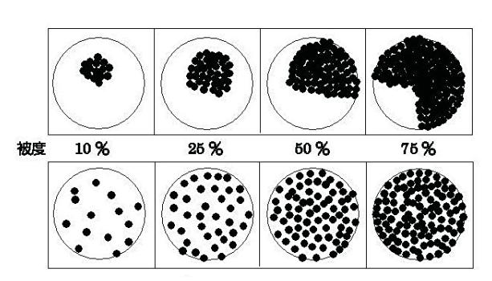

ᅗ㸯 ⿕ᗘ⟬ฟࡢ┠Ᏻ

 ᮏᩥ࡛ᢅࠊࡣࢦࣥࢧ࠺㐀♋ᛶࢦࣥࢧ㢮㸦ሀ࠸㦵 ࠋࡿ࠶࡛㸧⥲⛠ࡢ✀ࡢ≀ື⬊่ࡿࡍ᭷ࢆ⸴〓᱁ ࢟ࢻࣔࢦࣥࢧࢼ⥘ࣟࢻࣄࠊࡣࢀࡇࠊࡕࢃ࡞ࡍ 㢮ࠊⰼ⥘ඵᨺࢦࣥࢧள⥘࢜ࡧࡽ࡞ࢦࣥࢧࢲࢡ ࡘᣢࢆ⸴〓࡛୰ࡢ⥘ளࢦࣥࢧභᨺ⥘ⰼࠊࢦࣥࢧ ࢧࡣ࣮ࣝࣛࢥࢺࣇࢯࠋࡿࡍヱᙜࡀ✀㢮ࢦࣥࢧࢩ ࡢᮏ㢮ࡣྜሙࡿࡍ⏘ከࡀᮏ㢮ࠊࡀ࠸࡞ࡲྵࢦࣥ ⿕ᗘࡶู㏵⟬ฟࠊ࠾࡞ࠋ࠸ࡼࡃ࠾࡚ࡋⓑ࠸࡚ࡋ ⓑࠊࢀධᗘ⿕ࢦࣥࢧࠊࡣࢦࣥࢧࡿ࠸࡚ࡁ⏕ࡶ࡚ ࠋ࠸࡞ࡵྵࡣࢦࣥࢧࡿ࠸࡚ࡋṚஸᚋ

ࠊࡣヲ⣽ࠋ࠺足ࢆᙳ┿ࠊ࡛⠊ᅖ࡞⬟ྍࠊࡓࡲ

㸳㸬⿵㊊㡯յᬒほ⏬ീࢆཧ↷ࠋ࠸ࡓࢀࡉ

ᣦ࡞㔜せࡢࡵࡓࡿࡍホ౯ࢆែ≧ࡢ♋ࢦࣥࢧࡣᗘ ⿕

標である。サンゴ礁域では、海底面がサンゴで被い 尽くされるのが健全な姿であり、そうでない場合は サンゴ群集を攪乱する何らかの要因が存在すると考 えられる。表2に被度から見たサンゴ礁状態の評価 目安を示す。本表から自分の海の現況を認識された い。ただし、高緯度サンゴ群集域ではサンゴ被度が 低く局所的である場合が多く、被度の評価目安は地 域によって異なる。

表2 被度によるサンゴ礁状態の評価目安

| 被度区分                                                            | 対応する 被度(%) (10%刻み)                     | 評価                       |
|-----------------------------------------------------------------|----------------------------------------------|--------------------------|
| 0% 以上 10% 未満 10% 以上 25% 未満 25% 以上 50% 未満 50% 以上 75% 未満 | 0, <5, <10 10, 20 30, 40 50, 60, 70 | 極めて不良 不良 やや不良 良 |
| 75% 以上                                                          | 80, 90, 100                                  | 優良                       |

①-2. サンゴ白化率:白化前まで生存していたと思われるサンゴ全体に占める、白化したサンゴ及び白化により死亡したサンゴの割合で、白化現象が確認された場合に記入する(全体白化率)。死亡したサンゴの割合(全体死亡率)も合わせて記録する。また、サンゴ全体とは別に、白化の影響を受けやすいミドリイシについても同様に白化率(ミドリイシの中化率)及び死亡したサンゴの割合(ミドリイシ死亡率)を記録する。白化率及び死亡率は次式で算出する。

白化率(%) = {(白化により死亡したサンゴ) + (白化したサンゴ)} / {(白化により死亡したサンゴ) + (白化したサンゴ) + (生サンゴ)} × 100

死亡率(%) = (白化により死亡したサンゴ) / {(白化により死亡したサンゴ) + (白化したサンゴ) + (生サンゴ) } ×100

※ ミドリイシのみの白化率及び死亡率の場合は、

上記の式のうち、「サンゴ」を「ミドリイシ」 に置き換えて計算する。

※ ①-1. サンゴ被度では、白化したサンゴ及び生サンゴを被度の対象とし、白化により死亡したサンゴは被度の対象としない。

また、任意の調査として、白化したサンゴを2つの 階級に分けられる場合は、その内訳の割合を記録す る。

- a) 軽度の白化(群体の色が薄くなっている)
- b) 白化(群体色が純白もしくはそれに近い薄い 色)

| 白化の階級      | サンゴの状態      |
|------------|-------------|
| 生サンゴ       | 群体色は変わらず、サン |
|            | ゴは正常に生きている  |
| 白化したサンゴ    | 触手等の軟組織が見え  |
|            | るなどポリプの生存が  |
|            | 確認できるサンゴ    |
| 軽度の白化      | 群体色が薄い      |
| 白化         | 群体色は純白もしくは  |
|            | それに近い薄い色    |
| 白化により死亡したサ | ポリプが死亡して骨格  |
| ンゴ         | だけが残る。触手などの |
|            | 軟組織が見えない、群体 |
|            | 表面に藻類が付着して  |
|            | いることなどから確認  |
|            | できる         |

①-3. 生育型: ソフトコーラルも含めた優占するサンゴの生育型で、以下の6つに分類する。

- I. 枝状ミドリイシ優占型:サンゴに占める枝状ミドリイシ類の割合が60%以上。
- II. 卓状ミドリイシ優占型:指状ミドリイシも含める。サンゴに占める卓状ミドリイシ類の割合が60%以上。
- Ⅲ. 枝状・卓状ミドリイシ混成型:サンゴに占める 枝状、卓状ミドリイシ類の合計の割合が60%以上 (枝状、卓状ミドリイシ類各々の割合は60%未 満)。
- IV. 特定類優占型:サンゴに占める上記以外の種も しくは類の割合が60%以上。優占する具体的な類 名もしくは種名を記入する。

- ࡵ༨ࢦࣥࢧࠊࡋΰᅾࡀ✀ࡢࡃΰᡂᆺ㸸ከ✀Ϭ㸬ከ ࡀ㢮ࡣࡃࡋࡶ✀ඃ༨ࡢᐃ≉ࡢୖ㸣௨ࡀྜࡿ ࠋ࠸࡞
- ࣮ࢥࢺࣇࢯࡧཬࢦࣥࢧඃ༨ᆺ㸸࣮ࣝࣛࢥࢺࣇࢯϭ㸬 ྜࡢ࣮ࣝࣛࢥࢺࣇࢯࡿࡵ༨ᗘ⿕ィྜࡢࣝࣛ ඃ༨࣮ࣝࣛࢥࢺࣇࢯࠊࡋᣦࢆែ≧ࡿ࠶ୖ㸣௨ࡀ ࠋ࠸࡞࠼㉺ࢆ㸣ࡣᗘ⿕ࢦࣥࢧ࡚ࡋ๎ཎࡣ࡛ᆺ ࠊࡣ࣮ࣝࣛࢥࢺࣇࢯඵᨺࢦࣥࢧள⥘᰿⏕┠㸦ࢡ ✀ࡿࡍᒓ┠࢝ࢧࢺ࣑࢘ࡧ㸧ཬࡃ㝖ࢆࢦࣥࢧࢲ ࠊ࡛ࡢ࠸ࡋ㞴ࡣᐃྠࡢᒓ௨ୗࡢᮏ㢮ࠋࡿࡍ⩏ᐃ ࡿࡁ࡛ᢕᥱ☜ṇࠊࡀࡿ࠶࡛せࡣᐃ≉ࡢඃ༨㢮 ሙྜࢆࢀࡑࡣグධ࣮ࣝࣛࢥࢺࣇࢯࠊ࠾࡞ࠋࡿࡍඃ ࢧࠊࡣᗘ⿕ࢦࣥࢧࡿࡵồ࡛ձࠊࡶྜሙࡢ༨ᆺ ࠋ࠸࡞ࡵྵࡣ࣮ࣝࣛࢥࢺࣇࢯࠊࡋ㇟ᑐࢆࢦࣥ

ࠊ㸧㸦࣐ࣁᯞࠊ༟ᯞࠊࢻ࣑༟ࠊࢻ࣑ᯞࡣグධ ࠋࡿࡍ⏝ࢆㄒ␎ࡢࢺࣇࢯࠊ✀ከ

グ≉ࠊࡤࢀ࠶ࡀࡇࡿࡍⱱ⦾ᖜࡀ⸴ᾏࠊࡓࡲ ࠋࡿࡍグ㍕࡚ࡋ㡯

ࣃࡣࡃࡋࡶཎ♋ࡢຍධᗘ㸸ㄪᰝ⠊ᅖෆࢦࣥࢧձ ࠺ࡑከࡀຍධࠊ࡚࠸࠾ὸᡤࡢ࡞㒊ୖࣇ࣮ࣜࢳࢵ ࣜࢻ࣑ࡢᚄ㸮㹼㸳FP┤ࠊࡧ㑅ࢆᡤࣧ㸱࡛ୖᇶ㉁࡞ ࢩᒓ⩌యࡢ㸯੍ᙜࡢࡾࡓຍධᩘࢆグ㘓ࠊࡋࡔࡓࠋࡿࡍ ࡛ᩘᴫ࠺ࡼࡢ㹼ࠊ㹼ࠊࡣྜሙࡢୖಶ௨ ࠋ࠸࡞ࢃᵓ

 㸳FP௨ୗࢩࣜࢻ࣑ࡢᒓ⩌యࠊࡣ㐣ཤ㸲ᖺ௨ෆ ຍධࢩࣜࢻ࣑ࠋࡿࡁ࡛ࡀࡇࡍ࡞ࡳࡢࡶࡓࡋᒓ ᐦ᥋᪩㐜ࡢ㞟ᅇ⩌ࢦࣥࢧࠊࡣከᐻࡢຍධ㔞ࡢ ⬟ྍࡀ ணࡢ㞟ᅇ⩌ࡾࡼຍධᗘࠊࡵࡓࡿࡍ㛵㐃 ࠋࡿ࡞ಶయ੍௨ୖࡢຍධࠊࡤࢀ࠶ࡀᅇഴྥ ࡋᅇࡶ࡚ࡃከࡀຍධ㔞ࠊࡋࡔࡓࠋ࠸ከࡀࡇࡿ࠶ ࠶ࡣ࡛ࡇ࡞ṧᛕࠋࡿࡍせࢆὀពࠊࡾ࠶ࡶྜሙ࠸࡞ ࣑ࡣ࡛ᇦ♋ࢦࣥࢧࡢ᪥ᮏࠊ௨㝆ⓑࡢᖺࠊࡀࡿ ࡉㄆ☜ࡀࡇࡿ࠶ྥῶᑡഴࡀຍධ㔞ࡢᒓࢩࣜࢻ ࣜࢻ࣑ࠊࡣ࡛㞟ᇦ⩌ࢦࣥࢧᗘ⦋㧗ࠊ࠾࡞ࠋࡿ࠸࡚ࢀ ࡌᛂᚲせࠊ࡛ࡢ࡞㔜せࡶຍධࡢࢦࣥࢧࡢ௨እࢩ ࠋ࠸ࡓࢀࡉグ㘓ࡶຍධࡢࢦࣥࢧࡢࡢࡑ࡚

ձᆺ༟≧ࢬࢧࡢࢩࣜࢻ࣑㸸༟≧ࣜࢻ࣑ ᚋ᭱ࠊࡋグධࢆࡉࡁ࡞ࡲࡢయ⩌㸳ୖ㛗ᚄࢩ ࡢࢩࣜࢻ࣑≦ᆺ༟ࠋࡿࡵồࢆ್ᖹᆒࡢࡽࢀࡑ ࢦࣥࢧࠊࡣࢬࢧ⩌㞟ࡢᅇ⤒㐣ࡢࡑࡼ࠾࠾ࡢ┠Ᏻ ࡓぢࡽࢬࢧࢩࣜࢻ࣑≦ᆺ༟㸱⾲ࠋࡿ࡞ ࠊࡣ韭ᮏࠊ࠾࡞ࠋࡍ♧ࢆᖺ㱋ࡢࡑࡼ࠾࠾ࡧᮇཬᅇ ࣜࢻ࣑ࢲࣁࢩࢡࡿࡍᙧᡂࢆయ⩌ᆺࡢࡶࣝࢺ࣮࣓ᩘ ࢻ࣑ࢡࢱ࢚ࣥࡧࡽ࡞ࠊࢩࣜࢻ࣑ࢳࣂࢼࣁࠊࢩ ࠋࡿࢀࡉ⏝㐺࡞ࢩࣜ

⾲㸱 ᆺ༟≧ࢩࣜࢻ࣑ᒓ⩌యࡢ ࡽࢬࢧぢࡓᅇᮇཬࡧᖺ㱋

| FP௨ୖFPᮍ‶  ๓ᮇ |
|--------------|
| FP௨ୖFPᮍ‶ ୰ᮇ  |
| FP௨ୖ  ᚋᮇ  ௨ୖ |
|              |

ձࢹࢺࣄࢽ࢜ಶయᩘ㸸ศ㛫ࡢ⏤⮬㐟Ὃ࡛ほᐹ ほࡢࢹࢺࣄࠋࡿࡍグ㘓ࢆᩘಶయࡢࢹࢺࣄࢽ࢜ࡓࢀࡉ ࡿࡍ⦰▷ࡣࡍ࡞ࢆ㞟ᅋ࡞ࡁࡀࢹࢺࣄࠊࡣ㛫ᐹ ኚ᭦ࠊࡀ࠸࡞ࢃࡲࡶ࡚ࡋኚ᭦࡚ࡌᛂἣ≧ࠊ࡞ ࡓࡋ⟭ᩘಶయࡢࡾࡓ㸯ேᙜࠊศ㛫ࡣྜሙࡓࡋ ࠋࡿࡍฟ⟬࡛ḟᘧࡣ್⟭ศࠋࡿࡍ⏝ࢆ್

### ศ⟬್㸻ほᐹᩘ㸦ほᐹ㛫㸧

 ཎ๎ⓗỈ㠃ࡢࡽほᐹࠊࡋ₯Ỉࡢࢦࣥࢧ࡚ࡋ ࡓࢀࡉほᐹࡀ㣗ࠊࡀ࠸࡞ࡋ᥈⣴ࡣ࡞ഃࡸ㛫㝽 ࡶ࡚ࡗ足ࢆỈ᥈⣴₯ࡵࡓࡢㄆ☜Ꮡᅾࡢࢹࢺࣄࡣྜሙ ศᕸࡀࢹࢺࣄࢽ࢜ࡢ㞟ᇦ⩌ࢦࣥࢧᗘ⦋㧗≉ࠋ࠸ࡼ ࡓࢀࡽぢࡀቑຍࡽࠊࡣ࡛ᆅᇦࡓࡗ࡞࠸࡚ࡋ ࠊࡵࡓࡿ࠶࡛ᚲせࡀὀពࡿࡍᑐ⏕Ⓨࡢᚋࡶ㝿 ≉グ㡯グ㍕ࠋࡿࡍ韭㸲ศ㛫ほᐹᩘᇶࡃ࡙ ࠋࡍ♧ࢆᏳ┠ࡿ▱ࢆែ⏕≧Ⓨࡢࢹࢺࣄ

⾲㸲 ࢹࢺࣄⓎ⏕≧ἣࡢ┠Ᏻ

|  ศほᐹᩘ Ⓨ⏕≧ែ |  |
|---------------|--|
| ㏻ᖖศᕸ          |  |
| ከ࠸㸦せὀព㸧       |  |

 ‽Ⓨ⏕ ௨ୖⓎ⏕

ࢧࡢࢹࢺࣄࡓࡋ⌧㸸ฟࢬࢧඃ༨ࢹࢺࣄࢽ࢜ձ 㔝ࢆ㸧࡛ࡲ4ࡢ⭎ࡢᑐഃࡽ4ࡢ⭎ᚄ㸸┤㸦ࢬ ࡚࠸⏝ࢆFP㸧ࡑࡼ࠾ࡽ࡞ࢬࢧ㸦㸿㸲ᯈᖒ FPᮍ‶ࠊFP௨ୖFPᮍ‶ࠊFP௨ୖࡢ㸱㝵⣭ ศ㢮ࠊࡋඃ༨㸦᭱ࡶከ࠸㸧ࢬࢧ㝵⣭ࢆồࠋࡿࡵほ ᭱ึࠊࡣྜሙࡢࡉࡁ࡞ࠎᵝࡀࢹࢺࣄࢽ࢜ࡓࢀࡉᐹ ࡛୰ࡢࡑࠊࡋグධࢆᩘಶయูࢬࢧࡢಶయࡢ FPࠊࡤ࠼ࡓ㸦ࡿ࡞ࢬࢧඃ༨ࡀ㝵⣭࠸ከࡶ᭱ ௨ୗࡀ㸰ಶయࠊFPࡀ㸱ಶయࠊFP௨ୖࡀ㸴ಶయ ࠋ㸧ࢬࢧඃ༨ࡀୖFP௨ࠊࡽ࡞

ᙺ࡛ୖࡿࡍ᥎ᐃࢆᖺ㱋ࡣࡅศࢬࢧࡢࢹࢺࣄࢽ࢜ ⓗ⯡୍ࠊࡀࡿࡼࡶ௳᮲ Ỉࡸ㣵ࡣࢹࢺࣄࠋࡘ❧ ‶㸰ᖺ࡛FPࢆ㉺࡚࠼ᡂ⇍ࡀጞࠊࡾࡲ㸱ᖺ࡛FP௨ ࡀ⏕Ⓨࠋࡿࡲ㧗ࡶ᭱ࡀṪ㔞⦾ࠊᦤ㣗㔞࡚ࡋ㐩ୖ ࢡࡢࡽࡕࡢୖFP௨FPࡣࡢࡿࡍ㢧ᅾ ࡛ែ≧ศᕸࡢࢹࢺࣄ⛶ࠊ㏆ᖺࠊ࠾࡞ࠋࡿ࠶࡛ࢫࣛ ᩘࠊࡋࡶࠋࡿ࠸࡚ࡗࡲጞࡀࡳ⤌ࡾྲྀࡿࡍ▱ணࢆ⏕Ⓨ ࢳࣥࢭ௨ୗࡢಶయࢆከᩘほᐹࡓࡋሙྜࠊࡣ≉グ ࠋ࠸ࡓࢀࡉグධ㡯ḍ

ࢺࣄࢽ࢜ࡓࡋ⠊ᅖ㸸ほᐹࢬࢧࢹࢺࣄࢽ࢜ձ ࠋࡿ࠶࡛⠊ᅖࢬࢧࡢࢹ

### ձࡢࢹࢺࣄࢽ࢜㣗ᐖ⋡

ࢹࢺࣄࢽ࢜㏆᭱ࡽ᫂ࠊࡿࡍᑐయࢦࣥࢧ 㣗ᐖࡓࢀࡉศࠊࡿ㦵᱁ࡀⓑࡃぢࢦࣥࢧࡿ࠼⩌య ࠋᩘᴫࡢྜࡢ✚そ㠃⿕ࡢ

#### ձࢦࣥࢧ㣗ᕳ㈅ࡢⓎ⏕≧ἣ

ࢲ࢞ࢩࣞࣟࢩࠊࡍࡰཬࢆᐖ⿕㢮ࢩࣜࢻ࣑ ᑠࡢᒓࢩ࣐ࢲ࢞ࢩࣞࣟࢩ⛉࢞࢟ࢡ㢮㸦ࢩ࣐ ᆺᕳ㈅㢮㸧➼ࡢⓎ⏕≧ἣࠊࢆ௨ୗࡢ㝵⣭࡛グධࠋࡿࡍ

ࠋ࠸࡞ࡓ❧┠ࡣ㸧ࡢࡶ࠸ࡋ㸦᪂Ϩ㸸㣗

ࠋᩓぢࡀయ⩌ࡿ࠶ࡢ㣗ᐖ㒊ࡸ㣗࡞ࡉϩ㸸ᑠ

ࠊࡀࡘ❧┠ࡀయ⩌ࡿ࠶ࡢ㣗ᐖ㒊ࠊࡃࡁࡣϪ㸸㣗

ࡽぢࡣ㈅㞟ᅋࡓࡋᐦ㞟ࡿ࡞ࡽୖⓒಶయ௨ᩘ ࠋ࠸࡞ࢀ

 ϫ㸸ᩢṚ⩌యࡀ❧┠ࠊࡕᩘⓒಶయ௨ୖࡿ࡞ࡽᐦ ࠋࡿࢀࡉᩓぢࡀ㈅㞟ᅋࡓࡋ㞟

࠸ࠊࡀࡿ࠶ࡀྜሙ࠸ࡋ㞴ࡀู༊ࡢẼ㣗 ࡃከࡢࡢࡑࡽࡓࢀࡽぢࡀ㈅ࠊ࡚ࡳ࡚ࡋほᐹࡘࡃ ᰿ඖࡢᯞࡢࢦࣥࢧࡣ㣗ᕳ㈅ࢦࣥࢧࠋࡍ࡞ࡳ㣗ࡶ ᚩ≉ࡢ㣗ࡓࡋ࠺ࡑࠊ࡛ࡢࡿ࠶ࡀྥഴࡿࡍ㣗ᐖࡽ ࣞࣟࢩࠊ࠾࡞ࠋࡿࡁ࡛ࡀࡇࡿࡅぢศࡶ࡚ࡗࡼ ྜሙࡓࢀࡽぢࡀ㣗ᐖࡿࡼ㈅ࡢ㢮௨እࢩ࣐ࢲ࢞ࢩ ࠋࡿࡍグධ㡯グ≉ࠊࡣ

ࠊࢩ࣐ࢲ࢞ࢩࣞࣟࢩࡢ㢮ࢩ࣐ࢲ࢞ࢩࣞࣟࢩ ࢩࣞࢽ࣋ࢳࢡࡧࡽ࡞ࢩ࣐ࢲ࢞ࢩࣞࣟࢩ࣓ࣄ ࢧࡓࡋ㢮ఝࢹࢺࣄࢽ࡚࢜ࡋ⏕Ⓨࠊࡣࢩ࣐ࢲ࢞ ᖏᾏ⇕ளࡢᮏᅵ≉ࠊࡾ࠶ࡀࡇࡍࡰཬࢆᐖ⿕ࢦࣥ ᇦ㸦ᐑᓮ᪥༡ࠊᏱᾏࠊ㊊ᦾࠊ୵ᮏ㸧ࡣ࡛㢧ⴭ࠶࡛ ⏕ࡶ࡛ࡇࡣᾏᇦࡿࡍศᕸࡀࢦࣥࢧࡣᮏ㢮ࠋࡿ ᜥࠊࡀࡿࡍୖグ㸱✀ࡣಶయ⩌ᐦᗘࡀୖ᪼ࡿࡍ㞟ᅋ ࡢࡶ༓ಶయᩘࠊࡾ࡞࠺ࡼࡘᣢࢆᛶື⛣ᛶ ࣥࢧࠊࡿࡵጞࢀࡉᙧᡂࡀ㞟ᅋࠋࡿࡍᙧᡂࢆ㞟ᅋ ࠋࡴ㐍galᛴࡣᗘపୗ⿕ࡢࢦ

# ձࢦࣥࢧ㣗ᕳ㈅ࡢ㣗ᐖ⋡

㣗ᕳ㈅ࢦࣥࢧ㏆᭱ࡽ᫂ࠊࡿࡍᑐయࢦࣥࢧ ⩌ࢦࣥࢧࡿ࠼ぢࡃⓑࡀ㦵᱁ࠊࡿศࡓࢀࡉ㣗ᐖ ࠋᩘᴫࡢྜࡢ✚そ㠃⿕ࡢయ

# ձᆺᐃ╔ᛶ㨶㢮

ྡ✀ࠊྜሙࡓࢀࡉᧁ┠ࡀ㨶㢮ࡢୖFP௨㛗 ಶయᩘࢆグධࠋࡿࡍㄪᰝ⪅㛫࡛ಶయᩘࡀETBࡿ࡞ሙྜ ࡣࡢࡿ࡞㇟ᑐࠊ࠾࡞ࠋࡿࡍグධࢆ್ࡢே࠸ከࠊࡣ ࠊࡾ࠶࡛㨶㢮╔ᛶᆺᐃࡢ㢮ࢲࣈࠊ㢮ࣛ࣋ࠊ㢮ࢱࣁ അⓎⓗฟ⌧ᛶࡢ㧗࠸ᅇ㐟ᛶ㨶㢮ࡣ㝖ࠋࡃᆺᐃ╔ᛶ ࠋࡿ࠸࡚ࡗࡓࢆ㏵୍ࡢῶᑡࠊࡳ㐍ࡀ⋓ࡣ㨶㢮

### ղ≀⌮⎔ቃ

ղ⨨㸸ㄪᰝᆅⅬࡢ୰ᚰ㏆ࡢ⦌ᗘ⤒ᗘࢆ\*36 ྜሙ࠸࡞ࡁ࡛㐩฿ᆅⅬ࡛⯪ࠋࡿࡍグධ࡚ࡋ ィ࡛ ᆅⅬ୰ᚰࠊࢀධࢡࢵࣃ㜵Ỉࢆ36\*ࠊࡤࡽ࡞⬟ྍࠊࡣ ᗘ⤒ᗘ⦋ࠊ࠾࡞ࠋࡿࡍ ィࡁ足࡛࠸ὋࢆୖỈ㠃࡛ࡲ  ࡢࡇࡀ36\*ࠋࡿࡍ⏝ࢆ⣔㸧6\*:ᆅ⣔㸦⏺ ୡࡣ ࠺ࡼࡿࡁ࡛⟭࡛ᚋࠊࡣྜሙ࠸࡞࠸࡚ࡋᑐᛂᆅ⣔ ࡣᙧᘧ⾲♧ࠋࡃ࠾࡚ࡋグ㘓ࢆྡᆅ⣔ ࡓࡋ⏝ 㐍ἲ㸦GGrPP͛VV͜㸧ࡶࡾࡼ㐍ἲ㸦GGGGGGGrࠊ ,6\*ࡸୖࢺࣇࢯ⟭ィ⾲ࠋࡿࡍ᥎ዡࢆⅬ௨ୗ㸳᱆㸧ᩘᑠ ౽⡆ࡀ࠸ᢅࡾྲྀࡢᩘ್࡛࡞㸧࣒ࢸࢫࢩሗ⌮㸦ᆅ ࠋࡿ࠶࡛ࡵࡓ࡞

ղᆅᙧ㸸ㄪᰝᆅⅬࡢᆅᙧⓗ⎔ቃࠊࢆ♋ụࠊ㞳♋ࠊ ♋ཎࠊ♋ᩳ㠃ศ㢮ࡿࡍ㸦ᅗ㸰ཧ↷㸧ࠋ㧗⦋ᗘࣥࢧ ࢦ⩌㞟ᇦࠊࡣ࡚࠸࠾ෆ‴ࠊእᾏࠊἈ℩ࡢ༊ศ⛬ᗘ ࠋ࠸ࡼ࡛

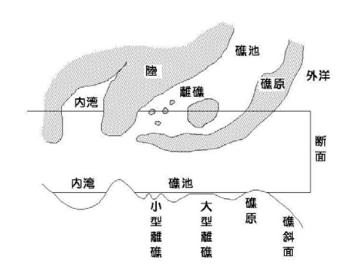

ᅗ㸰 ᶍᘧⓗぢࢦࣥࢧࡓ♋ᆅᙧ

ࠊᒾ㸧ࢦࣥࢧᒾ㸦ࠊࡋ韭ࢆែ≧ࡢᗏ㉁㸸ᾏᗏ㠃ղ ᗏࡢᩘ「ࠋࡿࡍศ㢮࡞Ἶࠊ◁ࠊ㸧♟ࢦࣥࢧ㸦♟ ࠋ࠸ࡼ࡚ࡃ࡞ࡽ⤠ࡘ㸯ࠊࡣྜሙࡿ࠸࡚ࡋΰᅾࡀ㉁ 㡯グ≉ࠊࡣྜሙࡓࢀࡽࡳࡀኚ࡞ࡁᗏ㉁ ࠋࡿࡍグධ࡚ࡋ

ղほᐹ⠊ᅖ㸸ほᐹ⠊ᅖࡣᆅᙧࢦࣥࢧࡸ⩌㞟ࡢᗈ ࡼ࠾࠾ࡢ⠊ᅖࡓࡋほᐹࠋࡿ࡞ETB࡚ࡗࡼ࡞᪉ࡾࡀ グධ࠺ࡼࡢ࡛༢ࣝࢺ࣮࣓ࢆࢬࢧࡢࡑ ࠋࡿࡍ

ղỈ῝⠊ᅖ㸸ほᐹᇦࡢỈ῝⠊ᅖࣝࢺ࣮࣓ࢆ༢ ࠋ࠸ࡼ࡛ ┠ࡣ῝Ỉࠋࡿࡍグධ࠺ࡼࡢ㹼࡛

ղ6366ほ 㸸6366ࡣ㸦&RQWHQWRI6XVSHQGHG

3DUWLFOHVLQ6HD6HGLPHQW㸧ࡢSSㄒࠊ࡛ᗏ㉁୰ᠱ⃮ ≀㉁ྵ᭷㔞ࢆពࠊࡋἈ⦖┴⾨⏕⎔ቃ◊✲ᡤ㉥ᅵ◊ ᡭࡓࡋ⪄࡛ⓗ┠ࡿࡍ᥎ᐃࢆᗘ⛬ࡢ㉥ᅵởᰁࡀᐊ✲ ࠾ᮏᅵࠋࡿࡍᐃ ࡚࠸⏝ࢆࠖᐃἲ᫆ ⡆6366ࠕἲ ࠊࡀ࠸࡞ᑡࡣ㉥ᅵởᰁ࡞้῝࡞࠺ࡼࡢ⦕Ἀࠊࡣ࡚࠸ Ἑᕝࡸ㝣ᇦࡽὶධࡓࡋᅵ◁ởᰁࡸ㣴Ṫሙࡽ࡞ ࡢ᭷ᶵ≀ởᰁࡢᢕᥱ㐺⏝ྍ⬟ࠊࡋࡔࡓࠋࡿ࠶࡛㜈 ⫱⏕ࡢࢦࣥࢧ್ᐃ ࠊࡾ࠶ࡀᛶ⬟ྍࡿ࡞ETBࡀ್ ࣥࢧࠊࡓࡲࠋࡿ࠶࡛ᚲせࡀὀពࠊࡣ࡚࠸ࡘᙳ㡪ࡢ 6366ࠊࡎࡽࢃ㞟ᇦ⩌ࢦࣥࢧᗘ⦋㧗ࠊᇦ♋ࢦ ᚲࠊࡽࡇࡿࢀࡲྵࡶ㉁≀⃮ᠱ࠸࡞࡛※㉥ᅵ㉳ࡣ ࡉ᥎ዡࡶࡇࡿࡍグ㍕ࢆἣ≧ࡿࡼど┠࡚ࡌᛂせ ࠋࡿࢀ

6366⡆᫆ ᐃἲࡢᇶᮏⓗ࡞ ᐃᡭ㡰ࢆ௨ୗ♧ ࠋࡍ

- 㸸ㄪᰝᆅⅬࢆ௦⾲ࡿࡍᛮࡿࢀࢃᗏ◁ሁ✚ᇦࢆ௵ព ◁ᒙᗏ⾲ᮼ୍ჾᐜࡢࡁࡢPOࠊࡋ㑅ᢥ࡛ ࢆ≀ྲྀ᥇ࡢྡㄪᰝဨ㸰࡛ୖ⯪ࠊࡾᡠ⯪࡚ࢀධࢆ ࠋࡿᖐࡕᣢ࡚ࡵࡲჾᐜࢡࢵࢳࢫࣛࣉࡢࡘ㸯
- ࡩࡢ┠㸲PPࠊࡾษࢆࡳୖ㟼࡚ࡋ⨨㟼ࢆ◁㸸ᗏ ࡋᢾ᧠࡛ෆ─ࡅཷࢆࡢࡶࡓࡗ᥇ࡋࡇࠊࡋࡇ࡛࠸ࡿ ࠋࡿࡍᐃヨᩱ ࡚
- 㸸ヨᩱPOࢆィ㔞࣮ࣥࣉࢫ㸦Ἶࡀከ࠸ሙྜࡣ㸰POࡢ ࣎ࢺࢵ࣌POࠊࡾྲྀࡾ㔞࡛㸧ࡿ࠸⏝ࢆ࣮ࣥࣉࢫ ࡽࡉࠊࢀධࡋὶ࡛Ỉ㸧ࣝࢺ࣎㣧ᩱࡢ㸦ᕷ㈍ࣝࢺ ࡋ⃭࡚ࡋࢆࠊࡋࣉࢵࢫ࣓PO࡛Ỉ㐨Ỉ ࠋࡿࡃ
- ࠋࡿࡍỈ᳨ࢆỈᒙࡢᚋࡢࡑࠊࡋ⨨㸸㸯ศ㛫㟼
- 㸸᳨ỈࢆFP㏱どᗘィධ࡚ࢀ㏱どᗘࢆィ ࡿࡍ ࡣྜሙࡢ‵‵㸳FPᮍࡣࡃࡋࡶࠊୖFP௨ࡀ㸦㏱どᗘ ࠋᚲせ㸧ࡀᩚㄪ
- ࠋࡿࡍฟ⟬ࢆ6366࡚࠸⏝ࢆ㸸ḟᘧ

### 6366 ㏱どᗘ᳨Ỉᕼ㔘ಸ⋡ヨᩱ㔞

ࢀ័ࠊ࡛ศ⣙ࡁ㸯ヨᩱࡣ㛫ࡿࡍせᐃ   ࡤࢀ㸳ศ⛬ᗘࠋࡿ࠶࡛㏱どᗘィࡢ࡛ィ ࡣ࡛ヨᩱ㔞 ᗏࠗࡎᚲࠊࡃከࡀྜሙ࡞ᚲせࡀᩚㄪᕼ㔘㔞ࡢỈ᳨ࡸ ㉁୰ᠱ⃮≀㉁ྵ㔞⡆᫆ ᐃἲ㸦6366 ᐃἲ㸧࠘ࢆཧ ↷࠸ࡓࡁࡔࡓ࠸㸦Ἀ⦖┴⾨⏕⎔ቃ◊✲ᡤ࣮࣒࣮࣌࣍ ࢪKWWSZZZHLNDQNHQRNLQDZDMSLQGH[KWPࠊࡾࡼ ࠕᥖ㍕ሗࠖࠕࡢỈ⎔ቃࠖࠕࡽࢪ࣮࣌㉥ᅵởᰁࡢ ㄪᰝࡢ➼㉥ᅵࡓࡋ✚ሁᾏࠕࠊࡋື⛣ࢪ࣮࣌ࠖヰ ࠋグ㏙㸧୰ࡢࢪ࣮࣌ࠖ᪉ἲ

ࢆ㝵⣭ࡢែ≧ᗏ㉁ࡓࡋᑐᛂࢀࡑࠊ6366್㸳 ⾲ ㉥ࡿࡼேⅭⓗせᅉࡽ᫂ࡽ࡞ୖ㝵⣭㸴௨ࠋࡍ♧ 㞵ᮇࡣ್ࡢ6366ࠊ࠾࡞ࠋࡿࢀࡉ࡞ぢែ≧ᅵởᰁ Ꮨ⠇㢼ᮇࡢࡸ㢼ᮇྎࡿࢀࡉᢾ᧠ࡃࡼࡀ◁ᗏࠊࡃከ ᐇࡣ࡛ㄪᰝࡢᖺ㸯ᅇࠊࡾ࠶ࡀᛶᏘ⠇࠺࠸࠸࡞ᑡ ែゎ᫂ࡣ㞴ࠊࡓࡲࠋ࠸ࡋ⣲₯ࡢ࡛ࡾᗏ◁᥇㞟ࡣ῝ᡤ 㸦㸳㹫௨῝㸧ࡣ࡛㞴ࠊࡵࡓ࠸ࡋ῝ᡤࣂ࣮ࣗ࢟ࢫࡣ࡛ ⏝ࢆἲࢡࢵ࢙ࢳࢺࢵ࣏ࢫࠊ࡚ࡗᚑࠋࡿࢀࡉᚲせࡀ ࠶࡛ᅔ㞴ࡀᢕᥱࡢ㉥ᅵởᰁࠊࡣ࡛ㄪᰝࡢᖺ㸯ᅇࡓ࠸ ࠊࡀࡿㄪᰝࡢᗏ㉁⎔ቃࡢᣦᶆࡣ࡚ࡋ㔜せ࡞ሗ ࠊᵝྠຍධᗘࢦࣥࢧࡶ┠ᮏ㡯ࠊ࡛ࡇࡑࠋࡿ࡞ ㄪᰝ⪅ࡢᚲせ㸦ᅵ◁ởᰁࡸ᭷ᶵ≀ởᰁࡢᠱᛕࡿ࠶ࡀ㸧 ࠋ࠸ࡓࢀࡉᐇ࡚ࡌᛂ

⾲㸳 6366ィ ್ࡢࡑࢡࣥࣛࡢ┠ど≧ἣ

|   | 㝵⣭ 㸦NJ㹫㸧 | 6366  6366 ᐃ್   ┠ど≧ἣ      |
|---|----------|---------------------------|
|   | ௨ୖᮍ‶     |                           |
| 㸯 |          | ࡚ࡵࢃࡁ ࠸ࢀࡁ               |
| 㸰 |          | ◁ ΰࡁ࠿ࢆ ࢩࡶ࡚ࡐ ࡢࢺࣝ  |
|   |          | ⯙ ࡾࡀୖ࠸ ࡋㄆ☜ࡣ ࠸ࡽ࡙  |
| 㸱 |  ◁    | ΰࡁ࠿ࢆ ࢩ࡜ࡿࡐ ࡢࢺࣝ       |
|   |          | ࡀୖ࠸⯙ ㄆ☜ࡣࡾ ࡿࡁ࡛       |
| 㸲 |          | ぢ ࡣ࡛┠ࡓ ࡞ࡽ࠿ศ ◁ࠊࡀ࠸ |
|   |          | ࢆ ࡐΰࡁ࠿ ࣝࢩ࡜ࡿ ࡀỈ࡛ࢺ |
|   |          | ࡿ⃮                        |
|   | 㸳Dὀព     | ࡚ࡋぢ ࠊ࡜ࡿ韭ᒙ ࣝࢩ࡟       |
|   |          | ࢺ ࡀ✚ሁࡢ ࡁ࡛ㄆ☜ ࡁ⏕ࠋࡿ |
|   |          | ࡁ⏕ ࢧࡓࡋ࡜ ♋⏕ࢦࣥ ࡢែ⣔ |
|   |          | 㝈ୖ ࢡࣥࣛ                 |
|   | 㸳Eᗏ㉁⾲ᒙ   | ࣜࢥ࣍࡟≦ࡢ⣔ᢪࡃ                 |
|   |          | ≀㉁ ࠿ࡀ ࠋࡿࡉࡪ ㏱᫂ᗘࡀᝏ |
|   |          | ࡃ ࣥࢧࡾ࡞ ࡟ᗘ⿕ࢦ ࡀᝏᙳ㡪 |
|   |          | ฟጞ ࡿࡵ                  |
|   | 㸴୍ぢ      | ࡚ࡋ ࡢࢺࣝࢩ ሁ✚ࢆ☜ㄆ       |
| 㸵 |          | ࢩ ሁࡀࢺࣝ ࡀࡿࡍ✚ ◁ࡔࡲࠊ |
|   |          | ࡍㄆ☜ࡶ ࡀ࡜ࡇࡿ ࡿࡁ࡛       |
|   |          | 㸶㸺ᗏ㉁ࡢぢࡓ┠ࡣἾ ࡢࡶࡢࡑ        |

ࠊࡎࡏู༊ࡣ㸳Eࡧ㸳Dཬࠊྜሙࡿࡍᐃ ࡛ど ┠ͤ ࠋࡿࡍ㸳

ղ㐃⥆Ỉ ほ 㸸㐃⥆ⓗ࡞Ỉ ほ ࠊࡣᑠᆺỈ ࠋ࠺足࡚ࡋᅛᐃᾏᗏࡣࡃࡋࡶᾏ୰ࢆ࣮࢞ࣟࢱ࣮ࢹ ᚲせࡀࣂ࣮ࣗ࢟ࢫࡣᅇࡸ⨨タࡢ࣮࢞ࣟࢱ࣮ࢹ ࠋࡿ࡞

### ࣭ᶆ‽ᵝ

 ィ ⠊ᅖ㹼Υࠊ⢭ᗘsΥࠊศゎ⬟ᖖ ࡛ΥࢺࣇࣜࢻࠊΥᖺ௨ෆࠊᛂ⟅㏿ᗘỈ୰࡛ ศ௨ෆࠊ㛫⢭ᗘ⣙s㸯ศ᭶࣮ࣜࢸࢵࣂࠊᑑ 㸴ᖺ㸯㛫ࡢ࡛ࣝࣂ࣮ࢱࣥィ ࠊグ㘓ࢱ࣮ࢹᩘ Ⅼ௨ୖࠊ⪏ᅽỈ῝P௨῝ࣝࣂ࣮ࢱࣥࠊ㸯 ࠋ⬟ྍタᐃ࡛㛫

### ࣮࣭࢞ࣟ

 ᮏయ㸸+2%2:DWHU7HPS3URY8㸦FP㸧 ⪏ࠊᖺ㟁ụᑑࠊ࣮࢞ࣟࢱ࣮ࢹ ᆺỈ࣮ࢲࣥࣜࢩࡢ ᅽỈ῝P

࣮ࢹ⥺㸦㉥እ7:'8㸸ࣝࢺࣕࢩࣇ࣮ࣝࣉ࣮ࢱ࢛࢘ ࣃ࡚ࡗྲྀࡳㄞࢆࢱ࣮ࢹࡽᮏయࠊ࡛⨨ࡾྲྀࡳㄞࢱ 㸧ࡿࡍ㌿㏦ࣥࢥࢯ

ᑓ⏝ࢺࣇࢯ㸸+2%2ZDUH3UR㸦ᮏࢆࢺࣇࢯ⏝࡚࠸ ࢘ࠋ⬟ྍࡶฟຊࡢࣝࢭࢡ࢚ࠋࡿࡍ⌮ฎࢆࢱ࣮ࢹ 㸧ࡿ࠶ࡀ∧ࢡࢵ࣐ࠊ∧ࢬ࢘ࢻࣥ

### ࣭ᶆ‽ほ タᐃࢱ࣮ࢹᅇ

࣮ࢹ࡚ࡋᅇࢆᮏయࡈ㸯ᖺࠋ㛫㛫㝸ࡣグ㘓 ᚋᅇࢱ࣮ࢹࠋࡿࡍಟṇࢆィㄗᕪࡾྲྀࡳㄞࡢࢱ ࠊࡋ⨨タࢆ࣮࢞ࣟࡢணഛࠊࡿࡍ⨨タࢆ࣮࢞ࣟࡢ Ỉ グ㘓ࢆ㛤ጞࠋࡿࡍ

### ࣭タ⨨ሙᡤ

ࠊᆅⅬࡿ࡞韭௦ࡢㄪᰝᆅⅬࡢෆࢺࢧࡣ⨨タ ࢁࡇ࠸ࡋ⃭ࡢኚ Ỉ࠸ࡍࡸࡅཷࢆᙳ㡪ࡢⓑ ࠋࡿࡍᡤࣧ㸰ࡢ

ࠊ࡚ࡋせᅉⓗᨩ≀⌮࡞ࡁ≉ࡢ≀⏕♋ࢦࣥࢧ ⪅ᚋࠋࡿࢀࡽࡆᣲࡀࡘ㸰ࡢ ᖖỈ␗✚ሁࡢࢺࣝࢩ ྜሙࡿࡵࡋࡽ⮳Ṛ࡚ࡋㄏⓎࢆ㇟⌧ⓑࡢࢦࣥࢧࡣ ㇟⌧ⓑࡿࡼ ᖖ㧗Ỉ␗ኟᏘࠊ㏆ᖺ≉ࠋ࠸ከࡀ ࢺࢡࣃࣥ࡞ࡁ㞟⩌ࢦࣥࢧࠊࡾ࠶ྥከⓎഴࡀ 㛵㐃ࡢᬮ⌫ ᆅࡣ᪼ୖ Ỉࠋࡿ࠸࡚ࡅ⥆࠼ࢆ

 Ỉࡣ࡛ᇦ♋ࢦࣥࢧࡢᅜෆࠊࡾ࠾࡚ࢀࡉὀどࡶࡽ ࠋࡿ࠶ࡘࡘࢀࡉഛᩚࡀ⥙ ほࡢቃ⎔

### ճ≉グ㡯

ճࢦࣥࢧࡢᨩせᅉ㸸ࢦࣥࢧ⩌㞟ᨩࡀほᐹ ⓑࠋࡿࡍグධ⏤⮬ࢆᐖ㔞⿕ࡸせᅉࠊྜሙࡓࢀࡉ ࡞✚ሁࢺࣝࢩࠊ㣗ᕳ㈅ࢦࣥࢧࠊࢹࢺࣄࢽ࢜ࠊ㇟⌧ ࡢࡢࡑࠊ࡞ࢮ࢞ࣥ࢞ࡸࢽ࢘࢞ࢼࠊἣ≧㊊⿵ࡢ ࠊᐖ⿕ேⅭࡢ࡞࣮࢝ࣥࡸỈࠊᐖ⿕ࡿࡼ≀⏕ ྎ㢼⿕ᐖࢀࡇࡀ࡞ヱᙜࠋࡿࡍ

ࡀ㇟⌧ࡸ≀⏕ࡁࡍグ≉㸸⏕≀ࠊ㇟⌧࡞ETB≉ճ ࡢ✀ᕼᑡࠊ༸⏘ࡢ≀⏕ࠋࡿࡍグ㘓ྜሙࡓࢀࡉほᐹ ࠋ⬟ྍ⏝ࡶ࡚ࡋ࣓ࣔಶேࠊ࡞ᧁ┠

ճ㸬Ẽ㸸ู⣬ࡢ㈨ᩱࢆཧ⪃ࠊྛㄪᰝᆅⅬෆ࡛ ࣒࣮ࠖࣟࢻࣥࢩࢺ࣡࣍ࠕࡧཬࠖ㯮ᖏࠕࡸࠖ(19)⭘ࠕ ሙࡓࡋほᐹࢆయ⩌ࡘᣢࢆ≦ࡢẼᵝࡢࢦࣥࢧ➼ ࢧᗘ㸦⛬ࡢ⨶ࡿࡅ࠾ㄪᰝᆅⅬ㢮✀ࡢࡑࠊࡣྜ ࢦࣥ⩌㞟యᑐࡿࡍྜ➼㸧ࢆ≉グ㡯グ㘓ࡍ ࠋࡿ

#### 㸳㸬⿵㊊㡯

### ձㄪᰝᆅⅬࡢ㑅ฟ

 ௨ୗࡢᇶ‽ࢆཧ⪃ࠋ࠸ࡓࢀࡉ\$㸧᪤Ꮡ㈨ᩱࡸほᐹ ሗᇶࠊࡁ࡙㧗ᐦᗘࢦࣥࢧ࡞⩌㞟ࡸ㈗㔜࡞⩌ⴠ㸦⩌ య㸧ࡿ࠶ࡀሙᡤࠊ%㸧ࡓࡗ࠶࡚ࡘࡀࢀࡑࡣࡃࡋࡶሙ 韭බࠊࢀࡽ࠸⏝࡚ࡋㄪᰝᆅⅬ♋ࢦࣥࢧࡢ㸧&ࠊᡤ 㸧'ࠊሙᡤࡿ࠶ࡀ᪤Ꮡ㈨ᩱ࡞⬟ྍ⏝ࡣࡃࡋࡶࠊࡓࢀࡉ ୖ㏙࡞࠺ࡼࡓࡋሗࡀᚓࠊࡶࡃ࡞࠸࡚ࢀࡽ㛗ᮇ⥅ ࡣࢢࣥࣜࢱࢽࣔࠊ࠾࡞ࠋሙᡤࡿ࠶ࡀ᰿ᣐ࡞ᚲせࡀ⥆ ♋ࢦࣥࢧ࡞ⓗ⥅⥆㛗ᮇࠊࡃ࡞ࡣ࡛៏⮬ࢦࣥࢧࡢᆅᇦ ࢀࡉタᐃࢆᆅⅬࠊ࡚࠸࠾ᛕ㢌ࢆࡇࡿ࠶࡛ど┘ࡢ ẖᖺࠊ࡛ࡢ࡞㔜せࡀࡇࡿࡍ ほ⥅⥆ࠊࡓࡲࠋ࠸ࡓ ࡋࡲᮃࡀᩘᆅⅬࠊሙᡤ࠸࡞ࡢ⌮↓࠺ࡼࡿ࠼足ࡎᚲ ࡼ࠾ࠊࡣᏳ┠ࡢᩘᆅⅬ⠊ᅖࡿࡁ࡛ᐇ㸯᪥ࠋ࠸ ࠋࡿ࠶࡛ᆅⅬ௨ෆ㸳NPᅄ᪉ࡑ

### ղㄪᰝᑐ㇟ᇦ

 \*36タᐃᆅⅬࢆ୰ᚰࡓࡋศ㛫ࡢ㐟Ὃྍ⬟⠊ᅖ ෆࡀㄪᰝᑐ㇟ᇦࠋࡿ࠶࡛ṇ᪉ᙧྲྀࡑࡼ࠾ࡿ㹫 ᅄ᪉ࠊࡀࡿ࡞ᑐ㇟ᇦࡢ⠊ᅖᙧ≧ࡣᆅᙧ࡚ࡗࡼETB ㄪࠊࡓࡲࠋ࠸ࡼ࡚ࡃ࡞ࡽࢃࡔࡇṇ᪉ᙧࠊ࡛ࡢࡿ࡞ ࡶࠊⴠ⩌ࠊయ⩌ࡢព㸧௵ࡣࡉᐃ⠊ᅖ㸦ᗈ≉ࢆ㇟ᰝᑐ ࠶ୖᆅ◁ࠊࡤ࠼㸦࠸ࡼࡶ࡚ࡋタᐃ㞟⩌ࡣࡃࡋ ࢻ࣑ᯞࡢᐃ⠊ᅖ≉ࡿࡍ⫱⏕ୖ♟◁ࡸ♋㞳ࡢᐃ≉ࡿ ࡀᗈࡢࡑࡼ࠾࠾ࠊࡣྜሙࡢࡑࠊࡋࡔࡓࠋ㸧࡞ⴠ⩌ ࠊࡶ࡚ࡋࢀࡎ࠸ࠋࡿࡍẖᖺグ㘓ࢆἣ≧ࡢ࿘ᅖࡸࡾ ࡿᚓࢆࢱ࣮ࢹ࠸㧗ࡢᛶಙ㢗࡛ୖࡿࡍᢕᥱࢆᖺኚ⤒ ࡿ࠶࡛ቃ⎔࡞ᵝ୍ࡅࡔࡿࡁ࡛ࡀㄪᰝᇦෆࠊࡣࡵࡓ 㔜せࡀࡇࡿࡍほᐹࢆ⠊ᅖྠ୍ࡎẖᖺᚲࠊࡇ ࠋࡿ࡞

### ճㄪᰝᮇ

ࢆ㇟⌧ⓑࡢࢦࣥࢧࡿ࠸࡚ࢀࡉၥ㢟ど≉ࠊ㏆ᖺ ᥎ዡࢆࡇ࠺足᭶㸧Ꮨ㸦㸷⛅ࠊࡵࡓࡿ࠼ࡽ ࡲ࡚ࡋタᐃᏘࡢ௨እࢀࡇ࡚ࡌᛂⓗ┠ࠋࡿࡍ ࡢࡿ࠶࡛㔜せࡀࡇࡿࡍᢕᥱࢆᖺኚ⤒ࠊࡀ࠸࡞ࢃ ࠋࡿ࠶ࡀᚲせ࠺足࡚ࡋᅛᐃࡎᚲࡣᮇࠊ࡛

ࡿࡼ పỈࡢࠊࡣ࡛㞟ᇦ⩌ࢦࣥࢧᗘ⦋㧗≉ ࠊࡣྜሙࡓࢀࡉほᐹࡀⓑࠋ࠸ࡁࡀᐖ⿕ࡢⓑ ࠋࡿࡍグධḍ⪃ഛࡢḟᖺᗘㄪᰝࢆሗࡢࡑ

#### մほᐹ㛫

 ࢦࣥࢧ⩌㞟ࡢほᐹ㛫ࠊࡣほᐹ⠊ᅖࡸసᴗ㏿ᗘ ࡲࠊࡶ࡚ࡗ࠶࡛ୖศ௨ࠊ࡛ࡢࡿࡃ࡚ࡗ࡞ETB࡚ࡗࡼ ࢽ࢜ࠊࡋࡔࡓࠋ࠸࡞ࢃࡲࡶ࡚ࡗ࠶࡛௨ୗࢀࡑࠊࡓ ࢹࢺࣄ᥈⣴㛫ࡣศࡀཎ๎ࢹࢺࣄࠊ࡛ࡢࡿ࡞᥈ ⣴㛫ࢆ⦰▷ࡾࡓࡋᘏ㛗ࡓࡋሙྜࠊࡣᚲࡎศ⟬ ࠋࡿࡍグධ࡚ࡋฟ⟬ࢆ್

### յᬒほ⏬ീ

ࠊࡾ࠶࡛ࢱ࣮ࢹ࡞㔜せ࡛ୖࡿࡍㄆ㆑ࢆᴫἣࡣീ ⏬ ᅛᐃⅬ㸦ྠ୍ሙᡤࠊྠ୍᪉ྥ㸧ࢆタ࡚ࡅᙳ࠾࡚ࡋ ᑐᛂ࡛⠊ᅖ࡞⬟ྍࠊ࡛ࡢࡿࡲ㧗ࡀᛶ⏝᭷ࡽࡉࡃ 㸯ࡽ࡞ⴠ⩌ࠊᆅᙧ࡞ᚩⓗ≉ࡣᅛᐃⅬࠋ࠸ࡓࢀࡉ Ⅼࢆ㑅ฟࠊࡀ࠸ࡼࡤࢀࡁ࡛ึᅇᙳ⏬ീࢳ࢘ࣃࢆຍ ࠊࡓࡲࠋ࠸ࡍࡸ࠸足ࡀᙳࠊࡿࡍᣢཧࢆࡢࡶࡓࡋᕤ ࢆᙳࡢⴠ⩌ࡓࡅཷࢆᐖ⿕ࡸ┿ࡢᬒほ࠸ࡼ࡛ព௵ ',࣭ྡㄪᰝᆅⅬࠊᙳ᪥⪅ᙳࠊࡣീ⏬ࠋ࠺足 ㄪࠊࡅࢆྡࢲࣝ࣍ࡣཪྡࣝࣇ࠺ࡼࡿศࡀ ࡶࢺ࣮ࢩࢡࢵ࢙ࢳ⠊ᅖ⏝ࡢ≀సⴭࡸࢱ࣮ࢹᰝ ࠋࡿࡍ㏦ᒁົ

### ⏝ࡢࣂ࣮ࣗ࢟ࢫն

ࡇ࠺足࡛ࢢࣥࣜࢣ࣮ࣀࢫࡣἲࢡࢵ࢙ࢳࢺࢵ࣏ࢫ ࢆཎ๎ࠊࡀࡿ࠸࡚ࡋỈ῝㹫ࢆ㉺ࡿ࠼῝ᡤࠊࡸ㏱ ࡛ほᐹ༑ศ࡛ࢢࣥࣜࢣ࣮ࣀࢫࡣ࡛ᾏᇦ࠸ᝏࡀどᗘ ࡚ࡋ⏝ࢆࣂ࣮ࣗ࢟ࢫࡣࡢࡑࠋࡿ࠶ࡀྜሙ࠸࡞ࡁ ࣂ࣮ࣗ࢟ࢫࠊࡋࡔࡓࠋ࠸࡞ࢃࡲࡶ࡚ࡗ足ࢆㄪᰝ ࠊ࡛ࡢࡿࢀࡉほᐹࡶࢦࣥࢧࡢ㠃┤㖄ࠊྜሙࡢほᐹࡿࡼ ࠋࡿ࡞≼/そ⿕ࡿࡍᑐ✚㠃⾲ࡢᇶ㉁ࡣᗘ⿕ࢦࣥࢧ ࡼࡿศࡀࡓ࠸⏝ࢆᡭẁࡢࡣ㔝ᖒࠊࡵࡓࡢࡑ ࡍ⏝ࢆࣂ࣮ࣗ࢟ࢫࠊࡓࡲࠋࡿ࠶࡚ࡅタࢆグධḍ࠺ ࠋࡿ࠶࡛ᚲせࡀ㈨᱁ࡢỈኈ₯ࠊࡣྜሙࡿ

### շࢡࢵ࢙ࢳࢺࢵ࣏ࢫἲ࡛⟭ฟࡓࡋ龠ᗘࡢಙ㢗ᛶ

࠸ど┠ࠊࡣฟ⟬ࡢᗘ⿕ࡢ࡛ἲࢡࢵ࢙ࢳࢺࢵ࣏ࢫ ࣮ࣛࢻࢥᐈほⓗᡭἲ㸦ࠊࡵࡓࡿ㢗ㄆ㆑࡞ほⓗ࠺ ࢹࠊࡿẚ㸧࡞ἲࢺࢡࢮࣥࣛࢺࣥࣛࡸἲࢺ ᭱ࡀ್࡚ࡗࡼேࠊࡓࡲࠊࡾຎࡸࡸࡣ⢭ᗘࡢࢱ࣮ ᕪࡢࡇࠊࡋࡔࡓࠋࡿ࠶ࡀࡇࡿࡌ⏕ࢆᕪࡢ㸣s࡛ ࡢᩘ「ࠊࡓࡲࠊ࡚ࡗࡼࡇࡴ✚ࢆࢢࣥࢽ࣮ࣞࢺࡣ ࢆᖜࡢ೫ᕪࠊ࡚ࡗࡼࡇࡿࡍᖹᆒࢆ್ࡢ⪅ㄪᰝ ࠋࡿࡁ࡛ࡀࡇࡿ࠼ᢚ

 ▼す♋†ෆࡢ「ᩘᆅⅬࠊ࡚࠸࠾ྠ୍᪥ᐇࡋ ᐈほⓗᡭ࠸㧗ࡢ⢭ᗘࠊἲㄪᰝࢡࢵ࢙ࢳࢺࢵ࣏ࢫࡓ ࡢᗘ⿕ࡿࡅ࠾ἲㄪᰝࢺࢡࢮࣥࣛࢺࣥࣛࡿ࠶࡛ἲ 㔜ࡀㄪᰝ⠊ᅖࡢ࠸ࠊࢁࡇࡓࡋẚ㍑ࢆ㐪┦ ࡣᗘᕪ⿕ࡢ୧ㄪᰝ㛫ࠊࡣ࡚࠸࠾㸴ᆅⅬࡓࡋ「 㹼㸣ࠊᖹᆒ㸣ࠊ࡛୧ㄪᰝ⤖ᯝࡽồࡓࡵ୍ḟ ᅇᖐᘧࡣ㧗࠸┦㛵㛵ಀࡀㄆࡓࢀࡽࡵ㸦U S㸧ࠋᚑࢡࢵ࢙ࢳࢺࢵ࣏ࢫࠊ࡚ࡗἲࠊࡣᐈほⓗ ࡞ຠ᭷ࠊࡃ࡞ࡣࡇࡿຎ≉ࡀᛶಙ㢗࡚ẚᡭἲ ࠋࡿࢀࡉホ౯ࡿ࠶࡛ᐃ㔞ᡭἲࡢ㞟⩌ࢦࣥࢧ

࡚ࡗࡼሙᡤࠊࡃ࡞ࡣ࡛ᵝ୍ࡣศᕸࡢ㞟⩌ࢦࣥࢧ ↛ᙜࠊࡤࢀ࡞ETBࡀほᐹ⠊ᅖࠊࡾ࠶ࡀᐦࡣ㞟㔞⩌ ࡢᗘ⿕ࠊࡵࡓࡢࡑࠋࡿࡌ⏕ࡣᕪࡶᯝ⤖ᗘ⿕ࡽࡀ࡞ ࡴࡶࡾࡼ⢭ᗘࡢᡭἲࠊࡣྜሙࡿࡍẚ㍑ࢆᖺኚ⤒ 㔜せ࡛ୖࡢಙ㢗ࡢࢱ࣮ࢹࠊࡀᛶ୍⤫ࡢㄪᰝ⠊ᅖࢁࡋ ࠋࡿࢀࡽ࠼⪄ࡿ࠶࡛

### ࡁࡀ࠶㸴㸬

 ᮏࠊࡣࣝࣗࢽ࣐㔝ᮧᜨ୍Ặ㸦୵ᮏᾏ୰බᅬࣥࢭ ࣮ࢱ㸧ࡀసᡂࠊࢆࡢࡶࡓࡋᖹᡂᖺ㸦㸧ᖺᗘ ࡽ㛤ጞࠕࡓࢀࡉ㔜せ⏕ែ⣔┘どᆅᇦࢢࣥࣜࢱࢽࣔ᥎ 㐍ᴗ㸦ࢦࣥࢧ♋ㄪᰝ㸧ࠖ㸦ࢺࢧࢢࣥࣜࢱࢽࣔ ࠋࡿ࠶࡛ࡢࡶࡓࡋಟṇࠊࡵࡓࡿࡏࡉ⏝㐺㸧

### ᭦᪂ᒚṔ

ᖹᡂ㸦㸧ᖺ㸵᭶ ➨㸯∧ ᖹᡂ㸦㸧ᖺ㸵᭶ ➨㸰∧

- ղ㸬㐃⥆Ỉ ほ ࡢಟṇ
- ճࢦࣥࢧࡢᨩせᅉࡢಟṇ
- ճ㸬Ẽࡢ㏣グ

ᖹᡂ㸦㸧ᖺ㸰᭶ ➨㸱∧

ձ㸬ࢦࣥࢧຍධᗘࡢಟṇ

ᖹᡂ㸦㸧ᖺ㸶᭶ ➨㸲∧

- ձ㸬ࢦࣥࢧ龠ᗘࡢィ⟬ᘧࡢ㏣グ
- ձ㸬ࢦࣥࢧⓑ⋡ィ⟬ᘧࡢ㏣グ
- ձ⏕⫱ᆺࡢಟṇ
- ձࢦࣥࢧຍධᗘࡢಟṇ
- ձࢹࢺࣄࢽ࢜ಶయᩘࡢಟṇ
- ձࢦࣥࢧ㣗ᕳ㈅ࡢⓎ⏕≧ἣࡢಟṇ
- ղ⨨ࡢಟṇ
- ղᗏ㉁ࡢಟṇ
- ղほᐹ⠊ᅖࡢಟṇ
- ղỈ῝⠊ᅖࡢಟṇ
- ղ6366ほ ࡢಟṇ
- ղ㐃⥆Ỉ ほ ࡢᵝࡢ㏣グ
- 㸳㸬⿵㊊㡯յᬒほ⏬ീࡢ㏣グ
- 㸳㸬⿵㊊㡯նࡢࣂ࣮ࣗ࢟ࢫ⏝ࡢ₯Ỉ㈨᱁㏣グ ࠋಟṇࡢ➼ゝᩥࠊࡢࡑ

### ᖹᡂ㸦㸧ᖺ㸵᭶ ➨㸳∧

 ձ㸬⿕ᗘࢦࣥࢧࡿࡼ≦♋ែࡢホ౯┠Ᏻ㸦⾲㸰㸧 ࡿࡅ࠾ᑐᛂࡿࡍ龠ᗘ㸦༊ษࡾ㸧ࡢ ㏣グ

ᨵゞ๓

⾲㸰 ⿕ᗘࢦࣥࢧࡿࡼ≦♋ែࡢホ౯┠Ᏻ

| ⿕ᗘ㸦㸣㸧   ホ౯                                                 |              |  |
|------------------------------------------------------------|--------------|--|
| 㸣௨ୖ㸣ᮍ‶ᴟ 㸣௨ୖ㸣ᮍ‶୙Ⰻ 㸣௨ୖ㸣ᮍ‶ 㸣௨ୖ㸣ᮍ‶Ⰻ  㸣௨ୖ     ඃⰋ | ࡚ࡵ୙Ⰻ ࡸࡸ୙Ⰻ |  |

### ᨵゞᚋ

⾲㸰 ⿕ᗘࢦࣥࢧࡿࡼ≦♋ែࡢホ౯┠Ᏻ

| ⿕ᗘ㸦㸣㸧   ホ౯                                       |              |
|--------------------------------------------------|--------------|
| 㸣ࠊᮍ‶ࠊ㸣ᮍ‶ᴟ 㸣ࠊ㸣 ୙Ⰻ 㸣ࠊ㸣 㸣ࠊ㸣ࠊ㸣Ⰻ 㸣ࠊ㸣ࠊ㸣 ඃⰋ | ࡚ࡵ୙Ⰻ ࡸࡸ୙Ⰻ |

# ճ㸬Ẽࡢ⛬ᗘࡢ࡚࠸ࡘグ㘓ࡢ㏣ຍ ᨵゞ๓

ճ㸬Ẽ㸸ู⣬ࡢ㈨ᩱࢆཧ⪃ࠊྛㄪᰝᆅⅬ ࢺ࣡࣍ࠕࡧཬࠖ㯮ᖏࠕࡸࠖ(19)⭘ࠕ࡛ෆ ↓᭷ࡢయ⩌ࡘᣢࢆ≦ࡢᵝ࣒࣮ࠖࣟࢻࣥࢩ ࢦࣥࢧࡢẼᵝࡢࡇࠊࡓࡲࠋࡿࡍグ㘓ࢆ ⩌యࢆほᐹࡓࡋሙྜࡢࡑࠊࡶ≉ᚩࢆ≉グ ࠋࡍグ㡯

### ᨵゞᚋ

ճ㸬Ẽ㸸ู⣬ࡢ㈨ᩱࢆཧ⪃ࠊྛㄪᰝᆅⅬ ࢺ࣡࣍ࠕࡧཬࠖ㯮ᖏࠕࡸࠖ(19)⭘ࠕ࡛ෆ ࢆ≦ࡢẼᵝࡢࢦࣥࢧ➼࣒࣮ࠖࣟࢻࣥࢩ ᣢࡘ⩌యࢆほᐹࡓࡋሙྜࡢࡑࠊࡣ✀㢮ㄪ 㞟⩌ࢦࣥࢧᗘ㸦⛬ࡢ⨶ࡿࡅ࠾ᰝᆅⅬ యᑐࡿࡍྜ➼㸧ࢆ≉グ㡯グ㘓ࠋࡿࡍ

ㄪᰝ㸧♋ࢦࣥࢧ㸦 ࢺࢧࢢࣥࣜࢱࢽࣔ ࣝࣗࢽ࣐ㄪᰝ♋ࢦࣥࢧࡿࡼἲࢡࢵ࢙ࢳࢺࢵ࣏ࢫ ➨㸲∧

Ⓨ⾜᪥ ᖺ᭶

### ⦅㞟࣭Ⓨ⾜

⎔ቃ┬⮬↛⎔ቃᒁ⏕≀ከᵝᛶ࣮ࢱࣥࢭ ࠛѸ ᒣ┴ᐩኈྜྷ⏣ᕷୖྜྷ⏣ᑿ Ѹ

7HO㸸Ѹ Ѹ )\$;㸸Ѹ Ѹ

85/KWWSZZZELRGLFJRMS

### ࠾ၥ࠸ྜࡏࢃඛ㸦ᖺ᭶⌧ᅾ㸧

㈈ᅋἲே⮬↛⎔ቃ◊✲࣮ࢱࣥࢭ

ᢸᙜ㸸ᮌᮧ

ࠛ ᮾி㒔ྎᮾ༊ୗ㇂ 7HO )D[

### ┘ಟ

ࢺࢧࢢࣥࣜࢱࢽࣔࢦࣥࢧ♋ㄪᰝ᳨ウ㸦ᒾᑿ ◊㸸㈈ᅋἲே⇕ᖏᾏὒ⏕ែ◊✲⯆㈈ᅋࠊᒾ℩ᩥ ே㸸㈈ᅋἲே㯮₻⏕≀◊✲㈈ᅋࠊᲚཎḟ㸸ᐑྂᓥ ᕷᙺᡤࠊబࠎᮌဴ㑻㸸≉ᐃ㠀Ⴀἲேᑠ➟ཎ⮬↛ᩥ ◊✲ᡤࠊ㔝ᓥဴ㸸ᕞᏛࠊ㔝ᮧᜨ୍㸸ᰴᘧ♫ ୵ᮏᾏ୰බᅬࠊ࣮ࢱࣥࢭᶓᆅὒஅ㸸ᮾᾏᏛ㸧

# 平成 28 年度 モニタリングサイト 1000 サンゴ礁調査報告書

平成 29 (2017) 年 3 月

環境省自然環境局 生物多様性センター 〒403-0005 山梨県富士吉田市上吉田剣丸尾 5597-1 電話: 0555-72-6033 FAX: 0555-72-6035

業務名 平成28年度重要生態系監視地域モニタリング推進事業 (サンゴ礁調査)

請負者 一般財団法人 自然環境研究センター 〒130-8606 東京都墨田区江東橋 3 丁目 3 番 7 号

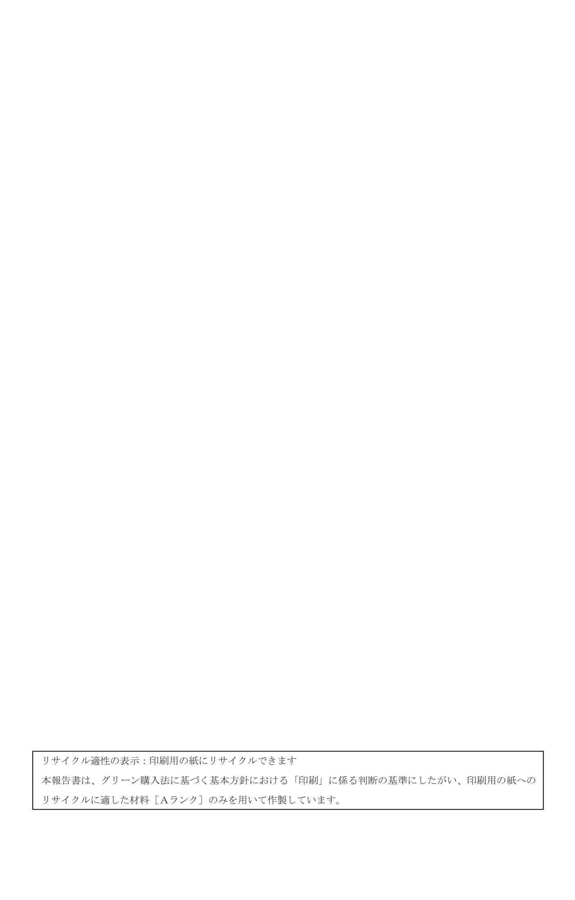